# The Religion of Ibrāhīm: Organized Evidence Bank

All statements are organized by subject, regardless of where they were collected. Export metadata, channel labels, dates, hashtags, and research-file divisions have been removed. When both source languages are available, the complete Arabic passage and Arabic citation appear first, followed by the complete English translation and English citation.

## 1. The religion of Ibrāhīm

### Al-Ṭabarī on the example of Ibrāhīm and those with him
<!-- evidence-id: 000001 -->

Show Arabic source text

يَقُولُ تَعَالَى ذِكْرُهُ لِلْمُؤْمِنِينَ بِهِ مِنْ أَصْحَابِ رَسُولِ اللَّهِ ﷺ: قَدْ كَانَتْ لَكُمْ أَيُّهَا الْمُؤْمِنُونَ قُدْوَةٌ حَسَنَةٌ فِي إِبْرَاهِيمَ خَلِيلِ الرَّحْمَنِ تَقْتَدُونَ بِهِ، وَالَّذِينَ مَعَهُ مِنْ أَنْبِيَاءِ اللَّهِ ... حِينَ قَالُوا لِقَوْمِهِمُ الَّذِينَ كَفَرُوا بِاللَّهِ وَعَبَدُوا الطَّاغُوتَ: أَيُّهَا الْقَوْمُ إِنَّا بُرَآءُ مِنْكُمْ، وَمِنَ الَّذِينَ تَعْبُدُونَ مِنْ دُونِ اللَّهِ مِنَ الْآلِهَةِ وَالْأَنْدَادِ.

وَقَوْلُهُ: كَفَرْنَا بِكُمْ، يَقُولُ: أَنْكَرْنَا مَا كُنْتُمْ عَلَيْهِ مِنَ الْكُفْرِ بِاللَّهِ وَجَحَدْنَا عِبَادَتَكُمْ مَا تَعْبُدُونَ مِنْ دُونِ اللَّهِ أَنْ تَكُونَ حَقًّا، وَظَهَرَ بَيْنَنَا وَبَيْنَكُمُ الْعَدَاوَةُ وَالْبَغْضَاءُ أَبَدًا عَلَى كُفْرِكُمْ بِاللَّهِ وَعِبَادَتِكُمْ مَا سِوَاهُ، وَلَا صُلْحَ بَيْنَنَا وَلَا هُوَادَةَ حَتَّى تُؤْمِنُوا بِاللَّهِ وَحْدَهُ ... فَتُفْرِدُوهُ بِالْعِبَادَةِ.

المصدر: ابن جرير الطبري، <em>جامع البيان</em>، 23/317، عند تفسير سورة الممتحنة، الآية 4.

**English**

Al-Ṭabarī explains that Allāh gave the believers a good example in Ibrāhīm and the prophets with him. They told their people, who disbelieved in Allāh and worshipped the ṭāghūt, that they were entirely free of them and of the deities and rivals they worshipped besides Allāh.

He explains “we have rejected you” to mean: “We reject the disbelief in Allāh upon which you remain, and we deny that your worship of anything besides Allāh is true. Enmity and hatred have appeared forever between us and you because of your disbelief in Allāh and your worship of other than Him. There will be no reconciliation or truce until you believe in Allāh alone and single Him out in worship.”

Source: Ibn Jarīr al-Ṭabarī, Jāmiʿ al-Bayān, 23/317, commentary on al-Mumtaḥanah 60:4.

### Ibn Taymiyyah on the agreement of the religious communities
<!-- evidence-id: 000002 -->

Show Arabic source text

المصدر: ابن تيمية، *مجموع الفتاوى*، 2/128.

وَكَذَلِكَ قَوْلُهُ: إنَّ الْمُشْرِكِينَ لَوْ تَرَكُوا عِبَادَةَ الْأَصْنَامِ لَجَهِلُوا مِنْ الْحَقِّ بِقَدْرِ مَا تَرَكُوا مِنْهَا، هُوَ مِنْ الْكُفْرِ الْمَعْلُومِ بِالِاضْطِرَارِ مِنْ جَمِيعِ الْمِلَلِ؛ فَإِنَّ أَهْلَ الْمِلَلِ مُتَّفِقُونَ عَلَى أَنَّ الرُّسُلَ جَمِيعَهُمْ نَهَوْا عَنْ عِبَادَةِ الْأَصْنَامِ، وَكَفَّرُوا مَنْ يَفْعَلُ ذَلِكَ، وَأَنَّ الْمُؤْمِنَ لَا يَكُونُ مُؤْمِنًا حَتَّى يَتَبَرَّأَ مِنْ عِبَادَةِ الْأَصْنَامِ وَكُلِّ مَعْبُودٍ سِوَى اللَّهِ.

**English**

“Likewise, his claim that if the mushrikīn abandoned the worship of idols, they would become ignorant of the truth to the degree that they abandoned it, is a form of disbelief whose falsehood is necessarily known among all religious communities. The people of the religious communities agree that all the Messengers prohibited the worship of idols and declared those who practiced it disbelievers, and that a believer does not become a believer until he disavows the worship of idols and every object worshipped besides Allāh.”

Source: Ibn Taymiyyah, Majmūʿ al-Fatāwā, 2/128.

This passage continues by citing al-Mumtaḥanah 60:4 and the declarations of Ibrāhīm عليه السلام against what his people worshipped.

<!-- telegram-source: dar/messages2.html#message1104 -->
<!-- evidence-id: 000003 -->

Sheikh al-Islam Ibn Taymiyyah said:

Similarly, his statement that if the polytheists were to abandon the worship of idols, they would still remain ignorant of the truth to the extent of what they had abandoned, is among the types of disbelief (kufr) that are universally and necessarily known to be false by all religious communities.

The people of all religions (meaning the Christian , Jews and Muslims) agree [by Ijmā] that all the messengers prohibited the worship of idols and declared those who practice it to be disbelievers. A believer is not considered truly faithful until he renounces the worship of idols and everything worshiped besides Allah.

As Allah, the Exalted, says: ‘You already have an excellent example in Abraham and those with him, when they said to their people, “We totally dissociate ourselves from you and ˹shun˺ whatever ˹idols˺ you worship besides Allah. We reject you. The enmity and hatred that has arisen between us and you will last until you believe in Allah alone’ [Al-Mumtaḥanah: 4]….

…This is more apparent and evident among the people of the various religions, such as the Jews and the Christians—let alone the Muslims—than needing to be supported by a specific text.

Whoever says that the idol worshipers, if they abandon them, would still be ignorant of the truth to the extent they have abandoned these idols, is more disbelieving than the Jews and the Christians And whoever does not declare them disbelievers is more disbelieving than the Jews and the Christians, for the Jews and Christians declare the idol worshipers to be disbelievers.

How then, can one claim that someone who abandons the worship of idols is ignorant of the truth to the same extent they have abandoned it?

Moreover, it is said: ‘The scholar knows whom they worshiped and in which form He appeared for them to worship.’ The differentiation and multiplicity in idols is similar to the different members of a visible form, or the different spiritual powers in an invisible form. But to worship anything other than Allah is far worse than the disbelief of idol worshipers.

The latter only took idols as intercessors and mediators, as they said: ‘We do not worship them except to bring us closer to Allah’ (Az-Zumar: 3). Allah, the Exalted, says: ‘Or have they taken gods besides Allah? Say: ‘What! Even though they have no power over anything and cannot reason?’’ (Az-Zumar: 43).

[Majmū al-Fatawā by Ibn Taymiyyah 2/128-129]

Show attached source scan

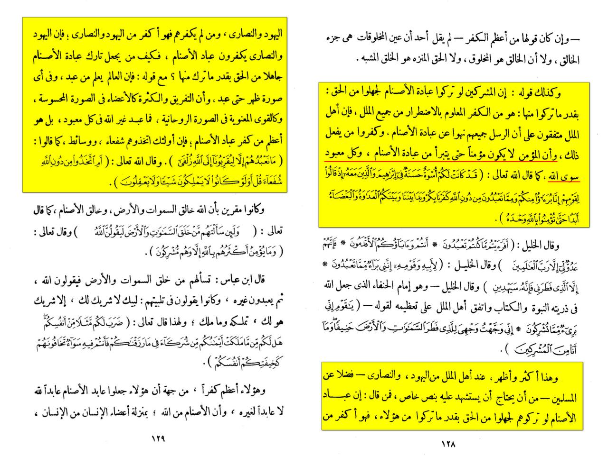

---

<!-- telegram-source: dar/messages4.html#message4082 -->
<!-- evidence-id: 000004 -->

Ibn Qayyim said:

And al-ikhlāṣ (Sincerity) is that one is sincere to Allāh in his speech, his actions, his will, and his intention.  And this is al-ḥanīfiyyah, the millah of Ibrāhīm, which Allāh commanded all His servants with, and He accepts nothing else from anyone.

And it is the reality of Islām: “And whoever seeks a religion other than Islām, it will never be accepted of him, and in the Hereafter he will be one of the losers” (Āl ʿImrān: 85). And it is the millah of Ibrāhīm, which whoever turns away from is among the most foolish of the foolish.

[al-Dāʾ wad-Dawāʾ by Ibn Qayyim p.313]

Show attached source scan

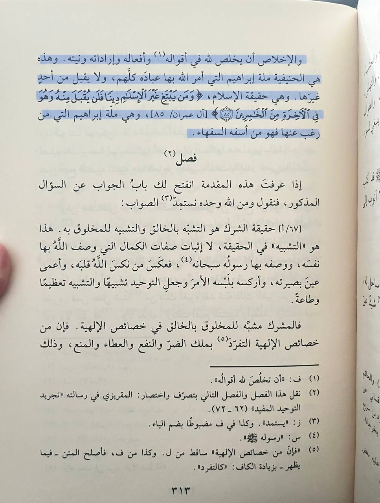

---

<!-- telegram-source: dar/messages2.html#message1994 -->
<!-- evidence-id: 000005 -->

Sheikh Muḥammad bin ʿAbd al-Wahhāb said:

“So we say: Lā ilāha illa Allāh is the firmest handhold; it is the word of piety; it is the pure monotheism—the religion of Ibrāhīm; it is the word that Allāh, the Almighty, made enduring among his descendants; it is the very purpose for which all creations were made; through it, the heavens and the earth exist; and for its sake, messengers were sent and scriptures were revealed.

Allāh, the Most High, says: ‘And I did not create the jinn and mankind except to worship Me.’ [Surah Adh-Dhāriyāt, 51:56] And He says: ‘And We certainly sent into every nation a messenger, [saying], “Worship Allāh and avoid Ṭāghūt.”’ [Surah An-Naḥl, 16:36].

What is meant is the true meaning of this phrase. As for merely pronouncing it with the tongue while being ignorant of its meaning, it does not benefit, for the hypocrites say it, yet they are in the lowest depths of Hell, below the disbelievers.”

[Ad-Durar as-Saniyyah 2/102]

Show attached source scan

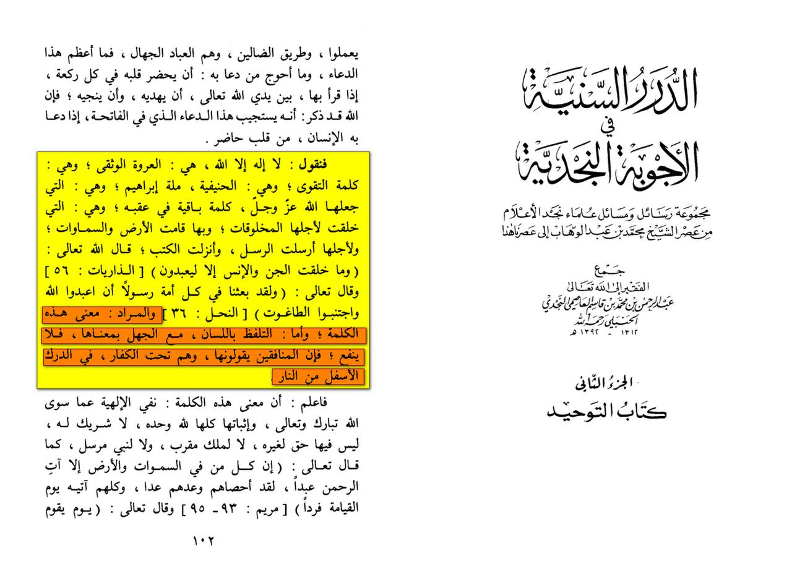

---

<!-- telegram-source: dar/messages5.html#message5019 -->
<!-- evidence-id: 000006 -->

Shaykh Sulaymān ibn Saḥmān said in a poem titled Naṣḥun wa Irshād (“Advice and Guidance”):

If you seek to be saved safely from the Fire,

and to be secured from a terrifying, dreadful Day.

And to attain gardens and wide-eyed maidens,

and to walk proudly clothed in garments of glory,

And in this world to live in ease,

honored, praised, attaining every desire.

Then follow the path of the religion of Ibrāhīm,

for it is the firmest handhold for the people of nearness.

So oppose the one who shows enmity, and ally with the one

who shows allegiance; hate for the sake of Allah and love.

For whoever does not oppose the mushrikīn, and those to whom

he gives allegiance, and does not hate them nor avoid them.

Then he is not upon the methodology of the Sunnah of Aḥmad,

nor upon a straight and rightly-guided path.

(Dīwān ʿUqūd al-Jawāhir)

Show attached source scan

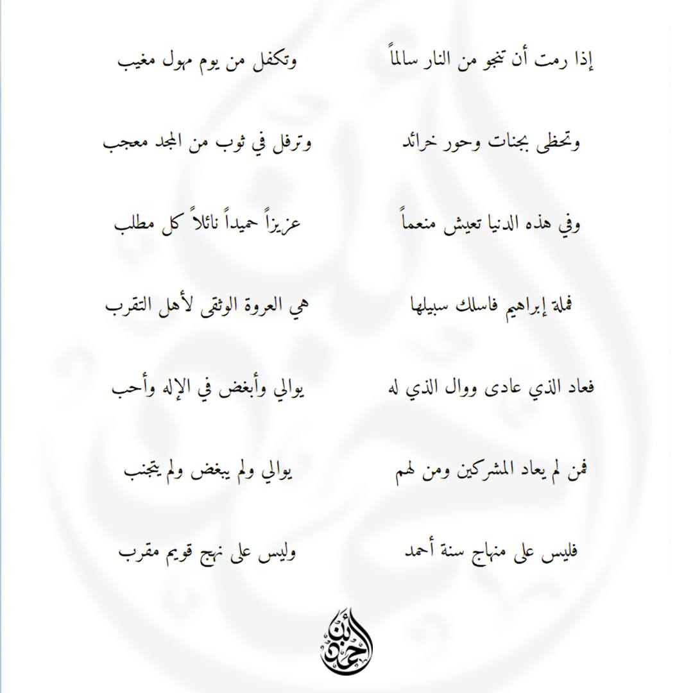

---

<!-- telegram-source: dar/messages4.html#message4153 -->
<!-- evidence-id: 000007 -->

Shaykh Ṣāliḥ Āl ash-Shaykh said:

This is the millah of Ibrāhīm, and this is al-ḥanīfiyyah, which Allāh commanded His Prophet ﷺ to hold fast to: “Then We revealed to you, [O Muḥammad], to follow the religion of Abraham, inclining toward truth” [an-Naḥl: 123]. The millah of Ibrāhīm is tawḥīd.

And if you understand this, then ʿibādah is not accepted except with tawḥīd. This is like purity for ṣalāh; for tawḥīd is a condition for the acceptance of ʿibādah —meaning ikhlāṣ. Purity is a condition for the validity of ṣalāh. Just as ṣalāh is not valid except with purity, so too is no one’s worship accepted unless they are muwaḥḥid and sincere.

Even if a person has marks of sujūd on their forehead, and is fasting during the day, and standing in prayer at night, the condition for its acceptance is that they are muwaḥḥid and sincere. Allāh says: “And it was already revealed to you and to those before you that if you should associate [anything] with Allāh, your work would surely become worthless, and you would surely be among the losers. Rather, worship [only] Allāh and be among the grateful.” [az-Zumar: 65–66].

And He says about the disbelievers: “And We will approach what they have done of deeds and make them as dust dispersed.” [al-Furqān: 23].

So abundant ʿibādah, even if great, if not accompanied by ikhlāṣ, is not accepted. Just as a man prays a long ṣalāh, prolonging standing, rukuʿ, and sujūd, and perfects it greatly, yet enters it without purity, this ṣalāh is not accepted by ijmāʿ, because purity is a condition for validity.

As confirmed in a sound ḥadīth, the Prophet ﷺ said: “Allāh does not accept the prayer of any of you if he becomes ritually impure until he performs ablution,” and He said: “No ṣalāh is accepted without purity, and no charity from unlawful gain is accepted.” This condition is agreed upon.

This illustrates this great matter: indeed, the condition of ikhlāṣ and tawḥīd for the acceptance of ʿibādah is greater than the condition of purity for the acceptance of ṣalāh. For if someone performs ṣalāh while ritually impure intentionally, there is a difference of opinion among the scholars. But if someone worships Allāh while being a mushrik, then by ijmāʿ, the worship is not accepted, and by ijmāʿ, they are kāfir, because they committed shirk al-akbar which invalidates all acts of worship.

[Sharḥ al-Qawāʿid al-Arbaʿ by Shaykh Ṣāliḥ Āl ash-Shaykh p.15-16]

Show attached source scan

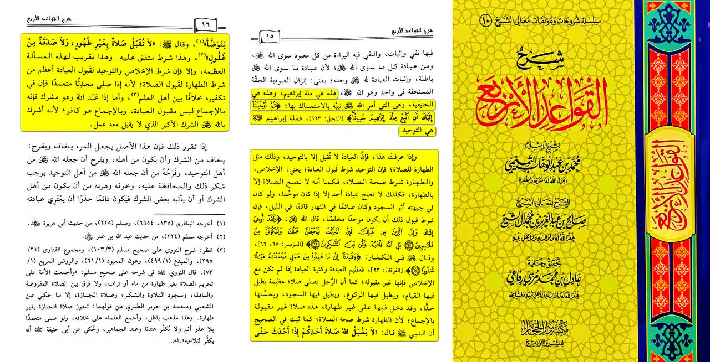

---

## 2. Loving and hating for the sake of Allāh

### Al-Ṭabarī on separating from the enemies of Allāh
<!-- evidence-id: 000008 -->

Show Arabic source text

يَقُولُ تَعَالَى ذِكْرُهُ: لَقَدْ كَانَ لَكُمْ أَيُّهَا الْمُؤْمِنُونَ قُدْوَةٌ حَسَنَةٌ فِي إِبْرَاهِيمَ وَالَّذِينَ مَعَهُ فِي هَذِهِ الْأُمُورِ الَّتِي ذَكَرْنَاهَا مِنْ مُبَايَنَةِ الْكُفَّارِ وَمُعَادَاتِهِمْ وَتَرْكِ مُوَالَاتِهِمْ، إِلَّا فِي قَوْلِ إِبْرَاهِيمَ لِأَبِيهِ: لَأَسْتَغْفِرَنَّ لَكَ.

فَكَذَلِكَ أَنْتُمْ أَيُّهَا الْمُؤْمِنُونَ بِاللَّهِ، فَتَبَرَّءُوا مِنْ أَعْدَاءِ اللَّهِ مِنَ الْمُشْرِكِينَ بِهِ، وَلَا تَتَّخِذُوا مِنْهُمْ أَوْلِيَاءَ حَتَّى يُؤْمِنُوا بِاللَّهِ وَحْدَهُ، وَيَتَبَرَّءُوا عَنْ عِبَادَةِ مَا سِوَاهُ، وَأَظْهِرُوا لَهُمُ الْعَدَاوَةَ وَالْبَغْضَاءَ.

المصدر: ابن جرير الطبري، <em>جامع البيان</em>، 23/318، عند تفسير سورة الممتحنة، الآية 4.

**English**

Al-Ṭabarī says that the believers have an excellent example in Ibrāhīm and those with him in separating from the disbelievers, opposing them, and abandoning allegiance to them, with the stated exception concerning Ibrāhīm’s promise to seek forgiveness for his father.

He continues: “Likewise, O believers in Allāh, disavow the mushrik enemies of Allāh. Do not take them as allies until they believe in Allāh alone, disavow the worship of everything besides Him, and openly show them enmity and hatred.”

Source: Ibn Jarīr al-Ṭabarī, Jāmiʿ al-Bayān, 23/318, commentary on al-Mumtaḥanah 60:4.

### Ibn Taymiyyah
<!-- evidence-id: 000009 -->

Show Arabic source text

المصدر: ابن تيمية، *مجموع الفتاوى*، 8/361.

وَأَيْضًا فَمِنْ تَمَامِ مَحَبَّةِ اللَّهِ وَرَسُولِهِ بُغْضُ مَنْ حَادَّ اللَّهَ وَرَسُولَهُ وَالْجِهَادُ فِي سَبِيلِهِ.

فَأَمَرَ الْمُؤْمِنِينَ أَنْ يَتَأَسَّوْا بِإِبْرَاهِيمَ وَمَنْ مَعَهُ حَيْثُ أَبْدَوْا الْعَدَاوَةَ وَالْبَغْضَاءَ لِمَنْ أَشْرَكَ حَتَّى يُؤْمِنُوا بِاللَّهِ وَحْدَهُ.

**English**

> “Part of the completion of loving Allāh and His Messenger is hating those who oppose Allāh and His Messenger and striving in His path.
>
> He commanded the believers to take Ibrāhīm and those with him as their example when they openly displayed enmity and hatred toward those who committed shirk, until they believed in Allāh alone.”

Source: Ibn Taymiyyah, *Majmūʿ al-Fatāwā*, 8/361.

<!-- telegram-source: personal/messages.html#message911 -->
<!-- evidence-id: 000010 -->

Shaykh Sulaymān ibn Saḥmān mentions Shaykh Muḥammad ibn ʿAbd al-Wahhāb said:

“If you understand this, then you will know that a person’s Islām is not sound, even if he worships Allah alone and abandons shirk, until he shows enmity toward the mushrikūn, openly declares his enmity and hatred toward them, as Allah, the Most High, said: “You will not find a people who believe in Allāh and the Last Day having affection for those who oppose Allāh and His Messenger” [al-Mujādilah: 22]

If you understand this well, you will realise that many of those who claim to follow the religion have neither known it nor understood it.

Otherwise, what was it that caused the Muslims to endure such torment, imprisonment, beatings, and migration to Abyssinia, even though the Prophet ﷺ was the most merciful of people? Had he found a concession for them, he would certainly have granted it to them.

How could he, when Allah revealed to him: “And of the people are some who say, "We believe in Allāh," but when one [of them] is harmed for [the cause of] Allāh, he considers the trial [i.e., harm] of the people as the punishment of Allāh.” [al-ʿAnkabūt: 10]

If this verse concerns one who merely agreed with them by his tongue because he was harmed, then what about something beyond that?” End quote (the saying of shaykh Muḥammad ibn ʿAbd al-Wahhāb).

It thus becomes clear that this was the state of the Messenger of Allah ﷺ at the beginning of the affair. Then, when Allah revealed to him: “So proclaim openly what you have been commanded and turn away from the mushrikūn” [al-Ḥijr: 94] he openly denounced their religion and declared their views to be foolish.

Then they prepared themselves, with full determination, in enmity toward him and his Companions.

Therefore, whoever shows enmity toward the enemies of Allah and His Messenger, openly takfirs them, and openly disavows them, they will inevitably become his enemies and harm him.

This was the condition of the Messenger of Allah ﷺ, his way, and his call to Allah. Yet despite that, he was the most merciful of people, the best of them in kindness and gentleness, and in calling to Allah.

And in the Messenger of Allah ﷺ we have an excellent example, as we have previously explained.

[Kashf ash-Shubhatayn by Shaykh Sulaymān ibn Saḥmān p.57-58]

Show attached source scan

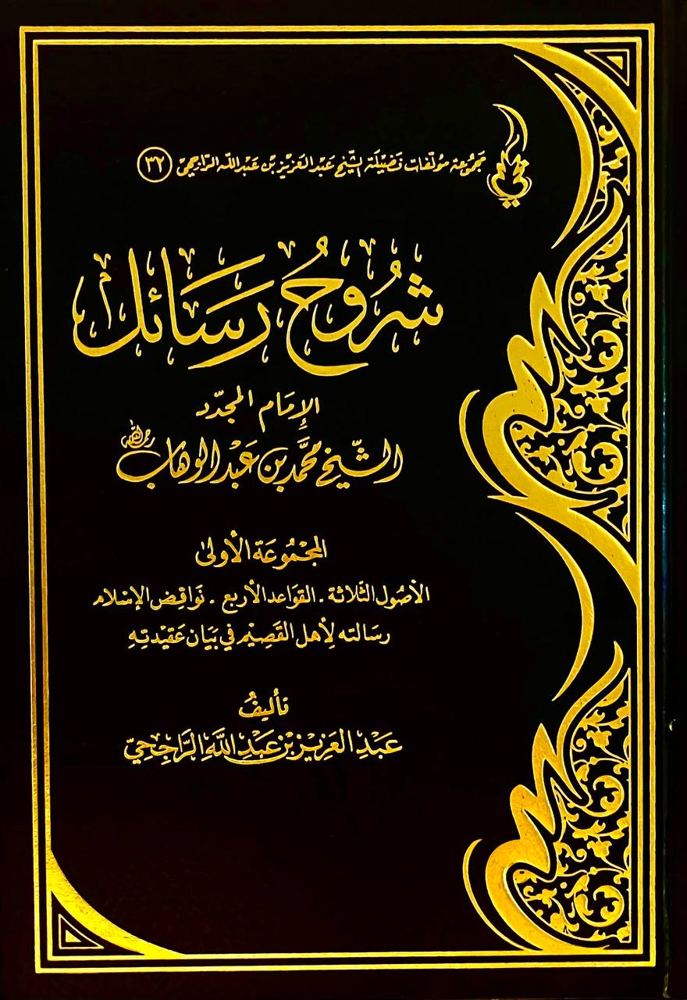

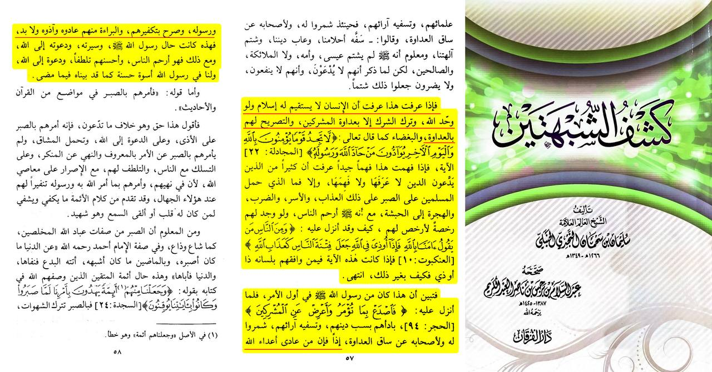

---

### ʿAbd al-Raḥmān ibn Ḥasan
<!-- evidence-id: 000011 -->

Show Arabic source text

المصدر: عبد الرحمن بن حسن، *الدرر السنية في الأجوبة النجدية*، 11/545.

وأجمع العلماء سلفا وخلفا، من الصحابة والتابعين، والأئمة، وجميع أهل السنة أن المرء لا يكون مسلما إلا بالتجرد من الشرك الأكبر، والبراءة منه وممن فعله، وبغضهم ومعاداتهم بحسب الطاقة، والقدرة، وإخلاص الأعمال كلها لله.

**English**

“The scholars, past and present, from the Companions, the Followers, the imāms, and all Ahl al-Sunnah, have unanimously agreed that a person is not a Muslim except by freeing himself from major shirk, disavowing it and those who commit it, hating and opposing them according to his capacity and ability, and devoting all deeds sincerely to Allāh.”

Source: ʿAbd al-Raḥmān ibn Ḥasan, al-Durar al-Saniyyah, 11/545.

### ʿAbd al-Laṭīf Āl al-Shaykh: inward enmity and openly displaying it are distinct
<!-- evidence-id: 000012 -->

Show Arabic source text

المصدر: عبد اللطيف آل الشيخ، *مجموعة الرسائل والمسائل النجدية*، 3/314.

وَمَسْأَلَةُ إِظْهَارِ الْعَدَاوَةِ غَيْرُ مَسْأَلَةِ وُجُودِ الْعَدَاوَةِ؛ فَالْأَوَّلُ يُعْذَرُ بِهِ مَعَ الْخَوْفِ وَالْعَجْزِ، لِقَوْلِهِ تَعَالَى: إِلَّا أَنْ تَتَّقُوا مِنْهُمْ تُقَاةً. وَالثَّانِي لَا بُدَّ مِنْهُ؛ لِأَنَّهُ يَدْخُلُ فِي الْكُفْرِ بِالطَّاغُوتِ، وَبَيْنَهُ وَبَيْنَ حُبِّ اللَّهِ وَرَسُولِهِ تَلَازُمٌ كُلِّيٌّ لَا يَنْفَكُّ عَنِ الْمُؤْمِنِ.

**English**

“The issue of openly displaying enmity is different from the existence of enmity itself. A person may be excused from the first because of fear and inability, due to His saying, ‘Unless you protect yourselves from them as a precaution.’ The second is indispensable because it is included in kufr biṭ-ṭāghūt, and it is inseparably connected to loving Allāh and His Messenger.”

Source: ʿAbd al-Laṭīf Āl al-Shaykh, Majmūʿat al-Rasāʾil wa-al-Masāʾil al-Najdiyyah, 3/314.

<!-- telegram-source: personal/messages.html#message560 -->
<!-- evidence-id: 000013 -->

Shaykh ʿAbd al-Laṭīf Āl ash-Shaykh said:

There is no disavowal from shirk and from the worship of anyone besides Allāh except by His Tawḥīd, and there is no Tawḥīd except by disavowal from every deity besides Allāh.

And just as it includes knowledge, it also includes action. It is not conceivable that there be testimony, submission, or performance of its meaning except with knowledge and action. And this, which we have established, is indicated by the expressions of the scholars among the linguists, the mufassirīn (exegetes), and others.”

[Fatḥ al-Malik al-Wahhāb fī Radd Shubha al-Murtāb by Shaykh ʿAbd al-Laṭīf Āl ash-Shaykh p.35]

Show attached source scan

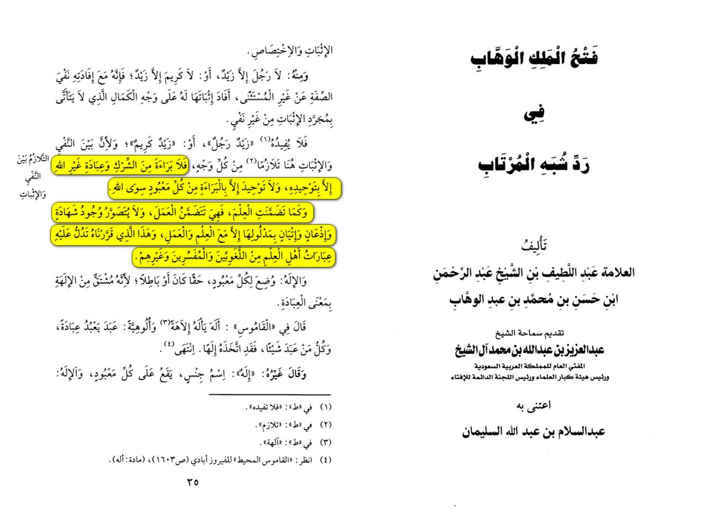

---

<!-- telegram-source: dar/messages3.html#message2742 -->
<!-- evidence-id: 000014 -->

What did the messengers bring?

Shaykh Ḥamad ibn ʿAtīq said:

the aṣl of the religion of all the messengers is the establishment of tawḥīd — loving it, loving its people, showing loyalty to them, rejecting shirk, declaring its people disbelievers (takfīr ahl al-shirk), hating them, and making enmity toward them manifest.

Just as the Exalted said: “There has already been for you a good example in Ibrāhīm and those with him, when they said to their people: Indeed, we disassociate from you and from whatever you worship besides Allāh. We have rejected you, and between us and you has appeared enmity and hatred forever — until you believe in Allāh alone.” (Sūrah al-Mumtaḥanah, 60:4)

And the meaning of His saying “وبدا” is: it became apparent and visible — that is, a clear and explicit declaration of ʿenmity and hatred against whoever does not single out his Lord with tawḥīd.

[Ad-Durar as-Saniyyah 8/418]

Show attached source scan

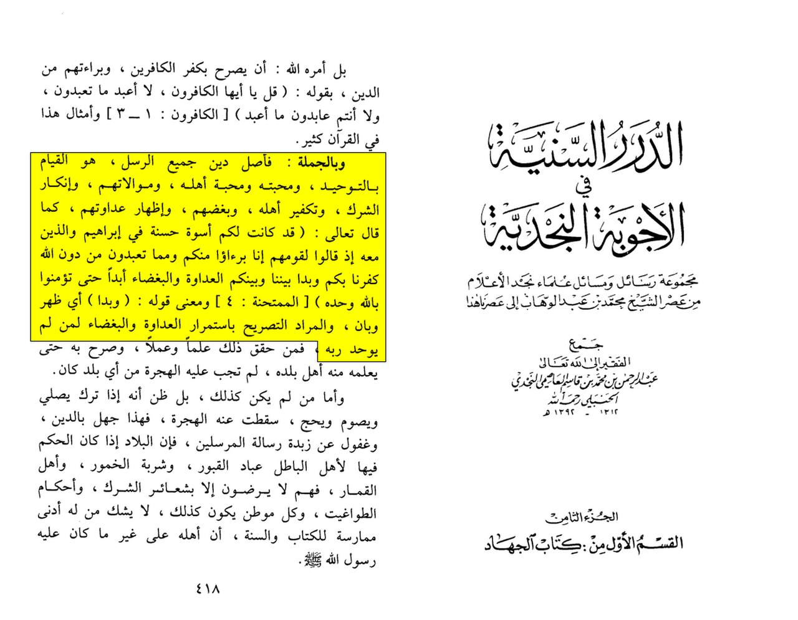

---

<!-- telegram-source: dar/messages5.html#message4783 -->
<!-- evidence-id: 000015 -->

Shaykh Sulaymān ibn Saḥmān said:

And the people of shirk have been described as kuffār in countless verses, so it is necessary to takfīr them. Also, this is what is necessitated by lā ilāha illa Allāh; its meaning is not complete except by takfīring the one who associates a partner with Allāh in His worship, as in the authentic ḥadīth: “Whoever says lā ilāha illa Allāh and disbelieves in what is worshipped besides Allāh, his wealth and his blood become inviolable, and his reckoning is with Allāh.”

His statement: “and disbelieves in what is worshipped besides Allāh” is a confirmation of the negation, so his blood and wealth are not inviolable except by that. So if he doubts or hesitates, his blood and wealth are not protected.

These matters are the completion of tawḥīd, because lā ilāha illa Allāh has been restricted in the ḥadīths with heavy conditions: knowledge, sincerity, truthfulness, certainty, and absence of doubt. So a person is not a muwaḥḥid except by the gathering of all of this, believing it, accepting it, loving it, showing enmity upon it, and allegiance.

Then after I clarified these words, I came across what he mentioned in al-qawl al-sadīd: that the pillars of īmān are three: statement by the tongue, belief in the heart, and action by the limbs.

So I said in astonishment: “I wish I knew… are Umayyah awake or asleep?”

So if this is the truth and you believe that they are the pillars of īmān, then how is it permissible for you to mention that the meaning of īmān in Allāh is that you believe that He is the deity worshipped, the One none deserves worship except Him.

While Shaykh al-Islām Muḥammad ibn ʿAbd al-Wahhāb mentioned in Kashf al-Shubuhāt that there is no disagreement that tawḥīd must be with the heart, the tongue, and action. If anything from this is missing, the man is not a Muslim.

And you did not mention in the meaning of īmān in Allāh in this place except one pillar, which is belief (iʿtiqād) only—while you know that the other two pillars are necessary, because a man is not a Muslim except by establishing these three pillars.

And it has preceded that the madhhab of the Jahmiyyah is mere affirmation only, and the statements of the imams of the salaf regarding the meaning of īmān have preceded—so it is necessary to return to what they mentioned and established.

Likewise, what you mentioned regarding the meaning of the ṭāghūt—that one believes the falsehood of worshipping other than Allāh—while it is known that along with that it is necessary to takfīr the one who commits shirk, to free oneself from him, and to openly declare enmity and hatred toward them. So reflect upon that, and Allāh is the One who grants success to what is correct.

[Tanbīh dhawī al-albāb al-salīmah ʿan al-wuqūʿ fī al-alfāẓ al-mubtadaʿah al-wakhīmah by Shaykh Sulaymān ibn Saḥmān p.72-73]

Show attached source scan

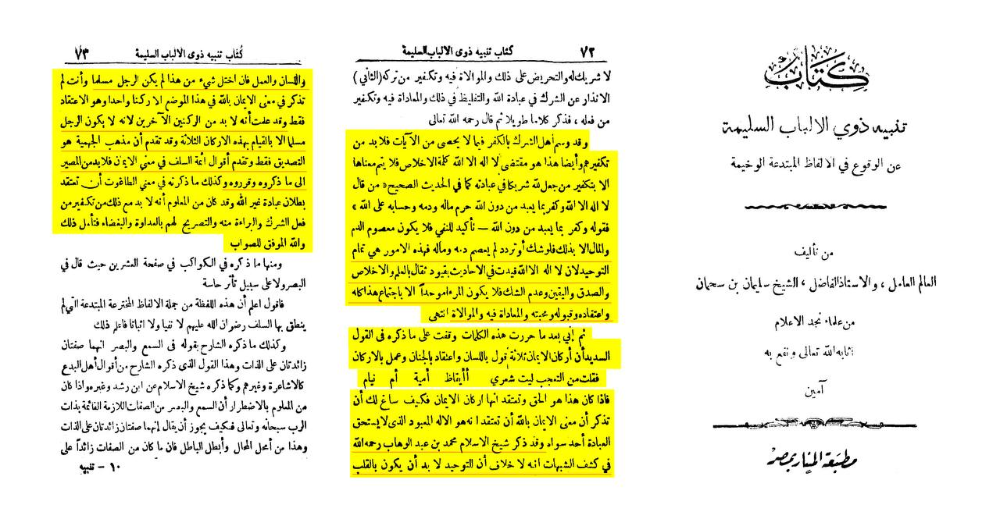

---

<!-- telegram-source: personal/messages.html#message523-message524 -->
<!-- evidence-id: 000016 -->

Shaykh Ṣāliḥ al-Fawzān was asked:

May Allah be good to you and bless you. This questioner says: Shaykh ʿAbd al-Raḥmān ibn Ḥasan (raḥimahu Allāh taʿālā) said in al-Durar al-Saniyyah, as follows: “The scholars — past and present, from the Companions, the Followers, the Imāms, and all the people of Sunnah — have unanimously agreed that a person is not a Muslim except by freeing himself from major shirk, disavowing it and those who commit it, hating them and opposing them according to one’s capacity and ability.”

We request clarification of what the Shaykh mentioned.

Answer: It is clear, my brother. The Shaykh’s words are clear and need no explanation. It is clear that a person is not a Muslim except by freeing himself from major shirk — except by freeing himself from shirk — and a mushrik is not a Muslim. He is saying this because… “and disavowing it and those who commit it” — meaning disavowing the mushrikīn — disavowing shirk and the mushrikīn, and hating them and opposing them according to one’s capacity and ability. Yes, al-barāʾah means hating them and opposing them; this is the meaning of disavowing them.

As for saying you disavow them while loving them — that is a lie; it is not barāʾah. Yes, because in these times there are those who claim affiliation with Salafiyyah who say that this is the madhhab of the Khawārij and the Muʿtazilah. You — you are from the Khawārij, The one who says this statement is from the Khawārij. This is the truth. This is not the doctrine of the Khawārij — this is the doctrine of Ahl al-Sunnah wa’l-Jamāʿah. Yes.

And we request from you — even for the ṭullāb al-ʿilm (students of knowledge) — to read the books of the Imāms of the Najdī daʿwah, may Allah have mercy on them with His vast mercy. We request from you, the students of knowledge, to read the books of the Imāms of the Najdī daʿwah, may Allah have mercy on them with His vast mercy, and to abandon the contemporary books that promote irjāʾ.

It is obligatory to read the books of Ahl al-Sunnah from the scholars of the daʿwah in the land of Najd and others — whether the verifying scholars are from Najd or from elsewhere. We must read their words, take heed from them, and act upon them. And as for Najd, they are only followers of those who preceded; they did not originate anything from themselves. They are followers of those who preceded them from the salaf al-ṣāliḥ. So we do not limit ourselves to the people of Najd, but every Salafī and every verifying scholar from Najd or others — we take him as an example and take knowledge from him. Yes.

<video class="source-video" controls preload="metadata" src="assets/videos/fawzan-baraah-major-shirk.mov"></video>

Arabic video source from the user’s Telegram export.

---

<!-- telegram-source: personal/messages.html#message554 -->
<!-- evidence-id: 000017 -->

Shaykh Ṣāliḥ al-Fawzān said:

As for the one who worships Allah but also worships others alongside Him, this person has not truly realized lā ilāha illā Allāh, even if he utters it with his tongue. The one who says lā ilāha illā Allāh but then goes to graves, seeks needs from them, rubs himself with them, seeks help from them, or circumambulates them, has not purified himself from shirk.

Thus, lā ilāha illā Allāh does not benefit him, even if he repeats it with every breath. Lā ilāha illā Allāh is not merely a phrase to be spoken; it has implications, meanings, and requirements that must be realized—worship of Allah alone and disavowal of shirk and mushrikīn.

Whoever does not disavow shirk has not truly realized lā ilāha illā Allāh, even if he utters it or makes for himself morning and evening litanies, carries a rosary of great length to glorify Allah, or repeats litanies containing lā ilāha illā Allāh thousands of times. This does not benefit him until he follows what Ibrāhīm عليه السلام did—purifying himself from shirk.

[Iʿānat al-Mustafīd bi-Sharḥ Kitāb at-Tawḥīd by al-ʿAllāmah Shaykh Ṣāliḥ al-Fawzān p.172-173]

Show attached source scan

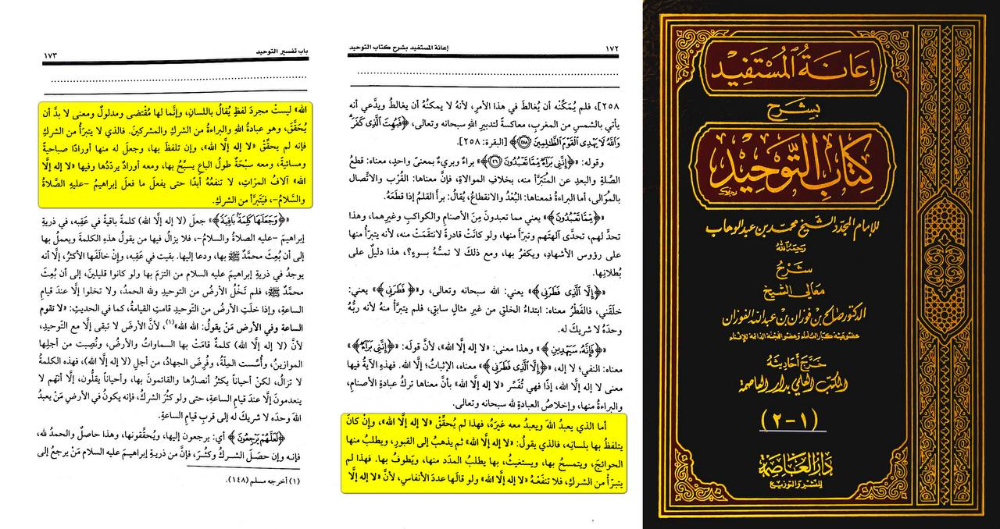

---

### Ṣāliḥ al-Fawzān
<!-- evidence-id: 000018 -->

“It is not enough for a person to worship Allāh alone; he must also avoid the ṭāghūt. If he dies while his worship is mixed with shirk, then that worship becomes invalid.

He must also disassociate himself from shirk and from the mushrikīn, showing enmity toward them for the sake of Allāh. If he approves of them in their shirk and does not disassociate from them, then his tawḥīd does not benefit him.

The verse, ‘And avoid the ṭāghūt,’ encompasses both abandoning the worship of the ṭāghūt and expressing barāʾah from those who worship the ṭāghūt.”

Source: Ṣāliḥ al-Fawzān, al-Taʿlīq al-Mukhtaṣar al-Mubayyan ʿalā Qurrat ʿUyūn al-Muwaḥḥidīn, p. 18.

Show attached Arabic source scan

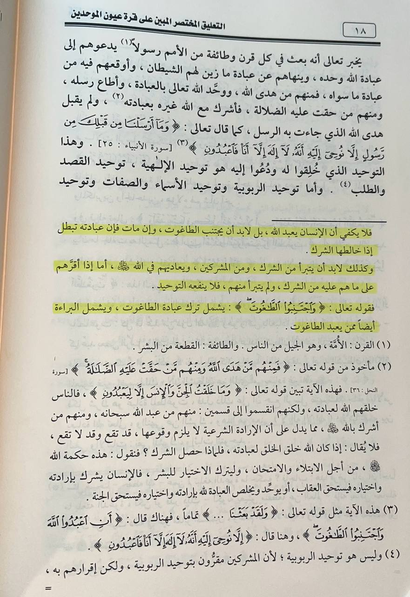

<!-- telegram-source: dar/messages4.html#message4118 -->
<!-- evidence-id: 000019 -->

Shaykh ar-Rājihī said:

His statement: “Whoever bears witness that lā ilāha illā Allāh” — meaning: he affirms this statement, speaks it while knowing its meaning, and acts upon what it entails inwardly and outwardly. Thus, the shahāda necessarily requires ʿilm (knowledge), certainty, and acting upon what it indicates.

As Allāh the Exalted says: "Know that there is no deity except Allāh" (Muḥammad :19). And He, Glorified, says: "But only those who testify to the truth [can benefit], and they know" (al-Zukhruf :86).

As for merely pronouncing it without knowledge of its meaning, without certainty, and without acting upon what it requires — namely, disavowal from shirk and ikhlāṣ (sincerity) in speech and action — then it is not beneficial, by ijmāʿ.

[at-Tanḍīd Sharḥ Kitāb at-Tawḥīd by Shaykh ʿAbd al-ʿAzīz ar-Rājihī p.34]

Show attached source scan

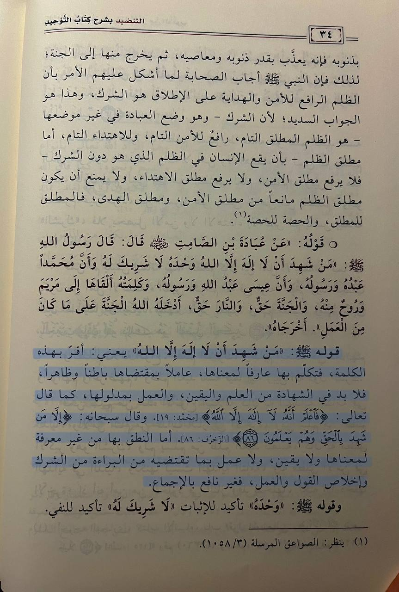

---

<!-- telegram-source: dar/messages5.html#message4934 -->
<!-- evidence-id: 000020 -->

Shaykh Ṣāliḥ Āl ash-Shaykh said:

Al-walāʾ wa al-barāʾ (Loyalty and Disavowal) is the meaning of the word of tawḥīd. The reality of theword of tawḥīd is al-walāʾ wa al-barāʾ. A man from the students of knowledge asked Shaykh ʿAbd al-Laṭīf ibn ʿAbd al-Raḥmān ibn Ḥasan.

He asked him: is al-walāʾ wa al-barāʾ from the necessary implication of the word of tawḥīd, or is it something outside of it, meaning an independent obligation? So he replied: I feel sorry for the knowledge that you have, that you did not know the place of al-walāʾ wa al-barāʾ in the religion of Allāh. Al-walāʾ wa al-barāʾ is itself lā ilāha illa Allāh Muḥammad rasūl Allāh.

The word of tawḥīd is walāʾ (loyalty) and barāʾ (disavowal). He (Allah) said in Sūrat al-Zukhruf: “when Abraham said to his father and his people, "Indeed, I am disassociated from that which you worship, Except for He who created me; and indeed, He will guide me.". And he made it [i.e. Lâ ilâha illallâh (none has the right to be worshipped but Allâh Alone)] a Word lasting among his offspring.”

The word that was made lasting among the offspring of Ibrāhīm is the word of tawḥīd: lā ilāha illa Allāh. And its explanation is His statement: “Indeed, I am disassociated from that which you worship, Except for He who created me.” barāʾah from the objects of worship, from shirk and kufr, and walāʾ to Allāh, His religion, and His tawḥīd.

Al-walāʾ wa al-barāʾ means love and hatred. The obligatory portion of it—such that whoever loses it has lost Islām—is that he frees himself from shirk, meaning he hates shirk, and that he allies himself with tawḥīd, meaning he loves tawḥīd; that he frees himself from what the mushrikūn worship, meaning he hates the objects of worship, as in the statement:

“Indeed, I am disassociated from that which you worship,” meaning hating what you worship, except the One who created me—then he is not free from Him, rather he loves Him. So it is love for Allāh and hatred of the false deities. Of course, if they are worshipped while being pleased, or they are idols and ṭawāghīt and the like.

Love for Islam and hatred for shirk, This is the necessary minimum. Whoever does not love Islām is not upon tawḥīd. Whoever loves Islām and loves shirk has broken his walāʾ and barāʾ.

After that there are matters which are obligatory, but leaving them is a sin; leaving them does not nullify tawḥīd—such as loving the people of Islām and hating the people of shirk, meaning the individuals among the mushrikīn. If one does not hate the individuals of the mushrikīn specifically, then there is detail in that, and the discussion on it can be lengthy, because al-barāʾah and al-walāʾ wa al-barāʾ require a long explanation.

The point of the question is to properly define al-walāʾ wa al-barāʾ, the abandonment of which is kufr. The obligatory walāʾ which is from Islām and tawḥīd—rather it is Islām and tawḥīd—is love: love of Islām and love of Allāh. And al-barāʾ, which is its counterpart, is hatred—hatred of the objects of worship of the mushrikīn. This is a level that whoever does not bring it has not come with Islām, because he has nullified the foundation of al-walāʾ wa al-barāʾ.

---

### Ṣāliḥ Āl al-Shaykh
<!-- evidence-id: 000021 -->

“The phrase, ‘disavowal from shirk and its people,’ has been explained in several ways, concerning its root and its branches. The root of barāʾah is hatred in the heart, meaning hatred of shirk and its people.

What follows that hatred is showing enmity toward them, declaring as disbelievers those whom Allāh and His Messenger declared disbelievers, declaring the mushrikīn disbelievers, and fighting them when that is legislated.

This is also the meaning of kufr biṭ-ṭāghūt. Disbelief in the ṭāghūt is to hate it, show enmity toward its people, declare the people of the ṭāghūt disbelievers, meaning those who worship other than Allāh, and fight them when that is legislated.

The root of barāʾah from shirk is hatred. Several matters follow that hatred:

First: enmity.

Second: takfīr. It is known that takfīr follows knowledge.

Third: fighting them when that is legislated, and that also requires knowledge.

It therefore becomes clear that ordinary people, meaning those who are not scholars, are responsible for the root of barāʾah, which is hatred. As for its branches, they follow the degree of knowledge. Hatred is necessary. A person must hate shirk. If he does not hate shirk, he is not a Muslim. If he loves Islam and its people and loves tawḥīd and its people, but does not hate shirk and its people, then he is not a Muslim.

However, he may hate shirk and the people of shirk in principle, yet love particular mushrikīn for some worldly reason. Such a person is not a mushrik, but his Islam is deficient, as was previously explained when distinguishing loyalty from alliance.

The intended point is that the root of barāʾah from shirk and its people is hatred. Several matters follow it: enmity, takfīr, and fighting. All of these depend upon knowledge and differ according to people.”

Source: Ṣāliḥ Āl al-Shaykh, Sharḥ Thalāthat al-Uṣūl, pp. 137–138.

## 3. Kufr biṭ-ṭāghūt

### Al-Ṭabarī and the Salaf on the meaning of ṭāghūt
<!-- evidence-id: 000022 -->

Show Arabic source text

قَالَ عُمَرُ بْنُ الْخَطَّابِ: الطَّاغُوتُ الشَّيْطَانُ.

وَقَالَ مُجَاهِدٌ: الطَّاغُوتُ الشَّيْطَانُ. وَقَالَ الشَّعْبِيُّ: الطَّاغُوتُ الشَّيْطَانُ. وَقَالَ قَتَادَةُ: الطَّاغُوتُ الشَّيْطَانُ.

وَالصَّوَابُ مِنَ الْقَوْلِ عِنْدِي فِي الطَّاغُوتِ أَنَّهُ كُلُّ ذِي طُغْيَانٍ طَغَى عَلَى اللَّهِ فَعُبِدَ مِنْ دُونِهِ، إِمَّا بِقَهْرٍ مِنْهُ لِمَنْ عَبَدَهُ، وَإِمَّا بِطَاعَةٍ مِمَّنْ عَبَدَهُ لَهُ؛ إِنْسَانًا كَانَ ذَلِكَ الْمَعْبُودُ، أَوْ شَيْطَانًا، أَوْ وَثَنًا، أَوْ صَنَمًا، أَوْ كَائِنًا مَا كَانَ مِنْ شَيْءٍ.

فَتَأْوِيلُ الْكَلَامِ إِذَنْ: فَمَنْ يَجْحَدُ رُبُوبِيَّةَ كُلِّ مَعْبُودٍ مِنْ دُونِ اللَّهِ فَيَكْفُرْ بِهِ، وَيُؤْمِنْ بِاللَّهِ، يَقُولُ: وَيُصَدِّقْ بِاللَّهِ أَنَّهُ إِلَهُهُ وَرَبُّهُ وَمَعْبُودُهُ دُونَ غَيْرِهِ، فَقَدِ اسْتَمْسَكَ بِالْعُرْوَةِ الْوُثْقَى.

المصدر: ابن جرير الطبري، <em>جامع البيان</em>، 4/556–559، عند تفسير سورة البقرة، الآية 256.

**English**

ʿUmar ibn al-Khaṭṭāb, Mujāhid, al-Shaʿbī, and Qatādah are each reported to have said: “The ṭāghūt is Satan.”

Al-Ṭabarī then gives his preferred comprehensive definition: “The correct view concerning the ṭāghūt, in my judgment, is that it is every transgressor against Allāh who is worshipped besides Him, whether he compels the worshipper or the worshipper obeys him, and whether that object of worship is a human being, a devil, an idol, an image, or anything else.”

He explains the verse to mean that whoever denies the lordship of every object worshipped besides Allāh, rejects it, and believes that Allāh alone is his deity, Lord, and object of worship has grasped the firmest handhold.

Source: Ibn Jarīr al-Ṭabarī, Jāmiʿ al-Bayān, 4/556–559, commentary on al-Baqarah 2:256.

<!-- telegram-source: dar/messages2.html#message1908 -->
<!-- evidence-id: 000023 -->

Sheikh al-Islam Ibn Taymiyyah said:

Worshiping Allah alone is the foundation of religion and the essence of tawḥīd, which Allah sent the messengers with and revealed the scriptures for. Allah says: “And ask those We sent before you of Our messengers: Did We ever appoint gods to be worshiped besides the Most Merciful?” (Al-Zukhruf 43:45) And He says: “And We certainly sent into every nation a messenger, (saying), ‘Worship Allah and avoid ṭāghūt.’” (Al-Naḥl 16:36) And He says: “And We did not send before you any messenger except that We revealed to him, ‘There is no deity except Me, so worship Me.’” (Al-Anbiyāʾ 21:25)

The Prophet ﷺ firmly established tawḥīd and taught it to his ummah. When a man once said to him, “Whatever Allah wills and you will,” the Prophet responded: “Have you made me a rival to Allah? Rather, (say) whatever Allah alone wills.” He also said: “Do not say: ‘Whatever Allah and Muhammad will,’ but say: ‘Whatever Allah wills, then Muhammad.’” He forbade swearing by anything other than Allah, saying: “Whoever is to take an oath, let him swear by Allah or remain silent.” And: “Whoever swears by anything other than Allah has committed shirk.”

He also warned against excessive veneration, saying: “Do not exaggerate in praising me as the Christians praised Jesus, the son of Mary. I am only a servant, so say: ‘The servant of Allah and His Messenger.’” For this reason, the scholars unanimously agreed that no one is allowed to swear by a created being, such as the Ka‘bah or anything else.

The Prophet ﷺ forbade prostrating to him. When one of his companions prostrated to him, he prohibited it, saying: “Prostration is only for Allah.” He also said: “If I were to command anyone to prostrate to another, I would have commanded women to prostrate to their husbands.” He said to Mu‘ādh ibn Jabal (رضي الله عنه): “If you were to pass by my grave, would you prostrate to it?” Mu‘ādh replied: “No.” The Prophet ﷺ said: “Then do not prostrate to me.” He also forbade taking graves as places of worship. In his final illness, he said: “May Allah curse the Jews and Christians; they took the graves of their prophets as places of worship,” warning against their actions.

In an authentic narration, the Prophet ﷺ said five days before his passing: “Those who came before you used to take graves as places of worship. Do not take my grave as a place of festivity. Do not turn your houses into graves. Send blessings upon me wherever you are, for your prayers reach me.” For this reason, the imams of Islam unanimously agreed that it is not legislated to build mosques over graves or to pray at them. Many scholars even state that prayers performed there are invalid. One of the greatest causes of idol worship throughout history has been the excessive veneration of graves through acts of worship. Allah says: “And they said: ‘Do not abandon your gods! Do not abandon Wadd, nor Suwā‘, nor Yaghūth, nor Ya‘ūq, nor Nasr!’” (Nūḥ 71:23)

A group of the salaf explained that these were the names of righteous men. When they died, people gathered around their graves, then eventually made images of them, and later worshiped them. Similarly, ṭawāf, prayer, and acts of worship should only be performed in the houses of Allah—the mosques that He has commanded to be elevated and where His name is remembered. No houses of human beings should be made into places of worship or gathering, as the Prophet ﷺ said: “Do not take my grave as a place of festivity.”

All of this is to establish tawḥīd, which is the foundation and core of the religion. Without it, Allah does not accept any deed. With it, He forgives sins—but He does not forgive those who associate partners with Him. As Allah says: “Indeed, Allah does not forgive associating others with Him, but He forgives what is less than that for whom He wills. And whoever associates others with Allah has certainly fabricated a tremendous sin.” (Al-Nisāʾ 4:48)

[Majmū' al-Fatāwā by Ibn Taymiyyah 3/397-400]

Show attached source scan

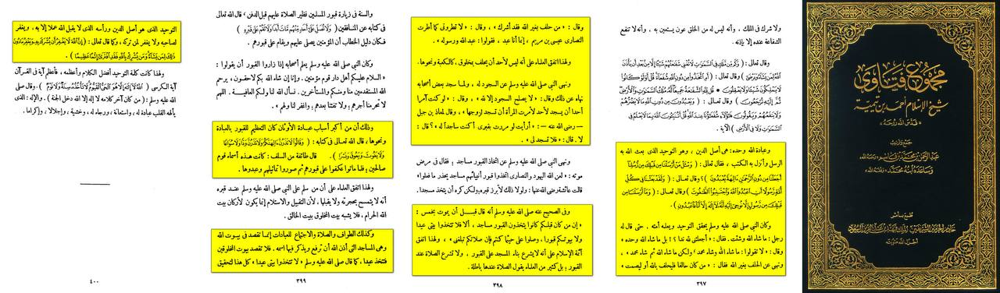

---

<!-- telegram-source: dar/messages3.html#message2579 -->
<!-- evidence-id: 000024 -->

Shaykh Muḥammad bin ʿAbd al-Wahhāb said:

As for the description of kufr biṭ-ṭāghūt (disbelieving in the ṭāghūt): it is to believe in the falsehood of worshipping anything besides Allah, to abandon such worship, to hate it, to declare those who practice it to be disbelievers, and to show enmity toward them.

And the meaning of al-īmān billāh (faith in Allah): it is to believe that Allah alone is the true deity worthy of worship, to devote all forms of worship entirely to Him, to negate worship from anything besides Him, to love the people of sincerity and ally with them, and to hate the people of shirk and oppose them.

This is the millah of Ibrāhīm — the one who turns away from it only fools himself. And this is the example Allah spoke of in His words:

“Indeed, there has been for you an excellent example in Ibrāhīm and those with him, when they said to their people, ‘Indeed, we are free from you and whatever you worship besides Allah. We have disbelieved in you, and between us and you, enmity and hatred has appeared forever until you believe in Allah alone.’” [al-Mumtaḥanah: 4]

As for aṭ-ṭāghūt: it is a general term for everything worshipped besides Allah. So, anything worshipped besides Allah — and is pleased with that worship — whether a deity, a leader followed, or someone obeyed in defiance of the command of Allah and His Messenger, then it is a ṭāghūt.

[Ad-Durar as-Saniyyah 1/161]

Show attached source scan

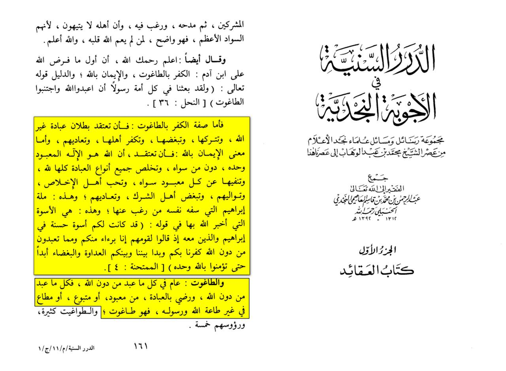

---

### Kitāb al-Tawḥīd
<!-- evidence-id: 000025 -->

Show Arabic source text

المصدر: محمد بن عبد الوهاب، *كتاب التوحيد*، ص. 9 في النسخة المحلية.

السَّابِعَةُ: الْمَسْأَلَةُ الْكَبِيرَةُ: أَنَّ عِبَادَةَ اللَّهِ لَا تَحْصُلُ إِلَّا بِالْكُفْرِ بِالطَّاغُوتِ، فَفِيهِ مَعْنَى قَوْلِهِ: فَمَنْ يَكْفُرْ بِالطَّاغُوتِ وَيُؤْمِنْ بِاللَّهِ فَقَدِ اسْتَمْسَكَ بِالْعُرْوَةِ الْوُثْقَى.

**English**

“The seventh, which is the great matter: worship of Allāh is not realized except through disbelief in the ṭāghūt. This contains the meaning of His saying, ‘Whoever disbelieves in the ṭāghūt and believes in Allāh has grasped the firmest handhold.’”

Source: Muḥammad ibn ʿAbd al-Wahhāb, Kitāb al-Tawḥīd, p. 9 in the local library edition.

### Faith is not attained without kufr biṭ-ṭāghūt
<!-- evidence-id: 000026 -->

Show Arabic source text

المصدر: محمد بن عبد الوهاب، *الدرر السنية في الأجوبة النجدية*، 1/163.

وَاعْلَمْ أَنَّ الْإِنْسَانَ مَا يَصِيرُ مُؤْمِنًا بِاللَّهِ إِلَّا بِالْكُفْرِ بِالطَّاغُوتِ.

**English**

“Know that a person does not become a believer in Allāh except through disbelief in the ṭāghūt.”

Source: Muḥammad ibn ʿAbd al-Wahhāb, al-Durar al-Saniyyah, 1/163.

### Muḥammad ibn ʿAbd al-Wahhāb: full definition
<!-- evidence-id: 000027 -->

Show Arabic source text

المصدر: محمد بن عبد الوهاب، *الدرر السنية في الأجوبة النجدية*، 1/161.

فَأَمَّا صِفَةُ الْكُفْرِ بِالطَّاغُوتِ فَأَنْ تَعْتَقِدَ بُطْلَانَ عِبَادَةِ غَيْرِ اللَّهِ، وَتَتْرُكَهَا، وَتُبْغِضَهَا، وَتُكَفِّرَ أَهْلَهَا، وَتُعَادِيَهُمْ. وَأَمَّا مَعْنَى الْإِيمَانِ بِاللَّهِ فَأَنْ تَعْتَقِدَ أَنَّ اللَّهَ هُوَ الْإِلَهُ الْمَعْبُودُ وَحْدَهُ دُونَ مَنْ سِوَاهُ، وَتُخْلِصَ جَمِيعَ أَنْوَاعِ الْعِبَادَةِ كُلَّهَا لِلَّهِ، وَتَنْفِيَهَا عَنْ كُلِّ مَعْبُودٍ سِوَاهُ، وَتُحِبَّ أَهْلَ الْإِخْلَاصِ وَتُوَالِيَهُمْ، وَتُبْغِضَ أَهْلَ الشِّرْكِ وَتُعَادِيَهُمْ؛ وَهَذِهِ مِلَّةُ إِبْرَاهِيمَ الَّتِي سَفِهَ نَفْسَهُ مَنْ رَغِبَ عَنْهَا.

**English**

“As for the description of disbelief in the ṭāghūt, it is that you believe in the falsehood of worshipping other than Allāh, abandon it, hate it, declare its people disbelievers, and oppose them. As for the meaning of faith in Allāh, it is that you believe Allāh alone is the deity worthy of worship, sincerely devote every kind of worship to Allāh, and deny it to every object of worship besides Him. You love and ally with the people of sincerity, and you hate and oppose the people of shirk. This is the religion of Ibrāhīm, and whoever turns away from it has made a fool of himself.”

Source: Muḥammad ibn ʿAbd al-Wahhāb, al-Durar al-Saniyyah, 1/161.

<!-- telegram-source: dar/messages5.html#message4899 -->
<!-- evidence-id: 000028 -->

Shaykh Sulaymān ibn ʿAbd Allāh Āl ash-Shaykh said:

And He, the Most High, said: “Say (O Muhammad): "I am commanded only to worship Allâh (Alone) and not to join partners with Him. To Him (Alone) I call and to Him is my return." [ar-Raʿd: 36] This verse is the meaning of lā ilāha illā Allāh, for it contains negation and affirmation, just as lā ilāha illā Allāh contains them.

In His statement: “worship Allah” is the affirmation, and in His statement: “avoid the ṭāghūt” is the negation. So the verse indicates that Islam requires both negation and affirmation: affirming worship for Allah alone, and negating worship of anything besides Him. This is tawḥīd, which is contained in Sūrat Qul yā ayyuhā al-kāfirūn.

And this is the meaning of His statement: “Whoever disbelieves in Tāghūt and believes in Allâh, then he has grasped the most trustworthy handhold that will never break. And Allâh is All-Hearer, All-Knower.” [al-Baqarah: 256]

Ibn al-Qayyim said: The method of the Qurʾān in this is to combine negation with affirmation: it negates worship of anything besides Allah and affirms His worship. This is the reality of tawḥīd. Pure negation alone is not tawḥīd, and affirmation without negation is not tawḥīd. Tawḥīd is only that which includes both negation and affirmation—and this is the reality of lā ilāha illā Allāh. End quote.

Included in kufr biṭ-ṭāghūt is hating it (the ṭāghūt), disliking it, and not being pleased with its worship in any way.

The verse indicates:

1. That the wisdom in sending the messengers is the worship of Allah alone and abandoning worship of anything besides Him.

2. That the foundation of the religion of the prophets is one: ikhlāṣ (sincerity) in worship to Allah, even if their laws differ, as He said: “To each among you, We have prescribed a law and a clear way”

3. That action is required in īmān, as a refutation against the Murjiʾah.

[Taysīr al-ʿAzīz al-Ḥamīd by Shaykh Sulaymān ibn ʿAbd Allāh Āl ash-Shaykh p.30]

Show attached source scan

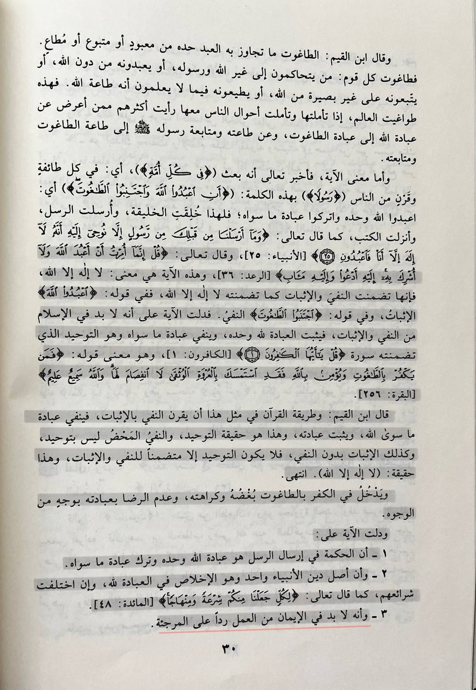

---

### Disavowal from shirk and tawḥīd necessarily accompany one another
<!-- evidence-id: 000029 -->

“There is no disavowal from shirk and from the worship of anyone besides Allāh except through His tawḥīd, and there is no tawḥīd except through disavowal from every deity besides Allāh.”

Source: ʿAbd al-Laṭīf Āl al-Shaykh, Fatḥ al-Malik al-Wahhāb fī Radd Shubhat al-Murtāb, p. 35.

<!-- telegram-source: personal/messages.html#message539 -->
<!-- evidence-id: 000030 -->

Shaykh Muḥammad ibn Ibrāhīm Āl ash-Shaykh said:

“The seventh — the great issue — "is that the worship of Allah does not occur", nor is it conceivable for anyone, nor does anyone among the creation attain it, "except with kufr biṭ-ṭāghūt" (Disbelief in false deities). It is only attained when one disbelieves in the ṭāghūt.

The author derived this from "Worship Allah and avoid the ṭāghūt" (an-Naḥl: 36). For the verse indicates two matters: that you worship Allah and avoid the ṭāghūt. Thus it indicates two commands, the first being connected with the second.

Your attentiveness to the secret in that is that many people think that mere acknowledgment alone, or action alone, is sufficient. But the texts are contrary to that.

Rather, the verse indicates another matter: belief and testimony that the worship of other than Allah is kufr and misguidance. So whenever a person hesitates—even out of caution—his blood and wealth are not protected. Hence comes His statement: "Whoever disbelieves in ṭāghūt and believes in Allâh, then he has grasped the most trustworthy handhold" (al-Baqarah: 256).

From that it follows the takfīr of the mushrikīn. For if he truly disbelieved in what is worshipped besides Allah, he would act upon that and declare kufr upon the one from whom this action occurs—namely shirk.

Indeed, from the necessary implication of kufr biṭ-ṭāghūt is declaring disbelief upon the one who worships other than Allah. So if he does not declare them kuffār, we know that he has not worshipped Allah alone.”

[Sharḥ Kitāb at-Tawḥīd by Shaykh Muḥammad ibn Ibrāhīm 1/202-203]

Show attached source scan

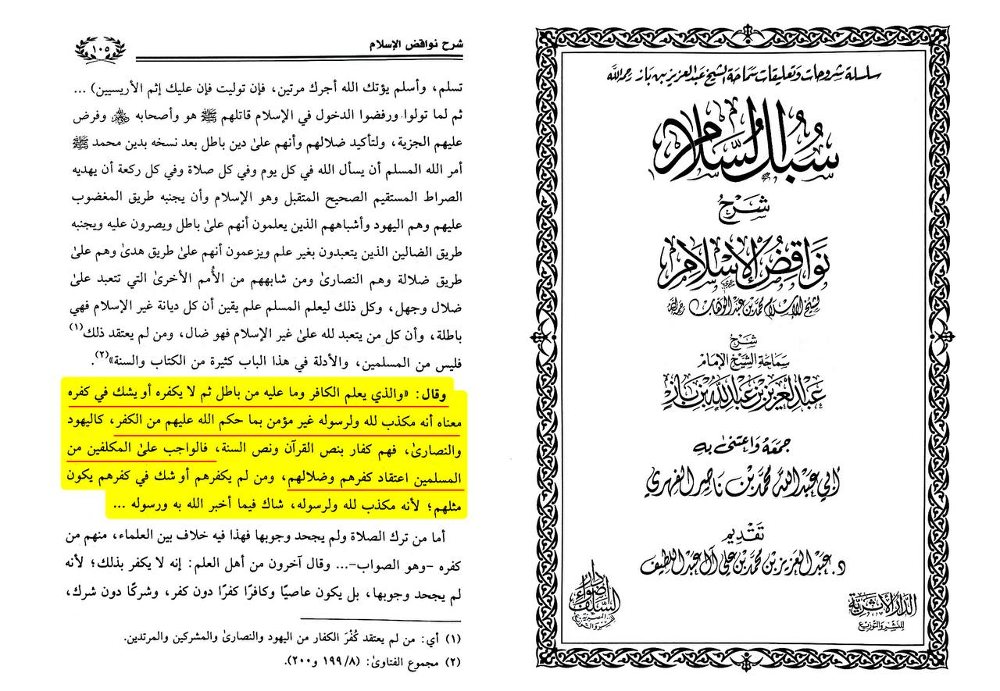

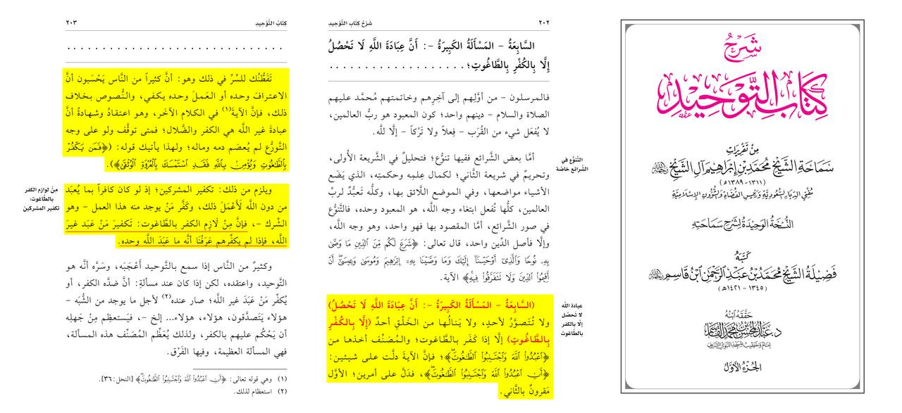

---

<!-- telegram-source: dar/messages4.html#message3986 -->
<!-- evidence-id: 000031 -->

Shaykh Ṣāliḥ al-Fawzān said:

This is the meaning of īmān: that you believe in your heart that Allāh alone deserves ʿibādah, and that everything worshipped besides Allāh is false — whether angels, prophets, righteous people, stones, trees, or idols. You must also have disbelief in all of these. This is the meaning of īmān in Allāh: that you believe in your heart that no one deserves worship except Him, and that whatever is worshipped besides Him is false. This is required by this ʿaqīdah.

It is not enough to say this with your tongue without believing it in your heart. Nor is it enough to perform outward actions — ṣalāh, fasting — while saying, “I worship only Allāh,” but then saying: “I don’t know about those who worship graves and shrines; I can’t say they are wrong, because they pray and fast and say lā ilāha illā Allāh.”

We say: you have not understood the meaning of lā ilāha illā Allāh, nor the meaning of īmān in Allāh and kufr biṭ-ṭāghūt. Had you understood properly, you would know that īmān in Allāh is not valid except with disbelief in ṭāghūt — outwardly with the tongue and inwardly with conviction.

This is the meaning of īmān in Allāh: that you direct all ʿibādah to Him alone and direct none of it to another. A person may perform ṣalāh, fast, and give zakāh, yet does Istighāthah from someone besides Allāh, or sacrifice to someone besides Him. Such a person has worshipped Allāh in some things and worshipped others in some things — and is therefore a mushrik.

As for the one who worships Allāh in some ʿibādah, and worships others in other types of ʿibādah, this person has not truly believed in Allāh. Like those who fasts, perform ṣalāh, perform ḥajj, and pronounce the shahādātayn, but then call upon others besides Allāh — they call upon the dead, sacrifice for the dead, make vows to the dead, and circumambulate at the graves. These people have not worshipped Allāh; rather, they are mushrikūn.

Because the worship of Allāh and worship of others can never unite. Allāh - Jalla wa ʿAlā - says: “I am free of partners in shirk, so whoever performs an action in which he associates someone with Me, I leave him and his shirk; and in another narration, "it is for the one who associates, and I am free of him.”

Allāh does not accept that anyone be associated with Him in any type of ʿibādah. Rather, all ʿibādah must be solely for Allāh. As He says: "And fight against them until there is no fitnah [i.e shirk] and [until] the religion [i.e., worship], all of it, is for Allāh." [al-Anfāl: 39]. Thus, no part of the religion can be for Allāh and another part for idols, graves, or anyone else — the religion must be entirely for Allāh.

[Sharḥ Maʿnā al-Ṭāghūt by Shaykh al-Fawzān p.12-13]

Show attached source scan

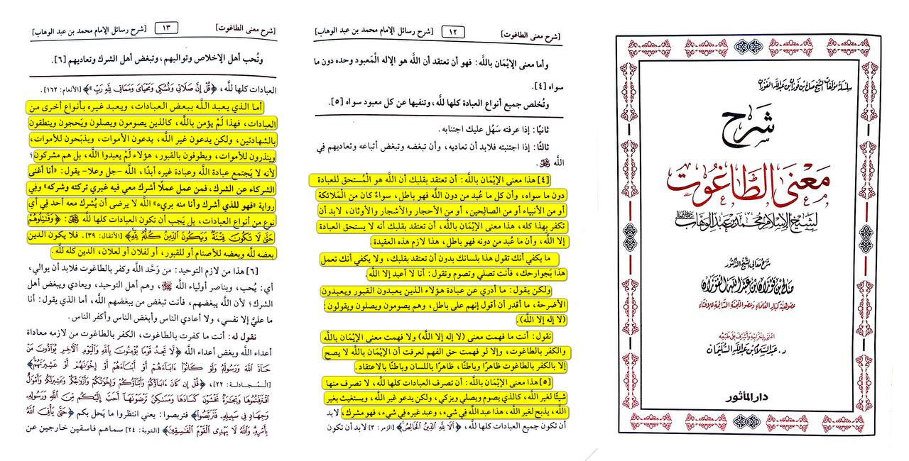

---

<!-- telegram-source: dar/messages5.html#message4271 -->
<!-- evidence-id: 000033 -->

Shaykh ʿAbd Allāh al-Ghunaymān said:

The sixth point: the major issue is that worship of Allāh is not achieved except through kufr biṭ-ṭāghūt (disbelief in false deities). In this lies the meaning of the statement of Allāh: “So whoever disbelieves in ṭāghūt and believes in Allāh has grasped the most trustworthy handhold with no break in it.” (al-Baqarah: 256)

The shaykh explains that Allāh forbids matters that were actually occurring among people in his time. Among people are those who, according to their claim, worship Allāh, while they also worship the ṭāghūt, and they believe that they are Muslims. The ṭāghūt has already been defined as everything that is worshipped besides Allāh. If it is living and rational, then it must be qualified by being pleased with that worship. As for if it is dead, or an inanimate object, or something else, then it is known that it has no command and no choice, yet it may still be worshipped.

Its worship consists of performing tabarruk (seeking blessings) from it, turning toward it with duʿāʾ, seeking the removal of calamities and the relief of distresses, or ṭawāf around the graves of those who are called awliyāʾ, sitting devotedly at their graves seeking blessing, or seeking intercession, saying: intercede for me, or the like. All of this is worship of the ṭāghūt.

Kufr biṭ-ṭāghūt is a condition for the existence of īmān, because kufr biṭ-ṭāghūt is avoidance of shirk. This is like the statement of Allāh: “Worship Allāh and associate nothing with Him.” (al-Nisāʾ: 36) Therefore, duʿāʾ, ṭawāf, and all worship must be purely for Allāh alone; no part of it belongs to any created being whatsoever.

[Sharḥ Kitāb at-Tawḥīd by Shaykh ʿAbd Allāh al-Ghunaymān 1/70]

Show attached source scan

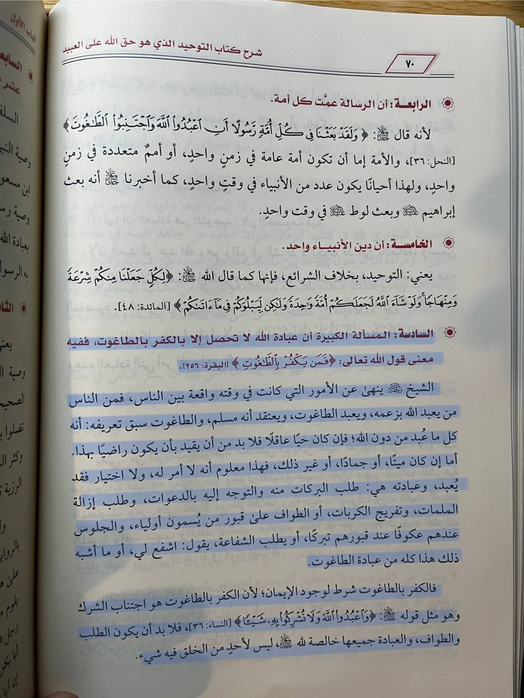

---

<!-- telegram-source: dar/messages4.html#message4113 -->
<!-- evidence-id: 000034 -->

Shaykh ar-Rājihī was asked:

Q: Are the conditions of lā ilāha illā Allāh the pronouncing of it, or is it included among the seven conditions? And likewise, disbelief in ṭāghūt?

A: Yes, it must be pronounced with ability, as mentioned in the ḥadīth: “Whoever testifies that lā ilāha illā Allāh…” and the ḥadīth: “Whoever says: lā ilāha illā Allāh sincerely from his heart…” He must say it with sincerity and truthfulness.

He does not say it with the tongue alone; he says it with the tongue and the heart agreeing. The tongue pronounces the word of tawḥīd and the heart affirms it—sincerity, truthfulness, love, and submission. It is not valid if the tongue and heart do not match.

There is no īmān except in two things: kufr biṭ-ṭāghūt and belief in Allāh. Allāh says: “So whoever disbelieves in ṭāghūt and believes in Allāh, he has grasped the most trustworthy handhold, which will never break.” There is nothing except by denial or affirmation. The word of tawḥīd contains kufr biṭ-ṭāghūt and belief in Allāh. “Lā ilāha” is kufr biṭ-ṭāghūt, “illā Allāh” is belief in Allāh.

Both are necessary. If someone says “Allāh” only, or “tawḥīd for Allāh,” or “I worship Allāh,” it is not valid. Both denial and affirmation are required. Whoever does not disbelieve in ṭāghūt does not believe in Allāh. True belief in Allāh and tawḥīd only occurs through both: kufr biṭ-ṭāghūt and belief in Allāh.

<video class="source-video" controls preload="metadata" src="assets/videos/dar-messages4-4113.mp4"></video>

Video source from the Telegram export.

---

<!-- telegram-source: personal/messages.html#message571 -->
<!-- evidence-id: 000035 -->

Shaykh Ṣāliḥ Āl al-Shaykh said:

He said: "Al-barā’ah (disavowal) from shirk and its people” has been explained with several explanations—its root and its branches. The root of barā’ah is hatred in the heart; meaning hatred of shirk and its people.

What follows that hatred is showing enmity toward them, and declaring as unbelievers those whom Allāh and His Messenger declared unbelievers—declaring mushrikīn as unbelievers, and fighting them when that is legislated.

And this is also the meaning of kufr biṭ-ṭāghūt for disbelief in the ṭāghūt is to hate it, to show enmity to its people, and to declare as unbelievers the people of the ṭāghūt, meaning those who worship other than Allāh, and to fight them when that is legislated. The root of barā’ah from shirk is hatred, and following that hatred are several things:

First: enmity.

Second: takfīr. And it is known that takfīr follows knowledge.

Third: fighting them when that is legislated; and that also requires knowledge.

Thus it becomes clear that the common people—meaning those who are not scholars—are responsible for the root of barā’ah, which is hatred; as for its branches, they follow the degree of knowledge. Hatred is necessary: he must hate shirk. If he does not hate shirk, then he is not a Muslim. If he loves Islam and its people, and loves tawḥīd and its people, but he does not hate shirk and its people, then he is not a Muslim.

However, he may hate shirk and the people of shirk in principle, yet love certain mushrikīn for some worldly reason. Such a person is not a mushrik, but his Islam is deficient—just as previously explained in distinguishing loyalty and alliance.

The intended point is that the matter of barā’ah—from shirk and its people—its root is hatred, and following it are several things: enmity, takfīr, and fighting; and all of these are dependent on knowledge, and they vary according to people.

[Sharḥ Thalāthat al-Uṣūl by Shaykh Ṣāliḥ Āl al-Shaykh p.137-138]

Show attached source scan

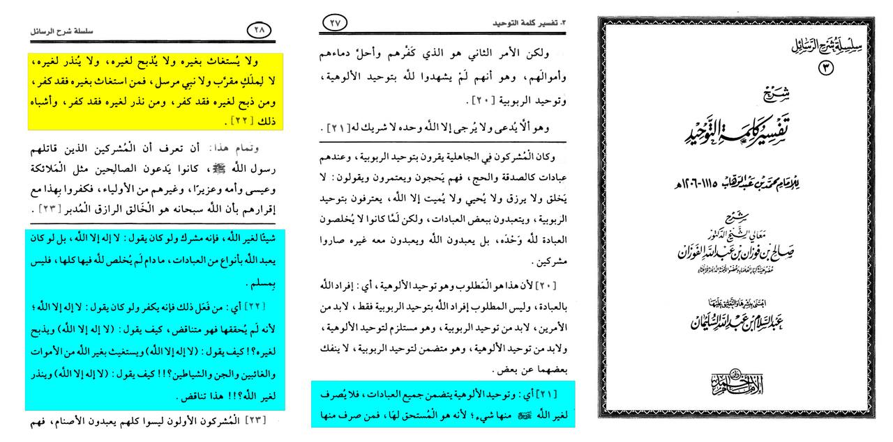

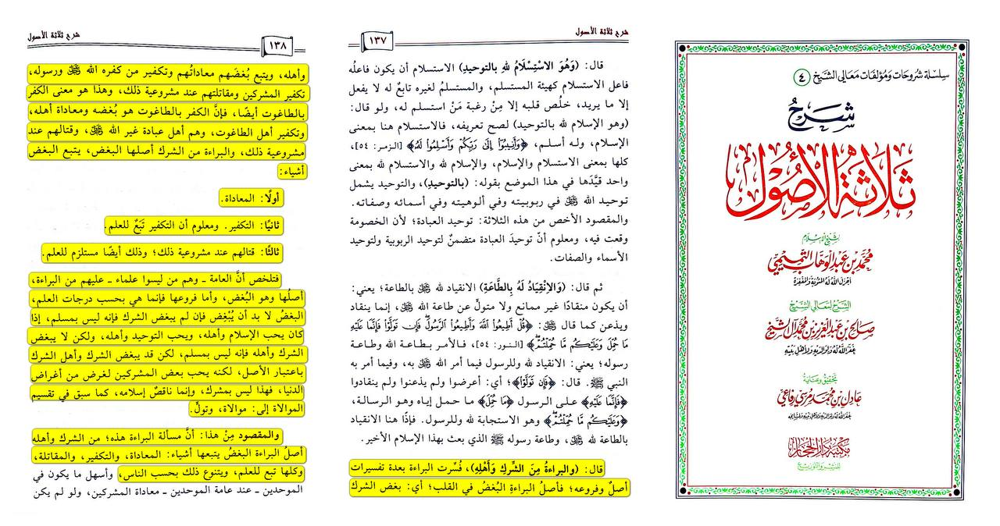

---

## 4. Declaring the mushrikīn disbelievers

### Ibn Taymiyyah: religious descriptions follow the person’s own belief and action
<!-- evidence-id: 000036 -->

Show Arabic source text

وَكَوْنُ الرَّجُلِ مُسْلِمًا أَوْ يَهُودِيًّا أَوْ نَصْرَانِيًّا وَنَحْوَ ذَلِكَ مِنْ أَسْمَاءِ الدِّينِ هُوَ حُكْمٌ يَتَعَلَّقُ بِنَفْسِهِ؛ لِاعْتِقَادِهِ وَإِرَادَتِهِ وَقَوْلِهِ وَعَمَلِهِ؛ لَا يَلْحَقُهُ هَذَا الِاسْمُ بِمُجَرَّدِ اتِّصَافِ آبَائِهِ بِذَلِكَ.

وَكُلُّ حُكْمٍ عُلِّقَ بِأَسْمَاءِ الدِّينِ مِنْ إِسْلَامٍ وَإِيمَانٍ وَكُفْرٍ وَنِفَاقٍ وَرِدَّةٍ وَتَهَوُّدٍ وَتَنَصُّرٍ إِنَّمَا يَثْبُتُ لِمَنِ اتَّصَفَ بِالصِّفَاتِ الْمُوجِبَةِ لِذَلِكَ. وَكَوْنُ الرَّجُلِ مِنَ الْمُشْرِكِينَ أَوْ أَهْلِ الْكِتَابِ هُوَ مِنْ هَذَا الْبَابِ؛ فَمَنْ كَانَ بِنَفْسِهِ مُشْرِكًا فَحُكْمُهُ حُكْمُ أَهْلِ الشِّرْكِ وَإِنْ كَانَ أَبَوَاهُ غَيْرَ مُشْرِكَيْنِ، وَمَنْ كَانَ أَبَوَاهُ مُشْرِكَيْنِ وَهُوَ مُسْلِمٌ فَحُكْمُهُ حُكْمُ الْمُسْلِمِينَ لَا حُكْمُ الْمُشْرِكِينَ.

المصدر: ابن تيمية، <em>مجموع الفتاوى</em>، 35/226–227.

**English**

Ibn Taymiyyah explains that a person’s description as Muslim, Jewish, Christian, or another religious designation relates to the person himself through his belief, will, speech, and action. The designation does not attach to him merely because his parents had it.

He continues: “Every ruling attached to religious names, such as Islām, faith, disbelief, hypocrisy, apostasy, Judaism, and Christianity, applies only to the person who possesses the qualities that necessitate it. A person’s being one of the mushrikīn or one of the People of the Book belongs to this same category. Whoever is himself a mushrik has the ruling of the people of shirk even if his parents were not mushrikīn; and whoever has mushrik parents but is himself a Muslim has the ruling of the Muslims, not the ruling of the mushrikīn.”

Source: Ibn Taymiyyah, Majmūʿ al-Fatāwā, 35/226–227.

### Muḥammad ibn ʿAbd al-Wahhāb: the foundation and principle of Islam
<!-- evidence-id: 000037 -->

Show Arabic source text

فإذا قيل لك: إيش دينك؟ فقل: ديني الإسلام، وأصله وقاعدته أمران: الأول: الأمر بعبادة الله وحده لا شريك له، والتحريض على ذلك، والموالاة فيه، وتكفير من تركه، والإنذار عن الشرك في عبادة الله، والتغليظ في ذلك، والمعاداة فيه، وتكفير من فعله. وهو بني على خمسة أركان: شهادة أن لا إله إلا الله، وأن محمدا رسول الله، وإقام الصلاة، وإيتاء الزكاة، وصوم رمضان، وحج البيت مع الاستطاعة.

المصدر: محمد بن عبد الوهاب، <em>الدرر السنية في الأجوبة النجدية</em>، 1/153.

**English**

“If you are asked, ‘What is your religion?’ say: ‘My religion is Islam, and its foundation and principle consist of two matters. The first is commanding the worship of Allāh alone, without partner; urging this; showing loyalty for its sake; declaring whoever abandons it a disbeliever; warning against shirk in the worship of Allāh; treating that sternly; showing enmity for its sake; and declaring whoever commits it a disbeliever. Islam is built upon five pillars: testifying that there is no deity except Allāh and that Muḥammad is the Messenger of Allāh, establishing the prayer, giving zakāh, fasting Ramaḍān, and performing pilgrimage to the House when able.’”

Source: Muḥammad ibn ʿAbd al-Wahhāb, *al-Durar al-Saniyyah fī al-Ajwibah al-Najdiyyah*, 1/153.

### Muḥammad ibn ʿAbd al-Wahhāb: declaring the worshippers of other than Allāh disbelievers
<!-- evidence-id: 000038 -->

Show Arabic source text

فَأَمَّا صِفَةُ الْكُفْرِ بِالطَّاغُوتِ فَأَنْ تَعْتَقِدَ بُطْلَانَ عِبَادَةِ غَيْرِ اللَّهِ، وَتَتْرُكَهَا، وَتُبْغِضَهَا، وَتُكَفِّرَ أَهْلَهَا، وَتُعَادِيَهُمْ. وَأَمَّا مَعْنَى الْإِيمَانِ بِاللَّهِ فَأَنْ تَعْتَقِدَ أَنَّ اللَّهَ هُوَ الْإِلَهُ الْمَعْبُودُ وَحْدَهُ دُونَ مَنْ سِوَاهُ، وَتُخْلِصَ جَمِيعَ أَنْوَاعِ الْعِبَادَةِ كُلَّهَا لِلَّهِ، وَتَنْفِيَهَا عَنْ كُلِّ مَعْبُودٍ سِوَاهُ، وَتُحِبَّ أَهْلَ الْإِخْلَاصِ وَتُوَالِيَهُمْ، وَتُبْغِضَ أَهْلَ الشِّرْكِ وَتُعَادِيَهُمْ؛ وَهَذِهِ مِلَّةُ إِبْرَاهِيمَ الَّتِي سَفِهَ نَفْسَهُ مَنْ رَغِبَ عَنْهَا.

المصدر: محمد بن عبد الوهاب، <em>الدرر السنية في الأجوبة النجدية</em>، 1/161.

**English**

“As for the description of kufr biṭ-ṭāghūt, it is that you believe in the falsehood of worshipping other than Allāh, abandon it, hate it, declare its people disbelievers, and oppose them. As for the meaning of faith in Allāh, it is that you believe Allāh alone is the deity worthy of worship, sincerely devote every kind of worship to Allāh, and deny it to every object of worship besides Him. You love and ally with the people of sincerity, and you hate and oppose the people of shirk. This is the religion of Ibrāhīm, and whoever turns away from it has made a fool of himself.”

Source: Muḥammad ibn ʿAbd al-Wahhāb, *al-Durar al-Saniyyah fī al-Ajwibah al-Najdiyyah*, 1/161.

### ʿAbd al-Raḥmān ibn Ḥasan: consensus concerning disavowal from major shirk and its people
<!-- evidence-id: 000039 -->

Show Arabic source text

وأجمع العلماء سلفا وخلفا، من الصحابة والتابعين، والأئمة، وجميع أهل السنة أن المرء لا يكون مسلما إلا بالتجرد من الشرك الأكبر، والبراءة منه وممن فعله، وبغضهم ومعاداتهم بحسب الطاقة، والقدرة، وإخلاص الأعمال كلها لله.

المصدر: عبد الرحمن بن حسن، <em>الدرر السنية في الأجوبة النجدية</em>، 11/545.

**English**

“The scholars, past and present, from the Companions, the Followers, the imāms, and all Ahl al-Sunnah, have unanimously agreed that a person is not a Muslim except by freeing himself from major shirk, disavowing it and those who commit it, hating and opposing them according to his capacity and ability, and devoting all deeds sincerely to Allāh.”

Source: ʿAbd al-Raḥmān ibn Ḥasan, *al-Durar al-Saniyyah fī al-Ajwibah al-Najdiyyah*, 11/545.

### Ḥamad ibn ʿAtīq: declaring the people of shirk disbelievers is from the foundation of the messengers’ religion
<!-- evidence-id: 000040 -->

Shaykh Ḥamad ibn ʿAtīq said:

“The foundation of the religion of all the messengers is the establishment of tawḥīd: loving it, loving its people, showing loyalty to them, rejecting shirk, declaring its people disbelievers, hating them, and making enmity toward them manifest.

The Exalted said: ‘There has already been for you a good example in Ibrāhīm and those with him, when they said to their people: Indeed, we disassociate from you and from whatever you worship besides Allāh. We have rejected you, and between us and you has appeared enmity and hatred forever, until you believe in Allāh alone.’ [al-Mumtaḥanah 60:4]

The meaning of His saying, ‘and it appeared,’ is that it became apparent and visible, meaning a clear and explicit declaration of enmity and hatred toward whoever does not single out his Lord with tawḥīd.”

Source: Ḥamad ibn ʿAtīq, *al-Durar al-Saniyyah fī al-Ajwibah al-Najdiyyah*, 8/418.

Show attached source scan

### Sulaymān ibn Saḥmān: lā ilāha illā Allāh necessitates declaring the people of shirk disbelievers
<!-- evidence-id: 000041 -->

Shaykh Sulaymān ibn Saḥmān said:

“The people of shirk have been described as disbelievers in countless verses, so it is necessary to declare them disbelievers. This is also necessitated by lā ilāha illā Allāh, whose meaning is not complete except by declaring disbeliever the one who associates a partner with Allāh in His worship, as in the authentic ḥadīth: ‘Whoever says lā ilāha illā Allāh and disbelieves in what is worshipped besides Allāh, his wealth and blood become inviolable, and his reckoning is with Allāh.’

His statement, ‘and disbelieves in what is worshipped besides Allāh,’ confirms the negation. His blood and wealth are therefore not inviolable except by that. If he doubts or hesitates, his blood and wealth are not protected.

These matters complete tawḥīd because lā ilāha illā Allāh has been restricted in the ḥadīths by weighty conditions: knowledge, sincerity, truthfulness, certainty, and the absence of doubt. A person is not a muwaḥḥid except by combining all of this, believing it, accepting it, loving for its sake, showing enmity for its sake, and giving allegiance for its sake.

It is known that, together with believing in the falsehood of worshipping other than Allāh, it is necessary to declare the one who commits shirk disbeliever, disavow him, and openly manifest enmity and hatred toward them. Reflect upon that, and Allāh is the One who grants success to what is correct.”

Source: Sulaymān ibn Saḥmān, *Tanbīh dhawī al-Albāb al-Salīmah ʿan al-Wuqūʿ fī al-Alfāẓ al-Mubtadaʿah al-Wakhīmah*, pp. 72–73.

Show attached source scan

### Ayman al-ʿAnqarī: takfīr of the mushrikīn is part of kufr biṭ-ṭāghūt
<!-- evidence-id: 000042 -->

<!-- telegram-source: personal/messages.html#message522 -->
<!-- evidence-id: 000043 -->

Shaykh Ayman al-ʿAnqarī explained:

“The Shaykh said: ‘This is among the clearest matters demonstrating the meaning of lā ilāha illā Allāh. He did not make merely pronouncing it a protection for a person’s blood and wealth. Nor did he make knowing its meaning while pronouncing it sufficient, nor affirming it, nor even that the person calls upon Allāh alone without associating any partner with Him.’

Some people say, ‘I am free from shirk,’ while remaining allied with the mushrikīn who worship the awliyāʾ. They say, ‘I say lā ilāha illā Allāh and disavow shirk.’ We say that this is not enough. One must disavow the mushrikīn. One must disavow both the worshipper and what is worshipped besides Allāh.

Allāh says: ‘You already have an excellent example in Ibrāhīm and those with him, when they said to their people, “Indeed, we are free from you and whatever you worship besides Allāh. We have rejected you, and enmity and hatred have appeared between us and you forever until you believe in Allāh alone.”’ [al-Mumtaḥanah 60:4]

What will they do with this verse? Their reinterpretation of it is among the distortions of the Murjiʾah and those who manipulate the texts. The wording is explicit. Allāh made kufr biṭ-ṭāghūt a condition. Declaring the mushrikīn disbelievers is included in it without doubt and is indispensable. If a person does not reject the mushrik, he has not fulfilled kufr biṭ-ṭāghūt.”

<video class="source-video" controls preload="metadata" src="assets/videos/personal-522.mp4"></video>

Arabic video source from the user’s Telegram export.

---

<!-- evidence-id: 000044 -->

<!-- telegram-source: dar/messages2.html#message1682 -->
<!-- evidence-id: 000045 -->

Sulaymān ibn Saḥmān said in his qaṣīdah "hijāʾ ghabī jāhil dhī ḥamāqah":

We followed the path and way of the Salaf, So that we may be saved on a day of great terrors.

By declaring all the grave worshippers as disbelievers, And likewise, the Jahmi or whoever resembles him.

Show attached source scan

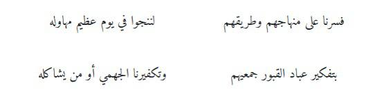

---

### Muḥammad ibn Ibrāhīm Āl al-Shaykh
<!-- evidence-id: 000046 -->

“The seventh, which is the great issue, is that worship of Allāh does not occur, nor is it conceivable for anyone, nor does anyone among creation attain it, except with kufr biṭ-ṭāghūt. It is only attained when one disbelieves in the ṭāghūt.

The author derived this from, ‘Worship Allāh and avoid the ṭāghūt.’ [al-Naḥl 16:36] The verse indicates two matters: that you worship Allāh and avoid the ṭāghūt. It therefore indicates two commands, the first connected to the second.

Pay attention to the subtlety here, for many people think that mere acknowledgment alone, or action alone, is sufficient. The revealed texts contradict that.

Rather, the verse indicates another matter: belief and testimony that the worship of other than Allāh is disbelief and misguidance. Whenever a person hesitates, even out of caution, his blood and wealth are not protected. Hence His statement, ‘Whoever disbelieves in the ṭāghūt and believes in Allāh has grasped the firmest handhold.’ [al-Baqarah 2:256]

From this follows the takfīr of the mushrikīn. If he truly disbelieved in what is worshipped besides Allāh, he would act upon that and declare disbelief upon the one from whom that act, namely shirk, occurs.

Indeed, declaring the one who worships other than Allāh a disbeliever is among the necessary implications of kufr biṭ-ṭāghūt. If he does not declare them disbelievers, we know that he has not worshipped Allāh alone.”

Source: Muḥammad ibn Ibrāhīm Āl al-Shaykh, Sharḥ Kitāb al-Tawḥīd, 1/202–203.

<!-- telegram-source: dar/messages4.html#message3277-message3278 -->
<!-- evidence-id: 000047 -->

Shaykh Ṣāliḥ al-Fawzān was asked:

May Allah be good to you and bless you. This questioner says: Shaykh ʿAbd al-Raḥmān ibn Ḥasan (raḥimahu Allāh taʿālā) said in al-Durar al-Saniyyah, as follows: “The scholars — past and present, from the Companions, the Followers, the Imāms, and all the people of Sunnah — have unanimously agreed that a person is not a Muslim except by freeing himself from major shirk, disavowing it and those who commit it, hating them and opposing them according to one’s capacity and ability.”

We request clarification of what the Shaykh mentioned.

Answer: It is clear, my brother. The Shaykh’s words are clear and need no explanation. It is clear that a person is not a Muslim except by freeing himself from major shirk — except by freeing himself from shirk — and a mushrik is not a Muslim. He is saying this because… “and disavowing it and those who commit it” — meaning disavowing the mushrikīn — disavowing shirk and the mushrikīn, and hating them and opposing them according to one’s capacity and ability. Yes, al-barāʾah means hating them and opposing them; this is the meaning of disavowing them.

As for saying you disavow them while loving them — that is a lie; it is not barāʾah. Yes, because in these times there are those who claim affiliation with Salafiyyah who say that this is the madhhab of the Khawārij and the Muʿtazilah. You — you are from the Khawārij, The one who says this statement is from the Khawārij. This is the truth. This is not the doctrine of the Khawārij — this is the doctrine of Ahl al-Sunnah wa’l-Jamāʿah. Yes.

And we request from you — even for the ṭullāb al-ʿilm (students of knowledge) — to read the books of the Imāms of the Najdī daʿwah, may Allah have mercy on them with His vast mercy. We request from you, the students of knowledge, to read the books of the Imāms of the Najdī daʿwah, may Allah have mercy on them with His vast mercy, and to abandon the contemporary books that promote irjāʾ.

It is obligatory to read the books of Ahl al-Sunnah from the scholars of the daʿwah in the land of Najd and others — whether the verifying scholars are from Najd or from elsewhere. We must read their words, take heed from them, and act upon them. And as for Najd, they are only followers of those who preceded; they did not originate anything from themselves. They are followers of those who preceded them from the salaf al-ṣāliḥ. So we do not limit ourselves to the people of Najd, but every Salafī and every verifying scholar from Najd or others — we take him as an example and take knowledge from him. Yes.

<video class="source-video" controls preload="metadata" src="assets/videos/fawzan-baraah-major-shirk.mov"></video>

Arabic video source from the user’s Telegram export.

---

### Ṣāliḥ al-Fawzān: takfīr of the grave worshippers is part of kufr biṭ-ṭāghūt
<!-- evidence-id: 000048 -->

<!-- telegram-source: personal/messages.html#message662-message663 -->
<!-- evidence-id: 000032 -->

Shaykh al-Fawzān was asked:

Q: Is our declaring takfīr upon the grave-worshippers from this ummah considered part of affirming kufr biṭ-ṭāghūt?

A: Yes, without a doubt; without a doubt. The ṭāghūt is whatever is worshipped besides Allah while being pleased with that, or calling to it.

But if he is worshipped while not being pleased with that, then the ṭāghūt is the one whom Shayṭān commanded them with, so they are worshipping Shayṭān and not worshipping the righteous man or the walī; rather they worship Shayṭān who commanded them to do that.

As for the righteous man and the followers of the prophets, they will disavow those who worshipped them on the Day of Judgment, and they will say: “We did not command them, nor were we aware of their worship of us.”

“They will say: "Glorified be You! You are our Walî instead of them. Nay, but they used to worship the jinn.” [Sabaʾ:41] meaning, the Shayāṭīn “most of them were believers in them”  because they obeyed the Shayāṭīn, so they became worshippers of the Shayāṭīn. Yes.

<video class="source-video" controls preload="metadata" src="assets/videos/fawzan-takfir-grave-worshippers-taghut.mp4"></video>

Arabic video source from the user’s Telegram export.

---

### Full statement of ʿAbd Allāh al-Ghunaymān
<!-- evidence-id: 000050 -->

“The sixth point, which is the major issue, is that worship of Allāh is not achieved except through kufr biṭ-ṭāghūt. In this lies the meaning of the statement of Allāh: ‘So whoever disbelieves in the ṭāghūt and believes in Allāh has grasped the firmest handhold with no break in it.’ [al-Baqarah 2:256]

The Shaykh explains that Allāh forbids matters that were actually occurring among people in his time. Among people are those who, according to their claim, worship Allāh while they also worship the ṭāghūt, and they believe that they are Muslims. The ṭāghūt has already been defined as everything that is worshipped besides Allāh. If it is living and rational, then it must be qualified by being pleased with that worship. As for if it is dead, an inanimate object, or something else, it is known that it has neither command nor choice, yet it may still be worshipped.

Its worship consists of seeking blessings from it, turning toward it with supplication, seeking from it the removal of calamities and relief from distress, circumambulating the graves of those called awliyāʾ, sitting devotedly at their graves seeking blessing, or seeking intercession by saying, ‘Intercede for me,’ and similar things. All of this is worship of the ṭāghūt.

Kufr biṭ-ṭāghūt is a condition for the existence of faith because kufr biṭ-ṭāghūt is the avoidance of shirk. This is like the statement of Allāh: ‘Worship Allāh and associate nothing with Him.’ [al-Nisāʾ 4:36] Therefore, supplication, circumambulation, and all worship must be purely for Allāh alone. No part of it belongs to any created being whatsoever.”

Source: ʿAbd Allāh al-Ghunaymān, Sharḥ Kitāb al-Tawḥīd, 1/70.

### ʿAbd al-ʿAzīz al-Rājiḥī
<!-- evidence-id: 000051 -->

“Whoever does not declare the mushrikīn disbelievers, doubts their disbelief, or considers their path correct, is a disbeliever like them, because he has not fulfilled kufr biṭ-ṭāghūt. ‘So whoever disbelieves in the ṭāghūt and believes in Allāh…’ Kufr biṭ-ṭāghūt includes declaring the mushrikīn disbelievers.”

<video class="source-video" controls preload="metadata" src="assets/videos/personal-545.mp4"></video>

Arabic source video from the user’s Telegram export.

### An unnamed Najdī scholar: failure to declare the mushrikīn disbelievers
<!-- evidence-id: 000052 -->

Show Arabic source text

الأمر الثاني: مما يوجب الجهاد لمن اتصف به: عدم تكفير المشركين، أو الشك في كفرهم، فإن ذلك من نواقض الإسلام ومبطلاته، فمن اتصف به فقد كفر، وحل دمه وماله، ووجب قتاله حتى يكفر المشركين، والدليل على ذلك قوله صلى الله عليه وسلم: «من قال لا إله إلا الله، وكفر بما يعبد من دون الله، حرم ماله ودمه»، علق عصمة المال والدم بأمرين:

الأمر الأول: قول: لا إله إلا الله.

الثاني: الكفر بما يعبد من دون الله.

فلا يعصم دم العبد وماله، حتى يأتي بهذين الأمرين:

الأول: قوله: لا إله إلا الله، والمراد معناها لا مجرد لفظها، ومعناها هو توحيد الله بجميع أنواع العبادة.

الأمر الثاني: الكفر بما يعبد من دون الله، والمراد بذلك تكفير المشركين، والبراءة منهم، ومما يعبدون مع الله. فمن لم يكفر المشركين من الدولة التركية، وعباد القبور، كأهل مكة وغيرهم، ممن عبد الصالحين، وعدل عن توحيد الله إلى الشرك، وبدّل سنة رسوله صلى الله عليه وسلم بالبدع، فهو كافر مثلهم، وإن كان يكره دينهم، ويبغضهم، ويحب الإسلام والمسلمين؛ فإن الذي لا يكفر المشركين، غير مصدق بالقرآن، فإن القرآن قد كفر المشركين، وأمر بتكفيرهم، وعداوتهم وقتالهم.

قال الشيخ محمد بن عبد الوهاب، رحمه الله، في نواقض الإسلام: الثالث: من لم يكفر المشركين، أو شك في كفرهم، أو صحح مذهبهم، كفر. وقال شيخ الإسلام ابن تيمية رحمه الله: من دعا علي بن أبي طالب، فقد كفر، ومن شك في كفره، فقد كفر.

المصدر: <em>الدرر السنية في الأجوبة النجدية</em>، 9/291–292، ضمن رسالة «ما يوجب الجهاد» لبعض علماء نجد.

**English**

“The second matter that makes jihād obligatory against a person characterized by it is failure to declare the mushrikīn disbelievers, or doubting their disbelief. This is among the nullifiers and invalidators of Islam. Whoever is characterized by it has disbelieved, his blood and wealth become lawful, and he must be fought until he declares the mushrikīn disbelievers. The proof is the saying of the Prophet ﷺ: ‘Whoever says lā ilāha illā Allāh and disbelieves in whatever is worshipped besides Allāh, his wealth and blood become inviolable.’ He made the inviolability of wealth and blood dependent upon two matters:

The first is saying lā ilāha illā Allāh.

The second is disbelieving in whatever is worshipped besides Allāh.

A servant’s blood and wealth are therefore not protected until he fulfills these two matters. The first is saying lā ilāha illā Allāh, meaning its reality and not its bare wording. Its meaning is to single out Allāh in every kind of worship.

The second is disbelieving in whatever is worshipped besides Allāh. What is intended by this is declaring the mushrikīn disbelievers and disavowing them and what they worship alongside Allāh. Whoever does not declare disbelievers the mushrikīn of the Turkish state and the grave worshippers, such as the people of Makkah and others who worshipped the righteous, turned away from the tawḥīd of Allāh toward shirk, and replaced the Sunnah of His Messenger ﷺ with innovations, is a disbeliever like them, even if he hates their religion, detests them, and loves Islam and the Muslims. The one who does not declare the mushrikīn disbelievers does not affirm the Qurʾān, for the Qurʾān declared the mushrikīn disbelievers and commanded that they be declared disbelievers, opposed, and fought.

Shaykh Muḥammad ibn ʿAbd al-Wahhāb, may Allāh have mercy upon him, said in *The Nullifiers of Islam*: ‘The third: whoever does not declare the mushrikīn disbelievers, doubts their disbelief, or considers their doctrine correct has disbelieved.’ Shaykh al-Islām Ibn Taymiyyah, may Allāh have mercy upon him, said: ‘Whoever calls upon ʿAlī ibn Abī Ṭālib has disbelieved, and whoever doubts his disbelief has disbelieved.’”

Source: *al-Durar al-Saniyyah fī al-Ajwibah al-Najdiyyah*, 9/291–292, in the treatise “What Makes Jihād Obligatory,” attributed by the compiler to an unnamed Najdī scholar.

## 5. The ignorant person who commits major shirk

### Ibn Taymiyyah: collected statements on the ignorant person who commits major shirk
<!-- evidence-id: 000053 -->

These entries are also retained in section 7 as a standalone presentation of Ibn Taymiyyah’s position. They are repeated here so they remain available in their proper topical category.

### The name of shirk and punishment before the message
<!-- evidence-id: 000054 -->

Shaykh al-Islām Ibn Taymīyyah (رحمه الله) said:

"Verily, Allāh separated between what is before the Message and what comes after it in regards to Asmāʾ (labels) and ʾAḥkām (rulings), and also gathered them together.

‎Thus, the label 'Mushrik' is established before the Message (Ḥujjah) due to him performing Shirk with his Lord and setting up with Him another Ilāh and rival before the Messenger. So these Asmāʾ (labels) are established [before the Message]. Likewise, the label of Jahl (ignorance) and Jāhilīyyah, and it is said 'Jāhilīyyah' and 'Jāhil' before the coming of the Messenger. As for punishment [for the ignorant mushrik], then, no."

Source: Majmūʿ al-Fatāwa, 20/24.

Show Arabic source text

المصدر: مجموع الفتاوى

<h4 dir="rtl">ص. 24</h4>

وَإِذَا تَبَيَّنَ هَذَا فَكُلُّ مُجْتَهِدٍ مُصِيبٌ غَيْرُ خَاطِئٍ وَغَيْرُ مُخْطِئٍ أَيْضًا إذَا أُرِيدَ بِالْخَطَأِ الْإِثْمُ عَلَى قِرَاءَةِ ابْنِ عَامِرٍ وَلَا يَكُونُ مِنْ مُجْتَهِدٍ خَطَأٌ وَهَذَا هُوَ الَّذِي أَرَادَهُ مَنْ قَالَ: كُلُّ مُجْتَهِدٍ مُصِيبٌ وَقَالُوا: الْخَطَأُ وَالْإِثْمُ مُتَلَازِمَانِ فَعِنْدَهُمْ لَفْظُ الْخَطَأِ كَلَفْظِ الْخَطِيئَةِ عَلَى قِرَاءَةِ ابْنِ عَامِرٍ وَهُمْ يُسَلِّمُونَ أَنَّهُ يَخْفَى عَلَيْهِ بَعْضُ الْعِلْمِ الَّذِي عَجَزَ عَنْهُ لَكِنْ لَا يُسَمُّونَهُ خَطَأً؛ لِأَنَّهُ لَمْ يُؤْمَرْ بِهِ وَقَدْ يُسَمُّونَهُ خَطَأً إضَافِيًّا بِمَعْنَى: أَنَّهُ أَخْطَأَ شَيْئًا لَوْ عَلِمَهُ لَكَانَ عَلَيْهِ أَنْ يَتْبَعَهُ وَكَانَ هُوَ حُكْمَ اللَّهِ فِي حَقِّهِ؛ وَلَكِنَّ الصَّحَابَةَ وَالْأَئِمَّةَ الْأَرْبَعَةَ رضي الله عنهم وَجُمْهُورَ السَّلَفِ يُطْلِقُونَ لَفْظَ الْخَطَأِ عَلَى غَيْرِ الْعَمْدِ؛ وَإِنْ لَمْ يَكُنْ إثْمًا كَمَا نَطَقَ بِذَلِكَ الْقُرْآنُ وَالسُّنَّةُ فِي غَيْرِ مَوْضِعٍ كَمَا قَالَ النَّبِيُّ صلى الله عليه وسلم فِي الْحَدِيثِ الصَّحِيحِ: {إذَا اجْتَهَدَ الْحَاكِمُ فَأَصَابَ فَلَهُ أَجْرَانِ وَإِذَا اجْتَهَدَ فَأَخْطَأَ فَلَهُ أَجْرٌ} . وَقَالَ غَيْرُ وَاحِدٍ مِنْ الصَّحَابَةِ كَابْنِ مَسْعُودٍ: أَقُولُ فِيهَا بِرَأْيِي فَإِنْ يَكُنْ صَوَابًا فَمِنْ اللَّهِ وَإِنْ يَكُنْ خَطَأً فَمِنِّي وَمِنْ الشَّيْطَانِ؛ وَاَللَّهُ وَرَسُولُهُ بَرِيئَانِ مِنْهُ. وَقَالَ عَلِيٌّ فِي قِصَّةِ الَّتِي أَرْسَلَ إلَيْهَا عُمَرُ فَأَسْقَطَتْ - لَمَّا قَالَ لَهُ عُثْمَانُ وَعَبْدُ الرَّحْمَنِ رضي الله عنهما أَنْتَ مُؤَدِّبٌ وَلَا شَيْءَ عَلَيْك - إنْ كَانَا اجْتَهَدَا فَقَدْ أَخْطَآ وَإِنْ لَمْ يَكُونَا اجْتَهَدَا فَقَدْ غَشَّاك.

---

<!-- evidence-id: 000055 -->
Shaykh al-Islām Ibn Taymiyyah (may Allah have mercy on him) also said:

"Those who follow the views of Jahm and al-Ṣāliḥī have explicitly stated that reviling Allah and His Messenger, speaking the doctrine of the Trinity, and uttering any statement of disbelief are not, in themselves, kufr (disbelief) in the inward sense. Rather, they claim these acts are merely external indicators of disbelief. According to them, it is possible for someone who insults and curses (Allah and His Messenger) to still be, inwardly, a believer who knows Allah, affirms His Oneness, and has faith in Him. But when they are confronted with explicit scriptural evidence or consensus that such a person is a disbeliever both inwardly and outwardly, they respond: ‘This only means that such actions necessarily imply inward denial (takdhīb), and that faith necessarily negates such actions.’"

He continues: "It is said to them: We possess two undeniable facts:

First: A fact known with absolute certainty from the religion itself.

Second: A fact known with absolute certainty from our own reasoning when we reflect upon it."

As for the first: "We know that whoever reviles Allah and His Messenger willingly and without coercion, or speaks words of disbelief voluntarily, or mocks Allah, His signs, or His Messenger—such a person is a disbeliever both inwardly and outwardly.

Whoever claims that such a person could still, in their heart, be a believer in Allah while merely being outwardly a disbeliever, has stated something whose falsehood is necessarily known from the religion itself.

Allah has mentioned the statements of the disbelievers in the Qurʾān, ruling them as disbelievers and declaring that they deserve punishment because of their words.

If their words of disbelief were merely akin to witness testimonies against them or mistaken confessions that could be invalid, Allah would not have made them deserving of punishment based on testimonies that might be true or false. Rather, in such a case, He would have stipulated the condition of those testimonies being true before punishing them. This is evident in verses such as: ‘They have certainly disbelieved who say, "Allah is one of three."’ (Al-Māʾidah 5:73) ‘They have certainly disbelieved who say, "Allah is the Messiah, the son of Mary."’ (Al-Māʾidah 5:72) —and similar statements."

Source: Majmūʿ al-Fatāwā by Ibn Taymiyyah 7/557-558.

Show Arabic source text

المصدر: مجموع الفتاوى

<h4 dir="rtl">ص. 557</h4>

{مَنْ رَأَى مِنْكُمْ مُنْكَرًا فَلْيُغَيِّرْهُ بِيَدِهِ فَإِنْ لَمْ يَسْتَطِعْ فَبِلِسَانِهِ فَإِنْ لَمْ يَسْتَطِعْ فَبِقَلْبِهِ وَذَلِكَ أَضْعَفُ الْإِيمَانِ وَفِي رِوَايَةٍ وَلَيْسَ وَرَاءَ ذَلِكَ مِنْ الْإِيمَانِ مِثْقَالُ حَبَّةِ خَرْدَلٍ} . فَهَذَا يُبَيِّنُ أَنَّ الْقَلْبَ إذَا لَمْ يَكُنْ فِيهِ بُغْضُ مَا يَكْرَهُهُ اللَّهُ مِنْ الْمُنْكَرَاتِ كَانَ عَادِمًا لِلْإِيمَانِ وَالْبُغْضُ وَالْحُبُّ مِنْ أَعْمَالِ الْقُلُوبِ. وَمِنْ الْمَعْلُومِ أَنَّ إبْلِيسَ وَنَحْوَهُ يَعْلَمُونَ أَنَّ اللَّهَ عز وجل حَرَّمَ هَذِهِ الْأُمُورَ وَلَا يُبْغِضُونَهَا بَلْ يَدْعُونَ إلَى مَا حَرَّمَ اللَّهُ وَرَسُولُهُ.

وَ &quot; أَيْضًا &quot; فَهَؤُلَاءِ الْقَائِلُونَ بِقَوْلِ جَهْمٍ والصالحي قَدْ صَرَّحُوا بِأَنَّ سَبَّ اللَّهِ وَرَسُولِهِ؛ وَالتَّكَلُّمَ بِالتَّثْلِيثِ وَكُلَّ كَلِمَةٍ مِنْ كَلَامِ الْكُفْرِ لَيْسَ هُوَ كُفْرًا فِي الْبَاطِنِ وَلَكِنَّهُ دَلِيلٌ فِي الظَّاهِرِ عَلَى الْكُفْرِ وَيَجُوزُ مَعَ هَذَا أَنْ يَكُونَ هَذَا السَّابُّ الشَّاتِمُ فِي الْبَاطِنِ عَارِفًا بِاَللَّهِ مُوَحِّدًا لَهُ مُؤْمِنًا بِهِ فَإِذَا أُقِيمَتْ عَلَيْهِمْ حُجَّةٌ بِنَصِّ أَوْ إجْمَاعٍ أَنَّ هَذَا كَافِرٌ بَاطِنًا وَظَاهِرًا. قَالُوا: هَذَا يَقْتَضِي أَنَّ ذَلِكَ مُسْتَلْزِمٌ لِلتَّكْذِيبِ الْبَاطِنِ وَأَنَّ الْإِيمَانَ يَسْتَلْزِمُ عَدَمَ ذَلِكَ؛ فَيُقَالُ لَهُمْ: مَعَنَا أَمْرَانِ مَعْلُومَانِ. (أَحَدُهُمَا) : مَعْلُومٌ بِالِاضْطِرَارِ مِنْ الدِّينِ. وَ (الثَّانِي) مَعْلُومٌ بِالِاضْطِرَارِ مِنْ أَنْفُسِنَا عِنْدَ التَّأَمُّلِ. أَمَّا &quot; الْأَوَّلُ &quot;: فَإِنَّا نَعْلَمُ أَنَّ مَنْ سَبَّ اللَّهَ وَرَسُولَهُ طَوْعًا بِغَيْرِ كُرْهٍ؛ بَلْ مَنْ تَكَلَّمَ بِكَلِمَاتِ الْكُفْرِ طَائِعًا غَيْرَ مُكْرَهٍ وَمَنْ اسْتَهْزَأَ بِاَللَّهِ وَآيَاتِهِ وَرَسُولِهِ فَهُوَ

<h4 dir="rtl">ص. 558</h4>

كَافِرٌ بَاطِنًا وَظَاهِرًا وَأَنَّ مَنْ قَالَ: إنَّ مِثْلَ هَذَا قَدْ يَكُونُ فِي الْبَاطِنِ مُؤْمِنًا بِاَللَّهِ وَإِنَّمَا هُوَ كَافِرٌ فِي الظَّاهِرِ فَإِنَّهُ قَالَ قَوْلًا مَعْلُومَ الْفَسَادِ بِالضَّرُورَةِ مِنْ الدِّينِ. وَقَدْ ذَكَرَ اللَّهُ كَلِمَاتِ الْكُفَّارِ فِي الْقُرْآنِ وَحَكَمَ بِكُفْرِهِمْ وَاسْتِحْقَاقِهِمْ الْوَعِيدَ بِهَا وَلَوْ كَانَتْ أَقْوَالُهُمْ الكفرية بِمَنْزِلَةِ شَهَادَةِ الشُّهُودِ عَلَيْهِمْ أَوْ بِمَنْزِلَةِ الْإِقْرَارِ الَّذِي يَغْلَطُ فِيهِ الْمُقِرُّ لَمْ يَجْعَلْهُمْ اللَّهُ مِنْ أَهْلِ الْوَعِيدِ بِالشَّهَادَةِ الَّتِي قَدْ تَكُونُ صِدْقًا وَقَدْ تَكُونُ كَذِبًا بَلْ كَانَ يَنْبَغِي أَنْ لَا يُعَذِّبَهُمْ إلَّا بِشَرْطِ صِدْقِ الشَّهَادَةِ وَهَذَا كَقَوْلِهِ تَعَالَى: {لَقَدْ كَفَرَ الَّذِينَ قَالُوا إنَّ اللَّهَ ثَالِثُ ثَلَاثَةٍ} {لَقَدْ كَفَرَ الَّذِينَ قَالُوا إنَّ اللَّهَ هُوَ الْمَسِيحُ ابْنُ مَرْيَمَ} وَأَمْثَالُ ذَلِكَ. وَأَمَّا &quot; الثَّانِي &quot;: فَالْقَلْبُ إذَا كَانَ مُعْتَقِدًا صِدْقَ الرَّسُولِ وَأَنَّهُ رَسُولُ اللَّهِ وَكَانَ مُحِبًّا لِرَسُولِ اللَّهِ مُعَظِّمًا لَهُ امْتَنَعَ مَعَ هَذَا أَنْ يَلْعَنَهُ وَيَسُبَّهُ فَلَا يُتَصَوَّرُ ذَلِكَ مِنْهُ إلَّا مَعَ نَوْعٍ مِنْ الِاسْتِخْفَافِ بِهِ وَبِحُرْمَتِهِ فَعُلِمَ بِذَلِكَ أَنَّ مُجَرَّدَ اعْتِقَادِ أَنَّهُ صَادِقٌ لَا يَكُونُ إيمَانًا إلَّا مَعَ مَحَبَّتِهِ وَتَعْظِيمِهِ بِالْقَلْبِ. وَ &quot; أَيْضًا &quot; فَإِنَّ اللَّهَ سُبْحَانَهُ قَالَ: {أَلَمْ تَرَ إلَى الَّذِينَ أُوتُوا نَصِيبًا مِنَ الْكِتَابِ يُؤْمِنُونَ بِالْجِبْتِ وَالطَّاغُوتِ} وَقَالَ: {فَمَنْ يَكْفُرْ بِالطَّاغُوتِ وَيُؤْمِنْ بِاللَّهِ فَقَدِ اسْتَمْسَكَ بِالْعُرْوَةِ الْوُثْقَى} فَتَبَيَّنَ أَنَّ الطَّاغُوتَ يُؤْمَنُ بِهِ وَيُكْفَرُ بِهِ. وَمَعْلُومٌ أَنَّ مُجَرَّدَ التَّصْدِيقِ بِوُجُودِهِ وَمَا هُوَ عَلَيْهِ مِنْ الصِّفَاتِ يَشْتَرِكُ فِيهِ الْمُؤْمِنُ وَالْكَافِرُ؛ فَإِنَّ الْأَصْنَامَ وَالشَّيْطَانَ وَالسِّحْرَ يَشْتَرِكُ فِي الْعِلْمِ بِحَالِهِ الْمُؤْمِنُ وَالْكَافِرُ. وَقَدْ قَالَ اللَّهُ تَعَالَى فِي السِّحْرِ: {حَتَّى يَقُولَا إنَّمَا نَحْنُ فِتْنَةٌ فَلَا تَكْفُرْ فَيَتَعَلَّمُونَ

---

<!-- evidence-id: 000056 -->
Shaykh al-Islam Ibn Taymiyyah says:

“As for others besides these, some of them pray facing the grave, some prostrate to it, and some prostrate at the doorway of a structure built over the grave. Some even consider prostration to the one buried sufficient, substituting it for the five daily prayers — so they prostrate to this dead person and do not prostrate to the Creator. Sometimes, the one buried is believed to be righteous, though in reality he is not — and this is found in places like Egypt, al-Shām, al-ʿIrāq, and elsewhere.

Some of them ask from the dead what should only be asked from Allāh, saying: “Forgive me,” “Provide for me,” “Grant me victory,” and similar requests — just as a person says such things in his prayer to Allāh, exalted be He. These and similar matters are, without doubt, contrary to the religion of all the messengers, as anyone who knows the religion of Islām would understand. Indeed, they are a form of shirk that Allāh and His Messenger have forbidden — rather, it is the very shirk for which the Messenger ﷺ fought the mushrikīn.

If the people doing this are excused due to ignorance and the ḥujjah (proof) has not been established against them — as those who were not reached by a messenger are excused — then their judgment is with Allāh (In the hereafter). As He said: “We do not punish until We have sent a messenger” [al-Isrāʾ: 15].

Otherwise, they deserve the worldly and eternal punishment that others like them among the mushrikīn deserve . Allāh said: “So do not set up rivals to Allāh while you know” [al-Baqarah: 22].

And in the ḥadīth: “Indeed, shirk in this ummah is more hidden than the crawling of ants.”

Those who truly believe in the Messenger — when it becomes clear to one of them the reality of what the Messenger brought, and it becomes clear to him that he had fallen into shirk — then he repents to Allāh and renews his Islām, embracing Islām again in repentance from that shirk .”

Source: Qāʿidah ʿAẓīmah fī al-Farq bayna ʿIbādāt Ahl al-Islām wa-al-Īmān wa-ʿIbādāt Ahl al-Shirk wa-al-Nifāq p.69-70.

Show Arabic source text

المصدر: قاعدة عظيمة في الفرق بين العبادات

<h4 dir="rtl">ص. 69</h4>

النعمان الملقب بالمفيد، وغيره، مناسك حج المشاهد، ومنهم من يفضل الحج إلى بيوت المخلوقين على الحج إلى بيت الخالق، ويقولون: هذا الحج الأكبر، وحج البيت هو الحج الأصغر، ومن الناس من يقول: وحق النبي الذي تحج المطايا إليه، فيجعلون الحج إلى المخلوق.

ولمّا كان السفر إلى المساجد الثلاثة مشروعًا، والمسجدان الأفضلان في الحرمين: الحرم المكي، والحرم المدني؛ صار الناس يقولون لمن حج إلى بيت الله: فلان حج الحرمين، فإن السفر المشروع إلى المدينة من جنس الحج /24ب/ المشروع، لكنه مستحب، والمنهي عنه من جنس الحج المنهي عنه، وهذا موجود في المنتسبين إلى السُّنّة والشّيعة، ومنهم من يقال له: أتبيع زيارتك لشيخك بحجة، أو ثنتين أو ثلاثة، أو عشر حجج؟ فيقول: لا، ويعتقد أن زيارة شيخه مرة أفضل من عشر حجج.

ومنهم من يحج فيأتي إلى المدينة، ثم يرجع ولا يذهب إلى مكة، ويقول: حصل مقصودي من الحج، ومنهم من إذا سافر إلى مكان يضاف إلى نبي، كالمكان المضاف إلى يوسف بمصر، يُحْرِم إذا ذهب إليه كما يحرم الحاج، ومنهم من يستقبل قبر شيخه إذا صلى، ويستدبر الكعبة، ويقول: هذه قبلة الخاصة، والكعبة قبلة العامة، وهذا موجود في كثير من أعيان العباد والزُّهاد وممن له قصد وعلم.

وأما غير هؤلاء فمنهم من يصلي إلى القبر، ومنهم من يسجد له،

<h4 dir="rtl">ص. 70</h4>

ومنهم من يسجد من باب المكان المبني على القبر، ومنهم من يستغني بالسجود لصاحب القبر عن الصلوات الخمس، فيسجدون لهذا الميت ولا يسجدون للخالق، وقد يكون ذلك الميت ممن يظن به الخير، وليس كذلك، كما يوجد مثل هذا في مصر، والشام، والعراق، وغير ذلك.

ومنهم من يطلب من الميت ما يطلب من الله، فيقول: اغفر لي، وارزقني، وانصرني، ونحو ذلك /25أ/ كما يقول المصلي في صلاته لله تعالى، إلى أمثال هذه الأمور التي لا يشك من عرف دين الإسلام أنها مخالفة لدين المرسلين أجمعين، فإنها من الشرك الذي حرمه الله ورسوله، بل من الشرك الذي قاتل عليه الرسول صلى الله عليه وسلم المشركين، وأن أصحابها إن كانوا يعذرون (1) بالجهل، وأن الحجة لم تقم عليهم، كما يعذر من لم يبعث إليه رسول، كما قال تعالى: {وَمَا كُنَّا مُعَذِّبِينَ حَتَّى نَبْعَثَ رَسُولًا} [الإسراء: 15] وإلا كانوا مستحقين من عقوبة الدنيا والآخرة ما يستحقه أمثالهم من المشركين، قال تعالى: {فَلَا تَجْعَلُوا لِلَّهِ أَنْدَادًا وَأَنْتُمْ تَعْلَمُونَ} [البقرة: 22] وفي الحديث: «إِنَّ الشِّرْكَ فِي هَذِهِ الْأُمَّةِ أَخْفَى مِنْ دَبِيبِ النَّمْلِ» .

والذين يؤمنون بالرسول، إذا تبين لأحدهم حقيقة ما جاء به الرسول، وتبين أنه مشرك، فإنه يتوب إلى الله، ويجدد إسلامه، فيسلم إسلامًا يتوب فيه من هذا الشرك، ولم يكن في الصحابة والتابعين من يقصد زيارة أحد لأجل هذا، لا قبر النبي صلى الله عليه وسلم ولا قبر غيره، ولا كان أحدٌ منهم بعد السلام على

(1) غيرت في المطبوع إلى: (معذورين) .

---

<!-- evidence-id: 000057 -->
Did Shaykh Al-Islam differentiate between the Hukm (Ruling) and the Ism (labelling) of a disbeliever, a response to the doubt raised by the liars who claim he doesn’t.

Shaykh al-Islam Ibn Taymiyyah said:

The name Mushrik is established before the message; for indeed he associates partners with his Lord, equates others with Him, sets up alongside Him other gods, and makes for Him equals even before the Messenger. So these labels are established

And likewise the name of jahl (ignorance) and jāhiliyyah (the state of ignorance) is applied: it is said “jāhiliyyah” and “jāhil” before the coming of the Messenger.

As for punishment, (I.e the ruling of Apostasy and disbelief) then no.

Source: Majmū al-Fatāwā by Ibn Taymiyyah 20/38.

Show Arabic source text

المصدر: مجموع الفتاوى

<h4 dir="rtl">ص. 38</h4>

إلَهٍ غَيْرُهُ إنْ أَنْتُمْ إلَّا مُفْتَرُونَ} فَجَعَلَهُمْ مُفْتَرِينَ قَبْلَ أَنْ يَحْكُمَ بِحُكْمِ يُخَالِفُونَهُ؛ لِكَوْنِهِمْ جَعَلُوا مَعَ اللَّهِ إلَهًا آخَرَ فَاسْمُ الْمُشْرِكِ ثَبَتَ قَبْلَ الرِّسَالَةِ؛ فَإِنَّهُ يُشْرِكُ بِرَبِّهِ وَيَعْدِلُ بِهِ وَيَجْعَلُ مَعَهُ آلِهَةً أُخْرَى وَيَجْعَلُ لَهُ أَنْدَادًا قَبْلَ الرَّسُولِ وَيُثْبِتُ أَنَّ هَذِهِ الْأَسْمَاءَ مُقَدَّمٌ عَلَيْهَا وَكَذَلِكَ اسْمُ الْجَهْلِ وَالْجَاهِلِيَّةِ يُقَالُ: جَاهِلِيَّةً وَجَاهِلًا قَبْلَ مَجِيءِ الرَّسُولِ وَأَمَّا التَّعْذِيبُ فَلَا. وَالتَّوَلِّي عَنْ الطَّاعَةِ كَقَوْلِهِ: {فَلَا صَدَّقَ وَلَا صَلَّى} {وَلَكِنْ كَذَّبَ وَتَوَلَّى} فَهَذَا لَا يَكُونُ إلَّا بَعْدَ الرَّسُولِ مِثْلَ قَوْلِهِ عَنْ فِرْعَوْنَ. {فَكَذَّبَ وَعَصَى} كَانَ هَذَا بَعْدَ مَجِيءِ الرَّسُولِ إلَيْهِ كَمَا قَالَ تَعَالَى. {فَأَرَاهُ الْآيَةَ الْكُبْرَى} {فَكَذَّبَ وَعَصَى} وَقَالَ: {فَعَصَى فِرْعَوْنُ الرَّسُولَ} (1).

(1)

هذا آخر ما وجد بالأصل

---

<!-- evidence-id: 000058 -->
Shaykh Al-Islam Ibn Taymiyyah said:

Allāh has distinguished between what comes before the message and what comes after it in asmā ʾ (names) and aḥkām (rulings), and He has also joined between them in asmā ʾ and aḥkām . This serves as an argument against both groups: those who claim that actions have no inherent goodness or evil, and those who claim that people deserve punishment in either case.

As for the first group, Allāh described them as wrongdoers, transgressors, and corrupters, as He said: “Go to Firʿawn; indeed, he has transgressed” (Qurʾān 79:17), and He said: “And when your Lord called Mūsā: Go to the wrongdoing people — the people of Firʿawn. Will they not fear?” (Qurʾān 26:10–11), and He said: “Verily, Firʿawn exalted himself in the land and made its people sects, weakening (oppressing) a group (i.e. Children of Israel) among them: killing their sons, and letting their females live. Verily, he was of the Mufsidûn(i.e. corrupter).” (Qurʾān 28:4).

Thus, He informed that Firʿawn and his people were unjust, transgressors, and corrupters. These are names of condemnation of deeds, and condemnation applies only to evil and reprehensible action.

This proves that actions can be evil and blameworthy even before the coming of the messenger; yet, they do not deserve punishment until the messenger has come to them. As Allāh said: “And We do not punish until We have sent a messenger” (Qurʾān 17:15).

Source: Majmū al-Fatāwa 20/37 by Ibn Taymiyyah.

Show Arabic source text

المصدر: مجموع الفتاوى

<h4 dir="rtl">ص. 37</h4>

فَصْلٌ:

وَقَدْ فَرَّقَ اللَّهُ بَيْنَ مَا قَبْلَ الرِّسَالَةِ وَمَا بَعْدَهَا فِي أَسْمَاءَ وَأَحْكَامٍ وَجَمَعَ بَيْنَهُمَا فِي أَسْمَاءَ وَأَحْكَامٍ وَذَلِكَ حُجَّةٌ عَلَى الطَّائِفَتَيْنِ: عَلَى مَنْ قَالَ: إنَّ الْأَفْعَالَ لَيْسَ فِيهَا حَسَنٌ وَقَبِيحٌ. وَمَنْ قَالَ: إنَّهُمْ يَسْتَحِقُّونَ الْعَذَابَ عَلَى الْقَوْلَيْنِ. أَمَّا الْأَوَّلُ فَإِنَّهُ سَمَّاهُمْ ظَالِمِينَ وَطَاغِينَ وَمُفْسِدِينَ؛ لِقَوْلِهِ: {اذْهَبْ إلَى فِرْعَوْنَ إنَّهُ طَغَى} وَقَوْلِهِ: {وَإِذْ نَادَى رَبُّكَ مُوسَى أَنِ ائْتِ الْقَوْمَ الظَّالِمِينَ} {قَوْمَ فِرْعَوْنَ أَلَا يَتَّقُونَ} وَقَوْلِهِ: {إنَّ فِرْعَوْنَ عَلَا فِي الْأَرْضِ وَجَعَلَ أَهْلَهَا شِيَعًا يَسْتَضْعِفُ طَائِفَةً مِنْهُمْ يُذَبِّحُ أَبْنَاءَهُمْ وَيَسْتَحْيِي نِسَاءَهُمْ إنَّهُ كَانَ مِنَ الْمُفْسِدِينَ} فَأَخْبَرَ أَنَّهُ ظَالِمٌ وَطَاغٍ وَمُفْسِدٌ هُوَ وَقَوْمُهُ وَهَذِهِ أَسْمَاءُ ذَمِّ الْأَفْعَالِ؛ وَالذَّمُّ إنَّمَا. يَكُونُ فِي الْأَفْعَالِ السَّيِّئَةِ الْقَبِيحَةِ فَدَلَّ ذَلِكَ عَلَى أَنَّ الْأَفْعَالَ تَكُونُ قَبِيحَةً مَذْمُومَةً قَبْلَ مَجِيءِ الرَّسُولِ إلَيْهِمْ لَا يَسْتَحِقُّونَ الْعَذَابَ إلَّا بَعْدَ إتْيَانِ الرَّسُولِ إلَيْهِمْ؛ لِقَوْلِهِ: {وَمَا كُنَّا مُعَذِّبِينَ حَتَّى نَبْعَثَ رَسُولًا} . وَكَذَلِكَ أَخْبَرَ عَنْ هُودَ أَنَّهُ قَالَ لِقَوْمِهِ: {اعْبُدُوا اللَّهَ مَا لَكُمْ مِنْ

---

<!-- evidence-id: 000059 -->
Shaykh al-Islam Ibn Taymiyyah said:

If a person intentionally prostrates to the sun at the time of its rising or setting, then he is most deserving of prohibition, condemnation, and punishment. For this reason, such a person is a kāfir.

Likewise, whoever makes duʿāʾ to other than Allāh or makes ḥajj to other than Allāh is also a mushrik. What he has done is kufr , though he may not know that this is shirk and ḥarām.

Just as many people who entered Islām — such as the Tatār and others — had small idols made of felt or other materials, to which they would show devotion and veneration, not knowing that this was ḥarām in the dīn of Islām . Some even showed taqarrub to fire, also not knowing that it was ḥarām.

Thus, many forms of shirk may remain hidden from some of those who enter Islām, and they do not realize that it is shirk. Such a person is misguided, and his action in which he committed shirk is invalid. However, he does not deserve punishment until the ḥujjah has been established against him.

Source: Ar-Radd ʿalā al-Ikhnāʾī by Ibn Taymiyyah p.205-206.

Show Arabic source text

المصدر: الرد على الإخنائي

<h4 dir="rtl">ص. 205</h4>

لعن رسول الله صلى الله عليه وسلم في الأحاديث [الصحيحة المستفيضة] ما هو أقرب من هؤلاء وهم الذين اتخذوا قبور أنبيائهم مساجد يحذ ما فعلوا، وأخبر أن من كان قبلنا كانوا يتخذون قبور أنبيائهم وصالحيهم مساجد. وقال: (ألا فلا تتخذوا القبور مساجد فإني أنهاكم عن ذلك). فإذا كان قد نهى ولعن من يتخذها مسجدًا يعبد الله فيه ويدعى لأن ذلك ذريعة ومظنة إلى دعاء المخلوق صاحب القبر وعبادته، فكيف بنفس الشرك الذي سد ذريعته ونهى عن اتخاذها مساجد لئلا يفضي ذلك إليه؟ فمعلوم أن صاحبه أحق باللعنة والنهي، وهذا كما أنه نهى عن الصلاة عند طلوع الشمس وعند غروبها، وقال: / (فإنها تطلع بين قرني شيطان، وحينئذ يسجد لها الكفار). ونهى عن تحري الصلاة في هذا الوقت لما فيه من مشابهة الكفار في الصورة، وإن كان المصلي يقصد السجود لله لا للشمس، لكن نهى عن المشابهة في الصورة لئلا يفضي إلى المشاركة في القصد. فإذا قصد الإنسان السجود للشمس وقت طلوع الشمس ووقت غروبها كان أحق [بالنهي والذم] والعقاب، ولهذا يكون هذا كافرًا.

<h4 dir="rtl">ص. 206</h4>

كذلك من دعا غير الله وحج إلى غير الله هو أيضًا مشرك، والذي فعله كفر، لكن قد لا يكون عالمًا بأن هذا شرك محرم.

كما أن كثيرًا من الناس دخلوا في الإسلام من التتار وغيرهم وعندهم أصنام لهم صغار من لبد وغيره وهم يتقربون إليها ويعظمونها ولا يعلمون أن ذلك محرم [في دين الإسلام، ويتقربون إلى النار أيضًا ولا يعلمون أن ذلك محرم]، فكثير من أنواع الشرك قد يخفى على بعض من دخل في الإسلام ولا يعلم أنه شرك، فهذا ضال وعمله الذي أشرك فيه باطل، لكن لا يستحق العقوبة حتى تقوم عليه الحجة، قال تعالى: {فلا تجعلوا لله أندادًا وأنتم تعلمون} [سورة البقرة: (22)]، وفي صحيح أبي حاتم وغيره عن النبي صلى الله عليه وسلم أنه قال: (الشرك في هذه الأمة أخفى من دبيب النمل) فقال أبو بكر [رضي الله عنه]: يا رسول الله كيف ننجو منه؟ قال: (قل اللهم إني أعوذ بك أن أشرك بك شيئًا وأنا أعلم، وأستغفرك لما لا أعلم).

---

### Clear matters and obscure matters
<!-- evidence-id: 000060 -->

Sheikh al-Islam Ibn Taymiyyah said:

This applies when dealing with obscure doctrinal issues; in such cases, it may be said that a person is mistaken and misguided but should not be declared a disbeliever until the proof that establishes disbelief against him has been made clear.

However, this situation also occurs among certain groups in matters that are clear and well known to both the general public and the scholars of Islām—indeed, even the Jews and Christians recognize that Muḥammad (ﷺ) was sent with these teachings and that he declared those who opposed them to be disbelievers.

For example, his command to worship Allāh alone with no partner, and his prohibition against worshiping anyone besides Allāh—whether angels, prophets, the sun, the moon, the stars, idols, or anything else. These are among the most apparent symbols of Islām. Likewise, his command to establish the five daily prayers, his obligation regarding them, and his emphasis on their importance.

Similarly, his enmity toward the Jews, Christians, polytheists, Ṣābians, and Magians, as well as his prohibition of immoral acts, usury, alcohol, gambling, and other such matters. Yet, despite all of this, many of their leaders have fallen into these prohibited actions and thus became apostates, even though they may later repent and return to Islām.

Source: Majmū' al-Fatāwā by Ibn Taymiyyah 4/54.

Show Arabic source text

المصدر: مجموع الفتاوى

<h4 dir="rtl">ص. 54</h4>

أَحَقُّ بِالْحَشْوِ وَالضَّلَالِ مِنْ هَؤُلَاءِ؟ وَذَلِكَ يَقْتَضِي وُجُودَ الرِّدَّةِ فِيهِمْ كَمَا يُوجَدُ النِّفَاقُ فِيهِمْ كَثِيرًا. وَهَذَا إذَا كَانَ فِي الْمَقَالَاتِ الْخَفِيَّةِ فَقَدْ يُقَالُ: إنَّهُ فِيهَا مُخْطِئٌ ضَالٌّ لَمْ تَقُمْ عَلَيْهِ الْحُجَّةُ الَّتِي يَكْفُرُ صَاحِبُهَا؛ لَكِنَّ ذَلِكَ يَقَعُ فِي طَوَائِفَ مِنْهُمْ فِي الْأُمُورِ الظَّاهِرَةِ الَّتِي تَعْلَمُ الْعَامَّةُ وَالْخَاصَّةُ مِنْ الْمُسْلِمِينَ أَنَّهَا مِنْ دِينِ الْمُسْلِمِينَ؛ بَلْ الْيَهُودُ وَالنَّصَارَى يَعْلَمُونَ: أَنَّ مُحَمَّدًا صلى الله عليه وسلم بُعِثَ بِهَا وَكَفَّرَ مُخَالِفَهَا؛ مِثْلُ أَمْرِهِ بِعِبَادَةِ اللَّهِ وَحْدَهُ لَا شَرِيكَ لَهُ وَنَهْيُهُ عَنْ عِبَادَةِ أَحَدٍ سِوَى اللَّهِ مِنْ الْمَلَائِكَةِ وَالنَّبِيِّينَ وَالشَّمْسِ وَالْقَمَرِ وَالْكَوَاكِبِ وَالْأَصْنَامِ وَغَيْرِ ذَلِكَ؛ فَإِنَّ هَذَا أَظْهَرُ شَعَائِرِ الْإِسْلَامِ وَمِثْلُ أَمْرِهِ بِالصَّلَوَاتِ الْخَمْسِ وَإِيجَابِهِ لَهَا وَتَعْظِيمِ شَأْنِهَا وَمِثْلُ مُعَادَاتِهِ لِلْيَهُودِ وَالنَّصَارَى وَالْمُشْرِكِينَ وَالصَّابِئِينَ وَالْمَجُوسِ وَمِثْلُ تَحْرِيمِ الْفَوَاحِشِ وَالرِّبَا وَالْخَمْرِ وَالْمَيْسِرِ وَنَحْوِ ذَلِكَ. ثُمَّ تَجِدُ كَثِيرًا مِنْ رُؤَسَائِهِمْ وَقَعُوا فِي هَذِهِ الْأُمُورِ فَكَانُوا مُرْتَدِّينَ وَإِنْ كَانُوا قَدْ يَتُوبُونَ مِنْ ذَلِكَ وَيَعُودُونَ إلَى الْإِسْلَامِ فَقَدْ حُكِيَ عَنْ الْجَهْمِ بْنِ صَفْوَانَ: أَنَّهُ تَرَكَ الصَّلَاةَ أَرْبَعِينَ يَوْمًا لَا يَرَى وُجُوبَهَا؛ كَرُؤَسَاءِ الْعَشَائِرِ مِثْلِ الْأَقْرَعِ بْنِ حَابِسٍ وعُيَيْنَة بْنِ حِصْنٍ وَنَحْوِهِمْ مِمَّنْ ارْتَدَّ عَنْ الْإِسْلَامِ وَدَخَلَ فِيهِ فَفِيهِمْ مَنْ كَانَ يُتَّهَمُ بِالنِّفَاقِ وَمَرَضِ الْقَلْبِ وَفِيهِمْ مَنْ لَمْ يَكُنْ كَذَلِكَ. أَوْ يُقَالُ: هُمْ لِمَا فِيهِمْ مِنْ الْعِلْمِ يُشَبَّهُونَ بِعَبْدِ اللَّهِ بْنِ أَبِي سَرْحٍ الَّذِي كَانَ

---

<!-- evidence-id: 000061 -->
Shaykh Al-Islam Ibn Taymiyyah said:

Yes — many people may find certain texts difficult to understand, so they appear problematic to them because of their limited comprehension of their meanings. Yet, it is not permissible that there be anything in the Qur’ān which contradicts sound reason or clear sensory knowledge, except that the Qur’ān itself contains clarification of its meaning. For Allah has made the Qur’ān a healing for what is in the hearts and a bayān (clear explanation) for mankind. Hence, it cannot be otherwise.

However, at times the traces of the message may become obscure in certain places or eras, such that people no longer know what the Messenger ﷺ brought — either because they do not know the wording itself, or because they know the wording but not its meaning. In such cases, they fall into a state of jāhiliyyah (ignorance) due to the absence of the light of prophethood. From this arise shirk and the division of the religion into sects — like the tribulations that lead to bloodshed. These trials, whether in word or in deed, stem from jāhiliyyah because the light of prophethood is hidden from them. As Mālik ibn Anas said: “When knowledge decreases, harshness appears; and when the āthār diminish, desires emerge.”

For this reason, fitan have been likened to the dark portions of the night. Imām Aḥmad said in his sermon: “Praise be to Allah who, in every period of interruption (fatrah), leaves remnants of the people of knowledge.” The guidance that reaches the inhabitants of the earth is only from the light of prophethood, as Allah said:

“Then if there comes to you guidance from Me, then whoever follows My Guidance he shall neither go astray, nor shall be distressed.” (Ṭā Hā:123).

Thus, the people of guidance and success are those who follow the prophets — the Muslims and believers in every time and place. The people of punishment and misguidance are those who belie the prophets. As for those of jāhiliyyah who have not received what the prophets brought — they remain in misguidance, ignorance, shirk, and evil.

Yet Allah says: “And We never punish until We have sent a Messenger.” (al-Isrāʾ:15) “Messengers as bearers of good news as well as of warning in order that mankind should have no plea against Allâh after the (coming of) Messengers” (al-Nisāʾ:165) “And never will your Lord destroy the towns (populations) until He sends to their mother town a Messenger reciting to them Our Verses. And never would We destroy the towns unless the people thereof are wrongdoers.” (al-Qaṣaṣ:59).

Therefore, Allah does not destroy or punish them until He sends to them a messenger. And there are multiple āthār indicating that those to whom the message did not reach in this world will be sent a messenger on the Day of Resurrection, in the plain of the qiyāmah.

Source: Majmū al-Fatāwa 17/307-308 by Ibn Taymiyyah.

Show Arabic source text

المصدر: مجموع الفتاوى

<h4 dir="rtl">ص. 307</h4>

الْمُخَالَفَةِ لِلْكِتَابِ وَالسُّنَّةِ فَتُرَدُّ. وَلِهَذَا كُلُّ طَائِفَةٍ أَنُكِرَ عَلَيْهَا مَا ابْتَدَعَتْ احْتَجَّتْ بِمَا ابْتَدَعَتْهُ الْأُخْرَى كَمَا يُوجَدُ فِي أَلْفَاظِ أَهْل الرَّأْيِ وَالْكَلَامِ وَالتَّصَوُّفِ وَإِنَّمَا يَجُوزُ أَنْ يُقَالَ فِي بَعْضِ الْآيَاتِ إنَّهُ مُشْكِلٌ وَمُتَشَابِهٌ إذَا ظَنَّ أَنَّهُ يُخَالِفُ غَيْرَهُ مِنْ الْآيَاتِ الْمُحْكَمَةِ الْبَيِّنَةِ فَإِذَا جَاءَتْ نُصُوصٌ بَيِّنَةٌ مُحْكَمَةٌ بِأَمْرِ وجَاءَ نَصٌّ آخَرُ يَظُنُّ أَنَّ ظَاهِرَهُ يُخَالِفُ ذَلِكَ يُقَالُ فِي هَذَا إنَّهُ يَرُدُّ الْمُتَشَابِهَ إلَى الْمُحْكَمِ أَمَّا إذَا نَطَقَ الْكِتَابُ أَوْ السُّنَّةُ بِمَعْنَى وَاحِدٍ لَمْ يَجُزْ أَنْ يُجْعَلَ مَا يُضَادُّ ذَلِكَ الْمَعْنَى هُوَ الْأَصْلُ وَيَجْعَلَ مَا فِي الْقُرْآنِ وَالسُّنَّةِ مُشْكِلًا مُتَشَابِهًا فَلَا يُقْبَلُ مَا دَلَّ عَلَيْهِ. نَعَمْ قَدْ يُشْكِلُ عَلَى كَثِيرٍ مِنْ النَّاسِ نُصُوصٌ لَا يَفْهَمُونَهَا فَتَكُونُ مُشْكِلَةً بِالنِّسْبَةِ إلَيْهِمْ لِعَجْزِ فَهِمَهُمْ عَنْ مَعَانِيهَا وَلَا يَجُوزُ أَنْ يَكُونَ فِي الْقُرْآنِ مَا يُخَالِفُ صَرِيحَ الْعَقْلِ وَالْحِسِّ إلَّا وَفِي الْقُرْآنِ بَيَانُ مَعْنَاهُ فَإِنَّ الْقُرْآنَ جَعَلَهُ اللَّهُ شِفَاءً لِمَا فِي الصُّدُورِ وَبَيَانًا لِلنَّاسِ فَلَا يَجُوزُ أَنْ يَكُونَ بِخِلَافِ ذَلِكَ؛ لَكِنَّ قَدْ تَخْفَى آثَارُ الرِّسَالَةِ فِي بَعْضِ الْأَمْكِنَةِ وَالْأَزْمِنَةِ حَتَّى لَا يَعْرِفُونَ مَا جَاءَ بِهِ الرَّسُول صلى الله عليه وسلم. إمَّا أَنْ لَا يَعْرِفُوا اللَّفْظَ وَإِمَّا أَنْ يَعْرِفُوا اللَّفْظَ وَلَا يَعْرِفُوا مَعْنَاهُ فَحِينَئِذٍ يَصِيرُونَ فِي جَاهِلِيَّةٍ بِسَبَبِ عَدَمِ نُورِ النُّبُوَّةِ وَمِنْ هَهُنَا يَقَعُ الشِّرْكُ وَتَفْرِيقُ الدِّينِ شِيَعًا كَالْفِتَنِ الَّتِي تُحْدِثُ السَّيْفَ فَالْفِتَنُ الْقَوْلِيَّةُ وَالْعَمَلِيَّةُ

<h4 dir="rtl">ص. 308</h4>

هِيَ مِنْ الْجَاهِلِيَّةِ بِسَبَبِ خَفَاءِ نُورِ النُّبُوَّةِ عَنْهُمْ كَمَا قَالَ مَالِكُ بْنُ أَنَسٍ: إذَا قَلَّ الْعِلْمُ ظَهَرَ الْجَفَاءُ وَإِذَا قَلَّتْ الْآثَارُ ظَهَرَتْ الْأَهْوَاءُ. وَلِهَذَا شُبِّهَتْ الْفِتَنُ بِقِطَعِ اللَّيْلِ الْمُظْلِمِ وَلِهَذَا قَالَ أَحْمَد فِي خُطْبَتِهِ: الْحَمْدُ لِلَّهِ الَّذِي جَعَلَ فِي كُلِّ زَمَانٍ فَتْرَةً بَقَايَا مِنْ أَهْلِ الْعِلْمِ. فَالْهُدَى الْحَاصِلُ لِأَهْلِ الْأَرْضِ إنَّمَا هُوَ مِنْ نُورِ النُّبُوَّةِ كَمَا قَالَ تَعَالَى: {فَإِمَّا يَأْتِيَنَّكُمْ مِنِّي هُدًى فَمَنِ اتَّبَعَ هُدَايَ فَلَا يَضِلُّ وَلَا يَشْقَى} فَأَهْلُ الْهُدَى وَالْفَلَاحِ: هُمْ الْمُتَّبِعُونَ لِلْأَنْبِيَاءِ وَهُمْ الْمُسْلِمُونَ الْمُؤْمِنُونَ فِي كُلِّ زَمَانٍ وَمَكَانٍ. وَأَهْلُ الْعَذَابِ وَالضَّلَالِ: هُمْ الْمُكَذِّبُونَ لِلْأَنْبِيَاءِ يَبْقَى أَهْلُ الْجَاهِلِيَّةِ الَّذِينَ لَمْ يَصِلُ إلَيْهِمْ مَا جَاءَتْ بِهِ الْأَنْبِيَاءُ. فَهَؤُلَاءِ فِي ضَلَالٍ وَجَهْلٍ وَشِرْكٍ وَشَرٍّ لَكِنَّ اللَّهَ يَقُولُ: {وَمَا كُنَّا مُعَذِّبِينَ حَتَّى نَبْعَثَ رَسُولًا} وَقَالَ: {رُسُلًا مُبَشِّرِينَ وَمُنْذِرِينَ لِئَلَّا يَكُونَ لِلنَّاسِ عَلَى اللَّهِ حُجَّةٌ بَعْدَ الرُّسُلِ} وَقَالَ: {وَمَا كَانَ رَبُّكَ مُهْلِكَ الْقُرَى حَتَّى يَبْعَثَ فِي أُمِّهَا رَسُولًا يَتْلُو عَلَيْهِمْ آيَاتِنَا وَمَا كُنَّا مُهْلِكِي الْقُرَى إلَّا وَأَهْلُهَا ظَالِمُونَ} فَهَؤُلَاءِ لَا يُهْلِكُهُمْ اللَّهُ وَيُعَذِّبُهُمْ حَتَّى يُرْسِلَ إلَيْهِمْ رَسُولًا. وَقَدْ رُوِيَتْ آثَارٌ مُتَعَدِّدَةٌ فِي أَنَّ مِنْ لَمْ تَبْلُغْهُ الرِّسَالَةُ فِي الدُّنْيَا فَإِنَّهُ يُبْعَثُ إلَيْهِ رَسُولٌ يَوْمَ الْقِيَامَةِ فِي عَرَصَاتِ الْقِيَامَةِ.

---

<!-- telegram-source: personal/messages.html#message596 -->
<!-- evidence-id: 000062 -->

Did Shaykh Al-Islam differentiate between the Hukm (Ruling) and the Ism (labelling) of a disbeliever, a response to the doubt raised by the liars who claim he doesn’t.

Shaykh al-Islam Ibn Taymiyyah said:

The name Mushrik is established before the message; for indeed he associates partners with his Lord, equates others with Him, sets up alongside Him other gods, and makes for Him equals even before the Messenger. So these labels are established

And likewise the name of jahl (ignorance) and jāhiliyyah (the state of ignorance) is applied: it is said “jāhiliyyah” and “jāhil” before the coming of the Messenger.

As for punishment, (I.e the ruling of Apostasy and disbelief) then no.

[Majmū al-Fatāwā by Ibn Taymiyyah 20/38]

Shaykh al-Islam Ibn Taymiyyah said:

And He – the Exalted – said: “And if We had destroyed them with a punishment before him, they would have said, ‘Our Lord, why did You not send to us a messenger, so we follow Your signs before we are humiliated and disgraced?’” [Ṭā-Hā 20:134]

So this makes clear that He would not punish the kuffār until He sent to them a messenger. And He clarified that before the messenger they had already acquired the deeds which necessitate abhorrence and blame, and these are a cause for the punishment. But the condition of the punishment is the establishment of the ḥujjah against them through the message.

[al-Jawāb aṣ-Ṣaḥīḥ liman Baddala Dīn al-Masīḥ by Ibn Taymiyyah 2/314]

---

<!-- telegram-source: personal/messages.html#message594 -->
<!-- evidence-id: 000063 -->

Shaykh Al-Islam Ibn Taymiyyah said:

Yes — many people may find certain texts difficult to understand, so they appear problematic to them because of their limited comprehension of their meanings. Yet, it is not permissible that there be anything in the Qur’ān which contradicts sound reason or clear sensory knowledge, except that the Qur’ān itself contains clarification of its meaning. For Allah has made the Qur’ān a healing for what is in the hearts and a bayān (clear explanation) for mankind. Hence, it cannot be otherwise.

However, at times the traces of the message may become obscure in certain places or eras, such that people no longer know what the Messenger ﷺ brought — either because they do not know the wording itself, or because they know the wording but not its meaning. In such cases, they fall into a state of jāhiliyyah (ignorance) due to the absence of the light of prophethood. From this arise shirk and the division of the religion into sects — like the tribulations that lead to bloodshed. These trials, whether in word or in deed, stem from jāhiliyyah because the light of prophethood is hidden from them. As Mālik ibn Anas said: “When knowledge decreases, harshness appears; and when the āthār diminish, desires emerge.”

For this reason, fitan have been likened to the dark portions of the night. Imām Aḥmad said in his sermon: “Praise be to Allah who, in every period of interruption (fatrah), leaves remnants of the people of knowledge.” The guidance that reaches the inhabitants of the earth is only from the light of prophethood, as Allah said:

“Then if there comes to you guidance from Me, then whoever follows My Guidance he shall neither go astray, nor shall be distressed.” (Ṭā Hā:123).

Thus, the people of guidance and success are those who follow the prophets — the Muslims and believers in every time and place. The people of punishment and misguidance are those who belie the prophets. As for those of jāhiliyyah who have not received what the prophets brought — they remain in misguidance, ignorance, shirk, and evil.

Yet Allah says: “And We never punish until We have sent a Messenger.” (al-Isrāʾ:15) “Messengers as bearers of good news as well as of warning in order that mankind should have no plea against Allâh after the (coming of) Messengers” (al-Nisāʾ:165) “And never will your Lord destroy the towns (populations) until He sends to their mother town a Messenger reciting to them Our Verses. And never would We destroy the towns unless the people thereof are wrongdoers.” (al-Qaṣaṣ:59).

Therefore, Allah does not destroy or punish them until He sends to them a messenger. And there are multiple āthār indicating that those to whom the message did not reach in this world will be sent a messenger on the Day of Resurrection, in the plain of the qiyāmah.

[Majmū al-Fatāwa 17/307-308 by Ibn Taymiyyah]

We know by consensus they are not Muslims. From this we can establish that the name is applied before the ruling is given as this is contingent on the message being received and that they are treated as Ahl al-Fatrah prior to this.

---

### Those unreached by the message and inability to learn
<!-- evidence-id: 000064 -->

Shaykh al-Islam Ibn Taymiyyah said:

For indeed, the condition of the kāfir is not without one of two possibilities: either he conceives of the message, or he does not. If he does not conceive of it, then he is in a state of heedlessness concerning it and lacks īmān in it — as Allāh said: “And do not obey the one whose heart We have made heedless of Our remembrance, who follows his desire, and whose affair has exceeded all bounds.” (Sūrat al-Kahf :28)

And He said: “So We took retribution from them and drowned them in the sea because they denied Our signs and were among those heedless of them.” (Sūrat al-Aʿrāf :136) However, pure heedlessness only applies to one to whom the message has not reached. As for kufr for which punishment is incurred, it does not occur except after the message has reached.

Source: Majmū' al-Fatāwā by Ibn Taymiyyah 2/78.

Show Arabic source text

المصدر: مجموع الفتاوى

<h4 dir="rtl">ص. 78</h4>

وَإِنْ لَمْ يَضُمَّ أَحَدُهُمَا إلَى ذَلِكَ مَا جَاءَ بِهِ الرَّسُولُ فَإِمَّا أَنْ يَضُمَّ ضِدَّهُ أَوْ لَا يَضُمَّ شَيْئًا؛ فَإِنْ ضَمَّ إلَى ذَلِكَ ضِدَّ مَا جَاءَ بِهِ الرَّسُولُ: وَقَعَ فِي التَّكْذِيبِ وَهُوَ الْكُفْرُ الْمُرَكَّبُ وَإِنْ لَمْ يَضُمَّ إلَيْهِ شَيْءٌ بَقِيَ فِي الْكُفْرِ الْبَسِيطِ سَوَاءٌ كَانَ فِي رَيْبٍ أَوْ فِي إعْرَاضٍ وَغَفْلَةٍ.

فَإِنَّ حَالَ الْكَافِرِ: لَا تَخْلُو مِنْ أَنْ يَتَصَوَّرَ الرِّسَالَةَ أَوْ لَا؛ فَإِنْ لَمْ يَتَصَوَّرْهَا فَهُوَ فِي غَفْلَةٍ عَنْهَا وَعَدَمِ إيمَانٍ بِهَا. كَمَا قَالَ: {وَلَا تُطِعْ مَنْ أَغْفَلْنَا قَلْبَهُ عَنْ ذِكْرِنَا وَاتَّبَعَ هَوَاهُ وَكَانَ أَمْرُهُ فُرُطًا} وَقَالَ: {فَانْتَقَمْنَا مِنْهُمْ فَأَغْرَقْنَاهُمْ فِي الْيَمِّ بِأَنَّهُمْ كَذَّبُوا بِآيَاتِنَا وَكَانُوا عَنْهَا غَافِلِينَ} لَكِنَّ الْغَفْلَةَ الْمَحْضَةَ لَا تَكُونُ إلَّا لِمَنْ لَمْ تَبْلُغْهُ الرِّسَالَةُ وَالْكُفْرُ الْمُعَذَّبُ عَلَيْهِ لَا يَكُونُ إلَّا بَعْدَ بُلُوغِ الرِّسَالَةِ. فَلِهَذَا قَرَنَ التَّكْذِيبَ بِالْغَفْلَةِ وَإِنْ تَصَوَّرَ مَا جَاءَ بِهِ الرَّسُولُ وَانْصَرَفَ فَهُوَ مُعْرِضٌ عَنْهُ كَمَا قَالَ تَعَالَى. {فَإِمَّا يَأْتِيَنَّكُمْ مِنِّي هُدًى فَمَنِ اتَّبَعَ هُدَايَ فَلَا يَضِلُّ وَلَا يَشْقَى} {وَمَنْ أَعْرَضَ عَنْ ذِكْرِي فَإِنَّ لَهُ مَعِيشَةً ضَنْكًا} وَكَمَا قَالَ: {رَأَيْتَ الْمُنَافِقِينَ يَصُدُّونَ عَنْكَ صُدُودًا} وَكَمَا قَالَ: {وَإِذَا قِيلَ لَهُمُ اتَّبِعُوا مَا أَنْزَلَ اللَّهُ قَالُوا بَلْ نَتَّبِعُ مَا أَلْفَيْنَا عَلَيْهِ آبَاءَنَا} . وَإِنْ كَانَ مَعَ ذَلِكَ لَا حَظَّ لَهُ؛ لَا مُصَدِّقَ وَلَا مُكَذِّبَ وَلَا مُحِبَّ وَلَا مُبْغِضَ فَهُوَ فِي رَيْبٍ مِنْهُ كَمَا أَخْبَرَ بِذَلِكَ عَنْ حَالِ كَثِيرٍ مِنْ الْكُفَّارِ مُنَافِقٍ وَغَيْرِهِ كَمَا قَالَ: {إنَّمَا يَسْتَأْذِنُكَ الَّذِينَ لَا يُؤْمِنُونَ بِاللَّهِ وَالْيَوْمِ الْآخِرِ وَارْتَابَتْ قُلُوبُهُمْ فَهُمْ فِي رَيْبِهِمْ يَتَرَدَّدُونَ} وَكَمَا قَالَ مُوسَى: {أَلَمْ يَأْتِكُمْ نَبَأُ الَّذِينَ مِنْ قَبْلِكُمْ قَوْمِ نُوحٍ

---

<!-- evidence-id: 000065 -->
Shaykh al-Islam Ibn Taymiyyah said:

And whoever grows up among the ignorant mushrikīn will not be blamed, hated, or disgraced by them so long as he follows their same religion, as long as he is known among them for truthfulness, trustworthiness, doing what they recognize as obligatory, and avoiding what they recognize as evil.

And Allāh the Exalted said: “And We do not punish until We have sent a Messenger.” [Sūrat al-Isrāʾ 17:15] Thus, such people were not deserving of punishment before the coming of the Message, even if neither he nor they knew what the Messenger had been sent with

Source: Tafsīr Āyāt Ashkalat by Ibn Taymiyyah 1/192-193.

---

<!-- telegram-source: personal/messages.html#message514 -->
<!-- evidence-id: 000066 -->

Shaykh al-Islam Ibn Taymiyyah said:

For indeed, the condition of the kāfir is not without one of two possibilities: either he conceives of the message, or he does not. If he does not conceive of it, then he is in a state of heedlessness concerning it and lacks īmān in it — as Allāh said: “And do not obey the one whose heart We have made heedless of Our remembrance, who follows his desire, and whose affair has exceeded all bounds.” (Sūrat al-Kahf :28)

And He said: “So We took retribution from them and drowned them in the sea because they denied Our signs and were among those heedless of them.” (Sūrat al-Aʿrāf :136) However, pure heedlessness only applies to one to whom the message has not reached. As for kufr for which punishment is incurred, it does not occur except after the message has reached.

[Majmū' al-Fatāwā by Ibn Taymiyyah 2/78]

Show attached source scan

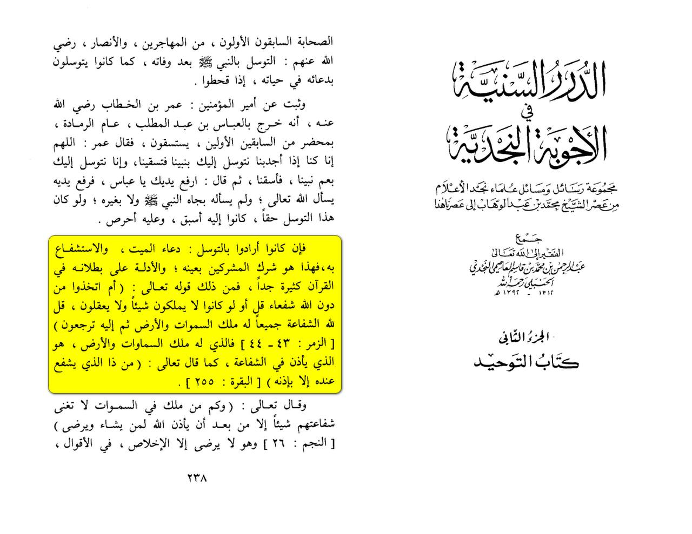

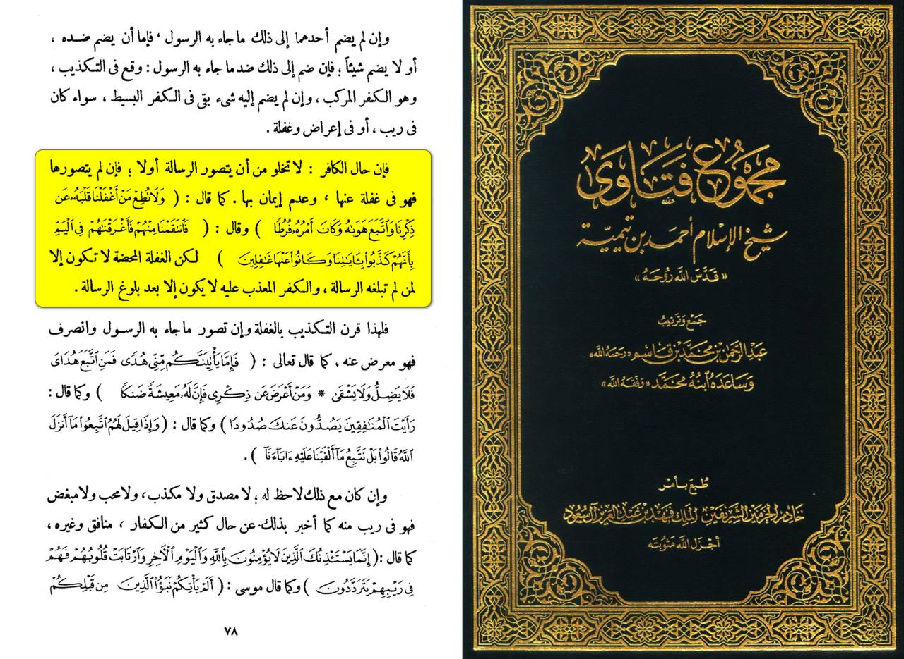

---

<!-- telegram-source: dar/messages2.html#message1966 -->
<!-- evidence-id: 000067 -->

Sheikh al-Islam Ibn Taymiyyah said:

This applies when dealing with obscure doctrinal issues; in such cases, it may be said that a person is mistaken and misguided but should not be declared a disbeliever until the proof that establishes disbelief against him has been made clear.

However, this situation also occurs among certain groups in matters that are clear and well known to both the general public and the scholars of Islām—indeed, even the Jews and Christians recognize that Muḥammad (ﷺ) was sent with these teachings and that he declared those who opposed them to be disbelievers.

For example, his command to worship Allāh alone with no partner, and his prohibition against worshiping anyone besides Allāh—whether angels, prophets, the sun, the moon, the stars, idols, or anything else. These are among the most apparent symbols of Islām. Likewise, his command to establish the five daily prayers, his obligation regarding them, and his emphasis on their importance.

Similarly, his enmity toward the Jews, Christians, polytheists, Ṣābians, and Magians, as well as his prohibition of immoral acts, usury, alcohol, gambling, and other such matters. Yet, despite all of this, many of their leaders have fallen into these prohibited actions and thus became apostates, even though they may later repent and return to Islām.

[Majmū' al-Fatāwā by Ibn Taymiyyah 4/54]

Show attached source scan

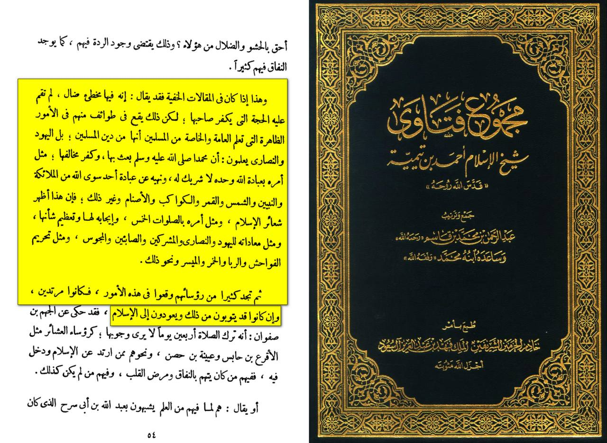

---

<!-- telegram-source: personal/messages.html#message612 -->
<!-- evidence-id: 000068 -->

Shaykh al-Islam Ibn Taymiyyah says:

“As for others besides these, some of them pray facing the grave, some prostrate to it, and some prostrate at the doorway of a structure built over the grave. Some even consider prostration to the one buried sufficient, substituting it for the five daily prayers — so they prostrate to this dead person and do not prostrate to the Creator. Sometimes, the one buried is believed to be righteous, though in reality he is not — and this is found in places like Egypt, al-Shām, al-ʿIrāq, and elsewhere.

Some of them ask from the dead what should only be asked from Allāh, saying: “Forgive me,” “Provide for me,” “Grant me victory,” and similar requests — just as a person says such things in his prayer to Allāh, exalted be He. These and similar matters are, without doubt, contrary to the religion of all the messengers, as anyone who knows the religion of Islām would understand. Indeed, they are a form of shirk that Allāh and His Messenger have forbidden — rather, it is the very shirk for which the Messenger ﷺ fought the mushrikīn.

If the people doing this are excused due to ignorance and the ḥujjah (proof) has not been established against them — as those who were not reached by a messenger are excused — then their judgment is with Allāh (In the hereafter). As He said: “We do not punish until We have sent a messenger” [al-Isrāʾ: 15].

Otherwise, they deserve the worldly and eternal punishment that others like them among the mushrikīn deserve . Allāh said: “So do not set up rivals to Allāh while you know” [al-Baqarah: 22].

And in the ḥadīth: “Indeed, shirk in this ummah is more hidden than the crawling of ants.”

Those who truly believe in the Messenger — when it becomes clear to one of them the reality of what the Messenger brought, and it becomes clear to him that he had fallen into shirk — then he repents to Allāh and renews his Islām, embracing Islām again in repentance from that shirk .”

[Qāʿidah ʿAẓīmah fī al-Farq bayna ʿIbādāt Ahl al-Islām wa-al-Īmān wa-ʿIbādāt Ahl al-Shirk wa-al-Nifāq p.69-70]

i say: Ibn Taymiyyah affirms the person here fell into shirk, (and the one who commits shirk is a mushrik) who needs to renew his islam.

Show attached source scan

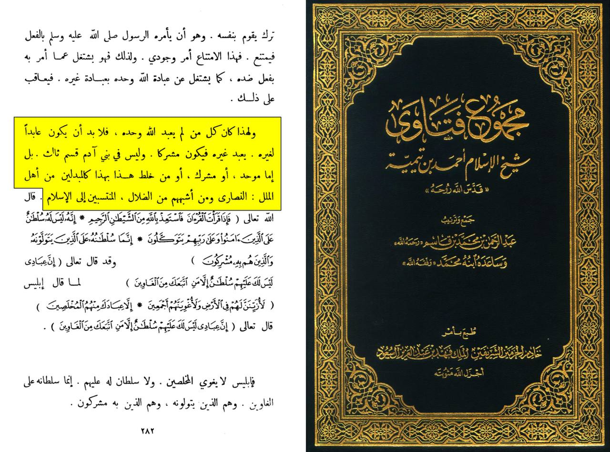

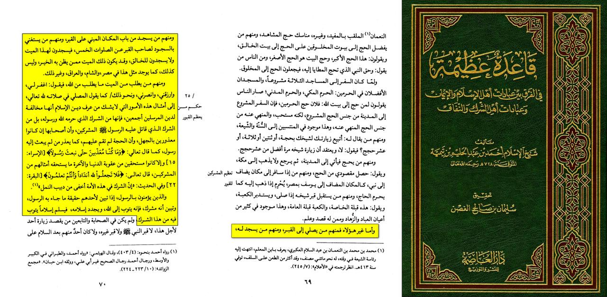

---

<!-- telegram-source: personal/messages.html#message614 -->
<!-- evidence-id: 000069 -->

Shaykh al-Islam Ibn Taymiyyah said:

And whoever grows up among the ignorant mushrikīn will not be blamed, hated, or disgraced by them so long as he follows their same religion, as long as he is known among them for truthfulness, trustworthiness, doing what they recognize as obligatory, and avoiding what they recognize as evil.

And Allāh the Exalted said: “And We do not punish until We have sent a Messenger.” [Sūrat al-Isrāʾ 17:15] Thus, such people were not deserving of punishment before the coming of the Message, even if neither he nor they knew what the Messenger had been sent with

[Tafsīr Āyāt Ashkalat by Ibn Taymiyyah 1/192-193]

These are clear statements that he applied their worldly descriptions I.e label of mushrik and separated the rulings of punishment being applied after the proof is established upon them.

Show attached source scan

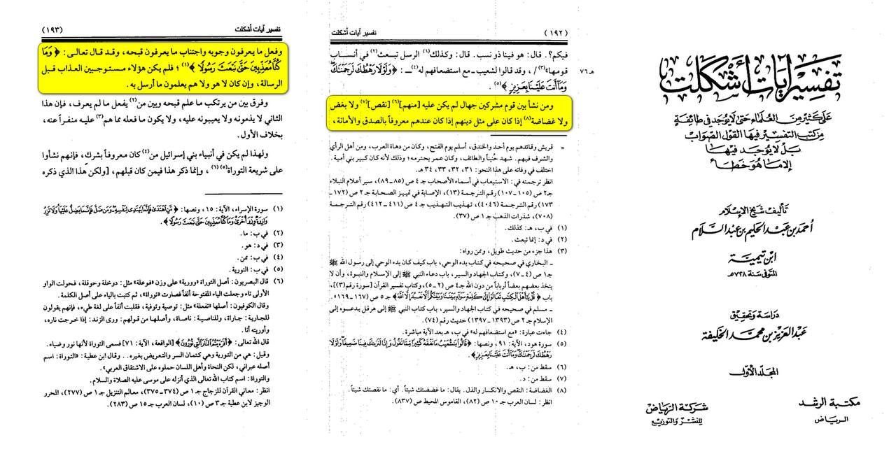

---

### Tawḥīd, major shirk, and the description of the doer
<!-- evidence-id: 000070 -->

Sheikh al-Islam Ibn Taymiyyah said:

Similarly, his statement that if the polytheists were to abandon the worship of idols, they would still remain ignorant of the truth to the extent of what they had abandoned, is among the types of disbelief (kufr) that are universally and necessarily known to be false by all religious communities.

The people of all religions (meaning the Christian , Jews and Muslims) agree [by Ijmā] that all the messengers prohibited the worship of idols and declared those who practice it to be disbelievers. A believer is not considered truly faithful until he renounces the worship of idols and everything worshiped besides Allah.

As Allah, the Exalted, says: ‘You already have an excellent example in Abraham and those with him, when they said to their people, “We totally dissociate ourselves from you and ˹shun˺ whatever ˹idols˺ you worship besides Allah. We reject you. The enmity and hatred that has arisen between us and you will last until you believe in Allah alone’ [Al-Mumtaḥanah: 4]….

…This is more apparent and evident among the people of the various religions, such as the Jews and the Christians—let alone the Muslims—than needing to be supported by a specific text.

Whoever says that the idol worshipers, if they abandon them, would still be ignorant of the truth to the extent they have abandoned these idols, is more disbelieving than the Jews and the Christians And whoever does not declare them disbelievers is more disbelieving than the Jews and the Christians, for the Jews and Christians declare the idol worshipers to be disbelievers.

How then, can one claim that someone who abandons the worship of idols is ignorant of the truth to the same extent they have abandoned it?

Moreover, it is said: ‘The scholar knows whom they worshiped and in which form He appeared for them to worship.’ The differentiation and multiplicity in idols is similar to the different members of a visible form, or the different spiritual powers in an invisible form. But to worship anything other than Allah is far worse than the disbelief of idol worshipers.

The latter only took idols as intercessors and mediators, as they said: ‘We do not worship them except to bring us closer to Allah’ (Az-Zumar: 3). Allah, the Exalted, says: ‘Or have they taken gods besides Allah? Say: ‘What! Even though they have no power over anything and cannot reason?’’ (Az-Zumar: 43).

Source: Majmū al-Fatawā by Ibn Taymiyyah 2/128-129.

---

<!-- evidence-id: 000071 -->
Sheikh al-Islam Ibn Taymiyyah said:

And for this reason, everyone who does not worship Allah alone will inevitably be a worshipper of something else. He worships other than Him and thus becomes a mushrik. There is no third category among the children of Ādam. Rather, one is either a muwaḥḥid, or a mushrik, or someone who mixes this with that, like the altered ones from among the religions — such as the Christians and those like them from among the misguided who claim affiliation with Islam.

Source: Majmū' al-Fatāwā by Ibn Taymiyyah 14/282.

Show Arabic source text

المصدر: مجموع الفتاوى

<h4 dir="rtl">ص. 282</h4>

تَرَكَ الْمَحْظُورَ إلَّا عَلَى تَرْكٍ يَقُومُ بِنَفْسِهِ. وَتَارِكُ الْمَأْمُورِ: إنَّمَا يُعَاقَبُ عَلَى تَرْكٍ يَقُومُ بِنَفْسِهِ. وَهُوَ أَنْ يَأْمُرَهُ الرَّسُولُ صلى الله عليه وسلم بِالْفِعْلِ فَيَمْتَنِعُ. فَهَذَا الِامْتِنَاعُ أَمْرٌ وُجُودِيٌّ. وَلِذَلِك فَهُوَ يَشْتَغِلُ عَمَّا أُمِرَ بِهِ بِفِعْلِ ضِدِّهِ، كَمَا يَشْتَغِلُ عَنْ عِبَادَةِ اللَّهِ وَحْدَهُ بِعِبَادَةِ غَيْرِهِ. فَيُعَاقَبُ عَلَى ذَلِك. وَلِهَذَا كَانَ كُلُّ مَنْ لَمْ يَعْبُدْ اللَّهَ وَحْدَهُ، فَلَا بُدَّ أَنْ يَكُونَ عَابِدًا لِغَيْرِهِ. يَعْبُدُ غَيْرَهُ فَيَكُونُ مُشْرِكًا. وَلَيْسَ فِي بَنِي آدَمَ قِسْمٌ ثَالِثٌ. بَلْ إمَّا مُوَحِّدٌ، أَوْ مُشْرِكٌ، أَوْ مَنْ خَلَطَ هَذَا بِهَذَا كَالْمُبَدِّلِينَ مِنْ أَهْلِ الْمِلَلِ: النَّصَارَى وَمَنْ أَشَبَهَهُمْ مِنْ الضُّلَّالِ، الْمُنْتَسِبِينَ إلَى الْإِسْلَامِ. قَالَ اللَّهُ تَعَالَى {فَإِذَا قَرَأْتَ الْقُرْآنَ فَاسْتَعِذْ بِاللَّهِ مِنَ الشَّيْطَانِ الرَّجِيمِ} {إنَّهُ لَيْسَ لَهُ سُلْطَانٌ عَلَى الَّذِينَ آمَنُوا وَعَلَى رَبِّهِمْ يَتَوَكَّلُونَ} {إنَّمَا سُلْطَانُهُ عَلَى الَّذِينَ يَتَوَلَّوْنَهُ وَالَّذِينَ هُمْ بِهِ مُشْرِكُونَ} وَقَدْ قَالَ تَعَالَى {إنَّ عِبَادِي لَيْسَ لَكَ عَلَيْهِمْ سُلْطَانٌ إلَّا مَنِ اتَّبَعَكَ مِنَ الْغَاوِينَ} لَمَّا قَالَ إبْلِيسُ {لَأُزَيِّنَنَّ لَهُمْ فِي الْأَرْضِ وَلَأُغْوِيَنَّهُمْ أَجْمَعِينَ} {إلَّا عِبَادَكَ مِنْهُمُ الْمُخْلَصِينَ} قَالَ تَعَالَى {إنَّ عِبَادِي لَيْسَ لَكَ عَلَيْهِمْ سُلْطَانٌ إلَّا مَنِ اتَّبَعَكَ مِنَ الْغَاوِينَ} . فَإِبْلِيسُ لَا يُغْوِي الْمُخْلَصِينَ. وَلَا سُلْطَانَ لَهُ عَلَيْهِمْ. إنَّمَا سُلْطَانُهُ عَلَى الْغَاوِينَ. وَهُمْ الَّذِينَ يَتَوَلَّوْنَهُ، وَهُمْ الَّذِينَ بِهِ مُشْرِكُونَ.

---

<!-- evidence-id: 000072 -->
Imām Abū Buṭayn, after quoting Shaykh al-Islām Ibn Taymiyyah who said: “Whoever commits shirk is a mushrik; he is to be asked to repent, and if he repents, [all is well]; otherwise, he is to be killed.”

He (Abū Buṭayn) said: He (Ibn Taymiyyah) asserted in many places the takfīr of whoever commits what he mentioned of the various types of shirk, and he transmitted the ijmāʿ of the Muslims on that, without excluding the jāhil or the like.

And Allāh, the Exalted, said: “Indeed, Allāh does not forgive that partners be associated with Him” (al-Nisāʾ: 48). And He related about al-Masīḥ that he said: “Whoever associates partners with Allāh, Allāh has surely forbidden Paradise for him, and his abode will be the Fire” (al-Māʾidah: 72).

So whoever restricts this threat to only the stubborn rejecter, and excludes the ignorant, or the interpreter, or the blind follower, then such a person has opposed Allāh and His Messenger and departed from the path of the believers.

Source: al-ʿUdhr bil-Jahl taḥta al-Mijhar ash-Sharʿī by Madḥat Āl Farāj p.54.

---

### Scholars explaining or transmitting Ibn Taymiyyah’s position
<!-- evidence-id: 000073 -->

Sheikh Muḥammad Ibn ʿAbdul-Wahhāb said:

So, if you understand this and grasp it fully, know that this is the path of the messengers, those who followed in their footsteps from among their family, companions, and successors, as well as the rightly guided scholars who came after them. The proof of God is the Qur'an, and whoever the Qur'an reaches has no excuse. Not every form of ignorance is an excuse for its possessor.

These ignorant followers of the disbelievers are considered disbelievers by the consensus of the Ummah—except for those who are truly incapable of reaching the truth and knowing it, those who have no means to do so under any circumstance, despite their love for the truth, their desire for it, their seeking of it, and the absence of anyone to guide them. Also exempt are those who are new to Islam or those who grew up in a remote desert. These are the ones whom the scholars have mentioned as excused, for the proof has not been established against them. Thus, an individual is not declared a disbeliever until they are made aware and the proof is established against them with clarification.

As for the deception and misleading arguments of some who claim that Shaykh al-Islām refrained from declaring an ignorant individual a disbeliever, this is mere obfuscation meant to deceive those with weak insight. His stance was only in specific matters whose evidences might be obscure to some people, such as issues related to divine decree (qadar), irjāʾ (postponing judgment on sinners), and similar topics introduced by the people of desires (ahl al-ahwāʾ). Some of their statements contain elements of disbelief because they reject clear and recurrent proofs from the Qur'an and Sunnah. Thus, the statement itself may be disbelief, but the one who utters it is not necessarily judged a disbeliever due to potential barriers, such as ignorance or unawareness of the scriptural text or its meaning. Religious obligations are only binding once they have been conveyed, which is why he mentioned this in his discussion on the innovations of the people of desires.

Shaykh al-Islām (Ibn Taymiyyah) explicitly clarified this when he spoke about the excommunication (takfīr) of certain prominent theologians. After establishing this principle, he said:

"If the matter pertains to obscure issues ( masāʾil khafiyyah) , one might say that there is no takfīr. However, regarding clear and evident issues or those necessarily known in the religion (maʿlūm min al-dīn bil-ḍarūrah) , there is no hesitation in declaring the speaker a disbeliever."

These fools, however, have generalized the issue and treated all ignorance as an excuse without distinction. They equated clear and evident matters—those known as essential parts of the religion—with obscure issues whose proofs may be hidden from some people. Likewise, they compared those living among Muslims with those raised in a remote desert or newly converted to Islam. As a result, they deviated and led many others astray, veering away from the straight path.

Source: Ijmāʿ Ahl as-Sunnah an-Nabawiyyah ʿalā Takfīr al-Muʿaṭṭilah al-Jahmiyyah p.116-117.

---

<!-- evidence-id: 000074 -->
A doubt the Murjiah bring to excuse Shirk

al-‘Allāmah ‘Abdullāh Abā Butayn said:

Some who argue in defense of the polytheists cite the story of the man who instructed his family to burn his body after his death as evidence that someone who commits an act of disbelief out of ignorance is not deemed a disbeliever—only the stubborn rejecter is.

The response to this is that ALLĀH (ﷻ) sent His messengers as bearers of glad tidings and warnings so that people would have no excuse before Him after the messengers had been sent. The greatest message they conveyed and called people to was the worship of ALLĀH (ﷻ) alone, without any partner, and the prohibition of associating others with Him in worship.

If someone who commits major polytheism is excused due to ignorance, then who is not excused? The implication of this claim is that ALLĀH (ﷻ) has no argument against anyone except the stubborn rejecter. However, the proponent of this argument cannot remain consistent in their reasoning; they will inevitably contradict themselves. For instance, they cannot refrain from declaring as disbelievers those who doubt Muḥammad’s (ﷺ) prophethood, the resurrection, or other fundamental tenets of faith—yet the doubter, too, is ignorant.

he then goes on to say:

The one who claims that a person who commits kufr (disbelief) due to ta’wīl (misinterpretation), ijtihād (independent reasoning), khata’ (mistake), taqlīd (blind following), or jahl (ignorance) is excused is in clear opposition to the Kitāb (Qur’an), the Sunnah, and the Ijmāʿ (scholarly consensus) without a doubt. Moreover, such a person must inevitably contradict their own principle, for if they were to apply it consistently, they would inevitably fall into kufr themselves—just as one would if they hesitated in declaring as kāfir someone who doubts the Risālah (prophethood) of Muḥammad ﷺ.

As for the man who instructed his family to burn his body and whom ALLĀH (ﷻ) forgave despite his doubt regarding one of the attributes of the Almighty Lord, He forgave him because the message had not reached him—this is what several scholars have stated.

For this reason Ibn Taymiyyah رحمه الله, said: "Whoever doubts one of the attributes of the Lord, and such doubt is in something that one like him should not be ignorant of, is a disbeliever. However, if it is something that one like him could be ignorant of, he is not deemed a disbeliever." He further stated: "This is why the Prophet (ﷺ) did not declare the man who doubted ALLĀH’S power to be a disbeliever,because such disbelief only applies after the message has reached a person." Ibn ʿAqīl also held this view, interpreting the case as one where the man had not received the message.

Shaykh Taqi Ad-Dīn's stance regarding ALLĀH’S attributes was that ignorance does not render a person a disbeliever. However, when it comes to polytheism and similar matters, he did not hold the same view, as will be shown later,إن شاء الله. We have already mentioned some of his statements regarding the Ittihadiyyah (a sect that believed in the unity of existence) and others, and his ruling that whoever doubts their disbelief is himself a disbeliever.

The author of Al-Ikhtiyarat stated: "Apostasy applies to anyone who associates others with ALLĀH (ﷻ), hates the Prophet (ﷺ) or what he brought, fails to reject wrongdoing in his heart, believes that some of the Companions fought alongside the disbelievers or deems such an act permissible, denies a matter upon which there is definitive consensus, or places intermediaries between himself and ALLĀH (ﷻ) relying on them, calling upon them, and seeking from them—this is unanimous disbelief."

He further stated: "Whoever doubts one of ALLĀH’S attributes in a way that one like him should not be ignorant of is an apostate. However, if it is something one like him could be ignorant of, he is not an apostate. This is why the Prophet (ﷺ) did not declare the man who doubted ALLĀH’S power to be a disbeliever."

---

<!-- evidence-id: 000075 -->
Shaykẖ ʿAbd Al-Laṭīf said:

As for the Jahmiyyah and the worshipers of graves, citing such texts to argue against declaring them disbelievers is only done by someone who has not truly understood Islam and the message with which Allah sent His noble messengers.

The essence of what the messengers brought and called to is the obligation of worshiping Allah alone with no partners, sincerely dedicating all acts of devotion to Him, and not associating any of His creation in what is exclusively His right. Moreover, they affirmed what Allah described Himself with—attributes of perfection and majesty.

Whoever opposes this message, denies it, or invalidates it is a misguided disbeliever, even if he says, “La ilaha illa Allah” and claims to be a Muslim. This is because the shirk he commits contradicts the very meaning of the testimony of faith. Thus, merely uttering “La ilaha illa Allah” does not benefit him, as he has spoken words he did not act upon, nor did he believe in what they entail.

As for the statement: “We say that the statement is disbelief, but we do not judge the speaker as a disbeliever,”

This is an absolute misunderstanding because such an expression only applies to specific individuals. The issue of declaring an individual a disbeliever (takfīr al-mu‘ayyan) is well known: if someone utters a statement that is itself an act of disbelief, it is said, “Whoever says this statement is a disbeliever.” However, when a specific individual says it, he is not judged as a disbeliever until the proof that necessitates disbelief for its denier has been established against him.

This applies to hidden matters whose evidences may be obscure to some people, such as issues related to qadar and irjā’ and similar matters that were introduced by the people of desires (ahl al-ahwā’). Some of their statements entail disbelief because they involve rejecting the clear and established proofs from the Qur’an and Sunnah. In such cases, while the statement itself may be disbelief, the one who utters it is not necessarily judged as a disbeliever due to possible barriers like ignorance or lack of knowledge about contradicting the text or its implications.

Religious rulings only become binding after they have been conveyed. Shaykh al-Islām Ibn Taymiyyah (may Allah sanctify his soul) mentioned this in many of his writings. He also stated that some prominent scholars of kalām were declared disbelievers after he had clarified this principle. He said:

“This applies to hidden matters, and it may be said that no judgment of disbelief should be made in such cases. However, regarding the obvious and clear issues or those known by necessity in religion, there is no hesitation in declaring the one who contradicts them a disbeliever.”

Therefore, do not use this statement “We say that the statement is disbelief, but we do not judge the speaker as a disbeliever” as a crutch to refute those who declare a town disbelieving when it refuses to worship Allah alone or denies His attributes, after the proof has been established against it and the truth has been made clear.

Source: Ijmāʿ Ahl as-Sunnah an-Nabawiyyah ʿalā Takfīr al-Muʿaṭṭilah al-Jahmiyyah p.157-159.

---

<!-- evidence-id: 000076 -->
Shaykh ʿAbd ar-Raḥmān Ibn Ḥasan said:

Shaykh al-Islām (Ibn Taymiyyah), may Allāh have mercy on him, said: “Building mosques on graves is prohibited, and even if something other than a mosque is built on them, it is prohibited by the consensus of scholars, as it is a means to shirk and a forbidden act.”

He also said: “Know that the term ‘du’ā’ in the Qur’ān refers to two meanings: the ‘du’ā’ of worship’ and the ‘du’ā’ of asking.’ Every worshipper is a seeker, and every seeker is a supplicant. One term can encompass the other when separated from its context, and when both meanings are combined, it refers to one who asks for the seeking of benefits and the removal of harm through the forms of asking and requesting.”

I (Shaykh ʿAbd ar-Raḥmān Ibn Ḥasan) say: Look at this contradiction, confusion, and inconsistency. There is no doubt that disbelief opposes faith, invalidates it, and nullifies deeds, as confirmed by the Qur’ān, Sunnah, and the consensus of Muslims. Allāh, the Exalted, says: “And whoever disbelieves in the faith, his deeds are invalid, and he is among the losers in the Hereafter.” (Al-Mā’idah: 5).

It is said that every disbeliever is mistaken, and the polytheists have their justifications. They believe that their polytheism towards the righteous is an act of honoring them that benefits them and wards off harm. But Allāh did not excuse them for this mistake or misinterpretation. Allāh says: “And those who take protectors besides Him say, ‘We only worship them that they may bring us nearer to Allāh.’

Allāh will judge between them concerning what they differ.” (Az-Zumar: 3). And He also says: “Say, ‘Shall we inform you of the greatest losers in deeds? Those whose efforts have been wasted in this worldly life while they think that they are doing good.’” (Al-Kahf: 103-104). Where is the reason of this person in relation to these and similar clear verses?

The scholars, may Allāh have mercy on them, followed the path of uprightness and discussed the ruling of apostasy. None of them said that if a person commits an act of disbelief or says something of disbelief while not knowing that it contradicts the testimony of faith, he is not considered a disbeliever due to his ignorance.

And Allāh has clarified in His Book that some of the polytheists are ignorant followers, yet their ignorance and blind imitation did not prevent them from facing Allāh’s punishment, as He said:  “And among the people is he who disputes about Allāh without knowledge and follows every rebellious devil … to His saying: ‘The punishment of the Blaze.’” [Al-Ḥajj: 3-4]

Source: Taḥqīq Madhhab Ibn Taymiyyah fī Masʾalatay al-ʿUdhr bil-Jahl wa Takfīr al-Muʿayyan By Shaykh ʿAbd ar-Raḥmān Ibn Ḥasan Āl ash-Shaykh p.30-31.

---

<!-- evidence-id: 000077 -->
Sheikh Muḥammad ibn Ibrāhīm, may Allah have mercy on him, said:

“The issue of declaring a specific individual a disbeliever (takfīr al-mu‘ayyan):

Some people claim that an individual should never be declared a disbeliever. They misunderstand certain statements of Ibn Taymiyyah and mistakenly believe that only those whom the Qur’an explicitly declares as disbelievers—such as Pharaoh—can be ruled as such. However, the Qur’anic texts do not specify every single person. They study the rulings on apostasy but never apply them to anyone! This is utter misguidance and extreme ignorance. Rather, these rulings must be applied—but with conditions.

As for those who hesitated to declare an individual a disbeliever in matters where the evidence may be unclear, they do not rule takfīr until the prophetic proof has been fully established against the person, in both its authenticity and meaning. Once the proof has been clearly explained, the person is ruled a disbeliever—whether he understands and rejects it, or claims not to understand. Not all disbelief stems from mere obstinacy.

However, regarding matters that are known by necessity to be part of what the Messenger ﷺ brought, if someone opposes them, then he is ruled a disbeliever immediately, without the need for further clarification—whether in fundamental or subsidiary matters—unless he is new to Islam.

The third category involves ambiguous matters. In such cases, a person is not ruled a disbeliever, even after evidence has been presented to him—whether the issue pertains to fundamentals or secondary issues. An example of this is the man who instructed his family to burn his body after his death.”

Source: Muʿjam al-Tawḥīd 3/74.

---

<!-- evidence-id: 000078 -->
Sheikh Sulaymān ibn Suhmān said:

“Know that not every error, ijtihād, or ignorance is excused. Allah has informed us in the Qur’an of the ignorance of many disbelievers while still explicitly declaring their disbelief. He also described the Christians as ignorant, even though no Muslim doubts their disbelief. We are certain that most Jews and Christians today are ignorant followers, yet we still affirm their disbelief and the disbelief of anyone who doubts their disbelief.

The Qur’an makes it clear that doubting the fundamentals of religion is itself disbelief. Doubt is wavering between two positions—such as someone who neither affirms nor denies the truthfulness of the Messenger, or neither affirms nor denies the occurrence of resurrection, or someone who neither believes in the obligation of prayer nor in its lack of obligation, or who neither affirms nor denies the prohibition of fornication. This is disbelief by the consensus of the scholars, and there is no excuse for one who is in such a state simply because he does not understand Allah’s evidences and proofs. There is no excuse for him after the proof has reached him, even if he fails to comprehend it.

What led the followers of ‘Ittiḥādiyyah and Ḥulūliyyah into their blatant disbelief, grievous shirk, and complete denial of the true existence of the Lord of the worlds except their errors in this matter, in which they exercised their reasoning and went astray, misleading others from the straight path?

What led Al-Ḥallāj to his fate, with scholars unanimously agreeing on his execution, except the consequences of his so-called ijtihād? What caused the Qarmaṭians to embrace their vile heresies and abandon the bonds of Islam except their exercise of reasoning in what they falsely believed?

What led the Rāfiḍah to their disbelief, their polytheism, their worship of the Twelve Imams and others, and their cursing of the Companions of the Messenger of Allah (ﷺ) and his noble wives, except their so-called ijtihād? These people are the predecessors of this man and his likes, in claiming that ‘every error is excused.’

The logical conclusion of this claim would be that no one should be deemed sinful or declared a disbeliever for errors in all matters of fundamental belief—such as faith in Allah’s existence, His Lordship, His exclusive right to be worshiped, His Decree and Predestination, belief in His perfect attributes, His knowledge of all events before they occur, and other essential tenets.

If one were to deny responsibility and accountability for errors in these matters, it would entail exonerating the deniers of Allah’s essence, those who negate His Lordship, those who deny His names and attributes, those who reject His exclusive right to be worshiped, and those who claim that Allah does not know future events before they happen, such as the extreme Qadarites. Likewise, it would exonerate those who attribute worldly occurrences to celestial bodies, those who claim the existence of two eternal principles—light and darkness.

If this heretic upholds all of this, then he is more disbelieving and misguided than the Jews and Christians. But if he claims that there is a distinction between these matters and the current issue of dispute—namely, invoking the dead and the absent for things that only Allah can do—then let him prove this distinction with clear evidence.

If he fails to do so, his argument collapses, and people of knowledge will recognize him as a deceiver and a sophist, not a scholar of fiqh and religion. He will be exposed as someone unfamiliar with Islam and its adherents, unable to distinguish between monotheists and polytheists. Rather, he remains in the darkness of natural ignorance, doubt, and manifest confusion.

Only those who have deeply studied the works of Shaykh Al-Islām Ibn Taymiyyah and are well-versed in his principles can truly understand his words.

---

<!-- evidence-id: 000079 -->
al-‘Allāmah ‘Abdullāh Abā Butayn said:

As for the objector who asks: “Didn’t Ibn Taymiyyah excuse the one who misinterprets or blindly follows others, and say that Allāh forgives the ignorant in ways He does not forgive others?” The response to this is: Such a statement is only cited by someone who agrees with Ibn Taymiyyah that seeking help from the Prophet (ﷺ) and other deceased individuals is prohibited and is shirk. They may then argue that the ignorant might be excused.

However, if someone denies Ibn Taymiyyah’s stance on this matter, criticizes those who follow him, or even considers them disbelievers, then they have no basis for excusing the individuals in question—because they do not see them as mistaken at all, but rather as rewarded for following what they believe is Allāh’s command: “Seek means of approach to Him” (Al-Māʾidah 5:35), according to this distorter of Allāh’s words. Thus, there is no reason to seek an excuse for them.

Everything the Sheikh stated in this matter—meaning Tawḥīd—was not merely his personal opinion, but rather a clarification of what is clearly established in the Qurʾān, Sunnah, and scholarly consensus. May Allāh have mercy on him and be pleased with him.

The Sheikh also said: A person may do something they believe to be righteous without knowing that it is actually forbidden. In such a case, they will be rewarded for their good intention and excused due to their ignorance. This is a broad topic. He also said: ‘The ignorant are forgiven in ways that others are not.’ However, he meant this generally, not in every specific case.

That is why he also said in Sharḥ al-ʿUmda: “Any rejection of Allāh’s message or command is disbelief, whether minor or major. However, if the matter is obscure and the correct understanding is difficult to reach, then one may be excused—especially in minor issues related to jurisprudence. But if the issue is well known and fundamental to the religion, there is no excuse.”

And he was also told that shirk is never forgiven, even if it is minor. His student, the author of al-Furūʿ, narrated that he said: “That is because of the generality of Allāh’s statement: ‘Indeed, Allāh does not forgive associating partners with Him’ (An-Nisāʾ 4:48).”

In al-Risālah as-Saniyyah, Ibn Taymiyyah wrote: “Whoever exaggerates in their reverence for a prophet or righteous person and attributes to them some aspect of divinity—i.e, by calling upon them instead of Allāh, saying: ‘O my master, so-and-so, help me,’ or ‘save me,’ or ‘I put my trust in you,’ or ‘I am under your protection’—then this is all shirk and misguidance. The individual must be given a chance to repent; if they do, they are forgiven, but if they refuse, they must be executed.”

Similarly, in the case of those who believe in intermediaries, he said: “If someone commits this, they must be called to repent; if they refuse, they are to be executed.”

The general meaning of Allāh’s statement: “Indeed, Allāh does not forgive associating partners with Him” (An-Nisāʾ 4:48), applies to every polytheist. The jurists of all Islamic schools of thought state in their sections on apostasy that whoever associates partners with Allāh has committed disbelief, and they cite this verse and others like it as evidence. None of them excluded the ignorant from this ruling. Allāh also says: “Say: Shall We tell you who are the greatest losers in their deeds? They are those whose efforts in the worldly life were misguided, while they thought they were doing good” (Al-Kahf 18:103-104).

And: “A group was guided, while a group deserved to be in error, for they took devils as allies instead of Allāh, and they thought they were guided” (Al-Aʿrāf 7:30).

Ibn Jarīr (al-Ṭabarī) commented: “This is one of the clearest proofs against those who claim that Allāh does not punish anyone for a sin they committed or a misguidance they believed in—unless they knew it was wrong. If that were true, there would be no difference between the misguided ones who think they are upon guidance and those who are truly guided.

---

<!-- evidence-id: 000080 -->
Sheikh Abd al-Latif ibn Abd al-Rahman ibn Hasan Āl al-Shaykh said:

"As for al-`Irāqī and his misguided companions, they argued that the Sheikh (Ibn Taymiyyah) does not declare the ignorant to be disbelievers and that he says they are excused. They made this claim in a vague manner without providing details, and used this misconception as a shield to reject the Quranic verses and prophetic hadiths. They raised their voices against the monotheists, as was the case with their predecessors from the worshippers of graves and polytheists. And to Allah is the final return, and He is the Judge between His servants regarding what they differed in."

Source: Minhāj al-Tāsīs wa al-Taqdīs p.227.

Show Arabic source text

المصدر: منهاج التأسيس والتقديس

<h4 dir="rtl">ص. 227</h4>

بها وأنها مصقودة لذاتها المحمودة وعواقبها الحميدة.

وهذا الأصل هو أساس الكلام في هذه الطبقات الذي عليه ينبني، مع تلقي أحكامها من نصوص الكتاب والسنة لا من آراء الرجال وعقولهم، ولا يدري قدر الكلام في هذه الطبقة إلا من عرف ما في كتب الناس، ووقف على أقوال الطوائف في هذا الباب، وانتهى إلى غاية مرامهم ونهاية إقدامهم والله الموفق للسداد الهادي إلى الرشاد.

وأما من لم يثبت حكمة ولا تعليلا، ورد الأمر إلى محض المشيئة التي ترجح أحد المثلين على الآخر بلا مرجح، فقد أراح نفسه من هذا المقام الضنك واقتحام عقبات هذه المسائل العظيمة، وأدخلها كلها تحت قوله تعالى: {لا يُسْأَلُ عَمَّا يَفْعَلُ} [الانبياء: من الآية23] لكمال حكمته وعلمه، ووضعه الأشياء مواضعها وأنه ليس في أفعاله خلل ولا عبث ولا فساد يسأل عنه كما يسأل المخلوق، وهو الفعال لما يريد، ولكن لا يريد أن يفعل إلا ما هوم خير ومصلحة ورحمة وحكمة، فلا يفعل الشر ولا الفساد ولا الجور، ولا خلاف مقتضى حكمته لكمال أسمائه وصفاته وهو الغني الحميد العليم الحكيم&quot; انتهى.

فقف هنا وتأمل هذا التفصيل البديع، فإنه رحمه الله لم يستثن إلا من عجز عن إدراك الحق مع شدّة طلبه وإرادته له، فهذا الصنف هو المراد في كلام شيخ الإسلام وابن القيم وأمثالهما من المحققين رحمهم الله.

وأما العراقي وإخوانه المبطلون، فشبهوا بأن الشيخ لا يكفر الجاهل، وأنه يقول: هو معذور، وأجملوا القول ولم يفصلوا، وجعلوا هذه الشبهة ترساً يدفعون به الآيات القرآنية والأحاديث النبوية، وصاحوا على عباد الله الموحدين، كما جرى لأسلافهم من عباد القبور والمشركين، وإلى الله المصير، وهو الحاكم بعلمه وعدله بين عباده فيما كانوا فيه يختلفون.

وأما من أعرض عن الهدى ودين الحق، ولم يرفع به رأساً بعد معرفته أو مع تمكنه من معرفته، فالأدلة القرآنية والأحاديث النبوية دالة على دخول هؤلاء

---

<!-- evidence-id: 000081 -->
Shaykh ʿAbd ar-Raḥmān Ibn Ḥasan said:

He (Ibn Qayyim) said: “Islam is the monotheism of Allah and worshipping Him alone with no partner, believing in His Messenger, and following what he brought. If a person does not fulfill this, he is not a Muslim. Even if he is not oppositional, he is an ignorant disbeliever. The nature of this category is that they are ignorant disbelievers, not oppositional. Their lack of opposition does not take them out of disbelief. The disbeliever is the one who denies the oneness of Allah and denies His Messenger, either out of opposition or ignorance, or following the traditions of their forefathers out of stubbornness.”

Allah has informed us in the Qur’an, in several places, of the punishment for those who blindly follow their ancestors from the disbelievers. They will dispute in Hell, and the followers will say: “Our Lord, these are the ones who led us astray, so give them double the punishment in the Fire.” Allah will say: “For each there is double, but you do not know.” (Al-A’raf: 38) This is a summarized explanation, and this verse has many similar instances in the Qur’an. Praise be to Allah for the clarity of the explanation.

The clear verses also show the disbelief of those who associate others with Allah in His worship. Allah says: “When man is touched with harm, he calls upon his Lord, turning to Him alone. But when He grants him a favor from Himself, he forgets what he had been calling to Him before, and he makes equals to Allah to mislead others from His way. Say: ‘Enjoy your disbelief for a little while; indeed, you are of the companions of the Fire.’” (Az-Zumar: 8)

Source: Taḥqīq Madhhab Ibn Taymiyyah fī Masʾalatay al-ʿUdhr bil-Jahl wa Takfīr al-Muʿayyan By Shaykh ʿAbd ar-Raḥmān Ibn Ḥasan Āl ash-Shaykh p.32.

---

<!-- evidence-id: 000082 -->
Sheikh Sulaymān ibn Suhmān said:

As for the statement: “And I used to affirm that Allah has forgiven this ummah for its mistakes, including mistakes in both doctrinal and practical matters.”

I say: The actual words of the Sheikh (Ibn Taymiyyah) have been altered in a way that obscures his intent and meaning. At the beginning of his statement, he said: “I am always— and those who sit with me know this— one of the strongest opponents of labelling a specific individual as a disbeliever, a sinner, or an evildoer unless it is known that the prophetic proof has been established against him. Whoever opposes it is sometimes a disbeliever, sometimes a sinner, and sometimes an evildoer. And I affirm that Allah has forgiven this ummah…”

Thus, the Sheikh’s statement about not declaring a specific individual a disbeliever before the proof is established refers to specific issues where the evidence may be unclear to some people, such as matters of Qadar, Irjāʾ, and similar theological positions held by sects of Ahl al-Ahwāʾ.

Some of their statements may contain aspects of disbelief, such as rejecting certain clear proofs from the Qur’an and Sunnah. Such statements may be classified as kufr, but the one making them is not necessarily ruled a disbeliever due to the possibility of an extenuating factor, such as ignorance or lack of awareness of the text itself or its interpretation. This is because taklīf only applies after the message has reached a person.

That is why Ibn Taymiyyah mentioned this in the context of the innovations of Ahl al-Ahwāʾ. He explicitly clarified this by stating—when discussing the disbelief of certain prominent theological figures after establishing this principle:

“This applies when the matter is obscure (khafiyyah), so one might argue against declaring such a person a disbeliever. However, when it comes to clear and obvious matters, or those known necessarily from the religion, then there is no hesitation in declaring the one who denies them a disbeliever.” This has already been explained previously.

The dispute between us and these extremists is not about theoretical, subtle, or interpretive issues where the evidence might be unclear. Rather, the dispute concerns the act of directing exclusive rights of Allah to saints and righteous people—such as supplication, love, fear, hope, seeking aid, and other forms of worship. This is something known necessarily from the religion of Islam—that only Allah deserves such acts of devotion. Whoever directs any of these acts to anyone other than Allah is a disbeliever and a polytheist.

Source: al-Asinnah al-Ḥaddād fī Kashf Shubuhāt ʿAlawī al-Ḥaddād p. 159-160.

---

<!-- evidence-id: 000083 -->
Shaykh Ṣāliḥ al-Fawzān Was asked:

Q: certain preachers who claim to follow Salafiyyah, (who are really) modern-day Murji'ah, have spread a particular interpretation of Ibn Taymiyyah's words. They say: "We don't do individual takfir until conditions are met and obstacles are removed." Or they say: "Not everyone who commits Kufr is necessarily ruled as Kafir." Or statements that are general concerning the ruling by what is apparent of Islam.

Similarly, may Allah protect you, is about to Imam al-Mujaddid Muhammad ibn Abdul-Wahhab and his statement: "We do not takfir those who worship the grave of Abdul-Qadir, and the grave of Ahmad al-Badawi and their likes, due to their ignorance, and due to no one informing them." (To clarify this statement in’sha’allah which is heavily used by the Murji’ah, This is related to the hukm (ruling) for the hereafter  however they are labeled a mushrik in this life).  [Durar as-Saniyyah, 1/104]

Similarly, with the statements of some scholars that say only judge can do takfir, As well as words of Ibn Uthaymeen about a person who commits shirk. They argue using these general statements, that the individual ignorant grave-worshipper, who claims Islam, is a Muslim in reality. They attribute this understanding to the scholars. Is this true?

A: This is a lie and slander against them (the scholars), and is misguidance. This is a lie and slander against them.

---

<!-- evidence-id: 000084 -->
Shaykh ʿAbd al-ʿAzīz al-Rājihī was asked:

Question: Is a person excused due to ignorance if he performs acts of shirk, such as circumambulating a grave, without knowing that what he is doing is shirk against Allah Almighty?

Answer: Those who committed such acts before the sending of the Prophet ﷺ are referred to as Ahl al-Fatrah (people of the interval between prophets), and there is scholarly discussion concerning them. As for after the sending of the Prophet ﷺ and the revelation of the Qur’ān, Allah says: “And We never punish until We have sent a Messenger.” [al-Isrāʾ: 15]

So, Allah has sent the Messenger and revealed the Qur’ān. Is the mushrik then excused if he is misled into believing that circumambulating graves, invoking them besides Allah, or sacrificing to them is permissible, due to the deception of evil scholars who disguise and beautify shirk for him—so much so that the truth becomes obscured and he no longer recognizes it? Some scholars have said: Yes, he may be excused in such a case, but he is treated in this world like a mushrik—i.e., he is not washed, not prayed over, and not buried in Muslim cemeteries—just as Ahl al-Fatrah are treated.

This view was adopted by Shaykh Muḥammad ibn ʿAbd al-Wahhāb, may Allah have mercy on him, who said:

“We do not declare anyone a disbeliever until the proof has been established upon him.” Other scholars, however, held that no one is excused after the sending of the Messenger ﷺ, since Allah says: “And We never punish until We have sent a Messenger.”, and indeed, the Messenger has been sent, and the Qur’ān has been revealed and is recited. Its texts are clear in warning against shirk and in defining it. Therefore, they are not excused.

These two positions are both attributed to the scholars, and were mentioned by Shaykh al-Islām Ibn Taymiyyah and others. May Allah grant everyone success in obeying Him, bless all with righteous deeds and beneficial knowledge, and may peace and blessings be upon Muḥammad, his family, and his companions.

https://shamela.ws/book/37010/193

---

<!-- evidence-id: 000085 -->
Shaykh ʿAbd al-ʿAzīz al-Rājihī was asked:

“Is the one who performs ṭawāf around graves or commits acts of shirk out of ignorance—meaning he does not know that what he is doing is shirk—to be excused? Please provide detail.

The Shaykh said: "The scholars have 2 opinions on this after the mission/prohethood (بعثة) of Prophet ﷺ — Ahl Al-Fiṭrah after the prophethood/mission of Prophet ﷺ, regarding them their is a scholarly discussion.

But after the Prophet ﷺ was sent and the Qur’ān was revealed—Allah says: “And We never punish until We have sent a messenger”—and indeed Allah has sent the Messenger and revealed the Qur’ān.

So is the mushrik excused if the matter has been confused for him—if he was performing ṭawāf around graves and calling upon them—and he did not perceive the truth, nor recognize it, because of the deception of corrupt scholars who distort things for him and beautify shirk in his eyes?

Some scholars have said he is excused in such a case, but he is treated in this world as a mushrik: he is not washed, not prayed over, not buried among Muslims, and no pilgrimage is performed on his behalf, nor is mercy invoked for him. In the Hereafter, his matter is left to Allah.

This is the position adopted by Shaykh Muḥammad ibn ʿAbd al-Wahhāb رحمه الله. He said that no one is declared a kāfir until the ḥujjah (proof) is established against him.

Other scholars said no one is excused after the Prophet ﷺ, because Allah says: “And We never punish until We have sent a messenger”—and the Messenger has been sent and the Qur’ān revealed, and the Qur’ān is recited and the texts are clear regarding the prohibition of shirk. Therefore, they are not excused. These are two views held by scholars.

In any case, those who say he is excused also say that in this world he is treated as a mushrik: he is not washed, not prayed over, not buried in the Muslim cemeteries, pilgrimage is not performed for him, and mercy is not invoked for him. As for the Hereafter, his matter is with Allah.

Shaykh al-Islām Ibn Taymiyyah رحمه الله said a profound statement. He said:

There are two types of shirk: greater and lesser. Whoever is free from both dies upon tawḥīd. Whoever is free from both dies upon tawḥīd and enters Paradise. Whoever is free from the greater enters Paradise.

Whoever dies upon the greater shirk enters the Fire. And whoever dies upon the lesser shirk—if his good deeds outweigh his bad—enters Paradise. That is because of the abundance of tawḥīd alongside a small amount of shirk. But if his bad deeds outweigh his good, he will be punished for this lesser shirk. Shirk is accounted for whether it is greater or if it is extensive in amount.

If it is small in comparison to much sincerity, this is the view of Shaykh al-Islām رحمه الله: shirk is held accountable in both of its forms—greater and abundant in quantity. If someone dies upon greater shirk, he dies from among the people of the Fire.

As for lesser shirk, it depends on whether his good deeds outweigh the bad or the opposite. If the bad deeds outweigh, then his good deeds are nullified and shirk overcomes them. But if the good deeds, especially tawḥīd, are abundant, they may outweigh the shirk.”

---

---

<!-- evidence-id: 000086 -->
Shaykh Sulaymān ibn Saḥmān said:

As for the deception and confusion by some of these people who claim that Shaykh al-Islām (Ibn Taymiyyah) refrained from declaring takfīr upon a specific ignorant individual — this is from distortion and misleading by those blind in perception. For what is intended by that relates to specific issues whose evidence may be hidden from some people — such as issues of qadar, irjāʾ, and similar matters which were spoken about by the people of desires. For some of their statements contain matters of disbelief — such as rejection of the clear and recurrent evidences of the Book and the Sunnah — so the statement that includes rejection of some revealed texts is disbelief, but the one who says it is not ruled to be a disbeliever due to the possibility of a preventing factor, such as ignorance or not knowing the actual text or its indication.

For the divine laws do not become binding except after they have been conveyed. And that is why he mentioned it in his discourse concerning the innovations of the people of desires. And he explicitly stated this, for after he explained this matter regarding the takfīr of specific individuals from among the mutakallimīn, he said: “This is when the matter pertains to subtle issues — so it may be said that no takfīr is to be made. But as for what occurs from them in clear, obvious issues — or in matters known by necessity from the religion — then there is no hesitation in the disbelief of the one who says it.”

Source: Kashf al-Awhām by Shaykh Sulaymān ibn Saḥmān p.116-117.

---

<!-- evidence-id: 000087 -->
An important fatawa and advice from Shaykh ʿAbd Allāh al-Jarbūʿ that I requested

Question I asked the Shaykh:

Shaykh, I have a question. I am from Britain, and here there is a well-known group that claims to be Salafī (SPUBS And their likes). Anyone who disagrees with them on this particular issue is labeled by them as a ḥaddādī , a takfīrī , or a khārijī .

Shaykh, they have attributed to scholars such as Shaykh Ibn Bāz, Shaykh Ibn ʿUthaymīn, Shaykh al-Fawzān, Ibn Taymiyyah, and others — that they excuse the mushrik and say that he is still a Muslim until the ḥujjah (proof) is established against him. They have (also) cited the ḥadīth of ash-shafā ʿ ah (intercession) in their writings to claim that a person can abandon all deeds and still enter Paradise.

Shaykh, I have gathered many, many, many statements from the scholars and translated them into English to warn against this group. Despite that, I was met with opposition, boycotting, insults, verbal abuse, and cursing — simply because I speak out against them. I have not found anyone here who opposes their beliefs. I need your advice on how to deal with this matter.

He responded: The ones you mentioned — Shaykh Ibn Taymiyyah, Ibn al-Qayyim, Ibn Kathīr, Shaykh Ibn Bāz — yes, they affirm al- ʿ udhr bil-jahl (excusing due to ignorance), but they still say that the mushrik is a kāfir . Their texts explicitly state that the ignorant one is given the same ruling as Ahl al-Fatrah — a disbeliever in the rulings of this world, while his matter is left to Allāh in the Hereafter (maybe he is excused).

The excuse of ignorance does not mean that someone who worships aṭ-ṭāghūt (false deities) is a Muslim. These people are blind — they do not know what Islām is. They are shallow-minded and followers of Dāwūd ibn Jirjīs. They are the brothers of the grave-worshippers and the polytheists.

Stay far away from them with the strongest form of separation. Do not pray behind them. Shaykh Ibn Bāz and Shaykh al-Fawzān explicitly gave fatāwā that whoever does not declare the mushrik to be a kāfir is just like him — they said it verbatim — and that one must not pray behind such people.

These individuals — and we seek refuge in Allāh — have fallen into disbelief. They themselves are disbelievers. Whoever does not declare the mushrik to be a kāfir is himself a kāfir .

Yes, al- ʿ udhr bil-jahl does not mean that a person who worships aṭ-ṭāghūt is a Muslim or that he is not a disbeliever. No. It means that if a person has not had knowledge reach him, even if he is a polytheist, then he will be questioned and tested on the Day of Judgement — as Ibn Kathīr said, and the authentic āthār support that they will be tested on the Day of Judgement.

That is the meaning of the excuse of ignorance. But to make ignorance equivalent to Islām — to claim that a person committing shirk due to ignorance is a Muslim — this is blindness of insight. Truly, these people are blind in their hearts.

Allāh ﷻ says: “So shall We make the Muslims like the criminals? What is [the matter] with you? How do you judge?” (Sūrat al-Qalam, 68:35–36)

What is wrong with you? How do you rule? What kind of evil, corrupt ruling is this?

The statement of Ibrāhīm عليه السلام is decisive — that no one is truly a Muslim except one who separates completely from shirk. Whoever falls into shirk — his deeds are rendered void, and he becomes among the losers, among the disbelievers, among the criminals.

These people are brothers of the worshippers of aṭ-ṭāghūt — stay away from them. Stay away from them.

This is not the path of the Salaf . It is not the way of the pious predecessors. Abandon them. Do not let them distract you from your path or mislead you.

This is a great darkness. Whoever says that the one who commits shirk is still a Muslim — he has fallen into kufr .

Shaykh al-Islām (Ibn Taymiyyah) stated that a group from the Salaf declared such people disbelievers. Among those who said this were {unclear}, Aḥmad ibn Ḥanbal, Abū ʿUbayd, and others.

I asked after : May Allah reward you, Shaykh.

---

---

<!-- evidence-id: 000088 -->
An Important clarification Of Shaykh al-Islam's speech which are commonly misquoted by the Murji'ah by Shaykh Ayman al-ʿAnqarī.

Shaykh Ayman al-ʿAnqarī said:

He (Ibn Taymiyyah) said in al-Radd ʿalā al-Ikhnāʾī (pp. 387–388):

“And among them are those who pray toward the grave of their shaykh, and face it in prayer, and say: ‘This is the qiblah for the private,’ and the Kaʿbah is the qiblah for the general.” “And I know of those who did this and that. And they are people with worship, asceticism, and religion, but in them is ignorance and misguidance, just as the monks of the Christians and others are among the most ascetic of people, and the most diligent in worship, yet with ignorance and misguidance….”

I (Ayman al-ʿAnqarī) say: Upon reflection on the words of the Shaykh, it becomes clear that they have no excuse, for several reasons:

The first: He did not describe them as Muslim, for he did not call them Muslims. His words: “They have worship, asceticism, and religion” do not imply that they are Muslim. And indeed, he did not call them that.

The second — which clarifies the preceding statement — is that he compared them to the Christians, and described the Christians as ignorant, even though he said of them: “Just as the monks of the Christians and others are among the most ascetic of people, and the most diligent in worship, yet with ignorance and misguidance.” Does this statement imply that the Christians are Muslim?!

Source: Taḥrīr Qawl Shaykh al-Islām Ibn Taymiyyah raḥimahullāh fī Fāʿil ash-Shirk al-Akbar by Shaykh Ayman al-ʿAnqarī p.91-92.

---

<!-- evidence-id: 000089 -->
The position of Imām Ibn Taymiyyah and Muḥammad Ibn ʿAbd al-Wahhāb on ʿUdhr bil Jahl explained by Shaykh Ibn Bāz

Shaykh Ibn Bāz was asked:

Q: What was the position of the Salaf — may Allāh have mercy on them — such as Imām Ibn Taymiyyah and Ibn ʿAbd al-Wahhāb regarding the issue of al-ʿudhr bi’l-jahl (Excuse due to ignorance)? Is it something recognised? Did the Salaf address it? Or is it false, having no basis in the matter of tawḥīd?

A: Ignorance, in general, may sometimes be an excuse and at other times not be an excuse.

If a legally accountable person is far removed from Islām and from knowledge — such as one who grows up in lands distant from the Muslims, and the message, the Qurʾān, and the Sunnah have not reached him — then such a person is excused due to ignorance. He has the ruling of Ahl al-Fatrah on Yawm al-Qiyāmah (Day of Resurrection). They will be tested: if he responds, he will enter Jannah; and if he disobeys, he will enter the Fire.

A person may also be excused in minor matters from the subsidiary rulings that may be hidden from someone like him — as the Prophet ﷺ taught the man who was wearing a cloak and had applied perfume while in iḥrām for ʿumrah. The Prophet ﷺ said to him, while he was compliant: “Remove the cloak from yourself, wash off the perfume, and do in your ʿumrah what you would do in your ḥajj.” He did not command him to offer any expiation. So in subsidiary matters, yes, ignorance may be excused.

Likewise, in the case of one who is far removed from hearing the Qurʾān and the Sunnah — in remote regions of the world — such people are Ahl al-Fatrah. The correct view is that they will be tested on the Day of Resurrection: whoever responds to the command will enter Jannah, and whoever disobeys will enter the Fire.

As for one who lives among the Muslims, where the Qurʾān and the Sunnah are known, then ignorance is not an excuse for him — neither in ʿaqīdah nor in other than it. Allāh said: “This Qurʾān has been revealed to me that I may warn you thereby and whomever it reaches.” Allāh knows best. The Qurʾān and the Sunnah are to be learned. Allāh al-Mustaʿān.

---

<!-- evidence-id: 000090 -->
Shaykh Muḥammad ibn Ibrāhīm Āl ash-Shaykh said:

And some people have thought that the Shaykh (Ibn Taymiyyah) does not declare a specific individual to be a Kāfir, but this is not the case. Rather, what he intends is the matter whose evidence is hidden. As for that whose evidence is clear, then this assumption is not conceivable in it.

Source: Sharḥ Kitāb at-Tawḥīd by Shaykh Muḥammad ibn Ibrāhīm 1/344.

---

<!-- evidence-id: 000091 -->
Shaykh ʿAbd al-Laṭīf Āl ash-Shaykh response to the Sufi grave worshipper Dāwūd ibn Jirjīs and his claim that the two Shaykh’s Ibn Taymiyyah and Ibn Qayyim used to excuse the one who commits shirk and label them a Muslim.

The Murjiʾah have adopted many of his quotes and arguments and lies in our time also to defend their misguidance.

Shaykh ʿAbd al-Laṭīf Āl ash-Shaykh said:

It has already been explained to you that this is ignorance, confusion, and misguidance, and that he (Dāwūd ibn Jirjīs) did not understand the words of the Shaykh nor did he know its subject and what was intended by it.

And how could the two Shaykhs (Ibn Taymiyyah and Ibn Qayyim) not judge someone with kufr or shirk when Allah, His Messenger, and all people of knowledge have judged with it?

These two Shaykhs rule that whoever commits what necessitates kufr, apostasy, or shirk is judged according to that and according to what he has committed, kufr, shirk, or transgression, except if there is a legal impediment that prevents the general application.

And this has specific cases which do not include one who worships an idol, a grave, a human, or a clod, due to the clarity of the proof and the establishment of the proof by the messengers.

Source: Minhāj at-Taʾsīs wa at-Taqdīs fī Kashf Shubuhāt Dāwūd ibn Jirjis by Shaykh ʿAbd al-Laṭīf Āl ash-Shaykh p.592.

---

<!-- evidence-id: 000092 -->
Shaykh ʿAbdullāh Abā Buṭayn [d. 1282 AH] said:

"What Ibn Taymiyyah mentioned, that whoever does this is a kāfir by the consensus of the Muslims, is exactly what is practiced today at the well-known shrines across most of the lands of Islam. Rather, they have gone far beyond that, adding to it slaughtering and making vows for them, and some have even gone further to the point of prostrating to them on the ground.

So we say: whoever today commits these acts at these shrines is a mushrik, a kāfir, without the slightest doubt, by the proof of the Book, the Sunnah, and the consensus. And we know that those who fall into this, while claiming Islam, were only driven into it by ignorance. Had they known that it distances a person from Allah to the furthest extent, and that it is from the very shirk Allah has forbidden, they would never have dared to approach it.

Yet despite this, all of the scholars declared them disbelievers and did not excuse them with ignorance, contrary to what some of the misguided assert, claiming that such people are excused because they are ignorant. This claim is nothing but speaking about Allah without knowledge."

Source: Al-Durar al-Saniyyah, vol. 10, p. 404.

Show Arabic source text

المصدر: الدرر السنية في الأجوبة النجدية

<h4 dir="rtl">ص. 404</h4>

بمعنى: أن الخلق يسألونهم، وهم يسألون الله، كما أن الوسائط عند الملوك يسألون الملوك حوائج الناس، لقربهم منهم، والناس يسألونهم أدبا منهم، أن يباشروا سؤال الملك، أو لأن طلبهم من الوسائط أنفع من طلبهم من الملك، لكونهم أقرب إلى الملك من الطالب، فمن أثبتهم وسائط على هذا الوجه فهو كافر مشرك، يجب أن يستتاب فإن تاب وإلا قتل.

فانظر قوله: فهو كافر بإجماع المسلمين، فجزم بكفر من هذه حاله، وأنه إجماع المسلمين، ولم يقل في هذا الموضع لم يمكن تكفير من فعل ذلك حتى يبين له ما جاء به الرسول، وقوله: فمن أثبتهم وسائط على هذا الوجه فهو كافر مشرك، يجب أن يستتاب، فجزم بكفره قبل الاستتابة.

وكلامه في هذا الموضع نقله صاحب &quot;الفروع&quot; فيه، وكذا صاحب &quot;الإنصاف&quot; و&quot;الإقناع&quot; وغيرهم؛ وهذا الذي ذكر الشيخ أن من فعله كافر بإجماع المسلمين، هو الذي يفعل اليوم عند هذه المشاهد المشهورة في أكثر بلاد الإسلام، بل زادوا على ذلك أضعافه، وضموا إلى ذلك الذبح والنذر لهم، وبعضهم زاد السجود لهم في الأرض.

فنقول: كل من فعل اليوم ذلك عند هذه المشاهد،

---

### Related principles of takfīr and establishment of proof
<!-- evidence-id: 000093 -->

Did Shaykh Al-Islam Ibn Taymiyyah excuse the Rāfiḍi layman?

Shaykh al-Islam Ibn Taymiyyah said:

As for the one whose revilement (of the companions) is accompanied by the claim that ʿAlī is a God, or that he was the Prophet but Jibrīl made a mistake in delivering the message — then there is no doubt about his kufr. In fact, there is no doubt about the kufr of the one who hesitates to declare such a person a kāfir.

Likewise, whoever among them claims that the Qurʾān has had verses removed or concealed, or claims that it has hidden meanings that nullify the prescribed religious duties — and the like — these are known as the Qarāmiṭah and Bāṭiniyyah, and among them are the Tanāsikhiyyah. There is no disagreement among scholars regarding the kufr of such groups.

Source: al-Ṣārim al-Maslūl p.586.

Show Arabic source text

المصدر: الصارم المسلول

<h4 dir="rtl">ص. 586</h4>

فإذا كان الخليفتان الراشدان عمر وعلي رضي الله عنهما يجلدان حد المفتري من يفضل عليا على أبي بكر وعمر أو من يفضل عمر على أبي بكر مع أن مجرد التفضيل ليس فيه سب ولا عيب علم أن عقوبة السب عندهما فوق هذا بكثير.

فصل.

في تفصيل القول فيهم.

أما من اقترن بسبه دعوى أن عليا إله أو أنه كان هو النبي وإنما غلط جبريل في الرسالة فهذا لاشك في كفره بل لاشك في كفر من توقف في تكفيره.

وكذلك من زعم منهم أن القرآن نقص منه آيات وكتمت أو زعم أن له تأويلات باطنة تسقط الأعمال المشروعة ونحو ذلك وهؤلاء يسمون القرامطة والباطنية ومنهم التناسخية وهؤلاء لا خلاف في كفرهم.

وأما من سبهم سبا لا يقدح في عدالتهم ولا في دينهم مثل وصف بعضهم بالبخل أو الجبن أو قلة العلم أو عدم الزهد ونحو ذلك فهذا هو الذي يستحق التأديب والتعزير ولا نحكم بكفره بمجرد ذلك وعلى هذا يحمل كلام من لم يكفرهم من أهل العلم.

وأما من لعن وقبح مطلقا فهذا محل الخلاف فيهم لتردد الأمر بين لعن الغيظ ولعن الاعتقاد.

وأما من جاوز ذلك إلى أن زعم أنهم ارتدوا بعد رسول الله صلى الله عليه وسلم إلا نفرا قليلا لا يبلغون بضعة عشر نفسا أو أنهم فسقوا عامتهم فهذا لا ريب أيضا في كفره فإنه مكذب لما نصه القرآن في غير موضع: من الرضى عنهم

---

<!-- evidence-id: 000094 -->
Shaykh al-Islam Ibn Taymiyyah said:

And among them are those who say: “Rather, they will not be punished until a Messenger has been sent to them,” as indicated by the Kitāb and the Sunnah.

However, their actions are still blameworthy and detested; Allāh condemns them, hates them, and they are described with kufr that Allāh censures and detests — even if He does not punish them until He has sent to them a Messenger.

Source: Al-Jawāb al-Ṣaḥīḥ liman Baddala Dīn al-Masīḥ by Ibn Taymiyyah 2/311.

Show Arabic source text

المصدر: الجواب الصحيح لمن بدل دين المسيح

<h4 dir="rtl">ص. 311</h4>

مِنْ نُظَّارِ الْقَدَرِيَّةِ، ثُمَّ هَؤُلَاءِ عَلَى قَوْلَيْنِ: مِنْهُمْ مَنْ يَقُولُ: يَسْتَحِقُّونَ عَذَابَ الْآخِرَةِ بِمُجَرَّدِ مُخَالَفَتِهِمْ لِلْعَقْلِ كَقَوْلِ الْمُعْتَزِلَةِ وَالْحَنَفِيَّةِ وَأَبِي الْخَطَّابِ، وَقَوْلُ هَؤُلَاءِ مُخَالِفٌ لِلْكِتَابِ وَالسُّنَّةِ.

وَمِنْهُمْ مَنْ يَقُولُ بَلْ لَا يُعَذَّبُونَ حَتَّى يُبْعَثَ إِلَيْهِمْ رَسُولٌ ; كَمَا دَلَّ عَلَيْهِ الْكِتَابُ وَالسُّنَّةُ. لَكِنَّ أَفْعَالَهُمْ تَكُونُ مَذْمُومَةً مَمْقُوتَةً يَذُمُّهَا اللَّهُ وَيُبْغِضُهَا وَيُوصَفُونَ بِالْكُفْرِ الَّذِي يَذُمُّهُ اللَّهُ وَيُبْغِضُهُ وَإِنْ كَانَ لَا يُعَذِّبُهُمْ حَتَّى يَبْعَثَ إِلَيْهِمْ رَسُولًا ; كَمَا قَالَ: النَّبِيُّ صلى الله عليه وسلم فِي الْحَدِيثِ الصَّحِيحِ ; كَمَا تَقَدَّمَ «إِنَّ اللَّهَ نَظَرَ إِلَى أَهْلِ الْأَرْضِ فَمَقَتَهُمْ عَرَبَهُمْ وَعَجَمَهُمْ إِلَّا بَقَايَا مِنْ أَهْلِ الْكِتَابِ وَإِنَّ رَبِّي قَالَ: لِي قُمْ فِي قُرَيْشٍ، فَأَنْذِرْهُمْ قُلْتُ إِذًا يَثْلَغُوا رَأْسِي حَتَّى يَدَعُوهُ خُبْزَةً.

قَالَ: &quot; إِنِّي مُبْتَلِيكَ وَمُبْتَلٍ بِكَ وَمُنْزِلٌ عَلَيْكَ كِتَابًا لَا يَغْسِلُهُ الْمَاءُ تَقْرَأُهُ نَائِمًا وَيَقْظَانَ فَابْعَثْ جُنْدًا أَبْعَثْ مِثْلَيْهِمْ، وَقَاتِلْ بِمَنْ أَطَاعَكَ مَنْ عَصَاكَ وَأَنْفِقْ أُنْفِقْ عَلَيْكَ» .

وَقَالَ: «إِنِّي خَلَقْتُ عِبَادِي حُنَفَاءَ فَاجْتَالَتْهُمُ الشَّيَاطِينُ وَحَرَّمَتْ عَلَيْهِمْ مَا أَحْلَلْتُ لَهُمْ وَأَمَرَتْهُمْ أَنْ يُشْرِكُوا بِي مَا لَمْ أُنْزِلْ بِهِ

---

<!-- telegram-source: dar/messages3.html#message2605 -->
<!-- evidence-id: 000095 -->

Did Shaykh Al-Islam Ibn Taymiyyah excuse the Rāfiḍi layman?

Shaykh al-Islam Ibn Taymiyyah said:

As for the one whose revilement (of the companions) is accompanied by the claim that ʿAlī is a God, or that he was the Prophet but Jibrīl made a mistake in delivering the message — then there is no doubt about his kufr. In fact, there is no doubt about the kufr of the one who hesitates to declare such a person a kāfir.

Likewise, whoever among them claims that the Qurʾān has had verses removed or concealed, or claims that it has hidden meanings that nullify the prescribed religious duties — and the like — these are known as the Qarāmiṭah and Bāṭiniyyah, and among them are the Tanāsikhiyyah. There is no disagreement among scholars regarding the kufr of such groups.

[al-Ṣārim al-Maslūl p.586]

Show attached source scan

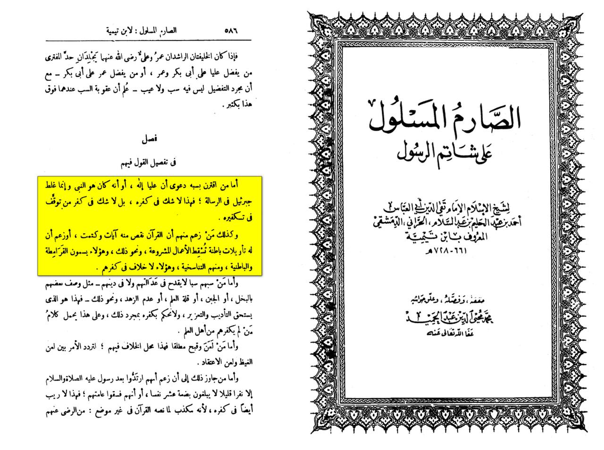

---

<!-- telegram-source: personal/messages.html#message590 -->
<!-- evidence-id: 000096 -->

Shaykh al-Islam Ibn Taymiyyah said:

If a person intentionally prostrates to the sun at the time of its rising or setting, then he is most deserving of prohibition, condemnation, and punishment. For this reason, such a person is a kāfir.

Likewise, whoever makes duʿāʾ to other than Allāh or makes ḥajj to other than Allāh is also a mushrik. What he has done is kufr , though he may not know that this is shirk and ḥarām.

Just as many people who entered Islām — such as the Tatār and others — had small idols made of felt or other materials, to which they would show devotion and veneration, not knowing that this was ḥarām in the dīn of Islām . Some even showed taqarrub to fire, also not knowing that it was ḥarām.

Thus, many forms of shirk may remain hidden from some of those who enter Islām, and they do not realize that it is shirk. Such a person is misguided, and his action in which he committed shirk is invalid. However, he does not deserve punishment until the ḥujjah has been established against him.

[Ar-Radd ʿalā al-Ikhnāʾī by Ibn Taymiyyah p.205-206]

Show attached source scan

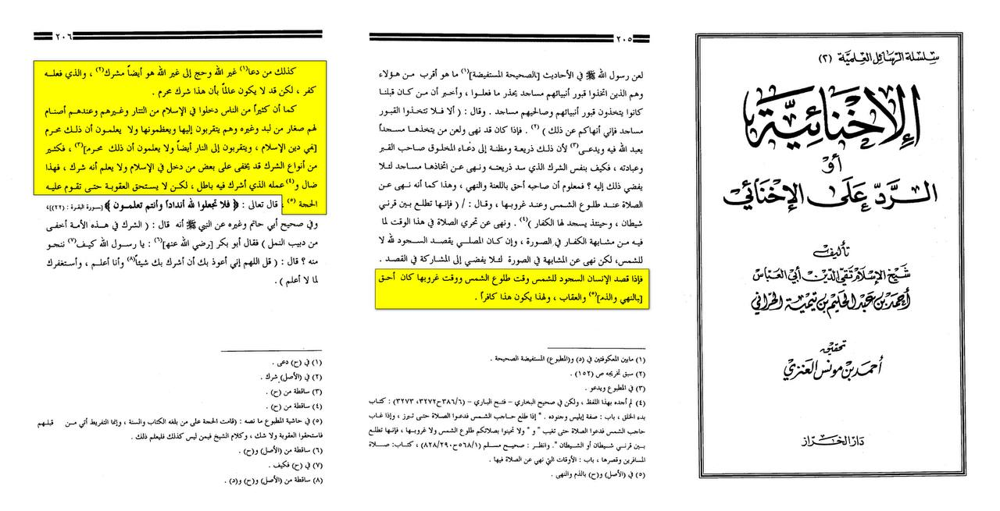

---

<!-- telegram-source: personal/messages.html#message615 -->
<!-- evidence-id: 000097 -->

Shaykh Al-Islam Ibn Taymiyyah said:

Allāh has distinguished between what comes before the message and what comes after it in asmā ʾ (names) and aḥkām (rulings), and He has also joined between them in asmā ʾ and aḥkām . This serves as an argument against both groups: those who claim that actions have no inherent goodness or evil, and those who claim that people deserve punishment in either case.

As for the first group, Allāh described them as wrongdoers, transgressors, and corrupters, as He said: “Go to Firʿawn; indeed, he has transgressed” (Qurʾān 79:17), and He said: “And when your Lord called Mūsā: Go to the wrongdoing people — the people of Firʿawn. Will they not fear?” (Qurʾān 26:10–11), and He said: “Verily, Firʿawn exalted himself in the land and made its people sects, weakening (oppressing) a group (i.e. Children of Israel) among them: killing their sons, and letting their females live. Verily, he was of the Mufsidûn(i.e. corrupter).” (Qurʾān 28:4).

Thus, He informed that Firʿawn and his people were unjust, transgressors, and corrupters. These are names of condemnation of deeds, and condemnation applies only to evil and reprehensible action.

This proves that actions can be evil and blameworthy even before the coming of the messenger; yet, they do not deserve punishment until the messenger has come to them. As Allāh said: “And We do not punish until We have sent a messenger” (Qurʾān 17:15).

[Majmū al-Fatāwa 20/37 by Ibn Taymiyyah]

He further confirms this here:

Show attached source scan

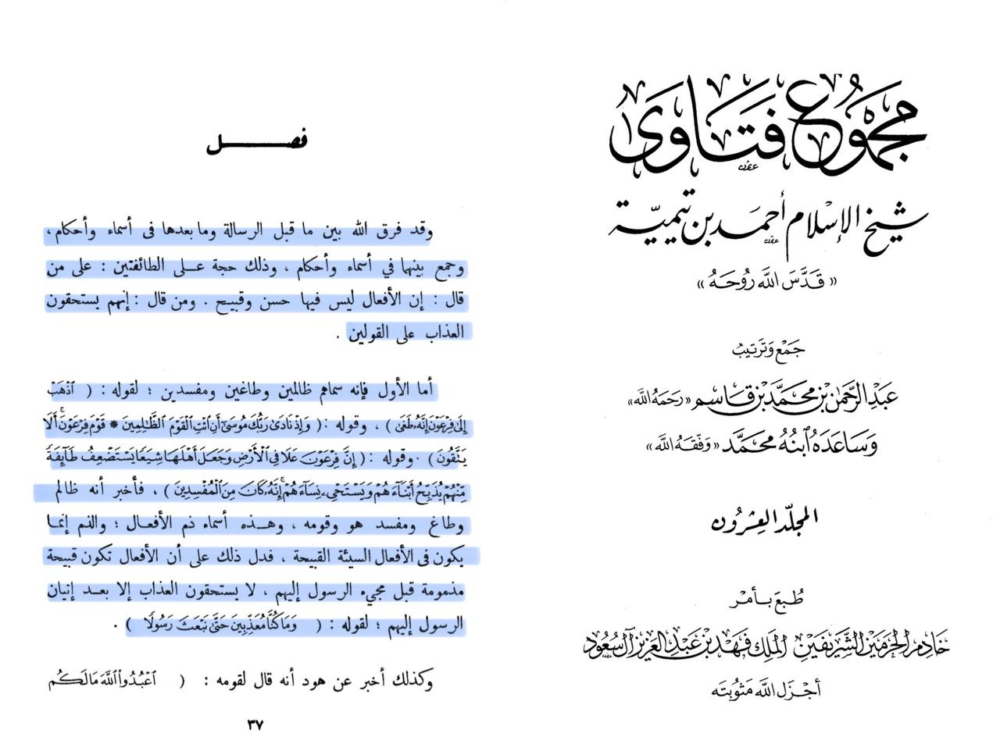

---

<!-- telegram-source: dar/messages2.html#message1594 -->
<!-- evidence-id: 000098 -->

Shaykh al-Islām Ibn Taymiyyah (may Allah have mercy on him) also said:

"Those who follow the views of Jahm and al-Ṣāliḥī have explicitly stated that reviling Allah and His Messenger, speaking the doctrine of the Trinity, and uttering any statement of disbelief are not, in themselves, kufr (disbelief) in the inward sense. Rather, they claim these acts are merely external indicators of disbelief. According to them, it is possible for someone who insults and curses (Allah and His Messenger) to still be, inwardly, a believer who knows Allah, affirms His Oneness, and has faith in Him. But when they are confronted with explicit scriptural evidence or consensus that such a person is a disbeliever both inwardly and outwardly, they respond: ‘This only means that such actions necessarily imply inward denial (takdhīb), and that faith necessarily negates such actions.’"

He continues: "It is said to them: We possess two undeniable facts:

First: A fact known with absolute certainty from the religion itself.

Second: A fact known with absolute certainty from our own reasoning when we reflect upon it."

As for the first: "We know that whoever reviles Allah and His Messenger willingly and without coercion, or speaks words of disbelief voluntarily, or mocks Allah, His signs, or His Messenger—such a person is a disbeliever both inwardly and outwardly.

Whoever claims that such a person could still, in their heart, be a believer in Allah while merely being outwardly a disbeliever, has stated something whose falsehood is necessarily known from the religion itself.

Allah has mentioned the statements of the disbelievers in the Qurʾān, ruling them as disbelievers and declaring that they deserve punishment because of their words.

If their words of disbelief were merely akin to witness testimonies against them or mistaken confessions that could be invalid, Allah would not have made them deserving of punishment based on testimonies that might be true or false. Rather, in such a case, He would have stipulated the condition of those testimonies being true before punishing them. This is evident in verses such as: ‘They have certainly disbelieved who say, "Allah is one of three."’ (Al-Māʾidah 5:73) ‘They have certainly disbelieved who say, "Allah is the Messiah, the son of Mary."’ (Al-Māʾidah 5:72) —and similar statements."

[Majmūʿ al-Fatāwā by Ibn Taymiyyah 7/557-558]

Show attached source scan

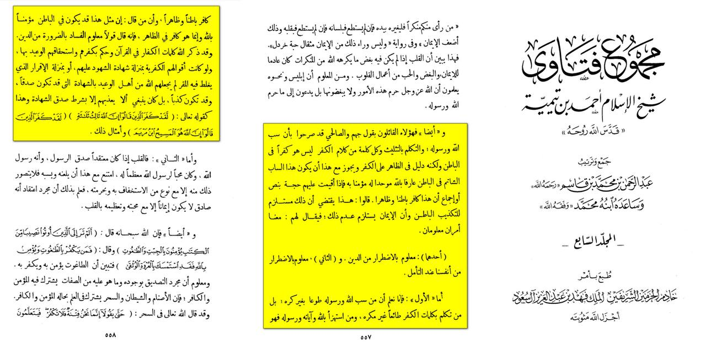

---

<!-- telegram-source: dar/messages4.html#message3784 -->
<!-- evidence-id: 000099 -->

Shaykh al-Islam clarifying the doubt of the Murji’ah who misuse al-Mā’idah: 112 to mean the Ḥawāriyyīn (the Disciples) doubted Allah’s power/ability. Some of them use this verse to argue one can commit kufr such as doubting Allahs power and compare it to Blatant shirk and it is excusable and one is not called a disbeliever.

Shaykh al-Islam Ibn Taymiyyah said:

Likewise, the saying of al-Ḥawāriyyīn: “Can your Lord send down to us a table from heaven?” [al-Mā’idah: 112] — they were merely inquiring about this qudrah (ability). And likewise, the saying about Yūnus: “that We would not decree upon him” — has been interpreted as referring to qudrah, just as it is said to a man: “Can you do such and such?” — meaning, “Will you do it?”

[Majmū' al-Fatāwā by Ibn Taymiyyah 8/374]

Show attached source scan

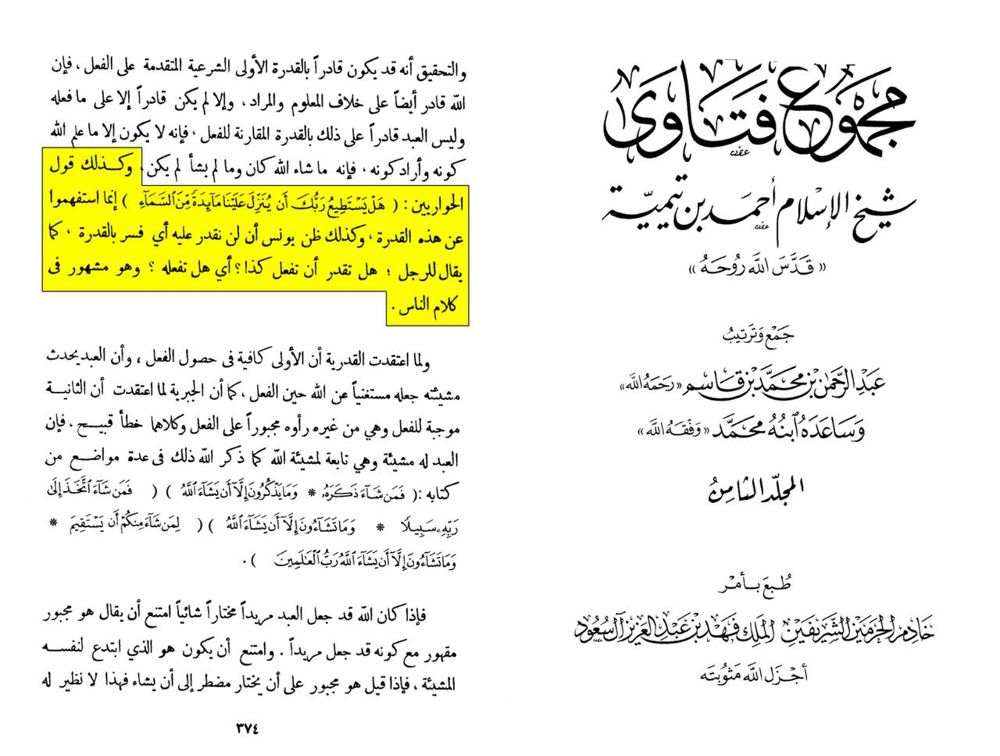

---

<!-- telegram-source: dar/messages4.html#message3636 -->
<!-- evidence-id: 000100 -->

Imām Abū Buṭayn, after quoting Shaykh al-Islām Ibn Taymiyyah who said: “Whoever commits shirk is a mushrik; he is to be asked to repent, and if he repents, [all is well]; otherwise, he is to be killed.”

He (Abū Buṭayn) said: He (Ibn Taymiyyah) asserted in many places the takfīr of whoever commits what he mentioned of the various types of shirk, and he transmitted the ijmāʿ of the Muslims on that, without excluding the jāhil or the like.

And Allāh, the Exalted, said: “Indeed, Allāh does not forgive that partners be associated with Him” (al-Nisāʾ: 48). And He related about al-Masīḥ that he said: “Whoever associates partners with Allāh, Allāh has surely forbidden Paradise for him, and his abode will be the Fire” (al-Māʾidah: 72).

So whoever restricts this threat to only the stubborn rejecter, and excludes the ignorant, or the interpreter, or the blind follower, then such a person has opposed Allāh and His Messenger and departed from the path of the believers.

[al-ʿUdhr bil-Jahl taḥta al-Mijhar ash-Sharʿī by Madḥat Āl Farāj p.54]

Show attached source scan

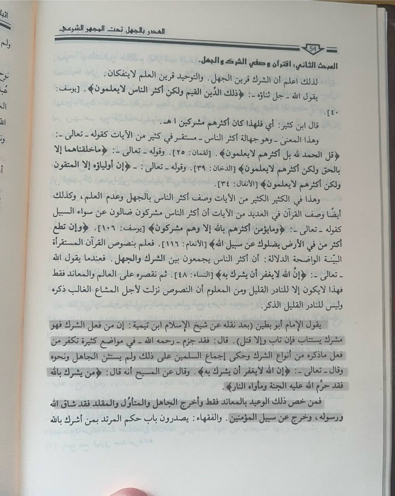

---

<!-- telegram-source: personal/messages.html#message516 -->
<!-- evidence-id: 000101 -->

Shaykh al-Islam Ibn Taymiyyah said:

And among them are those who say: “Rather, they will not be punished until a Messenger has been sent to them,” as indicated by the Kitāb and the Sunnah.

However, their actions are still blameworthy and detested; Allāh condemns them, hates them, and they are described with kufr that Allāh censures and detests — even if He does not punish them until He has sent to them a Messenger.

[Al-Jawāb al-Ṣaḥīḥ liman Baddala Dīn al-Masīḥ by Ibn Taymiyyah 2/311]

Show attached source scan

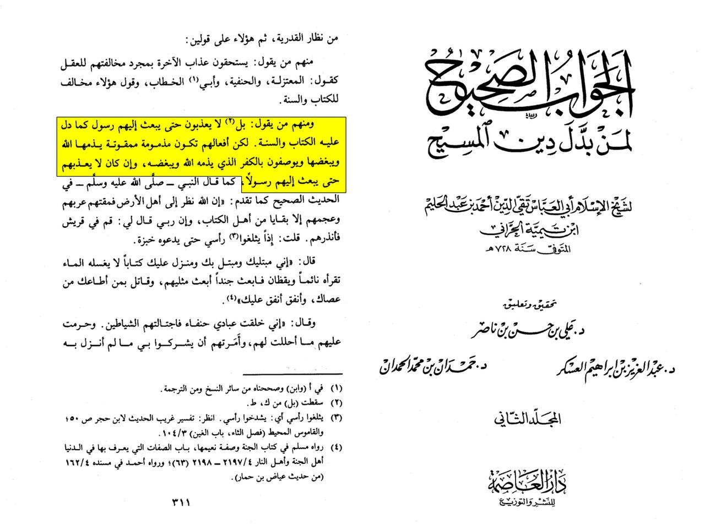

---

<!-- telegram-source: personal/messages.html#message611 -->
<!-- evidence-id: 000102 -->

Sheikh al-Islam Ibn Taymiyyah said:

And for this reason, everyone who does not worship Allah alone will inevitably be a worshipper of something else. He worships other than Him and thus becomes a mushrik. There is no third category among the children of Ādam. Rather, one is either a muwaḥḥid, or a mushrik, or someone who mixes this with that, like the altered ones from among the religions — such as the Christians and those like them from among the misguided who claim affiliation with Islam.

[Majmū' al-Fatāwā by Ibn Taymiyyah 14/282]

Show attached source scan

---

<!-- telegram-source: dar/messages.html#message540 -->
<!-- evidence-id: 000103 -->

Sheikh al-Islam Ibn Taymiyyah said:

As the Salaf also issued Takfir on those who said some of the Jahmiya’s sayings, such as saying that the Qur’an was created, or denying Ru'yah (seeing Allah), or the like, which is less severe than denying the aboveness of Allah over creation and that He is above the Throne, as declaring the author of this saying to be an infidel was, according to them, one of the most obvious matters.

[Al-Istiqama p.164]

Show attached source scan

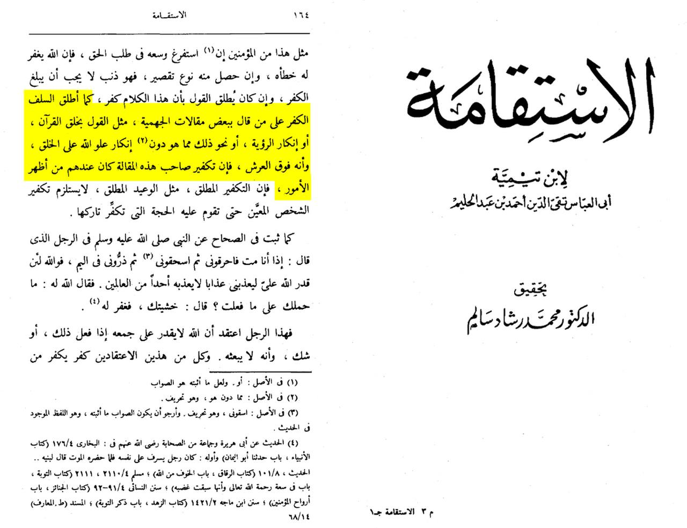

---

<!-- telegram-source: personal/messages.html#message751 -->
<!-- evidence-id: 000104 -->

Shaykh al-Islām Ibn Taymiyyah (d. 728H) said:

Whoever says or does what constitutes disbelief has thereby disbelieved, even if he did not intend to be a disbeliever, for no one intends disbelief except as Allah wills.

[ al-Ṣārim al-Maslūl , 2/339]

Show attached source scan

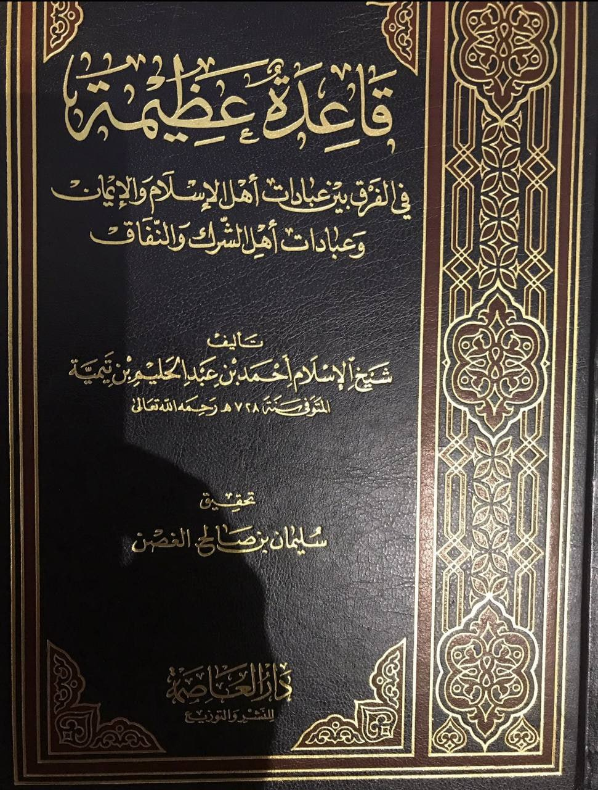

---

<!-- telegram-source: dar/messages2.html#message2072 -->
<!-- evidence-id: 000105 -->

al-‘Allāmah ‘Abdullāh Abā Butayn said:

As for the objector who asks: “Didn’t Ibn Taymiyyah excuse the one who misinterprets or blindly follows others, and say that Allāh forgives the ignorant in ways He does not forgive others?” The response to this is: Such a statement is only cited by someone who agrees with Ibn Taymiyyah that seeking help from the Prophet (ﷺ) and other deceased individuals is prohibited and is shirk. They may then argue that the ignorant might be excused.

However, if someone denies Ibn Taymiyyah’s stance on this matter, criticizes those who follow him, or even considers them disbelievers, then they have no basis for excusing the individuals in question—because they do not see them as mistaken at all, but rather as rewarded for following what they believe is Allāh’s command: “Seek means of approach to Him” (Al-Māʾidah 5:35), according to this distorter of Allāh’s words. Thus, there is no reason to seek an excuse for them.

Everything the Sheikh stated in this matter—meaning Tawḥīd—was not merely his personal opinion, but rather a clarification of what is clearly established in the Qurʾān, Sunnah, and scholarly consensus. May Allāh have mercy on him and be pleased with him.

The Sheikh also said: A person may do something they believe to be righteous without knowing that it is actually forbidden. In such a case, they will be rewarded for their good intention and excused due to their ignorance. This is a broad topic. He also said: ‘The ignorant are forgiven in ways that others are not.’ However, he meant this generally, not in every specific case.

That is why he also said in Sharḥ al-ʿUmda: “Any rejection of Allāh’s message or command is disbelief, whether minor or major. However, if the matter is obscure and the correct understanding is difficult to reach, then one may be excused—especially in minor issues related to jurisprudence. But if the issue is well known and fundamental to the religion, there is no excuse.”

And he was also told that shirk is never forgiven, even if it is minor. His student, the author of al-Furūʿ, narrated that he said: “That is because of the generality of Allāh’s statement: ‘Indeed, Allāh does not forgive associating partners with Him’ (An-Nisāʾ 4:48).”

In al-Risālah as-Saniyyah, Ibn Taymiyyah wrote: “Whoever exaggerates in their reverence for a prophet or righteous person and attributes to them some aspect of divinity—i.e, by calling upon them instead of Allāh, saying: ‘O my master, so-and-so, help me,’ or ‘save me,’ or ‘I put my trust in you,’ or ‘I am under your protection’—then this is all shirk and misguidance. The individual must be given a chance to repent; if they do, they are forgiven, but if they refuse, they must be executed.”

Similarly, in the case of those who believe in intermediaries, he said: “If someone commits this, they must be called to repent; if they refuse, they are to be executed.”

The general meaning of Allāh’s statement: “Indeed, Allāh does not forgive associating partners with Him” (An-Nisāʾ 4:48), applies to every polytheist. The jurists of all Islamic schools of thought state in their sections on apostasy that whoever associates partners with Allāh has committed disbelief, and they cite this verse and others like it as evidence. None of them excluded the ignorant from this ruling. Allāh also says: “Say: Shall We tell you who are the greatest losers in their deeds? They are those whose efforts in the worldly life were misguided, while they thought they were doing good” (Al-Kahf 18:103-104).

And: “A group was guided, while a group deserved to be in error, for they took devils as allies instead of Allāh, and they thought they were guided” (Al-Aʿrāf 7:30).

Ibn Jarīr (al-Ṭabarī) commented: “This is one of the clearest proofs against those who claim that Allāh does not punish anyone for a sin they committed or a misguidance they believed in—unless they knew it was wrong. If that were true, there would be no difference between the misguided ones who think they are upon guidance and those who are truly guided.

Show attached source scan

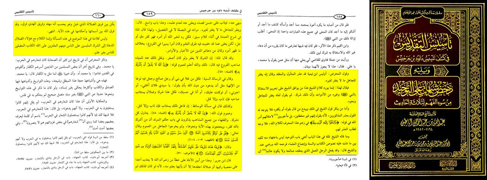

---

<!-- telegram-source: personal/messages.html#message608 -->
<!-- evidence-id: 000106 -->

Shaykh ʿAbd ar-Raḥmān Ibn Ḥasan said:

Shaykh al-Islām (Ibn Taymiyyah), may Allāh have mercy on him, said: “Building mosques on graves is prohibited, and even if something other than a mosque is built on them, it is prohibited by the consensus of scholars, as it is a means to shirk and a forbidden act.”

He also said: “Know that the term ‘du’ā’ in the Qur’ān refers to two meanings: the ‘du’ā’ of worship’ and the ‘du’ā’ of asking.’ Every worshipper is a seeker, and every seeker is a supplicant. One term can encompass the other when separated from its context, and when both meanings are combined, it refers to one who asks for the seeking of benefits and the removal of harm through the forms of asking and requesting.”

I (Shaykh ʿAbd ar-Raḥmān Ibn Ḥasan) say: Look at this contradiction, confusion, and inconsistency. There is no doubt that disbelief opposes faith, invalidates it, and nullifies deeds, as confirmed by the Qur’ān, Sunnah, and the consensus of Muslims. Allāh, the Exalted, says: “And whoever disbelieves in the faith, his deeds are invalid, and he is among the losers in the Hereafter.” (Al-Mā’idah: 5).

It is said that every disbeliever is mistaken, and the polytheists have their justifications. They believe that their polytheism towards the righteous is an act of honoring them that benefits them and wards off harm. But Allāh did not excuse them for this mistake or misinterpretation. Allāh says: “And those who take protectors besides Him say, ‘We only worship them that they may bring us nearer to Allāh.’

Allāh will judge between them concerning what they differ.” (Az-Zumar: 3). And He also says: “Say, ‘Shall we inform you of the greatest losers in deeds? Those whose efforts have been wasted in this worldly life while they think that they are doing good.’” (Al-Kahf: 103-104). Where is the reason of this person in relation to these and similar clear verses?

The scholars, may Allāh have mercy on them, followed the path of uprightness and discussed the ruling of apostasy. None of them said that if a person commits an act of disbelief or says something of disbelief while not knowing that it contradicts the testimony of faith, he is not considered a disbeliever due to his ignorance.

And Allāh has clarified in His Book that some of the polytheists are ignorant followers, yet their ignorance and blind imitation did not prevent them from facing Allāh’s punishment, as He said:  “And among the people is he who disputes about Allāh without knowledge and follows every rebellious devil … to His saying: ‘The punishment of the Blaze.’” [Al-Ḥajj: 3-4]

[Taḥqīq Madhhab Ibn Taymiyyah fī Masʾalatay al-ʿUdhr bil-Jahl wa Takfīr al-Muʿayyan By Shaykh ʿAbd ar-Raḥmān Ibn Ḥasan Āl ash-Shaykh p.30-31]

Show attached source scan

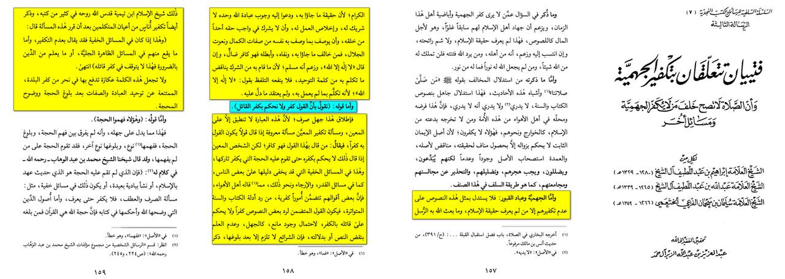

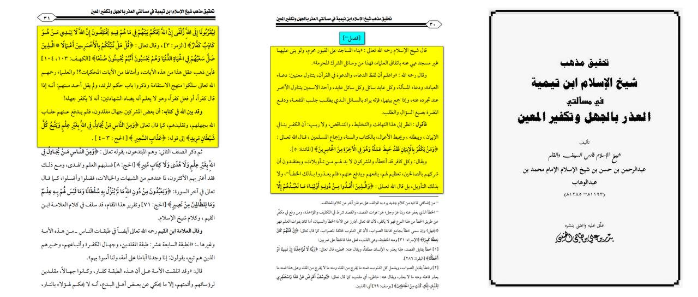

---

<!-- telegram-source: dar/messages3.html#message2388 -->
<!-- evidence-id: 000107 -->

Sheikh Abd al-Latif ibn Abd al-Rahman ibn Hasan Āl al-Shaykh said:

"As for al-`Irāqī and his misguided companions, they argued that the Sheikh (Ibn Taymiyyah) does not declare the ignorant to be disbelievers and that he says they are excused. They made this claim in a vague manner without providing details, and used this misconception as a shield to reject the Quranic verses and prophetic hadiths. They raised their voices against the monotheists, as was the case with their predecessors from the worshippers of graves and polytheists. And to Allah is the final return, and He is the Judge between His servants regarding what they differed in."

[Minhāj al-Tāsīs wa al-Taqdīs p.227]

Show attached source scan

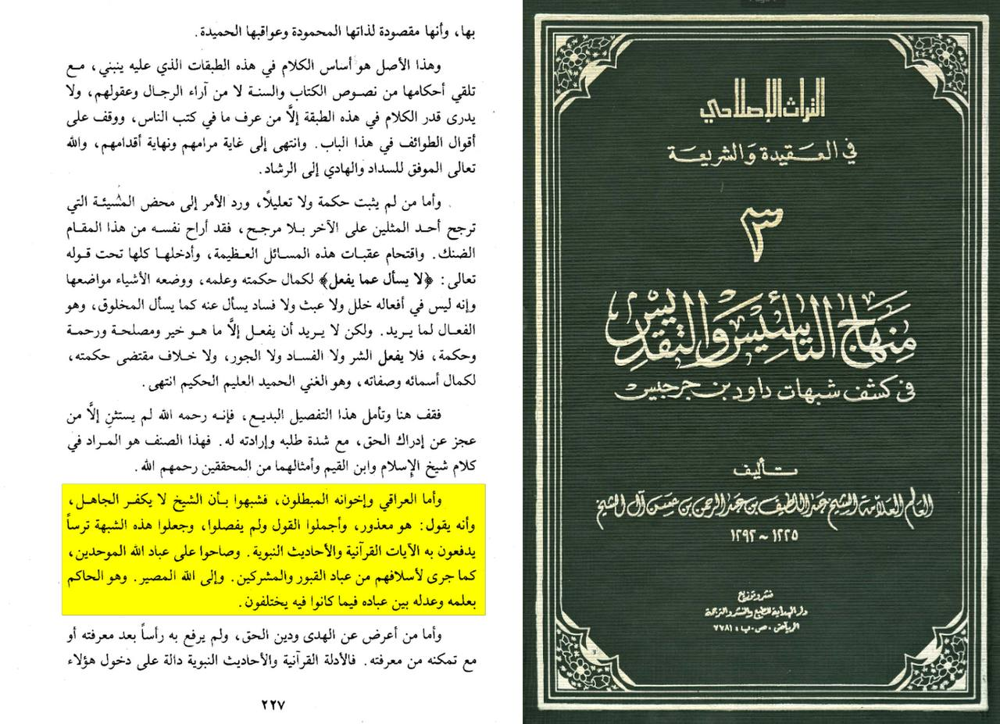

---

<!-- telegram-source: dar/messages2.html#message1878 -->
<!-- evidence-id: 000108 -->

Shaykẖ ʿAbd Al-Laṭīf said:

As for the Jahmiyyah and the worshipers of graves, citing such texts to argue against declaring them disbelievers is only done by someone who has not truly understood Islam and the message with which Allah sent His noble messengers.

The essence of what the messengers brought and called to is the obligation of worshiping Allah alone with no partners, sincerely dedicating all acts of devotion to Him, and not associating any of His creation in what is exclusively His right. Moreover, they affirmed what Allah described Himself with—attributes of perfection and majesty.

Whoever opposes this message, denies it, or invalidates it is a misguided disbeliever, even if he says, “La ilaha illa Allah” and claims to be a Muslim. This is because the shirk he commits contradicts the very meaning of the testimony of faith. Thus, merely uttering “La ilaha illa Allah” does not benefit him, as he has spoken words he did not act upon, nor did he believe in what they entail.

As for the statement: “We say that the statement is disbelief, but we do not judge the speaker as a disbeliever,”

This is an absolute misunderstanding because such an expression only applies to specific individuals. The issue of declaring an individual a disbeliever (takfīr al-mu‘ayyan) is well known: if someone utters a statement that is itself an act of disbelief, it is said, “Whoever says this statement is a disbeliever.” However, when a specific individual says it, he is not judged as a disbeliever until the proof that necessitates disbelief for its denier has been established against him.

This applies to hidden matters whose evidences may be obscure to some people, such as issues related to qadar and irjā’ and similar matters that were introduced by the people of desires (ahl al-ahwā’). Some of their statements entail disbelief because they involve rejecting the clear and established proofs from the Qur’an and Sunnah. In such cases, while the statement itself may be disbelief, the one who utters it is not necessarily judged as a disbeliever due to possible barriers like ignorance or lack of knowledge about contradicting the text or its implications.

Religious rulings only become binding after they have been conveyed. Shaykh al-Islām Ibn Taymiyyah (may Allah sanctify his soul) mentioned this in many of his writings. He also stated that some prominent scholars of kalām were declared disbelievers after he had clarified this principle. He said:

“This applies to hidden matters, and it may be said that no judgment of disbelief should be made in such cases. However, regarding the obvious and clear issues or those known by necessity in religion, there is no hesitation in declaring the one who contradicts them a disbeliever.”

Therefore, do not use this statement “We say that the statement is disbelief, but we do not judge the speaker as a disbeliever” as a crutch to refute those who declare a town disbelieving when it refuses to worship Allah alone or denies His attributes, after the proof has been established against it and the truth has been made clear.

[Ijmāʿ Ahl as-Sunnah an-Nabawiyyah ʿalā Takfīr al-Muʿaṭṭilah al-Jahmiyyah p.157-159]

Show attached source scan

---

<!-- telegram-source: dar/messages3.html#message2562 -->
<!-- evidence-id: 000109 -->

Sheikh Sulaymān ibn Suhmān said:

As for the statement: “And I used to affirm that Allah has forgiven this ummah for its mistakes, including mistakes in both doctrinal and practical matters.”

I say: The actual words of the Sheikh (Ibn Taymiyyah) have been altered in a way that obscures his intent and meaning. At the beginning of his statement, he said: “I am always— and those who sit with me know this— one of the strongest opponents of labelling a specific individual as a disbeliever, a sinner, or an evildoer unless it is known that the prophetic proof has been established against him. Whoever opposes it is sometimes a disbeliever, sometimes a sinner, and sometimes an evildoer. And I affirm that Allah has forgiven this ummah…”

Thus, the Sheikh’s statement about not declaring a specific individual a disbeliever before the proof is established refers to specific issues where the evidence may be unclear to some people, such as matters of Qadar, Irjāʾ, and similar theological positions held by sects of Ahl al-Ahwāʾ.

Some of their statements may contain aspects of disbelief, such as rejecting certain clear proofs from the Qur’an and Sunnah. Such statements may be classified as kufr, but the one making them is not necessarily ruled a disbeliever due to the possibility of an extenuating factor, such as ignorance or lack of awareness of the text itself or its interpretation. This is because taklīf only applies after the message has reached a person.

That is why Ibn Taymiyyah mentioned this in the context of the innovations of Ahl al-Ahwāʾ. He explicitly clarified this by stating—when discussing the disbelief of certain prominent theological figures after establishing this principle:

“This applies when the matter is obscure (khafiyyah), so one might argue against declaring such a person a disbeliever. However, when it comes to clear and obvious matters, or those known necessarily from the religion, then there is no hesitation in declaring the one who denies them a disbeliever.” This has already been explained previously.

The dispute between us and these extremists is not about theoretical, subtle, or interpretive issues where the evidence might be unclear. Rather, the dispute concerns the act of directing exclusive rights of Allah to saints and righteous people—such as supplication, love, fear, hope, seeking aid, and other forms of worship. This is something known necessarily from the religion of Islam—that only Allah deserves such acts of devotion. Whoever directs any of these acts to anyone other than Allah is a disbeliever and a polytheist.

[al-Asinnah al-Ḥaddād fī Kashf Shubuhāt ʿAlawī al-Ḥaddād p. 159-160]

Show attached source scan

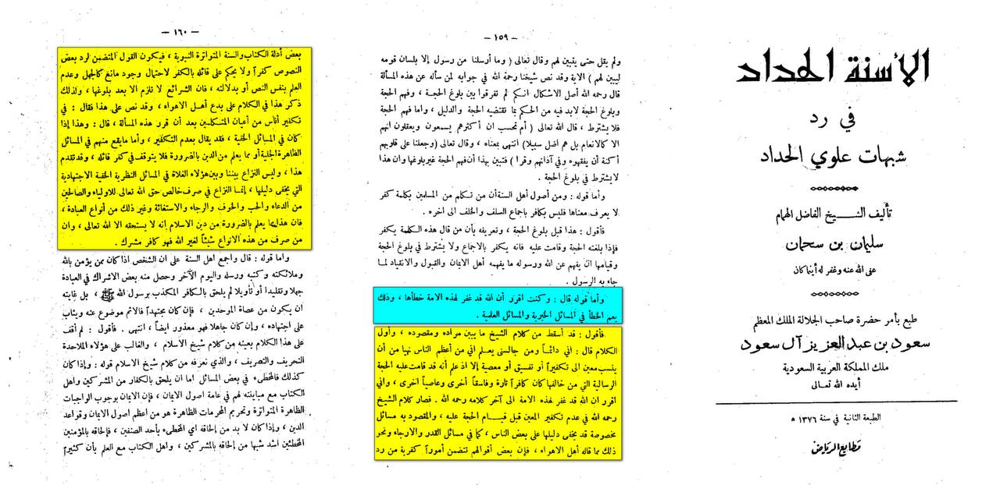

---

<!-- telegram-source: dar/messages2.html#message1997 -->
<!-- evidence-id: 000110 -->

Sheikh Sulaymān ibn Suhmān said:

“Know that not every error, ijtihād, or ignorance is excused. Allah has informed us in the Qur’an of the ignorance of many disbelievers while still explicitly declaring their disbelief. He also described the Christians as ignorant, even though no Muslim doubts their disbelief. We are certain that most Jews and Christians today are ignorant followers, yet we still affirm their disbelief and the disbelief of anyone who doubts their disbelief.

The Qur’an makes it clear that doubting the fundamentals of religion is itself disbelief. Doubt is wavering between two positions—such as someone who neither affirms nor denies the truthfulness of the Messenger, or neither affirms nor denies the occurrence of resurrection, or someone who neither believes in the obligation of prayer nor in its lack of obligation, or who neither affirms nor denies the prohibition of fornication. This is disbelief by the consensus of the scholars, and there is no excuse for one who is in such a state simply because he does not understand Allah’s evidences and proofs. There is no excuse for him after the proof has reached him, even if he fails to comprehend it.

What led the followers of ‘Ittiḥādiyyah and Ḥulūliyyah into their blatant disbelief, grievous shirk, and complete denial of the true existence of the Lord of the worlds except their errors in this matter, in which they exercised their reasoning and went astray, misleading others from the straight path?

What led Al-Ḥallāj to his fate, with scholars unanimously agreeing on his execution, except the consequences of his so-called ijtihād? What caused the Qarmaṭians to embrace their vile heresies and abandon the bonds of Islam except their exercise of reasoning in what they falsely believed?

What led the Rāfiḍah to their disbelief, their polytheism, their worship of the Twelve Imams and others, and their cursing of the Companions of the Messenger of Allah (ﷺ) and his noble wives, except their so-called ijtihād? These people are the predecessors of this man and his likes, in claiming that ‘every error is excused.’

The logical conclusion of this claim would be that no one should be deemed sinful or declared a disbeliever for errors in all matters of fundamental belief—such as faith in Allah’s existence, His Lordship, His exclusive right to be worshiped, His Decree and Predestination, belief in His perfect attributes, His knowledge of all events before they occur, and other essential tenets.

If one were to deny responsibility and accountability for errors in these matters, it would entail exonerating the deniers of Allah’s essence, those who negate His Lordship, those who deny His names and attributes, those who reject His exclusive right to be worshiped, and those who claim that Allah does not know future events before they happen, such as the extreme Qadarites. Likewise, it would exonerate those who attribute worldly occurrences to celestial bodies, those who claim the existence of two eternal principles—light and darkness.

If this heretic upholds all of this, then he is more disbelieving and misguided than the Jews and Christians. But if he claims that there is a distinction between these matters and the current issue of dispute—namely, invoking the dead and the absent for things that only Allah can do—then let him prove this distinction with clear evidence.

If he fails to do so, his argument collapses, and people of knowledge will recognize him as a deceiver and a sophist, not a scholar of fiqh and religion. He will be exposed as someone unfamiliar with Islam and its adherents, unable to distinguish between monotheists and polytheists. Rather, he remains in the darkness of natural ignorance, doubt, and manifest confusion.

Only those who have deeply studied the works of Shaykh Al-Islām Ibn Taymiyyah and are well-versed in his principles can truly understand his words.

Show attached source scan

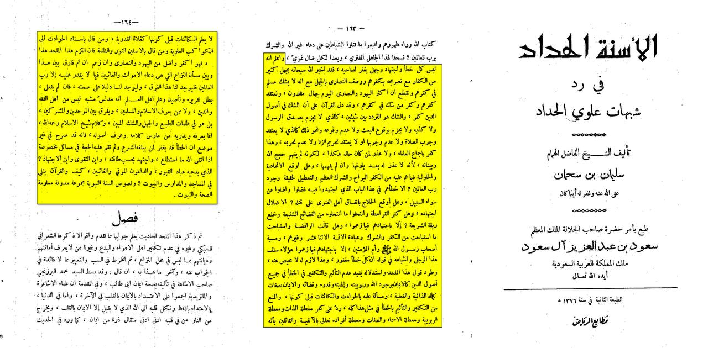

---

<!-- telegram-source: dar/messages3.html#message2902 -->
<!-- evidence-id: 000111 -->

Shaykh Sulaymān ibn Saḥmān said:

As for the deception and confusion by some of these people who claim that Shaykh al-Islām (Ibn Taymiyyah) refrained from declaring takfīr upon a specific ignorant individual — this is from distortion and misleading by those blind in perception. For what is intended by that relates to specific issues whose evidence may be hidden from some people — such as issues of qadar, irjāʾ, and similar matters which were spoken about by the people of desires. For some of their statements contain matters of disbelief — such as rejection of the clear and recurrent evidences of the Book and the Sunnah — so the statement that includes rejection of some revealed texts is disbelief, but the one who says it is not ruled to be a disbeliever due to the possibility of a preventing factor, such as ignorance or not knowing the actual text or its indication.

For the divine laws do not become binding except after they have been conveyed. And that is why he mentioned it in his discourse concerning the innovations of the people of desires. And he explicitly stated this, for after he explained this matter regarding the takfīr of specific individuals from among the mutakallimīn, he said: “This is when the matter pertains to subtle issues — so it may be said that no takfīr is to be made. But as for what occurs from them in clear, obvious issues — or in matters known by necessity from the religion — then there is no hesitation in the disbelief of the one who says it.”

[Kashf al-Awhām by Shaykh Sulaymān ibn Saḥmān p.116-117]

Show attached source scan

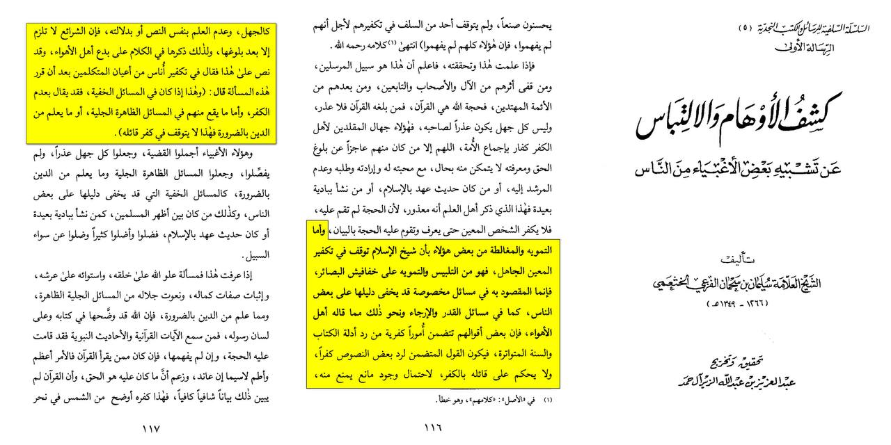

---

<!-- telegram-source: dar/messages2.html#message1985 -->
<!-- evidence-id: 000112 -->

Sheikh Muḥammad ibn Ibrāhīm, may Allah have mercy on him, said:

“The issue of declaring a specific individual a disbeliever (takfīr al-mu‘ayyan):

Some people claim that an individual should never be declared a disbeliever. They misunderstand certain statements of Ibn Taymiyyah and mistakenly believe that only those whom the Qur’an explicitly declares as disbelievers—such as Pharaoh—can be ruled as such. However, the Qur’anic texts do not specify every single person. They study the rulings on apostasy but never apply them to anyone! This is utter misguidance and extreme ignorance. Rather, these rulings must be applied—but with conditions.

As for those who hesitated to declare an individual a disbeliever in matters where the evidence may be unclear, they do not rule takfīr until the prophetic proof has been fully established against the person, in both its authenticity and meaning. Once the proof has been clearly explained, the person is ruled a disbeliever—whether he understands and rejects it, or claims not to understand. Not all disbelief stems from mere obstinacy.

However, regarding matters that are known by necessity to be part of what the Messenger ﷺ brought, if someone opposes them, then he is ruled a disbeliever immediately, without the need for further clarification—whether in fundamental or subsidiary matters—unless he is new to Islam.

The third category involves ambiguous matters. In such cases, a person is not ruled a disbeliever, even after evidence has been presented to him—whether the issue pertains to fundamentals or secondary issues. An example of this is the man who instructed his family to burn his body after his death.”

[Muʿjam al-Tawḥīd 3/74]

Show attached source scan

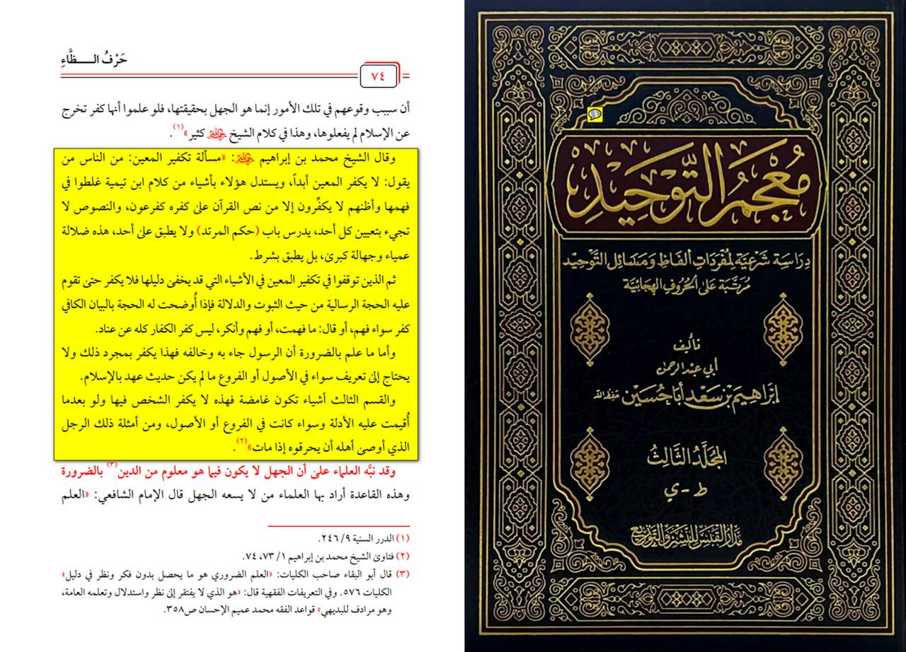

---

<!-- telegram-source: personal/messages.html#message517 -->
<!-- evidence-id: 000113 -->

Shaykh Muḥammad ibn Ibrāhīm Āl ash-Shaykh said:

And some people have thought that the Shaykh (Ibn Taymiyyah) does not declare a specific individual to be a Kāfir, but this is not the case. Rather, what he intends is the matter whose evidence is hidden. As for that whose evidence is clear, then this assumption is not conceivable in it.

[Sharḥ Kitāb at-Tawḥīd by Shaykh Muḥammad ibn Ibrāhīm 1/344]

Show attached source scan

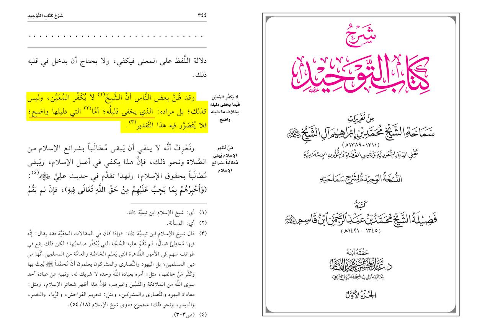

---

<!-- telegram-source: dar/messages5.html#message4482 -->
<!-- evidence-id: 000114 -->

The position of Imām Ibn Taymiyyah and Muḥammad Ibn ʿAbd al-Wahhāb on ʿUdhr bil Jahl explained by Shaykh Ibn Bāz

Shaykh Ibn Bāz was asked:

Q: What was the position of the Salaf — may Allāh have mercy on them — such as Imām Ibn Taymiyyah and Ibn ʿAbd al-Wahhāb regarding the issue of al-ʿudhr bi’l-jahl (Excuse due to ignorance)? Is it something recognised? Did the Salaf address it? Or is it false, having no basis in the matter of tawḥīd?

A: Ignorance, in general, may sometimes be an excuse and at other times not be an excuse.

If a legally accountable person is far removed from Islām and from knowledge — such as one who grows up in lands distant from the Muslims, and the message, the Qurʾān, and the Sunnah have not reached him — then such a person is excused due to ignorance. He has the ruling of Ahl al-Fatrah on Yawm al-Qiyāmah (Day of Resurrection). They will be tested: if he responds, he will enter Jannah; and if he disobeys, he will enter the Fire.

A person may also be excused in minor matters from the subsidiary rulings that may be hidden from someone like him — as the Prophet ﷺ taught the man who was wearing a cloak and had applied perfume while in iḥrām for ʿumrah. The Prophet ﷺ said to him, while he was compliant: “Remove the cloak from yourself, wash off the perfume, and do in your ʿumrah what you would do in your ḥajj.” He did not command him to offer any expiation. So in subsidiary matters, yes, ignorance may be excused.

Likewise, in the case of one who is far removed from hearing the Qurʾān and the Sunnah — in remote regions of the world — such people are Ahl al-Fatrah. The correct view is that they will be tested on the Day of Resurrection: whoever responds to the command will enter Jannah, and whoever disobeys will enter the Fire.

As for one who lives among the Muslims, where the Qurʾān and the Sunnah are known, then ignorance is not an excuse for him — neither in ʿaqīdah nor in other than it. Allāh said: “This Qurʾān has been revealed to me that I may warn you thereby and whomever it reaches.” Allāh knows best. The Qurʾān and the Sunnah are to be learned. Allāh al-Mustaʿān.

<video class="source-video" controls preload="metadata" src="assets/videos/dar-messages5-4482.mp4"></video>

Video source from the Telegram export.

---

<!-- telegram-source: dar/messages3.html#message2628 -->
<!-- evidence-id: 000115 -->

Shaykh Ṣāliḥ al-Fawzān Was asked:

Q: certain preachers who claim to follow Salafiyyah, (who are really) modern-day Murji'ah, have spread a particular interpretation of Ibn Taymiyyah's words. They say: "We don't do individual takfir until conditions are met and obstacles are removed." Or they say: "Not everyone who commits Kufr is necessarily ruled as Kafir." Or statements that are general concerning the ruling by what is apparent of Islam.

Similarly, may Allah protect you, is about to Imam al-Mujaddid Muhammad ibn Abdul-Wahhab and his statement: "We do not takfir those who worship the grave of Abdul-Qadir, and the grave of Ahmad al-Badawi and their likes, due to their ignorance, and due to no one informing them." (To clarify this statement in’sha’allah which is heavily used by the Murji’ah, This is related to the hukm (ruling) for the hereafter  however they are labeled a mushrik in this life).  [Durar as-Saniyyah, 1/104]

Similarly, with the statements of some scholars that say only judge can do takfir, As well as words of Ibn Uthaymeen about a person who commits shirk. They argue using these general statements, that the individual ignorant grave-worshipper, who claims Islam, is a Muslim in reality. They attribute this understanding to the scholars. Is this true?

A: This is a lie and slander against them (the scholars), and is misguidance. This is a lie and slander against them.

---

<!-- telegram-source: dar/messages4.html#message3606 -->
<!-- evidence-id: 000116 -->

An Important clarification Of Shaykh al-Islam's speech which are commonly misquoted by the Murji'ah by Shaykh Ayman al-ʿAnqarī.

Shaykh Ayman al-ʿAnqarī said:

He (Ibn Taymiyyah) said in al-Radd ʿalā al-Ikhnāʾī (pp. 387–388):

“And among them are those who pray toward the grave of their shaykh, and face it in prayer, and say: ‘This is the qiblah for the private,’ and the Kaʿbah is the qiblah for the general.” “And I know of those who did this and that. And they are people with worship, asceticism, and religion, but in them is ignorance and misguidance, just as the monks of the Christians and others are among the most ascetic of people, and the most diligent in worship, yet with ignorance and misguidance….”

I (Ayman al-ʿAnqarī) say: Upon reflection on the words of the Shaykh, it becomes clear that they have no excuse, for several reasons:

The first: He did not describe them as Muslim, for he did not call them Muslims. His words: “They have worship, asceticism, and religion” do not imply that they are Muslim. And indeed, he did not call them that.

The second — which clarifies the preceding statement — is that he compared them to the Christians, and described the Christians as ignorant, even though he said of them: “Just as the monks of the Christians and others are among the most ascetic of people, and the most diligent in worship, yet with ignorance and misguidance.” Does this statement imply that the Christians are Muslim?!

[Taḥrīr Qawl Shaykh al-Islām Ibn Taymiyyah raḥimahullāh fī Fāʿil ash-Shirk al-Akbar by Shaykh Ayman al-ʿAnqarī p.91-92]

Show attached source scan

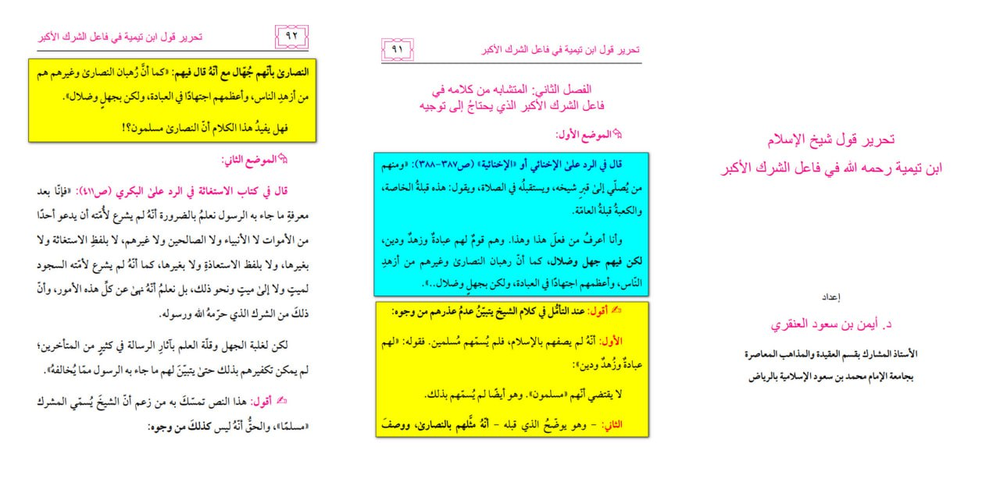

---

<!-- telegram-source: dar/messages4.html#message3924 -->
<!-- evidence-id: 000117 -->

Some Doubt regarding a statement found in Ar-Radd ʿalā al-Ikhnāʾī by Ibn Taymiyyah - Answered by Shaykh ʿAbd Allāh al-Jarbūʿ

I asked:  As-salāmu ʿalaykum wa raḥmatullāhi wa barakātuh I have a question, Shaykh. One of the brothers asked me to clarify the intended meaning of the following text from Shaykh al-Islām, as found in al-Ikhnāʾī:

"“This entire matter is among what the Messenger of Allāh ﷺ forbade in the authentic ḥadīths. So how can what he forbade and prohibited be likened to what he legislated and enacted? In this matter, this objector and those like him are mistaken, but the mistake is not due to his personal peculiarities. We correct it and intend the statement of truth and justice here, as Allāh the Exalted commanded. He commanded fairness toward our enemies, the disbelievers, saying:

‘Be maintainers of justice for Allāh, witnesses with justice, and let not the hatred of a people prevent you from being just. Be just; that is closer to taqwā.’ (Sūrah al-Māʾidah 5:8) So how much more regarding our Muslim brothers, for Muslims are brothers. And Allāh forgives him, guides him, and grants success to him and to all our Muslim brothers.”"

Source: [Ar-Radd ʿalā al-Ikhnāʾī by Ibn Taymiyyah p.242]

Show Arabic source text

المصدر: الرد على الإخنائي

<h4 dir="rtl">ص. 242</h4>

وهو إنما خاف أن يتخذ قبره وثنًا وعيدًا بخلاف قبور عموم المؤمنين، لكن / ما عظم من القبور حتى صار وثنًا وعيدًا فإنه ينهى عن ذلك ويزال ما حصل به حتى أنه يحرم أن يبنى عليه مسجد.

والمقصود أن ما سنه لأمته نوع غير النوع الذي يقصده أهل البدع من السفر إلى زيارة قبور الأنبياء والصالحين، فإنهم لا يسافرون لأجل ما شرع من الدعاء لهم والاستغفار بل لأجل دعائهم والدعاء بهم والاستشفاع بهم، فيتخذون قبورهم مساجد وأوثانًا وعيدًا يجتمعون فيه.

وهذا كله مما نهى عنه رسول الله صلى الله عليه وسلم في الأحاديث الصحيحة، فكيف يشبه ما نهى عنه وحرمه بما سنّه وفعله؟ وهذا الموضع يغلط فيه هذا المعترض وأمثاله ليس الغلط فيه من خصائصه، ونحن نعدل فيه ونقصد قول الحق والعدل فيه كما أمر الله تعالى، فإنه أمر بالقسط على أعدائنا الكفار فقال: {كونوا قوامين لله شهداء بالقسط ولا يجرمنكم شنآن قوم على أن لا تعدلوا اعدلوا هو أقرب للتقوى} [سورة المائدة: (8)]، فكيف بإخواننا المسلمين والمسلمون إخوة، والله يغفر له ويسدده ويوفقه وسائر إخواننا المسلمين.

الجواب الرابع: أنه لو قدر أن هذا اللفظ عام فأحاديث النهي عن السفر إلى غير المساجد الثلاثة تخص هذا كما تخص إتيان المساجد، ومعلوم أن إتيان المساجد أفضل من إتيان المقابر ونحوها، والسفر إليها أفضل. فإذا كان قد نهى عن السفر إلى غير المساجد الثلاثة فالنهي عما يكون إتيانه والسفر إليه دون إتيان المساجد أولى بالنهي، ولهذا لم يقل أحد من المسلمين إنه يسافر إلى القبور دون المساجد، بخلاف العكس فإنه يحكى عن الليث بن سعد.

He Answered: None of those who recorded the biography of al-Ikhnā’ī, nor Shaykh al-Islām, mentioned that he was ṣūfī or a mushrik. Rather, they stated that the Ikhnā’īs were scholars from the village of Ikhnā’ or Akhnā’ in Egypt, and that they were keen upon the manhaj al-salaf and upon justice.

But the disagreement between him and Shaykh al-Islām was regarding shadd al-riḥāl (undertaking a journey) for the sole purpose of offering salām to the Messenger ﷺ — merely for salām, not shadd al-riḥāl involving an act of shirk.

Also, he — al-Ikhnā’ī — was a judge, and he spoke angrily against Shaykh al-Islām, and Shaykh al-Islām also responded to him with harsh words. But he did not declare him a kāfir, and no one reported about him that he had fallen into any explicit act that constitutes disbelief.

May Allah grant success.

This is a reminder to understand on the importance of knowing context behind a book, the statements in it, and not to pick and choose specific ambiguous speech and make a general statement about any scholar. And it’s from the principles of the people of knowledge to take all their speech entirely and not pick the slip or ambiguous statement from them.

---

---

<!-- telegram-source: dar/messages2.html#message1970 -->
<!-- evidence-id: 000118 -->

Imām Shāfiʿī said:

A person asked me: “What is knowledge? And what knowledge is obligatory for people to have?” I replied to him:

“Knowledge is of two kinds: general knowledge that no adult can be excused for ignorance of, provided their intellect is not overwhelmed. He asked: ‘What is an example of that?’ I replied: ’Examples include the five daily prayers, the obligation of fasting during the month of Ramaḍān, performing the pilgrimage to the House (if they are able), the zakāt on their wealth, and the prohibition of adultery, murder, theft, alcohol, and anything similar. These are matters that the servants are required to understand, give from their wealth, and refrain from what is prohibited to them.

This type of knowledge is explicitly mentioned in the Book of Allāh and is universally known among the people of Islam, transmitted by their common folk from those who have passed on, who relate it from the Messenger of Allāh. There is no dispute about its narration or its obligation upon them. This is the general knowledge where no error in the report or interpretation is possible, and no disagreement is allowed.”

[Ar-Risālah by Imām Shāfiʿī p.357-359]

Show attached source scan

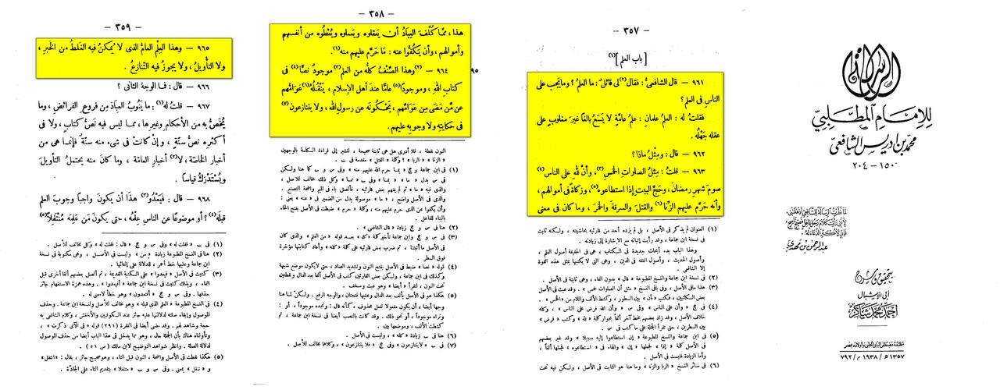

---

<!-- telegram-source: dar/messages.html#message937 -->
<!-- evidence-id: 000119 -->

'Uthman Ibn Sa'īd Ad-Dārimī (رحمه الله تعالى) said:

"And this disbelief is known [by the aql], it doesnt require athar or the news [Hujjah]. Like If a man states that the dominion of Allah and his authority and power and knowledge and his Will and his face and his sight and hearing and hands are created. It was said to him: You have disbelieved and lied, all of them are not created.

[Naqd Al-Darimi 'alaa bishr al marisi, page 209]

Show attached source scan

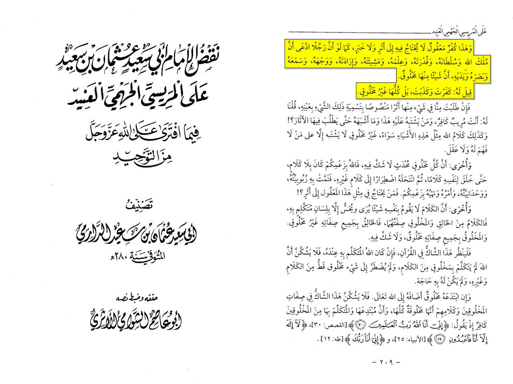

---

<!-- telegram-source: dar/messages2.html#message1978 -->
<!-- evidence-id: 000120 -->

Imām al-Marwazī mentions a group of the salaf said:

“They said: Since knowledge of Allah is faith, and ignorance of Him is disbelief, and since performing the obligatory acts is faith, while ignorance of them before their revelation is not disbelief, then after their revelation, one who does not act upon them is not a disbeliever. This is because the Companions of the Messenger of Allah (ﷺ) affirmed their belief in Allah at the beginning of His mission, yet they did not perform the obligations that were later made mandatory upon them. Their ignorance of these matters was not considered disbelief.

Then Allah revealed these obligations, and their acceptance of them and adherence to them was faith. Only the one who rejects them becomes a disbeliever due to his denial of Allah’s message.

Had no divine message come from Allah, ignorance of these obligations would not have been considered disbelief. Even after the revelation of the message, if a Muslim has not heard of it, he is not deemed a disbeliever due to his ignorance. However, ignorance of Allah in all cases is disbelief—whether before or after the revelation of the message.

They said: For this reason, we say that failing to affirm belief in Allah is disbelief in Him. However, failing to perform obligations while believing that Allah has commanded them is a form of disbelief but not disbelief in Allah; rather, it is disbelief in terms of neglecting the truth—just as a person might say, ‘You have disbelieved in my right and my favor,’ meaning, ‘You have neglected my right and failed to show gratitude for my favor.’

They continued: We take as an example those from among the Companions of the Messenger of Allah (ﷺ) and the Tabiʿūn who narrated this, as they considered disbelief to have branches distinct from its core, which do not remove a person from the fold of Islam. Similarly, they regarded acts of faith as branches of its core, where neglecting them does not expel one from the religion of Islam.

[Ta'ẓīm Qadr aṣ-Ṣalāh - Imām al-Marwazī 2/520]

Show attached source scan

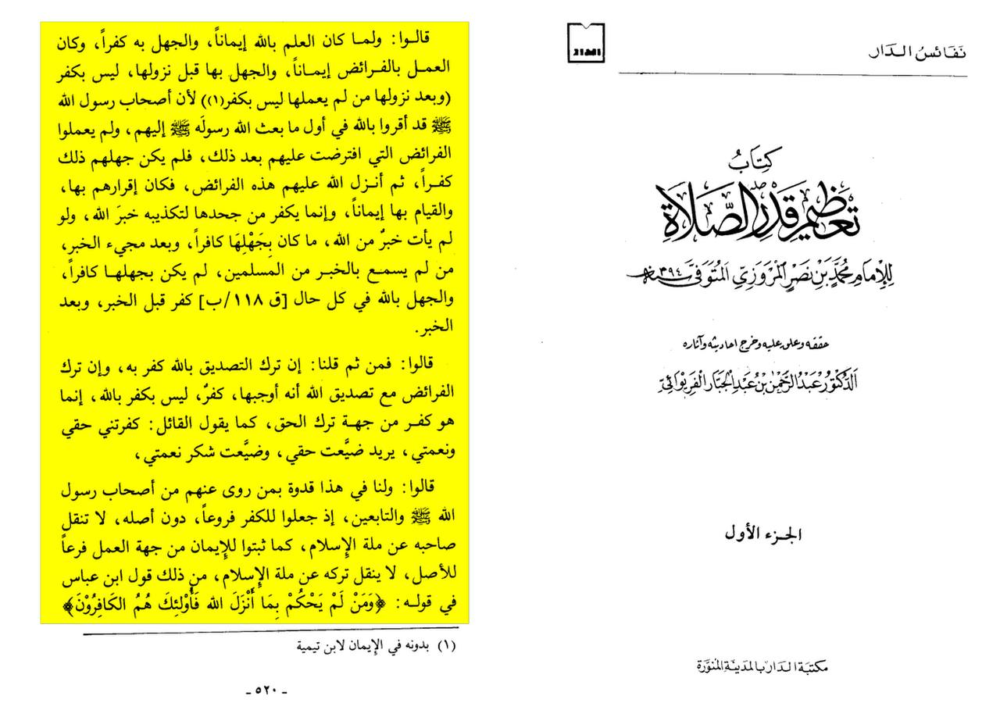

---

<!-- telegram-source: dar/messages3.html#message2294 -->
<!-- evidence-id: 000121 -->

Imām Al-Barbahārī said:

We do not expel anyone from the people of the qiblah from Islām until he rejects a verse from the Book of Allah, or rejects something from the narrations of the Messenger of Allah, or sacrifices to other than Allah, or prays to other than Allah.

If he does any of these, it becomes obligatory upon you to declare him outside of Islām. If he does none of that, he is a believing Muslim in name but not in reality.

[Sharḥ al-Sunnah by Imām Al-Barbahārī (41)]

Show attached source scan

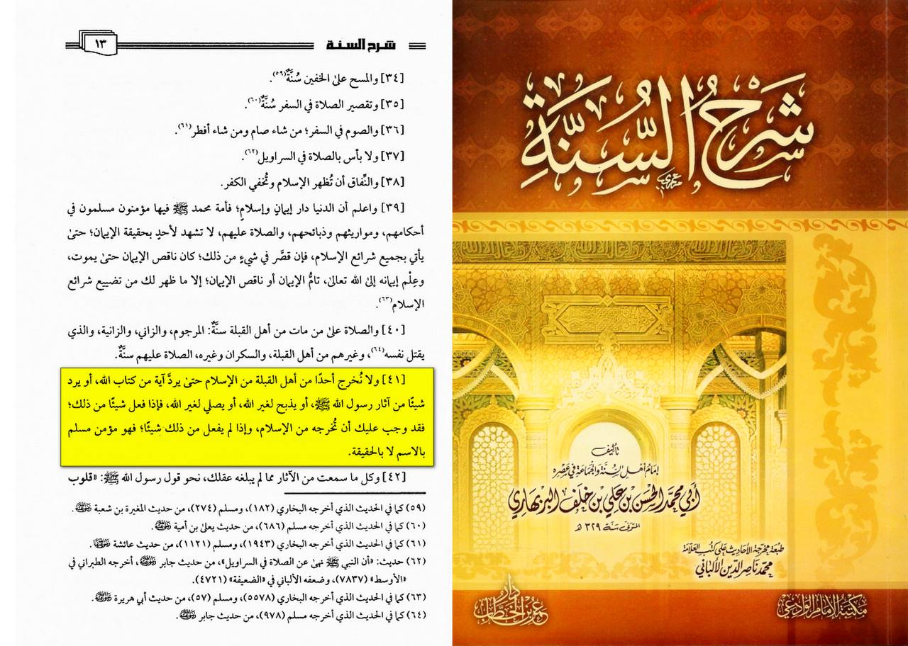

---

<!-- telegram-source: dar/messages3.html#message2897 -->
<!-- evidence-id: 000122 -->

al-Kāsānī said:

Abu Yusuf narrated from Abu Ḥanīfa this statement, where he said: Abu Ḥanīfa said: “There is no excuse for anyone among the creation in their ignorance of knowing their Creator; because it is obligatory for all creation to know their Lord, Subḥānahu wa Taʿālā, and to believe in His Oneness, due to what they see in the creation of the heavens and the earth, their own creation, and everything else created by Allāh, Subḥānahu wa Taʿālā.

As for the obligatory duties, anyone who does not know them and has not received the message, no legal proof has been established upon them according to their words.”

[Badāʾiʿ as-Ṣanāʾiʿ by al-Kāsānī 9/521]

Show attached source scan

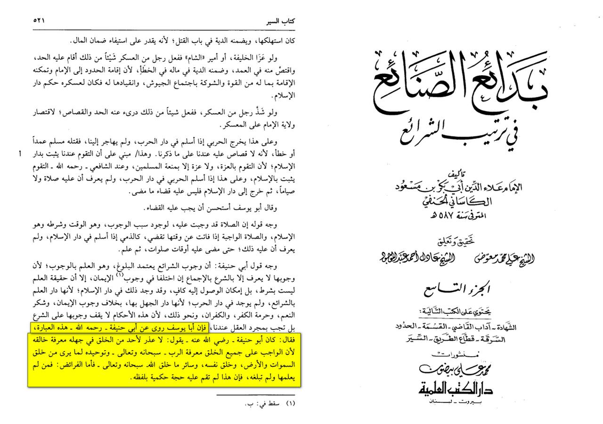

---

<!-- telegram-source: dar/messages2.html#message1956 -->
<!-- evidence-id: 000123 -->

Shaykh Abu Muhammad Muwaffaq al-Dīn Ibn Qudāmah said:

As for matters that contradict tawḥīd and belief in the message, he, may Allah have mercy on him, explicitly stated in many places that those who engage in them are disbelievers, and they should be killed after being given the opportunity to repent. He did not excuse them due to ignorance, even though we are certain that the reason they fell into these matters was due to ignorance of their true nature. If they had known that such actions are disbelief that expels one from Islam, they would not have committed them. This is something the Sheikh, may Allah have mercy on him, frequently discussed in his writings, such as when he said in some of his books:

“Anyone who exaggerates in his veneration of a prophet or a righteous man and attributes a form of divinity to him, such as calling upon him instead of Allah — for example, saying: ‘O so-and-so, help me,’ or ‘Forgive me,’ or ‘Have mercy on me,’ or ‘Help me,’ or ‘Compensate me,’ or ‘I rely upon you,’ or ‘You are sufficient for me,’ and similar statements that are specific to the lordship of Allah, which are not appropriate for anyone but Allah — all of this is shirk (polytheism) and misguidance. The person should be given a chance to repent, and if he repents, then fine; if not, he should be killed.

Whoever places intermediaries between himself and Allah, calls upon them, relies upon them, and asks them for assistance has disbelieved, by ijmāʿ.

Whoever believes that visiting the people of dhimmah in their churches is an act of drawing closer to Allah has apostatized. Even if they are ignorant of the prohibition, they should be informed. If they persist, they become apostates.

Whoever insults the Sahābah, or any one of them, and associates with this insult a claim that ʿAlī is a god or a prophet, or that Jibrīl made a mistake — there is no doubt in the disbelief of this person. In fact, there is no doubt in the disbelief of anyone who hesitates in declaring their disbelief.

Whoever claims that the Sahābah apostatized after the Messenger of Allah (ﷺ), except for a few who number less than fifteen, or that they became corrupt, there is no doubt in the disbelief of the one who says this. In fact, anyone who doubts the disbelief of such a person is himself a disbeliever.

Notice how he declared the doubter a disbeliever, even though the doubter may be ignorant. He did not consider ignorance an excuse in such matters.

He also said, during part of his speech: “This is why it is said: Whoever sins out of pride, like Iblīs, is a disbeliever by unanimous agreement, while whoever sins out of desire is not a disbeliever according to Ahl al-Sunnah. And whoever commits prohibited actions while considering them permissible is a disbeliever by unanimous agreement.”

[Masʾalah fīman Yukaffiru Ghayrahū min al-Muslimīn - Shaykh by Abdullāh Abā Buṭayn p.23-24]

Show attached source scan

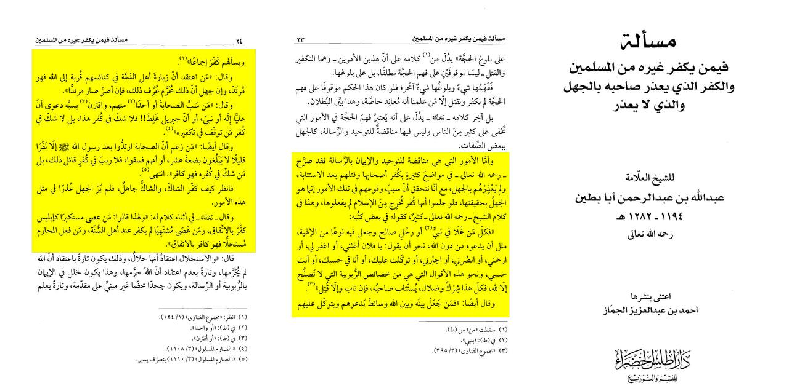

---

<!-- telegram-source: personal/messages.html#message628 -->
<!-- evidence-id: 000124 -->

al-Qarāfī transmit the ijma that their is no ʿUdhr bil Jahl in the fundemental matters of the religion and said:

Therefore, Allah has not excused ignorance in the fundamentals of religion (Uṣūl al-Dīn) by unanimous consensus (ijmā‘). However, in secondary matters (Furū‘), ignorance may serve as an excuse. For instance, if a person drinks alcohol believing it to be lawful or engages in relations with a woman thinking she is his wife, he is excused due to ignorance.

Likewise, the obligation of rational inquiry was established to prevent ignorance regarding essential religious knowledge, as failing to do so would amount to an impossible burden (taklīf mā lā yuṭāq), which is rejected in Islamic law. Similarly, if disbelief (kufr) occurs despite a person’s sincere effort to seek the truth, Allah will still hold him accountable, and his effort will not save him due to the grave nature and high status of this matter. The apparent meaning of the religious texts indicates that whoever does not believe in Allah and His Messenger and does not perform righteous deeds will have the Hellfire as his eternal abode.

[Kitāb Sharḥ Tanqīḥ al-Fuṣūl p.439 by al-Qarāfī]

Show attached source scan

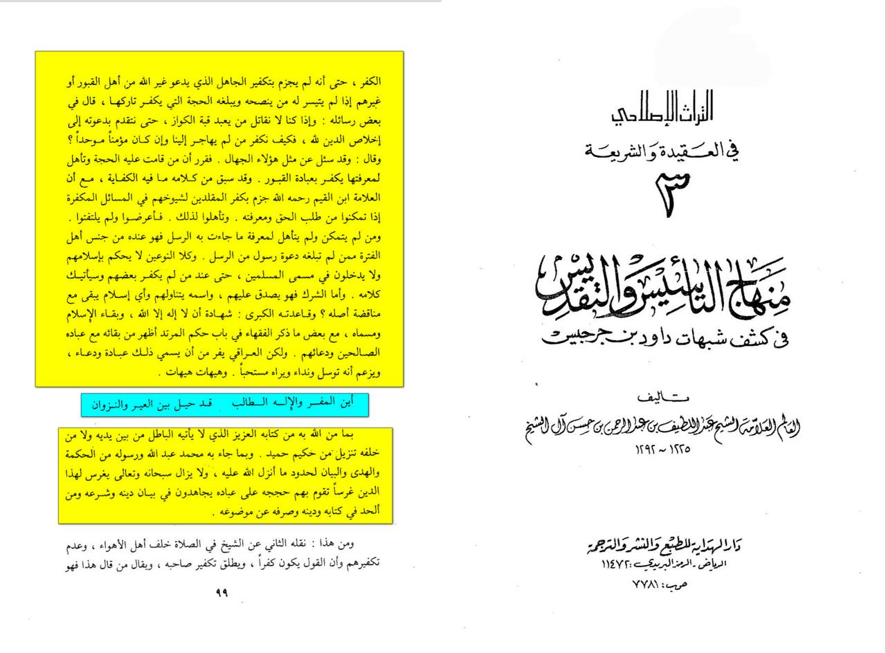

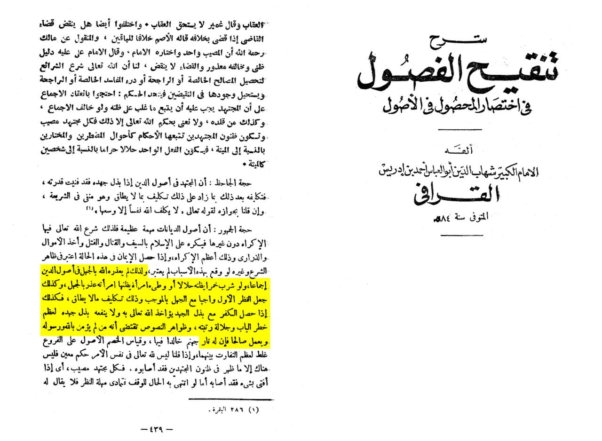

---

<!-- telegram-source: personal/messages.html#message603 -->
<!-- evidence-id: 000125 -->

Shaykh al-Islām Ibn Taymīyyah (رحمه الله) said:

"Verily, Allāh separated between what is before the Message and what comes after it in regards to Asmāʾ (labels) and ʾAḥkām (rulings), and also gathered them together.

‎Thus, the label 'Mushrik' is established before the Message (Ḥujjah) due to him performing Shirk with his Lord and setting up with Him another Ilāh and rival before the Messenger. So these Asmāʾ (labels) are established [before the Message]. Likewise, the label of Jahl (ignorance) and Jāhilīyyah, and it is said 'Jāhilīyyah' and 'Jāhil' before the coming of the Messenger. As for punishment [for the ignorant mushrik], then, no."

[Majmūʿ al-Fatāwa, 20/24]

Show attached source scan

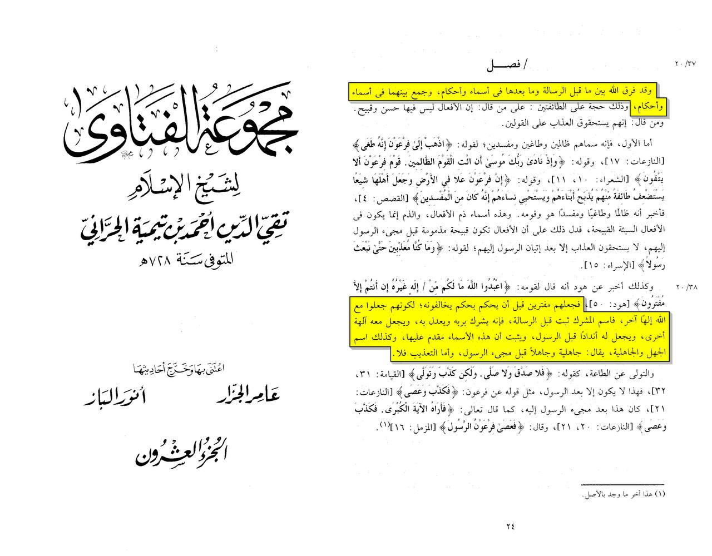

---

<!-- telegram-source: dar/messages3.html#message2671 -->
<!-- evidence-id: 000126 -->

Ibn Qayyim said:

And Allāh will judge between His servants on the Day of Resurrection with His justice and fairness, and He does not punish anyone except the one against whom the ḥujjah has been established through the messengers. This is decisively affirmed regarding all of creation in general.

As for whether a specific individual — like Zayd or ʿAmr — has had the proof established against him or not, that is a matter that cannot be intruded upon between Allāh and His servants. Rather, what is obligatory upon the servant is to believe that everyone who follows a religion other than Islām is a kāfir, and that Allāh, exalted is He, does not punish anyone except after the ḥujjah has been established against him by the messenger.

This applies in general; but as for judging a specific individual, that is left to Allāh’s knowledge and justice. This pertains to the rulings of reward and punishment in the Hereafter. As for worldly rulings, they are based on what is outwardly apparent. So the children of disbelievers and their insane are considered kuffār in the rulings of this world — they follow the legal status of their guardians.

[Ṭarīq al-Hijratayn by Ibn Qayyim 2/900]

Show attached source scan

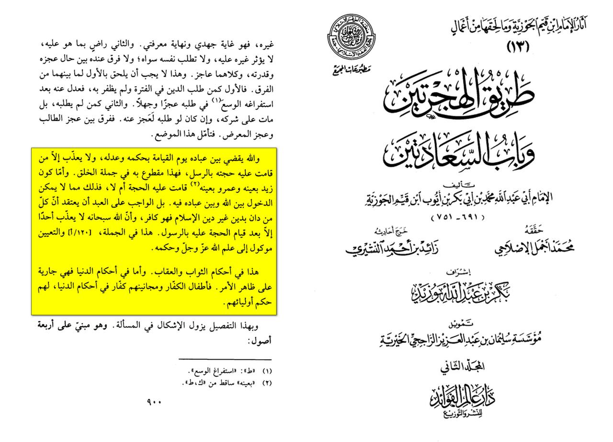

---

<!-- telegram-source: personal/messages.html#message749 -->
<!-- evidence-id: 000127 -->

Imām Ibn al-Qayyim (may Allah have mercy on him) said:

Islam is the tawḥīd of Allah and the worship of Him alone without any partner, and belief in Allah and His Messenger and following what he brought. So as long as a servant does not come with this, he is not a Muslim, and even if he is not a disbeliever out of willful obstinacy, he is a disbeliever out of ignorance. The utmost that can be said of this category is that they are ignorant disbelievers who are not obstinate, and their lack of obstinacy does not remove them from being disbelievers. For the disbeliever is one who rejects the tawḥīd of Allah and denies His Messenger, whether out of obstinacy, or out of ignorance and blind-following of the obstinate.

[ Ṭarīq al-Hijratayn wa Bāb al-Saʿādatayn , p. 411]

---

<!-- telegram-source: dar/messages4.html#message3916 -->
<!-- evidence-id: 000128 -->

Ibn Qayyim said:

The eighteenth reply: His statement, “And one who died during the fatrah (period in which no messenger reached them) does not fall outside being either a kāfir or not a kāfir. If he was a kāfir, then Allāh has forbidden Paradise to the kāfirīn; and if he was excused because no messenger came to him, then how is he commanded to enter the Fire?” Its answer is from several angles:

First: It is said that such people are not judged to be kuffār nor believers. For kufr is the juhūd (denial) of what the Messenger brought, and the realization of this is conditional upon the message reaching a person. And īmān is affirmation of the Messenger in what he informed of, and obedience to him in what he commanded, and this too is conditional upon the message reaching a person. The absence of one of the two—kufr or īmān—does not necessitate the presence of the other except after the cause for it exists. So since these individuals in the worldly life were neither kuffār nor believers, they have in the Hereafter a ruling distinct from the ruling of both groups.

If it is said: “But you judge for them the rulings of the kuffār in worldly matters—inheritance, loyalty, and marriage.” It is answered: We only judge for them in that regard in the rulings of this world, not in matters of reward and punishment, as has already been clarified.

The second angle: We concede that they are kuffār, but the removal of punishment from them is due to the absence of its condition—namely, that the proof has been established against them. For Allāh, exalted is He, does not punish anyone except one upon whom His proof has been established.

The third angle: His statement, “And if he was excused, how is he commanded to enter the Fire when it is the most severe punishment?” The one who said this gives the impression that this command is a punishment for them, and this is mistaken. Rather, it is a obligation and an test. If they hasten to comply, the Fire will not harm them in the least.

[Aḥkām Ahl adh-Dhimmah by Ibn Qayyim 2/1156-1157]

Show attached source scan

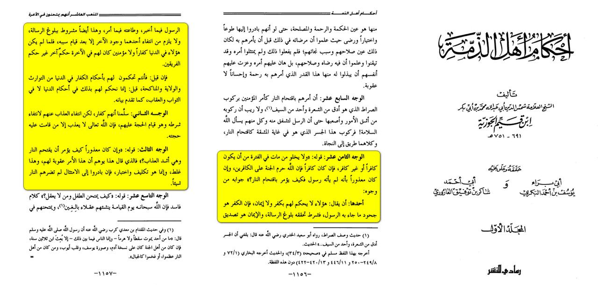

---

<!-- telegram-source: dar/messages.html#message505 -->
<!-- evidence-id: 000129 -->

Imām ibn al-Qayyim (رحمه الله) said:

"Islām is the Tawḥīd of Allāh and His worship alone without any partners, and Īmān (belief) in Allāh and His Messenger, and following him in what he brought. So if the servant does not come with this, then he is not a Muslim, and if he is not a stubborn Kāfir, then he is a Jāhil (ignorant) Kāfir."

[Ṭariq al-Hijartayn, p.897-898]

Show attached source scan

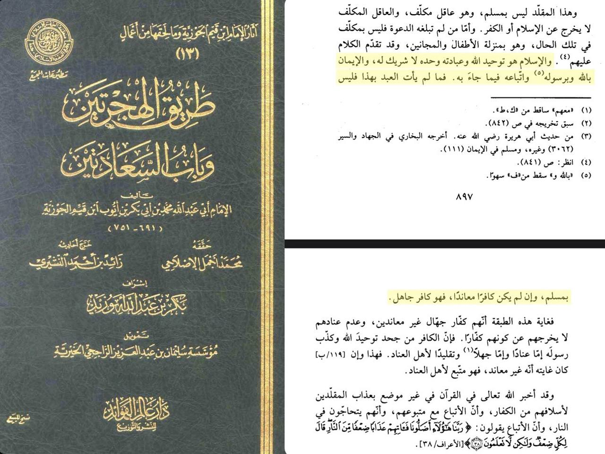

---

<!-- telegram-source: personal/messages.html#message750 -->
<!-- evidence-id: 000130 -->

Imām Ibn al-Qayyim (may Allah have mercy on him) also said:

The Ummah has agreed that this category are disbelievers, even if they are ignorant blind-followers of their leaders and chiefs, except for what is reported from some of the people of innovation, that he did not judge these to be in the Fire and placed them in the same position as those whom the daʿwah had not reached. This is a position not held by any of the imāms of the Muslims, not the Companions, not the Successors, nor those after them, and it is known only from some of the people of kalām (speculative theology) that was introduced into Islam.

[ Ṭarīq al-Hijratayn wa Bāb al-Saʿādatayn , p. 411]

Show attached source scan

---

<!-- telegram-source: dar/messages.html#message633 -->
<!-- evidence-id: 000131 -->

Imām ibn al-Qayyim (رحمه الله) said:

"What could be considered as a sound ʿAql (intellect) if it does not recognize the ugliness of Shirk in and of itself? Knowing its heinousness is self-evident, and known by the necessity of the ʿAql, and the Messengers alerted the nations of what is in their own intellects and innate natures (Fiṭrah) regarding its ugliness."

[Madārij as-Sālikīn, Vol. 1, Pg. 253]

Show attached source scan

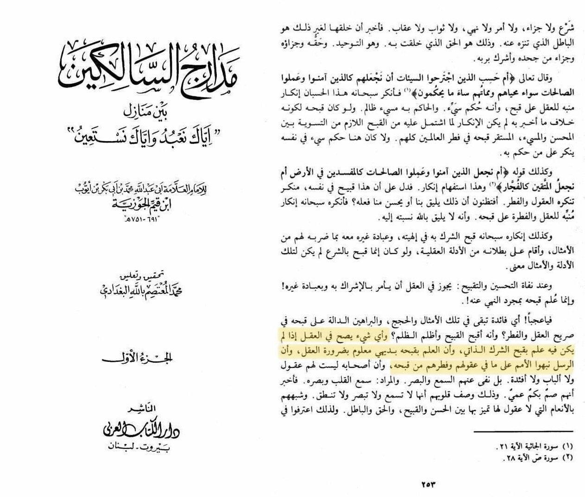

---

<!-- telegram-source: dar/messages.html#message636 -->
<!-- evidence-id: 000132 -->

Imām ibn al-Qayyim (رحمه الله) also stated:

"Know, that if the goodness of Tawḥīd and the vilification of Shirk is not known by the ʿAql and ingrained innately, then there is no assurance of anything to be included within the matters known by the ʿAql. Indeed, this is from the most apparent of matters and the clearest of what Allāh has built within the intellects and innate natures."

[Madārij as-Sālikīn, Vol. 3, Pg. 455]

Show attached source scan

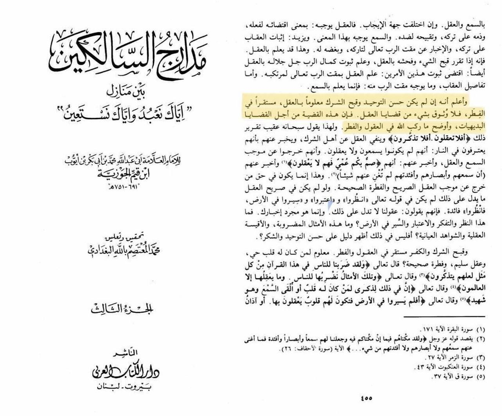

---

<!-- telegram-source: personal/messages.html#message604 -->
<!-- evidence-id: 000133 -->

Sheikh Muḥammad Ibn ʿAbdul-Wahhāb said:

So, if you understand this and grasp it fully, know that this is the path of the messengers, those who followed in their footsteps from among their family, companions, and successors, as well as the rightly guided scholars who came after them. The proof of God is the Qur'an, and whoever the Qur'an reaches has no excuse. Not every form of ignorance is an excuse for its possessor.

These ignorant followers of the disbelievers are considered disbelievers by the consensus of the Ummah—except for those who are truly incapable of reaching the truth and knowing it, those who have no means to do so under any circumstance, despite their love for the truth, their desire for it, their seeking of it, and the absence of anyone to guide them. Also exempt are those who are new to Islam or those who grew up in a remote desert. These are the ones whom the scholars have mentioned as excused, for the proof has not been established against them. Thus, an individual is not declared a disbeliever until they are made aware and the proof is established against them with clarification.

As for the deception and misleading arguments of some who claim that Shaykh al-Islām refrained from declaring an ignorant individual a disbeliever, this is mere obfuscation meant to deceive those with weak insight. His stance was only in specific matters whose evidences might be obscure to some people, such as issues related to divine decree (qadar), irjāʾ (postponing judgment on sinners), and similar topics introduced by the people of desires (ahl al-ahwāʾ). Some of their statements contain elements of disbelief because they reject clear and recurrent proofs from the Qur'an and Sunnah. Thus, the statement itself may be disbelief, but the one who utters it is not necessarily judged a disbeliever due to potential barriers, such as ignorance or unawareness of the scriptural text or its meaning. Religious obligations are only binding once they have been conveyed, which is why he mentioned this in his discussion on the innovations of the people of desires.

Shaykh al-Islām (Ibn Taymiyyah) explicitly clarified this when he spoke about the excommunication (takfīr) of certain prominent theologians. After establishing this principle, he said:

"If the matter pertains to obscure issues ( masāʾil khafiyyah) , one might say that there is no takfīr. However, regarding clear and evident issues or those necessarily known in the religion (maʿlūm min al-dīn bil-ḍarūrah) , there is no hesitation in declaring the speaker a disbeliever."

These fools, however, have generalized the issue and treated all ignorance as an excuse without distinction. They equated clear and evident matters—those known as essential parts of the religion—with obscure issues whose proofs may be hidden from some people. Likewise, they compared those living among Muslims with those raised in a remote desert or newly converted to Islam. As a result, they deviated and led many others astray, veering away from the straight path.

[Ijmāʿ Ahl as-Sunnah an-Nabawiyyah ʿalā Takfīr al-Muʿaṭṭilah al-Jahmiyyah p.116-117]

Show attached source scan

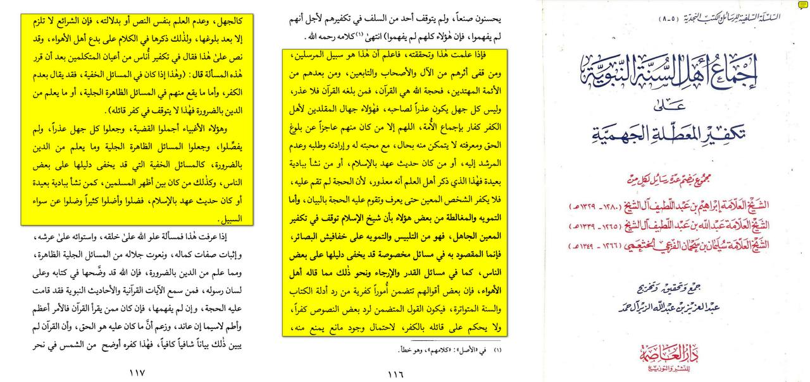

---

<!-- telegram-source: dar/messages2.html#message1349 -->
<!-- evidence-id: 000134 -->

Shaykh Muḥammad ibn ʿAbd al-Wahhāb رحمه الله on clear and unclear matter

Shaykh Muḥammad ibn ʿAbd al-Wahhāb رحمه الله was asked about this issue, and he responded to the questioner by saying:

“This is among the most astonishing things! How can you even doubt this when I have clarified it to you many times? The one upon whom the proof has not been established is the one who is either new to Islam, or someone who grew up in a distant desert region, or in the case of a subtle issue, such as ṣarf and ʿaṭf. Such a person is not considered a disbeliever until the matter is made known to him.

However, when it comes to the fundamental aspects of the religion that Allah has clearly explained and firmly established in His Book, then the proof of Allah is the Qurʾān itself. Whoever the Qurʾān has reached, then the proof has reached him.

But the root of the confusion is that you have not distinguished between the establishment of the proof and understanding the proof.”

The Sheikh then goes on to say:

“These fools have generalized the issue and made all ignorance an excuse, without making distinctions. They equated clear, evident matters—those known necessarily in the religion—with subtle, hidden matters whose evidence might be obscure to some people. Likewise, they treated those who live among Muslims as if they were like those who grew up in a remote desert or are newly converted to Islam. As a result, they have gone astray, led many others astray, and deviated from the straight path.

Now that you understand this, know that the issue of Allah’s exaltation above His creation, His establishment over His Throne, and the affirmation of His perfect attributes and majestic qualities is among the clear and evident matters and is known necessarily in the religion. Allah has made this plain in His Book and through the words of His Messenger (ﷺ). Thus, whoever hears the Qurʾānic verses and prophetic hadiths, the proof has been established against him—even if he does not comprehend them.

And if he is someone who reads the Qurʾān, then the matter is even more serious and disastrous—especially if he stubbornly rejects it and claims that what he follows is the truth while arguing that the Qurʾān has not clearly explained these matters sufficiently. Such a person’s disbelief is clearer than the sun at midday.”

[Kashf al-Awhām wa-l-Iltibās ʿan Tashbīh Baʿḍ al-Aghbiyāʾ min al-Nās by Sheikh Sulaymān ibn Sahmān p.114 & 117]

Show attached source scan

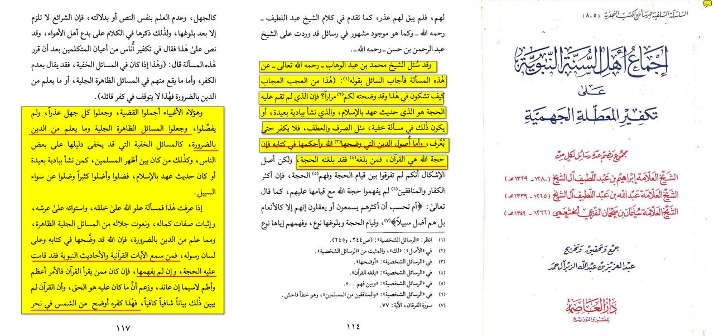

---

<!-- telegram-source: dar/messages2.html#message1571 -->
<!-- evidence-id: 000135 -->

Sheikh Muḥammad Ibn ʿAbdul-Wahhāb رحمه الله said:

Even the ignorant disbelievers know that what the Prophet ﷺ meant by this phrase was to single out Allah alone in devotion, reject what is worshipped besides Him, and disassociate from it. This is clear because when he said to them: "Say: Lā ilāha illa Allāh," They replied: "Has he made the gods into one God? Indeed, this is something astonishing!"

So if you understand that even the ignorant among the disbelievers knew this, then how astonishing is it that someone who claims to be Muslim does not know about this phrase what the ignorant disbelievers knew! Rather, they think that it is merely pronouncing its words without any belief in its meaning. The more knowledgeable among them assume that its meaning is:

"There is no creator, no provider, and no controller of affairs except Allah." So what good is there in a man whom the ignorant disbelievers surpass in understanding the meaning of ‘Lā ilāha illa Allāh’? If you have truly understood what I have explained to you with the knowledge of the heart, and if you recognize the shirk (polytheism) that Allah has said He does not forgive: "Indeed, Allah does not forgive that partners be associated with Him."

And if you understand the religion of Allah, which He sent with all the messengers from the first to the last—the only religion He accepts from anyone— And if you realize the widespread ignorance about this matter among most people today, then this knowledge grants you two great benefits:

the first: Rejoicing in Allah’s favor and mercy, as He says: "Say: In the bounty of Allah and in His mercy—in that let them rejoice; it is better than what they accumulate." (Sūrat Yūnus, 58)

the second: A deep sense of fear, for when you understand that a person may fall into disbelief with a single word they utter, even unknowingly—and that ignorance does not excuse them—and they may even say it thinking it brings them closer to Allah, just as the disbelievers mistakenly believed—then your concern for your faith will grow immensely.

[Kashf ash-Shubuhāt by Muḥammad Ibn ʿAbdul-Wahhāb p.23-25]

Show attached source scan

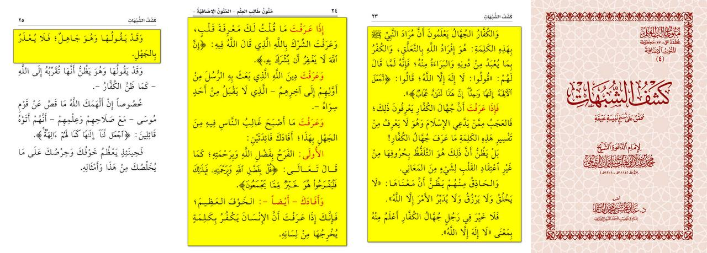

---

<!-- telegram-source: dar/messages2.html#message1644 -->
<!-- evidence-id: 000136 -->

Sheikh Muḥammad Ibn ʿAbdul-Wahhāb said:

The response to these individuals is abundant in the Qur'an, the Sunnah, and the consensus. One of the clearest responses to them is their own acknowledgment, in most cases, that this is major shirk. Additionally, the acknowledgment of other scholars from various regions, that most of them have fallen into shirk and fought against the people of Tawḥīd, yet they could not help but acknowledge it because of its clarity.

The second issue: The acknowledgment that this is major shirk, but they claim that only those who deny Islam entirely, reject the Messenger, deny the Qur'an, and follow Judaism, Christianity, or others, are disbelievers. This is the argument used by those who engage in shirk and obstinacy in these times. As for the first issue, there is little debate on it—praise be to Allah—due to the acknowledgment of it by the scholars of the polytheists.

Know that understanding this issue clearly is sufficient to refute it without needing specific evidence, for two reasons:

The first reason: According to their argument, shirk in Allah and idol worship have no effect on declaring someone a disbeliever, because they claim that if a person leaves one religion and follows another, rejects the Messenger and the Qur'an, they are a disbeliever—even if they do not worship idols, like the Jews.

If someone who claims to be Muslim is not declared a disbeliever when committing major shirk—because they say "There is no god but Allah," pray, and perform other acts—it means that shirk and idol worship have no effect on declaring them a disbeliever. It would be like a physical imperfection such as blindness or lameness. If the person claims to be Muslim, they are considered Muslim, but if they claim another religion, they are considered a disbeliever. This is an immense scandal and is enough to refute this false view.

The second reason is that disobedience to the Messenger (peace be upon him) in matters of shirk and idol worship, after knowledge has reached them, is clear disbelief according to nature, reason, and basic knowledge. It is inconceivable that you would ask a person, even one of the most ignorant and dull individuals: "What do you say about someone who disobeys the Messenger of Allah (peace be upon him) and refuses to abandon idol worship and shirk, while claiming to be a Muslim and a follower?" Without hesitation, they would naturally declare him a disbeliever, without needing to refer to evidence or ask any scholar.

However, due to the prevalence of ignorance, the rarity of knowledge, and the large number of people speaking on this issue, including the atheists, the matter has become unclear to some of the common Muslims who sincerely seek the truth. Do not belittle this issue, but instead, reflect deeply on the detailed evidence. Perhaps Allah will bless you with firm faith and make you one of the leaders who guide by His command.

[Ad-Durar as-Saniyyah 9/425-426]

Show attached source scan

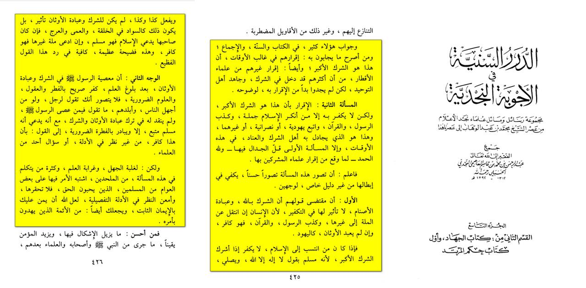

---

<!-- telegram-source: dar/messages2.html#message1577 -->
<!-- evidence-id: 000137 -->

Sheikh Muḥammad Ibn ʿAbdul-Wahhāb said:

The story of apostasy after the death of the Prophet ﷺ. Whoever hears it will have no doubt left in his heart regarding the deception of the devils who are called "scholars." They claim: This is polytheism, but they say La Ilaha Illa Allah, and whoever says it cannot be declared a disbeliever for anything. Even worse, they explicitly state that the Bedouins have not retained even a hair of Islam, yet because they say La Ilaha Illa Allah, they are considered Muslims, and their lives and wealth are protected by Islam—despite acknowledging that they have abandoned Islam entirely, denying resurrection, mocking those who affirm it, ridiculing Islam, and preferring the religion of their ancestors over that of the Prophet ﷺ.

Yet, despite all of this, these wicked, ignorant devils insist that the Bedouins are Muslims, even if they commit all these acts, simply because they utter La Ilaha Illa Allah. By their logic, even the Jews would be considered Muslims, since they also say it. Furthermore, the disbelief of these people is far greater than that of the Jews, many times over—I mean the Bedouins described above.

What proves this from the story of apostasy is that the apostates differed in their forms of apostasy. Some of them outright denied the Prophet ﷺ, returned to idol worship, and said: He was a prophet but has died. Others held on to the testimony of faith but affirmed the prophethood of Musaylima, believing that the Prophet ﷺ had shared prophethood with him, as Musaylima had false witnesses testify in his favor, deceiving many. Despite this, all scholars unanimously agreed that they were apostates, even if they were ignorant of the truth, and whoever doubts their apostasy is himself a disbeliever.

Thus, scholars agreed that those who denied the Prophet ﷺ, returned to idol worship, and insulted the Messenger of Allah ﷺ are in the same category as those who affirmed the prophethood of Musaylima, even if they remained upon Islam otherwise. Some testified to the faith but believed in Ṭulayḥa’s claim to prophethood, others followed al-‘Ansī, the claimant in Ṣan‘ā, and all of them were unanimously considered apostates. Others returned to idol worship after denying the Prophet ﷺ.

Among the last of them was al-Fujā’a al-Sulamī, who approached Abū Bakr claiming he wanted to fight the apostates and requested supplies. Abū Bakr gave him weapons and mounts, but al-Fujā’a then turned on both Muslims and disbelievers, seizing their wealth. Abū Bakr sent an army against him, and when confronted, al-Fujā’a told the commander: You are Abū Bakr’s leader, and I am his leader—I have not disbelieved. The commander replied: If you are truthful, then lay down your weapons. He did so, and Abū Bakr ordered that he be burned alive.

If this was the ruling of the Companions regarding a man who affirmed the five pillars of Islam, then what do you think of those who do not affirm even a single aspect of Islam, except merely uttering La Ilaha Illa Allah with their tongues—while openly denying its meaning and renouncing the religion of Muhammad ﷺ and the Book of Allah? They say: This is the religion of the townsfolk; our religion is the religion of our ancestors. Yet these wicked, ignorant scholars still issue verdicts declaring such people to be Muslims, despite their explicit rejection of Islam, simply because they say La Ilaha Illa Allah!

Glory be to You, this is a great falsehood!

How true were the words of a Bedouin who, upon hearing some of Islam, declared: I testify that we are disbelievers—meaning himself and all the Bedouins—and I testify that the religious scholar who calls us Muslims is himself a disbeliever.

[Majmūʿat Rasāʾil fī at-Tawḥīd wal-Īmān (printed within the collected works of ash-Shaykh Muḥammad Ibn ʿAbdul-Wahhāb) 1/360-362]

Show attached source scan

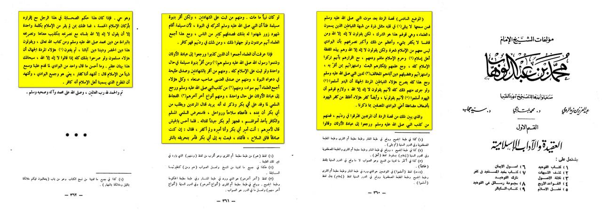

---

<!-- telegram-source: dar/messages3.html#message2594 -->
<!-- evidence-id: 000138 -->

Shaykh Muḥammad Ibn ʿAbdul-Wahhāb said:

The first point: It should be asked — this practice that many of the common people engage in at the graves of the righteous, and also with many of the living and the dead, and even with the jinn — where they turn to them, supplicate to them for relief from hardship, and make vows for their sake in hopes of benefit:

Is this the shirk al-akbar (major shirk) — the very same committed by the people of Nūḥ and those who came after them, up until the time of the final Messenger’s people, Quraysh and others — which led to Allah sending messengers and revealing books to denounce them, declare them disbelievers, and command fighting them until all religion is for Allah alone? Or is this only shirk aṣghar (minor shirk)? And was the shirk of the earlier nations of a different kind than this?

Know that: This issue is easy to understand for whoever Allah makes it easy for — especially since the scholars among today’s mushrikīn acknowledge that this is major shirk, and they do not deny it — except for what came from Musaylima al-Kadhdhāb and his followers, like Ibn Ismāʿīl and Ibn Khālid. Despite their contradictions and confusion, most of the time they do admit that it is major shirk, but they excuse its practitioners by claiming that the call (to tawḥīd) has not reached them.

[Ad-Durar as-Saniyyah 9/424]

Show attached source scan

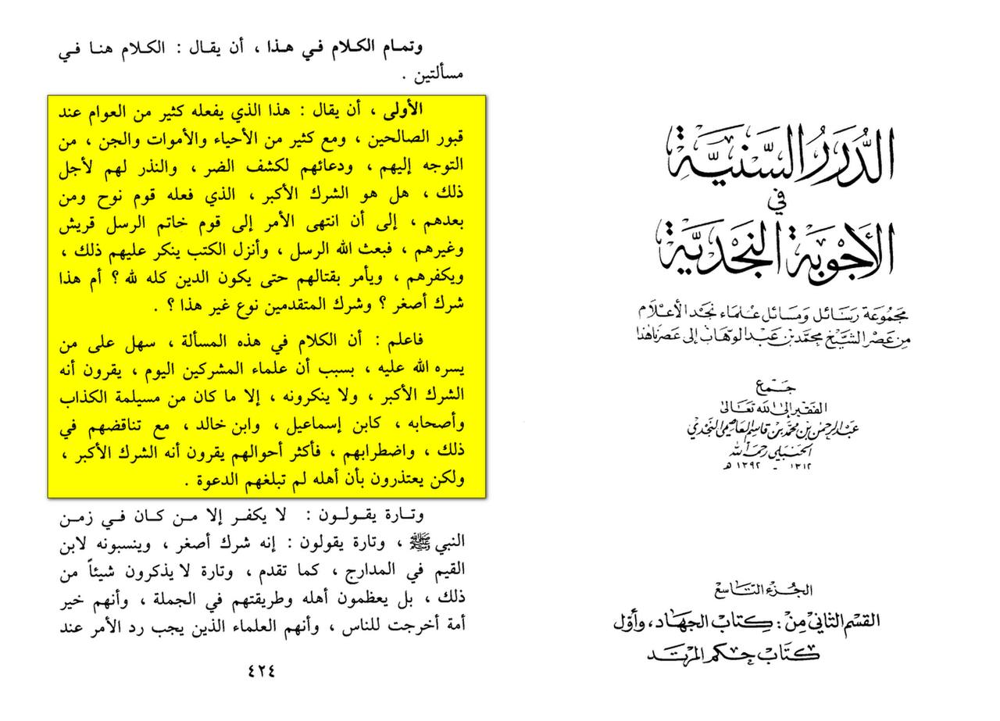

---

<!-- telegram-source: dar/messages4.html#message3375 -->
<!-- evidence-id: 000139 -->

Shaykh Muḥammad ibn ʿAbd al-Wahhāb said:

(The Sixth Point): The story of the apostasy after the death of the Prophet ﷺ. Whoever hears it, not a speck of a mustard seed’s weight of doubt remains in his heart regarding the sophistries of the devils who call themselves “ʿulamāʾ.” Their claim is: “This is shirk, but they say Lā ilāha illā Allāh — and whoever says it does not disbelieve because of anything.”

Even greater and more explicit than this is their statement that the desert dwellers have not a hair of Islām with them — yet they say Lā ilāha illā Allāh, and thus, by this word, they are considered people of Islām, and their wealth and blood are inviolable, while admitting that they have abandoned Islām entirely. And knowing that they deny the resurrection, that they mock those who affirm it, that they ridicule and prefer the religion of their forefathers opposed to the religion of the Prophet ﷺ.

And with all this, these rebellious devilish ignoramuses declare that the Bedouins are Muslims, even if all of this occurs from them, simply because they say Lā ilāha illā Allāh. The necessary implication of their statement is that the Jews are Muslims, since they also say it. Moreover, the kufr of these - the Bedouins who possess the qualities we mentioned - is far graver than the kufr of the Jews many times over.

What clarifies this from the story of the apostasy is that the apostates divided in their apostasy: among them were those who denied the Prophet ﷺ, returned to the worship of idols, and said: “If he were a prophet, he would not have died.” And among them were those who remained upon the two shahādahs but affirmed the prophethood of Musaylima, thinking that the Prophet ﷺ had shared with him in prophethood, since Musaylima brought false witnesses who testified for him — and many people believed them. Yet despite this, the scholars unanimously held that they were apostates, even if they were ignorant of the matter, and whoever doubts their apostasy is a kāfir.

So once you know that the scholars unanimously held that those who denied and returned to idol worship, and those who reviled the Messenger of Allāh ﷺ, and those who affirmed the prophethood of Musaylima, are all the same in one condition — even if they remained upon the rest of Islām. And among them were those who affirmed the two shahādahs but believed Ṭulayḥa in his claim of prophethood, and among them those who believed al-ʿAnsī, the claimant from Ṣanʿāʾ. And all of these, the scholars unanimously held, are alike.

Then these rebellious ignorant ones issue fatwās that such people are Muslims, even if they explicitly did all of that, so long as they say Lā ilāha illā Allāh. Glory be to You, this is a tremendous slander!

And how excellent is the statement of one of the Bedouins who came to us and heard something of Islām, when he said: “I bear witness that we are kuffār” — meaning himself and all of the Bedouins — “and I bear witness that the pretentious worshipper who calls us ‘people of Islām’ is a kāfir.”

And all praise is due to Allāh, Lord of the Worlds. And may blessings and peace be upon Muḥammad, his family, and his Companions.

[Majmūʿat Rasāʾil fī al-Tawḥīd wal-Īmān (within the collected works of Shaykh Muḥammad ibn ʿAbd al-Wahhāb 1/360-362]

Show attached source scan

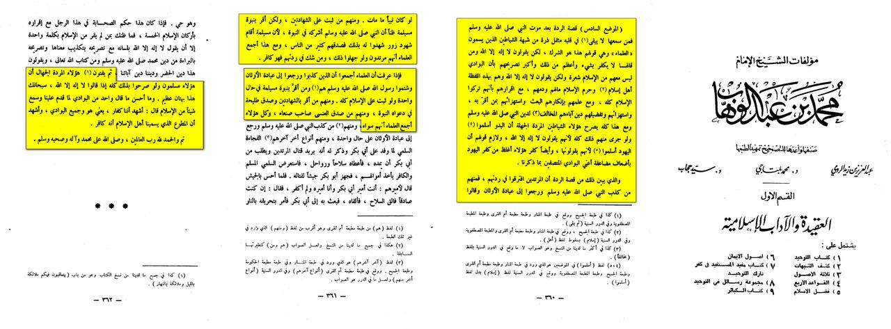

---

<!-- telegram-source: dar/messages3.html#message2692 -->
<!-- evidence-id: 000140 -->

Shaykhs Ḥusayn and ʿAbd Allāh, the sons of Shaykh Muḥammad ibn ʿAbd al-Wahhāb — may Allāh have mercy on them — said:

Whoever among the people of shirk died before this daʿwah reached him, the ruling regarding him is as follows: if he was known for committing shirk, adhered to it as his religion, and died upon that, then outwardly he is judged to have died upon kufr. No supplication is made for him, no sacrificial offering is made on his behalf, and no charity is given on his behalf.

As for the reality of his condition, that is left to Allāh, the Exalted. If the ḥujjah had been established against him in his lifetime and he was obstinate, then he is a kāfir both outwardly and inwardly. But if the ḥujjah had not been established against him, then his matter is with Allāh, the Exalted.

[Ad-Durar as-Saniyyah 10/142]

Show attached source scan

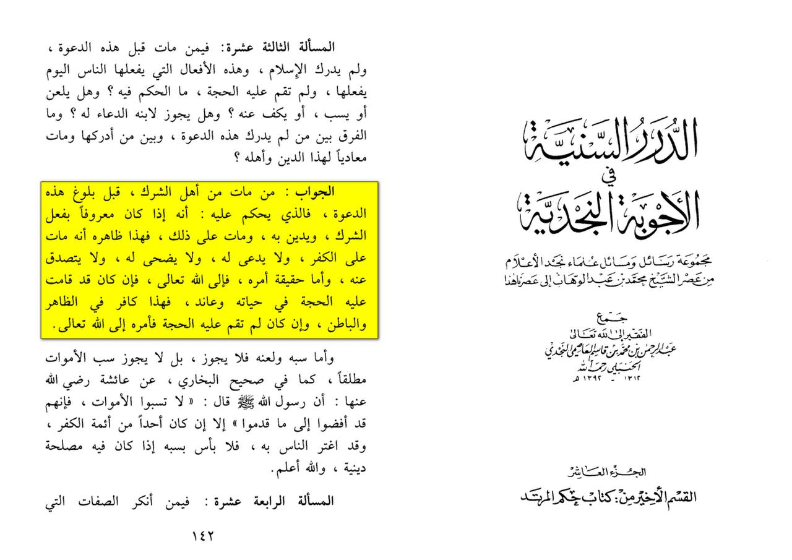

---

<!-- telegram-source: dar/messages3.html#message2602 -->
<!-- evidence-id: 000141 -->

Shaykh Muḥammad Ibn ʿAbdul-Wahhāb said:

And it also teaches you: immense fear — for once you understand that a person can fall into kufr by a single word he utters with his tongue, and he may say it while being ignorant, yet ignorance is not an excuse, and he may even say it thinking it brings him closer to Allah.

[Ad-Durar as-Saniyyah 1/71]

Show attached source scan

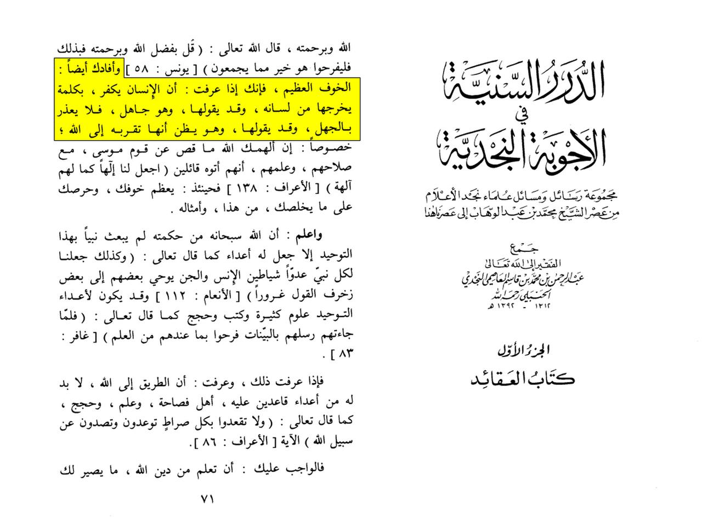

---

<!-- telegram-source: dar/messages2.html#message1567 -->
<!-- evidence-id: 000142 -->

Sheikh Muḥammad Ibn ʿAbdul-Wahhāb said:

So when they saw me commanding the people with what their Prophet (ﷺ) commanded them—to worship none but Allāh—and that whoever calls upon ʿAbd al-Qādir is a disbeliever, and ʿAbd al-Qādir is free from them; and likewise, whoever seeks help from the righteous, or the prophets, or wails for them, or prostrates to them, or makes vows to them, or directs any form of worship to them—worship that is the exclusive right of Allāh over His servants—then every person who knows the command of Allāh and His Messenger will not deny this matter but will rather affirm and acknowledge it.

As for the one who denies this, he falls into one of two categories:

If he says that calling upon the righteous, seeking their aid, making vows to them, and dedicating oneself as their devotee is a good thing—even if Allāh and His Messenger have stated that it is disbelief—then he is insisting on denying Allāh and His Messenger. There is no ambiguity in his disbelief, and we have no discussion with him.

Rather, our discussion is with a man who believes in Allāh and the Last Day, loves what Allāh and His Messenger love, and hates what Allāh and His Messenger hate—but he is ignorant, and the devils have confused him about his religion. He assumes that having faith in the righteous is correct; yet, if he knew that it was an act of disbelief leading its doer to the Hellfire, he would not have done it.

We clarify this matter for him, saying: A Muslim must follow the command of Allāh and His Messenger and inquire about it. Allāh, the Exalted, revealed the Qurʾān, in which He mentioned what He loves and what He detests, making our religion clear and complete. Likewise, Muḥammad (ﷺ), the best of prophets, had no one on earth more beloved to his companions than him. They loved him more than themselves and their children, recognized his status, and also understood shirk and īmān.

If any Muslim during the time of the Prophet (ﷺ) had called upon him, made vows to him, wailed for him, or if any of his companions had gone to his grave after his death to ask him for something, wail for him, or seek refuge by his grave—then know that this is a correct and good practice, and do not follow me or anyone else in rejecting it.

However, if upon inquiry, you find that the Prophet (ﷺ) disavowed those who held such beliefs about the prophets and the righteous, fought them, took their women and children captive, seized their wealth, and ruled them as disbelievers—then know that the Prophet (ﷺ) speaks only the truth and commands only what is right. It is obligatory for every believer to follow what he brought.

In summary, what I reject is placing belief in anything other than Allāh in a way that is not permissible for any but Him. If I said this from my own opinion, then discard it. If I took it from a book that has no practical basis, then discard it as well. If I conveyed it from the scholars of my school of thought, then discard it. But if I have said it based on the command of Allāh and His Messenger and in accordance with the consensus of scholars across all schools of thought, then it is not befitting for a man who believes in Allāh and the Last Day to turn away from it—just because the people of his time or his country have turned away from it, or because most people in his era have ignored it.

[Ad-Durar as-Saniyyah 1/75-76]

Show attached source scan

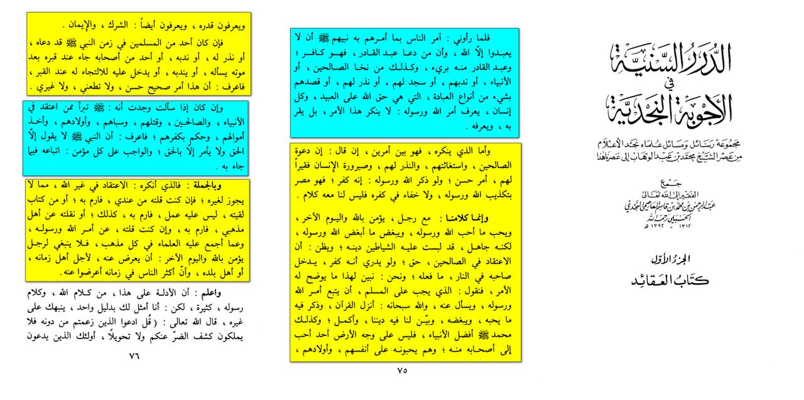

---

<!-- telegram-source: dar/messages4.html#message3440 -->
<!-- evidence-id: 000143 -->

Ash-Shaykh Ḥusayn and ash-Shaykh ʿAbd Allāh, the two sons of ash-Shaykh Muḥammad (ibn ʿAbd al-Wahhāb) said in the course of their answer:

Issue eleven: A man entered this dīn and loved it, but he does not show enmity to the mushrikīn, or he shows enmity to them but does not declare them kuffār, or he says: “I am a Muslim, but I am not able to declare takfīr upon the people of lā ilāha illā Allāh, even if they did not know its meaning.” Or a man entered this dīn and loved it, but he says: “I will not oppose the domes (over the graves). I know they neither benefit nor harm, but I will not oppose them.”

The answer: Such a man is not a Muslim except if he knows tawḥīd, adheres to it, acts according to its requirement, believes the Messenger ﷺ in what he informed, obeys him in what he forbade and commanded, and has īmān in him and what he brought. Whoever says: “I do not show enmity to the mushrikīn,” or shows enmity but does not declare them kuffār, or says: “I will not oppose the people of lā ilāha illā Allāh even if they committed kufr and shirk and opposed the dīn of Allāh,” or says: “I will not oppose the domes”—such a person is not a Muslim.

Rather, he is of those whom Allāh said regarding them: “And they say, ‘We believe in some and we disbelieve in some,’ and they wish to adopt a way in between. Those—they are the disbelievers in truth.” (al-Nisāʾ 4:150–151) And Allāh, subḥānahu wa-taʿālā, has made obligatory showing enmity to the mushrikīn, opposing them, and declaring them kuffār. He said: “You will not find a people who believe in Allāh and the Last Day having affection for those who oppose Allāh and His Messenger…” (al-Mujādilah 58:22) And He, taʿālā, said: “O you who have believed, do not take My enemies and your enemies as allies, extending to them affection while they have disbelieved in what has come to you of the truth, driving out the Messenger and yourselves because you believe in Allāh your Lord…” (al-Mumtaḥanah 60:1)

And Allāh knows best.

[ad-Durar as-Saniyyah 10/139–140]

Show attached source scan

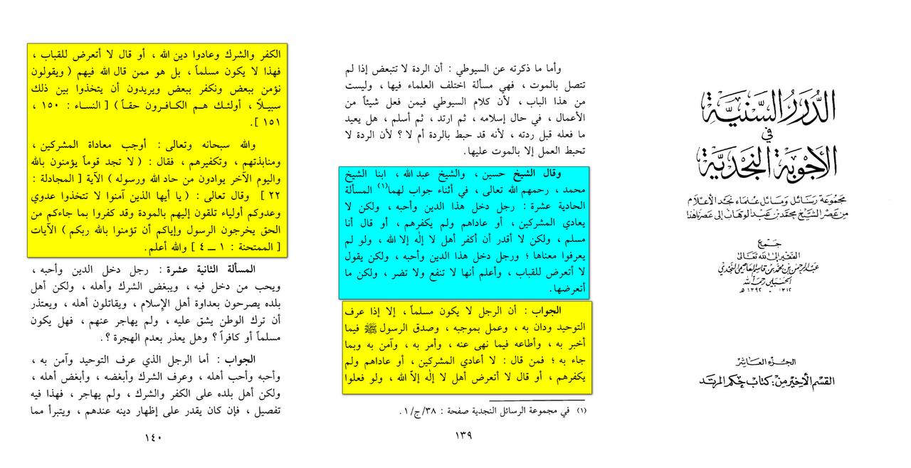

---

<!-- telegram-source: personal/messages.html#message597 -->
<!-- evidence-id: 000144 -->

<video class="source-video" controls preload="metadata" src="assets/videos/personal-597.mp4"></video>

Video source from the user’s Telegram export.

Shaykh Ṣāliḥ al-Usaymī حفظه الله on the clarification of the position of the Imām MIAW and his statements on the topic of Udhr bil Jahl

---

<!-- telegram-source: personal/messages.html#message631 -->
<!-- evidence-id: 000145 -->

<video class="source-video" controls preload="metadata" src="assets/videos/personal-631.mp4"></video>

Video source from the user’s Telegram export.

Did MIAW رحمه الله تعالى  give udhr to the ones who worshipped the tombs of Abdul Qadir al Jilani رحمه الله تعالى and the like?

Shaykh Saleh al Usaymi حفظه الله in the video below:

The linked reply: Shows that MIAW only used takfir (calling one a kaafir) for the hukm! I.e. what makes their blood and wealth halal, and he still considered them non-muslim by ism, i.e. calling them a muslim or not.

This is why it is very important to know a scholar fully before trying to isolate their quotes to form an opinion from them! Ample knowledge of one of the great scholars - as Shaykh Saleh al Usaymi حفظه الله demonstrates by his quick reply - is needed before one can start to understand what a scholar means by their own statements!

---

<!-- telegram-source: dar/messages3.html#message2868 -->
<!-- evidence-id: 000146 -->

Shaykh Ḥamad ibn Nāṣir ibn Muʿammar said:

Rather, we say: Whoever among the people of Jāhiliyyah practiced Islam and abandoned shirk, then he is a Muslim.

As for the one who worshiped idols and died upon that before the appearance of this religion, then outwardly he is a disbeliever — even though it is possible that the ḥujjah had not been established upon him due to his ignorance and the absence of someone to alert him.

This is because we judge according to the apparent, while the inward judgment belongs to Allāh. And Allāh does not punish anyone until the ḥujjah has been established against him, as He said: “And We never punish until We have sent a Messenger.” [al-Isrāʾ: 15]

[Ad-Durar as-Saniyyah 10/336]

Show attached source scan

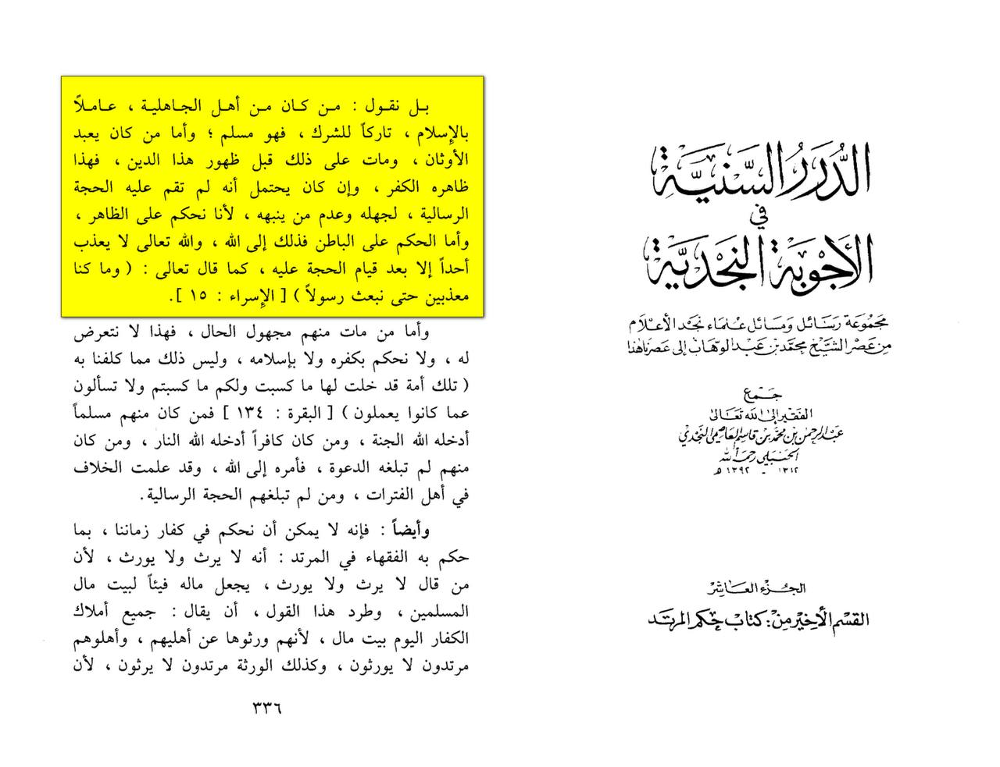

---

<!-- telegram-source: dar/messages.html#message499 -->
<!-- evidence-id: 000147 -->

Imām ash-Shawkānī (رحمه الله) said:

‎”Whoever falls into Shirk ignorantly is not excused because the Ḥujjah has been established upon all of creation by the coming of Muḥammad ‎(ﷺ). Therefore, whoever is ignorant, then indeed it came from himself due to turning away from the Book [of Allāh] and the Sunnah…”

[al-Fatḥ ar-Rabbānī, 1/146]

Show attached source scan

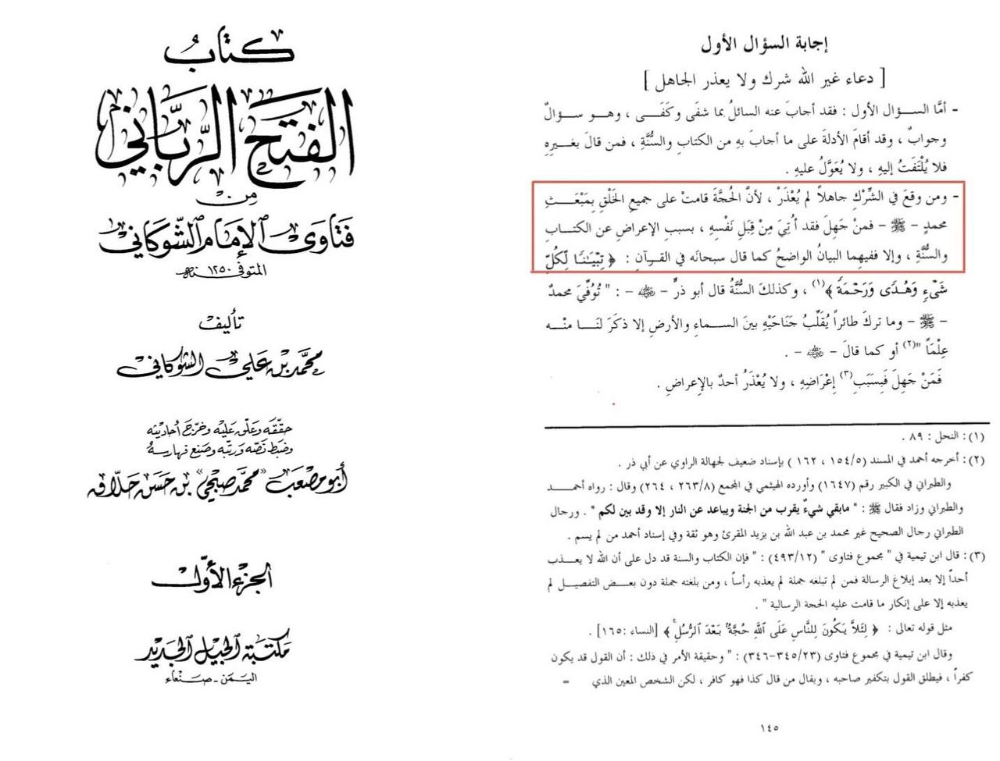

---

### Abā Buṭayn against making every ignorant person a Muslim
<!-- evidence-id: 000148 -->

Show Arabic source text

المصدر: عبد الله أبا بطين، *الدرر السنية في الأجوبة النجدية*، 12/69.

واحتج بعض من يجادل عن المشركين بقصة الذي قد أوصى أهله أن يحرقوه بعد موته، على أن من ارتكب الكفر جاهلًا لا يكفر، ولا يكفر إلا المعاند.

والجواب عن ذلك كله: أن الله سبحانه وتعالى أرسل رسله مبشرين ومنذرين، لئلا يكون للناس على الله حجة بعد الرسل؛ وأعظم ما أرسلوا به ودعوا إليه: عبادة الله وحده لا شريك له، والنهي عن الشرك الذي هو عبادة غيره؛ فإن كان مرتكب الشرك الأكبر معذورًا لجهل، فمن الذي لا يعذر؟!

ولازم هذه الدعوى: أنه ليس لله حجة على أحد إلا المعاند، مع أن صاحب هذه الدعوى لا يمكنه طرد أصله، بل لا بد أن يتناقض، فإنه لا يمكنه أن يتوقف في تكفير من شك في رسالة محمد صلى الله عليه وسلم أو شك في البعث، أو غير ذلك من أصول الدين، والشاك جاهل؛ والفقهاء يذكرون في كتب الفقه حكم المرتد: أنه المسلم الذي يكفر بعد إسلامه، نطقًا أو فعلًا أو شكًّا أو اعتقادًا، وسبب الشك الجهل.

ولازم هذا: أنا لا نكفر جهلة اليهود والنصارى، والذين يسجدون للشمس والقمر والأصنام لجهلهم، ولا الذين حرقهم علي بن أبي طالب رضي الله عنه بالنار، لأنا نقطع أنهم جهال؛ وقد أجمع المسلمون على كفر من لم يكفر اليهود والنصارى، أو شك في كفرهم، ونحن نتيقن أن أكثرهم جهال.

**English**

> Some who argue on behalf of the mushrikīn cited the account of the man who instructed his family to burn him after his death as evidence that a person who commits disbelief in ignorance is not declared a disbeliever and that none is declared a disbeliever except an obstinate rejector.
>
> The answer to all of that is that Allāh, Glorified and Exalted, sent His Messengers as bearers of glad tidings and warners so that people would have no argument against Allāh after the Messengers. The greatest matter with which they were sent and to which they called was the worship of Allāh alone without partner and the prohibition of shirk, which is the worship of other than Him. If the one who commits major shirk is excused because of ignorance, then who would not be excused?
>
> The necessary implication of this claim is that Allāh has no proof against anyone except an obstinate rejector. Yet the proponent of this claim cannot consistently apply his own principle and must contradict himself. He cannot refrain from declaring a disbeliever one who doubts the message of Muḥammad ﷺ, doubts the Resurrection, or doubts another foundation of the religion, although the doubter is ignorant. The jurists mention in their books of jurisprudence that an apostate is a Muslim who disbelieves after his Islam through speech, action, doubt, or belief, while the cause of doubt is ignorance.
>
> Another necessary implication is that we would not declare the ignorant Jews and Christians disbelievers, nor those who prostrate to the sun, moon, and idols because of their ignorance, nor those whom ʿAlī ibn Abī Ṭālib, may Allāh be pleased with him, burned with fire, since we are certain that they were ignorant. Yet the Muslims have unanimously agreed upon the disbelief of one who does not declare the Jews and Christians disbelievers or doubts their disbelief, while we are certain that most of them are ignorant.

Source: ʿAbd Allāh Abā Buṭayn, *al-Durar al-Saniyyah fī al-Ajwibah al-Najdiyyah*, 12/69.

<!-- telegram-source: dar/messages2.html#message1677 -->
<!-- evidence-id: 000149 -->

A doubt the Murjiah bring to excuse Shirk

al-‘Allāmah ‘Abdullāh Abā Butayn said:

Some who argue in defense of the polytheists cite the story of the man who instructed his family to burn his body after his death as evidence that someone who commits an act of disbelief out of ignorance is not deemed a disbeliever—only the stubborn rejecter is.

The response to this is that ALLĀH (ﷻ) sent His messengers as bearers of glad tidings and warnings so that people would have no excuse before Him after the messengers had been sent. The greatest message they conveyed and called people to was the worship of ALLĀH (ﷻ) alone, without any partner, and the prohibition of associating others with Him in worship.

If someone who commits major polytheism is excused due to ignorance, then who is not excused? The implication of this claim is that ALLĀH (ﷻ) has no argument against anyone except the stubborn rejecter. However, the proponent of this argument cannot remain consistent in their reasoning; they will inevitably contradict themselves. For instance, they cannot refrain from declaring as disbelievers those who doubt Muḥammad’s (ﷺ) prophethood, the resurrection, or other fundamental tenets of faith—yet the doubter, too, is ignorant.

he then goes on to say:

The one who claims that a person who commits kufr (disbelief) due to ta’wīl (misinterpretation), ijtihād (independent reasoning), khata’ (mistake), taqlīd (blind following), or jahl (ignorance) is excused is in clear opposition to the Kitāb (Qur’an), the Sunnah, and the Ijmāʿ (scholarly consensus) without a doubt. Moreover, such a person must inevitably contradict their own principle, for if they were to apply it consistently, they would inevitably fall into kufr themselves—just as one would if they hesitated in declaring as kāfir someone who doubts the Risālah (prophethood) of Muḥammad ﷺ.

As for the man who instructed his family to burn his body and whom ALLĀH (ﷻ) forgave despite his doubt regarding one of the attributes of the Almighty Lord, He forgave him because the message had not reached him—this is what several scholars have stated.

For this reason Ibn Taymiyyah رحمه الله, said: "Whoever doubts one of the attributes of the Lord, and such doubt is in something that one like him should not be ignorant of, is a disbeliever. However, if it is something that one like him could be ignorant of, he is not deemed a disbeliever." He further stated: "This is why the Prophet (ﷺ) did not declare the man who doubted ALLĀH’S power to be a disbeliever,because such disbelief only applies after the message has reached a person." Ibn ʿAqīl also held this view, interpreting the case as one where the man had not received the message.

Shaykh Taqi Ad-Dīn's stance regarding ALLĀH’S attributes was that ignorance does not render a person a disbeliever. However, when it comes to polytheism and similar matters, he did not hold the same view, as will be shown later,إن شاء الله. We have already mentioned some of his statements regarding the Ittihadiyyah (a sect that believed in the unity of existence) and others, and his ruling that whoever doubts their disbelief is himself a disbeliever.

The author of Al-Ikhtiyarat stated: "Apostasy applies to anyone who associates others with ALLĀH (ﷻ), hates the Prophet (ﷺ) or what he brought, fails to reject wrongdoing in his heart, believes that some of the Companions fought alongside the disbelievers or deems such an act permissible, denies a matter upon which there is definitive consensus, or places intermediaries between himself and ALLĀH (ﷻ) relying on them, calling upon them, and seeking from them—this is unanimous disbelief."

He further stated: "Whoever doubts one of ALLĀH’S attributes in a way that one like him should not be ignorant of is an apostate. However, if it is something one like him could be ignorant of, he is not an apostate. This is why the Prophet (ﷺ) did not declare the man who doubted ALLĀH’S power to be a disbeliever."

Show attached source scan

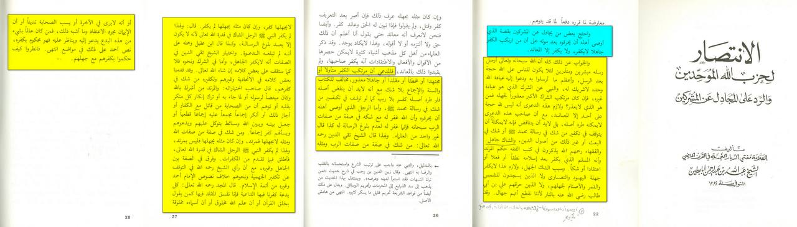

---

<!-- telegram-source: dar/messages2.html#message1919 -->
<!-- evidence-id: 000150 -->

al-‘Allāmah ‘Abdullāh Abā Butayn said:

So, whoever receives the message of Prophet Muhammad ﷺ and the Qur’an has had the evidence established against them. They are not excused for disbelief due to ignorance of Allah, His angels, His books, His messengers, or the Last Day. After that, there is no excuse for ignorance.

Allah, the Exalted, has informed us about the ignorance of many disbelievers while explicitly stating their disbelief. He described the Christians as being ignorant, even though no Muslim doubts their disbelief. We assert the disbelief of most Jews and Christians today, acknowledging their ignorance and imitation. We also believe in the disbelief of those who have any doubt about their disbelief.

The Qur’an indicates that doubt in the fundamentals of religion is disbelief. Doubt is the hesitation between two things, like one who is unsure of the truth of the Prophet or his falsehood, or of the occurrence of resurrection (whether it will happen or not), and similar doubts. This includes someone who does not believe in the obligation of prayer or in its non-obligation, or who does not believe in the prohibition of adultery or in its non-prohibition.

This is disbelief according to the consensus of scholars, and there is no excuse for someone in this state, claiming that they did not understand the proofs and clear signs of Allah. This is because there is no excuse for them after the message has reached them, even if they did not understand it.

[Masʾalah fīman Yukaffiru Ghayrahū min al-Muslimīn - by Sheikh Abdullāh Abā Buṭayn p.20-21]

Show attached source scan

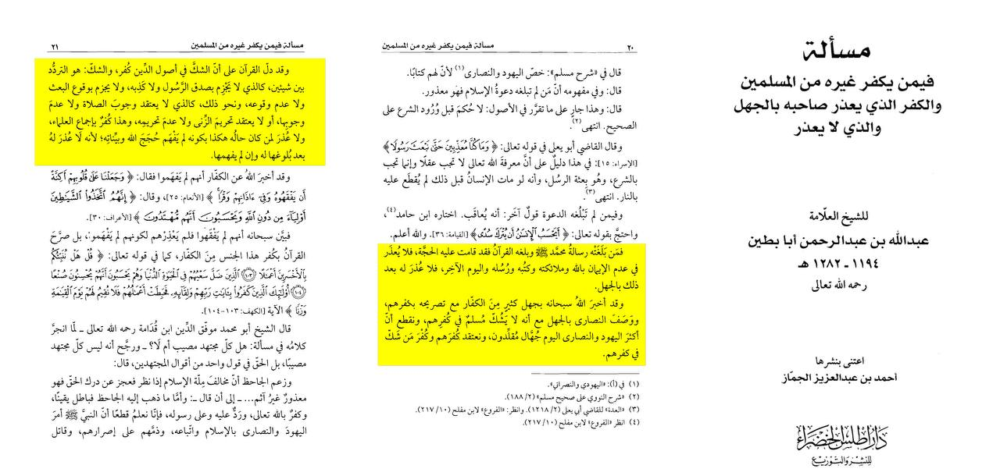

---

<!-- telegram-source: personal/messages.html#message669 -->
<!-- evidence-id: 000151 -->

Shaykh ʿAbdullāh Abā Buṭayn [d. 1282 AH] said:

"What Ibn Taymiyyah mentioned, that whoever does this is a kāfir by the consensus of the Muslims, is exactly what is practiced today at the well-known shrines across most of the lands of Islam. Rather, they have gone far beyond that, adding to it slaughtering and making vows for them, and some have even gone further to the point of prostrating to them on the ground.

So we say: whoever today commits these acts at these shrines is a mushrik, a kāfir, without the slightest doubt, by the proof of the Book, the Sunnah, and the consensus. And we know that those who fall into this, while claiming Islam, were only driven into it by ignorance. Had they known that it distances a person from Allah to the furthest extent, and that it is from the very shirk Allah has forbidden, they would never have dared to approach it.

Yet despite this, all of the scholars declared them disbelievers and did not excuse them with ignorance, contrary to what some of the misguided assert, claiming that such people are excused because they are ignorant. This claim is nothing but speaking about Allah without knowledge."

[Al-Durar al-Saniyyah, vol. 10, p. 404]

Show attached source scan

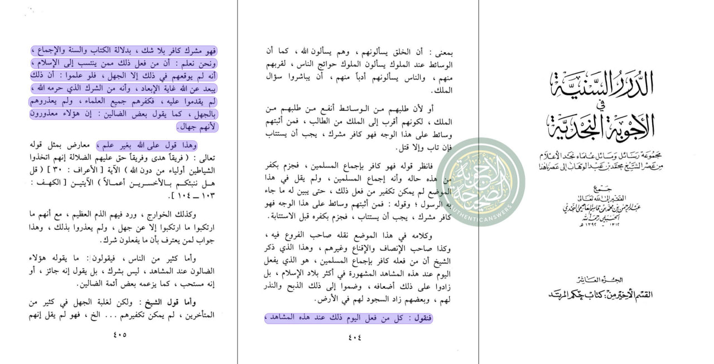

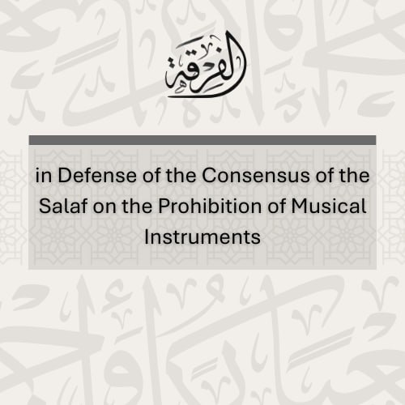

---

<!-- telegram-source: dar/messages4.html#message3728 -->
<!-- evidence-id: 000152 -->

The rebuttle of the doubt of the Murji’ah and their usage of the Burning man Hadith

al-ʿAllāmah Abā Buṭayn said:

Some of those who argue on behalf of the mushrikīn cite the story of the man who instructed his family to burn him after his death, as evidence that whoever commits kufr out of ignorance does not become a disbeliever, and that only the one who is obstinate is deemed a disbeliever.

The reply to all of this is that Allāh, exalted is He, sent His messengers as bringers of glad tidings and warners, so that people would have no argument against Allāh after the messengers. The greatest matter they were sent with and called to was the worship of Allāh alone with no partner, and the prohibition of shirk — which is the worship of other than Him.

So if the one who commits shirk al-akbar is excused due to ignorance, then who is there that would not be excused?

The necessary consequence of this claim is that Allāh would have no argument against anyone except the obstinate one. Yet the very person who makes this claim cannot remain consistent with his own principle, for he must inevitably contradict himself. It is impossible for him to refrain from declaring disbelief upon one who doubts the messengership of Muḥammad ﷺ, or doubts the resurrection, or any of the other fundamentals of the religion — and the doubter is, in fact, ignorant.

The fuqahāʾ — may Allāh have mercy on them — mention in their books of jurisprudence the ruling on the apostate, saying: “The Muslim who disbelieves after his Islām — whether by word, or by action, or by belief, or by doubt.” And the cause of doubt is ignorance.

[Majmūʿ Fatāwā wa-Rasāʾil by Shaykh al-ʿAllāmah Abā Buṭayn p.679]

Show attached source scan

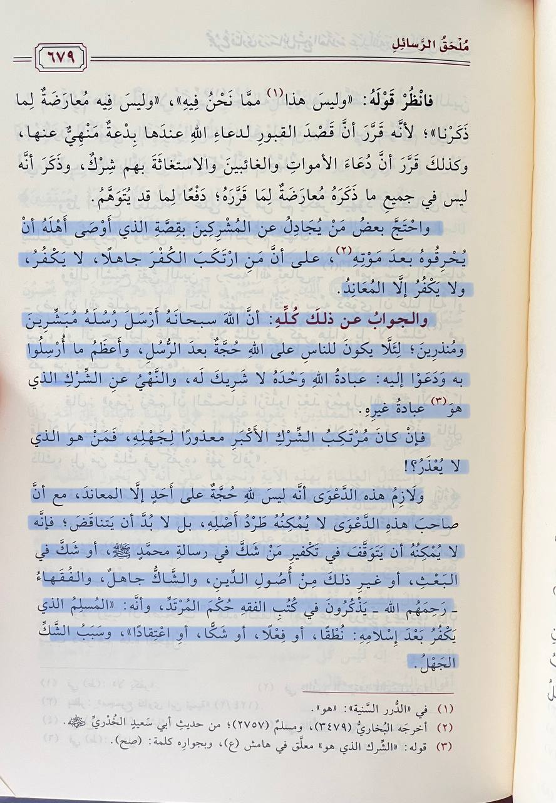

---

<!-- telegram-source: dar/messages2.html#message1598 -->
<!-- evidence-id: 000153 -->

al-‘Allāmah ‘Abdullāh Abā Butayn transmits the ijmāʿ of the ulema and said:

We say: Anyone who does such acts today at these shrines is undoubtedly a polytheist and disbeliever, as evidenced by the Qur'an, Sunnah, and ijmāʿ (consensus). We know that those who do this, while claiming to be Muslim, are driven to such acts by ignorance. If they were aware that these actions bring them far away from Allah and are acts of shirk that Allah has forbidden, they would not have committed them.

All scholars have declared them disbelievers, and they have not excused them due to ignorance, despite what some misguided individuals claim—that these people are excused because they are ignorant...

.. As for many people today, they claim that what these misguided individuals say and do at the shrines is not shirk. Instead, they may say it is permissible or recommended, as some of the misguided scholars assert.

[Ad-Durar as-Saniyyah 10/404-405]

Show attached source scan

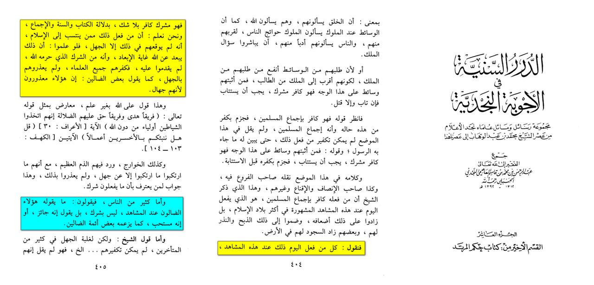

---

<!-- telegram-source: dar/messages2.html#message1898 -->
<!-- evidence-id: 000154 -->

Sheikh ʿAbdullāh Abā Buṭayn said:

And the Prophet ﷺ said: “Whoever dies knowing that there is no deity worthy of worship but Allah will enter Paradise.”

The scholars have used these verses and similar ones to prove that the first obligation upon a person is to know Allah.

These verses indicate that the most important duty is understanding the meaning of “There is no deity but Allah”, and the greatest ignorance is the lack of understanding its meaning. Understanding this is one of the most crucial obligations, and ignorance of it is the most severe and detestable ignorance.

It is astonishing that some people, when they hear someone speak about the meaning of this statement, both in negation and affirmation, criticize it, saying, “We are not required to speak about people and their beliefs!”

To them, it should be said: No, you are required to know the concept of Tawḥīd, for Allah created jinn and humans for this purpose, and sent all the messengers calling to it, as well as to know its opposite, which is shirk that is unforgivable. There is no excuse for a person who is required to know this.

It is not permissible to follow blindly in this matter because it is the foundation of all foundations. Whoever does not recognize what is right and deny what is wrong will be doomed, especially in the case of the greatest right, which is Tawḥīd, and the greatest wrong, which is shirk.

[al-Intiṣār li-Ḥizb Allāh al-Muwaḥḥidīn wa ar-Radd ʿalā al-Mujādal ʿan al-Mushrikīn by Sheikh ʿAbdullāh Abā Buṭayn p.10-11]

Show attached source scan

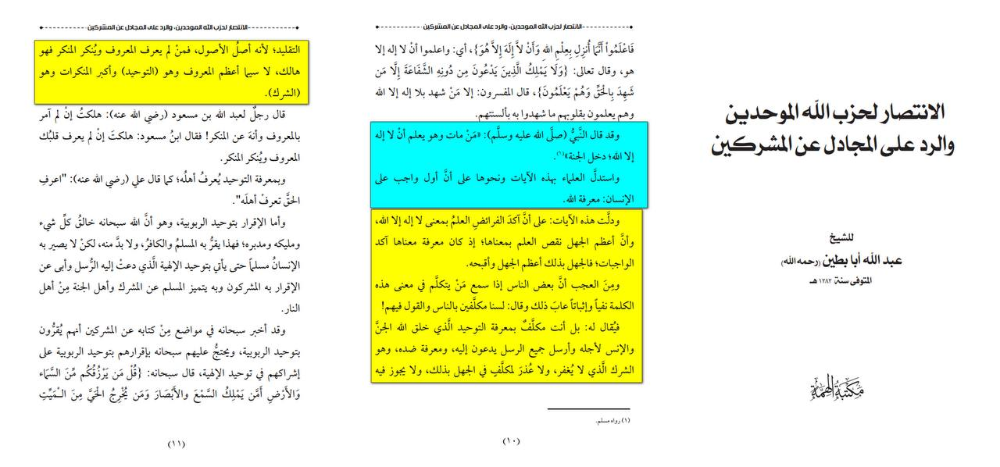

---

### Abā Buṭayn on reaching of the message
<!-- evidence-id: 000155 -->

Show Arabic source text

المصدر: عبد الله أبا بطين، *الدرر السنية في الأجوبة النجدية*، 10/365.

فَمَنْ بَلَغَتْهُ رِسَالَةُ مُحَمَّدٍ صَلَّى اللَّهُ عَلَيْهِ وَسَلَّمَ وَبَلَغَهُ الْقُرْآنُ، فَقَدْ قَامَتْ عَلَيْهِ الْحُجَّةُ، فَلَا يُعْذَرُ فِي عَدَمِ الْإِيمَانِ بِاللَّهِ وَمَلَائِكَتِهِ وَكُتُبِهِ وَرُسُلِهِ وَالْيَوْمِ الْآخِرِ، فَلَا عُذْرَ لَهُ بَعْدَ ذَلِكَ بِالْجَهْلِ.

**English**

“Whoever has been reached by the message of Muḥammad ﷺ and the Qurʾān, the proof has been established against him. He is therefore not excused for failing to believe in Allāh, His angels, His books, His messengers, and the Last Day. After that, ignorance is not an excuse for him.”

Source: ʿAbd Allāh Abā Buṭayn, al-Durar al-Saniyyah, 10/365.

<!-- telegram-source: dar/messages.html#message502 -->
<!-- evidence-id: 000156 -->

Shaykh ʿAbdullāh ʾAbā Buṭayn (رحمه الله) stated:

"The Almighty (Allāh) said: «And when it was said: 'Indeed, the promise of Allāh is true and the Hour [is coming] - no doubt about it,' you said: 'We do not know what is the Hour. We assume only assumption, and we are not convinced.'» [al-Jāthīyah: 32], and Allāh ‎(تعالى) said regarding the Christians: «They have taken their rabbis and monks as lords besides Allāh, and [also] the Messiah, the son of Maryam» [al-Tawbah: 31].

ʿAdī ibn Ḥātim said to the Prophet ‎(ﷺ): 'We did not worship them.'

He said: 'Do they not permit what Allāh has forbidden, so you permitted it? And forbid what Allāh has permitted, so you forbade it?'

He said: 'Yes.'

The Prophet ‌‎(ﷺ) said: 'That is their worship.'

Therefore, Allāh (سبحانه) condemned them and called them Mushrikīn, even though they did not know that their actions that they were doing were acts of worship, so they were not excused for ignorance."

[Ad-Durar as-Sanīyyah, Vol. 10, Pg. 393].

Show attached source scan

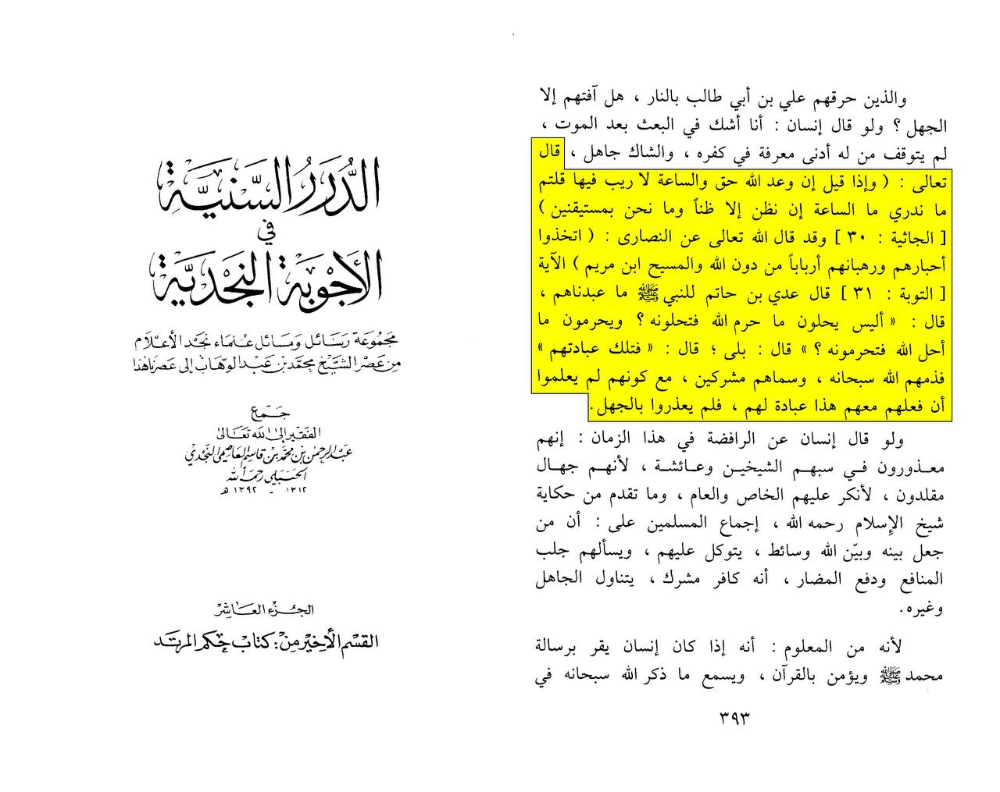

---

<!-- telegram-source: dar/messages3.html#message2755 -->
<!-- evidence-id: 000157 -->

al-‘Allāmah ‘Abdullāh Abā Butayn said:

Moreover, the scholars of every madhhab have mentioned many statements, actions, and beliefs—far too many to count—whose doer is considered a disbeliever, and they did not restrict this ruling to only the muʿānid (the one who stubbornly resists the truth).

So, whoever claims that someone committing an act of kufr while being a muʾawwil, or mujtahid, or muqallid, or jāhil (ignorant), is excused—such a person is undoubtedly opposing the Qur’ān, the Sunnah, and the ijmāʿ. Moreover, this person is forced to contradict his own principle. If he were to apply his principle consistently, he would fall into disbelief without question—for example, if he were to hesitate in declaring someone who doubts the Prophethood of Muḥammad ﷺ a disbeliever, and similar matters.

[al-Intiṣār li-Ḥizb Allāh al-Muwaḥḥidīn wa ar-Radd ʿalā al-Mujādal ʿan al-Mushrikīn p.26]

Show attached source scan

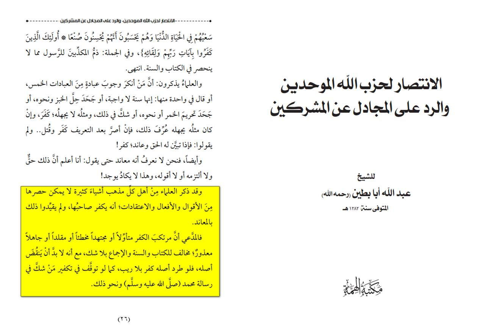

---

<!-- telegram-source: dar/messages3.html#message3063 -->
<!-- evidence-id: 000158 -->

Is the blind follower of shirk excused?

al-ʿAllāmah Abā Buṭayn said:

The Qur’ān refutes the claim that a muqallid (blind follower) in shirk is excused — for such a person has fabricated a lie against Allāh. Allāh said about the followers among the people of Hell:

“Indeed, we obeyed our leaders and elders, and they led us astray from the path.” (al-Aḥzāb: 67) And He, Exalted is He, said, conveying the words of the disbelievers: “Indeed, we found our forefathers upon a religion, and we are rightly guided upon their footsteps.” (az-Zukhruf: 22) And in another verse: “Indeed, we found our forefathers upon a religion, and we are following in their footsteps.” (az-Zukhruf: 23)

The scholars have used these verses and others like them as evidence that taqlīd (blind following) is not permissible in matters of tawḥīd, risālah, and uṣūl ad-dīn (the fundamentals of the religion). It is obligatory upon every mukallaf (legally accountable individual) to know tawḥīd with its proof, as well as risālah and all other fundamentals of the religion — because the evidences for these fundamentals are clear and, all praise is due to Allāh, not exclusive to scholars alone.

[Ad-Durar as-Saniyyah 10/394]

Show attached source scan

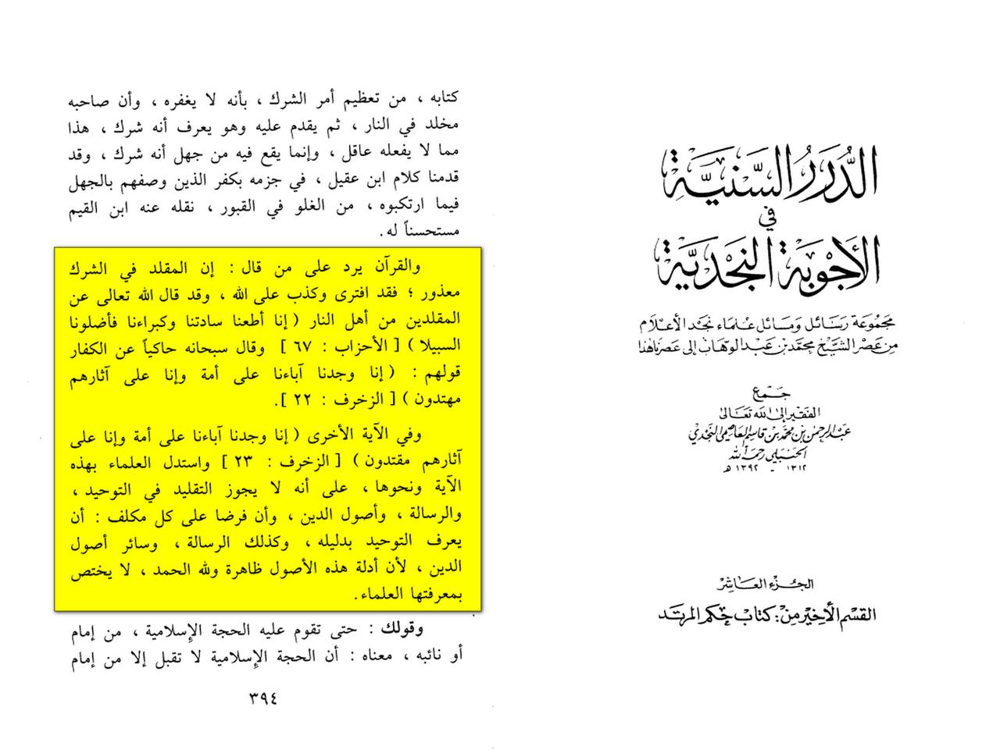

---

<!-- telegram-source: dar/messages3.html#message3033 -->
<!-- evidence-id: 000159 -->

al-ʿAllāmah Abā Buṭayn said:

His statement: “and disbelieves in all that is worshipped besides Allah” — the apparent meaning is that this is an additional clarification, because lā ilāha illa-llāh already includes the rejection of all that is worshipped besides Him.

Whoever says lā ilāha illa-llāh yet still commits al-shirk al-akbar — such as invoking the dead or the absent, asking them to fulfill needs or relieve distress, and seeking closeness to them through vows and sacrifices — then he is a mushrik, whether he likes it or not. Allah does not forgive shirk. Indeed, “Whoever associates partners with Allah, Allah has forbidden Paradise for him, and his abode is the Fire” (al-Māʾidah: 72). And despite this, it remains shirk, and whoever commits it is a kāfir.

However — as the Shaykh said — one should not declare an individual as kāfir until the message brought by the Messenger has been made clear to him. If, after clarification, he persists, then a judgment of disbelief is passed on him, and his blood and wealth become permissible. Allah says: “And fight them until there is no more fitnah” (al-Anfāl: 39) — meaning shirk — “and the religion is entirely for Allah” (al-Anfāl: 39). So if in any land there is an idol that is worshipped besides Allah, then the people are to be fought over that idol — that is, to remove and destroy it, and to abandon shirk — until religion belongs entirely to Allah.

Duʿāʾ is an act of dīn. Allah named it “dīn,” as in His saying: “So when they board a ship, they call upon Allah, making their dīn purely for Him” (al-ʿAnkabūt: 65) — meaning duʿāʾ. And the Prophet ﷺ said: “I was sent with the sword before the Hour so that Allah alone would be worshipped with no partner.” So whenever any act of ʿibādah is directed to other than Allah, the sword is unsheathed against it.

And Allah knows best. May peace and blessings be upon Muḥammad, his family, and his companions.

[Majmūʿ Fatāwā wa-Rasāʾil al-Shaykh al-ʿAllāmah ʿAbd Allāh ibn ʿAbd al-Raḥmān Abā Buṭayn p.507-508]

Show attached source scan

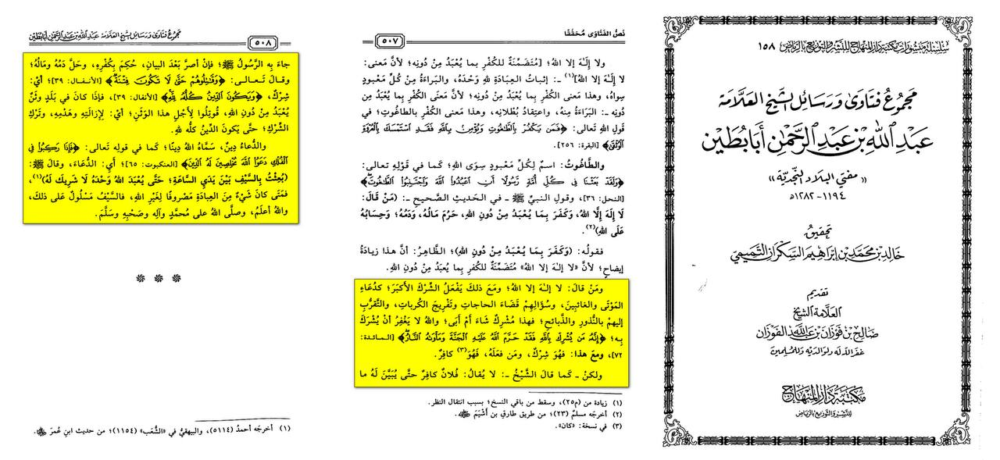

---

<!-- telegram-source: dar/messages3.html#message3080 -->
<!-- evidence-id: 000160 -->

al-ʿAllāmah Abā Buṭayn said:

And those who committed shirk by worshipping idols, or any of the angels, or the devils, or the sun, or the stars, or fire, or anyone other than Allah — whether from the mushrikūn of the Arabs, or the people of India, or Africa, or others — or who claimed that there is a creator or disposer of the universe besides Allah, then all of that is kufr by the ijmāʿ of the Muslims.

So reflect on this transmission of ijmāʿ by the Muslims upon the disbelief of those who worship anyone besides Allah, whether angels or others. This is clear, and all praise is due to Allah. And the verses of the Qur’an on this matter are many. So whoever says that one who has uttered the two shahādahs, and prays and fasts, cannot be declared a disbeliever — even if he worships other than Allah — then he himself is a kāfir. And whoever doubts his kufr [by calling him muslim] is also a kāfir.

[Majmūʿat al-Rasāʾil wa-al-Masāʾil al-Najdiyyah 1/660]

---

<!-- telegram-source: dar/messages4.html#message3684 -->
<!-- evidence-id: 000161 -->

al-ʿAllāmah Abā Buṭayn said:

Allāh — Exalted is He — said: “Indeed, Allāh does not forgive that partners be associated with Him” (Sūrat an-Nisāʾ: 48), and He said: “Then kill the mushrikīn wherever you find them” (Sūrat at-Tawbah: 5). This is general, applying to every individual among the mushrikīn.

All the ʿulamāʾ, in the books of fiqh, mention the ruling on the apostate. The first among the types of kufr and apostasy they list is shirk. They say: Whoever commits shirk with Allāh has disbelieved, and they do not make an exception for the jāhil. Whoever claims that Allāh has a companion or a child has disbelieved, and they do not make an exception for the jāhil. Whoever slanders ʿĀʾishah (may Allāh be pleased with her) has disbelieved, and whoever mocks Allāh, His messengers, or His books has disbelieved by ijmāʿ— as He, Exalted is He, said: “Do not make excuses; you have disbelieved after your belief” (Sūrat at-Tawbah: 66).

They also mention many kinds of acts upon which are agreed upon regarding the disbelief of the one who commits them, and they do not differentiate between the muʿayyan (specific individual) and the general case.

Then they say: Whoever apostasizes from Islām is to be killed after being offered istītābah (a chance to repent). Thus, they ruled him an apostate before even issuing the call to repentance — for istītābah comes after the judgment of apostasy, and istītābah applies only to the specific individual.

[Majmūʿ Fatāwā wa-Rasāʾil by Shaykh al-ʿAllāmah Abā Buṭayn p.599]

Show attached source scan

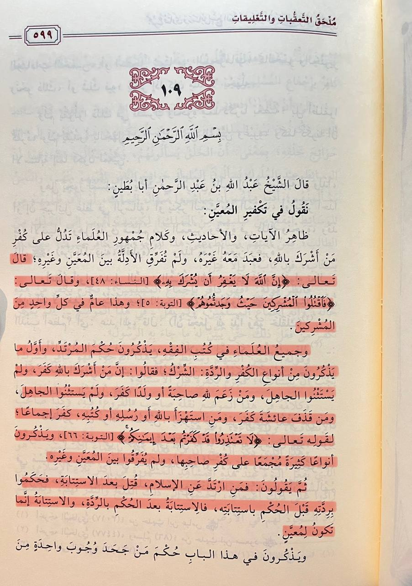

---

<!-- telegram-source: dar/messages4.html#message3889 -->
<!-- evidence-id: 000162 -->

al-‘Allāmah ‘Abdullāh Abā Butayn said:

It is said: The naming of something has no bearing on its reality, and the true nature of a thing does not change merely because its name is altered. As the Prophet ﷺ said: “A time will come when people from my Ummah will call wine by another name.”

Similarly, if someone were to call fornication “marriage,” that would not change its legal ruling or its actual nature. Likewise, a person who engages in usurious transactions remains a Murābī (Usurer), even if he does not explicitly call himself one.  In the same way, whoever commits acts of Shirk is a Mushrik, even if he calls it Tawassul or Tashaffu‘ or any other Misleading term.

What confirms this is that everyone acknowledges that worshipping other than Allāh is shirk. We have already presented the definition of ʿibādah: whoever directs any type of ʿibādah to other than Allāh has committed shirk, even if he does not think it is shirk, does not intend deification, and calls it by whatever name he wishes.

So the mushrik is a mushrik—whether he accepts it or refuses it—just as the murābī (usurer) is a murābī, whether he accepts it or refuses it.

[Ta'sīs al-Taqdīs fī Kashf Talbīs Dāwūd bin Jirjīs wa Yalīhi Daḥḍ Shubuhāt ʿalā al-Tawḥīd by al-ʿAllāmah ʿAbdullāh Abā Buṭayn p.99-100]

Show attached source scan

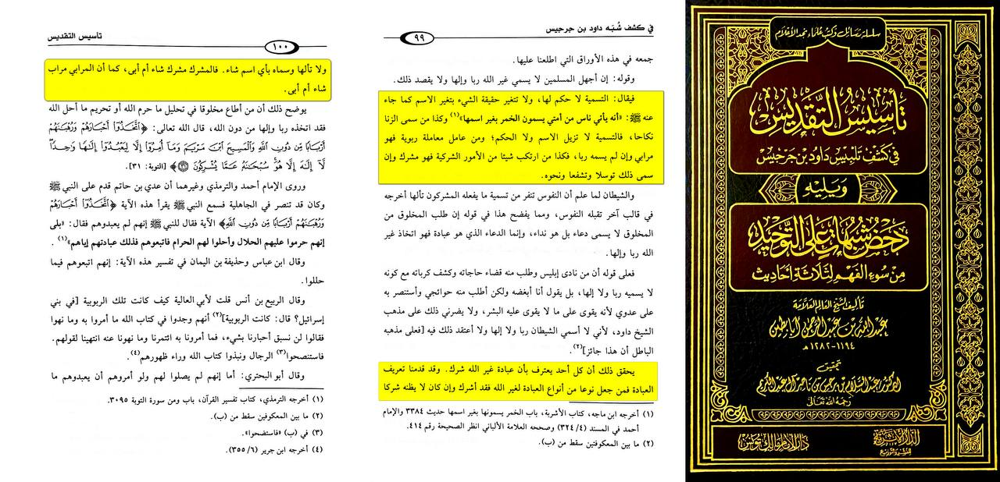

---

<!-- telegram-source: dar/messages3.html#message2422 -->
<!-- evidence-id: 000163 -->

Shaykh Al-Mujaddid ʿAbd Ar-Raḥmān bin Ḥasan said:

Ibn al-Qayyim also said regarding the levels of people from this Ummah and others:

The seventeenth level is that of the blind followers  and the ignorant among the disbelievers and their followers — their donkeys — who merely say, “We found our forefathers upon a religion and we follow in their footsteps.”

He said: The Ummah has unanimously agreed that this category are disbelievers, even though they were ignorant and mere followers of their leaders and imams, except for what is narrated from some innovators who did not judge them to be in the Fire, equating them with those whom the message did not reach. But this is a view not held by any of the Imāms of the Muslims — neither the Ṣaḥābah, nor the Tābiʿūn, nor those after them.

It is authentically reported from the Prophet ﷺ that he said: “Every newborn is born upon the fiṭrah; then his parents make him a Jew, a Christian, or a Magian.” He informed us that it is the parents who shift the child from the fiṭrah to Judaism, Christianity, or Magianism, and he did not consider any other factor beyond the upbringing and education by the parents.

It is also authentically reported from him ﷺ that he said: “No soul will enter Paradise except one that is Muslim.”

This follower is not a Muslim; he is a rational, legally accountable being. A rational accountable person is either a Muslim or a kāfir — there is no third category.

He said: Islam is to affirm the tawḥīd of Allah and worship Him alone with no partner, to believe in His Messenger and follow him in what he came with. Whoever does not bring these essentials is not a Muslim — even if not out of obstinacy — but is a disbeliever out of ignorance.

The utmost one can say about this category is that they are ignorant disbelievers, but their ignorance does not remove them from the ruling of kufr.

The disbeliever is one who rejects the tawḥīd of Allah and belies His Messenger, whether through obstinacy or ignorance or blind following those who are obstinate.

[Al-Adillah wa Al-Barāhīn ʿalā ʿAdam Al-ʿUḏhr bil Jahl fī Uṣūl Ad-Dīn by the Shaykh Al-Mujaddid ʿAbd Ar-Raḥmān bin Ḥasan Āl Ash-Shaykh p.27-28]

Show attached source scan

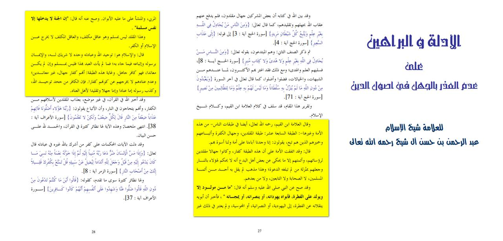

---

<!-- telegram-source: dar/messages3.html#message2391 -->
<!-- evidence-id: 000164 -->

Shaykh ʿAbd ar-Raḥmān Ibn Ḥasan said:

He (Ibn Qayyim) said: “Islam is the monotheism of Allah and worshipping Him alone with no partner, believing in His Messenger, and following what he brought. If a person does not fulfill this, he is not a Muslim. Even if he is not oppositional, he is an ignorant disbeliever. The nature of this category is that they are ignorant disbelievers, not oppositional. Their lack of opposition does not take them out of disbelief. The disbeliever is the one who denies the oneness of Allah and denies His Messenger, either out of opposition or ignorance, or following the traditions of their forefathers out of stubbornness.”

Allah has informed us in the Qur’an, in several places, of the punishment for those who blindly follow their ancestors from the disbelievers. They will dispute in Hell, and the followers will say: “Our Lord, these are the ones who led us astray, so give them double the punishment in the Fire.” Allah will say: “For each there is double, but you do not know.” (Al-A’raf: 38) This is a summarized explanation, and this verse has many similar instances in the Qur’an. Praise be to Allah for the clarity of the explanation.

The clear verses also show the disbelief of those who associate others with Allah in His worship. Allah says: “When man is touched with harm, he calls upon his Lord, turning to Him alone. But when He grants him a favor from Himself, he forgets what he had been calling to Him before, and he makes equals to Allah to mislead others from His way. Say: ‘Enjoy your disbelief for a little while; indeed, you are of the companions of the Fire.’” (Az-Zumar: 8)

[Taḥqīq Madhhab Ibn Taymiyyah fī Masʾalatay al-ʿUdhr bil-Jahl wa Takfīr al-Muʿayyan By Shaykh ʿAbd ar-Raḥmān Ibn Ḥasan Āl ash-Shaykh p.32]

Show attached source scan

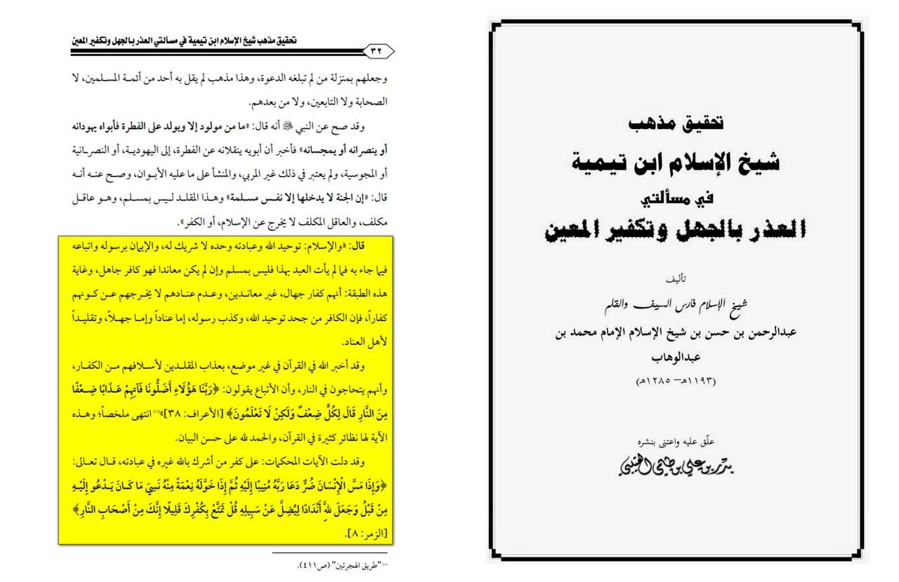

---

<!-- telegram-source: dar/messages3.html#message2418 -->
<!-- evidence-id: 000165 -->

Shaykh Al-Mujaddid ʿAbd Ar-Raḥmān bin Ḥasan said:

For the people of shirk, you have already learned what Allah has said about them, and what this Imam and other scholars have established regarding their being declared disbelievers due to associating partners in divinity and opposing the Shariah. The religion of shirk is a religion of disbelief, as Allah said: {Indeed, those who have believed, and those who were Jews, and the Sabeans, and the Christians, and the Magians, and those who associated partners} (Al-Ḥajj 22:17).

Thus, the people of faith are the people of truth, and all others among the five religions are religions of definite disbelief. Whoever does not recognize and understand this distinction is an ignorant and misguided person:

{And whoever Allah wants to put in trial, never will you possess for him [power to do] a thing against Allah} (Al-Māʾidah 5:41).

Shaykh al-Islām, may Allah have mercy on him, also said in al-Fatāwā al-Miṣriyyah: Some people said that when one ‘achieves essentialization’ (tajawhar), obligations fall from him, and commands and prohibitions are mere regulations for the common folk. They claimed that the essence of prophethood boils down to wisdom and benefit, meant to govern the masses, and that they themselves, having achieved tajawhar, are not subject to religious obligations.

These individuals are more disbelieving than the Jews and Christians. Indeed, the Jews and Christians believed in part and disbelieved in part, whereas these have disbelieved entirely and reject adherence to any portion of the truth. He said: Whoever denies an apparent, well-known obligation, or denies an apparent prohibition like immorality, oppression, intoxicants, fornication, or usury, or denies the permissibility of apparent lawful matters like bread, meat, and marriage — then he is a disbeliever and an apostate who must be asked to repent, and if he does not, he is to be executed.

[Al-Adillah wa Al-Barāhīn ʿalā ʿAdam Al-ʿUḏhr bil Jahl fī Uṣūl Ad-Dīn by the Shaykh Al-Mujaddid ʿAbd Ar-Raḥmān bin Ḥasan Āl Ash-Shaykh p.20]

Show attached source scan

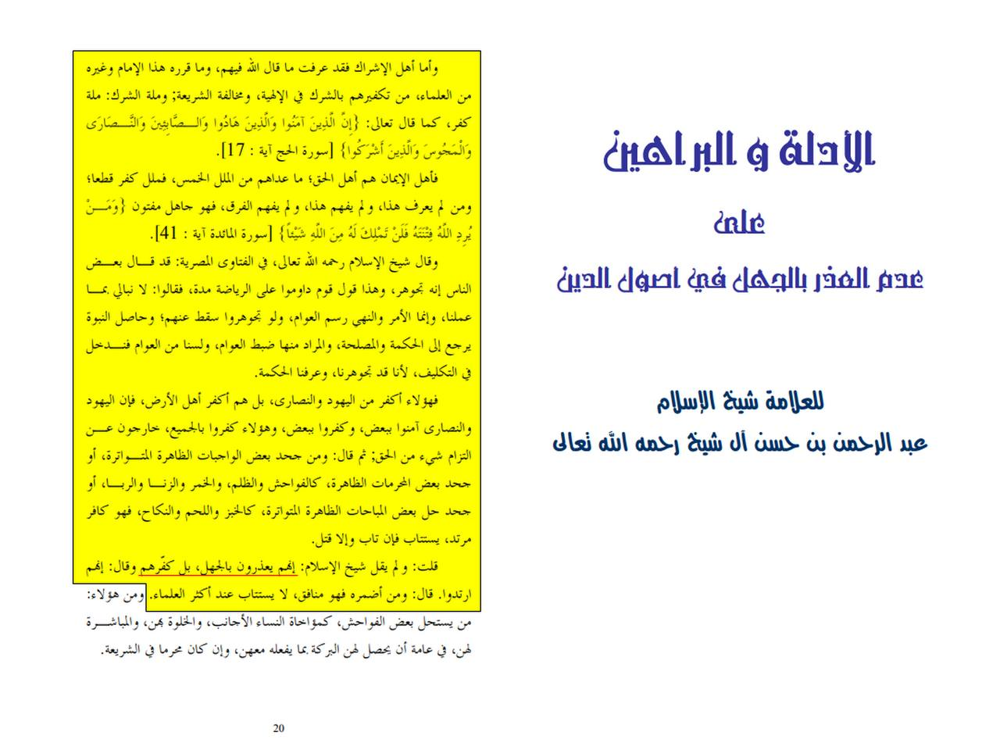

---

<!-- telegram-source: dar/messages3.html#message2458 -->
<!-- evidence-id: 000166 -->

Shaykh ʿAbd Ar-Raḥmān bin Ḥasan said:

So consider—O you whom Allah has granted knowledge of the religion of the messengers, and awareness of what contradicts it from the religion of the polytheists—how the devil has played with most of the ignorant. He stripped them of the light and nobility of knowledge, and made it seem pleasing to them to lose the true meaning of lā ilāha illa Allāh. They became satisfied with its mere wording, without the meaning for which it was revealed: the rejection of shirk with Allah, and the exclusive devotion of all acts of worship to Allah alone.

Through this ignorance and delusion, they fell into the gravest of sins and the most dangerous of prohibitions. They directed the greatest part of their love, and the core essence of worship, to the lords of the graves. Worse still, they went beyond mere shirk, believing those buried had power to manage affairs and the ability to influence events.

[Ad-Durar as-Saniyyah 11/491]

Show attached source scan

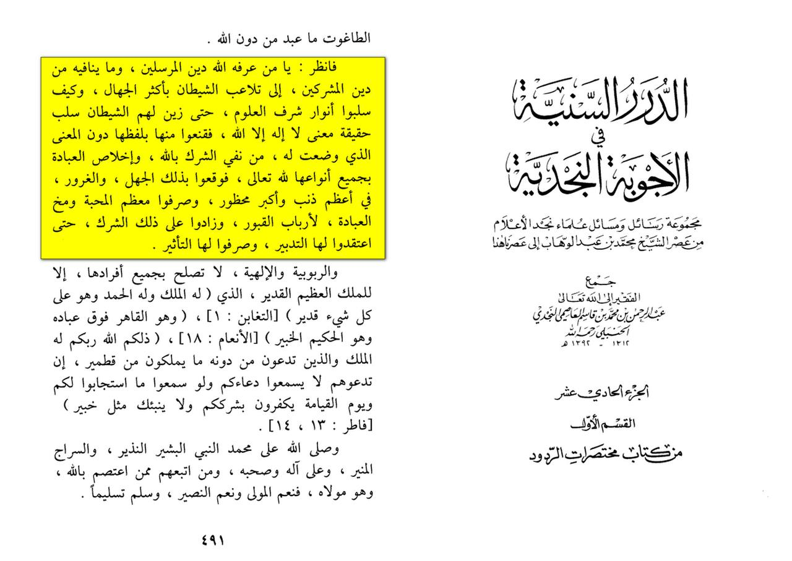

---

<!-- telegram-source: dar/messages5.html#message5023 -->
<!-- evidence-id: 000167 -->

Shaykh Abd ar-Raḥmān ibn Ḥasan Āl ash-Shaykh said:

And neither the scholars of the Salaf nor the Khalaf ever stated that shirk is an area in which ijtihād is permissible, and that its perpetrator is excused because of his ijtihād.

Rather, this is a lie against the Kitāb, the Sunnah, and the ijmāʿ of the scholars of the Ummah.

Rather, all acts of disobedience are such that no one who commits them is excused by claiming that he was a mujtahid, while the threat of punishment from Allah remains upon the one who commits them.

And even if it were assumed that some of them had an interpretation, then everything that opposes the ruling of Allah and His religion is not permissible.

And if that were permissible, then the divine laws and prescribed punishments would be nullified.

And with what Allah has clarified of His religion, which His Messengers called to, from the first of them to the last of them, there remains no excuse for anyone.

[ad-Durar as-Saniyyah 11/548-549]

Show attached source scan

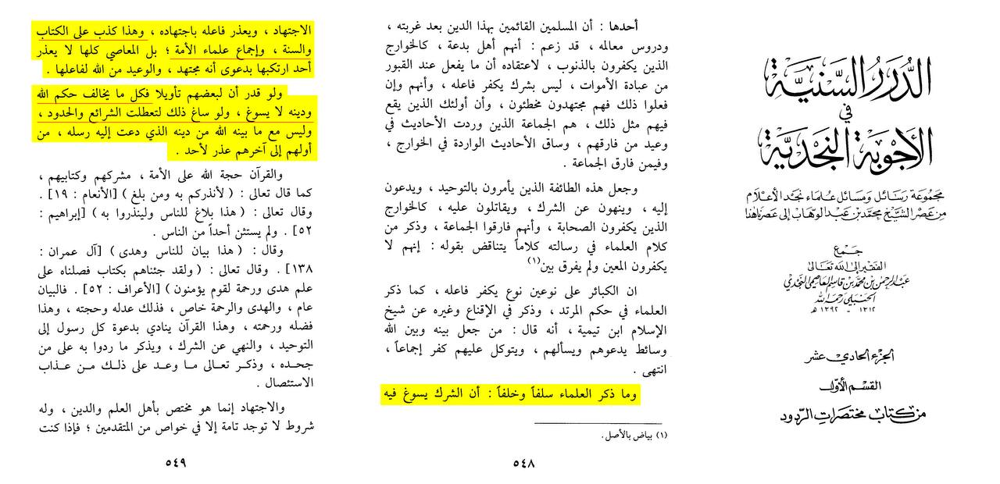

---

<!-- telegram-source: dar/messages3.html#message2426 -->
<!-- evidence-id: 000168 -->

Shaykh ʿAbd Ar-Raḥmān bin Ḥasan said:

They have been content with merely pronouncing the phrase of tawḥīd, believing it to be beneficial even if they do not believe in its meaning or act according to it. But anyone with the slightest sense knows that lā ilāha illa Allāh indicates tawḥīd, and there is no doubt that shirk contradicts tawḥīd, as has been mentioned—that it nullifies deeds, even if the deeds were sound to begin with. So how is it when the foundation of those deeds is disbelief in the meaning of lā ilāha illa Allāh or shirk itself?

If you understand this, then know that the core difference between the messengers and their nations was precisely over the meaning of lā ilāha illa Allāh in its full and direct sense. The phrase lā ilāha denies shirk and divinity from anything besides Allah. The phrase illa Allāh affirms divinity with all its inward and outward implications for Allah alone. This is made clear repeatedly in the Qur’ān.

[Ad-Durar as-Saniyyah 11/487-488]

Show attached source scan

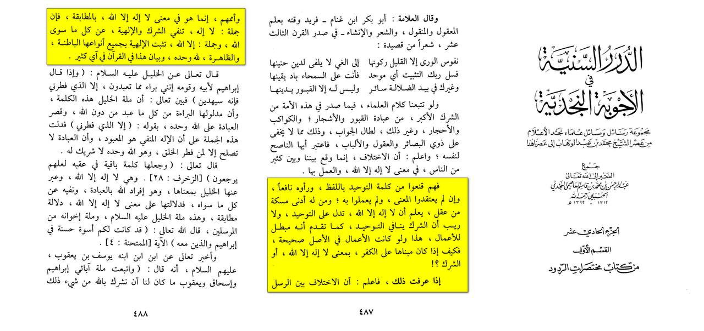

---

<!-- telegram-source: dar/messages.html#message940 -->
<!-- evidence-id: 000169 -->

Shaykh ʿAbdur-Raḥmān ibn Ḥasan an-Najdī (رحمه الله) said:

"Indeed, whoever commits ash-Shirk, then he has left at-Tawḥīd, for they are two opposites that do not combine; so in that moment in which ash-Shirk is established, at-Tawḥīd vanishes."

[Ad-Durar as-Sanīyyah, Vol. 2, Pg. 204].

Since the Shaykh makes it clear that Tawḥīd and Shirk can’t coexist in the same heart and can’t stay together and he says the moment Shirk is committed there is no Tawḥīd, how can someone without Tawḥīd be a Muslim?

Show attached source scan

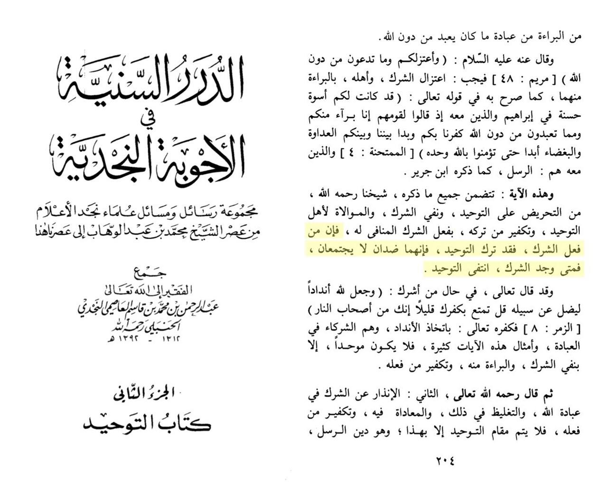

---

<!-- telegram-source: dar/messages2.html#message1989 -->
<!-- evidence-id: 000170 -->

Sheikh ʿAbd al-Laṭīf said:

His statement: “By testifying that there is no god but Allah.”

This applies to a person whose disbelief was due to their refusal to say it. If, in their state of kufr, they did not acknowledge this statement, then upon saying it, they become Muslim, and their Islam is recognized. However, as for a person who says it while being an apostate , or a Jew  who says it, they both remain in their original state.

An example of this is those who say “Lā ilāha illa Allāh” yet engage in actions that nullify it—such as those who worship al-Badawī or al-Jīlānī, or those who venerate the graves of the Prophet’s family and similar sites among the Rāfiḍah. The one who asks them to fulfill needs or seeks their help in times of distress has nullified “Lā ilāha illa Allāh.” His tongue says it, but his actions and words affirm that he acknowledges another deity alongside Allāh.

It is not required that he explicitly call it a deity using that exact wording and meaning together. If he perceives it as merely an intermediary, the mushrikūn also called their objects of worship, intermediary . In their terminology, the one to whom such requests are directed is the god, whether the request is directed at the entity itself or through its mediation.

The Prophet came with the statement of tawḥīd that invalidates all of this.

This clarifies the reality of those who claim to belong to Islam. It is common among the youth today that some never pray at all, yet they believe themselves to be Muslim.

Q: What if they are ignorant?

A: “There is no ignorance in tawḥīd. This is not something that can be unknown. Rather, this is someone who has turned away from religion. Can a person be ignorant of the sun? Their scholars are ignorant, and none are more ignorant than the mushrik. In the Qurʾān, jahl is only attributed to those who worship other than Allāh. They are ignorant, yet the ḥujjah (proof) against them is complete.

Thus, two things coexist: knowledge to the extent that the ḥujjah has been established against them, and ignorance to the extent that they have turned away from it.”

A debate once took place between him and the Shaykh al-Azhar, who eventually said: “These people have taken on the appearance of kuffār.” So he replied: “Then should we not take on the appearance of those who declare them mukaffirīn ?”

[Fatāwā wa Rasāʾil by Sheikh ʿAbd al-Laṭīf 12/197-198]

Show attached source scan

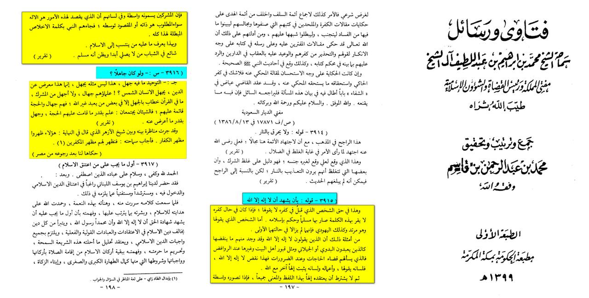

---

### ʿAbd al-Laṭīf Āl ash-Shaykh: neither category is ruled Muslim
<!-- evidence-id: 000171 -->

Show Arabic source text

المصدر: عبد اللطيف بن عبد الرحمن آل الشيخ، <em>منهاج التأسيس والتقديس في كشف شبهات داود بن جرجيس</em>، ص. 99.

وَالشَّيْخُ مُحَمَّدٌ رَحِمَهُ اللَّهُ مِنْ أَعْظَمِ النَّاسِ تَوَقُّفًا وَإِحْجَامًا عَنْ إِطْلَاقِ الْكُفْرِ، حَتَّى إِنَّهُ لَمْ يَجْزِمْ بِتَكْفِيرِ الْجَاهِلِ الَّذِي يَدْعُو غَيْرَ اللَّهِ مِنْ أَهْلِ الْقُبُورِ أَوْ غَيْرِهِمْ إِذَا لَمْ يَتَيَسَّرْ لَهُ مَنْ يَنْصَحُهُ وَيُبَلِّغُهُ الْحُجَّةَ الَّتِي يَكْفُرُ تَارِكُهَا.

قَالَ فِي بَعْضِ رَسَائِلِهِ: وَإِذَا كُنَّا لَا نُقَاتِلُ مَنْ يَعْبُدُ قُبَّةَ الْكَوَّازِ حَتَّى نَتَقَدَّمَ بِدَعْوَتِهِ إِلَى إِخْلَاصِ الدِّينِ لِلَّهِ، فَكَيْفَ نُكَفِّرُ مَنْ لَمْ يُهَاجِرْ إِلَيْنَا وَإِنْ كَانَ مُؤْمِنًا مُوَحِّدًا؟ وَقَالَ: وَقَدْ سُئِلَ عَنْ مِثْلِ هَؤُلَاءِ الْجُهَّالِ، فَقَرَّرَ أَنَّ مَنْ قَامَتْ عَلَيْهِ الْحُجَّةُ وَتَأَهَّلَ لِمَعْرِفَتِهَا يَكْفُرُ بِعِبَادَةِ الْقُبُورِ.

وَقَدْ سَبَقَ مِنْ كَلَامِهِ مَا فِيهِ الْكِفَايَةُ، مَعَ أَنَّ الْعَلَّامَةَ ابْنَ الْقَيِّمِ رَحِمَهُ اللَّهُ جَزَمَ بِكُفْرِ الْمُقَلِّدِينَ لِشُيُوخِهِمْ فِي الْمَسَائِلِ الْمُكَفِّرَةِ إِذَا تَمَكَّنُوا مِنْ طَلَبِ الْحَقِّ وَمَعْرِفَتِهِ وَتَأَهَّلُوا لِذَلِكَ، فَأَعْرَضُوا وَلَمْ يَلْتَفِتُوا. وَمَنْ لَمْ يَتَمَكَّنْ وَلَمْ يَتَأَهَّلْ لِمَعْرِفَةِ مَا جَاءَتْ بِهِ الرُّسُلُ فَهُوَ عِنْدَهُ مِنْ جِنْسِ أَهْلِ الْفَتْرَةِ مِمَّنْ لَمْ تَبْلُغْهُ دَعْوَةُ رَسُولٍ مِنَ الرُّسُلِ.

وَكِلَا النَّوْعَيْنِ لَا يُحْكَمُ بِإِسْلَامِهِمْ وَلَا يَدْخُلُونَ فِي مُسَمَّى الْمُسْلِمِينَ، حَتَّى عِنْدَ مَنْ لَمْ يُكَفِّرْ بَعْضَهُمْ، وَسَيَأْتِيكَ كَلَامُهُ. وَأَمَّا الشِّرْكُ فَهُوَ يَصْدُقُ عَلَيْهِمْ، وَاسْمُهُ يَتَنَاوَلُهُمْ، وَأَيُّ إِسْلَامٍ يَبْقَى مَعَ مُنَاقَضَةِ أَصْلِهِ وَقَاعِدَتِهِ الْكُبْرَى: شَهَادَةِ أَنْ لَا إِلَهَ إِلَّا اللَّهُ؟

**English**

“Shaykh Muḥammad, may Allāh have mercy upon him, was among the people most restrained and hesitant concerning an unrestricted declaration of disbelief. He did not definitively declare disbeliever the ignorant person who calls upon other than Allāh among the occupants of graves or others when no one was available to advise him and convey to him the proof whose rejection entails disbelief.

He said in one of his letters: ‘If we do not fight one who worships the dome of al-Kawwāz until we first call him to make the religion sincerely for Allāh, how could we declare disbeliever one who did not emigrate to us while he is a believing muwaḥḥid?’ He was asked about ignorant people of this kind and explained that one against whom the proof has been established and who is capable of understanding it is declared disbeliever for worshipping graves.

Enough of his words on this has preceded. Ibn al-Qayyim, may Allāh have mercy upon him, decisively declared disbelievers those who blindly follow their shaykhs in matters that entail disbelief when they were able and qualified to seek and recognize the truth but turned away and paid no attention. The one unable and unqualified to recognize what the Messengers brought is, according to him, of the category of Ahl al-Fatrah to whom the call of a Messenger did not reach.

Neither category is ruled to be Muslim, nor do they enter under the designation of Muslims, even according to those who do not declare some of them disbelievers. As for shirk, its description applies to them and its name encompasses them. What Islam remains alongside the contradiction of its foundation and greatest principle, the testimony that none is worthy of worship except Allāh?”

Source: ʿAbd al-Laṭīf ibn ʿAbd al-Raḥmān Āl ash-Shaykh, *Minhāj al-Taʾsīs wa al-Taqdīs fī Kashf Shubuhāt Dāwūd ibn Jirjīs*, p. 99.

<!-- telegram-source: personal/messages.html#message626 -->
<!-- evidence-id: 000172 -->

Shaykẖ ʿAbd Al-Laṭīf said:

Even he did not decisively declare takfīr for the jāhil who invokes others besides Allah—whether from the awlīyā’ of the graves or others—if no one is available to advise him and deliver the proof that, if rejected, would make one a kāfir. He said in some of his rasā’il:

“And if we do not fight those who worship the dome of the kāwiz, until we advance the invitation to purity of religion from Allah, then how could we declare kāfir one who has not migrated to us, even if he is a believer and muwaḥḥid?”

And he was asked about such ignorant people. He clarified that whoever has received the ḥujjah and is capable of understanding it becomes kāfir by worship of graves. Previously, he had spoken sufficiently on this matter.

Meanwhile, ʿAllāmah Ibn al-Qayyim decisively declared the kāfir status of muqallidīn (blind followers) of their shuyūkh in matters that entail takfīr, if they were capable of seeking the truth and understanding it, and yet neglected it.

For those who are unable or unprepared to understand what the messengers brought, they are considered like the ahl al-fatrah who were not reached by the da‘wah of any messenger. Both types are not judged as Muslim nor included in the category of Muslims, even according to those who do not declare some of them kāfir, as will be explained later.

As for shirk, it applies to them, and its name encompasses them. And what Islam remains with someone who contradicts its very origin? Its greatest principle is the shahādah that there is no god but Allah, and the persistence of Islam and its name, along with some of what the fuqahā’ mentioned regarding the ruling on the murtad, is clearer than its persistence among righteous servants and their du‘ā’.

But al-Iraqī (Dāwūd ibn Jirjīs) avoids calling this worship or du‘ā’, claiming it is tawassul and nida’ (calling), and he considers it recommended. Far, far is he from the truth!!

Where is the escape, and the God to be sought… yet one is trapped between hardship and desire.

All of this is by the grace of Allah, through His Book al-‘Azīz in which falsehood cannot approach from before it or behind it—tanzīl (revelation) from a Wise, Praiseworthy One. And by what Muhammad ibn ʿAbdullah brought as wisdom, guidance, and clarification, to the extent Allah revealed to him.

And Allah continues to plant in this dīn a seed whose proof is established among His servants, who strive in clarifying His dīn and sharī‘ah, while those who deviate in His Book and dīn, and turn it from its intended purpose, are left astray.

[Minhāj at-Taʾsīs wat-Taqdīs fī Kashf Shubuhāt Dāwūd Ibn Jirjīs by Shaykẖ ʿAbd Al-Laṭīf p.99]

Show attached source scan

---

<!-- telegram-source: personal/messages.html#message602 -->
<!-- evidence-id: 000173 -->

Shaykh ʿAbdul-Laṭīf ibn ʿAbdur-Raḥmān an-Najdī (رحمه الله تعالى) said:

‎”These two Shaykhs (i.e. Ibn Taymīyyah رحمه الله and Ibn al-Qayyim رحمه الله) declare that whoever does an action which is Kufr or apostasy, he is to be ruled with accordingly, and in accordance to whatever he did from Kufr, Shirk or Fisq, unless there happens to be a preventative factor preventing one from declaring such ruling. This is only applicable to certain cases and does not apply to the one who worships an idol, a grave, a man, or a city, because the proofs have already become manifest due to the proofs established by the messengers.”

[Fatāwa al-Āʿimmah an-Najdīyyah, 3/300]

Show attached source scan

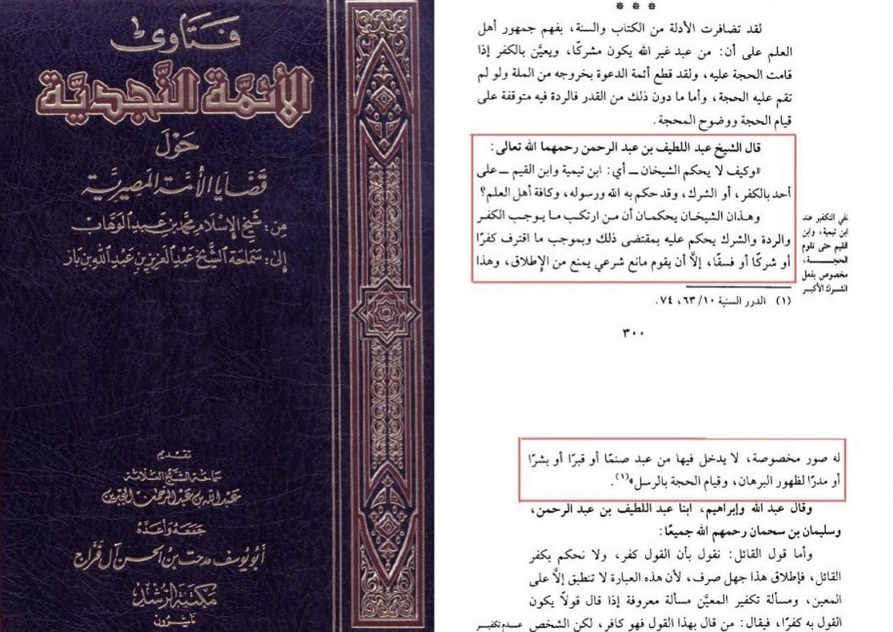

---

<!-- telegram-source: personal/messages.html#message598 -->
<!-- evidence-id: 000174 -->

Shaykh ʿAbd al-Laṭīf Āl ash-Shaykh mentions:

He (Shaykh Muḥammad Ibn ʿAbd al-Wahhāb) said: the category of these mushrikūn and those like them—those who worship the awliyāʾ and the righteous—we judge that they are mushrikūn, and we affirm their disbelief when the prophetic proof has been established upon them (meaning they are judged as disbelievers inwardly after the proof is established).

As for what is besides that from sins which are lower in rank and corruption, we do not make takfīr because of them, nor do we judge anyone from Ahl al-qiblah—those who have distinguished themselves from the worshippers of statues, idols, and graves — to be kāfir merely for a sin they committed or a grave offense they carried out.

And the extreme groups of the Jahmiyyah, the Qadariyyah, the Rāfiḍah, and others whom the Salaf declared kuffār—we do not go beyond the statements of the imāms of guidance and fatwā from the Salaf of this Ummah regarding them. And we declare ourselves free to Allah from what the Khawārij brought and said concerning the people of sins from the Muslims.

[Minhāj at-Taʾsīs wa at-Taqdīs fī Kashf Shubuhāt Dāwūd ibn Jirjis by Shaykh ʿAbd al-Laṭīf Āl ash-Shaykh p.166]

Show attached source scan

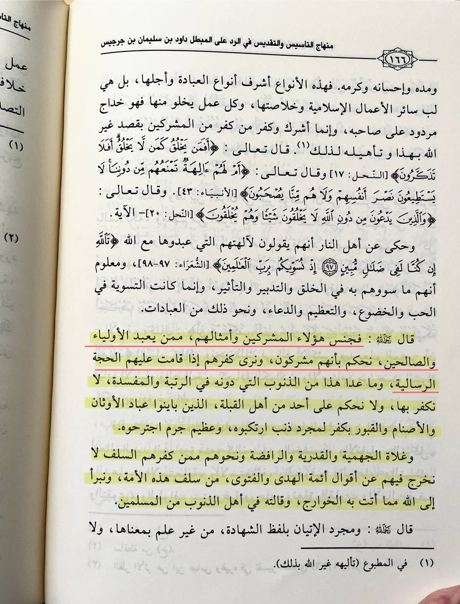

---

<!-- telegram-source: personal/messages.html#message576 -->
<!-- evidence-id: 000175 -->

Shaykh ʿAbd al-Laṭīf Āl ash-Shaykh said:

And despite that, al-ʿAllāmah Ibn al-Qayyim firmly stated the kufr of those who blindly imitate their shaykhs in matters that constitute kufr, if they were able to seek the truth and know it, and were qualified for that — yet they turned away and paid no attention. As for the one who was not able and not qualified to know what the Messengers brought, then according to him he is from the category of Ahl al-Fatrah — those to whom the call of a Messenger did not reach.

And both types are not judged to be Muslims, nor do they enter into the Label of “Muslims,” even according to those who did not declare some of them to be kuffār — and his statement regarding that will come to you. As for shirk, it applies to them, and its name includes them. And what Islām remains alongside contradicting its very foundation?

[Minhāj at-Taʾsīs wa at-Taqdīs fī Kashf Shubuhāt Dāwūd ibn Jirjis by Shaykh ʿAbd al-Laṭīf Āl ash-Shaykh p.99]

Show attached source scan

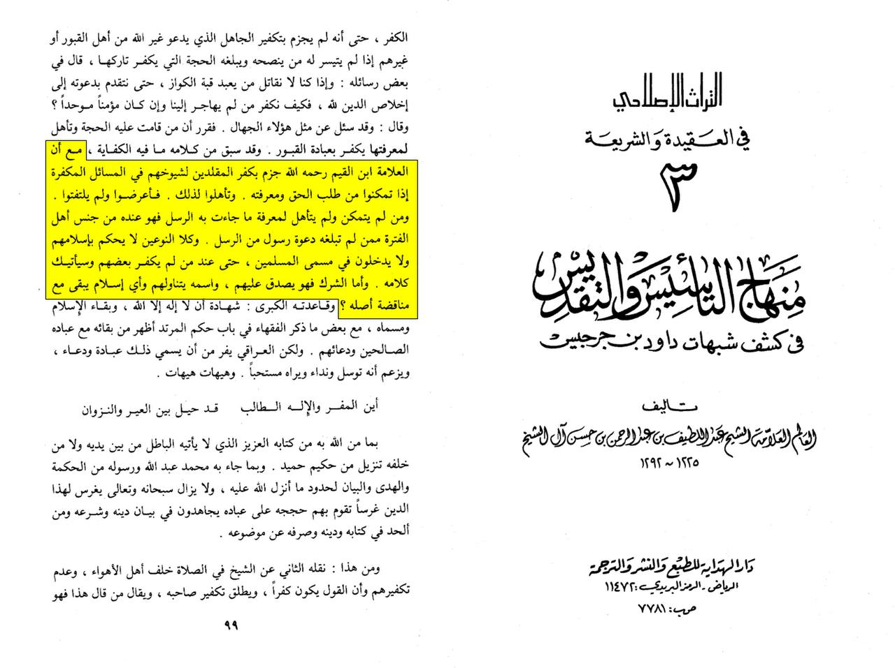

---

<!-- telegram-source: dar/messages4.html#message3750 -->
<!-- evidence-id: 000176 -->

Shaykh Isḥāq Āl al-Shaykh said:

And this matter of ours — worshipping Allāh alone without any partner, disavowing the worship of anything besides Him, and holding that whoever worships along with Allāh another has committed shirk al-akbar that takes one out of the religion — is the foundation of all foundations. It is for this that Allāh sent the messengers, revealed the scriptures, and established the proof against mankind through the Messenger and the Qur’ān.

Thus, you will find the response of the a’immah ad-dīn (imāms of the religion) regarding this principle — when declaring as kāfir one who associates partners with Allāh — that he is to be asked to repent; if he repents, then fine, and if not, he is to be killed. They did not mention the need for definition in issues of the fundamental principles. Rather, they only mentioned defintion in subtle matters whose evidences may be hidden from some Muslims — such as issues disputed by certain innovators like the Qadariyyah and Murji’ah, or in obscure matters such as certain linguistic forms of disbelief.

So how could they claim that the worshippers of graves are Muslims and enter under the name of Islam? Can any deed remain alongside shirk? Allāh the Exalted says: “They will not enter Paradise until a camel passes through the eye of a needle.” (Sūrat al-Aʿrāf:40)

And He says: “Whoever associates partners with Allāh, it is as though he had fallen from the sky, and the birds snatch him away, or the wind blows him into a distant place.” (Sūrat al-Ḥajj:31) And: “Indeed, Allāh does not forgive that partners be associated with Him, but He forgives what is less than that for whom He wills.” (Sūrat an-Nisāʾ:48) And: “Whoever associates partners with Allāh, his deeds have become worthless.” (Sūrat al-Mā’idah:72) — and many other āyāt.

But this corrupt belief — that the proof has not been established upon this ummah through the Messenger and the Qur’ān — leads to an ugly consequence. We seek refuge in Allāh from the evil understanding that caused them to neglect the Book and the Messenger.

As for the ahl al-fatrah — those whom the message and the Qur’ān did not reach and who died in jāhiliyyah — they are, by ijmāʿ, not called Muslims, nor is forgiveness sought for them. The scholars only differed regarding whether or not they will be punished in the Hereafter.

[Takfīr al-Muʿayyan by Shaykh Isḥāq Āl al-Shaykh p. 9]

Show attached source scan

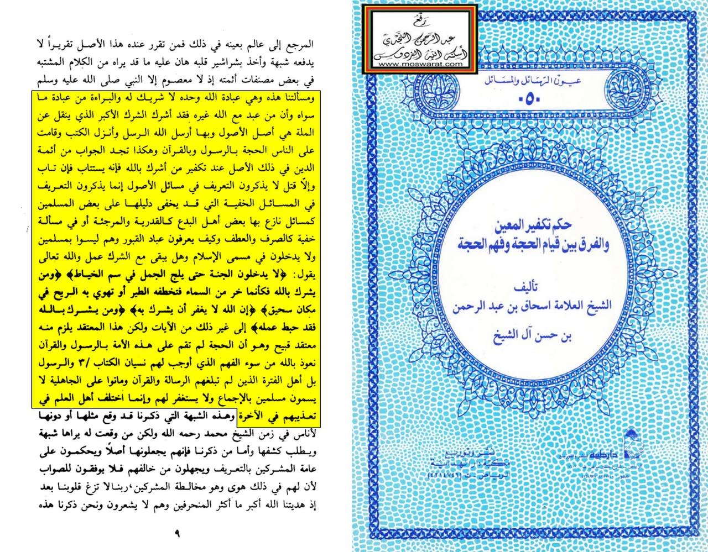

---

<!-- telegram-source: dar/messages4.html#message4107 -->
<!-- evidence-id: 000177 -->

al-Qāsimī said regarding the interpretation of His—the Most High—statement (Sūrat al-Rūm 30:56–57):

“And those who were given knowledge and īmān said: ‘Indeed you remained, in the Book of Allāh, until the Day of Resurrection; so this is the Day of Resurrection—yet you used not to know. So that Day, their excuse will not benefit those who wronged, nor will they be asked to appease.”

“And those who were given knowledge and īmān said this as a refutation of what they had sworn to, and as an informing them of the reality: ‘Indeed you remained, in the Book of Allāh—that is, in what Allāh wrote and obligated by His wisdom—until the Day of Resurrection. So this is the Day of Resurrection, but you used not to know,’ meaning: you did not know that it is true, due to your negligence in seeking the truth and following it.

“So on that Day, those who did wrong will not have their excuse benefit them—meaning: through shirk, or denial of rubūbiyyah, or the message, or anything whose belief is obligatory— their excuse meaning: that they disbelieved out of ignorance; because it was only out of their negligence in removing that ignorance, or out of obstinacy.

[Tafsīr al-Qāsimī Maḥāsin al-Taʾwīl 8/22-23]

Show attached source scan

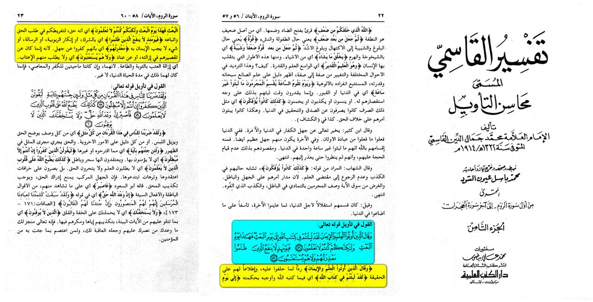

---

<!-- telegram-source: dar/messages5.html#message4522 -->
<!-- evidence-id: 000178 -->

Shaykh Sulaymān ibn Saḥmān said:

And these fools generalized the issue and made every ignorance an excuse, and they did not differentiate, and they equated the clear and manifest matters and that which is known from the religion by necessity with the hidden matters whose evidence may be hidden from some people. Likewise, whoever is among the more apparent Muslims—such as someone who grew up in a remote desert or is newly entered into Islām—he may go astray and mislead others and deviate from the straight path.

If you know this, then the issue of Allāh’s ʿuluww over His creation, His istiwā over His Throne, and affirming the attributes of His perfection and the qualities of His majesty are from the clear and manifest matters and from what is known from the religion by necessity. For Allāh has clarified them in His Book and upon the tongue of His Messenger. Whoever hears the Qurʾānic verses and the Prophetic ḥadīths, the proof has been established upon him, even if he does not understand them. If he is one who recites the Qurʾān, the matter is greater and more serious—especially if he is obstinate and claims that what he is upon is the truth, and that the Qurʾān did not clarify this with sufficient and complete explanation—then his disbelief is clearer than the sun at noon.

The one who knows Islām, its rulings, and its principles does not hesitate regarding his disbelief. In summary, whoever follows a religion other than Islām and this description that makes him a disbeliever applies to him, he is a disbeliever. But we do not judge a specific individual to be in the Fire; rather, we leave his affair to Allāh and to His knowledge and judgment regarding the inward reality of his matter. This concerns the rulings of reward and punishment. As for worldly rulings, they proceed according to what is apparent.

If you know and verify this, you understand that this man is disguised in his denial of disbelief upon those who established it, describing kufr. And yet, the daʿwah reached them, the proof was established upon them, but none of the barriers that prevent the establishment of proof took effect. His intent was to criticize the brothers regarding what they did and said about declaring the Jahmīs, the grave worshippers, and the Ibāḍīs of this time. He obliges them with the consequences that do not apply to them, while they absolve themselves to Allāh from saying them.

[Kashf al-Awhām by Shaykh Sulaymān ibn Saḥmān p.117-118]

Show attached source scan

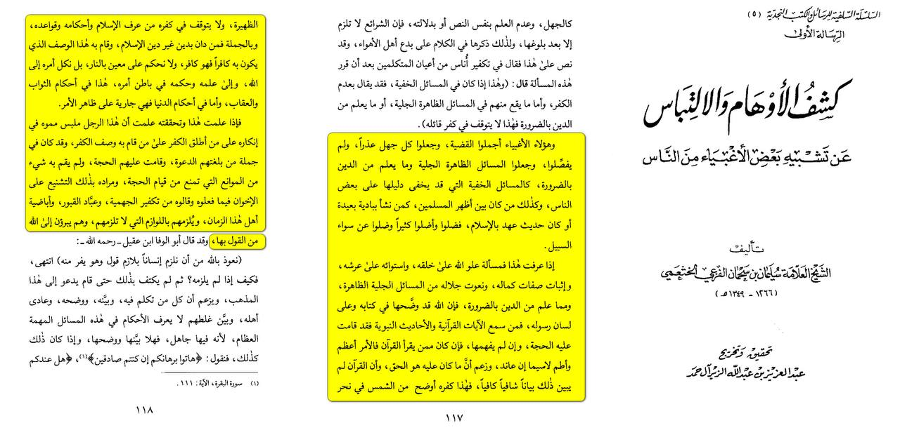

---

<!-- telegram-source: dar/messages4.html#message4143 -->
<!-- evidence-id: 000179 -->

Shaykh Sulaymān ibn Saḥmān said:

And I presented this introduction to you so that you understand that many of the religious people in this time do not know the kufr that expels from the millah and the kufr that does not expel from the millah, especially those who claim knowledge and awareness among them who go out to the desert, calling people to Allāh while not knowing the details clarified by the ‘ulamāʾ regarding masāʾil al-takfīr (issues of takfīr), what expels from the millah and what does not expel from the millah.

Similarly, the issue of hijrah and its rulings, and matters of hijrah and what results from it in terms of benefits and harms. They try to support their statements with the words of some scholars regarding takfīr in matters that are clear, which no one can be ignorant of, and they are not excused thereby—for example, the command to worship Allāh alone without partner, and to abandon the worship of anything besides Him, which is necessarily known from the dīn (of Islām brought by the Messenger ﷺ .

Yet they attempt to use these to support some hidden matters whose evidences in the Kitāb and Sunnah may be hidden to many of the creation, relying solely on their assumption and limited understanding.

These hidden matters do not make someone a kāfir if they act upon or say them—according to the correct opinion of the ‘ulamāʾ—until the prophetic proof is established against them.

[Minhāj Ahl al-Ḥaqq wal-Ittibāʿ fī Mukhālafat Ahl al-Jahl wal-Ibtidāʿ by Shaykh Sulaymān ibn Saḥmān p.10]

Show attached source scan

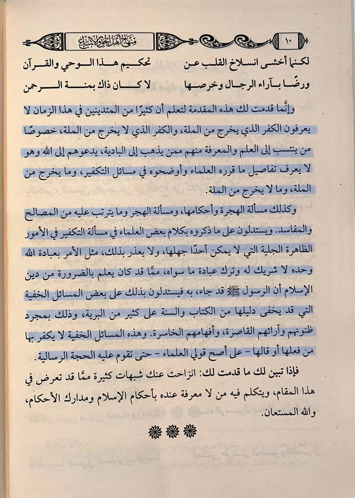

---

<!-- telegram-source: dar/messages4.html#message3667 -->
<!-- evidence-id: 000180 -->

Shaykh Muḥammad ibn ʿAbd al-Laṭīf and Shaykh Sulaymān ibn Suḥmān said:

And when it is established that duʿāʾ is ʿibādah (worship), then directing it to other than Allāh is shirk. So whoever calls upon along with Allāh anyone from the creation has committed shirk with Him—whether he wills it or refuses. Like if he says: “O Messenger of Allāh,” “O Kaʿbah of Allāh,” “O Station of Ibrāhīm,” or if he supplicates to one of the prophets, or the awliyāʾ, or the righteous—then he is a mushrik with shirk akbar that expels from the religion.

Allāh, said: “Indeed, Allāh does not forgive that partners be associated with Him, but He forgives what is less than that for whom He wills.” [Sūrat al-Nisāʾ, 4:48] And He, taʿālā, said: “Indeed, whoever associates partners with Allāh—Allāh has forbidden him Paradise, and his abode is the Fire, and for the wrongdoers there are no helpers.” [Sūrat al-Māʾidah, 5:72] And He, taʿālā, said: “And do not call upon, besides Allāh, that which neither benefits you nor harms you. For if you do so, then indeed you will be of the wrongdoers.” [Sūrat Yūnus, 10:106] And He, taʿālā, said: “And who is more astray than one who calls upon, besides Allāh, those who will not respond to him until the Day of Resurrection, and they of their supplication are unaware. And when mankind are gathered, they will be enemies to them, and they will be disbelievers in their worship.” [Sūrat al-Aḥqāf, 46:5–6] And He said: “And the masājid are for Allāh, so do not call upon anyone along with Allāh.” [Sūrat al-Jinn, 72:18] And besides these, other verses that have come in this meaning.

[ad-Durar as-Saniyyah 5/135]

Show attached source scan

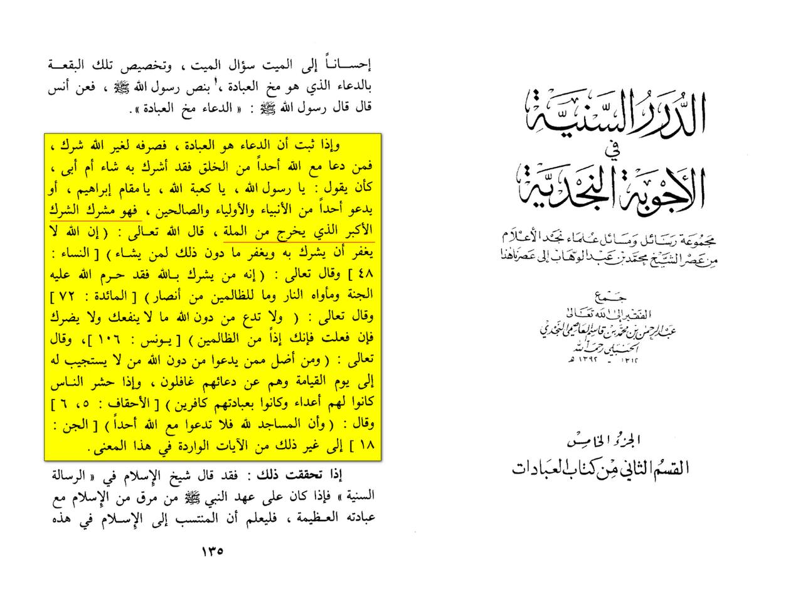

---

<!-- telegram-source: dar/messages5.html#message4594 -->
<!-- evidence-id: 000181 -->

Shaykh ʿAbd al-Raḥmān al-Saʿdī said:

“If it is said: Does such a person have an excuse since he thought that he was guided, while in reality he was not?

It is said: There is no excuse for this person and those like him, whose source of ignorance is turning away from the remembrance of Allah, despite their ability to attain guidance.

They turned away from guidance while having the capability for it, and instead desired falsehood. Thus the sin is their sin, and the crime is their crime.”

[Taysīr al-Karīm al-Raḥmān 1/766]

Show attached source scan

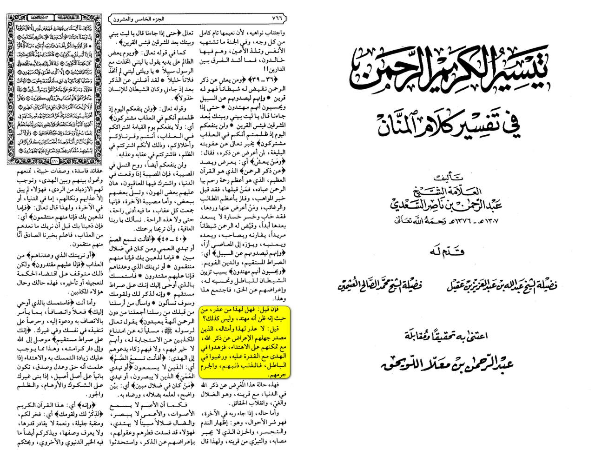

---

<!-- telegram-source: dar/messages4.html#message4168 -->
<!-- evidence-id: 000182 -->

Shaykh Muḥammad ibn Ibrāhīm was asked:

Q: Are Ahl al-Fatrah called kuffār or muslimīn?

A: Kuffār, not muslimīn. As for their punishment, it does not occur until a messenger is sent to them. And in the report concerning the insane and Ahl al-Fatrāt, it is mentioned that a ʿunuq (column) of Fire will be sent to them. …

[Fatāwā wa Rasāʾil by Shaykh Muḥammad ibn Ibrāhīm 1/246-247]

Show attached source scan

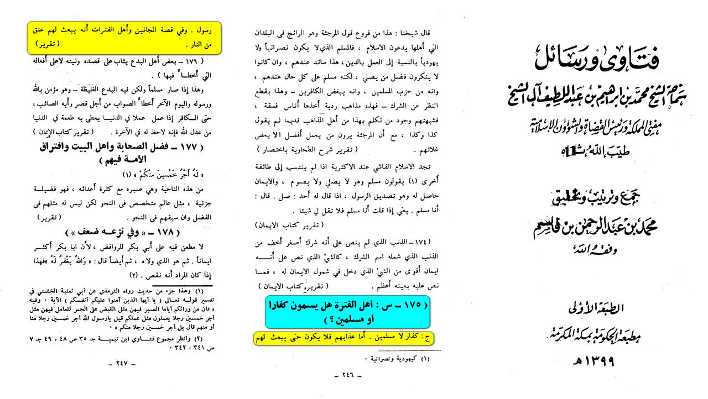

---

<!-- telegram-source: dar/messages4.html#message3656 -->
<!-- evidence-id: 000183 -->

Shaykh ʿAbd ar-Raḥmān ibn Qāsim an-Najdī said:

Allāh declared disbelievers those who spoke a word of disbelief in jest and mockery while traveling, even though they testified that lā ilāha illā Allāh and that Muḥammad is the Messenger of Allah. They came apologizing to the Rasūl ﷺ and swearing oaths, yet Allah revealed about them: “Do not make excuses; you have disbelieved after your īmān.” And the inner states are left to Allāh.

The explicit wording of one who calls upon other than Allah, seeks refuge in him, do istaghātha with him, or requests his shafā‘a (intercession) after his death, is greater in kufr than that of one who uttered such words concerning the Rasūl ﷺ and his companions in jest or mockery. For supplication to other than Allah and asking for what only Allah can do is the very foundation of the world’s shirk — none who has even smelled the fragrance of dīn would doubt this. The proof is clear, and the sign is evident.

And whoever says that the one who does such a thing is still a Muslim is among those who have fabricated lies against Allāh. For Allah has declared disbelievers those who made with Him another god, and He has stated explicitly that a person does not enter Islām except by worshipping Allah alone with no partner and by disavowing everything that is worshipped besides Him, as mentioned previously.

However, this objector is either among the most foolish of people, the dullest of mind, and the most ignorant of Allāh, His dīn, and His shar‘ (law); or else he deliberately lies and cares nothing for it.

[as-Sayf al-Maslūl ʿalā ʿĀbid ar-Rasūl by Shaykh ʿAbd ar-Raḥmān ibn Qāsim an-Najdī p.126]

Show attached source scan

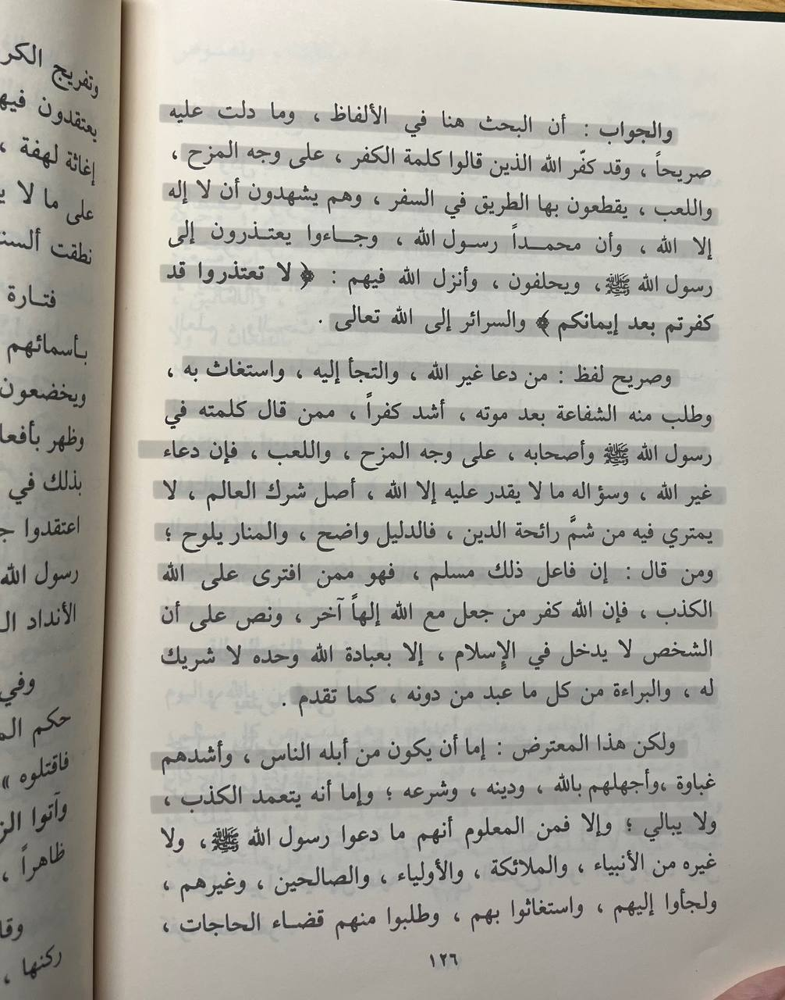

---

<!-- telegram-source: dar/messages4.html#message4041 -->
<!-- evidence-id: 000184 -->

Shaykh ʿAbd ar-Raḥmān ibn Qāsim an-Najdī said:

And his statement, “Allāh will hold His servants accountable for what they believe inwardly and for their intentions, in accordance with the ḥadīth: ‘Actions are only by intentions’” does not prevent us from affirming the shirk of one who sets up another ilāh alongside Allāh. For judgment in this worldly life is based on outward actions and on what the explicit wording indicates. This is a well-known principle: rulings are applied according to outward matters, while Allāh alone handles what lies within the hearts.

People of sound intellect have stated that it is extreme foolishness to deny what the eye clearly sees and to believe instead what is mere conjecture. So how can we accept this claim from you, when ʿUmar said: “Revelation has ceased, and now we hold you accountable only for what appears to us from your actions. Whoever displays goodness to us, we trust him and draw him near. What is in his inner self is not our concern; Allāh will judge him for his inner self. And whoever displays evil, we do not trust him nor believe him — even if he claims that his inner self is good.” And upon this is the ijmāʿ of the Muslims.

And this noble ḥadīth that you used as evidence is in fact a great foundation among the foundations of the religion — rather, the foundation of every action. It is among the clearest proofs against the one objecting, demolishing what he has established from its very root. For whoever sets up another ilāh alongside Allāh has removed the bond of the religion from himself and nullified his īmān in the Lord of all the worlds.

[as-Sayf al-Maslūl ʿalā ʿĀbid ar-Rasūl by Shaykh ʿAbd ar-Raḥmān ibn Qāsim an-Najdī p.136]

Show attached source scan

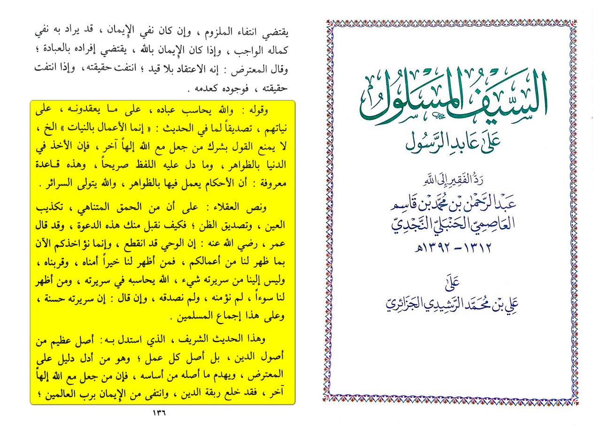

---

<!-- telegram-source: dar/messages4.html#message3580 -->
<!-- evidence-id: 000185 -->

Shaykh ʿAbd ar-Raḥmān ibn Qāsim an-Najdī said:

Many of the Jews and Christians would criticize those who claimed Islam for what they practiced at those shrines, saying: “If your Prophet commanded you with this, then he is not a Prophet; and if he forbade you from it, then you have disobeyed him.”

Both the common folk and the elite—even the Jews, Christians, and mushrikūn—knew that Muhammad ﷺ was only sent with the command to worship Allāh alone, the prohibition of worshipping anything besides Him, and the declaration of takfīr upon those who do so.

And one is not excused by ignorance in this matter, for the obligation of knowing it is among the necessities of Islām, and no error is excused in it. Excuse applies only in matters of ijtihād, where disagreement may occur among the fuqahāʾ, or in issues whose evidence is obscure. As for what is known from Islām by necessity, there is no excuse.

[as-Sayf al-Maslūl ʿalā ʿĀbid ar-Rasūl by Shaykh ʿAbd ar-Raḥmān ibn Qāsim an-Najdī p.11]

Show attached source scan

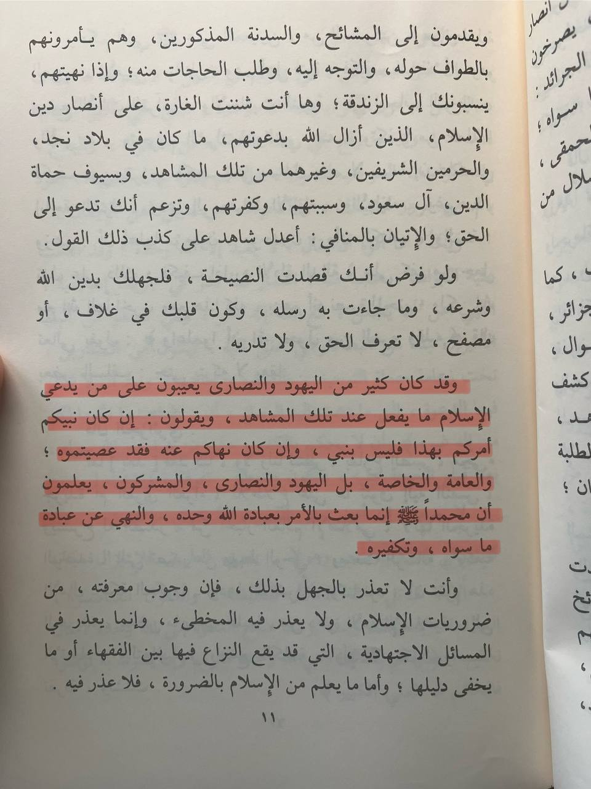

---

<!-- telegram-source: personal/messages.html#message724 -->
<!-- evidence-id: 000186 -->

Shaykh ʿAbd ar-Raḥmān ibn Qāsim an-Najdī said:

So when we declare as kuffār those whom Allah and His Messenger declared kuffār, from those who worship others alongside Allah or call to the worship of other than Him, then we have not declared the entire Islamic ummah to be kuffār.

For the kāfir is the opposite of the Muslim. And whoever worships another deity alongside Allah is not called a Muslim, nor does he enter into the designation of Muslims.

But this objector does not know the reality of Islam, nor the Muslims from the mushrikīn, nor the station of the call to tawḥīd. Rather, mere affiliation to Islam, along with calling upon other than Allah and committing clear shirk through the prophets, the righteous, the simple-minded, the insane, the trees, and the devils, is, according to him, sufficient for Islam.

Rather, that itself is the religion according to him, and that is the Islamic ummah in his view.

[as-Sayf al-Maslūl ʿalā ʿĀbid ar-Rasūl by Shaykh ʿAbd ar-Raḥmān ibn Qāsim an-Najdī p.20]

Show attached source scan

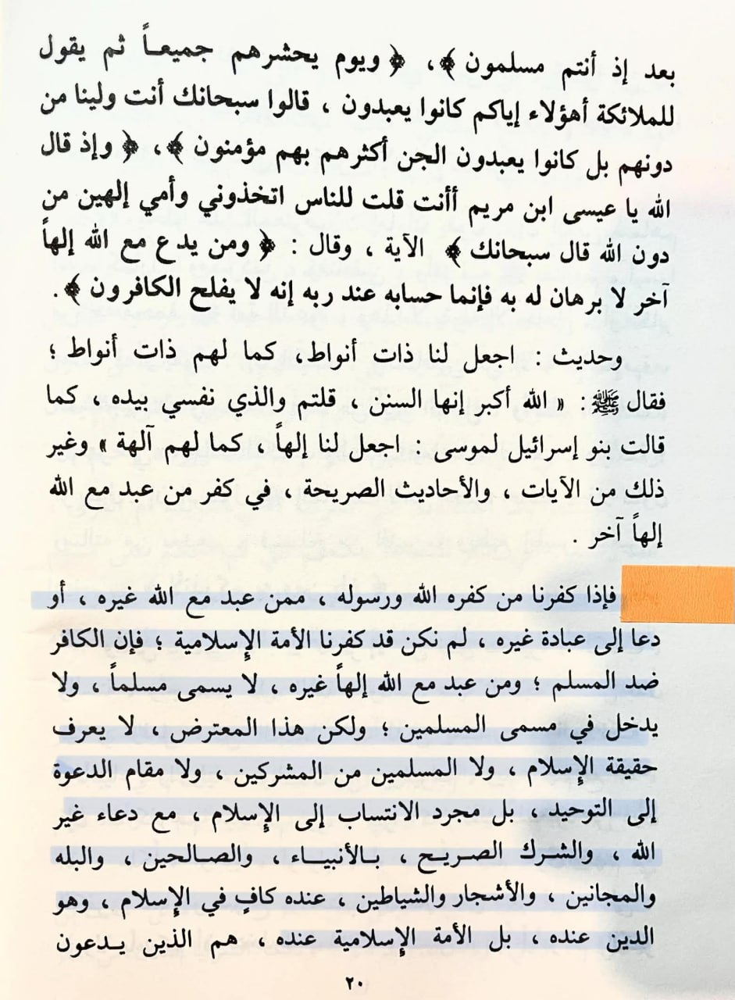

---

<!-- telegram-source: personal/messages.html#message510 -->
<!-- evidence-id: 000187 -->

<video class="source-video" controls preload="metadata" src="assets/videos/personal-510.mp4"></video>

Video source from the user’s Telegram export.

Ruling on those who do not takfir the Mushrikīn mentioned by some of the scholars of Najd by Shaykh ʿAbd ar-Raḥmān ibn Qāsim an-Najdī

---

<!-- telegram-source: dar/messages2.html#message1872 -->
<!-- evidence-id: 000188 -->

Sheikh Bin Bāz was asked:

Q: Is ignorance an excuse in Tawḥīd ar-Rubūbiyyah (Oneness of Lordship) and Tawḥīd al-Ulūhiyyah (Oneness of Worship), or not? And is the issue of excusing ignorance subject to variation depending on time and place?

A: In matters of creed, there is no excuse for ignorance in Tawḥīd ar-Rubūbiyyah, Tawḥīd al-Ulūhiyyah, or Tawḥīd al-Asmā’ waṣ-Ṣifāt (Oneness of Allah’s Names and Attributes). A believer must hold the correct creed, affirm the oneness of Allāh جل وعلا, believe that He is the Lord of the worlds, the Creator, the All-Knowing, the Sole Lordship, and that there is no creator besides Him. He must also believe that Allah alone deserves worship, that He possesses the most beautiful names and highest attributes, that He has no equal or counterpart.

One who understands this has no excuse for negligence in this matter—except if he is in a distant land where no revelation reaches him. In such a case, he is excused, and his fate is left to Allah. He falls under the ruling of Ahl al-Fatrah (those who lived in a time of disconnection from revelation). Their judgment is deferred to the Day of Judgment, where they will be tested: if they respond correctly, they will enter Paradise; if they respond incorrectly, they will enter Hell.

Thus, the ruling varies: if a person is in a remote location, where he has never heard the Qur’ān or Sunnah, he is like Ahl al-Fatrah, and scholars hold that such individuals will be tested on the Day of Judgment. Whoever obeys will enter Paradise, and whoever disobeys will enter Hell.

However, if someone is among Muslims, hears the Qur’ān and Sunnah, yet persists in shirk or denies Allah’s attributes, he is not excused. We seek refuge in Allah from such misguidance.

The issue of excusing ignorance is not a matter of subjective judgment that changes with time and place. Ignorance is not an excuse when it comes to ‘Aqīdah, unless the person is in a location where the message of Islam—the Qur’ān and Sunnah—has not reached him.

On the other hand, in jurisprudential matters, ignorance can be an excuse—for example, if a person is unaware of a particular legal ruling, or if there are intricate details of Allah’s attributes that might be unclear. In such cases, ignorance is excused.

However, regarding fundamental matters—such as belief in the Oneness of Allah, that He is the Creator, the All-Knowing, the One deserving of worship, the Perfect in His Names and Attributes, and belief in what has been revealed in the Qur’ān and authentic Sunnah—there is no excuse for ignorance if the message has reached the individual.

We ask Allah for safety and guidance.

[Fatāwā Nūr ʿalā ad-Darb by Sheikh Ibn Bāz 1/245-246]

Show attached source scan

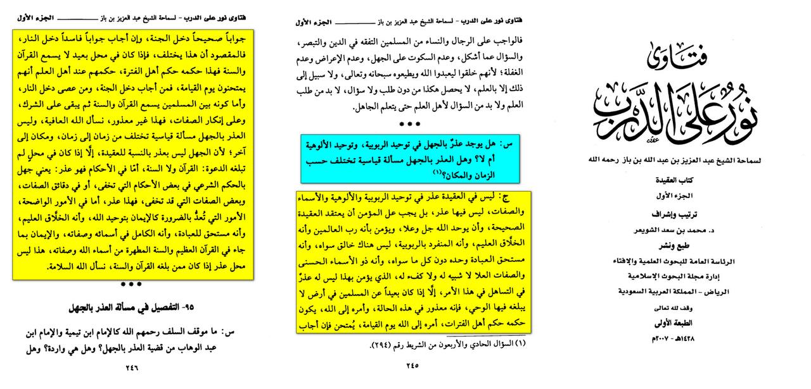

---

<!-- telegram-source: dar/messages2.html#message1590 -->
<!-- evidence-id: 000189 -->

Shaykh ʿAbd al-ʿAzīz Ibn Bāz رحمه الله was asked:

Question:

Is it permissible to eat the slaughtered animals of those who hold polytheistic beliefs, such as making vows, offering sacrifices, and supplicating to those they claim to be saints (awliyā’)—while knowing that the conclusive proof (ḥujjah) has not been fully established against them to remove their doubts?

Answer:

Whoever is known for holding a corrupt, polytheistic belief, his slaughtered animal is not permissible to eat. If he lives among Muslims, then he has no excuse because he neither inquired nor cared. If it is known that he worships other than Allah—such as those who worship al-Badawi, al-Husayn, al-Hasan, ‘Ali (may Allah be pleased with him), Ibn ‘Arabi, or others whom they call saints—then such people are disbelievers, and their slaughtered animals are impermissible to eat. The same applies to anyone who worships other than Allah, makes vows for them, offers sacrifices to them, or seeks their intercession.

This is major shirk; it is the practice of Jāhiliyyah (pre-Islamic ignorance)—the same as what Quraysh did with Hubal, al-Lāt, and al-‘Uzza, and what the people of Nūḥ did with Wadd, Suwā‘, and others like them. Such individuals are considered among those upon whom the proof (ḥujjah) has been established, because they live among Muslims, and the Qur’an, Sunnah, and the words of scholars have reached them. If someone has not received any of this knowledge, it is only due to his negligence and lack of concern .

However, those who live in distant lands, away from Muslims, and belong to Ahl al-Fatrah (people who have not received the message and have never heard the words of Allah or His Messenger), they are considered disbelievers in worldly rulings, but their ultimate judgment is left to Allah in the Hereafter. In this world, their slaughtered animals are not permissible to eat as long as they practice the ways of the disbelievers. Their ultimate judgment is left to Allah on the Day of Judgment. On that day, they will be tested. If they obey the commands, they will enter Paradise, and if they disobey, they will enter Hellfire. This is the correct view regarding Ahl al-Fatrah.

Source: [Official Ibn Bāz fatwa, “The ruling on eating the slaughtered animals of those who hold polytheistic beliefs”](https://binbaz.org.sa/fatwas/8613/حكم-اكل-ذباىح-اصحاب-العقاىد-الشركية).

---

<!-- telegram-source: dar/messages2.html#message1902 -->
<!-- evidence-id: 000190 -->

Sheikh Bin Bāz رحمه الله was asked:

Q: “Your Eminence Sheikh! Please kindly answer my question, an Egyptian working in Jordan, asks: Is ignorance an excuse in matters of faith (Lā ilāha illa Allāh)? If ignorance is not an excuse, what is the ruling—according to your esteemed opinion—on someone who only performs some of the prayers? Can we eat from his slaughtered animal? And if an imam believes in the inhabitants of graves, saying that they were righteous people and that visiting them is not considered shirk , is a person deemed Muslim merely by pronouncing the Shahadah? Please provide us with guidance, may you be rewarded.”

A: There is no excuse for ignorance in these matters—matters of faith, monotheism, and associating partners with Allah—for those living among Muslims. Rather, such a person must learn, understand, and be cautious. Ignorance is not an excuse in this case. If someone supplicates to the dead, seeks their aid, or makes vows to them, this constitutes major shirk.

Merely pronouncing the two testimonies is not sufficient while a person engages in such acts, worshiping the dead, seeking their help, or making vows to them—this is major shirk, and they are not excused. They must dedicate worship to Allah alone, avoid shirk, and be wary of it in all its forms.

Abandoning prayer is disbelief. The one who does not pray is a disbeliever, as the Prophet ﷺ said: “Between a man and disbelief and polytheism is the abandonment of prayer.” He also said: “The covenant that distinguishes us from them is prayer; whoever abandons it has disbelieved.”

Source: [Official Ibn Bāz fatwa, “The issue of excuse due to ignorance in matters of creed”](https://binbaz.org.sa/fatwas/14751/مسالة-العذر-بالجهل-في-مساىل-العقيدة).

---

<!-- telegram-source: dar/messages2.html#message1603 -->
<!-- evidence-id: 000191 -->

Shaykh ʿAbd al-ʿAzīz Ibn Bāz was asked:

Question: Some contemporary individuals have stated that anyone who says or does something that constitutes kufr (disbelief) should not be declared a disbeliever until the proof (hujjah) is established against them, and they have included those who worship graves in this category?

Answer: This is due to their ignorance. Grave worshippers are disbelievers, as are the Jews and the Christians. However, when it comes to execution, they should be given the opportunity to repent. If they repent, fine; if not, they should be executed.

Question: But is it necessary for the proof (hujjah) to be established against them?

Answer: The Quran has reached them: “This is a message for the people” [Ibrahim: 52]. They have been informed that they are among the Muslims: “And it was revealed to this Qur’an, to warn you by it, and whomsoever it reaches” [Al-An’am: 19], “This is a message for the people” [Ibrahim: 52], “O Messenger, deliver what has been revealed to you” [Al-Ma’idah: 67]. The Messenger has delivered it, and the Quran is in front of them, being heard in broadcasts and other places, but they do not care or pay attention. And when someone from outside their circle warns them, they excuse themselves.

[Sharḥ Kashf ash-Shubuhāt by Sheikh Ibn Bāz p.114-115]

Show attached source scan

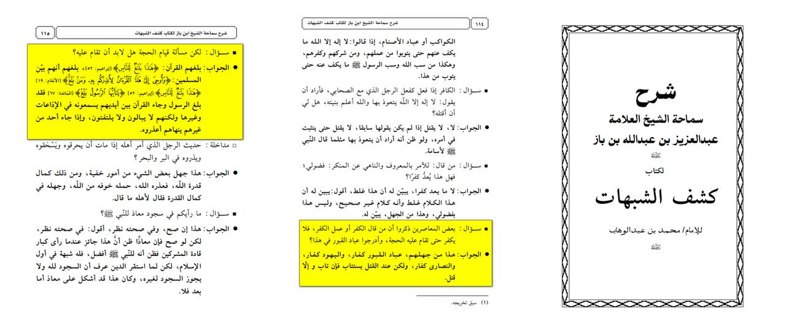

---

<!-- telegram-source: dar/messages2.html#message1706 -->
<!-- evidence-id: 000192 -->

Sheikh Bin Bāz was Asked:

Question:

“Your Eminence, in our country, many have gone astray due to Sufi orders, as they worship graves and invoke beings other than Allah. Among them are memorizers of the Qur’an and imams of mosques. My question consists of several parts, Your Eminence: Are these individuals considered disbelievers due to committing shirk (associating partners with Allah) and their lack of knowledge about tawḥīd (Islamic monotheism), if they are ignorant of the meaning of “Lā ilāha illa Allāh” (There is no god but Allah)? Are they excused due to ignorance, or are they deemed disbelievers? Please guide us in light of this question. I still have additional parts to my question—please proceed, Your Eminence.

Answer:

In the name of Allah, the Most Gracious, the Most Merciful.

All praise is due to Allah, and may peace and blessings be upon the Messenger of Allah, his family, his companions, and those who follow his guidance.

The Noble Qur’an and the purified Sunnah have clarified the oneness of Allah—Glorified and Exalted is He—and have also explained the various forms of major shirk. If a person commits shirk while living among Muslims and having access to the Qur’an and Sunnah, then they are judged as committing shirk. Allah—Glorified and Exalted—is He says: “And this Qur’an has been revealed to me so that I may warn you thereby, and whomever it reaches.” (Al-An‘ām 6:19)

Allah also says: “O Messenger, convey what has been revealed to you from your Lord.” (Al-Mā’idah 5:67)

And He says: “Your duty is only to convey the message, and the reckoning is upon Us.” (Ar-Ra‘d 13:40)

So, whoever receives the message of the Noble Qur’an and the purified Sunnah and still engages in shirk is judged accordingly due to their negligence and failure to fulfill their obligation of seeking knowledge and understanding in religion.

If a person invokes the dead, seeks their intercession, or calls upon stars, trees, stones, idols, or jinn—making supplications to them, seeking their help, or offering vows to them—this constitutes major shirk. Such a person must be called to repent by the authorities. If they repent, they are accepted back into Islam; otherwise, they are subject to capital punishment for committing shirk against Allah. As the Prophet ﷺ said: “Whoever changes his religion, kill him.”

Allah sent His Prophet ﷺ to call people to tawḥīd and to strive against the mushrikīn. Thus, if a person lives among Muslims or in a land where the Qur’an and Sunnah have reached, yet remains negligent and continues in their acts of shirk, they are to be judged as a mushrik.

Source: [Official Ibn Bāz fatwa, “The ruling on grave worshippers and whether they are excused due to ignorance”](https://binbaz.org.sa/fatwas/11713/حكم-عباد-القبور-وهل-يعذرون-بالجهل).

---

<!-- telegram-source: dar/messages3.html#message2853 -->
<!-- evidence-id: 000193 -->

Shaykh Bin Bāz was Asked:

A message from the questioner “Ḥā’” from Banī Mālik:

She says: Your Eminence, I would like to ask a question that has been on my mind. What is the ruling on someone who died associating others with Allah – may Allah protect us from shirk – but did not know the seriousness of this matter? He was one of the ignorant people of the villages in that time, unaware that shirk is among the gravest of major sins, and he died in that state. My question is: Is it permissible for us to supplicate for his mercy and forgiveness? Is it allowed to perform ḥajj or ʿumrah on his behalf? Would such acts benefit him? Please advise us in detail. May Allah reward you.

Answer by His Eminence Shaykh ʿAbd al-ʿAzīz ibn Bāz (may Allah have mercy on him):

In the name of Allah, the Most Gracious, the Most Merciful. All praise is due to Allah. May peace and blessings be upon the Messenger of Allah, his family, companions, and those who follow his guidance. To proceed: Shirk with Allah is the greatest sin and the gravest of all major sins. As the Prophet ﷺ said in the authentic ḥadīth: “Shall I not inform you of the greatest of major sins?” They said, “Yes, O Messenger of Allah.” He said, “Associating others with Allah.”

And Allah the Exalted says: {Indeed, Allah does not forgive association with Him, but He forgives what is less than that for whom He wills} [al-Nisāʾ: 48].

So, shirk is the gravest sin and the most hideous offense. Whoever dies upon it will not be forgiven, and he will be among the inhabitants of Hell, abiding therein eternally. No ḥajj should be performed on his behalf, nor prayer offered for him, nor supplication made for him, nor charity given on his behalf, because of Allah’s statement: {And it was already revealed to you and to those before you: If you should associate [anything] with Allah, your work would surely become worthless, and you would surely be among the losers} [al-Zumar: 65], and His statement: {But if they had associated others with Allah, then worthless for them would be whatever they were doing} [al-Anʿām: 88], and His statement about the polytheists: {Thus will Allah show them their deeds as regrets upon them. And they are never to emerge from the Fire} [al-Baqarah: 167].

Shirk is directing worship to other than Allah, or any part of it — such as calling upon the dead, or the stars, or the prophets, or the angels; seeking their help, vowing to them, or offering sacrifices to them — this is shirk.

Likewise, the one who denies what Allah has made obligatory — matters that are known necessarily in religion and agreed upon by all Muslims — such as denying the obligation of prayer, zakāh, fasting in Ramaḍān, or ḥajj when able, or who makes lawful what Allah has forbidden from well-known matters like claiming that zinā, wine, or disobedience to parents is ḥalāl — this is major kufr. He is not to be prayed over, nor is forgiveness to be sought for him, nor is ḥajj or charity to be performed on his behalf, because he died outside of Islam.

As long as such a person lived among Muslims, heard the Qurʾān, saw the Muslims and their practices, then the proof has been established against him, as Allah says: {And this Qurʾān was revealed to me that I may warn you thereby and whomever it reaches} [al-Anʿām: 19].

That is, whoever the Qurʾān reaches, then the proof has reached them. And if he turned away, did not seek knowledge, and did not investigate, then his matter is with Allah — but in terms of the ruling in this world, he is like the disbelievers of Quraysh who were killed at Badr or died in Makkah, and like the general disbelievers among today’s Christians and Jews. All of them have had the proof established against them, because they did not submit to what Muḥammad ﷺ brought, nor did they pay heed to it, so they became disbelievers. We ask Allah for safety and wellbeing.

<video class="source-video" controls preload="metadata" src="assets/videos/dar-messages3-2853.mp4"></video>

Video source from the Telegram export.

---

<!-- telegram-source: dar/messages3.html#message3024 -->
<!-- evidence-id: 000194 -->

Shaykh ibn Bāz was asked:

Ruling on many of the common people falling into serious violations of tawḥīd

Question: Many common people fall into serious violations of tawḥīd. What is their ruling? Are they excused by ignorance? What is the ruling on marrying them and eating their slaughtered meat? Is it permissible for them to enter Makkah al-Mukarramah?

Answer: Whoever is known for praying to the dead, seeking help from them, making vows to them, or similar types of worship, he is a mushrik kāfir. It is not permissible to marry him, nor to enter the Masjid al-Ḥarām, nor to treat him as a Muslim, even if he claims ignorance until he repents to Allah from that.

Allah says in Surat al-Baqarah: “Do not marry the mushrikāt until they believe; and a believing slave woman is better than a mushrikah, even though she may please you. And do not marry the mushrikīn until they believe; and a believing slave is better than a mushrik, even though he may please you.” (Al-Baqarah 2:221)

And in Surat al-Mumtahanah: “O you who believe! When believing women come to you as emigrants, test them. Allah knows best their faith. If you know them to be believers, do not return them to the disbelievers. They are not lawful for them, nor are those disbelievers lawful for them.” (Al-Mumtahanah 60:10)

And in Surat at-Tawbah: “O you who believe! Indeed the mushrikīn are impure, so let them not approach the Masjid al-Ḥarām after this year.” (At-Tawbah 9:28)

It is not acceptable to excuse them by ignorance; rather they must be treated like disbelievers until they repent to Allah from that.

Allah also says about their excuse: “And when they commit a foul deed, they say: ‘We found our fathers doing it, and Allah has commanded us to do it.’ Say: ‘Indeed, Allah does not command foulness. Do you say about Allah what you do not know?’ Say: ‘My Lord has commanded justice. Establish worship and pay attention to your faces at every mosque, and call on Him sincerely, as you began, so you shall return.’” (Al-Aʿrāf 7:28-29)

“And some He guided and some deserved error. Indeed, they took the devils as allies instead of Allah and think that they are rightly guided.” (Al-Aʿrāf 7:30) Regarding the Christians and their likes, Allah says: “Say: ‘Shall We inform you of the greatest losers in deeds? Those whose effort is lost in worldly life, while they think that they do good work.’” (Al-Kahf 18:103-104) There are many such verses in this meaning.

[Tuḥfat al-Ikhwān bi-Ajwibah Muhimmah Tataʿallaq bi-Arkān al-Islām p.37-39]

Show attached source scan

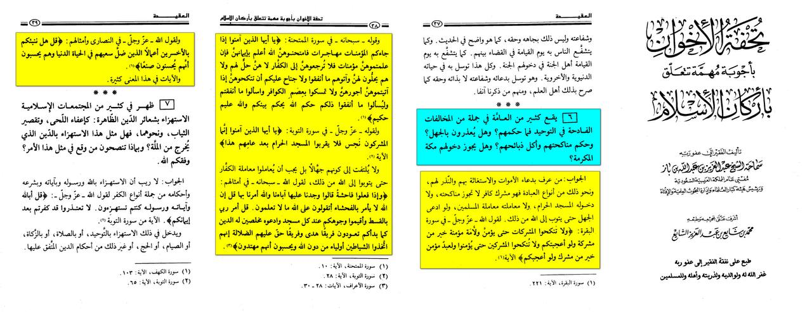

---

<!-- telegram-source: personal/messages.html#message532 -->
<!-- evidence-id: 000195 -->

Shaykh Ibn Bāz was asked:

Q: Some people argue and say: ‘It is true that seeking intercession is shirk akbar, but it is from the masāʾil khafiyyah (hidden matters).’ He agrees with you that it is major shirk, but he does not agree with making takfīr. He says: ‘This is from the hidden issues.’”

A: No, it is not hidden. The most obvious thing in existence is shirk akbar. If someone prays to other than Allāh, or fasts for other than Allāh, or says: ‘O my master al-Badawī, forgive me, have mercy on me, heal my sick person, return my absent one, I am in your protection and I am sick — grant me healing’ — what could be clearer than this?”

Q: Then your view is that the one ignorant of tawḥīd is not excused for his ignorance?”

He replied: No, he is not excused — if he knows, or if he is among the Muslims. But if he is far away (from the muslim living in a remote land), then his ruling is the ruling of ahl al-fatrah. We treat him with the treatment of the kuffār, but his affair is with Allāh. We do not pray over him, the Muslims do not inherit from him, and his affair is with Allāh.

[Subul as-Salām Sharḥ Nawāqiḍ al-Islām by Shaykh Ibn Bāz p.263-264]

Show attached source scan

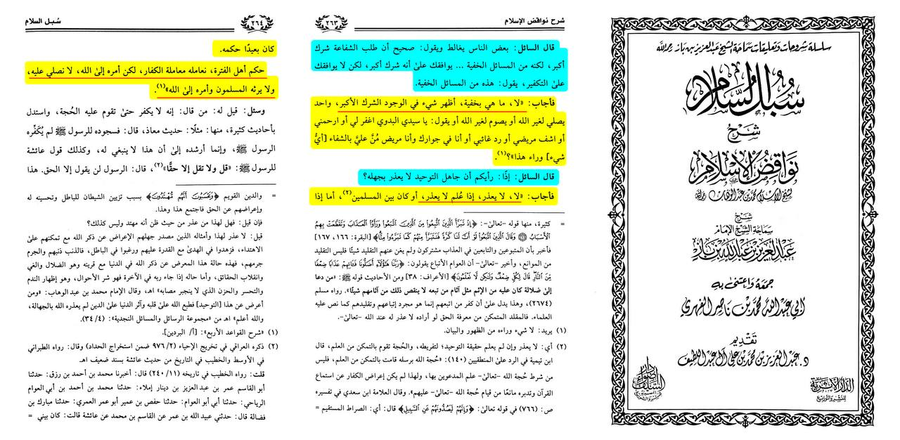

---

<!-- telegram-source: dar/messages4.html#message3660 -->
<!-- evidence-id: 000196 -->

Did Shaykh Bin Bāz say there is a difference of opinion regarding worldly ruling of the one who commits shirk?

Shaykh ʿAbd al-ʿAzīz Ibn Bāz was asked:

Question:

Some contemporary individuals have stated that whoever says or does an act of kufr does not become a disbeliever until the ḥujjah has been established upon him, and they have included the grave worshippers in this category.

Answer:

This is from their ignorance. The grave worshippers are disbelievers, just as the Jew are disbelievers and the Christians are disbelievers. However, when it comes to execution, the person is first invited to repent; if he repents, he is spared, and if he refuses, he is executed.

[Sharḥ Kashf ash-Shubuhāt by Sheikh Ibn Bāz p.112]

Show attached source scan

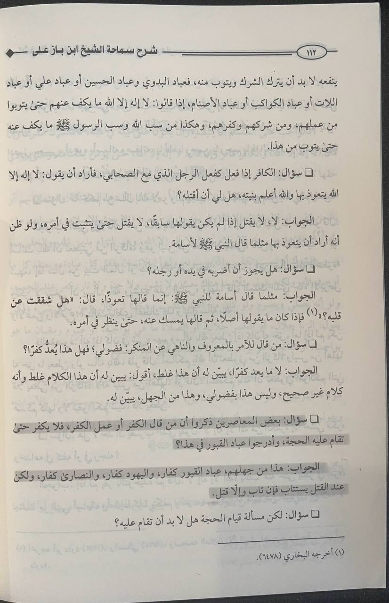

---

<!-- telegram-source: dar/messages4.html#message3471 -->
<!-- evidence-id: 000197 -->

Shaykh Bin Bāz said:

Directing any part of worship to the awliyāʾ, or to the prophets, or to the sun and the moon, or to the jinn, or to the angels, or to idols, or to trees, or to anything else, all of this nullifies the tawḥīd of Allah and invalidates it.

And when it is known that Allah — exalted is He — sent His Prophet Muḥammad ﷺ, and the prophets before him, to peoples who worshipped other than Allah — some of them worshipped prophets and the righteous, some worshipped trees and stones, some worshipped carved idols, and some worshipped celestial bodies, and the like — they all called their peoples to the tawḥīd of Allah, to believe in Him alone, to declare lā ilāha illa Allāh, to renounce whatever contradicts it, to renounce those who worship other than Allah and the objects of their worship.

For whoever directs part of worship to other than Him has not truly made Him one, as Allah said: “And indeed, We sent into every nation a messenger, [saying]: Worship Allah and avoid Ṭāghūt.” [al-Naḥl 16:36]

From this, it is understood that what is practiced around graves that are worshipped besides Allah — such as the grave of al-Badawī, al-Ḥusayn in Egypt, and the like — and what occurs from some of the ignorant pilgrims and others at the grave of the Prophet ﷺ — asking him for aid, seeking victory over enemies, calling upon him for relief, and presenting complaints to him — all of this is worship of other than Allah, and it is the shirk of the first Jāhiliyyah. Likewise, what is practiced by some Ṣūfīs who believe that certain awliyāʾ govern the cosmos and manage this world — we seek refuge in Allah — this is major shirk in rubūbiyyah.

And likewise what occurs from the belief of some people — that some created beings have a connection with the Lord such that they can dispense with following the Messenger Muḥammad ﷺ, or that they know the unseen, or that they control the created realities — and the like of this: it is kufr akbar  in Allah, clear shirk, which removes its possessor from the millah islāmiyyah (Islamic religion), if he claims affiliation to it.

Thus, there is no tawḥīd, no Islām, no īmān, and no salvation except through singling out Allah in worship, believing that He is the Owner of Sovereignty, the Disposer of affairs, and that He is perfect in His Essence, His Attributes, His Names, and His Acts. He has no partner, no likeness, and cannot be compared to His creation. To Him belongs absolute perfection in His Essence, His Attributes, and His Acts. He alone is the Manager of the dominion — exalted and majestic — without partner, and none can reverse His decree.

[Majmūʿat Rasāʾil fī at-Tawḥīd by Shaykh Bin Bāz p.14-15]

Show attached source scan

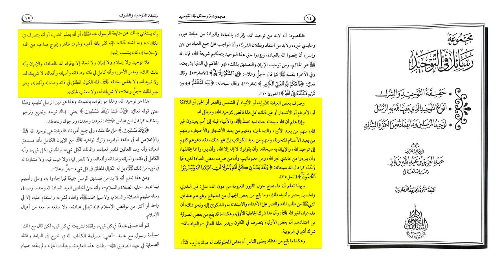

---

<!-- telegram-source: dar/messages5.html#message4275 -->
<!-- evidence-id: 000198 -->

Shaykh Ibn Bāz was asked:

Q: What is the ruling on those who call upon other than Allāh from among the Muslims due to ignorance of the reality of tawḥīd?

A: This is their ruling: their action is kufr. Calling upon the dead and directing supplication to the dead is kufr.

The scholars differed concerning the ruling on the individual himself: does he become a kāfir automatically, or is it necessary that he first be made to know?

There are two views:

The first: that it is necessary he be informed, because the matter may have become confused for him due to the callers to falsehood and because of corrupt scholars, so the issue became unclear to him. Therefore, he must be taught and alerted before disbelief is ruled (meaning the punishment being applied) upon him. This is the view of a group of scholars.

The second: that it does not require clarification, because the matter is clear and all of it is manifest shirk. This is the Sunnah, and the Messenger clarified it and explained it. Thus, his kufr does not depend on clarification; rather, he is a kāfir by this action.

However, it is understood that if there were an Islamic state that holds him accountable, it would not execute him until he is asked to repent to Allāh and abandon this shirk. If he repents and desists, then praise is due to Allāh. If he persists, then the matter remains grave.

In any case, the view that he is a kāfir merely by these actions is a strong view. But the more cautious approach is not to hasten in this ruling (of punishment) until he is informed, directed to good, and taught, so that perhaps he may be guided if that becomes possible.

As for his ruling in this world: his ruling is the ruling of a kāfir in worldly matters — he is not prayed over, not washed, and the Muslims do not treat him as one of them.

Show attached source scan

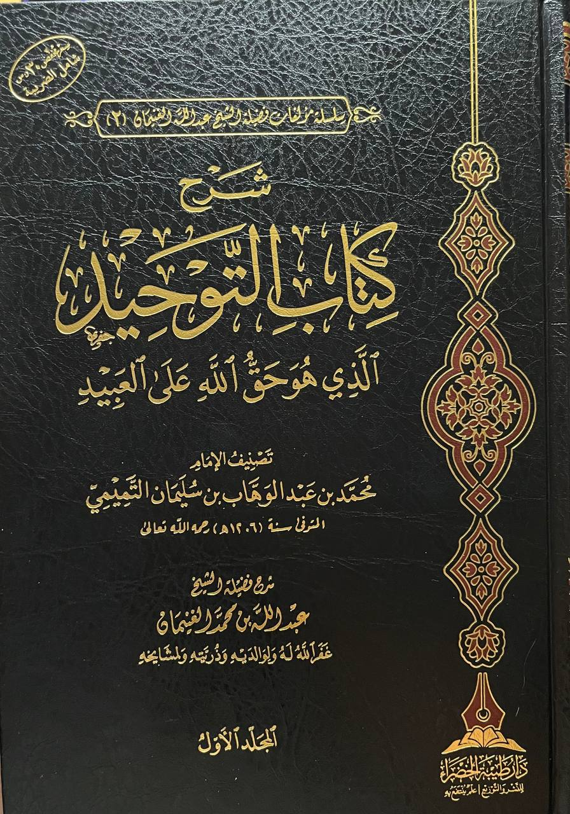

---

<!-- telegram-source: dar/messages2.html#message1868 -->
<!-- evidence-id: 000199 -->

Shaykh ʿAbd al-ʿAzīz Ibn Bāz was asked:

Question: May Allah bless your deeds! The author said: “He may say it while being ignorant, yet he is not excused for his ignorance?”

Answer: Because he is among Muslims, and he has access to the Book and Sunnah—it is near to him. This implies a form of negligence.

Question: Should this be applied to someone who is negligent (mufarriṭ)?

Answer: Yes, because he is a negligent person who has the ability to learn but did not care.

Answer: This is a great matter, and the principle is that one who is among Muslims and has received the Book and the Sunnah is not excused. Allah, the Almighty, said: “This (Qur’an) is a clear message for the people” [Ibrahim: 52], and He also said: “And this Qur’an has been revealed to me that I may warn you thereby and whomever it reaches” [Al-An‘am: 19]. Whoever has received the Qur’an and Sunnah is not excused; rather, he is at fault due to his negligence and lack of concern for learning.

Interjection: But can it be said that this is a disputed issue?

Answer: No, it is not a disputed issue, except in subtle cases that may be unclear, such as the story of the man who told his family to burn his body.

[Sharḥ Kashf ash-Shubuhāt by Sheikh Ibn Bāz p.26-27]

Show attached source scan

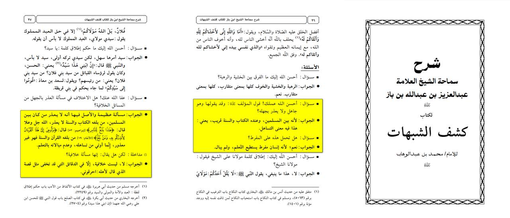

---

<!-- telegram-source: dar/messages.html#message491 -->
<!-- evidence-id: 000200 -->

Sheikh Bin Baz رحمه الله on Excuse of Ignorance

<video class="source-video" controls preload="metadata" src="assets/videos/dar-messages-491.mp4"></video>

Video source from the Telegram export.

---

<!-- telegram-source: dar/messages4.html#message3403 -->
<!-- evidence-id: 000201 -->

Shaykh Ibn Bāz said:

Q: What is the ruling on one who says: “Those who call upon the righteous awliyāʾ are Muslims”?

A: The ruling is that it clarifies to him that this is kufr and misguidance. If he insists, then he becomes a kāfir like them. It is explained to him their kufr and misguidance, with the evidences for that. Allāh, the Mighty and Majestic, says: “So do not call upon anyone along with Allāh” (al-Jinn 18).

And He, the Exalted, says: “And whoever calls upon another god alongside Allāh, for which he has no proof, then his reckoning is only with his Lord. Indeed, the disbelievers will never succeed” (al-Muʾminūn 117).

He named them disbelievers. And He, the Exalted, says: “And those whom you call upon besides Him do not own even the thin membrane of a date seed. If you call upon them, they do not hear your call, and if they were to hear, they could not respond to you. And on the Day of Resurrection, they will disown your associating them with Allāh” (Fāṭir 13–14).

He called their du‘ā shirk. It should be explained to them that their du‘ā from them and istighāthah from the dead is shirk, the very shirk of the mushrikīn. This was the shirk of Quraysh with al-Lāt and others among the righteous, and with the angels. We ask Allāh for safety and well-being.

[Fatāwā Nūr ʿalā al-Darb by Shaykh Ibn Bāz 2/96]

Show attached source scan

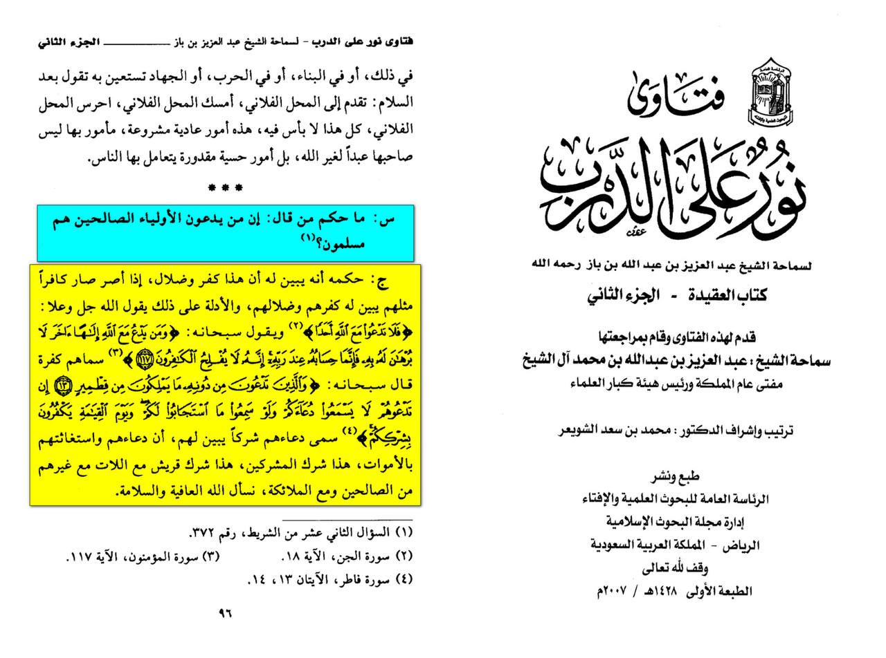

---

<!-- telegram-source: dar/messages4.html#message3417 -->
<!-- evidence-id: 000202 -->

Shaykh Ibn Bāz Advice to the student of knowledge in the matter of ʿUdhr bil Jahl

Shaykh Ibn Bāz said:

It is obligatory upon the Muslim to have insight and to be upon clarity regarding his religion. A mushrik is a mushrik, even if he says “lā ilāha illā Allāh,” and a kāfir is a kāfir, even if he says “lā ilāha illā Allāh,” until he believes in its meaning and fulfills its right. As the Prophet ﷺ said: “I have been commanded to fight the people until they say lā ilāha illā Allāh. When they say lā ilāha illā Allāh, their blood and wealth are protected from me, except by its right.”

And likewise, if he calls upon the angels and seeks help from them, or from the jinn, he has disbelieved, even if he says lā ilāha illā Allāh. And in the ḥadīth of Ibn ʿUmar: “Except by the right of Islam, and their reckoning is with Allah.” So there must be the right of Islam and the right of lā ilāha illā Allāh, which is adherence to the religion of Allah and caution against whatever leads to shirk or denial of Allah and His Messenger.

Even if a person performs every act of worship and believes in everything Allah made obligatory, but then says, for example: “There is no resurrection, no gathering, no Paradise, no Hellfire,” he has disbelieved according to all. Even if he prays and fasts and is among the most devout of people.

Likewise, if he believes in everything but says: “Zinā is ḥalāl,” or “khamr is ḥalāl,” or “ṣalāh is not obligatory,” or “fasting Ramaḍān is not obligatory,” or “ḥajj is not obligatory despite having the ability,” then he has disbelieved according to all.

Therefore, it is obligatory to be alert to these matters, and for the student of knowledge to be upon insight, and not to be deceived by the words of these apostates—these ignorant misguiders who worship graves and seek aid from the dead, while claiming, “We are Muslims.” We ask Allah for safety. May Allah grant everyone success and guidance.

<video class="source-video" controls preload="metadata" src="assets/videos/dar-messages4-3417.mp4"></video>

Video source from the Telegram export.

---

<!-- telegram-source: dar/messages3.html#message3046 -->
<!-- evidence-id: 000203 -->

Shaykh Bin Bāz was Asked:

Question: Is there disagreement on the issue of excuse due to ignorance?

Answer: It is a great issue, and the original ruling is that there is no excuse if among the Muslims there are those who have received the Qurʾān and the Sunnah. They are not excused. Allah, Glorified and Exalted, said: “This is a message for the people” [Ibrāhīm: 52], and He said: “And this Qurʾān has been revealed to me that I may warn you thereby and whomever it reaches” [Al-Anʿām: 19]. Whoever receives the Qurʾān and the Sunnah is not excused; rather, they are held accountable for their negligence and carelessness.

Question: But is it correct to say this is a matter of disagreement?

Answer: No, it is not a matter of disagreement, except in subtle details that may be hidden, like the story of the one who said to his family: “Burn me.”

Source: [Official Ibn Bāz fatwa, “Is the issue of excuse due to ignorance a disputed issue?”](https://binbaz.org.sa/fatwas/31405/هل-مسالة-العذر-بالجهل-من-المساىل-الخلافية).

---

<!-- telegram-source: dar/messages2.html#message1890 -->
<!-- evidence-id: 000204 -->

Sheikh Bin Bāz was asked:

Q: Are those who worship graves excused due to ignorance, even though there are callers to Tawḥīd among them?

A: It has already been clarified that they are not excused. They are obligated to seek knowledge, understand their religion, and ask about what confuses them. If they remain silent and persist in worshiping the dead, trees, stones, prophets, angels, or jinn, then they are considered disbelievers due to their acts—such as invoking these beings, seeking their intercession, asking them to heal the sick, or bring back the lost.

Q: Is it permissible to pray behind someone known to invoke others besides Allāh? What is the ruling on the prayer of those who follow him?

A: Whoever prays behind someone who commits shirk, their prayer is invalid, as long as that person calls upon other than Allāh, seeks aid from other than Him, or makes vows to other than Him. It is not permissible to pray behind a disbeliever, and the prayer behind a disbeliever is invalid according to the scholars. The only debate exists regarding the sinful Muslim (fāsiq), but as for the disbeliever, there is no difference of opinion.

[Aqwāl ash-Shaykh ʿAbd al-ʿAzīz Ibn Bāz fī al-ʿUdhr bil-Jahl p.26]

Show attached source scan

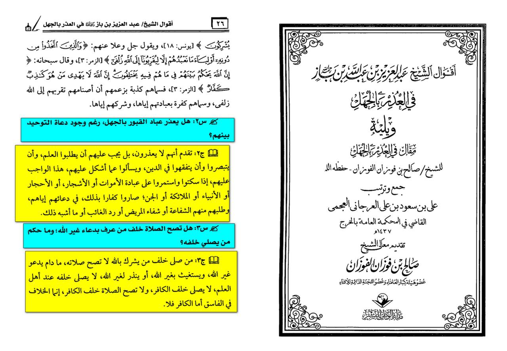

---

<!-- telegram-source: dar/messages4.html#message3945 -->
<!-- evidence-id: 000205 -->

Shaykh Ibn Bāz said:

It may also be said that the people of jāhiliyyah are treated like kuffār in worldly rulings: they are not supplicated for, nor is forgiveness sought for them, because they perform the actions of the disbelievers, so they are treated according to those actions. Their affair, however, is with Allah in the Hereafter.

As for the one upon whom the ḥujjah has not been established in this world, he is not punished until he is tested on the Day of Resurrection. For Allah, Exalted is He, said: “We do not punish until We send a messenger.” [al-Isrāʾ: 15] Thus every person who lived in a fatrah — to whom the da‘wah of a prophet did not reach — will be tested on the Day of Resurrection. If he responds correctly, he will enter Paradise; and if he disobeys, he will enter the Fire.

Likewise the very elderly person to whom the da‘wah never reached, and the insane whose minds never perceived the da‘wah, and others similar to them — such as the children of the disbelievers — for when the Messenger ﷺ was asked about them, he said: “Allah knows best what they would have done.” So the children of the disbelievers will be tested on the Day of Resurrection like the people of the fatrah: if they answer correctly, they will be saved, and if not, they will be among those who perish.

[Majmūʿ Fatāwā wa Maqālāt ash-Shaykh Ibn Bāz 5/181-182]

Show attached source scan

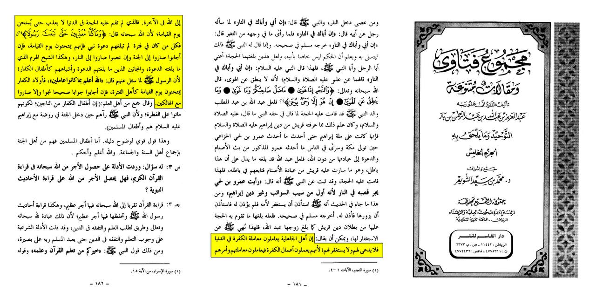

---

<!-- telegram-source: dar/messages3.html#message2268 -->
<!-- evidence-id: 000206 -->

Al-Ṭaḥāwī said in his ʿAqīdah:

We fear for them but do not cause them to despair. Amn (safety from Allah’s punishment) and iyās (despair of His mercy) both remove one from the millah of Islām, and the path of truth lies between the two for the people of the qiblah. A servant does not leave īmān except by juḥūd (denial) that which brought him into it.

Shaykh Ibn Bāz said regarding this: “This limitation is questionable! For the disbeliever enters into Islam by the two testimonies of faith if he is able to pronounce them. If he cannot pronounce them, he enters Islam by repenting from that which caused his disbelief.

And one may exit Islam not only through denial, but through many other reasons clarified by the scholars in the chapter of the ruling on the apostate (bāb ḥukm al-murtadd), such as: reviling Islam, or the Prophet, or mocking Allah, His Messenger, His Book, or any part of His Sharīʿah—due to His saying:

“Say: Is it Allah and His signs and His Messenger that you were mocking? Make no excuse—you have disbelieved after you had believed.” [al-Tawbah: 65–66]

Among the causes of apostasy is also worshipping idols, calling upon the dead, seeking aid from them, asking them for help or provision, and the like. These acts contradict the statement lā ilāha illā Allāh, which affirms that worship is the sole right of Allah—including supplication, seeking aid, bowing, prostration, sacrifice, vows, and the like.

Whoever directs any of these acts to other than Allah, whether idols, statues, angels, jinn, or the dead, has committed shirk and nullified lā ilāha illā Allāh. These matters expel one from Islam by the consensus of the scholars, and they are not classified as juḥūd (denial).

Their evidences are well known from the Qur’ān and Sunnah, and there are many other matters that invalidate one’s Islam which are not called juḥūd—these are detailed by the scholars in the chapter on the apostate. Refer to them if you wish. And Allah grants success.”

[Majmūʿ Fatāwā Ibn Bāz 2/83]

Show attached source scan

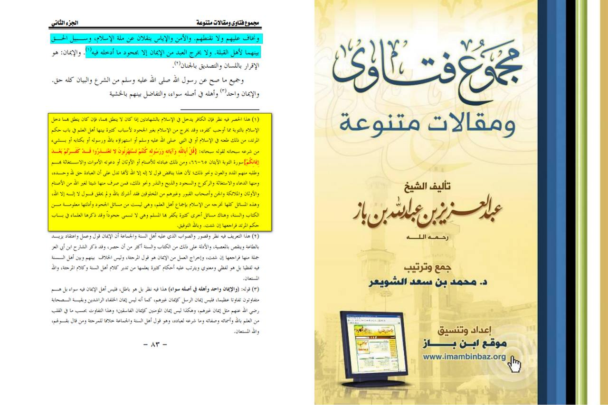

---

<!-- telegram-source: dar/messages4.html#message4171 -->
<!-- evidence-id: 000207 -->

Who are Ahl al-Fatrah?

Shaykh Ibn Bāz was asked:

Q: Who are Ahl al-Fatrah? And is it correct that there are some of them today?

A: Ahl al-Fatrah are those to whom the Message did not reach. These are Ahl al-Fatrah: they did not hear of the Qurʾān, nor of the Messenger ﷺ. These are called Ahl al-Fatrah. As for one to whom the Qurʾān reached, or the news of the Messenger ﷺ reached him—that Allāh sent him to the people, calling them—and he was negligent, then he is not from Ahl al-Fatrah. Rather, whoever was not reached by that is said to be from Ahl al-Fatrah.

And the correct view regarding them is that they will be tested on the Day of Resurrection. Allāh will test them on the Day of Resurrection: whoever responds enters Paradise, and whoever disobeys enters the Fire. We ask Allāh for well-being.

[Fatāwā Nūr ʿalā ad-Darb by Shaykh Ibn Bāz 1/262-263]

Show attached source scan

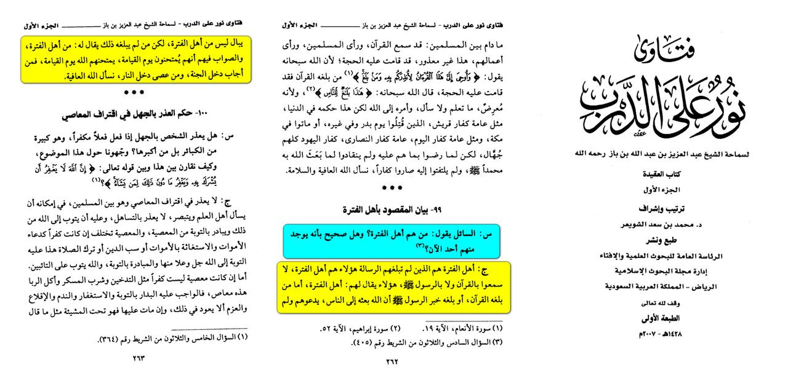

---

<!-- telegram-source: dar/messages3.html#message2798 -->
<!-- evidence-id: 000208 -->

Shaykh Badr ibn ʿAlī al-ʿUtaybī — The student of Shaykh Ibn Bāz — clear clarification on the Matter of ʿUdhr Bil Jahl. a beneficial Fatawa on how to navigate this topic which the Murji’ah have distorted to justify the Islam of a Mushrik.

Show attached source scan

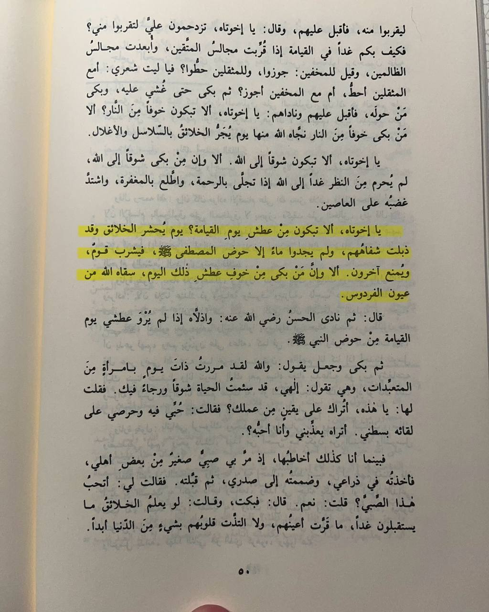

---

<!-- telegram-source: dar/messages4.html#message3517 -->
<!-- evidence-id: 000209 -->

Shaykh Ibn ʿUthaymīn said:

These common people — who have this innovation and other that have been mislead into believing it? What is their ruling? As long as they were intending the truth and did not know it, then their sin is upon the one who gave the fatwā and upon the one who misled them. As for them — there is nothing upon them. Yes.

Q: Should we apply to them the same ruling as the mushrikīn, given that it is the common people who perform ṭawāf around the grave being deceived by their scholars

A: The sin is written upon those who issued it (I.e the fatawa).

Q: And they are not mushrikīn?

A: No. Their action is that of a mushrik, but they are not judged with the ruling [of apostasy] of the mushrik because of their ignorance.

Q: if they die upon that, what are they called?

A: If they die, then as long as their action is the action of shirk, it is judged (I.e the Label is applied) that they are mushrikūn — meaning, they are treated with the treatment of the mushrik. But with Allah, exalted is He, the punishment is lifted from them because of their ignorance.

And for this reason, now there are people in the remote parts of Africa, in the remote parts of distant lands, who do not know anything about Islam. If they died, we do not say of these that they are Muslims, nor do we pray over them, nor seek mercy for them, even though the proof has not been established upon them. Rather, we say: outwardly, we treat them in this world according to what is apparent. But in the Hereafter — their affair is to Allah.

This is one of the clear fatawas of Shaykh Ibn ʿUthaymīn differentiating between the Ism of Mushrikeen being applied even if one is ignorant, and the ruling of the Mushrikeen (check video I linked above for the clear fatawa clarifying this distinction) is only after the proof is established. This is a principle the people of knowledge have applied.

---

<!-- telegram-source: dar/messages3.html#message2455 -->
<!-- evidence-id: 000210 -->

[Ruling on Vowing to a Saint and Its Consequences]

Shaykh Ibn ʿUthaymīn was asked:

A woman vowed to give a sheep to a deceased saint every time she gave birth, whether to a boy or a girl. The Shaykh asked: “To whom does she give it?” The questioner replied: “To the walī.” The Shaykh asked: “And he is deceased?” The questioner said: “Yes, she slaughters [the sheep for him].”

She has already fulfilled two such vows and has two remaining. The sheep is given to someone referred to as khalīfah—a supposed representative of the deceased walī—who does with the sheep as he pleases: he may slaughter it for those present or sell it in the market and keep the proceeds.

The questioner asked:

Can her husband give her money to fulfill this vow, or should he refuse? It is worth noting that the wife holds firm to the belief that the deceased walī can cause benefit and harm. What is the ruling on the husband remaining with her in this state? He requested that the response be recorded if possible to share it with others who hold the same belief. If not, then a written answer is requested. He also asked for recommendations for recorded lectures addressing such issues. May Allah reward you and guide you to all that is good. Submitted by: Your brother, Sudanese by nationality.

Answer:

This question has two parts:

First: Does the husband have to give her money to fulfill this vow? We say: No, the husband is not obligated to give her anything to fulfill such a vow. In fact, it is not even permissible for him to do so. If she insists on the belief mentioned by the questioner—that this walī can bring benefit or harm—then she is a mushrikah, and it is not permissible for him to remain married to her. He must separate from her, for it is not lawful for a Muslim man to remain married to a polytheist woman.

Second: We say to this woman: your vow is invalid because it is a vow to commit a sin, and there is no vow in disobedience. She must offer the kaffārat yamīn (expiation for an oath) for this vow and repent to Allah from such beliefs. She must know that only Allah can bring benefit or harm.

Allah, Exalted is He, said to His Prophet Muhammad ﷺ—who is the greatest of all saints: {Say: “Indeed, I do not possess for you [the power of] harm or guidance.” Say: “No one can protect me from Allah, nor can I find any refuge besides Him.”} [Sūrat al-Jinn: 21–22]

Meaning: If Allah wills something for me, no one can shield me from it—so how could I shield others? If this applies to the Prophet ﷺ—then how much more so for those below him?

Therefore, we say: awliyāʾ cannot bring benefit or harm. Slaughtering animals in their name is shirk, which expels one from Islam. If she were to die holding this belief, she would be among the inhabitants of Hell. Allah said: {Indeed, whoever associates others with Allah—Allah has forbidden Paradise to him, and his abode is the Fire. And there are no helpers for the wrongdoers.} [Sūrat al-Māʾidah: 72]

So now tell the brother:

1. He must separate from her until she repents from this shirk. If she repents, she must offer expiation for her vow as a kaffārat yamīn.

2. He must admonish her and instill fear of Allah in her. He should tell her that her actions are major shirk, and if she dies upon it, she will die destined for Hell—may Allah protect us.

---

<!-- telegram-source: dar/messages3.html#message2778 -->
<!-- evidence-id: 000211 -->

Shaykh Ibn ʿUthaymīn was asked:

Question: What is the fate of a Muslim who fasts, prays, and gives zakāh, but believes in the awliyāʾ with the belief that in some Islamic countries is called a “good belief” — namely, that they can harm and benefit — and he also makes duʿāʾ to this walī, saying: “O so-and-so, you will have such-and-such if my son or daughter recovers,” or says, “By Allāh, O so-and-so.” What is the ruling on such statements, and what is the fate of such a Muslim?

Answer: "Calling this man — who vows to graves and awliyāʾ and calls upon them — a Muslim is ignorance on the part of the one naming him. In reality, he is not a Muslim, because he is a mushrik. Allāh the Most High said: “And your Lord said, ‘Call upon Me; I will respond to you. Indeed, those who are too proud for My worship will enter Hell humiliated.’” [Ghāfir: 60].

Duʿāʾ is only to Allāh alone, for He is the One who removes harm and brings benefit, as He said: “Is He [not best] who responds to the distressed one when he calls upon Him and removes evil and makes you inheritors of the earth? Is there a deity with Allāh? Little do you remember.” [al-Naml: 62] So this person, even if he prays, fasts, and gives zakāh, if he calls upon other than Allāh, worships him, and vows to him, then he is a mushrik. Allāh has forbidden Paradise for him, and his abode is the Fire, and the wrongdoers will have no helpers."

[Fatāwā Nūr ʿalā al-Darb by Shaykh Muḥammad ibn Ṣāliḥ al-ʿUthaymīn 4/2]

Show attached source scan

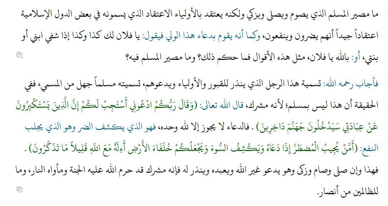

---

<!-- telegram-source: dar/messages4.html#message4125 -->
<!-- evidence-id: 000212 -->

Shaykh Ibn ʿUthaymīn said:

As for the common people who do not know, and upon whom this bidʿah and other matters have been confused, we say: as long as they are seeking the truth and were unaware of it, then their sin falls upon the one who issued them the fatwā and misled them.

For this reason, there are people in the remote regions of Africa and elsewhere who know nothing about Islam. If such people were to die, we would not say they are Muslims, nor would we pray over them or seek mercy for them, even though the ḥujjah had not been established against them. But in worldly matters we judge them according to what outwardly appears, while in the Hereafter their affair is with Allāh.

[Majmūʿ Fatāwā wa-Rasāʾil Faḍīlat al-Shaykh Muḥammad ibn Ṣāliḥ al-ʿUthaymīn 9/381]

Show attached source scan

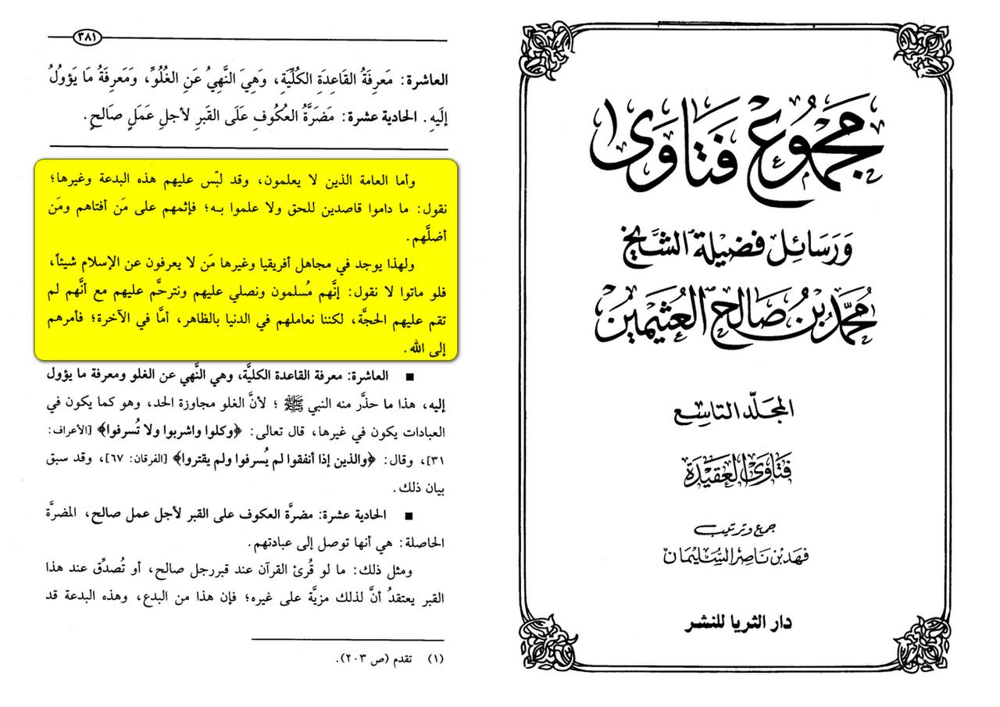

---

<!-- telegram-source: dar/messages3.html#message2631 -->
<!-- evidence-id: 000213 -->

Shaykh Ibn ʿUthaymīn was asked:

(355) The questioner M.M.H. from ʿAmman, Jordan, says:

We have an imam in our mosque, a ḥāfiẓ of the Qur’ān, proficient in its recitation, and seemingly righteous. In addition to his regular observance of prayer, he fasts every other day. However, he regularly holds dhikr gatherings after ʿishā’, which extend late into the night. In them, they repeat certain phrases such as: “Maddad yā Sayyidī yā Rasūl Allāh” and “Maddad yā Sayyidī ʿAbd al-Qādir,” and similar invocations. Is this permissible and are they rewarded for it or not? Does this affect the validity of our prayer behind him? And if so, what should we do regarding our past prayers behind him?

He replied – may Allāh have mercy on him: In truth, what the questioner has mentioned is deeply saddening!

This imam—who has been described as maintaining prayer and fasting every other day, and whose outward appearance is one of uprightness—has been deceived by Shayṭān, leading him to exit Islām through shirk, whether he realizes it or not. Calling upon other than Allāh is major shirk (shirk akbar) that expels a person from the religion, whether he calls upon the Messenger ﷺ or anyone else. And anyone besides the Messenger has even less status and rank before Allāh than him. So if supplicating to the Messenger ﷺ is considered shirk, then doing so to others like ʿAbd al-Qādir—or anyone else—is even worse and more repugnant.

[Fatāwā Nūr ʿalā al-Darb by Ibn ʿUthaymīn 1/419]

Show attached source scan

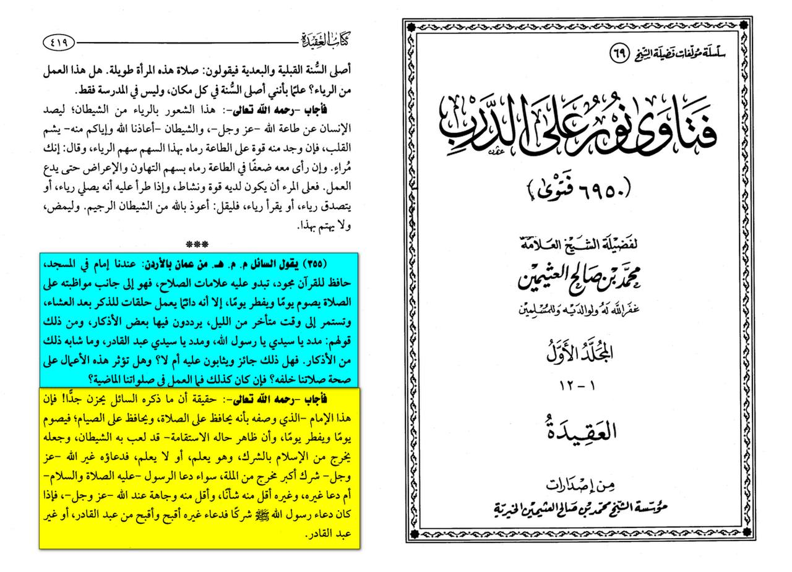

---

<!-- telegram-source: dar/messages4.html#message3348 -->
<!-- evidence-id: 000214 -->

Shaykh Muḥammad ibn Ṣāliḥ al-ʿUthaymīn said:

His statement: “Except the One who created me” combines both negation and affirmation. The negation is: “I am disassociated from what you worship,” and the affirmation is: “Except the One who created me.” This indicates that tawḥīd is not complete except with disbelief in everything besides Allah and īmān in Allah alone. As Allah says: “Whoever disbelieves in al-ṭāghūt and believes in Allah has grasped the firmest handhold” [al-Baqarah: 256].

These people worship Allah and also worship others besides Him — because He said: “Except the One who created me.” The default assumption for exception is that it is connected unless there is evidence otherwise, and yet he [Ibrahim] still disassociated himself from them.

Likewise, in some Muslim countries, people pray, give zakāt, fast, and perform ḥajj, yet they go to graves, prostrate to them, and bow before them. They are kuffār, not muwaḥḥidīn (monotheists), and no deeds are accepted from them. This is among the gravest dangers facing Muslim societies — that disbelief in everything besides Allah is treated as insignificant. This stems from ignorance and negligence on the part of their scholars, because the common person only takes from his scholar. But some people — may Allah protect us — are scholars of the state, not scholars of the religion.

[al-Qawl al-Mufīd ʿalā Kitāb al-Tawḥīd by Shaykh Ibn ʿUthaymīn 1/150]

Show attached source scan

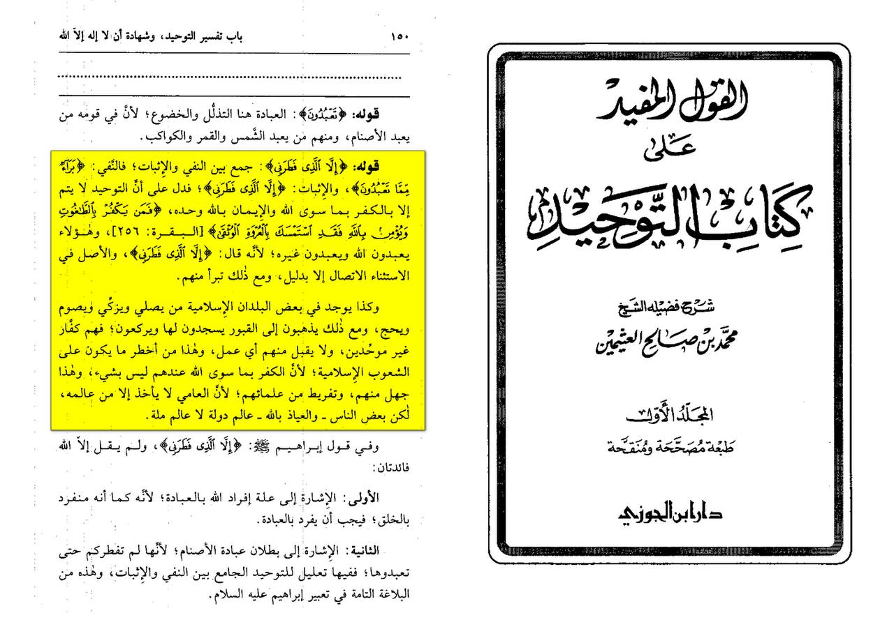

---

<!-- telegram-source: dar/messages2.html#message1562 -->
<!-- evidence-id: 000215 -->

The Claim of Some Affected by the Murjiʾah Notion in Our Time That Prostrating to Something Other Than Allah, Such as Idols, for Worldly Reasons Does Not Constitute Kufr:

It has already been mentioned that there is a consensus among the Salaf that kufr can occur through actions just as it can through belief and speech. Whoever utters words of kufr commits kufr and is judged based on the apparent nature of what he has expressed, even if he claims that he did not intend to choose kufr. The same applies to actions—whoever performs an act of kufr, even if he claims it was for worldly reasons or similar motives, he is still judged accordingly. This is explicitly stated by Allah ﷻ in His Book:

Whoever disbelieves in [i.e., denies] Allāh after his belief except for one who is forced [to renounce his religion] while his heart is secure in faith. But those who [willingly] open their breasts to disbelief, upon them is wrath from Allāh, and for them is a great punishment; That is because they preferred the worldly life over the Hereafter and that Allāh does not guide the disbelieving people.

(An-Naḥl 106–107)

This serves as a refutation of certain self-proclaimed intellectuals who differentiate between prostrating to an idol and prostrating toward it. They claim that prostrating to an idol is unequivocal kufr that expels one from Islam, while prostrating toward it—meaning before it but not directed to it—is not kufr, in their view. They consider prostration before idols to be a matter requiring further clarification before judgment.

The origin of this statement lies in the doctrine of the Murjiʾah, who assert that there is no disbelief (kufr) except through belief. What led them to make this distinction is that prostration to an idol necessarily involves deliberate intent, purpose, and knowledge, thus they made the ruling of disbelief dependent on what is in the heart, i.e., the intent to disbelieve with knowledge and choice. As for prostration to it or in front of it, they argue that this could involve ignorance or lack of choice.

This is an innovated ideology and a heretical Irjaʾ, and if we were to accept it, we would not consider many clear acts of disbelief as kufr, under the pretense that they are open to interpretation.

Anyone who prostrates to an idol or before an idol without coercion is judged based on the outward appearance of his action, in accordance with the texts of the Qurʾān, the Sunnah, and the consensus of the scholars.

Such principles, which come from those influenced by the misconception of Irjaʾ in our time, are used to deceive Muslims, to undermine the creed of Ahl al-Sunnah, and to trivialize the causes of apostasy. These are among the most dangerous things in destroying the creed of the Salaf and destabilizing the beliefs and practices of Muslims.

The Shaykh Muhammad ibn Ṣāliḥ al-‘Uthaymīn, may Allah have mercy on him, said (in Sharḥ al-Arbaʿīn al-Nawawīyah p. 142-143):

“Then we say, what is the measure of disbelief? For some may view this as disbelief while others do not. Therefore, the Prophet ﷺ specified this by saying: ‘A clear disbelief, with no ambiguity, such as when you see him prostrating to an idol, or hear him curse Allah or His Messenger, or something similar.’

Thus, he, may Allah have mercy on him, explicitly stated that prostration to an idol is major disbelief (kufr akbar) and also included cursing Allah and His Messenger.

He رحمه الله , said: “Some students of knowledge today are confused and say: ’If you see someone who does not pray, do not declare him a disbeliever personally. How can we not declare him a disbeliever?!” They also say: ‘If you see someone prostrating to an idol, do not declare him a disbeliever personally, because perhaps his heart is at peace with faith!’ It is said: This is a great mistake. We judge by the apparent actions. If we find someone not praying, we say: This person is a disbeliever, openly and clearly.

Show attached source scan

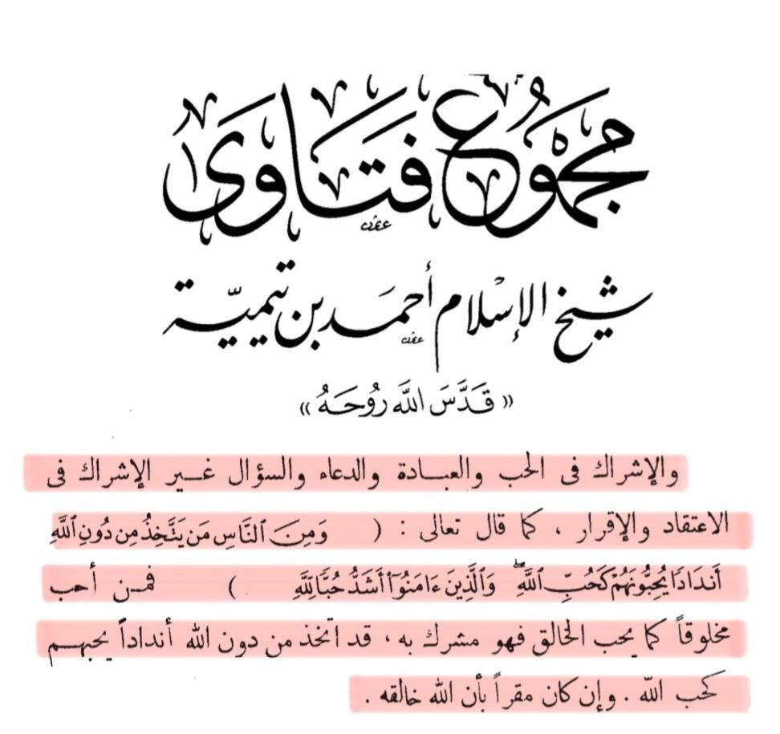

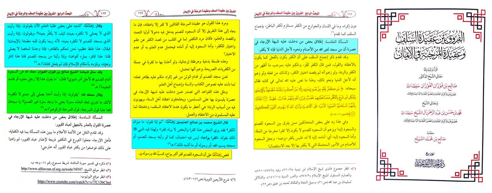

---

<!-- telegram-source: dar/messages4.html#message3934 -->
<!-- evidence-id: 000216 -->

Shaykh Ibn ʿUthaymīn was asked: Is it permissible to declare a specific individual (muʿayyan) a disbeliever if he commits an act of kufr?

He replied:

If the conditions of takfīr are fulfilled in his case, then it is permissible to apply kufr to him specifically. If we did not allow for that, the description of apostasy (riddah) would not apply to anyone. Such a person is treated in this world as a murtadd — this applies to worldly rulings.

As for the rulings of the Hereafter, they are stated in general terms, not specifically. This is why Ahl al-Sunnah say: We do not testify that anyone is in Paradise or in Hellfire except those about whom the Prophet ﷺ testified specifically.

[Majmūʿ Fatāwā wa-Rasāʾil Faḍīlat al-Shaykh Muḥammad ibn Ṣāliḥ al-ʿUthaymīn 2/125]

Show attached source scan

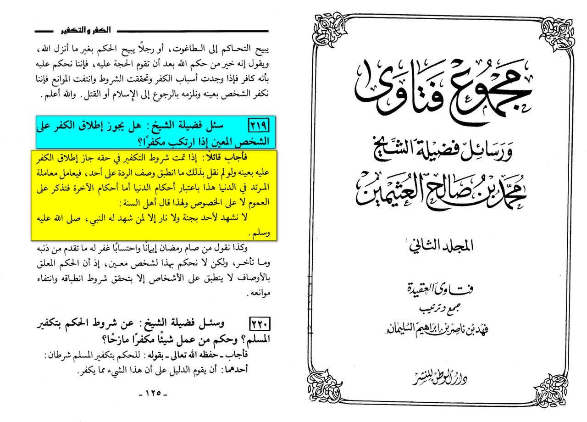

---

<!-- telegram-source: dar/messages3.html#message3183 -->
<!-- evidence-id: 000217 -->

Shaykh Ibn ʿUthaymīn was asked:

Fatwa No. 376 – Ruling on an Imam Who Calls to Seeking Help from the Dead

Question: The questioner says: In our village, there is a mosque imām who calls people to seek help from other than Allah—from the dead—and believes this practice brings people closer to Allah. What is Islam’s ruling regarding this man? And what is the ruling on praying behind him?

Answer: This man who calls to istighāthah from other than Allah is a mushrik, a caller to shirk, and it is not valid for him to serve as an imām for the Muslims. Prayer behind him is invalid. He must repent to Allah – Exalted is He – before death overtakes him.

Istighāthah is only permissible with Allah alone. It may only be directed to a living person who is capable of saving the one calling for help from harm, such as in the verse: “So the one from his faction called for help against the one from his enemy.” (Al-Qaṣaṣ: 15) As for seeking help from the dead, this is shirk akbar that removes one from the fold of Islam.

And from this platform, I call upon this man to repent to Allah – Exalted is He – and to realize that istighāthah from the dead does not bring one closer to Allah. Rather, it distances a person from Him. Whoever seeks help from the dead falls under the ruling in the verse: “Indeed, whoever associates others with Allah – Allah has forbidden Paradise for him, and his abode is the Fire. And the wrongdoers will have no helpers.” (Al-Mā’idah: 72)

[Fatāwā Nūr ʿalā al-Darb by Shaykh Muḥammad ibn Ṣāliḥ al-ʿUthaymīn 1/444-445]

Show attached source scan

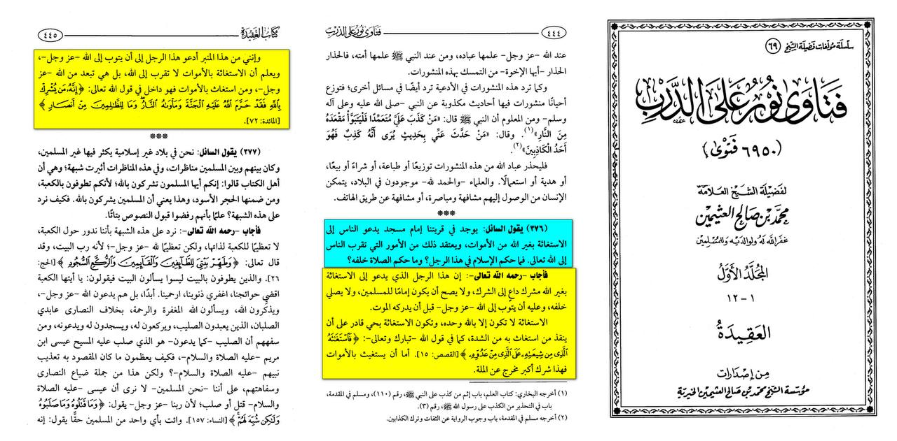

---

<!-- telegram-source: dar/messages2.html#message1102 -->
<!-- evidence-id: 000218 -->

Sheikh Ibn Uthaymeen رحمه الله on Udhr bil Jahl

<video class="source-video" controls preload="metadata" src="assets/videos/dar-messages2-1102.mp4"></video>

Video source from the Telegram export.

---

<!-- telegram-source: dar/messages5.html#message4377 -->
<!-- evidence-id: 000219 -->

Shaykh Muqbil was asked:

Q: Is everyone who falls into major shirk while not knowing, or while being a mutaʾawwil (one acting based on interpretation), considered a mushrik who has exited the religion?

A: Shirk itself differs. The one who prostrates to an idol is considered a mushrik, committing Shirk al-Akbar, and this is up to Allah: if he was ignorant, then if Allah wills He excuses him, and if He wills He punishes him.

And we also say excuse due to ignorance (al-ʿudhr bil-jahl), but we judge him according to the outward of his action (i.e we call him a mushrik). And if the action was Shirk al-Akbar, such as vowing to other than Allah and slaughtering for other than Allah while he does not know, then we hope that Allah forgives him and excuses him due to his ignorance.

Source: [Official Muqbil ibn Hādī al-Wādiʿī fatwa](https://www.muqbel.net/fatwa.php?fatwa_id=3751).

---

<!-- telegram-source: dar/messages5.html#message4236 -->
<!-- evidence-id: 000220 -->

Shaykh Zayd al-Madkhalī said:

In reality what is obligatory is precaution and serious effort so that the person does not fall into shirk al-aṣghar; because shirk al-akbar is clear: the directing of an ʿibādah to other than Allāh. But shirk al-aṣghar has forms; outward actions and inward actions, and the people are lenient regarding it.

So the Muslim person gives importance to protecting themselves from it, and the protection is attained by the bounty of Allāh and His aid, then by studying the types of Tawḥīd in a detailed manner, and by studying the types of Shirk in a detailed manner, so that he does not fall into a type from the types of shirk al-aṣghar while he does not know; otherwise he would be one who has fallen short in knowledge which Allāh made obligatory, and He made it individual obligation upon every mukallaf (morally responsible person).

So the mushrik is not excused in his shirk; for those who are excused are the common folk of the people in the fine details of subsidiary issues and rulings, but they are not excused in Tawḥīd and Shirk.

For this, look to Aṣḥāb al-Fatarāt (the people of didn’t receive the message) who were before the sending of the Prophet ﷺ; when they were upon shirk, Allāh did not excuse them; rather He tests them on Yawm al-Qiyāmah; so the obedient one is saved and the disobedient one perishes.

[Fatḥ wat-Tasdīd fī Sharḥ Kitāb at-Tawḥīd by Shaykh Zayd al-Madkhalī p.70]

Show attached source scan

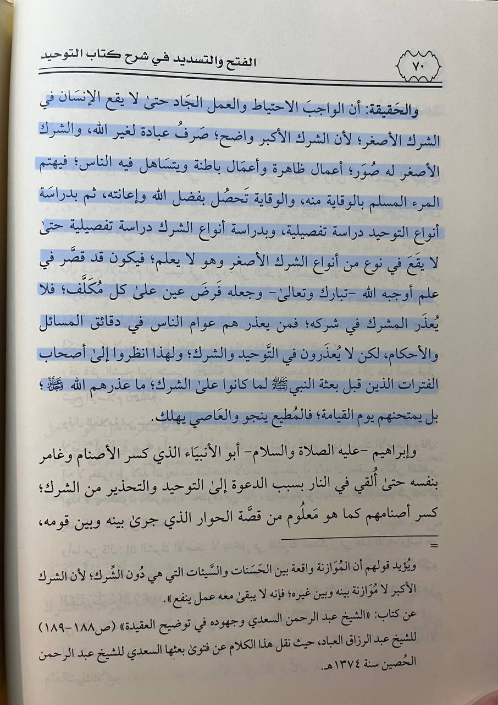

---

<!-- telegram-source: dar/messages5.html#message4288 -->
<!-- evidence-id: 000221 -->

Shaykh Ṣāliḥ al-Luḥaidān said:

Q: Some people among us say: Whoever commits shirk al-akbar—such as making duʿāʾ to other than Allāh, or sacrificing and vowing to other than Allāh—is still considered a Muslim as long as he did that out of ignorance. Is this statement correct?

A: No, this is not correct. Did Allāh—glorified and exalted—excuse those who died upon shirk al-akbar on the basis that they were ignorant and that no messenger had previously come to them calling them? Can it be said that such a person is excused?

No. shirk al-akbar —there is no excuse for anyone in it. Either he repents, and repentance—praise be to Allāh—is accepted. Even if he committed shirk extensively and for a long time, then repented sincerely, Allāh would erase all of his shirk.

Show attached source scan

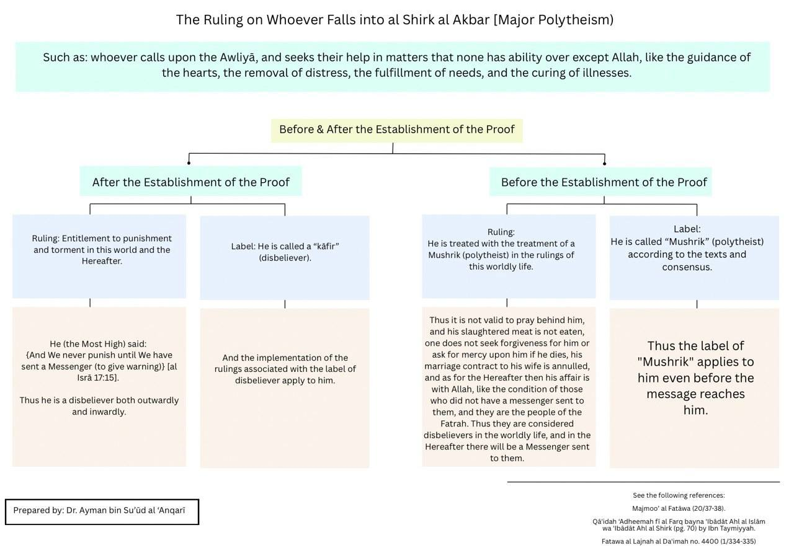

---

<!-- telegram-source: personal/messages.html#message623 -->
<!-- evidence-id: 000222 -->

The Permanent Committee for Scholarly Research and Iftāʾ was asked:

Fatwa No. 17626

Question: What is the ruling on takfīr al-muʿayyan (declaring a specific individual to be a disbeliever)?

Answer: Whoever does an act, makes a statement, or holds a belief that necessitates kufr, is judged to be a kāfir and is to be treated as such — whether he is a specific individual or not — due to the generality of the evidences. For example, whoever supplicates to other than Allah, or slaughters for other than Allah, or utters words of kufr, such as insulting Allah or His Messenger, or mocking any aspect of the religion — then he is judged to be a kāfir and is to be asked to repent. If he repents, all is well; but if he does not, then it becomes obligatory upon the Muslim ruler to execute him as an apostate.

And with Allah is success. May peace and blessings be upon our Prophet Muḥammad, his family, and his companions.

The Permanent Committee for Scholarly Research and Fatwa

President: ʿAbd al-ʿAzīz ibn ʿAbd Allāh ibn Bāz

Member: Ṣāliḥ al-Fawzān

Member: ʿAbd al-ʿAzīz Āl ash-Shaykh

Member: Bakr Abū Zayd

They were also asked:

Fatwa No. 17749

Question:

We, a group of students, have disagreed regarding the matter of establishing the ḥujjah (proof) upon the one who opposes the truth in matters of uṣūl ad-dīn (fundamentals of the religion). Some of us said that every ignorant person is excused due to ignorance in all matters, making no distinction between uṣūl (fundamentals) and furūʿ (branches), between the apparent and the hidden. Another group said that a person is excused by ignorance only in hidden matters, but not in the fundamentals — since there is no excuse for the one who commits shirk with Allah, Exalted is He, and worships others such as graves, stones, or trees.

They argued that no Muslim can be unaware of this, and that if one commits such acts, he is not a Muslim. However, in the hidden matters, ignorance is excused until the ḥujjah is established. What is the truth and correct opinion in this issue? Please give us a ruling, may Allah reward you.

Answer: The correct view is that no one is excused for ignorance regarding the uṣūl and principles (qawāʿid) of Islam — among those to whom the Qur’an has reached and to whom the Messenger ﷺ was sent — due to the statement of Allah, the Mighty and Majestic: “And this Qur’an has been revealed to me that I may warn you with it, and whomever it reaches.” [Surat al-Anʿām: 19] And His statement, Exalted is He: “This is a message for mankind so that they may be warned by it.” [Surat Ibrāhīm: 52] — and other verses with similar meaning.

As for masāʾil farʿiyyah (subsidiary issues) whose rulings may be obscure, one is excused in such matters due to ignorance until the ḥujjah is established upon him, as many aḥādīth have been reported in this regard. And with Allah is all success. May peace and blessings be upon our Prophet Muḥammad, and upon his family and companions.

The Permanent Committee for Scholarly Research and Fatwa

President: ʿAbd al-ʿAzīz ibn ʿAbd Allāh ibn Bāz

Member: Ṣāliḥ al-Fawzān

Member: ʿAbd al-ʿAzīz Āl ash-Shaykh

Member: Bakr Abū Zayd

[Fatāwā Al-Lajnah Al-Dāʾimah 1/418-419]

Show attached source scan

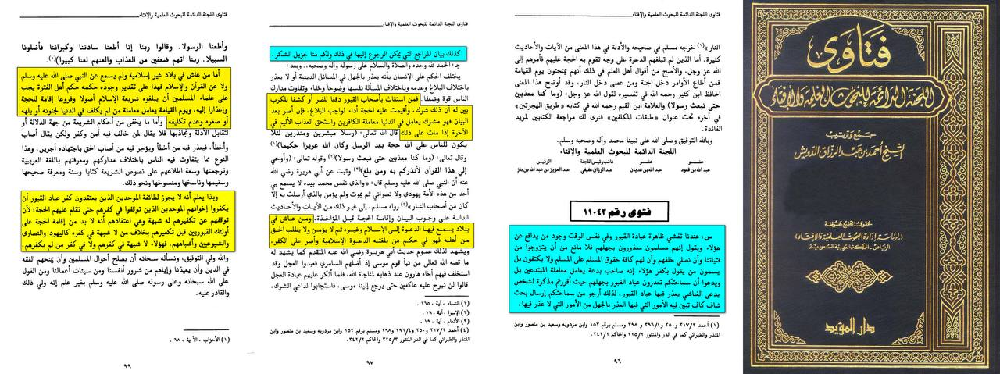

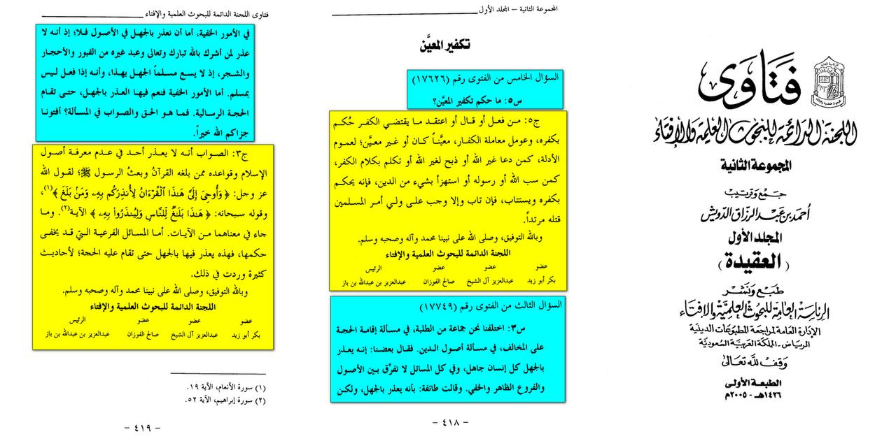

---

<!-- telegram-source: dar/messages3.html#message2722 -->
<!-- evidence-id: 000223 -->

Question 2 from Fatwā No. 4400:

Q: There are those who claim: Anyone who adheres to the message of Muḥammad ﷺ and prays facing the Qiblah, even if he prostrates to his shaykh, is not to be declared a disbeliever nor called a mushrik. Some even say that Muḥammad ibn ʿAbd al-Wahhāb erred when he spoke about the eternity of the polytheists in Hell if they do not repent. They claim the polytheists in this ummah will be punished but will eventually enter Paradise, and that none from the ummah of Muḥammad will remain in Hell forever.

A: Everyone who believes in the message of our Prophet Muḥammad (ﷺ) and all that he brought in the Sharīʿah — if he then prostrates to other than Allāh, whether to a saint, a grave occupant, or a ṭarīqah shaykh — is considered a disbeliever, an apostate from Islam, and a mushrik who has associated others with Allāh in worship. This is the case even if he pronounces the two shahādahs at the time of his prostration, because his act contradicts his declaration.

However, he may be excused due to ignorance, so no punishment is enacted upon him until he is informed and the ḥujjah (proof) is established against him. He is to be given three days’ respite as a warning, in the hope that he repents. If he persists in prostrating to other than Allāh after clarification, he is to be executed for apostasy, as the Prophet ﷺ said: “Whoever changes his religion, kill him.” [Reported by al-Bukhārī from Ibn ʿAbbās رضي الله عنهما]

This clarification and establishment of the proof is to remove the excuse before punishment — not in order to call him a disbeliever only after the proof. He is already called a disbeliever because of what he has done — such as prostrating to other than Allāh, or making a vow, or sacrificing an animal for other than Allāh — and the Qur’ān and Sunnah have shown that whoever dies upon shirk will not be forgiven and will abide eternally in Hell, as Allāh says: “Indeed, Allāh does not forgive association with Him, but He forgives what is less than that for whom He wills.” [Sūrat al-Nisāʾ: 48]

And He says: “It is not for the polytheists to maintain the mosques of Allāh while bearing witness against themselves of disbelief. For such their deeds are worthless, and in the Fire they shall abide forever.” [Sūrat al-Tawbah: 17] And Allāh is the source of success. May peace and blessings be upon our Prophet Muḥammad, his family, and companions.

The Permanent Committee for Scholarly Research and Iftāʾ

ʿAbd Allāh ibn Qaʿūd – Member

ʿAbd al-Razzāq ʿAfīfī – Deputy Head

ʿAbd al-ʿAzīz ibn ʿAbd Allāh ibn Bāz – Chairman

[Fatāwā al-Lajnah al-Dāʾimah – al-Majmūʿah al-ʾŪlā 1/334-335]

Show attached source scan

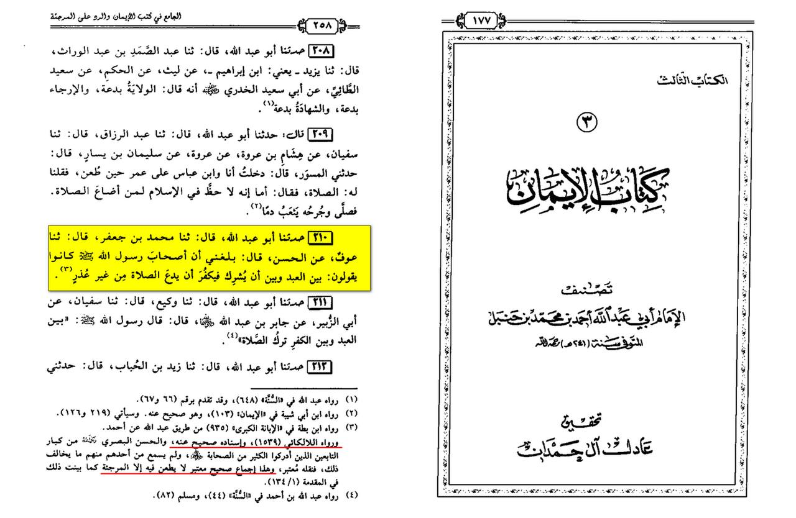

---

<!-- telegram-source: personal/messages.html#message630 -->
<!-- evidence-id: 000224 -->

The Permanent Committee for Schoarly Research and Iftāʾ (al-Lajnah ad-Dāʿimah) of Saudi Arabia stated:

"The information and establishment of the Ḥujjah (Iqāmat al-Ḥujjah) are just to excuse him before the punishment is applied, not to label him a Kāfir only after clarifying the matter to him. For indeed, he is called a Kāfir once he makes Sujūd, vows or give offerings to anyone other than Allāh."

- Shaykh ʿAbd al-ʿAzīz ibn ʿAbdullāh ibn Bāz.

- Shaykh ʿAbd ar-Razzāq al-ʿAfīfī.

- Shaykh ʿAbdullāh ibn Qaʿud

Show attached source scan

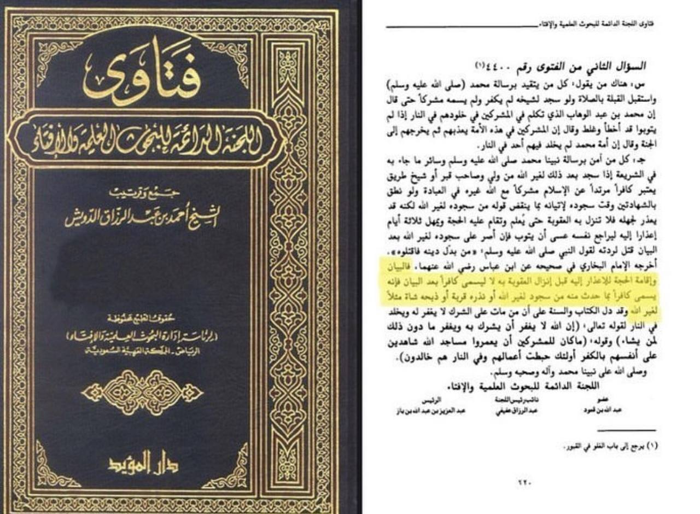

---

<!-- telegram-source: dar/messages3.html#message3020 -->
<!-- evidence-id: 000225 -->

The Permanent Committee for Scholarly Research and Iftāʾ was asked:

Question What is the ruling on meat sold in markets in countries where the people are not free from shirk, despite claiming to be Muslims, due to the prevalence of ignorance and bidʿah-based paths like the Tijāniyyah?

Answer : If the matter is as described in the question — that the slaughterer claims Islam, yet is known to be from a group that permits seeking help from other than Allah in matters that none can resolve except Allah, and they seek aid from the dead such as Prophets or those they believe to be awliyāʾ — then his slaughtered meat is like the meat of the mushrikūn who worshipped al-Lāt, al-ʿUzzā, Manāt, Wadd, Suwaʿ, Yaghūth, Yaʿūq, and Nasr. It is ḥarām for a true Muslim to eat such meat; it is considered maytah (carrion).

In fact, his condition is more severe than theirs because he has apostatized from the Islam he claims, due to his resorting to other than Allah in matters that only Allah can fulfill — such as guiding the lost, healing the sick, and other matters related to what is beyond normal causes, attributing these to the “mysteries” or “blessings” of the dead or to those absent who are treated like the dead.

These ignorant ones call upon them believing that they possess barakah (blessing) and certain attributes that enable them to hear the supplication of one who seeks their help — even if the caller is in the farthest East and the one being called upon is in the farthest West. Those from Ahl al-Sunnah living in such lands must advise them and guide them to pure tawḥīd. If they respond positively, then al-ḥamdu lillāh. But if they refuse after the truth has been made clear, then they have no excuse.

The Permanent Committee for Scholarly Research and Fatwā

President: ʿAbd al-ʿAzīz ibn ʿAbd Allāh ibn Bāz

Vice President: ʿAbd al-Razzāq ʿAfīfī

Member: ʿAbd Allāh ibn Quʿūd

Member: ʿAbd Allāh ibn Ghadayyān

[Fatāwā Al-Lajnah Al-Dāʾimah 22/431-432]

Show attached source scan

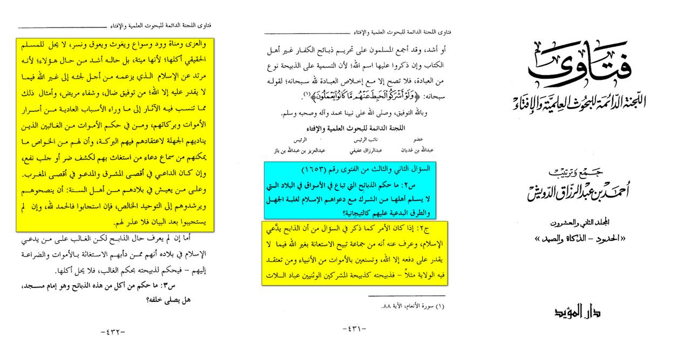

---

<!-- telegram-source: dar/messages2.html#message1923 -->
<!-- evidence-id: 000226 -->

Shaykh Ṣāliḥ al-Fawzān was asked:

Q: Tell us about the virtue of monotheism (Tawḥīd). If someone unknowingly engages in major shirk throughout their life and dies upon it, are they excused due to ignorance? What is the criterion for ignorance that warrants an excuse?

A: The virtue of Tawḥīd is immense, as it removes a person from disbelief and shirk to the worship of Allāh alone. A Muslim who upholds Tawḥīd lives in the light of Allāh’s guidance, and every good deed they perform is rewarded. However, for a mushrik, no good deed is accepted or beneficial as long as they remain in shirk. This highlights the great virtue of Tawḥīd: it saves a person from Hell and grants them entry into Paradise on the Day of Judgment. In contrast, a mushrik is condemned to Hell, as Allāh says:

“Indeed, whoever associates others with Allāh, Allāh has forbidden him Paradise, and his abode will be the Fire. And the wrongdoers will have no helpers.” (Sūrat al-Mā’idah: 72)

After the Prophet ﷺ was sent, the Qur’ān was revealed, and the Sunnah was preserved, alongside the presence of scholars and widespread knowledge, ignorance has been eliminated—Alḥamdu lillāh. Anyone living among Muslims, reading the Qur’ān, listening to aḥādīth, sermons, lessons, and lectures cannot claim ignorance about shirk. Shirk is a manifest and clear matter that Allāh has strongly warned against.

Someone who lives among Muslims, hears the Qur’ān and the aḥādīth, listens to religious programs, and has access to Islamic knowledge has received the message, and the proof has been established against them. They are not excused for remaining ignorant or persisting in shirk regarding such an evident and fundamental issue.

However, a person who has lived entirely isolated from Muslims, never heard the Qur’ān, and had no access to Islamic knowledge—such a person may be excused due to ignorance, similar to those classified as Ahl al-Fatrah (people who lived in a time or place where the message did not reach them). Their fate is left to Allāh.

Nonetheless, such cases are extremely rare today, especially with the advancements in media and communication, which have spread Islam to the farthest corners of the world. Today, everyone has access to religious teachings. This is part of Allāh’s wisdom in establishing proof against His servants. In the past, Islam spread through daʿwah and jihād, but as these efforts declined, media became a means through which the message of Islam reached people everywhere.

Now, no one can claim ignorance about shirk, Tawḥīd, Paradise, or Hell. No one is unaware that zinā is forbidden, that shirk is prohibited, that ribā (usury) is ḥarām, that alcohol and intoxicants are forbidden, and that killing innocent lives is impermissible. These are clear and universally known prohibitions.

Thus, a person cannot claim ignorance about them. How long will they remain ignorant? They have every opportunity to ask, learn, and remove their ignorance. If they neglect this duty, they are to blame for their own shortcomings.

Source: [Official Ṣāliḥ al-Fawzān fatwa](https://www.alfawzan.af.org.sa/ar/node/13595).

---

<!-- telegram-source: dar/messages3.html#message3100 -->
<!-- evidence-id: 000227 -->

Shaykh Ṣāliḥ al-Fawzān was asked:

Among the questions that have reached us is what the questioner asks: “If someone commits al-shirk al-akbar out of ignorance, and he did that throughout his life and died upon it — is he excused due to ignorance? And what are the conditions for the excuse of ignorance?”

Answer: If he lived cut off from the Muslims, not hearing the Qur’an, nor anything about al-Islām, nor about al-shirk, then this remains his ruling until he dies: he is treated like Aṣḥāb al-Fatrah — those to whom the Qur’an did not reach, nor the call of the Messenger ﷺ. He is thus considered one of Aṣḥāb al-Fatrah.

The scholars have differed about their ruling, but the closest view — and Allah knows best — is that a prophet will be sent to them on Yawm al-Qiyāmah; whoever obeys him will enter al-Jannah, and whoever disobeys him will enter the fire. As for their ruling in this worldly life: if they died upon kufr disbelief and shirk, then they are to be treated as kuffār and mushrikūn — this is their worldly ruling. Their ruling in the Hereafter is left to Allāh ʿazza wa-jall.

But whoever lives among the Muslims, hears the Qur’an, listens to the aḥādīth, attends lectures and lessons — especially with the emergence of Qur’an radio stations and similar means — then the ḥujjah (proof) has been established upon him, and he is not excused due to ignorance.

Because Allāh jalla wa-ʿalā said to the Messenger ﷺ: “And this Qur’an has been revealed to me so that I may warn you with it and whomever it reaches.” (al-Anʿām: 19)

That is, whoever the Qur’an reaches, and he understands the Arabic language in which it was revealed — then the proof has been established against him, and he has no excuse, nor is he considered ignorant. The Qur’an is in Arabic, and it forbids shirk, forbids kufr, and warns that the mushrikūn will remain in the fire, and that they will not be forgiven.

So how could someone not know what shirk is, or not ask about it, or not investigate this immense danger? He is the one who is negligent — and thus, he is not excused by ignorance in al-umūr al-ẓāhirah (clear and apparent matters). As for al-umūr al-khafiyyah (subtle matters) that are only known to the scholars, if someone falls into one of these, he may be excused due to ignorance — until he asks the people of 'ilm.

Fatawa Date:  24 Jul 2024

<video class="source-video" controls preload="metadata" src="assets/videos/dar-messages3-3100.mp4"></video>

Video source from the Telegram export.

---

<!-- telegram-source: dar/messages3.html#message2941 -->
<!-- evidence-id: 000228 -->

Shaykh Ṣāliḥ al-Fawzān was asked:

Caller: We have in Miṣr (Egypt) a person named Hishām al-Bī’alī. He claims that the doer of al-shirk al-akbar (major shirk) — as long as he is ignorant — then he is a Muslim, and he excuses grave worshippers due to ignorance.

The Shaykh responded: he lives among the Muslims?

Caller: He lives among the Muslims.

The Shaykh Responded: That’s it — if he lives among the Muslims, he is not excused due to ignorance, because he has seen the Muslims — and he has seen and heard the Qurʾān. He is not excused due to ignorance

the one who is excused due to ignorance is the one whom nothing has reached.

The caller asks: is he called a Muslim,

Shaykh?

The shaykh Responded:  No — he is not called a Muslim.

<video class="source-video" controls preload="metadata" src="assets/videos/dar-messages3-2941.mp4"></video>

Video source from the Telegram export.

---

<!-- telegram-source: personal/messages.html#message916 -->
<!-- evidence-id: 000229 -->

Shaykh Ṣāliḥ al-Fawzān was asked:

Q: When do we concern ourselves with the establishment of the ḥujjah upon a Muslim who falls into some acts of shirk? And do we say: ‘He is not declared a kāfir until the ḥujjah is established upon him’?

A: Firstly: calling him a Muslim while shirk occurs from him is incorrect. The one from whom shirk al-akbar occurs is not called a Muslim. We say: he is a mushrik. As for if the shirk is shirk aṣghar, such as swearing by other than Allah, or saying: ‘Were it not for Allah and you,’ and similar expressions of minor shirk, then this person is a Muslim.

But the one from whom major shirk occur, we do not say he is a Muslim. We say: he is a mushrik. And he is not excused due to ignorance if he lives among the Muslims, hears the Qurʾān, hears the aḥādīth, hears the speech of the people of knowledge, yet does not accept that and continues upon what he is upon. This person has no proof and no excuse. The ḥujjah has been established upon him.

Yes, and shirk is from the outwardly apparent matters; it is not from the hidden matters. Shirk is from the outwardly apparent matters: making duʿāʾ to other than Allah, sacrificing to other than Allah, making vows to other than Allah,  these are apparent matters, not hidden ones.

Show attached source scan

---

<!-- telegram-source: personal/messages.html#message619 -->
<!-- evidence-id: 000230 -->

Shaykh Ṣāliḥ al-Fawzān was asked:

Question: May Allāh reward you with goodness. This questioner says: “O teacher of Tawḥīd, I ask you by Allāh to clarify for us the matter of al-ʿudhr bil-jahl?”

Answer: My brother, we have already explained this matter. Do you not understand? complaint is to Allāh.

We say: the one who is excused by ignorance is the one who has never heard anything of Islām, in a secluded place—he has not heard the Qurʾān, he has not heard the ḥadīth, the daʿwah has not reached him.

But a person who lives among Muslims, in the lands of the Muslims, hearing the adhān at every time, and seeing people pray to his right and left—can it be said that such a one is excused by ignorance? This is the one who is ignorant of himself; he does not want knowledge, he does not want the truth. Such a one is not excused. Yes.

Follow-up Question: If a person grew up in the desert, or is new to Islām—recently entered—would he be excused by ignorance if he supplicates other than Allāh while being affiliated with Islām?

Answer: The one who supplicates other than Allāh we judge him as a kāfir and treat him like the kuffār. As for if he is as described—that nothing has reached him—then his affair is with Allāh. But we, outwardly, judge him by the religion he is upon: kufr, shirk, worship of graves. If he has an excuse with Allāh, that is between him and Allāh. He would be among aṣḥāb al-fatrah (those who lived in a period where the message did not reach them). Yes.

But today, as you know, nothing is hidden. Media is widespread. The Qurʾān is heard everywhere in the world now. The Sunnah is heard, the duʿāt are speaking. Islām is widespread—there is hardly a country on earth that Islām has not entered, is there or not? There is no country without masājid, no country without Islamic centers, no country without Muslim minorities. Islām is widespread now, and its rituals are practiced even in the lands of disbelief. The proof has been established, and to Allāh belongs all praise. Yes.

Show attached source scan

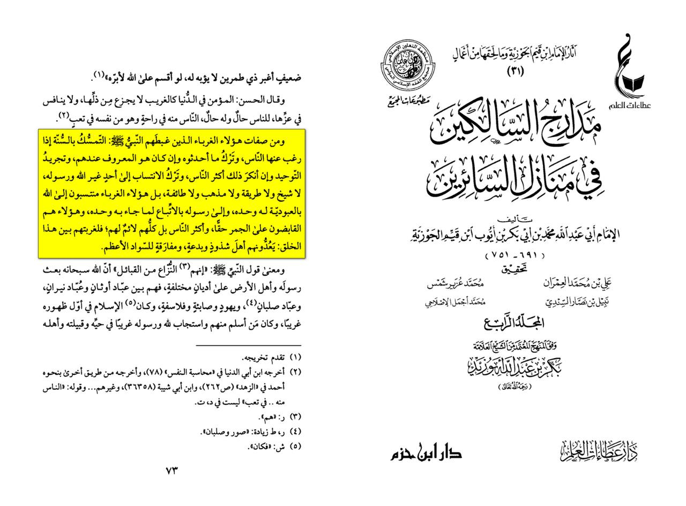

---

<!-- telegram-source: dar/messages3.html#message2696 -->
<!-- evidence-id: 000231 -->

Shaykh Ṣāliḥ al-Fawzān Was asked:

This questioner says: “Whoever slaughters for graves has committed shirk — is he excused due to ignorance in this world and still called a Muslim, not a mushrik?”

A: How can someone who commits shirk be called a Muslim in this world? Whoever slaughters to other than Allah is a mushrik, not a muslim. What ignorance are you talking about — where is he living? On Mars? Or is he living among the Muslims, hearing the Qur’ān, hearing the speech of the scholars? He is not excused due to ignorance.

But he imitates the qubūriyyīn (grave worshippers), follows them, never asked questions, never listened to those who warned against it. He says, “These are Wahhābīs,” or “These people are extreme.” Ignorance is always being used as an excuse — enough of that.

May Allah reward you, noble Shaykh. Another questioner says:  “Some people today refuse to declare takfīr upon those who prostrate to other than Allah, or slaughter to other than Allah. Their excuse is that such people must first be asked why they did it.”

A: Based on the apparent act, whoever prostrates to other than Allah — we judge him a kāfir based on what is apparent. What’s in the heart, only Allah knows. We have not been tasked with inspecting people’s hearts. We judge based on apparent acts: whoever commits shirk, we judge him as a mushrik; whoever commits kufr, we judge him as a kāfir. Yes.

This group — the Murji’ah — has now appeared again. They are the ones saying such things.

<video class="source-video" controls preload="metadata" src="assets/videos/dar-messages3-2696.mp4"></video>

Video source from the Telegram export.

---

<!-- telegram-source: personal/messages.html#message659 -->
<!-- evidence-id: 000232 -->

Shaykh Ṣāliḥ al-Fawzān said:

His statement, may Allah have mercy on him: “that he was not excused due to ignorance,” meaning: “for if you were to die while wearing it, you would never succeed,” even though he wore it out of ignorance at the time he put it on.

The Murji’ah say now that people are excused due to ignorance, while the Qur’an is being recited to them, and it contains the prohibition of shirk, the warning against it, and eternal punishment in the Fire. How can there be ignorance? Until when?!

[Sharḥ Fatḥ al-Majīd by Shaykh Ṣāliḥ al-Fawzān 2/22]

Show attached source scan

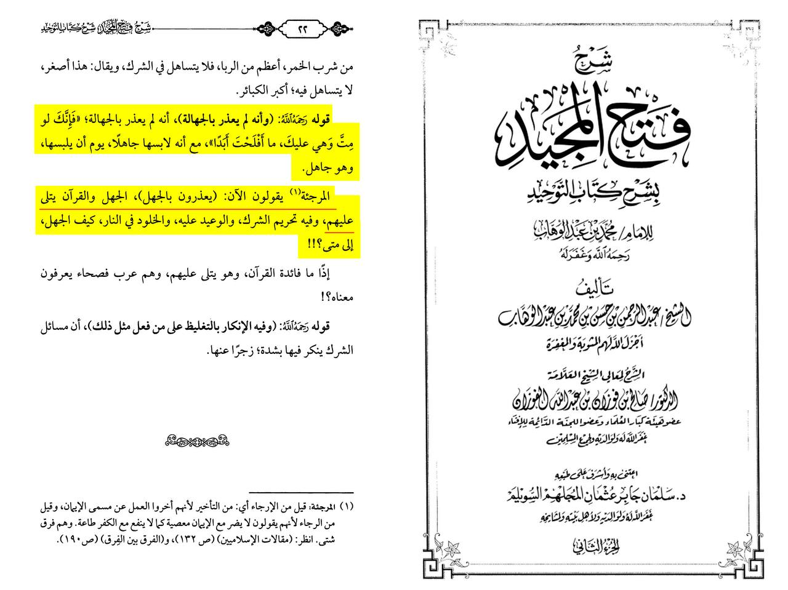

---

<!-- telegram-source: personal/messages.html#message503 -->
<!-- evidence-id: 000233 -->

Shaykh Ṣāliḥ al-Fawzān says it is an ijmāʿ that the one who commits shirk, even if he is new to Islam, is not a Muslim, they are to be treated as Ahl al-Fatrah

Shaykh Ṣāliḥ al-Fawzān was asked:

Questioner: As-salāmu ʿalaykum wa-raḥmatullāhi wa-barakātuh. Allāh protect you and bless you. How are you, Shaykh Ṣāliḥ?

The Shaykh said: Fine.

Questioner: may Allāh honor you. Shaykh, our question: We — al-ḥamdu lillāh — spread the statements of the Committee, Shaykh Ibn Bāz, and other scholars, that the mushrik who claims Islam is not called a Muslim, even if the ḥujjah has not been established against him, and even if he is new to Islam. If he commits shirk, we judge him by what outwardly appears from him, which is shirk. If he dies, he is not prayed over, and mercy is not asked for him. As for his excuse of ignorance of being new to Islam or has not had the proof established on him, This is for the Hereafter, but in this world he is treated like ahl al-Fatrah. But we have found — Shaykh — that the contemporary Murjiʾah claim this is a matter of disagreement.

The Shaykh said: Leave them and leave the Murjiʾah. Do not pay attention to them, they seek attention, do not pay attention to their statements.

Questioner: but Shaykh, they are tricking the youth under the guise that this is from the Manhaj of Salafiyyah and they are salafi's

The Shaykh said: They cannot deceive the well-grounded youth in his belief. They can only trick one who isn't Firm.

Questioner: So is this an issue of ijmāʿ, where a person would Not be considered a Muslim even if they were a recent convert to Islam but died committing shirk?

The Shaykh said: There is no disagreement.

Last question, Shaykh: These people use a dangerous method — they exploit scholars’ recommendations and also their slips.

The Shaykh said: Leave them; their sin is upon them.

<video class="source-video" controls preload="metadata" src="assets/videos/personal-503.mp4"></video>

Video source from the Telegram export.

---

<!-- telegram-source: dar/messages4.html#message3223 -->
<!-- evidence-id: 000234 -->

Shaykh Ṣāliḥ al-Fawzān was asked:

Questioner:

May Allah be good to you, noble Shaykh. This questioner says: “Does the one who falls into shirk out of ignorance enter under the statement of Allah, ‘Indeed, Allah does not forgive that partners be associated with Him’?”

Answer: If he is ignorant, and no daʿwah has reached him, and the call of any messenger from among the messengers has not reached him—he is living in isolation from the world—then his matter is with Allah. His matter is with Allah. He is considered from Ahl al-Fatrah, and his matter is with Allah. That is in regard to the Hereafter. As for us, we treat him with the treatment of the mushrikīn—in his funeral, in inheritance—we treat him with the treatment of the mushrikīn. But what is between him and Allah—we do not interfere in that.

Questioner: May Allah grant you success, the questioner says: “If I see a person committing acts of shirk, such as supplicating to the dead or seeking shafāʿah (intercession) from them—how do I treat him? As a Muslim or as a kāfir?”

Shaykh: You treat him as a mushrik. You hear him committing shirk, calling upon other than Allah—do you treat him as a Muslim? No, treat him with the treatment of the mushrik. But call him to Islam. Clarify to him that this is shirk akbar (major shirk), and clarify the danger of shirk. The gate of daʿwah to Allah and sincere advice remains open.

<video class="source-video" controls preload="metadata" src="assets/videos/dar-messages4-3223.mp4"></video>

Video source from the Telegram export.

---

<!-- telegram-source: dar/messages3.html#message2985 -->
<!-- evidence-id: 000235 -->

Shaykh Ṣāliḥ al-Fawzān was asked:

Questioner: Noble Shaykh, may Allāh grant you success. This questioner says: He migrated from a village where ignorance and illiteracy were widespread, and he went to another land where there were scholars. He learned tawḥīd and the Sunnah. Then, when he returned to his village to teach the people, he says: He found that his father had died, and his father had been a mushrik with major shirk with Allāh. But he was illiterate and ignorant, and no one had warned him. His question: Is it permissible for him to inherit from him and to pray over his grave?

Answer: No, he is to be treated like the kuffār, because he died upon apparent disbelief. He is treated as the disbelievers are treated. As for the Hereafter, Allāh knows his true state. If the daʿwah never reached him, then he is considered among ahl al-fatrah, those who will be sent a prophet on the Day of Resurrection who will call them to Allāh — if they respond, they will enter Paradise, and if they disobey, they will enter the Fire. He is considered among ahl al-fatrah if nothing ever reached him.

Yes. But as for us, we treat him as a disbeliever: he is not inherited from, not buried in Muslim graveyards, no supplication is made for him, and no seeking forgiveness is done for him.

Show attached source scan

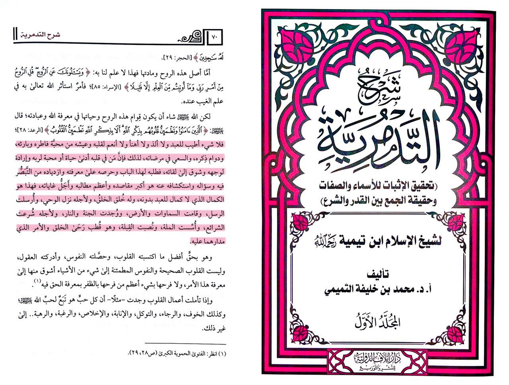

---

<!-- telegram-source: dar/messages5.html#message4290 -->
<!-- evidence-id: 000236 -->

Shaykh al-Fawzān was asked:

Q: Is this statement correct: “Everyone who falls into one of the nullifiers of Islam, we do not judge the specific individual; so we do not say: ‘You are a kāfir,’ rather we judge his action or statement as kufr”?

A: This is the statement of the Murjiʾah. You are repeating to us the speech of the Murjiʾah; this is the speech of the Murjiʾah. Rather, the ruling is applied to him according to what he did or said. We have nothing except the outward. We do not search beyond the outward. Whoever commits kufr, we declare him a kāfir. Whoever commits shirk, we consider him a mushrik. We have nothing except the outward. As for the hearts, none knows what is in them except Allāh, exalted and Most High.

if it happens that a person makes duʿāʾ to other than Allāh and worships graves and shrines, then dies—do you wash him? Do you pray over him while he is a mushrik? Do you bury him in the graveyards of the Muslims while he is a mushrik? You have nothing except the outward. You judge by what is outwardly apparent—unless he was ignorant, not knowing, and one like him is excused by ignorance; then you excuse him due to ignorance (I.e treated as ahl al-fatrah). But to say: “We consider this kufr, but its doer is not a kāfir”—how can he commit kufr and not be a kāfir? How can he utter a word of kufr and not be a kāfir?.

Q: Regarding the specific individual, is it required that the conditions of takfīr be fulfilled and its impediments removed?

A: The specific individual and the non-specific—what concerns us is only the outward, O brothers. We have nothing except the outward. We judge people according to what appears from them. As for the inner realities and the hearts, none knows them except Allāh, exalted and Most High.

<video class="source-video" controls preload="metadata" src="assets/videos/dar-messages5-4290.mp4"></video>

Video source from the Telegram export.

---

<!-- telegram-source: dar/messages5.html#message4886 -->
<!-- evidence-id: 000237 -->

Shaykh al-Fawzān was asked:

Q: What is the ruling on the common people of the Rāfiḍah? Is their ruling the same as their scholars?

A: O brothers, leave this speech. The Rāfiḍah their ruling is one, do not philosophise with us. Their ruling is one. All of them hear the Qurʾān, all of them read; rather most of them memorise the Qurʾān.

The proof has reached them, the proof has been established against them. Leave us from these philosophies and this irjāʾ which has spread now among some youth and those who claim knowledge. Leave this.

Whoever the Qurʾān reaches, the proof has been established against him: {And this Qur’ān was revealed to me that I may warn you thereby and whomever it reaches} [al-Anʿām: 19], until the Day of Resurrection.

<video class="source-video" controls preload="metadata" src="assets/videos/dar-messages5-4886.mp4"></video>

Video source from the Telegram export.

---

<!-- telegram-source: dar/messages3.html#message3133 -->
<!-- evidence-id: 000238 -->

Shaykh Ṣāliḥ al-Fawzān was asked:

The questioner says: “O virtuous Shaykh, may Allah grant you success, a repeated question—among them this: Lately, many say that the worshippers of graves and shrines are not mushrikīn, and that some of them are just ignorant. We hope you will clarify this, may Allah grant you success.”

The Shaykh responded: “How does he know they are ignorant? How does he know about them? How does he excuse them when he doesn’t even know? This kind of talk is guessing the unseen. As for the worshippers of graves—they are mushrikūn, mushrikūn—because they are worshipping other than Allah. And if it is assumed that one of them never knew, the Qur’an didn’t reach him, nothing reached him— he remains upon his jāhiliyyah. Such a person’s case is looked into. But to say, “The worshippers of graves are ignorant and not mushrikīn”— this is incorrect.”

<video class="source-video" controls preload="metadata" src="assets/videos/dar-messages3-3133.mp4"></video>

Video source from the Telegram export.

---

<!-- telegram-source: dar/messages5.html#message4910 -->
<!-- evidence-id: 000239 -->

Shaykh al-Fawzān was asked:

Q: Is the one who slaughters, makes a vow, or directs something from ʿibādah to other than Allāh excused due to his ignorance, or is he not excused for that and it is said: he is a mushrik?

A: Yes, he is a mushrik, he is a mushrik—unless he enters Islām and makes the ʿibādah sincerely for Allāh; otherwise he is a mushrik. Even if he is ignorant, he is a mushrik, even if he is ignorant.

Show attached source scan

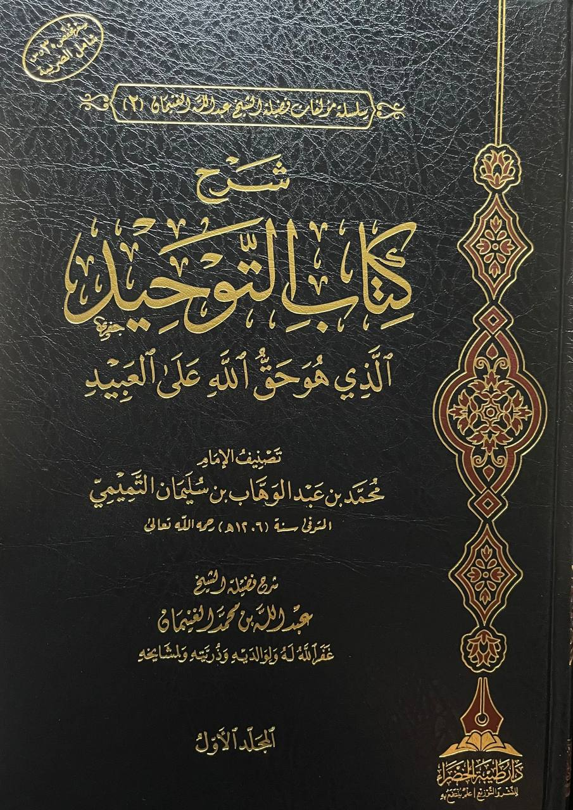

---

<!-- telegram-source: dar/messages5.html#message4365 -->
<!-- evidence-id: 000240 -->

The Murjiʾah in our time are trying to destroy the dawah of Shaykh Muḥammad Ibn ʿAbd al-Wahhāb and want to affirm Islam for the ignorant mushrik who claims to be Muslim! By Shaykh Ṣāliḥ al-Fawzān

The Questioner: Shaykh, is one who tracks the people of misguidance and brings their books to the scholars so they can respond to them considered a mujāhid in the way of Allah?

The Shaykh replied: Yes, he is considered as someone striving in enjoining good and forbidding evil and in spreading beneficial knowledge.

The questioner said: Allāhu Akbar, Shaykh, may Allah bless you. Another question: there is a book available on the internet, Shaykh, The website is called Sahāb al-Salafiyyah (known as Sahab.net ), and the book is titled Al-ʿUdhru bil-Jahl ʿinda Aʾimmat al-Daʿwah (this book is introduced and praised by the leader of the Murjiʾah and Hizbīyūn in our time.)

The author is Rashīd ibn Aḥmad ʿUwaish al-Maghribī, Shaykh, may Allah reward you with goodness.

The Shaykh said: This is the group of Irjāʾ. This is the group of Irjāʾ; we have been afflicted by them from inside and outside, but we ask Allah to protect us from their evil.

The questioner said: May Allah reward you. Shaykh, if you like, may I read a passage to you?

The Shaykh replied: It is well-known, well-known, Shaykh. This is their madhhab. Now it has emerged among us and is spread by people from outside. They say Irjāʾ, and that you are not to declare anyone a disbeliever. If you say that a mushrik is a disbeliever, or that such-and-such is a disbeliever… these are ignorant; they do not declare anyone a disbeliever. This is their intent.

Their aim is to bury this call – the call of Shaykh Muḥammad ibn ʿAbd al-Wahhāb – to make everyone merely a “Muslim,” such that whoever utters the word Islām is considered a Muslim, no matter what they do.

The questioner said: Aʿūdhu billāh, Shaykh, may Allah bless you. If you permit, may we read this text to you?

The Shaykh replied: No need, I know them; I am familiar with their words and know them well.

The questioner said: May Allah grant you Paradise.

The Shaykh concluded: We have been tested with them; may Allah guide them and protect us from their evil.

<video class="source-video" controls preload="metadata" src="assets/videos/dar-messages5-4365.mp4"></video>

Video source from the Telegram export.

---

<!-- telegram-source: dar/messages4.html#message3221 -->
<!-- evidence-id: 000241 -->

Shaykh Ṣāliḥ al-Fawzān was asked:

Noble Shaykh, may Allah grant you success—what is your opinion on the one who says: “The ignorant mushrik is still called a mushrik, but punishment and recompense only happen after the ḥujjah is established”?

Answer: We judge based on the ẓāhir (outward actions). As for what is in the hearts—we do not know that. Only Allah judges what is in the heart. So whoever outwardly displays shirk, we judge him as a mushrik. As for what is in his heart, that is for Allah, the Mighty and Majestic. Will you say about the one who invokes other than Allah that he is a Muslim? Will you give him inheritance? Will you marry him? Will you bury him in the cemeteries of the Muslims while he is calling upon other than Allah? And you say: “I don’t know what’s in his heart”?!

This is not correct. We deal with what is apparent, and the hearts are left to Allah, Glorified and Exalted.

Show attached source scan

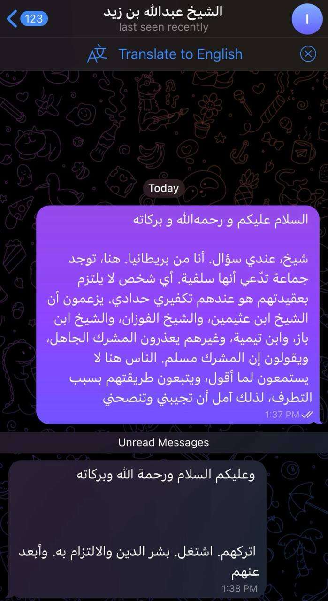

---

<!-- telegram-source: dar/messages4.html#message3735 -->
<!-- evidence-id: 000242 -->

Shaykh Ṣāliḥ al-Fawzān was asked:

Question: I am confused by the narration about those who said, “Make for us Dhāt Anwāṭ,” and that the Prophet ﷺ excused them. What type of ignorance is excusable here?

Answer: They did not actually perform Dhāt Anwāṭ. Had they done so, they would have committed shirk, and ignorance is not an excuse for shirk. But they did not act upon it. They asked the Prophet ﷺ, who forbade them, so they refrained. This is like the people who said to Mūsā in the Qurʾān: “Make for us a god like they have gods” [al-Aʿrāf: 138]. Had they created gods and worshipped other than Allāh, they would have committed shirk—but they did not. Their Prophet forbade them, and they obeyed.

Show attached source scan

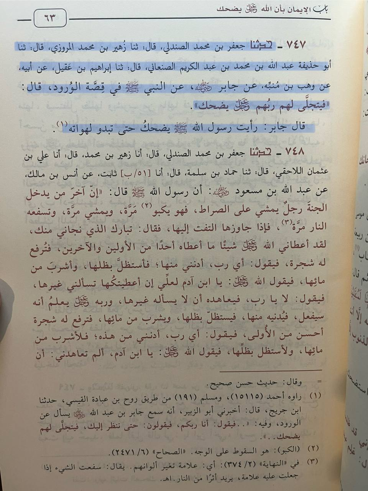

---

<!-- telegram-source: dar/messages3.html#message3181 -->
<!-- evidence-id: 000243 -->

Shaykh Ṣāliḥ al-Fawzān was asked:

Question: Does the one who goes to the graves of the awliyāʾ and the righteous — like the grave of al-Ḥusayn and others — and supplicates to the grave or makes a vow to it, become a disbeliever? And is it necessary to establish the ḥujjah first?

Answer: Is there any doubt that this is kufr? Yes, he becomes a kāfir. This person worshipped other than Allāh — he slaughtered for other than Allāh, made vows to other than Allāh, and sought aid from other than Allāh.

We judge that this is kufr based on his actions and what has outwardly appeared from him. He is among the Muslims — he hears about shirk and the warnings against it — so he is not excused. The ḥujjah has been established against him, because he is in the lands of the Muslims, hearing the khuṭab, exhortations, Qur’ān, and the warnings against shirk.

<video class="source-video" controls preload="metadata" src="assets/videos/dar-messages3-3181.mp4"></video>

Video source from the Telegram export.

---

<!-- telegram-source: personal/messages.html#message855 -->
<!-- evidence-id: 000244 -->

Shaykh Ṣāliḥ al-Fawzān was asked:

Q: A questioner says that he migrated from a village in which ignorance and illiteracy were widespread. He then went to another land where there were scholars, so he learned tawḥīd and the Sunnah.

Then when he returned to his village to teach the people, he found that his father had died, and that his father had committed shirk akbar with Allah. However, he had been illiterate and ignorant, and no one had warned him. His question is: Is it permissible for him to inherit from him and to pray at his grave?

A: No. He is treated with the treatment of the kuffār, because he died outwardly upon kufr. He is treated with the treatment of the kuffār. As for the Hereafter, Allah knows best about his condition. If the daʿwah did not reach him, then he is considered from the Ahl al-Fatrah (people of the interval).

The Ahl al-Fatrah are those to whom a messenger will be sent on the Day of Resurrection calling them to Allah. If they respond, they will enter Paradise, and if they disobey, they will enter the Fire.

He is considered from the Ahl al-Fatrah if nothing reached him. However, we treat him with the treatment of a kāfir: he is not inherited from, he is not buried in the graveyards of the Muslims, no duʿāʾ is made for him, and forgiveness is not sought for him.

Show attached source scan

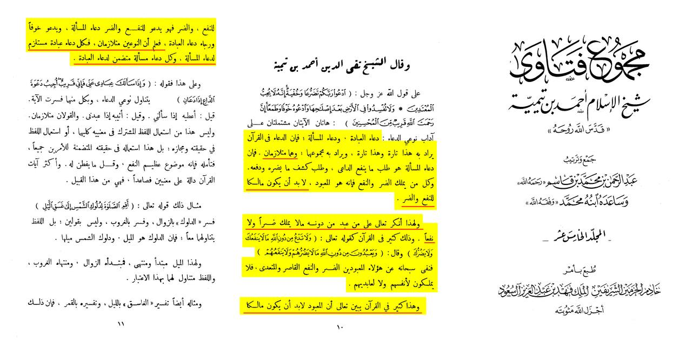

---

<!-- telegram-source: dar/messages5.html#message4732 -->
<!-- evidence-id: 000245 -->

Shaykh Ṣāliḥ al-Fawzān said:

With an ṣaḥīḥ chain from Qatādah: ‘partners in His obedience, not in His worship.’ And shirk in obedience is minor shirk which does not take one out of the religion, especially since the two of them did not do this intending that meaning; rather, they did it out of love for the child and for his safety only. Yet despite that, Allāh called it shirk, so it is shirk even if a person does not intend it.

So this indicates that whoever speaks with shirk or does shirk is called a mushrik, even if he did not intend it or have it as his intention. Thus it is judged upon him that this action of his is shirk, whether it is from minor shirk or major shirk.

And for this reason, the Messenger ﷺ said to the one who said to him: ‘What Allāh wills and you will’: ‘Have you made me a rival to Allāh?’—even though the speaker did not intend to make a rival for Allāh. However, this wording is not permissible, so it is shirk even if he did not intend it—so how then if he did intend it?

So in this is a refutation against the one who says that whoever says a statement of shirk or does shirk is not judged to be a mushrik until he believes it in his heart, as is the saying of the Murjiʾah of this era.

[Iʿānat al-Mustafīd bi-Sharḥ Kitāb at-Tawḥīd by al-ʿAllāmah Shaykh Ṣāliḥ al-Fawzān 2/275]

Show attached source scan

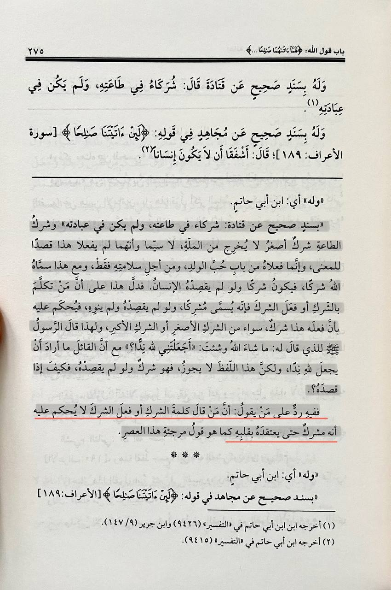

---

<!-- telegram-source: dar/messages5.html#message4552 -->
<!-- evidence-id: 000246 -->

Shaykh Ṣāliḥ al-Fawzān was asked:

Q: “Your Eminence Shaykh, may Allah grant you success, I am from outside this country and I had a grandmother who passed away. She was an elderly, ignorant woman who used to slaughter for the awliyāʾ and swear by them. Is it permissible for me to perform ḥajj on her behalf?”

A: “No. She is treated as the mushrikīn are treated, because she died upon shirk. So she is treated as the mushrikīn are treated. Ḥajj is not performed on her behalf, nor is forgiveness sought for her.”

<video class="source-video" controls preload="metadata" src="assets/videos/dar-messages5-4552.mp4"></video>

Video source from the Telegram export.

---

<!-- telegram-source: dar/messages4.html#message4111 -->
<!-- evidence-id: 000247 -->

Shaykh Ṣāliḥ al-Fawzān was asked:

Q: My mother died while calling upon the awliyāʾ and the ṣāliḥīn out of ignorance. Is it permissible for me to supplicate for her forgiveness?

A: No. Do not supplicate for her. It was not for the Prophet and those who believed to seek forgiveness for the mushrikīn, even if they were close relatives. This is not permissible.

<video class="source-video" controls preload="metadata" src="assets/videos/dar-messages4-4111.mp4"></video>

Video source from the Telegram export.

---

<!-- telegram-source: dar/messages5.html#message4324 -->
<!-- evidence-id: 000248 -->

Are the statements of udhr bil jahl, general or do they apply to specific individuals?

Shaykh al-Fawzān was asked:

Q: What do you say about one who claims, among contemporaries, that declaring takfīr of a specific individual from among the grave worshippers is a matter of disagreement, and he claims that they are not kuffār aṣliyyīn (original disbelievers)?

A: This is a corrupt statement, the consequence of which is ignorance in this matter.

And I say, and I repeat, that it is not permissible for anyone to speak in these dangerous matters except after he learns, gains clear understanding, and studies ʿaqīdah — a sound study— upon the people of knowledge.

Then after that, if the situation compels him to speak, he speaks; and if he is not compelled to this, then he should not enter into it. This is what I say and repeat: that this matter is extremely dangerous

Whoever commits shirk, commits shirk, and judgment of shirk is passed upon him. And whoever commits kufr, the judgment of kufr is passed upon him according to what appears to us, and we apply to him the rulings of kuffār.

So if he dies, we do not bury him in Muslim graveyards, and his relatives who are Muslims do not inherit from him. The rulings of the kuffār are applied to him by virtue of his action — by virtue of his action and his statement.

This is what we have been commanded with. We have nothing except outward appearance. We judge based on what is apparent.

As for what is between him and Allah, then Allah is  more seeing and knowing regarding them; if he is excused, Allah knows that he is excused — then his affair is left to Allah. We do not judge the hearts; rather, we judge what appears to us.

So whoever manifests kufr and shirk, we judge him with kufr and shirk, and we apply to him the rulings of shirk and the rulings of kufr— whether he is specific individual or not.

<video class="source-video" controls preload="metadata" src="assets/videos/dar-messages5-4324.mp4"></video>

Video source from the Telegram export.

---

<!-- telegram-source: dar/messages2.html#message1484 -->
<!-- evidence-id: 000249 -->

Sheikh Ṣāliḥ ibn Fawzān said:

“The second type: Apostasy ( kufr ridda ) from the religion of Islam. This occurs when a person who was Muslim commits one of the nullifiers ( nawāqiḍ ) of Islam, thereby leaving the religion and becoming an apostate ( murtadd ). Such a person is considered a disbeliever due to apostasy.

The nullifiers of Islam are well known and defined by scholars. Among them: whoever associates partners with Allah ( shirk ), calls upon other than Allah, seeks aid from other than Him, or offers sacrifice to other than Him— such a person is deemed an apostate from Islam because he has committed major shirk, even if he continues to profess the shahādatayn .

Likewise, among the nullifiers of Islam is reviling Allah or His Messenger, or mocking anything from the Book of Allah or the Sunnah of the Messenger. Whoever mocks Allah, His Book, His Messenger, or His Sunnah becomes a disbeliever—whether doing so seriously or in jest—based on the saying of Allah, the Exalted:

“ If you question them, they will certainly say, “We were only talking idly and joking around.” Say, “Was it Allah, His revelations, and His Messenger that you ridiculed? Make no excuses! You have lost faith after your belief. (Surah At-Tawbah: 65-66)”

“So what was the statement they uttered? They said: ‘We have never seen people like our reciters—more lying tongues, more gluttonous stomachs, and more cowardice in battle.’ They were referring to the Messenger of Allah ﷺ and his companions. Thus, Allah revealed their disbelief in His Book in a verse that will be recited until the Day of Judgment, as a warning to Muslims against falling into such actions.

Likewise, learning or teaching sorcery ( siḥr ) is disbelief in Allah. Claiming knowledge of the unseen through divination ( kihāna ), magic, astrology, or fortune-telling is also disbelief that expels one from the religion. This is what is judged as kufr .

Similarly, if a person declares ḥalāl (permissible) something that has been unanimously agreed upon as ḥarām (forbidden), or vice versa, they commit disbelief. The same ruling applies to denying any essential matter of the religion that is known by necessity—such as rejecting the obligation of prayer, zakāh , fasting, or ḥajj . In such cases, the person is judged as a disbeliever.”

“As for the one who has not committed a nullifier ( nāqiḍ ) of Islam, he is not judged as a disbeliever. Even if he commits a major sin ( kabīrah ), he is deemed sinful ( fāsiq ), but not a disbeliever. If he commits an error, a sin, or a violation, he is described as mistaken, disobedient, or something similar—according to what he has done. Justice requires that we weigh matters by their proper shar‘ī standards and not label every person who commits a violation or a sin as a disbeliever.

For example, if someone consumes ribā (usury), we judge him as a fāsiq who has committed a major sin. However, if he deems ribā permissible—meaning he says it is ḥalāl —then we say he is a disbeliever because he has declared lawful what is unanimously agreed upon as forbidden. But if he consumes it without believing it to be ḥalāl , he is a fāsiq and does not leave the fold of Islam; rather, he is treated as a sinful believer.”

[Ẓāhirat al-Tabdīʿ wat-Tafsiq wat-Takfīr wa Ḍawābiṭuhā - al-Sheikh Ṣāliḥ ibn Fawzān p.22-24]

Show attached source scan

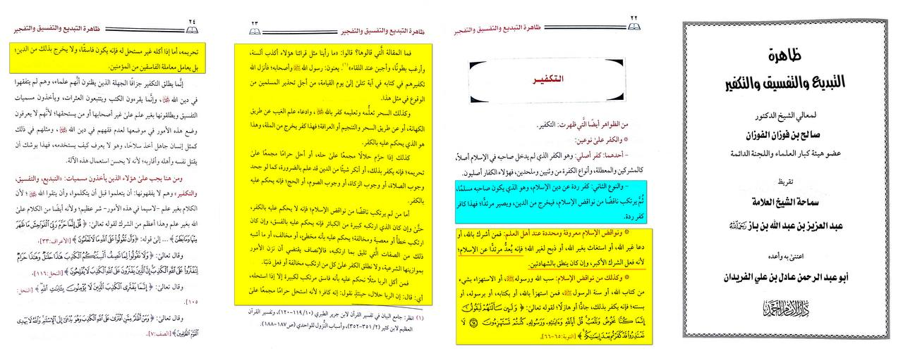

---

<!-- telegram-source: personal/messages.html#message567 -->
<!-- evidence-id: 000250 -->

<video class="source-video" controls preload="metadata" src="assets/videos/personal-567.mp4"></video>

Video source from the user’s Telegram export.

Shaykh Ṣāliḥ al-Fawzān was asked:

Q: Noble shaykh, may Allāh grant you success. If I see a person committing acts of shirk, such as calling upon the dead and seeking intercession from them, how should I treat him—do I treat him as a Muslim or as a kāfir?

A: You treat him as a Muslim while he is committing shirk and you can hear him committing shirk and calling upon other than Allāh?!!! Treat him as a mushrik, but call him to Islam. Explain to him that this is major shirk, and clarify the danger of shirk, from the angle of calling to Allāh and offering sincere advice. Yes.

---

<!-- telegram-source: personal/messages.html#message632 -->
<!-- evidence-id: 000251 -->

<video class="source-video" controls preload="metadata" src="assets/videos/personal-632.mp4"></video>

Video source from the user’s Telegram export.

Is there “ikhtilaf” on the matter of excuse of ignorance? sheikh fawzan

---

<!-- telegram-source: dar/messages5.html#message4860 -->
<!-- evidence-id: 000252 -->

Shaykh al-Fawzān said regarding the statement:

“And the servant does not exit from īmān except by denying that which caused him to enter into it.”

This statement contains an objection, because restricting kufr to denial (juḥūd) is the madhhab of the Murjiʾah. The nullifiers of Islam are many: among them is juḥūd, among them is associating partners with Allah, among them is mocking the religion or anything from it—even without denial—and they are many nullifiers mentioned by the scholars and jurists in the chapters of apostasy. Among them also is making the unlawful, lawful and making the lawful, unlawful.

Shaykh al-Islām Muḥammad ibn ʿAbd al-Wahhāb mentioned ten of them, and they are the most important, otherwise the nullifiers are many. So restricting the nullifiers of Islam to denial alone is an error.

Some of the mutaʿālimūn (pseudo-scholars) today try to promote this madhhab so that people become lenient in the religion. As long as he has not denied, then according to them he is a Muslim: even if he prostrates to an idol and says, “I did not deny, and I affirm tawḥīd—it is only a sin from the sins.” Or if he sacrifices to other than Allah, or reviles Allah, or reviles the Messenger, or reviles the religion—they say: this is a Muslim because he did not deny.

This is a great error, and it completely destroys the religion, leaving no religion remaining. So it is obligatory to beware of this great danger.

[At-Taʿlīqāt al-Mukhtaṣarah ʿalā Matn al-ʿAqīdah aṭ-Ṭaḥāwiyyah p.144]

Show attached source scan

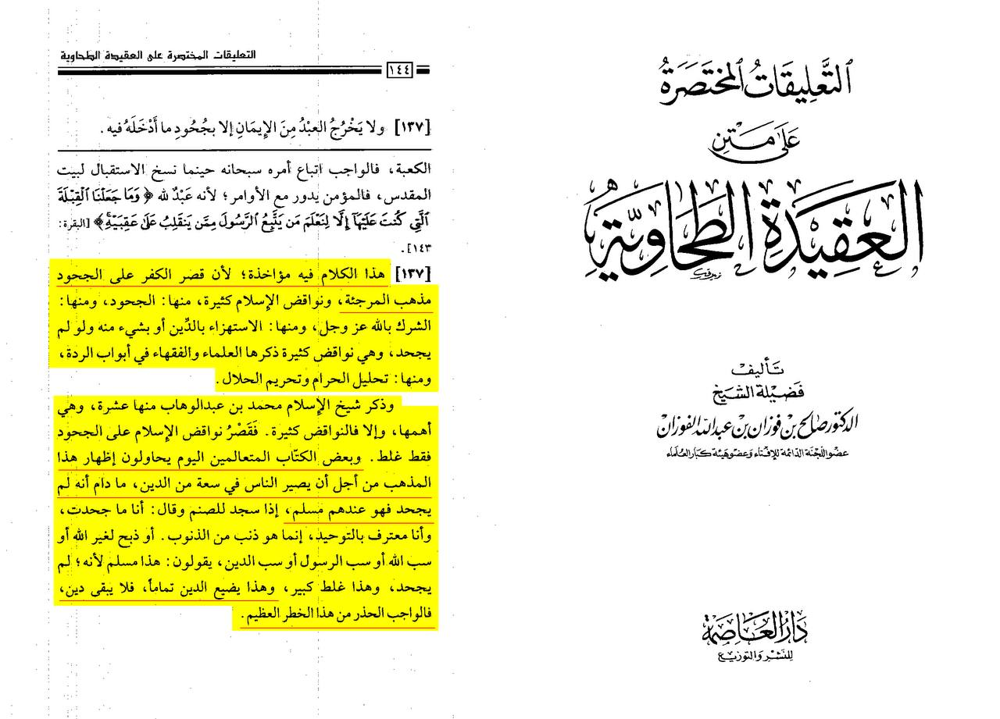

---

<!-- telegram-source: dar/messages2.html#message1575 -->
<!-- evidence-id: 000253 -->

Sheikh fawzan on ʿUdhr bil Jahl #ʿUdhr_bil_Jahl

<video class="source-video" controls preload="metadata" src="assets/videos/dar-messages2-1575.mp4"></video>

Video source from the Telegram export.

---

<!-- telegram-source: dar/messages2.html#message1608 -->
<!-- evidence-id: 000254 -->

Shaykh Ṣāliḥ al-Fawzān was asked:

Question:

May Allah bless you, esteemed scholar. A questioner asks: Is this statement a view of the people of Sunnah, that every action or statement that causes the person to be declared a disbeliever (kafir) is only because it indicates disbelief in the heart?

Answer:

This is not what the people of Sunnah and the Jamāʿah have said. They do not say this. We rule based on what is apparent. We have no knowledge of the unseen, only the visible. So, if someone commits shirk by saying or doing something openly, such as slaughtering for other than Allah, making vows to other than Allah, or prostrating to other than Allah, we declare them a disbeliever based on their actions. If they speak words of disbelief, we judge them as disbelievers based on their words. We do not judge what is in the heart. Likewise, if someone accepts Islam and outwardly demonstrates Islam, we judge them as Muslim based on their appearance. We only judge by outward appearances, not by what is hidden.

Source: [Official Ṣāliḥ al-Fawzān fatwa](https://alfawzan.af.org.sa/ar/node/9646).

---

<!-- telegram-source: dar/messages4.html#message4061 -->
<!-- evidence-id: 000255 -->

Shaykh Ṣāliḥ al-Fawzān was asked:

Q: May Allāh be good to you, noble shaykh. Is takfīr a ruling for anyone among the beginner students of knowledge, or is it specific to the major scholars and judges?

A: Whoever outwardly displays shirk — slaughtering for other than Allāh, or vowing to other than Allāh—displays it clearly, slaughtering for other than Allāh, vowing to other than Allāh, doing Istighāthah with other than Allāh among the dead, making Du‘āʾ upon the dead—this is clear shirk, this is clear shirk. Whoever hears him may judge him as a kāfir and as a mushrik. But as for the hidden matters which require knowledge and insight, these are to be referred to the people of knowledge.

Show attached source scan

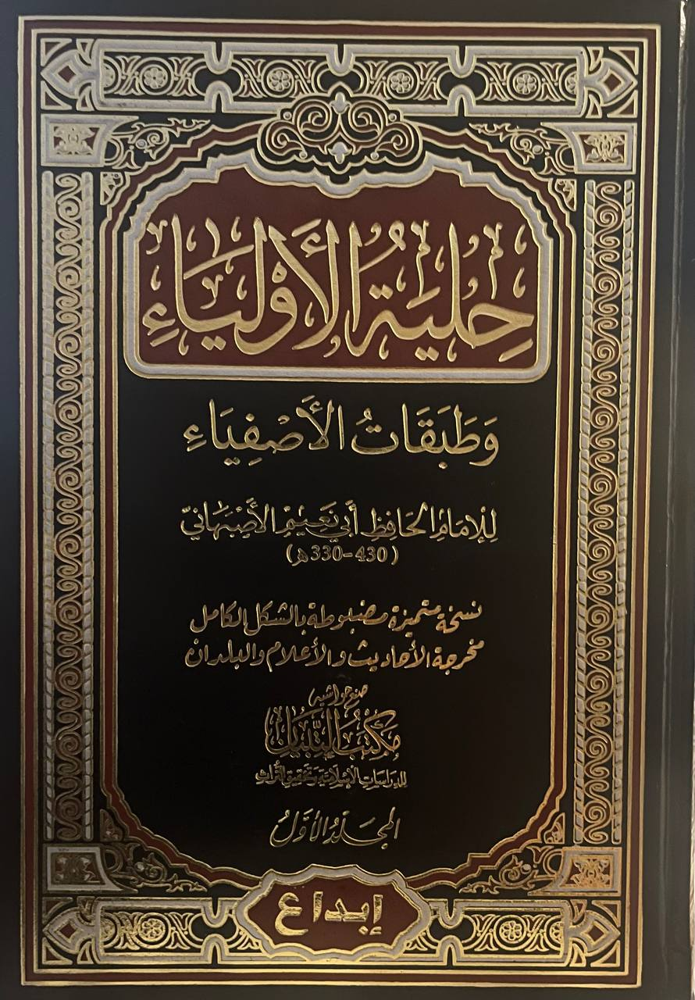

---

<!-- telegram-source: dar/messages.html#message642 -->
<!-- evidence-id: 000256 -->

Sheikh Fawzan on the traits of the Murji’ah

<video class="source-video" controls preload="metadata" src="assets/videos/dar-messages-642.mp4"></video>

Video source from the Telegram export.

---

<!-- telegram-source: dar/messages5.html#message4914 -->
<!-- evidence-id: 000257 -->

Shaykh al-Fawzān was asked:

Q: Some people have emerged among us who refrain from making takfīr of the one who performs sujūd to other than Allāh and the one who sacrifices to other than Allāh, with the argument that it is necessary to ask the person about the reason for doing this..

A: We judge by the outward appearance. Whoever performs sujūd to other than Allāh, we judge him with kufr based on his outward appearance.

As for what is in the hearts, none knows it except Allāh. We have not been tasked to examine the hearts; we judge by the outward appearance.

Whoever does shirk, we judge him as a mushrik, and whoever does kufr, we judge that he is a kāfir. This is a group of the Murjiʾah that has appeared now, they are the ones who say these statements.

<video class="source-video" controls preload="metadata" src="assets/videos/dar-messages5-4914.mp4"></video>

Video source from the Telegram export.

---

<!-- telegram-source: dar/messages4.html#message4176 -->
<!-- evidence-id: 000258 -->

Shaykh Ṣāliḥ al-Fawzān said:

Yes, we judge people by the apparent. We do not know what is in the hearts. But whoever does good, we testify goodness for him based on what is apparent. And whoever does evil, we testify evil for him based on what is apparent. As for the hearts, none knows them except Allāh.

The Murjiʾah now say: no—whoever commits an act of kufr or shirk or a grave evil, you must not judge him, because you do not know what is in his heart. You do not know what is in his heart. We were not tasked with the hearts; rather, we were tasked to judge by what is apparent. We judge people by their outward actions, as for the hearts, none knows them except Allāh, Glorified and Exalted.

<video class="source-video" controls preload="metadata" src="assets/videos/dar-messages4-4176.mp4"></video>

Video source from the Telegram export.

---

<!-- telegram-source: dar/messages5.html#message4726 -->
<!-- evidence-id: 000259 -->

Shaykh Ṣāliḥ al-Fawzān was asked:

Q: May Allāh reward you, what is the statement regarding one who says: a specific individual is not declared a kāfir until the conditions are fulfilled and the impediments are removed?

Answer: Whoever commits kufr—by statement, action, belief, or doubt—then he is judged with kufr. As for what is in his heart, that is not known except to Allāh. We are not entrusted with the hearts; rather, we are entrusted with the outward appearance. So whoever shows kufr outwardly, we judge him with kufr and treat him with the treatment of a kāfir.

[Sharh Nawāqid al-Islām by Shaykh Ṣāliḥ al-Fawzān p.44]

Show attached source scan

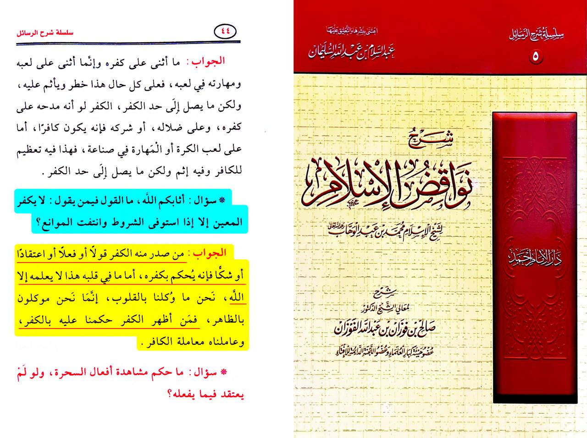

---

<!-- telegram-source: dar/messages3.html#message2913 -->
<!-- evidence-id: 000260 -->

Shaykh al-Fawzān was asked:

Question: What is the criterion for declaring a specific individual to be a disbeliever (takfīr al-muʿayyan)? Some say: “Do not declare a specific person to be a Jew, for example, until it is confirmed to us that what he has done constitutes disbelief.”

Answer: Whoever openly displays disbelief, he is judged as a disbeliever. And whoever commits shirk with Allah is judged to be a mushrik. However, you do not definitively say that he is in the Fire.

You judge him with disbelief in this worldly life based on what he has outwardly manifested. As for the Hereafter, you do not pass judgment that he is of the people of the Fire—he may have repented and you were unaware of it.

The questioner has confused two matters: the issue of takfīr and the issue of judging a specific person to be from the people of the Fire.

[Durūs fī Sharḥ Nawāqiḍ al-Islām by Shaykh al-Fawzān p.96]

Show attached source scan

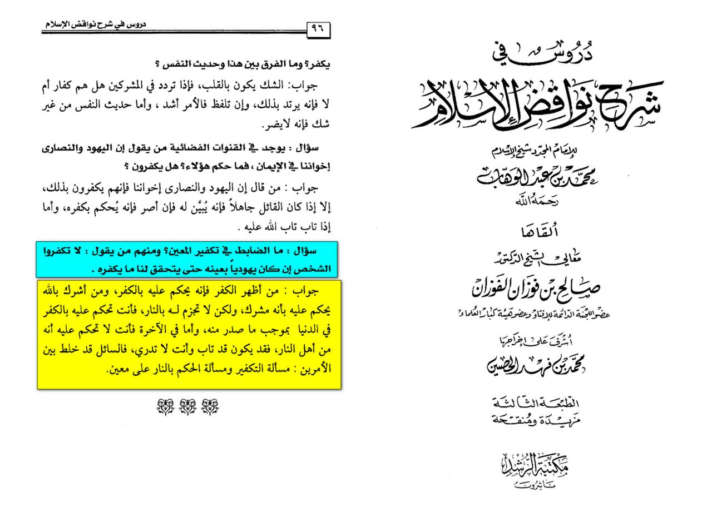

---

<!-- telegram-source: dar/messages.html#message984 -->
<!-- evidence-id: 000261 -->

The danger of doubting the kufr of the mushrik - Sheikh Fawzan

<video class="source-video" controls preload="metadata" src="assets/videos/dar-messages-984.mp4"></video>

Video source from the Telegram export.

---

<!-- telegram-source: personal/messages.html#message877 -->
<!-- evidence-id: 000262 -->

Shaykh al-Fawzān was asked:

Q: If someone performs sujūd to other than Allah, does he become a kāfir absolutely, even if we do not investigate his ʿaqīdah?

A: My brother, it is sufficient that he performed sujūd to other than Allah. Whoever directs any type of ʿibādah to other than Allah is a kāfir and a mushrik. Sujūd is among the greatest forms of ʿibādah.

As for what is in the hearts, we judge according to what is outward, while the hearts, their matter is with Allah.

Show attached source scan

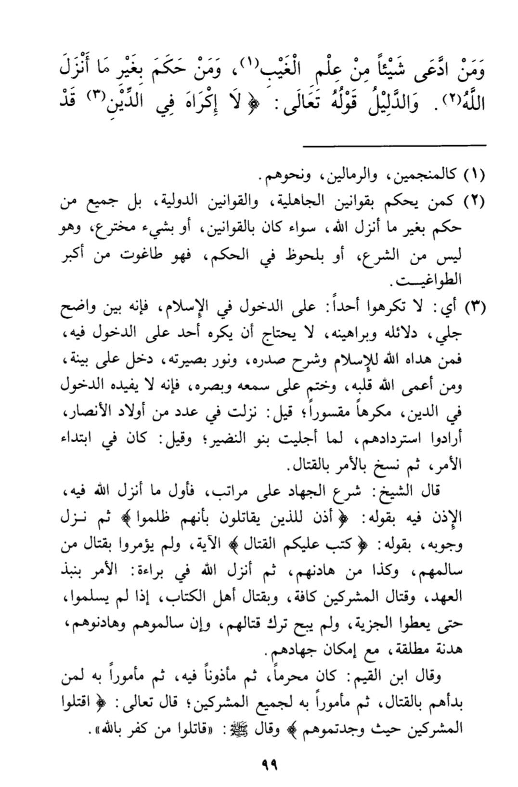

---

<!-- telegram-source: dar/messages3.html#message2848 -->
<!-- evidence-id: 000263 -->

Fatawa of Shaykh ʿAbd Allāh al-Ghunaymān

The Host said:

If you say: “Those who hold beliefs about the dead don’t know that what they are doing is shirk. In fact, if one of them were faced with the sword, he would not admit that he is a mushrik or that he committed something that constitutes shirk. If he knew even the least bit that this was shirk, he would not have done it.”

I say: Yes, what you said is true. However, it should not be hidden from you what has been established in the chapter on riddah — that its occurrence does not require knowledge. Whoever makes a kufr-based statement or commits an act of kufr, the ruling applies to him.

In any case, it is obligatory on everyone who becomes aware of these statements or actions—performed by those who venerate the dead—to convey to them the ḥujjah sharʿiyyah, and to clarify what Allah commanded to be clarified, and what He took a covenant upon the people of knowledge to convey.

The Shaykh says:

This does not mean they are excused in their ignorance—because shirk is not obscure, and neither is tawḥīd. The issue is due to their turning away and blind taqlīd, which caused their vision to become blind.

They believe these things are not to be abandoned, and once someone clings to something and sees it as important, they won’t give attention to anything opposing it. If you were to debate them or speak to them, most would not accept it. This is the norm—not that none of them ever returns, for many who are invited and addressed do return to the truth through daʿwah.

Still, we say: this is not an excuse for them. They are not excused in shirk just because they say “We didn’t know this was shirk” or “We didn’t know the meaning of Lā ilāha illa Allāh” or “We didn’t understand the meaning of worship.” These are clear matters. Their ignorance stems from negligence and deliberate turning away, so the blame is upon them, and establishing the ḥujjah for Allah’s sake is required at all times. Arguments must be presented.

As for takfīr, that is another matter. Declaring a specific individual a kāfir can only be done after establishing a personal ḥujjah upon him, and removing the doubts he clings to. After that, judgment is passed. But before that, it is impermissible. Even so, it does not prevent one from saying he is a mushrik, even if we do not declare takfīr that removes him from the religion just based on the action. He may be ignorant—and that’s common among those who fall into this. So there is no necessary link between takfīr and a person being a disbeliever in Allah’s sight, since Allah did not provide mankind with excuses after giving them intellects and abundant signs in His creation.

The essential matter is attachment to the Book of Allah and the Sunnah of His Messenger. Allah has removed all excuses by sending down His Book and His Messenger. So if someone says, “I’m ignorant,” it is said to him: You turned away from what was wājib upon you—seeking the truth—and you didn’t search for it. You are accountable for this. No one is going to come to your home saying, “This is the word of Allah, this is what the Prophet said.” This responsibility lies with you. As long as you know there is a Book from Allah and a Messenger, it is wājib upon you to seek what Allah has obligated. If you turn away, the blame is upon you. You are not excused by your ignorance. This is not a case where ignorance is an excuse.

<video class="source-video" controls preload="metadata" src="assets/videos/dar-messages3-2848.mp4"></video>

Video source from the Telegram export.

---

<!-- telegram-source: dar/messages5.html#message4278 -->
<!-- evidence-id: 000264 -->

Shaykh ʿAbdullāh Al-Ghunaymān said:

Now, among the problems that people are facing today is that there are students of knowledge and shaykhs who say that if a mushrik performs ṭawāf around a grave, and worships the occupant of the grave, but is ignorant, then we do not call him a mushrik.

Rather, we call him a Muslim. And they say: his action is shirk, but he himself is not a mushrik. This is a strange matter. They say: his action is shirk, yet he is not a mushrik; rather, he is a Muslim. And if he dies upon that, he is in Paradise, because he is excused—excused in his ṭawāf around the grave and in his ʿibādah of it.

This is what the shaykh says: that this is something not known among the earlier generations nor the later ones. It is something uttered only by ignorant scholars—may Allāh grant safety. Meaning: ignorance has taken firm hold in their hearts, and they have become people who do not accept the truth. They argue about such matters.

Then regarding someone like this: does the statement of the shaykh apply to him—his saying, “Whoever does not declare the kāfir to be a kāfir is himself a kāfir”? Because this is shirk and kufr against Allāh, exalted and majestic, and yet he did not declare him a kāfir; rather, he judged him to be a Muslim.

Meaning: as for people like these, the existence of doubts must be removed before judging them to be disbelievers. But we say: this is ignorance—ignorance that no one preceded them in. If a mushrik falls into shirk, then he is a mushrik. Shirk does not exist independently such that the action is called shirk while its doer is called a Muslim. A person is held accountable for what he does.

<video class="source-video" controls preload="metadata" src="assets/videos/dar-messages5-4278.mp4"></video>

Video source from the Telegram export.

---

<!-- telegram-source: dar/messages5.html#message4347 -->
<!-- evidence-id: 000265 -->

Shaykh ʿAbdullāh Al-Ghunaymān said:

The meaning of the verse is that Allāh informed that He does not forgive the mushrik. Therefore, since shirk is unforgivable, it becomes obligatory for the servant to research its types, causes, and means, and to avoid them so that he does not fall into it unknowingly.

Many people, including the intelligent and even scholars, have fallen into shirk al-akbar because of ignorance, carelessness, and leniency, as is still occurring in many Muslim lands. People go to graves, ask their occupants, and think this is not shirk, but rather permissible tawassul. This is among the calamities.

Shirk that Allāh does not forgive may, in some cases, be treated by some people as an act of obedience to draw near to Allāh but the verse indicates that sins other than shirk do not render a Muslim a kāfir.

The verse also shows that if a mushrik dies upon his shirk, he is not forgiven. However, if he repents, Allāh may accept his repentance if He wills. Confidence in Allāh and hope in His acceptance is encouraged; He rejoices most at the repentance of the one who turns back.

Allāh does not benefit from the obedience of the obedient nor from the repentance of the repentant, for He is self-sufficient over all else. Yet, due to His generosity and bounty, He does not wish to punish His servants, and when a servant repents, He rejoices.

This is why Allāh sent the messengers and revealed the books, so that no one has an excuse before Him. The sending of the messengers and revelation of the books is sufficient as guidance. Allāh has given humans reason and thought to discern benefit; thus, if a person  knows that the Messenger came with the truth and guidance from Allāh, it is obligatory for him to seek what the Messenger ﷺ brought.

If he does not, he is blameworthy, and the proof stands against him. There is no excuse for saying, “I was ignorant and did not know,” because that will not help him. Once he knows that Allāh sent His Messenger and revealed His Book, it is incumbent upon him to seek the truth himself.

[Sharḥ Kitāb at-Tawḥīd by Shaykh ʿAbdullāh al-Ghunaymān 1/157-158]

Show attached source scan

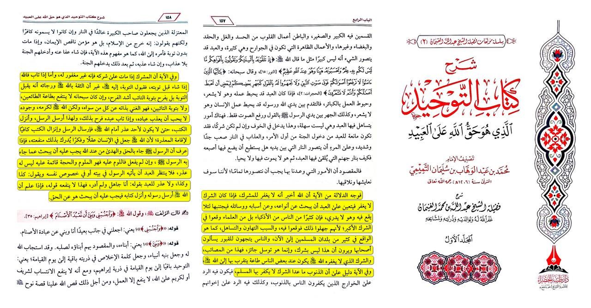

---

<!-- telegram-source: dar/messages5.html#message4436 -->
<!-- evidence-id: 000266 -->

Shaykh ʿAbd al-Muḥsin al-ʿAbbād was asked:

Q: He says: “O Shaykh, I came this year as a ḥājj, and I heard during the lessons that I was attending that whoever falls into shirk al-akbar, such as ṭawāf around graves, slaughtering for them, or making vows for them, then he is a mushrik. I sat with some of the brothers and they told me that he is a Muslim because the proof has not been established upon him.

A: I do not understand how the proof has not been established upon him. The basic principle is that if someone is found doing Istighāthah from other than Allāh, making du‘āʾ to other than Allāh, and slaughtering for other than Allāh, then this is shirk. So whoever that is found from, then he is considered a kāfir, and he does not pray for him, nor is prayer performed behind him.”

Show attached source scan

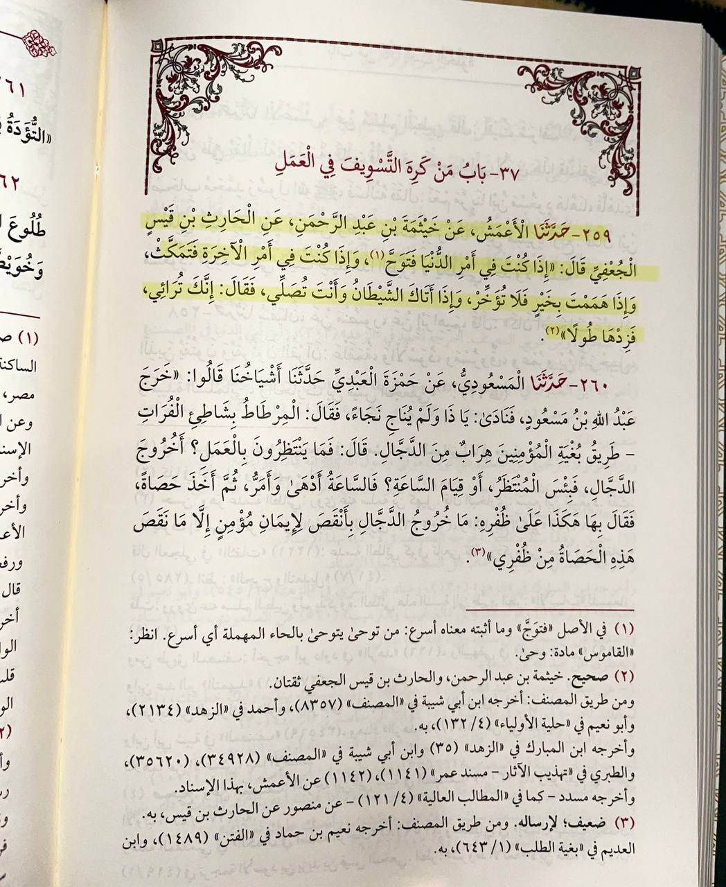

---

<!-- telegram-source: dar/messages2.html#message1876 -->
<!-- evidence-id: 000267 -->

Sheikh ar-Rājiḥī said:

Q: Is a person ignorant of Tawḥīd excused for their ignorance regarding the matter of invoking others besides Allah and worshiping graves?

A: Such a person is not excused for their ignorance. Allah says: “And We never punish until We have sent a messenger.” (Al-Isrā’: 15). The messenger has been sent, and Allah also says: “And it has been revealed to me that this Qur’an is to warn you thereby, and whomever it reaches.” (Al-An‘ām: 19). Thus, whoever receives the Qur’an has had the evidence established against them.

The excuse for ignorance applies only to those of the Fatrah (the time before the sending of the messenger), but after the messenger was sent, there is no excuse. The messenger was sent with the message of Tawḥīd and the Qur’an, calling to the Oneness of Allah and prohibiting shirk. Therefore, no one has an excuse regarding this issue.

However, a person may be excused in matters that are subtle or obscure, which are not clear to them, similar to the people of Fatrah who never heard the Qur’an.

Source: [ʿAbd al-ʿAzīz al-Rājihī, *Sharḥ Kitāb al-Sunnah*](https://shamela.ws/book/35083/148).

---

<!-- telegram-source: dar/messages4.html#message3493 -->
<!-- evidence-id: 000268 -->

Question to Shaykh ʿAbd al-ʿAzīz al-Rājihī:

“May Allah be good to you, our virtuous shaykh. In the matter of al-ʿudhr bil-jahl, here among us there are those who worship graves and seek help from them. Is this an excuse for them?”

Answer: “It is not an excuse. The one who makes ṭawāf around graves, worships graves, and calls upon them besides Allah is not excused, while living among Muslims after the Qurʾān has been revealed. Allah the Exalted says: ‘And We never punish until We have sent a messenger’ [al-Isrāʾ 17:15]. And indeed, the Messenger ﷺ has been sent. And He says: ‘This Qurʾān has been revealed to me so that I may warn you by it, and whomever it reaches’ [al-Anʿām 6:19]. Whoever the Qurʾān reaches, the proof has been established against him.

The one excused is the ignorant person in fine, hidden matters that someone like him may not know. But as for clear matters, which Allah revealed the Qurʾān concerning, then a person is not excused to commit shirk with Allah or worship graves. Nor is he excused not to ask about what confuses him. If he wants to buy a car or a house, he asks and consults people of expertise—yet when it comes to his religion, he does not ask! This is the very matter for which Allah sent His Prophet ﷺ. He is not excused now, while the Qurʾān is being recited. As for one who claims he has not heard the Qurʾān, turns away, pretends to be blind and deaf, rejects those who advise him and call him to tawḥīd, then says: ‘I am excused’—he is not excused. Excuse only applies in subtle, hidden issues that someone like him may genuinely not know.”

Another Question:

“We want from your excellency a detailed explanation of al-ʿudhr bil-jahl in matters of ʿaqīdah.”

Answer: “The correct view is that a person is not excused in clear, obvious matters. Someone who lives among Muslims, then commits shirk with Allah, or deals in ribā—and then it is said: ‘He is excused’—no, he is not excused.

But if it is a subtle, hidden matter that someone like him may not know, then he is excused. For example, a man converts to Islam in America, in a society that deals in ribā. He becomes Muslim and then deals in ribā. If asked: ‘Why did you do this?’ he says: ‘I did not know, I was ignorant.’ This is indeed true, and he is excused. But someone who lives among Muslims and deals in ribā, and when asked why, says: ‘Because I was ignorant’—this is not accepted from him. The closer and stronger position is that excuse is only in subtle, hidden matters that someone like him may not know.”

Show attached source scan

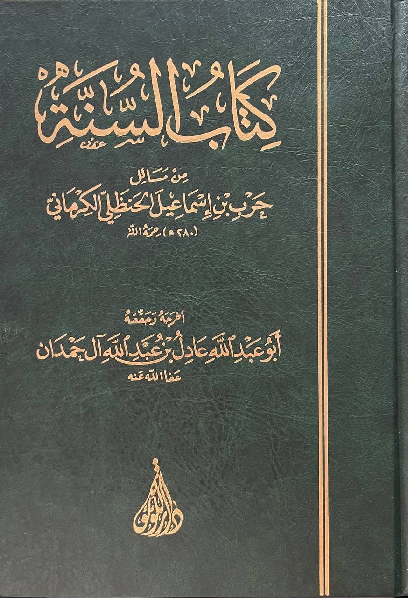

---

<!-- telegram-source: dar/messages3.html#message2654 -->
<!-- evidence-id: 000269 -->

Shaykh ʿAbd al-ʿAzīz al-Rājihī was asked:

“Is the one who performs ṭawāf around graves or commits acts of shirk out of ignorance—meaning he does not know that what he is doing is shirk—to be excused? Please provide detail.

The Shaykh said: "The scholars have 2 opinions on this after the mission/prohethood (بعثة) of Prophet ﷺ — Ahl Al-Fiṭrah after the prophethood/mission of Prophet ﷺ, regarding them their is a scholarly discussion.

But after the Prophet ﷺ was sent and the Qur’ān was revealed—Allah says: “And We never punish until We have sent a messenger”—and indeed Allah has sent the Messenger and revealed the Qur’ān.

So is the mushrik excused if the matter has been confused for him—if he was performing ṭawāf around graves and calling upon them—and he did not perceive the truth, nor recognize it, because of the deception of corrupt scholars who distort things for him and beautify shirk in his eyes?

Some scholars have said he is excused in such a case, but he is treated in this world as a mushrik: he is not washed, not prayed over, not buried among Muslims, and no pilgrimage is performed on his behalf, nor is mercy invoked for him. In the Hereafter, his matter is left to Allah.

This is the position adopted by Shaykh Muḥammad ibn ʿAbd al-Wahhāb رحمه الله. He said that no one is declared a kāfir until the ḥujjah (proof) is established against him.

Other scholars said no one is excused after the Prophet ﷺ, because Allah says: “And We never punish until We have sent a messenger”—and the Messenger has been sent and the Qur’ān revealed, and the Qur’ān is recited and the texts are clear regarding the prohibition of shirk. Therefore, they are not excused. These are two views held by scholars.

In any case, those who say he is excused also say that in this world he is treated as a mushrik: he is not washed, not prayed over, not buried in the Muslim cemeteries, pilgrimage is not performed for him, and mercy is not invoked for him. As for the Hereafter, his matter is with Allah.

Shaykh al-Islām Ibn Taymiyyah رحمه الله said a profound statement. He said:

There are two types of shirk: greater and lesser. Whoever is free from both dies upon tawḥīd. Whoever is free from both dies upon tawḥīd and enters Paradise. Whoever is free from the greater enters Paradise.

Whoever dies upon the greater shirk enters the Fire. And whoever dies upon the lesser shirk—if his good deeds outweigh his bad—enters Paradise. That is because of the abundance of tawḥīd alongside a small amount of shirk. But if his bad deeds outweigh his good, he will be punished for this lesser shirk. Shirk is accounted for whether it is greater or if it is extensive in amount.

If it is small in comparison to much sincerity, this is the view of Shaykh al-Islām رحمه الله: shirk is held accountable in both of its forms—greater and abundant in quantity. If someone dies upon greater shirk, he dies from among the people of the Fire.

As for lesser shirk, it depends on whether his good deeds outweigh the bad or the opposite. If the bad deeds outweigh, then his good deeds are nullified and shirk overcomes them. But if the good deeds, especially tawḥīd, are abundant, they may outweigh the shirk.”

<video class="source-video" controls preload="metadata" src="assets/videos/dar-messages3-2654.mp4"></video>

Video source from the Telegram export.

---

<!-- telegram-source: dar/messages3.html#message2635 -->
<!-- evidence-id: 000270 -->

Shaykh ʿAbd al-ʿAzīz al-Rājihī was asked:

Question: Is a person excused due to ignorance if he performs acts of shirk, such as circumambulating a grave, without knowing that what he is doing is shirk against Allah Almighty?

Answer: Those who committed such acts before the sending of the Prophet ﷺ are referred to as Ahl al-Fatrah (people of the interval between prophets), and there is scholarly discussion concerning them. As for after the sending of the Prophet ﷺ and the revelation of the Qur’ān, Allah says: “And We never punish until We have sent a Messenger.” [al-Isrāʾ: 15]

So, Allah has sent the Messenger and revealed the Qur’ān. Is the mushrik then excused if he is misled into believing that circumambulating graves, invoking them besides Allah, or sacrificing to them is permissible, due to the deception of evil scholars who disguise and beautify shirk for him—so much so that the truth becomes obscured and he no longer recognizes it? Some scholars have said: Yes, he may be excused in such a case, but he is treated in this world like a mushrik—i.e., he is not washed, not prayed over, and not buried in Muslim cemeteries—just as Ahl al-Fatrah are treated.

This view was adopted by Shaykh Muḥammad ibn ʿAbd al-Wahhāb, may Allah have mercy on him, who said:

“We do not declare anyone a disbeliever until the proof has been established upon him.” Other scholars, however, held that no one is excused after the sending of the Messenger ﷺ, since Allah says: “And We never punish until We have sent a Messenger.”, and indeed, the Messenger has been sent, and the Qur’ān has been revealed and is recited. Its texts are clear in warning against shirk and in defining it. Therefore, they are not excused.

These two positions are both attributed to the scholars, and were mentioned by Shaykh al-Islām Ibn Taymiyyah and others. May Allah grant everyone success in obeying Him, bless all with righteous deeds and beneficial knowledge, and may peace and blessings be upon Muḥammad, his family, and his companions.

Source: [ʿAbd al-ʿAzīz al-Rājihī, source text in Shamela](https://shamela.ws/book/37010/193).

---

<!-- telegram-source: dar/messages5.html#message4647 -->
<!-- evidence-id: 000271 -->

Is a mushrik considered a muwaḥḥid as long as he remains ignorant? Response to the doubt of the Murjiʾī ʿAbd al-ʿAzīz al-Rayyis by Shaykh ar-Rājihī.

This audio is more than 10 years old and he still repeats the same thing he claims to have repented from. Be warned of this individual and his followers. And return back to the scholars.

<video class="source-video" controls preload="metadata" src="assets/videos/dar-messages5-4647.mp4"></video>

Video source from the Telegram export.

---

<!-- telegram-source: dar/messages4.html#message4116 -->
<!-- evidence-id: 000272 -->

Shaykh ar-Rājihī was asked:

Question: What is the ruling regarding someone who is new to Islām if he Does Istighāthah from other than Allāh or supplicates to a dead person, while he lives far away from scholars?

Answer: Yes, he is a mushrik; this is shirk—he becomes a mushrik, because he directed worship to other than Allāh. But the issue is whether he is excused or not excused. If he has not heard of Islām and has no knowledge, then Allāh says that He does not punish until a messenger has been sent. So he will be tested on the Day of Resurrection. Texts have come indicating that those to whom the message did not reach will be tested.

<video class="source-video" controls preload="metadata" src="assets/videos/dar-messages4-4116.mp4"></video>

Video source from the Telegram export.

---

<!-- telegram-source: dar/messages4.html#message3327 -->
<!-- evidence-id: 000273 -->

Shaykh ʿAbd al-ʿAzīz Āl al-Shaykh was asked:

Q: Whoever worships other than Allāh, such as the one who supplicates to and sacrifices for the awliyāʾ, is it said that he is excused due to his ignorance and that the proof must first be established against him?

A: His action is kufr without doubt. His worship of other than Allāh, his supplication to other than Allāh, is kufr. So we say: this action of his is kufr, and by it he is a disbeliever.

As for the matter of the Hereafter—whether the proof was established against him or whether the message reached him—that is a matter with Allāh, Who has knowledge of it.

But in this worldly life, we deal with him as a mushrik disbeliever. We judge that his action is disbelief and that he, in his very person, is a disbeliever. However, his final outcome is left to Allāh. We hold the belief that whoever meets Allāh as a polytheist, then the Fire will be his abode, because Allāh says: “Indeed, whoever associates others with Allāh – Allāh has forbidden him Paradise” (Al-Māʾidah: 72).

But Allāh knows best the state of His servants on the Day of Resurrection.

<video class="source-video" controls preload="metadata" src="assets/videos/dar-messages4-3327.mp4"></video>

Video source from the Telegram export.

---

<!-- telegram-source: dar/messages3.html#message2679 -->
<!-- evidence-id: 000274 -->

Shaykh Ṣāliḥ Āsh-Shaykh said:

This is an issue in which the scholars have differed. The aʾimmah of the Daʿwah — may Allah have mercy on them — said: Merely hearing about the call of Shaykh Muḥammad ibn ʿAbd al-Wahhāb is not sufficient — except in the Arabian Peninsula (al-jazīrah) — because during their time, the Daʿwah had spread, the conquests had occurred, and it had been clarified to the people throughout the region.

As for other lands, if someone had not heard of the Daʿwah, then the ḥujjah must be established. Here arises the question: If the ḥujjah has not been established, are the grave worshippers to be declared kuffār or not?

The answer: Yes. Whoever commits shirk is a mushrik, specifically major shirk. Whoever is guilty of it is a mushrik. The establishment of the ḥujjah is a condition only for the obligation of punishment. Just as we call the Jews and Christians kuffār, even if they have never heard of the Prophet ﷺ, likewise those who worship idols or graves and similar things — whoever commits shirk is a mushrik, and the rulings of the mushrik apply to him in this world.

As for the Hereafter, if the ḥujjah has not been established, then he is not definitively judged to be among the people of Hell. Rather, his affair is suspended until the ḥujjah is established before Allah. Thus, a distinction must be made between conditioning for the punishment and refraining from calling someone a mushrik.

Whoever commits major shirk is a mushrik, and the worldly consequences follow: one does not seek forgiveness for him, his slaughtered animals are not lawful to eat, one does not offer sacrifices on his behalf, and other similar rulings. However, judging him to be a kāfir inwardly and outwardly is suspended until the ḥujjah is established. If the ḥujjah is not established, his matter is left to Allah. This is the clarification of the statements of the scholars on this issue — a well-known and precise matter — known as the issue of ʿudhr bil jahl.

[al-Ajwibah wa-al-Buḥūth wa-al-Mudārasāt al-Mushtamilah ʿalayhā al-Durūs al-ʿIlmiyyah 1/41-42]

Show attached source scan

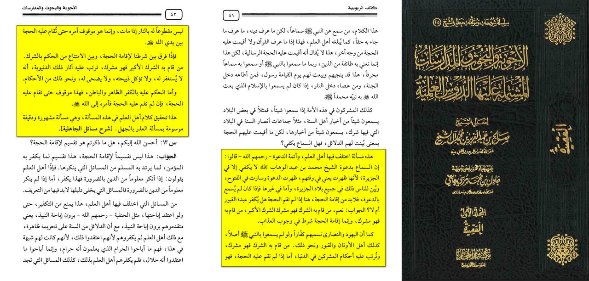

---

<!-- telegram-source: dar/messages3.html#message2811 -->
<!-- evidence-id: 000275 -->

Shaykh Ṣāliḥ Āsh-Shaykh said:

And once this has been established, we come to the matter in which most people today have fallen — ignorance of this matter. This relates to judging the current reality, and is tied to what we discussed earlier concerning the foundational principles: that kufr can arise from turning away and ignorance, or from arrogance and prideful rejection.

As for the practical side — judging people in reality — then whoever commits shirk is to be called a mushrik, whether he is knowledgeable or ignorant. However, the ruling of kufr applied to him varies.

If the prophetic proof is established upon him — meaning by someone knowledgeable and skilled in delivering it, to remove the doubts and make him understand the bounds of what Allah has revealed to His Messenger concerning tawḥīd and the clarification of shirk — and despite that, he rejects it after the proof has been made clear, then he is to be considered a kāfir both outwardly and inwardly.

As for the one who turns away, he is treated outwardly as a disbeliever, but inwardly we do not pass judgment of internal kufr upon him until the proof is established. This is because it is a well-known principle among the scholars that:

Whoever commits zinā, he is a zānī, but he may or may not be held accountable. If he knows that zinā is ḥarām and commits it, then he is held accountable. But if he is a new Muslim and commits zinā not knowing it is prohibited, the name “zinā” still applies, but he is not held accountable due to his ignorance.

This is how we reconcile the various statements reported in this area of belief.

[Sharḥ Kashf ash-Shubuhāt by Shaykh Ṣāliḥ Āsh-Shaykh p.136]

Show attached source scan

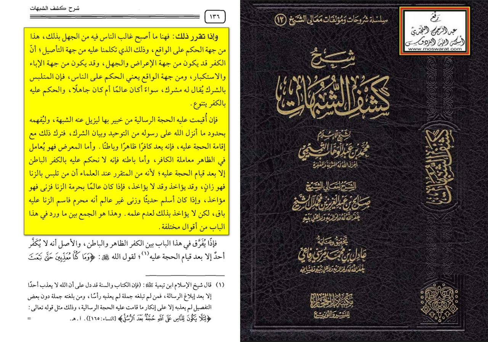

---

<!-- telegram-source: personal/messages.html#message660 -->
<!-- evidence-id: 000276 -->

Shaykh Ṣāliḥ Āl ash-Shaykh said:

Here, if the ḥujjah (proof) has not been established, are the grave-worshippers takfired or not? The answer: yes, whoever commits shirk, then he is a mushrik; shirk al-akbar, whoever commits it is a mushrik. Establishing the ḥujjah is only a condition for the obligation of punishment. Just as the Jews and Christians, we call them kuffār; they are kuffār, even if they never heard of the Prophet ﷺ at all. Likewise the people of idols and graves and the like: whoever commits shirk is a mushrik, and the rulings of the mushrikīn apply to him in the wordly ruling.

As for if the ḥujjah has not been established upon him, then it is not decisively stated that he is in the Fire if he dies; rather, his matter is suspended until the ḥujjah is established upon him before Allah. So there is a difference between making the establishment of the ḥujjah a condition, and refraining from judging shirk: whoever commits shirk al-akbar is a mushrik, and the worldly rulings follow from that—such as not seeking forgiveness for him, his slaughter not being eaten, not offering sacrifice on his behalf, and the like.

As for judging him with kufr outwardly and inwardly, then this is suspended until the ḥujjah is established upon him; and if it is not established upon him, then his affair is with Allah. This is the precise verification of the speech of Ahl al-ʿilm in this issue, and it is a well-known and subtle matter.

Show attached source scan

---

<!-- telegram-source: personal/messages.html#message525 -->
<!-- evidence-id: 000277 -->

<video class="source-video" controls preload="metadata" src="assets/videos/personal-525.mp4"></video>

Video source from the user’s Telegram export.

Shaykh Khālid al-Mushayqiḥ was asked:

Q: As for the last question, we conclude with it. It says: those who perform ṭawāf around graves or fall into some forms of shirk—do we treat them as kuffār, or are they excused due to ignorance?

A: This is the aṣl (principle): if a person sacrifices to a grave, or makes ṭawāf around a grave, or makes du‘āʾ to a grave besides Allāh, or bows or prostrates, then the aṣl is that they are mushrikūn with Allāh.

Q: Even if he outwardly shows Islām?

A: Yes, even if his outward appearance is Islām, his reality is shirk. But the aṣl is that if he directs an act of ‘ibādah to the occupant of the grave or shrine, then the ruling in origin is that he is a mushrik—yes, a mushrik with Allāh.

Show attached source scan

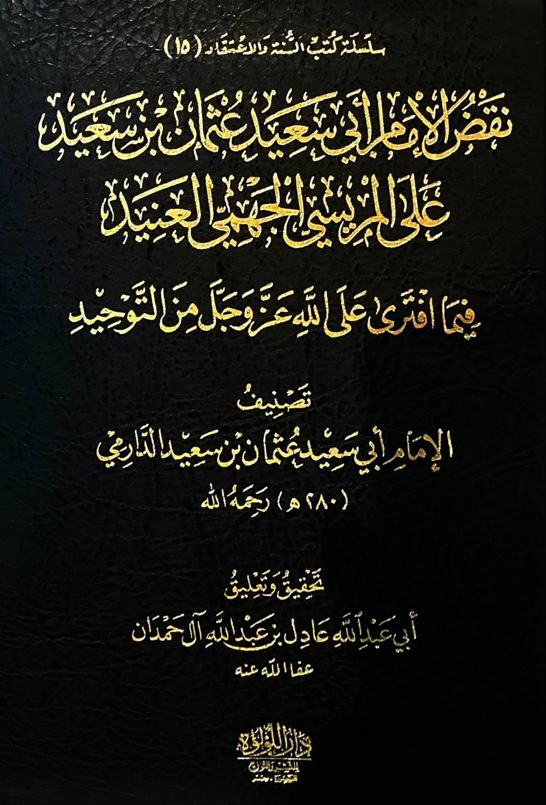

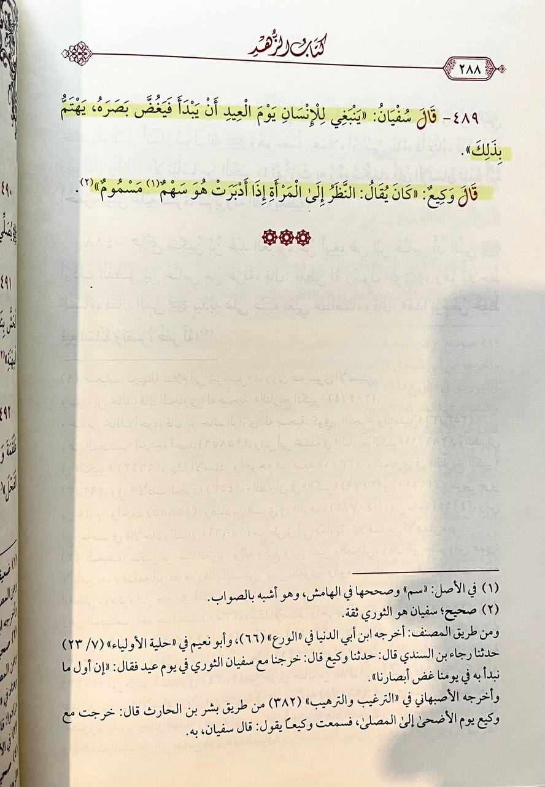

---

<!-- telegram-source: dar/messages2.html#message1388 -->
<!-- evidence-id: 000278 -->

Sheikh Salih as-Suhaymi on Udhr Bil Jahl

<video class="source-video" controls preload="metadata" src="assets/videos/dar-messages2-1388.mp4"></video>

Video source from the Telegram export.

---

<!-- telegram-source: dar/messages2.html#message1947 -->
<!-- evidence-id: 000279 -->

Sheikh Ṣāliḥ Ibn Muḥammad as-Suwaiḥ said:

The Sixth Issue: The Statement of Some Affected by the Doubts of Irjāʾ in Our Era Regarding Excusing the Grave Worshippers Due to Ignorance

The statements of the great scholars have already been cited in sufficient detail to clarify this matter. The people of Irjāʾ have used caution in takfīr as a pretext to excuse those who worship at graves. Furthermore, they have gone even further by labeling those who declare grave worshippers to be disbelievers as Khārijites!

And we say: Glory be to You! This is a great slander. The distinction between declaring Muslims as disbelievers and declaring idol worshippers as disbelievers is clear and evident. The former is the path and approach of the Khārijites, while the latter is the path and methodology of the Salaf.

Issue Seven: The Extremism of Some Who Have Been Affected by the Misconception of Irjāʾ in Our Time Regarding the Understanding of the Proof

Some individuals, influenced by the misconception of Irjāʾ, have gone to extremes in the issue of understanding the proof. You find some of them excessively excusing grave worshippers, defending them and arguing that polytheists should not be declared disbelievers even if the Qurʾān has reached them and even if they understand the truth. They say:

“Sufficient understanding is the one that removes any excuse from a person for not accepting knowledge, by eliminating the obstructing doubt. But if some level of understanding occurs without removing the doubt, then the intended goal of convincing the individual with the knowledge has not been achieved.”

Reflecting upon this statement is enough to refute and invalidate it. How much more so when the texts of the Qurʾān and Sunnah, as well as the consensus of the Salaf, clearly indicate that this claim is among the most corrupt, misguided, and farthest from the truth!

[Al-Furūq bayna ʿAqīdat al-Salaf wa ʿAqīdat al-Murjiʾah fī al-Īmān by Ṣāliḥ ibn Muḥammad al-Suwaiḥ p.161-162]

Show attached source scan

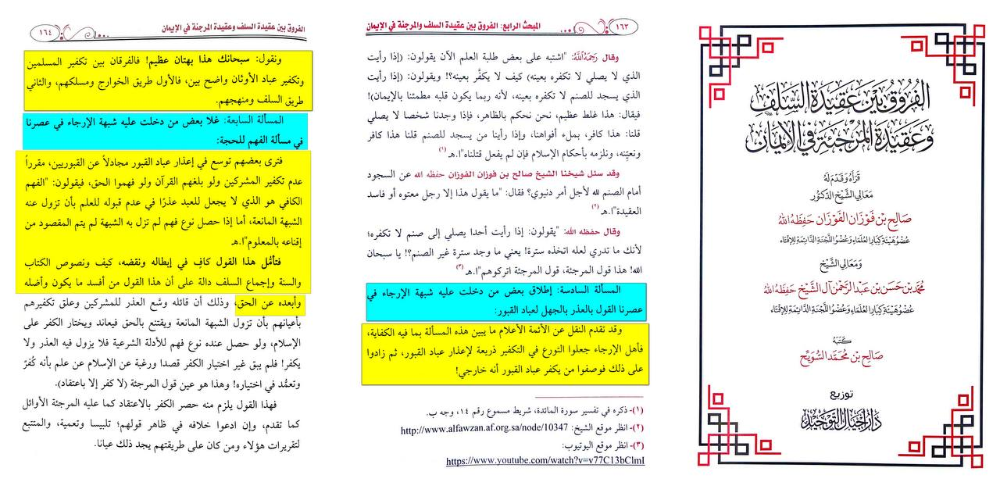

---

<!-- telegram-source: dar/messages4.html#message3495 -->
<!-- evidence-id: 000280 -->

Shaykh Ṣāliḥ al-Suwayyiḥ said:

The scholars have unanimously agreed that whoever equates Islam with any other religion, or permits practicing a religion other than Islam, is a kāfir who has left Islam. His kufr is known necessarily from the religion. Such a call is an atheistic, kufr-based call that nullifies Islam, as proven by the Qurʾān, the Sunnah, and the consensus of the scholars. Allah the Exalted has declared kāfir those who worship anyone besides Him and do not believe in His Prophet Muḥammad ﷺ, even if they were upon a religion that originally had some truth, such as one who prays, fasts, and performs ḥajj, and says “lā ilāha illā Allāh,” yet worships graves and shrines.

There is no religion except Islam, and no law accepted by Allah except that which He revealed to His Messenger, with whom He sealed the messages and abrogated all previous religions. Whoever does not submit to Allah is a kāfir, whose enmity is evident and clear, and there can be no reconciliation between him and the Muslims except with tawḥīd. The kufr of those devoted to graves, and of whoever does not follow Islam, is known by necessity from the religion. It is obligatory to show enmity toward him, to disassociate from him, and to declare him kāfir, as indicated by the Book, the Sunnah, and the consensus of the scholars.

Allah the Exalted says: “Indeed they have disbelieved who say, ‘Allah is the Messiah, the son of Mary.’” [al-Māʾidah 5:17]

And He says: “They have certainly disbelieved who say, ‘Allah is the third of three.’ But there is no deity except one God. And if they do not desist from what they are saying, there will surely afflict those who disbelieve among them a painful punishment.” [al-Māʾidah 5:73]

And He says: “They say, ‘Be Jews or Christians and you will be guided.’ Say, ‘Rather, the religion of Ibrāhīm, inclining to truth; and he was not of the polytheists.’” [al-Baqarah 2:135]

And He says: “Never will the Jews or the Christians be pleased with you until you follow their way. Say, ‘Indeed, the guidance of Allah is the only guidance.’ If you were to follow their desires after what has come to you of knowledge, you would have no protector or helper against Allah.” [al-Baqarah 2:120]

And He says: “Indeed, the religion with Allah is Islam.” [Āl ʿImrān 3:19]

And He says: “Whoever seeks a religion other than Islam, it will never be accepted from him, and he will be among the losers in the Hereafter.” [Āl ʿImrān 3:85]

And He says: “The religion of your father Ibrāhīm. It is He who named you Muslims.” [al-Ḥajj 22:78]

And He says: “You will not find a people who believe in Allah and the Last Day having affection for those who oppose Allah and His Messenger, even if they were their fathers, their sons, their brothers, or their kindred. Those—He has written faith in their hearts and supported them with a spirit from Him. And He will admit them to gardens beneath which rivers flow, to abide therein. Allah is pleased with them, and they are pleased with Him. They are the party of Allah. Unquestionably, the party of Allah—they will be successful.” [al-Mujādilah 58:22]

And He says: “O you who have believed, do not take My enemies and your enemies as allies, extending to them affection, while they have disbelieved in what came to you of the truth, driving out the Messenger and yourselves only because you believe in Allah, your Lord. If you have come out for jihād in My cause and seeking My approval, you confide affection to them, but I am most knowing of what you conceal and what you declare. And whoever does it among you has certainly strayed from the straight path. If they gain dominance over you, they would be your enemies and extend against you their hands and their tongues with evil, and they wish that you would disbelieve.” [al-Mumtaḥanah 60:1–2]

Show attached source scan

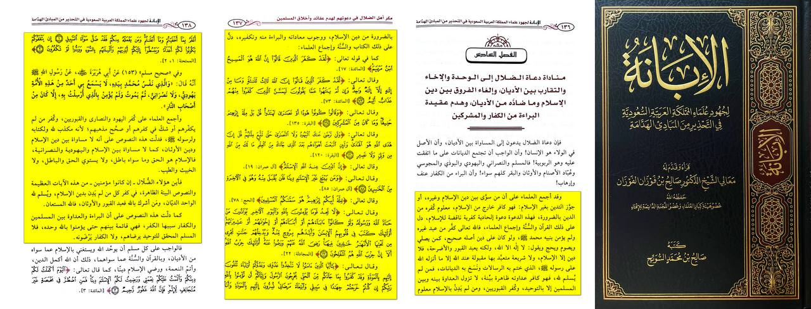

---

<!-- telegram-source: dar/messages4.html#message3191 -->
<!-- evidence-id: 000281 -->

what is the response to the one who uses the Qu'ran being created as a evidence to excusing the Mushrik - Answered by Shaykh ʿAbd Allāh al-Jarbūʿ

I asked the Shaykh:

Some of the Murjiʾah in our time use statements from some of the salaf as proof, where the salaf said that whoever claims the Qur’an is created has committed shirk. Then these people argue: “If there is an excuse (i.e., a valid excuse for ignorance) for someone who says that the Qur’an is created, then excusing someone in other matters—like worshiping other than Allah or slaughtering for other than Him—should be even more appropriate, since both are forms of shirk.” So what is the correct way to clarify this to someone who is unaware and hears this kind of argument?

The Shaykh Responded:

Worshiping other than Allah is kufr; such a person is not a Muslim at all—he is not considered a Muslim to begin with. But if someone affirms the oneness of Allah and becomes a Muslim, then falls into an act of kufr, we ask: Is this kufr definitive (qaṭʿī)—i.e., has its ruling been made clear in the Qur’an and Sunnah? If its clarification is definitive, then such a person becomes a kāfir, even if he did not realize that clarification.

However, regardless of these details, shirk —one is not considered a Muslim unless he disavows himself from shirk. No one says that a person cannot be a Muslim unless he affirms that the Qur’an is the uncreated Speech of Allah. But when it comes to shirk, there are many, many verses—decisive and conclusive—that clearly establish that one cannot be a Muslim while worshiping others besides Allah. How can such a person be judged to be Muslim?

If someone affirms tawḥīd but then falls into an act of kufr, then that is a separate matter. As for these individuals—they do not leave the people (i.e., alone); they do not back off—they continue to fight (i.e., argue), they do not stop. Don’t engage them—they will mislead you from the path of Allah. They are blind in their insight. They are blind of inner sight.

They do not distinguish between the Muslim who is muwaḥḥid and the mushrik who is najis (impure), the one who commits filthy acts of shirk. Indeed, the mushrik is impure. And Allah says: “If you commit shirk, surely your deeds will be nullified, and you will surely be among the losers.” (Surah az-Zumar 39:65) If you commit shirk, then it’s over—your matter is finished. Don’t be deceived by these people—those who do not distinguish, who blur the lines.

As for the claim that a person is excused due to ignorance (ʿudhr bil-jahl), then yes—someone might fall into shirk out of ignorance, and the Messenger has not yet reached him. They say: “We fell into it due to ignorance.” But does that mean the one who worships the ṭāghūt is a Muslim? Or that he is not a kāfir? No. The one who worships the ṭāghūt is a kāfir, not a Muslim, but behind this is fear [i.e., someone might say this out of fear]. But ʿudhr bil-jahl means: he is not punished until he is tested. But he is still not a Muslim. The one who commits shirk is not a Muslim. Islam is tawḥīd. Islam is tawḥīd. Islam is tawḥīd.

Fatawa date: 29th Jul 2025

<video class="source-video" controls preload="metadata" src="assets/videos/dar-messages4-3191.mp4"></video>

Video source from the Telegram export.

---

<!-- telegram-source: dar/messages4.html#message3557 -->
<!-- evidence-id: 000282 -->

Shaykh Abī al-ʿAlā ar-Rāshid said:

His saying, the Exalted: “And if any one of the mushrikīn seeks your protection, then grant him protection so that he may hear the words of Allāh. Then deliver him to his place of safety. That is because they are a people who do not know.” (al-Tawbah 9:6)

The implication of this verse is that Allāh, Blessed and Exalted, commanded His Messenger ﷺ that if a person from the mushrikīn seeks protection with him, he should grant it until the person hears the words of Allāh, so that the ḥujjah is established against him. After hearing, no excuse remains. This aligns with what the prominent scholars have stated: the ḥujjah in tawḥīd is established once the Qur’ān reaches a person and is heard.

Thus, the verse clearly indicates that ḥujjah is established by hearing the Qur’ān. In our time, the people of shirk are constantly exposed to the recitation of the Qur’ān, which contains the command to uphold tawḥīd and the prohibition against shirk.

[al-Mulakhkhaṣ al-Mufīd li-ʿĀriḍ al-Jahl wa Atharuhu ʿalā Masāʾil al-ʿAqīdah wa at-Tawḥīd by Shaykh Abī al-ʿAlā ar-Rāshid p.120]

Show attached source scan

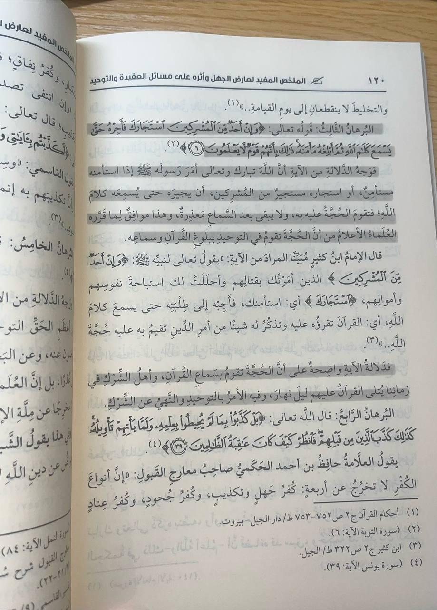

---

<!-- telegram-source: dar/messages4.html#message4078 -->
<!-- evidence-id: 000283 -->

Shaykh Abī al-ʿAlā ar-Rāshid said:

His saying, Exalted is He: “And so to many of the Mushrikūn, their "partners" have made fair-seeming the killing of their children, in order to lead them to their own destruction and cause confusion in their religion. And if Allāh had willed, they would not have done so. So leave them alone with their fabrications.” [al-Anʿām: 137]

The point of indication in this verse is that it speaks in the context of the kuffār and mushrikīn presenting their children as vows and offerings to idols and images besides Allāh, Blessed and Exalted. And there is no doubt that this is al-shirk al-akbar, which is among the gravest sins. Then He, Exalted is His status, informs us that behind this shirk are partners and devils who make it seem attractive, adorn it, and confuse it—meaning: they mix truth with falsehood as a beautification and adornment of shirk.

Yet despite this beautifying, embellishing, and confusing of this falsehood by these partners for their followers, Allāh did not make this an excuse for those who obeyed them and followed them out of ignorance of the reality of this embellishment and confusion. Rather, He named the one who obeys these partners a mushrik.

[al-Mulakhkhaṣ al-Mufīd li-ʿĀriḍ al-Jahl wa Atharuhu ʿalā Masāʾil al-ʿAqīdah wa at-Tawḥīd by Shaykh Abī al-ʿAlā ar-Rāshid p.118]

Show attached source scan

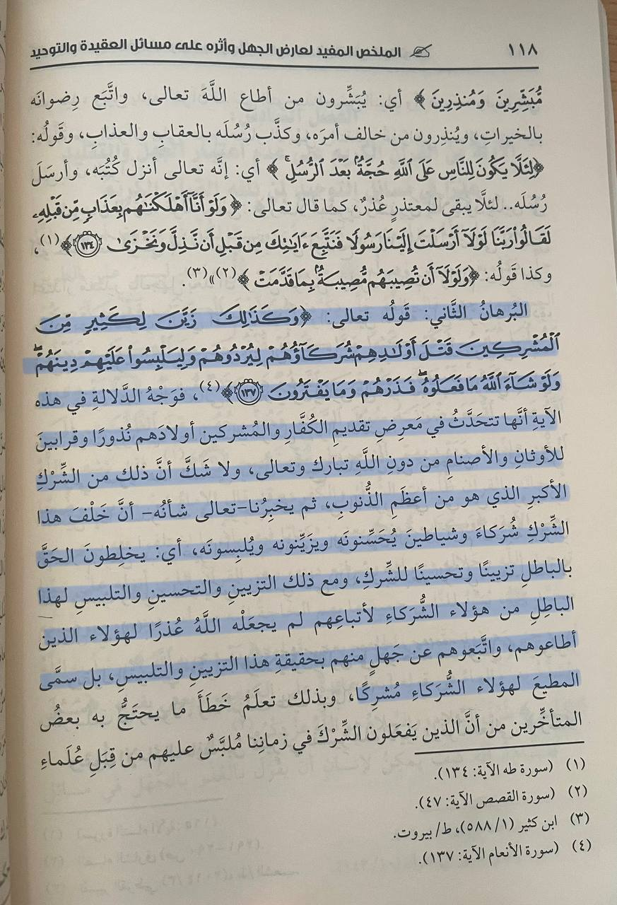

---

<!-- telegram-source: dar/messages4.html#message4122 -->
<!-- evidence-id: 000284 -->

Dr. Muḥammad ibn ʿUmar Bāzmūl said:

The statement that whoever bears witness that lā ilāha illā Allāh yet directs worship to other than Allāh — such as slaughtering, making vows to a walī, to a grave or shrine, circumambulating a grave or shrine, or calling upon a dead person — and then saying that this person is a Muslim as long as he acted out of jahl, contains a contradiction. How can he be described as a Muslim when he contradicts tawḥīd at its very foundation and directs worship to other than Allāh? Rather, this action is shirk, and he is a mushrik in essence.

If he is alive and comes to know and understand, then if he repents and returns, then praise is due to Allāh, and we judge him to be a Muslim. If he has died, then we judge him in the worldly rulings as a mushrik, while his matter in the Hereafter, if he was ignorant, is left to Allāh.

As for judging him to be a Muslim merely because he uttered the shahādatayn while he practices acts of shirk by directing worship to other than Allāh, then this is irjāʾ.

I seek forgiveness from Allāh and repent to Him for any expression that may have come from me contrary to this.

Therefore, it is necessary to distinguish between the rulings of this world and the rulings of the Hereafter with regard to those who fall into shirk out of ignorance and believe that they have not contradicted Islām.

Muḥammad ibn ʿUmar Bāzmūl

1 Jumādā al-Ākhirah 1447 AH

Dr. Muḥammad ibn ʿUmar Bāzmūl repented from his prior error and affirmed the truth, we hope Allah corrects any other errors he may have, may Allah guide us all.

The post can be found on his Facebook page: https://tinyurl.com/mbazmool

Show attached source scan

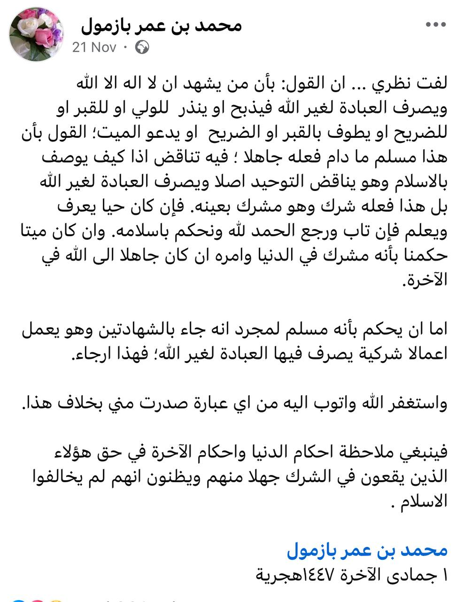

---

<!-- telegram-source: dar/messages4.html#message4147 -->
<!-- evidence-id: 000285 -->

Shaykh Muḥammad ad-Dawsarī said:

And irjāʾ continued in the ummah throughout the ages, its fire sometimes dimming—when the light of knowledge increased—and sometimes blazing—when the light of knowledge waned—until its effects became clearly visible in the ummah today. Indeed, it has become a practical reality: many people today suffice with belief in the heart and uttering the shahādatayn, then commit whatever sins they wish and abandon many obligations, if not all; moreover, many frequent graves and shrines, engaging in shirk al-akbar and falsehood, yet still consider themselves within Islam and among the Muslims.

And despite all this, today one sees those defending that corrupt school and supporting it, presenting it as the madhhab of the salaf of the ummah. Whoever denies it is labeled an khārijī takfīrī, speaking about what he does not know, lacking both knowledge and patience, obsessed with declaring Muslims as disbelievers.

And that defender authored parts, books, fatwās, and responses with differing titles but unified goals: the single goal of supporting that disgraceful madhhab. Among those who carried this banner and was fanatic for it is ʿAlī ibn Ḥasan al-Ḥalabī.

[Rafʿ al-Lāʾimah ʿan Fatwā al-Lajnah ad-Dāʾimah by Shaykh Muḥammad ad-Dawsarī  p.73]

Show attached source scan

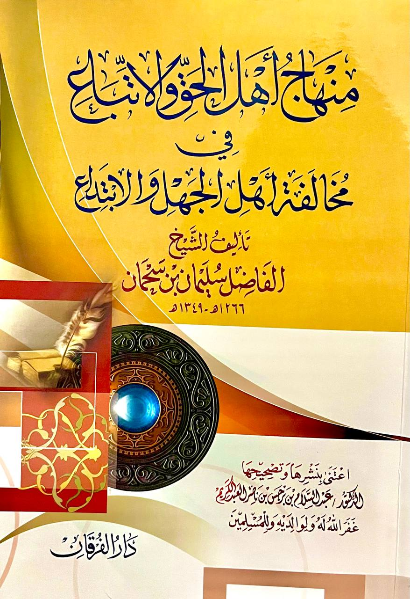

---

<!-- telegram-source: dar/messages3.html#message2871 -->
<!-- evidence-id: 000286 -->

The contradiction of those who say there is Excuse of Ignorance for the one who associates partners with Allah.

<video class="source-video" controls preload="metadata" src="assets/videos/dar-messages3-2871.mp4"></video>

Video source from the Telegram export.

---

<!-- telegram-source: personal/messages.html#message518 -->
<!-- evidence-id: 000287 -->

### Diagram: the ruling on one who falls into major shirk
<!-- evidence-id: 000288 -->

The English and Arabic versions are displayed together below.

<figure>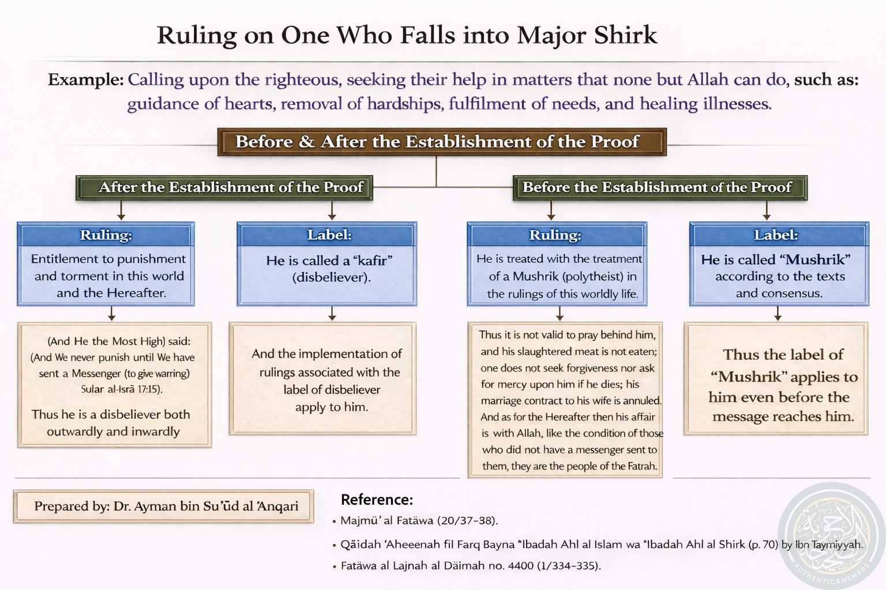<figcaption>English diagram</figcaption></figure>
<figure>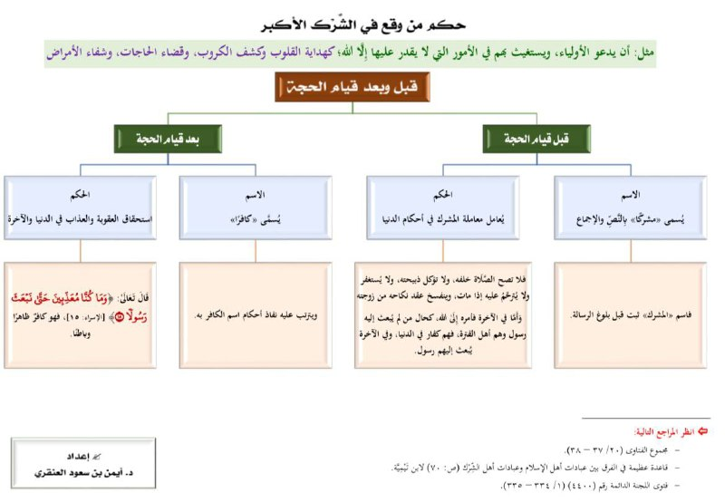<figcaption>Arabic diagram</figcaption></figure>

---

## 6. One who calls the mushrik a Muslim or excuses the mushrikīn

### The foundational rule: the third nullifier
<!-- evidence-id: 000289 -->

Show Arabic source text

المصدر: محمد بن عبد الوهاب، <em>نواقض الإسلام</em>، ص. 2 في نسخة المكتبة المحلية؛ وانظر: <em>الدرر السنية في الأجوبة النجدية</em>، 2/361 و10/91.

الثَّالِثُ: مَنْ لَمْ يُكَفِّرِ الْمُشْرِكِينَ، أَوْ شَكَّ فِي كُفْرِهِمْ، أَوْ صَحَّحَ مَذْهَبَهُمْ، كَفَرَ.

**English**

“The third: whoever does not declare the mushrikīn disbelievers, doubts their disbelief, or considers their way correct, has disbelieved.”

Source: Muḥammad ibn ʿAbd al-Wahhāb, *Nawāqiḍ al-Islām*, p. 2 in the local library edition; also *al-Durar al-Saniyyah*, 2/361 and 10/91.

<!-- telegram-source: dar/messages3.html#message2182 -->
<!-- evidence-id: 000290 -->

Sheikh Muḥammad bin ʿAbd al-Wahhāb mentioned some nullifiers of Islam and said:

First: Associating partners with Allah (shirk) in His worship. Allah says: {Indeed, Allah does not forgive associating partners with Him, but He forgives anything less than that for whom He wills} (Sūrat al-Nisāʾ: 48).

And He also says: {Indeed, whoever associates partners with Allah, then Allah has forbidden Paradise for him, and his refuge will be the Fire, and the wrongdoers will have no helpers} (Sūrat al-Māʾidah: 72).

An example of this is slaughtering for other than Allah, such as someone who sacrifices for the jinn or at a grave.

Second: Whoever places intermediaries between himself and Allah, calling upon them, seeking their intercession, and relying on them—he has committed disbelief by ijmāʿ.

Third: Whoever does not declare the polytheists as disbelievers, or doubts their disbelief, or considers their beliefs to be valid—he has committed disbelief.

[Ad-Durar as-Saniyyah 2/361]

Show attached source scan

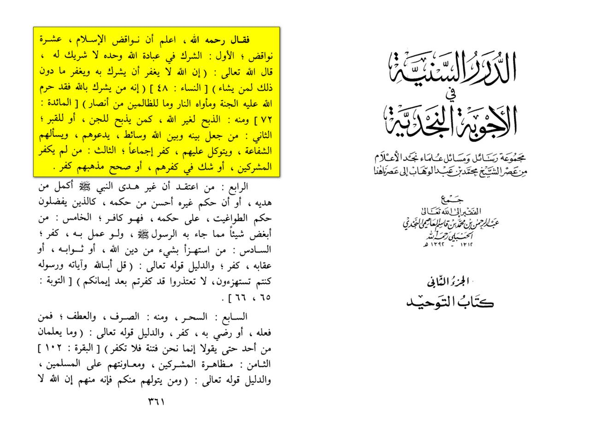

---

### Muḥammad ibn ʿAbd al-Wahhāb against calling grave worshippers Muslims
<!-- evidence-id: 000291 -->

Show Arabic source text

قَالَ: وَهَذَا يَعْرِفُهُ مَنْ لَهُ أَدْنَى إِلْمَامٍ بِشَيْءٍ مِنَ الْعِلْمِ وَالدِّينِ، فَتَسْمِيَةُ عُبَّادِ الْقُبُورِ مُسْلِمِينَ، لِأَنَّهُمْ يُصَلُّونَ وَيَصُومُونَ، وَيُؤْمِنُونَ بِالْبَعْثِ، مُجَرَّدُ تَعْمِيَةٍ عَلَى الْعَوَامِّ، وَتَلْبِيسٍ، لِيَنْفُقَ شِرْكُهُمْ، وَيُقَالَ بِإِسْلَامِهِمْ وَإِيمَانِهِمْ، وَيَأْبَى اللَّهُ ذَلِكَ وَرَسُولُهُ وَالْمُؤْمِنُونَ.

المصدر: محمد بن عبد الوهاب، نقله عبد اللطيف آل الشيخ، <em>الدرر السنية في الأجوبة النجدية</em>، 12/536.

**English**

Shaykh Muḥammad ibn ʿAbd al-Wahhāb said:

“This is known to anyone who has even the slightest acquaintance with knowledge and the religion. Thus, calling the grave worshippers ‘Muslims’ because they pray, fast, and believe in the Resurrection is nothing but deceiving the common people and causing confusion, so that their shirk may be promoted and it may be claimed that they are Muslims and believers. But Allāh, His Messenger ﷺ, and the believers reject that.”

Source: Muḥammad ibn ʿAbd al-Wahhāb, as transmitted by ʿAbd al-Laṭīf Āl al-Shaykh, *al-Durar al-Saniyyah*, 12/536.

Show attached source scan

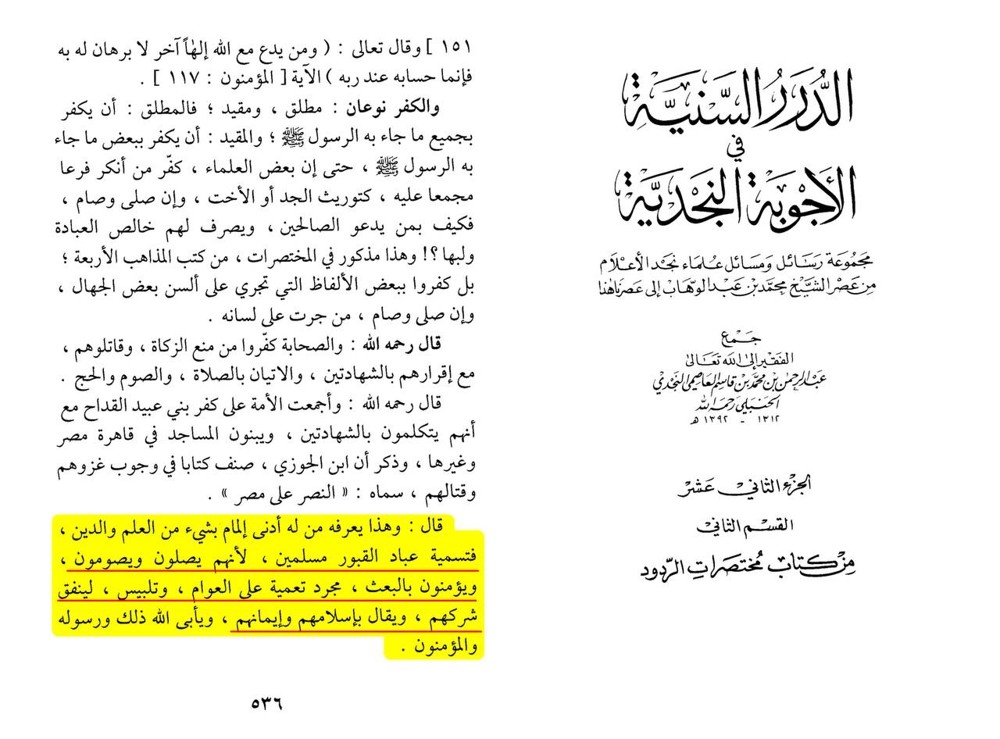

---

### The sons of Muḥammad ibn ʿAbd al-Wahhāb
<!-- evidence-id: 000292 -->

Show Arabic source text

وَقَالَ الشَّيْخُ حُسَيْنٌ، وَالشَّيْخُ عَبْدُ اللَّهِ، ابْنَا الشَّيْخِ مُحَمَّدٍ، رَحِمَهُمُ اللَّهُ تَعَالَى، فِي أَثْنَاءِ جَوَابٍ لَهُمَا: الْمَسْأَلَةُ الْحَادِيَةَ عَشْرَةَ: رَجُلٌ دَخَلَ هَذَا الدِّينَ وَأَحَبَّهُ، وَلَكِنْ لَا يُعَادِي الْمُشْرِكِينَ، أَوْ عَادَاهُمْ وَلَمْ يُكَفِّرْهُمْ، أَوْ قَالَ: أَنَا مُسْلِمٌ، وَلَكِنْ لَا أَقْدِرُ أَنْ أُكَفِّرَ أَهْلَ لَا إِلَهَ إِلَّا اللَّهُ، وَلَوْ لَمْ يَعْرِفُوا مَعْنَاهَا، وَرَجُلٌ دَخَلَ هَذَا الدِّينَ وَأَحَبَّهُ، وَلَكِنْ يَقُولُ: لَا أَتَعَرَّضُ لِلْقِبَابِ، وَأَعْلَمُ أَنَّهَا لَا تَنْفَعُ وَلَا تَضُرُّ، وَلَكِنْ مَا أَتَعَرَّضُهَا.

الْجَوَابُ: أَنَّ الرَّجُلَ لَا يَكُونُ مُسْلِمًا، إِلَّا إِذَا عَرَفَ التَّوْحِيدَ وَدَانَ بِهِ، وَعَمِلَ بِمُوجَبِهِ، وَصَدَّقَ الرَّسُولَ صَلَّى اللَّهُ عَلَيْهِ وَسَلَّمَ فِيمَا أَخْبَرَ بِهِ، وَأَطَاعَهُ فِيمَا نَهَى عَنْهُ وَأَمَرَ بِهِ، وَآمَنَ بِهِ وَبِمَا جَاءَ بِهِ. فَمَنْ قَالَ: لَا أُعَادِي الْمُشْرِكِينَ، أَوْ عَادَاهُمْ وَلَمْ يُكَفِّرْهُمْ، أَوْ قَالَ: لَا أَتَعَرَّضُ أَهْلَ لَا إِلَهَ إِلَّا اللَّهُ، وَلَوْ فَعَلُوا الْكُفْرَ وَالشِّرْكَ وَعَادَوْا دِينَ اللَّهِ، أَوْ قَالَ: لَا أَتَعَرَّضُ لِلْقِبَابِ، فَهَذَا لَا يَكُونُ مُسْلِمًا، بَلْ هُوَ مِمَّنْ قَالَ اللَّهُ فِيهِمْ: {وَيَقُولُونَ نُؤْمِنُ بِبَعْضٍ وَنَكْفُرُ بِبَعْضٍ وَيُرِيدُونَ أَنْ يَتَّخِذُوا بَيْنَ ذَلِكَ سَبِيلًا أُولَئِكَ هُمُ الْكَافِرُونَ حَقًّا}.

المصدر: حسين وعبد الله ابنا محمد بن عبد الوهاب، <em>الدرر السنية في الأجوبة النجدية</em>، 10/139–140.

Shaykhs Ḥusayn and ʿAbd Allāh, the sons of Shaykh Muḥammad ibn ʿAbd al-Wahhāb, may Allāh the Exalted have mercy on them, said in the course of one of their answers:

“The eleventh issue: A man has entered this religion and loves it, but he does not show enmity toward the mushrikīn. Or he shows them enmity but does not declare them disbelievers. Or he says, ‘I am a Muslim, but I am unable to declare the people of lā ilāha illā Allāh disbelievers, even if they do not know its meaning.’ Another man has entered this religion and loves it, but he says, ‘I do not oppose the domes. I know that they neither benefit nor harm, but I do not oppose them.’

The answer: A man is not a Muslim unless he knows tawḥīd, embraces it as his religion, acts according to what it requires, believes the Messenger ﷺ concerning what he informed of, obeys him in what he prohibited and commanded, and believes in him and in what he brought. Therefore, whoever says, ‘I do not show enmity toward the mushrikīn,’ or shows them enmity but does not declare them disbelievers, or says, ‘I do not oppose the people of lā ilāha illā Allāh, even if they commit kufr and shirk and oppose the religion of Allāh,’ or says, ‘I do not oppose the domes,’ is not a Muslim. Rather, he is among those concerning whom Allāh said: ‘They say, “We believe in some and disbelieve in others,” and wish to take a path between that. It is they who are truly the disbelievers.’”

Source: Ḥusayn and ʿAbd Allāh, the sons of Muḥammad ibn ʿAbd al-Wahhāb, *al-Durar al-Saniyyah*, 10/139–140.

<!-- telegram-source: dar/messages5.html#message5056 -->
<!-- evidence-id: 000293 -->

The one who calls a grave worshipper a Muslim, and refrains from takfiring them is also a kāfir like them after proof is established.

Shaykh Sulaymān ibn ʿAbd Allāh Āl ash-Shaykh was asked:

As for the statement of the questioner: ‘If he is unable to utter their kufr and revile them, what is his ruling?’

Then the answer: this is not free from either him being doubtful regarding their kufr, or ignorant of it, or affirming that they are kuffār, they and those like them, but he is not able to confront them and declare their kufr, or he says: ‘Others besides them are kuffār, but I do not say that they are kuffār.’

So if he is doubtful regarding their kufr or ignorant of their kufr, the evidences from the Book of Allah and the Sunnah of His Messenger ﷺ concerning their kufr are clarified to him.

Then if he doubts after that or hesitates, then he is a kāfir by ijmāʿ of the scholars: that whoever doubts the kufr of the kāfir, then he is a kāfir.

And if he affirms their kufr, but is unable to confront them by declaring their kufr, then he is compromising with them, and he enters into His statement: ‘They wish that you should compromise (in religion out of courtesy) with them: so they (too) would compromise with you.’ [al-Qalam 68:9] And he has the ruling of his likes from the people of sins.

And if he says: ‘I say others besides them are kuffār, but I do not say they are kuffār,’ then this is a ruling from him that they are muslims, since there is no middle ground between kufr and Islam. So if they are not kuffār, then they are Muslims. Thus, whoever names kufr “Islam,” or names the kuffār “Muslims,” then he is a kāfir, so this one becomes a kāfir.

As for his statement: ‘If you know this from a person, what becomes obligatory upon you?’

Then the answer: it is obligatory upon you to advise him, call him to Allah, and make him know the ugliness of what he has committed. Then if he repents, then this is what is sought.

And if he persists and is obstinate, then he has the ruling of what he committed: if it was kufr, then he is a kāfir; and if it was disobedience or sin, then he is a sinful disobedient person. It is obligatory to condemn him, discipline him, boycott him, and distance him until he repents.

And the Prophet ﷺ boycotted those who stayed behind from a single expedition, and forbade speaking to them and giving salām to them. So how about one who allies with the kuffār  and displays affection toward them?”

[ad-Durar as-Saniyyah 8/160-161]

Show attached source scan

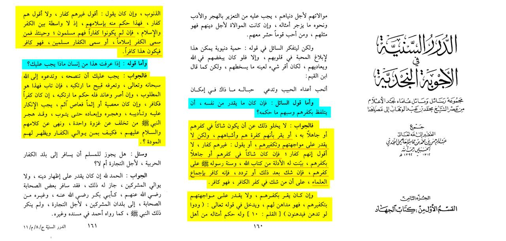

---

### Calling the disbelievers Muslims
<!-- evidence-id: 000294 -->

Show Arabic source text

المصدر: سليمان بن عبد الله، *الدرر السنية في الأجوبة النجدية*، 8/161.

وَإِنْ كَانَ يَقُولُ: أَقُولُ غَيْرَهُمْ كُفَّارٌ، وَلَا أَقُولُ هُمْ كُفَّارٌ، فَهَذَا حُكْمٌ مِنْهُ بِإِسْلَامِهِمْ، إِذْ لَا وَاسِطَةَ بَيْنَ الْكُفْرِ وَالْإِسْلَامِ؛ فَإِنْ لَمْ يَكُونُوا كُفَّارًا فَهُمْ مُسْلِمُونَ. وَحِينَئِذٍ فَمَنْ سَمَّى الْكُفْرَ إِسْلَامًا، أَوْ سَمَّى الْكُفَّارَ مُسْلِمِينَ، فَهُوَ كَافِرٌ.

**English**

“If he says, ‘I call others disbelievers, but I do not call these people disbelievers,’ this is a ruling from him that they are Muslims, since there is no middle position between disbelief and Islam. If they are not disbelievers, they are Muslims. Therefore, whoever calls disbelief Islam or calls the disbelievers Muslims is a disbeliever.”

Source: Sulaymān ibn ʿAbd Allāh, al-Durar al-Saniyyah, 8/161.

The order of this passage matters: the author first distinguishes doubt, ignorance, inability to confront, and an affirmative judgment that the people are Muslims. He directs that evidence be explained to the doubtful or ignorant person before giving the later ruling.

### ʿAbd al-Raḥmān ibn Ḥasan: the categories that oppose the foundation of Islam
<!-- evidence-id: 000295 -->

Show Arabic source text

المصدر: عبد الرحمن بن حسن، <em>الدرر السنية في الأجوبة النجدية</em>، 8/264–265.

وَأَمَّا قَوْلُهُ: وَمَنْ كَفَّرَ مُسْلِمًا فَهُوَ الْكَافِرُ. فَالْجَوَابُ: أَنَّهُ مَا مِنْ أَحَدٍ إِلَّا وَهُوَ يَدَّعِي الْإِسْلَامَ لِنَفْسِهِ، وَلِكُلِّ قَوْلٍ حَقِيقَةٌ. وَقَدْ ذَكَرَ شَيْخُنَا رَحِمَهُ اللَّهُ تَعَالَى تَعْرِيفًا جَامِعًا لِأَصْلِ الْإِسْلَامِ، قَالَ: أَصْلُ دِينِ الْإِسْلَامِ وَقَاعِدَتُهُ أَمْرَانِ: الْأَمْرُ بِعِبَادَةِ اللَّهِ وَحْدَهُ لَا شَرِيكَ لَهُ، وَالتَّحْرِيضُ عَلَى ذَلِكَ، وَالْمُوَالَاةُ فِيهِ، وَتَكْفِيرُ مَنْ تَرَكَهُ. الثَّانِي: الْإِنْذَارُ عَنِ الشِّرْكِ فِي عِبَادَةِ اللَّهِ، وَالتَّغْلِيظُ فِي ذَلِكَ، وَالْمُعَادَاةُ فِيهِ، وَتَكْفِيرُ مَنْ فَعَلَهُ.

وَالْمُخَالِفُ فِي ذَلِكَ أَنْوَاعٌ: فَأَشَدُّهُمْ مُخَالَفَةً مَنْ خَالَفَ فِي الْجَمِيعِ. وَمِنْهُمْ: مَنْ عَبَدَ اللَّهَ وَحْدَهُ، وَلَمْ يُنْكِرِ الشِّرْكَ. وَمِنْهُمْ: مَنْ أَشْرَكَ وَلَمْ يُنْكِرِ التَّوْحِيدَ. وَمِنْهُمْ: مَنْ أَنْكَرَ الشِّرْكَ وَلَمْ يُعَادِ أَهْلَهُ. وَمِنْهُمْ: مَنْ عَادَاهُمْ وَلَمْ يُكَفِّرْهُمْ.

وَمِنْهُمْ: مَنْ لَمْ يُحِبَّ التَّوْحِيدَ وَلَمْ يُبْغِضْهُ. وَمِنْهُمْ: مَنْ أَنْكَرَهُ وَلَمْ يُعَادِ أَهْلَهُ. وَمِنْهُمْ: مَنْ عَادَاهُمْ وَلَمْ يُكَفِّرْهُمْ. وَمِنْهُمْ: مَنْ كَفَّرَهُمْ وَزَعَمَ أَنَّهُ مَسَبَّةٌ لِلصَّالِحِينَ. وَمِنْهُمْ: مَنْ لَمْ يُبْغِضِ الشِّرْكَ وَلَمْ يُحِبَّهُ. وَمِنْهُمْ: مَنْ لَمْ يَعْرِفِ الشِّرْكَ وَلَمْ يُنْكِرْهُ.

وَمِنْهُمْ، وَهُوَ أَشَدُّ الْأَنْوَاعِ خَطَرًا: مَنْ عَمِلَ بِالتَّوْحِيدِ وَلَمْ يَعْرِفْ قَدْرَهُ، فَلَمْ يُبْغِضْ مَنْ تَرَكَهُ وَلَمْ يُكَفِّرْهُمْ. وَمِنْهُمْ: مَنْ تَرَكَ الشِّرْكَ وَكَرِهَهُ وَأَنْكَرَهُ وَلَمْ يَعْرِفْ قَدْرَهُ، فَلَمْ يُعَادِ أَهْلَهُ وَلَمْ يُكَفِّرْهُمْ. وَكُلُّ هَؤُلَاءِ قَدْ خَالَفُوا مَا جَاءَ بِهِ الْأَنْبِيَاءُ مِنْ دِينِ اللَّهِ. انْتَهَى كَلَامُهُ رَحِمَهُ اللَّهُ تَعَالَى.

فَيُقَالُ لِهَذَا الْمِسْكِينِ: تَفَطَّنْ فِي نَفْسِكَ! هَلْ أَنْتَ دَاخِلٌ فِي هَذِهِ الْأَنْوَاعِ؟ فَإِنْ كُنْتَ فِيهَا، فَمَا أَسْلَمْتَ حَتَّى يَثْبُتَ لَكَ الْإِسْلَامُ.

**English**

“As for his statement, ‘Whoever declares a Muslim disbeliever is himself the disbeliever,’ the answer is that there is no one except that he claims Islam for himself, but every claim has a reality.

Our shaykh, may Allāh have mercy upon him, gave a comprehensive definition of the foundation of Islam. He said: ‘The foundation and principle of the religion of Islam consists of two matters. The first is commanding the worship of Allāh alone without partner, encouraging it, showing loyalty upon it, and declaring disbeliever the one who abandons it. The second is warning against shirk in the worship of Allāh, treating it severely, showing enmity because of it, and declaring disbeliever the one who commits it.’

Those who oppose this are of various types. The most severe in opposition is the one who opposes all of it. Among them is one who worships Allāh alone but does not reject shirk; one who commits shirk but does not reject tawḥīd; one who rejects shirk but does not show enmity to its people; and one who shows enmity to them but does not declare them disbelievers.

Among them is one who neither loves nor hates tawḥīd; one who rejects it but does not show enmity to its people; one who shows enmity to them but does not declare them disbelievers; one who declares its people disbelievers but claims that this insults the righteous; one who neither hates nor loves shirk; and one who neither recognizes nor rejects shirk.

Among them, and this is the most dangerous category, is one who acts upon tawḥīd but does not recognize its worth, so he neither hates those who abandon it nor declares them disbelievers. Among them is one who abandons, hates, and rejects shirk but does not recognize its worth, so he neither shows enmity to its people nor declares them disbelievers. All of these have opposed what the Prophets brought of the religion of Allāh.’ End of his words, may Allāh have mercy upon him.

It is said to this unfortunate person: examine yourself carefully. Are you included among these categories? If you are among them, you have not entered Islam until Islam is established for you.”

Source: ʿAbd al-Raḥmān ibn Ḥasan, *al-Durar al-Saniyyah*, 8/264–265.

### ʿAbd al-Raḥmān ibn Ḥasan: what lā ilāha illā Allāh requires
<!-- evidence-id: 000296 -->

Show Arabic source text

المصدر: عبد الرحمن بن حسن، <em>الدرر السنية في الأجوبة النجدية</em>، 2/207.

وَمِنْهُمْ مَنْ عَادَاهُمْ وَلَمْ يُكَفِّرْهُمْ؛ فَهَذَا النَّوْعُ أَيْضًا لَمْ يَأْتِ بِمَا دَلَّتْ عَلَيْهِ لَا إِلَهَ إِلَّا اللَّهُ مِنْ نَفْيِ الشِّرْكِ، وَمَا تَقْتَضِيهِ مِنْ تَكْفِيرِ مَنْ فَعَلَهُ بَعْدَ الْبَيَانِ إِجْمَاعًا؛ وَهُوَ مَضْمُونُ سُورَةِ الْإِخْلَاصِ، وَقُلْ يَا أَيُّهَا الْكَافِرُونَ، وَقَوْلِهِ فِي آيَةِ الْمُمْتَحَنَةِ: كَفَرْنَا بِكُمْ. وَمَنْ لَمْ يُكَفِّرْ مَنْ كَفَّرَهُ الْقُرْآنُ فَقَدْ خَالَفَ مَا جَاءَتْ بِهِ الرُّسُلُ مِنَ التَّوْحِيدِ وَمَا يُوجِبُهُ.

**English**

“Among them are those who oppose the mushrikīn but do not declare them disbelievers. This type has likewise not fulfilled what lā ilāha illā Allāh indicates of negating shirk and what it requires, by consensus after clarification, of declaring the one who commits it a disbeliever. This is the content of Sūrat al-Ikhlāṣ, Sūrat al-Kāfirūn, and His statement in al-Mumtaḥanah, ‘We reject you.’ Whoever does not declare disbelievers those whom the Qurʾān declared disbelievers has opposed the tawḥīd brought by the Messengers and what it necessitates.”

Source: ʿAbd al-Raḥmān ibn Ḥasan, *al-Durar al-Saniyyah*, 2/207.

<!-- telegram-source: dar/messages4.html#message3646-message3648 -->
<!-- evidence-id: 000297 -->

Shaykh ʿAbd ar-Raḥmān ibn Qāsim an-Najdī said:

Allah the Exalted says: “and not associate in the worship of his Lord anyone.” (Qur’ān 18:110) This is the clearest proof that worshipping the prophets or anyone else besides Allah is shirk with Allah. Whoever associates them with Allah in His worship is not from the Ummah of Muḥammad ﷺ — not among the muwaḥḥidīn (monotheists) who respond to Allah and His Messenger.

And whoever prevents or forbids takfīr of one who commits shirk with Allah, equates others with Him, or rejects what has come in this regard from the Kitāb and the Sunnah, and speaks about Allah and His Messenger without knowledge — then it is necessary to judge him by the ruling of the Kitāb and the Sunnah as being a kāfir and mushrik, whether he accepts that or not.

And whoever does not declare a disbeliever the one who associates partners with Allah and equates others with Him — such a person is himself a kāfir by ijmāʿ of the Muslims.

Indeed, every shirk that has appeared in the world has only come about through the opinions of people like you — you are the ones who command shirk, act upon it, and call others to it. And those among you who do not command it, do not forbid it either, nor do they declare disbelievers those who commit it. You have resembled those who invented shirk and introduced into the religion of Allah those wicked foundations whose consequence is to make equals with the Lord of the Worlds, to set others as His equals, to show enmity toward His awliyāʾ and His party, and to ascribe to them what does not befit them.

And this — that very thing — is the essence of filth, impurity, and corruption. Allah the Exalted said: “And We made them leaders inviting to the Fire, and on the Day of Resurrection they will not be helped. And We caused to overtake them in this world a curse, and on the Day of Resurrection they will be of the despised.” (Qur’ān 28:41–42).

And his statement — “And your declaring the Ummah of Muḥammad disbelievers without right” — means that he was astonished that we declare as disbelievers those who worship others along with Allah. That, in reality, is the essence of the matter.

He (the objector) falsely portrays them — those who worship alongside Allah other deities — as being part of the Ummah of Muḥammad that has responded and affirmed pure monotheism. This is nothing but deceptive pretense and falsehood, which he fabricates and repeats to divert people from the path of Allah without right, and to confuse the ignorant.

If he possessed sound reason and knowledge — to discern what the Messenger of Allah ﷺ was upon — namely, takfīr upon those who worship with Allah others besides Him, and that he (the Prophet ﷺ) disputed with the mushrikūn of the Arabs and their likes, who made with Allah another deity — he would not have exposed this disgrace of his.

We say: This is a tremendous slander. We have not declared the Ummah of Muḥammad to be disbelievers. Rather, we have applied the Qur’ānic verses according to their true indication and necessary implication — declaring as disbelievers those who call upon other than Allah and associate partners with Him.

We have declared them disbelievers only for what Allah and His Messenger have declared disbelief for — in obedience to Allah and His Messenger, and in following what Allah and His Messenger have commanded, upon which the people of knowledge have agreed by ijmāʿ.

And whoever does not declare the mushrikīn disbelievers, or doubts their disbelief, or approves of their creed, has himself committed disbelief.

Woe unto him! Where is our “declaring the Ummah of Muḥammad disbelievers”? Rather, the reality of his doctrine is that, according to him, the monotheistic Ummah of Muḥammad consists of the worshippers of graves, the prophets, and the righteous — those who make with Allah other deities, ask them to fulfill their needs, and seek from them relief from their distresses, and who turn to them in times of hardship and affliction.

These are the very people whom the Qurʾān declared to be kuffār, and for whose combat the Messenger ﷺ was sent, a matter upon which the Muslims have an undeniable ijmāʿ.

Source: ʿAbd ar-Raḥmān ibn Qāsim an-Najdī, *as-Sayf al-Maslūl ʿalā ʿĀbid ar-Rasūl*, pp. 98–99.

Show attached source scan

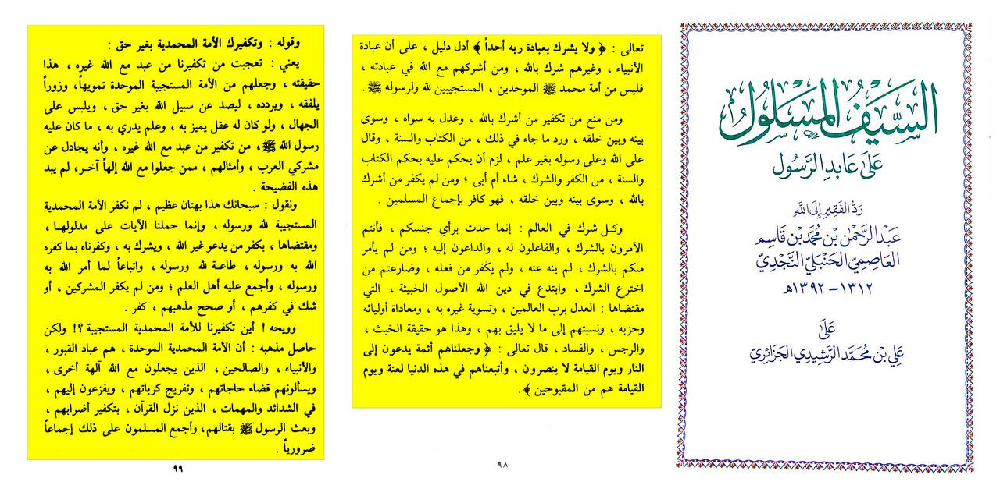

---

<!-- telegram-source: personal/messages.html#message729 -->
<!-- evidence-id: 000298 -->

Shaykh ʿAbd ar-Raḥmān ibn Qāsim an-Najdī said:

And whoever refrains from takfiring the one who commits shirk with Allah, sets up equals alongside Him, equates Him with His creation, and rejects what has come concerning that in the Book and the Sunnah, and speaks about Allah and His Messenger without knowledge, then it becomes necessary to judge him according to the ruling of the Book and the Sunnah: namely kufr and shirk, whether he likes it or not.

And whoever does not takfir the one who commits shirk with Allah and equates Him with His creation is a kāfir by the ijmāʿ of the Muslims. And every shirk in the world only came about through the views of your kind. So you are the ones commanding shirk, practicing it, and calling to it. And whoever among you did not command shirk did not forbid it, nor declare as kāfir the one who committed it.

You have resembled those who invented shirk and innovated into the religion of Allah those vile foundations whose implication is setting equals with the Lord of the worlds, equating others with Him, showing enmity toward His allies and His party, and attributing to them what does not befit them. And this is the very essence of vileness, impurity, and corruption.

[as-Sayf al-Maslūl ʿalā ʿĀbid ar-Rasūl by Shaykh ʿAbd ar-Raḥmān ibn Qāsim an-Najdī p.98]

Show attached source scan

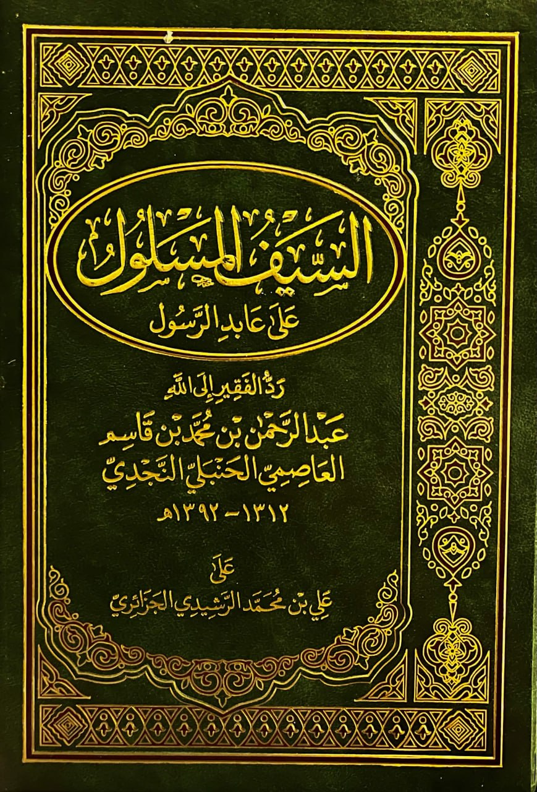

---

<!-- telegram-source: dar/messages4.html#message3248 -->
<!-- evidence-id: 000299 -->

Lajnah Dā’imah addressed the necessity of establishing proof before declaring as a disbeliever regarding the one who excuses an ignorant Muslim who committed shirk while still regarding them as a Muslim.

The Permanent Committee for Scholarly Research and Iftāʾ was asked:

Q: We have, in our area, the widespread phenomenon of grave worship, and at the same time there are those who defend such people and say that they are Muslims excused due to their ignorance. They say that there is no problem in marrying our daughters to them, in praying behind them, and in giving them all the rights of a Muslim over another Muslim.

Not only that, but they label those who say that such people are kuffār as people of innovation, treating them as they would innovators. They even claim that Your Eminence excuses grave worshippers due to their ignorance, saying that you approved a memorandum by a person called al-Ghubāshī in which he excuses grave worshippers.

Therefore, I request from Your Eminence to send a sufficient and complete research clarifying the matters in which ignorance is a valid excuse and the matters in which there is no excuse, as well as indicating the references that can be consulted in this regard.

A: So whoever does istighāthah from the occupants of the graves to repel harm or to remove distress, it is to be made clear to him that this is shirk. The ḥujjah is then to be established against him in fulfillment of the obligation of conveying. If, after clarification, he persists, then he is a mushrik [inwardly] who is to be treated in this world as the disbelievers are treated, and he will deserve the painful punishment in the Hereafter if he dies upon that…

And whoever lives in a land where the call (da‘wah) to Islām and other than it is heard, then does not believe nor seek the truth from its people, he is in the ruling of one to whom the da‘wah of Islām has reached and who has persisted upon kufr…

.. As for the one who lives in non-Islamic lands and has not heard about the Prophet ﷺ nor about the Qur’ān and Islām, then—assuming his existence—his ruling is the ruling of Ahl al-Fatrah (meaning they are treated as disbelievers in the wordly ruling). It is obligatory upon the scholars of the Muslims to convey to him the Sharī‘ah of Islām, in its fundamentals and branches, establishing the proof and as an excuse to him. And on the Day of Resurrection, he will be dealt with like one who was not held legally accountable in the world due to his insanity, stupidity, or young age and lack of legal responsibility (Allah will test them)...

.. And by this it is known that it is not permissible for a group of the muwaḥḥidīn who hold the belief of the kufr of the worshippers of graves to perform takfīr upon their brothers from the muwaḥḥidīn who refrained from making takfīr of them until the ḥujjah is established against them.

For their refraining from making takfīr of them has a shubhah (doubt), which is their belief that it is necessary to establish the ḥujjah upon those grave-worshippers before declaring them disbelievers. This is in contrast to the one whose kufr has no shubhah, such as the Jews, the Christians, the Communists and their likes — for there is no doubt in their kufr, nor in the kufr of the one who does not make takfīr of them.

The Permanent Committee for Scholarly Research and Fatwā

President: ʿAbd al-ʿAzīz ibn ʿAbd Allāh ibn Bāz

Vice President: ʿAbd al-Razzāq ʿAfīfī

Member: ʿAbd Allāh ibn Quʿūd

Member: ʿAbd Allāh ibn Ghadayyān

[Fatāwā Al-Lajnah Al-Dāʾimah 3/96-97 & 99]

Show attached source scan

---

<!-- telegram-source: personal/messages.html#message680 -->
<!-- evidence-id: 000300 -->

Question: “We have, among us, the widespread phenomenon of grave worship, and at the same time there are those who defend these people and say: “They are Muslims excused due to their ignorance. Therefore, there is no objection to marrying our daughters to them, praying behind them, and they have all the rights of a Muslim over a Muslim.” Not only that, but they also label the one who says these people are disbelievers; as an innovator, to be treated as innovators are treated. They even claim that Your Eminence excuses the grave-worshippers due to their ignorance, since you approved a memorandum by a person called al-Ghubāshī in which he excuses the grave-worshippers. ”

Answer: “[after a long Fatwa...] By this it is known that it is not permissible for a group of the monotheists who hold the disbelief of the grave-worshippers to declare their monotheist brothers as disbelievers who have hesitated in declaring them disbelievers until the proof is established upon them; because their hesitation in declaring them disbelievers is based on a doubt—namely, their belief that it is necessary to establish the proof upon those grave-worshippers before declaring them disbelievers—unlike the one in whose disbelief there is no doubt, such as the Jews, the Christians, the Communists, and their likes. For these, there is no doubt regarding their disbelief, nor regarding the disbelief of the one who does not declare them disbelievers.

The Permanent Committee for Scholarly Research and Fatwā

President: ʿAbd Al-ʿAzīz ibn ʿAbd Allāh ibn Bāz

Vice President: ʿAbd al-Razzāq ʿAfīfi

Member: ʿAbd Allāh ibn Quʿūd

Member: ʿAbd Allāh ibn Ghadayyān

[Fatāwā Al-Lajnah Al-Dāʾimah 3/96-100]

Show attached source scan

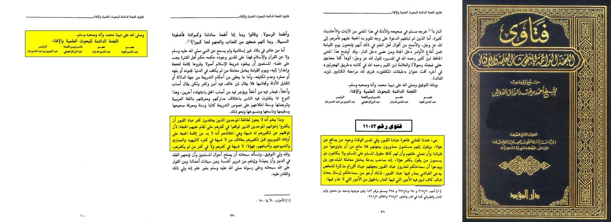

---

<!-- telegram-source: dar/messages3.html#message3138 -->
<!-- evidence-id: 000301 -->

Shaykh Ṣāliḥ al-Fawzān said in regards to:

The Third Nullifier: Whoever does not declare the mushrikīn to be disbelievers, or doubts their disbelief, or affirms the correctness of their creed — has committed kufr.

This is a very serious matter that many people who affiliate themselves with Islam fall into. A person might say, “As for me, al-ḥamdu lillāh, I do not commit shirk, nor have I associated partners with Allah. But as for the people, I do not declare them disbelievers.”

We say to him: You have not understood the religion. It is obligatory upon you to declare as disbelievers those whom Allah has declared disbelievers, and to declare as mushrikīn those who commit shirk with Allah, even if it be under some pretense or justification. You must also disassociate yourself from them, just as Ibrāhīm disassociated himself from his father and his people when he said: “Indeed, I am free from what you worship, except for the One who created me, for indeed He will guide me.” [al-Zukhruf:26–27]

As for affirming the correctness of their creed, this is even more severe. If someone says about what they are doing, “There is some consideration in this,” or, “These are only means they use to draw nearer to Allah,” or, “They are simply ignorant and fell into this by mistake,” and he defends them—this is even greater kufr than what they [the mushrikīn] have fallen into themselves. He has validated disbelief, affirmed shirk, or expressed doubt about it.

[Sharh Nawāqid al-Islām by Shaykh Ṣāliḥ al-Fawzān p. 20]

Show attached source scan

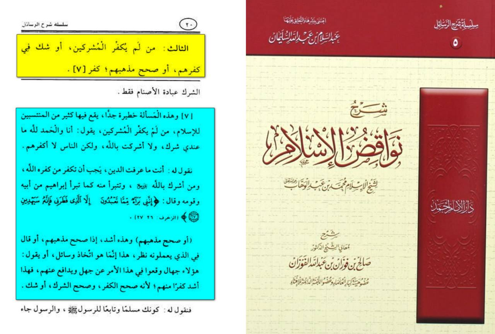

---

<!-- telegram-source: personal/messages.html#message905 -->
<!-- evidence-id: 000302 -->

The one who excuses the grave worshipper with ignorance and calls them Muslim is either ignorant or someone that is covering up shirk

Shaykh al-Fawzān was asked:

Q: What is the ruling on one who does not takfir the grave worshippers and says: “They are ignorant and do not intend to worship other than Allah”?

A: Either he is ignorant, or he is covering up for shirk. He is covering up shirk and concealing it. If he is ignorant, then his speech is not given consideration because he is ignorant. His ignorance should be explained to him, and he should be informed that he does not know this matter.

But if he intends concealment and obscuring the truth, then it is obligatory that he be refuted. It is obligatory that he be refuted and that his statement be condemned.

<video class="source-video" controls preload="metadata" src="assets/videos/personal-905.mp4"></video>

Video source from the Telegram export.

---

<!-- telegram-source: personal/messages.html#message760 -->
<!-- evidence-id: 000303 -->

<video class="source-video" controls preload="metadata" src="assets/videos/personal-760.mp4"></video>

Video source from the user’s Telegram export.

The dangers of the topic of excuse of ignorance and calling the one who commits shirk a Muslim and not declaring them a disbeliever individually.

Shaykh Ṣāliḥ al-Fawzān was asked:

Q: You mentioned that there are those who say that whoever does not excuse the ignorant person in his shirk akbar is a takfīrī. There are also those who campaign against people who do not excuse the mushrikīn because of their ignorance in this age. What is your advice and guidance regarding that?

A: The one who excuses the mushrikīn (i.e he considers them Muslim) means that he does not condemn shirk and does not condemn the evil. Therefore, he is like them, he is like them.

Whoever does not takfīr the kāfir is himself a kāfir. This is from the Nawāqiḍ al-Islām, as mentioned in the Ten Nullifiers cited by Shaykh Muḥammad ibn ʿAbd al-Wahhāb: ‘Whoever does takfīr the kuffār…’”

---

<!-- telegram-source: personal/messages.html#message507 -->
<!-- evidence-id: 000304 -->

<video class="source-video" controls preload="metadata" src="assets/videos/personal-507.mp4"></video>

Video source from the user’s Telegram export.

Shaykh al-Fawzān was asked:

Q: What is the ruling on praying behind one who does not takfīr the grave worshippers?

A: One does not prayed behind him. Whoever does not Takfīr them (i.e the grave worshippers) is like them, because he has permitted their action.

---

<!-- telegram-source: personal/messages.html#message595 -->
<!-- evidence-id: 000305 -->

<video class="source-video" controls preload="metadata" src="assets/videos/personal-595.mp4"></video>

Video source from the user’s Telegram export.

Is the prayer behind the one, who doesn’t takfir the grave worshipper but affirms their action is shirk, permissible?

Shaykh Ṣāliḥ al-Fawzān was asked:

Question: In our village, there is an imām who does not declare the grave worshippers to be disbelievers individually, even though he acknowledges that their action is shirk...

Answer: “You have already asked about this before, and the answer remains the same — it is not permissible to pray behind him. The prayer behind such a person is invalid, Because he does not takfīr the kuffār and mushrikīn.

---

<!-- telegram-source: dar/messages4.html#message3208 -->
<!-- evidence-id: 000306 -->

Shaykh Ṣāliḥ al-Fawzān said:

Whoever doubts the kufr of the mushrikīn in general — whether they are pagans, Jews, Christians, or those who claim to be Muslim while committing shirk — must hold the belief that they are disbelievers.

Everyone who associates partners with Allah and worships alongside Him others — such as trees, stones, idols, statues, graves, or shrines — is a mushrik kāfir who must be declared as such, even if he claims to be Muslim and says lā ilāha illa Allāh, Muḥammad rasūl Allāh; for shirk nullifies the two testimonies, contradicts Islam, and corrupts tawḥīd.

Therefore, it is obligatory for the Muslim to declare takfīr upon the mushrikīn who worship other than Allah — whether they are Arab or non-Arab, Jew or Christian, or claim to be Muslim. This is a matter of ʿaqīda that is not open to compromise.

So whoever does not declare the mushrikīn to be disbelievers becomes an apostate kāfir like them — because to him, īmān and disbelief are the same, and he does not distinguish between them. Thus, he is a disbeliever.

Likewise, whoever doubts the disbelief of the mushrikīn and says, “I don’t know whether they are disbelievers or not,” then he is a kāfir — because he is wavering in his religion between kufr and īmān, and does not differentiate between the two.

[Sharḥ Nawāqiḍ al-Islām by Shaykh Ṣāliḥ al-Fawzān p.80]

---

<!-- telegram-source: dar/messages4.html#message3743 -->
<!-- evidence-id: 000307 -->

Shaykh al-Fawzān said:

Whoever places between himself and Allāh intermediaries — calling upon them, asking them for intercession, and relying upon them — has committed kufr by ijmā‘.

Whoever does not declare the mushrikīn to be disbelievers, or doubts their kufr, or believes that their madhhab is correct, has disbelieved.

Whoever believes that the guidance of anyone other than the Prophet ﷺ is more complete than his guidance, or that the judgment of anyone other than him is better than his judgment — such as those who prefer the rule of ṭāghūt over the rule of the Messenger ﷺ, or who prefer man-made laws over the judgment of al-Islām — has committed kufr.

Whoever hates anything that the Messenger ﷺ came with, even if he acts upon it, has committed kufr.

Whoever mocks anything from the religion of the Messenger ﷺ, or its reward or its punishment, has committed kufr. The proof for this is the saying of Allāh, the Exalted: “Say, ‘Was it Allāh, His verses, and His Messenger that you were mocking? Make no excuse; you have disbelieved after your belief.’” [at-Tawbah:65–66]

[ʿAqīdat at-Tawḥīd by Shaykh al-Fawzān p.51]

Show attached source scan

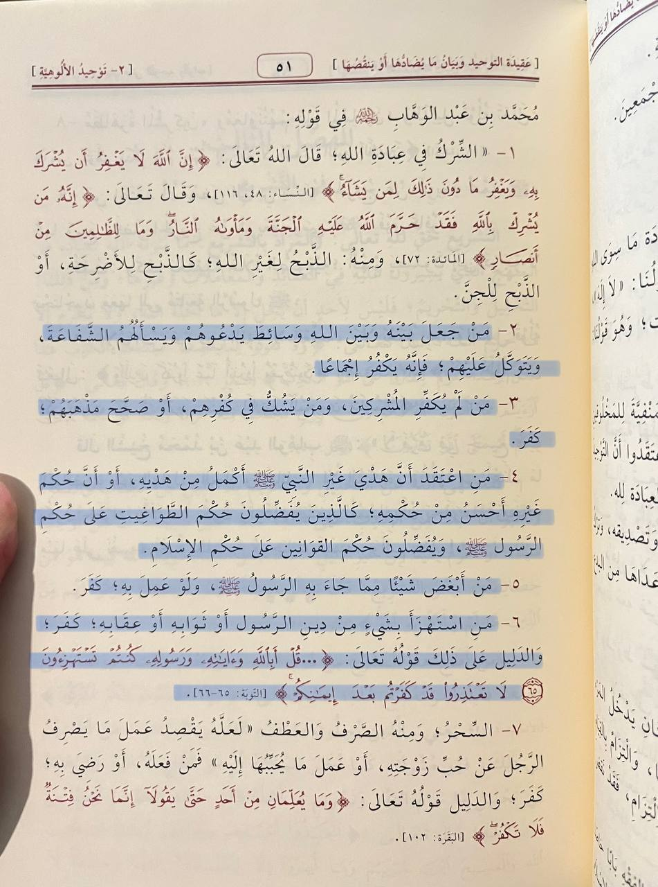

---

### Ṣāliḥ al-Fawzān: defending the description of Islam for people who commit shirk
<!-- evidence-id: 000308 -->

Shaykh Ṣāliḥ al-Fawzān said concerning the third nullifier:

“This is a very serious matter into which many who affiliate themselves with Islam fall. A person might say, ‘As for me, all praise is for Allāh, I do not commit shirk and have not associated partners with Allāh, but I do not declare other people disbelievers.’

We say to him: you have not understood the religion. You must declare disbelievers those whom Allāh declared disbelievers, and declare mushrikīn those who commit shirk with Allāh, even if that occurs under some pretext or justification. You must disassociate yourself from them, just as Ibrāhīm disassociated himself from his father and his people when he said: ‘Indeed, I am free from what you worship, except for the One who created me, for He will surely guide me.’ [al-Zukhruf 43:26–27]

As for affirming the correctness of their way, this is even more severe. If someone says about what they are doing, ‘There is some room for consideration in this,’ or, ‘These are only means they use to draw nearer to Allāh,’ or, ‘They are merely ignorant and fell into this by mistake,’ and he defends them, this is even greater disbelief than what they themselves have fallen into. He has validated disbelief, affirmed shirk, or expressed doubt concerning it.”

Source: Ṣāliḥ al-Fawzān, *Sharḥ Nawāqiḍ al-Islām*, p. 20.

Show attached source scan

### Full statement of Ṣāliḥ al-Fawzān
<!-- evidence-id: 000309 -->

“This is the meaning of īmān: that you believe in your heart that Allāh alone deserves worship, and that everything worshipped besides Allāh is false, whether angels, prophets, righteous people, stones, trees, or idols. You must also disbelieve in all of these. This is the meaning of faith in Allāh: that you believe in your heart that no one deserves worship except Him, and that whatever is worshipped besides Him is false. This is required by this creed.

It is not enough to say this with your tongue without believing it in your heart. Nor is it enough to perform outward actions, prayer and fasting, while saying, ‘I worship only Allāh,’ but then saying: ‘I do not know about those who worship graves and shrines. I cannot say they are wrong, because they pray, fast, and say lā ilāha illā Allāh.’

We say: You have not understood the meaning of lā ilāha illā Allāh, nor the meaning of faith in Allāh and kufr biṭ-ṭāghūt. Had you understood properly, you would know that faith in Allāh is not valid except with disbelief in the ṭāghūt, outwardly with the tongue and inwardly with conviction.

This is the meaning of faith in Allāh: that you direct all worship to Him alone and direct none of it to another. A person may perform prayer, fast, and give zakāh, yet seek deliverance from someone besides Allāh, or sacrifice to someone besides Him. Such a person has worshipped Allāh in some things and worshipped others in some things, and is therefore a mushrik.

As for the one who worships Allāh through some acts of worship and worships others through other acts, this person has not truly believed in Allāh. This is like those who fast, perform prayer, perform ḥajj, and pronounce the two testimonies, but then call upon others besides Allāh. They call upon the dead, sacrifice for the dead, make vows to the dead, and circumambulate the graves. These people have not worshipped Allāh; rather, they are mushrikūn.

The worship of Allāh and the worship of others can never unite. Allāh, Majestic and Exalted, says: ‘I am the One most free of need from partners. Whoever performs a deed in which he associates another with Me, I abandon him and his shirk.’ In another narration: ‘It belongs to the one he associated, and I am free of him.’

Allāh does not accept that anyone be associated with Him in any kind of worship. Rather, all worship must be solely for Allāh. As He says: ‘Fight them until there is no fitnah and the religion, all of it, is for Allāh.’ [al-Anfāl 8:39] Thus, no part of the religion can be for Allāh and another part for idols, graves, or anyone else. The religion must be entirely for Allāh.”

Source: Ṣāliḥ al-Fawzān, Sharḥ Maʿnā al-Ṭāghūt, pp. 12–13.

### ʿAbd Allāh al-Ghunaymān: the act cannot be called shirk while its doer is called Muslim
<!-- evidence-id: 000310 -->

Shaykh ʿAbd Allāh al-Ghunaymān said:

“Among the problems people face today is that some students of knowledge and shaykhs say that if a mushrik circumambulates a grave and worships its occupant but is ignorant, then we do not call him a mushrik. Rather, we call him a Muslim. They say that his action is shirk but that he himself is not a mushrik. This is a strange matter. They say his action is shirk, yet he is not a mushrik but a Muslim. If he dies upon that, he is in Paradise because he is excused for circumambulating the grave and worshipping it.

The shaykh says that this is unknown among both the earlier and later generations. It is said only by ignorant scholars, may Allāh grant safety. Ignorance has taken firm hold in their hearts, and they have become people who do not accept the truth and who argue concerning such matters.

Does the shaykh’s statement, ‘Whoever does not declare the kāfir a kāfir is himself a kāfir,’ apply to a person of this kind? This is shirk and disbelief in Allāh, Mighty and Majestic, yet he did not declare its doer a disbeliever and instead ruled him to be a Muslim.

Concerning people of this kind, their doubts must first be removed before they are judged disbelievers. But we say that this is an ignorance in which no one preceded them. When a mushrik falls into shirk, he is a mushrik. Shirk does not exist independently such that the act is called shirk while its doer is called a Muslim. A person is held accountable for what he does.”

Source: ʿAbd Allāh al-Ghunaymān, statement preserved in the Dār as-Salafiyyah ʿUdhr bil-Jahl collection.

<!-- telegram-source: dar/messages4.html#message3757 -->
<!-- evidence-id: 000311 -->

Shaykh ar-Rājihī said:

Whoever does not declare the mushrikīn to be disbelievers has not disbelieved in the ṭāghūt; meaning, he has affirmed shirk. And whoever doubts the disbelief of the Jews and Christians, or considers their religion to be correct, has not disbelieved in the ṭāghūt, and therefore is not a believer.

The proof of the disbelief of one who does not declare the mushrikīn to be disbelievers, or doubts their disbelief, or considers their religion valid, is the statement of tawḥīd — Lā ilāha illā Allāh — because such a person has not disbelieved in the ṭāghūt.

And likewise, the saying of Allah the Exalted: “So whoever disbelieves in the ṭāghūt and believes in Allah has grasped the firmest handhold.” [Sūrat al-Baqarah:256]

There is no tawḥīd and no īmān except with two things: disbelief in the ṭāghūt and īmān in Allah. For this reason, the statement of tawḥīd — Lā ilāha illā Allāh — contains both negation and affirmation.

So, if a person were to say, “Allah is the One who is worshipped, and I believe in Allah and worship Him,” he would not thereby be a believer.

We say: This is not tawḥīd. It is not sufficient that you worship Allah; rather, you must also reject the worship of every object of worship besides Allah. That is, you must bring together both negation and affirmation.

The meaning of Lā ilāha illā Allāh is: “There is no deity truly worthy of worship except Allah.” So, if someone were to say, “I worship only Allah — am I not a monotheist (muwaḥḥid)?” we say to him: No — it is not enough that you worship Allah; you must also disbelieve in the worship of anything besides Him. This is kufr biṭ-ṭāghūt and it only occurs through both negation and affirmation: Lā ilāha illā Allāh.

[Shurūḥ Rasāʾil al-Imām al-Mujaddid Muḥammad ibn ʿAbd al-Wahhāb by Shaykh ar-Rājihī 1/178]

Show attached source scan

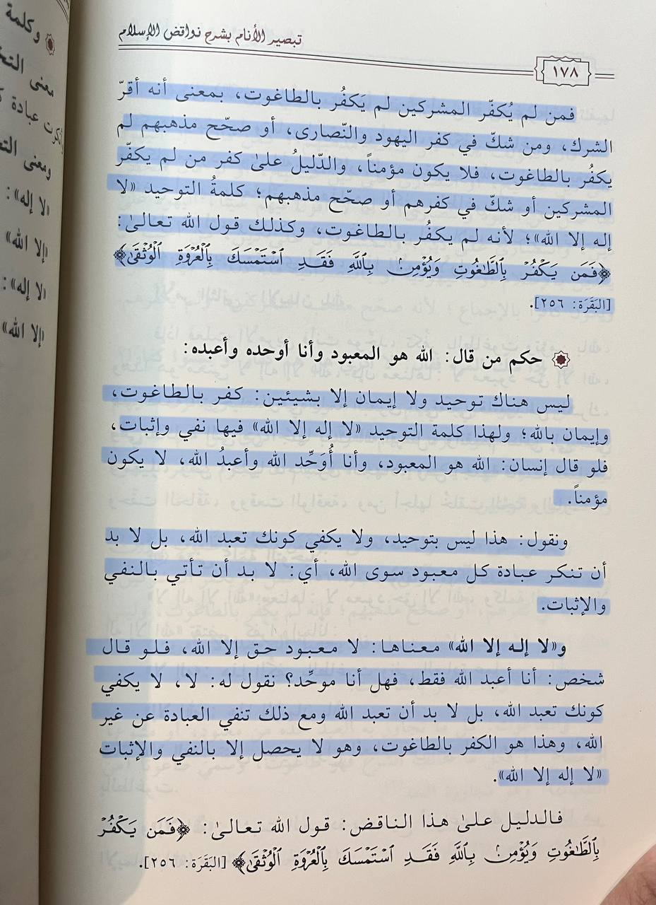

---

### Full statement of ʿAbd al-ʿAzīz al-Rājiḥī
<!-- evidence-id: 000312 -->

“Whoever does not declare the mushrikīn to be disbelievers has not disbelieved in the ṭāghūt; meaning, he has affirmed shirk. And whoever doubts the disbelief of the Jews and Christians, or considers their religion to be correct, has not disbelieved in the ṭāghūt, and therefore is not a believer.

The proof of the disbelief of one who does not declare the mushrikīn to be disbelievers, or doubts their disbelief, or considers their religion valid, is the statement of tawḥīd, lā ilāha illā Allāh, because such a person has not disbelieved in the ṭāghūt.

And likewise, the saying of Allāh the Exalted: ‘So whoever disbelieves in the ṭāghūt and believes in Allāh has grasped the firmest handhold.’ [al-Baqarah 2:256]

There is no tawḥīd and no īmān except with two things: disbelief in the ṭāghūt and īmān in Allāh. For this reason, the statement of tawḥīd, lā ilāha illā Allāh, contains both negation and affirmation.

So, if a person were to say, ‘Allāh is the One who is worshipped, and I believe in Allāh and worship Him,’ he would not thereby be a believer.

We say: This is not tawḥīd. It is not sufficient that you worship Allāh; rather, you must also reject the worship of every object of worship besides Allāh. That is, you must bring together both negation and affirmation.

The meaning of lā ilāha illā Allāh is: ‘There is no deity truly worthy of worship except Allāh.’ So, if someone were to say, ‘I worship only Allāh. Am I not a muwaḥḥid?’ we say to him: No. It is not enough that you worship Allāh; you must also disbelieve in the worship of anything besides Him. This is kufr biṭ-ṭāghūt, and it only occurs through both negation and affirmation: lā ilāha illā Allāh.”

Source: ʿAbd al-ʿAzīz al-Rājiḥī, Shurūḥ Rasāʾil al-Imām al-Mujaddid Muḥammad ibn ʿAbd al-Wahhāb, 1/178.

<!-- telegram-source: personal/messages.html#message545 -->
<!-- evidence-id: 000313 -->

<video class="source-video" controls preload="metadata" src="assets/videos/personal-545.mp4"></video>

Video source from the user’s Telegram export.

Shaykh ar-Rājihī was asked:

Questioner: Are those who excuse the mushrikīn due to their ignorance—is prayer performed behind them or not?

Shaykh al-Rājiḥī: Why do they excuse the mushrikīn due to their ignorance?! Are the mushrikūn living among the Muslims, or are they in distant unknown places?

Questioner: Among the Muslims, our Shaykh.

Shaykh al-Rājiḥī: How are they committing shirk? Do they call upon the dead, slaughter for them, and making vows to them?

Questioner: Yes, all of that.

Shaykh al-Rājiḥī: I say: these are mushrikūn. And whoever does not declare the mushrikīn to be kuffār, or doubts their kufr, or considers their madhhab to be correct, then he is a kāfir like them—because he has not fulfilled kufr biṭ-ṭāghūt.

“So whoever disbelieves in the ṭāghūt and believes in Allāh…” And kufr biṭ-ṭāghūt is to declare the mushrikīn as kuffār.

Questioner: Clear.

---

<!-- telegram-source: dar/messages5.html#message4797 -->
<!-- evidence-id: 000314 -->

Amongst the signs of the Murjiʾah of our time is they call the one who is engaged in shirk Muslim, and they do not takfīr them claiming they are ignorant.

Shaykh Ṣāliḥ as-Suwayyiḥ said:

Fourth: stating that the statement of some of those who excuse the grave worshippers is an irjāʾī statement:

Like the one who makes a general statement excusing the grave-worshippers due to ignorance, and not takfīring them except after they understand it by which the preventing doubt ceases, and he claims that mere knowledge and conveyance, and mere understanding and comprehension of the texts of the Kitāb and the Sunnah, are not sufficient for takfīring the mushrikīn.

So he claims that it is necessary to discuss and clarify to the mushrikīn and grave worshippers, followed by obstinacy and persistence; and if that is not the case, then the proof has not been established upon him, and he is not judged with shirk individually, rather he remains upon his Islām even if he has engaged in shirk, mixed with it, acted upon it, and called to it!

So according to his claim—he is a Muslim, a muwaḥḥid, not an oppressor!

[al-Furūq bayna ʿAqīdat as-Salaf wa-ʿAqīdat al-Murjiʾah fī al-Īmān by Shaykh Ṣāliḥ as-Suwayyiḥ]

The book was introduced and praised by the Grand Mufti, our imām, Shaykh Ṣāliḥ al-Fawzān

Show attached source scan

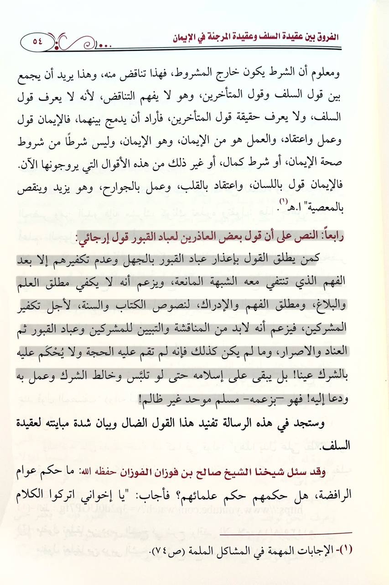

---

<!-- telegram-source: dar/messages4.html#message3252 -->
<!-- evidence-id: 000315 -->

Shaykh Ayman al-ʿAnqarī said:

The Third Nullifier: Whoever does not declare the mushrikīn to be kuffār, or doubts their disbelief, or affirms the correctness of their religion — is himself a kāfir.

This nullifier includes three types:

1. That he does not declare the mushrikīn to be kuffār, holding firmly to the view that they are not disbelievers.

2. That he doubts their disbelief — and this is indicated as another type by the author’s saying “أو ” (or), which here is for diversification. Doubt is hesitation between two equal possibilities with no preference for one over the other, such as saying: “I do not know — are they disbelievers or not?”

3. Or that he affirms the correctness of their religion — and this is the worst of the types, for it involves ascribing correctness to their creed. For example, saying: “Their religion is correct,” or “They are upon valid heavenly religions,” or “Their religion is not false.” This also includes the present-day claim of unity and reconciliation between the three religions — as they allege — Islam, Judaism, and Christianity; saying: “They are all true religions, and they are all believers in Allāh, so do not declare them disbelievers.”

It is therefore obligatory to decisively declare as kāfir those whom Allāh and His Messenger have declared kāfir, from Ahl al-Kitāb, the mushrikīn, the atheists, and the apostates. And this is from the necessary requirements of al-tawḥīd — for tawḥīd must include two matters:

The first is al-kufr biṭ-ṭāghūt, which is to believe in the falsehood of worship directed to other than Allāh, to hate it, to show enmity towards it, to declare its people to be disbelievers, and to oppose them.

The second is al-īmān billāh — Glorified and Exalted is He — and this is the meaning of the statement of al-tawḥīd: “Lā ilāha illā Allāh,” meaning: “There is no deity in truth except Allāh.” Allāh, Exalted is He, said clarifying these two matters:

“So whoever disbelieves in the ṭāghūt and believes in Allāh has grasped the firm handhold that will never break” (al-Baqarah 2:256).

Whoever does not declare the mushrikīn to be kuffār is to be considered as denying the speech of Allāh and the speech

of His Messenger ﷺ. Likewise, whoever doubts their disbelief is considered not to have affirmed the speech of Allāh and His Messenger that indicates their disbelief.

As for the one who affirms the correctness of their religion — in addition to this being a denial of the speech of Allāh and His Messenger — he is also thereby engaging in istihlāl that which Allāh has made unlawful, for Allāh has invalidated those religions, clarified the distortions of their adherents, and abrogated them through Islām. Affirming them as correct nullifies that.

From the Sunnah is the ḥadīth of Abū Mālik al-Ashjaʿī — may Allāh be pleased with him — in a marfūʿ report:

“Whoever says: ‘Lā ilāha illā Allāh’ and disbelieves in whatever is worshipped besides Allāh — his blood and wealth are inviolable, and his reckoning is with Allāh” (Ṣaḥīḥ Muslim)

The point of evidence is that a person’s wealth and blood are not protected until he disbelieves in whatever is worshipped besides Allāh — and from disbelieving in it is declaring its adherents to be kuffār.

[Sharḥ Nawāqiḍ al-Islām by Shaykh Ayman al-ʿAnqarī p.41-43]

Show attached source scan

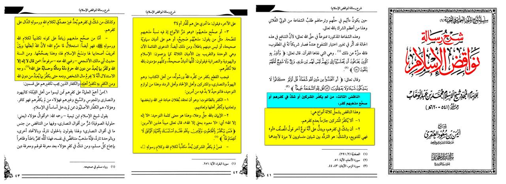

---

### Full statement of Ayman al-ʿAnqarī
<!-- evidence-id: 000316 -->

“The third nullifier is: whoever does not declare the mushrikīn disbelievers, doubts their disbelief, or affirms the correctness of their religion, is himself a disbeliever.

This nullifier includes three types:

1. That he does not declare the mushrikīn disbelievers and firmly holds that they are not disbelievers.

2. That he doubts their disbelief. This is indicated as another type by the author’s use of ‘or,’ which here indicates diversification. Doubt is hesitation between two equal possibilities without preferring either, such as saying, ‘I do not know whether they are disbelievers.’

3. That he affirms the correctness of their religion. This is the worst of the three types because it attributes correctness to their creed. Examples include saying, ‘Their religion is correct,’ ‘They follow valid heavenly religions,’ or ‘Their religion is not false.’ This also includes the present-day claim of unity and reconciliation among the three religions, as they allege, Islam, Judaism, and Christianity, and saying, ‘They are all true religions and all believe in Allāh, so do not declare them disbelievers.’

It is therefore obligatory to decisively declare as disbelievers those whom Allāh and His Messenger declared disbelievers, including the People of the Book, the mushrikīn, the atheists, and the apostates. This is among the necessary requirements of tawḥīd, for tawḥīd must include two matters:

The first is kufr biṭ-ṭāghūt, which is to believe in the falsehood of worship directed to other than Allāh, hate it, show enmity toward it, declare its people disbelievers, and oppose them.

The second is faith in Allāh, Glorified and Exalted, and this is the meaning of the statement of tawḥīd, lā ilāha illā Allāh: there is no deity truly worthy of worship except Allāh. Allāh, Exalted is He, clarified these two matters when He said, ‘Whoever disbelieves in the ṭāghūt and believes in Allāh has grasped the firmest handhold that will never break.’ [al-Baqarah 2:256]

Whoever does not declare the mushrikīn disbelievers is considered to have denied the speech of Allāh and the speech of His Messenger ﷺ. Likewise, one who doubts their disbelief is considered not to have affirmed the speech of Allāh and His Messenger that establishes their disbelief.

As for one who affirms the correctness of their religion, in addition to denying the speech of Allāh and His Messenger, he also treats as lawful what Allāh has made unlawful. Allāh invalidated those religions, clarified the distortions of their adherents, and abrogated them through Islam. Affirming them as correct nullifies that.

From the Sunnah is the marfūʿ report of Abū Mālik al-Ashjaʿī, may Allāh be pleased with him: ‘Whoever says lā ilāha illā Allāh and disbelieves in whatever is worshipped besides Allāh, his wealth and blood are inviolable, and his reckoning is with Allāh.’ [Ṣaḥīḥ Muslim]

The point of evidence is that a person’s wealth and blood are not protected until he disbelieves in whatever is worshipped besides Allāh, and part of disbelieving in it is declaring its adherents disbelievers.”

Source: Ayman al-ʿAnqarī, Sharḥ Nawāqiḍ al-Islām, pp. 41–43.

<!-- telegram-source: personal/messages.html#message505-message506 -->
<!-- evidence-id: 000317 -->

How to deal with the excuser of shirk - Answered by Shaykh ʿAbd Allāh al-Jarbūʿ

I said to the Shaykh: As-salāmu ʿalaykum wa raḥmatullāhi wa barakātuh, our noble shaykh — may Allāh preserve you and bless you.

We know that whoever excuses the mushrik is a kāfir. But how should one deal with this excuser (ʿādhir)? And what is the ruling concerning one who excuses the excuser? A clarification on this matter would be beneficial, O shaykh.

He replied: Wa ʿalaykum as-salām wa raḥmatullāhi wa barakātuh.

First: this one who excuses the mushrik — if he says he is Muslim, meaning he excuses him due to his ignorance — he is, in reality, Muslim, and it may be that he is a Muslim while committing shirk. Then this statement of his is kufr, and his belief is kufr. So we should alert him and clarify to him. If he persists, we stay away from him — we do not pray behind him, and we do not study from him — except maybe returning the salām.

If there is an issue, then distance yourself from him — distance yourself and increase in distancing — if he insists. And we continue on our path.

And if a person believes in his kufr, he does not speak, he does not say: “So-and-so is a kāfir,” or: “So-and-so declared takfīr,” nor does he cause chaos among people. He proceeds on his way — seeks knowledge, calls to Allāh, learns, remembers Allāh, makes duʿā’, sends ṣalawāt upon the Messenger, and stays away from these people.

<video class="source-video" controls preload="metadata" src="assets/videos/jarbou-excuser-of-shirk.mp4"></video>

Arabic source video from the user’s Telegram export.

---

<!-- telegram-source: dar/messages4.html#message3705 -->
<!-- evidence-id: 000318 -->

Controls and conditions of Takfiring the one who calls the mushrik, Muslim by Shaykh Manṣūr as-Samarī

Shaykh Manṣūr as-Samarī said:

As-salāmu ʿalaykum wa raḥmatullāh. This was sent to me by one of the Indonesian brothers — our brother Shīṭah. I explained that this is, in context, about someone who wanted to declare takfīr on those who do not declare takfīr on the grave worshippers, the mushrikīn. He said: “Those are like them.”

This, however, is takfīr nawʿ (type-based takfīr), not takfīr ʿayn (specific takfīr). Meaning, we do not yet have a specific person — so-and-so, son of so-and-so — who says: “These particular people we know, those who appear to have some Islam,” etc., meaning he has a doubt. When we have a specific individual like this — someone who excuses those people — then we establish the proof upon him. If he does not respond, then we declare him kāfir like them. He becomes a disbeliever like them.

That is the intent — that is what Shaykh Muhammad and others meant. They did not mean that whoever does not declare the mushrikīn to be disbelievers is automatically like them in every case. Rather, if someone says: “These are not disbelievers,” then yes — he is like them. That is the Shaykh’s intent. This is the difference between al-ʿayn (the individual) and an-nawʿ (the type).

The Shaykh’s words here concern the type, because he said: those who do not declare takfīr on the grave worshippers. It is like when the Prophet ﷺ said regarding wine: “Allāh cursed ten concerning it — its drinker, its presser, its one who has it pressed,” and so on — he listed them all. Then later, a ṣaḥābī was brought who drank wine. Some said, “May Allāh curse him.” The Prophet ﷺ said: “Do not curse him, for I know he loves Allāh and His Messenger.”

So, the curse itself is not lifted, but when does it apply to a person specifically? It applies when the conditions are fulfilled and the mawāniʿ (preventing factors) are absent. This is the same principle.

When do we say to this ʿādhir (excuser) — the one who excuses these people or those he sees — “You are a kāfir”? We ask him: “Do you excuse everyone who worships graves?” If he says: “No, I excuse only these people I know — so-and-so and so-and-so — because, to me, the daʿwah has not reached them,” then we tell him: “These people are mushrikīn by the proof of Allāh and His Messenger ﷺ.” We clarify it to him. If he persists afterward, then the ruling of takfīr applies to him, because now you have removed his shubhah, fulfilled the conditions, and the mawāniʿ are gone.

This is regarding the specific individual. But before you perform takfīr ʿayn and want to issue the general ruling — takfīr nawʿ — that does not require the fulfillment of conditions or removal of preventers. You simply say: “Whoever does not declare the mushrikīn to be disbelievers is like them.”

<video class="source-video" controls preload="metadata" src="assets/videos/dar-messages4-3705.mp4"></video>

Video source from the Telegram export.

---

### Ṣāliḥ al-Fawzān: those who excuse the mushrikīn are themselves ignorant and have no excuse
<!-- evidence-id: 000319 -->

<!-- telegram-source: personal/messages.html#message509 -->
<!-- evidence-id: 000320 -->

Shaykh Ṣāliḥ al-Fawzān was asked:

“Are some students of knowledge who excuse the grave worshippers because of ignorance themselves excused?”

He answered:

“Those are the ignorant ones, not the grave worshippers. Those who excuse the mushrikīn and the grave worshippers are the ignorant ones. They have no excuse.”

<video class="source-video" controls preload="metadata" src="assets/videos/personal-509.mp4"></video>

Arabic video source from the user’s Telegram export.

---

### Aḥmad ibn Ḥanbal: whoever doubts the disbelief of one who says the Qurʾān is created is a disbeliever
<!-- evidence-id: 000734 -->
<!-- record-type: transmitted-report -->
<!-- report-status: unresolved -->
<!-- authority-name: Aḥmad ibn Ḥanbal -->
<!-- authority-death: 241 -->

Shāhīn ibn al-Sumaydaʿ said that he heard Imām Aḥmad ibn Ḥanbal say:

“Whoever says that the Qurʾān is created is a disbeliever, and whoever doubts his disbelief is a disbeliever.”

Source: Ibn Abī Yaʿlā, *Ṭabaqāt al-Ḥanābilah*, 1/173, in the biography of Shāhīn ibn al-Sumaydaʿ. Also transmitted in *al-Jāmiʿ li-ʿUlūm al-Imām Aḥmad, al-ʿAqīdah*, 3/572.

The report has a complete chain in the cited source. No named authentication judgment for this exact chain was found during the present review, so the archive does not grade it.

Full chain

Ibn Abī Yaʿlā → Abū al-Ḥusayn ibn al-Muhtadī bi-Allāh → Abū al-Ḥusayn ibn Akhī Mīmī → ʿAlī ibn Muḥammad al-Mawṣilī → Mūsā ibn Muḥammad al-Ghassānī → Shāhīn ibn al-Sumaydaʿ → Aḥmad ibn Ḥanbal.

Arabic text

وَأَنْبَأَنَا أَبُو الْحُسَيْنِ بْنُ الْمُهْتَدِي بِاللَّهِ، عَنْ أَبِي الْحُسَيْنِ بْنِ أَخِي مِيمِي، قَالَ: أَخْبَرَنَا عَلِيُّ بْنُ مُحَمَّدٍ الْمَوْصِلِيُّ، حَدَّثَنَا مُوسَى بْنُ مُحَمَّدٍ الْغَسَّانِيُّ، حَدَّثَنَا شَاهِينُ بْنُ السَّمَيْذَعِ، قَالَ: سَمِعْتُ أَبَا عَبْدِ اللَّهِ يَقُولُ: «مَنْ قَالَ: الْقُرْآنُ مَخْلُوقٌ فَهُوَ كَافِرٌ، وَمَنْ شَكَّ فِي كُفْرِهِ فَهُوَ كَافِرٌ».

المصدر: ابن أبي يعلى، <em>طبقات الحنابلة</em>، <bdi dir="ltr">1/173</bdi>، في ترجمة شاهين بن السميذع. ونقله أيضًا <em>الجامع لعلوم الإمام أحمد، العقيدة</em>، <bdi dir="ltr">3/572</bdi>.

---

### Muḥammad ibn Saḥnūn: whoever doubts the disbelief of one who reviles the Prophet is a disbeliever
<!-- evidence-id: 000735 -->
<!-- record-type: transmitted-report -->
<!-- report-status: unresolved -->
<!-- authority-name: Muḥammad ibn Saḥnūn -->
<!-- authority-death: 256 -->

Muḥammad ibn Saḥnūn said:

“The scholars have unanimously agreed that one who reviles the Prophet ﷺ and disparages him is a disbeliever. The threat of Allāh’s punishment applies to him, and his ruling according to the Ummah is execution. Whoever doubts his disbelief and punishment has disbelieved.”

Source: Ibn Taymiyyah, *al-Ṣārim al-Maslūl ʿalā Shātim al-Rasūl*, p. 513, transmitting the statement of Muḥammad ibn Saḥnūn.

The consulted text quotes Muḥammad ibn Saḥnūn without a transmission chain at this location. No named authentication judgment for the attribution was found during the present review.

Arabic text

قَالَ مُحَمَّدُ بْنُ سَحْنُونٍ: «أَجْمَعَ الْعُلَمَاءُ أَنَّ شَاتِمَ النَّبِيِّ صَلَّى اللَّهُ عَلَيْهِ وَسَلَّمَ الْمُنْتَقِصَ لَهُ كَافِرٌ، وَالْوَعِيدُ جَارٍ عَلَيْهِ بِعَذَابِ اللَّهِ، وَحُكْمُهُ عِنْدَ الْأُمَّةِ الْقَتْلُ، وَمَنْ شَكَّ فِي كُفْرِهِ وَعَذَابِهِ كَفَرَ».

المصدر: ابن تيمية، <em>الصارم المسلول على شاتم الرسول</em>، ص. <bdi dir="ltr">513</bdi>، ناقلًا قول محمد بن سحنون.

---

### Ḥarb al-Kirmānī: the transmitted creed concerning the Jahmiyyah and those who do not declare them disbelievers
<!-- evidence-id: 000736 -->
<!-- record-type: direct-authorial-statement -->
<!-- authority-name: Ḥarb al-Kirmānī -->
<!-- authority-death: 280 -->

Ḥarb al-Kirmānī introduced this creed as the doctrine of the leading scholars, the people of reports, and the recognized people of the Sunnah whom he met in Iraq, the Ḥijāz, Syria, and elsewhere. He specifically named Aḥmad ibn Ḥanbal, Isḥāq ibn Rāhawayh, ʿAbd Allāh ibn al-Zubayr al-Ḥumaydī, and Saʿīd ibn Manṣūr. The creed states:

“The Qurʾān is the speech of Allāh, spoken by Him, and is not created. Whoever claims that the Qurʾān is created is a Jahmī and a disbeliever. Whoever claims that the Qurʾān is the speech of Allāh but stops short and does not say that it is uncreated is more disbelieving than the first and fouler in statement. Whoever claims that our utterances of the Qurʾān and our recitation of it are created, while the Qurʾān is the speech of Allāh, is a filthy, innovating Jahmī. Whoever does not declare these people and all the Jahmiyyah disbelievers is like them.”

Source: Ḥarb al-Kirmānī, *Masāʾil Ḥarb al-Kirmānī*, 3/967 and 3/975, ed. Fāyiz Ḥābis.

Arabic text

قَالَ أَبُو الْقَاسِمِ: حَدَّثَنَا أَبُو مُحَمَّدٍ حَرْبُ بْنُ إِسْمَاعِيلَ، قَالَ: هَذَا مَذْهَبُ أَئِمَّةِ الْعِلْمِ، وَأَصْحَابِ الْأَثَرِ، وَأَهْلِ السُّنَّةِ الْمَعْرُوفِينَ بِهَا، الْمُقْتَدَى بِهِمْ فِيهَا، وَأَدْرَكْتُ مَنْ أَدْرَكْتُ مِنْ عُلَمَاءِ أَهْلِ الْعِرَاقِ وَالْحِجَازِ وَالشَّامِ وَغَيْرِهِمْ عَلَيْهَا. وَهُوَ مَذْهَبُ أَحْمَدَ، وَإِسْحَاقَ بْنِ إِبْرَاهِيمَ بْنِ مَخْلَدٍ، وَعَبْدِ اللَّهِ بْنِ الزُّبَيْرِ الْحُمَيْدِيِّ، وَسَعِيدِ بْنِ مَنْصُورٍ، وَغَيْرِهِمْ مِمَّنْ جَالَسْنَا وَأَخَذْنَا عَنْهُمُ الْعِلْمَ.

وَالْقُرْآنُ كَلَامُ اللَّهِ تَكَلَّمَ بِهِ لَيْسَ بِمَخْلُوقٍ، فَمَنْ زَعَمَ أَنَّ الْقُرْآنَ مَخْلُوقٌ فَهُوَ جَهْمِيٌّ كَافِرٌ، وَمَنْ زَعَمَ أَنَّ الْقُرْآنَ كَلَامُ اللَّهِ وَوَقَفَ وَلَمْ يَقُلْ لَيْسَ بِمَخْلُوقٍ فَهُوَ أَكْفَرُ مِنَ الْأَوَّلِ وَأَخْبَثُ قَوْلًا، وَمَنْ زَعَمَ أَنَّ أَلْفَاظَنَا بِالْقُرْآنِ وَتِلَاوَتَنَا لَهُ مَخْلُوقَةٌ وَالْقُرْآنُ كَلَامُ اللَّهِ فَهُوَ جَهْمِيٌّ خَبِيثٌ مُبْتَدِعٌ. وَمَنْ لَمْ يُكَفِّرْ هَؤُلَاءِ الْقَوْمَ وَلَا الْجَهْمِيَّةَ كُلَّهُمْ فَهُوَ مِثْلُهُمْ.

المصدر: حرب الكرماني، <em>مسائل حرب الكرماني</em>، <bdi dir="ltr">3/967</bdi> و<bdi dir="ltr">3/975</bdi>، تحقيق فايز حابس.

---

### Ibn Taymiyyah: disbelief of the extremist Rāfiḍah and of one who doubts it
<!-- evidence-id: 000739 -->
<!-- record-type: direct-authorial-statement -->
<!-- authority-name: Ibn Taymiyyah -->
<!-- authority-death: 728 -->

Ibn Taymiyyah said:

“As for one whose reviling is accompanied by the claim that ʿAlī is a deity, or that he was the prophet but Jibrīl mistakenly delivered the message to someone else, there is no doubt concerning his disbelief. Rather, there is no doubt concerning the disbelief of one who refrains from declaring him a disbeliever.

As for one who goes beyond that and claims that the Companions apostatized after the Messenger of Allāh ﷺ, except for a small group numbering fewer than a dozen, or claims that the majority of them became sinners, there is likewise no doubt concerning his disbelief. He has rejected what the Qurʾān explicitly states in several places concerning Allāh’s pleasure with them and praise of them. Rather, whoever doubts the disbelief of a person such as this is certainly a disbeliever.”

Source: Ibn Taymiyyah, *al-Ṣārim al-Maslūl ʿalā Shātim al-Rasūl*, pp. 586-587.

Arabic text

أَمَّا مَنْ اقْتَرَنَ بِسَبِّهِ دَعْوَى أَنَّ عَلِيًّا إِلَهٌ، أَوْ أَنَّهُ كَانَ هُوَ النَّبِيَّ وَإِنَّمَا غَلِطَ جِبْرِيلُ فِي الرِّسَالَةِ، فَهَذَا لَا شَكَّ فِي كُفْرِهِ، بَلْ لَا شَكَّ فِي كُفْرِ مَنْ تَوَقَّفَ فِي تَكْفِيرِهِ.

وَأَمَّا مَنْ جَاوَزَ ذَلِكَ إِلَى أَنْ زَعَمَ أَنَّهُمُ ارْتَدُّوا بَعْدَ رَسُولِ اللَّهِ صَلَّى اللَّهُ عَلَيْهِ وَسَلَّمَ إِلَّا نَفَرًا قَلِيلًا لَا يَبْلُغُونَ بِضْعَةَ عَشَرَ نَفْسًا، أَوْ أَنَّهُمْ فَسَقُوا عَامَّتَهُمْ، فَهَذَا لَا رَيْبَ أَيْضًا فِي كُفْرِهِ؛ فَإِنَّهُ مُكَذِّبٌ لِمَا نَصَّهُ الْقُرْآنُ فِي غَيْرِ مَوْضِعٍ مِنَ الرِّضَى عَنْهُمْ وَالثَّنَاءِ عَلَيْهِمْ، بَلْ مَنْ يَشُكُّ فِي كُفْرِ مِثْلِ هَذَا فَإِنَّ كُفْرَهُ مُتَعَيِّنٌ.

المصدر: ابن تيمية، <em>الصارم المسلول على شاتم الرسول</em>، ص. <bdi dir="ltr">586-587</bdi>.

---

### Ibn Taymiyyah: whoever doubts the disbelief of the Druze is a disbeliever like them
<!-- evidence-id: 000740 -->
<!-- record-type: direct-authorial-statement -->
<!-- authority-name: Ibn Taymiyyah -->
<!-- authority-death: 728 -->

Ibn Taymiyyah said concerning the Druze:

“The disbelief of these people is not disputed among the Muslims. Rather, whoever doubts their disbelief is a disbeliever like them. They do not have the status of the People of the Book or ordinary mushrikīn. Rather, they are misguided disbelievers.”

Source: Ibn Taymiyyah, *Majmūʿ al-Fatāwā*, 35/161-162.

Arabic text

كُفْرُ هَؤُلَاءِ مِمَّا لَا يَخْتَلِفُ فِيهِ الْمُسْلِمُونَ، بَلْ مَنْ شَكَّ فِي كُفْرِهِمْ فَهُوَ كَافِرٌ مِثْلُهُمْ، لَا هُمْ بِمَنْزِلَةِ أَهْلِ الْكِتَابِ وَلَا الْمُشْرِكِينَ، بَلْ هُمُ الْكَفَرَةُ الضَّالُّونَ.

المصدر: ابن تيمية، <em>مجموع الفتاوى</em>، <bdi dir="ltr">35/161-162</bdi>.

---

### Al-Ḥajjāwī: one who does not declare followers of another religion disbelievers
<!-- evidence-id: 000741 -->
<!-- record-type: direct-authorial-statement -->
<!-- authority-name: Al-Ḥajjāwī -->
<!-- authority-death: 968 -->

Al-Ḥajjāwī said:

“Whoever does not declare a person who follows a religion other than Islam, such as the Christians, to be a disbeliever, or doubts their disbelief, or considers their religion correct, is a disbeliever.”

Source: Mūsā al-Ḥajjāwī, *al-Iqnāʿ fī Fiqh al-Imām Aḥmad*, 4/298.

Arabic text

أَوْ لَمْ يُكَفِّرْ مَنْ دَانَ بِغَيْرِ الْإِسْلَامِ، كَالنَّصَارَى، أَوْ شَكَّ فِي كُفْرِهِمْ، أَوْ صَحَّحَ مَذْهَبَهُمْ، فَهُوَ كَافِرٌ.

المصدر: موسى الحجاوي، <em>الإقناع في فقه الإمام أحمد</em>، <bdi dir="ltr">4/298</bdi>.

---

### ʿAbd Allāh ibn Muḥammad ibn ʿAbd al-Wahhāb: whoever denies that worshipping other than Allāh nullifies Islam
<!-- evidence-id: 000742 -->
<!-- record-type: direct-authorial-statement -->
<!-- authority-name: ʿAbd Allāh ibn Muḥammad ibn ʿAbd al-Wahhāb -->
<!-- authority-death: 1242 -->

ʿAbd Allāh ibn Muḥammad ibn ʿAbd al-Wahhāb said:

“If he stubbornly rejects this and says that none of these matters causes harm, and that a person who pronounces the two testimonies cannot thereby become a disbeliever, then there is no doubt concerning his disbelief, nor concerning the disbelief of one who doubts his disbelief. By saying this, he rejects Allāh, His Messenger, and the consensus of the Muslims. The evidence for this is manifest in the Book, the Sunnah, and consensus.

Therefore, whoever says that nothing can invalidate the two testimonies once they have been pronounced, or says that someone who pronounces the two testimonies, prays, and fasts may not be declared a disbeliever even if he worships other than Allāh, is a disbeliever. Whoever doubts his disbelief is also a disbeliever, because the person who makes this claim rejects Allāh, His Messenger, and the consensus of the Muslims.”

Source: ʿAbd Allāh ibn Muḥammad ibn ʿAbd al-Wahhāb, *al-Durar al-Saniyyah*, 10/250-251.

Arabic text

فَإِنْ كَابَرَ وَعَانَدَ، وَقَالَ: لَا يَضُرُّ شَيْءٌ مِنْ ذَلِكَ، وَلَا يَكْفُرُ بِهِ مَنْ أَتَى بِالشَّهَادَتَيْنِ، فَلَا شَكَّ فِي كُفْرِهِ، وَلَا كُفْرِ مَنْ شَكَّ فِي كُفْرِهِ، لِأَنَّهُ بِقَوْلِهِ هَذَا مُكَذِّبٌ لِلَّهِ وَلِرَسُولِهِ، وَلِإِجْمَاعِ الْمُسْلِمِينَ؛ وَالْأَدِلَّةُ عَلَى ذَلِكَ ظَاهِرَةٌ بِالْكِتَابِ وَالسُّنَّةِ وَالْإِجْمَاعِ.

فَمَنْ قَالَ: إِنَّ التَّلَفُّظَ بِالشَّهَادَتَيْنِ لَا يَضُرُّ مَعَهُمَا شَيْءٌ، أَوْ قَالَ: مَنْ أَتَى بِالشَّهَادَتَيْنِ وَصَلَّى وَصَامَ لَا يَجُوزُ تَكْفِيرُهُ، وَإِنْ عَبَدَ غَيْرَ اللَّهِ، فَهُوَ كَافِرٌ، وَمَنْ شَكَّ فِي كُفْرِهِ فَهُوَ كَافِرٌ؛ لِأَنَّ قَائِلَ هَذَا الْقَوْلِ مُكَذِّبٌ لِلَّهِ وَلِرَسُولِهِ، وَلِإِجْمَاعِ الْمُسْلِمِينَ كَمَا قَدَّمْنَا.

المصدر: عبد الله بن محمد بن عبد الوهاب، <em>الدرر السنية في الأجوبة النجدية</em>، <bdi dir="ltr">10/250-251</bdi>.

---

### ʿAbd al-Raḥmān ibn Ḥasan: whoever does not declare those who deified ʿAlī disbelievers
<!-- evidence-id: 000743 -->
<!-- record-type: direct-authorial-statement -->
<!-- authority-name: ʿAbd al-Raḥmān ibn Ḥasan -->
<!-- authority-death: 1285 -->

ʿAbd al-Raḥmān ibn Ḥasan said:

“Those who believed that ʿAlī ibn Abī Ṭālib possessed divinity were placed in trenches by him and burned because of their shirk with Allāh. Ask this ignorant fabricator: Was ʿAlī correct in killing them or mistaken? Were they disbelievers or not? Whoever does not declare them disbelievers is a disbeliever.”

Source: ʿAbd al-Raḥmān ibn Ḥasan, *al-Durar al-Saniyyah*, 11/388-389.

Arabic text

وَكَذَلِكَ الَّذِينَ اعْتَقَدُوا الْأُلُوهِيَّةَ فِي عَلِيِّ بْنِ أَبِي طَالِبٍ، خَدَّ لَهُمُ الْأَخَادِيدَ، وَأَحْرَقَهُمْ بِالنَّارِ لِشِرْكِهِمْ بِاللَّهِ.

فَسَلْ هَذَا الْجَاهِلَ الْمُفْتَرِيَ: هَلْ أَصَابَ عَلِيٌّ فِي قَتْلِهِمْ أَمْ أَخْطَأَ؟ وَهَلْ كَانُوا كُفَّارًا أَمْ لَا؟ وَمَنْ لَمْ يُكَفِّرْهُمْ فَهُوَ كَافِرٌ.

المصدر: عبد الرحمن بن حسن، <em>الدرر السنية في الأجوبة النجدية</em>، <bdi dir="ltr">11/388-389</bdi>.

---

### The scholars of the Najdī daʿwah: one who does not declare the Jahmiyyah and grave-worshippers disbelievers
<!-- evidence-id: 000744 -->
<!-- record-type: direct-authorial-statement -->

ʿAbd Allāh and Ibrāhīm, the sons of ʿAbd al-Laṭīf, and Sulaymān ibn Saḥmān said:

“The imamate of one who does not declare the Jahmiyyah and the grave-worshippers disbelievers, or doubts declaring them disbelievers, is not valid. This issue is among the clearest matters to students of knowledge and the people of transmitted reports. Imām Aḥmad and scholars of knowledge and ḥadīth like him did not differ over declaring the Jahmiyyah disbelievers and regarding them as misguided heretics.

A distinction may be made between one upon whom the proof whose rejection entails disbelief has been established and one who is unaware of it. Shaykh al-Islām inclines to this view regarding matters whose evidence may be obscure to some people.”

Source: ʿAbd Allāh and Ibrāhīm, the sons of ʿAbd al-Laṭīf, and Sulaymān ibn Saḥmān, *al-Durar al-Saniyyah*, 10/436-437.

Arabic text

لَا تَصِحُّ إِمَامَةُ مَنْ لَا يُكَفِّرُ الْجَهْمِيَّةَ وَالْقُبُورِيِّينَ، أَوْ يَشُكُّ فِي تَكْفِيرِهِمْ؛ وَهَذِهِ الْمَسْأَلَةُ مِنْ أَوْضَحِ الْوَاضِحَاتِ عِنْدَ طَلَبَةِ الْعِلْمِ وَأَهْلِ الْأَثَرِ.

وَذَلِكَ أَنَّ الْإِمَامَ أَحْمَدَ وَأَمْثَالَهُ مِنْ أَهْلِ الْعِلْمِ وَالْحَدِيثِ لَمْ يَخْتَلِفُوا فِي تَكْفِيرِ الْجَهْمِيَّةِ وَأَنَّهُمْ ضُلَّالٌ زَنَادِقَةٌ.

وَقَدْ يُفَرَّقُ بَيْنَ مَنْ قَامَتْ عَلَيْهِ الْحُجَّةُ الَّتِي يَكْفُرُ تَارِكُهَا وَبَيْنَ مَنْ لَا شُعُورَ لَهُ بِذَلِكَ، وَهَذَا الْقَوْلُ يَمِيلُ إِلَيْهِ شَيْخُ الْإِسْلَامِ فِي الْمَسَائِلِ الَّتِي قَدْ يَخْفَى دَلِيلُهَا عَلَى بَعْضِ النَّاسِ.

المصدر: عبد الله وإبراهيم ابنا عبد اللطيف، وسليمان بن سحمان، <em>الدرر السنية في الأجوبة النجدية</em>، <bdi dir="ltr">10/436-437</bdi>.

---

### Muḥammad ibn ʿAbd al-Laṭīf: whoever doubts their disbelief after establishment of the proof
<!-- evidence-id: 000745 -->
<!-- record-type: direct-authorial-statement -->
<!-- authority-name: Muḥammad ibn ʿAbd al-Laṭīf -->
<!-- authority-death: 1367 -->

Muḥammad ibn ʿAbd al-Laṭīf said:

“These acts belong to the religion of pre-Islamic ignorance which the Messenger of Allāh ﷺ was sent to condemn, remove, and erase, because they are major shirk whose prohibition is shown by clear verses. Whoever believes them permissible and lawful and regards them as worship and religion is among the most disbelieving and misguided of Allāh’s creation. Whoever doubts their disbelief after the proof has been established upon them is a disbeliever.”

Source: Muḥammad ibn ʿAbd al-Laṭīf, *al-Durar al-Saniyyah*, 10/439-440.

Arabic text

إِنَّ هَذِهِ الْأَفْعَالَ هِيَ مِنْ دِينِ الْجَاهِلِيَّةِ الَّتِي بُعِثَ رَسُولُ اللَّهِ صَلَّى اللَّهُ عَلَيْهِ وَسَلَّمَ بِإِنْكَارِهَا وَإِزَالَتِهَا وَمَحْوِ آثَارِهَا؛ لِأَنَّهَا مِنَ الشِّرْكِ الْأَكْبَرِ الَّذِي دَلَّتِ الْآيَاتُ الْمُحْكَمَاتُ عَلَى تَحْرِيمِهِ.

فَمَنِ اعْتَقَدَ جَوَازَهُ وَحِلَّهُ، وَأَنَّهُ عِبَادَةٌ وَدِينٌ، فَهُوَ مِنْ أَكْفَرِ خَلْقِ اللَّهِ وَأَضَلِّهِمْ، وَمَنْ شَكَّ فِي كُفْرِهِمْ بَعْدَ قِيَامِ الْحُجَّةِ عَلَيْهِمْ فَهُوَ كَافِرٌ.

المصدر: محمد بن عبد اللطيف، <em>الدرر السنية في الأجوبة النجدية</em>، <bdi dir="ltr">10/439-440</bdi>.

---

### The Permanent Committee: one who does not declare an established disbeliever a disbeliever
<!-- evidence-id: 000746 -->
<!-- record-type: direct-authorial-statement -->

The Permanent Committee said:

“Whoever’s disbelief has been established must be believed and judged to be a disbeliever, and the Muslim ruler must apply the prescribed punishment for apostasy if he does not repent. Whoever does not declare someone whose disbelief is established to be a disbeliever is himself a disbeliever, unless he has a doubt concerning the matter, in which case that doubt must be removed.”

Source: *Fatāwā al-Lajnah al-Dāʾimah*, 2/142, fatwa no. 6201.

Arabic text

مَنْ ثَبَتَ كُفْرُهُ وَجَبَ اعْتِقَادُ كُفْرِهِ وَالْحُكْمُ عَلَيْهِ بِهِ، وَإِقَامَةُ وَلِيِّ الْأَمْرِ حَدَّ الرِّدَّةِ عَلَيْهِ إِنْ لَمْ يَتُبْ، وَمَنْ لَمْ يُكَفِّرْ مَنْ ثَبَتَ كُفْرُهُ فَهُوَ كَافِرٌ، إِلَّا أَنْ تَكُونَ لَهُ شُبْهَةٌ فِي ذَلِكَ، فَلَا بُدَّ مِنْ كَشْفِهَا.

المصدر: <em>فتاوى اللجنة الدائمة</em>، <bdi dir="ltr">2/142</bdi>، الفتوى رقم <bdi dir="ltr">6201</bdi>.

---

### The Permanent Committee: whoever does not declare the Jews and Christians disbelievers
<!-- evidence-id: 000747 -->
<!-- record-type: direct-authorial-statement -->

The Permanent Committee said:

“Whoever does not declare the Jews and Christians disbelievers is a disbeliever, in accordance with the legal principle that whoever does not declare a disbeliever to be a disbeliever after the proof has been established upon him is himself a disbeliever.”

Source: *Fatāwā al-Lajnah al-Dāʾimah*, 12/279-280.

Arabic text

فَمَنْ لَمْ يُكَفِّرِ الْيَهُودَ وَالنَّصَارَى فَهُوَ كَافِرٌ، طَرْدًا لِقَاعِدَةِ الشَّرِيعَةِ: مَنْ لَمْ يُكَفِّرِ الْكَافِرَ بَعْدَ إِقَامَةِ الْحُجَّةِ عَلَيْهِ فَهُوَ كَافِرٌ.

المصدر: <em>فتاوى اللجنة الدائمة</em>، <bdi dir="ltr">12/279-280</bdi>.

---

## 7. Ibn Taymiyyah’s position on ʿudhr bil-jahl

This section intentionally repeats every Ibn Taymiyyah-related entry found in the ʿUdhr bil-Jahl collections. Direct statements are arranged by subject, followed by statements from scholars explaining or transmitting his position. Duplicate posts are removed.

### Scholars explaining or transmitting Ibn Taymiyyah’s position
<!-- evidence-id: 000321 -->

Sheikh Muḥammad Ibn ʿAbdul-Wahhāb said:

So, if you understand this and grasp it fully, know that this is the path of the messengers, those who followed in their footsteps from among their family, companions, and successors, as well as the rightly guided scholars who came after them. The proof of God is the Qur'an, and whoever the Qur'an reaches has no excuse. Not every form of ignorance is an excuse for its possessor.

These ignorant followers of the disbelievers are considered disbelievers by the consensus of the Ummah—except for those who are truly incapable of reaching the truth and knowing it, those who have no means to do so under any circumstance, despite their love for the truth, their desire for it, their seeking of it, and the absence of anyone to guide them. Also exempt are those who are new to Islam or those who grew up in a remote desert. These are the ones whom the scholars have mentioned as excused, for the proof has not been established against them. Thus, an individual is not declared a disbeliever until they are made aware and the proof is established against them with clarification.

As for the deception and misleading arguments of some who claim that Shaykh al-Islām refrained from declaring an ignorant individual a disbeliever, this is mere obfuscation meant to deceive those with weak insight. His stance was only in specific matters whose evidences might be obscure to some people, such as issues related to divine decree (qadar), irjāʾ (postponing judgment on sinners), and similar topics introduced by the people of desires (ahl al-ahwāʾ). Some of their statements contain elements of disbelief because they reject clear and recurrent proofs from the Qur'an and Sunnah. Thus, the statement itself may be disbelief, but the one who utters it is not necessarily judged a disbeliever due to potential barriers, such as ignorance or unawareness of the scriptural text or its meaning. Religious obligations are only binding once they have been conveyed, which is why he mentioned this in his discussion on the innovations of the people of desires.

Shaykh al-Islām (Ibn Taymiyyah) explicitly clarified this when he spoke about the excommunication (takfīr) of certain prominent theologians. After establishing this principle, he said:

"If the matter pertains to obscure issues ( masāʾil khafiyyah) , one might say that there is no takfīr. However, regarding clear and evident issues or those necessarily known in the religion (maʿlūm min al-dīn bil-ḍarūrah) , there is no hesitation in declaring the speaker a disbeliever."

These fools, however, have generalized the issue and treated all ignorance as an excuse without distinction. They equated clear and evident matters—those known as essential parts of the religion—with obscure issues whose proofs may be hidden from some people. Likewise, they compared those living among Muslims with those raised in a remote desert or newly converted to Islam. As a result, they deviated and led many others astray, veering away from the straight path.

Source: Ijmāʿ Ahl as-Sunnah an-Nabawiyyah ʿalā Takfīr al-Muʿaṭṭilah al-Jahmiyyah p.116-117.

---

<!-- evidence-id: 000322 -->
A doubt the Murjiah bring to excuse Shirk

al-‘Allāmah ‘Abdullāh Abā Butayn said:

Some who argue in defense of the polytheists cite the story of the man who instructed his family to burn his body after his death as evidence that someone who commits an act of disbelief out of ignorance is not deemed a disbeliever—only the stubborn rejecter is.

The response to this is that ALLĀH (ﷻ) sent His messengers as bearers of glad tidings and warnings so that people would have no excuse before Him after the messengers had been sent. The greatest message they conveyed and called people to was the worship of ALLĀH (ﷻ) alone, without any partner, and the prohibition of associating others with Him in worship.

If someone who commits major polytheism is excused due to ignorance, then who is not excused? The implication of this claim is that ALLĀH (ﷻ) has no argument against anyone except the stubborn rejecter. However, the proponent of this argument cannot remain consistent in their reasoning; they will inevitably contradict themselves. For instance, they cannot refrain from declaring as disbelievers those who doubt Muḥammad’s (ﷺ) prophethood, the resurrection, or other fundamental tenets of faith—yet the doubter, too, is ignorant.

he then goes on to say:

The one who claims that a person who commits kufr (disbelief) due to ta’wīl (misinterpretation), ijtihād (independent reasoning), khata’ (mistake), taqlīd (blind following), or jahl (ignorance) is excused is in clear opposition to the Kitāb (Qur’an), the Sunnah, and the Ijmāʿ (scholarly consensus) without a doubt. Moreover, such a person must inevitably contradict their own principle, for if they were to apply it consistently, they would inevitably fall into kufr themselves—just as one would if they hesitated in declaring as kāfir someone who doubts the Risālah (prophethood) of Muḥammad ﷺ.

As for the man who instructed his family to burn his body and whom ALLĀH (ﷻ) forgave despite his doubt regarding one of the attributes of the Almighty Lord, He forgave him because the message had not reached him—this is what several scholars have stated.

For this reason Ibn Taymiyyah رحمه الله, said: "Whoever doubts one of the attributes of the Lord, and such doubt is in something that one like him should not be ignorant of, is a disbeliever. However, if it is something that one like him could be ignorant of, he is not deemed a disbeliever." He further stated: "This is why the Prophet (ﷺ) did not declare the man who doubted ALLĀH’S power to be a disbeliever,because such disbelief only applies after the message has reached a person." Ibn ʿAqīl also held this view, interpreting the case as one where the man had not received the message.

Shaykh Taqi Ad-Dīn's stance regarding ALLĀH’S attributes was that ignorance does not render a person a disbeliever. However, when it comes to polytheism and similar matters, he did not hold the same view, as will be shown later,إن شاء الله. We have already mentioned some of his statements regarding the Ittihadiyyah (a sect that believed in the unity of existence) and others, and his ruling that whoever doubts their disbelief is himself a disbeliever.

The author of Al-Ikhtiyarat stated: "Apostasy applies to anyone who associates others with ALLĀH (ﷻ), hates the Prophet (ﷺ) or what he brought, fails to reject wrongdoing in his heart, believes that some of the Companions fought alongside the disbelievers or deems such an act permissible, denies a matter upon which there is definitive consensus, or places intermediaries between himself and ALLĀH (ﷻ) relying on them, calling upon them, and seeking from them—this is unanimous disbelief."

He further stated: "Whoever doubts one of ALLĀH’S attributes in a way that one like him should not be ignorant of is an apostate. However, if it is something one like him could be ignorant of, he is not an apostate. This is why the Prophet (ﷺ) did not declare the man who doubted ALLĀH’S power to be a disbeliever."

---

<!-- evidence-id: 000323 -->
Shaykẖ ʿAbd Al-Laṭīf said:

As for the Jahmiyyah and the worshipers of graves, citing such texts to argue against declaring them disbelievers is only done by someone who has not truly understood Islam and the message with which Allah sent His noble messengers.

The essence of what the messengers brought and called to is the obligation of worshiping Allah alone with no partners, sincerely dedicating all acts of devotion to Him, and not associating any of His creation in what is exclusively His right. Moreover, they affirmed what Allah described Himself with—attributes of perfection and majesty.

Whoever opposes this message, denies it, or invalidates it is a misguided disbeliever, even if he says, “La ilaha illa Allah” and claims to be a Muslim. This is because the shirk he commits contradicts the very meaning of the testimony of faith. Thus, merely uttering “La ilaha illa Allah” does not benefit him, as he has spoken words he did not act upon, nor did he believe in what they entail.

As for the statement: “We say that the statement is disbelief, but we do not judge the speaker as a disbeliever,”

This is an absolute misunderstanding because such an expression only applies to specific individuals. The issue of declaring an individual a disbeliever (takfīr al-mu‘ayyan) is well known: if someone utters a statement that is itself an act of disbelief, it is said, “Whoever says this statement is a disbeliever.” However, when a specific individual says it, he is not judged as a disbeliever until the proof that necessitates disbelief for its denier has been established against him.

This applies to hidden matters whose evidences may be obscure to some people, such as issues related to qadar and irjā’ and similar matters that were introduced by the people of desires (ahl al-ahwā’). Some of their statements entail disbelief because they involve rejecting the clear and established proofs from the Qur’an and Sunnah. In such cases, while the statement itself may be disbelief, the one who utters it is not necessarily judged as a disbeliever due to possible barriers like ignorance or lack of knowledge about contradicting the text or its implications.

Religious rulings only become binding after they have been conveyed. Shaykh al-Islām Ibn Taymiyyah (may Allah sanctify his soul) mentioned this in many of his writings. He also stated that some prominent scholars of kalām were declared disbelievers after he had clarified this principle. He said:

“This applies to hidden matters, and it may be said that no judgment of disbelief should be made in such cases. However, regarding the obvious and clear issues or those known by necessity in religion, there is no hesitation in declaring the one who contradicts them a disbeliever.”

Therefore, do not use this statement “We say that the statement is disbelief, but we do not judge the speaker as a disbeliever” as a crutch to refute those who declare a town disbelieving when it refuses to worship Allah alone or denies His attributes, after the proof has been established against it and the truth has been made clear.

Source: Ijmāʿ Ahl as-Sunnah an-Nabawiyyah ʿalā Takfīr al-Muʿaṭṭilah al-Jahmiyyah p.157-159.

---

<!-- evidence-id: 000324 -->
Shaykh ʿAbd ar-Raḥmān Ibn Ḥasan said:

Shaykh al-Islām (Ibn Taymiyyah), may Allāh have mercy on him, said: “Building mosques on graves is prohibited, and even if something other than a mosque is built on them, it is prohibited by the consensus of scholars, as it is a means to shirk and a forbidden act.”

He also said: “Know that the term ‘du’ā’ in the Qur’ān refers to two meanings: the ‘du’ā’ of worship’ and the ‘du’ā’ of asking.’ Every worshipper is a seeker, and every seeker is a supplicant. One term can encompass the other when separated from its context, and when both meanings are combined, it refers to one who asks for the seeking of benefits and the removal of harm through the forms of asking and requesting.”

I (Shaykh ʿAbd ar-Raḥmān Ibn Ḥasan) say: Look at this contradiction, confusion, and inconsistency. There is no doubt that disbelief opposes faith, invalidates it, and nullifies deeds, as confirmed by the Qur’ān, Sunnah, and the consensus of Muslims. Allāh, the Exalted, says: “And whoever disbelieves in the faith, his deeds are invalid, and he is among the losers in the Hereafter.” (Al-Mā’idah: 5).

It is said that every disbeliever is mistaken, and the polytheists have their justifications. They believe that their polytheism towards the righteous is an act of honoring them that benefits them and wards off harm. But Allāh did not excuse them for this mistake or misinterpretation. Allāh says: “And those who take protectors besides Him say, ‘We only worship them that they may bring us nearer to Allāh.’

Allāh will judge between them concerning what they differ.” (Az-Zumar: 3). And He also says: “Say, ‘Shall we inform you of the greatest losers in deeds? Those whose efforts have been wasted in this worldly life while they think that they are doing good.’” (Al-Kahf: 103-104). Where is the reason of this person in relation to these and similar clear verses?

The scholars, may Allāh have mercy on them, followed the path of uprightness and discussed the ruling of apostasy. None of them said that if a person commits an act of disbelief or says something of disbelief while not knowing that it contradicts the testimony of faith, he is not considered a disbeliever due to his ignorance.

And Allāh has clarified in His Book that some of the polytheists are ignorant followers, yet their ignorance and blind imitation did not prevent them from facing Allāh’s punishment, as He said:  “And among the people is he who disputes about Allāh without knowledge and follows every rebellious devil … to His saying: ‘The punishment of the Blaze.’” [Al-Ḥajj: 3-4]

Source: Taḥqīq Madhhab Ibn Taymiyyah fī Masʾalatay al-ʿUdhr bil-Jahl wa Takfīr al-Muʿayyan By Shaykh ʿAbd ar-Raḥmān Ibn Ḥasan Āl ash-Shaykh p.30-31.

---

<!-- evidence-id: 000325 -->
Sheikh Muḥammad ibn Ibrāhīm, may Allah have mercy on him, said:

“The issue of declaring a specific individual a disbeliever (takfīr al-mu‘ayyan):

Some people claim that an individual should never be declared a disbeliever. They misunderstand certain statements of Ibn Taymiyyah and mistakenly believe that only those whom the Qur’an explicitly declares as disbelievers—such as Pharaoh—can be ruled as such. However, the Qur’anic texts do not specify every single person. They study the rulings on apostasy but never apply them to anyone! This is utter misguidance and extreme ignorance. Rather, these rulings must be applied—but with conditions.

As for those who hesitated to declare an individual a disbeliever in matters where the evidence may be unclear, they do not rule takfīr until the prophetic proof has been fully established against the person, in both its authenticity and meaning. Once the proof has been clearly explained, the person is ruled a disbeliever—whether he understands and rejects it, or claims not to understand. Not all disbelief stems from mere obstinacy.

However, regarding matters that are known by necessity to be part of what the Messenger ﷺ brought, if someone opposes them, then he is ruled a disbeliever immediately, without the need for further clarification—whether in fundamental or subsidiary matters—unless he is new to Islam.

The third category involves ambiguous matters. In such cases, a person is not ruled a disbeliever, even after evidence has been presented to him—whether the issue pertains to fundamentals or secondary issues. An example of this is the man who instructed his family to burn his body after his death.”

Source: Muʿjam al-Tawḥīd 3/74.

---

<!-- evidence-id: 000326 -->
Sheikh Sulaymān ibn Suhmān said:

“Know that not every error, ijtihād, or ignorance is excused. Allah has informed us in the Qur’an of the ignorance of many disbelievers while still explicitly declaring their disbelief. He also described the Christians as ignorant, even though no Muslim doubts their disbelief. We are certain that most Jews and Christians today are ignorant followers, yet we still affirm their disbelief and the disbelief of anyone who doubts their disbelief.

The Qur’an makes it clear that doubting the fundamentals of religion is itself disbelief. Doubt is wavering between two positions—such as someone who neither affirms nor denies the truthfulness of the Messenger, or neither affirms nor denies the occurrence of resurrection, or someone who neither believes in the obligation of prayer nor in its lack of obligation, or who neither affirms nor denies the prohibition of fornication. This is disbelief by the consensus of the scholars, and there is no excuse for one who is in such a state simply because he does not understand Allah’s evidences and proofs. There is no excuse for him after the proof has reached him, even if he fails to comprehend it.

What led the followers of ‘Ittiḥādiyyah and Ḥulūliyyah into their blatant disbelief, grievous shirk, and complete denial of the true existence of the Lord of the worlds except their errors in this matter, in which they exercised their reasoning and went astray, misleading others from the straight path?

What led Al-Ḥallāj to his fate, with scholars unanimously agreeing on his execution, except the consequences of his so-called ijtihād? What caused the Qarmaṭians to embrace their vile heresies and abandon the bonds of Islam except their exercise of reasoning in what they falsely believed?

What led the Rāfiḍah to their disbelief, their polytheism, their worship of the Twelve Imams and others, and their cursing of the Companions of the Messenger of Allah (ﷺ) and his noble wives, except their so-called ijtihād? These people are the predecessors of this man and his likes, in claiming that ‘every error is excused.’

The logical conclusion of this claim would be that no one should be deemed sinful or declared a disbeliever for errors in all matters of fundamental belief—such as faith in Allah’s existence, His Lordship, His exclusive right to be worshiped, His Decree and Predestination, belief in His perfect attributes, His knowledge of all events before they occur, and other essential tenets.

If one were to deny responsibility and accountability for errors in these matters, it would entail exonerating the deniers of Allah’s essence, those who negate His Lordship, those who deny His names and attributes, those who reject His exclusive right to be worshiped, and those who claim that Allah does not know future events before they happen, such as the extreme Qadarites. Likewise, it would exonerate those who attribute worldly occurrences to celestial bodies, those who claim the existence of two eternal principles—light and darkness.

If this heretic upholds all of this, then he is more disbelieving and misguided than the Jews and Christians. But if he claims that there is a distinction between these matters and the current issue of dispute—namely, invoking the dead and the absent for things that only Allah can do—then let him prove this distinction with clear evidence.

If he fails to do so, his argument collapses, and people of knowledge will recognize him as a deceiver and a sophist, not a scholar of fiqh and religion. He will be exposed as someone unfamiliar with Islam and its adherents, unable to distinguish between monotheists and polytheists. Rather, he remains in the darkness of natural ignorance, doubt, and manifest confusion.

Only those who have deeply studied the works of Shaykh Al-Islām Ibn Taymiyyah and are well-versed in his principles can truly understand his words.

---

<!-- evidence-id: 000327 -->
al-‘Allāmah ‘Abdullāh Abā Butayn said:

As for the objector who asks: “Didn’t Ibn Taymiyyah excuse the one who misinterprets or blindly follows others, and say that Allāh forgives the ignorant in ways He does not forgive others?” The response to this is: Such a statement is only cited by someone who agrees with Ibn Taymiyyah that seeking help from the Prophet (ﷺ) and other deceased individuals is prohibited and is shirk. They may then argue that the ignorant might be excused.

However, if someone denies Ibn Taymiyyah’s stance on this matter, criticizes those who follow him, or even considers them disbelievers, then they have no basis for excusing the individuals in question—because they do not see them as mistaken at all, but rather as rewarded for following what they believe is Allāh’s command: “Seek means of approach to Him” (Al-Māʾidah 5:35), according to this distorter of Allāh’s words. Thus, there is no reason to seek an excuse for them.

Everything the Sheikh stated in this matter—meaning Tawḥīd—was not merely his personal opinion, but rather a clarification of what is clearly established in the Qurʾān, Sunnah, and scholarly consensus. May Allāh have mercy on him and be pleased with him.

The Sheikh also said: A person may do something they believe to be righteous without knowing that it is actually forbidden. In such a case, they will be rewarded for their good intention and excused due to their ignorance. This is a broad topic. He also said: ‘The ignorant are forgiven in ways that others are not.’ However, he meant this generally, not in every specific case.

That is why he also said in Sharḥ al-ʿUmda: “Any rejection of Allāh’s message or command is disbelief, whether minor or major. However, if the matter is obscure and the correct understanding is difficult to reach, then one may be excused—especially in minor issues related to jurisprudence. But if the issue is well known and fundamental to the religion, there is no excuse.”

And he was also told that shirk is never forgiven, even if it is minor. His student, the author of al-Furūʿ, narrated that he said: “That is because of the generality of Allāh’s statement: ‘Indeed, Allāh does not forgive associating partners with Him’ (An-Nisāʾ 4:48).”

In al-Risālah as-Saniyyah, Ibn Taymiyyah wrote: “Whoever exaggerates in their reverence for a prophet or righteous person and attributes to them some aspect of divinity—i.e, by calling upon them instead of Allāh, saying: ‘O my master, so-and-so, help me,’ or ‘save me,’ or ‘I put my trust in you,’ or ‘I am under your protection’—then this is all shirk and misguidance. The individual must be given a chance to repent; if they do, they are forgiven, but if they refuse, they must be executed.”

Similarly, in the case of those who believe in intermediaries, he said: “If someone commits this, they must be called to repent; if they refuse, they are to be executed.”

The general meaning of Allāh’s statement: “Indeed, Allāh does not forgive associating partners with Him” (An-Nisāʾ 4:48), applies to every polytheist. The jurists of all Islamic schools of thought state in their sections on apostasy that whoever associates partners with Allāh has committed disbelief, and they cite this verse and others like it as evidence. None of them excluded the ignorant from this ruling. Allāh also says: “Say: Shall We tell you who are the greatest losers in their deeds? They are those whose efforts in the worldly life were misguided, while they thought they were doing good” (Al-Kahf 18:103-104).

And: “A group was guided, while a group deserved to be in error, for they took devils as allies instead of Allāh, and they thought they were guided” (Al-Aʿrāf 7:30).

Ibn Jarīr (al-Ṭabarī) commented: “This is one of the clearest proofs against those who claim that Allāh does not punish anyone for a sin they committed or a misguidance they believed in—unless they knew it was wrong. If that were true, there would be no difference between the misguided ones who think they are upon guidance and those who are truly guided.

---

<!-- evidence-id: 000328 -->
Sheikh Abd al-Latif ibn Abd al-Rahman ibn Hasan Āl al-Shaykh said:

"As for al-`Irāqī and his misguided companions, they argued that the Sheikh (Ibn Taymiyyah) does not declare the ignorant to be disbelievers and that he says they are excused. They made this claim in a vague manner without providing details, and used this misconception as a shield to reject the Quranic verses and prophetic hadiths. They raised their voices against the monotheists, as was the case with their predecessors from the worshippers of graves and polytheists. And to Allah is the final return, and He is the Judge between His servants regarding what they differed in."

Source: Minhāj al-Tāsīs wa al-Taqdīs p.227.

Show Arabic source text

المصدر: منهاج التأسيس والتقديس

<h4 dir="rtl">ص. 227</h4>

بها وأنها مصقودة لذاتها المحمودة وعواقبها الحميدة.

وهذا الأصل هو أساس الكلام في هذه الطبقات الذي عليه ينبني، مع تلقي أحكامها من نصوص الكتاب والسنة لا من آراء الرجال وعقولهم، ولا يدري قدر الكلام في هذه الطبقة إلا من عرف ما في كتب الناس، ووقف على أقوال الطوائف في هذا الباب، وانتهى إلى غاية مرامهم ونهاية إقدامهم والله الموفق للسداد الهادي إلى الرشاد.

وأما من لم يثبت حكمة ولا تعليلا، ورد الأمر إلى محض المشيئة التي ترجح أحد المثلين على الآخر بلا مرجح، فقد أراح نفسه من هذا المقام الضنك واقتحام عقبات هذه المسائل العظيمة، وأدخلها كلها تحت قوله تعالى: {لا يُسْأَلُ عَمَّا يَفْعَلُ} [الانبياء: من الآية23] لكمال حكمته وعلمه، ووضعه الأشياء مواضعها وأنه ليس في أفعاله خلل ولا عبث ولا فساد يسأل عنه كما يسأل المخلوق، وهو الفعال لما يريد، ولكن لا يريد أن يفعل إلا ما هوم خير ومصلحة ورحمة وحكمة، فلا يفعل الشر ولا الفساد ولا الجور، ولا خلاف مقتضى حكمته لكمال أسمائه وصفاته وهو الغني الحميد العليم الحكيم&quot; انتهى.

فقف هنا وتأمل هذا التفصيل البديع، فإنه رحمه الله لم يستثن إلا من عجز عن إدراك الحق مع شدّة طلبه وإرادته له، فهذا الصنف هو المراد في كلام شيخ الإسلام وابن القيم وأمثالهما من المحققين رحمهم الله.

وأما العراقي وإخوانه المبطلون، فشبهوا بأن الشيخ لا يكفر الجاهل، وأنه يقول: هو معذور، وأجملوا القول ولم يفصلوا، وجعلوا هذه الشبهة ترساً يدفعون به الآيات القرآنية والأحاديث النبوية، وصاحوا على عباد الله الموحدين، كما جرى لأسلافهم من عباد القبور والمشركين، وإلى الله المصير، وهو الحاكم بعلمه وعدله بين عباده فيما كانوا فيه يختلفون.

وأما من أعرض عن الهدى ودين الحق، ولم يرفع به رأساً بعد معرفته أو مع تمكنه من معرفته، فالأدلة القرآنية والأحاديث النبوية دالة على دخول هؤلاء

---

<!-- evidence-id: 000329 -->
Shaykh ʿAbd ar-Raḥmān Ibn Ḥasan said:

He (Ibn Qayyim) said: “Islam is the monotheism of Allah and worshipping Him alone with no partner, believing in His Messenger, and following what he brought. If a person does not fulfill this, he is not a Muslim. Even if he is not oppositional, he is an ignorant disbeliever. The nature of this category is that they are ignorant disbelievers, not oppositional. Their lack of opposition does not take them out of disbelief. The disbeliever is the one who denies the oneness of Allah and denies His Messenger, either out of opposition or ignorance, or following the traditions of their forefathers out of stubbornness.”

Allah has informed us in the Qur’an, in several places, of the punishment for those who blindly follow their ancestors from the disbelievers. They will dispute in Hell, and the followers will say: “Our Lord, these are the ones who led us astray, so give them double the punishment in the Fire.” Allah will say: “For each there is double, but you do not know.” (Al-A’raf: 38) This is a summarized explanation, and this verse has many similar instances in the Qur’an. Praise be to Allah for the clarity of the explanation.

The clear verses also show the disbelief of those who associate others with Allah in His worship. Allah says: “When man is touched with harm, he calls upon his Lord, turning to Him alone. But when He grants him a favor from Himself, he forgets what he had been calling to Him before, and he makes equals to Allah to mislead others from His way. Say: ‘Enjoy your disbelief for a little while; indeed, you are of the companions of the Fire.’” (Az-Zumar: 8)

Source: Taḥqīq Madhhab Ibn Taymiyyah fī Masʾalatay al-ʿUdhr bil-Jahl wa Takfīr al-Muʿayyan By Shaykh ʿAbd ar-Raḥmān Ibn Ḥasan Āl ash-Shaykh p.32.

---

<!-- evidence-id: 000330 -->
Sheikh Sulaymān ibn Suhmān said:

As for the statement: “And I used to affirm that Allah has forgiven this ummah for its mistakes, including mistakes in both doctrinal and practical matters.”

I say: The actual words of the Sheikh (Ibn Taymiyyah) have been altered in a way that obscures his intent and meaning. At the beginning of his statement, he said: “I am always— and those who sit with me know this— one of the strongest opponents of labelling a specific individual as a disbeliever, a sinner, or an evildoer unless it is known that the prophetic proof has been established against him. Whoever opposes it is sometimes a disbeliever, sometimes a sinner, and sometimes an evildoer. And I affirm that Allah has forgiven this ummah…”

Thus, the Sheikh’s statement about not declaring a specific individual a disbeliever before the proof is established refers to specific issues where the evidence may be unclear to some people, such as matters of Qadar, Irjāʾ, and similar theological positions held by sects of Ahl al-Ahwāʾ.

Some of their statements may contain aspects of disbelief, such as rejecting certain clear proofs from the Qur’an and Sunnah. Such statements may be classified as kufr, but the one making them is not necessarily ruled a disbeliever due to the possibility of an extenuating factor, such as ignorance or lack of awareness of the text itself or its interpretation. This is because taklīf only applies after the message has reached a person.

That is why Ibn Taymiyyah mentioned this in the context of the innovations of Ahl al-Ahwāʾ. He explicitly clarified this by stating—when discussing the disbelief of certain prominent theological figures after establishing this principle:

“This applies when the matter is obscure (khafiyyah), so one might argue against declaring such a person a disbeliever. However, when it comes to clear and obvious matters, or those known necessarily from the religion, then there is no hesitation in declaring the one who denies them a disbeliever.” This has already been explained previously.

The dispute between us and these extremists is not about theoretical, subtle, or interpretive issues where the evidence might be unclear. Rather, the dispute concerns the act of directing exclusive rights of Allah to saints and righteous people—such as supplication, love, fear, hope, seeking aid, and other forms of worship. This is something known necessarily from the religion of Islam—that only Allah deserves such acts of devotion. Whoever directs any of these acts to anyone other than Allah is a disbeliever and a polytheist.

Source: al-Asinnah al-Ḥaddād fī Kashf Shubuhāt ʿAlawī al-Ḥaddād p. 159-160.

---

<!-- evidence-id: 000331 -->
Shaykh Ṣāliḥ al-Fawzān Was asked:

Q: certain preachers who claim to follow Salafiyyah, (who are really) modern-day Murji'ah, have spread a particular interpretation of Ibn Taymiyyah's words. They say: "We don't do individual takfir until conditions are met and obstacles are removed." Or they say: "Not everyone who commits Kufr is necessarily ruled as Kafir." Or statements that are general concerning the ruling by what is apparent of Islam.

Similarly, may Allah protect you, is about to Imam al-Mujaddid Muhammad ibn Abdul-Wahhab and his statement: "We do not takfir those who worship the grave of Abdul-Qadir, and the grave of Ahmad al-Badawi and their likes, due to their ignorance, and due to no one informing them." (To clarify this statement in’sha’allah which is heavily used by the Murji’ah, This is related to the hukm (ruling) for the hereafter  however they are labeled a mushrik in this life).  [Durar as-Saniyyah, 1/104]

Similarly, with the statements of some scholars that say only judge can do takfir, As well as words of Ibn Uthaymeen about a person who commits shirk. They argue using these general statements, that the individual ignorant grave-worshipper, who claims Islam, is a Muslim in reality. They attribute this understanding to the scholars. Is this true?

A: This is a lie and slander against them (the scholars), and is misguidance. This is a lie and slander against them.

---

<!-- evidence-id: 000332 -->
Shaykh ʿAbd al-ʿAzīz al-Rājihī was asked:

Question: Is a person excused due to ignorance if he performs acts of shirk, such as circumambulating a grave, without knowing that what he is doing is shirk against Allah Almighty?

Answer: Those who committed such acts before the sending of the Prophet ﷺ are referred to as Ahl al-Fatrah (people of the interval between prophets), and there is scholarly discussion concerning them. As for after the sending of the Prophet ﷺ and the revelation of the Qur’ān, Allah says: “And We never punish until We have sent a Messenger.” [al-Isrāʾ: 15]

So, Allah has sent the Messenger and revealed the Qur’ān. Is the mushrik then excused if he is misled into believing that circumambulating graves, invoking them besides Allah, or sacrificing to them is permissible, due to the deception of evil scholars who disguise and beautify shirk for him—so much so that the truth becomes obscured and he no longer recognizes it? Some scholars have said: Yes, he may be excused in such a case, but he is treated in this world like a mushrik—i.e., he is not washed, not prayed over, and not buried in Muslim cemeteries—just as Ahl al-Fatrah are treated.

This view was adopted by Shaykh Muḥammad ibn ʿAbd al-Wahhāb, may Allah have mercy on him, who said:

“We do not declare anyone a disbeliever until the proof has been established upon him.” Other scholars, however, held that no one is excused after the sending of the Messenger ﷺ, since Allah says: “And We never punish until We have sent a Messenger.”, and indeed, the Messenger has been sent, and the Qur’ān has been revealed and is recited. Its texts are clear in warning against shirk and in defining it. Therefore, they are not excused.

These two positions are both attributed to the scholars, and were mentioned by Shaykh al-Islām Ibn Taymiyyah and others. May Allah grant everyone success in obeying Him, bless all with righteous deeds and beneficial knowledge, and may peace and blessings be upon Muḥammad, his family, and his companions.

https://shamela.ws/book/37010/193

---

<!-- evidence-id: 000333 -->
Shaykh ʿAbd al-ʿAzīz al-Rājihī was asked:

“Is the one who performs ṭawāf around graves or commits acts of shirk out of ignorance—meaning he does not know that what he is doing is shirk—to be excused? Please provide detail.

The Shaykh said: "The scholars have 2 opinions on this after the mission/prohethood (بعثة) of Prophet ﷺ — Ahl Al-Fiṭrah after the prophethood/mission of Prophet ﷺ, regarding them their is a scholarly discussion.

But after the Prophet ﷺ was sent and the Qur’ān was revealed—Allah says: “And We never punish until We have sent a messenger”—and indeed Allah has sent the Messenger and revealed the Qur’ān.

So is the mushrik excused if the matter has been confused for him—if he was performing ṭawāf around graves and calling upon them—and he did not perceive the truth, nor recognize it, because of the deception of corrupt scholars who distort things for him and beautify shirk in his eyes?

Some scholars have said he is excused in such a case, but he is treated in this world as a mushrik: he is not washed, not prayed over, not buried among Muslims, and no pilgrimage is performed on his behalf, nor is mercy invoked for him. In the Hereafter, his matter is left to Allah.

This is the position adopted by Shaykh Muḥammad ibn ʿAbd al-Wahhāb رحمه الله. He said that no one is declared a kāfir until the ḥujjah (proof) is established against him.

Other scholars said no one is excused after the Prophet ﷺ, because Allah says: “And We never punish until We have sent a messenger”—and the Messenger has been sent and the Qur’ān revealed, and the Qur’ān is recited and the texts are clear regarding the prohibition of shirk. Therefore, they are not excused. These are two views held by scholars.

In any case, those who say he is excused also say that in this world he is treated as a mushrik: he is not washed, not prayed over, not buried in the Muslim cemeteries, pilgrimage is not performed for him, and mercy is not invoked for him. As for the Hereafter, his matter is with Allah.

Shaykh al-Islām Ibn Taymiyyah رحمه الله said a profound statement. He said:

There are two types of shirk: greater and lesser. Whoever is free from both dies upon tawḥīd. Whoever is free from both dies upon tawḥīd and enters Paradise. Whoever is free from the greater enters Paradise.

Whoever dies upon the greater shirk enters the Fire. And whoever dies upon the lesser shirk—if his good deeds outweigh his bad—enters Paradise. That is because of the abundance of tawḥīd alongside a small amount of shirk. But if his bad deeds outweigh his good, he will be punished for this lesser shirk. Shirk is accounted for whether it is greater or if it is extensive in amount.

If it is small in comparison to much sincerity, this is the view of Shaykh al-Islām رحمه الله: shirk is held accountable in both of its forms—greater and abundant in quantity. If someone dies upon greater shirk, he dies from among the people of the Fire.

As for lesser shirk, it depends on whether his good deeds outweigh the bad or the opposite. If the bad deeds outweigh, then his good deeds are nullified and shirk overcomes them. But if the good deeds, especially tawḥīd, are abundant, they may outweigh the shirk.”

---

---

<!-- evidence-id: 000334 -->
Shaykh Sulaymān ibn Saḥmān said:

As for the deception and confusion by some of these people who claim that Shaykh al-Islām (Ibn Taymiyyah) refrained from declaring takfīr upon a specific ignorant individual — this is from distortion and misleading by those blind in perception. For what is intended by that relates to specific issues whose evidence may be hidden from some people — such as issues of qadar, irjāʾ, and similar matters which were spoken about by the people of desires. For some of their statements contain matters of disbelief — such as rejection of the clear and recurrent evidences of the Book and the Sunnah — so the statement that includes rejection of some revealed texts is disbelief, but the one who says it is not ruled to be a disbeliever due to the possibility of a preventing factor, such as ignorance or not knowing the actual text or its indication.

For the divine laws do not become binding except after they have been conveyed. And that is why he mentioned it in his discourse concerning the innovations of the people of desires. And he explicitly stated this, for after he explained this matter regarding the takfīr of specific individuals from among the mutakallimīn, he said: “This is when the matter pertains to subtle issues — so it may be said that no takfīr is to be made. But as for what occurs from them in clear, obvious issues — or in matters known by necessity from the religion — then there is no hesitation in the disbelief of the one who says it.”

Source: Kashf al-Awhām by Shaykh Sulaymān ibn Saḥmān p.116-117.

---

<!-- evidence-id: 000335 -->
An important fatawa and advice from Shaykh ʿAbd Allāh al-Jarbūʿ that I requested

Question I asked the Shaykh:

Shaykh, I have a question. I am from Britain, and here there is a well-known group that claims to be Salafī (SPUBS And their likes). Anyone who disagrees with them on this particular issue is labeled by them as a ḥaddādī , a takfīrī , or a khārijī .

Shaykh, they have attributed to scholars such as Shaykh Ibn Bāz, Shaykh Ibn ʿUthaymīn, Shaykh al-Fawzān, Ibn Taymiyyah, and others — that they excuse the mushrik and say that he is still a Muslim until the ḥujjah (proof) is established against him. They have (also) cited the ḥadīth of ash-shafā ʿ ah (intercession) in their writings to claim that a person can abandon all deeds and still enter Paradise.

Shaykh, I have gathered many, many, many statements from the scholars and translated them into English to warn against this group. Despite that, I was met with opposition, boycotting, insults, verbal abuse, and cursing — simply because I speak out against them. I have not found anyone here who opposes their beliefs. I need your advice on how to deal with this matter.

He responded: The ones you mentioned — Shaykh Ibn Taymiyyah, Ibn al-Qayyim, Ibn Kathīr, Shaykh Ibn Bāz — yes, they affirm al- ʿ udhr bil-jahl (excusing due to ignorance), but they still say that the mushrik is a kāfir . Their texts explicitly state that the ignorant one is given the same ruling as Ahl al-Fatrah — a disbeliever in the rulings of this world, while his matter is left to Allāh in the Hereafter (maybe he is excused).

The excuse of ignorance does not mean that someone who worships aṭ-ṭāghūt (false deities) is a Muslim. These people are blind — they do not know what Islām is. They are shallow-minded and followers of Dāwūd ibn Jirjīs. They are the brothers of the grave-worshippers and the polytheists.

Stay far away from them with the strongest form of separation. Do not pray behind them. Shaykh Ibn Bāz and Shaykh al-Fawzān explicitly gave fatāwā that whoever does not declare the mushrik to be a kāfir is just like him — they said it verbatim — and that one must not pray behind such people.

These individuals — and we seek refuge in Allāh — have fallen into disbelief. They themselves are disbelievers. Whoever does not declare the mushrik to be a kāfir is himself a kāfir .

Yes, al- ʿ udhr bil-jahl does not mean that a person who worships aṭ-ṭāghūt is a Muslim or that he is not a disbeliever. No. It means that if a person has not had knowledge reach him, even if he is a polytheist, then he will be questioned and tested on the Day of Judgement — as Ibn Kathīr said, and the authentic āthār support that they will be tested on the Day of Judgement.

That is the meaning of the excuse of ignorance. But to make ignorance equivalent to Islām — to claim that a person committing shirk due to ignorance is a Muslim — this is blindness of insight. Truly, these people are blind in their hearts.

Allāh ﷻ says: “So shall We make the Muslims like the criminals? What is [the matter] with you? How do you judge?” (Sūrat al-Qalam, 68:35–36)

What is wrong with you? How do you rule? What kind of evil, corrupt ruling is this?

The statement of Ibrāhīm عليه السلام is decisive — that no one is truly a Muslim except one who separates completely from shirk. Whoever falls into shirk — his deeds are rendered void, and he becomes among the losers, among the disbelievers, among the criminals.

These people are brothers of the worshippers of aṭ-ṭāghūt — stay away from them. Stay away from them.

This is not the path of the Salaf . It is not the way of the pious predecessors. Abandon them. Do not let them distract you from your path or mislead you.

This is a great darkness. Whoever says that the one who commits shirk is still a Muslim — he has fallen into kufr .

Shaykh al-Islām (Ibn Taymiyyah) stated that a group from the Salaf declared such people disbelievers. Among those who said this were {unclear}, Aḥmad ibn Ḥanbal, Abū ʿUbayd, and others.

I asked after : May Allah reward you, Shaykh.

---

---

<!-- evidence-id: 000336 -->
An Important clarification Of Shaykh al-Islam's speech which are commonly misquoted by the Murji'ah by Shaykh Ayman al-ʿAnqarī.

Shaykh Ayman al-ʿAnqarī said:

He (Ibn Taymiyyah) said in al-Radd ʿalā al-Ikhnāʾī (pp. 387–388):

“And among them are those who pray toward the grave of their shaykh, and face it in prayer, and say: ‘This is the qiblah for the private,’ and the Kaʿbah is the qiblah for the general.” “And I know of those who did this and that. And they are people with worship, asceticism, and religion, but in them is ignorance and misguidance, just as the monks of the Christians and others are among the most ascetic of people, and the most diligent in worship, yet with ignorance and misguidance….”

I (Ayman al-ʿAnqarī) say: Upon reflection on the words of the Shaykh, it becomes clear that they have no excuse, for several reasons:

The first: He did not describe them as Muslim, for he did not call them Muslims. His words: “They have worship, asceticism, and religion” do not imply that they are Muslim. And indeed, he did not call them that.

The second — which clarifies the preceding statement — is that he compared them to the Christians, and described the Christians as ignorant, even though he said of them: “Just as the monks of the Christians and others are among the most ascetic of people, and the most diligent in worship, yet with ignorance and misguidance.” Does this statement imply that the Christians are Muslim?!

Source: Taḥrīr Qawl Shaykh al-Islām Ibn Taymiyyah raḥimahullāh fī Fāʿil ash-Shirk al-Akbar by Shaykh Ayman al-ʿAnqarī p.91-92.

---

<!-- evidence-id: 000337 -->
The position of Imām Ibn Taymiyyah and Muḥammad Ibn ʿAbd al-Wahhāb on ʿUdhr bil Jahl explained by Shaykh Ibn Bāz

Shaykh Ibn Bāz was asked:

Q: What was the position of the Salaf — may Allāh have mercy on them — such as Imām Ibn Taymiyyah and Ibn ʿAbd al-Wahhāb regarding the issue of al-ʿudhr bi’l-jahl (Excuse due to ignorance)? Is it something recognised? Did the Salaf address it? Or is it false, having no basis in the matter of tawḥīd?

A: Ignorance, in general, may sometimes be an excuse and at other times not be an excuse.

If a legally accountable person is far removed from Islām and from knowledge — such as one who grows up in lands distant from the Muslims, and the message, the Qurʾān, and the Sunnah have not reached him — then such a person is excused due to ignorance. He has the ruling of Ahl al-Fatrah on Yawm al-Qiyāmah (Day of Resurrection). They will be tested: if he responds, he will enter Jannah; and if he disobeys, he will enter the Fire.

A person may also be excused in minor matters from the subsidiary rulings that may be hidden from someone like him — as the Prophet ﷺ taught the man who was wearing a cloak and had applied perfume while in iḥrām for ʿumrah. The Prophet ﷺ said to him, while he was compliant: “Remove the cloak from yourself, wash off the perfume, and do in your ʿumrah what you would do in your ḥajj.” He did not command him to offer any expiation. So in subsidiary matters, yes, ignorance may be excused.

Likewise, in the case of one who is far removed from hearing the Qurʾān and the Sunnah — in remote regions of the world — such people are Ahl al-Fatrah. The correct view is that they will be tested on the Day of Resurrection: whoever responds to the command will enter Jannah, and whoever disobeys will enter the Fire.

As for one who lives among the Muslims, where the Qurʾān and the Sunnah are known, then ignorance is not an excuse for him — neither in ʿaqīdah nor in other than it. Allāh said: “This Qurʾān has been revealed to me that I may warn you thereby and whomever it reaches.” Allāh knows best. The Qurʾān and the Sunnah are to be learned. Allāh al-Mustaʿān.

---

<!-- evidence-id: 000338 -->
Shaykh Muḥammad ibn Ibrāhīm Āl ash-Shaykh said:

And some people have thought that the Shaykh (Ibn Taymiyyah) does not declare a specific individual to be a Kāfir, but this is not the case. Rather, what he intends is the matter whose evidence is hidden. As for that whose evidence is clear, then this assumption is not conceivable in it.

Source: Sharḥ Kitāb at-Tawḥīd by Shaykh Muḥammad ibn Ibrāhīm 1/344.

---

<!-- evidence-id: 000339 -->
Shaykh ʿAbd al-Laṭīf Āl ash-Shaykh response to the Sufi grave worshipper Dāwūd ibn Jirjīs and his claim that the two Shaykh’s Ibn Taymiyyah and Ibn Qayyim used to excuse the one who commits shirk and label them a Muslim.

The Murjiʾah have adopted many of his quotes and arguments and lies in our time also to defend their misguidance.

Shaykh ʿAbd al-Laṭīf Āl ash-Shaykh said:

It has already been explained to you that this is ignorance, confusion, and misguidance, and that he (Dāwūd ibn Jirjīs) did not understand the words of the Shaykh nor did he know its subject and what was intended by it.

And how could the two Shaykhs (Ibn Taymiyyah and Ibn Qayyim) not judge someone with kufr or shirk when Allah, His Messenger, and all people of knowledge have judged with it?

These two Shaykhs rule that whoever commits what necessitates kufr, apostasy, or shirk is judged according to that and according to what he has committed, kufr, shirk, or transgression, except if there is a legal impediment that prevents the general application.

And this has specific cases which do not include one who worships an idol, a grave, a human, or a clod, due to the clarity of the proof and the establishment of the proof by the messengers.

Source: Minhāj at-Taʾsīs wa at-Taqdīs fī Kashf Shubuhāt Dāwūd ibn Jirjis by Shaykh ʿAbd al-Laṭīf Āl ash-Shaykh p.592.

---

<!-- evidence-id: 000340 -->
Shaykh ʿAbdullāh Abā Buṭayn [d. 1282 AH] said:

"What Ibn Taymiyyah mentioned, that whoever does this is a kāfir by the consensus of the Muslims, is exactly what is practiced today at the well-known shrines across most of the lands of Islam. Rather, they have gone far beyond that, adding to it slaughtering and making vows for them, and some have even gone further to the point of prostrating to them on the ground.

So we say: whoever today commits these acts at these shrines is a mushrik, a kāfir, without the slightest doubt, by the proof of the Book, the Sunnah, and the consensus. And we know that those who fall into this, while claiming Islam, were only driven into it by ignorance. Had they known that it distances a person from Allah to the furthest extent, and that it is from the very shirk Allah has forbidden, they would never have dared to approach it.

Yet despite this, all of the scholars declared them disbelievers and did not excuse them with ignorance, contrary to what some of the misguided assert, claiming that such people are excused because they are ignorant. This claim is nothing but speaking about Allah without knowledge."

Source: Al-Durar al-Saniyyah, vol. 10, p. 404.

Show Arabic source text

المصدر: الدرر السنية في الأجوبة النجدية

<h4 dir="rtl">ص. 404</h4>

بمعنى: أن الخلق يسألونهم، وهم يسألون الله، كما أن الوسائط عند الملوك يسألون الملوك حوائج الناس، لقربهم منهم، والناس يسألونهم أدبا منهم، أن يباشروا سؤال الملك، أو لأن طلبهم من الوسائط أنفع من طلبهم من الملك، لكونهم أقرب إلى الملك من الطالب، فمن أثبتهم وسائط على هذا الوجه فهو كافر مشرك، يجب أن يستتاب فإن تاب وإلا قتل.

فانظر قوله: فهو كافر بإجماع المسلمين، فجزم بكفر من هذه حاله، وأنه إجماع المسلمين، ولم يقل في هذا الموضع لم يمكن تكفير من فعل ذلك حتى يبين له ما جاء به الرسول، وقوله: فمن أثبتهم وسائط على هذا الوجه فهو كافر مشرك، يجب أن يستتاب، فجزم بكفره قبل الاستتابة.

وكلامه في هذا الموضع نقله صاحب &quot;الفروع&quot; فيه، وكذا صاحب &quot;الإنصاف&quot; و&quot;الإقناع&quot; وغيرهم؛ وهذا الذي ذكر الشيخ أن من فعله كافر بإجماع المسلمين، هو الذي يفعل اليوم عند هذه المشاهد المشهورة في أكثر بلاد الإسلام، بل زادوا على ذلك أضعافه، وضموا إلى ذلك الذبح والنذر لهم، وبعضهم زاد السجود لهم في الأرض.

فنقول: كل من فعل اليوم ذلك عند هذه المشاهد،

---

### The name of shirk and punishment before the message
<!-- evidence-id: 000341 -->

Shaykh al-Islām Ibn Taymīyyah (رحمه الله) said:

"Verily, Allāh separated between what is before the Message and what comes after it in regards to Asmāʾ (labels) and ʾAḥkām (rulings), and also gathered them together.

‎Thus, the label 'Mushrik' is established before the Message (Ḥujjah) due to him performing Shirk with his Lord and setting up with Him another Ilāh and rival before the Messenger. So these Asmāʾ (labels) are established [before the Message]. Likewise, the label of Jahl (ignorance) and Jāhilīyyah, and it is said 'Jāhilīyyah' and 'Jāhil' before the coming of the Messenger. As for punishment [for the ignorant mushrik], then, no."

Source: Majmūʿ al-Fatāwa, 20/24.

Show Arabic source text

المصدر: مجموع الفتاوى

<h4 dir="rtl">ص. 24</h4>

وَإِذَا تَبَيَّنَ هَذَا فَكُلُّ مُجْتَهِدٍ مُصِيبٌ غَيْرُ خَاطِئٍ وَغَيْرُ مُخْطِئٍ أَيْضًا إذَا أُرِيدَ بِالْخَطَأِ الْإِثْمُ عَلَى قِرَاءَةِ ابْنِ عَامِرٍ وَلَا يَكُونُ مِنْ مُجْتَهِدٍ خَطَأٌ وَهَذَا هُوَ الَّذِي أَرَادَهُ مَنْ قَالَ: كُلُّ مُجْتَهِدٍ مُصِيبٌ وَقَالُوا: الْخَطَأُ وَالْإِثْمُ مُتَلَازِمَانِ فَعِنْدَهُمْ لَفْظُ الْخَطَأِ كَلَفْظِ الْخَطِيئَةِ عَلَى قِرَاءَةِ ابْنِ عَامِرٍ وَهُمْ يُسَلِّمُونَ أَنَّهُ يَخْفَى عَلَيْهِ بَعْضُ الْعِلْمِ الَّذِي عَجَزَ عَنْهُ لَكِنْ لَا يُسَمُّونَهُ خَطَأً؛ لِأَنَّهُ لَمْ يُؤْمَرْ بِهِ وَقَدْ يُسَمُّونَهُ خَطَأً إضَافِيًّا بِمَعْنَى: أَنَّهُ أَخْطَأَ شَيْئًا لَوْ عَلِمَهُ لَكَانَ عَلَيْهِ أَنْ يَتْبَعَهُ وَكَانَ هُوَ حُكْمَ اللَّهِ فِي حَقِّهِ؛ وَلَكِنَّ الصَّحَابَةَ وَالْأَئِمَّةَ الْأَرْبَعَةَ رضي الله عنهم وَجُمْهُورَ السَّلَفِ يُطْلِقُونَ لَفْظَ الْخَطَأِ عَلَى غَيْرِ الْعَمْدِ؛ وَإِنْ لَمْ يَكُنْ إثْمًا كَمَا نَطَقَ بِذَلِكَ الْقُرْآنُ وَالسُّنَّةُ فِي غَيْرِ مَوْضِعٍ كَمَا قَالَ النَّبِيُّ صلى الله عليه وسلم فِي الْحَدِيثِ الصَّحِيحِ: {إذَا اجْتَهَدَ الْحَاكِمُ فَأَصَابَ فَلَهُ أَجْرَانِ وَإِذَا اجْتَهَدَ فَأَخْطَأَ فَلَهُ أَجْرٌ} . وَقَالَ غَيْرُ وَاحِدٍ مِنْ الصَّحَابَةِ كَابْنِ مَسْعُودٍ: أَقُولُ فِيهَا بِرَأْيِي فَإِنْ يَكُنْ صَوَابًا فَمِنْ اللَّهِ وَإِنْ يَكُنْ خَطَأً فَمِنِّي وَمِنْ الشَّيْطَانِ؛ وَاَللَّهُ وَرَسُولُهُ بَرِيئَانِ مِنْهُ. وَقَالَ عَلِيٌّ فِي قِصَّةِ الَّتِي أَرْسَلَ إلَيْهَا عُمَرُ فَأَسْقَطَتْ - لَمَّا قَالَ لَهُ عُثْمَانُ وَعَبْدُ الرَّحْمَنِ رضي الله عنهما أَنْتَ مُؤَدِّبٌ وَلَا شَيْءَ عَلَيْك - إنْ كَانَا اجْتَهَدَا فَقَدْ أَخْطَآ وَإِنْ لَمْ يَكُونَا اجْتَهَدَا فَقَدْ غَشَّاك.

---

<!-- evidence-id: 000342 -->
Shaykh al-Islām Ibn Taymiyyah (may Allah have mercy on him) also said:

"Those who follow the views of Jahm and al-Ṣāliḥī have explicitly stated that reviling Allah and His Messenger, speaking the doctrine of the Trinity, and uttering any statement of disbelief are not, in themselves, kufr (disbelief) in the inward sense. Rather, they claim these acts are merely external indicators of disbelief. According to them, it is possible for someone who insults and curses (Allah and His Messenger) to still be, inwardly, a believer who knows Allah, affirms His Oneness, and has faith in Him. But when they are confronted with explicit scriptural evidence or consensus that such a person is a disbeliever both inwardly and outwardly, they respond: ‘This only means that such actions necessarily imply inward denial (takdhīb), and that faith necessarily negates such actions.’"

He continues: "It is said to them: We possess two undeniable facts:

First: A fact known with absolute certainty from the religion itself.

Second: A fact known with absolute certainty from our own reasoning when we reflect upon it."

As for the first: "We know that whoever reviles Allah and His Messenger willingly and without coercion, or speaks words of disbelief voluntarily, or mocks Allah, His signs, or His Messenger—such a person is a disbeliever both inwardly and outwardly.

Whoever claims that such a person could still, in their heart, be a believer in Allah while merely being outwardly a disbeliever, has stated something whose falsehood is necessarily known from the religion itself.

Allah has mentioned the statements of the disbelievers in the Qurʾān, ruling them as disbelievers and declaring that they deserve punishment because of their words.

If their words of disbelief were merely akin to witness testimonies against them or mistaken confessions that could be invalid, Allah would not have made them deserving of punishment based on testimonies that might be true or false. Rather, in such a case, He would have stipulated the condition of those testimonies being true before punishing them. This is evident in verses such as: ‘They have certainly disbelieved who say, "Allah is one of three."’ (Al-Māʾidah 5:73) ‘They have certainly disbelieved who say, "Allah is the Messiah, the son of Mary."’ (Al-Māʾidah 5:72) —and similar statements."

Source: Majmūʿ al-Fatāwā by Ibn Taymiyyah 7/557-558.

Show Arabic source text

المصدر: مجموع الفتاوى

<h4 dir="rtl">ص. 557</h4>

{مَنْ رَأَى مِنْكُمْ مُنْكَرًا فَلْيُغَيِّرْهُ بِيَدِهِ فَإِنْ لَمْ يَسْتَطِعْ فَبِلِسَانِهِ فَإِنْ لَمْ يَسْتَطِعْ فَبِقَلْبِهِ وَذَلِكَ أَضْعَفُ الْإِيمَانِ وَفِي رِوَايَةٍ وَلَيْسَ وَرَاءَ ذَلِكَ مِنْ الْإِيمَانِ مِثْقَالُ حَبَّةِ خَرْدَلٍ} . فَهَذَا يُبَيِّنُ أَنَّ الْقَلْبَ إذَا لَمْ يَكُنْ فِيهِ بُغْضُ مَا يَكْرَهُهُ اللَّهُ مِنْ الْمُنْكَرَاتِ كَانَ عَادِمًا لِلْإِيمَانِ وَالْبُغْضُ وَالْحُبُّ مِنْ أَعْمَالِ الْقُلُوبِ. وَمِنْ الْمَعْلُومِ أَنَّ إبْلِيسَ وَنَحْوَهُ يَعْلَمُونَ أَنَّ اللَّهَ عز وجل حَرَّمَ هَذِهِ الْأُمُورَ وَلَا يُبْغِضُونَهَا بَلْ يَدْعُونَ إلَى مَا حَرَّمَ اللَّهُ وَرَسُولُهُ.

وَ &quot; أَيْضًا &quot; فَهَؤُلَاءِ الْقَائِلُونَ بِقَوْلِ جَهْمٍ والصالحي قَدْ صَرَّحُوا بِأَنَّ سَبَّ اللَّهِ وَرَسُولِهِ؛ وَالتَّكَلُّمَ بِالتَّثْلِيثِ وَكُلَّ كَلِمَةٍ مِنْ كَلَامِ الْكُفْرِ لَيْسَ هُوَ كُفْرًا فِي الْبَاطِنِ وَلَكِنَّهُ دَلِيلٌ فِي الظَّاهِرِ عَلَى الْكُفْرِ وَيَجُوزُ مَعَ هَذَا أَنْ يَكُونَ هَذَا السَّابُّ الشَّاتِمُ فِي الْبَاطِنِ عَارِفًا بِاَللَّهِ مُوَحِّدًا لَهُ مُؤْمِنًا بِهِ فَإِذَا أُقِيمَتْ عَلَيْهِمْ حُجَّةٌ بِنَصِّ أَوْ إجْمَاعٍ أَنَّ هَذَا كَافِرٌ بَاطِنًا وَظَاهِرًا. قَالُوا: هَذَا يَقْتَضِي أَنَّ ذَلِكَ مُسْتَلْزِمٌ لِلتَّكْذِيبِ الْبَاطِنِ وَأَنَّ الْإِيمَانَ يَسْتَلْزِمُ عَدَمَ ذَلِكَ؛ فَيُقَالُ لَهُمْ: مَعَنَا أَمْرَانِ مَعْلُومَانِ. (أَحَدُهُمَا) : مَعْلُومٌ بِالِاضْطِرَارِ مِنْ الدِّينِ. وَ (الثَّانِي) مَعْلُومٌ بِالِاضْطِرَارِ مِنْ أَنْفُسِنَا عِنْدَ التَّأَمُّلِ. أَمَّا &quot; الْأَوَّلُ &quot;: فَإِنَّا نَعْلَمُ أَنَّ مَنْ سَبَّ اللَّهَ وَرَسُولَهُ طَوْعًا بِغَيْرِ كُرْهٍ؛ بَلْ مَنْ تَكَلَّمَ بِكَلِمَاتِ الْكُفْرِ طَائِعًا غَيْرَ مُكْرَهٍ وَمَنْ اسْتَهْزَأَ بِاَللَّهِ وَآيَاتِهِ وَرَسُولِهِ فَهُوَ

<h4 dir="rtl">ص. 558</h4>

كَافِرٌ بَاطِنًا وَظَاهِرًا وَأَنَّ مَنْ قَالَ: إنَّ مِثْلَ هَذَا قَدْ يَكُونُ فِي الْبَاطِنِ مُؤْمِنًا بِاَللَّهِ وَإِنَّمَا هُوَ كَافِرٌ فِي الظَّاهِرِ فَإِنَّهُ قَالَ قَوْلًا مَعْلُومَ الْفَسَادِ بِالضَّرُورَةِ مِنْ الدِّينِ. وَقَدْ ذَكَرَ اللَّهُ كَلِمَاتِ الْكُفَّارِ فِي الْقُرْآنِ وَحَكَمَ بِكُفْرِهِمْ وَاسْتِحْقَاقِهِمْ الْوَعِيدَ بِهَا وَلَوْ كَانَتْ أَقْوَالُهُمْ الكفرية بِمَنْزِلَةِ شَهَادَةِ الشُّهُودِ عَلَيْهِمْ أَوْ بِمَنْزِلَةِ الْإِقْرَارِ الَّذِي يَغْلَطُ فِيهِ الْمُقِرُّ لَمْ يَجْعَلْهُمْ اللَّهُ مِنْ أَهْلِ الْوَعِيدِ بِالشَّهَادَةِ الَّتِي قَدْ تَكُونُ صِدْقًا وَقَدْ تَكُونُ كَذِبًا بَلْ كَانَ يَنْبَغِي أَنْ لَا يُعَذِّبَهُمْ إلَّا بِشَرْطِ صِدْقِ الشَّهَادَةِ وَهَذَا كَقَوْلِهِ تَعَالَى: {لَقَدْ كَفَرَ الَّذِينَ قَالُوا إنَّ اللَّهَ ثَالِثُ ثَلَاثَةٍ} {لَقَدْ كَفَرَ الَّذِينَ قَالُوا إنَّ اللَّهَ هُوَ الْمَسِيحُ ابْنُ مَرْيَمَ} وَأَمْثَالُ ذَلِكَ. وَأَمَّا &quot; الثَّانِي &quot;: فَالْقَلْبُ إذَا كَانَ مُعْتَقِدًا صِدْقَ الرَّسُولِ وَأَنَّهُ رَسُولُ اللَّهِ وَكَانَ مُحِبًّا لِرَسُولِ اللَّهِ مُعَظِّمًا لَهُ امْتَنَعَ مَعَ هَذَا أَنْ يَلْعَنَهُ وَيَسُبَّهُ فَلَا يُتَصَوَّرُ ذَلِكَ مِنْهُ إلَّا مَعَ نَوْعٍ مِنْ الِاسْتِخْفَافِ بِهِ وَبِحُرْمَتِهِ فَعُلِمَ بِذَلِكَ أَنَّ مُجَرَّدَ اعْتِقَادِ أَنَّهُ صَادِقٌ لَا يَكُونُ إيمَانًا إلَّا مَعَ مَحَبَّتِهِ وَتَعْظِيمِهِ بِالْقَلْبِ. وَ &quot; أَيْضًا &quot; فَإِنَّ اللَّهَ سُبْحَانَهُ قَالَ: {أَلَمْ تَرَ إلَى الَّذِينَ أُوتُوا نَصِيبًا مِنَ الْكِتَابِ يُؤْمِنُونَ بِالْجِبْتِ وَالطَّاغُوتِ} وَقَالَ: {فَمَنْ يَكْفُرْ بِالطَّاغُوتِ وَيُؤْمِنْ بِاللَّهِ فَقَدِ اسْتَمْسَكَ بِالْعُرْوَةِ الْوُثْقَى} فَتَبَيَّنَ أَنَّ الطَّاغُوتَ يُؤْمَنُ بِهِ وَيُكْفَرُ بِهِ. وَمَعْلُومٌ أَنَّ مُجَرَّدَ التَّصْدِيقِ بِوُجُودِهِ وَمَا هُوَ عَلَيْهِ مِنْ الصِّفَاتِ يَشْتَرِكُ فِيهِ الْمُؤْمِنُ وَالْكَافِرُ؛ فَإِنَّ الْأَصْنَامَ وَالشَّيْطَانَ وَالسِّحْرَ يَشْتَرِكُ فِي الْعِلْمِ بِحَالِهِ الْمُؤْمِنُ وَالْكَافِرُ. وَقَدْ قَالَ اللَّهُ تَعَالَى فِي السِّحْرِ: {حَتَّى يَقُولَا إنَّمَا نَحْنُ فِتْنَةٌ فَلَا تَكْفُرْ فَيَتَعَلَّمُونَ

---

<!-- evidence-id: 000343 -->
Shaykh al-Islam Ibn Taymiyyah says:

“As for others besides these, some of them pray facing the grave, some prostrate to it, and some prostrate at the doorway of a structure built over the grave. Some even consider prostration to the one buried sufficient, substituting it for the five daily prayers — so they prostrate to this dead person and do not prostrate to the Creator. Sometimes, the one buried is believed to be righteous, though in reality he is not — and this is found in places like Egypt, al-Shām, al-ʿIrāq, and elsewhere.

Some of them ask from the dead what should only be asked from Allāh, saying: “Forgive me,” “Provide for me,” “Grant me victory,” and similar requests — just as a person says such things in his prayer to Allāh, exalted be He. These and similar matters are, without doubt, contrary to the religion of all the messengers, as anyone who knows the religion of Islām would understand. Indeed, they are a form of shirk that Allāh and His Messenger have forbidden — rather, it is the very shirk for which the Messenger ﷺ fought the mushrikīn.

If the people doing this are excused due to ignorance and the ḥujjah (proof) has not been established against them — as those who were not reached by a messenger are excused — then their judgment is with Allāh (In the hereafter). As He said: “We do not punish until We have sent a messenger” [al-Isrāʾ: 15].

Otherwise, they deserve the worldly and eternal punishment that others like them among the mushrikīn deserve . Allāh said: “So do not set up rivals to Allāh while you know” [al-Baqarah: 22].

And in the ḥadīth: “Indeed, shirk in this ummah is more hidden than the crawling of ants.”

Those who truly believe in the Messenger — when it becomes clear to one of them the reality of what the Messenger brought, and it becomes clear to him that he had fallen into shirk — then he repents to Allāh and renews his Islām, embracing Islām again in repentance from that shirk .”

Source: Qāʿidah ʿAẓīmah fī al-Farq bayna ʿIbādāt Ahl al-Islām wa-al-Īmān wa-ʿIbādāt Ahl al-Shirk wa-al-Nifāq p.69-70.

Show Arabic source text

المصدر: قاعدة عظيمة في الفرق بين العبادات

<h4 dir="rtl">ص. 69</h4>

النعمان الملقب بالمفيد، وغيره، مناسك حج المشاهد، ومنهم من يفضل الحج إلى بيوت المخلوقين على الحج إلى بيت الخالق، ويقولون: هذا الحج الأكبر، وحج البيت هو الحج الأصغر، ومن الناس من يقول: وحق النبي الذي تحج المطايا إليه، فيجعلون الحج إلى المخلوق.

ولمّا كان السفر إلى المساجد الثلاثة مشروعًا، والمسجدان الأفضلان في الحرمين: الحرم المكي، والحرم المدني؛ صار الناس يقولون لمن حج إلى بيت الله: فلان حج الحرمين، فإن السفر المشروع إلى المدينة من جنس الحج /24ب/ المشروع، لكنه مستحب، والمنهي عنه من جنس الحج المنهي عنه، وهذا موجود في المنتسبين إلى السُّنّة والشّيعة، ومنهم من يقال له: أتبيع زيارتك لشيخك بحجة، أو ثنتين أو ثلاثة، أو عشر حجج؟ فيقول: لا، ويعتقد أن زيارة شيخه مرة أفضل من عشر حجج.

ومنهم من يحج فيأتي إلى المدينة، ثم يرجع ولا يذهب إلى مكة، ويقول: حصل مقصودي من الحج، ومنهم من إذا سافر إلى مكان يضاف إلى نبي، كالمكان المضاف إلى يوسف بمصر، يُحْرِم إذا ذهب إليه كما يحرم الحاج، ومنهم من يستقبل قبر شيخه إذا صلى، ويستدبر الكعبة، ويقول: هذه قبلة الخاصة، والكعبة قبلة العامة، وهذا موجود في كثير من أعيان العباد والزُّهاد وممن له قصد وعلم.

وأما غير هؤلاء فمنهم من يصلي إلى القبر، ومنهم من يسجد له،

<h4 dir="rtl">ص. 70</h4>

ومنهم من يسجد من باب المكان المبني على القبر، ومنهم من يستغني بالسجود لصاحب القبر عن الصلوات الخمس، فيسجدون لهذا الميت ولا يسجدون للخالق، وقد يكون ذلك الميت ممن يظن به الخير، وليس كذلك، كما يوجد مثل هذا في مصر، والشام، والعراق، وغير ذلك.

ومنهم من يطلب من الميت ما يطلب من الله، فيقول: اغفر لي، وارزقني، وانصرني، ونحو ذلك /25أ/ كما يقول المصلي في صلاته لله تعالى، إلى أمثال هذه الأمور التي لا يشك من عرف دين الإسلام أنها مخالفة لدين المرسلين أجمعين، فإنها من الشرك الذي حرمه الله ورسوله، بل من الشرك الذي قاتل عليه الرسول صلى الله عليه وسلم المشركين، وأن أصحابها إن كانوا يعذرون (1) بالجهل، وأن الحجة لم تقم عليهم، كما يعذر من لم يبعث إليه رسول، كما قال تعالى: {وَمَا كُنَّا مُعَذِّبِينَ حَتَّى نَبْعَثَ رَسُولًا} [الإسراء: 15] وإلا كانوا مستحقين من عقوبة الدنيا والآخرة ما يستحقه أمثالهم من المشركين، قال تعالى: {فَلَا تَجْعَلُوا لِلَّهِ أَنْدَادًا وَأَنْتُمْ تَعْلَمُونَ} [البقرة: 22] وفي الحديث: «إِنَّ الشِّرْكَ فِي هَذِهِ الْأُمَّةِ أَخْفَى مِنْ دَبِيبِ النَّمْلِ» .

والذين يؤمنون بالرسول، إذا تبين لأحدهم حقيقة ما جاء به الرسول، وتبين أنه مشرك، فإنه يتوب إلى الله، ويجدد إسلامه، فيسلم إسلامًا يتوب فيه من هذا الشرك، ولم يكن في الصحابة والتابعين من يقصد زيارة أحد لأجل هذا، لا قبر النبي صلى الله عليه وسلم ولا قبر غيره، ولا كان أحدٌ منهم بعد السلام على

(1) غيرت في المطبوع إلى: (معذورين) .

---

<!-- evidence-id: 000344 -->
Did Shaykh Al-Islam differentiate between the Hukm (Ruling) and the Ism (labelling) of a disbeliever, a response to the doubt raised by the liars who claim he doesn’t.

Shaykh al-Islam Ibn Taymiyyah said:

The name Mushrik is established before the message; for indeed he associates partners with his Lord, equates others with Him, sets up alongside Him other gods, and makes for Him equals even before the Messenger. So these labels are established

And likewise the name of jahl (ignorance) and jāhiliyyah (the state of ignorance) is applied: it is said “jāhiliyyah” and “jāhil” before the coming of the Messenger.

As for punishment, (I.e the ruling of Apostasy and disbelief) then no.

Source: Majmū al-Fatāwā by Ibn Taymiyyah 20/38.

Show Arabic source text

المصدر: مجموع الفتاوى

<h4 dir="rtl">ص. 38</h4>

إلَهٍ غَيْرُهُ إنْ أَنْتُمْ إلَّا مُفْتَرُونَ} فَجَعَلَهُمْ مُفْتَرِينَ قَبْلَ أَنْ يَحْكُمَ بِحُكْمِ يُخَالِفُونَهُ؛ لِكَوْنِهِمْ جَعَلُوا مَعَ اللَّهِ إلَهًا آخَرَ فَاسْمُ الْمُشْرِكِ ثَبَتَ قَبْلَ الرِّسَالَةِ؛ فَإِنَّهُ يُشْرِكُ بِرَبِّهِ وَيَعْدِلُ بِهِ وَيَجْعَلُ مَعَهُ آلِهَةً أُخْرَى وَيَجْعَلُ لَهُ أَنْدَادًا قَبْلَ الرَّسُولِ وَيُثْبِتُ أَنَّ هَذِهِ الْأَسْمَاءَ مُقَدَّمٌ عَلَيْهَا وَكَذَلِكَ اسْمُ الْجَهْلِ وَالْجَاهِلِيَّةِ يُقَالُ: جَاهِلِيَّةً وَجَاهِلًا قَبْلَ مَجِيءِ الرَّسُولِ وَأَمَّا التَّعْذِيبُ فَلَا. وَالتَّوَلِّي عَنْ الطَّاعَةِ كَقَوْلِهِ: {فَلَا صَدَّقَ وَلَا صَلَّى} {وَلَكِنْ كَذَّبَ وَتَوَلَّى} فَهَذَا لَا يَكُونُ إلَّا بَعْدَ الرَّسُولِ مِثْلَ قَوْلِهِ عَنْ فِرْعَوْنَ. {فَكَذَّبَ وَعَصَى} كَانَ هَذَا بَعْدَ مَجِيءِ الرَّسُولِ إلَيْهِ كَمَا قَالَ تَعَالَى. {فَأَرَاهُ الْآيَةَ الْكُبْرَى} {فَكَذَّبَ وَعَصَى} وَقَالَ: {فَعَصَى فِرْعَوْنُ الرَّسُولَ} (1).

(1)

هذا آخر ما وجد بالأصل

---

<!-- evidence-id: 000345 -->
Shaykh Al-Islam Ibn Taymiyyah said:

Allāh has distinguished between what comes before the message and what comes after it in asmā ʾ (names) and aḥkām (rulings), and He has also joined between them in asmā ʾ and aḥkām . This serves as an argument against both groups: those who claim that actions have no inherent goodness or evil, and those who claim that people deserve punishment in either case.

As for the first group, Allāh described them as wrongdoers, transgressors, and corrupters, as He said: “Go to Firʿawn; indeed, he has transgressed” (Qurʾān 79:17), and He said: “And when your Lord called Mūsā: Go to the wrongdoing people — the people of Firʿawn. Will they not fear?” (Qurʾān 26:10–11), and He said: “Verily, Firʿawn exalted himself in the land and made its people sects, weakening (oppressing) a group (i.e. Children of Israel) among them: killing their sons, and letting their females live. Verily, he was of the Mufsidûn(i.e. corrupter).” (Qurʾān 28:4).

Thus, He informed that Firʿawn and his people were unjust, transgressors, and corrupters. These are names of condemnation of deeds, and condemnation applies only to evil and reprehensible action.

This proves that actions can be evil and blameworthy even before the coming of the messenger; yet, they do not deserve punishment until the messenger has come to them. As Allāh said: “And We do not punish until We have sent a messenger” (Qurʾān 17:15).

Source: Majmū al-Fatāwa 20/37 by Ibn Taymiyyah.

Show Arabic source text

المصدر: مجموع الفتاوى

<h4 dir="rtl">ص. 37</h4>

فَصْلٌ:

وَقَدْ فَرَّقَ اللَّهُ بَيْنَ مَا قَبْلَ الرِّسَالَةِ وَمَا بَعْدَهَا فِي أَسْمَاءَ وَأَحْكَامٍ وَجَمَعَ بَيْنَهُمَا فِي أَسْمَاءَ وَأَحْكَامٍ وَذَلِكَ حُجَّةٌ عَلَى الطَّائِفَتَيْنِ: عَلَى مَنْ قَالَ: إنَّ الْأَفْعَالَ لَيْسَ فِيهَا حَسَنٌ وَقَبِيحٌ. وَمَنْ قَالَ: إنَّهُمْ يَسْتَحِقُّونَ الْعَذَابَ عَلَى الْقَوْلَيْنِ. أَمَّا الْأَوَّلُ فَإِنَّهُ سَمَّاهُمْ ظَالِمِينَ وَطَاغِينَ وَمُفْسِدِينَ؛ لِقَوْلِهِ: {اذْهَبْ إلَى فِرْعَوْنَ إنَّهُ طَغَى} وَقَوْلِهِ: {وَإِذْ نَادَى رَبُّكَ مُوسَى أَنِ ائْتِ الْقَوْمَ الظَّالِمِينَ} {قَوْمَ فِرْعَوْنَ أَلَا يَتَّقُونَ} وَقَوْلِهِ: {إنَّ فِرْعَوْنَ عَلَا فِي الْأَرْضِ وَجَعَلَ أَهْلَهَا شِيَعًا يَسْتَضْعِفُ طَائِفَةً مِنْهُمْ يُذَبِّحُ أَبْنَاءَهُمْ وَيَسْتَحْيِي نِسَاءَهُمْ إنَّهُ كَانَ مِنَ الْمُفْسِدِينَ} فَأَخْبَرَ أَنَّهُ ظَالِمٌ وَطَاغٍ وَمُفْسِدٌ هُوَ وَقَوْمُهُ وَهَذِهِ أَسْمَاءُ ذَمِّ الْأَفْعَالِ؛ وَالذَّمُّ إنَّمَا. يَكُونُ فِي الْأَفْعَالِ السَّيِّئَةِ الْقَبِيحَةِ فَدَلَّ ذَلِكَ عَلَى أَنَّ الْأَفْعَالَ تَكُونُ قَبِيحَةً مَذْمُومَةً قَبْلَ مَجِيءِ الرَّسُولِ إلَيْهِمْ لَا يَسْتَحِقُّونَ الْعَذَابَ إلَّا بَعْدَ إتْيَانِ الرَّسُولِ إلَيْهِمْ؛ لِقَوْلِهِ: {وَمَا كُنَّا مُعَذِّبِينَ حَتَّى نَبْعَثَ رَسُولًا} . وَكَذَلِكَ أَخْبَرَ عَنْ هُودَ أَنَّهُ قَالَ لِقَوْمِهِ: {اعْبُدُوا اللَّهَ مَا لَكُمْ مِنْ

---

<!-- evidence-id: 000346 -->
Shaykh al-Islam Ibn Taymiyyah said:

If a person intentionally prostrates to the sun at the time of its rising or setting, then he is most deserving of prohibition, condemnation, and punishment. For this reason, such a person is a kāfir.

Likewise, whoever makes duʿāʾ to other than Allāh or makes ḥajj to other than Allāh is also a mushrik. What he has done is kufr , though he may not know that this is shirk and ḥarām.

Just as many people who entered Islām — such as the Tatār and others — had small idols made of felt or other materials, to which they would show devotion and veneration, not knowing that this was ḥarām in the dīn of Islām . Some even showed taqarrub to fire, also not knowing that it was ḥarām.

Thus, many forms of shirk may remain hidden from some of those who enter Islām, and they do not realize that it is shirk. Such a person is misguided, and his action in which he committed shirk is invalid. However, he does not deserve punishment until the ḥujjah has been established against him.

Source: Ar-Radd ʿalā al-Ikhnāʾī by Ibn Taymiyyah p.205-206.

Show Arabic source text

المصدر: الرد على الإخنائي

<h4 dir="rtl">ص. 205</h4>

لعن رسول الله صلى الله عليه وسلم في الأحاديث [الصحيحة المستفيضة] ما هو أقرب من هؤلاء وهم الذين اتخذوا قبور أنبيائهم مساجد يحذ ما فعلوا، وأخبر أن من كان قبلنا كانوا يتخذون قبور أنبيائهم وصالحيهم مساجد. وقال: (ألا فلا تتخذوا القبور مساجد فإني أنهاكم عن ذلك). فإذا كان قد نهى ولعن من يتخذها مسجدًا يعبد الله فيه ويدعى لأن ذلك ذريعة ومظنة إلى دعاء المخلوق صاحب القبر وعبادته، فكيف بنفس الشرك الذي سد ذريعته ونهى عن اتخاذها مساجد لئلا يفضي ذلك إليه؟ فمعلوم أن صاحبه أحق باللعنة والنهي، وهذا كما أنه نهى عن الصلاة عند طلوع الشمس وعند غروبها، وقال: / (فإنها تطلع بين قرني شيطان، وحينئذ يسجد لها الكفار). ونهى عن تحري الصلاة في هذا الوقت لما فيه من مشابهة الكفار في الصورة، وإن كان المصلي يقصد السجود لله لا للشمس، لكن نهى عن المشابهة في الصورة لئلا يفضي إلى المشاركة في القصد. فإذا قصد الإنسان السجود للشمس وقت طلوع الشمس ووقت غروبها كان أحق [بالنهي والذم] والعقاب، ولهذا يكون هذا كافرًا.

<h4 dir="rtl">ص. 206</h4>

كذلك من دعا غير الله وحج إلى غير الله هو أيضًا مشرك، والذي فعله كفر، لكن قد لا يكون عالمًا بأن هذا شرك محرم.

كما أن كثيرًا من الناس دخلوا في الإسلام من التتار وغيرهم وعندهم أصنام لهم صغار من لبد وغيره وهم يتقربون إليها ويعظمونها ولا يعلمون أن ذلك محرم [في دين الإسلام، ويتقربون إلى النار أيضًا ولا يعلمون أن ذلك محرم]، فكثير من أنواع الشرك قد يخفى على بعض من دخل في الإسلام ولا يعلم أنه شرك، فهذا ضال وعمله الذي أشرك فيه باطل، لكن لا يستحق العقوبة حتى تقوم عليه الحجة، قال تعالى: {فلا تجعلوا لله أندادًا وأنتم تعلمون} [سورة البقرة: (22)]، وفي صحيح أبي حاتم وغيره عن النبي صلى الله عليه وسلم أنه قال: (الشرك في هذه الأمة أخفى من دبيب النمل) فقال أبو بكر [رضي الله عنه]: يا رسول الله كيف ننجو منه؟ قال: (قل اللهم إني أعوذ بك أن أشرك بك شيئًا وأنا أعلم، وأستغفرك لما لا أعلم).

---

### Clear matters and obscure matters
<!-- evidence-id: 000347 -->

Sheikh al-Islam Ibn Taymiyyah said:

This applies when dealing with obscure doctrinal issues; in such cases, it may be said that a person is mistaken and misguided but should not be declared a disbeliever until the proof that establishes disbelief against him has been made clear.

However, this situation also occurs among certain groups in matters that are clear and well known to both the general public and the scholars of Islām—indeed, even the Jews and Christians recognize that Muḥammad (ﷺ) was sent with these teachings and that he declared those who opposed them to be disbelievers.

For example, his command to worship Allāh alone with no partner, and his prohibition against worshiping anyone besides Allāh—whether angels, prophets, the sun, the moon, the stars, idols, or anything else. These are among the most apparent symbols of Islām. Likewise, his command to establish the five daily prayers, his obligation regarding them, and his emphasis on their importance.

Similarly, his enmity toward the Jews, Christians, polytheists, Ṣābians, and Magians, as well as his prohibition of immoral acts, usury, alcohol, gambling, and other such matters. Yet, despite all of this, many of their leaders have fallen into these prohibited actions and thus became apostates, even though they may later repent and return to Islām.

Source: Majmū' al-Fatāwā by Ibn Taymiyyah 4/54.

Show Arabic source text

المصدر: مجموع الفتاوى

<h4 dir="rtl">ص. 54</h4>

أَحَقُّ بِالْحَشْوِ وَالضَّلَالِ مِنْ هَؤُلَاءِ؟ وَذَلِكَ يَقْتَضِي وُجُودَ الرِّدَّةِ فِيهِمْ كَمَا يُوجَدُ النِّفَاقُ فِيهِمْ كَثِيرًا. وَهَذَا إذَا كَانَ فِي الْمَقَالَاتِ الْخَفِيَّةِ فَقَدْ يُقَالُ: إنَّهُ فِيهَا مُخْطِئٌ ضَالٌّ لَمْ تَقُمْ عَلَيْهِ الْحُجَّةُ الَّتِي يَكْفُرُ صَاحِبُهَا؛ لَكِنَّ ذَلِكَ يَقَعُ فِي طَوَائِفَ مِنْهُمْ فِي الْأُمُورِ الظَّاهِرَةِ الَّتِي تَعْلَمُ الْعَامَّةُ وَالْخَاصَّةُ مِنْ الْمُسْلِمِينَ أَنَّهَا مِنْ دِينِ الْمُسْلِمِينَ؛ بَلْ الْيَهُودُ وَالنَّصَارَى يَعْلَمُونَ: أَنَّ مُحَمَّدًا صلى الله عليه وسلم بُعِثَ بِهَا وَكَفَّرَ مُخَالِفَهَا؛ مِثْلُ أَمْرِهِ بِعِبَادَةِ اللَّهِ وَحْدَهُ لَا شَرِيكَ لَهُ وَنَهْيُهُ عَنْ عِبَادَةِ أَحَدٍ سِوَى اللَّهِ مِنْ الْمَلَائِكَةِ وَالنَّبِيِّينَ وَالشَّمْسِ وَالْقَمَرِ وَالْكَوَاكِبِ وَالْأَصْنَامِ وَغَيْرِ ذَلِكَ؛ فَإِنَّ هَذَا أَظْهَرُ شَعَائِرِ الْإِسْلَامِ وَمِثْلُ أَمْرِهِ بِالصَّلَوَاتِ الْخَمْسِ وَإِيجَابِهِ لَهَا وَتَعْظِيمِ شَأْنِهَا وَمِثْلُ مُعَادَاتِهِ لِلْيَهُودِ وَالنَّصَارَى وَالْمُشْرِكِينَ وَالصَّابِئِينَ وَالْمَجُوسِ وَمِثْلُ تَحْرِيمِ الْفَوَاحِشِ وَالرِّبَا وَالْخَمْرِ وَالْمَيْسِرِ وَنَحْوِ ذَلِكَ. ثُمَّ تَجِدُ كَثِيرًا مِنْ رُؤَسَائِهِمْ وَقَعُوا فِي هَذِهِ الْأُمُورِ فَكَانُوا مُرْتَدِّينَ وَإِنْ كَانُوا قَدْ يَتُوبُونَ مِنْ ذَلِكَ وَيَعُودُونَ إلَى الْإِسْلَامِ فَقَدْ حُكِيَ عَنْ الْجَهْمِ بْنِ صَفْوَانَ: أَنَّهُ تَرَكَ الصَّلَاةَ أَرْبَعِينَ يَوْمًا لَا يَرَى وُجُوبَهَا؛ كَرُؤَسَاءِ الْعَشَائِرِ مِثْلِ الْأَقْرَعِ بْنِ حَابِسٍ وعُيَيْنَة بْنِ حِصْنٍ وَنَحْوِهِمْ مِمَّنْ ارْتَدَّ عَنْ الْإِسْلَامِ وَدَخَلَ فِيهِ فَفِيهِمْ مَنْ كَانَ يُتَّهَمُ بِالنِّفَاقِ وَمَرَضِ الْقَلْبِ وَفِيهِمْ مَنْ لَمْ يَكُنْ كَذَلِكَ. أَوْ يُقَالُ: هُمْ لِمَا فِيهِمْ مِنْ الْعِلْمِ يُشَبَّهُونَ بِعَبْدِ اللَّهِ بْنِ أَبِي سَرْحٍ الَّذِي كَانَ

---

<!-- evidence-id: 000348 -->
Shaykh Al-Islam Ibn Taymiyyah said:

Yes — many people may find certain texts difficult to understand, so they appear problematic to them because of their limited comprehension of their meanings. Yet, it is not permissible that there be anything in the Qur’ān which contradicts sound reason or clear sensory knowledge, except that the Qur’ān itself contains clarification of its meaning. For Allah has made the Qur’ān a healing for what is in the hearts and a bayān (clear explanation) for mankind. Hence, it cannot be otherwise.

However, at times the traces of the message may become obscure in certain places or eras, such that people no longer know what the Messenger ﷺ brought — either because they do not know the wording itself, or because they know the wording but not its meaning. In such cases, they fall into a state of jāhiliyyah (ignorance) due to the absence of the light of prophethood. From this arise shirk and the division of the religion into sects — like the tribulations that lead to bloodshed. These trials, whether in word or in deed, stem from jāhiliyyah because the light of prophethood is hidden from them. As Mālik ibn Anas said: “When knowledge decreases, harshness appears; and when the āthār diminish, desires emerge.”

For this reason, fitan have been likened to the dark portions of the night. Imām Aḥmad said in his sermon: “Praise be to Allah who, in every period of interruption (fatrah), leaves remnants of the people of knowledge.” The guidance that reaches the inhabitants of the earth is only from the light of prophethood, as Allah said:

“Then if there comes to you guidance from Me, then whoever follows My Guidance he shall neither go astray, nor shall be distressed.” (Ṭā Hā:123).

Thus, the people of guidance and success are those who follow the prophets — the Muslims and believers in every time and place. The people of punishment and misguidance are those who belie the prophets. As for those of jāhiliyyah who have not received what the prophets brought — they remain in misguidance, ignorance, shirk, and evil.

Yet Allah says: “And We never punish until We have sent a Messenger.” (al-Isrāʾ:15) “Messengers as bearers of good news as well as of warning in order that mankind should have no plea against Allâh after the (coming of) Messengers” (al-Nisāʾ:165) “And never will your Lord destroy the towns (populations) until He sends to their mother town a Messenger reciting to them Our Verses. And never would We destroy the towns unless the people thereof are wrongdoers.” (al-Qaṣaṣ:59).

Therefore, Allah does not destroy or punish them until He sends to them a messenger. And there are multiple āthār indicating that those to whom the message did not reach in this world will be sent a messenger on the Day of Resurrection, in the plain of the qiyāmah.

Source: Majmū al-Fatāwa 17/307-308 by Ibn Taymiyyah.

Show Arabic source text

المصدر: مجموع الفتاوى

<h4 dir="rtl">ص. 307</h4>

الْمُخَالَفَةِ لِلْكِتَابِ وَالسُّنَّةِ فَتُرَدُّ. وَلِهَذَا كُلُّ طَائِفَةٍ أَنُكِرَ عَلَيْهَا مَا ابْتَدَعَتْ احْتَجَّتْ بِمَا ابْتَدَعَتْهُ الْأُخْرَى كَمَا يُوجَدُ فِي أَلْفَاظِ أَهْل الرَّأْيِ وَالْكَلَامِ وَالتَّصَوُّفِ وَإِنَّمَا يَجُوزُ أَنْ يُقَالَ فِي بَعْضِ الْآيَاتِ إنَّهُ مُشْكِلٌ وَمُتَشَابِهٌ إذَا ظَنَّ أَنَّهُ يُخَالِفُ غَيْرَهُ مِنْ الْآيَاتِ الْمُحْكَمَةِ الْبَيِّنَةِ فَإِذَا جَاءَتْ نُصُوصٌ بَيِّنَةٌ مُحْكَمَةٌ بِأَمْرِ وجَاءَ نَصٌّ آخَرُ يَظُنُّ أَنَّ ظَاهِرَهُ يُخَالِفُ ذَلِكَ يُقَالُ فِي هَذَا إنَّهُ يَرُدُّ الْمُتَشَابِهَ إلَى الْمُحْكَمِ أَمَّا إذَا نَطَقَ الْكِتَابُ أَوْ السُّنَّةُ بِمَعْنَى وَاحِدٍ لَمْ يَجُزْ أَنْ يُجْعَلَ مَا يُضَادُّ ذَلِكَ الْمَعْنَى هُوَ الْأَصْلُ وَيَجْعَلَ مَا فِي الْقُرْآنِ وَالسُّنَّةِ مُشْكِلًا مُتَشَابِهًا فَلَا يُقْبَلُ مَا دَلَّ عَلَيْهِ. نَعَمْ قَدْ يُشْكِلُ عَلَى كَثِيرٍ مِنْ النَّاسِ نُصُوصٌ لَا يَفْهَمُونَهَا فَتَكُونُ مُشْكِلَةً بِالنِّسْبَةِ إلَيْهِمْ لِعَجْزِ فَهِمَهُمْ عَنْ مَعَانِيهَا وَلَا يَجُوزُ أَنْ يَكُونَ فِي الْقُرْآنِ مَا يُخَالِفُ صَرِيحَ الْعَقْلِ وَالْحِسِّ إلَّا وَفِي الْقُرْآنِ بَيَانُ مَعْنَاهُ فَإِنَّ الْقُرْآنَ جَعَلَهُ اللَّهُ شِفَاءً لِمَا فِي الصُّدُورِ وَبَيَانًا لِلنَّاسِ فَلَا يَجُوزُ أَنْ يَكُونَ بِخِلَافِ ذَلِكَ؛ لَكِنَّ قَدْ تَخْفَى آثَارُ الرِّسَالَةِ فِي بَعْضِ الْأَمْكِنَةِ وَالْأَزْمِنَةِ حَتَّى لَا يَعْرِفُونَ مَا جَاءَ بِهِ الرَّسُول صلى الله عليه وسلم. إمَّا أَنْ لَا يَعْرِفُوا اللَّفْظَ وَإِمَّا أَنْ يَعْرِفُوا اللَّفْظَ وَلَا يَعْرِفُوا مَعْنَاهُ فَحِينَئِذٍ يَصِيرُونَ فِي جَاهِلِيَّةٍ بِسَبَبِ عَدَمِ نُورِ النُّبُوَّةِ وَمِنْ هَهُنَا يَقَعُ الشِّرْكُ وَتَفْرِيقُ الدِّينِ شِيَعًا كَالْفِتَنِ الَّتِي تُحْدِثُ السَّيْفَ فَالْفِتَنُ الْقَوْلِيَّةُ وَالْعَمَلِيَّةُ

<h4 dir="rtl">ص. 308</h4>

هِيَ مِنْ الْجَاهِلِيَّةِ بِسَبَبِ خَفَاءِ نُورِ النُّبُوَّةِ عَنْهُمْ كَمَا قَالَ مَالِكُ بْنُ أَنَسٍ: إذَا قَلَّ الْعِلْمُ ظَهَرَ الْجَفَاءُ وَإِذَا قَلَّتْ الْآثَارُ ظَهَرَتْ الْأَهْوَاءُ. وَلِهَذَا شُبِّهَتْ الْفِتَنُ بِقِطَعِ اللَّيْلِ الْمُظْلِمِ وَلِهَذَا قَالَ أَحْمَد فِي خُطْبَتِهِ: الْحَمْدُ لِلَّهِ الَّذِي جَعَلَ فِي كُلِّ زَمَانٍ فَتْرَةً بَقَايَا مِنْ أَهْلِ الْعِلْمِ. فَالْهُدَى الْحَاصِلُ لِأَهْلِ الْأَرْضِ إنَّمَا هُوَ مِنْ نُورِ النُّبُوَّةِ كَمَا قَالَ تَعَالَى: {فَإِمَّا يَأْتِيَنَّكُمْ مِنِّي هُدًى فَمَنِ اتَّبَعَ هُدَايَ فَلَا يَضِلُّ وَلَا يَشْقَى} فَأَهْلُ الْهُدَى وَالْفَلَاحِ: هُمْ الْمُتَّبِعُونَ لِلْأَنْبِيَاءِ وَهُمْ الْمُسْلِمُونَ الْمُؤْمِنُونَ فِي كُلِّ زَمَانٍ وَمَكَانٍ. وَأَهْلُ الْعَذَابِ وَالضَّلَالِ: هُمْ الْمُكَذِّبُونَ لِلْأَنْبِيَاءِ يَبْقَى أَهْلُ الْجَاهِلِيَّةِ الَّذِينَ لَمْ يَصِلُ إلَيْهِمْ مَا جَاءَتْ بِهِ الْأَنْبِيَاءُ. فَهَؤُلَاءِ فِي ضَلَالٍ وَجَهْلٍ وَشِرْكٍ وَشَرٍّ لَكِنَّ اللَّهَ يَقُولُ: {وَمَا كُنَّا مُعَذِّبِينَ حَتَّى نَبْعَثَ رَسُولًا} وَقَالَ: {رُسُلًا مُبَشِّرِينَ وَمُنْذِرِينَ لِئَلَّا يَكُونَ لِلنَّاسِ عَلَى اللَّهِ حُجَّةٌ بَعْدَ الرُّسُلِ} وَقَالَ: {وَمَا كَانَ رَبُّكَ مُهْلِكَ الْقُرَى حَتَّى يَبْعَثَ فِي أُمِّهَا رَسُولًا يَتْلُو عَلَيْهِمْ آيَاتِنَا وَمَا كُنَّا مُهْلِكِي الْقُرَى إلَّا وَأَهْلُهَا ظَالِمُونَ} فَهَؤُلَاءِ لَا يُهْلِكُهُمْ اللَّهُ وَيُعَذِّبُهُمْ حَتَّى يُرْسِلَ إلَيْهِمْ رَسُولًا. وَقَدْ رُوِيَتْ آثَارٌ مُتَعَدِّدَةٌ فِي أَنَّ مِنْ لَمْ تَبْلُغْهُ الرِّسَالَةُ فِي الدُّنْيَا فَإِنَّهُ يُبْعَثُ إلَيْهِ رَسُولٌ يَوْمَ الْقِيَامَةِ فِي عَرَصَاتِ الْقِيَامَةِ.

---

<!-- telegram-source: personal/messages.html#message596 -->
<!-- evidence-id: 000349 -->

Did Shaykh Al-Islam differentiate between the Hukm (Ruling) and the Ism (labelling) of a disbeliever, a response to the doubt raised by the liars who claim he doesn’t.

Shaykh al-Islam Ibn Taymiyyah said:

The name Mushrik is established before the message; for indeed he associates partners with his Lord, equates others with Him, sets up alongside Him other gods, and makes for Him equals even before the Messenger. So these labels are established

And likewise the name of jahl (ignorance) and jāhiliyyah (the state of ignorance) is applied: it is said “jāhiliyyah” and “jāhil” before the coming of the Messenger.

As for punishment, (I.e the ruling of Apostasy and disbelief) then no.

[Majmū al-Fatāwā by Ibn Taymiyyah 20/38]

Shaykh al-Islam Ibn Taymiyyah said:

And He – the Exalted – said: “And if We had destroyed them with a punishment before him, they would have said, ‘Our Lord, why did You not send to us a messenger, so we follow Your signs before we are humiliated and disgraced?’” [Ṭā-Hā 20:134]

So this makes clear that He would not punish the kuffār until He sent to them a messenger. And He clarified that before the messenger they had already acquired the deeds which necessitate abhorrence and blame, and these are a cause for the punishment. But the condition of the punishment is the establishment of the ḥujjah against them through the message.

[al-Jawāb aṣ-Ṣaḥīḥ liman Baddala Dīn al-Masīḥ by Ibn Taymiyyah 2/314]

---

<!-- telegram-source: personal/messages.html#message594 -->
<!-- evidence-id: 000350 -->

Shaykh Al-Islam Ibn Taymiyyah said:

Yes — many people may find certain texts difficult to understand, so they appear problematic to them because of their limited comprehension of their meanings. Yet, it is not permissible that there be anything in the Qur’ān which contradicts sound reason or clear sensory knowledge, except that the Qur’ān itself contains clarification of its meaning. For Allah has made the Qur’ān a healing for what is in the hearts and a bayān (clear explanation) for mankind. Hence, it cannot be otherwise.

However, at times the traces of the message may become obscure in certain places or eras, such that people no longer know what the Messenger ﷺ brought — either because they do not know the wording itself, or because they know the wording but not its meaning. In such cases, they fall into a state of jāhiliyyah (ignorance) due to the absence of the light of prophethood. From this arise shirk and the division of the religion into sects — like the tribulations that lead to bloodshed. These trials, whether in word or in deed, stem from jāhiliyyah because the light of prophethood is hidden from them. As Mālik ibn Anas said: “When knowledge decreases, harshness appears; and when the āthār diminish, desires emerge.”

For this reason, fitan have been likened to the dark portions of the night. Imām Aḥmad said in his sermon: “Praise be to Allah who, in every period of interruption (fatrah), leaves remnants of the people of knowledge.” The guidance that reaches the inhabitants of the earth is only from the light of prophethood, as Allah said:

“Then if there comes to you guidance from Me, then whoever follows My Guidance he shall neither go astray, nor shall be distressed.” (Ṭā Hā:123).

Thus, the people of guidance and success are those who follow the prophets — the Muslims and believers in every time and place. The people of punishment and misguidance are those who belie the prophets. As for those of jāhiliyyah who have not received what the prophets brought — they remain in misguidance, ignorance, shirk, and evil.

Yet Allah says: “And We never punish until We have sent a Messenger.” (al-Isrāʾ:15) “Messengers as bearers of good news as well as of warning in order that mankind should have no plea against Allâh after the (coming of) Messengers” (al-Nisāʾ:165) “And never will your Lord destroy the towns (populations) until He sends to their mother town a Messenger reciting to them Our Verses. And never would We destroy the towns unless the people thereof are wrongdoers.” (al-Qaṣaṣ:59).

Therefore, Allah does not destroy or punish them until He sends to them a messenger. And there are multiple āthār indicating that those to whom the message did not reach in this world will be sent a messenger on the Day of Resurrection, in the plain of the qiyāmah.

[Majmū al-Fatāwa 17/307-308 by Ibn Taymiyyah]

We know by consensus they are not Muslims. From this we can establish that the name is applied before the ruling is given as this is contingent on the message being received and that they are treated as Ahl al-Fatrah prior to this.

---

### Those unreached by the message and inability to learn
<!-- evidence-id: 000351 -->

Shaykh al-Islam Ibn Taymiyyah said:

For indeed, the condition of the kāfir is not without one of two possibilities: either he conceives of the message, or he does not. If he does not conceive of it, then he is in a state of heedlessness concerning it and lacks īmān in it — as Allāh said: “And do not obey the one whose heart We have made heedless of Our remembrance, who follows his desire, and whose affair has exceeded all bounds.” (Sūrat al-Kahf :28)

And He said: “So We took retribution from them and drowned them in the sea because they denied Our signs and were among those heedless of them.” (Sūrat al-Aʿrāf :136) However, pure heedlessness only applies to one to whom the message has not reached. As for kufr for which punishment is incurred, it does not occur except after the message has reached.

Source: Majmū' al-Fatāwā by Ibn Taymiyyah 2/78.

Show Arabic source text

المصدر: مجموع الفتاوى

<h4 dir="rtl">ص. 78</h4>

وَإِنْ لَمْ يَضُمَّ أَحَدُهُمَا إلَى ذَلِكَ مَا جَاءَ بِهِ الرَّسُولُ فَإِمَّا أَنْ يَضُمَّ ضِدَّهُ أَوْ لَا يَضُمَّ شَيْئًا؛ فَإِنْ ضَمَّ إلَى ذَلِكَ ضِدَّ مَا جَاءَ بِهِ الرَّسُولُ: وَقَعَ فِي التَّكْذِيبِ وَهُوَ الْكُفْرُ الْمُرَكَّبُ وَإِنْ لَمْ يَضُمَّ إلَيْهِ شَيْءٌ بَقِيَ فِي الْكُفْرِ الْبَسِيطِ سَوَاءٌ كَانَ فِي رَيْبٍ أَوْ فِي إعْرَاضٍ وَغَفْلَةٍ.

فَإِنَّ حَالَ الْكَافِرِ: لَا تَخْلُو مِنْ أَنْ يَتَصَوَّرَ الرِّسَالَةَ أَوْ لَا؛ فَإِنْ لَمْ يَتَصَوَّرْهَا فَهُوَ فِي غَفْلَةٍ عَنْهَا وَعَدَمِ إيمَانٍ بِهَا. كَمَا قَالَ: {وَلَا تُطِعْ مَنْ أَغْفَلْنَا قَلْبَهُ عَنْ ذِكْرِنَا وَاتَّبَعَ هَوَاهُ وَكَانَ أَمْرُهُ فُرُطًا} وَقَالَ: {فَانْتَقَمْنَا مِنْهُمْ فَأَغْرَقْنَاهُمْ فِي الْيَمِّ بِأَنَّهُمْ كَذَّبُوا بِآيَاتِنَا وَكَانُوا عَنْهَا غَافِلِينَ} لَكِنَّ الْغَفْلَةَ الْمَحْضَةَ لَا تَكُونُ إلَّا لِمَنْ لَمْ تَبْلُغْهُ الرِّسَالَةُ وَالْكُفْرُ الْمُعَذَّبُ عَلَيْهِ لَا يَكُونُ إلَّا بَعْدَ بُلُوغِ الرِّسَالَةِ. فَلِهَذَا قَرَنَ التَّكْذِيبَ بِالْغَفْلَةِ وَإِنْ تَصَوَّرَ مَا جَاءَ بِهِ الرَّسُولُ وَانْصَرَفَ فَهُوَ مُعْرِضٌ عَنْهُ كَمَا قَالَ تَعَالَى. {فَإِمَّا يَأْتِيَنَّكُمْ مِنِّي هُدًى فَمَنِ اتَّبَعَ هُدَايَ فَلَا يَضِلُّ وَلَا يَشْقَى} {وَمَنْ أَعْرَضَ عَنْ ذِكْرِي فَإِنَّ لَهُ مَعِيشَةً ضَنْكًا} وَكَمَا قَالَ: {رَأَيْتَ الْمُنَافِقِينَ يَصُدُّونَ عَنْكَ صُدُودًا} وَكَمَا قَالَ: {وَإِذَا قِيلَ لَهُمُ اتَّبِعُوا مَا أَنْزَلَ اللَّهُ قَالُوا بَلْ نَتَّبِعُ مَا أَلْفَيْنَا عَلَيْهِ آبَاءَنَا} . وَإِنْ كَانَ مَعَ ذَلِكَ لَا حَظَّ لَهُ؛ لَا مُصَدِّقَ وَلَا مُكَذِّبَ وَلَا مُحِبَّ وَلَا مُبْغِضَ فَهُوَ فِي رَيْبٍ مِنْهُ كَمَا أَخْبَرَ بِذَلِكَ عَنْ حَالِ كَثِيرٍ مِنْ الْكُفَّارِ مُنَافِقٍ وَغَيْرِهِ كَمَا قَالَ: {إنَّمَا يَسْتَأْذِنُكَ الَّذِينَ لَا يُؤْمِنُونَ بِاللَّهِ وَالْيَوْمِ الْآخِرِ وَارْتَابَتْ قُلُوبُهُمْ فَهُمْ فِي رَيْبِهِمْ يَتَرَدَّدُونَ} وَكَمَا قَالَ مُوسَى: {أَلَمْ يَأْتِكُمْ نَبَأُ الَّذِينَ مِنْ قَبْلِكُمْ قَوْمِ نُوحٍ

---

<!-- evidence-id: 000352 -->
Shaykh al-Islam Ibn Taymiyyah said:

And whoever grows up among the ignorant mushrikīn will not be blamed, hated, or disgraced by them so long as he follows their same religion, as long as he is known among them for truthfulness, trustworthiness, doing what they recognize as obligatory, and avoiding what they recognize as evil.

And Allāh the Exalted said: “And We do not punish until We have sent a Messenger.” [Sūrat al-Isrāʾ 17:15] Thus, such people were not deserving of punishment before the coming of the Message, even if neither he nor they knew what the Messenger had been sent with

Source: Tafsīr Āyāt Ashkalat by Ibn Taymiyyah 1/192-193.

---

<!-- telegram-source: personal/messages.html#message514 -->
<!-- evidence-id: 000353 -->

Shaykh al-Islam Ibn Taymiyyah said:

For indeed, the condition of the kāfir is not without one of two possibilities: either he conceives of the message, or he does not. If he does not conceive of it, then he is in a state of heedlessness concerning it and lacks īmān in it — as Allāh said: “And do not obey the one whose heart We have made heedless of Our remembrance, who follows his desire, and whose affair has exceeded all bounds.” (Sūrat al-Kahf :28)

And He said: “So We took retribution from them and drowned them in the sea because they denied Our signs and were among those heedless of them.” (Sūrat al-Aʿrāf :136) However, pure heedlessness only applies to one to whom the message has not reached. As for kufr for which punishment is incurred, it does not occur except after the message has reached.

[Majmū' al-Fatāwā by Ibn Taymiyyah 2/78]

Show attached source scan

---

<!-- telegram-source: dar/messages2.html#message1966 -->
<!-- evidence-id: 000354 -->

Sheikh al-Islam Ibn Taymiyyah said:

This applies when dealing with obscure doctrinal issues; in such cases, it may be said that a person is mistaken and misguided but should not be declared a disbeliever until the proof that establishes disbelief against him has been made clear.

However, this situation also occurs among certain groups in matters that are clear and well known to both the general public and the scholars of Islām—indeed, even the Jews and Christians recognize that Muḥammad (ﷺ) was sent with these teachings and that he declared those who opposed them to be disbelievers.

For example, his command to worship Allāh alone with no partner, and his prohibition against worshiping anyone besides Allāh—whether angels, prophets, the sun, the moon, the stars, idols, or anything else. These are among the most apparent symbols of Islām. Likewise, his command to establish the five daily prayers, his obligation regarding them, and his emphasis on their importance.

Similarly, his enmity toward the Jews, Christians, polytheists, Ṣābians, and Magians, as well as his prohibition of immoral acts, usury, alcohol, gambling, and other such matters. Yet, despite all of this, many of their leaders have fallen into these prohibited actions and thus became apostates, even though they may later repent and return to Islām.

[Majmū' al-Fatāwā by Ibn Taymiyyah 4/54]

Show attached source scan

---

<!-- telegram-source: personal/messages.html#message612 -->
<!-- evidence-id: 000355 -->

Shaykh al-Islam Ibn Taymiyyah says:

“As for others besides these, some of them pray facing the grave, some prostrate to it, and some prostrate at the doorway of a structure built over the grave. Some even consider prostration to the one buried sufficient, substituting it for the five daily prayers — so they prostrate to this dead person and do not prostrate to the Creator. Sometimes, the one buried is believed to be righteous, though in reality he is not — and this is found in places like Egypt, al-Shām, al-ʿIrāq, and elsewhere.

Some of them ask from the dead what should only be asked from Allāh, saying: “Forgive me,” “Provide for me,” “Grant me victory,” and similar requests — just as a person says such things in his prayer to Allāh, exalted be He. These and similar matters are, without doubt, contrary to the religion of all the messengers, as anyone who knows the religion of Islām would understand. Indeed, they are a form of shirk that Allāh and His Messenger have forbidden — rather, it is the very shirk for which the Messenger ﷺ fought the mushrikīn.

If the people doing this are excused due to ignorance and the ḥujjah (proof) has not been established against them — as those who were not reached by a messenger are excused — then their judgment is with Allāh (In the hereafter). As He said: “We do not punish until We have sent a messenger” [al-Isrāʾ: 15].

Otherwise, they deserve the worldly and eternal punishment that others like them among the mushrikīn deserve . Allāh said: “So do not set up rivals to Allāh while you know” [al-Baqarah: 22].

And in the ḥadīth: “Indeed, shirk in this ummah is more hidden than the crawling of ants.”

Those who truly believe in the Messenger — when it becomes clear to one of them the reality of what the Messenger brought, and it becomes clear to him that he had fallen into shirk — then he repents to Allāh and renews his Islām, embracing Islām again in repentance from that shirk .”

[Qāʿidah ʿAẓīmah fī al-Farq bayna ʿIbādāt Ahl al-Islām wa-al-Īmān wa-ʿIbādāt Ahl al-Shirk wa-al-Nifāq p.69-70]

i say: Ibn Taymiyyah affirms the person here fell into shirk, (and the one who commits shirk is a mushrik) who needs to renew his islam.

Show attached source scan

---

<!-- telegram-source: personal/messages.html#message614 -->
<!-- evidence-id: 000356 -->

Shaykh al-Islam Ibn Taymiyyah said:

And whoever grows up among the ignorant mushrikīn will not be blamed, hated, or disgraced by them so long as he follows their same religion, as long as he is known among them for truthfulness, trustworthiness, doing what they recognize as obligatory, and avoiding what they recognize as evil.

And Allāh the Exalted said: “And We do not punish until We have sent a Messenger.” [Sūrat al-Isrāʾ 17:15] Thus, such people were not deserving of punishment before the coming of the Message, even if neither he nor they knew what the Messenger had been sent with

[Tafsīr Āyāt Ashkalat by Ibn Taymiyyah 1/192-193]

These are clear statements that he applied their worldly descriptions I.e label of mushrik and separated the rulings of punishment being applied after the proof is established upon them.

Show attached source scan

---

### Tawḥīd, major shirk, and the description of the doer
<!-- evidence-id: 000357 -->

Sheikh al-Islam Ibn Taymiyyah said:

Similarly, his statement that if the polytheists were to abandon the worship of idols, they would still remain ignorant of the truth to the extent of what they had abandoned, is among the types of disbelief (kufr) that are universally and necessarily known to be false by all religious communities.

The people of all religions (meaning the Christian , Jews and Muslims) agree [by Ijmā] that all the messengers prohibited the worship of idols and declared those who practice it to be disbelievers. A believer is not considered truly faithful until he renounces the worship of idols and everything worshiped besides Allah.

As Allah, the Exalted, says: ‘You already have an excellent example in Abraham and those with him, when they said to their people, “We totally dissociate ourselves from you and ˹shun˺ whatever ˹idols˺ you worship besides Allah. We reject you. The enmity and hatred that has arisen between us and you will last until you believe in Allah alone’ [Al-Mumtaḥanah: 4]….

…This is more apparent and evident among the people of the various religions, such as the Jews and the Christians—let alone the Muslims—than needing to be supported by a specific text.

Whoever says that the idol worshipers, if they abandon them, would still be ignorant of the truth to the extent they have abandoned these idols, is more disbelieving than the Jews and the Christians And whoever does not declare them disbelievers is more disbelieving than the Jews and the Christians, for the Jews and Christians declare the idol worshipers to be disbelievers.

How then, can one claim that someone who abandons the worship of idols is ignorant of the truth to the same extent they have abandoned it?

Moreover, it is said: ‘The scholar knows whom they worshiped and in which form He appeared for them to worship.’ The differentiation and multiplicity in idols is similar to the different members of a visible form, or the different spiritual powers in an invisible form. But to worship anything other than Allah is far worse than the disbelief of idol worshipers.

The latter only took idols as intercessors and mediators, as they said: ‘We do not worship them except to bring us closer to Allah’ (Az-Zumar: 3). Allah, the Exalted, says: ‘Or have they taken gods besides Allah? Say: ‘What! Even though they have no power over anything and cannot reason?’’ (Az-Zumar: 43).

Source: Majmū al-Fatawā by Ibn Taymiyyah 2/128-129.

---

<!-- evidence-id: 000358 -->
Sheikh al-Islam Ibn Taymiyyah said:

And for this reason, everyone who does not worship Allah alone will inevitably be a worshipper of something else. He worships other than Him and thus becomes a mushrik. There is no third category among the children of Ādam. Rather, one is either a muwaḥḥid, or a mushrik, or someone who mixes this with that, like the altered ones from among the religions — such as the Christians and those like them from among the misguided who claim affiliation with Islam.

Source: Majmū' al-Fatāwā by Ibn Taymiyyah 14/282.

Show Arabic source text

المصدر: مجموع الفتاوى

<h4 dir="rtl">ص. 282</h4>

تَرَكَ الْمَحْظُورَ إلَّا عَلَى تَرْكٍ يَقُومُ بِنَفْسِهِ. وَتَارِكُ الْمَأْمُورِ: إنَّمَا يُعَاقَبُ عَلَى تَرْكٍ يَقُومُ بِنَفْسِهِ. وَهُوَ أَنْ يَأْمُرَهُ الرَّسُولُ صلى الله عليه وسلم بِالْفِعْلِ فَيَمْتَنِعُ. فَهَذَا الِامْتِنَاعُ أَمْرٌ وُجُودِيٌّ. وَلِذَلِك فَهُوَ يَشْتَغِلُ عَمَّا أُمِرَ بِهِ بِفِعْلِ ضِدِّهِ، كَمَا يَشْتَغِلُ عَنْ عِبَادَةِ اللَّهِ وَحْدَهُ بِعِبَادَةِ غَيْرِهِ. فَيُعَاقَبُ عَلَى ذَلِك. وَلِهَذَا كَانَ كُلُّ مَنْ لَمْ يَعْبُدْ اللَّهَ وَحْدَهُ، فَلَا بُدَّ أَنْ يَكُونَ عَابِدًا لِغَيْرِهِ. يَعْبُدُ غَيْرَهُ فَيَكُونُ مُشْرِكًا. وَلَيْسَ فِي بَنِي آدَمَ قِسْمٌ ثَالِثٌ. بَلْ إمَّا مُوَحِّدٌ، أَوْ مُشْرِكٌ، أَوْ مَنْ خَلَطَ هَذَا بِهَذَا كَالْمُبَدِّلِينَ مِنْ أَهْلِ الْمِلَلِ: النَّصَارَى وَمَنْ أَشَبَهَهُمْ مِنْ الضُّلَّالِ، الْمُنْتَسِبِينَ إلَى الْإِسْلَامِ. قَالَ اللَّهُ تَعَالَى {فَإِذَا قَرَأْتَ الْقُرْآنَ فَاسْتَعِذْ بِاللَّهِ مِنَ الشَّيْطَانِ الرَّجِيمِ} {إنَّهُ لَيْسَ لَهُ سُلْطَانٌ عَلَى الَّذِينَ آمَنُوا وَعَلَى رَبِّهِمْ يَتَوَكَّلُونَ} {إنَّمَا سُلْطَانُهُ عَلَى الَّذِينَ يَتَوَلَّوْنَهُ وَالَّذِينَ هُمْ بِهِ مُشْرِكُونَ} وَقَدْ قَالَ تَعَالَى {إنَّ عِبَادِي لَيْسَ لَكَ عَلَيْهِمْ سُلْطَانٌ إلَّا مَنِ اتَّبَعَكَ مِنَ الْغَاوِينَ} لَمَّا قَالَ إبْلِيسُ {لَأُزَيِّنَنَّ لَهُمْ فِي الْأَرْضِ وَلَأُغْوِيَنَّهُمْ أَجْمَعِينَ} {إلَّا عِبَادَكَ مِنْهُمُ الْمُخْلَصِينَ} قَالَ تَعَالَى {إنَّ عِبَادِي لَيْسَ لَكَ عَلَيْهِمْ سُلْطَانٌ إلَّا مَنِ اتَّبَعَكَ مِنَ الْغَاوِينَ} . فَإِبْلِيسُ لَا يُغْوِي الْمُخْلَصِينَ. وَلَا سُلْطَانَ لَهُ عَلَيْهِمْ. إنَّمَا سُلْطَانُهُ عَلَى الْغَاوِينَ. وَهُمْ الَّذِينَ يَتَوَلَّوْنَهُ، وَهُمْ الَّذِينَ بِهِ مُشْرِكُونَ.

---

<!-- evidence-id: 000359 -->
Imām Abū Buṭayn, after quoting Shaykh al-Islām Ibn Taymiyyah who said: “Whoever commits shirk is a mushrik; he is to be asked to repent, and if he repents, [all is well]; otherwise, he is to be killed.”

He (Abū Buṭayn) said: He (Ibn Taymiyyah) asserted in many places the takfīr of whoever commits what he mentioned of the various types of shirk, and he transmitted the ijmāʿ of the Muslims on that, without excluding the jāhil or the like.

And Allāh, the Exalted, said: “Indeed, Allāh does not forgive that partners be associated with Him” (al-Nisāʾ: 48). And He related about al-Masīḥ that he said: “Whoever associates partners with Allāh, Allāh has surely forbidden Paradise for him, and his abode will be the Fire” (al-Māʾidah: 72).

So whoever restricts this threat to only the stubborn rejecter, and excludes the ignorant, or the interpreter, or the blind follower, then such a person has opposed Allāh and His Messenger and departed from the path of the believers.

Source: al-ʿUdhr bil-Jahl taḥta al-Mijhar ash-Sharʿī by Madḥat Āl Farāj p.54.

---

### Related principles of takfīr and establishment of proof
<!-- evidence-id: 000360 -->

Did Shaykh Al-Islam Ibn Taymiyyah excuse the Rāfiḍi layman?

Shaykh al-Islam Ibn Taymiyyah said:

As for the one whose revilement (of the companions) is accompanied by the claim that ʿAlī is a God, or that he was the Prophet but Jibrīl made a mistake in delivering the message — then there is no doubt about his kufr. In fact, there is no doubt about the kufr of the one who hesitates to declare such a person a kāfir.

Likewise, whoever among them claims that the Qurʾān has had verses removed or concealed, or claims that it has hidden meanings that nullify the prescribed religious duties — and the like — these are known as the Qarāmiṭah and Bāṭiniyyah, and among them are the Tanāsikhiyyah. There is no disagreement among scholars regarding the kufr of such groups.

Source: al-Ṣārim al-Maslūl p.586.

Show Arabic source text

المصدر: الصارم المسلول

<h4 dir="rtl">ص. 586</h4>

فإذا كان الخليفتان الراشدان عمر وعلي رضي الله عنهما يجلدان حد المفتري من يفضل عليا على أبي بكر وعمر أو من يفضل عمر على أبي بكر مع أن مجرد التفضيل ليس فيه سب ولا عيب علم أن عقوبة السب عندهما فوق هذا بكثير.

فصل.

في تفصيل القول فيهم.

أما من اقترن بسبه دعوى أن عليا إله أو أنه كان هو النبي وإنما غلط جبريل في الرسالة فهذا لاشك في كفره بل لاشك في كفر من توقف في تكفيره.

وكذلك من زعم منهم أن القرآن نقص منه آيات وكتمت أو زعم أن له تأويلات باطنة تسقط الأعمال المشروعة ونحو ذلك وهؤلاء يسمون القرامطة والباطنية ومنهم التناسخية وهؤلاء لا خلاف في كفرهم.

وأما من سبهم سبا لا يقدح في عدالتهم ولا في دينهم مثل وصف بعضهم بالبخل أو الجبن أو قلة العلم أو عدم الزهد ونحو ذلك فهذا هو الذي يستحق التأديب والتعزير ولا نحكم بكفره بمجرد ذلك وعلى هذا يحمل كلام من لم يكفرهم من أهل العلم.

وأما من لعن وقبح مطلقا فهذا محل الخلاف فيهم لتردد الأمر بين لعن الغيظ ولعن الاعتقاد.

وأما من جاوز ذلك إلى أن زعم أنهم ارتدوا بعد رسول الله صلى الله عليه وسلم إلا نفرا قليلا لا يبلغون بضعة عشر نفسا أو أنهم فسقوا عامتهم فهذا لا ريب أيضا في كفره فإنه مكذب لما نصه القرآن في غير موضع: من الرضى عنهم

---

<!-- evidence-id: 000361 -->
Shaykh al-Islam Ibn Taymiyyah said:

And among them are those who say: “Rather, they will not be punished until a Messenger has been sent to them,” as indicated by the Kitāb and the Sunnah.

However, their actions are still blameworthy and detested; Allāh condemns them, hates them, and they are described with kufr that Allāh censures and detests — even if He does not punish them until He has sent to them a Messenger.

Source: Al-Jawāb al-Ṣaḥīḥ liman Baddala Dīn al-Masīḥ by Ibn Taymiyyah 2/311.

Show Arabic source text

المصدر: الجواب الصحيح لمن بدل دين المسيح

<h4 dir="rtl">ص. 311</h4>

مِنْ نُظَّارِ الْقَدَرِيَّةِ، ثُمَّ هَؤُلَاءِ عَلَى قَوْلَيْنِ: مِنْهُمْ مَنْ يَقُولُ: يَسْتَحِقُّونَ عَذَابَ الْآخِرَةِ بِمُجَرَّدِ مُخَالَفَتِهِمْ لِلْعَقْلِ كَقَوْلِ الْمُعْتَزِلَةِ وَالْحَنَفِيَّةِ وَأَبِي الْخَطَّابِ، وَقَوْلُ هَؤُلَاءِ مُخَالِفٌ لِلْكِتَابِ وَالسُّنَّةِ.

وَمِنْهُمْ مَنْ يَقُولُ بَلْ لَا يُعَذَّبُونَ حَتَّى يُبْعَثَ إِلَيْهِمْ رَسُولٌ ; كَمَا دَلَّ عَلَيْهِ الْكِتَابُ وَالسُّنَّةُ. لَكِنَّ أَفْعَالَهُمْ تَكُونُ مَذْمُومَةً مَمْقُوتَةً يَذُمُّهَا اللَّهُ وَيُبْغِضُهَا وَيُوصَفُونَ بِالْكُفْرِ الَّذِي يَذُمُّهُ اللَّهُ وَيُبْغِضُهُ وَإِنْ كَانَ لَا يُعَذِّبُهُمْ حَتَّى يَبْعَثَ إِلَيْهِمْ رَسُولًا ; كَمَا قَالَ: النَّبِيُّ صلى الله عليه وسلم فِي الْحَدِيثِ الصَّحِيحِ ; كَمَا تَقَدَّمَ «إِنَّ اللَّهَ نَظَرَ إِلَى أَهْلِ الْأَرْضِ فَمَقَتَهُمْ عَرَبَهُمْ وَعَجَمَهُمْ إِلَّا بَقَايَا مِنْ أَهْلِ الْكِتَابِ وَإِنَّ رَبِّي قَالَ: لِي قُمْ فِي قُرَيْشٍ، فَأَنْذِرْهُمْ قُلْتُ إِذًا يَثْلَغُوا رَأْسِي حَتَّى يَدَعُوهُ خُبْزَةً.

قَالَ: &quot; إِنِّي مُبْتَلِيكَ وَمُبْتَلٍ بِكَ وَمُنْزِلٌ عَلَيْكَ كِتَابًا لَا يَغْسِلُهُ الْمَاءُ تَقْرَأُهُ نَائِمًا وَيَقْظَانَ فَابْعَثْ جُنْدًا أَبْعَثْ مِثْلَيْهِمْ، وَقَاتِلْ بِمَنْ أَطَاعَكَ مَنْ عَصَاكَ وَأَنْفِقْ أُنْفِقْ عَلَيْكَ» .

وَقَالَ: «إِنِّي خَلَقْتُ عِبَادِي حُنَفَاءَ فَاجْتَالَتْهُمُ الشَّيَاطِينُ وَحَرَّمَتْ عَلَيْهِمْ مَا أَحْلَلْتُ لَهُمْ وَأَمَرَتْهُمْ أَنْ يُشْرِكُوا بِي مَا لَمْ أُنْزِلْ بِهِ

---

<!-- telegram-source: dar/messages3.html#message2605 -->
<!-- evidence-id: 000362 -->

Did Shaykh Al-Islam Ibn Taymiyyah excuse the Rāfiḍi layman?

Shaykh al-Islam Ibn Taymiyyah said:

As for the one whose revilement (of the companions) is accompanied by the claim that ʿAlī is a God, or that he was the Prophet but Jibrīl made a mistake in delivering the message — then there is no doubt about his kufr. In fact, there is no doubt about the kufr of the one who hesitates to declare such a person a kāfir.

Likewise, whoever among them claims that the Qurʾān has had verses removed or concealed, or claims that it has hidden meanings that nullify the prescribed religious duties — and the like — these are known as the Qarāmiṭah and Bāṭiniyyah, and among them are the Tanāsikhiyyah. There is no disagreement among scholars regarding the kufr of such groups.

[al-Ṣārim al-Maslūl p.586]

Show attached source scan

---

<!-- telegram-source: personal/messages.html#message590 -->
<!-- evidence-id: 000363 -->

Shaykh al-Islam Ibn Taymiyyah said:

If a person intentionally prostrates to the sun at the time of its rising or setting, then he is most deserving of prohibition, condemnation, and punishment. For this reason, such a person is a kāfir.

Likewise, whoever makes duʿāʾ to other than Allāh or makes ḥajj to other than Allāh is also a mushrik. What he has done is kufr , though he may not know that this is shirk and ḥarām.

Just as many people who entered Islām — such as the Tatār and others — had small idols made of felt or other materials, to which they would show devotion and veneration, not knowing that this was ḥarām in the dīn of Islām . Some even showed taqarrub to fire, also not knowing that it was ḥarām.

Thus, many forms of shirk may remain hidden from some of those who enter Islām, and they do not realize that it is shirk. Such a person is misguided, and his action in which he committed shirk is invalid. However, he does not deserve punishment until the ḥujjah has been established against him.

[Ar-Radd ʿalā al-Ikhnāʾī by Ibn Taymiyyah p.205-206]

Show attached source scan

---

<!-- telegram-source: personal/messages.html#message615 -->
<!-- evidence-id: 000364 -->

Shaykh Al-Islam Ibn Taymiyyah said:

Allāh has distinguished between what comes before the message and what comes after it in asmā ʾ (names) and aḥkām (rulings), and He has also joined between them in asmā ʾ and aḥkām . This serves as an argument against both groups: those who claim that actions have no inherent goodness or evil, and those who claim that people deserve punishment in either case.

As for the first group, Allāh described them as wrongdoers, transgressors, and corrupters, as He said: “Go to Firʿawn; indeed, he has transgressed” (Qurʾān 79:17), and He said: “And when your Lord called Mūsā: Go to the wrongdoing people — the people of Firʿawn. Will they not fear?” (Qurʾān 26:10–11), and He said: “Verily, Firʿawn exalted himself in the land and made its people sects, weakening (oppressing) a group (i.e. Children of Israel) among them: killing their sons, and letting their females live. Verily, he was of the Mufsidûn(i.e. corrupter).” (Qurʾān 28:4).

Thus, He informed that Firʿawn and his people were unjust, transgressors, and corrupters. These are names of condemnation of deeds, and condemnation applies only to evil and reprehensible action.

This proves that actions can be evil and blameworthy even before the coming of the messenger; yet, they do not deserve punishment until the messenger has come to them. As Allāh said: “And We do not punish until We have sent a messenger” (Qurʾān 17:15).

[Majmū al-Fatāwa 20/37 by Ibn Taymiyyah]

He further confirms this here:

Show attached source scan

---

<!-- telegram-source: dar/messages2.html#message1594 -->
<!-- evidence-id: 000365 -->

Shaykh al-Islām Ibn Taymiyyah (may Allah have mercy on him) also said:

"Those who follow the views of Jahm and al-Ṣāliḥī have explicitly stated that reviling Allah and His Messenger, speaking the doctrine of the Trinity, and uttering any statement of disbelief are not, in themselves, kufr (disbelief) in the inward sense. Rather, they claim these acts are merely external indicators of disbelief. According to them, it is possible for someone who insults and curses (Allah and His Messenger) to still be, inwardly, a believer who knows Allah, affirms His Oneness, and has faith in Him. But when they are confronted with explicit scriptural evidence or consensus that such a person is a disbeliever both inwardly and outwardly, they respond: ‘This only means that such actions necessarily imply inward denial (takdhīb), and that faith necessarily negates such actions.’"

He continues: "It is said to them: We possess two undeniable facts:

First: A fact known with absolute certainty from the religion itself.

Second: A fact known with absolute certainty from our own reasoning when we reflect upon it."

As for the first: "We know that whoever reviles Allah and His Messenger willingly and without coercion, or speaks words of disbelief voluntarily, or mocks Allah, His signs, or His Messenger—such a person is a disbeliever both inwardly and outwardly.

Whoever claims that such a person could still, in their heart, be a believer in Allah while merely being outwardly a disbeliever, has stated something whose falsehood is necessarily known from the religion itself.

Allah has mentioned the statements of the disbelievers in the Qurʾān, ruling them as disbelievers and declaring that they deserve punishment because of their words.

If their words of disbelief were merely akin to witness testimonies against them or mistaken confessions that could be invalid, Allah would not have made them deserving of punishment based on testimonies that might be true or false. Rather, in such a case, He would have stipulated the condition of those testimonies being true before punishing them. This is evident in verses such as: ‘They have certainly disbelieved who say, "Allah is one of three."’ (Al-Māʾidah 5:73) ‘They have certainly disbelieved who say, "Allah is the Messiah, the son of Mary."’ (Al-Māʾidah 5:72) —and similar statements."

[Majmūʿ al-Fatāwā by Ibn Taymiyyah 7/557-558]

Show attached source scan

---

<!-- telegram-source: dar/messages4.html#message3784 -->
<!-- evidence-id: 000366 -->

Shaykh al-Islam clarifying the doubt of the Murji’ah who misuse al-Mā’idah: 112 to mean the Ḥawāriyyīn (the Disciples) doubted Allah’s power/ability. Some of them use this verse to argue one can commit kufr such as doubting Allahs power and compare it to Blatant shirk and it is excusable and one is not called a disbeliever.

Shaykh al-Islam Ibn Taymiyyah said:

Likewise, the saying of al-Ḥawāriyyīn: “Can your Lord send down to us a table from heaven?” [al-Mā’idah: 112] — they were merely inquiring about this qudrah (ability). And likewise, the saying about Yūnus: “that We would not decree upon him” — has been interpreted as referring to qudrah, just as it is said to a man: “Can you do such and such?” — meaning, “Will you do it?”

[Majmū' al-Fatāwā by Ibn Taymiyyah 8/374]

Show attached source scan

---

<!-- telegram-source: dar/messages4.html#message3636 -->
<!-- evidence-id: 000367 -->

Imām Abū Buṭayn, after quoting Shaykh al-Islām Ibn Taymiyyah who said: “Whoever commits shirk is a mushrik; he is to be asked to repent, and if he repents, [all is well]; otherwise, he is to be killed.”

He (Abū Buṭayn) said: He (Ibn Taymiyyah) asserted in many places the takfīr of whoever commits what he mentioned of the various types of shirk, and he transmitted the ijmāʿ of the Muslims on that, without excluding the jāhil or the like.

And Allāh, the Exalted, said: “Indeed, Allāh does not forgive that partners be associated with Him” (al-Nisāʾ: 48). And He related about al-Masīḥ that he said: “Whoever associates partners with Allāh, Allāh has surely forbidden Paradise for him, and his abode will be the Fire” (al-Māʾidah: 72).

So whoever restricts this threat to only the stubborn rejecter, and excludes the ignorant, or the interpreter, or the blind follower, then such a person has opposed Allāh and His Messenger and departed from the path of the believers.

[al-ʿUdhr bil-Jahl taḥta al-Mijhar ash-Sharʿī by Madḥat Āl Farāj p.54]

Show attached source scan

---

<!-- telegram-source: personal/messages.html#message516 -->
<!-- evidence-id: 000368 -->

Shaykh al-Islam Ibn Taymiyyah said:

And among them are those who say: “Rather, they will not be punished until a Messenger has been sent to them,” as indicated by the Kitāb and the Sunnah.

However, their actions are still blameworthy and detested; Allāh condemns them, hates them, and they are described with kufr that Allāh censures and detests — even if He does not punish them until He has sent to them a Messenger.

[Al-Jawāb al-Ṣaḥīḥ liman Baddala Dīn al-Masīḥ by Ibn Taymiyyah 2/311]

Show attached source scan

---

<!-- telegram-source: personal/messages.html#message611 -->
<!-- evidence-id: 000369 -->

Sheikh al-Islam Ibn Taymiyyah said:

And for this reason, everyone who does not worship Allah alone will inevitably be a worshipper of something else. He worships other than Him and thus becomes a mushrik. There is no third category among the children of Ādam. Rather, one is either a muwaḥḥid, or a mushrik, or someone who mixes this with that, like the altered ones from among the religions — such as the Christians and those like them from among the misguided who claim affiliation with Islam.

[Majmū' al-Fatāwā by Ibn Taymiyyah 14/282]

Show attached source scan

---

<!-- telegram-source: dar/messages.html#message540 -->
<!-- evidence-id: 000370 -->

Sheikh al-Islam Ibn Taymiyyah said:

As the Salaf also issued Takfir on those who said some of the Jahmiya’s sayings, such as saying that the Qur’an was created, or denying Ru'yah (seeing Allah), or the like, which is less severe than denying the aboveness of Allah over creation and that He is above the Throne, as declaring the author of this saying to be an infidel was, according to them, one of the most obvious matters.

[Al-Istiqama p.164]

Show attached source scan

---

<!-- telegram-source: personal/messages.html#message751 -->
<!-- evidence-id: 000371 -->

Shaykh al-Islām Ibn Taymiyyah (d. 728H) said:

Whoever says or does what constitutes disbelief has thereby disbelieved, even if he did not intend to be a disbeliever, for no one intends disbelief except as Allah wills.

[ al-Ṣārim al-Maslūl , 2/339]

Show attached source scan

---

<!-- telegram-source: dar/messages2.html#message2072 -->
<!-- evidence-id: 000372 -->

al-‘Allāmah ‘Abdullāh Abā Butayn said:

As for the objector who asks: “Didn’t Ibn Taymiyyah excuse the one who misinterprets or blindly follows others, and say that Allāh forgives the ignorant in ways He does not forgive others?” The response to this is: Such a statement is only cited by someone who agrees with Ibn Taymiyyah that seeking help from the Prophet (ﷺ) and other deceased individuals is prohibited and is shirk. They may then argue that the ignorant might be excused.

However, if someone denies Ibn Taymiyyah’s stance on this matter, criticizes those who follow him, or even considers them disbelievers, then they have no basis for excusing the individuals in question—because they do not see them as mistaken at all, but rather as rewarded for following what they believe is Allāh’s command: “Seek means of approach to Him” (Al-Māʾidah 5:35), according to this distorter of Allāh’s words. Thus, there is no reason to seek an excuse for them.

Everything the Sheikh stated in this matter—meaning Tawḥīd—was not merely his personal opinion, but rather a clarification of what is clearly established in the Qurʾān, Sunnah, and scholarly consensus. May Allāh have mercy on him and be pleased with him.

The Sheikh also said: A person may do something they believe to be righteous without knowing that it is actually forbidden. In such a case, they will be rewarded for their good intention and excused due to their ignorance. This is a broad topic. He also said: ‘The ignorant are forgiven in ways that others are not.’ However, he meant this generally, not in every specific case.

That is why he also said in Sharḥ al-ʿUmda: “Any rejection of Allāh’s message or command is disbelief, whether minor or major. However, if the matter is obscure and the correct understanding is difficult to reach, then one may be excused—especially in minor issues related to jurisprudence. But if the issue is well known and fundamental to the religion, there is no excuse.”

And he was also told that shirk is never forgiven, even if it is minor. His student, the author of al-Furūʿ, narrated that he said: “That is because of the generality of Allāh’s statement: ‘Indeed, Allāh does not forgive associating partners with Him’ (An-Nisāʾ 4:48).”

In al-Risālah as-Saniyyah, Ibn Taymiyyah wrote: “Whoever exaggerates in their reverence for a prophet or righteous person and attributes to them some aspect of divinity—i.e, by calling upon them instead of Allāh, saying: ‘O my master, so-and-so, help me,’ or ‘save me,’ or ‘I put my trust in you,’ or ‘I am under your protection’—then this is all shirk and misguidance. The individual must be given a chance to repent; if they do, they are forgiven, but if they refuse, they must be executed.”

Similarly, in the case of those who believe in intermediaries, he said: “If someone commits this, they must be called to repent; if they refuse, they are to be executed.”

The general meaning of Allāh’s statement: “Indeed, Allāh does not forgive associating partners with Him” (An-Nisāʾ 4:48), applies to every polytheist. The jurists of all Islamic schools of thought state in their sections on apostasy that whoever associates partners with Allāh has committed disbelief, and they cite this verse and others like it as evidence. None of them excluded the ignorant from this ruling. Allāh also says: “Say: Shall We tell you who are the greatest losers in their deeds? They are those whose efforts in the worldly life were misguided, while they thought they were doing good” (Al-Kahf 18:103-104).

And: “A group was guided, while a group deserved to be in error, for they took devils as allies instead of Allāh, and they thought they were guided” (Al-Aʿrāf 7:30).

Ibn Jarīr (al-Ṭabarī) commented: “This is one of the clearest proofs against those who claim that Allāh does not punish anyone for a sin they committed or a misguidance they believed in—unless they knew it was wrong. If that were true, there would be no difference between the misguided ones who think they are upon guidance and those who are truly guided.

Show attached source scan

---

<!-- telegram-source: personal/messages.html#message608 -->
<!-- evidence-id: 000373 -->

Shaykh ʿAbd ar-Raḥmān Ibn Ḥasan said:

Shaykh al-Islām (Ibn Taymiyyah), may Allāh have mercy on him, said: “Building mosques on graves is prohibited, and even if something other than a mosque is built on them, it is prohibited by the consensus of scholars, as it is a means to shirk and a forbidden act.”

He also said: “Know that the term ‘du’ā’ in the Qur’ān refers to two meanings: the ‘du’ā’ of worship’ and the ‘du’ā’ of asking.’ Every worshipper is a seeker, and every seeker is a supplicant. One term can encompass the other when separated from its context, and when both meanings are combined, it refers to one who asks for the seeking of benefits and the removal of harm through the forms of asking and requesting.”

I (Shaykh ʿAbd ar-Raḥmān Ibn Ḥasan) say: Look at this contradiction, confusion, and inconsistency. There is no doubt that disbelief opposes faith, invalidates it, and nullifies deeds, as confirmed by the Qur’ān, Sunnah, and the consensus of Muslims. Allāh, the Exalted, says: “And whoever disbelieves in the faith, his deeds are invalid, and he is among the losers in the Hereafter.” (Al-Mā’idah: 5).

It is said that every disbeliever is mistaken, and the polytheists have their justifications. They believe that their polytheism towards the righteous is an act of honoring them that benefits them and wards off harm. But Allāh did not excuse them for this mistake or misinterpretation. Allāh says: “And those who take protectors besides Him say, ‘We only worship them that they may bring us nearer to Allāh.’

Allāh will judge between them concerning what they differ.” (Az-Zumar: 3). And He also says: “Say, ‘Shall we inform you of the greatest losers in deeds? Those whose efforts have been wasted in this worldly life while they think that they are doing good.’” (Al-Kahf: 103-104). Where is the reason of this person in relation to these and similar clear verses?

The scholars, may Allāh have mercy on them, followed the path of uprightness and discussed the ruling of apostasy. None of them said that if a person commits an act of disbelief or says something of disbelief while not knowing that it contradicts the testimony of faith, he is not considered a disbeliever due to his ignorance.

And Allāh has clarified in His Book that some of the polytheists are ignorant followers, yet their ignorance and blind imitation did not prevent them from facing Allāh’s punishment, as He said:  “And among the people is he who disputes about Allāh without knowledge and follows every rebellious devil … to His saying: ‘The punishment of the Blaze.’” [Al-Ḥajj: 3-4]

[Taḥqīq Madhhab Ibn Taymiyyah fī Masʾalatay al-ʿUdhr bil-Jahl wa Takfīr al-Muʿayyan By Shaykh ʿAbd ar-Raḥmān Ibn Ḥasan Āl ash-Shaykh p.30-31]

Show attached source scan

---

<!-- telegram-source: dar/messages3.html#message2388 -->
<!-- evidence-id: 000374 -->

Sheikh Abd al-Latif ibn Abd al-Rahman ibn Hasan Āl al-Shaykh said:

"As for al-`Irāqī and his misguided companions, they argued that the Sheikh (Ibn Taymiyyah) does not declare the ignorant to be disbelievers and that he says they are excused. They made this claim in a vague manner without providing details, and used this misconception as a shield to reject the Quranic verses and prophetic hadiths. They raised their voices against the monotheists, as was the case with their predecessors from the worshippers of graves and polytheists. And to Allah is the final return, and He is the Judge between His servants regarding what they differed in."

[Minhāj al-Tāsīs wa al-Taqdīs p.227]

Show attached source scan

---

<!-- telegram-source: dar/messages2.html#message1878 -->
<!-- evidence-id: 000375 -->

Shaykẖ ʿAbd Al-Laṭīf said:

As for the Jahmiyyah and the worshipers of graves, citing such texts to argue against declaring them disbelievers is only done by someone who has not truly understood Islam and the message with which Allah sent His noble messengers.

The essence of what the messengers brought and called to is the obligation of worshiping Allah alone with no partners, sincerely dedicating all acts of devotion to Him, and not associating any of His creation in what is exclusively His right. Moreover, they affirmed what Allah described Himself with—attributes of perfection and majesty.

Whoever opposes this message, denies it, or invalidates it is a misguided disbeliever, even if he says, “La ilaha illa Allah” and claims to be a Muslim. This is because the shirk he commits contradicts the very meaning of the testimony of faith. Thus, merely uttering “La ilaha illa Allah” does not benefit him, as he has spoken words he did not act upon, nor did he believe in what they entail.

As for the statement: “We say that the statement is disbelief, but we do not judge the speaker as a disbeliever,”

This is an absolute misunderstanding because such an expression only applies to specific individuals. The issue of declaring an individual a disbeliever (takfīr al-mu‘ayyan) is well known: if someone utters a statement that is itself an act of disbelief, it is said, “Whoever says this statement is a disbeliever.” However, when a specific individual says it, he is not judged as a disbeliever until the proof that necessitates disbelief for its denier has been established against him.

This applies to hidden matters whose evidences may be obscure to some people, such as issues related to qadar and irjā’ and similar matters that were introduced by the people of desires (ahl al-ahwā’). Some of their statements entail disbelief because they involve rejecting the clear and established proofs from the Qur’an and Sunnah. In such cases, while the statement itself may be disbelief, the one who utters it is not necessarily judged as a disbeliever due to possible barriers like ignorance or lack of knowledge about contradicting the text or its implications.

Religious rulings only become binding after they have been conveyed. Shaykh al-Islām Ibn Taymiyyah (may Allah sanctify his soul) mentioned this in many of his writings. He also stated that some prominent scholars of kalām were declared disbelievers after he had clarified this principle. He said:

“This applies to hidden matters, and it may be said that no judgment of disbelief should be made in such cases. However, regarding the obvious and clear issues or those known by necessity in religion, there is no hesitation in declaring the one who contradicts them a disbeliever.”

Therefore, do not use this statement “We say that the statement is disbelief, but we do not judge the speaker as a disbeliever” as a crutch to refute those who declare a town disbelieving when it refuses to worship Allah alone or denies His attributes, after the proof has been established against it and the truth has been made clear.

[Ijmāʿ Ahl as-Sunnah an-Nabawiyyah ʿalā Takfīr al-Muʿaṭṭilah al-Jahmiyyah p.157-159]

Show attached source scan

---

<!-- telegram-source: dar/messages3.html#message2562 -->
<!-- evidence-id: 000376 -->

Sheikh Sulaymān ibn Suhmān said:

As for the statement: “And I used to affirm that Allah has forgiven this ummah for its mistakes, including mistakes in both doctrinal and practical matters.”

I say: The actual words of the Sheikh (Ibn Taymiyyah) have been altered in a way that obscures his intent and meaning. At the beginning of his statement, he said: “I am always— and those who sit with me know this— one of the strongest opponents of labelling a specific individual as a disbeliever, a sinner, or an evildoer unless it is known that the prophetic proof has been established against him. Whoever opposes it is sometimes a disbeliever, sometimes a sinner, and sometimes an evildoer. And I affirm that Allah has forgiven this ummah…”

Thus, the Sheikh’s statement about not declaring a specific individual a disbeliever before the proof is established refers to specific issues where the evidence may be unclear to some people, such as matters of Qadar, Irjāʾ, and similar theological positions held by sects of Ahl al-Ahwāʾ.

Some of their statements may contain aspects of disbelief, such as rejecting certain clear proofs from the Qur’an and Sunnah. Such statements may be classified as kufr, but the one making them is not necessarily ruled a disbeliever due to the possibility of an extenuating factor, such as ignorance or lack of awareness of the text itself or its interpretation. This is because taklīf only applies after the message has reached a person.

That is why Ibn Taymiyyah mentioned this in the context of the innovations of Ahl al-Ahwāʾ. He explicitly clarified this by stating—when discussing the disbelief of certain prominent theological figures after establishing this principle:

“This applies when the matter is obscure (khafiyyah), so one might argue against declaring such a person a disbeliever. However, when it comes to clear and obvious matters, or those known necessarily from the religion, then there is no hesitation in declaring the one who denies them a disbeliever.” This has already been explained previously.

The dispute between us and these extremists is not about theoretical, subtle, or interpretive issues where the evidence might be unclear. Rather, the dispute concerns the act of directing exclusive rights of Allah to saints and righteous people—such as supplication, love, fear, hope, seeking aid, and other forms of worship. This is something known necessarily from the religion of Islam—that only Allah deserves such acts of devotion. Whoever directs any of these acts to anyone other than Allah is a disbeliever and a polytheist.

[al-Asinnah al-Ḥaddād fī Kashf Shubuhāt ʿAlawī al-Ḥaddād p. 159-160]

Show attached source scan

---

<!-- telegram-source: dar/messages2.html#message1997 -->
<!-- evidence-id: 000377 -->

Sheikh Sulaymān ibn Suhmān said:

“Know that not every error, ijtihād, or ignorance is excused. Allah has informed us in the Qur’an of the ignorance of many disbelievers while still explicitly declaring their disbelief. He also described the Christians as ignorant, even though no Muslim doubts their disbelief. We are certain that most Jews and Christians today are ignorant followers, yet we still affirm their disbelief and the disbelief of anyone who doubts their disbelief.

The Qur’an makes it clear that doubting the fundamentals of religion is itself disbelief. Doubt is wavering between two positions—such as someone who neither affirms nor denies the truthfulness of the Messenger, or neither affirms nor denies the occurrence of resurrection, or someone who neither believes in the obligation of prayer nor in its lack of obligation, or who neither affirms nor denies the prohibition of fornication. This is disbelief by the consensus of the scholars, and there is no excuse for one who is in such a state simply because he does not understand Allah’s evidences and proofs. There is no excuse for him after the proof has reached him, even if he fails to comprehend it.

What led the followers of ‘Ittiḥādiyyah and Ḥulūliyyah into their blatant disbelief, grievous shirk, and complete denial of the true existence of the Lord of the worlds except their errors in this matter, in which they exercised their reasoning and went astray, misleading others from the straight path?

What led Al-Ḥallāj to his fate, with scholars unanimously agreeing on his execution, except the consequences of his so-called ijtihād? What caused the Qarmaṭians to embrace their vile heresies and abandon the bonds of Islam except their exercise of reasoning in what they falsely believed?

What led the Rāfiḍah to their disbelief, their polytheism, their worship of the Twelve Imams and others, and their cursing of the Companions of the Messenger of Allah (ﷺ) and his noble wives, except their so-called ijtihād? These people are the predecessors of this man and his likes, in claiming that ‘every error is excused.’

The logical conclusion of this claim would be that no one should be deemed sinful or declared a disbeliever for errors in all matters of fundamental belief—such as faith in Allah’s existence, His Lordship, His exclusive right to be worshiped, His Decree and Predestination, belief in His perfect attributes, His knowledge of all events before they occur, and other essential tenets.

If one were to deny responsibility and accountability for errors in these matters, it would entail exonerating the deniers of Allah’s essence, those who negate His Lordship, those who deny His names and attributes, those who reject His exclusive right to be worshiped, and those who claim that Allah does not know future events before they happen, such as the extreme Qadarites. Likewise, it would exonerate those who attribute worldly occurrences to celestial bodies, those who claim the existence of two eternal principles—light and darkness.

If this heretic upholds all of this, then he is more disbelieving and misguided than the Jews and Christians. But if he claims that there is a distinction between these matters and the current issue of dispute—namely, invoking the dead and the absent for things that only Allah can do—then let him prove this distinction with clear evidence.

If he fails to do so, his argument collapses, and people of knowledge will recognize him as a deceiver and a sophist, not a scholar of fiqh and religion. He will be exposed as someone unfamiliar with Islam and its adherents, unable to distinguish between monotheists and polytheists. Rather, he remains in the darkness of natural ignorance, doubt, and manifest confusion.

Only those who have deeply studied the works of Shaykh Al-Islām Ibn Taymiyyah and are well-versed in his principles can truly understand his words.

Show attached source scan

---

<!-- telegram-source: dar/messages3.html#message2902 -->
<!-- evidence-id: 000378 -->

Shaykh Sulaymān ibn Saḥmān said:

As for the deception and confusion by some of these people who claim that Shaykh al-Islām (Ibn Taymiyyah) refrained from declaring takfīr upon a specific ignorant individual — this is from distortion and misleading by those blind in perception. For what is intended by that relates to specific issues whose evidence may be hidden from some people — such as issues of qadar, irjāʾ, and similar matters which were spoken about by the people of desires. For some of their statements contain matters of disbelief — such as rejection of the clear and recurrent evidences of the Book and the Sunnah — so the statement that includes rejection of some revealed texts is disbelief, but the one who says it is not ruled to be a disbeliever due to the possibility of a preventing factor, such as ignorance or not knowing the actual text or its indication.

For the divine laws do not become binding except after they have been conveyed. And that is why he mentioned it in his discourse concerning the innovations of the people of desires. And he explicitly stated this, for after he explained this matter regarding the takfīr of specific individuals from among the mutakallimīn, he said: “This is when the matter pertains to subtle issues — so it may be said that no takfīr is to be made. But as for what occurs from them in clear, obvious issues — or in matters known by necessity from the religion — then there is no hesitation in the disbelief of the one who says it.”

[Kashf al-Awhām by Shaykh Sulaymān ibn Saḥmān p.116-117]

Show attached source scan

---

<!-- telegram-source: dar/messages2.html#message1985 -->
<!-- evidence-id: 000379 -->

Sheikh Muḥammad ibn Ibrāhīm, may Allah have mercy on him, said:

“The issue of declaring a specific individual a disbeliever (takfīr al-mu‘ayyan):

Some people claim that an individual should never be declared a disbeliever. They misunderstand certain statements of Ibn Taymiyyah and mistakenly believe that only those whom the Qur’an explicitly declares as disbelievers—such as Pharaoh—can be ruled as such. However, the Qur’anic texts do not specify every single person. They study the rulings on apostasy but never apply them to anyone! This is utter misguidance and extreme ignorance. Rather, these rulings must be applied—but with conditions.

As for those who hesitated to declare an individual a disbeliever in matters where the evidence may be unclear, they do not rule takfīr until the prophetic proof has been fully established against the person, in both its authenticity and meaning. Once the proof has been clearly explained, the person is ruled a disbeliever—whether he understands and rejects it, or claims not to understand. Not all disbelief stems from mere obstinacy.

However, regarding matters that are known by necessity to be part of what the Messenger ﷺ brought, if someone opposes them, then he is ruled a disbeliever immediately, without the need for further clarification—whether in fundamental or subsidiary matters—unless he is new to Islam.

The third category involves ambiguous matters. In such cases, a person is not ruled a disbeliever, even after evidence has been presented to him—whether the issue pertains to fundamentals or secondary issues. An example of this is the man who instructed his family to burn his body after his death.”

[Muʿjam al-Tawḥīd 3/74]

Show attached source scan

---

<!-- telegram-source: personal/messages.html#message517 -->
<!-- evidence-id: 000380 -->

Shaykh Muḥammad ibn Ibrāhīm Āl ash-Shaykh said:

And some people have thought that the Shaykh (Ibn Taymiyyah) does not declare a specific individual to be a Kāfir, but this is not the case. Rather, what he intends is the matter whose evidence is hidden. As for that whose evidence is clear, then this assumption is not conceivable in it.

[Sharḥ Kitāb at-Tawḥīd by Shaykh Muḥammad ibn Ibrāhīm 1/344]

Show attached source scan

---

<!-- telegram-source: dar/messages5.html#message4482 -->
<!-- evidence-id: 000381 -->

The position of Imām Ibn Taymiyyah and Muḥammad Ibn ʿAbd al-Wahhāb on ʿUdhr bil Jahl explained by Shaykh Ibn Bāz

Shaykh Ibn Bāz was asked:

Q: What was the position of the Salaf — may Allāh have mercy on them — such as Imām Ibn Taymiyyah and Ibn ʿAbd al-Wahhāb regarding the issue of al-ʿudhr bi’l-jahl (Excuse due to ignorance)? Is it something recognised? Did the Salaf address it? Or is it false, having no basis in the matter of tawḥīd?

A: Ignorance, in general, may sometimes be an excuse and at other times not be an excuse.

If a legally accountable person is far removed from Islām and from knowledge — such as one who grows up in lands distant from the Muslims, and the message, the Qurʾān, and the Sunnah have not reached him — then such a person is excused due to ignorance. He has the ruling of Ahl al-Fatrah on Yawm al-Qiyāmah (Day of Resurrection). They will be tested: if he responds, he will enter Jannah; and if he disobeys, he will enter the Fire.

A person may also be excused in minor matters from the subsidiary rulings that may be hidden from someone like him — as the Prophet ﷺ taught the man who was wearing a cloak and had applied perfume while in iḥrām for ʿumrah. The Prophet ﷺ said to him, while he was compliant: “Remove the cloak from yourself, wash off the perfume, and do in your ʿumrah what you would do in your ḥajj.” He did not command him to offer any expiation. So in subsidiary matters, yes, ignorance may be excused.

Likewise, in the case of one who is far removed from hearing the Qurʾān and the Sunnah — in remote regions of the world — such people are Ahl al-Fatrah. The correct view is that they will be tested on the Day of Resurrection: whoever responds to the command will enter Jannah, and whoever disobeys will enter the Fire.

As for one who lives among the Muslims, where the Qurʾān and the Sunnah are known, then ignorance is not an excuse for him — neither in ʿaqīdah nor in other than it. Allāh said: “This Qurʾān has been revealed to me that I may warn you thereby and whomever it reaches.” Allāh knows best. The Qurʾān and the Sunnah are to be learned. Allāh al-Mustaʿān.

<video class="source-video" controls preload="metadata" src="assets/videos/dar-messages5-4482.mp4"></video>

Video source from the Telegram export.

---

<!-- telegram-source: dar/messages3.html#message2628 -->
<!-- evidence-id: 000382 -->

Shaykh Ṣāliḥ al-Fawzān Was asked:

Q: certain preachers who claim to follow Salafiyyah, (who are really) modern-day Murji'ah, have spread a particular interpretation of Ibn Taymiyyah's words. They say: "We don't do individual takfir until conditions are met and obstacles are removed." Or they say: "Not everyone who commits Kufr is necessarily ruled as Kafir." Or statements that are general concerning the ruling by what is apparent of Islam.

Similarly, may Allah protect you, is about to Imam al-Mujaddid Muhammad ibn Abdul-Wahhab and his statement: "We do not takfir those who worship the grave of Abdul-Qadir, and the grave of Ahmad al-Badawi and their likes, due to their ignorance, and due to no one informing them." (To clarify this statement in’sha’allah which is heavily used by the Murji’ah, This is related to the hukm (ruling) for the hereafter  however they are labeled a mushrik in this life).  [Durar as-Saniyyah, 1/104]

Similarly, with the statements of some scholars that say only judge can do takfir, As well as words of Ibn Uthaymeen about a person who commits shirk. They argue using these general statements, that the individual ignorant grave-worshipper, who claims Islam, is a Muslim in reality. They attribute this understanding to the scholars. Is this true?

A: This is a lie and slander against them (the scholars), and is misguidance. This is a lie and slander against them.

---

<!-- telegram-source: dar/messages4.html#message3606 -->
<!-- evidence-id: 000383 -->

An Important clarification Of Shaykh al-Islam's speech which are commonly misquoted by the Murji'ah by Shaykh Ayman al-ʿAnqarī.

Shaykh Ayman al-ʿAnqarī said:

He (Ibn Taymiyyah) said in al-Radd ʿalā al-Ikhnāʾī (pp. 387–388):

“And among them are those who pray toward the grave of their shaykh, and face it in prayer, and say: ‘This is the qiblah for the private,’ and the Kaʿbah is the qiblah for the general.” “And I know of those who did this and that. And they are people with worship, asceticism, and religion, but in them is ignorance and misguidance, just as the monks of the Christians and others are among the most ascetic of people, and the most diligent in worship, yet with ignorance and misguidance….”

I (Ayman al-ʿAnqarī) say: Upon reflection on the words of the Shaykh, it becomes clear that they have no excuse, for several reasons:

The first: He did not describe them as Muslim, for he did not call them Muslims. His words: “They have worship, asceticism, and religion” do not imply that they are Muslim. And indeed, he did not call them that.

The second — which clarifies the preceding statement — is that he compared them to the Christians, and described the Christians as ignorant, even though he said of them: “Just as the monks of the Christians and others are among the most ascetic of people, and the most diligent in worship, yet with ignorance and misguidance.” Does this statement imply that the Christians are Muslim?!

[Taḥrīr Qawl Shaykh al-Islām Ibn Taymiyyah raḥimahullāh fī Fāʿil ash-Shirk al-Akbar by Shaykh Ayman al-ʿAnqarī p.91-92]

Show attached source scan

---

<!-- telegram-source: dar/messages4.html#message3924 -->
<!-- evidence-id: 000384 -->

Some Doubt regarding a statement found in Ar-Radd ʿalā al-Ikhnāʾī by Ibn Taymiyyah - Answered by Shaykh ʿAbd Allāh al-Jarbūʿ

I asked:  As-salāmu ʿalaykum wa raḥmatullāhi wa barakātuh I have a question, Shaykh. One of the brothers asked me to clarify the intended meaning of the following text from Shaykh al-Islām, as found in al-Ikhnāʾī:

"“This entire matter is among what the Messenger of Allāh ﷺ forbade in the authentic ḥadīths. So how can what he forbade and prohibited be likened to what he legislated and enacted? In this matter, this objector and those like him are mistaken, but the mistake is not due to his personal peculiarities. We correct it and intend the statement of truth and justice here, as Allāh the Exalted commanded. He commanded fairness toward our enemies, the disbelievers, saying:

‘Be maintainers of justice for Allāh, witnesses with justice, and let not the hatred of a people prevent you from being just. Be just; that is closer to taqwā.’ (Sūrah al-Māʾidah 5:8) So how much more regarding our Muslim brothers, for Muslims are brothers. And Allāh forgives him, guides him, and grants success to him and to all our Muslim brothers.”"

Source: [Ar-Radd ʿalā al-Ikhnāʾī by Ibn Taymiyyah p.242]

Show Arabic source text

المصدر: الرد على الإخنائي

<h4 dir="rtl">ص. 242</h4>

وهو إنما خاف أن يتخذ قبره وثنًا وعيدًا بخلاف قبور عموم المؤمنين، لكن / ما عظم من القبور حتى صار وثنًا وعيدًا فإنه ينهى عن ذلك ويزال ما حصل به حتى أنه يحرم أن يبنى عليه مسجد.

والمقصود أن ما سنه لأمته نوع غير النوع الذي يقصده أهل البدع من السفر إلى زيارة قبور الأنبياء والصالحين، فإنهم لا يسافرون لأجل ما شرع من الدعاء لهم والاستغفار بل لأجل دعائهم والدعاء بهم والاستشفاع بهم، فيتخذون قبورهم مساجد وأوثانًا وعيدًا يجتمعون فيه.

وهذا كله مما نهى عنه رسول الله صلى الله عليه وسلم في الأحاديث الصحيحة، فكيف يشبه ما نهى عنه وحرمه بما سنّه وفعله؟ وهذا الموضع يغلط فيه هذا المعترض وأمثاله ليس الغلط فيه من خصائصه، ونحن نعدل فيه ونقصد قول الحق والعدل فيه كما أمر الله تعالى، فإنه أمر بالقسط على أعدائنا الكفار فقال: {كونوا قوامين لله شهداء بالقسط ولا يجرمنكم شنآن قوم على أن لا تعدلوا اعدلوا هو أقرب للتقوى} [سورة المائدة: (8)]، فكيف بإخواننا المسلمين والمسلمون إخوة، والله يغفر له ويسدده ويوفقه وسائر إخواننا المسلمين.

الجواب الرابع: أنه لو قدر أن هذا اللفظ عام فأحاديث النهي عن السفر إلى غير المساجد الثلاثة تخص هذا كما تخص إتيان المساجد، ومعلوم أن إتيان المساجد أفضل من إتيان المقابر ونحوها، والسفر إليها أفضل. فإذا كان قد نهى عن السفر إلى غير المساجد الثلاثة فالنهي عما يكون إتيانه والسفر إليه دون إتيان المساجد أولى بالنهي، ولهذا لم يقل أحد من المسلمين إنه يسافر إلى القبور دون المساجد، بخلاف العكس فإنه يحكى عن الليث بن سعد.

He Answered: None of those who recorded the biography of al-Ikhnā’ī, nor Shaykh al-Islām, mentioned that he was ṣūfī or a mushrik. Rather, they stated that the Ikhnā’īs were scholars from the village of Ikhnā’ or Akhnā’ in Egypt, and that they were keen upon the manhaj al-salaf and upon justice.

But the disagreement between him and Shaykh al-Islām was regarding shadd al-riḥāl (undertaking a journey) for the sole purpose of offering salām to the Messenger ﷺ — merely for salām, not shadd al-riḥāl involving an act of shirk.

Also, he — al-Ikhnā’ī — was a judge, and he spoke angrily against Shaykh al-Islām, and Shaykh al-Islām also responded to him with harsh words. But he did not declare him a kāfir, and no one reported about him that he had fallen into any explicit act that constitutes disbelief.

May Allah grant success.

This is a reminder to understand on the importance of knowing context behind a book, the statements in it, and not to pick and choose specific ambiguous speech and make a general statement about any scholar. And it’s from the principles of the people of knowledge to take all their speech entirely and not pick the slip or ambiguous statement from them.

---

## 8. Refutations of Dāwūd ibn Jirjīs

<!-- telegram-source: dar/messages5.html#message5003 -->
<!-- evidence-id: 000385 -->

Shaykh ʿAbd al-Laṭīf Āl ash-Shaykh response to the Sufi grave worshipper Dāwūd ibn Jirjīs and his claim that the two Shaykh’s Ibn Taymiyyah and Ibn Qayyim used to excuse the one who commits shirk and label them a Muslim.

The Murjiʾah have adopted many of his quotes and arguments and lies in our time also to defend their misguidance.

Shaykh ʿAbd al-Laṭīf Āl ash-Shaykh said:

It has already been explained to you that this is ignorance, confusion, and misguidance, and that he (Dāwūd ibn Jirjīs) did not understand the words of the Shaykh nor did he know its subject and what was intended by it.

And how could the two Shaykhs (Ibn Taymiyyah and Ibn Qayyim) not judge someone with kufr or shirk when Allah, His Messenger, and all people of knowledge have judged with it?

These two Shaykhs rule that whoever commits what necessitates kufr, apostasy, or shirk is judged according to that and according to what he has committed, kufr, shirk, or transgression, except if there is a legal impediment that prevents the general application.

And this has specific cases which do not include one who worships an idol, a grave, a human, or a clod, due to the clarity of the proof and the establishment of the proof by the messengers.

[Minhāj at-Taʾsīs wa at-Taqdīs fī Kashf Shubuhāt Dāwūd ibn Jirjis by Shaykh ʿAbd al-Laṭīf Āl ash-Shaykh p.592]

Show attached source scan

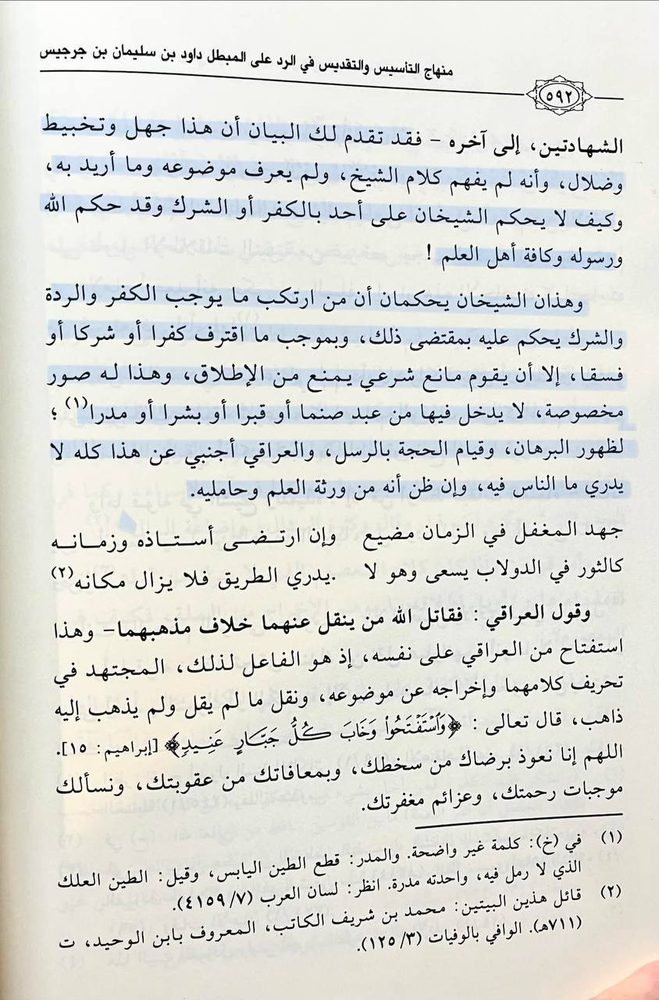

---

<!-- telegram-source: dar/messages5.html#message5037 -->
<!-- evidence-id: 000386 -->

Shaykh ʿAbd al-Laṭīf ibn ʿAbd al-Raḥmān ibn Ḥasan ibn ʿAbd al-Wahhāb said:

And this one (Dāwūd ibn Jirjīs) and those like him are among the most ignorant of people regarding this foundation, and the most astray from this path; rather, they are the people who most repel from it, reject it, and find fault with its people.

And the sincere one, according to them, the one who calls to the tawḥīd of Allah and to making the worship purely for Him, is a Khārijī and an mubtadiʿ, as he explicitly stated in his first treatise. He claimed that this is the religion of the Khawārij, and that whoever takfirs the one supplicating other than Allah is among those who declare the people of the qiblah disbelievers due to sins.

And most of these do not stop at attributing the people of tawḥīd to the Khawārij and bidʿah; rather, they openly takfīr them, and deem their blood and wealth lawful. And Allah is the One sought for help.

Al-ʿIrāqī (Dāwūd ibn Jirjīs) said: “But we do not takfir the people for these matters, because we have studied the Book of Allah and the Sunnah of His Messenger,” and so on.

[Tuḥfat aṭ-Ṭālib wa-al-Jalīs fī Kashf Shubuh Dāwud bin Jirjīs by Shaykh ʿAbd al-Laṭīf ibn ʿAbd al-Raḥmān p.38]

Show attached source scan

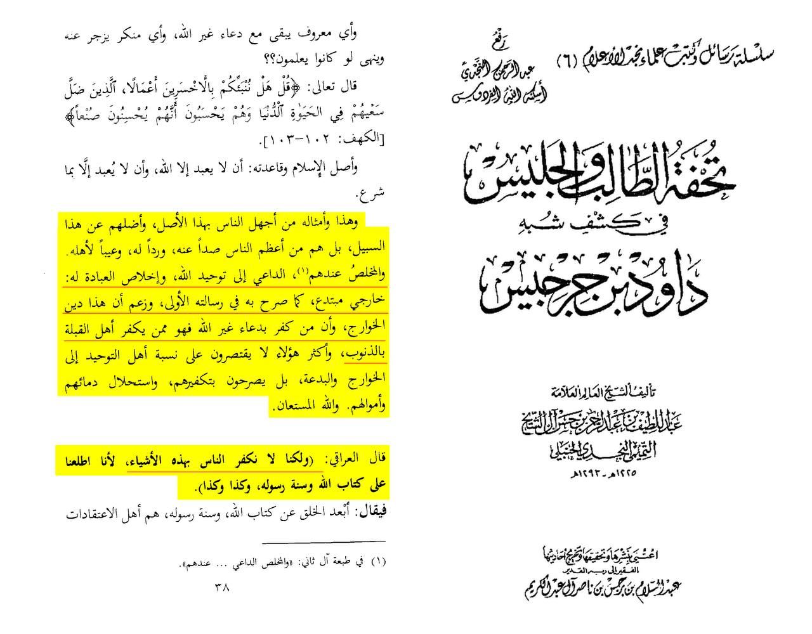

---

<!-- telegram-source: dar/messages4.html#message3880 -->
<!-- evidence-id: 000387 -->

Shaykh ʿAbd al-Raḥmān ash-Shaykh said:

Among the things transmitted from his companions such as the author of al-Furūʿ, and likewise those after him among the Ḥanbalīs who authored within the madhhab of Aḥmad, such as the author of al-Inṣāf and al-Tanqīḥ, and likewise those after them among later authors, such as the author of al-Iqnāʿ and al-Muntahā: these and others transmitted, in the chapter on the ruling of the murtadd, from Shaykh al-Islām Aḥmad ibn Taymiyyah that he said:

“Whoever places between himself and Allāh intermediaries that he calls upon, asks, and relies upon, has committed disbelief by ijmāʿ. And this is the madhhab of Aḥmad according to all of his companions.” His statement on intermediaries will appear later, if Allāh wills.

Thus the reliance of the Ḥanbalīs and others from Ahl al-Sunnah on the creed mentioned by Shaykh al-Islām concerning ijmāʿ is based on what will be mentioned from the clear verses, if Allāh wills. For this is what the call of the Messengers agreed upon from the first of them to the last of them. And it is the very purpose for which Allāh created creation: the negation of shirk in ʿibādah, that no type of worship be directed to anyone besides Allāh, whoever that may be.

This is what the Qur’ān indicates from beginning to end. And nothing has been transmitted from any of the salaf of the Ummah, nor from its imāms, permitting the calling upon the dead or the absent, nor permitting istighātha or istishfāʿ (seeking intercession) through them. On the contrary, the prohibition of this has come repeatedly in the clear verses, as we will mention some of that, if Allāh wills.

With what we have mentioned of ijmāʿ, and what the Book and the Sunnah indicate regarding restricting all types of ʿibādah to Allāh alone, and that whoever directs any of it to other than Allāh—for example istighātha from the dead or the absent—is a disbeliever: by all this it becomes clear that this al-ʿIrāqī (Dāwūd ibn Jirjīs) has opposed the Book, the Sunnah, and the ijmāʿ. And it is impossible that anything transmitted from the early generations of the Ummah and its imāms contradicts this ijmāʿ.

He has also opposed the scholars of Ahl al-Sunnah from every madhhab. How far removed he is from the religion upon which they unanimously agreed.

[Kashf mā Alqāh Iblīs min al-Bahraj wa-al-Talbīs ʿalā Qalb Dāwūd ibn Jirjīs by Shaykh ʿAbd al-Raḥmān ash-Shaykh p.49-50]

Show attached source scan

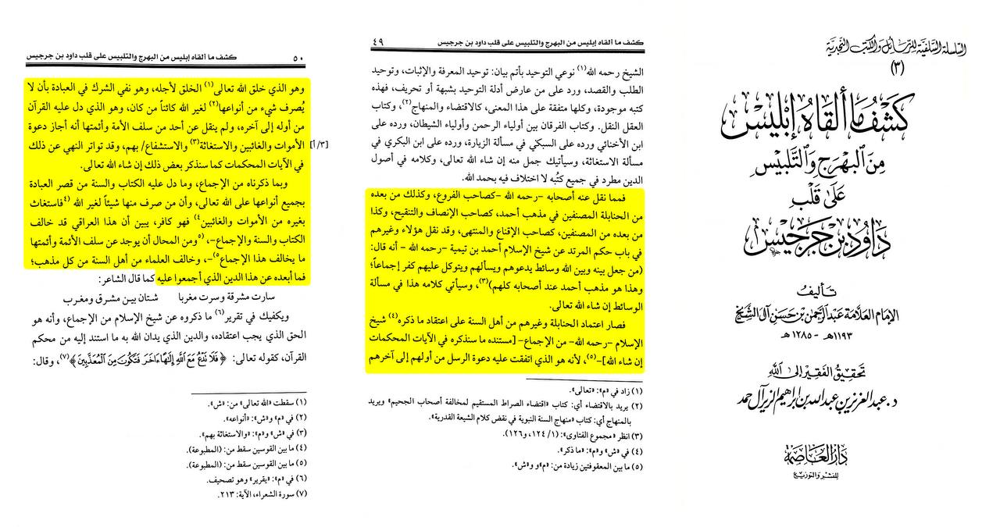

---

<!-- telegram-source: dar/messages3.html#message2774 -->
<!-- evidence-id: 000388 -->

Shaykh ʿAbd al-Raḥmān ash-Shaykh said:

It is necessary in Islam to submit to Allah alone and to abandon submission to anything besides Him. And this is the reality of our saying: Lā ilāha illā Allāh. So whoever submits to Allah and to other than Him is a mushrik, and Allah does not forgive that anything be associated with Him. And whoever does not submit is mustakbir (arrogant, haughty) regarding His worship. And Allah the Exalted said: “Indeed, those who are arrogant about My worship will enter Hell humiliated.” (Sūrat Ghāfir 40:60)

Until he (Ibn Taymiyyah) said: And Allah did not legislate for any prophet from among the prophets that he worship other than Allah at all. He (Allāh) the Exalted said: “He has legislated for you in religion what He enjoined upon Nūḥ, and that which We have revealed to you, and what We enjoined upon Ibrāhīm, Mūsā, and ʿĪsā: that you establish the religion and do not divide within it.” (Sūrat ash-Shūrā 42:13) He commanded the messengers to establish the religion and to not become divided within it.

[Kashf mā Alqāh Iblīs min al-Bahraj wa-al-Talbīs ʿalā Qalb Dāwūd ibn Jirjīs by Shaykh ʿAbd al-Raḥmān ash-Shaykh p.256]

Show attached source scan

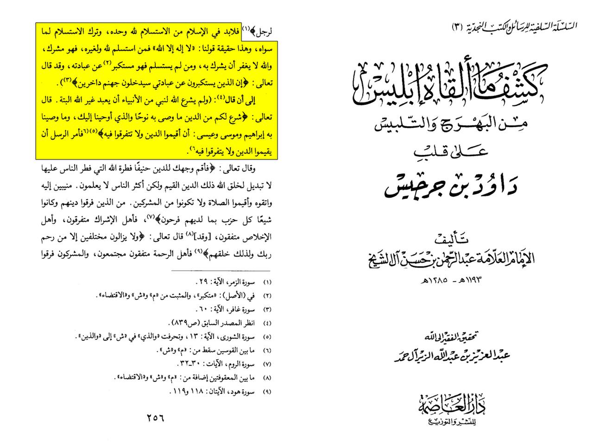

---

<!-- telegram-source: dar/messages4.html#message3633 -->
<!-- evidence-id: 000389 -->

Shaykh ʿAbd al-Raḥmān ash-Shaykh said:

Shirk with the lords of graves and the absent is shirk al-akbar that expels one from al-Islam. It is the same shirk of the mushrikūn of Quraysh and the Arabs. Rather, it will appear at the end of this Ummah.

No prayer or deed benefits with it. Allah said regarding the mushrikūn: “Then it will be said to them, ‘Where is that which you used to associate [with Him], apart from Allah?’ They will say, ‘They have departed from us.’” (Al-A‘raf 7:37). So Allah declared them kuffār because of shirk through du‘ā’, which they denied while lying against Allah.

So whoever directs any act of worship to other than Allah — such as duʿāʾ and the like — has deified that being through worship, and has taken it as an ilāh besides Allah.

[Kashf mā Alqāh Iblīs min al-Bahraj wa-al-Talbīs ʿalā Qalb Dāwūd ibn Jirjīs by Shaykh ʿAbd al-Raḥmān ash-Shaykh p.185]

Show attached source scan

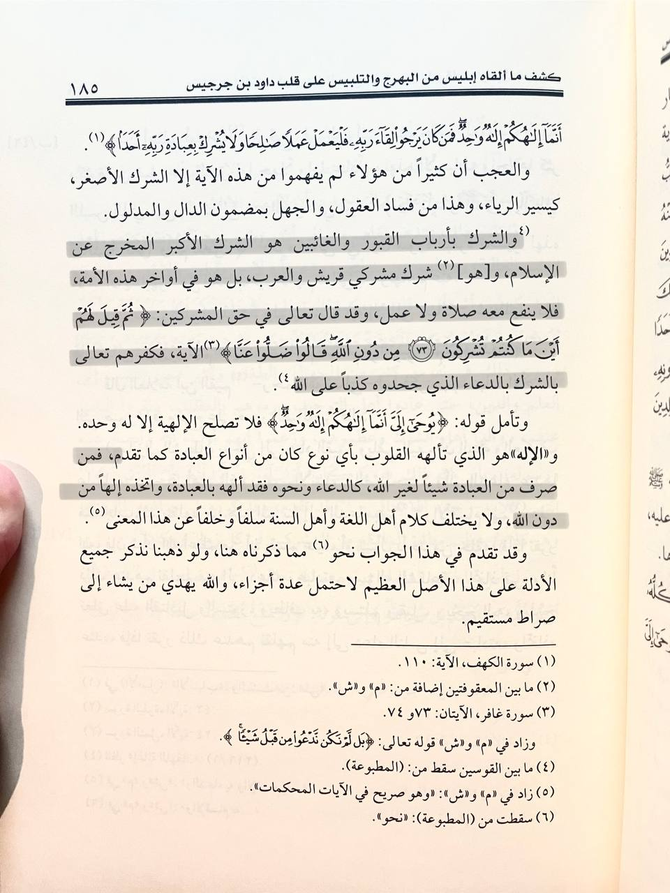

---

<!-- telegram-source: dar/messages4.html#message3884 -->
<!-- evidence-id: 000390 -->

Shaykh ʿAbd al-Raḥmān ash-Shaykh said:

What has already been established clarifies that asking the dead or the absent, and seeking intercession through them to Allāh, is exactly the religion of the mushrikūn among the Arabs and those before them. For Allāh sent His Messengers only to oppose this, as has been established in the verses on al-shafāʿah and those similar to them, and in what came from the Master of the Messengers:

"Say, ˹O Prophet,˺ “I call only upon my Lord, associating none with Him ˹in worship˺.” Say, “It is not in my power to harm or benefit you.” ˹My duty is˺ only to convey ˹the truth˺ from Allah and ˹deliver˺ His messages.” And whoever disobeys Allah and His Messenger will certainly be in the Fire of Hell, to stay there for ever and ever." [al-Jinn: 20-23]

So reflect on what is in these verses, and what the Exalted has arranged as a consequence for opposing the Messenger ﷺ in what he commanded towards and conveyed from Allāh regarding His tawḥīd, namely the threat of the Fire and eternal residence therein. And the Qurʾān, from beginning to end, establishes this call, directs to it, forbids everything that contradicts it—whether in speech, deed, or belief—and warns them of Himself and cautions them about His punishment.

[Kashf mā Alqāh Iblīs min al-Bahraj wa-al-Talbīs ʿalā Qalb Dāwūd ibn Jirjīs by Shaykh ʿAbd al-Raḥmān ash-Shaykh p.219]

Show attached source scan

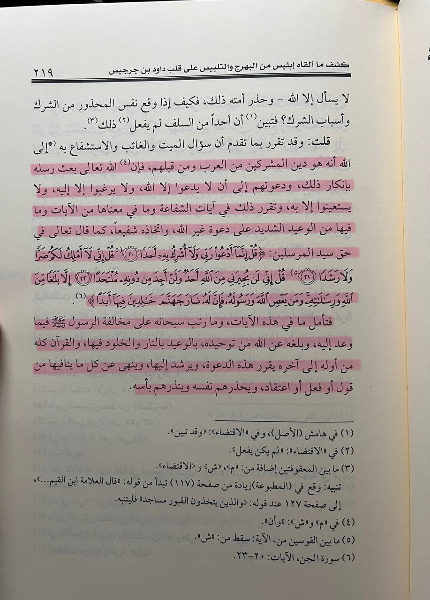

---

<!-- telegram-source: dar/messages3.html#message2388 -->
<!-- evidence-id: 000391 -->

Sheikh Abd al-Latif ibn Abd al-Rahman ibn Hasan Āl al-Shaykh said:

"As for al-`Irāqī and his misguided companions, they argued that the Sheikh (Ibn Taymiyyah) does not declare the ignorant to be disbelievers and that he says they are excused. They made this claim in a vague manner without providing details, and used this misconception as a shield to reject the Quranic verses and prophetic hadiths. They raised their voices against the monotheists, as was the case with their predecessors from the worshippers of graves and polytheists. And to Allah is the final return, and He is the Judge between His servants regarding what they differed in."

[Minhāj al-Tāsīs wa al-Taqdīs p.227]

Show attached source scan

---

<!-- telegram-source: dar/messages2.html#message1684 -->
<!-- evidence-id: 000392 -->

Shaykẖ ʿAbd Al-Laṭīf said:

Even he did not decisively declare takfīr for the jāhil who invokes others besides Allah—whether from the awlīyā’ of the graves or others—if no one is available to advise him and deliver the proof that, if rejected, would make one a kāfir. He said in some of his rasā’il:

“And if we do not fight those who worship the dome of the kāwiz, until we advance the invitation to purity of religion from Allah, then how could we declare kāfir one who has not migrated to us, even if he is a believer and muwaḥḥid?”

And he was asked about such ignorant people. He clarified that whoever has received the ḥujjah and is capable of understanding it becomes kāfir by worship of graves. Previously, he had spoken sufficiently on this matter.

Meanwhile, ʿAllāmah Ibn al-Qayyim decisively declared the kāfir status of muqallidīn (blind followers) of their shuyūkh in matters that entail takfīr, if they were capable of seeking the truth and understanding it, and yet neglected it.

For those who are unable or unprepared to understand what the messengers brought, they are considered like the ahl al-fatrah who were not reached by the da‘wah of any messenger. Both types are not judged as Muslim nor included in the category of Muslims, even according to those who do not declare some of them kāfir, as will be explained later.

As for shirk, it applies to them, and its name encompasses them. And what Islam remains with someone who contradicts its very origin? Its greatest principle is the shahādah that there is no god but Allah, and the persistence of Islam and its name, along with some of what the fuqahā’ mentioned regarding the ruling on the murtad, is clearer than its persistence among righteous servants and their du‘ā’.

But al-Iraqī (Dāwūd ibn Jirjīs) avoids calling this worship or du‘ā’, claiming it is tawassul and nida’ (calling), and he considers it recommended. Far, far is he from the truth!!

Where is the escape, and the God to be sought… yet one is trapped between hardship and desire.

All of this is by the grace of Allah, through His Book al-‘Azīz in which falsehood cannot approach from before it or behind it—tanzīl (revelation) from a Wise, Praiseworthy One. And by what Muhammad ibn ʿAbdullah brought as wisdom, guidance, and clarification, to the extent Allah revealed to him.

And Allah continues to plant in this dīn a seed whose proof is established among His servants, who strive in clarifying His dīn and sharī‘ah, while those who deviate in His Book and dīn, and turn it from its intended purpose, are left astray.

[Minhāj at-Taʾsīs wat-Taqdīs fī Kashf Shubuhāt Dāwūd Ibn Jirjīs by Shaykẖ ʿAbd Al-Laṭīf p.99]

Show attached source scan

---

<!-- telegram-source: dar/messages5.html#message4996 -->
<!-- evidence-id: 000393 -->

Shaykh ʿAbd al-Laṭīf Āl ash-Shaykh said:

As for making the dead into means by which one seeks Istighāthah from them, Makes du‘āʾ to them, hopes in them, and venerates them as intermediaries, then this is the religion of the idol worshippers.

The one who does that is takfired by the mere belief and action, even if he does not believe in their independence, as the Qurʾān has stated in more than one place. So al-ʿIrāqī (Dāwūd ibn Jirjīs) is opposing the Qurʾān and contradicting its texts.

[Minhāj at-Taʾsīs wa at-Taqdīs fī Kashf Shubuhāt Dāwūd ibn Jirjis by Shaykh ʿAbd al-Laṭīf Āl ash-Shaykh p.623]

Show attached source scan

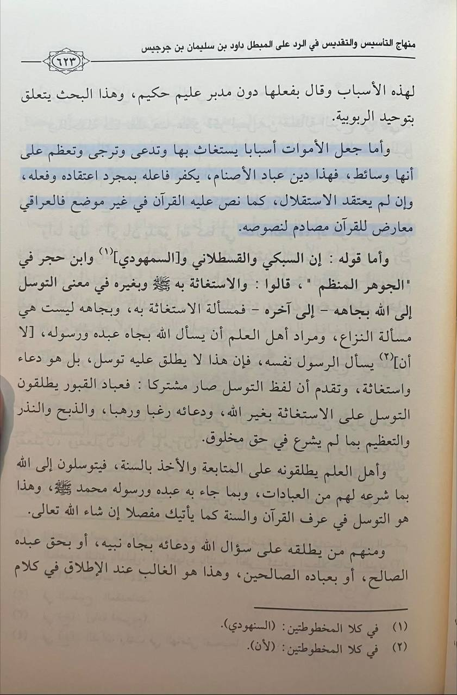

---

<!-- telegram-source: dar/messages3.html#message3168 -->
<!-- evidence-id: 000394 -->

An important fatawa and advice from Shaykh ʿAbd Allāh al-Jarbūʿ that I requested

Question I asked the Shaykh:

Shaykh, I have a question. I am from Britain, and here there is a well-known group that claims to be Salafī (SPUBS And their likes). Anyone who disagrees with them on this particular issue is labeled by them as a ḥaddādī , a takfīrī , or a khārijī .

Shaykh, they have attributed to scholars such as Shaykh Ibn Bāz, Shaykh Ibn ʿUthaymīn, Shaykh al-Fawzān, Ibn Taymiyyah, and others — that they excuse the mushrik and say that he is still a Muslim until the ḥujjah (proof) is established against him. They have (also) cited the ḥadīth of ash-shafā ʿ ah (intercession) in their writings to claim that a person can abandon all deeds and still enter Paradise.

Shaykh, I have gathered many, many, many statements from the scholars and translated them into English to warn against this group. Despite that, I was met with opposition, boycotting, insults, verbal abuse, and cursing — simply because I speak out against them. I have not found anyone here who opposes their beliefs. I need your advice on how to deal with this matter.

He responded: The ones you mentioned — Shaykh Ibn Taymiyyah, Ibn al-Qayyim, Ibn Kathīr, Shaykh Ibn Bāz — yes, they affirm al- ʿ udhr bil-jahl (excusing due to ignorance), but they still say that the mushrik is a kāfir . Their texts explicitly state that the ignorant one is given the same ruling as Ahl al-Fatrah — a disbeliever in the rulings of this world, while his matter is left to Allāh in the Hereafter (maybe he is excused).

The excuse of ignorance does not mean that someone who worships aṭ-ṭāghūt (false deities) is a Muslim. These people are blind — they do not know what Islām is. They are shallow-minded and followers of Dāwūd ibn Jirjīs. They are the brothers of the grave-worshippers and the polytheists.

Stay far away from them with the strongest form of separation. Do not pray behind them. Shaykh Ibn Bāz and Shaykh al-Fawzān explicitly gave fatāwā that whoever does not declare the mushrik to be a kāfir is just like him — they said it verbatim — and that one must not pray behind such people.

These individuals — and we seek refuge in Allāh — have fallen into disbelief. They themselves are disbelievers. Whoever does not declare the mushrik to be a kāfir is himself a kāfir .

Yes, al- ʿ udhr bil-jahl does not mean that a person who worships aṭ-ṭāghūt is a Muslim or that he is not a disbeliever. No. It means that if a person has not had knowledge reach him, even if he is a polytheist, then he will be questioned and tested on the Day of Judgement — as Ibn Kathīr said, and the authentic āthār support that they will be tested on the Day of Judgement.

That is the meaning of the excuse of ignorance. But to make ignorance equivalent to Islām — to claim that a person committing shirk due to ignorance is a Muslim — this is blindness of insight. Truly, these people are blind in their hearts.

Allāh ﷻ says: “So shall We make the Muslims like the criminals? What is [the matter] with you? How do you judge?” (Sūrat al-Qalam, 68:35–36)

What is wrong with you? How do you rule? What kind of evil, corrupt ruling is this?

The statement of Ibrāhīm عليه السلام is decisive — that no one is truly a Muslim except one who separates completely from shirk. Whoever falls into shirk — his deeds are rendered void, and he becomes among the losers, among the disbelievers, among the criminals.

These people are brothers of the worshippers of aṭ-ṭāghūt — stay away from them. Stay away from them.

This is not the path of the Salaf . It is not the way of the pious predecessors. Abandon them. Do not let them distract you from your path or mislead you.

This is a great darkness. Whoever says that the one who commits shirk is still a Muslim — he has fallen into kufr .

Shaykh al-Islām (Ibn Taymiyyah) stated that a group from the Salaf declared such people disbelievers. Among those who said this were {unclear}, Aḥmad ibn Ḥanbal, Abū ʿUbayd, and others.

I asked after : May Allah reward you, Shaykh.

Show attached source scan

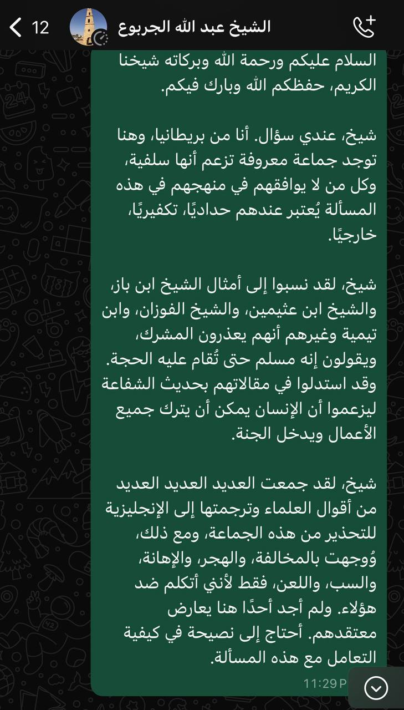

---

<!-- telegram-source: dar/messages5.html#message4248 -->
<!-- evidence-id: 000395 -->

Shaykh Abī al-ʿAlā ar-Rāshid said:

Despite all these evidences clarifying the weighty conditions with which this great statement has been bound, many people pronounce this statement without fulfilling its conditions or avoiding its nullifiers, and this is of no benefit to them by ijmāʿ.

The reciter: "He said: this is what benefits the one who says Lā ilāha illā Allāh. For this reason Allah the Exalted said: “he has grasped the firmest handhold”. This is unlike the one who says it while calling upon other than Allah and making istighāthah with them—whether from a dead person or an absent one—who neither benefits nor harms, as is seen among most of creation. These people have said it, yet they have become involved in what contradicts it. Thus it does not benefit the one who says it except with knowledge of its meaning, in negation and affirmation.

The one who is ignorant of its meaning, even if he says it, it does not benefit him due to his ignorance of what it was established for, according to the Arabic usage intended by it—namely, the negation of shirk. Likewise, if he knows its meaning without certainty. So where then is certainty with doubt?"

The Shaykh then said: Yes, here is an affirmation of an important foundational principle by which the shaykh refutes the Murjiʾah and those who followed their path in the era of Shaykh Muḥammad ibn ʿAbd al-Wahhāb رحمه الله, such as Dāwūd ibn Jirjīs. They argued against the shaykh, saying: “You declare disbelievers those who say Lā ilāha illā Allāh.” So he established the principle that whoever says Lā ilāha illā Allāh while being involved in a nullifier —such as making duʿāʾ to the dead, making istighāthah with them, or believing that they bring benefit —this statement, along with involvement in a nullifier, does not benefit its speaker.

Likewise, the one who says it while ignorant of its meaning: it does not benefit him due to his ignorance, for one of its foremost conditions is knowledge of its meaning. This is one of the foundational principles that the shaykh established in refutation of those who say: “You declare people disbelievers who say Lā ilāha illā Allāh.”

However, this does not necessarily mean that it is to be used as evidence for the statements of some extremists who test people and harbor evil suspicion toward them. The one who pronounces Lā ilāha illā Allāh: if he pronounces it while not being involved in shirk, it is accepted from him; and if he pronounces it while being involved in shirk, it is not accepted from him.

Show attached source scan

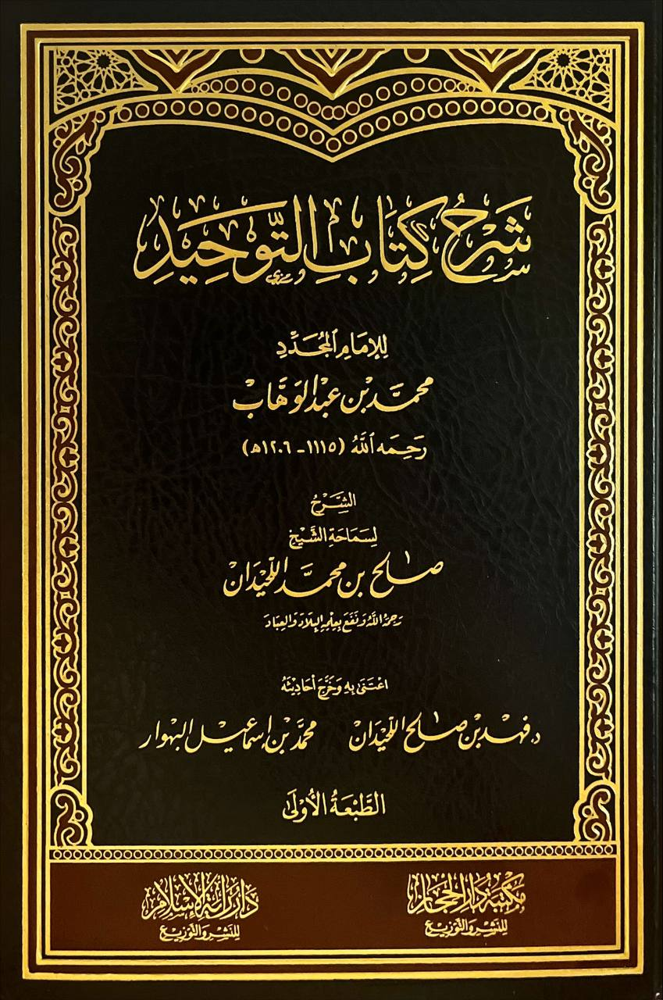

---

### ʿAbd al-Laṭīf Āl al-Shaykh in his refutation of Dāwūd ibn Jirjīs
<!-- evidence-id: 000396 -->

The following is a complete connected passage. It is especially useful because it gives the context of the often-cited report that Muḥammad ibn ʿAbd al-Wahhāb did not hasten to declare a particular ignorant grave caller a disbeliever before advice and conveyance of the proof. ʿAbd al-Laṭīf immediately distinguishes that question from calling the person a Muslim or denying that the description of shirk applies to him:

Show Arabic source text

المصدر: عبد اللطيف آل الشيخ، *منهاج التأسيس والتقديس في كشف شبهات داود بن جرجيس*، ص. 98–99.

فَمَنِ اعْتَقَدَ فِي بَشَرٍ أَنَّهُ إِلَهٌ، أَوْ دَعَا مَيِّتًا، أَوْ طَلَبَ مِنْهُ الرِّزْقَ أَوِ النَّصْرَ أَوِ الْهِدَايَةَ، أَوْ تَوَكَّلَ عَلَيْهِ أَوْ سَجَدَ لَهُ، فَإِنَّهُ يُسْتَتَابُ، فَإِنْ تَابَ وَإِلَّا ضُرِبَتْ عُنُقُهُ. فَبَطَلَ اسْتِدْلَالُ الْعِرَاقِيِّ، وَانْهَدَمَ مِنْ أَصْلِهِ. كَيْفَ يَجْعَلُ النَّهْيَ عَنْ تَكْفِيرِ الْمُسْلِمِينَ مُتَنَاوِلًا لِمَنْ يَدْعُو الصَّالِحِينَ وَيَسْتَغِيثُ بِهِمْ مَعَ اللَّهِ، وَيَصْرِفُ لَهُمْ مِنَ الْعِبَادَاتِ مَا لَا يَسْتَحِقُّهُ إِلَّا اللَّهُ؟ وَهَذَا بَاطِلٌ بِنُصُوصِ الْكِتَابِ وَالسُّنَّةِ وَإِجْمَاعِ عُلَمَاءِ الْأُمَّةِ.

وَمِنْ عَجِيبِ جَهْلِ الْعِرَاقِيِّ أَنَّهُ يَحْتَجُّ عَلَى خَصْمِهِ بِنَفْسِ الدَّعْوَى، وَالدَّعْوَى لَا تَصْلُحُ دَلِيلًا؛ فَإِنَّ دَعْوَى الْعِرَاقِيِّ لِإِسْلَامِ عُبَّادِ الْقُبُورِ تَحْتَاجُ دَلِيلًا قَاطِعًا عَلَى إِسْلَامِهِمْ، فَإِذَا ثَبَتَ إِسْلَامُهُمْ مُنِعَ مِنْ تَكْفِيرِهِمْ، وَالتَّفْرِيعُ لَيْسَ مُشْكِلًا.

وَمَعْلُومٌ أَنَّ مَنْ كَفَّرَ الْمُسْلِمِينَ لِمُخَالَفَةِ رَأْيِهِ وَهَوَاهُ، كَالْخَوَارِجِ وَالرَّافِضَةِ، أَوْ كَفَّرَ مَنْ أَخْطَأَ فِي الْمَسَائِلِ الِاجْتِهَادِيَّةِ أُصُولًا أَوْ فُرُوعًا، فَهَذَا وَنَحْوُهُ مُبْتَدِعٌ ضَالٌّ، مُخَالِفٌ لِمَا عَلَيْهِ أَئِمَّةُ الْهُدَى وَمَشَايِخُ الدِّينِ. وَمِثْلُ شَيْخِ الْإِسْلَامِ مُحَمَّدِ بْنِ عَبْدِ الْوَهَّابِ لَا يُكَفِّرُ أَحَدًا بِهَذَا الْجِنْسِ وَلَا مِنْ هَذَا النَّوْعِ، وَإِنَّمَا يُكَفِّرُ مَنْ نَطَقَ بِتَكْفِيرِهِ الْكِتَابُ الْعَزِيزُ، وَجَاءَتْ بِهِ السُّنَّةُ الصَّحِيحَةُ، وَأَجْمَعَتْ عَلَى تَكْفِيرِهِ الْأُمَّةُ، كَمَنْ بَدَّلَ دِينَهُ، وَفَعَلَ فِعْلَ الْجَاهِلِيَّةِ الَّذِينَ يَعْبُدُونَ الْمَلَائِكَةَ وَالْأَنْبِيَاءَ وَالصَّالِحِينَ وَيَدْعُونَهُمْ مَعَ اللَّهِ؛ فَإِنَّ اللَّهَ كَفَّرَهُمْ وَأَبَاحَ دِمَاءَهُمْ وَأَمْوَالَهُمْ وَذَرَارِيَّهُمْ بِعِبَادَةِ غَيْرِهِ، نَبِيًّا أَوْ وَلِيًّا أَوْ صَنَمًا، لَا فَرْقَ فِي الْكُفْرِ بَيْنَهُمْ، كَمَا دَلَّ عَلَيْهِ الْكِتَابُ الْعَزِيزُ وَالسُّنَّةُ الْمُسْتَفِيضَةُ.

وَالشَّيْخُ مُحَمَّدٌ رَحِمَهُ اللَّهُ مِنْ أَعْظَمِ النَّاسِ تَوَقُّفًا وَإِحْجَامًا عَنْ إِطْلَاقِ الْكُفْرِ، حَتَّى إِنَّهُ لَمْ يَجْزِمْ بِتَكْفِيرِ الْجَاهِلِ الَّذِي يَدْعُو غَيْرَ اللَّهِ مِنْ أَهْلِ الْقُبُورِ أَوْ غَيْرِهِمْ إِذَا لَمْ يَتَيَسَّرْ لَهُ مَنْ يَنْصَحُهُ وَيُبَلِّغُهُ الْحُجَّةَ الَّتِي يَكْفُرُ تَارِكُهَا. قَالَ فِي بَعْضِ رَسَائِلِهِ: وَإِذَا كُنَّا لَا نُقَاتِلُ مَنْ يَعْبُدُ قُبَّةَ الْكَوَّازِ حَتَّى نَتَقَدَّمَ بِدَعْوَتِهِ إِلَى إِخْلَاصِ الدِّينِ لِلَّهِ، فَكَيْفَ نُكَفِّرُ مَنْ لَمْ يُهَاجِرْ إِلَيْنَا وَإِنْ كَانَ مُؤْمِنًا مُوَحِّدًا؟

وَقَالَ: وَقَدْ سُئِلَ عَنْ مِثْلِ هَؤُلَاءِ الْجُهَّالِ، فَقَرَّرَ أَنَّ مَنْ قَامَتْ عَلَيْهِ الْحُجَّةُ وَتَأَهَّلَ لِمَعْرِفَتِهَا يَكْفُرُ بِعِبَادَةِ الْقُبُورِ. وَقَدْ سَبَقَ مِنْ كَلَامِهِ مَا فِيهِ الْكِفَايَةُ، مَعَ أَنَّ الْعَلَّامَةَ ابْنَ الْقَيِّمِ رَحِمَهُ اللَّهُ جَزَمَ بِكُفْرِ الْمُقَلِّدِينَ لِشُيُوخِهِمْ فِي الْمَسَائِلِ الْمُكَفِّرَةِ إِذَا تَمَكَّنُوا مِنْ طَلَبِ الْحَقِّ وَمَعْرِفَتِهِ وَتَأَهَّلُوا لِذَلِكَ فَأَعْرَضُوا وَلَمْ يَلْتَفِتُوا.

وَمَنْ لَمْ يَتَمَكَّنْ وَلَمْ يَتَأَهَّلْ لِمَعْرِفَةِ مَا جَاءَتْ بِهِ الرُّسُلُ فَهُوَ عِنْدَهُ مِنْ جِنْسِ أَهْلِ الْفَتْرَةِ مِمَّنْ لَمْ تَبْلُغْهُ دَعْوَةُ رَسُولٍ مِنَ الرُّسُلِ. وَكِلَا النَّوْعَيْنِ لَا يُحْكَمُ بِإِسْلَامِهِمْ وَلَا يَدْخُلُونَ فِي مُسَمَّى الْمُسْلِمِينَ، حَتَّى عِنْدَ مَنْ لَمْ يُكَفِّرْ بَعْضَهُمْ. وَأَمَّا الشِّرْكُ فَهُوَ يَصْدُقُ عَلَيْهِمْ وَاسْمُهُ يَتَنَاوَلُهُمْ. وَأَيُّ إِسْلَامٍ يَبْقَى مَعَ مُنَاقَضَةِ أَصْلِهِ وَقَاعِدَتِهِ الْكُبْرَى، شَهَادَةِ أَنْ لَا إِلَهَ إِلَّا اللَّهُ؟ وَبَقَاءُ الْإِسْلَامِ وَمُسَمَّاهُ مَعَ بَعْضِ مَا ذَكَرَ الْفُقَهَاءُ فِي بَابِ حُكْمِ الْمُرْتَدِّ أَظْهَرُ مِنْ بَقَائِهِ مَعَ عِبَادَةِ الصَّالِحِينَ وَدُعَائِهِمْ. وَلَكِنَّ الْعِرَاقِيَّ يَفِرُّ مِنْ أَنْ يُسَمَّى ذَلِكَ عِبَادَةً وَدُعَاءً، وَيَزْعُمُ أَنَّهُ تَوَسُّلٌ وَنِدَاءٌ وَيَرَاهُ مُسْتَحَبًّا، وَهَيْهَاتَ هَيْهَاتَ.

**English**

“Whoever believes that a human being is a deity, calls upon a dead person, seeks provision, victory, or guidance from him, relies upon him, or prostrates to him, is called to repent. If he repents, otherwise his neck is struck.

The Iraqi’s argument is therefore invalid and demolished from its foundation. How can he make the prohibition against declaring Muslims disbelievers include one who calls upon righteous people, seeks their aid alongside Allāh, and directs to them acts of worship deserved by Allāh alone? This is false according to the texts of the Book and Sunnah and the consensus of the scholars of the ummah.

One astonishing feature of the Iraqi’s ignorance is that he argues against his opponent with the claim itself, although a claim cannot serve as its own evidence. His claim that the grave worshippers are Muslims requires decisive proof of their Islam. If their Islam were established, declaring them disbelievers would be prohibited, and that consequence is not difficult to understand.

It is known that whoever declares Muslims disbelievers merely because they oppose his opinion or desire, as do the Khawārij and Rāfiḍah, or declares disbelievers those who err in matters of scholarly judgment, whether foundational or subsidiary, is a misguided innovator who opposes the imāms of guidance and the scholars of the religion. Someone such as Shaykh al-Islām Muḥammad ibn ʿAbd al-Wahhāb did not declare anyone a disbeliever for that kind of matter. He only declared disbelievers those whom the Noble Book declared disbelievers, whose disbelief is established by the authentic Sunnah, and whose disbelief the ummah unanimously affirmed, such as one who changes his religion and practices what the people of Jāhiliyyah practiced when they worshipped angels, prophets, and righteous people and called upon them alongside Allāh. Allāh declared them disbelievers and permitted their blood, wealth, and offspring because they worshipped other than Him, whether a prophet, a walī, or an idol. There is no distinction among them in disbelief, as indicated by the Noble Book and the widely transmitted Sunnah.

Shaykh Muḥammad, may Allāh have mercy upon him, was among the people most restrained and hesitant about applying disbelief. He did not decisively declare a particular ignorant person who called upon other than Allāh from among the people of the graves or others a disbeliever when no one was available to advise him and convey to him the proof whose abandonment constitutes disbelief. He said in one of his letters, ‘If we do not fight one who worships the dome of al-Kawwāz until we first call him to make the religion sincerely for Allāh, how could we declare disbelievers those who did not migrate to us, although they were believing monotheists?’

He was asked about ignorant people of this kind and established that one against whom the proof has been established and who is capable of knowing it becomes a disbeliever through the worship of graves. Enough of his words on this have already preceded. Moreover, Ibn al-Qayyim, may Allāh have mercy upon him, decisively declared disbelievers those who blindly followed their teachers in matters that constitute disbelief when they were able and qualified to seek and recognize the truth but turned away without paying attention.

As for one who was neither able nor qualified to know what the Messengers brought, Ibn al-Qayyim placed him in the category of ahl al-fatrah, those unreached by the call of any Messenger. Neither category is judged to be Muslim or included within the name ‘Muslims,’ even according to those who do not declare some of them disbelievers. As for shirk, it truthfully applies to them and its name includes them. What Islam remains when its foundation and greatest principle, the testimony that none is worthy of worship except Allāh, has been contradicted? The continued existence of Islam and its name alongside some matters mentioned by the jurists in the chapter on apostasy would be more conceivable than its remaining alongside the worship of righteous people and calling upon them. But the Iraqi flees from calling that worship and supplication. He claims it is merely seeking a means and calling out, and regards it as recommended. Far, far from the truth.”

Source: ʿAbd al-Laṭīf Āl al-Shaykh, Minhāj al-Taʾsīs wa-al-Taqdīs fī Kashf Shubuhāt Dāwūd ibn Jirjīs, pp. 98–99.
### The claimed distinction between direct worship and taking a “cause”
<!-- evidence-id: 000397 -->

This complete passage answers Dāwūd ibn Jirjīs’s claim that calling upon the dead is not shirk when they are regarded only as a cause and not as independent:

Show Arabic source text

المصدر: عبد اللطيف آل الشيخ، *تحفة الطالب والجليس في كشف شبه داود بن جرجيس*، ص. 128–129.

وَقَدْ عُلِّقَ عَلَى الْحُكْمِ بِالْكُفْرِ وَإِبَاحَةِ الدَّمِ وَالْمَالِ نَفْسُ الشِّرْكِ وَعِبَادَةُ غَيْرِ اللَّهِ. قَالَ تَعَالَى: {وَقَاتِلُوا الْمُشْرِكِينَ كَافَّةً كَمَا يُقَاتِلُونَكُمْ كَافَّةً}، وَقَالَ: {وَقَاتِلُوهُمْ حَتَّى لَا تَكُونَ فِتْنَةٌ}، وَالْفِتْنَةُ: الشِّرْكُ. وَقَالَ تَعَالَى: {إِنَّهُ مَنْ يُشْرِكْ بِاللَّهِ فَقَدْ حَرَّمَ اللَّهُ عَلَيْهِ الْجَنَّةَ وَمَأْوَاهُ النَّارُ}. وَقَالَ تَعَالَى: {إِنَّ اللَّهَ لَا يَغْفِرُ أَنْ يُشْرَكَ بِهِ}.

وَمِنَ الْمُشْتَهَرِ عِنْدَهُمْ أَنَّ تَعْلِيقَ الْحُكْمِ بِالْمُشْتَقِّ يُؤْذِنُ بِالْعِلِّيَّةِ. وَهَذَا الْأَحْمَقُ زَادَ قَيْدًا فَقَالَ: لَا يُشْرِكُ إِلَّا مَنْ قَصَدَ وَاعْتَقَدَ الِاسْتِقْلَالَ مِنْ دُونِ اللَّهِ. وَفِي تَلْبِيَةِ الْمُشْرِكِينَ فِي الْجَاهِلِيَّةِ: لَبَّيْكَ لَا شَرِيكَ لَكَ، إِلَّا شَرِيكًا هُوَ لَكَ، تَمْلِكُهُ وَمَا مَلَكَ. فَهَؤُلَاءِ لَمْ يَدَّعُوا الِاسْتِقْلَالَ، وَعَلَى زَعْمِ هَذَا لَيْسُوا بِمُشْرِكِينَ.

وَقَوْلُهُ: هَذَا نِدَاءٌ لَا دُعَاءٌ، مِنْ أَدَلِّ الْأَشْيَاءِ عَلَى جَهْلِهِ وَعَدَمِ مُمَارَسَتِهِ لِشَيْءٍ مِنَ الْعِلْمِ وَإِنْ قَلَّ؛ فَإِنَّ النِّدَاءَ هُوَ رَفْعُ الصَّوْتِ بِالدُّعَاءِ أَوِ الْأَمْرِ أَوِ النَّهْيِ، وَيُقَابِلُهُ النَّجْوَى الَّتِي هِيَ الْمُسَارَّةُ وَخَفْضُ الصَّوْتِ. هَذَا بِإِجْمَاعِ أَهْلِ اللُّغَةِ، كَمَا حَكَاهُ ابْنُ الْقَيِّمِ فِي نُونِيَّتِهِ وَشَيْخُ الْإِسْلَامِ فِي تِسْعِينِيَّتِهِ، وَلَيْسَ قَسِيمًا لِلدُّعَاءِ كَمَا ظَنَّهُ. قَالَ تَعَالَى: {وَيَوْمَ يَقُولُ نَادُوا شُرَكَائِيَ الَّذِينَ زَعَمْتُمْ فَدَعَوْهُمْ}، فَمَا فَعَلُوهُ عَيْنُ مَا أُمِرُوا بِهِ، وَكَفَى بِهَذِهِ الْآيَةِ حُجَّةً عَلَى إِبْطَالِ قَوْلِهِ. وَقَالَ تَعَالَى: {وَأَيُّوبَ إِذْ نَادَى رَبَّهُ}.

**English**

“The rulings of disbelief and the permissibility of blood and wealth were attached to shirk itself and to worshipping other than Allāh. Allāh said, ‘Fight the mushrikīn collectively as they fight you collectively,’ and, ‘Fight them until there is no fitnah,’ meaning shirk. He said, ‘Whoever associates partners with Allāh, Allāh has forbidden Paradise to him and his refuge is the Fire,’ and, ‘Allāh does not forgive associating partners with Him.’

It is well known among the scholars that attaching a ruling to a derived description indicates that the description is its effective cause. Yet this fool added a condition and said, ‘No one commits shirk unless he intends and believes that the object acts independently apart from Allāh.’ The talbiyah of the mushrikīn during Jāhiliyyah was: ‘At Your service, You have no partner except a partner who belongs to You; You own him and all that he owns.’ They did not claim independence for those partners. According to this man’s claim, they would not have been mushrikīn.

His statement, ‘This is calling out, not supplication,’ is among the clearest proofs of his ignorance and his lack of even the slightest engagement with knowledge. Calling out is raising the voice with supplication, command, or prohibition. Its opposite is private conversation and lowering the voice. This is agreed upon by the linguists, as Ibn al-Qayyim related in his Nūniyyah and Shaykh al-Islām in his Tisʿīniyyah. Calling out is not a separate category from supplication as he imagined. Allāh said, ‘On the Day He will say: Call those whom you claimed were My partners, then they will call upon them.’ What they did was exactly what they were ordered to do, and this verse alone is sufficient to invalidate his claim. Allāh also said, ‘And Ayyūb, when he called upon his Lord.’”

Source: ʿAbd al-Laṭīf Āl al-Shaykh, Tuḥfat al-Ṭālib wa-al-Jalīs fī Kashf Shubah Dāwūd ibn Jirjīs, pp. 128–129.

---

### منهاج التأسيس والتقديس في كشف شبهات داود بن جرجيس
<!-- evidence-id: 000398 -->

#### Page 34

فصل
قال العراقيّ في مقدمة رسالته: اعلم أن شيخ الإسلام قال في بعض كتبه ـ كما سيأتي قريباً ـ إن أول من أظهر كفر أهل السنة والجماعة وتشريكهم: هم الخوارج والرافضة والمعتزلة.والجواب أن يقال:قد تقدم جواب هذا، وأن أهل السنة والجماعة هم المتمسكون بما كان عليه رسول الله صلى الله عليه وسلم من المعتقد والدين الذي خالفوا به أهل البدع وباينوهم، فلم يذهبوا إلى ما ذهبت إليه الجهمية والمعطلة، ولا إلى ما ذهبت إليه القدرية النفاة والقدرية المجبرة، ولا إلى ما ذهبت إليه الخوارج والمعتزلة، ولا إلى ما ذهبت إليه الرافضة والمرجئة، ولم يذهبوا إلى ما افتراه الغلاة في الأولياء والصالحين من عباد القبور، ونحوهم. فإن هؤلاء يسمون عند أهل السنة والجماعة غالية كما سموا به من غلا في علي وزعم أنه الإله الحق، فاستتابهم علي، فأبوا فخدّ لهم الأخاديد وأوقد فيها النيران، وقذفهم فيها وقال:إني إذا رأيت أمراً منكراً
…
أججت ناري ودعوت قنبراًوفي رواية:لما رأيت الأمر أمراً منكراً.

---

<!-- evidence-id: 000399 -->
#### Page 35

ومن زعم أن عباد القبور أهل سنة وجماعة فهو إلى أن يعالج عقله أحوج منه إلى أن يقام عليه الدليل.وفي كلام العراقيّ لفظة مدرجة ليست من كلام الشيخ، وهي قوله: "وتشريكهم" ظن أنها تنفعه، لأن المسلمين حكموا على عباد القبور بالشرك، فزاد هذه الكلمة، وسيأتيك كلام الشيخ في الغالية وعبارته في الرسالة السنية قريباً إن شاء الله تعالى.

---

<!-- evidence-id: 000400 -->
#### Page 50

فصل
ونذكر لك هنا طرفاً من معتقد عباد القبور والصالحين، وحقيقة ما هم عليه من الدين، ليعلم الواقف عليه أي الفريقين أحق بالأمن، إن كان الواقف ممن اختصه الله بالفضل والمن، ولئلا يلتبس الأمر بتسميتهم لكفرهم ومحالهم تشفعاً وتوسلاً واستظهاراً، مع ما في التسمية من الهلاك المتناهي عند من عقل الحقائق.من ذلك محبتهم مع الله محبة تأله وخضوع ورجاء، ودعاؤهم مع الله في المهمات والملمات والحوادث التي لا يكشفها ولا يجيب الدعاء فيها إلا فاطر الأرض والسموات والعكوف حول أجداثهم، وتقبيل أعتابهم، والتمسح بآثارهم، طلباً للغوث، واستجابة للدعوات وإظهاراً للفاقة، وإبداء للفقر والضراعة، واستنزالا للغوث والأمطار، وطلباً للسلامة من شدائد البر والبحار، وسؤالهم تزويجهم الأرامل والأيامى، واللطف بالضعفاء واليتامى، والاعتماد عليهم في المطالب العالية، وتأهليهم لمغفرة الذنوب والنجاة من الهاوية، وإعطاء تلك المراتب السامية. وجماهيرهم لما ألفت ذلك طباعهم وفسدت به فطرهم، وعز عنهم امتناعهم، لا يكاد يخطر ببال أحدهم ما يخطر ببال آحاد المسلمين، من قصد الله تعالى والإنابة إليه، بل ليس لذلك عندهم إلا الولي الفلاني ومشهد الشيخ فلان. حتى جعلوا الذهاب إلى المشاهد عوضاً عن الخروج للاستسقاء والإنابة إلى الله في كشف الشدائد والبلوى. كل هذا رأيناه وسمعناه عنهم، وقد حدّث الشيخ مصطفة البولاقي أن بعض رؤساء

---

<!-- evidence-id: 000401 -->
#### Page 51

الجامع الأزهر عادة لما اشتكى عينيه، وقال له: هلا ذهبت إلى مولد الشيخ أحمد البدوي فقد حكي أن إنساناً شكا إليه هاب بصره، فسمع قائلاً يقول من الضريح: أعطوه عين كذا وكذا.فانظر إلى ما خطر ببال هذا المتكلم من تعظيم الميت وتأهيله لتلك المطالب التي لا يقدر عليها إلا الله القاهر الغالب. وقصد الوساطة هنا على ما فيها ما أظنها تخطر بباله أصلاً. فهل سمعت عن جاهلية العرب مثل هذه الغرائب التي ينتهي عندها العجب؟ والكلام مع ذكي القلب يقظ الذهن قوي الهمة العارف بالحقائق، وأما ميت القلب بليد الذهن وضيع النفس جامد القريحة ومن لا تفارق همته التشبث بأذيال التقليد، والتعلق على ما يحكى عن فلان وفلان من معتقد أهل المقابر والتنديد، فذاك فاسد الفطرة معتل المزاج، وخطابه محض عناء ولجاج.ومما بلغنا عن بعض علماء زبيد: أن رجلين قصدا الطائف، فقال أحدهما لصاحبه ـ والمسئول ممن يترشح للعلم ـ: أهل الطائف لا يعرفون الله إنما يعرفون ابن عباس، فأجابه: بأن معرفتهم لابن عباس كافية، لأنه يعرف الله!.فأيّ ملّة ـ صان الله ملّة الإسلام ـ لا تمانع هذه الكفريات ولا تدافعها؟.وذكر الزبيدي أيضاً أن رجلا كان بمكة عند بعض المشاهد، فقال لمن عنده: أريد الذهاب إلى الطواف، فقال بعض غلاتهم: مقامك هنا أكرم.ومن وقف على كتاب مناقب الأربعة المعبودين بمصر، وهم: البدوي، والرفاعي، والدسوقي، ورابعهم فيما أظن أبو العلا ـ فقد وقف على ساحل كفرهم، وعرف صفة إفكهم.وبلغنا عن بعض الثقات أن جماعة من المدعين للعلم بزبيد كانوا

---

<!-- evidence-id: 000402 -->
#### Page 52

يقرؤون صحيح البخاري، فإذا فرغوا منه ـ إما أحياناً أو مطلقاً ـ ذهبوا إلى قبر البحيرة أو غيره، فوقفوا عاكفين ما شاء الله، وعليهم من السكينة والوقار وضروب الخضوع لنازل الحفرة. قال من نقله: فالله أعلم، أهو شيء وجدوه في صحيح البخاري أو غيره، أو ما هو؟.ورأيت في حاشية الشيخ إبراهيم الباجوريّ على السنوسية نقلاً عن الدردير فيما أظن عن الشعراني: أن الله وكل بقبر كل ولي ملكاً يقضي حاجته من سأل ذلك الولي.فقف هنا وانظر ما آل إليه شركهم وإفكهم (1) ، فأين هذا من قوله تعالى {وَإِذَا سَأَلَكَ عِبَادِي عَنِّي فَإِنِّي قَرِيبٌ} الآية [البقرة:186] ، وقوله: {ادْعُوا رَبَّكُمْ تَضَرُّعاً وَخُفْيَةً} [الأعراف: من الآية55] ، وقوله: {فَإِذَا فَرَغْتَ فَانْصَبْ، وَإِلَى رَبِّكَ فَارْغَبْ} [الشرح:7ـ8] ، وقوله تعالى: {أَمَّنْ يُجِيبُ الْمُضْطَرَّ إِذَا دَعَاهُ} [النمل: من الآية62] ، وقوله تعالى: {وَقَالَ رَبُّكُمُ ادْعُونِي أَسْتَجِبْ لَكُمْ} الآية [غافر:60] وأيّ حجّة في هذا الذي قال الشعرانيّ لو كانوا يعلمون؟ ولكن القوم أصابهم داء الأمم قبلهم. فنبذوا كتاب الله وراء ظهورهم، كأنهم لا يعلمون، واتبعوا ما تتلو الشياطين.ومن هذا الجنس: ما ذكره الشعراني في ترجمة الملقب بشمس الدين الحنفي أنه قال في مرض موته: من كانت له حاجة فليأت قبري ويطلب مني أن أقضيها له، فإنما بيني وبينه ذراع من تراب، وكل رجل يحجبه عن أصحابه ذراع من تراب فليس برجل. انتهى.وقد اجتمع جماعة من الموحدين من أهل الإسلام في بيت رجل من أهل مصر وبقربه رجل يدّعي العلم، فأرسل إليه صاحب البيت، فسأله بمسمع من الحاضرين فقال له: كم يتصرف في الكون؟ فقال: يا سيدي، سبعة، قال: من هم؟ قال: فلان وفلان وعدّ أربعة من المعبودين بمصر، فقال

---

<!-- evidence-id: 000403 -->
#### Page 53

صاحب الدار لمن بحضرته من الموحدين: إنما بعثت لهذا الرجل وسألته لأعرفكم قدر ما أنتم فيه من نعمة الإسلام. أو كلاماً نحو هذا.وباب تصرف المشايخ والأولياء قد اتسع حتى سلكه جمهور من يدعي الإسلام من أهل البسيطة. وخرقه قد هلك في بحاره أكثر من سكن الغبراء وأظلته المحيطة حتى نسي القصد الأول من التشفع والوساطة، فلا يعرج عليه عندهم إلا من نسي عهود الحمى. وقد ذكر هذا شيخ الإسلام في منهاجه عن غلاة الرافضة في علي، فعاد الأمر إلى الشرك في توحيد الربوبية والتدبير والتأثير، ولم يبلغ شرك الجاهلية الأولى إلى هذه الغاية، بل ذكر الله جل ذكره أنهم كانوا يعترفون له بتوحيد الربوبية ويقرون به، ولذلك احتج عليهم في غير موضع من كتابه بما أقروا به من الربوبية والتدبير على ما أنكروه من الإلهية.ومن ذلك ـ وهو من عجيب أمرهم ـ ما ذكره حسين بن محمد النعمي اليمني في بعض رسائله: أن امرأة كف بصرها فنادت وليها: أما الله فقد صنع ما ترى، ولم يبق إلا حسابك. انتهى.وحدثني سعد بن عبد الله بن سرور الهاشمي رحمه الله أن بعض المغاربة قدموا مصر يريدون الحجّ، فذهبوا إلى الضريح المنسوب إلى الحسين رضي الله عنه بالقاهرة فاستقبلوا القبر وأحرموا ووقفوا وركعوا وسجدوا لصاحب القبر حتى أنكر عليهم سدنة المشهد وبعض الحاضرين، فقالوا: هذا محبة في سيدنا الحسين. وذكر بعض المؤلفين من أهل اليمن أن مثل هذا واقع عندهم.وقد حدثني الشيخ خليل الرشيدي بالجامع الأزهر أن بعض أعيان المدرسين هناك قال: لا يدق وتد في القاهرة إلا بإذن أحمد البدوي. قال: فقلت له: هذا لا يكون إلا لله ـ أو كلاماً نحو هذا ـ. فقال: حبي في سيدي أحمد اقتضى هذا. وحكي أن رجلاً يأل الآخر: كيف رأيت الجمع

---

<!-- evidence-id: 000404 -->
#### Page 54

عند زيارة الشيخ الفلاني؟ فقال: لم أر أكثر منه إلا في جبل عرفات، إلا أني لم أرهم يجدوا لله سجدة قط، ولا صلوا مدة ثلاثة الأيام، فقال السائل: قد تحملها الشيخ!. قال بعض الأفاضل: وباب تحمل الشيخ مصراعاه ما بين بصرى وعدن، قد اتسع خرقه وتتابع فتقه، ونال رشاش زقومه الزائر والمعتقد وساكن البلد. انتهى.وقد اشتهر ما يقع من السجود على أعتاب المشاهد، وقصد التبرك ـ مع ما فيه ـ لا يمنع حقيقة العبادة الصورية. ومن المعروف عنهم شراء الوالدان من الولي بشيء معين، يبقى رسماً جارياً يؤدى كل عام، وإن كانت امرأة فمهرها أو نصف مهرها لأنها مشتراة منه، ولا يماري في هذا إلاّ مكابر. لأنه استفاض واشتهر. فلا ينكره إلا مكابر في الحسيات، وإن فقد بعض أنواعه في بعض البلاد فكم له من نظائر وهذا أشد وأشنع مما ذكر الله جل ذكره عن جاهلية العرب بقول: {وَجَعَلُوا لِلَّهِ مِمَّا ذَرَأَ مِنَ الْحَرْثِ وَالْأَنْعَامِ نَصِيباً فَقَالُوا هَذَا لِلَّهِ بِزَعْمِهِمْ وَهَذَا لِشُرَكَائِنَا} الآية [الأنعام:136] . وكذلك جعل السوائب باسم الولي لا يحمل عليها ولا تذبح، وسوق الهدايا والقرابين إلى مشاهد الأولياء وذبحها حباً للشيخ، وتقرباً إليه، وهذا وإن ذكر اسم الله عليه فهو أشد تحريما مما ذبح للحم وذكر عليه اسم غير الله كعيسى مثلاً، فإن الشرك في العبادة أكبر من الشرك بالاستعانة.ومن ذلك ترك الأشجار والكلأ والعشب إذا كا بقرب المشهد وجعله حرماًَ له.ومنها الحج إلى المشاهد في أوقات مخصوصة مضاهاة لبي الله. فيطوفون حول الشريح ويستغيثون ويهدون لصاحب القبر ويذبحون، وبعض مشائخهم يأمر الزائر بحلق رأسه إذا فرغ من الزيارة، وقد صنف بعض غلاتهم كتاباً سماه حج المشاهد، ومنها التعريف في بعض البلاد عند من يعتقدونه من أهل القبور فيصلون عشية عرفة عند القبر خاضعين سائلين. والعراق فيه من ذلك الحظ الأكبر والنصيب الأوفر. بل فيه البحر الذي لا

---

<!-- evidence-id: 000405 -->
#### Page 55

ساحل له والمهامة التي لا ينجو يالكها، ولا يكاد، ومنحوه درح الكفر وظهر الشرك والفساد، كما يعرف ذلك من له إلمام بالتاريخ. ومبدأ الحوادث في الدين، ومن شاهد ما يقع منهم عند مشهد الحسين ومشهد علي والكاظم عند رافضتهم وعبد القادر والحسن البصريّ، والزبير وأمثالهم عند سنييهم: من العبادات وطلب العطايا والمواهب والتصرفات وأنواع الموبقات: علم أنهم من أجهل الخلق وأضلهم، وأنهم في غاية من الكفر والشرك، ما وصل إليها من قبلهم ممن ينتسب إلى الإسلام. والله المسئول أن ينصر دينه ويعلي كلمته بمحو هذه الأوثان، حتى يعبد وحده، فتسلم الوجوه له، وتعود البيضاء كانت ليلها كنهارها.ومن ذلك ـ وإن كان يعلم مما تقدم: اتخاذها أعياداً ومواسم، مضاهاة لما شرعه الله ورسوله من الأعياد المكانية والزمانية.ومنها: ما يقع ويجري في هذه الاجتماعات من الفجور والفواحش، وترك الصلوات وفعل الخلاعات التي هي في الحقيقة خلع لربقة الدين والتكليف؛ ومشابهة لما يقع في أعياد النّصارى والصابئة والإفرنج ببلاد فرنسا وغيرها من الفجور والطبول والزمور والخمور.وبالجملة فما أحدثه عباد القبور يعز حصره واستيفاؤه.

---

<!-- evidence-id: 000406 -->
#### Page 89

عَلَى الْكَافِرِينَ} (البقرة: من الآية89) وهو ممن قال الله فيه: {وَإِنْ نَكَثُوا أَيْمَانَهُمْ مِنْ بَعْدِ عَهْدِهِمْ وَطَعَنُوا فِي دِينِكُمْ فَقَاتِلُوا أَئِمَّةَ الْكُفْرِ} الآية (التوبة: من الآية12) .النوع الثالث: من عرف التوحيد واتبعه وعرف الشرك وتركه، ولكن يكره من دخل في التوحيد، ويحب من بقي على الشرك، فهذا أيضاً كافر، فيه قول الله تعالى: {ذَلِكَ بِأَنَّهُمْ كَرِهُوا مَا أَنْزَلَ اللَّهُ فَأَحْبَطَ أَعْمَالَهُمْ} (محمد:9) .النوع الرابع: من سلم من هذا كله، ولكن أهل بلده مصرحون بعداوة التوحيد، واتباع أهل الشرك، وساعون في قتالهم ويعتذر بأن ترك وطنه يشق عليه، فيقاتل أهل التوحيد مع أهل بلده، ويجاهد معهم بماله ونفسه. فهذا أيضاً كافر، فإنهم لو يأمرونه بترك صوم رمضان ولا يمكنه الصيام إلا بفراقهم فعل، ولو يأمرونه بتزويج امرأة أبيه ولا يمكنه ترك ذلك إلا بمخالفتهم فعل، وموافقتهم على الجهاد معهم بنفسه وماله مع أنهم يريدون بذلك قطع دين الله ورسوله أكبر من ذلك بكثير. فهذا أيضاً كافر، وهو ممن قال الله فيه: {سَتَجِدُونَ آخَرِينَ يُرِيدُونَ أَنْ يَأْمَنُوكُمْ} الآية (النساء: من الآية91) .وأما الكذب والبهتان: أنّا نكفر بالعموم، ونوجب الهجرة إلينا على من قدر على إظهار دينه، وأنّا نكفر من لم يكفر ولم يقاتل، ومثل هذا وأضعاف أضعافه. فكل هذا من الكذب والبهتان الذي يصدّ به ورثة أبي جهل من سدنة الأصنام وأئمّة الكفر: الناس عن دين الله ورسوله؛ وإنّا لا نكفر إلاّ من كفّره الله ورسوله، من المشركين عباد الأصنام كالذين يعبدون الصنم الذي على قبر عبد القادر والصنم الذي على قبر أحمد البدوي وأمثالهما أما الذين آمنوا بالله وكتبه ورسله واليوم الآخر وجاهدوا في الله حق جهاده فهم إخواننا في الدين وإن لم يهاجروا إلينا. فكيف نكفر هؤلاء؟ سبحانك هذا بهتان عظيم. انتهى.وأما استباحة هذين البلدين الشريفين، فكلّ أحد يعرف أن هذا من

---

<!-- evidence-id: 000407 -->
#### Page 97

بل هي مجمع على أنها من الشرك المكفر، كما حكاه الشيخ ابن تيمية نفسه، وجعلها مما لا خلاف في التكفير به، فلا يصح حمل كلامه هنا على ما جزم هو بأنه كفر مجمع عليه، ولو صح حمل هذا العراقي لكان قوله قولاً مختلفاً، وقد نزهه الله وصانه عن هذا، فكلامه متفق يشهد بعضه لبعض.إذا عرفت هذا عرفت تحريف العراقي في إسقاط بعض الكلام وحذفه، وأيضاًَ فالحذف لأصل الكلام يخرجه عن وجهه، وإرادة المقصود التحريف.الثاني: أن الشيخ رحمه الله، قال: أصل التكفير للمسلمين، وعبارات الشيخ أخرجت عبّاد القبور من مسمى المسلمين، كما سننقل لك جملة من عباراته في الحكم عليهم بأنهم لا يدخلون في المسلمين في مثل هذا الكلام.قال رحمه الله في أثناء كلام له في النهي عن التفرق، والاختلاف وترك التعصب لمذهب أو قبيلة أو طريقة ـ قال: "فليس كل من أخطأ يكون كافراً ولا فاسقاً ولا عاصياً، بل قد عفا الله لهذه الأمة عن الخطأ والنسيان، وقد قال تعالى في كتابه في دعاء المؤمنين: {رَبَّنَا لا تُؤَاخِذْنَا إِنْ نَسِينَا أَوْ أَخْطَأْنَا} (البقرة: من الآية286) ، وثبت في الصحيح: "أن الله قال: قد فعلت" لا سيما وقد يكون يوافقكم في أخص من الإسلام مثل أن يكون مثلكم على مذهب الشافعي أو منتسباً إلى الشيخ عدي. ثم بعد هذا قد يخالف في شيء، ربما كان الصواب معه. فكيف يستحل عرضه أو دمه أو ماله، مع ما ذكر الله من حقوق المسلم والمؤمن؟ وكيف يجوز التفريق بين الأمة بأسماء مبتدعة لا أصل لها في كتاب الله ولا سنة رسوله؟ وهذا التفريق الذي حصل بين الأمة علمائها ومشايخها وأمرائها وكبرائها هو الذي أوجب تسلط الأعداء عليهم وذلك بتركهم العمل بطاعة الله ورسوله، كما قال تعالى: {وَمِنَ الَّذِينَ قَالُوا إِنَّا نَصَارَى أَخَذْنَا مِيثَاقَهُمْ فَنَسُوا حَظّاً مِمَّا ذُكِّرُوا بِهِ فَأَغْرَيْنَا بَيْنَهُمُ الْعَدَاوَةَ وَالْبَغْضَاءَ} (المائدة: من الآية14) ، وإذا تفرق القوم فسدوا وهلكوا، وإذا اجتمعوا صلحوا وملكوا، فإن الجماعة رحمة،

---

<!-- evidence-id: 000408 -->
#### Page 98

وإن الفرقة عذاب، وجماع ذلك: الأمر بالمعروف والنهي عن المنكر، كما قال تعالى: {يَا أَيُّهَا الَّذِينَ آمَنُوا اتَّقُوا اللَّهَ حَقَّ تُقَاتِهِ} ـ إلى قوله ـ {وَلْتَكُنْ مِنْكُمْ أُمَّةٌ يَدْعُونَ إِلَى الْخَيْرِ وَيَأْمُرُونَ بِالْمَعْرُوفِ وَيَنْهَوْنَ عَنِ الْمُنْكَرِ} الآية (آل عمران: 102 ـ 104) ، فمن الأمر بالمعروف: الأمر بالائتلاف والاجتماع، والنهي عن الاختلاف والفرقة. ومن النهي عن المنكر: إقامة الحدود على من خرج عن شريعة الله تعالى.فمن اعتقد في بشر أنه إله أو دعا ميتاً أو طلب منه الرزق أو النّصر أو الهداية، أو توكل عليه أو سجد له، فإنه يستتاب فإن تاب وإلا ضربت عنقه". انتهى.فبطل استدلال العراقي، وانهدم من أصله، كيف يجعل النهي عن تكفير المسلمين متناولاً لمن يدعو الصالحين ويستغيث بهم مع الله، ويصرف لهم من العبادات ما يستحقه إلا الله؟ وهذا باطل بنصوص الكتاب والسنة وإجماع علماء الأمة.ومن عجيب جهل العراقي: أنه يحتج على خصمه بنفس الدعوى، والدعوى لا تصلح دليلاً، فإن دعوى العراقي لإسلام عباد القبور تحتاج دليلاً قاطعاً على إسلامهم فإذا ثبت إسلامهم منع من تكفيرهم، والتفريع ليس مشكلاً. ومعلوم أن من كفر المسلمين لمخالفة رأيه وهواه كالخوارج والرافضة أو كفر من أخطأ في المسائل الاجتهادية أصولاً أو فروعاً، فهذا ونحوه مبتدع ضال، مخالف لما عليه أئمة الهدى ومشايخ الدين. ومثل شيخ الإسلام محمد بن عبد الوهاب لا يكفر أحداً بهذا الجنس ولا من هذا النوع. وإنما يكفر من نطق بتكفيره الكتاب العزيز، وجاءت به السنة الصحيحة وأجمعت على تكفيره الأمة، كمن بدل دينه، وفعل فعل الجاهلية الذين يعبدون الملائكة والأنبياء والصالحين، ويدعونهم مع الله، فإن الله كفرهم وأباح دماءهم وأموالهم وذراريهم بعبادة غيره، نبياً أو ولياً أو صنماً لا فرق في الكفر بينهم، كما دل عليه الكتاب العزيز والسنة المستفيضة، وبسط هذا يأتيك مفصلاً، وقد مر بعضه.والشيخ محمد رحمه الله من أعظم الناس توقفاً وإحجاماً عن إطلاق

---

<!-- evidence-id: 000409 -->
#### Page 99

الكفر، حتى أنه لم يجزم بتكفيره الجاهل الذي يدعو غير الله من أهل القبور أو غيرهم إذا لم يتيسر له من ينصحه ويبلغه الحجة التي يكفر تاركها، قال في بعض رسائله: وإذا كنا لا نقاتل من يعبد قبة الكواز حتى نتقدم بدعوته إلى إخلاص الدين لله، فكيف نكفر من لم يهاجر إلينا وإن كان مؤمناً موحداً؟ وقال: وقد سئل عن مثل هؤلاء الجهال. فقرر أن من قامت عليه الحجة وتأهل لمعرفتها يكفر بعبادة القبور. وقد سبق من كلامه ما فيه الكفاية، مع أن العلامة ابن القيم رحمه الله جزم بكفر المقلدين لشيوخهم في المسائل المكفرة إذا تمكنوا من طلب الحق ومعرفته، وتأهلوا لذلك. فأعرضوا ولم يلتفتوا. ومن لم يتمكن ولم يتأهل لمعرفة ما جاءت به الرسل فهو عنده من جنس أهل الفترة ممن لم تبلغه دعوة رسول من الرسل. وكلا النوعين لا يحكم بإسلامهم ولا يدخلون في مسمى المسلمين، حتى عند من لم يكفر بعضهم وسيأتيك كلامه. وأما الشرك فهو يصدق عليهم، واسمه يتناولهم وأي إسلام يبقى مع مناقضة أصله؟ وقاعدته الكبرى: شهادة أن لا إله إلا الله، وبقاء الإسلام ومسماه، مع بعض ما ذكر الفقهاء في باب حكم المرتد أظهر من بقائه مع عباده الصالحين ودعائهم. ولكن العراقي يفر من أن يسمى ذلك عبادة ودعاء، ويزعم أنه توسل ونداء ويراه مستحباً، وهيهات هيهات.أين المفر والإله الطالب
…
قد حيل بين العير والنزوانبما من الله به من كتابه العزيز الذي لا يأتيه الباطل من بين يديه ولا من خلفه تنزيل من حكيم حميد، وبما جاء به محمد عبد الله ورسوله من الحكمة والهدى والبيان لحدود ما أنزل الله عليه، ولا يزال سبحانه وتعالى يغرس لهذا الدين غرساً تقوم بهم حججه على عباده يجاهدون في بيان دينه وشرعه ومن ألحد في كتابه ودينه وصرفه عن موضوعه.ومن هذا نقله الثاني عن الشيخ في الصلاة خلف أهل الأهواء، وعدم تكفيرهم وأن القول يكون كفراً، ويطلق تكفير صاحبه، ويقال من قال هذا فهو

---

<!-- evidence-id: 000410 -->
#### Page 249

الجواب أن يقال:قد تكررت هذه الشبهة وكثر بها العدد، هكذا المفلس إذا رجع إلى ما في عيبته فوجدها صفراً، اشتغل بتقليب ما في يديه، وقد تقدم جوابها مراراً، وذكرنا أن عباد القبور قد قامت عليهم الحجة، أو على جمهورهم بالكتاب والسنة والإجماع؛ فإن هذ الباب ـ أعني باب عبادة الله وحده لا شريك له ـ هو خلاصة الكتب الإلهية، وزبدة الدعوة النبوية، وتقدم في جواب ما نقله عن ابن القيم وعن الشيخ، ففيه كفاية.قال الشيخ رحمه الله في الرد على المتكلمين، لما ذكر أن بعض أئمتهم توجد منهم الردة عن الإسلام كثيراً، قال: وهذا وإن كان من المقالات الخفية فقد يقال فيها: إنّه مخطئ ضال لم تقم عليه الحجة التي يكفر تاركها، لكن هذا يصدر منهم في أمور يعلمها الخاصة والعامة من المسلمين: أن الرسول (بعث بها وكفر من خالفها، مثل عبادة الله وحده لا شريك له، ونهيه عن عبادة أحد سواه من الملائكة والنبيين وغيرهم. فإن هذا أظهر شعار الإسلام، ومثل إيجابه الصلوات الخمس، وتعظيم شأنها؛ ومثل تحريم الفواحش والزنا والخمر والميسر، ثم تجد كثيراً من رؤوسهم وقفوا فيها. فكانوا مرتدين. وأبلغ من ذلك: أن منهم من صنف في دين المشركين كما فعل أبو عبد الله الرّازيّ، قال: وهذه ردّة صريحة.فتأمّل ما في هذا من التفصيل تزول الشبهة التي يدلي بها بعض المشركين. وتقدم كلام الشيخ في الرسالة السنية. وقوله: فإذا كان على عهد النبي (وخلفائه ممن انتسب إلى الإسلام من مرق منه مع عباداته العظيمة حتى أمر (بقتالهم فليعلم أن المنتسب إلى الإسلام والسنة في هذه الأزمان قد يمرق أيضاً من الإسلام وذلك بأسبابها؛ ومنا الغلو الذي ذمه الله في كتابه ـ إلى أن قال: فكل من غلا في نبي أو رجل صالح وجعل فيه نوعاً من الإلهية، مثل أن يقول: يا سيدي فلان انصرني أو أغثني أو ارزقني أو اجبرني، أو أنا في حسبك، ونحو هذه الأقوال. فكلّ هذا شرك وضلال، يستتاب صاحبه فإن تاب وإلاّ قتل.

---

<!-- evidence-id: 000411 -->
#### Page 250

فانظر رحمك الله إلى تصريحه بكفر هذا الصنف الذين هم محل النزاع، وأن من فعل ذلك قتل بعد الاستتابة إن لن يتب، وهذا عين كلامنا.فالتشبيه في هذه المسألة بخير الذي أمر أهله أن يذروه، أو بقول الشيخ: إن المخطئ لا يكفر إذا اجتهد واتقى، ونحو هذه العبارات تمويه وتشبيه.والنزاع فيمن قامت عليه الحجة، أو أمكنه الاستدلال، لا فيما يخفى من المسائل، أو كان مما يختص أهل العلم بمعرفته. فهذا نحوه ليس مما نحن فيه، وإيراده والاحتجاج به على مسألة النزاع تمويه لا يروج على أهل البصائر.قال العراقي: النقل السادس والعشرون: وقال أيضاً في بعض كتبه ونقله الشيخ سليمان بن عبد الوهاب في ردّه على أخيه قال: "إني دائماً ومن جالسني يعلم أني من أعظم الناس نهيًا عن أن ينسب معين إلى تكفير، أو تفسيق، أو معصية، إلا إذا علم أنه قد قامت عليه الحجة الرسالية التي من خالفها كان كافرًا تارة، وفاسقًا أخرى، وعاصيًا أخرى، وإني أقرر أن الله قد غفر لهذه الأمة خطأها، وذلك يعم الخطأ في المسائل الخبرية والمسائل العملية.وما زال السلف يتنازعون في كثير من هذه المسائل، ولا يشهد أحد منهم على معين لا بكفر ولا بفسق ولا بمعصية، كما أنكر شريح قراءة: {بَلْ عَجِبْتُ وَيَسْخَرُونَ} [الصافات: 12] وقال: إن الله لا يعجب ـ إلى أن قال ـ: وقد آل النزاع بين السلف إلى الاقتتال مع اتفاق أهل السنة أنّ الطائفتين جميعًا مؤمنتان؛ وأن الاقتتال لا يمنع العدالة الثابتة لهم؛ لأن المقاتل وإن كان باغيًا فهو متأول، والتأويل يمنع الفسوق.وكنت أبين لهم أن ما نقل عن السلف والأئمة من إطلاق القول بتكفير من يقول كذا وكذا، ونحو هذا حق، لكن يجب التفريق بين الإطلاق والتعيين. وهذا أول مسألة تنازعت فيها الأمة من مسائل الأصول الكبار وهي مسألة [الوعيد] ، فإن نصوص الوعيد في القرآن مطلقة عامة، كقوله تعالى: {إِنَّ الَّذِينَ يَأْكُلُونَ أَمْوَالَ الْيَتَامَى ظُلْماً إِنَّمَا يَأْكُلُونَ فِي بُطُونِهِمْ نَاراً وَسَيَصْلَوْنَ سَعِيراً} [النساء:10] ، وكذلك سائر ما ورد: من فعل كذا وكذا فهو كذا، فإن هذه النصوص مطلقة عامة.وهي بمنزلة من قال من السلف: من قال كذا، فهو كذا. ـ إلى أن قال: والتكفير يكون من الوعيد،

---

<!-- evidence-id: 000412 -->
#### Page 251

فإنه وإن كان القول تكذيبًا لما قاله الرسول صلى الله عليه وسلم، لكن قد يكون الرجل حديث عهد بإسلام، أو نشأ ببادية بعيدة، وقد يكون الرجل لم يسمع تلك النصوص، أو سمعها ولم تثبت عنده، أو عارضها عنده معارض آخر يوجب تأويلها، وإن كان مخطئًا.وكنت دائمًا أذكر الحديث الذي في الصحيحين في الرجل الذي قال لأهله: "إذا أنا مت فأحرقوني ـ الحديث" فهذا رجل شك في قدرة الله، وفي إعادته إذا ذُرىَ، بل اعتقد أنه لا يعاد. وهذا كفر باتفاق المسلمين، لكن كان جاهلا لا يعلم ذلك، وكان مؤمنًا يخاف الله أن يعاقبه، فغفر له بذلك.والمتأول من أهل الأجتهاد، الحريص على متابعة الرسول أولى بالمغفرة من مثل هذا ". انتهى.والجواب: إن شيخنا رحمه الله قال في مثل هذه الشبه التي يوردها المبطلون من كلام شيخ الإسلام ابن تيمية بمثل ما يقول شيخ الإسلام ابن تيمية سواء. وإن من تأمّل كلامه رحمه الله وجده يصله بما يفصل النزاع، ويبين المراد. وقد بين في هذا النقل بياناً يقطع النزاع بقوله: إلا إذا علم أنه قامت عليه الحجة الرسالية التي من خالفها كان كافراً تارة، وفاسقاً أخرى. وهذا البيان كافٍ.فإن شيخ الإسلام محمد بن عبد الوهّاب رحمه الله لا يكفّر أحداً قبل قيام الحجّة. وهذا يأتي على جميع ما ساقه العراقي بالرّد والدّفع، فسياق هذه العبارات المتحدة المعاني والتشبيه بها وكثرة عددها مجرد تخييل وهوس، يكفي في ردها ما تقدم بيانه من اشتراط قيام الحجة، وإن فرض كلام الشيخ في كل ما نقل العراقي في غير ما يعلم من الدين بالضرورة، وفي غير المفرط في طلب العلم والهدى، كما تقدم فيما نقلناه من طبقات المكلفين، وتقدم نص الشيخ أن فرض كلامه في غير المسائل الخفية، وكل جملة من هذه الجمل تكفي المؤمن في ردّ جميع ما نقله ابن جرجيس عن شيخ الإسلام ابن تيمية، وينبغي أن يعلم الفرق بين قيام الحجة وفهم الحجة، فإن من بلغته دعوة الرسل فقد قامت عليه الحجة؛ إذا كان على وجه يمكن معه العلم، ولا يشترط في قيام الحجة أن يفهم عن الله ورسوله ما يفهمه أهل الإيمان والقبول والانقياد لما جاء

---

<!-- evidence-id: 000413 -->
#### Page 252

به الرسول صلى الله عليه وسلم، فافهم هذا يكشف عنك شبهات كثيرة في مسألة قيام الحجّة، قال تعالى: {أَمْ تَحْسَبُ أَنَّ أَكْثَرَهُمْ يَسْمَعُونَ أَوْ يَعْقِلُونَ إِنْ هُمْ إِلَّا كَالْأَنْعَامِ بَلْ هُمْ أَضَلُّ سَبِيلاً} [الفرقان:44] ، وقال تعالى: {خَتَمَ اللَّهُ عَلَى قُلُوبِهِمْ وَعَلَى سَمْعِهِمْ وَعَلَى أَبْصَارِهِمْ غِشَاوَةٌ} {البقرة: من الآية7] ، وتأمّل كلام الشيخ وقوله: وما زال السلف يتنازعون في كثير من هذه المسائل.وقوله: "ولكن قد يكون الرجل حديث عهد بالإسلام، أو نشأ ببادية بعيدة، وقوله: وقد يكون الرجل لم يسمع تلك النصوص أو سمعها ولم تثبت عنده، أو عارضها عنده معارض آخر يوجب تأويلها".وكلّ هذا لا يمكن أن يقال في عبّاد القبور.فتأمّل كلام الشيخ واعرف ضلال ابن جرجيس في حمله كلام الشيخ على عذر عباد القبور والأنبياء والصالحين، واعرف سوء فهمه وكثافة حجابه، وقد تقدم هذا مراراً.ويقال أيضاً: كلام الشيخ في عدم إطلاق الكفر على المعين إذا كان له عذر من جنس ما تقدم، لكن أثبت وقرر أن نفس العمل والفعل يكون كفراً، وإن لم يكن فاعله لمانع، وهذا الملحد لا يقول ذلك فيمن عبد الصالحين وأهل القبور، بل يقول: هم مثابون مأجورون بدعائهم غير الله، ويسمى الدعاء توسّلاً، قد مرّ هذا عنه في غير موضع، ويأتيك أكثر مما مرّ، فاعرف جهله، وإنه لم يأنس بشيء مما جاءت به الرسل، ولم يتعقل ما يحكيه من كلام أهل العلم.فقف هنا يا من أنعم الله عليه تعرف بعدما جاء به هذا الملحد عما جاءت به جميع الرسل، وأنه أضلّ من كثير من أعدائهم، والله المستعان.النقل السابع والعشرون: من نقول ابن جرجيس: وقال أيضاً في الفتاوى ـ حين سئل عن التكفير الواقع في هذه الأمة ـ: أول من أحدثه في الإسلام المعتزلة. وعنهم تلقاه من تلقاه، وكذلك الخوارج هم أول من أظهره. واضطرب الناس في ذلك، فمنهم من يحكي عن مالك فيه قولين، وعن الشافعي كذلك، وعن أحمد روايتين، وأبو الحسن الأشعريّ وأصحابه لهم فيه

---

<!-- evidence-id: 000414 -->
#### Page 253

قولان. وحقيقة الأمر: إن القول قد يكون كفراً، فيطلق القول بتكفير قائله، ويقال: من قال كذا فهو كافر، لكن الشخص المعين الذي قاله لا يكفر، حتى تقوم عليه الحجة التي يكفر تاركها ـ ثم ساق كلام الشيخ في أن المقالات الكفرية لا يكفر قائلها إلا بعد قيام الحجّة.والجواب أن يقال:قد تكرر هذا عن العراقي، ولكنه أراد أن يعظم حجم الكتاب ويظن العامة أن قد جدّد حجة من السنة أو الكتاب، أو كلام ذوي الألباب، وهو لم يزل ولا يزال يتردد في ظلماته، ويكرر ريبه وشبهاته. والجواب تقدم.وفيما ساقه هنا رد لباطله وحجّة عليه، من جهة أن الشيخ حكى في تكفير الخوارج ونحوهم عن مالك قولين، وعن الشافعي كذلك، وعن أحمد أيضاً روايتين، وأبو الحسن الأشعريّ وأصحابه لهم قولان، وحيث كان الحال هكذا في الخوارج فقد اختلف الناس في تكفيرهم والغلاة في علي لم يختلف أحد في تكفيرهم. وكذلك من سجد لغير الله أو ذبح لغير الله أو دعاه مع الله، رغباً أو رهباً.كل هؤلاء اتفق الخلف والسلف على كفرهم، لما ذكره أهل المذاهب الأربعة، ولا يمكن لأحد أن ينقل عنهم قولاً ثانياً. وبهذا تعلم أن النزاع وكلام الشيخ ابن تيمية وأمثاله في غير عباد القبور والمشركين، وإنما فرضه وموضوعه في أهل البدع المخالفين للسنة والجماعة. وهذا يعرف من كلام الشيخ ولكن العراقي من جملة البقر والثيران، وإن كان ضخم العمامة واسع الأردان وقد تقدم قول الشيخ من جعل بينه وبين الله وسائط يدعوهم ويسألهم ويتوكل عليهم كفر إجماعاً، فحكى الإجماع على كفر هذا الصنف، حكى الخلاف في تكفير الخوارج ونحوهم، فاعرف الفرق، ولولا عموم الجهل، وبعد العهد بآثار النبوة لما أطلنا الكلام في مثل هذه المباحث؛ لأنها مما يعلم بالضرورة من دين الإسلام.قال ابن جرجيس: النقل الثامن والعشرون: قال الشيخ ابن تيمية في اقتضاء الصراط المستقيم، ما نصه: فكما أن إثبات المخلوقات أسباباً لا يقدح

---

### كشف ما ألقاه إبليس من البهرج والتلبيس على قلب داود بن جرجيس
<!-- evidence-id: 000415 -->

#### Page 70

بِالْعُرْوَةِ الْوُثْقَى} (1) لا إله إلا الله، وإسلام الوجه هو إخلاص القول (2) والعمل لله وحده لا شريك له باطناً وظاهراً.قال أبو جعفر بن جرير (3) في قوله تعالى: {فَإِنْ حَاجُّوكَ فَقُلْ أَسْلَمْتُ وَجْهِيَ لِلَّهِ وَمَنِ اتَّبَعَنِ} : (4) (أي: انقدت لله وحده بلساني وقلبي وجميع (5) جوارحي، وإنما خص الوجه (6) ؛ لأنه أكرم جوارح ابن آدم (7) فإذا خضع وجهه لله (8) فقد خضع له الذي هو دونه في الكرامة من جوارح بدنه) انتهى.وأنت ترى هذا العراقي الجاهل يدعو الناس بشبهاته وضلالاته إلى أن يقصدوا بدعائهم واستغاثتهم عبداً من عباد الله، وذلك العبد يدعو الأمة إلى أن يخلصوا أعمالهم لله ويسلموا له قلوبهم وجوارحهم، رغبة إليه ورهبة منه ومحبة له، وهذا هو التوحيد الذي (9) دعت إليه الرسل ونزلت به الكتب.ثم إن هذا الجاهل يقول: (إن هذا الطلب والسؤال الذي يصرف لغير الله، ليس بدعاء بل هو نداء) . فكابر المعقول والمنقول، وقد سمى الله تعالى السؤال والطلب دعاء في

---

<!-- evidence-id: 000416 -->
#### Page 71

كثير من (1) الآيات كما قال تعالى: {ذِكْرُ رَحْمَتِ رَبِّكَ عَبْدَهُ زَكَرِيَّا إِذْ نَادَى رَبَّهُ نِدَاءً خَفِيّا} إلى قوله: {وَلَمْ أَكُنْ بِدُعَائِكَ رَبِّ شَقِيّاً} (2) ، (5 وقال تعالى (3) :{هُنَالِكَ دَعَا زَكَرِيَّا رَبَّه} (4) 5) (5) سمى النداء دعاء لأن مدلولهما واحد، من باب الترادف على معنى واحد، وهذا ظاهر جلي لمن تدبر (6) ، وعلى كل حال فتسميته نداء لا يخرج عن كونه عبادة كما تقدم.قال الله (7) تعالى: {وَمَثَلُ الَّذِينَ كَفَرُوا كَمَثَلِ الَّذِي يَنْعِقُ بِمَا لا يَسْمَعُ إِلَّا دُعَاءً وَنِدَاءً} (8) فعطف النداء على الدعاء عطف مرادف، وقد تقدم أن الدعاء هو العبادة (9) ، وفي حديث أنس الذي في السنن "الدعاء مخ العبادة" (10) ، وقد قصر الله تعالى العبادة على نفسه، كما قال تعالى في فاتحة الكتاب:

---

<!-- evidence-id: 000417 -->
#### Page 72

{إِيَّاكَ نَعْبُدُ وَإِيَّاكَ نَسْتَعِين} (1) ، وفي الحديث المتفق عليه: "فإن حق الله على العباد أن يعبدوه ولا يشركوا به شيئاً" (2) ، فالعبادة بجميع أنواعها مادق منها وجل حق الله تعالى على عبادهن لا يصلح منها شيء لغيره كائناً من كان، فمن صرف من العبادة شيئاً لغير الله فقد جعله شريكاً لله في حقه. وذلك ينافي التوحيد الذي دلت عليه الآيات المحكمات.ومما (3) يوضح ترادف النداء والدعاء، وأنهما بمعنى واحد: ما أخبر الله تعالى عن نوح (4) عليه السلام بقوله تعالى (5) : {وَنُوحاً إِذْ نَادَى مِنْ قَبْلُ فَاسْتَجَبْنَا لَه} (6) فأخلص القصد لله بندائه فاستجاب الله له، وقال في الآية

---

<!-- evidence-id: 000418 -->
#### Page 73

الأخرى: {فَدَعَا رَبَّهُ أَنِّي مَغْلُوبٌ فَانْتَصِر} (1) فسماه تعالى دعاء (2) . ولا ريب أن الدعاء يجتمع فيه من أنواع العبادة ما لا يجتمع في غيره من أنواع العبادات، والنداء كذلك (3) ، كتوجه الوجه والقلب واللسان للمدعو، تذللا له (4) وخضوعاً/ واستكانة ورغبة، وهذا هو العبادة؛ لأن أصل العبادة وأساسها أن يخضع غاية الخضوع والتذلل للمعبود، ولا بد مع ذلك من المحبة، وأنت ترى ما يفعله المشركون من إقبالهم على الأموات بسؤالهم ما لا قدرة لهم عليه، وتجد عندهم من الخضوع والتذلل وإسلام الوجه والقلب والجوارح لسؤال صاحب القبر ما لا يوجد مثله (5) في المساجد، وهذا لا يخفى على من عرف حال هؤلاء المشركين مع من كانوا (6) يقصدون (7) لإغاثة لهفاتهم وتفريج كرباتهم، فيقع منهم من الشرك بالله ما يجل عن الوصف (8 فعبدوا غير الله بالقول والاعتقاد، وأقبلوا عليه بقلوبهم وألستنهم وجوارحهم، وهذا الواقع لا يقدر أحد أن يجحده، فقد عمت به البلوى في الأمصار، وأكثر الأقطار والله أعلم8) (8) . وأما قول (9) هذا الجاهل العراقي: (وكذلك المسلمون يذكرون أن طلبتهم

---

<!-- evidence-id: 000419 -->
#### Page 74

من غير الله إنما هي من باب التسبب) . فالجواب: أن نسبة الطلب من غير الله إلى المسلمين من أمحل المحال، وأبطل الباطل، فإن المسلم لا يطلب من غير الله ما لا يقدر عليه (1) ، فإن من طلب وسأل حاجته من ميت أو غائب، فقد فارق الإسلام؛ لأن الشرك ينافي الإسلام؛ لما تقدم من أن (2) الإسلام هو إسلام الوجه، والقلب، واللسان، والأركان لله وحده دون من (3) سواه.فالمسلم (4 مخلص يخلص دعاءه لله، والمشرك يصرف جل الدعاء والعبادة أو بعضه لغير الله4) (4) . وقد عرفت مما تقدم أن الدعاء هو العبادة، وقد نهى سبحانه وتعالى (5) نبيه صلى الله عليه وسلم أن يدعو غيره، فقال: {وَلا تَدْعُ مِنْ دُونِ اللَّهِ مَا لا يَنْفَعُكَ وَلا يَضُرُّكَ فَإِنْ فَعَلْتَ فَإِنَّكَ إِذاً مِنَ الظَّالِمِينَ} (6) ، وهذا خرج مخرج الخصوص وهو عام لجميع الأمة، وكذلك قوله تعالى: {فَلا تَدْعُ مَعَ اللَّهِ إِلَهاً آخَرَ فَتَكُونَ مِنَ الْمُعَذَّبِين} (7) ، وقال تعالى: {وَلا تَدْعُ مَعَ اللَّهِ إِلَهاً آخَرَ لا إِلَهَ إِلَّا هُو} (8) فظهر

---

<!-- evidence-id: 000420 -->
#### Page 75

من هذه الآيات (1) أن الدعاء تأله للمدعو، فإن المألوه هو المعبود والعابد آله (2) له (3) ، ومصدره الآله (4) والآلهة، وقرأ (5) ابن عباس رضي الله عنهما: {ويذرك وإلهتك} بكسر الهمزة وفتح اللام قال: "لأن فرعون يُعْبد ولا يَعْبدُ" (6) . وفي هذه الآيات التي ذكرنا هنا وقبلُ ما يبين أن الله تعالى زجر الأمة وأبلغ في الزجر والوعيد لمن دعا معه غيره، (7 وبين أنه شرك والاستغاثة دعاء ويختص بالمضطر7) (7) .وقول هذا العراقي الجاهل المماحل: (أن طلبتهم من غير الله إنما هي من باب السبب) . فيقال: هذا من باب التلبيس والتمويه على الجهال، وهذا من مصائد الشيطان ووحيه، معارضة لما دلت عليه الآيات المحكمات من بيان الشرك والوعيد عليه، فإذا اعتقد المشرك أن هذا من باب التسبب فليس كل ما اعتقده [هو] (8) أو غيره سبباً يكون مشروعاً، يجوز فعله، وقد قال الخليل عليه السلام: {إِنَّمَا اتَّخَذْتُمْ مِنْ دُونِ اللَّهِ أَوْثَاناً مَوَدَّةَ بَيْنِكُمْ فِي الْحَيَاةِ الدُّنْيَا ثُمَّ يَوْمَ الْقِيَامَةِ يَكْفُرُ بَعْضُكُمْ بِبَعْضٍ وَيَلْعَنُ بَعْضُكُمْ بَعْضاً وَمَأْوَاكُمُ النَّارُ وَمَا لَكُمْ مِنْ نَاصِرِين} (9) .

---

<!-- evidence-id: 000421 -->
#### Page 185

وَلا يُشْرِكْ بِعِبَادَةِ رَبِّهِ أَحَدا} (1) . والعجب أن كثيراً من هؤلاء لم يفهموا من هذه الآية إلا الشرك الأصغر، كيسير الرياء، وهذا من فساد العقول، والجهل بمضمون الدال والمدلول.(4 والشرك بأرباب القبور والغائبين هو الشرك الأكبر المخرج عن الإسلام، و [هو] (2) شرك مشركي قريش والعرب، بل هو في أواخر هذه الأمة، فلا ينفع معه صلاة ولا عمل، وقد قال تعالى في حق المشركين: {ثُمَّ قِيلَ لَهُمْ أَيْنَ مَا كُنْتُمْ تُشْرِكُونَ. مِنْ دُونِ اللَّهِ قَالُوا ضَلُّوا عَنَّا} (3) الآية، فكفرهم تعالى بالشرك بالدعاء الذي جحده كذباً على الله4) (4) .وتأمل قوله: {يُوحَى إِلَيَّ أَنَّمَا إِلَهُكُمْ إِلَهٌ وَاحِدٌ} فلا تصلح الإلهية إلا له وحده. و"الإله" هو الذي تألهه القلوب بأي نوع كان من أنواع العبادة كما تقدم، فمن صرف من العبادة شيئاً لغير الله، كالدعاء ونحوه فقد ألهه بالعبادة، واتخذه إلهاً من دون الله، ولا يختلف كلام أهل اللغة وأهل السنة سلفاً وخلفاً عن هذا المعنى (5) .وقد تقدم في هذا الجواب نحو (6) مما ذكرناه هنا، ولو ذهبنا نذكر جميع الأدلة على هذا الأصل العظيم لاحتمل عدة أجزاء، والله يهدي من يشاء إلى صراط مستقيم.

---

<!-- evidence-id: 000422 -->
#### Page 186

/ومن أعظم أسباب (1) الوقوع في الشرك: استصحاب العوائد وإلفها، وكثرة من ضل عن الحق إما جهلاً وإما عناداً، وبهذه الأسباب ونحوها كثر اللبس الذي نهى الله تعالى عنه اليهود في قوله: {وَلا تَلْبِسُوا الْحَقَّ بِالْبَاطِلِ وَتَكْتُمُوا الْحَقَّ وَأَنْتُمْ تَعْلَمُونَ} (2) ذكره تعالى في أول سورة البقرة تحذيراً لهذه الأمة أن يشابهوا أهل الكتاب فيما ذمهم تعالى به، ونهاهم عنه.وقد عمت البلوى بذلك، ولم يستندوا فيه إلا إلى خيالات شيطانية، كما قال تعالى: {وَزَيَّنَ لَهُمُ الشَّيْطَانُ أَعْمَالَهُمْ فَصَدَّهُمْ عَنِ السَّبِيلِ فَهُمْ لا يَهْتَدُون} (3) .قال العلامة ابن القيم (4) –رحمه الله تعالى –لما ذكر سبب عبادة الأصنام التي صورها قوم نوح على صور الصالحين قال:(وما زال الشيطان يوحي إلى عباد القبور ويلقي إليهم أن البناء والعكوف عليها من محبة أهل القبور من الأنبياء والصالحين، وأن الدعاء عندها مستجاب، ثم ينقلهم من هذه المرتبة إلى الدعاء بهم (5) ، والأقسام بهم (6) على الله، فإن شأن الله أعظم من أن يقسم عليه، أو يسأل بأحد من خلقه، فإذا تقرر ذلك عندهم نقلهم منه إلى دعائه وعبادته، وسؤاله الشفاعة، واتخاذ قبره وثناً تعلق عليه القناديل والستور، ويطاف به، ويستلم ويقبل، ويحج إليه، ويذبح

---

<!-- evidence-id: 000423 -->
#### Page 187

عنده، فإذا تقرر ذلك عندهم نقلهم منه إلى دعاء الناس إلى عبادته، واتخاذه عيداً ومنسكاً (1) ، ورأوا أن ذلك أنفع لهم في دنياهم وأخراهم.وكل (2) هذا مما قد علم بالاضطرار من دين الإسلام أنه مضاد لما بعث الله به رسوله صلى الله عليه وسلم، من تجريد التوحيد، وأن لا يعبد إلا الله.فإذا تقرر ذلك عندهم نقلهم منه إلى أن من نهى عن ذلك فقد تنقص أهل الرتب العالية، وحطهم عن منزلتهم، وزعم أنه لا حرمة لهم ولا قدر، وغضب المشركون، وأشمأزت قلوبهم، كما قال تعالى: {وَإِذَا ذُكِرَ اللَّهُ وَحْدَهُ اشْمَأَزَّتْ قُلُوبُ الَّذِينَ لا يُؤْمِنُونَ بِالْآخِرَةِ وَإِذَا ذُكِرَ الَّذِينَ مِنْ دُونِهِ إِذَا هُمْ يَسْتَبْشِرُون} (3)وسرى ذلك في نفوس كثير من الجهال والطغام، وكثير ممن ينتسب إلى العلم والدين، حتى عادوا أهل التوحيد، ورموهم بالعظائم، ونفروا الناس عنهم، ووالوا أهل الشرك وعظموهم، وزعموا أنهم أولياء الله وأنصار دينه ورسوله، ويأبى الله ذلك: {وَمَا كَانُوا أَوْلِيَاءَهُ إِنْ أَوْلِيَاؤُهُ إِلَّا الْمُتَّقُون} (4) انتهى كلامه-رحمه الله تعالى- (5 وقد تقدم، وقد كرره في مواضع فأتبعناه، وهو كلام/ عظيم مطابق لما يقع من المشركين في كل زمان ومكان 5) (5) .وليتأمل ما ذكره العلماء –رحمهم الله تعالى (6) - في قوله تعالى (7) : {قُلِ ادْعُوا الَّذِينَ زَعَمْتُمْ مِنْ دُونِ اللَّهِ} إلى قوله: {وَلا تَنْفَعُ الشَّفَاعَةُ عِنْدَهُ إِلَّا لِمَنْ

---

<!-- evidence-id: 000424 -->
#### Page 188

أَذِنَ لَهُ حَتَّى إِذَا فُزِّعَ عَنْ قُلُوبِهِمْ قَالُوا مَاذَا قَالَ رَبُّكُمْ قَالُوا الْحَقَّ وَهُوَ الْعَلِيُّ الْكَبِير} (1) .قال ابن عطية (2) في هذه الآية: (في الكلام حذف دل عليه الظاهر، كأنه قال: ولا هم شفعاء كما تزعمون أنتم، بل عبدة (3) مسلمون أبدا، يعنى منقادون) .وقال أبو حيان (4) : (وبهذا المعنى من ذكر الملائكة في صدر الآية تتسق هذه الآية على الأولى، ومن لم يشعر أن الملائكة مشار إليهم من أول قوله: {قُلِ ادْعُوا الَّذِينَ زَعَمْتُم} لم (5) تتصل له هذه الآية بما قبلها) .وقال مقاتل بن حيان (6) في قوله تعالى: {قُلْ أَفَرَأَيْتُمْ مَا تَدْعُونَ مِنْ دُونِ اللَّهِ إِنْ أَرَادَنِيَ اللَّهُ بِضُرٍّ هَلْ هُنَّ كَاشِفَاتُ ضُرِّهِ} (7) الآية.قال: (فسألهم النبي صلى الله عليه وسلم فسكتوا أي: لأنهم يعتقدون ذلك فيها، وإنما كانوا يدعونها على معنى أنها وسائط، وشفعاء عند الله، لا أنهم (8) يكشفون الضر ويجيبون دعاء المضطر، فهم يعلمون أن ذلك لله وحده، كما قال تعالى: {ثُمَّ إِذَا مَسَّكُمُ الضُّرُّ فَإِلَيْهِ تَجْأَرُونَ. ثُمَّ إِذَا كَشَفَ الضُّرَّ عَنْكُمْ إِذَا فَرِيقٌ

---

<!-- evidence-id: 000425 -->
#### Page 189

مِنْكُمْ بِرَبِّهِمْ يُشْرِكُونَ} (1) . انتهى (2) .ولا عجب من وقوع الكثير من الناس في الجهل بالتوحيد، ووقوعهم في الشرك الأكبر الذي لا يغفره الله، مع انتسابهم إلى الإسلام، وقراءتهم القرآن، وانتسابهم إلى شريعة الإسلام، فقد روى الإمام أحمد وابن ماجه عن زياد بن لبيد-رضي الله عنه-قال: ذكر النبي صلى الله عليه وسلم شيئاً فقال: "ذلك عند أوان ذهاب العلم" قلت: يا رسول الله وكيف يذهب ونحن نقرأ القرآن ونقرؤه أبناءنا، ويقرؤه أبنائنا (3) ، أبناءهم؟، قال: "ثكلتك أمك يا زياد، إن كنت لأراك من أفقه رجل في المدينة، أوليس هذه (4) اليهود والنصارى يقرأون التوراة والإنجيل لا يعملون بشيء مما فيها؟ " (5) .وعن علي –رضي الله عنه-قال: قال رسول الله صلى الله عليه وسلم: "يوشك أن يأتي على الناس زمان لا يبقى من الإسلام إلا اسمه، ولا يبقى من القرآن إلا رسمه،

---

<!-- evidence-id: 000426 -->
#### Page 234

يحيى الصرصري، ففي شعره قطعة منه، والشيخ محمد بن النعمان له كتاب "المستغيث بالنبي صلى الله عليه وسلم في اليقظة والمنام" وهؤلاء ليسوا من العلماء العالمين بمدارك الأحكام، الذين (1) يؤخذ بقولهم في شرائع الإسلام، ومعرفة الحلال والحرام، وليس/ لهم دليل شرعي، ولا نقل عن عالم مرضي، بل عادة جرواعليها، وكان بعض الشيوخ الذين أعرفهم ولهم فضل وعلم وزهد إذا نزل به أمر، خطا إلى الشيخ (2) عبد القادر خطوات معدودة، واستغاث به، وهذا يفعله كثير من الناس؛ ولهذا لما نبه من نبه (3) [من] (4) فضلائهم تنبهوا، وعلموا أن ما كانوا عليه ليس من دين الإسلام، بل مشابهة لعباد الأصنام) .قلت (5) : وهذه الطريقة التي سلكها هذا، هي طريقة أهل البدع –كداود بن جرجيس – الذين يجمعون بين الجهل والظلم، فيبتدعون بدعة (6) مخالفة للكتاب والسنة وإجماع الصحابة، ويكفرون من خالفهم من بدعتهم،كالخوارج المارقين، لكن الخوارج كفروا الصحابة بالذنوب، وهؤلاء كفروا أهل الإسلام بالإخلاص والتجريد، كما قال العلامة ابن القيم (7-رحمه الله-7) (7)في الخوارج:ولهم نصوص قصروا في فهمها
…
فأُتوا من التقصير في العرفان

---

<!-- evidence-id: 000427 -->
#### Page 235

وخصومنا قد كفرونا بالذي
…
هو غاية التوحيد والإيمان (1)إلى أن قال:(وهو قد احتج بحديث الأعمى الذي قال: "اللهم أني أتوجه إليك بنبينا (2) محمد نبي الرحمة" (3) ، وهذا الحديث لا حجة فيه لوجهين:أحدهما: أنه ليس استغاثة، بل توجهاً به.الثاني: أنه إنما توجه بدعائه وشفاعته، فإنه طلب من النبي صلى الله عليه وسلم الدعاء، وقال في آخر دعائه "اللهم فشفعه في"، فعلم أنه شفع له، فتوسل بشفاعته لا بذاته، كما كان الصحابة يتوسلون بدعائه في الاستسقاء، وكما توسلوا بدعاء العباس بعد مماته، وكذلك في أول الحديث أنه طلب من النبي صلى الله عليه وسلم أن يدعو له. فدل الحديث على أن النبي صلى الله عليه وسلم شفع له (4) ودعا له، وأن النبي صلى الله عليه وسلم أمره بأن (5) يدعو الله، وأن يسأله (6) قبول شفاعته النبي صلى الله عليه وسلم. وقوله: "يا محمد إني أتوجه بك إلى ربي في حاجاتي هذه لتقضي" (7) خطاب لحاضر (8) في قلبه، كما نقول في صلاتنا؛ "السلام عليك أيها النبي ورحمة الله وبركاته"، وكما يستحضر الإنسان في قلبه من يحبه أويبغضه ويخاطبه، وهذا كثير.

---

<!-- evidence-id: 000428 -->
#### Page 236

وما ذكره (1) من توسل آدم، وحكاية المنصور، فجوابهما (2) من وجهين:أحدهما: أن هذا لا أصل له، ولا تقوم به حجة، ولا إسناد لذلك (3) .الثاني: لو دل على التوسل بذاته فلا يدل على الاستغاثة.وأما اشتكاء البعير [إليه] (4) ، فهذا كاشتكاء الآدمي إليه، وقد قلنا إنه إذا طلب منه مما يليق بمنصبه فهذا لا نزاع فيه، والاستغاثة به في حياته فيما يقدر عليه لا ينازع (5) فيها أحد، ولكن هذا أخذ لفظ الاستغاثة ومعناها العام، فجعل

---

<!-- evidence-id: 000429 -->
#### Page 237

يتشبث به (1) ، / ولكن النهي (2) عاد (3) إلى شيئين: إلى الاستغاثة به بعد الموت، وإلى أن يطلب منه ما لا يقدر عليه إلا الله تعالى. وأما قول (4) هؤلاء الجهال: فيستلزم الردة عن الدين، والكفر برب العالمين، ولا ريب أن أصل قول هؤلاء هو من باب الإشراك بالله، الذي هو الكفر، الذي لا يغفره الله؛ فإن الله سبحانه يقول في كتابه: {وَقَالُوا لا تَذَرُنَّ آلِهَتَكُمْ وَلا تَذَرُنَّ وَدّاً وَلا سُوَاعاً وَلا يَغُوثَ وَيَعُوقَ وَنَسْراً. وَقَدْ أَضَلُّوا كَثِيراً} (5) .وقد قال غير واحد من السلف: إن هذه أسماء قوم صالحين كانوا في قوم نوح، فلما ماتوا عكفوا على قبورهم، ثم صوروا تماثيلهم، ثم عبدوهم (6) ، وقد ذكروا ذلك بعبارات متقاربة في كتب الحديث والتفسير، وقصص الأنبياء، كما ذكره البخاري في صحيحه وجماعة من أهل الحديث، وقد تقدم (7) في كلامشيخ الإسلام أيضاً، فأعدناه لعظيم فائدته.(وقد أمر الله نبيه أن يقول: {قُلْ إِنَّمَا أَنَا بَشَرٌ مِثْلُكُمْ يُوحَى إِلَيَّ أَنَّمَا إِلَهُكُمْ إِلَهٌ وَاحِدٌ فَمَنْ كَانَ يَرْجُوا لِقَاءَ رَبِّهِ فَلْيَعْمَلْ عَمَلاً صَالِحاً وَلا يُشْرِكْ بِعِبَادَةِ رَبِّهِ أَحَداً} (8) ، فيقول أهل الضلال: هذا يقوله في نفسه، وأما نحن فليس لنا أن

---

<!-- evidence-id: 000430 -->
#### Page 238

نقول هو بشر، بل نقول كما قال فلان وفلان، ومن زعم أن محمداً بشر كله فقد كفر، وهذا يقوله طائفة منهم، وهو يشبه قول النصارى في المسيح، ونحن نعلم بالضرورة أن النبي صلى الله عليه وسلم لم يشرع لأحد أن يدعو أحداً من الأموات لا الأنبياء ولا الصالحين، ولا غيرهم، لا بلفظ الاستغاثة ولا بغيرها، كما أنه لم يشرع لأمته السجود لميت (1) ونحو ذلك، بل نعلم أنه نهى عن هذه الأمور كلها، وأن ذلك من الشرك الذي حرمه الله ورسوله صلى الله عليه وسلم، ولكن لغلبة الجهل، وقلة العلم بآثار الرسالة في كثير من المتأخرين لم يمكن تكفيرهم بذلك حتى يبين لهم ما جاء به الرسول مما يخالفها) (2) .إلى أن قال (3) رحمه الله تعالى: (وهؤلاء يدعون الميت أو الغائب (4) ، يقول أحدهم: بك أستغيث، بك أستجير، أغثنا، أجرنا، ويقول: أنت تعلم ذنوبي، ومنهم من يقول للميت: اغفر لي وارحمني وتب علي، ونحو ذلك، ومن لم يقل ذلك من عقلائهم فإنه يقول: أشكو إليك عدوي، أشكو إليك ظهور البدع أو جدب الناس، أو غير ذلك (5) ، فيشكو إليه ما حصل من ضرر/ في الدين والدنيا، ومقصوده بالشكوى أن يشكيه، فيزيل ذلك الضرر، وقد يقول مع ذلك للميت: أنت تعلم ما فعلته من الذنوب، فيجعل الميت، أو الحي، أو الغائب عالماً بذنوب العباد وجزئياتهم التي يمتنع أن يعلمها بشر، حي أو

---

### تحفة الطالب والجليس في كشف شبه داود بن جرجيس
<!-- evidence-id: 000431 -->

#### Page 56

الفصل الرابع
…
فصلقال العراقي: (وهذا باب الكرامة) وتكلم في إثبات الكرامة، وأنها تكون بعد الموت، واستدل بقوله تعالى عن الملائكة {نَحْنُ أَوْلِيَاؤُكُمْ فِي الْحَيَاةِ الدُّنْيَا وَفِي الْآخِرَةِ} . [فصلت: 31] .ومراد العراقي أن دعاء الصالحين، والاستشفاع بهم، وطلب ما لا يقدر عليه إلا الله منهم، من جنس الكرامة المثبتة التي أثبتها أهل السنة.وهذه طامة عظيمة، وغاية في الجهالة والسفاهة، بل هي من جنس احتجاج النصارى على دعاء المسيح، وأمه، وعبادتهما، ظنوا أن ما حصل للمسيح ولأمه –عليهما السلام من المعجزات والكرامات1، يبيح لهم دعاءهما2، وعبادتهما. وإذا خاطبت النصراني، سرد عليك من المعجزات والكرامات التي أعطيها المسيح واحتج بها على دعواه.وعباد القبور يحتجون في هذا الباب بما لم يثبت. وما ثبتَ

---

<!-- evidence-id: 000432 -->
#### Page 57

فأكثرُه دون ما أعطيه المسيح، ومع ذلك فالاحتجاج به على دعائهم من جنس حجج النصارى، لا يدل على المدَّعَى، بل غايته أن يدل1 على علو الدرجة، وصدق الرسالة، أو ثبوت الولاية إذا اقترن به عمل صالح.وأما الاستدلال بذلك على أنه يدعى ويرجى، ويشفع وينفع، فهذا من دين النصارى، والصائبة، وعباد الأصنام.وهذه الشبهة هي التي أوقعت في الشرك جمهور المشركين، فإن أصل عبادة الأصنام هو التعلق على الصالحين، وتصوير صورهم وتماثيلهم. بل عباد الكواكب دعاهم إلى عبادتها ما أودع الله فيها من الحِكم والمنافع التي ظهرت آثارها في هذا العالم، كما يعرفه من عرف مذاهب القوم.وطرد الدليل الذي استدل به العراقي: أن يقال بدعاء كل ذي كرامة وقربة2، إذا اعتقد أن الفاعل هو الله، ولا يتوجه الإنكار على النصارى في قولهم: يا عيسى افعل كذا، يا روح القدس أعطني كذا، ويا والدة المسيح اشفعي لنا إلى الإله، لأنه من أولي العزم، ومن أكابر أهل الكرامات.والمسلم إذا تصور هذا ظهر له ما فيه من الجهل والضلال، بمجرد الفطرة، ومعرفة الإسلام، وأما من رزق الفهم فيما جاء به

---

<!-- evidence-id: 000433 -->
#### Page 97

نعمة الإسلام، وما اختصه به من الكرامة ورفع المقام، وليعتبره بما يراه من حال هؤلاء الضالين، كيف تلاعب بهم الشيطان، وأوصلهم إلى غاية من الجهل والضلال، حجبهم بها عن معرفة الله، ودينه، وحقه على عبيده، وعن معرفة رسله، ومعرفة حقهم، وما يجب لهم، وما يستحيل، وأوهمهم مع ذلك أنهم من أهل العلم بشرعه ودينه في التحريم والتحليل، وهم كما ترى ليس معهم من الإسلام أصل ولا خبر، ولم يقعوا من ذلك على عين ولا أثر.فإن حاصل ما قرره هنا: أن الله تعالى لم يحرم عبادة الأنبياء والملائكة والصالحين، ودعاءهم1، وإنما حَرَّم اعتقاد الاستقلال من دونه، واعتقاد الربوبية فيها. وأن العبادة هي السجود فقط، مع اعتقاد أنها أرباب –وهي الأصنام والأخشاب والأحجار- لا تملك شيئاً. وأن النداء يجوز لأنه ليس بعبادة، وأنه2 لم يذكر قط كون النداء عبادة، وما ذكره الشيخ تقي الدين من باب الزجر والإشارة، وله أكثر من مائة عبارة تنفي كون نداء الأنبياء والصالحين عبادة. ومن فهم من كلام الله تحريم دعاء الصالحين فهو مخطئ ضال، منفرد بهذا الفهم.هذا حاصل كلامه، فيا ويحه ما أكبر زلته، وما أغلظ كفره، وما أشدَّ عداوته لما جاءت به الرسل [وما أكثف حجابه عن معرفة ما أرسلت به الرسل] 3 واتفقت عليه دعوتهم، وهذا النوع من

---

<!-- evidence-id: 000434 -->
#### Page 98

الناس1 هم أعوان إبليس وأنصاره في زمان ومكان، ظهروا للناس في ثياب القراء والعلماء، وهم من أجهل من تحت أديم السماء.يا فرقةً ما خان دينَ محمدٍ
…
وجنى عليه ومله إلا هيوفي هذا من الكذب على الله، والكذب على رسوله، وعلى أولي العلم من ورثته، والقول عليه بغير علم، وتحريف الكلم عن مواضعه، والكذب على اللغة والشرع ما يعزُّ استيفاء الكلام عليه واستقصاؤه.فقوله: (إن النبي صلى الله عليه وسلم لم يفهم من هذه الآية ونحوها تكفير من دعا الأنبياء والصالحين) كذب على الرسول، ونسبة ما لا يليق بآحاد المؤمنين إليه.وهل وقعت الخصومة، وجرد السيف، ودعي من دعي2 من أهل الكتاب إلى المباهلة، وأمر بقتالهم حتى يسلموا، أو يعطوا الجزية، إلا لأجل عبادة الأنبياء والصالحين، ودعائهم. وهل صُوِّرَتِ الأصنام وعبدت إلا باعتبار من هي على صورته وتمثاله من الأنبياء والملائكة والصالحين؟

---

<!-- evidence-id: 000435 -->
#### Page 99

والآيات التي يعبَّر فيها بالموصول وصلته كقوله: {وَالَّذِينَ تَدْعُونَ مِنْ دُونِهِ مَا يَمْلِكُونَ مِنْ قِطْمِيرٍ} . [فاطر:13] ونحوها من الآيات، كقوله تعالى: {وَلَا تَدْعُ مِن دُونِ اللهِ مَا لَا يَنفَعُكَ وَلَا يَضُرُّكَ} . [يونس:106] . {قُلِ ادْعُواْ الَّذِينَ زَعَمْتُم مِّن دُونِهِ} . [الإسراء:56] .فهذه الموصولات في كلام الله وكلام رسوله واقعة على كل مدعوّ ومعبود نبياً كان أو ملكاً أو صالحاًَ، إنسياً أو جنياً، حجراً أو شجراً، متناولة لذلك بأصل الوضع.فإن الصلة كاشفة ومبنية للمراد، وهي واقعة على كل مدعوٍّ من غير تخصيص، وهي أبلغ وأدل وأشمل من الأعلام الشخصية والجنسية، وهذا هو الوجه في إيثارها على الأعلام، وشرط الصلة أن تكون معهودة عند المخاطب. تقول: جاء الذي قام أبوه، لمن يعهد قيام الأب، ويجهل النسبة بينه وبين من جاء.والمعهود عند كل من يعقل من أصناف بني آدم أن الأنبياء والملائكة والصالحين قد عُبِدوا مع الله، وقصدهم المشركون بالدعاء في حاجاتهم وملماتهم، كما جرى لليهود والنصارى في عبادة الأنبياء والأحبار والرهبان، وكما جرى لقوم نوح في ودٍّ وسواع ويغوث ويعوق ونسر1، وكما جرى للعرب في عبادة الملائكة، واللات، وهو رجل صالح كان يلت السويق للحاج.

---

<!-- evidence-id: 000436 -->
#### Page 100

وهذا أوضح من أن يحتاج لتقرير، وأظهر من أن يتوقف على كشف وتفسير. فإن العربي سليم الذوق والفطرة يعرفه1 بعربيته وفطرته، وجميع المفسرين يقررون هذا بضروب من العبارات والتقريرات، ويفهمها الذكي، ومَنْ خَصَّ الأصنام في بعض المواضع فهو لا يمنع أنها عبدت باعتبار من هي على صورته.وقد ذكر هذا ابن كثير في "تفسيره" وذكره غيره من أهل العلم. وقد كذب هذا عليهم، نسبهم إلى الجهل، كما كذب على الله ورسوله، قال تعالى: {وَيَوْمَ الْقِيَامَةِ تَرَى الَّذِينَ كَذَبُواْ عَلَى اللَّهِ وُجُوهُهُم مُّسْوَدَّةٌ أَلَيْسَ فِي جَهَنَّمَ مَثْوًى لِّلْمُتَكَبِّرِينَ} . [الزمر:60] .وأيضاً فقد2 قال تعالى: {وَمَا أَرْسَلْنَا مِنْ قَبْلِكَ مِنْ رَسُولٍ إِلَّا نُوحِي إِلَيْهِ أَنَّهُ لا إِلَهَ إِلَّا أَنَا فَاعْبُدُونِ} . [الأنبياء:25] .فإن نازع هذا في عموم النفي فهو على مذهب من قال: (أجعل الآلهة إلهاً واحداً إن هذا لشيء عجاب) . وإن سلم العموم، وزعم أن دعاء الصالحين ونداءهم3 ليس بعبادة ولا دعاء فقد خرج عن المعقول والمنقول، وأتى بجهالة حمقى، خرج بها عَمَّا قاله جميع أئمة العلم والهدى.

---

<!-- evidence-id: 000437 -->
#### Page 123

ونهى عن الذبح لله في مكان يذبح فيه لغيره1، حسماً لمادة الشرك، وقطعاً لوسائله، وسداً لذرائعه، وحماية للتوحيد، وصيانة لجانبه.فمن المستحيل شرعاً وفطرة وعقلاً؛ أن تأتي هذه الشريعة المطهرة الكاملة بإباحة دعاء الموتى والغائبين، والاستغاثة بهم في المهمات والملمات، كقول النصراني: يا والدة المسيح اشفعي لنا إلى الإله، أو يا عيسى، أعطني كذا، وافعل بي2 كذا، وكذلك قول القائل: يا علي، أو يا حسين، أو يا عباس، أو يا عبد القادر، أو يا عيدروس، أو يا بدوي، أو فلان وفلان: أعطني كذا، أو أجرني من كذا، أو أنا في حسبك، أو نحو ذلك من الألفاظ الشركية، التي3

---

<!-- evidence-id: 000438 -->
#### Page 124

تتضمن1 العدل بالله، والتسوية به تعالى وتقدس، فهذا لا تأتي شريعة ولا رسالة بإباحته قط، بل هو من شُعَب الشرك الظاهرة الموجبة للخلود في النار، ومقتِ العزيز الغفار.وقد نص على ذلك مشايخ الإسلام، حتى ذكره ابن حجر في "الإعلام" مقرراً له.وتأويل الجاهلين، والميل إلى شبه المبطلين، هو الذي أوقع هؤلاء وأسلافهم الماضين، من أهل الكتاب والأميين، في الشرك بالله رب العالمين.فبعضهم يستدل على شركه بالمعجزات والكرامات.وبعضهم برؤيا المنامات.وبعضهم بالقياس على السوالف والعادات.وبعضهم بقول من يُحَسِّن به الظن.وكل هذه الأشياء ليست من الشرع في شيء، وعند رهبان النصارى وعباد الصليب والكواكب من هذا الضرب شيء كثير، وبعضهم أحذق من هذا العراقي وأمثاله، الذين لم يفهموا من العبادة سوى السجود، ولم يجدوا في معلومهم سواه، فأين الحب والخضوع، والتوكل والإنابة، والخوف والرجاء، والرغب والرهب، والطاعة والتقوى، ونحو ذلك من أنواع العبادة الباطنة والظاهرة؟ فكل هذا عند العراقي يصرف لغير الله، ولا يكون عبادة، لأن

---

<!-- evidence-id: 000439 -->
#### Page 125

العبادة السجود فقط، بل عبارته تفهم أن السجود لا يحرم إلا على من زعم الاستقلال، وقد رأينا من المشركين، ولم نرَ مثل هذا الرجل في جهله ومجازفته وبلادته.ولولا ما نقصده من انتفاع من اطلع على هذه الرسالة لم نتعرض لرد شيء من كلامه، لظهور بطلانه.ويزيد هذا ظهوراً ما جاء في الحديث من قوله: "من سأل الناس وله ما يغنيه جاءت مسألته خدوشاً أو خموشاً في وجهه يوم القيامة" 1. وقوله: "لا تزال المسألة بأحدكم حتى يلقى الله وليس على

---

<!-- evidence-id: 000440 -->
#### Page 126

وجهه مزعة لحم" 1.وقوله: "من نزلت به فاقة فأنزلها بالناس لم تسد فاقته، ومن أنزلها بالله أَوْشَكَ 2 له بالغنى: إما 3 بموت عاجل، أو غنى عاجل" 4.

---

<!-- evidence-id: 000441 -->
#### Page 127

_________والترمذي حديث بشير بن إسماعيل ثنا سيار أبو الحكم عن طارق بن شهاب عن عبد الله عن النبي صلى الله عليه وسلم قال: "من أصابته فاقة فأنزلها بالناس لم تسد فاقته
…
الحديث".قال أبو داود عقبه: هو سيار أبو حمزة، ولكن بشيراً كان يقول: سيار أبو الحكم، وهو خطأ. قال أحمد: هو سيار أبو حمزة، وليس قولهم: سيار أبو الحكم بشيء". اهـ.قلت: هكذا قال ابن حجر: والذي في سنن أبي داود المطبوعة –رواية اللؤلؤي- وكذا في "تحفة الأشراف" 7/ 61: "عن سيار أبي حمزة" وليس لأبي داود كلام عقب هذا الحديث في النسخ المطبوعة التي بين يدي.ثم قال الحافظ: "وقال الدارقطني: قول البخاري: سيار أبو الحكم سمع طارق بن شهاب وهمٌ منه، وممن تابعه، والذي يروي عن طارق هو: سيار أبو حمزة، قال ذلك أحمد ويحيى وغيرهما".ثم قال الحافظ أيضاً: "
…
وتبع البخاري في أنه يروي عن طارق مسلمٌ في الكنى، والنسائيُّ، والدولابيُّ، وغير واحد، وهو وهمٌ كما قال الدارقطني". اهـ كلام ابن حجر.وقال في "التقريب" في ترجمة أبي الحكم: وليس هو الذي يروي عن طارق بن شهاب. اهـ. وفي ترجمة أبي حمزة منه: "ووقع في الإسناد عن سيار أبي الحكم عن طارق، والصواب: عن سيار أبي حمزة". اهـ.وقال –رحمه الله أيضاً في ترجمة "سيار أبي حمزة": قد ذكر الخطيب في التلخيص أن الثوري روى عن بشير عن سيار أبي حمزة عن طارق عن ابن مسعود حديثاً، واختلف فيه على سفيان، فقال عبد الرزاق وغيره عنه هكذا. وقال المعافى بن عمران عن سفيان عن بشير عن سيار أبي الحكم
…
اهـ.وقد رجح الشيخ أحمد شاكر في التعليق على المسند 5/ 258 أن سياراًَ هذا هو أبو الحكم، وعلى هذا صحح الإسناد. فإن أبا الحكم ثقة، وأبا حمزة مجهول.وقال الحاكم بعد إخراجه للحديث: صحيح الإسناد ولم يخرجاه. اهـ. وأقره الذهبي في التلخيص.

---

<!-- evidence-id: 000442 -->
#### Page 128

وقوله: "لا تحل المسألة إلا لثلاثة: الذي غرم مفضع، أو فقر مدقع، أو دم موجع" 1. هذا في سؤال الخلق ما يقدرون عليه من الأسباب الجزئية، فكيف ترى بما لا يقدر عليه إلا الله من الأمور العامة الكلية.وعلى زعم هذا العراقي لا يكره شيء من ذلك ولا يمنع لمن قصد الصالحين ودعاهم.وقوله: (على أنها أرباب) يريد به ما مَرَّ من أن دعاءها2 ومسألتها بطريق السبب والشاعة لا يضر. وقد تقدم رد هذا بما يغني عن إعادته.وقد عُلِّق على الحكم بالكفر وإباحة الدم والمال بنفس الشرك، وعبادة غير الله، قال تعالى: {وَقَاتِلُواْ الْمُشْرِكِينَ كَآفَّةً كَمَا يُقَاتِلُونَكُمْ كَآفَّةً} . [التوبة:36] . وقال: {وَقَاتِلُوهُمْ حَتَّى لَا تَكُونَ فِتْنَةٌ} .

---

<!-- evidence-id: 000443 -->
#### Page 129

[الأنفال: 39] . والفتنة: الشرك. وقال تعالى: {إِنَّهُ مَنْ يُشْرِكْ بِاللَّهِ فَقَدْ حَرَّمَ اللَّهُ عَلَيْهِ الْجَنَّةَ وَمَأْوَاهُ النَّارُ} . الآية [المائدة: 72] . وقال تعالى: {إِنَّ اللَّهَ لا يَغْفِرُ أَنْ يُشْرَكَ بِهِ} . [النساء:48] .ومن المشتهر عندهم أن تعليق الحكم بالمشتق يؤذن بالعِلِّية. وهذا الأحمق زاد قيداً فقال: "لا يشرك إلا من قصد واعتقد الاستقلال من دون الله". وفي تلبية المشركين في الجاهلية: "لبيك لا شريك لك، إلا شريكاً هو لك، تملكه وما ملك"1.فهؤلاء لم يدَّعوا الاستقلال. وعلى زعم هذا ليسوا بمشركين.وقوله: (وهذا نداء لا دعاء) من أدل الأشياء على جهله، وعدم ممارسته لشيء من العلم وإن قَلَّ، فإن النداء هو رفع الصوت بالدعاء، أو الأمر، أو النهي، ويقابله النجا الذي هو المسارَّة وخفض الصوت.هذا بإجماع أهل اللغة، كما حكاه ابن القيم في "نونيته" وشيخ الإسلام في "تسعينيته" وليس قسيماً للدعاء كما ظنه الغبي. قال تعالى: {وَيَوْمَ يَقُولُ نَادُوا شُرَكَائِيَ الَّذِينَ زَعَمْتُمْ فَدَعَوْهُمْ} . الآية [الكهف: 52] . ما فعلوه عين ما أمروا به، وكفى بهذه الآية حجة على إبطال قوله. وقال تعالى: {وَأَيُّوبَ إِذْ نَادَى رَبَّهُ} . [الأنبياء:83] .

---

<!-- evidence-id: 000444 -->
#### Page 139

وأما دعاء غير الله فليس وسيلة1 شرعية، بل هو وسيلة أهل الشرك والجاهلية، من أعداء الرسل في كل زمان ومكان، والله لا يأمر بالشرك ولا يرضاه {قُلْ أَمَرَ رَبِّي بِالْقِسْطِ وَأَقِيمُواْ وُجُوهَكُمْ عِندَ كُلِّ مَسْجِدٍ وَادْعُوهُ مُخْلِصِينَ لَهُ الدِّينَ} . [الأعراف:29] .فكيف يتوسل إليه بالشرك به الذي هو أظلم الظلم، وضد القسط، والذي يمنع من إقامة الوجوه له عند المساجد، وهو –أي الشرك- حقيقة التوسل الذي قصده المشركون. قال الله تعالى: {فَلَوْلَا نَصَرَهُمُ الَّذِينَ اتَّخَذُوا مِن دُونِ اللَّهِ قُرْبَانًا آلِهَةً} . [الأحقاف:28] وقال تعالى: {وَالَّذِينَ اتَّخَذُوا مِن دُونِهِ أَوْلِيَاء مَا نَعْبُدُهُمْ إِلَّا لِيُقَرِّبُونَا إِلَى اللَّهِ زُلْفَى} . [الزمر: 3] فهذا قد يسمى توسلاً، فإن لفظ التوسل صار مشتركاً، فيطلق شرعاً على ما يقرب إلى الله من الأعمال الصالحة التي يحبها الرب ويرضاها، ويطلق على التوسل بذوات الصالحين ودعائهم واستغفارهم، ويطلق في عرف عباد القبور على التوجه إلى الصالحين ودعائهم مع الله في الحاجات والملمات.والمراد بالآية هو2 الأوَّل عند أهل العلم والمفسرين.وأما التوسل بذوات الأنبياء والصالحين بدون طاعتهم وبدون استغفارهم فهذا لم يشرع3، ولا أصل له4، فإن التوسل بالأنبياء

---

<!-- evidence-id: 000445 -->
#### Page 140

مع معصيتهم ومخالفتهم في الدين والملة، قد دلت آية سورة التحريم على المنع منه، وعدم الانتفاع بالتعلق والقرابة والنسب والتوسل بذلك لمن لم يؤمن بما جاؤوا به من الهدى ودين الحق.1وكذلك في الحديث لما أنزل عليه قوله: {وَأَنذِرْ عَشِيرَتَكَ الْأَقْرَبِينَ} . [الشعراء:214] قال: "يا معشر قريش، اشتروا أنفسكم من الله، لا أغني عنكم من الله شيئاً" 2.وأكبر من3 هذا من يدعوهم، ويستغيث بهم، ويتقرب إليهم بعبادتهم على أنها وسيلة له، وشفعاء، فإن هذا هو عين الشرك الذي ذمه القرآن وعابه، وإن سمي توسلاً.وأما ما ذكره بعد هذا الكلام من نسبة الذي ينهى عن دعاء غير الله إلى الجهل وعدم الفهم، فهذا يتناول كل من نهى عن دعاء الأنبياء والصالحين، ومعلوم أن الرسل نهت عن دعاء غير الله بما لا يقدر عليه إلا الله، بل وفيما لا تدعو4 إليه حاجة ولا ضرورة من جنس المسألة، فلازم كلامه مسبة الأنبياء، وأتباعهم إلى يوم القيامة، فنعوذ بالله من حال أهل الجهالة والسفاهة.

---

### ʿAbd al-Laṭīf Āl ash-Shaykh against Islām by mere affiliation
<!-- evidence-id: 000446 -->

Show Arabic source text

الْأَمْرُ الثَّانِي: أَنَّهُ زَعَمَ أَنَّ مَنِ انْتَسَبَ إِلَى الْإِسْلَامِ يَكُونُ مُسْلِمًا بِمُجَرَّدِ انْتِسَابِهِ إِلَيْهِ؛ فَعَلَى زَعْمِهِ أَنَّ عُبَّادَ الْقُبُورِ الْيَوْمَ، مِمَّنْ يَدْعُونَ الْأَنْبِيَاءَ وَالْأَوْلِيَاءَ وَالصَّالِحِينَ، وَسَائِرَ مَنْ كَفَرَ بِاللَّهِ وَأَشْرَكَ بِهِ مِمَّنْ يَتَلَفَّظُ بِالشَّهَادَتَيْنِ، أَنَّهُمْ مُسْلِمُونَ بِمُجَرَّدِ انْتِسَابِهِمْ إِلَى الْإِسْلَامِ، تَحِلُّ نِسَاؤُهُمْ وَتُؤْكَلُ ذَبَائِحُهُمْ؛ وَقَدْ تَبَيَّنَ لَكَ مَا أَمَرَ اللَّهُ بِهِ فِيهِمْ وَرَسُولُهُ، مِنْ تَكْفِيرِهِمْ وَعَدَمِ إِسْلَامِهِمْ.

الْأَمْرُ الثَّالِثُ: أَنَّهُ زَعَمَ أَنَّ الرَّجُلَ يَكُونُ مُسْلِمًا بِنَفْسِهِ، لَا بِاعْتِقَادِهِ وَإِرَادَتِهِ وَقَوْلِهِ وَعَمَلِهِ؛ وَزَعَمَ أَنَّ هَذَا الْقَوْلَ لِشَيْخِ الْإِسْلَامِ ابْنِ تَيْمِيَّةَ، وَهُوَ نَقْلٌ مُحَرَّفٌ مُتَصَرَّفٌ فِيهِ كَمَا بَيَّنَّاهُ فِي الرَّدِّ، وَأَنَّ هَذَا لَا يَقُولُهُ عَالِمٌ.

المصدر: عبد اللطيف بن عبد الرحمن آل الشيخ، <em>الدرر السنية في الأجوبة النجدية</em>، 10/493، في الرد على داود بن جرجيس.

**English**

ʿAbd al-Laṭīf Āl ash-Shaykh says that Dāwūd ibn Jirjīs claimed that anyone affiliated with Islām is Muslim by mere affiliation. On that claim, present-day grave worshippers who call upon prophets, awliyāʾ, and righteous people, and anyone else who disbelieves in Allāh and associates partners with Him while pronouncing the two testimonies, would be Muslims merely because they affiliate themselves with Islām, their women would be lawful in marriage, and their slaughter would be eaten. He responds that Allāh and His Messenger have made clear that they are to be declared disbelievers and are not Muslims.

He then rejects the claim that a man is Muslim “in himself” without reference to his belief, will, speech, and action, and states that the attribution of this claim to Ibn Taymiyyah is a distorted and manipulated quotation that no scholar would affirm.

Source: ʿAbd al-Laṭīf ibn ʿAbd al-Raḥmān Āl ash-Shaykh, al-Durar al-Saniyyah, 10/493, in his refutation of Dāwūd ibn Jirjīs.

## 9. Between the two extremes

This section can be built almost entirely from quoted distinctions:

- Major shirk must not be renamed Islam.
- The outward description of an act and its doer must not automatically be confused with the question of punishment in the Hereafter.
- A person unreached by the message is not simply placed in the same category as a Muslim upon tawḥīd.
- A confused Muslim who hesitates because of a scholarly doubt is not automatically treated like the original mushrik before clarification.
- Statements concerning clear major shirk should not be generalized to every obscure theological or subsidiary issue.
- General rulings should not be turned into uncontrolled chains of takfīr.

### Permanent Committee: the confused excuser is not immediately treated like the original disbeliever
<!-- evidence-id: 000447 -->

The Permanent Committee’s answer says that it is not permissible for muwaḥḥidīn to declare their brothers disbelievers merely because those brothers refrain from declaring grave worshippers disbelievers until proof is established against them. Their hesitation may arise from a doubt concerning whether the proof must first be established upon the grave worshipper.

The answer contrasts this with Jews, Christians, Communists, and similar groups, whose disbelief is not treated as doubtful.

Source: *Fatāwā al-Lajnah al-Dāʾimah*, 3/96-97, 99.

Show attached source scan

### Al-Malaṭī on the Muʿtazilah’s endless chain of takfīr
<!-- evidence-id: 000448 -->

Imām al-Malaṭī said:

“The Muʿtazilah of Baghdād and Baṣrah, and all the people of the qiblah, agree that whoever doubts whether a disbeliever is a disbeliever is himself a disbeliever, because one who doubts disbelief has no faith, since he cannot distinguish between disbelief and faith.

There is therefore no disagreement among the ummah, including the Muʿtazilah and those below them, that one who doubts the disbelief of a disbeliever is a disbeliever.

The Muʿtazilah of Baghdād went further than the Muʿtazilah of Baṣrah. They said that the one who doubts the doubter, the one who doubts the one who doubts the doubter, and so on endlessly, are all disbelievers, following the same path as the first doubter.

The Muʿtazilah of Baṣrah said that the first doubter is a disbeliever because he doubted disbelief. The second, who doubted the first, is not a disbeliever but a sinner, because he did not doubt disbelief itself. He only doubted whether the first doubter became a disbeliever because of his doubt, so his path is not the same as that of the first doubter.

Likewise, according to them, those who doubt the doubter and those who doubt the one who doubts the doubter, continuing endlessly, are all sinners except for the first doubter, who is a disbeliever. Their position is better than the position of the people of Baghdād.”

Source: al-Malaṭī, *al-Tanbīh wa-al-Radd ʿalā Ahl al-Ahwāʾ wa-al-Bidaʿ*, pp. 47–48.

Show attached source scan

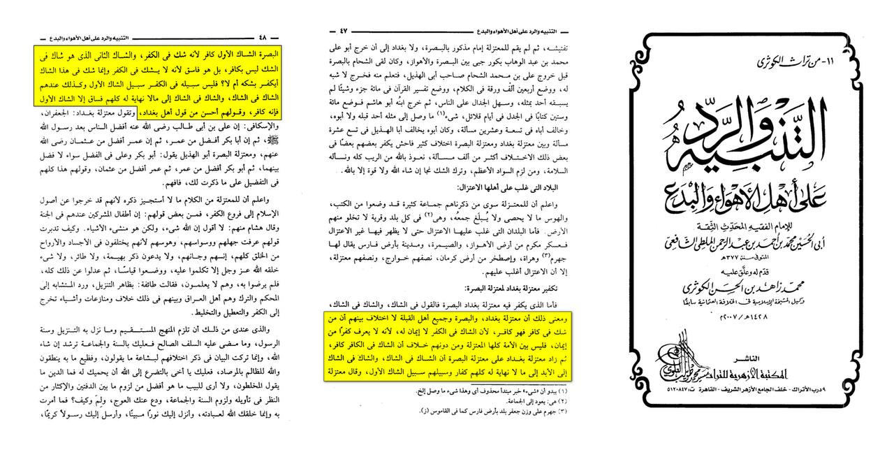

## 10. Other tawḥīd evidence

<!-- telegram-source: dar/messages3.html#message2200 -->
<!-- evidence-id: 000449 -->

Abū ʿAbdullāh (Imām Aḥmad) said:

There is no deed after the declaration of tawḥīd of Allāh that is better than prayer.

For it begins with tawḥīd and the glorification of Allāh through takbīr, then praise upon Allāh through reciting the Fātiḥah, which is praise, exaltation, and supplication. Likewise, glorification (tasbīḥ) in rukūʿ and sujūd, the takbīrāt at every lowering and rising—all of that is tawḥīd and glorification of Him.

It ends with the testimony of His tawḥīd and the messengership of His Prophet. Its rukūʿ and sujūd are expressions of humility and submission to Him.

Raising the hands in opening and bowing, lifting the head—these are to magnify and venerate Allāh. Placing the right hand over the left while standing expresses humility before Allāh and surrender in servitude.”

[Ta'ẓīm Qadr aṣ-Ṣalāh - Imām  al-Marwazī 1/268]

Show attached source scan

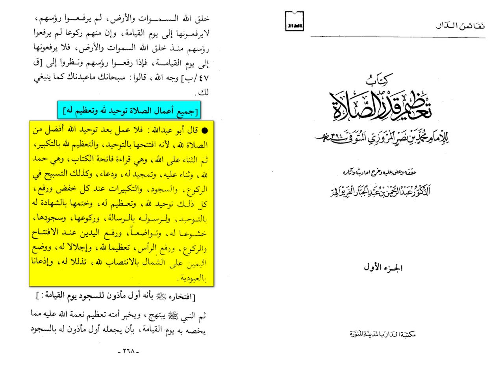

---

<!-- telegram-source: dar/messages2.html#message1814 -->
<!-- evidence-id: 000450 -->

Imām Aḥmad transmits ijmāʿ on the takfir of the jahmiyyah, mu’tazilah and nothing nullifies ones Islam except shirk.

Imām Aḥmad said in his letter to al-Muṣaddad:

I advise you and myself to fear Allah, the Almighty, and to adhere to the Sunnah. You have witnessed the consequences for those who oppose it and what has been said about those who follow it. It has been reported from the Prophet ﷺ that he said, “Indeed, Allah will enter a servant into Paradise by the Sunnah, for he adheres to it.” Therefore, I command you not to prefer anything over the Qur’an, for it is the speech of Allah, the Almighty. Whatever Allah spoke, it is not created. What He has informed us about the past nations is not created. What is in the Lawḥ al-Maḥfūẓ, what is in the Mushafs, and how it is recited, and however it is described — all of it is the speech of Allah, and it is not created. Whoever says it is created is a disbeliever in Allah, the Almighty. Whoever does not declare such a person a disbeliever is also a disbeliever.

Then after the Book of Allah, we have the Sunnah of the Prophet ﷺ, the ḥadīth from him, and from the rightly guided companions of the Prophet ﷺ, affirming what the messengers have brought, and following the path of salvation. This path was passed down by the people of knowledge, generation after generation. Beware of the opinion of Jahm, for he is one of opinion, speech, and arguments.

It has been agreed upon by the scholars we have encountered that the Jahmiyyah split into three sects. One group said that the Qur’an is the created speech of Allah. Another group said that the Qur’an is the speech of Allah but remained silent, and they are the cursed al-Wāqifah group. Others said that our words with the Qur’an are created. All of these groups are Jahmiyyah and Kuffār and should be given the opportunity to repent. If they repent, they are spared; if not, they should be killed.

It has been unanimously agreed by the scholars we have encountered that anyone holding these views, if they do not repent, should not be married, their legal rulings are invalid, and their slaughtered animals should not be consumed.

Faith is both speech and action: it increases with good deeds and decreases with bad deeds. A person can leave faith and enter Islam, but nothing removes a person from Islam except associating partners with Allah, the Almighty, or rejecting any of Allah’s obligatory duties out of denial. If one abandons a duty out of laziness or negligence, they remain under Allah’s will. If He wills, He may punish them, and if He wills, He may forgive them.

As for the Mu’tazilah, it has been agreed by the scholars we have encountered that they declare people disbelievers for committing sins. Those among them who hold this view claim that Adam was a disbeliever and that the brothers of Yūsuf were disbelievers when they lied to their father Ya’qūb . The Mu’tazilah also agree that anyone who steals even a single seed is a disbeliever, and they must divorce their wives, and if they had performed Ḥajj, they must start over. Those who hold such views are considered disbelievers, they should not be married, and their testimony is not accepted.

[Ṭabaqāt al-Ḥanābilah 1/342-343]

Show attached source scan

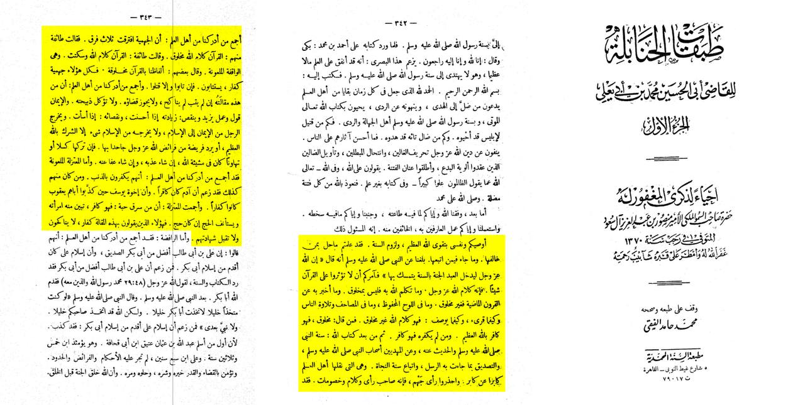

---

<!-- telegram-source: dar/messages2.html#message1937 -->
<!-- evidence-id: 000451 -->

Imām Al-Bukhārī mentioned in his Ṣaḥīḥ (Kitāb al-Īmān):

Chapter 18: Whoever Said That Faith is Action

For the saying of Allāh, the Exalted: "And that is Paradise which you are made to inherit for what you used to do." (Az-Zukhrūf: 72)

And several scholars said regarding His saying, the Exalted: "So by your Lord, We will surely question them all about what they used to do." (Al-Ḥijr: 92-93), that it refers to the statement "Lā ilāha illa Allāh."

[Ṣaḥīḥ al-Bukhārī p.16]

Show attached source scan

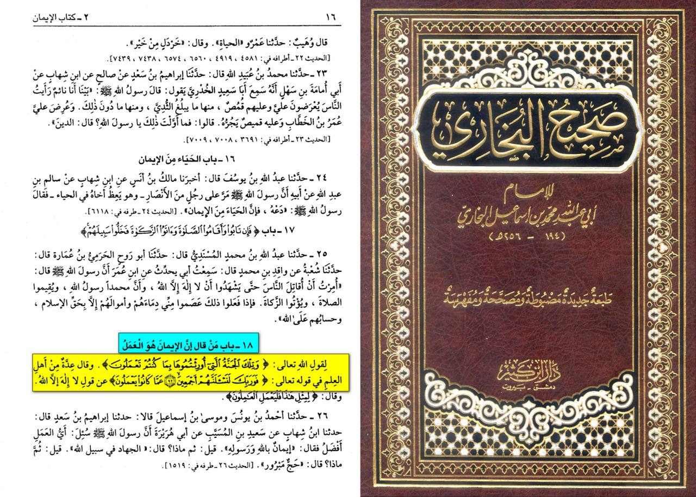

---

<!-- telegram-source: dar/messages2.html#message1882 -->
<!-- evidence-id: 000452 -->

Imām Al-Bukhārī mentioned in his Ṣaḥīḥ:

Chapter 40: The Saying of Allah the Almighty: “So do not set up rivals to Allah”

And His saying, exalted be His mention: “And you set up rivals to Him while He is the Lord of all worlds.” And His saying: “And those who do not invoke with Allah another deity.” And His saying: “And indeed, it has been revealed to you and to those before you that if you associate others with Allah, your deeds will surely be nullified, and you will certainly be among the losers. Rather, worship Allah and be among the grateful.”

‘Ikrimah said regarding the verse: “And most of them do not believe in Allah except while they associate others with Him.” If you ask them who created them and who created the heavens and the earth, they will surely say, “Allah.” That is their belief, yet they worship others besides Him. And regarding what has been mentioned about the creation of the actions of the servants and their deeds, Allah the Almighty says: “And He created everything and determined it with precise measurement.”

[Ṣaḥīḥ al-Bukhārī p.1858]

Show attached source scan

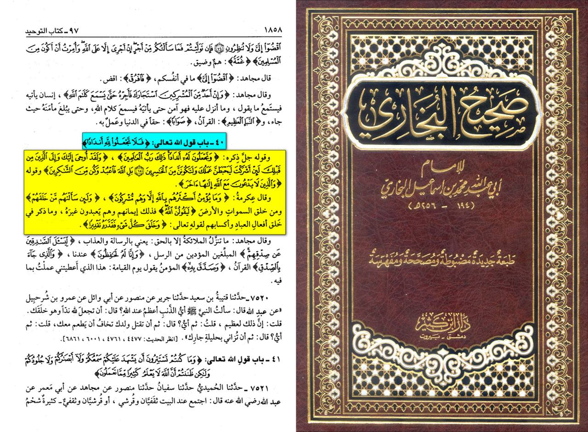

---

<!-- telegram-source: dar/messages2.html#message1720 -->
<!-- evidence-id: 000453 -->

Imām ʿAbdullāh Ibn Aḥmad reported:

Abū Bakr Saʿīd ibn Yaʿqūb al-Ṭālaqānī narrated to us, saying: Al-Muʾammal ibn Ismāʿīl narrated to us, saying: I heard ʿUmārah ibn Zādhān say:

“It has reached me that the Qadariyyah will be resurrected on the Day of Judgment alongside the polytheists. They will say, ‘By Allah, we were not polytheists! By Allah, we were not polytheists!’

Then it will be said to them: ‘Indeed, you committed shirk without realizing it.’”

He also said: “It has reached me that on the Day of Judgment, it will be said to them: ‘You are the adversaries of Allah, the Almighty.’”

Footnote

In al-Qadar by al-Firyābī (242), Abū Makhzūm narrated from Sayyār and Abū Hāshim al-Rummānī that they used to say: “Denial of Qadar is shirk.”

Ibn Taymiyyah, in Minhāj al-Sunnah (3/276), while discussing the reason why the Qadariyyah were called mushrikūn, stated:

“It is said: If events occur without being caused by Allah’s action or power, this constitutes clear association (shirk) with Allah. This is why these people were likened to the Magians, who believe that the creator of evil is not the creator of good, thereby making Allah a partner with another.

Whoever considers the actions of people to be independent of Allah’s will, as if they are merely the acts of agents acting under a sovereign, has fallen into clear shirk—one that even the idol worshippers did not approve of, because it is shirk in lordship (rubūbiyyah), not in divinity (ulūhiyyah). The idol worshippers admitted that their idols were owned by Allah, as they said: ‘Here we are, O Allah, You have no partner—except a partner that belongs to You; You own him and all that he owns.’

These people, however, claim that what a person possesses of his actions is his own independent property, separate from Allah. This is why Ibn ʿAbbās said:

‘Belief in Qadar is the foundation of tawḥīd. Whoever affirms Allah’s oneness and believes in Qadar, his tawḥīd is complete. But whoever affirms Allah’s oneness while denying Qadar, his denial nullifies his tawḥīd.

The belief of the Qadariyyah involves both shirk and taʿṭīl. It entails attributing some events to causes other than Allah, removing them from His decree, and affirming an independent creator besides Him. These are two branches of disbelief because the root of all disbelief is either taʿṭīl or shirk.”

[Kitāb al-Sunnah by Imām ʿAbdullāh Ibn Aḥmad p.403-404]

Show attached source scan

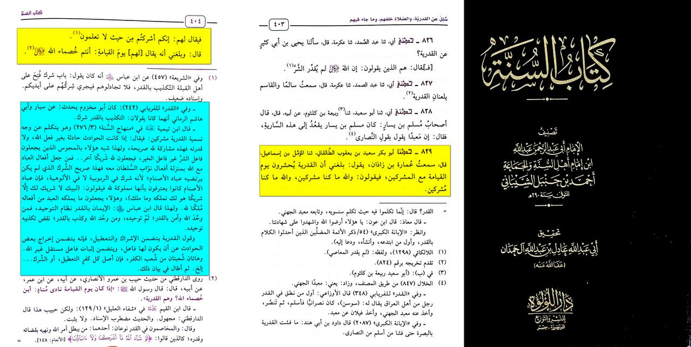

---

<!-- telegram-source: dar/messages3.html#message2206 -->
<!-- evidence-id: 000454 -->

Imām al-Marwazī reported:

Ishaq ibn Rāhūyah said:

“Among those whom there is consensus on declaring as disbelievers — and they are judged the same as the jāḥid (denier) — is a muʾmin who believes in Allāh the Exalted and in what has come from Him, but then kills a prophet or assists in killing him, even if he acknowledges and says, ‘Killing the prophets is ḥarām’, he is still a kāfir.

Likewise, whoever insults a prophet or rejects his statement without any excuse of taqiyyah or fear — he is a kāfir.”

footnote

Ibn ’Abd al-Barr said: “Ishaq said: The scholars have unanimously agreed that whoever insults Allah, may He be exalted, or insults His Messenger, or denies something revealed by Allah, or kills a prophet from the prophets of Allah, while still acknowledging what Allah has revealed, is a disbeliever. Similarly, the one who leaves the prayer until its time expires deliberately is also a disbeliever. ” (Al-Tamhid 4/226)

[Ta'ẓīm Qadr aṣ-Ṣalāh - Imām al-Marwazī 2/930]

Show attached source scan

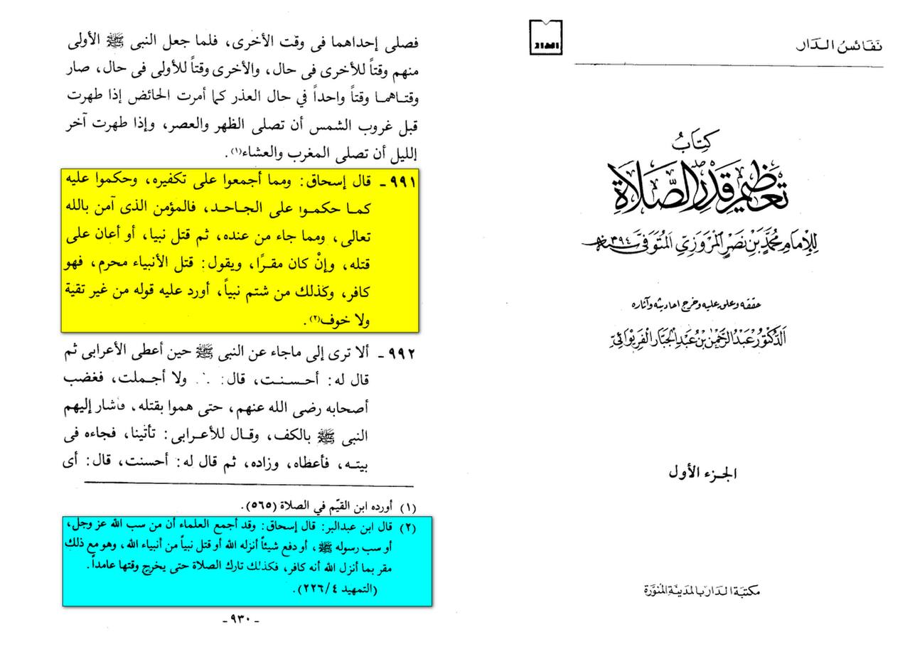

---

<!-- telegram-source: dar/messages2.html#message1732 -->
<!-- evidence-id: 000455 -->

Imām aṭ-Ṭabarī رحمه الله reported:

Bishr ibn Maʿādh narrated to us, saying: Yazīd told us, from Saʿīd, from Qatādah, regarding the verse: "And do not eat from that upon which the name of Allah has not been mentioned, for indeed, it is disobedience."

Qatādah explained: The enemy of Allah, Iblīs, inspired his allies from among the misguided, saying to them: "Argue with the companions of Muhammad regarding carrion. Say to them: ‘You eat what you slaughter and kill yourselves, but you do not eat what Allah has killed! And yet, you claim to follow Allah’s command?’" So Allah revealed to His Prophet: "And if you obey them, indeed, you would be polytheists."

And by Allah, we do not know shirk to have ever been except in one of three ways: calling upon another god besides Allah, prostrating to someone other than Allah, or dedicates Slaughtered offerings to other than Allah.

[Tafsīr aṭ-Ṭabarī 9/525]

Show attached source scan

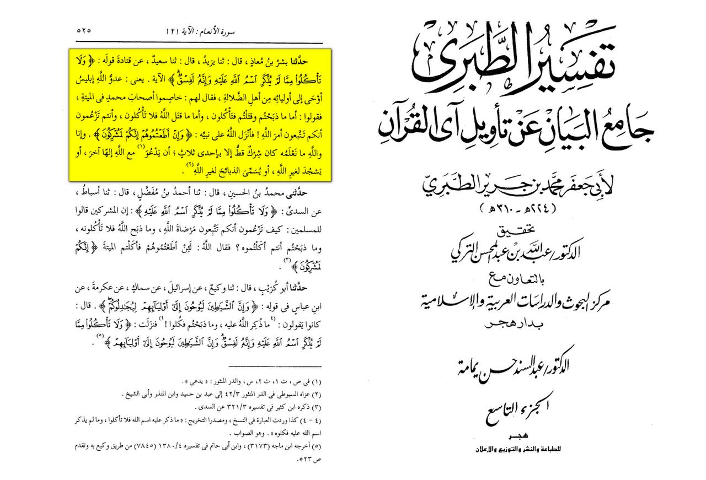

---

<!-- telegram-source: dar/messages2.html#message1758 -->
<!-- evidence-id: 000456 -->

Imām aṭ-Ṭabarī رحمه الله reported:

Muḥammad ibn ʿAmr narrated to us, saying: Abū ʿĀṣim narrated to us, saying: ʿĪsā narrated to us. Al-Ḥārith also narrated to me, saying: Al-Ḥasan narrated to us, saying: Waraqāʾ narrated to us—both from Ibn Abī Najīḥ, from Mujāhid regarding the verse: “We only worship them so that they may bring us nearer to Allah in position” (Quran 39:3). Mujāhid said: Quraysh used to say this about their idols, and those before them said it about the angels, ʿĪsā ibn Maryam, and ʿUzayr.

Bishr narrated to us, saying: Yazīd narrated to us, saying: Saʿīd narrated to us, from Qatādah regarding the verse: “And those who take protectors besides Him [say], ‘We only worship them so that they may bring us nearer to Allah in position’” (Quran 39:3). They said: We do not worship them except so that they may intercede for us with Allah.

Regarding the verse: “Indeed, Allah will judge between them concerning that over which they differ” (Quran 39:3), Allah, the Almighty, states that He will decide between these groups who took protectors besides Him in this world. On the Day of Judgment, He will settle what they used to dispute over in the world regarding their worship of those they served. He will cast them all into Hell—except those who sincerely devoted their religion to Allah, worshipped Him alone, and did not associate anything with Him.

[Tafsīr aṭ-Ṭabarī 20/157-158]

Show attached source scan

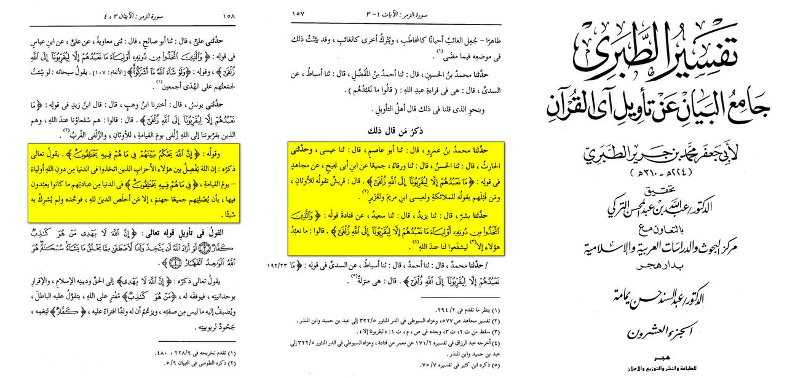

---

<!-- telegram-source: dar/messages2.html#message1762 -->
<!-- evidence-id: 000457 -->

Imām aṭ-Ṭabarī رحمه الله said:

His saying: “If you invoke them, they do not hear your supplication, and even if they heard, they would not respond to you” (Quran 35:14).

Allah, the Almighty, states: O people, if you call upon these deities that you worship besides Allah, they will not hear your supplication, for they are lifeless objects that do not comprehend what you say.

“And even if they heard, they would not respond to you”—meaning, even if they were able to hear your supplication and understand your words, by being given the ability to hear, they still would not respond to you, as they are not sentient beings. Not everyone who hears a statement is necessarily able to reply to it.

Allah, the Almighty, is addressing the polytheists who associate idols and false gods with Him, saying: How can you worship something that has these attributes—something that can neither benefit you nor harm you? And how can you abandon the worship of the One who holds both your benefit and harm in His hands, the One who created you and bestowed His blessings upon you?

[Tafsīr aṭ-Ṭabarī 19/350-351]

Show attached source scan

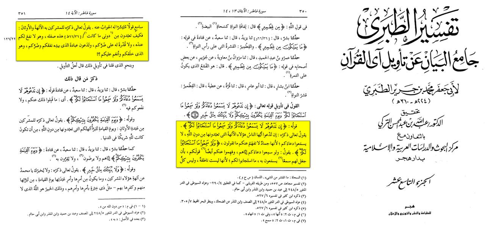

---

<!-- telegram-source: dar/messages4.html#message3980 -->
<!-- evidence-id: 000458 -->

Imām aṭ-Ṭabarī said regarding the verse:

“And whoever calls upon besides Allāh another deity for which he has no proof - then his account is only with his Lord. Indeed, the disbelievers will not succeed.” [al-Muʾminūn: 117]

He, exalted is His mention, says: And whoever calls upon, together with the One worshipped — the One for whom ʿibādah (worship) is not fitting except for Him — another maʿbūd (object of worship), having no proof for what he says and does of that, nor any evidence.

And His saying: “Then his reckoning is only with his Lord.” It means: the reckoning for his evil deed is with his Lord, and He will give him his full recompense when he comes before Him. And His saying: “Indeed, the disbelievers will not be successful.” means: the people of kufr in Allāh will not succeed with Him, nor will they attain eternal abiding in bliss.

[Tafsīr aṭ-Ṭabarī 10/82]

Show attached source scan

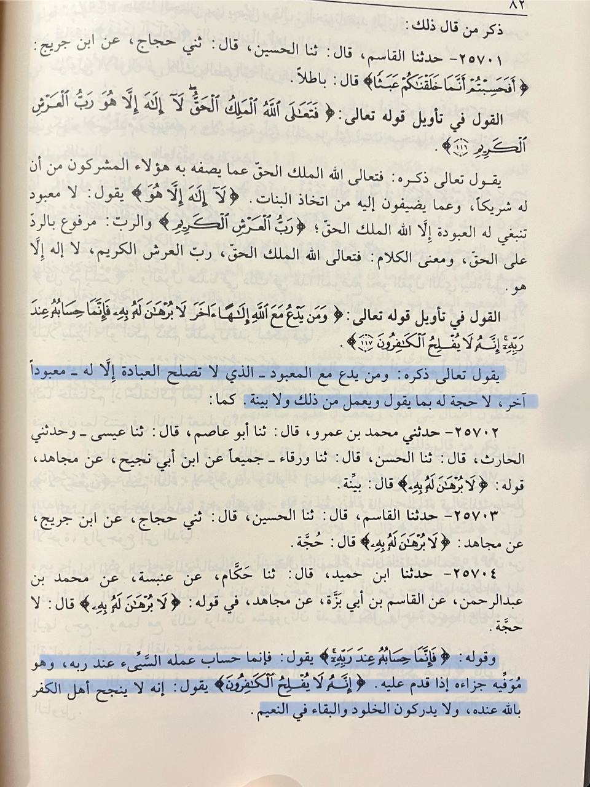

---

<!-- telegram-source: dar/messages5.html#message4999 -->
<!-- evidence-id: 000459 -->

Muḥammad ibn ʿAqīl ibn al-Azhar said:

I heard ash-Shāfiʿī say: “Mālik was asked about kalām and tawḥīd, so Mālik said: It is impossible to think that the Prophet ﷺ taught his ummah how to perform istinjāʾ but did not teach them tawḥīd.

And tawḥīd is what the Prophet ﷺ said: ‘I have been commanded to fight the people until they say lā ilāha illa Allāh. if they say it, their blood and their wealth are protected from me except by its right, and their reckoning is with Allah.’ So whatever by which the blood and wealth are protected is the reality of tawḥīd.

[Aḥādīth fī Dhamm al-Kalām wa-Ahlihī p.92]

Show attached source scan

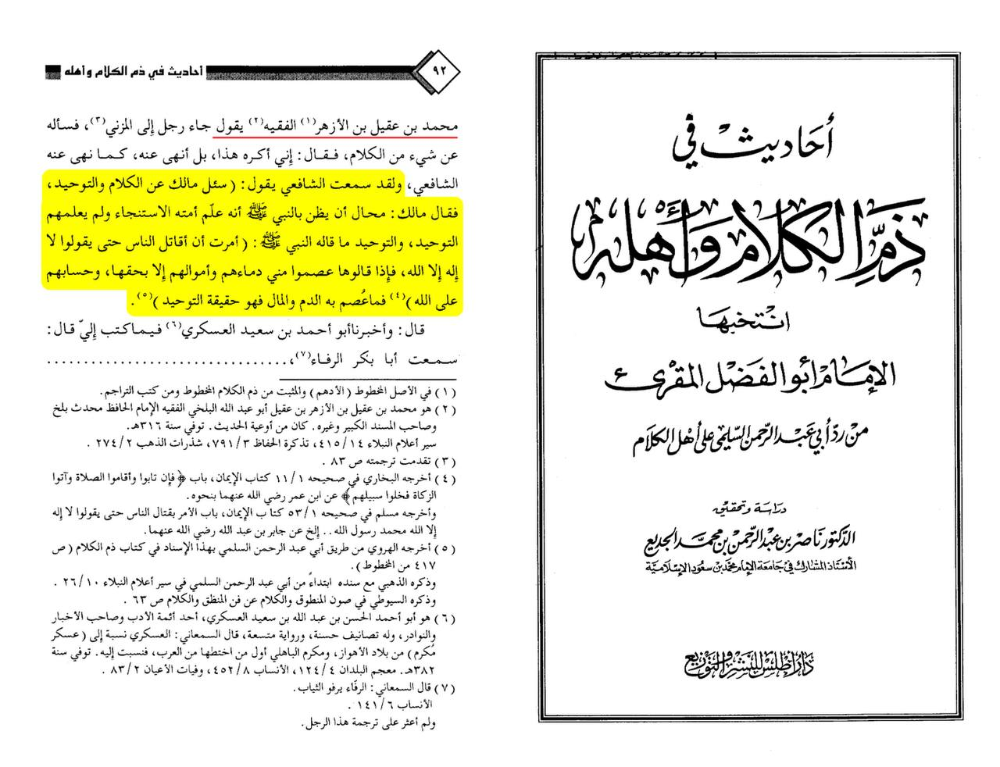

---

<!-- telegram-source: dar/messages4.html#message3790 -->
<!-- evidence-id: 000460 -->

Imām al-Ājurrī reported with his chain:

Sufyān — meaning Sufyān al-Thawrī — reported from Abū Sinān al-Shaybānī, from Saʿīd ibn Jubayr, who said: A monk said to me, ‘O Saʿīd, during times of fitnah, it becomes clear who truly worships Allāh and who worships the ṭāghūt.’”

[Kitāb Ash-Sharīʿah by Imām Ājurrī 1/138]

Show attached source scan

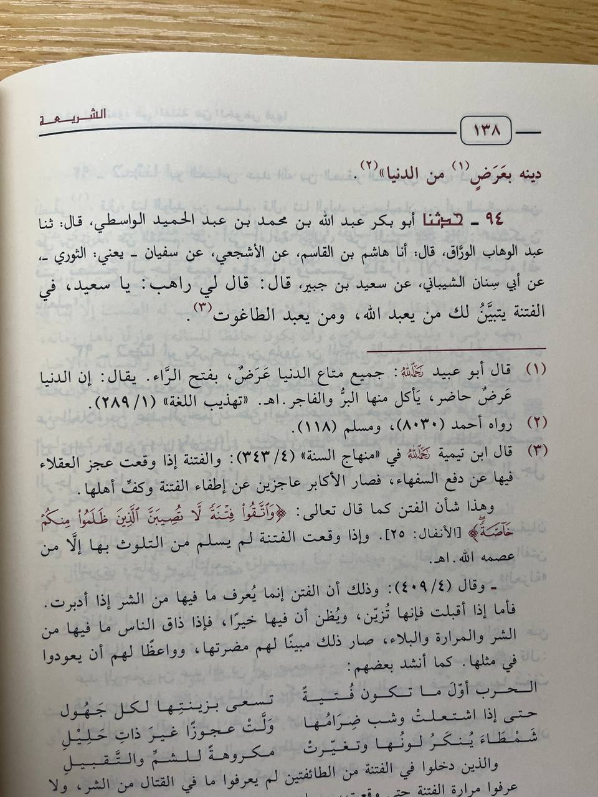

---

<!-- telegram-source: dar/messages4.html#message3407 -->
<!-- evidence-id: 000461 -->

Imām Ibn Baṭṭah said:

And a man goes out from īmān to islām, and nothing takes him out of islām except shirk with Allāh.

[Ibānah aṣ-Ṣughrā by Imām Ibn Baṭṭah p.152]

Show attached source scan

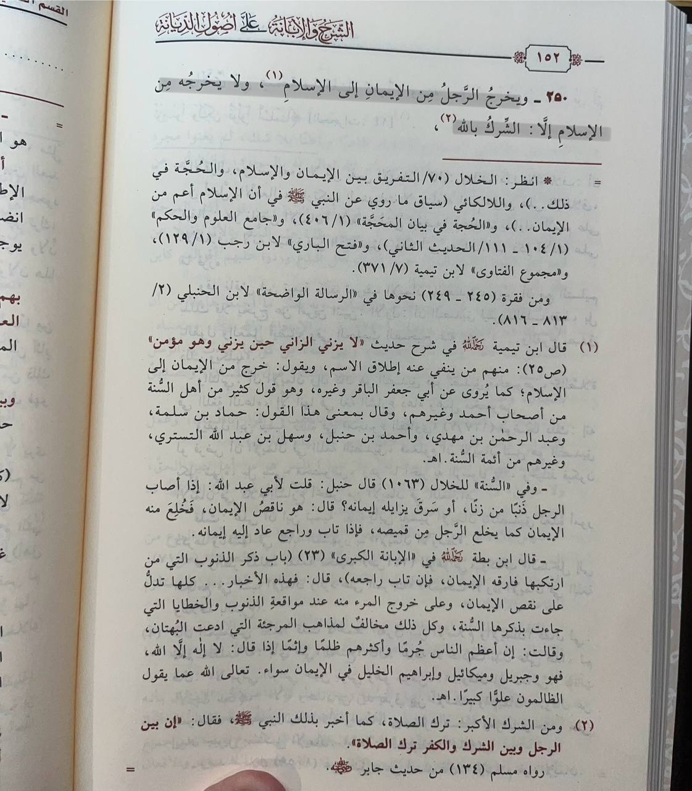

---

<!-- telegram-source: dar/messages4.html#message3420 -->
<!-- evidence-id: 000462 -->

Imām Ibn Battāh said:

And it suffices you from that what your noble Master informed you of in His statement: “And they were not commanded except that they should worship Allah, [being] sincere to Him in religion, upright, and establish prayer and give zakāh; and that is the correct religion” [al-Bayyinah: 5].

This verse combines speech, action, and intention:

a. Worshipping Allah does not occur except after acknowledging Him.

b. Establishing the prayer and giving zakāh does not occur except through action.

c. Sincerity does not occur except with the resolve of the heart and intention.

[Al-Ibānah al-Kubrā by Imām Ibn Battāh 1/628]

Show attached source scan

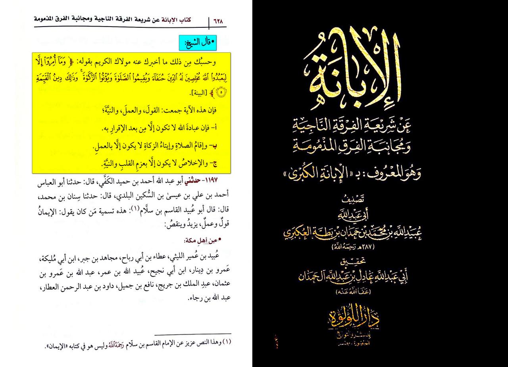

---

<!-- telegram-source: dar/messages3.html#message2309 -->
<!-- evidence-id: 000463 -->

Ibn Ḥazm said:

As for reviling Allāh, there is not a single Muslim on the face of the earth who disagrees that it is kufr mujarrad (absolute disbelief)—except the Jahmiyyah and the Ashʿariyyah, two sects that are not considered reliable. They explicitly state that reviling Allāh and openly declaring kufr is not in itself kufr. Some among them say: it is merely an indication that the person holds kufr in his heart, not that he is certainly a kāfir just for reviling Allāh.

Their foundation in this matter is a corrupt principle that departs from the ijmāʿ of the people of Islām: namely, that īmān is only affirmation in the heart—even if someone openly declares kufr, and worships idols, without coercion or quoting another, but does so by choice—yet is still, according to them, a Muslim?

This is absolute kufr, because it contradicts the consensus of the Ummah, the ruling of Allāh the Exalted and His Messenger, and of all the Companions and those who came after them. No one—neither believer nor disbeliever—disagrees that this Qur’ān is what Muḥammad ﷺ brought, and that it is a revelation from Allāh the Exalted.

Nor have they differed in the fact that it explicitly labels certain speech as kufr, and that it definitively rules kufr upon those who utter certain well-known statements—such as His saying, “Surely they have disbelieved who say, ‘Indeed, Allāh is the Messiah, son of Mary’” [al-Mā’idah: 17], and His saying, “Indeed, they said the word of kufr, and disbelieved after their Islām” [al-Tawbah: 74]. Thus, it is clear that kufr can consist of speech.

[al-Muḥallā by Ibn Ḥazm 12/435]

Show attached source scan

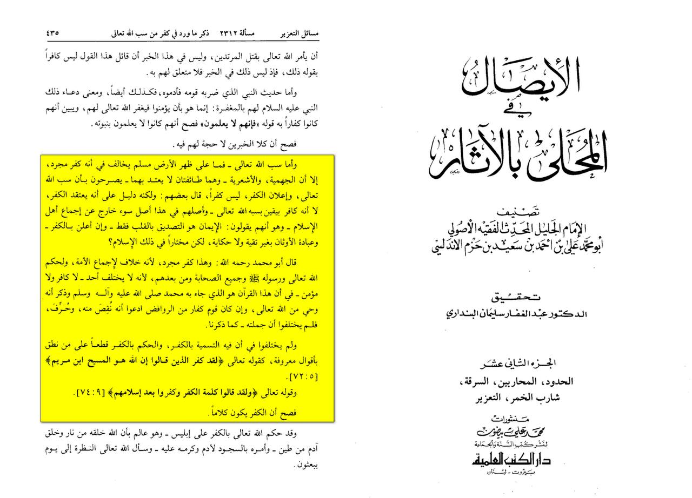

---

<!-- telegram-source: dar/messages4.html#message3961 -->
<!-- evidence-id: 000464 -->

Shaykh al-Islam Ibn Taymiyyah said:

For this reason, among the followers of these people (i.e the Ashāʿirah) are those who prostrate to the sun, the moon, and the stars, and call upon them as they call upon Allāh, fast for them, offer sacrificial rites to them, and seek nearness to them.

Then they say: “This is not shirk. Shirk only occurs if I believe that they are the ones who manage my affairs. If I merely make them a cause or a intermediary, then I am not a mushrik.”

But it is known by absolute necessity from the religion of Islām that this is indeed shirk, So this, and similar matters, belong to the tawḥīd with which Allāh sent His messengers, yet they (the Ashāʿirah) do not include it in the definition of tawḥīd as they understand it. Instead, they include in it the denial of His attributes.

For when they say: “He has no partner, no part, no likeness,”—even if the words are intended in a correct sense—they imply that Allāh is like nothing else. He cannot be divided, corrupted, or rendered impossible; rather, He is One and ṣamad (the Self-Sufficient). Ṣamad means that He has no hollow within Him, and He is the Master whose perfection is complete.

Yet they take this to deny His ʿulūww over His creation and His distinction from what He has made, denying what He actually affirms of His attributes. They claim that affirming these attributes would require Him to be composite, divided, or to have a likeness.

[Darʾ Taʿāruḍ al-ʿAql wa an-Naql 1/287-288]

Show attached source scan

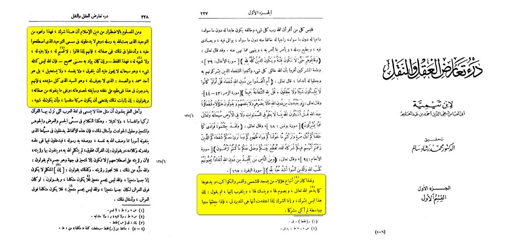

---

<!-- telegram-source: dar/messages4.html#message3998 -->
<!-- evidence-id: 000465 -->

Shaykh al-Islam Ibn Taymiyyah said:

And the meaning here is: that shirk occurs frequently, and likewise shirk with the people of the graves through such actions as their du‘ā’, pleading to them, desiring them, and the like.

So if the Prophet ﷺ forbade ṣalāh that includes du‘ā’ directed exclusively to Allāh alone at graves, lest it lead to a type of shirk in their Lord, then how much more so if there exists a type of shirk in desiring them, whether by asking them to fulfill needs or relieve distress, or asking them to request it from Allāh Ta‘ālā.

[Iqtiḍāʾ aṣ-Ṣirāṭ al-Mustaqīm by Ibn Taymiyyah 2/304-305]

Show attached source scan

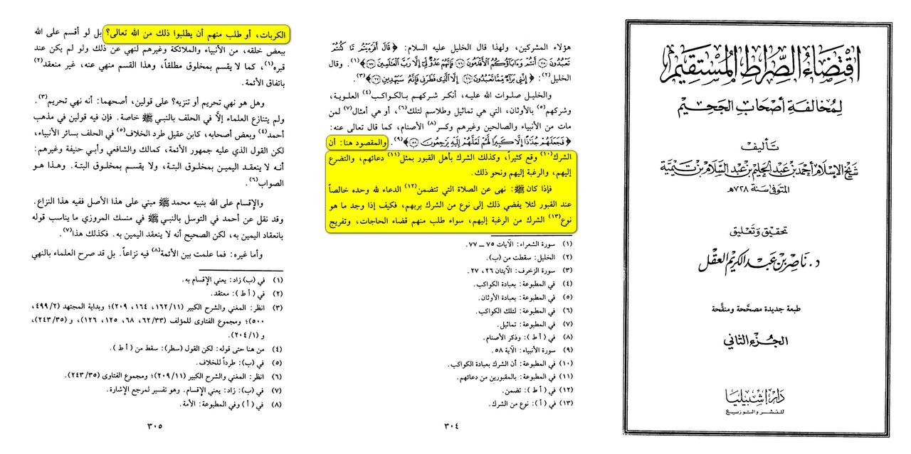

---

### Ibn Taymiyyah: commanding or praising shirk is apostasy by agreement
<!-- evidence-id: 000466 -->

Show Arabic source text

فَمَنْ تَكُونُ هَذِهِ حَالُهُ فِي الشِّرْكِ وَعِبَادَةِ الْأَوْثَانِ كَيْفَ يَصْلُحُ أَنْ يَذُمَّ أَهْلَ التَّوْحِيدِ الَّذِينَ يَعْبُدُونَ اللَّهَ تَعَالَى لَا يُشْرِكُونَ بِهِ شَيْئًا، وَلَمْ يَعْبُدُوا لَا شَمْسًا وَلَا قَمَرًا وَلَا كَوْكَبًا وَلَا وَثَنًا، بَلْ يَرَوْنَ الْجِهَادَ لِهَؤُلَاءِ الْمُشْرِكِينَ الَّذِينَ ارْتَدَّ إِلَيْهِمْ أَبُو مَعْشَرٍ وَالرَّازِيُّ وَغَيْرُهُمَا مُدَّةً؟

وَإِنْ كَانُوا رَجَعُوا عَنْ هَذِهِ الرِّدَّةِ إِلَى الْإِسْلَامِ فَإِنَّ سَرَائِرَهُمْ عِنْدَ اللَّهِ، لَكِنْ لَا نِزَاعَ بَيْنَ الْمُسْلِمِينَ أَنَّ الْأَمْرَ بِالشِّرْكِ كُفْرٌ وَرِدَّةٌ إِذَا كَانَ مِنْ مُسْلِمٍ، وَأَنَّ مَدْحَهُ وَالثَّنَاءَ عَلَيْهِ وَالتَّرْغِيبَ فِيهِ كُفْرٌ وَرِدَّةٌ إِذَا كَانَ مِنْ مُسْلِمٍ.

المصدر: ابن تيمية، <em>بيان تلبيس الجهمية</em>، 3/54.

**English**

Ibn Taymiyyah says that those who worship Allāh alone without associating anything with Him, and who worship neither the sun, moon, stars, nor idols, regard striving against such mushrikīn as one of the obligations.

He then states: “Even if they returned from this apostasy to Islām, their inner affairs are with Allāh. However, there is no disagreement among the Muslims that commanding shirk is disbelief and apostasy when done by a Muslim, and that praising it, commending it, and encouraging it is disbelief and apostasy when done by a Muslim.”

Source: Ibn Taymiyyah, Bayān Talbīs al-Jahmiyyah, 3/54.

<!-- telegram-source: dar/messages2.html#message1560 -->
<!-- evidence-id: 000467 -->

Sheikh al-Islam Ibn Taymiyyah said:

Associating partners with Allah in love, worship, supplication, and requests is different from associating partners in belief and acknowledgment. As Allah says:

“And of mankind are some who take (for worship) others besides Allâh as rivals (to Allâh). They love them as they love Allâh. But those who believe, love Allâh more (than anything else).” (Al-Baqarah: 165)

So, whoever loves a created being as they love the Creator has committed shirk, taking equals alongside Allah in love. Even if they acknowledge that Allah is their Creator, they have still fallen into this form of shirk.

[Majmū Fatāwā by Ibn Taymiyyah 10/265]

Show attached source scan

---

<!-- telegram-source: dar/messages4.html#message3953 -->
<!-- evidence-id: 000468 -->

Shaykh al-Islam Ibn Taymiyyah said:

So this intercession (ash-shafāʿah) which the Qur’an negated includes the negation of what the mushrikūn of the Arabs used to say, and those similar to them from the other mushrikīn.

And it is of the same type as the shirk of the Christians and those like them among the misguided who affiliate themselves with Islam, where they believe regarding the angels or the prophets or the shuyūkh that they are intercessors for them with Allāh — just as the intercessors intercede with the kings of the world.

And they strike for Allāh an analogy and say: whoever wants to draw near to a great king should not come to him first, but rather draw near to those close to him, who then raise his needs and bring him near to him.

Allāh the Exalted said: “And those who take Awliyâ’ besides Him (say): "We worship them only that they may bring us near to Allâh."” [az-Zumar: 3] That is, they say: “We do not worship them except that they may bring us near to Allāh.”

He mentioned this after His saying: "The revelation of the Book [i.e., the Qur’ān] is from Allāh, the Exalted in Might, the Wise. Indeed, We have sent down to you the Book, [O Muḥammad], in truth. So worship Allāh, [being] sincere to Him in religion. Unquestionably, for Allāh is the pure religion.

And those who take Awliyâ’ besides Him (say): "We worship them only that they may bring us near to Allâh. Indeed, Allāh will judge between them concerning that over which they differ. Indeed, Allāh does not guide he who is a liar and disbeliever." [az-Zumar :3]

[al-Radd ʿalā al-Manṭiqiyyīn by Ibn Taymiyyah p.571-572]

Show attached source scan

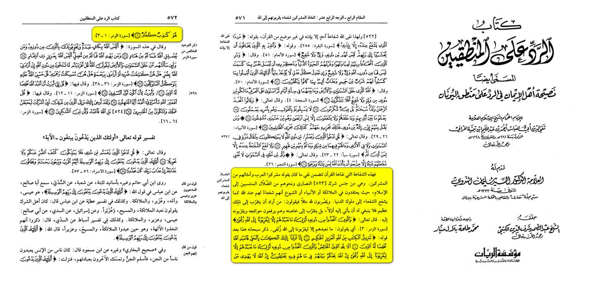

---

<!-- telegram-source: dar/messages4.html#message3561 -->
<!-- evidence-id: 000469 -->

Shaykh al-Islam Ibn Taymiyyah said:

They believed that the du‘ā’ to the dead, for whom a shrine was built, and doing istighāthah from them was more beneficial than du‘ā’ to Allāh and seeking help from Him in the house built for Allāh ‘Azza wa Jall. So they preferred the house built for the supplication of the created being over the house built for the du‘ā’ of the Creator. And if there is an endowment for this and an endowment for that, then the endowment of shirk is greater in their view, imitating the mushrikīn of the Arabs, whom Allāh described in His words: “And they assign to Allāh a share of what He created of the crops and the cattle, saying, ‘This is for Allāh’—by their claim—and ‘This is for our partners.’ But that which is for their partners does not reach Allāh, and that which is for Allāh reaches their partners. Evil is what they judge.” [Al-An‘ām 6:136]

And when one of them goes to the grave which he venerates, weeps at it, humbles himself, prays, and supplicates, he attains from softness, humility, servitude, and presence of heart  what he does not attain even in the five daily prayers, Jumu‘ah, Qiyām al-layl, or Qur’ān recitation. Is this anything but the state of the innovating mushrikīn and not of the sincere monotheists who follow the Book of Allāh and His Messenger ﷺ?

[al-Istighāthah fī ar-Radd ʿalā al-Bakrī by Ibn Taymiyyah p.381-382]

Show attached source scan

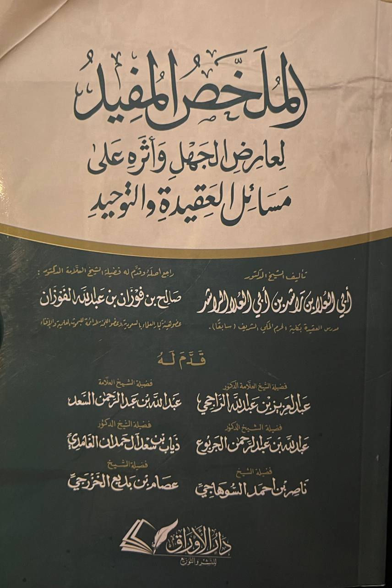

---

<!-- telegram-source: dar/messages4.html#message3754 -->
<!-- evidence-id: 000470 -->

Shaykh al-Islām Ibn Taymiyyah said:

“Whoever takes the angels or the prophets as lords has committed kufr after his islām, by the agreement of the Muslims. Rather, whoever permits that the created being may be called upon, while forbidding the calling upon the Creator — in which lies the realization of His absolute self-sufficiency and ulūhiyyah — has contradicted Islām.”

[Mukhtaṣar Ḍawābiṭ al-Takfīr by Shaykh Abī al-ʿAlā ar-Rāshid p.95]

Show attached source scan

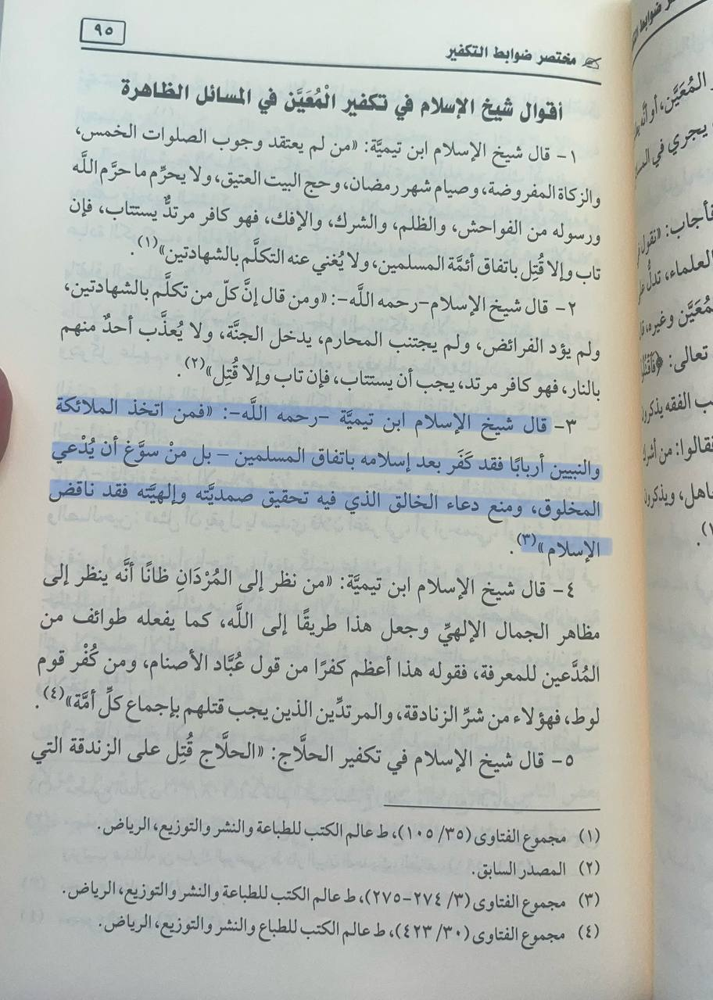

---

<!-- telegram-source: dar/messages5.html#message4492 -->
<!-- evidence-id: 000471 -->

Ibn Qayyim said:

Among them: that which the Messenger ﷺ legislated regarding visiting graves is only to remember the Hereafter, and to show iḥsān (goodness) to the deceased by making duʿāʾ for him, and praying for mercy upon him, and istighfār (seeking forgiveness) for him, and asking for well-being for him, so the visitor is a doer of iḥsān to himself and to the dead.

But these mushrikūn reversed the matter, and inverted the religion, and made the purpose of visiting the grave, shirk with the dead, and making duʿāʾ to him and through him, and asking him for their needs, and seeking blessings from him, and victory for them over the enemies, and the like.

[Ighāthat al-Lahfān fī Maṣāyid ash-Shayṭān 1/359]

Show attached source scan

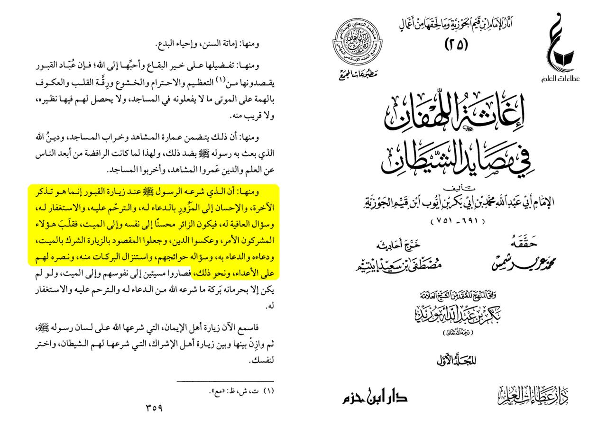

---

<!-- telegram-source: dar/messages4.html#message3371 -->
<!-- evidence-id: 000472 -->

Shaykh Muḥammad ibn ʿAbd al-Wahhāb said:

“The foundation of the dīn of al-Islām and its basis are two matters:

First: The command to worship Allāh alone, without partner, urging toward that, loyalty upon it, and declaring takfīr of whoever abandons it.

Second: The warning against shirk in the worship of Allāh, emphasizing sternness therein, showing enmity in that regard, and declaring takfīr of whoever commits it.

The opponents of this are of various kinds: The most severely opposed are those who oppose in all of it. Among the people are those who worship Allāh alone, yet do not denounce shirk, nor show enmity toward its people. And among them are those who show enmity toward them but do not declare them kāfir. And among them are those who do not love tawḥīd nor hate it. And among them are those who declare them kāfir but claim that it is an insult to the righteous. And among them are those who neither hate shirk nor love it. And among them are those who do not know shirk and do not denounce it. And among them are those who do not know tawḥīd and do not denounce it.

And among them — and this is the most dangerous of the kinds — are those who act upon tawḥīd, but do not know its true worth, nor hate those who abandon it, nor declare them kāfir. And among them are those who abandon shirk and hate it, but do not know its true worth, nor show enmity toward its people, nor declare them kāfir. These have indeed opposed what the prophets came with from the dīn of Allāh, exalted is He. And Allāh knows best.”

[ al-Durar al-Saniyyah 2/22 ]

Show attached source scan

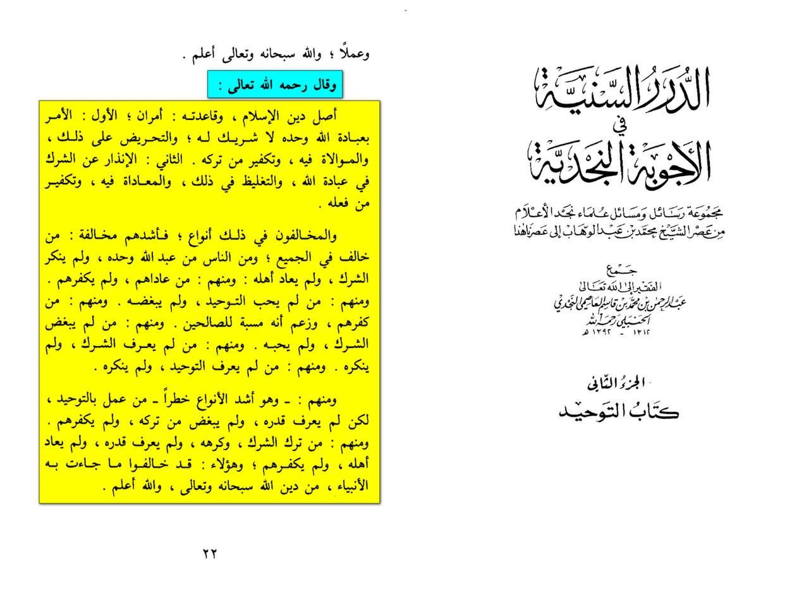

---

<!-- telegram-source: dar/messages4.html#message3356 -->
<!-- evidence-id: 000473 -->

The importance of affirming the names and attributes of Allah

Shaykh Muḥammad ibn ʿAbd al-Wahhāb said:

“Whoever denies the Attributes is a muʿaṭṭil, and the muʿaṭṭil is worse than the mushrik. For this reason, the Salaf used to call the works authored on affirming the Attributes ‘Kitāb al-Tawḥīd.’ Al-Bukhārī concluded his Ṣaḥīḥ with that, saying: ‘Kitāb al-Tawḥīd,’ and then he mentioned the Attributes, chapter by chapter.

The crux of the issue is this: the theologians say that tawḥīd is not complete except by denying the Attributes, while Ahl al-Sunnah said: tawḥīd is not complete except by affirming the Attributes. And your tawḥīd is taʿṭīl. For this reason, this statement led some of them to deny the very Lord, Blessed and Exalted, as is the doctrine of Ibn ʿArabī, Ibn al-Fāriḍ, and multitudes of people—none can count them except Allah.”

[al-Durar al-Saniyyah 1/113]

Show attached source scan

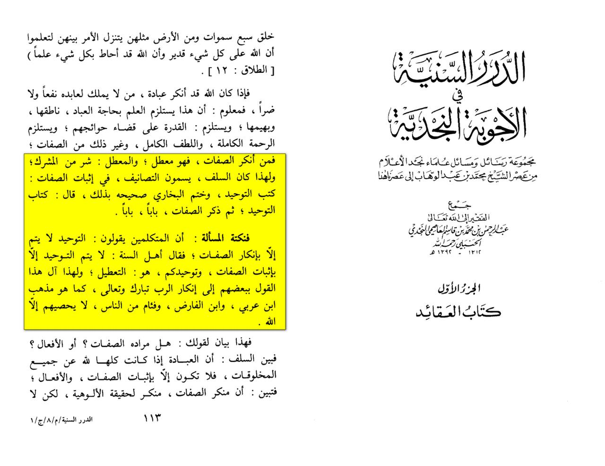

---

<!-- telegram-source: dar/messages4.html#message3693 -->
<!-- evidence-id: 000474 -->

The Reality of the contemporary Murji’ah

Shaykh Isḥāq ibn ʿAbd ar-Raḥmān Āl ash-Shaykh said:

We have heard from a group of those who claim knowledge and religion, and who, in their own estimation, follow Shaykh Muḥammad ibn ʿAbd al-Wahhāb — that whoever commits shirk and worships idols should not be labeled as a kāfir or mushrik specifically. That is because some of those who spoke to me directly regarding that heard from some of the brothers that he applied Shirk and Kufr to a man because he Made du‘āʾ to the prophet ﷺ and made Istighāthah with him. The man said to him: “Do not call him a kāfir until you make it known to him.”

Such people and their likes show no concern about mixing with the mushrikīn during travel or in their lands. In fact, they even seek knowledge from those who are among the most disbelieving of the scholars of the mushrikīn. They have pieced together for themselves certain shubuhāt to justify their claims — some of which, In Sha Allāh, will be mentioned later in this treatise. They have deceived with these doubts some of the common folk among their followers — those who have no knowledge or those do not know of their condition, and lacking discernment and understanding. They are physically separated from the brothers, yet separated from the Sheikhs with their hearts, and are flattering towards them. They have become alienated and have caused others to feel alienated from them because of the shubuhāt they display and the gloom that has come upon them through mixing with the sinners and mushrikīn.

When examined closely, they do not declare a mushrik to be a disbeliever except in general terms, and even then they hesitate among themselves. Their bidʿah and shubuhāt gradually spread until they deceived even some of the close companions. And Allāh knows best — this occurred due to their neglect of the kutub al-uṣūl (foundational books), their lack of attention to them, and their absence of fear of deviation.

Anyone with the slightest knowledge, upon seeing the condition of people today and examining the beliefs of these mashāyikh, would be utterly bewildered — and there is no power nor strength except through Allāh. One of those I referred to, when I questioned him about this issue, said: “We say to the people of these tombs — those who worship them and those buried within them — your action is shirk, but you are not mushrik.” So look at this, reflect upon it, praise your Lord, and ask Him for safety.

[Fatāwā al-Aʾimmah an-Najdiyyah 3/116-117]

Show attached source scan

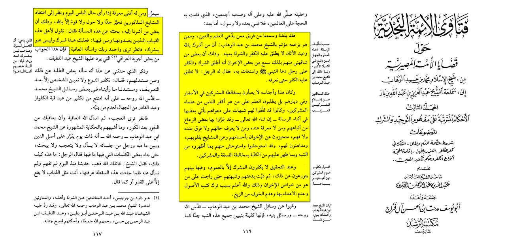

---

<!-- telegram-source: dar/messages5.html#message4971 -->
<!-- evidence-id: 000475 -->

Shaykh Muḥammad Ibn ʿAbd al-Wahhāb said:

The first: the great need to learn tawḥīd. If even the prophets need that and are keen upon it, then how about others? In it is a refutation of the ignorant people who think that they already know it and therefore do not need to learn it.

The second issue, which is the major one: exposing the doubt of the scholars of the mushrikīn who say: “This is shirk, but the one who does it is not takfired because he performs the five pillars.” If the prophets would have committed it, they would have disbelieved; so how about others?

[ad-Durar as-Saniyyah 13/384]

Show attached source scan

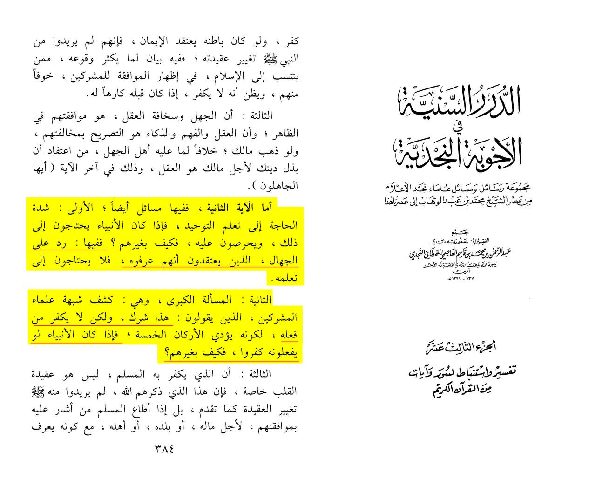

---

<!-- telegram-source: dar/messages5.html#message4673 -->
<!-- evidence-id: 000476 -->

Shaykh Muḥammad Ibn ʿAbd al-Wahhāb said:

And know that Allāh out of His wisdom, did not send any prophet with this tawḥīd except that He appointed for him enemies—just as He, the Most High, said: "And so We have appointed for every Prophet enemies - Shayātīn among mankind and jinn, inspiring one another with adorned speech as a delusion.” (al-Anʿām: 112)

And the enemies of tawḥīd may possess much knowledge, books, and arguments, as He, the Most High, said: “And when their messengers came to them with clear proofs, they [merely] rejoiced in what they had of knowledge” (Ghāfir: 83)

So when you know that, and you know that the path to Allāh must have enemies sitting upon it—people of eloquence, knowledge, and arguments—then it is obligatory upon you to learn from the religion of Allāh that which becomes a weapon for you, by which you fight these devils, about whom their leader and foremost said to your Lord: “ surely I will sit in wait against them on Your Straight Path.” (al-Aʿrāf: 16)

But if you turn to Allāh and listen to the proofs of Allāh and His clear evidences, then do not fear and do not grieve—indeed, the plot of Shayṭān is weak. And the common person from the muwaḥḥidīn will overcome a thousand from the scholars of these mushrikīn.

[Kashf Shubuhāt by Shaykh Muḥammad Ibn ʿAbd al-Wahhāb p.26-27]

Show attached source scan

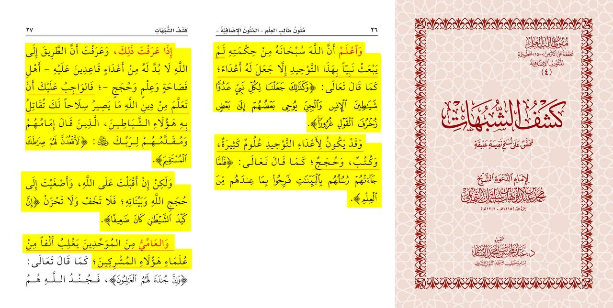

---

<!-- telegram-source: personal/messages.html#message858 -->
<!-- evidence-id: 000477 -->

Shaykh Muḥammad Ibn ʿAbd al-Wahhāb said:

And among them are those who show enmity toward them (the mushrikīn) but do not takfir them. This category also has not fulfilled what Lā ilāha illā Allāh indicates of rejecting shirk, nor what it necessitates of declaring as kāfir the one who commits it, after clarification, by ijmāʿ.

This is the meaning contained in Sūrat al-Ikhlāṣ "Say, "O disbelievers" [Sūrat al-Kāfirūn: 1], and His statement in Sūrat al-Mumtaḥanah: ‘We disbelieve in you.’ [al-Mumtaḥanah 60:4]

And whoever does not takfir the one whom the Qurʾān has declared a kāfir has opposed what the Messengers came with of tawḥīd and what it necessitates.

[ad-Durar as-Saniyyah 2/208]

Show attached source scan

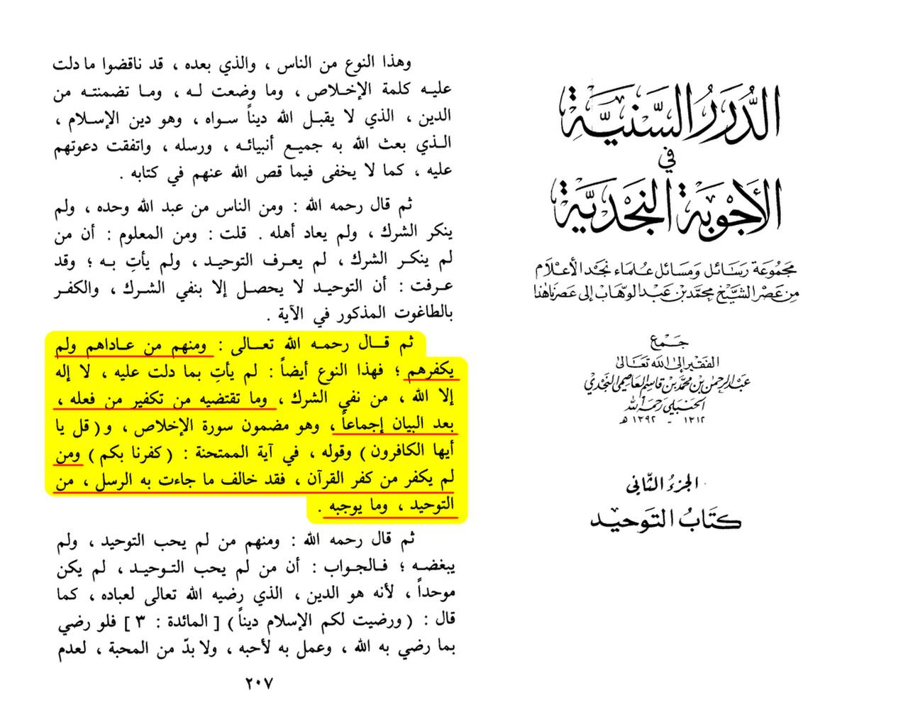

---

<!-- telegram-source: personal/messages.html#message862 -->
<!-- evidence-id: 000478 -->

Shaykh Muḥammad Ibn ʿAbd al-Wahhāb said:

And among them are those who show enmity toward them (the mushrikīn) but do not takfir them. This category also has not fulfilled what Lā ilāha illā Allāh indicates of rejecting shirk, nor what it necessitates of declaring as kāfir the one who commits it, after clarification, by ijmāʿ.

This is the meaning contained in Sūrat al-Ikhlāṣ "Say, "O disbelievers" [Sūrat al-Kāfirūn: 1], and His statement in Sūrat al-Mumtaḥanah: ‘We disbelieve in you.’ [al-Mumtaḥanah :4]

And whoever does not takfir the one whom the Qurʾān has declared a kāfir has opposed what the Messengers came with of tawḥīd and what it necessitates.

[ad-Durar as-Saniyyah 2/207]

Show attached source scan

---

<!-- telegram-source: dar/messages4.html#message4164 -->
<!-- evidence-id: 000479 -->

Shaykh Muḥammad Ibn ʿAbdul-Wahhāb said:

And none may be sought for help except Him, nor may sacrifices be offered to anyone besides Him, nor vows made for any other—neither for a near angel nor a sent prophet. Whoever does Istighāthah from other than Him has committed disbelief, whoever offers a sacrifice to other than Him has committed disbelief, and whoever makes a vow to other than Him has committed disbelief, and the like of these acts.

Shaykh Ṣāliḥ al-Fawzān said regarding this:

Tawḥīd al-Ulūhiyyah encompasses all acts of worship, and none of them may be directed to anyone other than Allah, for He alone is deserving of them. Whoever dedicates any act of worship to other than Allah is a polytheist, even if he says, “Lā ilāha illa Allāh.” In fact, even if he worships Allah through various acts of devotion, as long as he does not devote all of them sincerely to Allah alone, he is not a Muslim.

Whoever does this has committed disbelief, even if he says, “Lā ilāha illa Allāh,” because he has not truly actualized its meaning. This is a contradiction—how can someone say “Lā ilāha illa Allāh” while offering sacrifices to others besides Him? How can he claim “Lā ilāha illa Allāh” while doing Istighāthah with the dead, the absent, the jinn, or the devils? How can he profess “Lā ilāha illa Allāh” while making vows to other than Allah? This is a clear contradiction.

[Sharḥ Tafsīr Kalimat at-Tawḥīd  by Shaykh Ṣāliḥ al-Fawzān p.27-28]

Show attached source scan

---

<!-- telegram-source: dar/messages2.html#message1982 -->
<!-- evidence-id: 000480 -->

Sheikh Muḥammad Ibn ʿAbdul-Wahhāb said:

So, by Allah, my brothers, hold firmly to the foundation of your religion—its beginning and its end, its core and its peak: the testimony that there is no god but Allah. Understand its meaning, love it, and love its people. Make them your brothers, even if they are far away. Disbelieve in the ṭāghūts, oppose them, hate them, and hate those who love them, defend them, refuse to declare them disbelievers, or say, “It is not my concern,” or, “Allah has not commanded me regarding them.”

Whoever says this has lied about Allah and fabricated falsehood, for Allah has indeed commanded him concerning them and made it obligatory upon him to disbelieve in them and disavow them, even if they are his own brothers and children. So, by Allah, my brothers, hold fast to this, that you may meet your Lord without associating anything with Him. O Allah, let us die as Muslims and join us with the righteous.

[Sharḥ Tafsīr Kalimat at-Tawḥīd  by Sheikh Ṣāliḥ al-Fawzān p.32-33]

Show attached source scan

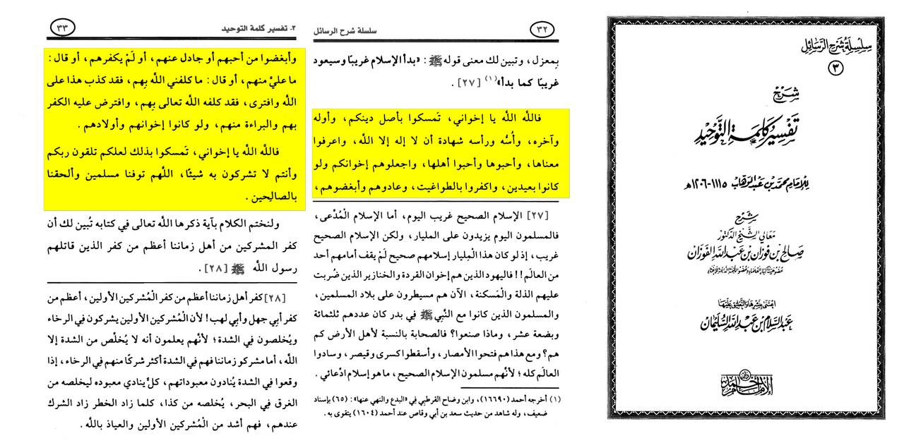

---

<!-- telegram-source: dar/messages2.html#message1619 -->
<!-- evidence-id: 000481 -->

Sheikh Muḥammad Ibn ʿAbdul-Wahhāb said:

Know that the Tawḥīd that the messengers called to, from the first to the last, is the exclusive worship of Allah alone, with no rights granted to any close angel, nor any prophet sent, let alone others. From this, no one should be called upon except Allah, as He says:

"And that the mosques are for Allah, so do not call upon anyone with Allah." (Surah Al-Jinn: 18)

So, whoever worships Allah day and night, and then calls upon a prophet or a saint at their grave, has taken two gods. They have not witnessed "There is no god but Allah", because the god is the one who is called upon, just as the polytheists today call upon the grave of Az-Zubayr, or Abdul Qadir, or others, and similarly, they used to call upon the grave of Zayd and others before. Whoever sacrifices a thousand sacrifices for Allah, then sacrifices for a prophet or anyone else, has made two Gods, as Allah says:

"Say, indeed, my prayer, my rites of sacrifice, my living and my dying are for Allah, Lord of the worlds." (Surah Al-An'am: 162)

The rites of sacrifice are part of worship; and so on and so forth. Whoever dedicates all acts of worship to Allah alone, and does not associate anyone else in it, is the one who truly bears witness that "There is no God but Allah."

[Ad-Durar as-Saniyyah 10/61]

Show attached source scan

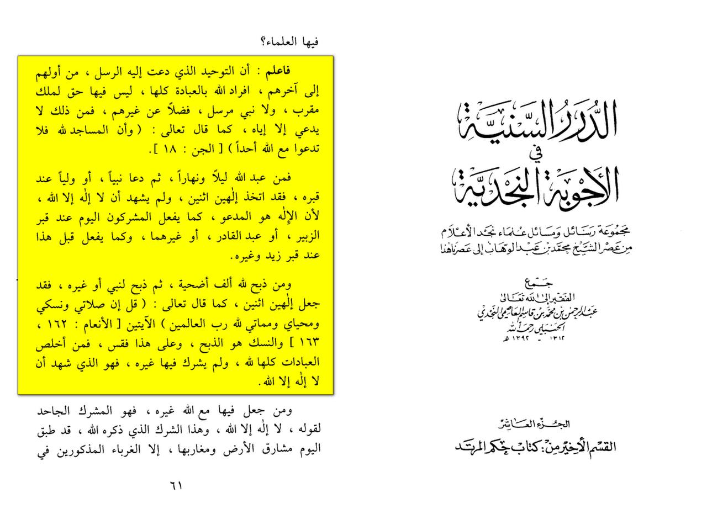

---

<!-- telegram-source: personal/messages.html#message671 -->
<!-- evidence-id: 000482 -->

Shaykh Muḥammad Ibn ʿAbd al-Wahhāb said:

It is said to this ignorant person: if you know that the ilāh is the one who is worshipped, and you know that duʿāʾ is from ʿibādah (worship), then how do you call upon a created being, a dead one, one who is incapable? And you leave the Ever-Living, the Self-Sustaining, the Present, the Compassionate, the Merciful, the All-Powerful?

So this mushrik may say: “The matter is in the hand of Allah, but this righteous servant will intercede for me with Allah, and his intercession and rank will benefit me,” and he thinks that this saves him from shirk.

[ad-Durar as-Saniyyah 2/104]

Show attached source scan

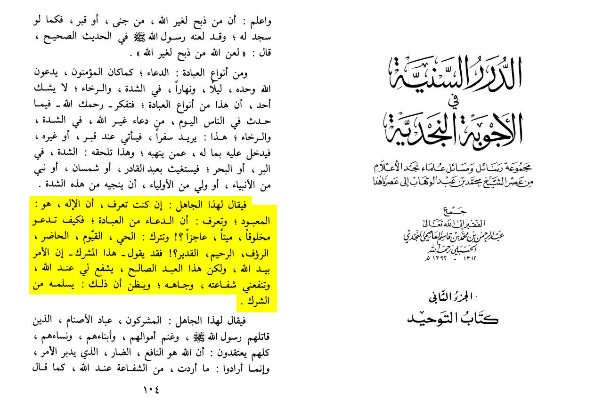

---

<!-- telegram-source: personal/messages.html#message678 -->
<!-- evidence-id: 000483 -->

Shaykh ʿAbd Allah and Ḥasan, the sons of Muḥammad Ibn ʿAbd al-Wahhāb said:

So whoever says: ‘I do not show enmity to the mushrikīn,’ or he shows enmity to them but does not takfīr them, or says: ‘I do not oppose the people of lā ilāha illā Allāh, even if they commit kufr and shirk and show enmity to the religion of Allah,’ or says: ‘I do not oppose the domes,’ then this person is not a Muslim.

Rather, he is from those about whom Allah said:

‘And they say: “We believe in some but reject others," and wish to adopt a way in between. They are in truth disbelievers.’ [al-Nisāʾ 4:150–151].

[ad-Durar as-Saniyyah 10/139-140]

Show attached source scan

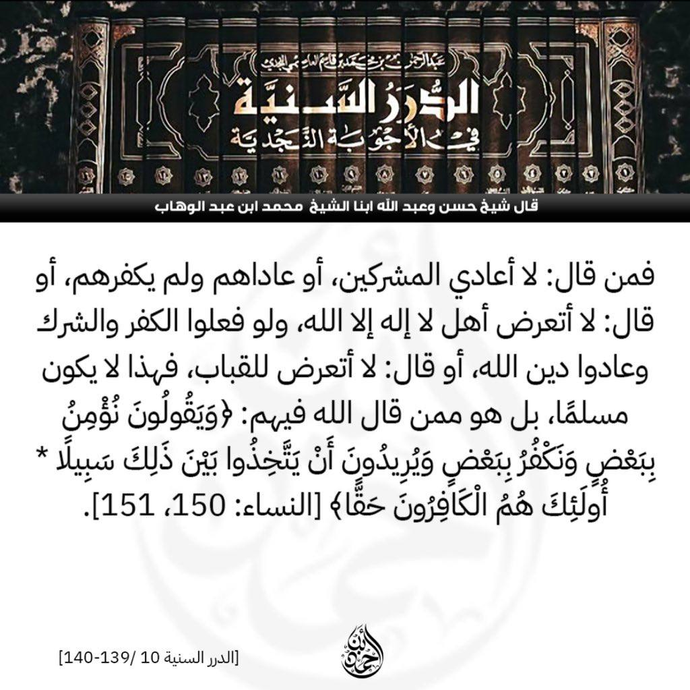

---

<!-- telegram-source: dar/messages4.html#message3362 -->
<!-- evidence-id: 000484 -->

the importance of knowing the meaning and acting in accordance to What the Shahādah entails

Shaykh Muḥammad ibn ʿAbd al-Wahhāb said:

“And merely uttering the wording of the Shahādah without ʿIlm (knowledge) of its meaning, and without ʿAmal (actions) according to its implications, does not make the accountable person a Muslim; rather, it is a proof against the son of Ādam, contrary to those who claim that Īmān is mere affirmation, like the Karrāmiyyah, or mere belief as with the Jahmiyyah.”

[al-Durar al-Saniyyah 12/535]

Show attached source scan

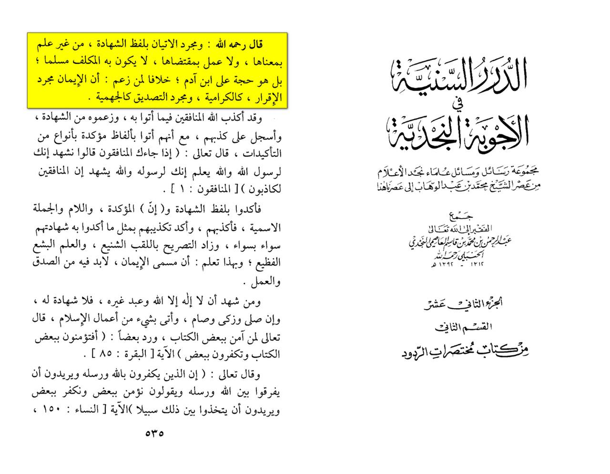

---

<!-- telegram-source: dar/messages5.html#message4882 -->
<!-- evidence-id: 000485 -->

Shaykh ʿAbd al-Raḥmān ibn Ḥasan ibn Muḥammad Ibn ʿAbd al-Wahhāb said:

Likewise, it is obligatory upon the ruler to take action against anyone who is reported to have criticised or attacked anything from the religion of Allāh and His Messenger, or who introduces doubts among the Muslims regarding their beliefs and religion.

This includes, for example, those who forbid takfīr of the mushrikīn, and who consider them to be among the best of the nation brought forth for mankind, merely because they claim Islām and utter the shahādatayn.

This type of person causes great harm to Islām, especially to the common people, and his harm is severe; there is fear of fitnah. Most people have no knowledge of the evidences that refute the doubts of those who introduce confusion and deviation. Rather, you will find him—may Allāh protect us—easily led by anyone who leads him or calls him to it.

[Ad-Durar as-Saniyyah 14/103]

Show attached source scan

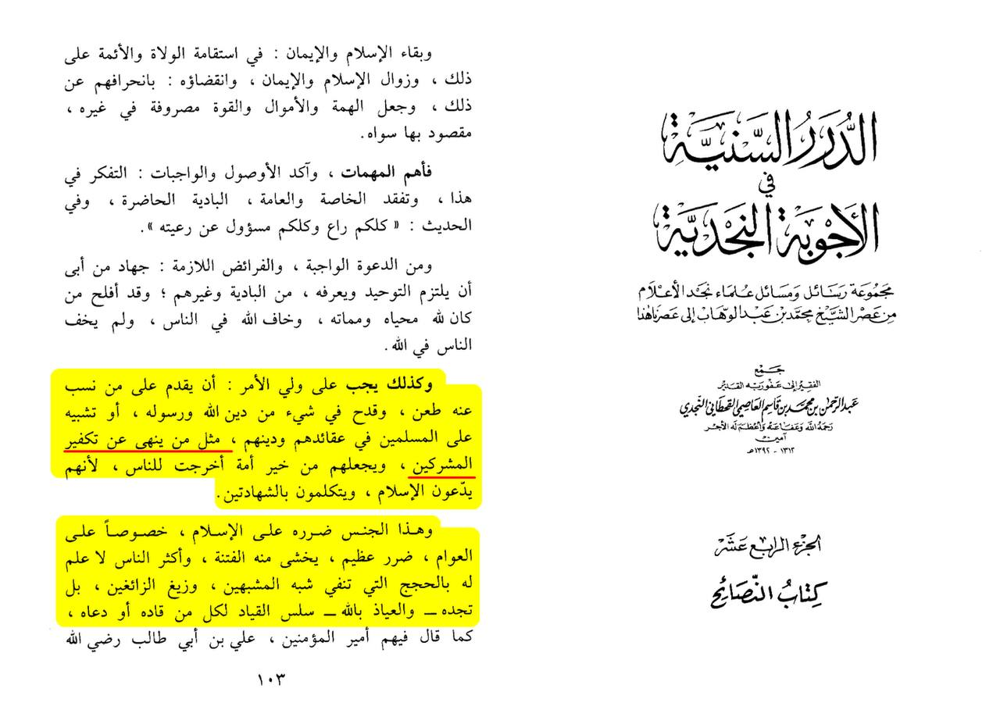

---

<!-- telegram-source: dar/messages4.html#message3630 -->
<!-- evidence-id: 000486 -->

Shaykh Sulaymān ibn ʿAbd Allāh Āl ash-Shaykh said:

Thus it is established by this that duʿāʾ is an act of worship among the greatest of acts of worship — rather, it is the most noble of them before Allāh, as has preceded. If associating in it were not shirk, then there would be no shirk on the earth. And if there is shirk on the earth, then shirk in duʿāʾ is more deserving of being called shirk than associating in other types of ʿibādah.

Rather, associating in duʿāʾ is the greatest shirk of the mushrikīn to whom the Messenger of Allāh ﷺ was sent, for they call upon the prophets, the righteous, and the angels, and they seek closeness to them so that they may intercede for them with Allāh. And for this reason, they make their duʿāʾ sincerely for Allāh in times of distress, and they forget that which they associate with Him.

[Taysīr al-ʿAzīz al-Ḥamīd by Shaykh Sulaymān ibn ʿAbd Allāh Āl ash-Shaykh p.143]

Show attached source scan

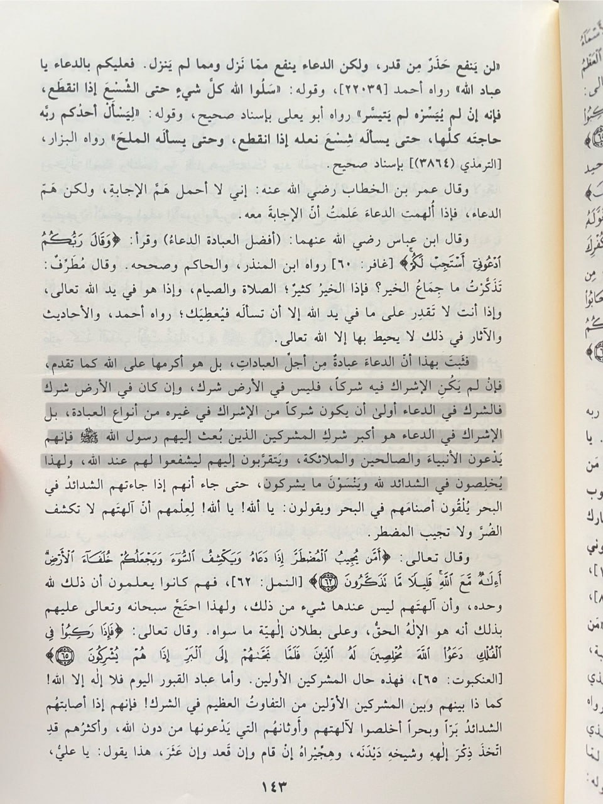

---

<!-- telegram-source: dar/messages4.html#message3690 -->
<!-- evidence-id: 000487 -->

Shaykh Sulaymān ibn ʿAbd Allāh Āl ash-Shaykh said:

As for a person saying: “La ilāha illā Allāh” without understanding its meaning, without acting upon it, or claiming that he is among the people of tawḥīd while he does not know tawḥīd—and may instead direct his worship to others besides Allāh through duʿāʾ, fear, slaughter, vows, repentance, turning to Him, and other forms of worship—this is not sufficient for tawḥīd. Rather, in this case, he is considered a mushrik, as is the condition of those who worship graves.

[Taysīr al-ʿAzīz al-Ḥamīd by Shaykh Sulaymān ibn ʿAbd Allāh Āl ash-Shaykh p.90]

Show attached source scan

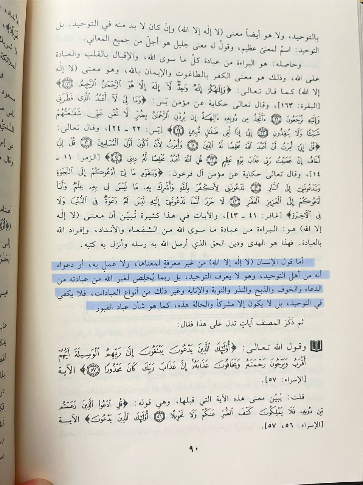

---

<!-- telegram-source: dar/messages5.html#message5044 -->
<!-- evidence-id: 000488 -->

Shaykh Sulaymān ibn ʿAbd Allāh Āl ash-Shaykh said:

A clarification that freeing oneself completely from shirk is absolutely necessary in worship, otherwise the servant is not considered one who has come with the worship of Allah; rather, he is a mushrik.

And this is the meaning of the statement of the author: “Indeed, worship is Tawḥīd, because the dispute is regarding it.”

[Taysīr al-ʿAzīz al-Ḥamīd by Shaykh Sulaymān ibn ʿAbd Allāh Āl ash-Shaykh p.40]

Show attached source scan

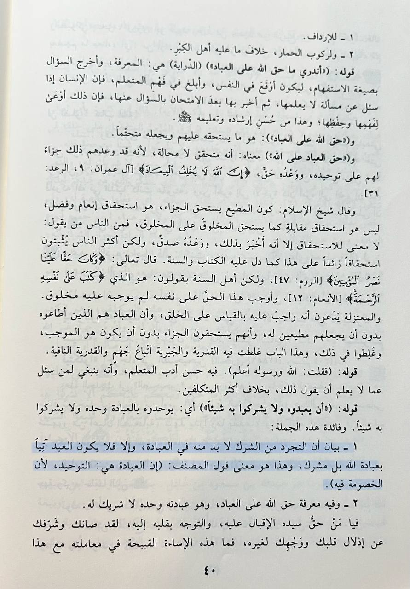

---

<!-- telegram-source: dar/messages4.html#message3538 -->
<!-- evidence-id: 000489 -->

Shaykh Sulaymān ibn ʿAbd Allāh Āl ash-Shaykh said:

And this tawḥīd is the reality of the dīn of Islām, which Allāh does not accept from anyone other than it. As the Prophet ﷺ said: “Islām is built upon five: shahādat an lā ilāha illā Allāh, wa-anna Muḥammadan rasūl Allāh ﷺ; establishing the ṣalāh; giving the zakāh; fasting in Ramaḍān; and making ḥajj to the House.” Reported by al-Bukhārī and Muslim.

So he informed that the dīn of Islām is built upon these five pillars, which are actions. This indicates that Islām is to worship Allāh alone without partner: by performing what is commanded, avoiding what is prohibited, and having sincerity in that for Allāh.

This includes all types of ʿworship, so it is obligatory to devote them purely to Allāh, the Exalted. Whoever associates between Allāh, the Exalted, and others in anything, then he is not a Muslim.

[Taysīr al-ʿAzīz al-Ḥamīd by Shaykh Sulaymān ibn ʿAbd Allāh Āl ash-Shaykh p.23]

Show attached source scan

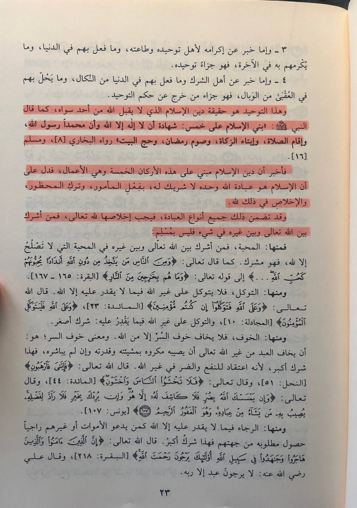

---

<!-- telegram-source: dar/messages4.html#message3627 -->
<!-- evidence-id: 000490 -->

Shaykh Sulaymān ibn ʿAbd Allāh Āl ash-Shaykh said:

The realization of tawḥīd is knowledge of it, awareness of its reality, and upholding it in knowledge and action. Its reality is the drawing of the soul toward Allāh in love and fear, turning in repentance, reliance, duʿāʾ, sincerity, reverence, awe, magnification, and worship.

In summary: there is nothing in his heart for other than Allāh, no desire for what Allāh has forbidden, and no dislike of what Allāh has commanded. And this is the reality of lā ilāha illā Allāh, for al-ilāh is the maʾlūh (the one who is worshipped).

And how excellent is what Ibn al-Qayyim said:

For the Wāḥid (One), be wāḥid (one), in wāḥid (one)—

Meaning: the path of ḥaqq (truth) and of īmān.

And this is the reality of the two shahādatayn (testimonies). Whoever fulfills them in this manner is among the seventy thousand who will enter Jannah without reckoning and without punishment.

[Taysīr al-ʿAzīz al-Ḥamīd by Shaykh Sulaymān ibn ʿAbd Allāh Āl ash-Shaykh p.62]

Show attached source scan

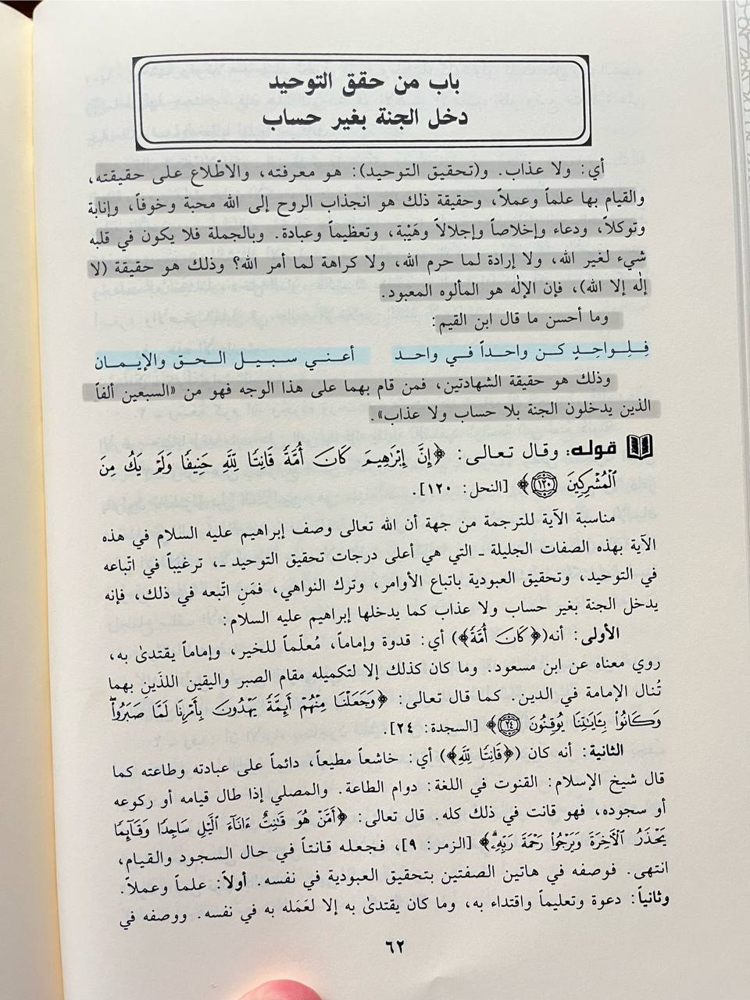

---

<!-- telegram-source: dar/messages5.html#message5053 -->
<!-- evidence-id: 000491 -->

Shaykh Sulaymān ibn ʿAbd Allāh Āl ash-Shaykh said after listing numerous types of shirk and its evidence:

So whoever associates between Allah and a created being, in that which is exclusive to the Creator from these acts of worship or others besides them, then he is a mushrik.

We only specifically mentioned these acts of worship because the grave-worshippers direct them to the dead besides Allah, or they associate between Allah and them in these acts.

Otherwise, every type from the types of worship: whoever directs it to other than Allah, or associates between Allah and others in it, then he is a mushrik. Allah said: ‘Worship Allāh and associate nothing with Him.’ [al-Nisāʾ 4:36]

[Taysīr al-ʿAzīz al-Ḥamīd by Shaykh Sulaymān ibn ʿAbd Allāh Āl ash-Shaykh p.24-25]

Show attached source scan

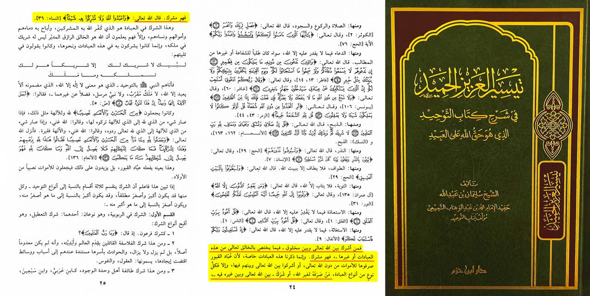

---

<!-- telegram-source: dar/messages4.html#message3526 -->
<!-- evidence-id: 000492 -->

Shaykh Sulaymān ibn ʿAbd Allāh Āl ash-Shaykh said:

This tremendous word entails that everything besides Allāh is not a god, and that ascribing divinity to anything else is the most false of falsehoods, and affirming it (for others) is the darkest form of injustice. Thus, none deserves worship except Him, just as ulūhiyyah does not befit any other besides Him. It therefore contains the negation of ulūhiyyah from all besides Him, and its affirmation for Him alone, with no partner.

And this necessitates the command to take Him alone as ilāh, and the prohibition of taking another along with Him as an ilāh. The one addressed understands this from the negation and affirmation — just as if you see a man seeking a fatwā or testimony from one unqualified for it, while neglecting the one who is qualified, and you say: “This is not a muftī nor a witness; the muftī is so-and-so, and the witness is so-and-so.” This in itself is both a command and a prohibition.

And within the meaning of ulūhiyyah enters all types of worship that proceed from the heart’s devotion to Allāh in love, humility, and submission to Him alone without partner. It is obligatory to single out Allāh, Exalted is He, with them — such as duʿāʾ, fear, love, reliance, turning in repentance, repentance, sacrifice, vow, prostration, and all forms of worship. All of these must be devoted solely to Allāh, without partner.

So whoever directs anything of the worship that is befitting only for Allāh to other than Allāh — he is a mushrik, even if he pronounces “lā ilāha illā Allāh,” since he has not acted upon what it necessitates of tawḥīd and ikhlāṣ.

[Taysīr al-ʿAzīz al-Ḥamīd by Shaykh Sulaymān ibn ʿAbd Allāh Āl ash-Shaykh p.46]

Show attached source scan

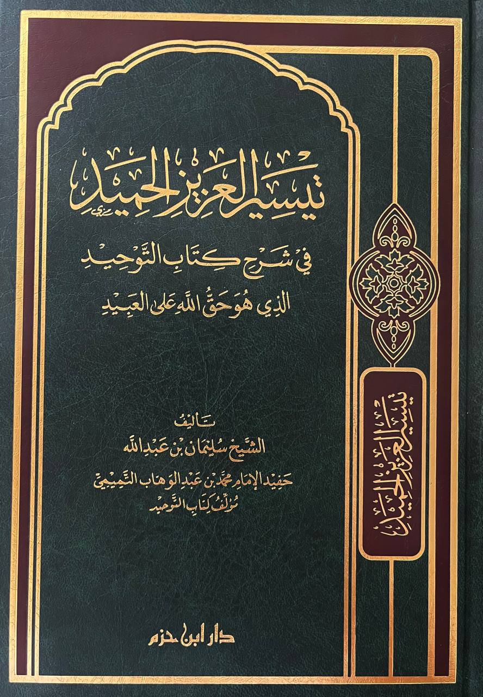

---

<!-- telegram-source: dar/messages4.html#message3447 -->
<!-- evidence-id: 000493 -->

Shaykh Sulaymān ibn ʿAbd Allāh Āl ash-Shaykh said:

The scholars have ijmāʿ that whoever directs any type of duʿā to anyone other than Allāh is a mushrik. Even if he says: “Lā ilāha illā Allāh Muhammad rasūl Allāh” and prays and fasts, since the condition of Islām with uttering the shahādah is that one worships none but Allāh, whoever utters the shahādah but worships others besides Allāh has not truly fulfilled it, even if he verbalizes it.

Like the Jews who say “Lā ilāha illā Allāh” yet are mushrikūn, merely uttering it is not sufficient for Islām without acting according to its meaning and believing it sincerely, as established by ijmāʿ.

[Taysīr al-ʿAzīz al-Ḥamīd by Shaykh Sulaymān ibn ʿAbd Allāh Āl ash-Shaykh p.149]

Show attached source scan

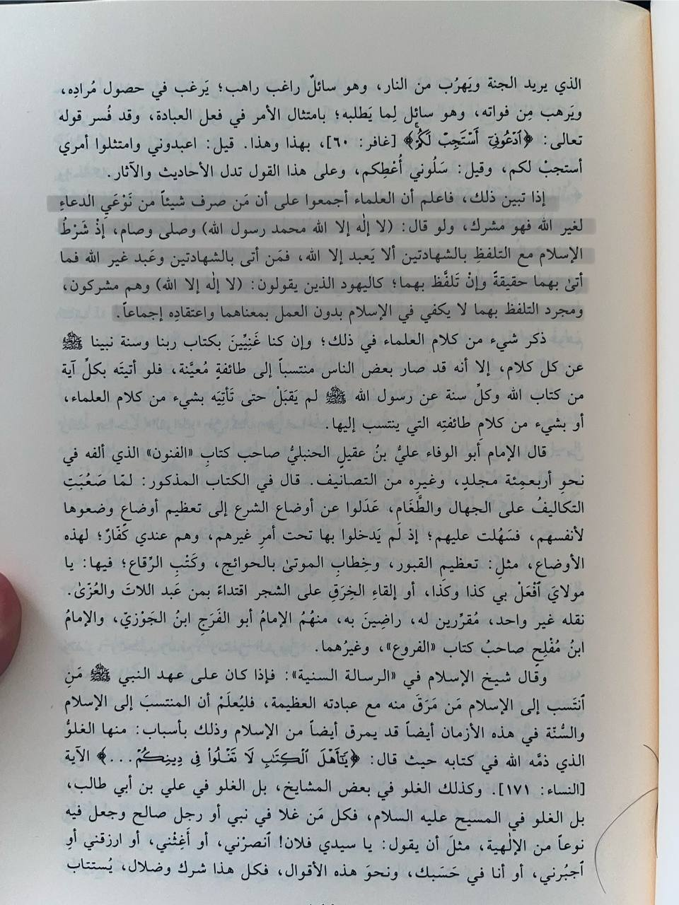

---

<!-- telegram-source: dar/messages4.html#message3523 -->
<!-- evidence-id: 000494 -->

Shaykh Sulaymān ibn ʿAbd Allāh Āl ash-Shaykh said:

His statement: “Whoever bears witness that Lā ilāha illā Allāh (there is no god but Allāh)” — meaning: whoever utters this statement knowing its meaning, and acting according to its requirements, inwardly and outwardly. As indicated by His saying: “So know that there is no god but Allāh” (Muḥammad: 19), and His saying: “Except those who bear witness to the truth while they know” (az-Zukhruf: 86). As for uttering it without knowing its meaning, nor acting according to its requirements, then that is of no benefit, by ijmāʿ.

[Taysīr al-ʿAzīz al-Ḥamīd by Shaykh Sulaymān ibn ʿAbd Allāh Āl ash-Shaykh p.45]

Show attached source scan

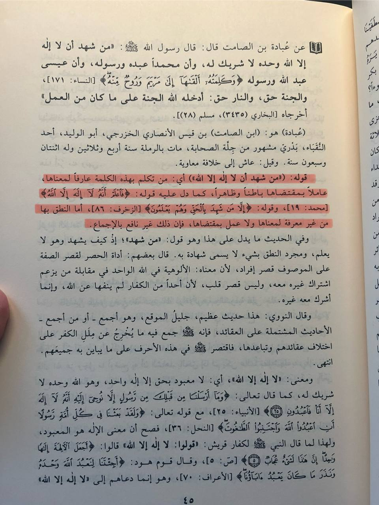

---

<!-- telegram-source: dar/messages4.html#message3708 -->
<!-- evidence-id: 000495 -->

al-ʿAllāmah Abā Buṭayn said:

But there still remains a group from the ‘Isābah al-Muḥammadiyyah standing firm, while the people of shirk and bid‘ah are striving against them, until Allah inherits the earth and whoever is on it — and He is the best of inheritors.

And the matter is as he said — may Allah have mercy on him — that the cause of the emergence and appearance of shirk is the prevalence of ignorance, the concealment of knowledge, the scarcity of ‘ulamā’, and the dominance of fools.

So it becomes clear to the seeker of the truth that whoever argues in favor of the mushrikīn, facilitates for them what they commit of shirk, and defends them with false arguments, is someone deprived of the foundation of knowledge and its obligations. Therefore, he deserves to be described with ignorance, even if he occupies himself with types of knowledge whose benefit is very little.

[Majmūʿ Fatāwā wa-Rasāʾil by Shaykh al-ʿAllāmah Abā Buṭayn p.704]

Show attached source scan

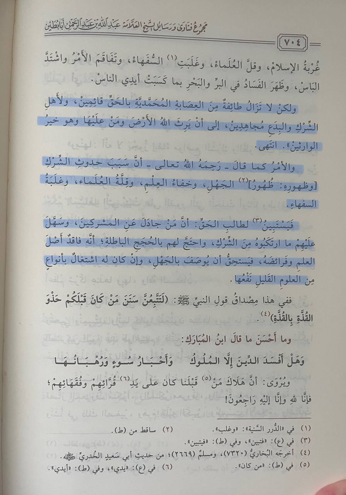

---

<!-- telegram-source: dar/messages4.html#message3674 -->
<!-- evidence-id: 000496 -->

al-ʿAllāmah Abā Buṭayn said:

As for the one who makes the way of the kuffār better than the way of the believers:

If his meaning is regarding the situation of the people of this time, as if he says: indeed the actions of the mushrik of this time at the graves and elsewhere are better than those who call only upon Allah and do not call upon others — then he is a kāfir without doubt.

And likewise our statement: indeed the actions of the mushrik of this time at the graves — in praying to the people of the graves, asking them to fulfill needs, relieving distress, slaughtering, and making vows to them — this is shirk akbar, and whoever does it is a kāfir, and those who perform these acts at the graves are kuffār without doubt.

And as for the statement of the ignorant: “You are declaring the muslimīn to be disbelievers”: This is someone who does not know Islam or tawḥīd, and the apparent reality is the Islam of this person is not valid; if he does not reject these matters that the mushrikūn do today and does not see them as wrong, then he is not a Muslim.

[Majmūʿ Fatāwā wa-Rasāʾil by Shaykh al-ʿAllāmah Abā Buṭayn p.327]

Show attached source scan

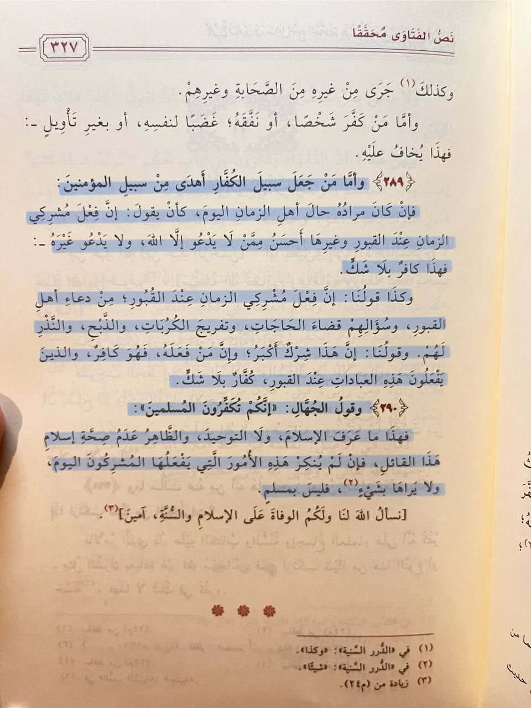

---

<!-- telegram-source: dar/messages2.html#message2110 -->
<!-- evidence-id: 000497 -->

al-‘Allāmah ‘Abdullāh Abā Butayn said:

Since it is well established among scholars that seeking refuge (istiʿādhah) in Allah is an act of worship, they have ruled that seeking refuge in a created being is impermissible. Based on this principle, they used it as evidence that the Speech of Allah is uncreated, because it is authentically reported that the Prophet ﷺ sought refuge in the perfect words of Allah, both in action and in speech. This is an argument used by Ahl al-Sunnah against the Jahmiyyah, who claim that the Qurʾān is created. They argue that if the Qurʾān were created, it would not be permissible to seek refuge in it.

Since istiʿādhah (seeking refuge) is a form of supplication (duʿāʾ), as explained by Shaykh al-Islām Taqī al-Dīn (Ibn Taymiyyah), this matter is clear. The scholars who prohibited seeking refuge in created beings also maintain that it is impermissible to supplicate to them, since istiʿādhah is, in reality, a type of duʿāʾ. The one seeking refuge in his Lord is, in essence, asking Him to avert or remove harm, and this is the very definition of duʿāʾ.

Shaykh al-Islām Ibn Taymiyyah said: “Seeking refuge (istiʿādhah), seeking protection (istijārah), and seeking aid (istighāthah) are all forms of supplication (duʿāʾ), and these terms are closely related. The Prophet ﷺ himself referred to istiʿādhah as duʿāʾ, as recorded in the Sunan where a man asked him: ‘O Messenger of Allah, teach me a supplication I can make.’ The Prophet ﷺ said: ‘Say: O Allah, I seek refuge in You from the evil of my hearing, from the evil of my sight, from the evil of my tongue, from the evil of my heart, and from the evil of my desires.’” (Sunan Abī Dāwūd)

Abū Hurayrah (رضي الله عنه) reported that the Prophet ﷺ used to supplicate, saying: “O Allah, I seek refuge in You from hunger, for it is a terrible companion, and I seek refuge in You from betrayal, for it is a terrible inner trait.” (Abū Dāwūd, with a ṣaḥīḥ chain).

In the Sunan, ʿĀʾishah (رضي الله عنها) reported that the Prophet ﷺ would supplicate using these words: “O Allah, I seek refuge in You from the trial of the Fire and the punishment of the Fire, and from the evil of wealth and poverty.”

In Ṣaḥīḥ Muslim, it is reported that the Prophet ﷺ would supplicate: “O Allah, I seek refuge in You from the removal of Your blessing, the loss of Your protection, the sudden onset of Your punishment, and anything that incurs Your displeasure.”

The purpose of citing these aḥādīth is to establish that the Prophet ﷺ and his Companions referred to istiʿādhah as duʿāʾ. Thus, when the scholars ruled that istiʿādhah is not permissible with a created being and is exclusively for Allah, because it is a form of duʿāʾ, then the same applies to all other forms of duʿāʾ. If this is firmly established, it becomes clear that if a person fears an enemy and seeks protection from a living, present person to shield him from harm, this is permissible according to all Muslims. This does not fall under the scholars’ ruling that istiʿādhah with a created being is prohibited.

This is an example of a single act whose ruling changes based on its recipient: Seeking help from a living, present person is permissible, whereas seeking help from anyone else is forbidden. Likewise, supplicating to anyone other than Allah to fulfill needs is impermissible, as Allah says: “So do not call upon anyone along with Allah.” (Sūrat al-Jinn: 18). However, this does not include asking a living, present person for assistance in matters within human capability.

[Ta'sīs al-Taqdīs fī Kashf Talbīs Dāwūd bin Jirjīs wa Yalīhi Daḥḍ Shubuhāt ʿalā al-Tawḥīd by al-ʿAllāmah ʿAbdullāh Abā Buṭayn p.87-88]

Show attached source scan

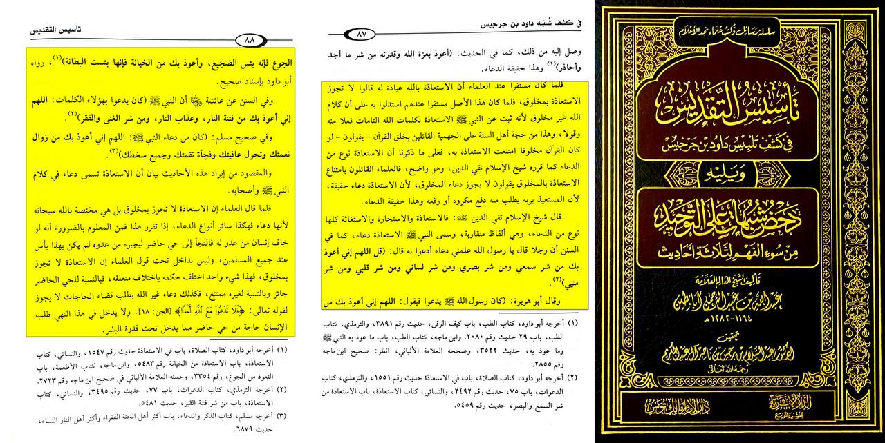

---

<!-- telegram-source: dar/messages2.html#message2047 -->
<!-- evidence-id: 000498 -->

what is Wasīlah?

al-‘Allāmah ‘Abdullāh Abā Butayn said:

If it is asked, “What is the meaning of wasīlah in the statement of Allah, the Exalted: ‘And seek nearness (wasīlah) to Him’ [Al-Māʾidah: 35], the answer is: The intended meaning of wasīlah is drawing near to Allah, the Exalted, through doing what He has commanded and avoiding what He has forbidden.

Al-Baghawī said: “Wasīlah means nearness.” Al-Bayḍāwī said: “It means that by which you seek closeness to His reward and nearness to Him, through acts of obedience and refraining from sins.” Ibn Kathīr said: “It means to draw near to Him through obedience and doing what pleases Him.” He also stated, “This is the consensus of the commentators.”

Similarly, in another verse: “They seek nearness to their Lord.” [Al-Isrāʾ: 57] Al-Baghawī said: “Wasīlah means nearness.” It has also been said: “Wasīlah is everything by which one draws near to Allah.” Al-Bayḍāwī commented: “They seek to their Lord wasīlah through obedience.” Ibn Kathīr said: “It means that they strive to be closer to Allah through obedience and increasing in goodness.”

Regarding Al-Baghawī’s statement: “They seek out whoever is closer to Allah and use him as a means,” this is his own wording, not from Ibn ʿAbbās. The one who misattributed it to Ibn ʿAbbās has erred. If the meaning of wasīlah is as Al-Baghawī mentioned, then it refers to what the Ṣaḥābah did with the Prophet ﷺ during his lifetime—such as asking him to supplicate for them or seeking rain through him, as reported in many aḥādīth.

This is also what ʿUmar did after the Prophet’s death, when he sought rain through Al-ʿAbbās, saying: “O Allah, we used to seek rain through our Prophet, and You would provide for us. Now, we seek rain through the uncle of our Prophet, so grant us rain!”

Similarly, Muʿāwiyah did this with Yazīd ibn Al-Aswad Al-Jurashī when he sought rain, saying: “O Allah, we seek intercession through our best ones. O Yazīd, raise your hands to Allah!” So Yazīd raised his hands, supplicated, and they were given rain.

This is the correct understanding of wasīlah.

[Ta'sīs al-Taqdīs fī Kashf Talbīs Dāwūd bin Jirjīs wa Yalīhi Daḥḍ Shubuhāt ʿalā al-Tawḥīd by al-ʿAllāmah ʿAbdullāh Abā Buṭayn p.119-120]

Show attached source scan

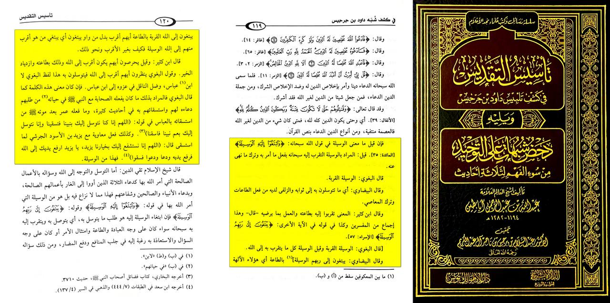

---

<!-- telegram-source: dar/messages2.html#message2031 -->
<!-- evidence-id: 000499 -->

al-‘Allāmah ‘Abdullāh Abā Butayn said:

If it is said: “These well-known idols of the polytheists are inanimate objects, such as al-Lāt, Manāt, and al-ʿUzzā, while the one buried in a grave is a human—so what is the common factor between them?”

We respond: The Qur’anic texts prohibiting the invocation of anyone besides Allah are general and apply to anyone who is called upon other than Allah, whether they can neither harm nor benefit. Allah, the Exalted, says:

“And do not invoke besides Allah that which neither benefits you nor harms you, for if you do so, then you will surely be among the wrongdoers.” (Yūnus: 106) And He says: “So do not invoke anyone with Allah.” (Al-Jinn: 18) And: “Say: Shall we invoke, besides Allah, that which neither benefits us nor harms us, and be turned back on our heels after Allah has guided us—like one whom the devils have lured away in the land, bewildered?” (Al-Anʿām: 71) And: “And who is more astray than one who invokes, besides Allah, those who will not respond to him until the Day of Resurrection, and who are unaware of their supplication?” (Al-Aḥqāf: 5)

Al-Bayḍāwī, commenting on this verse, said: “This is a denunciation of the fact that there is no one more misguided than the polytheists, who abandoned the worship of the All-Hearing, the Responsive, the Omnipotent, and the All-Knowing in favor of worshiping those who cannot respond to them—even if they could hear their supplications—let alone know their inner thoughts or attend to their interests. Those whom they call upon are either inanimate objects or subjugated servants preoccupied with their own states.”

Allah, the Exalted, also says: “And those whom you invoke besides Him do not own even a qitmeer (the thin membrane on a date seed). If you invoke them, they will not hear your supplication, and if they were to hear, they would not respond to you.” (Fāṭir: 13–14)

The rebuke in these verses applies to anyone who calls upon those who possess these qualities—whether they are humans, angels, or idols. This includes anyone who neither benefits those who invoke them nor harms those who do not. It also includes those who cannot hear the supplication directed at them, and even if they could, they would be unable to respond—because answering the supplicant is impossible for them. These are the characteristics of the dead.

[Ta'sīs al-Taqdīs fī Kashf Talbīs Dāwūd bin Jirjīs wa Yalīhi Daḥḍ Shubuhāt ʿalā al-Tawḥīd by al-ʿAllāmah ʿAbdullāh Abā Buṭayn p.90]

Show attached source scan

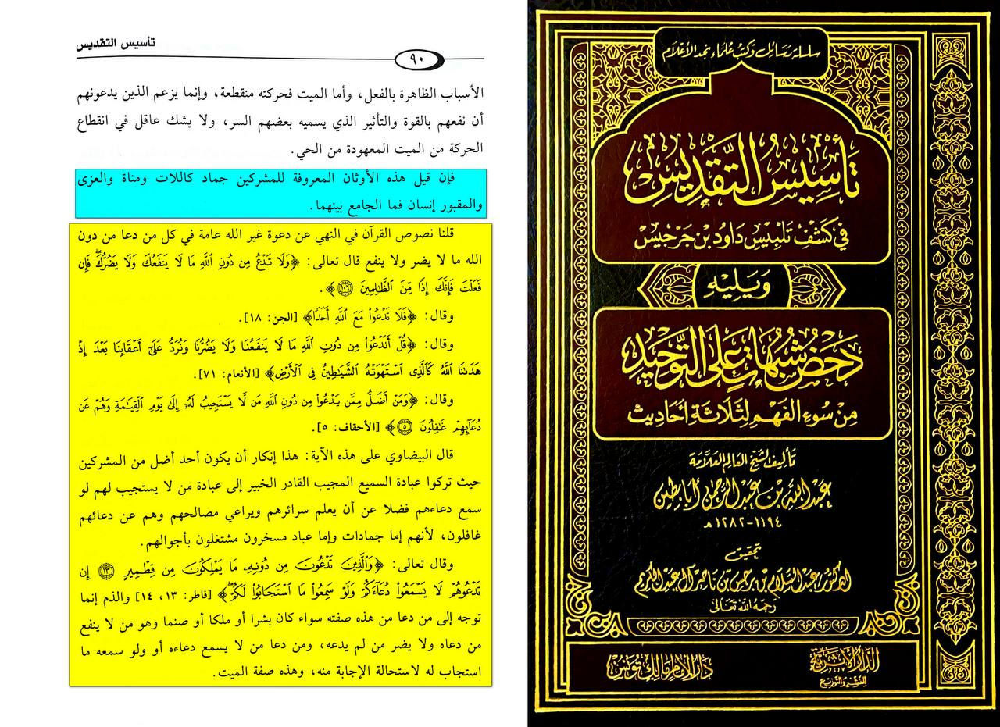

---

<!-- telegram-source: dar/messages5.html#message4978 -->
<!-- evidence-id: 000500 -->

an important question to ask yourself, do you fall into one of the categories mentioned by Shaykh Abd ar-Raḥmān ibn Ḥasan

Shaykh Abd ar-Raḥmān ibn Ḥasan Āl ash-Shaykh said:

The Answer: It is that there is no one except that he claims Islām for himself, and every statement has a reality.

And our shaykh (Muḥammad Ibn ʿAbd al-Wahhāb) , may Allah have mercy on him, mentioned a comprehensive definition of foundation of Islām, saying: “The foundation of the religion of Islām and its principle is two matters:

The first: the command to worship Allah alone with no partner, to encourage to do so, loyalty to those who adhere to it, and takfīr of whoever leaves it.

The second: warning against shirk in the worship of Allah, being severe regarding it, enmity to those who commit it, and takfīr of whoever commits it.

Those who oppose this are of types: the most severe in opposition is the one who opposes all of it. Among them is one who worships Allah alone but does not reject shirk. Among them is one who commits shirk but does not reject tawḥīd. Among them is one who rejects shirk but does not show enmity to its people. Among them is one who shows enmity to them but does not make takfīr of them.

Among them is one who does not love tawḥīd and does not hate it. Among them is one who rejects it but does not show enmity to its people. Among them is one who shows enmity to them but does not make takfīr of them. Among them is one who makes takfīr of them and claims it is insulting the righteous.

Among them is one who does not hate shirk and does not love it. Among them is one who does not know shirk and does not reject it. Among them, and it is the most dangerous type, is one who acts upon tawḥīd but does not know its value, so he does not hate those who leave it and does not make takfīr of them.

Among them is one who leaves shirk, hates it, and rejects it, but does not know its value, so he does not show enmity to its people and does not make takfīr of them.

And all of these have opposed what the prophets came with from the dīn of Allah.” End of his words.

It is said to this unfortunate one: reflect upon yourself! Are you inside these categories? If you are in them, then you have not entered Islām until Islām is confirmed for you. And it is also said: who is this who declared you a kāfir and confronted you with takfīr? If it is established from a known person, then it is to be examined: did the ruling match the place or not? If it matches, then there is no objection to the one who ruled by the evidence.

[ad-Durar as-Saniyyah 8/264-265]

Show attached source scan

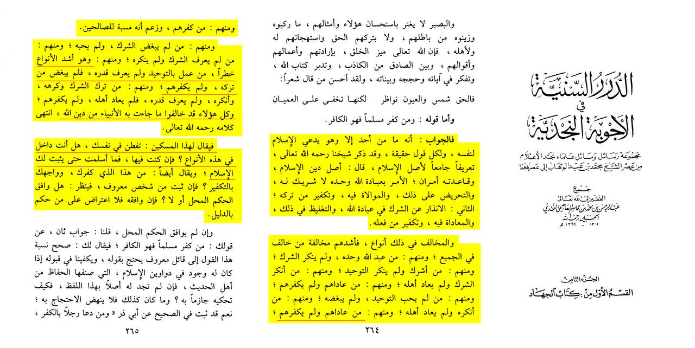

---

<!-- telegram-source: dar/messages4.html#message4230 -->
<!-- evidence-id: 000501 -->

Shaykh Abd ar-Raḥmān ibn Ḥasan said:

"And they used to say it, but they were ignorant of its meaning which it indicated, of Ikhlāṣ of ʿIbādah for Allāh alone and the leaving of the worship of what is other than Him. So their saying 'La ilaha illa Allāh' was not benefiting them due to their ignorance of the meaning of this word, like the condition of most of the later generations from this Ummah; for indeed they used to say it along with what they used to do of Shirk through the worship of the dead, and the absent ones, and the Ṭawāghīt, and the shrines.

So they come with what contradicts it; so they affirm what it negated of Shirk by their belief, and their speech, and their action, and they negate what it affirmed of Ikhlāṣ likewise. And they thought that its meaning is 'the Ability to Create' in Taqlīd (blind imitation) of the Mutakallimīn (theologians) from the Ashāʿirah and others.

And this is Tawḥīd al-Rubūbiyyah which the Mushrikūn acknowledged, yet it did not enter them into Islām, just as He, the Exalted said: 'Say, [O Muḥammad], "To whom belongs the earth and whoever is in it, if you should know?"' ... to His saying: "Then how are you deluded?"' And His saying: "Say, "Who provides for you from the heaven and the earth? Or who controls hearing and sight ?' ... to His saying: 'and who arranges [every] matter?" They will say, "Allāh," so say, "Then will you not fear Him?' And the likes of these verses in the Qur’ān are many.

And this Tawḥīd, indeed the Mushrikūn of the nations acknowledged it, and the People of al-Jāhiliyyah acknowledged it—those among whom Muḥammad ﷺ was sent—yet it did not enter them into Islām; because they had rejected what this word indicated of Tawḥīd al-Ilāhiyyah, and it is the Ikhlāṣ of ʿIbādah and the negation of Shirk and the disavowal from it, just as He, the Exalted said: 'Say, "O People of the Scripture, come to a word that is equitable between us and you - that we will not worship except Allāh and not associate anything with Him and not take one another as lords instead of Allāh." But if they turn away, then say, "Bear witness that we are Muslims [submitting to Him].'

So this Tawḥīd is the foundation of Islām, and He, the Exalted said: 'You worship not besides Him except [mere] names you have named them,1 you and your fathers, for which Allāh has sent down no evidence. Legislation is not but for Allāh. He has commanded that you worship not except Him. That is the correct religion, but most of the people do not know.' And He said: 'So direct your face [i.e., self] toward the correct religion before a Day comes from Allāh of which there is no repelling.'

And He, the Exalted said: '[They will be told], "That is because, when Allāh was called upon alone, you disbelieved; but if others were associated with Him, you believed. So the judgement is with Allāh, the Most High, the Grand.' And He said: ' So worship Allāh, [being] sincere to Him in religion. Surely the religion is for Allâh only.'

And the likes of these verses regarding the clarification of the Tawḥīd to which the Messengers called, and with which the Books descended, in the Qur’ān are many. And we will mention some of that, if Allāh the Exalted wills, in this commentary."

[Kitāb at-Tawḥīd wa Qurrat ʿUyūn al-Muwaḥḥidīn by Shaykh Abd ar-Raḥmān ibn Ḥasan ibn Muḥammad ibn ʿAbd al-Wahhāb p.36-37]

Show attached source scan

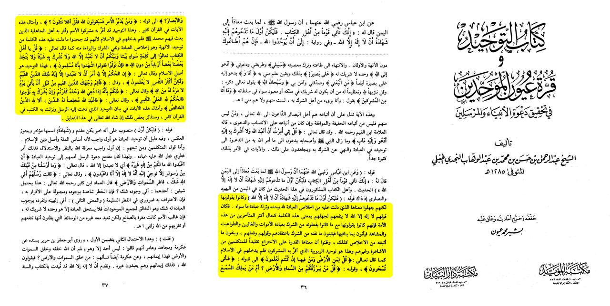

---

<!-- telegram-source: dar/messages5.html#message4952 -->
<!-- evidence-id: 000502 -->

Shaykh ʿAbd al-Laṭīf ibn ʿAbd al-Raḥmān ibn Ḥasan ibn ʿAbd al-Wahhāb said:

So reflect—may Allah have mercy on you—on the speech of this imām, and his explicit statement that whoever calls upon the dead and turns to them, and seeks istaghāthah from them so that they may intercede for him with Allah, has committed shirk al-akbar, the shirk for whose rejection Allah sent Muḥammad ﷺ.

And for Takfiring the one who does not repent from it, and to fight and show enmity toward him—and that this occurred in his time, and that they altered the religion of the Messenger ﷺ and opposed Ahl al-tawḥīd, those who command them with sincerity in worship to Allah alone, with no partner.

And reflect also on his statement: “And how rare is the one who is freed from this!” Rather, how rare is the one who does not show enmity toward the one who condemns it! The matter will become clear to you, if Allah wills.

But reflect—may Allah guide you—on his statement: “And none is saved from the shirk of this shirk al-akbar except the one who shows enmity to the mushrikin” to the end.

It will become clear to you that Islām is not established except by showing enmity toward the people of this shirk; so if he does not show enmity toward them, then he is from them, even if he does not do it (i.e commit shirk), And Allah knows best.

[ad-Durar as-Saniyyah 1/432]

Show attached source scan

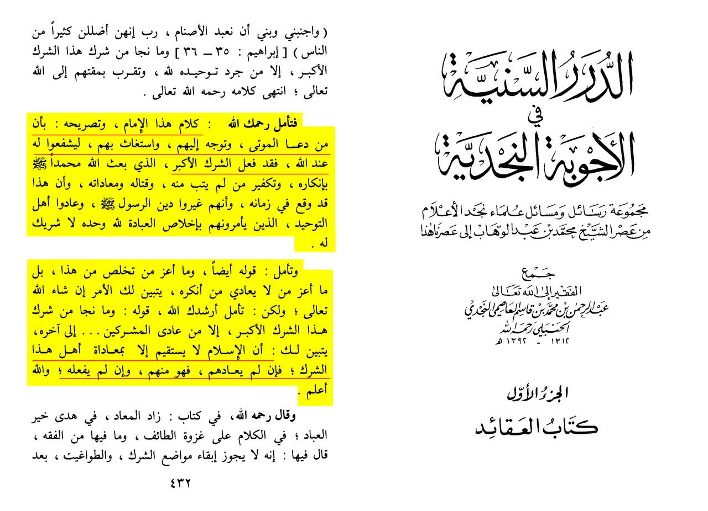

---

<!-- telegram-source: dar/messages2.html#message1521 -->
<!-- evidence-id: 000503 -->

Sheikh ’Abd ar-Raḥmān ash-Shaykh said:

The author رحمه الله said: “Chapter on the fear of shirk and His (Allah’s) saying: “Indeed, Allah does not forgive that a partner be associated with Him, but He forgives what is less than that for whom He wills.” [An-Nisa: 48, 116].

Explanation:

Ibn Kathīr said: “Allah informs us that He does not forgive shirk (associating partners with Him), meaning He does not forgive a servant who meets Him while being a polytheist. But He forgives what is lesser than that for whom He wills.”

Thus, this verse makes clear that shirk is the greatest of sins, because Allah has stated that He will not forgive it unless one repents from it. Lesser sins are subject to His will—He may forgive them for whom He wills, or He may punish them.

This leads to a great fear of shirk, as it is the most heinous and unjust sin. It involves diminishing the Lordship of Allah, directing His exclusive rights to others, and equating Him with others, as He says: “Then those who disbelieved in their Lord associate others with Him.” [Al-An’am: 1].

Shirk contradicts the purpose of creation and divine commandments in every way. It is the ultimate form of defiance against the Lord of the worlds, arrogance in refusing to obey Him, and the rejection of submission to His commands. The world cannot prosper without this submission to Him.

When it is absent, the world falls into corruption, and the Day of Judgment will come, as the Prophet ﷺ said: “The Hour will not come until no one on earth says: ‘Allah, Allah.’” (Reported by Muslim).

And because shirk is the act of likening the created to the Creator – exalted and sanctified be He – in the attributes of divinity, such as the power over harm and benefit, the ability to give and withhold, which leads to dependence in supplication, fear, hope, reliance, and all forms of worship, which are exclusively for Allah, the Exalted. So, anyone who attaches these attributes to a created being has likened them to the Creator and made someone who does not possess the power to harm or benefit, nor life, nor death, nor resurrection, similar to the One who is worthy of all praise, who has created everything, who owns everything, who holds all goodness in His hands, and to whom everything ultimately returns.

The entire outcome of matters is in His hands, and their final decision lies with Him. Whatever He wills, happens; whatever He does not will, does not happen. No one can prevent what He gives, and no one can give what He has withheld. He is the Mighty, the Wise. Thus, the most heinous comparison is the comparison of the helpless and poor by nature, to the self-sufficient and rich by nature.

Among the attributes of divinity is the absolute perfection in every aspect, without any deficiency in any way. This necessitates that all forms of worship—such as veneration, awe, fear, supplication, hope, repentance, reliance, and seeking help—along with the utmost love and utmost humility, should be directed exclusively to Him. All of this is required by reason, law, and innate nature to be for Allah alone, and it is logically, legally, and innately impossible for it to be for anyone else. Anyone who performs any of these actions for someone other than Allah has likened that other to the One who has no equal, no likeness, and no partner. This is the worst and most invalid form of comparison.

For these reasons, among others, Allah, the Exalted, has declared that He will not forgive it, even though He has written mercy upon Himself. This is the meaning of the words of Ibn al-Qayyim, may Allah have mercy on him.

[Fatḥ al-Majīd by Sheikh ’Abd ar-Raḥmān ibn Ḥasan ibn ash-Shaykh p.62-63]

Show attached source scan

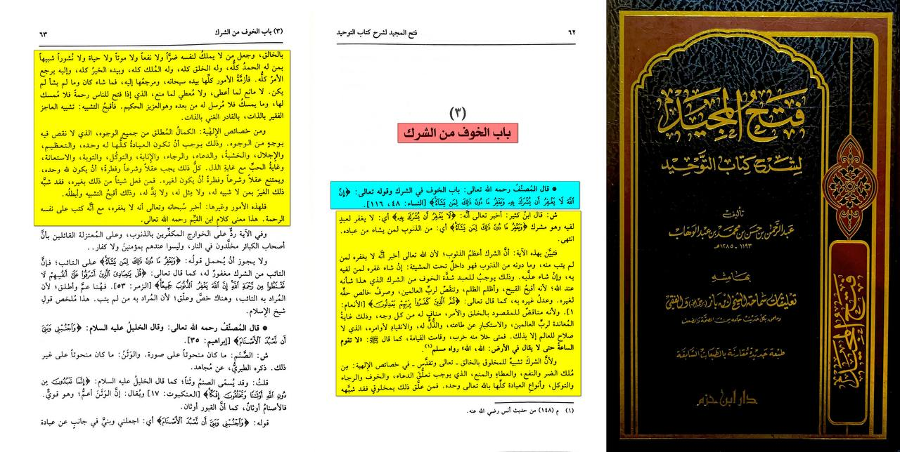

---

<!-- telegram-source: dar/messages4.html#message3268 -->
<!-- evidence-id: 000504 -->

Shaykh ʿAbd ar-Raḥmān ibn Ḥasan said:

The worship of the lords of graves contradicts Islam, for its foundation is tawḥīd and ikhlāṣ (sincerity). Sincerity cannot be established except by negating shirk and disavowing it, as Allah, the Exalted, said: “So whoever disbelieves in al-ṭāghūt and believes in Allah has grasped the firmest handhold” [Sūrat al-Baqarah 2:256]. These deeds, when accompanied by shirk, are “like ashes which the wind blows forcefully on a stormy day” [Sūrat Ibrāhīm 14:18], and they become scattered dust, “like a mirage in a desert plain which the thirsty one thinks is water until he comes to it and finds nothing” [Sūrat al-Nūr 24:39].

Lā ilāha illā Allāh — how could this shirk be hidden from him, to the point that he took it as a religion whose defense is obligatory?! The scholars, past and present, from the Companions, the Followers, the Imāms, and all the people of Sunnah, have unanimously agreed that a person is not a Muslim except by freeing himself from major shirk, disavowing it and those who commit it, hating them and opposing them according to one’s ability and capacity, and devoting all deeds solely to Allah — as in the ḥadīth of Muʿādh reported in the two Ṣaḥīḥs: “For indeed, the right of Allah over His servants is that they worship Him and do not associate anything with Him.”

[Ad-Durar as-Saniyyah 11/545]

Show attached source scan

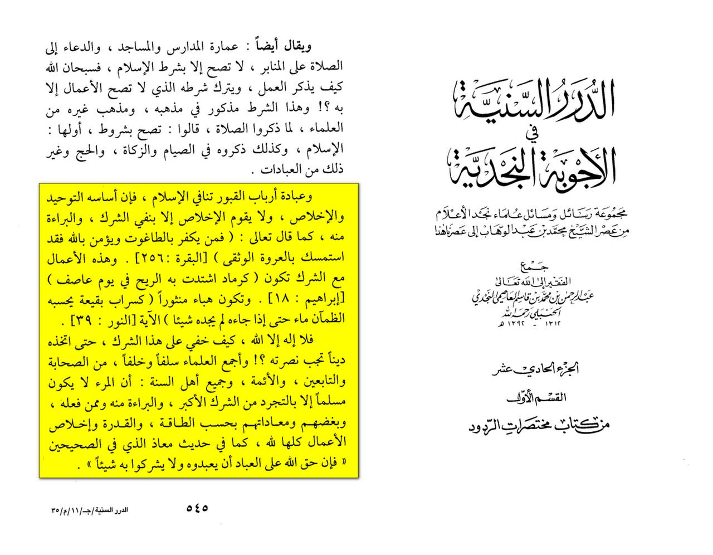

---

<!-- telegram-source: dar/messages2.html#message1535 -->
<!-- evidence-id: 000505 -->

Sheikh ’Abd ar-Raḥmān ash-Shaykh said:

The Author (Sheikh Muhammad Ibn Abdul Wahhab) رحمه الله said: On the authority of Ibn Masʿūd, may Allah be pleased with him, that the Messenger of Allah ﷺ said: “Whoever dies while calling upon a rival to Allah besides Him will enter the Fire. ” Narrated by al-Bukhārī.

Explanation:

Ibn al-Qayyim said: Al-nidd (الند) means a counterpart or equal. It is said: “So-and-so is the nidd of so-and-so” or his equivalent, meaning his equal and counterpart. End quote. Allah Almighty said:

“So do not set up rivals to Allah while you know [the truth].” (Al-Baqarah: 22)

His statement: (Whoever dies while calling upon a rival to Allah besides Him) —meaning: he assigns a rival to Allah in worship, calling upon him, asking him, and seeking his aid— “will enter the Fire.”

Al-ʿAllāmah Ibn al-Qayyim, may Allah have mercy on him, said:

Beware of shirk, for it is evident and clear, This type shall never be forgiven.

It is to set up a rival to the Most Merciful, regardless of who it may be—whether a stone or a human being.

He calls upon it, hopes for it, then fears it, and loves it, just as the love of the Sustainer.

And know that setting up a rival to Allah is of two types:

The first: To make that rival a partner with Allah in any type of worship, or in some of it, as previously mentioned. This is major shirk.

The second: It is the type of minor shirk, such as saying: “What Allah wills and you wills,” or “If it weren’t for Allah and you.” Also, slight showing off (riya). It is confirmed that when a man said to the Prophet ﷺ, “What Allah wills and you wills,” he replied, “Did you make me a partner with Allah? Rather, what Allah alone wills.” This was narrated by Ahmad, Ibn Abī Shaybah, al-Bukhārī in his Al-Adab al-Mufrad , al-Nasā’ī, and Ibn Mājah.

In this, it is evident that calling upon others besides Allah for something that only Allah can do is clear shirk, such as seeking intercession from the dead. The right of intercession belongs to Allah alone, and He has control over it, while no one else holds any part of it. It is He who permits the intercessor to intercede for those who meet Allah with sincerity and monotheism, from among the people of major sins.

[Fatḥ al-Majīd by Sheikh ’Abd ar-Raḥmān ibn Ḥasan ibn ash-Shaykh p.65-66]

Show attached source scan

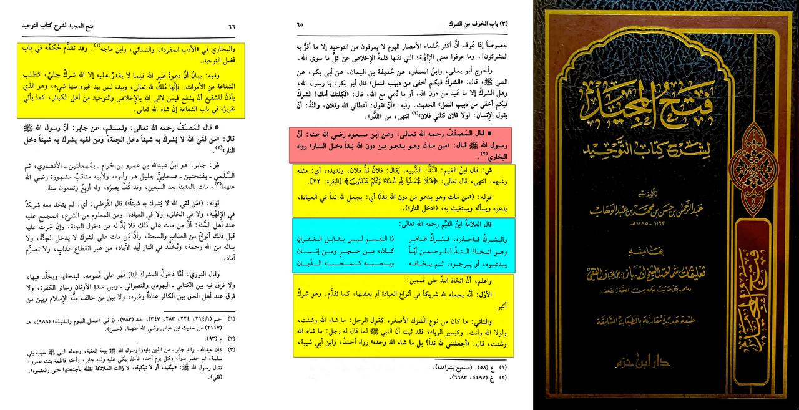

---

<!-- telegram-source: dar/messages3.html#message2414 -->
<!-- evidence-id: 000506 -->

Shaykh Al-Mujaddid ʿAbd Ar-Raḥmān bin Ḥasan said:

And this man (one of the grave worshippers) has adopted the way of those who make takfīr based on pure tawḥīd: whenever we say, “Nothing is to be sought except from Allāh alone, none is to be called upon except Him, none is to be hoped in except Him, none is to be relied upon except Him,” and similar acts of ʿibādah that are exclusive to Allāh — and that whoever directs them to other than Allāh is a kāfir mushrik  — he says: “You have innovated and declared the Ummah of Muḥammad as disbelievers! You are Khawārij! You are innovators!”

He took words from Shaykh al-Islām Ibn Taymiyyah regarding the people of bidʿah and used them to insinuate against the people of tawḥīd. Yet it is not hidden what Shaykh al-Islām said about one who commits shirk with Allāh. He said, may Allāh have mercy on him: “Whoever places intermediaries between himself and Allāh, calling upon them, asking them, and relying upon them, has disbelieved by ijmāʿ.”

[Al-Adillah wa Al-Barāhīn ʿalā ʿAdam Al-ʿUḏhr bil Jahl fī Uṣūl Ad-Dīn by the Shaykh Al-Mujaddid ʿAbd Ar-Raḥmān bin Ḥasan Āl Ash-Shaykh p.4]

Show attached source scan

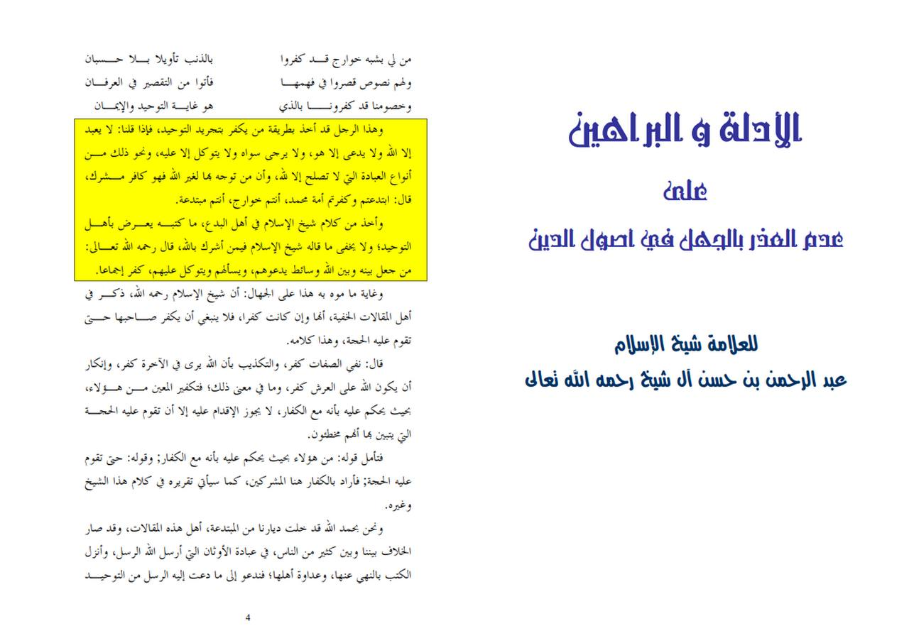

---

<!-- telegram-source: dar/messages2.html#message1531 -->
<!-- evidence-id: 000507 -->

Sheikh ’Abd ar-Raḥmān ash-Shaykh said:

Whoever sincerely loves Allāh and His Messenger from his heart, this necessitates that he also loves with his heart what Allāh and His Messenger love, and hates what Allāh and His Messenger hate, and that he is pleased with what pleases Allāh and His Messenger, and angered by what angers Allāh and His Messenger, and that he acts with his limbs in accordance with this love and hatred.

If he then acts with his limbs in a way that contradicts this—by committing something that Allāh and His Messenger hate, or neglecting something that Allāh and His Messenger love, while being obligated and able to perform it—this indicates a deficiency in his obligatory love. He must repent from that and return to completing the obligatory love, which, when perfected, constitutes a pillar of worship.

All sins originate from preferring one’s own desires over the love of Allāh and His Messenger. Allāh has described the Mushrikūn (polytheists) as followers of their desires in multiple places in His Book, such as His saying:

“But if they do not respond to you, then know that they only follow their desires. And who is more astray than one who follows his desire without guidance from Allāh?” (Al-Qaṣaṣ 50)

Likewise, Bid‘ah (religious innovations) arise from preferring desires over divine legislation, which is why the people of innovation are called “the people of desires.” Similarly, sins occur because a person prefers his desire over the love of Allāh and the love of what Allāh loves.

As for love of individuals, it is obligatory that it be in accordance with what the Messenger ﷺ brought. The believer must love those whom Allāh loves, from the Angels, the Messengers, the Prophets, the Ṣiddīqūn, the Martyrs, and the Righteous in general. For this reason, among the signs of the sweetness of faith is that a person loves another person, not loving him except for Allāh.

It is therefore prohibited to show allegiance to the enemies of Allāh and to those whom Allāh hates, in general. By this, the entire religion belongs solely to Allāh. And whoever loves for Allāh, hates for Allāh, gives for Allāh, and withholds for Allāh, has perfected faith.

And whoever’s love, hatred, giving, and withholding is for his own desire, then this is a deficiency in his obligatory faith, from which he must repent.

[Fatḥ al-Majīd by Sheikh ’Abd ar-Raḥmān ibn Ḥasan ibn ash-Shaykh p.376]

Show attached source scan

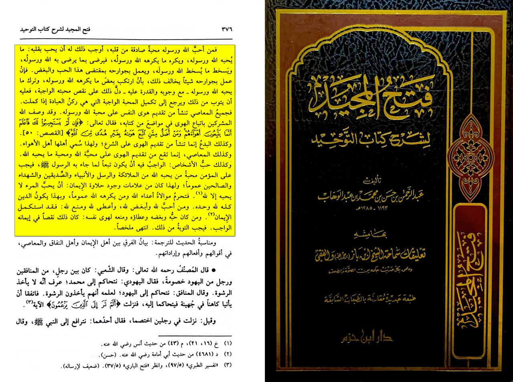

---

<!-- telegram-source: personal/messages.html#message677 -->
<!-- evidence-id: 000508 -->

Shaykh ʿAbd al-Raḥmān ibn Ḥasan said:

So indeed our Shaykh (Muḥammad Ibn ʿAbd al-Wahhāb) attained mastery through this Tawḥīd, its clarification, and calling to it. And this clarifies the condition of this man: that he did not know ‘Lā ilāha illā Allāh.’

For if he had known the meaning of ‘Lā ilāha illā Allāh,’ he would have known that whoever doubts or hesitates regarding the kufr of the one who commits shirk with Allah by associating another besides Him, then he has not disbelieved in the ṭāghūt.

[ad-Durar as-Saniyyah 11/523]

Show attached source scan

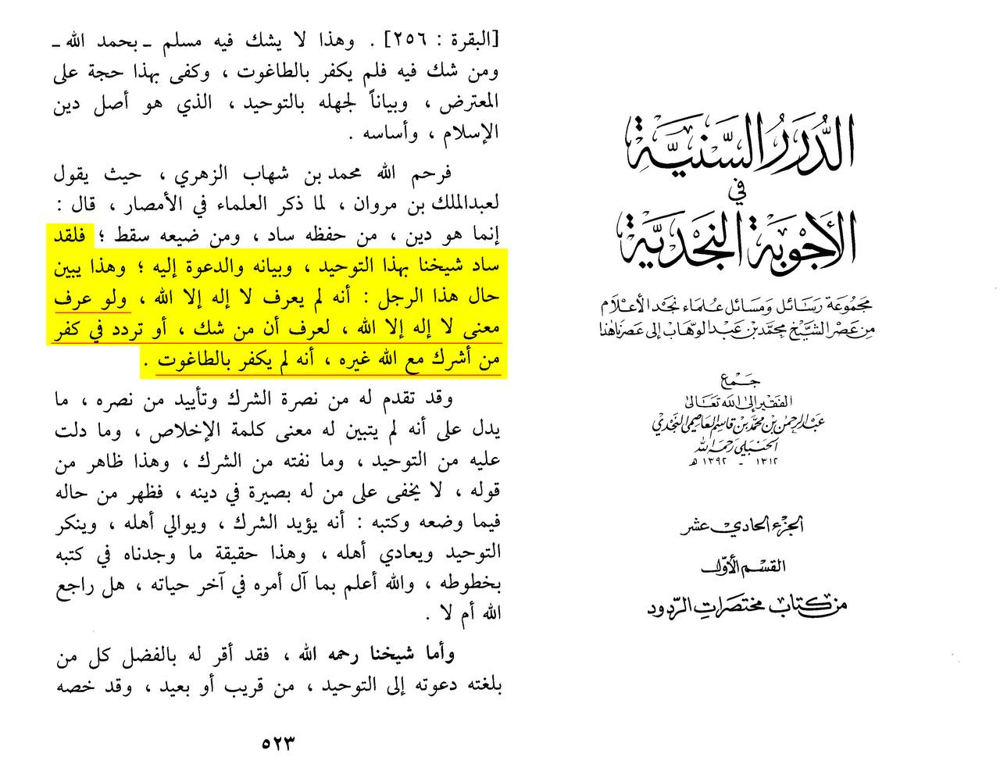

---

<!-- telegram-source: dar/messages4.html#message3711 -->
<!-- evidence-id: 000509 -->

Shaykh Abd ar-Raḥmān ibn Ḥasan Āl ash-Shaykh said:

His statement: “And that they not associate anything with Him” — meaning, that they single Him out in worship. Thus, it is necessary to be completely free from shirk in worship. Whoever does not purify himself from shirk has not truly performed worship of Allah alone. Rather, he is a mushrik, having set up a rival to Allah.

[Fatḥ al-Majīd by Shaykh Abd ar-Raḥmān ibn Ḥasan Āl ash-Shaykh p.28]

Show attached source scan

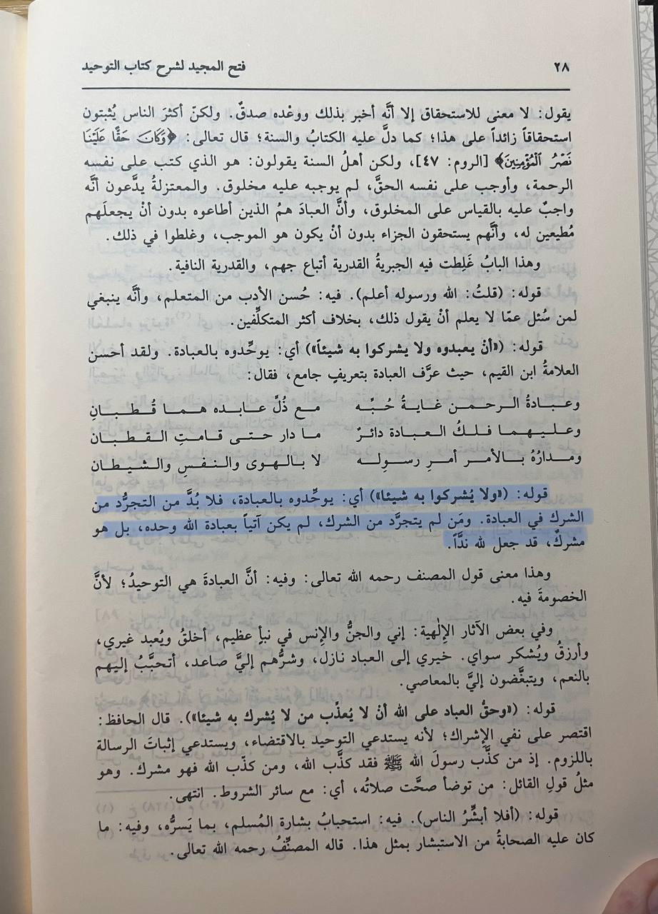

---

<!-- telegram-source: dar/messages5.html#message4988 -->
<!-- evidence-id: 000510 -->

Shaykh ʿAbd al-Laṭīf ibn ʿAbd al-Raḥmān ibn Ḥasan ibn ʿAbd al-Wahhāb said:

And whoever turns away from the speech of the ahl al-ʿilm, and holds that whoever prays or says “lā ilāha illā Allāh” is from ahl al-qiblah, even if there appears from him whatever appears of shirk and abandonment of the religion of Islam, then he has proclaimed against himself ignorance and misguidance, and has exposed what he truly possesses of knowledge and religion through this statement.

[Tuḥfat aṭ-Ṭālib wa-al-Jalīs fī Kashf Shubuh Dāwud bin Jirjīs by Shaykh ʿAbd al-Laṭīf ibn ʿAbd al-Raḥmān p.41]

Show attached source scan

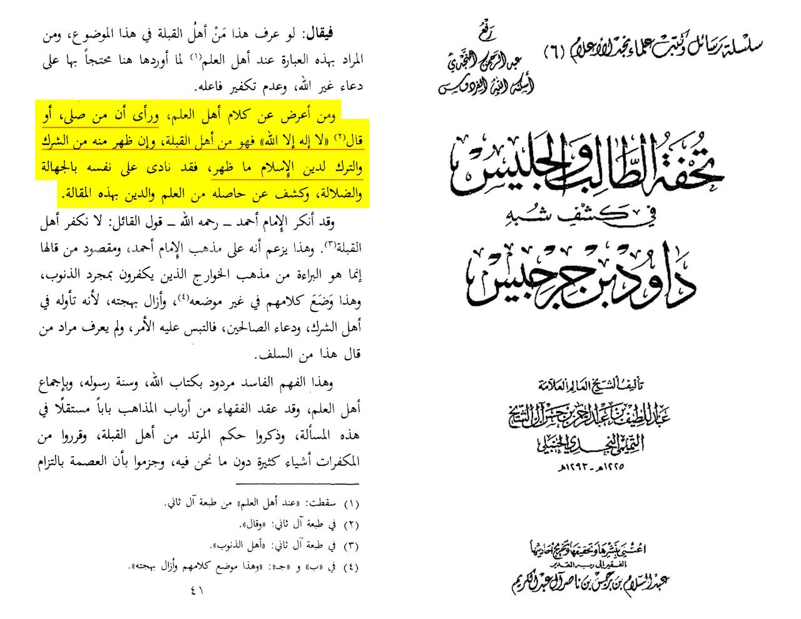

---

<!-- telegram-source: dar/messages5.html#message4308 -->
<!-- evidence-id: 000511 -->

Shaykh ʿAbd al-Laṭīf Āl al-Shaykh said:

Yes. If a mushrik says it (The Shahādah) and nothing appears from him that contradicts it, then he is someone from whom restraint is observed merely on the basis of that statement, and he is judged to have entered Islām.

But if it becomes apparent from him, and it is repeatedly seen, that he does not adhere to what it indicates of īmān in Allāh, His tawḥīd, and disbelief in what is worshipped besides Him, then he is not judged to be a Muslim, nor is he given any respect. The texts of the Qurʾān and the Sunnah, and the ijmāʿ of the Ummah, all indicate this.

So whoever truly identifies himself with Islam, loves Muḥammad ﷺ, follows him in his way, loves his noble Companions, and those who followed them from the scholars of the Sharīʿah, affirms decisively and without hesitation the kufr of whoever equates anyone with Allah besides Him, and makes du‘āʾ to others alongside Him from rivals and false gods.

Many people have been afflicted by this doubt and have gone astray because of it, thinking that merely pronouncing the shahādatayn prevents kufr. But Allah, Exalted is He, says: ‘And whoever calls upon besides Allāh another deity for which he has no proof - then his account is only with his Lord. Indeed, the disbelievers will not succeed.’ [al-Muʾminūn: 117] his kufr is from making du‘āʾ to other than Allah.

And He, Exalted is He, says: ‘And do not call upon besides Allāh that which neither benefits you nor harms you, for if you did, then indeed you would be of the wrongdoers.’ [Yūnus: 106].

And He, Exalted is He, says: ‘To Him [alone] is the supplication of truth. And those they call upon besides Him do not respond to them with a thing, except as one who stretches his hands toward water [from afar, calling it] to reach his mouth, but it will not reach it [thus].1 And the supplication of the disbelievers is not but in error.’ [ar-Raʿd: 14]

And in the ḥadīth as well, the Messenger of Allah ﷺ said: ‘I have been commanded to fight the people until they say: lā ilāha illā Allāh. If they say it, they protect from me their blood and their wealth except by its right.’ And in another narration: ‘except by the right of Islam.’

And the greatest right of Islam and its fundamental foundation is: worshipping Allah alone, and disbelieving in whatever is worshipped besides Him. This is what the word of sincerity indicates. So whoever says it while worshipping other than Allah, or arrogantly refusing to worship Allah, is contradicting himself, bearing witness against himself to kufr and shirk.

[Al-Ittiḥāf fī al-Radd ʿalā al-Ṣaḥāf by Shaykh ʿAbd al-Laṭīf Āl al-Shaykh p. 45-46]

Show attached source scan

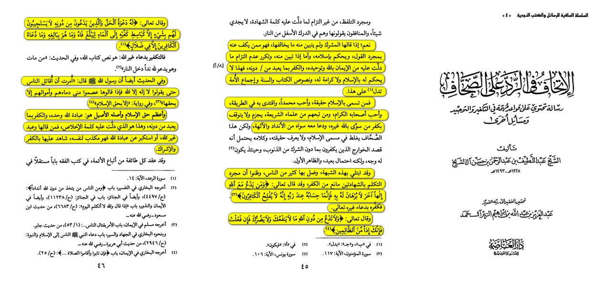

---

<!-- telegram-source: dar/messages4.html#message3428 -->
<!-- evidence-id: 000512 -->

Shaykh ʿAbd al-Laṭīf Āl al-Shaykh said:

As for if the one who performs takfīr of someone from this ummah bases his takfīr on a text and proof from the Book of Allāh and the Sunnah of His Prophet, and has seen clear kufr bawāḥ (manifest disbelief) — such as shirk with Allāh and worshipping other than Him, or mocking Him — Exalted is He — or His āyāt or His Messenger, or denying them, or hating what Allāh has sent down of guidance and the religion of truth, or rejecting the truth, or denying the attributes of Allāh and the descriptions of His majesty, and the like of that — then the one who performs takfīr with this is correct, rewarded, obedient to Allāh and His Messenger.

Allāh said: "And We certainly sent into every nation a messenger, [proclaiming]: ‘Worship Allāh and avoid the ṭāghūt.’ Among them were those whom Allāh guided, and among them were those upon whom misguidance was justified." [al-Naḥl: 36].

So whoever is not among the people of worshipping Allāh and affirming His attributes of perfection and the descriptions of His majesty, believing in what His messengers came with, avoiding every ṭāghūt that calls to other than what the messengers came with, then he is among those upon whom misguidance has been decreed, and he is not among those whom Allāh guided to faith in Him and in what His messengers came with from Him.

And takfīr for abandoning these uṣūl (foundations) and not believing in them is from the greatest pillars of the religion, known to everyone who has earnestness in knowing the religion of Islām. And the majority of what is in the Qurʾān is nothing but in establishing His rubūbiyyah (lordship), His attributes of perfection, His descriptions of majesty, the obligation of worshipping Him alone without partner, what He has prepared for His allies who responded to His messengers in the Hereafter, and what He has prepared for His enemies who disbelieved in Him and His messengers and took besides Him false gods and lords. And this is clear, by the praise of Allāh.

[ʿUyūn al-Rasāʾil wal-Ajwiba ʿalā al-Masāʾil by Shaykh ʿAbd al-Laṭīf Āl al-Shaykh 2/908-909]

Show attached source scan

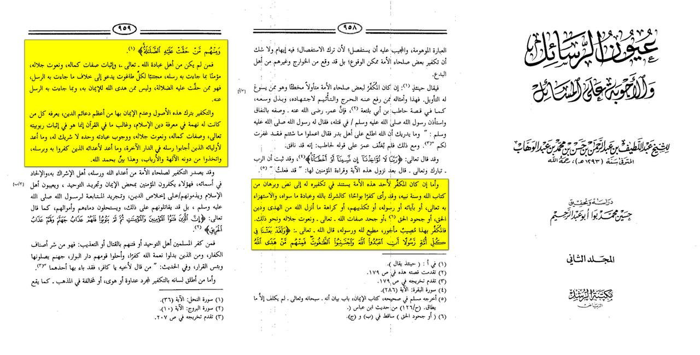

---

<!-- telegram-source: dar/messages5.html#message4549 -->
<!-- evidence-id: 000513 -->

Shaykh ʿAbd al-Laṭīf Āl ash-Shaykh said:

And despite that, al-ʿAllāmah Ibn al-Qayyim firmly stated the kufr of those who blindly imitate their shaykhs in matters that constitute kufr, if they were able to seek the truth and know it, and were qualified for that — yet they turned away and paid no attention. As for the one who was not able and not qualified to know what the Messengers brought, then according to him he is from the category of Ahl al-Fatrah — those to whom the call of a Messenger did not reach.

And both types are not judged to be Muslims, nor do they enter into the Label of “Muslims,” even according to those who did not declare some of them to be kuffār — and his statement regarding that will come to you. As for shirk, it applies to them, and its name includes them. And what Islām remains alongside contradicting its very foundation?

[Minhāj at-Taʾsīs wa at-Taqdīs fī Kashf Shubuhāt Dāwūd ibn Jirjis by Shaykh ʿAbd al-Laṭīf Āl ash-Shaykh p.99]

Show attached source scan

---

<!-- telegram-source: dar/messages4.html#message3359 -->
<!-- evidence-id: 000514 -->

Shaykh ʿAbd al-Laṭīf ibn ʿAbd al-Raḥmān said:

“As for the Tawḥīd of ʿIbādah (worship) and Ilāhiyyah (divinity), there is no disagreement among the people of Islām regarding what the Shaykh said, and what is established from him, of the ʿAqīdah to which he called. What clarifies this is that the foundation of Islām and its basis is the Shahādah: lā ilāha illā Allāh; and it is the foundation of Īmān in Allāh alone, and it is the best of the branches of Īmān. And this foundation must include: ʿIlm (knowledge), ʿAmal (action), and affirmation—by the Ijmāʿ of the Muslims.”

[al-Durar al-Saniyyah 12/529]

Show attached source scan

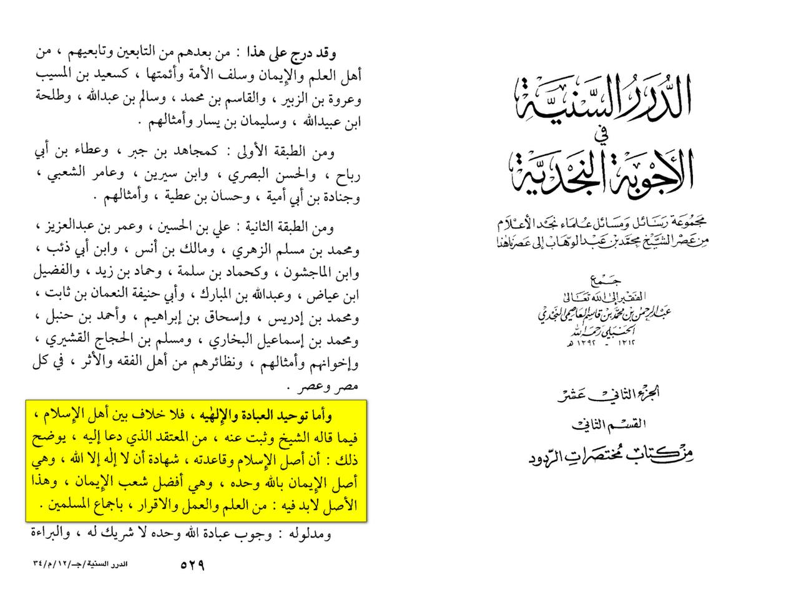

---

<!-- telegram-source: dar/messages5.html#message4582 -->
<!-- evidence-id: 000515 -->

Shaykh ʿAbd al-Laṭīf Āl ash-Shaykh said:

That is clarified as follows: The foundation of Islām and its basis is the shahādah — lā ilāha illā Allāh. It is the foundation of īmān in Allāh alone, and it is the best of the branches of īmān.

This foundation necessarily requires knowledge, action and affirmation, by the ijmāʿ of the Muslims.

Its meaning is the obligation of worshipping Allāh alone, without partner, and disavowing the worship of anything besides Him, whoever it may be. This is the wisdom for which mankind and jinn were created, for which the messengers were sent, and for which the books were revealed.

It includes complete humility and love, and it includes complete obedience and exaltation. This is the religion of Islām, which Allāh does not accept any religion other than it, neither from the earlier ones nor from the later ones.

All of the prophets are upon the religion of Islām. It entails submission to Allāh alone. Whoever submits to Him and to others besides Him is a mushrik, and whoever does not submit to Him is arrogant from His worship.

[Minhāj at-Taʾsīs wa at-Taqdīs fī Kashf Shubuhāt Dāwūd ibn Jirjis by Shaykh ʿAbd al-Laṭīf Āl ash-Shaykh p.162]

Show attached source scan

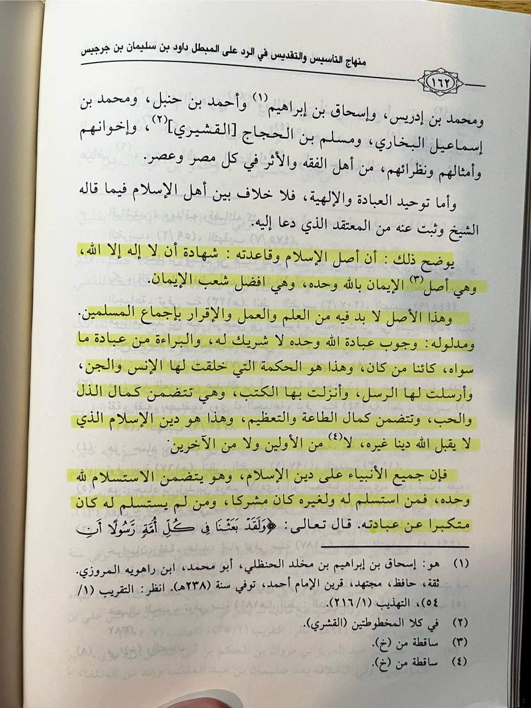

---

<!-- telegram-source: dar/messages4.html#message3821 -->
<!-- evidence-id: 000516 -->

Shaykh Ḥamad ibn ʿAtīq said:

Shaykh al-Islām (Ibn Taymiyyah) said: “Istighāthah is requesting relief, which means the removal of hardship.” Thus, istighāthah is the duʿāʾ of the distressed one, while duʿāʾ itself is broader in meaning, since it can come from both one in distress and one not in distress.

Duʿāʾ is of two kinds: duʿāʾ al-masʾalah (the supplication of asking) and duʿāʾ al-ʿibādah (the supplication of worship). Duʿāʾ al-masʾalah is asking for what benefits the supplicant, either by gaining some good or by removing some harm. The one who is truly worshipped must therefore have control over benefit and harm. That is why Allāh reproached those who worship other than Him — those who worship what possesses no power to bring benefit or avert harm. This is what the author intended.

As for duʿāʾ al-ʿibādah, it is to worship Allāh through the various acts of worship — such as ṣalāh, zakāh, sacrifice, and others — out of fear and hope: hoping for His mercy and fearing His punishment, even if there is no direct wording of request or petition. These two forms of duʿāʾ are inseparably linked: every duʿāʾ al-ʿibādah necessarily implies duʿāʾ al-masʾalah, and every duʿāʾ al-masʾalah inherently contains duʿāʾ al-ʿibādah.

In the Qurʾān, sometimes the term duʿāʾ refers to one of them, sometimes to the other, and sometimes to both together. For example, in His saying: “Call upon Me; I will respond to you.” (Sūrat Ghāfir: 60) — it has been interpreted in both senses: Some said, “Worship Me and obey My command, and I will answer you,” while others said, “Ask of Me, and I will give you.”

And there is ijmāʿ among the scholars that whoever directs any part of either type of duʿāʾ to other than Allāh has committed shirk — even if he says lā ilāha illā Allāh, Muḥammad rasūl Allāh, performs ṣalāh, fasts, and claims to be a Muslim.

[Ibṭāl at-Tandīd by Shaykh Ḥamad ibn ʿAtīq p.84-85]

Show attached source scan

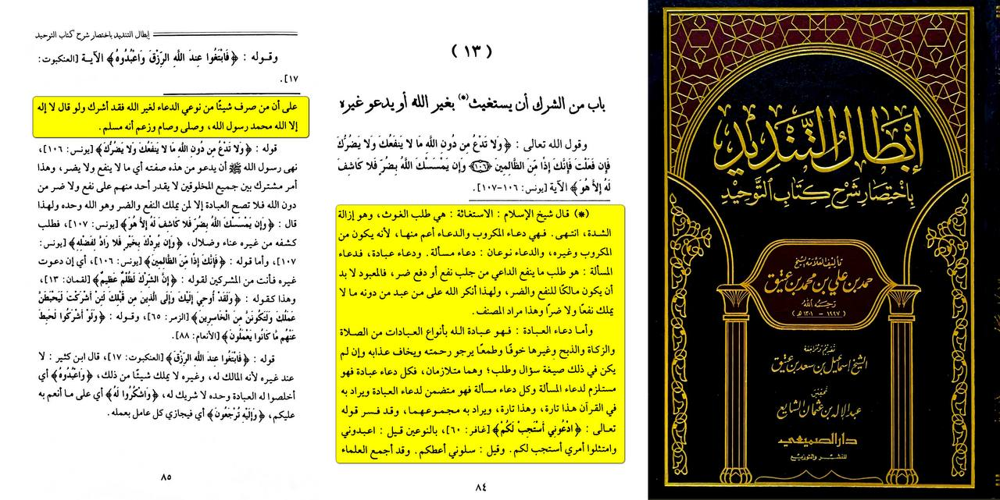

---

<!-- telegram-source: dar/messages5.html#message4992 -->
<!-- evidence-id: 000517 -->

Shaykh Muḥammad ibn ʿAbd al-Laṭīf and Shaykh Sulaymān ibn Saḥmān said:

And if it is established that duʿāʾ is ʿibādah (worship), then directing it to other than Allah is shirk. So whoever Makes du‘āʾ to anyone alongside Allah from the creation has committed shirk with Him, whether he wills or not.

Such as saying: “Yā Rasūl Allāh, yā Kaʿbat Allāh, yā Maqām Ibrāhīm,” or calling upon any of the prophets, the awliyāʾ, or the righteous. He is a mushrik committing shirk al-akbar which takes one out of the religion.

[ad-Durar as-Saniyyah 5/135]

Show attached source scan

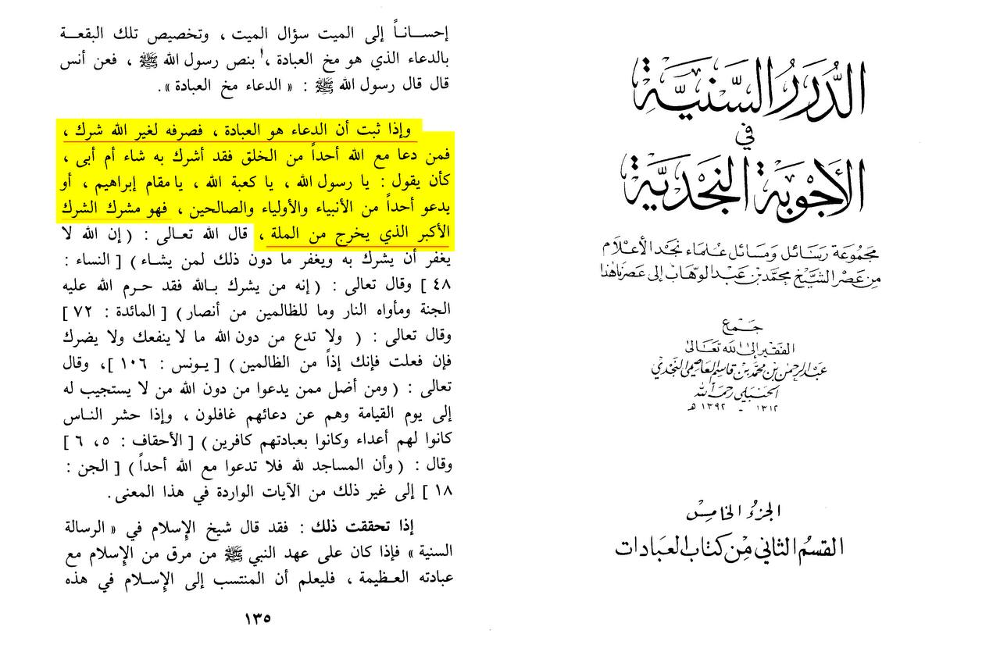

---

<!-- telegram-source: dar/messages4.html#message3927 -->
<!-- evidence-id: 000518 -->

al-ʿAllāmah Shaykh Sulaymān ibn Suḥmān said:

So the happiest people by the intercession of the Messenger of Allāh ﷺ are the people of tawḥīd who have devoted tawḥīd purely for Allāh and have purified it from all attachments of shirk.

These are the ones whom Allāh, Glorified and Exalted, is pleased with, as He says: “And they do not intercede except for those whom He is pleased with”

[al-Hadiyyah as-Saniyyah wa at-Tuḥfah an-Najdiyyah by Shaykh Sulaymān ibn Suḥmān p. 65]

Show attached source scan

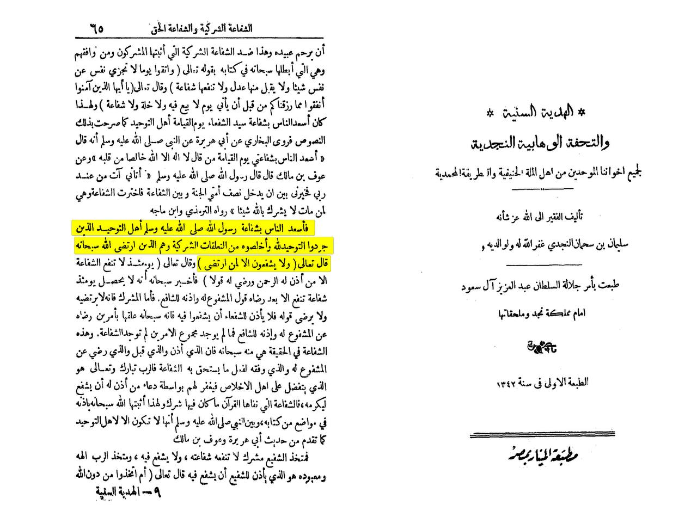

---

<!-- telegram-source: dar/messages5.html#message4604 -->
<!-- evidence-id: 000519 -->

Shaykh Sulaymān ibn Saḥmān said:

As for his statement: ‘The shuyūkh today say such-and-such and such-and-such,’ the answer is that we say: Yes, the shuyūkh today say that we do not make takfīr of the one whose outward appearance is Islām, and they do not apply kufr to all the people of the desert-dwellers who live among the people of Islām.

Rather, they say: whoever among them establishes the description of kufr is a kāfir—such as one who worships other than Allah, associates with Him any of the created beings, or seeks judgment from the ṭawāghīt and believes that their judgment is better and superior to the judgment of Allah and His Messenger, or mocks the religion of Allah and His Messenger, or denies the resurrection.

So whoever establishes this description we mentioned of the mukaffirāt (nullifiers that entail disbelief), and other matters that expel from the religion, whether in the desert or in settled lands, then he is a kāfir. As this was mentioned by Shaykh al-Islām Muḥammad ibn ʿAbd al-Wahhāb and other scholars—may Allah have mercy on them. And this is what we hold as religion before Allah in whatever desert or settled lands it may be.

Then if we were to begin mentioning what these people have introduced of bidʿah, exaggeration, and transgression of limits in the commands and prohibitions, the answer would become lengthy. The intelligent person proceeds and looks, and guidance and success are in the hand of Allah. Rather, what is required is giving excuse, warning, and clarifying the truth.

And whoever does not have the description of kufr established upon him, while he adheres to the outward laws of Islām, then he is a Muslim, and we do not declare him a kāfir for committing sins and acts of disobedience, nor for actions that do not expel him from the religion.”

[Minhāj Ahl al-Ḥaqq wal-Ittibāʿ by Shaykh Sulaymān ibn Saḥmān p. 20–21]

Show attached source scan

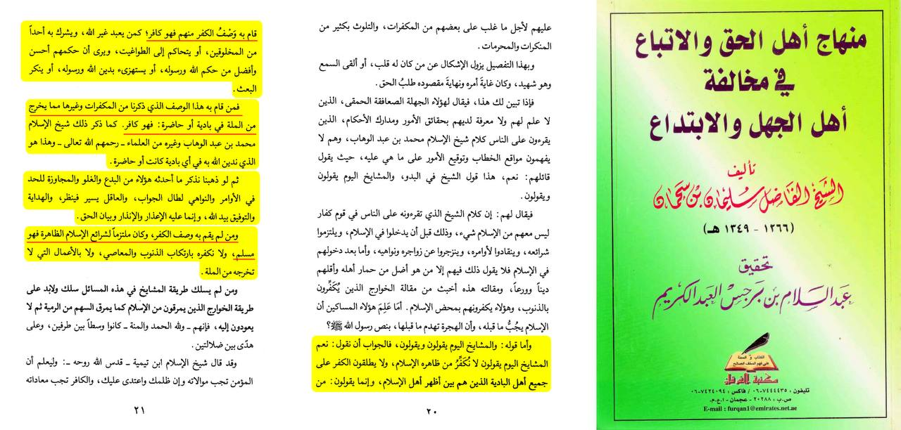

---

<!-- telegram-source: dar/messages5.html#message4418 -->
<!-- evidence-id: 000520 -->

Shaykh ʿAbd al-Raḥmān ibn Nāṣir al-Saʿdī said:

Among its virtues is that it makes it easy for the servant to do good and to abandon evil deeds, and it brings him comfort during calamities. For the one who is sincere to Allah in his īmān and tawḥīd, acts of obedience become light upon him because of what he hopes for of his Lord’s reward and pleasure.

And abandoning sins that the soul desires becomes easy for him because of what he fears of Allah’s anger and punishment.

And among its greatest virtues is that it frees the servant from the slavery of created beings, from attachment to them, from fearing them, hoping in them, and acting for their sake. This is true honor and the highest form of dignity.

Along with that, he becomes devoted and worshipful to Allah alone, hoping in none besides Him, fearing none except Him, and turning in repentance to none but Him. Through this, his success is completed and his ultimate triumph is realized.

[al-Qawl al-Sadīd Sharḥ Kitāb al-Tawḥīd p.24]

Show attached source scan

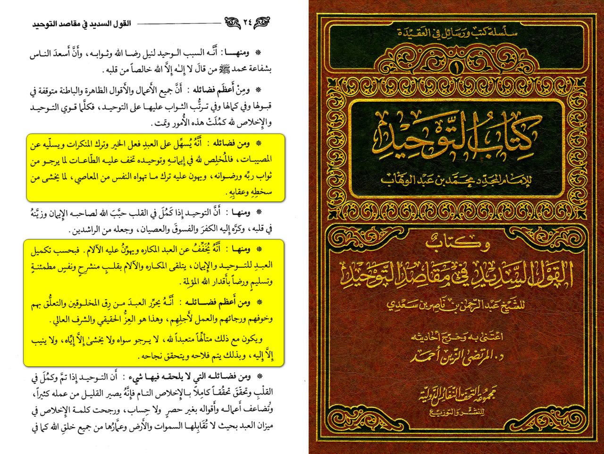

---

<!-- telegram-source: dar/messages5.html#message4586 -->
<!-- evidence-id: 000521 -->

Shaykh ʿAbd ar-Raḥmān as-Saʿdī said:

“That is, whoever worships Allāh by any religion other than the religion of Islām which Allāh has approved for His servants, then their action is rejected and not accepted, because the religion of Islām is the one that entails submission to Allāh with sincerity and obedience to His Messengers.

So whoever does not follow it does not achieve salvation from the punishment of Allāh nor attainment of His reward, and every other religion besides it is false.”

[Taysīr al-Karīm al-Raḥmān by as-Saʿdī 1/137]

Show attached source scan

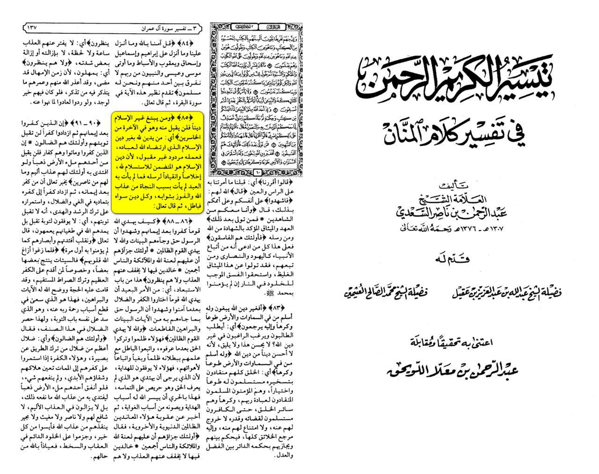

---

<!-- telegram-source: dar/messages5.html#message4833 -->
<!-- evidence-id: 000522 -->

Shaykh Muḥammad ibn Ibrāhīm Āl ash-Shaykh said:

And the ḥadīth indicates teaching by gradual stages: beginning with the most important, then the next most important. So when tawḥīd is established—namely the testimony lā ilāha illā Allāh and that Muḥammad is the messenger of Allāh—then the ṣalāh is requested from them. If they pray, they become Muslimīn; otherwise they are not Muslims. Thus their refusal becomes something that nullifies what had come from them of Islām.

[Sharḥ Kitāb at-Tawḥīd by Shaykh Muḥammad ibn Ibrāhīm 1/293-294]

Show attached source scan

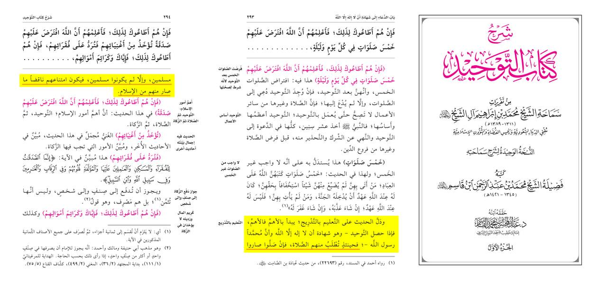

---

<!-- telegram-source: dar/messages5.html#message4627 -->
<!-- evidence-id: 000523 -->

Shaykh Muḥammad ibn Ibrāhīm Āl ash-Shaykh said:

What saves the soul and what is its price?

It is tawḥīd. The one which frees it from the punishment of Allah is the testimony: lā ilāha illā Allāh, and what follows it: knowledge, belief, acceptance, and submission to its rights. That is why this was his daʿwah.

In summary: this is its price — the one that saves it from the punishment of Allah — nothing else.

[Sharḥ Kitāb at-Tawḥīd by Shaykh Muḥammad ibn Ibrāhīm 2/96]

Show attached source scan

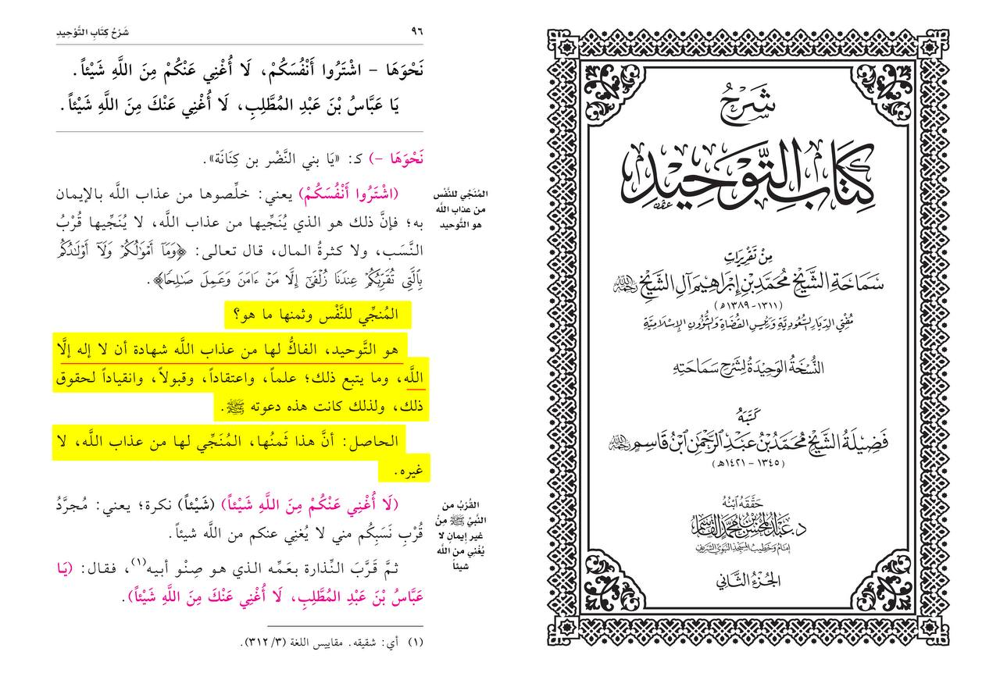

---

<!-- telegram-source: personal/messages.html#message541 -->
<!-- evidence-id: 000524 -->

Shaykh Muḥammad ibn Ibrāhīm Āl ash-Shaykh said:

“That you worship Allah", meaning: Him alone. For worship that is not upon tawḥīd is not worship. Indeed, the one whose worship is not entirely for Allah is not a worshipper of Allah; rather he is a mushrik kāfir, a worshipper of Shayṭān, and it is negated from Allah.”

[Sharḥ Kitāb at-Tawḥīd by Shaykh Muḥammad ibn Ibrāhīm 1/182]

Show attached source scan

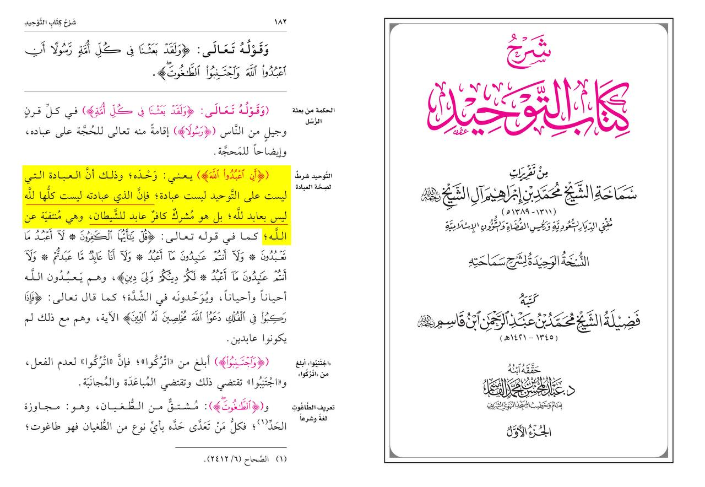

---

<!-- telegram-source: dar/messages5.html#message4373 -->
<!-- evidence-id: 000525 -->

Shaykh Muḥammad ibn Ibrahim said:

“The Islām of the majority is nominal Islam, for most of those affiliated with it in this time are called ‘Muslims’ only by name, in contrast to the Jews and Christians. Whoever is found to have something that nullifies it, then his Islam is merely Islam-in-name, with no love and no honor.

Is it imagined that those who were pleased with idols, worshipped them, protected them, collected levies for them, and enforced al-qawānīn (man-made laws)—is there, after this, any Islām? What is this except the kufr that the Prophet ﷺ was sent to demolish? And even the smallest among you knows that whoever enters Islām remains upon it only as long as he maintains it; rather, if he nullifies it, he exits it. And the chapter on the ruling of the apostasy is well known and explained—there is ijmāʿ among the people of knowledge that apostasy is of two types.”

“But what the Prophet ﷺ informed of has occurred, in his saying: ‘A people will come who will regard wine as permissible, calling it by other than its name.’ It has happened: they regarded shirk as permissible and called it by other than its name, saying: ‘tawassul’ and ‘tashaffuʿ.’ But it is the very tawassul and tashaffuʿ of the mushrikīn.”

[Fatāwā wa Rasāʾil by Shaykh Muḥammad ibn Ibrāhīm 1/77]

Show attached source scan

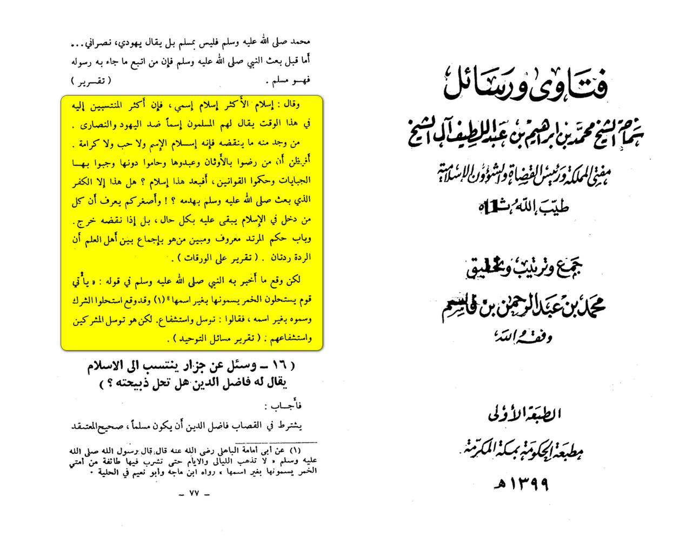

---

<!-- telegram-source: dar/messages5.html#message4617 -->
<!-- evidence-id: 000526 -->

Shaykh Muḥammad ibn Ibrāhīm Āl ash-Shaykh said:

“From ʿUbādah ibn al-Ṣāmit, who said: The Messenger of Allah ﷺ said: ‘“Whoever testifies that lā ilāha illā Allāh”’—knowing its meaning, acting upon what it necessitates, inwardly and outwardly.

The shahādah requires knowledge of what is testified to; if it were out of ignorance, it would not be a testimony (a shahādah).

It requires certainty; if it were out of doubt, it would not be a testimony.

It requires truthfulness; therefore the deeds of those who act differ greatly according to what is in the heart. Whoever’s deeds are lesser, that is according to the deficiency of his affirmation.

It requires acting upon it. The one who does not act upon what he testified to—that is, what he conceives in his heart—his abandonment of action is a witness that he did not testify with his heart. For if he truly testified, he would never abandon it, necessarily.

The mushrikūn say: ‘Lā ilāha illā Allāh,’ while their tongues and actions say: so-and-so is the ilāh. Thus they directed themselves to the soul of the religion and its foundation and nullified it. They say: "we pray, we fast, and we testify lā ilāha illā Allāh, and so on,” yet they opposed the foundation of the religion.

So whoever affirms it verbally and rejects it in meaning—by being contrary to it—he is a apostate, and he is greater than the kāfir aṣlī (original disbeliever). Therefore the grave-worshippers in these times are kuffār murtaddūn (apostate disbelievers), because they knew and rejected its meaning.

Thus it becomes clear that knowledge of it, acting upon it, and truthfulness are necessary.

By knowledge, one is saved from the path of the Christians—which is misguidance. By action, one is saved from the path of the Jews. And by truthfulness one is saved from the path of the hypocrites.”

[Sharḥ Kitāb at-Tawḥīd by Shaykh Muḥammad ibn Ibrāhīm 1/221-222]

Show attached source scan

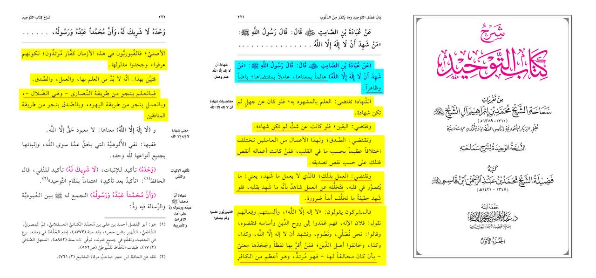

---

<!-- telegram-source: dar/messages5.html#message4624 -->
<!-- evidence-id: 000527 -->

Shaykh Muḥammad ibn Ibrāhīm Āl ash-Shaykh said:

“Meaning: if that occurs from him in utterance (of the Shahādah), with knowledge of the meaning, belief in it, acting upon it, and believing that the worship of other than Allah is kufr, and declaring takfīr upon the worshippers of other than Allah—then this protects his blood and wealth outwardly. As for the inward, none knows it except Allah.

These are six matters. Whoever brings them outwardly has brought what protects his blood and wealth. If his outward corresponds to his inward, he will also be prevented from entering the Fire. But if his inward is contrary to his outward, then his ruling is the ruling of the munāfiqīn, who obtained protection of blood and wealth in this world, while in the Hereafter they will be among the party of Iblīs, in the lowest depth of the Fire, abiding therein forever.”

[Sharḥ Kitāb at-Tawḥīd by Shaykh Muḥammad ibn Ibrāhīm 1/341]

Show attached source scan

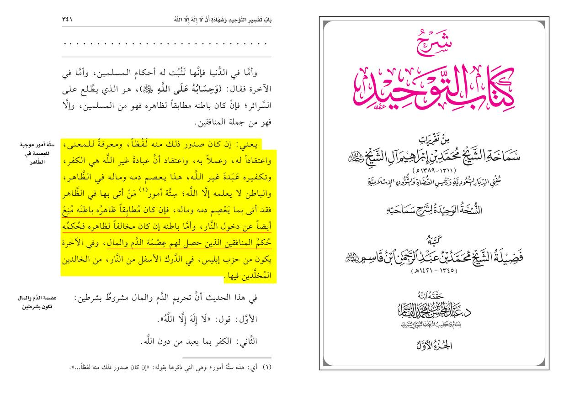

---

<!-- telegram-source: personal/messages.html#message742 -->
<!-- evidence-id: 000528 -->

Shaykh ʿAbd ar-Raḥmān ibn Qāsim an-Najdī said:

And calling those who Make du‘āʾ to the prophets, the righteous, the graves, and others besides them “believers” and “people of tawḥīd” is falsehood and tremendous ignorance concerning the limits of what Allah revealed to His Messenger ﷺ, and it is kufr in Allah and His Messenger. It is also a reversal of the legal meanings and of what is intended by īmān, Islām, shirk, and kufr.

And if the people of shirk in Allah and the worshippers of graves are the believing muwaḥḥidūn, then whoever condemned that and declared its people to be kuffār would indeed be astray, and this is the necessary implication of his statement.

But Allah the Exalted said: "They who believe and do not mix their belief with injustice " meaning: shirk, "those will have security, and they are [rightly] guided." And this is the judgment of the Most Wise of judges, not the judgment of the one who makes the people of shirk into believing muwaḥḥidūn.

And this category of people has been overpowered by Shayṭān, such that they think well of themselves and believe that they are muwaḥḥidūn and believers, while in reality they are mushrikūn, callers to shirk in Allah and to false corrupt creeds innovated into the religion, and followers of a path other than the path of the believers.

[as-Sayf al-Maslūl ʿalā ʿĀbid ar-Rasūl by Shaykh ʿAbd ar-Raḥmān ibn Qāsim an-Najdī p.153]

Show attached source scan

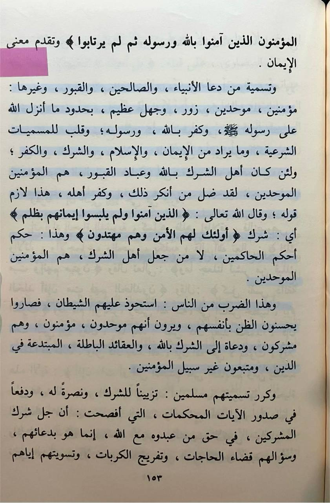

---

<!-- telegram-source: dar/messages4.html#message3585 -->
<!-- evidence-id: 000529 -->

Shaykh ʿAbd ar-Raḥmān ibn Qāsim an-Najdī said:

So when we declare as disbelievers those whom Allāh and His Messenger have declared disbelievers—those who worship alongside Allāh others, or who call to the worship of others besides Him—we are not declaring the Muslim ummah to be disbelievers. For the kāfir is the opposite of the Muslim, and whoever worships alongside Allāh another deity is not called a Muslim, nor does he enter under the name of the Muslims.

But this objector does not know the reality of Islām, nor the difference between Muslims and mushrikīn, nor the rank of the call to tawḥīd. Rather, to him mere affiliation with Islām—while also calling upon others besides Allāh and engaging in explicit shirk with the Prophets, the righteous, the feeble-minded, the insane, trees, or devils—is sufficient for Islām. That, in his view, is the religion, and even the Islamic ummah itself.

[as-Sayf al-Maslūl ʿalā ʿĀbid ar-Rasūl by Shaykh ʿAbd ar-Raḥmān ibn Qāsim an-Najdī p.20]

Show attached source scan

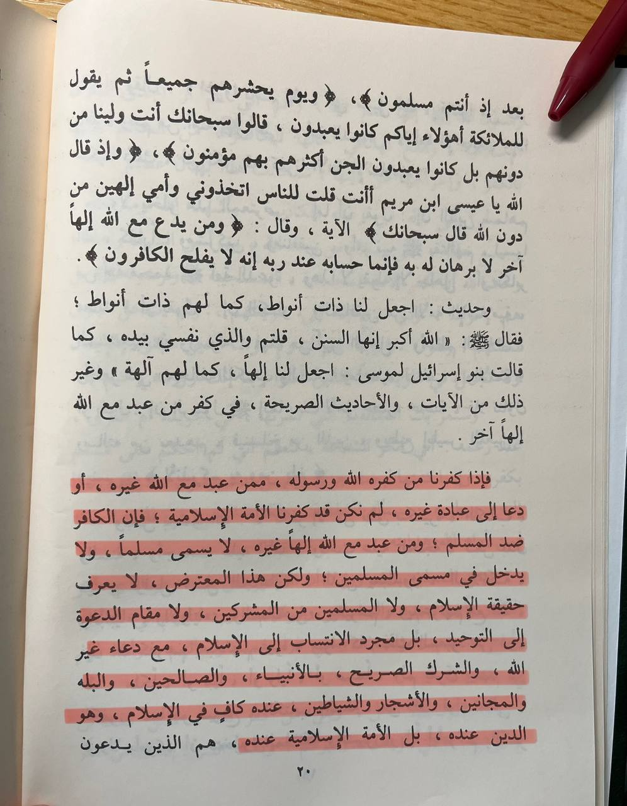

---

<!-- telegram-source: dar/messages5.html#message5090 -->
<!-- evidence-id: 000530 -->

The advice of Shaykh ʿAbd ar-Raḥmān ibn Qāsim an-Najdī

Shaykh ʿAbd ar-Raḥmān ibn Qāsim an-Najdī said:

So seek refuge, seek refuge in the fortress of the religion; and beware, beware of its enemies, the renegades who oppose what the messengers of the Lord of the worlds came with. And hasten, hasten in clarifying the clear shirk they (meaning the grave worshippers) have brought.

For indeed, among the greatest acts drawing one near to Allah is hating these people who oppose Allah and His Messenger and strive to turn others away from His path; and clarifying the misguidance they have come with.

And the most obligatory form of jihād is striving against them, with proof and clarification, and with the sword and spear according to one’s ability. And Allah is the One whose help is sought.

[as-Sayf al-Maslūl ʿalā ʿĀbid ar-Rasūl by Shaykh ʿAbd ar-Raḥmān ibn Qāsim an-Najdī p.47]

Show attached source scan

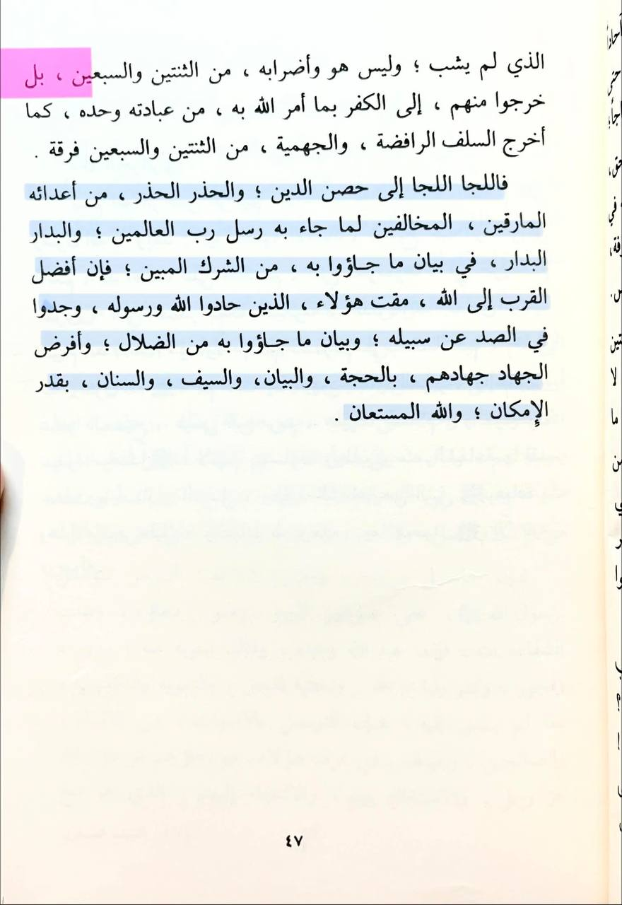

---

<!-- telegram-source: dar/messages4.html#message3602 -->
<!-- evidence-id: 000531 -->

Shaykh ʿAbd ar-Raḥmān ibn Qāsim an-Najdī said:

So seek refuge, seek refuge in the fortress of the religion. And beware, beware of its enemies — those renegades who oppose what the messengers of the Lord of the worlds brought.

Hasten, hasten to clarify what they came with of clear shirk. For the best of acts of nearness to Allāh is to show enmity toward those who have opposed Allāh and His Messenger ﷺ, striving to block people from His path, and to expose the misguidance they promote.

And the most obligatory form of jihād is to strive against them — with proof, with clarification, and with the sword and the spear to the extent possible. And Allāh is the One whose help is sought.

[as-Sayf al-Maslūl ʿalā ʿĀbid ar-Rasūl by Shaykh ʿAbd ar-Raḥmān ibn Qāsim an-Najdī p.47]

Show attached source scan

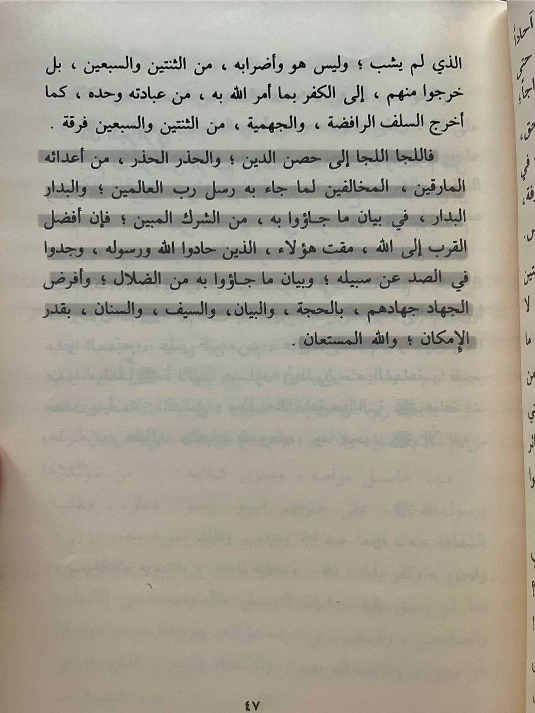

---

<!-- telegram-source: dar/messages5.html#message4897 -->
<!-- evidence-id: 000532 -->

Ruling on those who do not takfir the Mushrikīn mentioned by some of the scholars of Najd by Shaykh ʿAbd ar-Raḥmān ibn Qāsim an-Najdī

---

<!-- telegram-source: dar/messages4.html#message3983 -->
<!-- evidence-id: 000533 -->

Shaykh Ibn Bāz said:

“And do not call upon besides Allāh that which neither benefits you nor harms you, for if you did, then indeed you would be of the wrongdoers.” (Yūnus: 106). That is, from the mushrikīn and the kāfirīn, they are the wrongdoers.

Allāh has made clear that whoever calls upon anyone besides Allāh who cannot benefit or harm – and this is a general description for all creations that cannot benefit or harm independently, and whose benefit and harm are only by Allāh alone – whoever calls upon others besides Allāh is a mushrik.

The exception to this is du‘āʾ to the Living, All-Powerful, Present Allāh; this is not considered shirk by the ijmāʿ of the Muslims.

[Sharḥ Kitāb at-Tawḥīd by Shaykh Ibn Bāz p.54]

Show attached source scan

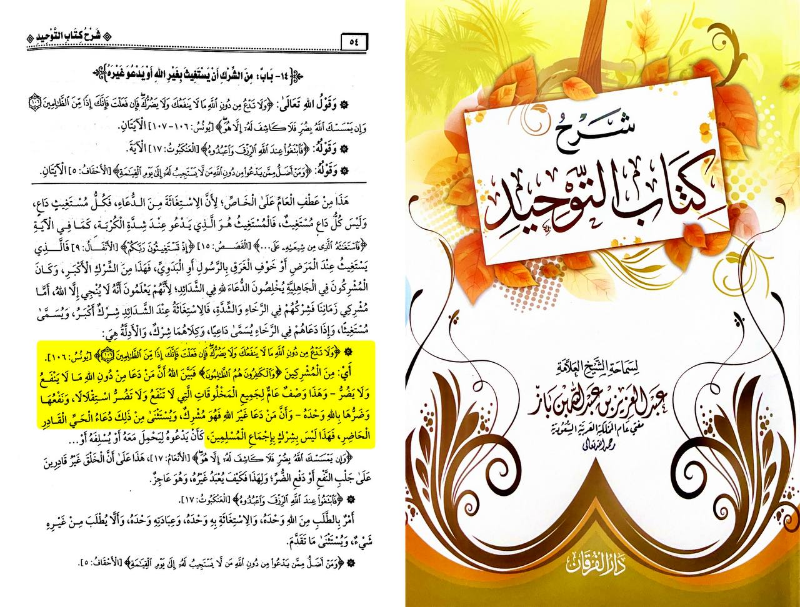

---

<!-- telegram-source: personal/messages.html#message538 -->
<!-- evidence-id: 000534 -->

Shaykh Ibn Bāz said:

The one who knows the kāfir and the falsehood he is upon, yet does not declare him a kāfir or doubts his kufr, then the meaning of that is that he is denying Allāh and His Messenger and is not believing in what Allāh has ruled regarding them of kufr — such as the Jews and the Christians. They are kuffār by the explicit text of the Qurʾān and the explicit text of the Sunnah.

So it is obligatory upon the mukallafīn (legally responsible Muslims) to hold the belief that they are kuffār and misguided. Whoever does not declare them as kuffār or doubts their kufr is like them, because he is denying Allāh and His Messenger and doubting what Allāh and His Messenger have informed about.

[Subul as-Salām Sharḥ Nawāqiḍ al-Islām by Shaykh Ibn Bāz p.105]

Show attached source scan

---

<!-- telegram-source: dar/messages4.html#message3725 -->
<!-- evidence-id: 000535 -->

Shaykh Ibn ʿUthaymīn was asked:

Question: What is shirk al-khafī (hidden shirk)? What is the difference between it and shirk al-asghar (minor shirk)? And how can a Muslim rid himself of it?

Answer: Shirk is divided into three types: shirk al-akbar (major shirk), shirk al-asghar, and shirk al-khafī.

shirk al-akbar is when a person directs any act of worship to other than Allāh, exalted is He. Among the greatest acts of worship is duʿāʾ. So if a person calls upon anyone other than Allāh — such as a prophet, a saint, an angel, the sun, or the moon — seeking benefit or removal of harm, then he has committed shirk al-akbar with Allāh. Likewise, if he bows or prostrates to an idol, the sun, the moon, or the occupant of a grave, he has committed shirk al-akbar that expels him from Islām — we seek refuge with Allāh.

Allāh says: “Indeed, whoever associates others with Allāh — Allāh has forbidden Paradise for him, and his abode will be the Fire. And for the wrongdoers there are no helpers.” (Sūrah al-Mā’idah, 5:72)

This applies to outward actions. Similarly, if one inwardly believes that anyone shares with Allāh in His creation or has the power to do what only Allāh can do, he too is guilty of shirk al-akbar.

shirk al-asghar is what is less than shirk al-akbar. An example is when a person swears by other than Allāh — not believing that the one sworn by deserves the same reverence as Allāh, but doing so out of veneration or habit. This is shirk al-asghar. The Prophet ﷺ said: “Whoever swears by other than Allāh has committed disbelief or shirk.” It is prohibited — whether one swears by the Prophet ﷺ, Jibrīl, or anyone else among creation — and it constitutes shirk al-asghar.

shirk al-khafī refers to that which lies within the heart and is known only to Allāh. It may be major or minor. If a person associates another with Allāh in his heart, believing that other to be equal to Allāh in His rights or actions, then this is shirk al-akbar— even if hidden from people. If a person performs acts of worship for Allāh but mixes them with riyāʾ (showing off), then this is shirk al-khafī that is asghar, because it is concealed from people yet does not expel one from Islām.

Question: How can a Muslim rid himself of shirk?

Answer: Deliverance from both major and minor shirk is through sincere repentance to Allāh, returning to Him, and adhering firmly to His commands while avoiding His prohibitions. Through steadfastness and sincerity in obedience, Allāh protects His servant from falling into shirk.

<video class="source-video" controls preload="metadata" src="assets/videos/dar-messages4-3725.mp4"></video>

Video source from the Telegram export.

---

<!-- telegram-source: dar/messages3.html#message2727 -->
<!-- evidence-id: 000536 -->

Shaykh Ibn ʿUthaymīn said:

What the author intends here is Tawḥīd al-ʾUlūhiyyah — the oneness of Allah in worship — and this is the aspect in which the polytheists went astray, those whom the Prophet ﷺ fought, whose blood, wealth, lands, and homes he deemed lawful, and whose women and children he took as captives. This type of tawḥīd is also the one most frequently addressed by the messengers in their dealings with their people. Allah the Exalted said: “And We certainly sent into every nation a messenger, [saying], ‘Worship Allah and avoid false gods.’” (Surah al-Naḥl, 16:36)

Worship is not valid except when directed solely to Allah, the Mighty and Majestic. Whoever falls short in this aspect of tawḥīd is a mushrik kāfir, even if he affirms tawḥīd al-rubūbiyyah and tawḥīd al-asmāʾ wa al-ṣifāt.

Suppose, for example, that a man fully affirms Allah’s lordship and His names and attributes, but then goes to a grave and worships the one buried in it, or makes a vow of sacrifice to draw near to him — such a person is a mushrik kāfir, eternally in the Hellfire.

Allah said: “Indeed, whoever associates others with Allah — Allah has forbidden him Paradise, and his refuge is the Fire. And the wrongdoers will have no helpers.” (Surah al-Māʾidah, 5:72) Tawḥīd is the greatest command that Allah has given, because it is the foundation upon which the entire religion is built. For this reason, the Prophet ﷺ began his call to Allah with it, and he instructed those whom he sent to call others to Islam to begin with it as well.

The Prophet ﷺ said: “Whoever dies while calling upon anything besides Allah as a rival will enter the Fire.” (Narrated by al-Bukhārī) The author, may Allah have mercy on him, cited as evidence Allah’s command to worship Him and prohibition against associating partners with Him, in His statement: “Worship Allah and do not associate anything with Him.” (Surah al-Nisāʾ, 4:36) So, Allah the Exalted commands His worship and forbids shirk. This entails affirming worship exclusively for Him alone.

Whoever does not worship Allah is a disbelieving arrogant one; Whoever worships Allah and others along with Him is a disbelieving polytheist; And whoever worships Allah alone is a sincere Muslim.

[Sharḥ Thalāthat al-Uṣūl by Shaykh ibn ʿUthaymīn p.40-42]

Show attached source scan

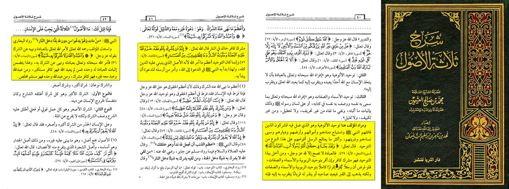

---

<!-- telegram-source: dar/messages4.html#message4218 -->
<!-- evidence-id: 000537 -->

Shaykh Ibn ʿUthaymīn was asked:

Q: Is it permissible to give zakāh to a Muslim who supplicates to other than Allāh, swears by other than Allāh, circumambulates graves, and believes that the righteous have the power to bring benefit and harm?

A: rather, the one described in the question is a mushrik, a kāfir. Allāh does not accept ṣalāh, fasting, ṣadaqah, or anything else from him.

Whoever makes du‘āʾ to other than Allāh is a mushrik, and whoever worships graves is a mushrik. Such a person is not to be given zakāh. Rather, he is to be called to Islām and taught tawḥīd. If he accepts it, then that is what is sought; otherwise, it is upon the ruler to carry out concerning him what the Sharīʿah requires.

As for the one who swears by other than Allāh, he may be given zakāh, because swearing by other than Allāh does not expel one from the religion, even though it is shirk. He may be given zakāh, and he should be advised and taught that swearing by other than Allāh is a type of shirk, so that Allāh may guide him.

<video class="source-video" controls preload="metadata" src="assets/videos/dar-messages4-4218.mp4"></video>

Video source from the Telegram export.

---

<!-- telegram-source: dar/messages5.html#message4244 -->
<!-- evidence-id: 000538 -->

Shaykh Ṣāliḥ al-Luḥaidān said:

When the Companions heard the saying of Allah Most High: “Those who believe and do not mix their belief with Zûlm (injustice) - those will have security, and they are [rightly] guided.” (al-Anʿām 6:82), that was difficult for them, and they thought that what was meant by the verse was that they wrong themselves by actions they commit.

So they said: “O Messenger of Allah, which of us does not wrong himself?” He said: “It is not that. Rather, it is shirk. Have you not heard what Luqmān said to his son while advising him: ‘O my son! Join not in worship others with Allâh. Verily joining others in worship with Allâh is a great Zûlm’ (Luqmān 31:13).”

Thus, the great ẓulm — which, if it enters a righteous act by which Allah is worshipped, corrupts it — is shirk.

For this reason, whoever dies upon Shirk al-akbar has no hope of forgiveness, and it is not valid for one who knows that he died upon Shirk al-akbar to make du‘āʾ to Allah for him, because Allah, Glorified and Exalted, has forbidden that: “It is not for the Prophet and those who have believed to ask forgiveness for the Mushrikīn, even if they were relatives, after it has become clear to them that they are companions of Hellfire.” (al-Tawbah 9:113).

So if a person knows that someone died upon Shirk al-akbar — even if he was a close relative, even if he was a brother, a close friend, an intimate companion, and so on — it is not permissible for him to seek forgiveness for him.

[Sharḥ Kitāb at-Tawḥīd by Shaykh Ṣāliḥ al-Luḥaydān p.65]

Show attached source scan

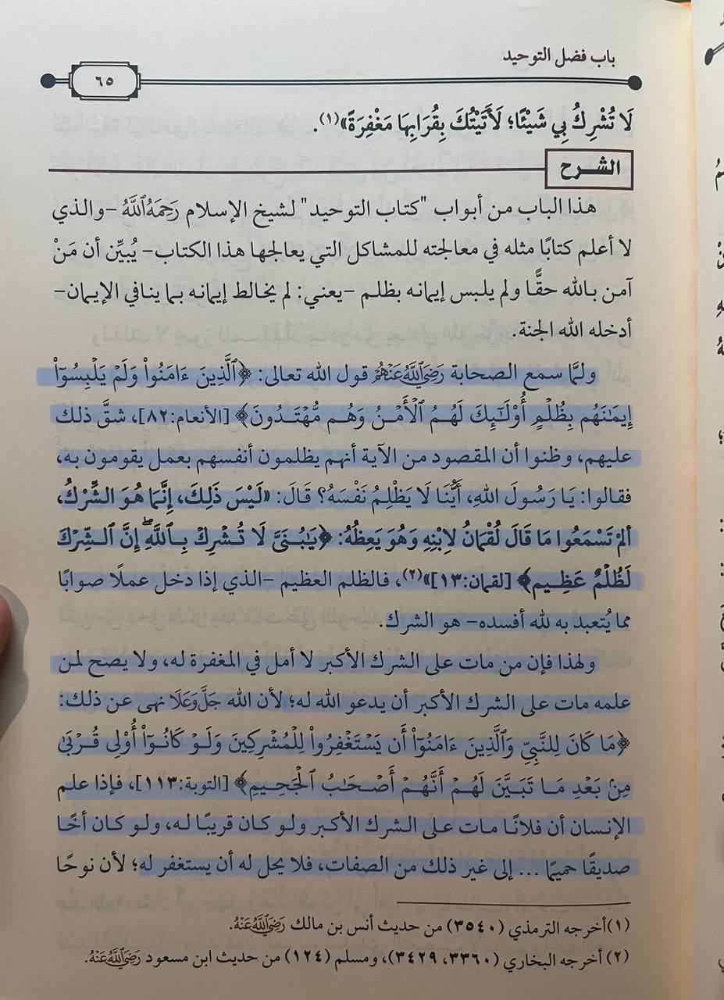

---

<!-- telegram-source: dar/messages4.html#message3345 -->
<!-- evidence-id: 000539 -->

Shaykh al-Luḥaydān was asked:

Questioner: May Allah be good to you. He says: Is the one who says, “Grave-worshipers are our brothers”, considered a disbeliever?

Shaykh: If the grave-worshipers have become brothers to this person who says so, then there is no polytheist on earth more disbelieving than him. Allah says: “You will not find a people who believe in Allah and the Last Day loving those who oppose Allah and His Messenger” [al-Mujādilah 58:22].

The opposition to Allah—its highest and most terrible form—is shirk. The Prophet ﷺ was asked: “Which sin is greatest?” He said: “That you set up a rival to Allah while He created you.”

And from the words of Luqmān: “Indeed, shirk is a tremendous wrong.”

So those who worship the graves with acts of worship are not brothers to the Muslim. If someone makes them his brothers, then his religion is corrupted. The issue is not merely that they say, “Lā ilāha illā Allāh.” The bare utterance of Lā ilāha illā Allāh—while openly contradicting it through worship of others besides Him—does not benefit one in the least.

---

<!-- telegram-source: dar/messages5.html#message5059 -->
<!-- evidence-id: 000540 -->

Fatwā no. (10684):

Q: What is the dividing line between kufr and Islam? And does the one who pronounces the shahādatayn, then comes with actions that contradict them, enter among the Muslims despite his ṣalāh and his outward state?

A: The dividing line between kufr and Islam is pronouncing the shahādatayn along with truthfulness, sincerity, and acting according to what they necessitate. So whoever fulfills that is a Muslim believer.

As for the one who commits hypocrisy, then he neither affirmed truthfully nor sincerely, so he is not a believer.

Likewise, the one who pronounces them while coming with what contradicts them from shirk, such as one who seeks istighāthah through the dead in hardship or ease, or one who gives preference to judging by man-made laws over judging by what Allah revealed, or one who mocks the Qurʾān or what is authentically established from the Sunnah of the Messenger of

Allah ﷺ, then this person is a kāfir, even if he pronounces the shahādatayn and prays and fasts.

And with Allah is success. May Allah send prayers and peace upon our Prophet Muḥammad, his family, and his Companions.

The Permanent Committee for Scholarly Research and Fatwā :

Chairman: ʿAbd al-ʿAzīz ibn Bāz

Vice Chairman: ʿAbd al-Razzāq ʿAfīfī

Member: ʿAbd Allāh ibn Ghadayyān

[Fatāwā al-Lajnah al-Dāʾimah — First Collection 2/45–46]

Show attached source scan

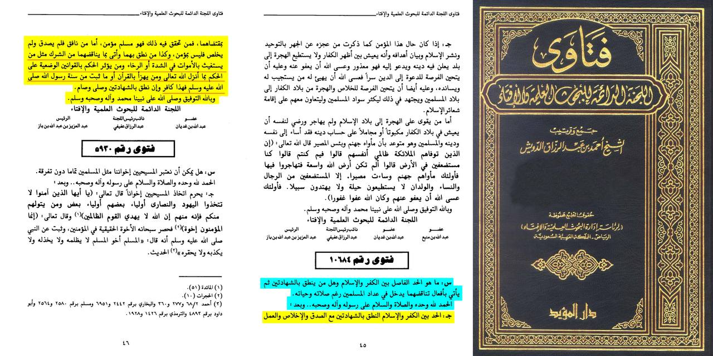

---

<!-- telegram-source: dar/messages2.html#message1179 -->
<!-- evidence-id: 000541 -->

Q10: Some of the devout youth of today claim that all or most of those who fall into shirk in the Islamic world today are not considered polytheists; because they are either great scholars who, through their ijtihad, have concluded that seeking help from others besides Allah is permissible, as did al-Suyūṭī, al-Nabhānī, and others. This is said to have two rewards: one if correct, and one if wrong. Alternatively, they are ordinary laypeople, and this is the utmost they are capable of.

A10: The excused mistake is one in theoretical matters of ijtihad, not one in matters that have been established by explicit texts or in what is known to be a part of the religion by necessity.

And Allah grants success. May peace and blessings be upon our Prophet Muhammad, his family, and his companions.

‘Abd al-Razzaq ‘Afīfī… ‘Abd al-‘Azīz ibn ‘Abd Allāh ibn Bāz

[Fatāwā al-Lajnah al-Dā’imah 2/59-60]

Show attached source scan

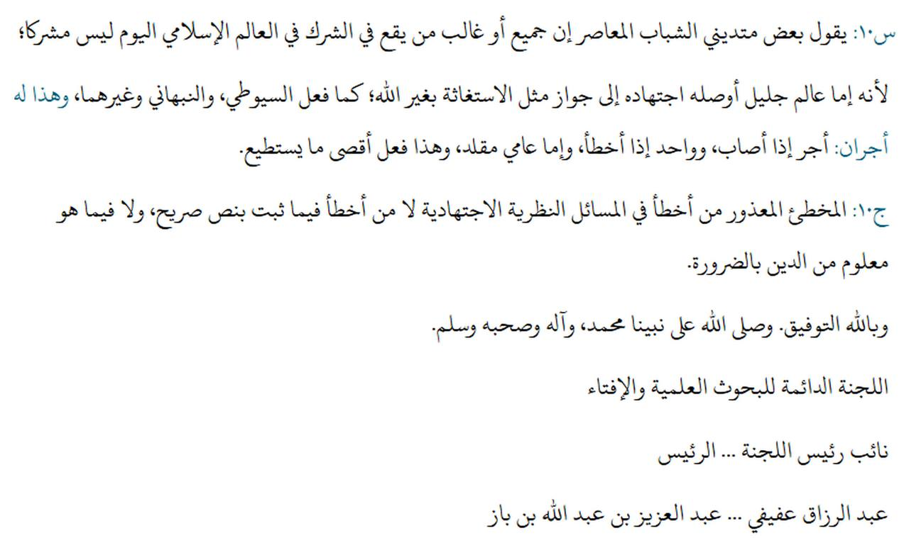

---

<!-- telegram-source: dar/messages4.html#message3908 -->
<!-- evidence-id: 000542 -->

Shaykh Ṣāliḥ al-Fawzān said:

This is the meaning of His statement: “They do not mix their belief with injustice” [al-Anʿām: 82]. That is: with shirk. This is exactly how the Messenger of Allah ﷺ explained it. When this verse was revealed, it distressed the Companions and they said: “O Messenger of Allah, which one of us has not wronged himself?” The Messenger of Allah ﷺ replied: “It is not the wrong you are thinking of. It is shirk. Have you not heard the words of the righteous servant: ‘ "O my son, do not associate [anything] with Allāh. Indeed, Shirk [with Him] is great injustice." [Luqmān: 13].

As for His statement, “those will have security”: Does this mean complete and absolute security, that they will never be punished at all? Or does it mean general security, that even if they are punished, they will inevitably enter Paradise in the end?

The verse accommodates both meanings. And on either interpretation, it demonstrates the virtue of tawḥīd: that it grants protection from punishment, either total protection or protection from permanent punishment. The verse therefore highlights the excellence of tawḥīd, and that Allah grants its people security in proportion to their level of tawḥīd and their freedom from sins and disobedience.

The verse also implies — through its opposite meaning — that whoever commits shirk with Allah and mixes his tawḥīd with shirk has no security whatsoever. We seek refuge in Allah from that. This makes clear the danger of shirk: a person may worship Allah, yet still invoke others alongside Him, seek aid from the dead, slaughter for graves, or perform ṭawāf around shrines seeking their help. Such a person has mixed his īmān with shirk, and he will have no security at all until he sincerely repents to Allah and purifies his tawḥīd.

Thus, the point is not merely that a person worships Allah; he must also avoid shirk entirely.

[Iʿānat al-Mustafīd bi-Sharḥ Kitāb at-Tawḥīd by al-ʿAllāmah Shaykh Ṣāliḥ al-Fawzān p.77]

Show attached source scan

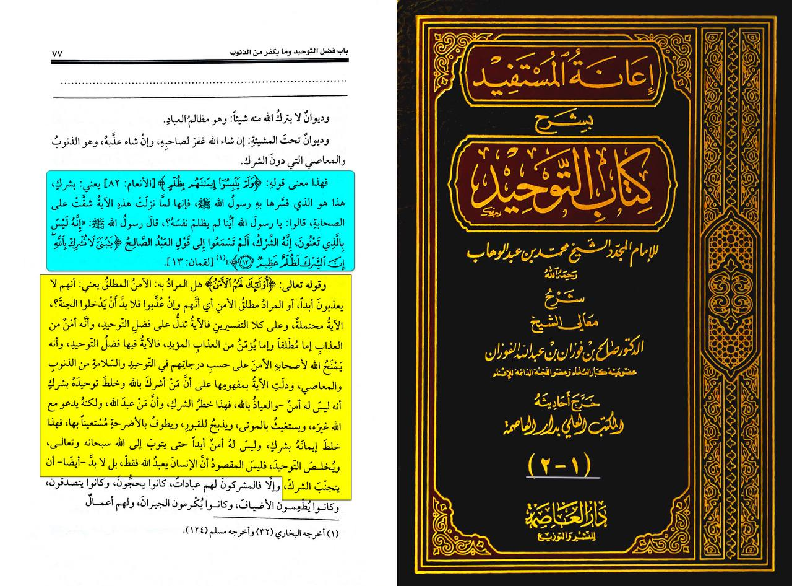

---

<!-- telegram-source: dar/messages5.html#message4427 -->
<!-- evidence-id: 000543 -->

Shaykh al-Fawzān said:

And whoever calls to tawḥīd, they call him a Khārijī. Those who promote Islam, they call him a Khārijī. And the kuffār call him extremist, fundamentalist, and other such labels, and they warn against callers to tawḥīd and callers to ‘aqīdah.

Yes, even many of the scholars in these centuries intensified their stance against whoever rejected shirk al-akbar. This is the speech of the Shaykh (Muḥammad Ibn ʿAbd al-Wahāb). He was in the thirteenth century.

In his time, the denunciation of those who are called “scholars” became severe against the callers to tawḥīd. They would call them Khawārij and declare the callers to tawḥīd misguided, and this is present in their books until now.

Meaning, even many of the scholars in those centuries intensified their opposition against whoever condemned shirk al-akbar.

---

<!-- telegram-source: dar/messages5.html#message4889 -->
<!-- evidence-id: 000544 -->

Shaykh al-Fawzān said:

He said: “And do not associate anything with Him,” because a person may worship Allāh, yet mix his worship with shirk. In that case, the worship is not valid until it is purified from shirk, as Allāh said: “Worship Allāh and associate nothing with Him” (al-Nisāʾ: 36).

And He said: “Worship Allāh and avoid the ṭāghūt.” So it is necessary, along with worshipping Allāh, to abandon shirk, because if shirk enters into worship it nullifies it and corrupts it, even if it was originally for Allāh.

This requires that you learn what correct worship is, and what shirk is, so that you may perform worship in its proper manner and avoid shirk.

This is the right of Allāh upon His servants, and it is the first of rights, as Allāh said: “And your Lord has decreed that you worship none but Him. And that you be dutiful to your parents” (al-Isrāʾ: 23). So He began with tawḥīd, which is the right of Allāh.

[at-Taʿlīq al-Mukhtaṣar al-Mubayyan ʿalā Qurrat ʿUyūn al-Muwaḥḥidīn by Shaykh Ṣāliḥ al-Fawzān p.46]

Show attached source scan

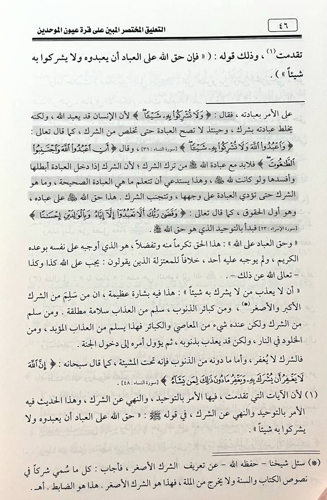

---

<!-- telegram-source: dar/messages5.html#message4879 -->
<!-- evidence-id: 000545 -->

Shaykh Ṣāliḥ al-Fawzān was asked:

Q: Some people differentiate between the shirk of the People of the Book (Ahl al-Kitāb) and the shirk of those who ascribe themselves to Islam in this time.

Is there a difference between the kāfir aṣlī (original disbeliever like the jews and christians) and the one who ascribes himself to Islam then falls into shirk akbar?

A: I do not know of this distinction. Whenever someone commits shirk, then he is a mushrik, whether he is from the People of the Book or from this Ummah. Whoever commits shirk is a mushrik, from whichever nation he may be.

---

<!-- telegram-source: dar/messages4.html#message3871 -->
<!-- evidence-id: 000546 -->

Shaykh al-Fawzān was asked:

Q: Shaykh al-Islām Ibn Taymiyyah mentioned in Majmūʿ al-Fatāwā that asking a dead person to make duʿāʾ for you, to ask Allāh on your behalf, is an act of bidʿah.

A: This is a bidʿah shirkīyyah— not merely an innovation, but an innovation involving shirk. Do not assume it is only a prohibited bidʿah; it is a bidʿah shirkīyyah, and shirk is indeed described as bidʿah.

Q: Is this the same issue you pointed out at the beginning of the lesson?

A: Yes, I clarified an understanding — not the wording of the Shaykh himself. I clarified the misunderstanding of the one quoting him. When the Shaykh says “this is bidʿah” he did not mean bidʿah in the simple sense and remain silent; he meant bidʿah shirkīyyah. That is his intent. His explicit statement here is clear, so why take his words in their general sense and ignore his explicit clarification elsewhere?

Show attached source scan

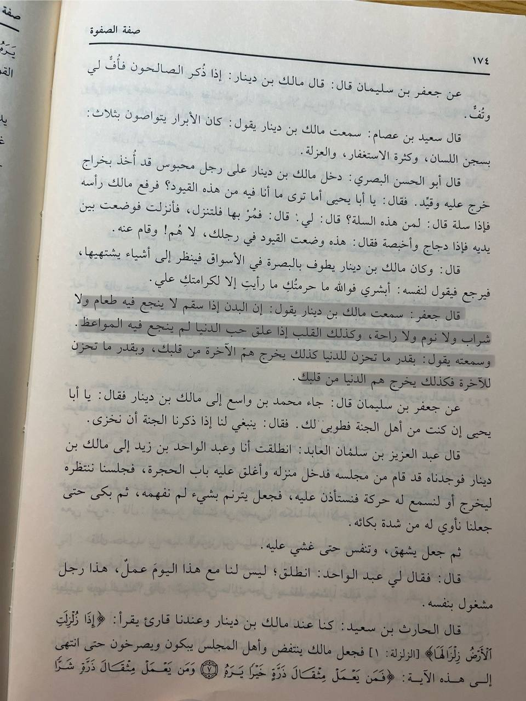

---

<!-- telegram-source: dar/messages4.html#message3874 -->
<!-- evidence-id: 000547 -->

Shaykh al-Fawzān was asked:

Q: Some people make a distinction between the shirk of the People of the Book and the shirk of those who affiliate themselves with Islam in this era. Is there any difference between the kāfir aṣlī (original disbeliever) and someone who ascribes himself to Islam but then falls into shirk akbar?

A: I do not know of such a distinction. Whenever a person commits shirk, he is a mushrik — whether he is from the People of the Book or from this ummah. Whoever commits shirk is a mushrik, from whatever community he may be.

---

<!-- telegram-source: dar/messages5.html#message4264 -->
<!-- evidence-id: 000548 -->

Shaykh Ṣāliḥ al-Fawzān said:

Whoever slaughters for other than Allah—meaning: whoever seeks closeness by slaughtering to other than Allah, such as idols, shrines, trees, stones, the jinn, and the like—then everyone who seeks closeness by slaughtering to other than Allah has indeed been cursed by Allah.

This indicates the severity of this crime, for Allah, does not curse except for a grave offense. Thus it shows the seriousness of the crime of one who slaughters for other than Allah, regardless of whether that slaughter is great or small, significant or insignificant.

That occurs when one mentions over the sacrifice a name other than the name of Allah, or when in his intention, heart, and belief he seeks closeness through this sacrifice to other than Allah; or when he intends by this sacrifice to repel harm from the one for whom it is slaughtered—so he slaughters for the jinn in order to repel their harm and out of fear of them; or he slaughters for an idol believing that the idol brings him benefit.

This is like what some ignorant people do: when rain is delayed, they take a bull or another animal and slaughter it in a specific place, or at a grave, seeking the descent of rain. They may then be tested, and rain may fall, and their need may be fulfilled as a trial and examination from Allah. This does not indicate the permissibility of what they did of shirk and seeking closeness to other than Allah.

Whoever does that is a mushrik and cursed, whether he verbally says, “This sacrifice is for the grave,” or “for al-Badawī,” or “for al-Ḥusayn,” or for so-and-so, or whether he only intends it in his heart. This sacrifice is ḥarām, because it falls under His statement: “that which has been dedicated to other than Allah.” [Baqarah: 173]

This includes what is slaughtered in the name of other than Allah, and it also includes what is slaughtered in the name of Allah while intending an idol, the jinn, or demons. Sorcerers and charlatans today, when sick people come to them, command them to slaughter for other than Allah so that they may be cured of their illness.

Included in slaughtering for other than Allah are several categories: what is slaughtered for other than Allah as an act of devotion, even if “Bismillāh" is said over it—this is forbidden by the ijmāʿ of the Muslims, and it is Shirk with Allah. Also included is what is slaughtered for meat but over which a name other than Allah is mentioned.

Also included is what is slaughtered as a form of greeting and glorification, such as what is slaughtered for kings and leaders upon their arrival—when they disembark from a plane, a car, or an animal, an animal is slaughtered at their arrival. Also included is what is slaughtered at the beginning of a project: some ignorant people, or some who are careless, when they establish a project—such as a factory or the like—slaughter an animal when the machinery is first set in motion.

Likewise, what is slaughtered upon first entering a house out of fear of the jinn—this is shirk, because it is among what is slaughtered for other than Allah, Mighty and Majestic. As for slaughtering an animal upon entering a house out of joy and happiness, and to invite neighbors and relatives, then there is no harm in that.

[Iʿānat al-Mustafīd bi-Sharḥ Kitāb at-Tawḥīd by al-ʿAllāmah Shaykh Ṣāliḥ al-Fawzān p.224-225]

Show attached source scan

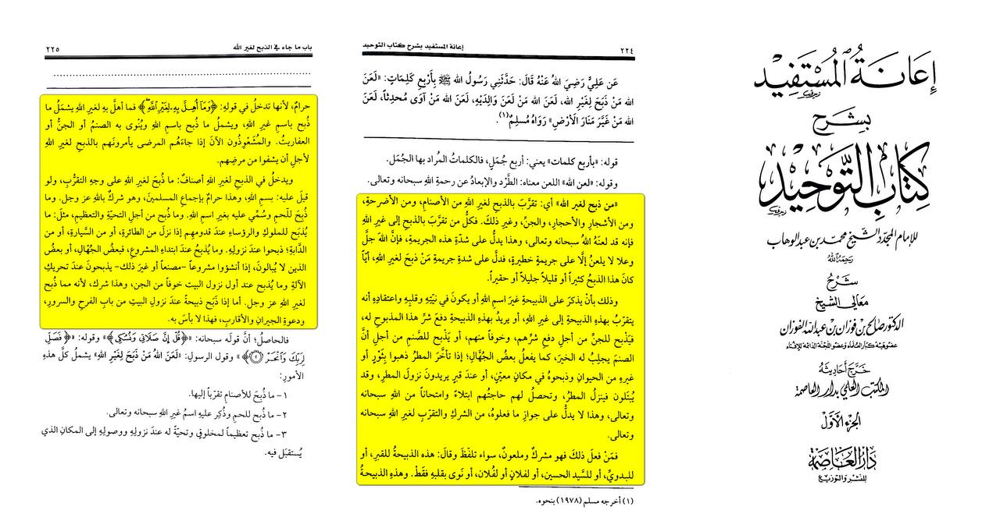

---

<!-- telegram-source: dar/messages5.html#message4700 -->
<!-- evidence-id: 000549 -->

Shaykh Ṣāliḥ al-Fawzān said:

In this verse, Allāh says to His Prophet Muḥammad ﷺ:

“It has indeed been revealed to you” — meaning Allāh revealed to you — “and to those before you” — meaning the prophets — “that if you should associate [anything] with Allāh, your work would surely become worthless” — meaning invalidated — “and you would surely be among the losers. Rather, worship [only] Allāh and be among the grateful.”

So if this is directed to the Messenger ﷺ—that if he were to commit shirk, all of his deeds would be nullified and he would be among the losers—then what about others from the people?

This is by way of warning this ummah from falling into shirk.

This verse does not exclude anyone. Whoever commits Shirk al-Akbar, his deeds are nullified, no matter how much effort he exerts. This is not specific to the people of jāhiliyyah; rather, it is general for anyone who commits shirk until the Hour is established.

[at-Taʿlīq al-Mukhtaṣar al-Mubayyan ʿalā Qurrat ʿUyūn al-Muwaḥḥidīn by Shaykh Ṣāliḥ al-Fawzān p.31]

Show attached source scan

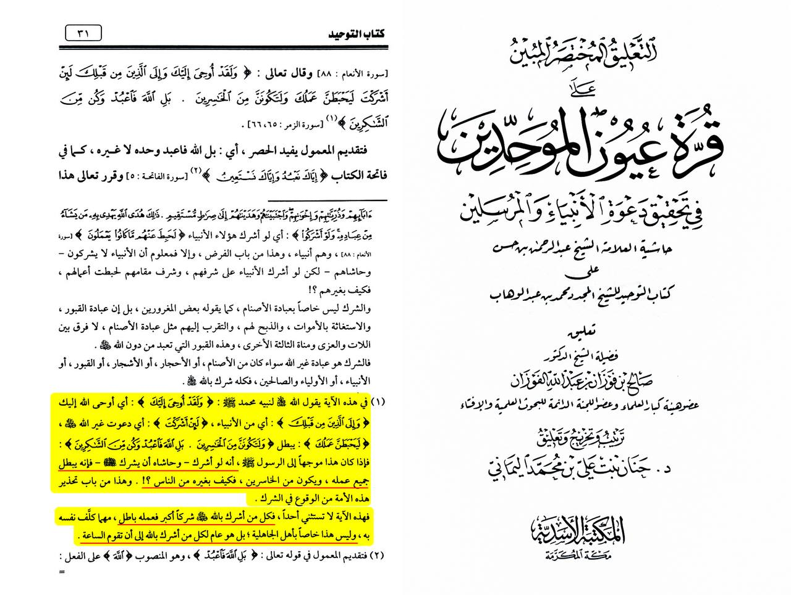

---

<!-- telegram-source: dar/messages4.html#message3334 -->
<!-- evidence-id: 000550 -->

Shaykh Ṣāliḥ al-Fawzān was asked:

Q: I ask about the meaning of the word Tawhid, what its conditions are, and how a Muslim can hold its meaning in belief without being tested or examined.”

A: In the name of Allah, the Most Merciful, the Most Compassionate. Praise be to Allah, Lord of the Worlds, and may Allah bless and grant peace to our Prophet Muhammad, his family, and companions.

The word Tawhid is La ilaha illa Allah. Its meaning is: there is no true object of worship except Allah. It encompasses both negation and affirmation. The negation is in the phrase La ilaha (there is no deity), which nullifies all that is worshiped besides Allah, the Exalted. The affirmation is in the phrase illa Allah (except Allah), which affirms that worship is for Allah alone, because worship is a right of Allah that none may share, as Allah says:

“And I did not create the jinn and mankind except to worship Me.I do not want from them any provision, nor do I want them to feed Me. Indeed, it is Allāh who is the Provider, the firm possessor of strength.” [Adh-Dhariyat: 56–58]

It is a right of Allah. Tawhid and worship are a right of Allah, Glorified and Exalted, upon His servants. As the Prophet ﷺ said to Mu‘adh ibn Jabal, may Allah be pleased with him: “The right of Allah upon His servants is that they worship Him and do not associate anything with Him, and the right of the servants upon Allah is that He does not punish those who do not associate anything with Him.”

Allah also says: “Worship Allâh and join none with Him (in worship); and do good to parents.” [An-Nisa: 36] This establishes His right as the foremost of rights, which is its meaning.

Its implication is that the servant must single out Allah in worship. If he knows its meaning and pronounces it with understanding, then he must act according to its implications and meaning. That is, he must worship Allah alone, with no partner. If he worships or calls upon anyone besides Allah, this contradicts La ilaha illa Allah, invalidates it, and corrupts the meaning of the phrase. Such pronouncement is of no benefit if coupled with shirk.

Rather, he must act in accordance with it, dedicating his religion, worship, and actions solely to Allah, Glorified and Exalted. His actions must follow the Sunnah of the Messenger ﷺ, without innovations, fabrications, or superstitions. He worships Allah according to what Allah has legislated, not according to his own desires, whims, or what people do without evidence or support from the Book of Allah and the Sunnah of His Messenger ﷺ.

Show attached source scan

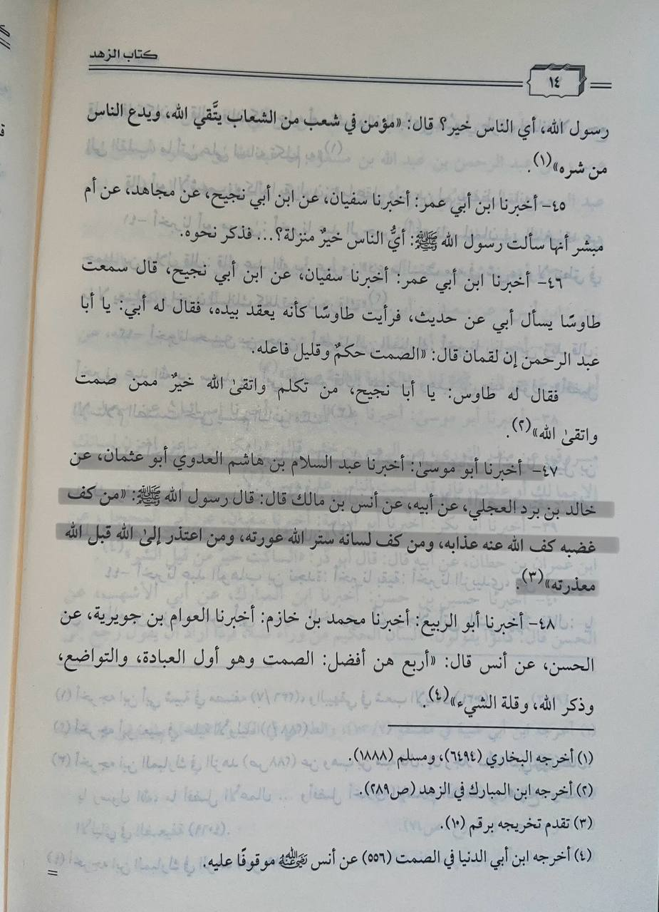

---

<!-- telegram-source: personal/messages.html#message526 -->
<!-- evidence-id: 000551 -->

Shaykh Ṣāliḥ al-Fawzān said:

It is not enough for a person to worship Allah alone; he must also avoid the ṭāghūt (false deity). If he dies while his worship is mixed with shirk, then that worship becomes invalid.

He must also disassociate himself from shirk and from the mushrikīn, showing enmity toward them for the sake of Allah. If he approves of them in their shirk and does not disassociate from them, then his tawḥīd does not benefit him.

The verse “And avoid the ṭāghūt” encompasses both abandoning the worship of the ṭāghūt and expressing barā’ah (disavowal) from those who worship the ṭāghūt.

[at-Taʿlīq al-Mukhtaṣar al-Mubayyan ʿalā Qurrat ʿUyūn al-Muwaḥḥidīn by Shaykh Ṣāliḥ al-Fawzān p.18]

Show attached source scan

---

<!-- telegram-source: dar/messages4.html#message4089 -->
<!-- evidence-id: 000552 -->

Shaykh Ṣāliḥ al-Fawzān said:

Today there are groups who claim to be callers to Allāh, yet they do not disavow the mushrikūn as long as they remain upon their Ḥizbī manhaj. And there is no power nor might except with Allāh.

It is obligatory upon a Muslim to fear Allāh, exalted is He. If he wishes to call to Allāh, then he must first know what da‘wah truly is, what the foundations of da‘wah are, and what is required of the caller. He must follow the way of Ibrāhīm عليه السلام and the other prophets—those who disavowed the mushrikūn, cut off from them after disavowing shirk, and devoted their worship purely to Allāh alone.

[Iʿānat al-Mustafīd bi-Sharḥ Kitāb at-Tawḥīd by al-ʿAllāmah Shaykh Ṣāliḥ al-Fawzān p.104]

Show attached source scan

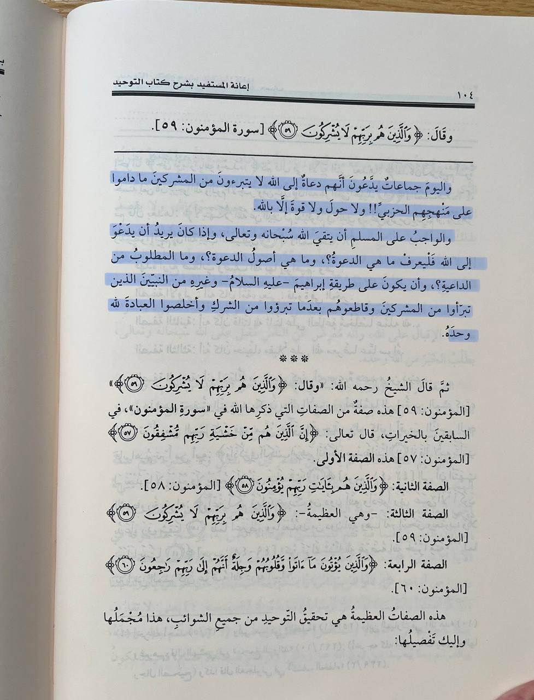

---

<!-- telegram-source: dar/messages4.html#message4005 -->
<!-- evidence-id: 000553 -->

Shaykh al-Fawzān said regarding the verse:

"And who is more astray than one who calls on besides Allâh, such as will not answer him till the Day of Resurrection, and who are unaware of their calls to them? And when mankind are gathered (on the Day of Resurrection), they (false deities) will become their enemies and will deny their worshipping." (al-Aḥqāf: 5-6)

Allah judged that there is no one more astray than the person who called upon other than Allah from among created beings—those who are not capable of responding to his supplication in this world, nor are they even aware of the one who calls upon them.

And when the Resurrection occurs and they are gathered along with all people, they will show enmity toward the one who used to call upon them and will disassociate themselves from him.  Thus this mushrik is in misery in both abodes: he obtains no response in this world, and in the Hereafter his act of worship will be rejected at the moment he is most in need of it.

The relevance of the two verses to the chapter:

They contain the ruling that whoever calls upon other than Allah is the most astray of the astray, and that duʿāʾ is an act of worship—so whoever directs it to other than Allah is a mushrik.

That duʿāʾ is an act of worship, and so whoever calls upon other than Allah has committed shirk al-akbar.

That idols do not hear the one who calls upon them, nor respond to him—contrary to what the mushrikūn imagine.

[Al-Mulakhkhaṣ fī Sharḥ Kitāb al-Tawḥīd by Shaykh al-Fawzān p.99]

Show attached source scan

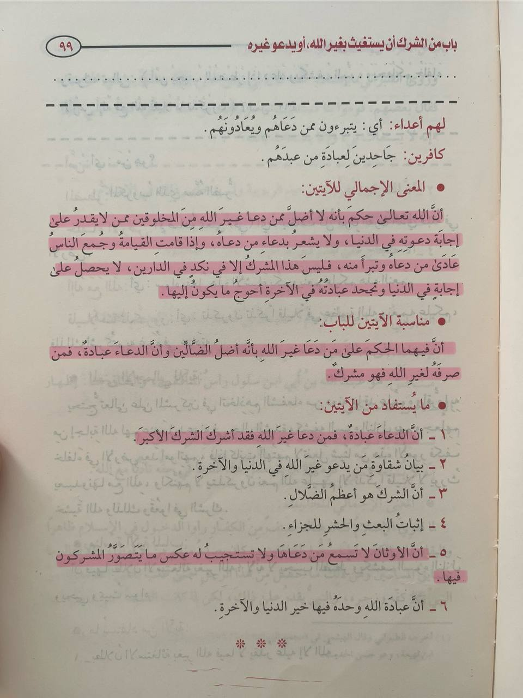

---

<!-- telegram-source: dar/messages4.html#message3802 -->
<!-- evidence-id: 000554 -->

Shaykh al-Fawzān said:

1. The meaning of lā ilāha illā Allāh is to disbelieve in whatever is worshiped besides Allah — such as idols, graves, and other objects of devotion.

2. Mere utterance of lā ilāha illā Allāh without disbelieving in what is worshiped besides Allah does not make a person’s life and property inviolable, even if he understands its meaning and acts upon it outwardly — unless he adds to it disbelief in all that is worshiped besides Allah.

3. Whoever manifests tawḥīd and adheres to its outward obligations must be spared from harm until something contrary to that becomes evident from him.

4. It is obligatory to refrain from harming a kāfir if he enters Islam — even during battle — until something contrary to that becomes clear from him.

5. A person may say lā ilāha illā Allāh yet not disbelieve in what is worshiped besides Allah.

6. Judgment in this world is based on outward actions, while in the Hereafter it is based on intentions and purposes.

7. The life and wealth of a Muslim are sacred and inviolable except with just cause.

[Al-Mulakhaṣ fī Sharḥ Kitāb al-Tawḥīd by Shaykh al-Fawzān p.60]

Show attached source scan

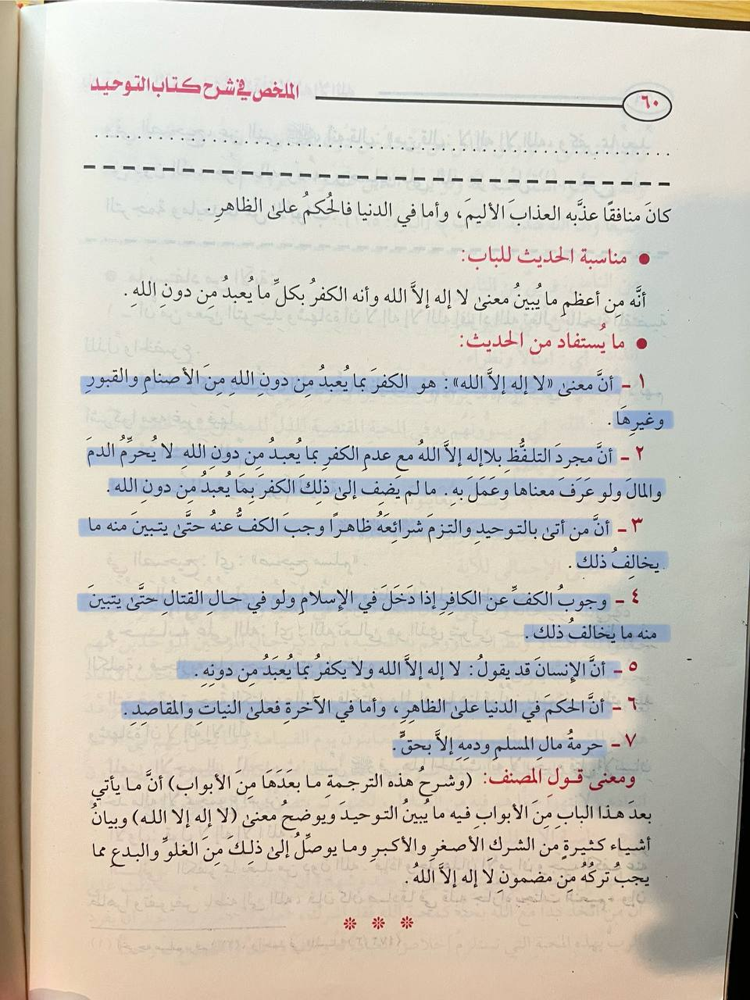

---

<!-- telegram-source: dar/messages4.html#message4065 -->
<!-- evidence-id: 000555 -->

Shaykh Ṣāliḥ al-Fawzān was asked:

Q: Is there a difference between asking a dead person for duʿāʾ and asking him for shafāʿah? Because I heard some people say that asking for duʿāʾ is an innovation, while asking for shafāʿah is shirk. Is this distinction correct?

A : Duʿāʾ is shafāʿah. What is the meaning of shafāʿah? Its meaning is that he supplicates for you, and Allāh responds to his supplication. That is shafāʿah. Shafāʿah is supplication on behalf of another. So there is no difference between them.

Show attached source scan

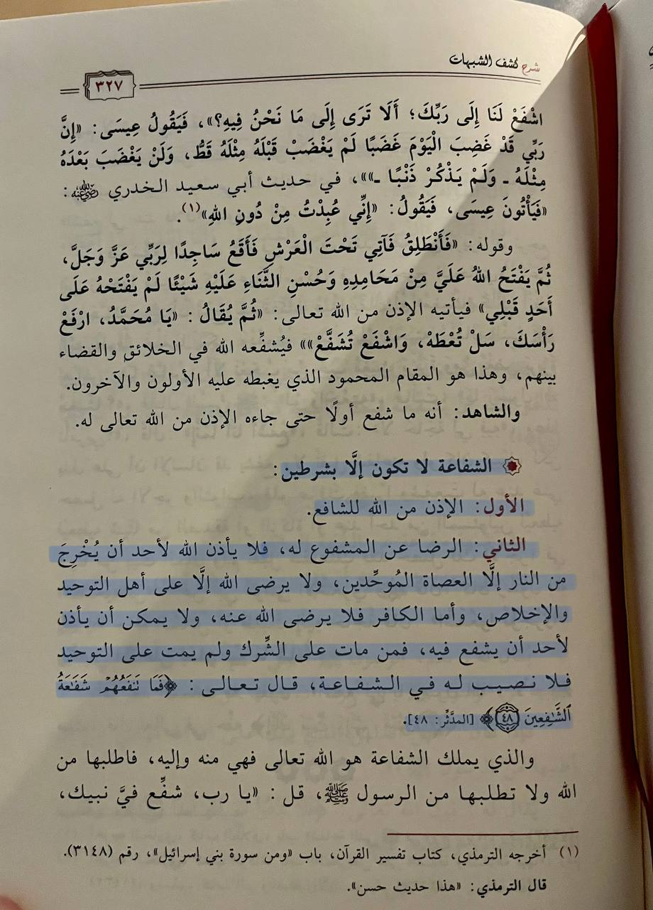

---

<!-- telegram-source: personal/messages.html#message573 -->
<!-- evidence-id: 000556 -->

Shaykh Ṣāliḥ al-Fawzān said:

Merely uttering “lā ilāha illā Allāh” is not sufficient without understanding its meaning, acting according to its implications, and truly believing in its significance.

[Iʿānat al-Mustafīd bi-Sharḥ Kitāb at-Tawḥīd by al-ʿAllāmah Shaykh Ṣāliḥ al-Fawzān p.95]

Show attached source scan

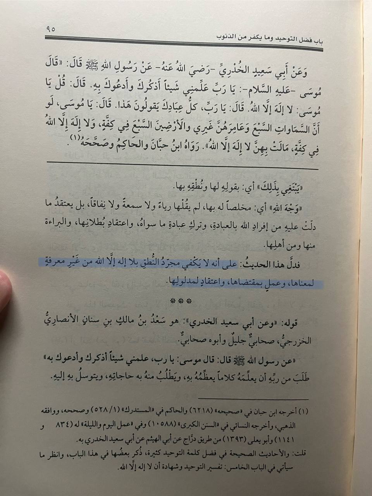

---

<!-- telegram-source: dar/messages5.html#message4841 -->
<!-- evidence-id: 000557 -->

Shaykh Ṣāliḥ al-Fawzān said:

And there are people now who say: a person does not disbelieve even if he speaks disbelief until he believes it in his heart. So if he says words of disbelief without compulsion, and does actions of disbelief, and reviles Allah and His Messenger, and does whatever he does, then he is not declared a disbeliever according to these people until what is in his heart is known.

And this is the madhhab of the extremists of the Murjiʾah. We ask Allah for well-being and safety.

[Sharḥ Masāʾil al-Jāhiliyyah by Muḥammad ibn ʿAbd al-Wahhāb by Shaykh Ṣāliḥ al-Fawzān p.276]

Show attached source scan

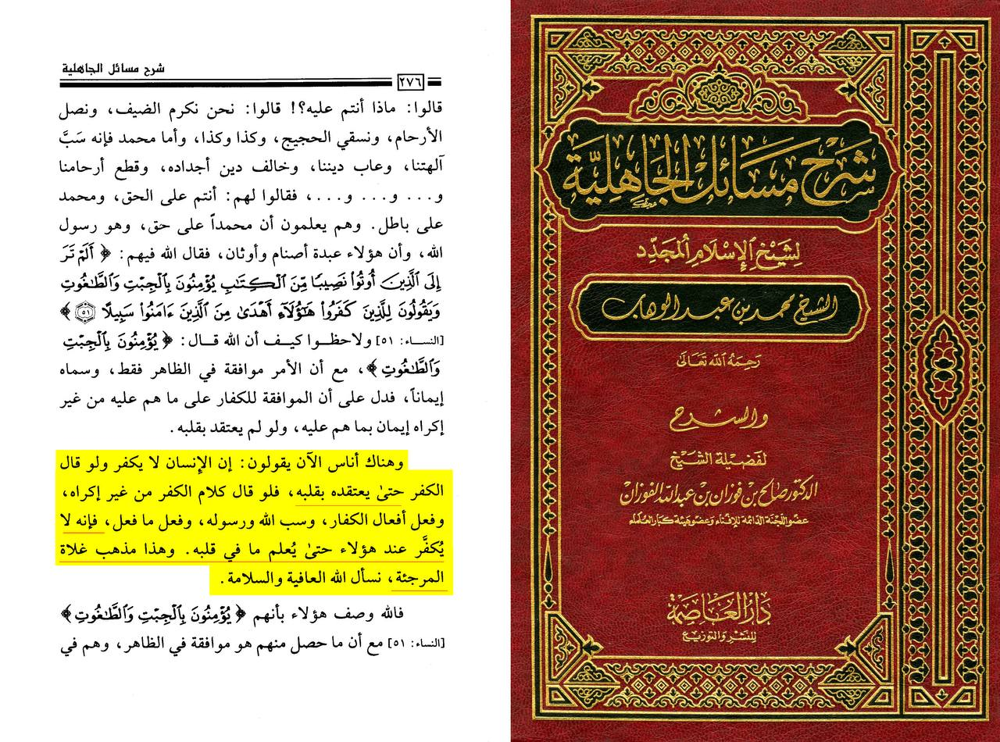

---

<!-- telegram-source: dar/messages5.html#message4470 -->
<!-- evidence-id: 000558 -->

Shaykh al-Fawzān was asked:

Question: The one who performs ṭawāf  around a grave — is he considered a mushrik absolutely, or do we need to examine his intention? If it was done as an act of drawing near…?

Answer: This — we have told you — is from the matters of the hearts. We do not look into the hearts. We judge by what is outward. So whoever performs ṭawāf around a grave seeking nearness to the grave itself is a mushrik, because he has directed an act of worship to other than Allāh.

Are we to wait and say, “Let us find out what is in his heart”? When will you ever know what is in his heart? You will never know it. None knows it except Allāh.

If he intends by his ṭawāf to draw near to other than Allāh, then he is a mushrik. If he intends that the ṭawāf is for Allāh, but he performs ṭawāf around a grave, a building, or some shrine, seeking nearness to Allāh and believing that this will benefit him, then we say: this person is a mubtadiʿ (innovator), because he has worshipped Allāh with an act of worship that Allāh did not legislate. Allāh did not legislate ṭawāf around anything except the Kaʿbah.

So whoever performs ṭawāf around other than the Kaʿbah seeking nearness to Allāh through that act is a mubtadiʿ. And whoever performs ṭawāf around other than the Kaʿbah seeking nearness to the one being circumambulated is a mushrik.

As for those who perform ṭawāf around graves, they are seeking nearness to them. Those who performs ṭawāf around them, only do so in order to draw near to them, hoping in them and fearing them.

Show attached source scan

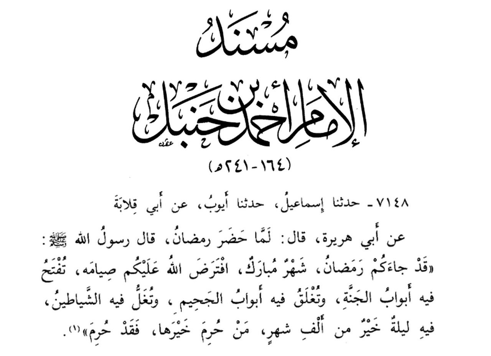

---

<!-- telegram-source: dar/messages5.html#message4752 -->
<!-- evidence-id: 000559 -->

Shaykh Ṣāliḥ al-Fawzān was asked:

Q: May Allāh do good to you. Is it sufficient for a non-Arab to pronounce the shahādah, or must it be explained to him?

A: it must be explained to him. He pronounces it while not knowing it—how can he believe in its meaning?

He must believe in its meaning, and he cannot believe in its meaning unless if he knows it and it is explained to him.

---

<!-- telegram-source: dar/messages4.html#message4225 -->
<!-- evidence-id: 000560 -->

Shaykh Ṣāliḥ al-Fawzān was asked:

Q: The questioner asks: What is the ruling on one who insults Allah, Mighty and Majestic, in anger? And is intention required for him to leave the religion?

A: O brothers, do not argue about these issues. Whoever insults Allah is a kāfir. Whoever insults Allah is a kāfir. He is to be asked to repent; rather, the scholars say he is not even asked to repent—he is to be killed in all cases, because he has become a zindīq, and the zindīq is not believed regarding his repentance, for his heart is corrupt, so he is killed. Thus, the one who insults Allah and insults the Messenger is a kāfir. If he claims Islam, then he is an apostate. He is a apostate who must be killed.

اللهم عجل بموت من يبررون هذا الضلال، وخلص هذه الأمة منهم.

---

<!-- telegram-source: dar/messages4.html#message4128 -->
<!-- evidence-id: 000561 -->

Shaykh Ṣāliḥ al-Fawzān said:

Likewise, (The Murjiʾah say) if a person utters apostasy by speech—such as reviling Allāh or reviling His Messenger ﷺ or reviling the dīn of Islām—we do not judge him, they say, because his speech is open to interpretation and we do not know what is in his heart.

Thus, no one is judged to have committed apostasy merely because of the words he uttered. And the Prophet ﷺ says: “Whoever changes his dīn, then kill him.” So if he speaks by reviling Allāh and His Messenger and by mocking the Qurʾān, it becomes obligatory to kill him—yet this speech, according to you, is not decisive and does not establish anything.

This is something they have said in these days, when a group from the Murjiʾah has now appeared, saying: if someone reviles Allāh or the Messenger, he is not judged to have committed apostasy because his words are open to interpretation until we know what is in his heart. This is taken from this corrupt principle of the Mutakallimīn (theologians).

[at-Taʿlīq al-Mukhtaṣar ʿalā al-Qaṣīdah an-Nūniyyah by Shaykh al-Fawzān 2/624-625]

Show attached source scan

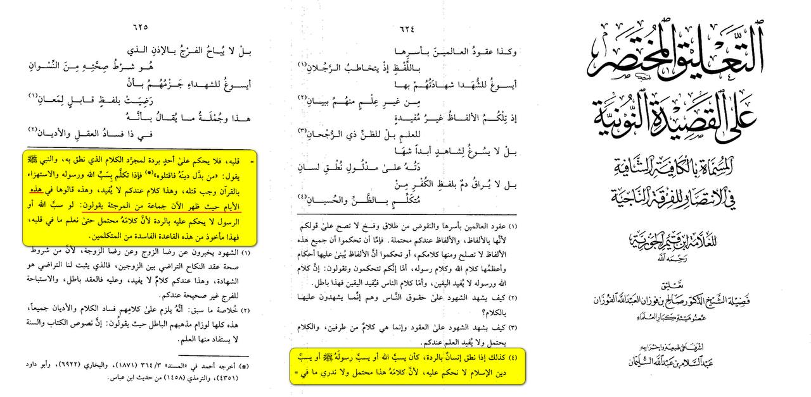

---

<!-- telegram-source: dar/messages5.html#message4240 -->
<!-- evidence-id: 000562 -->

Shaykh ʿAbd Allāh al-Ghunaymān was asked:

Q: 'Is it said that the lack of judgment of Kufr upon the one who said to the dead person at his grave: "Make du‘āʾ to Allah for me" and the likes of it, that it is based upon the dead person hearing whoever is at his grave?'

A: they explained it like this, but it is a weak reason; because the tree hears, and the stone hears, and everything hears.  If, for example, the matter were merely that something hears—even though this hearing is a kind of hearing whose reality we do not know—yet it is certain that it hears. And for this, the stone among the stones used to greet the Messenger ﷺ; it says: 'Peace be upon you, O Messenger of Allāh.'

And likewise the trunk upon which he used to give khuṭbah, he used to lean upon it... when he separated from it, and it began to cry -meaning it cried due to the loss of the remembrance that used to be mentioned upon it—and it hears. And He has informed us that everything glorifies with His praise. So the taʿlīl is incorrect.

And this is du‘āʾ to other than Allāh. You call upon him for a thing he has no power over, and is not capable of. As it is known, this is Shirk. And this Shirk of the Mushrikīn. It is not possible that anyone finds a proof that the Mushrikīn believed that their objects of worship share with the Lord of the Worlds in Creation and Origination and Governance and Giving Life and Causing Death and other than that. This is not possible.

So they call upon them so that they be intermediaries to intercede for them. For this reason Allah greatly repeated the refutation against them regarding this very matter of intercession; because the intercession is the Shirk which he calls upon them. "or 'Have they taken intercessor besides Allāh? Say: Even if they possess nothing and do not reason?' then He says: 'Say: To Allah belongs all intercession'.

So Shirk came from this type, all the Shirk of the Mushrikīn. his saying that if one calls upon the buried person so that he may intercede for him, or that he may make du‘āʾ to Allah for him, or the like, that this is merely a bidʿah—this is contrary; this is contrary to the state that the mushrikīn were upon, and contrary to what Allah has informed us of. So it is not correct.

عَنْ النُّعْمَانِ بْنِ بَشِيرٍ عَنِ النَّبِيِّ صَلَّى اللَّهُ عَلَيْهِ وَسَلَّمَ قَالَ الدُّعَاءُ هُوَ الْعِبَادَةُ ثُمَّ قَرَأَ وَقَالَ رَبُّكُمْ ادْعُونِي أَسْتَجِبْ لَكُمْ إِنَّ الَّذِينَ يَسْتَكْبِرُونَ عَنْ عِبَادَتِي سَيَدْخُلُونَ جَهَنَّمَ دَاخِرِينَ

3247 سنن الترمذي

al-Nuʿmān ibn Bashīr narrated from the Prophet ﷺ, that he said: “Duʿāʾ  is worship". Then he recited: “And your Lord said: ‘Call upon Me, I will respond to you. Indeed, those who are too arrogant for My worship will enter Hell, humiliated.’”

[al-Tirmidhī in Sunan al-Tirmidhī 3247]

Show attached source scan

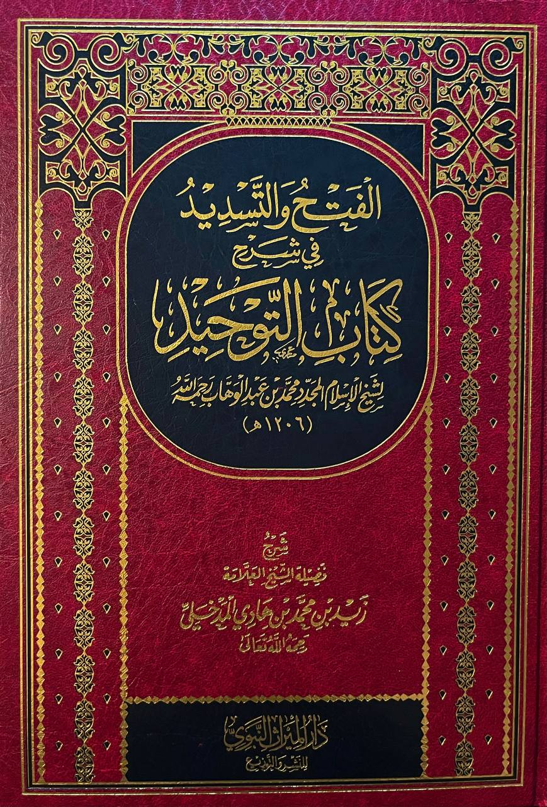

---

<!-- telegram-source: dar/messages5.html#message4906 -->
<!-- evidence-id: 000563 -->

Shaykh ʿAbd Allāh al-Ghunaymān said:

And his statement: “lā sharīka lahu (there is no partner to Him)” is an emphasis of negation; meaning that devotion to Him negates any sharing with Him in anything of devotion .

And there is no partner to Him in turning to Him or ʿibādah (worship), so it is necessary for the servant to be knowing and acting upon its meaning and what it indicates.

From this it becomes clear that those who do not know its meaning fall into apparent contradictions: you find them, for example, saying “lā ilāha illa Allāh” while performing ṭawāf around the graves, seeking istighāthah from their occupants, and calling upon them secretly and openly.

And this is the shirk akbar which this statement nullifies. If they were of those who truly knew its meaning and knew what it signifies, they would not do such actions. Even the kuffār of old used to know its meaning.

[Sharḥ Kitāb at-Tawḥīd by Shaykh ʿAbd Allāh al-Ghunaymān 1/84]

Show attached source scan

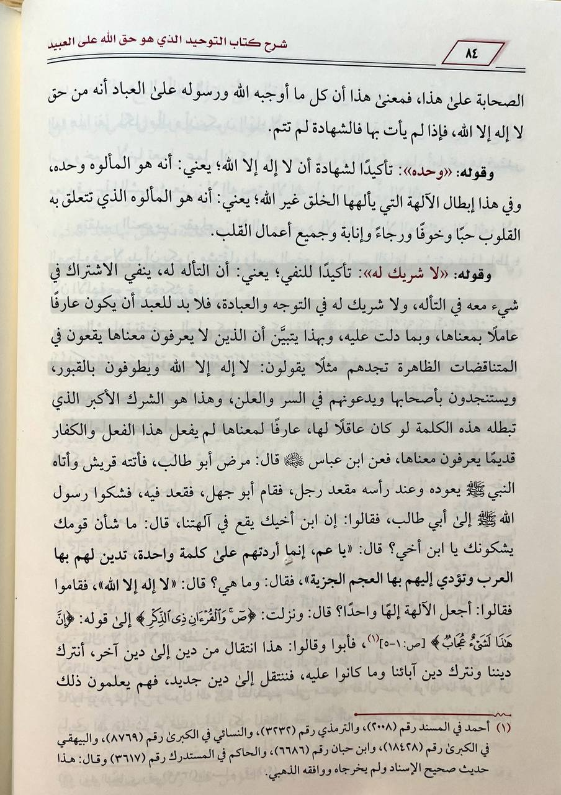

---

<!-- telegram-source: dar/messages5.html#message4430 -->
<!-- evidence-id: 000564 -->

Shaykh ʿAbdullāh Al-Ghunaymān said:

And the ʿulamāʾ have agreed that a person is not considered a Muslim except if he pronounces the shahādatayn, saying: “Ashhadu an-lā ilāha illā Allāh wa anna Muḥammadan Rasūl Allāh.”

That merely pronouncing them is not sufficient; rather, it is necessary that he knows their meaning, and then acts in accordance with the meaning he has come to know. As for mere utterance, this is not sufficient, because the Jews and others used to pronounce it, yet they are disbelievers.

[Sharḥ Kitāb at-Tawḥīd by Shaykh ʿAbdullāh al-Ghunaymān 1/184]

Show attached source scan

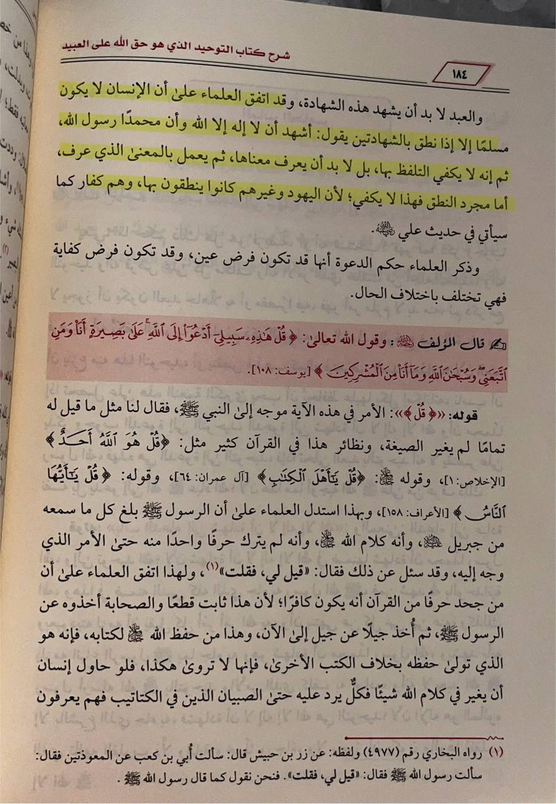

---

<!-- telegram-source: dar/messages4.html#message3506 -->
<!-- evidence-id: 000565 -->

Dr. Ahmad ibn ʿAbd Allāh al-Ghunaymān said:

It is established in sharīʿah that among the necessities of the religion is that no one possesses the power to bring benefit or avert harm except Allah, Jalla wa ʿAlā.

And whoever believes that anyone other than Allah has that power, he is a mushrik concerning the rubūbiyyah of Allah, and a kāfir in Him, according to the ijmāʿ of the Muslims, as is established among the Ahl as-Sunnah wal-Jamāʿah.

[Nawāqiḍ Tawḥīd ar-Rubūbiyyah wa Maẓāhiruhā by Dr. Ahmad ibn ʿAbd Allāh al-Ghunaymān p.102]

Show attached source scan

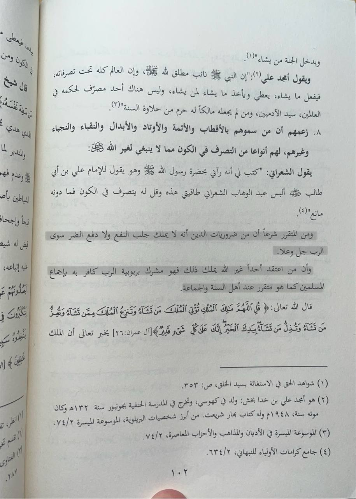

---

<!-- telegram-source: dar/messages5.html#message4300 -->
<!-- evidence-id: 000566 -->

Does the shahada benefit one who doesn’t know its meaning?

Shaykh ʿAbdullāh Al-Ghunaymān said:

One category is those who do not benefit from saying it, because they did not say it with knowledge, truthfulness, and sincerity; rather, they said it only by imitation and habit. By ijmāʿ, this does not benefit them.

For example, if a man does not know the meaning and does not know the language, but he hears people saying something and then says it with his tongue—meaning, he hears them saying “lā ilāha illā Allāh”, so he says it with his tongue while not knowing its implication or its meaning.

Likewise, he sees people praying ṣalāh, so he prays; sees people fasting, so he fasts; and sees them performing ḥajj, so he performs ḥajj, while not knowing the meaning and not knowing what is intended. Would such a person be considered a Muslim? The answer is that he is not a Muslim. It is necessary that a Muslim be aware of what is in his heart and believe that the religion of Islam is true.

Mere utterance does not benefit. It is well known that people differ in levels of knowledge, and likewise in their utterance of this statement. Thus, the ḥādīth came indicating the differing levels among people, and there is no contradiction between the ḥādīth.

[Sharḥ Kitāb at-Tawḥīd by Shaykh ʿAbdullāh al-Ghunaymān 1/98]

Show attached source scan

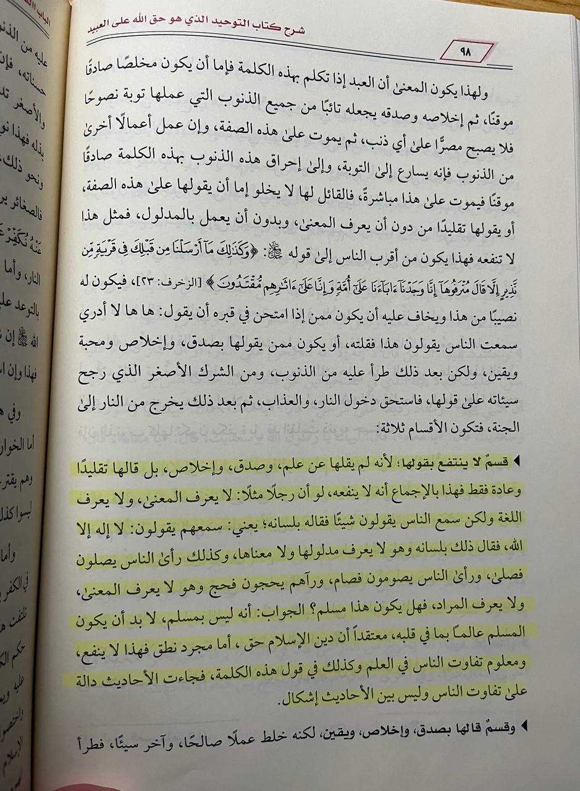

---

<!-- telegram-source: dar/messages5.html#message4858 -->
<!-- evidence-id: 000567 -->

Shaykh ʿAbdullāh Al-Ghunaymān said:

Abandoning the ṣalāh contradicts the statement lā ilāha illā Allāh. The statement lā ilāha illā Allāh does not combine with abandoning ṣalāh—ever. And likewise it is said regarding the other aḥādīth. Because from the greatest forms of worship is performing ṣalāh—with khushūʿ (humility), raghbah (hope), and rahbah (fear).

As for a person whose heart is devoted to Allah, truthful, certain, and sincere, yet he does not pray—this is not possible. It is not possible at all. It is impossible. And assuming the existence of a person who says lā ilāha illā Allāh while not praying is an invalid assumption, because it combines contradictions, matters that are mutually contradictory.

---

<!-- telegram-source: dar/messages5.html#message4444 -->
<!-- evidence-id: 000568 -->

Shaykh ʿAbd al-Muḥsin al-ʿAbbād was asked:

Q: We have people in our country who go to shrines and graves for duʿāʾ , tamassuḥ (seeking blessings by touching), and request of good. Does this make them kafir in a definite sense?

A: A person who performs Istighāthah with the inhabitants of the grave and asks them to fulfill needs or remove hardships — this is the right of Allah. And the right of Allah is not to be diverted except to Him. It cannot be directed to anyone else. So whoever does this should not be prayed behind if he were an imām.

And his ṣalāh is invalid in the sense that it is not correct to follow him. Whoever worships besides Allah, performs Istighāthah from other than Allah, or asks for fulfillment of needs from anyone other than Allah — this person is kāfir. That is, one does not pray behind him and he is treated like the kuffār.

<video class="source-video" controls preload="metadata" src="assets/videos/dar-messages5-4444.mp4"></video>

Video source from the Telegram export.

---

<!-- telegram-source: dar/messages4.html#message4070 -->
<!-- evidence-id: 000569 -->

Shaykh ar-Rājihī said:

Whoever believes in some of the Book and disbelieves in some; or believes in some of the messengers and disbelieves in some of them; or believes in some of the scriptures and disbelieves in some of them; or believes in some of the Qur’ān and disbelieves in some of it; or believes in some of what the Messenger came with and disbelieves in some of it — then he is a kāfir by ijmā‘, and a kāfir in all of it, and it does not benefit him that he believed in some of it.

And with this is removed the doubt which this person mentioned, which is his statement: “We testify that lā ilāha illā Allāh, and that Muḥammad is the Messenger of Allāh, and we believe in the resurrection, and we believe the Messenger, and we perform ḥajj and we fast and we give charity.”

We say to him: this does not benefit you; because if you call upon other than Allāh, your tawḥīd and īmān are nullified. So if you call upon the righteous, and you say: “Yā Sayyidī al-Badawī, help me,” or “Yā Sayyidī yā Rasūl Allāh,” or “Yā ‘Abd al-Qādir, madad madad,” or you slaughter or vow for them — you have committed kufr, and you have committed shirk with Allāh, and you have exited from the millah of Islām, and you have become a mushrik, and your tawḥīd and your īmān have been nullified.

An example of that: a person performs wuḍū’ and perfects the wuḍū’, then urine or feces or wind comes out from him — he is no longer upon purity, rather it has been nullified; the impurity has nullified it. Likewise, a person who says: “I testify lā ilāha illā Allāh, and that Muḥammad is the Messenger of Allāh,” and he prays and fasts, then he slaughters for other than Allāh or calls upon other than Him — his tawḥīd is nullified by this shirk and is removed. For shirk nullifies tawḥīd and īmān, just as impurity nullifies purity and corrupts it. We ask Allāh for safety and well-being.

[Shurūḥ Rasāʾil al-Imām al-Mujaddid Muḥammad ibn ʿAbd al-Wahhāb by Shaykh ar-Rājihī 2/359-360]

Show attached source scan

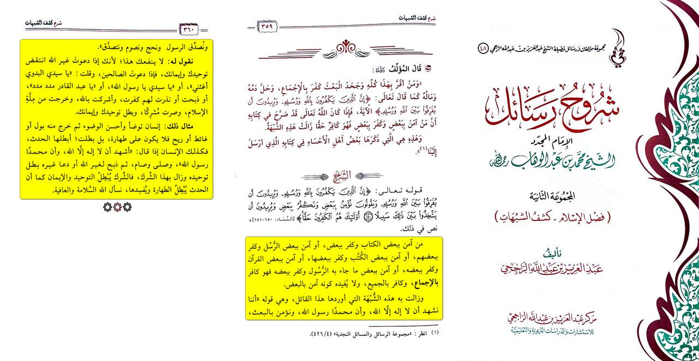

---

<!-- telegram-source: dar/messages4.html#message4067 -->
<!-- evidence-id: 000570 -->

Shaykh ar-Rājihī said:

Al-shafā‘ah (intercession) only occurs under two conditions:

First: permission from Allāh for the shāfi‘ (intercessor).

Second: approval for the one for whom intercession is sought. Allāh does not permit anyone to be taken out of the Fire except for the sinful muwaḥḥidīn, and Allāh only approves of those upon tawḥīd and sincerity.

As for the kāfir, Allāh does not approve of him, and no one can intercede for him. Whoever dies upon shirk without dying upon tawḥīd has no share in al-shafā‘ah. Allāh says: “So no intercession of intercessors will be of any use to them.” [al-Muddaththir: 48].

[Shurūḥ Rasāʾil al-Imām al-Mujaddid Muḥammad ibn ʿAbd al-Wahhāb by Shaykh ar-Rājihī 2/327]

Show attached source scan

---

<!-- telegram-source: dar/messages4.html#message4132 -->
<!-- evidence-id: 000571 -->

Shaykh ar-Rājihī said:

“Whoever says: lā ilāha illā Allāh and disbelieves in what is worshipped besides Allāh, his wealth and blood become inviolable …”

This is among the greatest clarifications of the meaning of lā ilāha illā Allāh, for mere utterance of it is not what makes a person’s blood and wealth inviolable; nor is mere knowledge of its meaning along with uttering it; nor mere acknowledgement of it; nor merely that he does not supplicate except to Allāh alone with no partner. Rather, his wealth and blood do not become inviolable until he adds to all of that disbelief in whatever is worshipped besides Allāh.

Meaning: these five matters are required, as previously mentioned:

1. Uttering this statement.

2. Knowing its meaning.

3. Acknowledging it.

4. That he does not worship anyone except Allāh.

5. That he disbelieves in whatever is worshipped besides Allāh, meaning: complete disavowal of every object of worship other than Allāh.

If he hesitates or doubts regarding any one of these five, then he is not a person of tawḥīd. So if he doubts or withholds judgement, then his wealth and blood do not become inviolable.

Meaning: if he doubts the obligation of disavowal from every object of worship besides Allāh, or hesitates concerning whether those objects worshipped besides Allāh are true or not true, or he withholds judgement, then his wealth and blood are not inviolable. What a tremendous issue this is! And what an exceptionally clear clarification it is! And what a decisive proof it is against the one who disputes it!

[at-Tanḍīd Sharḥ Kitāb at-Tawḥīd by Shaykh ʿAbd al-ʿAzīz ar-Rājihī p.100-101]

Show attached source scan

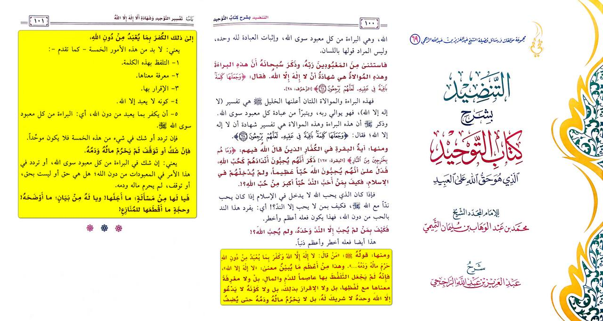

---

<!-- telegram-source: dar/messages4.html#message4138 -->
<!-- evidence-id: 000572 -->

Shaykh ar-Rājihī said:

Whoever realises tawḥīd in his heart, and removes from it everything besides Allāh in love, veneration, exaltation, reverence, fear, and reliance, then at that point doubts and desires are burned away, and they burn his sins and misdeeds entirely, even if they were like the foam of the sea.

[at-Tanḍīd Sharḥ Kitāb at-Tawḥīd by Shaykh ʿAbd al-ʿAzīz ar-Rājihī p.39]

Show attached source scan

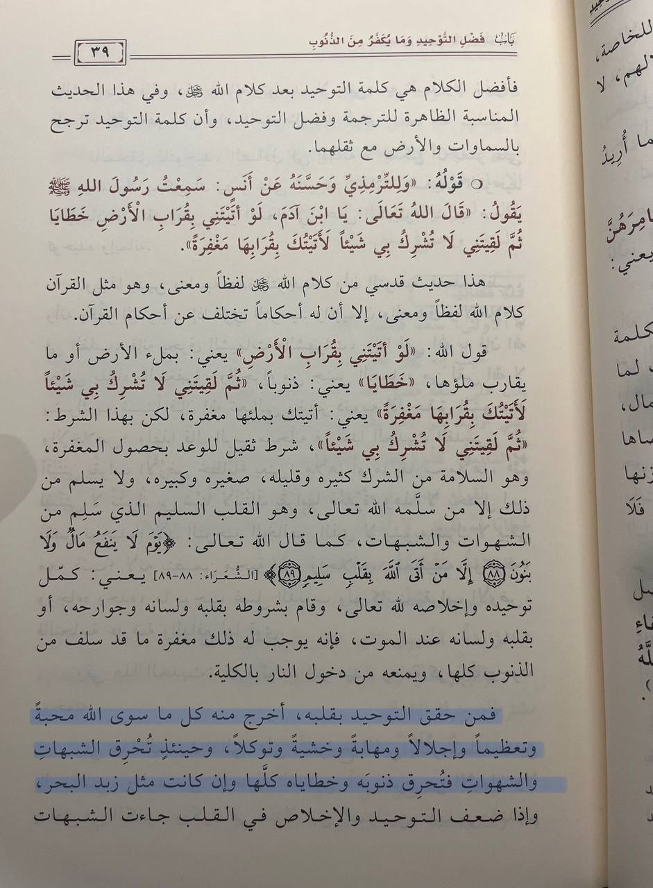

---

<!-- telegram-source: personal/messages.html#message908 -->
<!-- evidence-id: 000573 -->

Shaykh ar-Rājihī said:

The Prophet ﷺ was sent by Allah to a people who were divided in their acts of worship. Among them were those who worshipped idols, trees, stones, the sun, or the moon.

Among them were those who worshipped the Prophets, the awliyāʾ, and the righteous.

The Messenger of Allah ﷺ takfired them, made their blood and wealth lawful, and fought them, as Allah, the Most High, said: “And fight against them until there is no fitnah until the religion, all of it, is for Allāh.” [al-Anfāl: 39]

Fitnah here means shirk. That is, fight them until shirk is removed. He did not differentiate between them.

So whoever worships stones, trees, the sun, the moon, the righteous, or the angels, they are all mushrikūn, they are all to be fought, and they are all upon falsehood.

Therefore, everyone who worships other than Allah is a mushrik and a kāfir.

[Shurūḥ Rasāʾil al-Imām al-Mujaddid Muḥammad ibn ʿAbd al-Wahhāb by Shaykh ar-Rājihī 1/141]

<!-- telegram-source: dar/messages4.html#message3763 -->
<!-- evidence-id: 000574 -->

Shaykh ar-Rājihī said:

ʿibādah (worship) is a comprehensive term that includes everything that Allāh loves and is pleased with—of sayings and actions, both outward and inward. It includes everything the Sharʿ commands or forbids. It is the performance of commands and the abandonment of prohibitions out of devotion to Allāh. Thus, duʿāʾ, slaughtering, vows, and ṭawāf of the House are all forms of ʿibādah, and so are other acts. ʿIbādah is of many kinds, and among the greatest of them is duʿāʾ. So if you direct any part of it to other than Allāh, you have fallen into shirk.

And read His saying, the Exalted: “So do not call upon other god along with Allāh, or you will be among those punished.” (ash-Shuʿarāʾ :213) And His saying: “And do not call upon, besides Allāh, that which neither benefits you nor harms you; for if you do so, then indeed you will be among the wrongdoers.” (Yūnus: 106)

And His saying: "And the masājid are for Allāh alone, so do not call upon anyone along with Allāh.” (al-Jinn :18) And His saying: “And those, whom you invoke or call upon instead of Him, own not even a Qitmîr (the thin membrane over the date-stone).  If you call upon them, they hear not your call; and if (in case) they were to hear, they could not grant it (your request) to you. And on the Day of Resurrection, they will disown your worshipping them. And none can inform you (Muhammad ﷺ) like Him Who is the All-Knower (of everything).” (Fāṭir :13–14)

And His saying: "And whoever calls upon another god besides Allāh for which he has no proof - then his account is only with his Lord. Indeed, the disbelievers will not succeed.” (al-Muʾminūn :117) The texts are many regarding the prohibition of calling upon other than Allāh, for duʿāʾ is among the greatest acts of ʿibādah.

And you, O mushrik, have not understood the ʿibādah for which Allāh created you, since you claim that seeking refuge in the righteous and calling upon them is not ʿibādah.

In fact, it is ʿibādah itself.  It is narrated from an-Nuʿmān ibn Bashīr that he said: I heard the Prophet ﷺ say, “Duʿāʾ is ʿibādah.” Then he recited: “And your Lord said: "Call upon Me, and I will respond to you. Verily! Those who scorn My worship they will surely enter Hell in humiliation!’” (Ghāfir :60)¹

[Shurūḥ Rasāʾil al-Imām al-Mujaddid Muḥammad ibn ʿAbd al-Wahhāb by Shaykh ar-Rājihī 2/318-319]

Show attached source scan

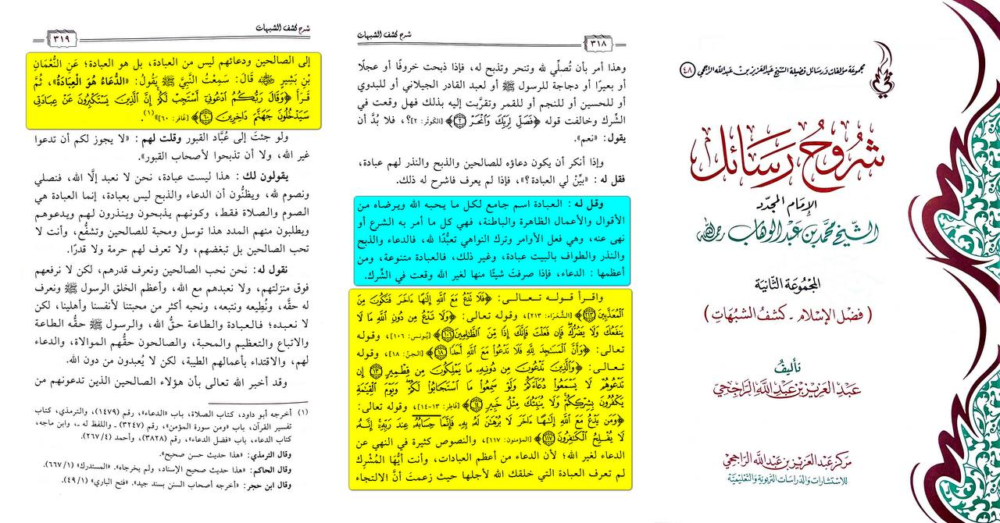

---

<!-- telegram-source: dar/messages5.html#message4917 -->
<!-- evidence-id: 000575 -->

Shaykh ar-Rājihī said:

The fifteenth: their explicit statement that they only intended intercession.

Despite that, they fell into kufr. What they are upon today is the very religion of the mushrikīn of old. The Qurʾān has affirmed this meaning, as Allāh says:

“They worship besides Allāh others who can neither harm nor benefit them, and say, “These are our intercessors with Allāh.”” (Yūnus: 18).

So if the grave worshippers today say: “We only intend intercession,” we say to them: Abū Jahl and Abū Lahab only intended intercession as well.

[at-Tanḍīd Sharḥ Kitāb at-Tawḥīd by Shaykh ʿAbd al-ʿAzīz ar-Rājihī p.213]

Show attached source scan

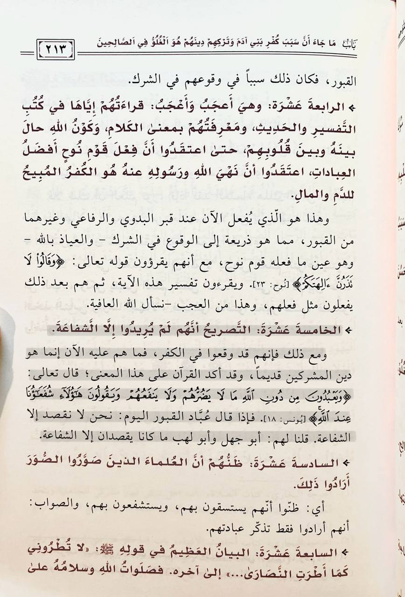

---

<!-- telegram-source: dar/messages5.html#message4393 -->
<!-- evidence-id: 000576 -->

Shaykh ʿAbd al-ʿAzīz al-Rājihī was asked:

Q: Is the ṣalāh valid behind an imām who performs istighāthah from the dead and asks them for aid, or not?

A: This man is a kāfir. Whoever performs istighāthah from the dead and asks them for aid, and asks them for fulfillment of needs and relief of hardships, is a mushrik. The ṣalāh behind him is not valid, and praying behind him is invalid.

Whoever prayed behind him without knowing his condition, then later comes to know it, must repeat the ṣalāh. This is by the ijmāʿ of the Muslims that prayer is not valid behind a mushrik.

The disagreement among the scholars regarding the validity of praying behind a fāsiq (open sinner):

1.    The Ḥanābilah and a group of scholars prohibit praying behind him and say it is not valid.

2.   Others say it is valid but disliked.

The correct view is that it is valid, but praying behind a upright person is better. This is if he is a muwaḥḥid (monotheist) but sinful. As for the mushrik, prayer behind him is not valid by ijmāʿ.

[Asʾilah wa Ajwibah fī al-Īmān wa al-Kufr by Shaykh ʿAbd al-ʿAzīz al-Rājihī p.35]

Show attached source scan

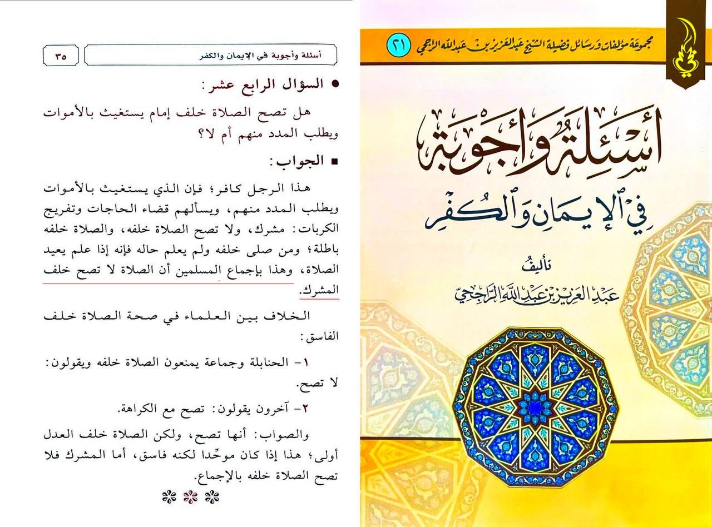

---

<!-- telegram-source: dar/messages4.html#message3866 -->
<!-- evidence-id: 000577 -->

Shaykh Ṣāliḥ Āl ash-Shaykh said:

You are looking here at his belief of lā ilāha illā Allāh through action. So if a man says lā ilāha illā Allāh while he worships other than Allāh, committing shirk with other than Allāh, then can it be said that he uttered it knowing its meaning, believing what it indicates, and acting upon its requirements? No. Therefore, it will not benefit him, because this condition has not been fulfilled in his case.

[Sharḥ Fatḥ al-Majīd li-Sharḥ Kitāb at-Tawḥīd by Shaykh Ṣāliḥ Āl ash-Shaykh p.282]

Show attached source scan

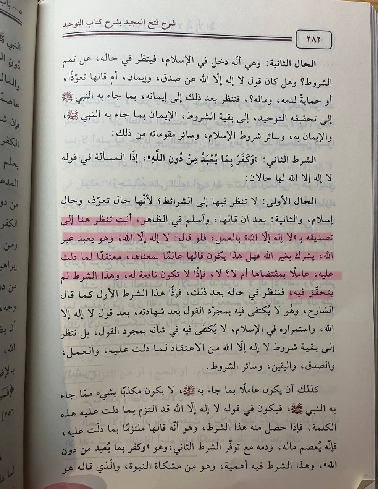

---

<!-- telegram-source: personal/messages.html#message536 -->
<!-- evidence-id: 000578 -->

Shaykh Ṣāliḥ Āl ash-Shaykh said:

He (Shaykh Muḥammad ibn ʿAbd al-Wahhāb) said: And it is the religion of the messengers with which Allāh sent them to His servants.”

So what is the religion of the messengers upon which they all agreed, and with which each of them was sent? It is tawḥīd of Allāh. — which is: singling out Allāh in ʿibādah (worship).

For this reason we know that whoever worships other than Allāh is opposing every messenger. And whoever worships other than Allāh with any type of ʿibādah is not a muwaḥḥid; rather he is a mushrik and a denier of all the messengers.

[Sharḥ Kashf ash-Shubuhāt by Shaykh Ṣāliḥ Āl ash-Shaykh p.43]

Show attached source scan

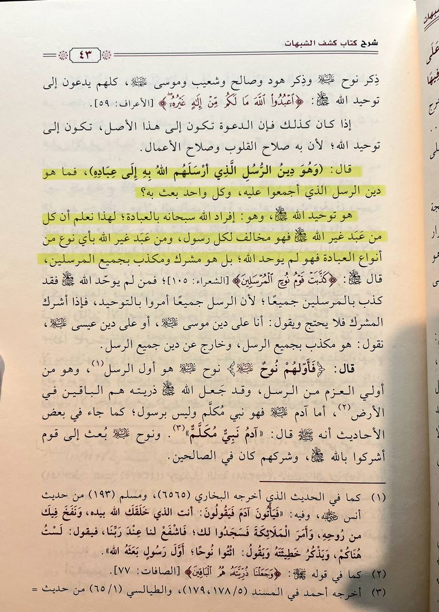

---

<!-- telegram-source: dar/messages3.html#message2545 -->
<!-- evidence-id: 000579 -->

Ruling by other than Allah

Shaykh Ṣāliḥ Āsh-Shaykh said:

This issue—namely, the matter of seeking judgment (taḥākum) by other than the law of Allah—is one in which much confusion occurs, especially among the youth in this country and elsewhere. It is one of the causes of division among Muslims, because people have not viewed it through a unified lens. It is incumbent upon the student of knowledge to seek what the evidences indicate, to understand what the scholars have explained from those evidences, and to comprehend the principles of Sharīʿah and tawḥīd that they derived and clarified in these matters.

One of the causes of confusion is that some have treated the matter of ḥukm (judgment) and taḥākum as a single case. That is, they have viewed it as one single form, while in fact, it comprises multiple scenarios. Among these is the scenario in which independent legislation is enacted to rival the law of Allah, exalted is He. The creation of such a code, in and of itself, is kufr. The one who enacts it, legislates it, supports it, attributes it to himself, and issues rulings based on it—this person is a disbeliever, and his disbelief is clear. That is because he has made himself a ṭāghūt, calling people to worship him through obedience, and he is content with that.

Then there is the one who judges by that legislation—this is a second case. So we have the legislator (al-musharriʿ), the judge who rules by it, the one who seeks judgment through it, and the state or entity that enforces it upon its population—making it a fourth case.

Thus, we are faced with four distinct situations. First is the legislator who permits what Allah has forbidden and forbids what Allah has permitted, opposing the Sharīʿah—this is a disbeliever. Whoever obeys him in this has taken him as a lord (rabb) besides Allah.

As for the judge who rules by such legislation, the matter requires detail. If he rules by it once, or even several times, but it is not his regular practice—and he knows that he is sinning by ruling by other than Allah’s law—then he is treated like other sinners. He is not to be declared a disbeliever unless he deems it permissible (istihlāl). That is why some scholars say: the one who rules by other than what Allah has revealed does not become a disbeliever unless he considers it lawful. This is correct. However, this does not apply to the case of codification and legislation.

As Ibn ʿAbbās said: “It is not the disbelief that you imagine. It is kufr dūna kufr (a lesser form of disbelief).” Meaning: the one who rules in one or two matters by desire, rather than by Allah’s law—while knowing that he is disobedient and does not deem it permissible—this is kufr dūna kufr.

As for the ruler who never judges by the Sharīʿah at all, and consistently rules by other than it, and enforces it upon the people—some scholars have said that he is a disbeliever, absolutely, just like the one who legislated such laws. Allah, exalted is He, said: “They wish to seek judgment from the ṭāghūt…” (al-Nisāʾ: 60), thus declaring the one who judges exclusively by other than Allah’s law to be a ṭāghūt, and He also said: “They were commanded to reject it.” (al-Nisāʾ: 60)

Some scholars, however, have said that even this type does not disbelieve unless he deems it lawful, as he may act upon it while believing in his heart that he is sinful. In that case, he is like the habitual sinner who has not repented. But the correct opinion—according to me—is the first one: that whoever consistently rules by other than Allah’s law and obliges the people to follow it, is a disbeliever. This was also the opinion of my grandfather, Shaykh Muḥammad ibn Ibrāhīm in his treatise Taḥkīm al-Qawānīn. For such rulings do not come from a heart that has rejected the ṭāghūt—rather, they stem from a heart that reveres the law and glorifies ruling by it.

The third situation is the case of the mutaḥākimīn—those who seek judgment. That is, someone and his opponent go together to be judged by secular law. This also requires clarification.

Show attached source scan

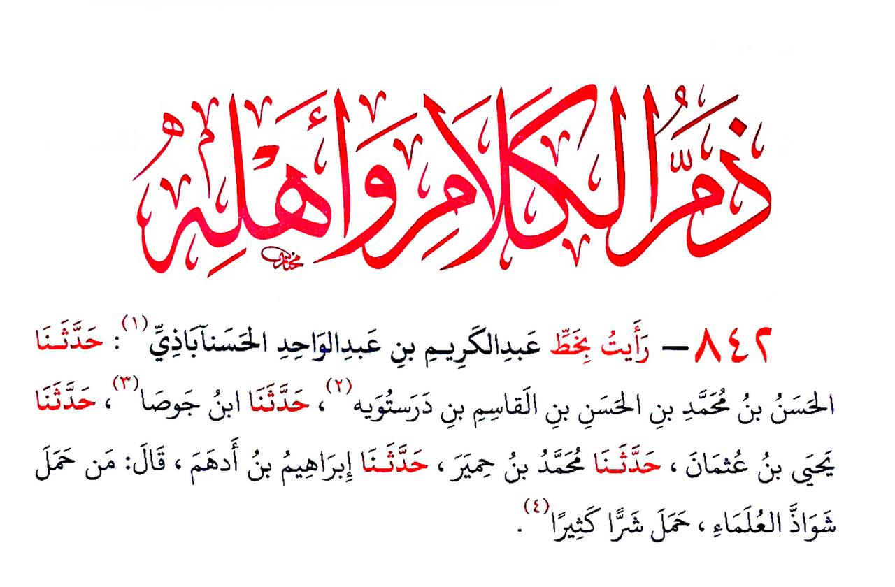

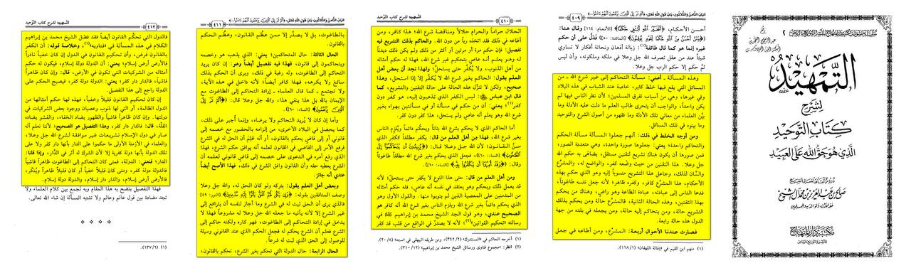

---

<!-- telegram-source: dar/messages4.html#message3389 -->
<!-- evidence-id: 000580 -->

Shaykh Ṣāliḥ Āsh-Shaykh said:

It is known and established in the Kitāb of Allah and in the Sunnah of His Messenger ﷺ that Allah, jalla wa-ʿalā, sent all the messengers and dispatched the prophets for the worship of Allah alone, without partner.

And He created the heavens and the earth, He created the celestial bodies, and He created everything — and He did not permit worship of anyone besides Him.

“There is no one in the heavens and earth but that he comes to the Most Merciful as a servant.” And He, jalla wa-ʿalā, said: “And there is not a thing except that it exalts [Allāh] by His praise, but you do not understand their [way of] exalting.”

So whoever looks at the evidences of oneness of Allāh, jalla wa-ʿalā, in the horizons and in the souls, becomes certain that this creation has but one Mudabbir (Disposer), one Khāliq (Creator), and one Muṣarrif (Controller) — and He is Allah, jalla jalāluh. And it must be so.

And this is a necessity that does not require from a person a detailed proof, for he perceives it within himself and he perceives it in what surrounds him.

It must lead him to the recognition that the One who alone created, the One who alone disposes of the creation, He is the One who must be humbled to, who must be submitted to, and who must be worshipped alone, without anything besides Him.

---

<!-- telegram-source: personal/messages.html#message674 -->
<!-- evidence-id: 000581 -->

Shaykh Khālid al-Mushayqiḥ was asked:

Q: Is this expression correct or not? Some people say that making takfīr of the mushrikīn and apostates is not from the foundation of the religion, meaning that making takfīr of the grave-worshippers is not from the foundation of the religion. Are these words correct or not?

A: No, no, these words are not correct. Allah, the Most High, declared them as kuffār: “Surely, disbelievers are those who said: "Allâh is the third of the three (in a Trinity)."  [al-Māʾidah: 73]

“Those who disbelieve from among the people of the Scripture (Jews and Christians) and the Mushrikûn, were not going to leave (their disbelief) until there came to them clear evidence.” [al-Bayyinah: 1]

“Surely, in disbelief are they who say that Allâh is the Messiah, son of Maryam” [al-Māʾidah: 17]

Q: They say that making takfīr of the one who associates partners with Allah, meaning the grave-worshippers, is not from the foundation of the religion.

They say it is obligatory, but not from the foundation of the religion. And they say that whoever says it is from the foundation of the religion is from the Khawārij.

A: No, this is not correct. Also, if we say that it is obligatory, then this itself indicates that it is from the foundation of the religion.

Show attached source scan

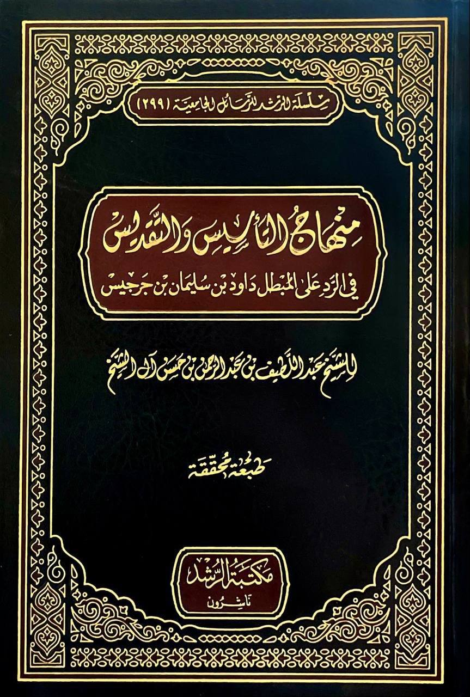

---

<!-- telegram-source: dar/messages5.html#message4850 -->
<!-- evidence-id: 000582 -->

Shaykh Ṣāliḥ as-Suwayyiḥ said:

The Imām al-Mujaddid (Muḥammad Ibn ʿAbd al-Wahhāb)  established in many places in his works, letters, and correspondences, and likewise the Imāms of the daʿwah that whoever commits major shirk which expels from the religion, and disbelieves in Allah with disbelief that removes one out of Islām:

Such as one who insults Allah and His Messenger, or mocks His religion, or insults the Book of Allah, or denies the revelation, or believes, says, or does that which is known necessarily from the religion that its doer is a kāfir, such as calling upon other than Allah from the dead or the absent, or abandoning tawḥīd and turning away from the worship of the Lord of the servants, then he is a kāfir outside from Islām, judged according to the outward of his action.

And this is what is necessitated by the texts from the Book and the Sunnah and the ijmāʿ of the scholars; for the legally responsible person takes the ruling of his action.

So whoever’s action is the action of the Muslims is called a Muslim, and whoever’s action is the action of the mushrikūn is called a mushrik, even if he has an excuse between himself and his Lord, so the ruling is based on the outward appearance.

[al-Furūq bayna Manhaj Aʾimmat al-Daʿwah al-Iṣlāḥiyyah raḥimahum Allāh fī al-Mamlakah al-ʿArabiyyah al-Suʿūdiyyah wa-Manhaj Mukhālifīhim min ʿUbbād al-Qubūr al-Mubtadiʿah by Shaykh Ṣāliḥ as-Suwayyiḥ p.205]

Show attached source scan

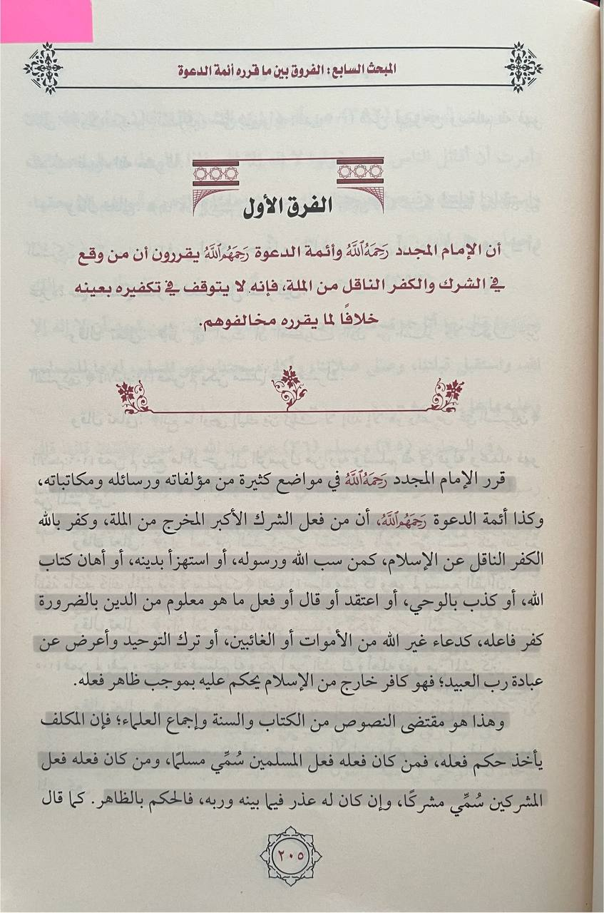

---

<!-- telegram-source: dar/messages3.html#message2663 -->
<!-- evidence-id: 000583 -->

Dr. Ayman al-ʿAnqarī said:

The Intended Meaning of the One Who Abandons Tawḥīd

He is the one who falls into a nullifier from the nullifiers of the statement of tawḥīd: Lā ilāha illa Allāh, whether that nullifier is in the domain of rubūbiyyah—such as believing in a god, creator alongside Allāh, or denying the existence of Allāh, or believing that among the awliyāʾ and imāms are those who control the universe, or that Allāh has delegated the management of the affairs of the world to the saints and imāms.

And among that: to believe that the one who brought this child into being is such-and-such saint or the occupant of such-and-such shrine—because in this is attributing creation to other than Allāh, exalted is He.

And among that: the statement of the doctrine of waḥdat al-wujūd—that Allāh and the universe are one entity, and that Allāh—exalted and far above that—is this very universe in itself, with everything in it from among the created beings. Or if it is in the domain of ulūhiyyah — such as calling upon and istighāthah from the Prophet ﷺ or from the saints in matters that no one is capable of except Allāh—such as fulfilling needs, removing hardships, and guiding hearts. Or requesting intercession from the Prophet ﷺ by saying: “O Messenger of Allāh, intercede for me with Allāh.”

Or approaching al-Badawī or al-Dusūqī or al-Ḥusayn or ʿAlī and saying: “Madad, madad” or “Rescue me” or “Cure me of my illness,” or offering a sacrifice to the occupant of the grave out of veneration for him. Or a woman who cannot conceive goes to those called awliyāʾ and requests from them to become pregnant, saying: “O Master so-and-so, grant me a child.” Or seeking blessings from the graves of the saints with the belief that they elevate needs to Allāh, exalted is He, Or performing ṭawāf around the graves of the awliyāʾ out of glorification and drawing near to them, Or making a vow to other than Allāh. This is what is meant here by abandoning tawḥīd.

[Taḥrīr qawl al-shaykh Muḥammad ibn ʿUthaymīn fī tārik al-tawḥīd by Dr. Ayman al-ʿAnqarī p.16-17]

Show attached source scan

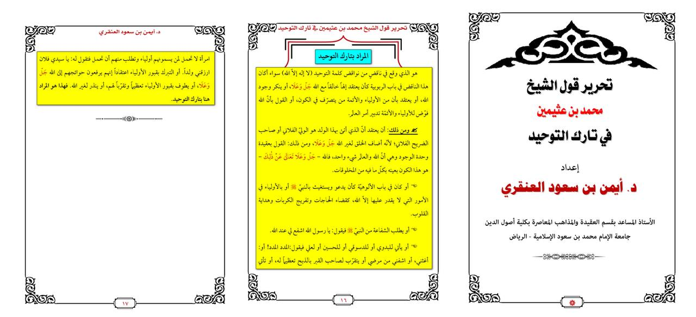

---

<!-- telegram-source: dar/messages4.html#message3465 -->
<!-- evidence-id: 000584 -->

Shaykh Ayman al-ʿAnqarī said:

We hear from some who claim to be Muslims the phrase: “O Messenger of Allah, intercede for me” or “Intercession, O Muhammad.” This phrase is not permissible; asking for intercession from the Prophet ﷺ is major shirk because intercession belongs to Allah alone. Allah, the Exalted, says: “Say, ‘To Allah belongs [all] intercession’”. The Prophet ﷺ and other deceased people have no power over anything—not intercession nor supplication—because he ﷺ said: “When the son of Adam dies, his deeds are cut off except for three…” Since intercession is among matters that only Allah can grant, the dead have no power over it. Therefore, beware of this phrase.

Show attached source scan

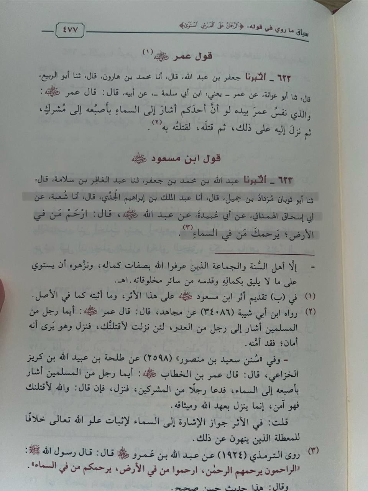

---

<!-- telegram-source: dar/messages5.html#message4856 -->
<!-- evidence-id: 000585 -->

Benefits from The first session of the Sharḥ of ”Mufīd al-Mustafīd by Imām al-Mujaddid Muḥammad Ibn ʿAbd al-Wahhāb" by Shaykh Ayman Al-Anqarī

---

<!-- telegram-source: dar/messages5.html#message4589 -->
<!-- evidence-id: 000586 -->

A very important warning against the misguidance of the Murjiʾī ʿAbd al-Azīz Ar-Rayyis by Shaykh Ayman Al-Anqarī.

We don’t usually mention names here but this is amongst the serious liars whose name requires mentioning. Anyone you see promoting him, either is ignorant of his reality or amongst those who lie upon the religion.

The scholars have warned against him, he showed himself as someone who repented then proceeded to spread the same misguidance he claimed he repented from. His errors are well known and the scholars in Riyadh consider him amongst the liars.

I advise one, Observe this video and understand this man’s tremendous errors and misguidance and abandon him and those who take from him, they will make you fall into disbelief, and return back to those who are trustworthy and names are established.

---

<!-- telegram-source: dar/messages4.html#message3289 -->
<!-- evidence-id: 000587 -->

Fatawa of Shaykh ʿAbd Allāh al-Jarbūʿ on ṭalab al-du‘ā’

I asked: As-salāmu ‘alaykum wa raḥmatullāhi wa barakātuh.

Our respected Shaykh, I hope you are well. I have a question: We know that whoever excuses the mushrik and calls him a Muslim is undoubtedly among the ghulāt al-murji’ah. However, some people have confusion regarding the issue of ṭalab al-du‘ā’ due to a misunderstanding of Ibn Taymiyyah’s words when he referred to it as a bid‘ah. How should we deal with them? Should they be treated the same as in the first issue, or is this dealt with differently?

We know that if something is a bid‘ah, it can lead to excusing the mushrik in his shirk, and this is one of the doubts used by the murji’ah to justify excusing the mushrik. But how do we deal with those who fell into this doubt because of some statements from the scholars on this matter, where they claim that there is khilāf (difference of opinion) about it?

Shaykh ʿAbd Allāh al-Jarbūʿ responded:

Wa ‘alaykum as-salām wa raḥmatullāhi wa barakātuh.

It is a bid‘ah and it is shirk — it is both a bid‘ah and shirk. When speaking with people who claim it is obligatory and legislated, the response is: it is not legislated, but rather a bid‘ah. When Shaykh al-Islām discussed the rulings concerning it, he said: such a person is a kāfir, and if he repents, then it is accepted, but if not, he is to be executed. At another time, he said: it is kufr by the consensus of the Muslims. So it is both a bid‘ah and kufr.

As for those people, they should be taught. Tell them to learn and to gather the strongest statements of Shaykh al-Islām on the issue.

Saying it is a bid‘ah does not mean it is not shirk. No—it is a bid‘ah that is shirk.

<video class="source-video" controls preload="metadata" src="assets/videos/dar-messages4-3289.mp4"></video>

Video source from the Telegram export.

---

<!-- telegram-source: dar/messages5.html#message4591 -->
<!-- evidence-id: 000588 -->

I asked Shaykh Manṣūr as-Samarī:

Q: as-Salāmu ʿalaykum wa raḥmatullāhi wa barakātuh

We hope you are well, Shaykh. This question was raised by some brothers: The matter of ṭawāf around graves: is the act of ṭawāf kufr by itself, or must the intention of drawing near be taken into account?

For example, may Allāh preserve you: if we see someone performing ṭawāf around a grave, should we call this person mushrik, or should we refrain from applying the label of shirk until their intention is known — whether it was to draw near to Allāh or just for another reason?

Scholars have stated that a person may be a mubtadiʿ if their intention in the circumambulation is to draw near to Allāh, and may be kāfir if their intention is to draw near to the deceased. We would like to know: should a person like this be judged as mushrik before their intention is known, or is the correct approach to say they are Muslim until their intention is known?

A: Wa ʿalaykum as-salām wa raḥmatullāhi wa barakātuh.

The one performing ṭawāf around  the grave, meaning that he does ṭawāf  around the grave while knowing it is a grave — that is, he intentionally wants to perform tawāf around this grave. If this is done as an act of seeking nearness to the owner of the grave, then he is a mushrik. And if it is not for the sake of Allāh, they say he is kāfir, because he has fallen into a bidʿah mukaffirah.

Because tawāf is only valid around the Kaʿbah for Allāh, and this person performed tawāf around a place other than the Kaʿbah, claiming nearness to Allāh. They say this is a bidʿah, and it is a bidʿah that takes one out of Islām according to some scholars. In the words of Shaykh al-Islām Ibn Taymiyyah, the principle is that the qiblah before the Kaʿbah was Bayt al-Maqdis, then it changed to the Kaʿbah. As for tawāf, there is no tawāf except around the Kaʿbah, before and after.

So he says: whoever innovates tawāf around anything other than the Kaʿbah — like someone facing a qiblah other than the Kaʿbah — it is even more severe. And it is more severe than facing a qiblah other than the Kaʿbah in Ṣalāh. If someone faces something other than the Kaʿbah intentionally, he is an mubtadiʿ.  Some say he is not declared kāfir, others say he is. This is because he deliberately intends to set a qiblah other than the Kaʿbah. And this is what they call a bidʿah mukaffirah. Even if he claims it is all for the sake of Allāh, it is still considered a bidʿah that takes him out of the fold of Islam according to these scholars.

A side benefit: this opinion is held by shaykh al-Fawzān amongst few others. Shaykh Ibn Bāz, Shaykh Al-Jarbū and others held the position that the persons intent should be clarified first regarding ṭawāf. This was narrated to me Shaykh Al-Jarbū himself on 13th Rmdn 1447AH.

Although as the mashaykh have also said, the majority of those who perform ṭawāf around the grave are those who wish to draw closer to the grave and rare exception has no ruling. This was mentioned to me by Shaykh ʿAbd Al-Latīf al-Rawī. Allahu A'lam

---

<!-- telegram-source: dar/messages5.html#message4662 -->
<!-- evidence-id: 000589 -->

The virtue of Kashf ash-Shubuhāt

Shaykh Abī al-ʿAlā ar-Rāshid said:

O youth, the treatise Kashf al-Shubuhāt — and we said that Shaykh Muḥammad ibn ʿAbd al-Wahhāb authored this treatise intending to respond to two groups. The first group is the group of the mushrikīn who present to the muwahḥidīn a number of doubts. The second group is the group of the Murjiʾah, who also present to the callers to tawḥīd a number of doubts.

We said in the previous lesson that the dāʿi (caller), or any reformer — and this is important — the dāʿi and the reformer who renews for the people the matter of the religion, and calls them to tawḥīd, and returns them to the religion of Allah  calling them to single out Allah in worship, singling out Allah in sacrifice, singling out Allah in legislation and judgment, singling out Allah in allegiance — returning the people to the tawḥīd of Allah — this dāʿi must have enemies. This dāʿi will not be safe, he will not be safe. Why? Because he will proclaim the truth openly.

And Allah said to His Messenger ﷺ: “So proclaim openly that which you are commanded, and turn away from the mushrikīn.” And He said: “And so We have appointed for every Prophet enemies - Shayātīn among mankind and jinn, inspiring one another with adorned speech as a delusion.” So the devils of mankind and the devils of jinn are the enemies of the call to tawḥīd.

Amongst the beneficial Sharḥ of this great and important book are from shaykh Ṣāliḥ ash-Shaykh, Muḥammad ibn Ibrāhīm, al-Fawzān, and Ibn Bāz. I advise one. Study these books. Spend your time studying it. Revising it. Referring to it. And spending alot of time making du‘āʾ to not fall into the doubt as many have. That someone can worship other than Allah, whether they knew its kufr or not, and they are a Muslim. May Allah protect us from this evil.

Show attached source scan

---

<!-- telegram-source: dar/messages5.html#message4536 -->
<!-- evidence-id: 000590 -->

The caller to tawḥīd will have enemies.

Shaykh Abī al-ʿAlā ar-Rāshid said:

The point, O brothers, is that whoever walks the path of da‘wah to tawḥīd in any era of the eras. He says to you: “It is heavy”.

That is why Allah, Majestic and Exalted, said to His Prophet ﷺ, clarifying this: “Verily, We shall send down to you a weighty Word” — a heavy word and tremendous word. You must bear it despite its heaviness.

Whoever undertakes the call to tawḥīd, correcting people’s understandings and returning them to the truth, must inevitably have enemies. Allah said: “And so We have appointed for every Prophet enemies - Shayātīn among mankind and jinn, inspiring one another with adorned speech as a delusion. If your Lord had so willed, they would not have done it”

This is great: every prophet and every reformer has enemies as long as he follows the correct path.

If you see a dāʿi (caller) who has no enemies, then know that he is in danger, he is flattering the people, and not clarifying the truth. “And thus We have made for every Prophet an enemy.” And someone may say: this was for the Prophet, not for his followers today — but it is likewise.

---

<!-- telegram-source: dar/messages5.html#message4579 -->
<!-- evidence-id: 000591 -->

Shaykh Abī al-ʿAlā ar-Rāshid said:

“So proclaim openly what you are commanded and turn away From the mushrikīn.” [Surat Al-Hijr: 94]

In it are two matters: patience upon the truth along with turning away from them and not fighting them.

When they gathered at al-Ṣafā, the Prophet ﷺ said: “Indeed, I am the Messenger of Allāh to you, before a severe punishment. I call you to worship Allāh and to remove the rivals, the idols, and the statues.” He proclaimed the truth openly.

His uncle said to him: “May you perish! Is it for this that you gathered us?” Then Allāh, Exalted and Majestic, revealed: “May the hands of Abu Lahab perish, and he ˹himself˺ perish!” . Yet he was not commanded to fight his people.

This is wisdom in calling to Allāh. The Prophet was in a state of weakness, and his companions were weak. He was not able to fight his people. He was harmed and he was patient.

Was the Prophet harmed? Yes. As I mentioned to you, every dāʿī to tawḥīd and reformer must have enemies. He must be harmed for the sake of Allāh, Exalted and Majestic. Harm will reach him — bodily harm and physical harm. Every dāʿī is harmed. The Prophet received much harm in the path of his daw’ah to tawḥīd.

May Allah raise the scale to every single muwaḥḥid who is insulted, lied about and harmed both mentally and physically due to the lies of the Murjiʾah, who harm the believers in defence of the mushrikīn, and we will bear witness Infront of Allah regarding these disbelievers who shamelessly affirm the Islam of the disbelievers.

And Allah said in Surah Qalam:

أَفَنَجْعَلُ ٱلْمُسْلِمِينَ كَٱلْمُجْرِمِينَ

“Should We then treat those who have submitted like the wicked?”

So we will ask them, why do they disbelieve in Allah and treat the Muslim with those who disbelieve in Allah equally, and harm those who oppose his enemies.

---

<!-- telegram-source: dar/messages4.html#message4221 -->
<!-- evidence-id: 000592 -->

Shaykh Ṣāliḥ Sindī said:

Take care—may Allāh guard you—to understand five issues with a precise understanding; for indeed you will be, by the permission of Allāh upon great goodness and knowledge of the truth regarding Tawḥīd and its opposite.

First: That you know what is the Tawḥīd to which the Prophet ﷺ called.

And second: That you know what is the Shirk which the Prophet ﷺ used to warn against.

And third: That you know the state of the Mushrikīn among whom the Prophet ﷺ was sent. How did they perform worship? And with what thing did they perform worship with? And what were their conditions with their gods? There must be a deep understanding of the state of the Mushrikīn among whom the Prophet ﷺ was sent. Indeed there—perhaps there was—a mistaken concept with some people, so this led him to the fact that he did not understand the proof with a correct understanding.

The fourth matter: That you know what is the ʿIbādah upon which [the matter] revolves... that you know the ʿIbādah. What is the thing which Allāh commanded us with often? 'And worship Allāh and do not associate anything with Him.' Understanding the meaning of ʿIbādah is of great importance. The defect in understanding 'What is ʿIbādah?' will lead to the defect in understanding the reality of Tawḥīd and the reality of Shirk.

The fifth matter: That you grasp the difference between the two Tawḥīds: al-Rubūbiyyah and al-Ulūhiyyah. And that you know: Is there a correlation between them? And what is the reality of this correlation? Is it a correlationfrom the aspect of necessity andinference? Or is it a correlation in reality?

This matter is of great importance, and much of the deception of the Mushrikīn—of old and of new—comes from the direction of this issue between the two Tawḥīds: al-Rubūbiyyah and al-Ulūhiyyah. And the author—raḥimahu Allāh—will guide you to great principles related to this subject. Therefore, the knowledge of Tawḥīd and the knowledge of Shirk, and the grasping of that—O Muwaḥḥid —is by the Tawfīq of Allāh, through the knowledge of four Qawāʿid derived from the Kitāb of Allāh and the Sunnah of His Messenger ﷺ."

---

<!-- telegram-source: dar/messages4.html#message3228 -->
<!-- evidence-id: 000593 -->

Shaykh Abdullah Ibn Zayd said:

These two great verses, or this great verse, indicate a profound matter, which is exactly what the author—who speaks the truth—intends to clarify and explain. It contains a response to the doubt raised by those mushrikīn , the worshippers of graves and saints, who are many in our time. We see them performing pilgrimage and ʿumrah , yet they say: “O so-and-so, heal me. O so-and-so, grant me health. O so-and-so, remove this from me. I come to you in supplication, fearful and anxious; remove the affliction and disease from me.”

This is a greater shirk because they call upon and seek help from other than Allah. Even if they perform Hajj, fast, and give zakah, it benefits them nothing, because they have associated others with Allah, the Most High. Whoever associates anyone with Allah, Allah does not forgive him; He will nullify all his deeds of prayer and worship: “But if you associate others with Me, surely your deeds will become worthless, and you will surely be among the losers.” [Quran 39:65]

This verse and the following one are perfectly suited to refute this great doubt and misguidance of these people, because the strongest doubt they hold onto is this one. You always find those who worship graves nowadays—those who visit saints, light candles by their graves, circumambulate them, seek help from them, and slaughter for them. If you ask them why they do this, they say: “They are intermediaries with Allah, interceding for us; we have sins and faults, and we cannot reach the door of Allah, so we make them intercessors to intercede on our behalf.”

This response firmly closes the door on this great doubt. The verses respond strongly to this great doubt which these people cling to. True shafāʿah (intercession) is only for those who are from the people of tawḥīd , from the people of faith, whose deeds please Allah. Allah only accepts the deeds of the muwaḥḥidīn (monotheists), the believers, the Muslims. As for the mushrik , Allah does not accept his deeds: “They do not intercede except for one whom He approves.” [Quran 2:255]

Those servants, those graves, those idols, those prophets, angels, righteous people, and others do not benefit or harm, do not intercede, and do not possess any intercession. They cannot benefit themselves nor intercede for others. All intercession belongs to Allah alone, and they only intercede by His permission. This verse, as mentioned earlier, refutes the mushrikīn who think that intercession is taken from creatures or sought from these saints, righteous people, angels, or others. It clearly indicates that intercession is for Allah alone, and if it is for Allah, then one should ask only Him.

Show attached source scan

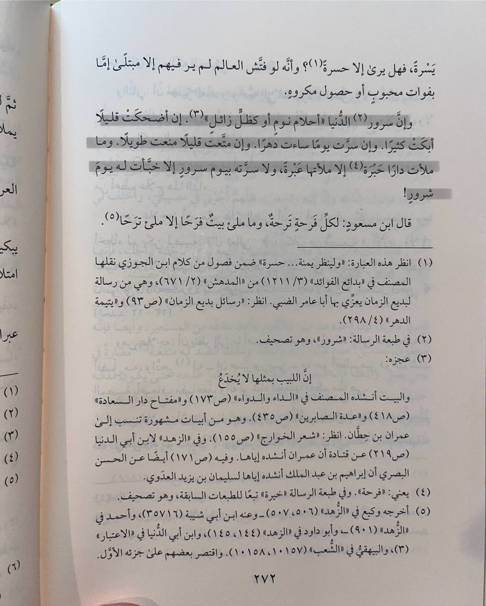

---

<!-- telegram-source: dar/messages3.html#message2709 -->
<!-- evidence-id: 000594 -->

---

<!-- telegram-source: dar/messages.html#message248 -->
<!-- evidence-id: 000595 -->

They unanimously agreed on the leadership (Imamate) of Abu Bakr, Umar, Uthman, and Ali (peace be upon them). And they give precedence to the first two caliphs (Abu Bakr and Umar). They also unanimously agreed that the ten who were promised Paradise are certainly and undoubtedly in Paradise.

They are unanimous in invoking mercy upon all the companions of the Messenger of Allah ﷺ, seeking forgiveness for them, for his wives, his children, and his household, and refraining from mentioning them except with goodness, and abstaining from investigating what transpired among them.

This, and similar matters, which would be lengthy to explain, has been unanimously agreed upon by people since Allah sent His Prophet ﷺ until our time, in the East and West, on land and sea, in plains and mountains. It is transmitted by scholars, hadith transmitters, and those who record historical accounts, known by the learned and the wise, and accepted by men and women, the elderly and the young, the adults and the children, in both urban and rural areas, among Arabs and non-Arabs. No one opposes this, denies it, or deviates from the consensus except a wicked, deviant, innovator, despicable, abandoned, and accursed person, whom the scholars shun, and the wise avoid. If he falls ill, they do not visit him, and if he dies, they do not attend his funeral.

[al-Ibānah al-Kubrā 1/359-360]

Show attached source scan

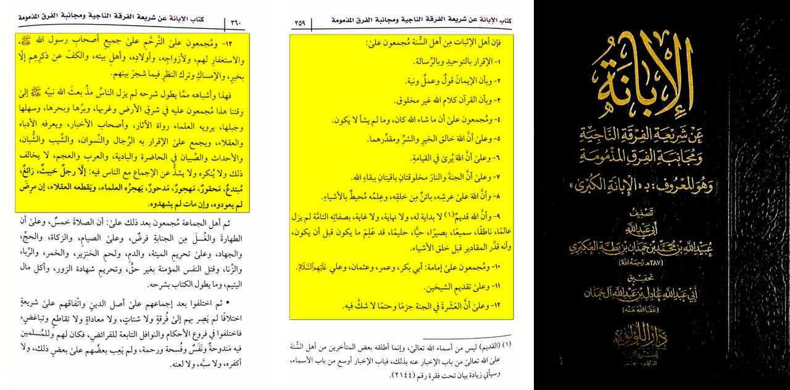

---

<!-- telegram-source: dar/messages3.html#message2550 -->
<!-- evidence-id: 000596 -->

How is tashrīʿ (legislation) understood in the above?

Shaykh Ṣāliḥ Āl-Shaykh was asked:

Question 123: What is the criterion for tashrīʿ (legislation)? Is it legislating a single matter, or up to 50%? Some people may legislate within their own homes and impose things upon their families — is this considered tashrīʿ and a replacement of Allah’s religion?

Answer: No, this is not tashrīʿ. What is the meaning of tashrīʿ (legislating)? Tashrīʿ, as mentioned, is to make ḥarām something that is ḥalāl, and to believe in its prohibition. Declaring something that is ḥalāl to be ḥarām — this is tashrīʿ. This is kufr.

But if someone says, “This isn’t your concern,” or “Don’t say it’s ḥarām,” or “It’s not ḥarām — we will do it, and you stay out of it,” then what he has done is merely impose his desire upon others. He hasn’t legislated. A legislator (musharriʿ) is someone who changes a ruling and says, “This is not such-and-such — it is instead this.” That’s tashrīʿ — changing the agreed-upon ruling of Allah while knowing what Allah’s ruling is, and then stating otherwise.

But all sinners — except those whom Allah guides — act arrogantly. They are too proud even to be reasoned with. Even, for example, a man in his home may be debating with his son, and the son may provoke his father to say something terrible. This is not birr (righteousness or dutifulness). That is why Allah said to His believing servants: “And do not insult those they invoke besides Allah, lest they insult Allah in enmity without knowledge.” (Sūrat al-Anʿām, 6:108)

[al-Ajwibah wa-al-Buḥūth wa-al-Mudārasāt al-Mushtamilah ʿalayhā al-Durūs al-ʿIlmiyyah 2/178]

Show attached source scan

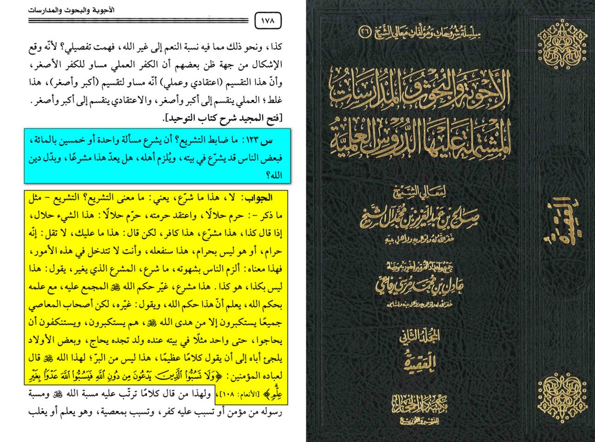

---

## 11. Istighāthah, Ṭalab al-Duʿāʾ, and Tawassul

Every unique substantive statement from the personal Istighatha/Tawasul Telegram topic and the relevant Dār as-Salafiyyah #tawḥīd posts is included below. Caption-only media not containing a written statement is omitted. Full-context passages found through the direct local-book search are placed under the same subjects rather than separated by collection.

<!-- telegram-source: dar/messages3.html#message3161 -->
<!-- evidence-id: 000597 -->

Shaykh al-Islam Ibn Taymiyyah said:

One of the gravest forms is that a person calls upon other than Allāh — while the one being called is either dead or absent — whether he be from the prophets, the righteous, or anyone else. He says things like: “Yā Sayyidī Fulān, help me,” or “I seek refuge with you,” or “I seek your aid,” or “Support me against my enemy,” and similar expressions. This is shirk with Allāh.

As for the one who seeks istighāthah from created beings, the shayṭān may fulfill his need, or part of it, and may appear to him in the form of the one whom he sought help from. The person then assumes that what occurred was a karāmah granted to the one he called upon, but it is only a shayṭān who entered and misled him because he committed shirk with Allāh — just as the shayṭān speaks through idols, or through the possessed, and so on. Such events are widespread in our time and in others.

I personally know of many such cases — too numerous to describe — where people sought istighāthah from me or from others, and later reported that someone came to them in my likeness or the likeness of another person, fulfilled their needs, and they believed that this was from the blessing of istighāthah. But in reality, it was only a shayṭān who misled and deceived them. This is the very origin of idol worship and of taking partners with Allāh in the earliest generations, as has been clearly established. Such a person has committed shirk with Allāh — we seek refuge in Allāh from that.

And even worse than this is when someone says, “Forgive me” or “Accept my repentance”, as is done by a group of ignorant mushrikīn.

[Majmū al-Fatāwa 1/350-351 by Ibn Taymiyyah]

Show attached source scan

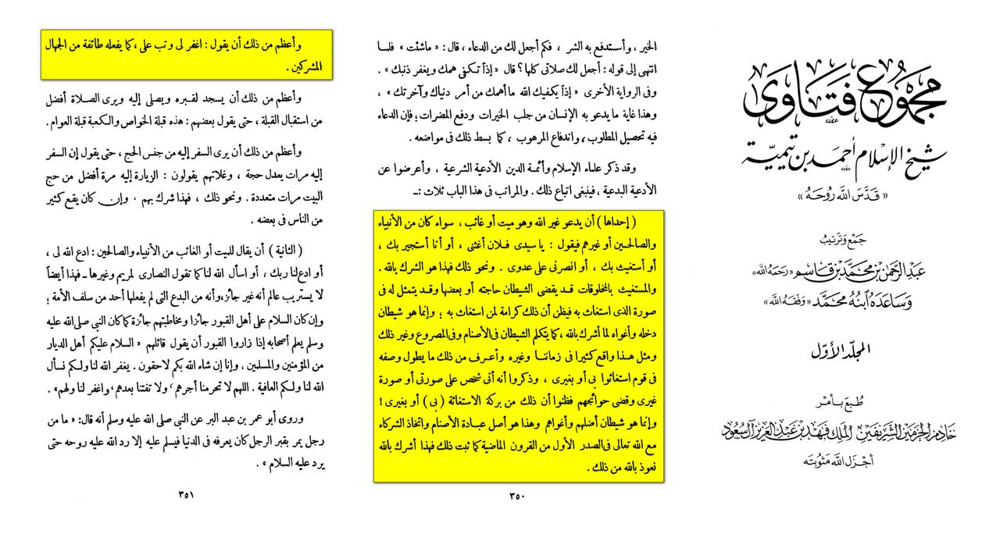

---

<!-- telegram-source: dar/messages3.html#message3082 -->
<!-- evidence-id: 000598 -->

Shaykh al-Islam Ibn Taymiyyah said:

All praise is due to Allāh, Lord of the worlds. Whoever seeks istighāthah from a deceased person or an absent human being — such that he calls upon him during hardships and tribulations and asks him to fulfill needs — saying: “Yā Sayyidī al-Shaykh Fulān! I am under your protection and in your care,” or says, when an enemy attacks him: “Yā Sayyidī Fulān!” seeking help and istighāthah from him, or says similar things when afflicted by illness, poverty, or other needs — such a person is misguided, ignorant, a mushrik, and disobedient to Allāh — by the agreement of the Muslims.

For they are all agreed that the dead are not to be called upon, nor is anything to be requested from them — whether they be prophets, shaykhs, or anyone else.

[Jāmiʿ al-Masāʾil by Ibn Taymiyyah 3/145-146]

Show attached source scan

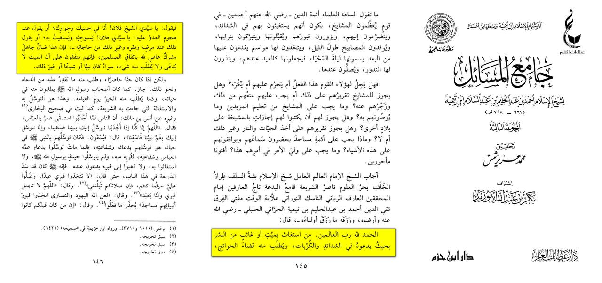

---

<!-- telegram-source: dar/messages4.html#message3973 -->
<!-- evidence-id: 000599 -->

Shaykh Sulaymān ibn ʿAbd Allāh ibn Muḥammad said:

Know that tawassul through the essence (dhāt) of a created being, or through their rank, is not the same as asking them or making duʿāʾ to them. Tawassul through their essence or their jāh is when one says: “O Allāh, forgive me, have mercy on me, admit me to Paradise through Your Prophet Muḥammad ﷺ,” or “through the rank of Your Prophet Muḥammad ﷺ,” and the like. This is an bid‘ah, not shirk.

But asking them and making duʿāʾ to them is when one says: “O Messenger of Allāh, I ask You for intercession,” or “I am in great distress, relieve me,” or “I seek protection with You from so-and-so, help me,” and the like. This is Kufr and shirk al-akbar that takes the person out of the millah, because it diverts the right of Allāh to someone else. Du‘āʾ is an act of worship that is valid only for Allāh. Whoever calls upon another has in effect worshipped them, and whoever worships other than Allāh has committed shirk.

The evidences for this are too many to enumerate. Many people do not distinguish between tawassul through a created being or through their rank, and asking or making duʿāʾ to them. Understand this, and may Allāh guide us and you to follow the best of paths.

[Ad-Durar as-Saniyyah 3/165-166]

Show attached source scan

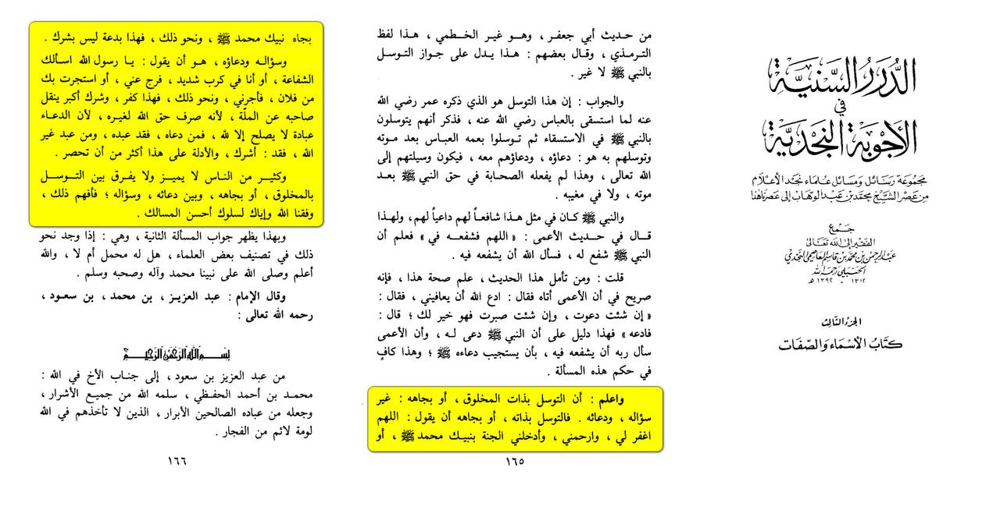

---

<!-- telegram-source: dar/messages5.html#message5069 -->
<!-- evidence-id: 000600 -->

Shaykh Sulaymān ibn ʿAbd Allāh Āl ash-Shaykh said:

So if an arguer disputes that the worship of shrines, and calling upon the dead alongside Allah, is not shirk, and that its people are not mushrikūn, then his affair becomes clear, and his obstinacy and kufr become apparent.

[ad-Durar as-Saniyyah 8/128]

Show attached source scan

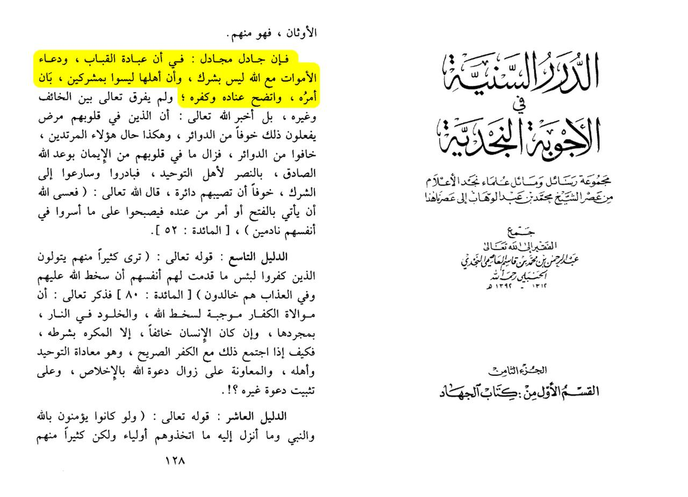

---

<!-- telegram-source: dar/messages5.html#message4824 -->
<!-- evidence-id: 000601 -->

Shaykh ʿAbd al-Raḥmān ibn Ḥasan ibn Muḥammad said:

If they intend by tawassul: the du‘āʾ of the dead, and seeking intercession through them, this is exactly the shirk of the mushrikūn; and the evidences for its nullity in the Qur’ān are very many.

Among them is Allāh’s statement: “Or have they taken other than Allāh as intercessors? Say, "Even though they do not possess [power over] anything, nor do they reason?" Say, "To Allāh belongs [the right to allow] intercession entirely. To Him belongs the dominion of the heavens and the earth. Then to Him you will be returned.’” (Sūrah az-Zumar 39:43–44) The one who has the dominion of the heavens and the earth is the One who grants permission for intercession, as Allāh also said: “Who is it that can intercede with Him except by His permission?” (Sūrah al-Baqarah 2:255)

[Ad-Durar as-Saniyyah 2/238]

Show attached source scan

---

<!-- telegram-source: dar/messages2.html#message1912 -->
<!-- evidence-id: 000602 -->

Shaykh ʿAbd ar-Raḥmān Ibn Ḥasan said:

Shaykh al-Islām (Ibn Taymiyyah), may Allāh have mercy on him, said: “Building mosques on graves is prohibited, and even if something other than a mosque is built on them, it is prohibited by the consensus of scholars, as it is a means to shirk and a forbidden act.”

He also said: “Know that the term ‘du’ā’ in the Qur’ān refers to two meanings: the ‘du’ā’ of worship’ and the ‘du’ā’ of asking.’ Every worshipper is a seeker, and every seeker is a supplicant. One term can encompass the other when separated from its context, and when both meanings are combined, it refers to one who asks for the seeking of benefits and the removal of harm through the forms of asking and requesting.”

I (Shaykh ʿAbd ar-Raḥmān Ibn Ḥasan) say: Look at this contradiction, confusion, and inconsistency. There is no doubt that disbelief opposes faith, invalidates it, and nullifies deeds, as confirmed by the Qur’ān, Sunnah, and the consensus of Muslims. Allāh, the Exalted, says: “And whoever disbelieves in the faith, his deeds are invalid, and he is among the losers in the Hereafter.” (Al-Mā’idah: 5).

It is said that every disbeliever is mistaken, and the polytheists have their justifications. They believe that their polytheism towards the righteous is an act of honoring them that benefits them and wards off harm. But Allāh did not excuse them for this mistake or misinterpretation. Allāh says: “And those who take protectors besides Him say, ‘We only worship them that they may bring us nearer to Allāh.’

Allāh will judge between them concerning what they differ.” (Az-Zumar: 3). And He also says: “Say, ‘Shall we inform you of the greatest losers in deeds? Those whose efforts have been wasted in this worldly life while they think that they are doing good.’” (Al-Kahf: 103-104). Where is the reason of this person in relation to these and similar clear verses?

The scholars, may Allāh have mercy on them, followed the path of uprightness and discussed the ruling of apostasy. None of them said that if a person commits an act of disbelief or says something of disbelief while not knowing that it contradicts the testimony of faith, he is not considered a disbeliever due to his ignorance.

And Allāh has clarified in His Book that some of the polytheists are ignorant followers, yet their ignorance and blind imitation did not prevent them from facing Allāh’s punishment, as He said:  “And among the people is he who disputes about Allāh without knowledge and follows every rebellious devil … to His saying: ‘The punishment of the Blaze.’” [Al-Ḥajj: 3-4]

[Taḥqīq Madhhab Ibn Taymiyyah fī Masʾalatay al-ʿUdhr bil-Jahl wa Takfīr al-Muʿayyan By Shaykh ʿAbd ar-Raḥmān Ibn Ḥasan Āl ash-Shaykh p.30-31]

Show attached source scan

---

<!-- telegram-source: dar/messages4.html#message3969 -->
<!-- evidence-id: 000603 -->

Shaykh Ibn Bāz was asked:

Question: Many students understand that shirk is limited to asking the dead to fulfill one’s needs. But if one asks them for intercession, meaning to make Duʿāʾ for them, they think this is not shirk al-akbar, but rather an bidʿah.

Answer: No, this is still shirk al-akbar. The reason is that the dead cannot make Duʿāʾ for anyone, nor can they intercede. All of them are bound by their own deeds. Duʿāʾ and intercession are only valid in life. That is why when ʿUmar and the Companions asked for rain, they did not ask the Prophet ﷺ to intercede for them after his death. Instead, they sought it through ʿAbbās, Yazīd ibn al-Aswad, and by Duʿāʾ. If it were lawful to seek rain or intercession from the Prophet ﷺ in his grave, they would have said: “make Duʿāʾ for us, O Messenger of Allah,” but they did not.

[Sharḥ Kashf ash-Shubuhāt by Shaykh Ibn Bāz p.53]

Show attached source scan

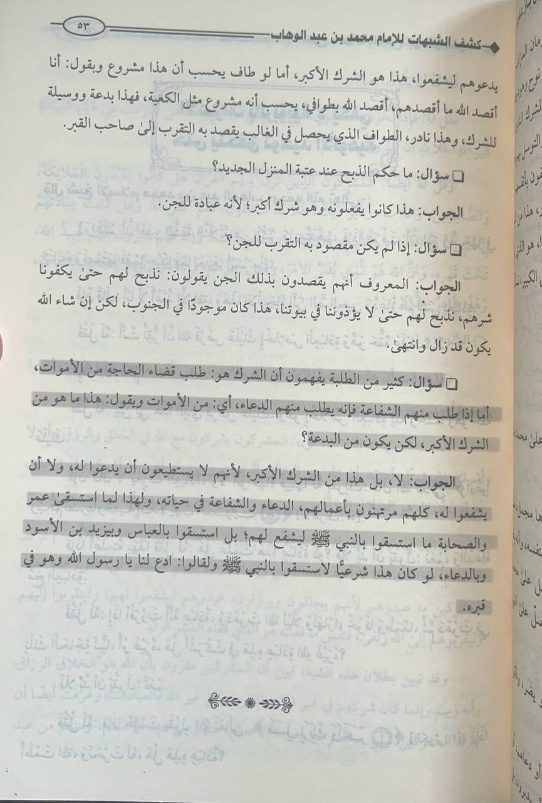

---

<!-- telegram-source: dar/messages4.html#message3905 -->
<!-- evidence-id: 000604 -->

Ṭalab ad-Duʿāʾ (requesting Duʿāʾ) from the dead is Shirk Akbar

Shaykh Ibn Bāz was asked:

Q: “A person comes to a grave and asks the one in it to make du‘ā’ for him to Allah—what is the ruling?”

A: “The same applies. He (the deceased) does not possess that. If someone says, ‘Intercede for me, or make du‘ā’ for me,’ this is shirk, without any doubt—because the deceased does not possess the ability to do that (i.e. to say) ‘Make du‘ā’ to Allah for me,’ or ‘Intercede for me’.

Q: “If he says to the grave: ‘Make du‘ā’ for me to Allah’?”

A: “This is not permissible. This is shirk, for he is requesting from the deceased what he cannot do. His affair (i.e., his ability to act) has ended.”

Q: “Some people claim this is the statement of Ibn Taymiyyah— is this correct, Shaykh?”

A: “Yes; he did not lie. Ibn Taymiyyah explicitly stated this. Ibn Taymiyyah made it clear that this is shirk akbar.”

[Subul as-Salām Sharḥ Nawāqiḍ al-Islām by Shaykh Ibn Bāz p.84-85]

Show attached source scan

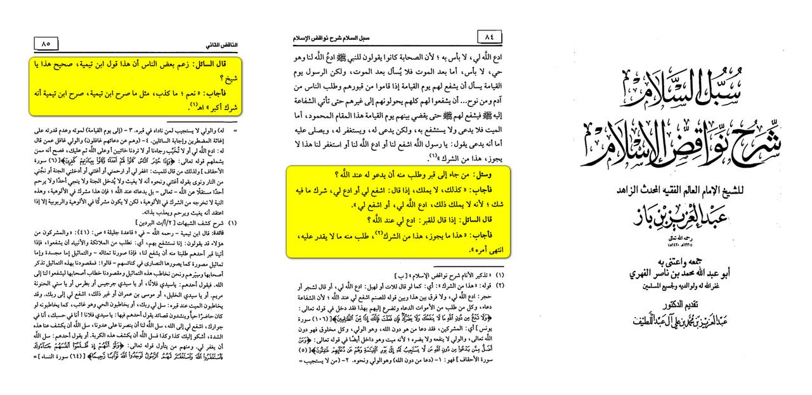

---

<!-- telegram-source: dar/messages4.html#message3747 -->
<!-- evidence-id: 000605 -->

Shaykh Ibn ʿUthaymīn was asked:

Q: “Some people say: ‘O Muhammad,’ or ‘O ʿAlī,’ or ‘O Jīlānī’ in times of distress. What is the ruling?”

A: If a person intends to call upon these individuals and seek help from them, then he is a mushrik committing shirk akbar, which expels him from the religion. He must repent to Allāh ʿAzza wa Jall and call upon Allāh alone. As Allāh says: “Is He [Allāh] not the One who responds to the distressed when they call upon Him, removes the evil, and appoints you as successors on the earth? Is there any deity with Allāh?” (Sūrah an-Naml:62)

Although he is a mushrik, he is also a fool who misguides himself. Allāh says: “And who would turn away from the millah of Ibrāhīm except a fool?” (Sūrah al-Baqarah:130) And He also says: “And who is more astray than one who calls upon other than Allāh, who will not respond to him until the Day of Resurrection, while they are heedless of their call?” (Sūrah al-Aḥqāf:5)

[Fatāwā ʿUlamāʾ al-Balad al-Ḥarām p.45]

Show attached source scan

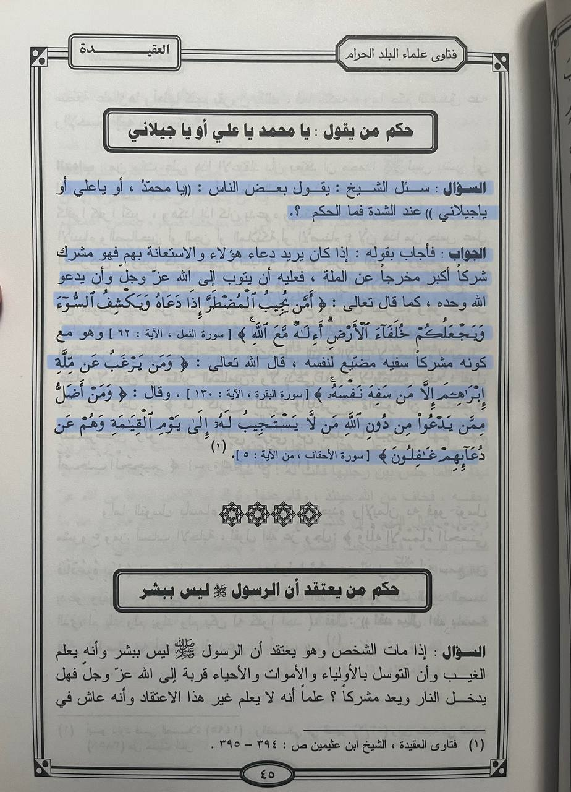

---

<!-- telegram-source: dar/messages4.html#message3723 -->
<!-- evidence-id: 000606 -->

Some of the Murji’ah use the claim of hidden shirk to excuse the mushrikĩn, they say Istighathā falls into this category, that it is hidden shirk. What did Our Imām’s Ibn Bāz and Ibn ‘Uthaymīn say regarding hidden shirk and what it is?

Shaykh Ibn Bāz was asked:

Question:

Your Eminence, you have mentioned shirk al-akbar (major shirk) and shirk al-asghar (minor shirk) — but what is shirk al-khafī (Hidden shirk), since some scholars have said that shirk is “more hidden than the crawling of a black ant on a smooth black stone”?

Answer:

Hidden shirk is of two types:

The first type is shirk al-asghar — and this is riyāʼ, for its place is in the hearts. It is called hidden shirk because it is subtle and often concealed, and it is also called minor shirk because it does not expel one from Islām, though it diminishes the sincerity of worship.

The second type is another form of hidden shirk, which is the shirk of hypocrisy — and we seek refuge with Allāh from it. This occurs within the hearts, when people conceal disbelief and misguidance, deny Allāh and His Messenger, and believe the message of the Prophet ﷺ to be false. This is major hypocrisy and constitutes shirk al-akbar and apostasy from Islām — we seek refuge with Allāh.

It is the hypocrisy of the munāfiqūn (hypocrites) — their showing off is the riyāʼ of the hypocrites, and their disbelief is the kufr of the hypocrites; outwardly they are with the Muslims, but inwardly they are with the disbelievers through their corrupt beliefs and their denial of Allāh and His Messenger.

Allāh said regarding them: “In their hearts is a disease, and Allāh has increased their disease.” (Sūrah al-Baqarah, 2:10)

---

<!-- telegram-source: dar/messages4.html#message3280 -->
<!-- evidence-id: 000607 -->

Shaykh Ṣāliḥ al-Fawzān was asked:

Question: Is this statement correct? Those who say that if you ask a dead person to pray for you, it is a form of supplication which is bidʿah and not shirk — is this statement correct?

Answer: This is a false statement. Asking the dead for one’s needs is shirk, and no one disputes this. As for asking the living, who are able to fulfill it, there is no harm — this falls under assistance and cooperation in righteousness and piety. But nothing should be asked from the dead. Rather, supplications are made for them: prayers are asked on their behalf, charity is given for them, Hajj or ʿUmrah may be performed on their behalf. They are in need of others’ supplications; nothing should be requested from them, since they are dead.

<video class="source-video" controls preload="metadata" src="assets/videos/dar-messages4-3280.mp4"></video>

Video source from the Telegram export.

---

<!-- telegram-source: dar/messages4.html#message3965 -->
<!-- evidence-id: 000608 -->

Shaykh Ṣāliḥ Āl ash-Shaykh said:

As for the technical usage: al-shafāʿah (intercession) is a general term for every duʿāʾ that the Prophet ﷺ will make for his ummah on the Day of Resurrection. Every supplication he offers to Allāh in the great gathering on that Day is counted as shafāʿah. This is like what has come in the hadith: “Ummati, ummati” (my ummah, my ummah), or “Ummati yā Rabb” (my ummah, O Lord), and similar expressions. All of these are shafāʿah. For this reason, the scholars classified shafāʿah into several types, due to what appears in the narrations and due to the differing wordings regarding it.

Shafāʿah is duʿāʾ, and Ṭalab ash-shafāʿah (requesting shafāʿah) is Ṭalab ad-Duʿā (requesting duʿāʾ). So if someone says: “I seek istishfāʿ (request for intercession),” it is as if he said: “I ask the Messenger ﷺ to make duʿāʾ for me with Allāh.” Shafāʿah is a request; therefore, whoever seeks istishfāʿ is requesting shafāʿah. Shafāʿah is duʿāʾ, and it is also the seeking of duʿāʾ.

For this reason, every proof previously presented—and every proof in the Book or the Sunnah that invalidates calling upon alongside Allāh any being that is treated like an deity—serves as evidence against shafāʿah of the dead, meaning against istishfāʿ with the dead and with those absent from the realm of responsibility. This is because the true nature of the intercessor is that he is one who requests, and the true nature of the one seeking intercession is also that he is one who requests. In the assumption of the seeker, the shāfiʿ is making duʿāʾ, and the seeker is calling upon the one from whom he seeks shafāʿah.

Meaning: if a person comes to the grave of the Prophet ﷺ, or the grave of a walī, or something similar, and says: “I seek shafāʿah through you,” or “I ask for shafāʿah,” he has requested and called upon that being to make duʿāʾ for him.

For this reason, directing shafāʿah toward other than Allāh becomes major shirk, because in reality it is a duʿāʾ to other than Allāh. In reality it is a request from this dead person—a request, a turning with petition and duʿāʾ to other than Allāh. Thus one directs to other than Allāh what is in essence asking, requesting, and praying.

[Sharḥ Fatḥ al-Majīd li-Sharḥ Kitāb at-Tawḥīd by Shaykh Ṣāliḥ Āl ash-Shaykh 2/41-42]

Show attached source scan

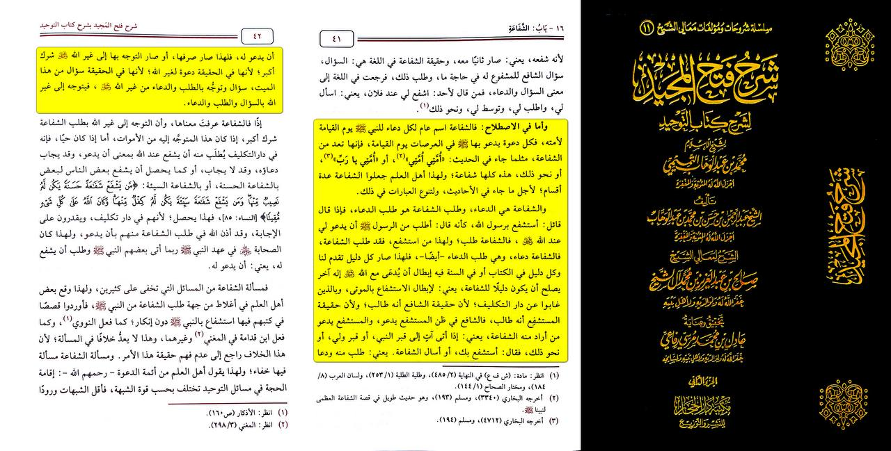

---

<!-- telegram-source: dar/messages4.html#message3397 -->
<!-- evidence-id: 000609 -->

Shaykh Ayman al-ʿAnqarī said:

A very important issue: What is the ruling on requesting shafāʿah (intercession) and duʿāʾ (supplication) from the dead, such as one saying, “O Messenger of Allāh, ask Allāh for me,” or “supplicate to Allāh for me,” or saying, “O ʿAbd al-Qādir al-Jīlānī, intercede for me”?

Requesting intercession from the dead is shirk akbar (major shirk), whether at the grave of the dead or from afar.

And Imām Abū al-ʿAbbās Ibn Taymiyyah mentioned in his book Qāʿidah ʿAẓīmah fī al-Farq bayna ʿIbādāt al-Islām wa ʿIbādāt al-Shirk (pp. 31–32) that the way of the Ṣaḥābah (may Allāh be pleased with them) was that they considered this shirk—seeking intercession through the angels, the dead, the prophets, and the righteous. And he mentioned that this was the creed of the Ṣaḥābah (may Allāh be pleased with them) by ijmāʿ.

And also, shafāʿah means request and asking. So when you say, “O Messenger of Allāh, intercede for me,” or “ask Allāh for me,” you have directed to him a type from the types of worship, which is duʿāʾ, and duʿāʾ is not directed except to Allāh. You have directed it to other than Him, so you fell into shirk akbar.

And for this reason, he ﷺ said in the ḥadīth of al-Nuʿmān ibn Bashīr with the people of the Sunan: “Ad-duʿāʾ is worship.” And he brought it with the particle of restriction and the separating pronoun to show exclusivity—that worship is confined within duʿāʾ.

And Ibn Taymiyyah, may Allāh have mercy on him, also pointed out in Qāʿidah ʿAẓīmah fī al-Farq bayna ʿIbādāt al-Islām wa ʿIbādāt al-Shirk (p. 136) an important point in this issue: that they believe, by their requesting from the dead and requesting shafāʿah from them, in a spiritual presence for them, and that they have movement and influence. So the souls of those who invoke them from among the grave-worshippers connect with those dead.

And he referred to that in Majmūʿ al-Fatāwā (vol. 1, p. 167), with his statement:

“And a people from the heretical philosophers of naturalism innovated another form of shirk, which they mentioned concerning the visitation of graves, as Ibn Sīnā mentioned that. And regarding the meaning of shafāʿah, he said: the intercession of the prophets and the righteous, according to the foundation of this idolatrous philosophical belief that Ibn Sīnā and others held, is not as the people of īmān know it—that it is a supplication by which the righteous man supplicates and it is answered—but they claim that the influence in the forces of the world or in the events of the world is the force of the soul, or the movements of the celestial spheres, or the natural force. And man, in their claim, if he loves a righteous man who has died, especially if he visits his grave, then his soul attains a connection with the soul of that dead person, in that which benefits from that separated soul from the ‘active intellect’ according to them.” So his words ended.

This explicit text from Ibn Taymiyyah mentioned a reason for this image—requesting shafāʿah and duʿāʾ from the dead—being shirk, and what the heretical philosophers such as Ibn Sīnā were upon: that they believe in a spiritual presence for the dead, so their souls connect with them, and they believe in their influence in raising their needs to Allāh.

Thus it became clear that the form of requesting shafāʿah and duʿāʾ from the dead is shirk akbar, and it is not an innovation as some people claim at his grave. Rather, it is shirk akbar whether at the shrine of the dead or away from it, as Ibn Taymiyyah mentioned that.

Show attached source scan

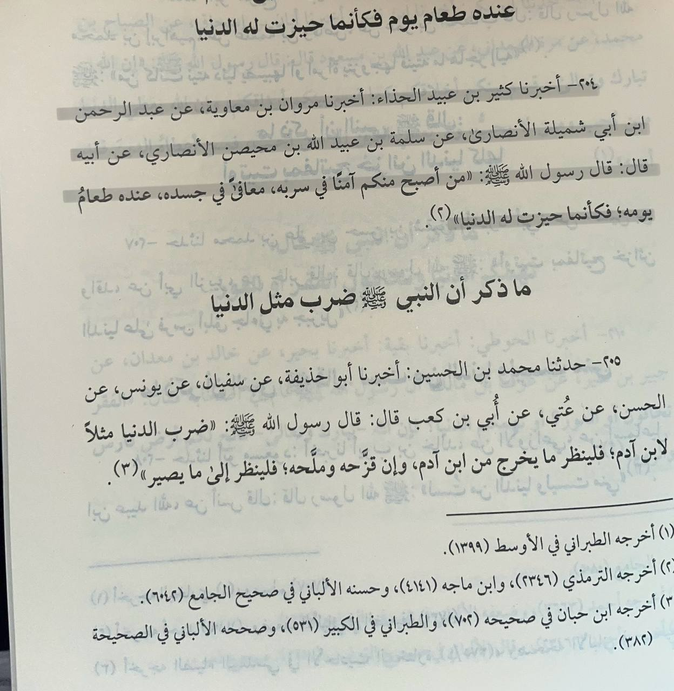

---

### Foundations: duʿāʾ, worship, and istighāthah
<!-- evidence-id: 000610 -->

<!-- telegram-source: dar/messages3.html#message2200 -->
<!-- evidence-id: 000611 -->

Abū ʿAbdullāh (Imām Aḥmad) said:

There is no deed after the declaration of tawḥīd of Allāh that is better than prayer.

For it begins with tawḥīd and the glorification of Allāh through takbīr, then praise upon Allāh through reciting the Fātiḥah, which is praise, exaltation, and supplication. Likewise, glorification (tasbīḥ) in rukūʿ and sujūd, the takbīrāt at every lowering and rising—all of that is tawḥīd and glorification of Him.

It ends with the testimony of His tawḥīd and the messengership of His Prophet. Its rukūʿ and sujūd are expressions of humility and submission to Him.

Raising the hands in opening and bowing, lifting the head—these are to magnify and venerate Allāh. Placing the right hand over the left while standing expresses humility before Allāh and surrender in servitude.”

Source: Ta'ẓīm Qadr aṣ-Ṣalāh - Imām  al-Marwazī 1/268

Show attached source scan

---

<!-- telegram-source: dar/messages2.html#message1882 -->
<!-- evidence-id: 000612 -->

Imām Al-Bukhārī mentioned in his Ṣaḥīḥ:

Chapter 40: The Saying of Allah the Almighty: “So do not set up rivals to Allah”

And His saying, exalted be His mention: “And you set up rivals to Him while He is the Lord of all worlds.” And His saying: “And those who do not invoke with Allah another deity.” And His saying: “And indeed, it has been revealed to you and to those before you that if you associate others with Allah, your deeds will surely be nullified, and you will certainly be among the losers. Rather, worship Allah and be among the grateful.”

‘Ikrimah said regarding the verse: “And most of them do not believe in Allah except while they associate others with Him.” If you ask them who created them and who created the heavens and the earth, they will surely say, “Allah.” That is their belief, yet they worship others besides Him. And regarding what has been mentioned about the creation of the actions of the servants and their deeds, Allah the Almighty says: “And He created everything and determined it with precise measurement.”

Source: Ṣaḥīḥ al-Bukhārī p.1858

Show attached source scan

---

<!-- telegram-source: dar/messages2.html#message1762 -->
<!-- evidence-id: 000613 -->

Imām aṭ-Ṭabarī رحمه الله said:

His saying: “If you invoke them, they do not hear your supplication, and even if they heard, they would not respond to you” (Quran 35:14).

Allah, the Almighty, states: O people, if you call upon these deities that you worship besides Allah, they will not hear your supplication, for they are lifeless objects that do not comprehend what you say.

“And even if they heard, they would not respond to you”—meaning, even if they were able to hear your supplication and understand your words, by being given the ability to hear, they still would not respond to you, as they are not sentient beings. Not everyone who hears a statement is necessarily able to reply to it.

Allah, the Almighty, is addressing the polytheists who associate idols and false gods with Him, saying: How can you worship something that has these attributes—something that can neither benefit you nor harm you? And how can you abandon the worship of the One who holds both your benefit and harm in His hands, the One who created you and bestowed His blessings upon you?

[Tafsīr aṭ-Ṭabarī 19/350-351]

Show attached source scan

---

<!-- telegram-source: dar/messages.html#message248 -->
<!-- evidence-id: 000614 -->

They unanimously agreed on the leadership (Imamate) of Abu Bakr, Umar, Uthman, and Ali (peace be upon them). And they give precedence to the first two caliphs (Abu Bakr and Umar). They also unanimously agreed that the ten who were promised Paradise are certainly and undoubtedly in Paradise.

They are unanimous in invoking mercy upon all the companions of the Messenger of Allah ﷺ, seeking forgiveness for them, for his wives, his children, and his household, and refraining from mentioning them except with goodness, and abstaining from investigating what transpired among them.

This, and similar matters, which would be lengthy to explain, has been unanimously agreed upon by people since Allah sent His Prophet ﷺ until our time, in the East and West, on land and sea, in plains and mountains. It is transmitted by scholars, hadith transmitters, and those who record historical accounts, known by the learned and the wise, and accepted by men and women, the elderly and the young, the adults and the children, in both urban and rural areas, among Arabs and non-Arabs. No one opposes this, denies it, or deviates from the consensus except a wicked, deviant, innovator, despicable, abandoned, and accursed person, whom the scholars shun, and the wise avoid. If he falls ill, they do not visit him, and if he dies, they do not attend his funeral.

Source: al-Ibānah al-Kubrā 1/359-360

Show attached source scan

---

<!-- telegram-source: dar/messages2.html#message1956 -->
<!-- evidence-id: 000615 -->

Shaykh Abu Muhammad Muwaffaq al-Dīn Ibn Qudāmah said:

As for matters that contradict tawḥīd and belief in the message, he, may Allah have mercy on him, explicitly stated in many places that those who engage in them are disbelievers, and they should be killed after being given the opportunity to repent. He did not excuse them due to ignorance, even though we are certain that the reason they fell into these matters was due to ignorance of their true nature. If they had known that such actions are disbelief that expels one from Islam, they would not have committed them. This is something the Sheikh, may Allah have mercy on him, frequently discussed in his writings, such as when he said in some of his books:

“Anyone who exaggerates in his veneration of a prophet or a righteous man and attributes a form of divinity to him, such as calling upon him instead of Allah — for example, saying: ‘O so-and-so, help me,’ or ‘Forgive me,’ or ‘Have mercy on me,’ or ‘Help me,’ or ‘Compensate me,’ or ‘I rely upon you,’ or ‘You are sufficient for me,’ and similar statements that are specific to the lordship of Allah, which are not appropriate for anyone but Allah — all of this is shirk (polytheism) and misguidance. The person should be given a chance to repent, and if he repents, then fine; if not, he should be killed.

Whoever places intermediaries between himself and Allah, calls upon them, relies upon them, and asks them for assistance has disbelieved, by ijmāʿ.

Whoever believes that visiting the people of dhimmah in their churches is an act of drawing closer to Allah has apostatized. Even if they are ignorant of the prohibition, they should be informed. If they persist, they become apostates.

Whoever insults the Sahābah, or any one of them, and associates with this insult a claim that ʿAlī is a god or a prophet, or that Jibrīl made a mistake — there is no doubt in the disbelief of this person. In fact, there is no doubt in the disbelief of anyone who hesitates in declaring their disbelief.

Whoever claims that the Sahābah apostatized after the Messenger of Allah (ﷺ), except for a few who number less than fifteen, or that they became corrupt, there is no doubt in the disbelief of the one who says this. In fact, anyone who doubts the disbelief of such a person is himself a disbeliever.

Notice how he declared the doubter a disbeliever, even though the doubter may be ignorant. He did not consider ignorance an excuse in such matters.

He also said, during part of his speech: “This is why it is said: Whoever sins out of pride, like Iblīs, is a disbeliever by unanimous agreement, while whoever sins out of desire is not a disbeliever according to Ahl al-Sunnah. And whoever commits prohibited actions while considering them permissible is a disbeliever by unanimous agreement.”

Source: Masʾalah fīman Yukaffiru Ghayrahū min al-Muslimīn - Shaykh by Abdullāh Abā Buṭayn p.23-24

Show attached source scan

---

<!-- telegram-source: personal/messages.html#message852 -->
<!-- evidence-id: 000616 -->

Shaykh Al-Islam Ibn Taymiyyah said:

There is duʿāʾ al-ʿibādah (the supplication of worship) and duʿāʾ al-masʾalah (the supplication of request). In the Qurʾān, duʿāʾ is sometimes intended to mean this and sometimes that, and sometimes both of them together; and they are inseparably connected.

For duʿāʾ al-masʾalah is seeking that which benefits the supplicant and seeking the removal of that which harms him and its repelling. And everyone who possesses harm and benefit is the one who is worshipped; it is necessary that he be the possessor of benefit and harm. For this reason, He condemned those who worshipped besides Him that which possesses neither harm nor benefit.

And this occurs frequently in the Qurʾān, such as His statement: ‘And do not call upon besides Allah that which neither benefits you nor harms you.’ [Yūnus 10:106] And He said: ‘And they worship other than Allāh that which neither harms them nor benefits them.’ [Yūnus 10:18]

Thus He, negated from these objects of worship both limited and transitive harm and benefit. They possess neither for themselves nor for their worshippers.

And this occurs frequently in the Qurʾān. He clarifies that the one who is worshipped must necessarily be the possessor of benefit and harm. So he calls upon him for benefit and harm with duʿāʾ al-masʾalah, and he calls upon him in fear and hope with duʿāʾ al-ʿibādah.

Thus it is known that the two types are inseparably connected. Every duʿāʾ al-ʿibādah necessarily entails duʿāʾ al-masʾalah, and every duʿāʾ al-masʾalah contains duʿāʾ al-ʿibādah.

Source: Majmū al-Fatāwa 15/10-11 by Ibn Taymiyyah

Show Arabic source text

المصدر: مجموع الفتاوى

<h4 dir="rtl">ص. 10</h4>

وَقَالَ الشَّيْخُ تَقِيُّ الدِّينِ أَحْمَد بْنُ تَيْمِيَّة عَلَى قَوْلِ اللَّهِ عز وجل: {ادْعُوا رَبَّكُمْ تَضَرُّعًا وَخُفْيَةً إنَّهُ لَا يُحِبُّ الْمُعْتَدِينَ} {وَلَا تُفْسِدُوا فِي الْأَرْضِ بَعْدَ إصْلَاحِهَا وَادْعُوهُ خَوْفًا وَطَمَعًا إنَّ رَحْمَةَ اللَّهِ قَرِيبٌ مِنَ الْمُحْسِنِينَ} : هَاتَانِ الْآيَتَانِ مُشْتَمِلَتَانِ عَلَى آدَابِ نَوْعَيْ الدُّعَاءِ: دُعَاءُ الْعِبَادَةِ وَدُعَاءُ الْمَسْأَلَةِ؛ فَإِنَّ الدُّعَاءَ فِي الْقُرْآنِ يُرَادُ بِهِ هَذَا تَارَةً وَهَذَا تَارَةً وَيُرَادُ بِهِ مَجْمُوعُهُمَا؛ وَهُمَا مُتَلَازِمَانِ. فَإِنَّ دُعَاءَ الْمَسْأَلَةِ هُوَ طَلَبُ مَا يَنْفَعُ الدَّاعِيَ وَطَلَبُ كَشْفِ مَا يَضُرُّهُ وَدَفْعِهِ. وَكُلُّ مَنْ يَمْلِكُ الضُّرَّ وَالنَّفْعَ فَإِنَّهُ هُوَ الْمَعْبُودُ لَا بُدَّ أَنْ يَكُونَ مَالِكًا لِلنَّفْعِ وَالضُّرِّ. وَلِهَذَا أَنْكَرَ تَعَالَى عَلَى مَنْ عَبَدَ مَنْ دُونِهِ مَا لَا يَمْلِكُ ضُرًّا وَلَا نَفْعًا. وَذَلِكَ كَثِيرٌ فِي الْقُرْآنِ كَقَوْلِهِ تَعَالَى: {وَلَا تَدْعُ مِنْ دُونِ اللَّهِ مَا لَا يَنْفَعُكَ وَلَا يَضُرُّكَ} وَقَالَ: {وَيَعْبُدُونَ مِنْ دُونِ اللَّهِ مَا لَا يَضُرُّهُمْ وَلَا يَنْفَعُهُمْ} فَنَفَى سُبْحَانَهُ عَنْ هَؤُلَاءِ الْمَعْبُودِينَ الضُّرَّ وَالنَّفْعَ الْقَاصِرَ وَالْمُتَعَدِّيَ فَلَا يَمْلِكُونَ لِأَنْفُسِهِمْ وَلَا لِعَابِدِيهِمْ. وَهَذَا كَثِيرٌ فِي الْقُرْآنِ يُبَيِّنُ تَعَالَى أَنَّ الْمَعْبُودَ لَا بُدَّ أَنْ يَكُونَ مَالِكًا

<h4 dir="rtl">ص. 11</h4>

لِلنَّفْعِ. وَالضُّرِّ فَهُوَ يَدْعُو لِلنَّفْعِ وَالضُّرِّ دُعَاءَ الْمَسْأَلَةِ وَيَدْعُو خَوْفًا وَرَجَاءً دُعَاءَ الْعِبَادَةِ فَعُلِمَ أَنَّ النَّوْعَيْنِ مُتَلَازِمَانِ فَكُلُّ دُعَاءِ عِبَادَةٍ مُسْتَلْزِمٌ لِدُعَاءِ الْمَسْأَلَةِ. وَكُلُّ دُعَاءِ مَسْأَلَةٍ مُتَضَمِّنٌ لِدُعَاءِ الْعِبَادَةِ. وَعَلَى هَذَا فَقَوْلُهُ: {وَإِذَا سَأَلَكَ عِبَادِي عَنِّي فَإِنِّي قَرِيبٌ أُجِيبُ دَعْوَةَ الدَّاعِ إذَا دَعَانِ} يَتَنَاوَلُ نَوْعَيْ الدُّعَاءِ. وَبِكُلِّ مِنْهُمَا فُسِّرَتْ الْآيَةُ. قِيلَ: أُعْطِيهِ إذَا سَأَلَنِي. وَقِيلَ: أُثِيبُهُ إذَا عَبَدَنِي. وَالْقَوْلَانِ مُتَلَازِمَانِ. وَلَيْسَ هَذَا مِنْ اسْتِعْمَالِ اللَّفْظِ الْمُشْتَرَكِ فِي مَعْنَيَيْهِ كِلَيْهِمَا أَوْ اسْتِعْمَالِ اللَّفْظِ فِي حَقِيقَتِهِ وَمَجَازِهِ؛ بَلْ هَذَا اسْتِعْمَالُهُ فِي حَقِيقَتِهِ الْمُتَضَمِّنَةِ لِلْأَمْرَيْنِ جَمِيعًا فَتَأَمَّلْهُ فَإِنَّهُ مَوْضُوعٌ عَظِيمُ النَّفْعِ وَقُلْ مَا يُفْطَنُ لَهُ. وَأَكْثَرُ آيَاتِ الْقُرْآنِ دَالَّةٌ عَلَى مَعْنَيَيْنِ فَصَاعِدًا فَهِيَ مِنْ هَذَا الْقَبِيلِ. مِثَالُ ذَلِكَ قَوْله تَعَالَى {أَقِمِ الصَّلَاةَ لِدُلُوكِ الشَّمْسِ إلَى غَسَقِ اللَّيْلِ} فُسِّرَ &quot; الدُّلُوكُ &quot; بِالزَّوَالِ وَفُسِّرَ بِالْغُرُوبِ وَلَيْسَ بِقَوْلَيْنِ؛ بَلْ اللَّفْظُ يَتَنَاوَلُهُمَا مَعًا؛ فَإِنَّ الدُّلُوكَ هُوَ الْمَيْلُ. وَدُلُوكُ الشَّمْسِ مَيْلُهَا. وَلِهَذَا الْمَيْلِ مُبْتَدَأٌ وَمُنْتَهًى فَمُبْتَدَؤُهُ الزَّوَالُ وَمُنْتَهَاهُ الْغُرُوبُ وَاللَّفْظُ مُتَنَاوِلٌ لَهُمَا بِهَذَا الِاعْتِبَارِ. وَمِثَالُهُ أَيْضًا تَفْسِيرُ &quot; الْغَاسِقِ &quot; بِاللَّيْلِ وَتَفْسِيرُهُ بِالْقَمَرِ. فَإِنَّ ذَلِكَ

---

<!-- telegram-source: personal/messages.html#message759 -->
<!-- evidence-id: 000617 -->

Shaykh al-Islam Ibn Taymiyyah said:

The point here is to clarify that shirk has types: one type is that they take them as intercessors, asking them for intercession and du‘ā’ from the dead and the absent, and from their statues.

Source: Qāʿidah ʿAẓīmah fī al-Farq bayna ʿIbādāt Ahl al-Islām wa al-Īmān wa ʿIbādāt Ahl ash-Shirk wa an-Nifāq by Ibn Taymiyyah p.135

Show attached source scan

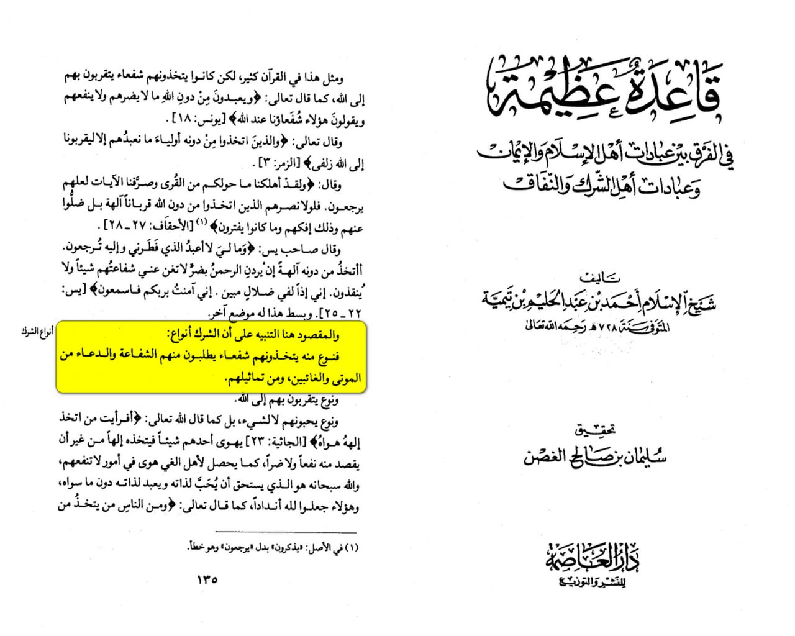

---

<!-- telegram-source: personal/messages.html#message563 -->
<!-- evidence-id: 000618 -->

Shaykh al-Islam Ibn Taymiyyah said:

And the meaning here is: that shirk occurs frequently, and likewise shirk with the people of the graves through such actions as their du‘ā’, pleading to them, desiring them, and the like.

So if the Prophet ﷺ forbade ṣalāh that includes du‘ā’ directed exclusively to Allāh alone at graves, lest it lead to a type of shirk in their Lord, then how much more so if there exists a type of shirk in desiring them, whether by asking them to fulfill needs or relieve distress, or asking them to request it from Allāh Ta‘ālā.

Source: Iqtiḍāʾ aṣ-Ṣirāṭ al-Mustaqīm by Ibn Taymiyyah 2/304-305

Show Arabic source text

المصدر: اقتضاء الصراط المستقيم

<h4 dir="rtl">ص. 304</h4>

هؤلاء المشركين، ولهذا قال الخليل عليه السلام {أَفَرَأَيْتُمْ مَا كُنْتُمْ تَعْبُدُونَ - أَنْتُمْ وَآبَاؤُكُمُ الْأَقْدَمُونَ - فَإِنَّهُمْ عَدُوٌّ لِي إِلَّا رَبَّ الْعَالَمِينَ} [الشعراء: 75 - 77] (1) وقال الخليل (2) {إِنَّنِي بَرَاءٌ مِمَّا تَعْبُدُونَ - إِلَّا الَّذِي فَطَرَنِي فَإِنَّهُ سَيَهْدِينِ} [الزخرف: 26 - 27] (3) .

والخليل صلوات الله عليه، أنكر شركهم بالكواكب (4) العلوية، وشركهم (5) بالأوثان، التي هي تماثيل وطلاسم لتلك (6) أو هي أمثال (7) لمن مات من الأنبياء والصالحين وغيرهم، وكسر (8) الأصنام، كما قال تعالى عنه: {فَجَعَلَهُمْ جُذَاذًا إِلَّا كَبِيرًا لَهُمْ لَعَلَّهُمْ إِلَيْهِ يَرْجِعُونَ} [الأنبياء: 58] (9) .

والمقصود هنا: أن الشرك (10) وقع كثيرا، وكذلك الشرك بأهل القبور بمثل (11) دعائهم، والتضرع إليهم، والرغبة إليهم، ونحو ذلك.

فإذا كان النبي صلى الله عليه وسلم: نهى عن الصلاة التي تتضمن (12) الدعاء لله وحده خالصا عند القبور؛ لئلا يفضي ذلك إلى نوع من الشرك بربهم، فكيف إذا وجد ما هو نوع (13) الشرك من الرغبة إليهم، سواء طلب منهم قضاء الحاجات، وتفريج

(1) سورة الشعراء: الآيات 75- 77.

(2)

الخليل: سقطت من (ب) .

(3)

سورة الزخرف: الآيتان 26، 27.

(4)

في المطبوعة: بعبادة الكواكب.

(5)

في المطبوعة: بعبادة الأوثان.

(6)

في المطبوعة: لتلك الكواكب.

(7)

في المطبوعة: تماثيل.

(8)

في (أط) : وذكر الأصنام.

(9)

سورة الأنبياء: الآية 58.

(10)

في المطبوعة: أن الشرك بعبادة الكواكب.

(11)

في المطبوعة: المقبورين من دعائهم.

(12)

(أط) : تضمن.

(13)

في (أ) : نوع من الشرك.

<h4 dir="rtl">ص. 305</h4>

الكربات، أو طلب منهم أن يطلبوا ذلك من الله تعالى؟ بل لو أقسم على الله ببعض خلقه من الأنبياء والملائكة وغيرهم؛ لنهي عن ذلك ولو لم يكن عند قبره (1) كما لا يقسم بمخلوق مطلقا، وهذا القسم منهي عنه، غير منعقد (2) باتفاق الأئمة.

وهل هو نهي تحريم أو تنزيه؟ على قولين: أصحهما: أنه نهي تحريم (3) .

ولم يتنازع العلماء إلا في الحلف بالنبي صلى الله عليه وسلم خاصة، فإن فيه قولين في مذهب أحمد (4) وبعض أصحابه، كابن عقيل طرد الخلاف (5) في الحلف بسائر الأنبياء، لكن القول الذي عليه جمهور الأئمة، كمالك والشافعي وأبي حنيفة وغيرهم: أنه لا ينعقد اليمين بمخلوق البته، ولا يقسم بمخلوق البته، وهذا هو الصواب (6) .

والإقسام على الله بنبيه محمد صلى الله عليه وسلم مبني على هذا الأصل، ففيه هذا النزاع، وقد نقل عن أحمد في التوسل بالنبي صلى الله عليه وسلم في (منسك المروزي) ما يناسب قوله بانعقاد اليمين به، لكن الصحيح أنه لا تنعقد اليمين به. فكذلك هذا (7) .

وأما غيره: فما علمت بين الأئمة (8) فيه نزاعا بل قد صرح العلماء بالنهي

(1) في (ب) زاد: يعني الإقسام به.

(2)

في (أط) : معتقد.

(3)

انظر: المغني والشرح الكبير (11 / 162، 164، 209) ؛ وبداية المجتهد (2 / 499، 500) ؛ ومجموع الفتاوى للمؤلف (33 / 62، 68، 125، 126) ، و (35 / 243) ، و (1 / 204) .

(4)

من هنا حتى قوله: لكن القول (سطر تقريبا) : سقط من (أط) .

(5)

في (ب) : طردا للخلاف.

(6)

انظر: المغني والشرح الكبير (11 / 209) ؛ ومجموع الفتاوى (35 / 243) .

(7)

في (ب) : زاد: يعني الإقسام. وهو تفسير لمرجع الإشارة.

(8)

في (أ) وفي المطبوعة: الأمة.

---

<!-- telegram-source: personal/messages.html#message548 -->
<!-- evidence-id: 000619 -->

Shaykh al-Islām Ibn Taymiyyah said:

“Whoever takes the angels or the prophets as lords has committed kufr after his islām, by the agreement of the Muslims. Rather, whoever permits that the created being may be called upon, while forbidding the calling upon the Creator — in which lies the realization of His absolute self-sufficiency and ulūhiyyah — has contradicted Islām.”

Source: Mukhtaṣar Ḍawābiṭ al-Takfīr by Shaykh Abī al-ʿAlā ar-Rāshid p.95

Show attached source scan

---

<!-- telegram-source: dar/messages2.html#message1560 -->
<!-- evidence-id: 000620 -->

Sheikh al-Islam Ibn Taymiyyah said:

Associating partners with Allah in love, worship, supplication, and requests is different from associating partners in belief and acknowledgment. As Allah says:

“And of mankind are some who take (for worship) others besides Allâh as rivals (to Allâh). They love them as they love Allâh. But those who believe, love Allâh more (than anything else).” (Al-Baqarah: 165)

So, whoever loves a created being as they love the Creator has committed shirk, taking equals alongside Allah in love. Even if they acknowledge that Allah is their Creator, they have still fallen into this form of shirk.

Source: Majmū Fatāwā by Ibn Taymiyyah 10/265

Show Arabic source text

المصدر: مجموع الفتاوى

<h4 dir="rtl">ص. 265</h4>

أُخْرَى يَجْعَلُونَهُمْ شُفَعَاءَ لَهُمْ إلَيْهِ. وَيَقُولُونَ: مَا نَعْبُدُهُمْ إلَّا لِيُقَرِّبُونَا إلَى اللَّهِ زُلْفَى. وَيُحِبُّونَهُمْ كَحُبِّ اللَّهِ.

وَالْإِشْرَاكُ فِي الْحُبِّ وَالْعِبَادَةِ وَالدُّعَاءِ وَالسُّؤَالِ غَيْرُ الْإِشْرَاكِ فِي الِاعْتِقَادِ وَالْإِقْرَارِ كَمَا قَالَ تَعَالَى: {وَمِنَ النَّاسِ مَنْ يَتَّخِذُ مِنْ دُونِ اللَّهِ أَنْدَادًا يُحِبُّونَهُمْ كَحُبِّ اللَّهِ وَالَّذِينَ آمَنُوا أَشَدُّ حُبًّا لِلَّهِ} فَمَنْ أَحَبَّ مَخْلُوقًا كَمَا يُحِبُّ الْخَالِقَ فَهُوَ مُشْرِكٌ بِهِ قَدْ اتَّخَذَ مِنْ دُونِ اللَّهِ أَنْدَادًا يُحِبُّهُمْ كَحُبِّ اللَّهِ. وَإِنْ كَانَ مُقِرًّا بِأَنَّ اللَّهَ خَالِقُهُ. وَلِهَذَا فَرَّقَ اللَّهُ وَرَسُولُهُ بَيْنَ مَنْ أَحَبَّ مَخْلُوقًا لِلَّهِ وَبَيْنَ مَنْ أَحَبَّ مَخْلُوقًا مَعَ اللَّهِ فَالْأَوَّلُ يَكُونُ اللَّهُ هُوَ مَحْبُوبَهُ وَمَعْبُودَهُ الَّذِي هُوَ مُنْتَهَى حُبِّهِ وَعِبَادَتِهِ لَا يُحِبُّ مَعَهُ غَيْرَهُ؛ لَكِنَّهُ لَمَّا عَلِمَ أَنَّ اللَّهَ يُحِبُّ أَنْبِيَاءَهُ وَعِبَادَهُ الصَّالِحِينَ أَحَبَّهُمْ لِأَجْلِهِ وَكَذَلِكَ لَمَّا عَلِمَ أَنَّ اللَّهَ يُحِبُّ فِعْلَ الْمَأْمُورِ وَتَرْكَ الْمَحْظُورِ أَحَبَّ ذَلِكَ فَكَانَ حُبُّهُ لِمَا يُحِبُّهُ تَابِعًا لِمَحَبَّةِ اللَّهِ وَفَرْعًا عَلَيْهِ وَدَاخِلًا فِيهِ. بِخِلَافِ مَنْ أَحَبَّ مَعَ اللَّهِ فَجَعَلَهُ نِدًّا لِلَّهِ يَرْجُوهُ وَيَخَافُهُ أَوْ يُطِيعُهُ مِنْ غَيْرِ أَنْ يَعْلَمَ أَنَّ طَاعَتَهُ طَاعَةٌ لِلَّهِ وَيَتَّخِذُهُ شَفِيعًا لَهُ مِنْ غَيْرِ أَنْ يَعْلَمَ أَنَّ اللَّهَ يَأْذَنُ لَهُ أَنْ يُشَفَّعَ فِيهِ قَالَ تَعَالَى: {وَيَعْبُدُونَ مِنْ دُونِ اللَّهِ مَا لَا يَضُرُّهُمْ وَلَا يَنْفَعُهُمْ وَيَقُولُونَ هَؤُلَاءِ شُفَعَاؤُنَا عِنْدَ اللَّهِ}

---

<!-- telegram-source: dar/messages4.html#message3961 -->
<!-- evidence-id: 000621 -->

Shaykh al-Islam Ibn Taymiyyah said:

For this reason, among the followers of these people (i.e the Ashāʿirah) are those who prostrate to the sun, the moon, and the stars, and call upon them as they call upon Allāh, fast for them, offer sacrificial rites to them, and seek nearness to them.

Then they say: “This is not shirk. Shirk only occurs if I believe that they are the ones who manage my affairs. If I merely make them a cause or a intermediary, then I am not a mushrik.”

But it is known by absolute necessity from the religion of Islām that this is indeed shirk, So this, and similar matters, belong to the tawḥīd with which Allāh sent His messengers, yet they (the Ashāʿirah) do not include it in the definition of tawḥīd as they understand it. Instead, they include in it the denial of His attributes.

For when they say: “He has no partner, no part, no likeness,”—even if the words are intended in a correct sense—they imply that Allāh is like nothing else. He cannot be divided, corrupted, or rendered impossible; rather, He is One and ṣamad (the Self-Sufficient). Ṣamad means that He has no hollow within Him, and He is the Master whose perfection is complete.

Yet they take this to deny His ʿulūww over His creation and His distinction from what He has made, denying what He actually affirms of His attributes. They claim that affirming these attributes would require Him to be composite, divided, or to have a likeness.

[Darʾ Taʿāruḍ al-ʿAql wa an-Naql 1/287-288]

Shaykh al-Islam here points out this is the belief of the Ashāʿirah, he also mentioned in other places they restrict īmān to belief.

Show attached source scan

---

<!-- telegram-source: dar/messages4.html#message3630 -->
<!-- evidence-id: 000622 -->

Shaykh Sulaymān ibn ʿAbd Allāh Āl ash-Shaykh said:

Thus it is established by this that duʿāʾ is an act of worship among the greatest of acts of worship — rather, it is the most noble of them before Allāh, as has preceded. If associating in it were not shirk, then there would be no shirk on the earth. And if there is shirk on the earth, then shirk in duʿāʾ is more deserving of being called shirk than associating in other types of ʿibādah.

Rather, associating in duʿāʾ is the greatest shirk of the mushrikīn to whom the Messenger of Allāh ﷺ was sent, for they call upon the prophets, the righteous, and the angels, and they seek closeness to them so that they may intercede for them with Allāh. And for this reason, they make their duʿāʾ sincerely for Allāh in times of distress, and they forget that which they associate with Him.

Source: Taysīr al-ʿAzīz al-Ḥamīd by Shaykh Sulaymān ibn ʿAbd Allāh Āl ash-Shaykh p.143

Show Arabic source text

المصدر: تيسير العزيز الحميد

<h4 dir="rtl">ص. 143</h4>

وأما مناة، فكانت بالمشلل عند قديد بين مكة والمدينة، وكانت خزاعة والأوس والخزرج يعظمونها، ويهلون مهنا للحج إلى الكعبة وأصل اشتقاقها من اسم الله المنان،

وقيل: من منى الله الشيء: إذا قدره. وقيل: سميت مناة لكثرة ما يمنى، أي: يراق عندها من الدماء للتبرك بها.

قال هشام [بن الكلبي] : فبعث رسول الله صلى الله عليه وسلم عليًا فهدمها عام الفتح.

قال ابن إسحاق في &quot;السيرة&quot;: وقد كانت العرب اتخذت مع الكعبة طواغيت، وهي بيوت تعظمها كتعظيم الكعبة، لها سدنة وحجاب، وتهدي لها كما يهدى للكعبة، وتطوف بها وتنحر عندها، وهي تعرف فضل الكعبة عليها، لأنها كانت قد عرفت أنها بيت إبراهيم عليه السلام ومسجده.

قلت: هذا الذي ذكره ابن إسحاق من شرك العرب هو بعينه الذي يفعله عباد القبور، بل زادوا على الأولين.

إذا تبين هذا فمعنى الآية كما قال القرطبي: إن فيها حذفًا تقديره: أفرأيتم هذه الآلهة هل نفعت أو ضرت حتى تكون شركاء لله؟!.

وقال غيره: ومناة الثالثة الأخرى، ذم، وهي المتأخرة الوضيعة المقدار كقوله: {وَقَالَتْ أُولاهُمْ لأُخْرَاهُمْ} [الأعراف، من الآية: 39] ، أي وضعاؤهم لرؤسائهم.

وقوله: {أَلَكُمُ الذَّكَرُ وَلَهُ الأُنْثَى} . قال ابن كثير: أي أتجعلون له ولدًا وتجعلون ولده الأنثى، وتختارون لكم الذكور؟! وقال غيره: بجوز أن يراد اللات والعزى ومناة إناث، وقد جعلتموهن لله شركاء، ومن شأنكم أن تحتقروا الإناث وتستنكفوا من أن يولدن لكم، أو ينسبن إليكم، فكيف تجعلون هؤلاء الإناث أندادًا لله وتسمونهن آلهة؟!. قلت: ما أقرب هذا القول إلى سياق الآية؟!

وقوله: {تِلْكَ إِذًا قِسْمَةٌ ضِيزَى} ، أي: جور وباطلة، فكيف. تقاسمون ربكم هذه القسمة التي لو كانت بين مخلوقين كانت جورًا وسفهًا، فتنْزهون أنفسكم عن الإناث، وتجعلونهن لله، تعالى الله عن ذلك علوًا كبيرًا؟!.

وقوله: {إِنْ هِيَ إِلَاّ أَسْمَاءٌ سَمَّيْتُمُوهَا أَنْتُمْ وَآبَاؤُكُم} .

قال ابن كثير،

---

<!-- telegram-source: dar/messages4.html#message3447 -->
<!-- evidence-id: 000623 -->

Shaykh Sulaymān ibn ʿAbd Allāh Āl ash-Shaykh said:

The scholars have ijmāʿ that whoever directs any type of duʿā to anyone other than Allāh is a mushrik. Even if he says: “Lā ilāha illā Allāh Muhammad rasūl Allāh” and prays and fasts, since the condition of Islām with uttering the shahādah is that one worships none but Allāh, whoever utters the shahādah but worships others besides Allāh has not truly fulfilled it, even if he verbalizes it.

Like the Jews who say “Lā ilāha illā Allāh” yet are mushrikūn, merely uttering it is not sufficient for Islām without acting according to its meaning and believing it sincerely, as established by ijmāʿ.

Source: Taysīr al-ʿAzīz al-Ḥamīd by Shaykh Sulaymān ibn ʿAbd Allāh Āl ash-Shaykh p.149

Show Arabic source text

المصدر: تيسير العزيز الحميد

<h4 dir="rtl">ص. 149</h4>

أبي إسحاق خالية لا يسلكها أحد في الوقت، وكان القابسي يقول: الجبنياني إمام يقتدى به. مات سنة تسع وستين وثلاثمائة.

وذكر ابن القيم نحو ما ذكره أبو شامة، ثم قال: فما أسرع أهل الشرك إلى اتخاذ الأوثان من دون الله، ولو كانت ما كانت، ويقولون: إن هذا الحجر، وهذه الشجرة، وهذه العين تقبل النذر، أي: تقبل العبادة من دون الله، فإن النذر عبادة وقربة يتقرب بها الناذر إلى المنذور له.

وسيأتي شيء يتعلق بهذا الباب عند قوله: &quot;اللهم لا تجعل قبري وثنًا يعبد&quot; 1. وفي هذه الجملة من الفوائد:

أن ما يفعله من يعتقد في الأشجار والقبور والأحجار من التبرك بها، والعكوف عندها، والذبح لها، هو الشرك، ولا يغتر بالعوام والطغام، ولا يستبعد كون هذا شركًا، ويقع في هذه الأمة. فإذا كان بعض الصحابة ظنوا ذلك حسنًا، وطلبوه من النبي صلى الله عليه وسلم حتى بين لهم أن ذلك كقول بني إسرائيل: اجعل لنا إلهًا، فكيف بغيرهم مع غلبة الجهل وبعد العهد بآثار النبوة؟ .

وفيها أن الاعتبار في الأحكام بالمعاني لا بالأسماء، ولهذا جعل النبي صلى الله عليه وسلم طلبتهم كطلبة بني إسرائيل، ولم يلتفت إلى كونهم سموها ذات أنواط، فالمشرك وإن سمى شركه ما سماه، كمن يسمي دعاء الأموات، والذبح لهم والنذر ونحو ذلك تعظيمًا ومحبة، فإن ذلك هو الشرك، وإن سماه ما سماه، وقس على ذلك.

وفيها: أن من عبد فهو إله، لأن بني إسرائيل والذين سألوا النبي صلى الله عليه وسلم،لم يريدوا من الأصنام والشجرة الخلق والرزق، وإنما أرادوا البركة، والعكوف عندها، فكان ذلك اتخاذًا له مع الله تعالى.

وفيها: أن معنى الإله هو المعبود، وأن من أراد أن يفعل الشرك جهلاً فنهي عن ذلك فانتهى لا يكفر. وأن لا إله إلا الله

1 مالك: النداء للصلاة (416) .

---

<!-- telegram-source: dar/messages4.html#message3526 -->
<!-- evidence-id: 000624 -->

Shaykh Sulaymān ibn ʿAbd Allāh Āl ash-Shaykh said:

This tremendous word entails that everything besides Allāh is not a god, and that ascribing divinity to anything else is the most false of falsehoods, and affirming it (for others) is the darkest form of injustice. Thus, none deserves worship except Him, just as ulūhiyyah does not befit any other besides Him. It therefore contains the negation of ulūhiyyah from all besides Him, and its affirmation for Him alone, with no partner.

And this necessitates the command to take Him alone as ilāh, and the prohibition of taking another along with Him as an ilāh. The one addressed understands this from the negation and affirmation — just as if you see a man seeking a fatwā or testimony from one unqualified for it, while neglecting the one who is qualified, and you say: “This is not a muftī nor a witness; the muftī is so-and-so, and the witness is so-and-so.” This in itself is both a command and a prohibition.

And within the meaning of ulūhiyyah enters all types of worship that proceed from the heart’s devotion to Allāh in love, humility, and submission to Him alone without partner. It is obligatory to single out Allāh, Exalted is He, with them — such as duʿāʾ, fear, love, reliance, turning in repentance, repentance, sacrifice, vow, prostration, and all forms of worship. All of these must be devoted solely to Allāh, without partner.

So whoever directs anything of the worship that is befitting only for Allāh to other than Allāh — he is a mushrik, even if he pronounces “lā ilāha illā Allāh,” since he has not acted upon what it necessitates of tawḥīd and ikhlāṣ.

Source: Taysīr al-ʿAzīz al-Ḥamīd by Shaykh Sulaymān ibn ʿAbd Allāh Āl ash-Shaykh p.46

Show Arabic source text

المصدر: تيسير العزيز الحميد

<h4 dir="rtl">ص. 46</h4>

قوله:&quot;فقلت: الله ورسوله أعلم &quot;. فيه حسن أدب المتعلم، وأنه ينبغي لمن سئل عما لا يعلم أن يقول ذلك، بخلاف أكثر المتكلفين.

قوله: &quot;أن يعبدوه ولا يشركوا به شيئًا&quot; أي: يوحدوه بالعبادة وحده ولا يشركوا به شيئًا.

وفائدة هذه الجملة:

1-

بيان أن التجرد من الشرك لا بدّ منه في العبادة، وإلا فلا يكون العبد آتيا بعبادة الله بل مشرك، وهذا هو معنى قول المصنف: إن العبادة هي التوحيد، لأن الخصومة فيه.

2-

وفيه معرفة حق الله على العباد، وهو عبادته وحده لا شريك له.

فيا مَنْ حق سيده الإقبال عليه، والتوجه بقلبه إليه، لقد صانك وشرفك عن إذلال قلبك ووجهك لغيره، فما هذه الإساءة القبيحة في معاملته مع هذا التشريف والصيانة! فهو يعظمك ويدعوك إلى الإقبال وأنت تأبى إلا مبارزته بقبائح الأفعال.

في بعض الآثار الإلهية: إني والجن والإنس في نبأ عظيم، أخلق ويعبد غيري، وأرزق ويشكر سواي، خيري إلى العباد نازل، وشرهم إليَّ صاعد، أتحبب إليهم بالنعم، ويتبغضون إلي بالمعاصي. وكيف يعبده حق عبادته مَنْ صرف سؤاله ودعاؤه وتذلله واضطراره وخوفه ورجاءه وتوكله وإنابته وذبحه ونذره لمن لا يملك لنفسه {ضَرّاً وَلا نَفْعاً} ، [الفرقان، من الآية: 3] ، ولا {مَوْتاً وَلا حَيَاةً وَلا نُشُوراً} ، [الفرقان، من الآية: 3] ، من ميت رميم في التراب، أو بناء مشيد من القباب، فضلاً مما هو شر من ذلك.

قوله: &quot;وحق العباد على الله أن لا يعذب من لا يشرك به شيئًا&quot; قال الخلخالي: تقديره: أن لا يعذب من يعبده ولا يشرك به شيئًا والعبادة هي

الإتيان بالأوامر، والانتهاء عن المناهي، لأن مجرد عدم الإشراك لا يقتضي نفي العذاب، وقد علم ذلك من القرآن والأحاديث الواردة في تهديد الظالمين والعصاة.

وقال الحافظ: اقتصر على نفي الإشراك، لأنه يستدعي التوحيد

---

<!-- telegram-source: dar/messages4.html#message3627 -->
<!-- evidence-id: 000625 -->

Shaykh Sulaymān ibn ʿAbd Allāh Āl ash-Shaykh said:

The realization of tawḥīd is knowledge of it, awareness of its reality, and upholding it in knowledge and action. Its reality is the drawing of the soul toward Allāh in love and fear, turning in repentance, reliance, duʿāʾ, sincerity, reverence, awe, magnification, and worship.

In summary: there is nothing in his heart for other than Allāh, no desire for what Allāh has forbidden, and no dislike of what Allāh has commanded. And this is the reality of lā ilāha illā Allāh, for al-ilāh is the maʾlūh (the one who is worshipped).

And how excellent is what Ibn al-Qayyim said:

For the Wāḥid (One), be wāḥid (one), in wāḥid (one)—

Meaning: the path of ḥaqq (truth) and of īmān.

And this is the reality of the two shahādatayn (testimonies). Whoever fulfills them in this manner is among the seventy thousand who will enter Jannah without reckoning and without punishment.

Source: Taysīr al-ʿAzīz al-Ḥamīd by Shaykh Sulaymān ibn ʿAbd Allāh Āl ash-Shaykh p.62

Show Arabic source text

المصدر: تيسير العزيز الحميد

<h4 dir="rtl">ص. 62</h4>

الوجه الثاني: أن يضاف إليه لما خصه به من معنى يحبه ويأمر به ويرضاه كما خص البيت العتيق بعبادة فيه لا تكون في غيره، وكما يقال عن مال الفيء والخمس: هو مال الله ورسوله، ومن هذا الوجه فعباد الله هم الذين عبدوه وأطاعوا أمره، فهذه إضافة تتضمن ألوهيته وشرعه ودينه، وتلك إضافة تتضمن ربوبيته وخلقه. انتهى ملخصًا.

والمقصود منه أن إضافة روح إلى الله هو من الوجه الثاني، والله أعلم.

قوله: &quot;والجنة حق والنار حق&quot; أي: وشهد أن الجنة ـ التي أخبر بها الله في كتابه أنه أعدها لمن آمن به وبرسوله حق، أي: ثابتة لا شك فيها، وشهد أن النار ـ التي أخبر الله في كتابه أنه أعدها للكافرين به وبرسله حق كذلك، كما قال تعالى: {سَابِقُوا إِلَى مَغْفِرَةٍ مِنْ رَبِّكُمْ وَجَنَّةٍ عَرْضُهَا كَعَرْضِ السَّمَاءِ وَالأَرْضِ أُعِدَّتْ لِلَّذِينَ آمَنُوا بِاللَّهِ وَرُسُلِهِ ذَلِكَ فَضْلُ اللَّهِ يُؤْتِيهِ مَنْ يَشَاءُ وَاللَّهُ ذُو الْفَضْلِ الْعَظِيمِ} 1. وقال تعالى: {فَاتَّقُوا النَّارَ الَّتِي وَقُودُهَا النَّاسُ وَالْحِجَارَةُ أُعِدَّتْ لِلْكَافِرِينَ} 2.وفيهما دليل على أن الجنة والنار مخلوقتان الآن، خلافًا لأهل البدع الذين قالوا: لا يخلقان إلا في يوم القيامة، وفيه دليل على المعاد وحشر الأجساد.

قوله:&quot;أدخله الله الجنة على ما كان، من العمل&quot;، هذه الجملة جواب الشرط وفي رواية: &quot; أدخله الله الجنة من أي أبواب الجنة الثمانية &quot; قال القاضي عياض: وما ورد في حديث عبادة يكون خصوصا لمن قال ما ذكره صلى الله عليه وسلم وقرن بالشهادتين حقيقة الإيمان والتوحيد الذي ورد في حديثه فيكون له من الأجر ما يرجح على سيئاته، ويوجب له المغفرة والرحمة ودخول الجنة لأول وهلة.

[فضل من قال لا إله إلا الله]

قال: ولهما من حديث عتبان: &quot;فإن الله حرم على النار من قال: لا إله إلا الله يبتغي بذلك وجه الله&quot;.

قوله: ولهما، أي للبخاري [425] ن ومسلم [263] في &quot;صحيحيهما&quot;.

1 سورة الحديد آية: 21.

2 سورة البقرة آية: 24.

---

<!-- telegram-source: dar/messages4.html#message3690 -->
<!-- evidence-id: 000626 -->

Shaykh Sulaymān ibn ʿAbd Allāh Āl ash-Shaykh said:

As for a person saying: “La ilāha illā Allāh” without understanding its meaning, without acting upon it, or claiming that he is among the people of tawḥīd while he does not know tawḥīd—and may instead direct his worship to others besides Allāh through duʿāʾ, fear, slaughter, vows, repentance, turning to Him, and other forms of worship—this is not sufficient for tawḥīd. Rather, in this case, he is considered a mushrik, as is the condition of those who worship graves.

Source: Taysīr al-ʿAzīz al-Ḥamīd by Shaykh Sulaymān ibn ʿAbd Allāh Āl ash-Shaykh p.90

Show Arabic source text

المصدر: تيسير العزيز الحميد

<h4 dir="rtl">ص. 90</h4>

كان الوثن قد يطلق على الصنم، ذكر معناه غير واحد، ويروى عن بعض السلف ما يدل عليه. وقوله: {وَاجْنُبْنِي} ، أي: اجعلني {وَبَنِيَّ} في جانب عن عبادة الأصنام، وباعد بيني وبينها. قيل: وأراد بذلك بنيه وبناته من صلبه، ولم يذكر البنات لدخولهم تبعا في البنين، وقد استجاب الله دعاءه وجعل بنيه أنبياء وجنبهم عبادة الأصنام، وإنما دعا إبراهيم عليه السلام بذلك، لأن كثيرًا من الناس افتتنوا بها، كما قال: {رَبِّ إِنَّهُنَّ أَضْلَلْنَ كَثِيراً مِنَ النَّاسِ} 1. فخاف من ذلك ودعا الله أن يعافيه وبنيه من عبادتها، فإذا كان إبراهيم عليه السلام يسأل الله أن يجنبه ويجنب بنيه عبادة الأصنام، فما ظنك بغيره؟ كما قال إبراهيم التيمي: ومن يأمن من البلاء بعد إبراهيم؟! رواه ابن جرير، وابن أبي حاتم، وهذا يوجب للقلب الحي أن يخاف من الشرك، لا كما يقول الجهال: إن الشرك لا يقع في هذه الأمة، ولهذا أمنوا الشرك فوقعوا فيه، وهذا وجه مناسبة الآية للترجمة.

[بيان أن الرياء من الشرك الأصغر]

قال: وفي الحديث &quot;أخوف ما أخاف عليكم الشرك الأصغر، فسئل عنه فقال: الرياء&quot; 2.

ش: هكذا أورد المصنف هذا الحديث مختصرًا غير معزوّ، وقد رواه الإمام أحمد والطبراني، وابن أبي الدنيا، والبيهقي في &quot; الزهد&quot; ; وهذا لفظ أحمد قال: حدثنا يونس، ثنا ليث عن يزيد، يعني ابن الهاد، عن عمرو عن محمود بن لبيد أن رسول الله صلى الله عليه وسلم قال: &quot;إن أخوف ما أخاف عليكم الشرك الأصغر قالوا: وما الشرك الأصغر يا رسول الله؟ قال: الرياء، يقول الله يوم القيامة إذا جزى الناس بأعمالهم: اذهبوا إلى الذين كنتم تراؤون في الدنيا فانظروا هل تجدون عندهم جزاء&quot; 3.

قال المنذري: ومحمود بن لبيد رأى النبي صلى الله عليه وسلم ولم يصح له منه سماع فيما أرى. وذكر ابن أبي حاتم أن البخاري قال: له صحبة. قال: وقال أبي: لا تعرف له صحبة، ورجح ابن عبد البر والحافظ أن له صحبة وقال: جل روايته عن الصحابة. وقد

1 سورة إبراهيم آية: 36.

2 أحمد (5/428) .

3 أحمد (5/428) .

---

<!-- telegram-source: dar/messages2.html#message2031 -->
<!-- evidence-id: 000627 -->

al-‘Allāmah ‘Abdullāh Abā Butayn said:

If it is said: “These well-known idols of the polytheists are inanimate objects, such as al-Lāt, Manāt, and al-ʿUzzā, while the one buried in a grave is a human—so what is the common factor between them?”

We respond: The Qur’anic texts prohibiting the invocation of anyone besides Allah are general and apply to anyone who is called upon other than Allah, whether they can neither harm nor benefit. Allah, the Exalted, says:

“And do not invoke besides Allah that which neither benefits you nor harms you, for if you do so, then you will surely be among the wrongdoers.” (Yūnus: 106) And He says: “So do not invoke anyone with Allah.” (Al-Jinn: 18) And: “Say: Shall we invoke, besides Allah, that which neither benefits us nor harms us, and be turned back on our heels after Allah has guided us—like one whom the devils have lured away in the land, bewildered?” (Al-Anʿām: 71) And: “And who is more astray than one who invokes, besides Allah, those who will not respond to him until the Day of Resurrection, and who are unaware of their supplication?” (Al-Aḥqāf: 5)

Al-Bayḍāwī, commenting on this verse, said: “This is a denunciation of the fact that there is no one more misguided than the polytheists, who abandoned the worship of the All-Hearing, the Responsive, the Omnipotent, and the All-Knowing in favor of worshiping those who cannot respond to them—even if they could hear their supplications—let alone know their inner thoughts or attend to their interests. Those whom they call upon are either inanimate objects or subjugated servants preoccupied with their own states.”

Allah, the Exalted, also says: “And those whom you invoke besides Him do not own even a qitmeer (the thin membrane on a date seed). If you invoke them, they will not hear your supplication, and if they were to hear, they would not respond to you.” (Fāṭir: 13–14)

The rebuke in these verses applies to anyone who calls upon those who possess these qualities—whether they are humans, angels, or idols. This includes anyone who neither benefits those who invoke them nor harms those who do not. It also includes those who cannot hear the supplication directed at them, and even if they could, they would be unable to respond—because answering the supplicant is impossible for them. These are the characteristics of the dead.

Source: Ta'sīs al-Taqdīs fī Kashf Talbīs Dāwūd bin Jirjīs wa Yalīhi Daḥḍ Shubuhāt ʿalā al-Tawḥīd by al-ʿAllāmah ʿAbdullāh Abā Buṭayn p.90

Show Arabic source text

المصدر: كشف الشبهات

<h4 dir="rtl">ص. 90</h4>

‌

‌[الشُّبْهَةُ الخَامِسَةُ: أَنَّ مَنْ أَنْكَرَ الشِّرْكَ؛ فَقَدْ أَنْكَرَ شَفَاعَةَ الرَّسُولِ صلى الله عليه وسلم]

فَإِنْ

(1)

قَالَ: أَتُنْكِرُ شَفَاعَةَ رَسُولِ اللَّهِ صلى الله عليه وسلم وَتَبْرَأُ

(2)

مِنْهَا؟

فَقُلْ

(3)

: لَا أُنْكِرُهَا

(4)

، وَلَا أَتَبَرَّأُ

(5)

مِنْهَا، بَلْ هُوَ صلى الله عليه وسلم

(6)

: الشَّافِعُ

(7)

المُشَفَّعُ، وَأَرْجُو شَفَاعَتَهُ، وَلَكِنَّ

(8)

الشَّفَاعَةَ كُلَّهَا لِلَّهِ؛ كَمَا قَالَ

(9)

تَعَالَى: {قُلْ لِلَّهِ الشَّفَاعَةُ جَمِيعًا}.

وَلَا تَكُونُ

(10)

إِلَّا بَعْدَ إِذْنِ اللَّهِ

(11)

؛ كَمَا قَالَ تَعَالَى

(12)

: {مَنْ ذَا الَّذِي يَشْفَعُ عِنْدَهُ إِلَّا بِإِذْنِهِ}

(13)

.

(1)

في أ: «وإن».

(2)

في ح: «وتتبرأ».

(3)

في ي زيادة: «له».

(4)

في أ: «لا أنكر».

(5)

في ح، ط، ي: «تبرأ».

(6)

في ك: «الرسول» بدل: «لَا أُنْكِرُهَا، وَلَا أَتَبَرَّأُ مِنْهَا، بَلْ هُوَ صلى الله عليه وسلم».

(7)

في ب: «الشَّفيع».

(8)

في ب، هـ، ز، ح، ط، ي: «لكن».

(9)

في ب: «قال اللَّه» بدل: «كَمَا قَالَ».

(10)

في ب، ك: «يكون».

(11)

في أ، ح: «إذنه»، وفي ز: «من بعد إذنه تعالى»، وفي ك، م: «من بعد إذن اللَّه»، و «اللَّهِ» ساقطة من ب.

(12)

«تَعَالَى» ليست في و.

(13)

«كَمَا قَالَ تَعَالَى: {من ذا الذي يشفع عنده إلا بإذنه}» ليست في أ.

---

<!-- telegram-source: dar/messages4.html#message3674 -->
<!-- evidence-id: 000628 -->

al-ʿAllāmah Abā Buṭayn said:

As for the one who makes the way of the kuffār better than the way of the believers:

If his meaning is regarding the situation of the people of this time, as if he says: indeed the actions of the mushrik of this time at the graves and elsewhere are better than those who call only upon Allah and do not call upon others — then he is a kāfir without doubt.

And likewise our statement: indeed the actions of the mushrik of this time at the graves — in praying to the people of the graves, asking them to fulfill needs, relieving distress, slaughtering, and making vows to them — this is shirk akbar, and whoever does it is a kāfir, and those who perform these acts at the graves are kuffār without doubt.

And as for the statement of the ignorant: “You are declaring the muslimīn to be disbelievers”: This is someone who does not know Islam or tawḥīd, and the apparent reality is the Islam of this person is not valid; if he does not reject these matters that the mushrikūn do today and does not see them as wrong, then he is not a Muslim.

Source: Majmūʿ Fatāwā wa-Rasāʾil by Shaykh al-ʿAllāmah Abā Buṭayn p.327

Show Arabic source text

المصدر: مجموع الفتاوى

<h4 dir="rtl">ص. 327</h4>

الْحَدِيثُ - وَحَتَّى {أَمَرَ النَّبِيُّ صلى الله عليه وسلم أَنْ يَطْلُبَ مَنْ أُوَيْسٍ القرني أَنْ يَسْتَغْفِرَ لِلطَّالِبِ} وَإِنْ كَانَ الطَّالِبُ أَفْضَلَ مِنْ أُوَيْسٍ بِكَثِيرِ. وَقَدْ قَالَ النَّبِيُّ صلى الله عليه وسلم فِي الْحَدِيثِ الصَّحِيحِ {إذَا سَمِعْتُمْ الْمُؤَذِّنَ فَقُولُوا مِثْلَ مَا يَقُولُ: ثُمَّ صَلُّوا عَلَيَّ فَإِنَّهُ مَنْ صَلَّى عَلَيَّ مَرَّةً صَلَّى اللَّهُ عَلَيْهِ عَشْرًا ثُمَّ سَلُوا اللَّهَ لِي الْوَسِيلَةَ فَإِنَّهَا دَرَجَةٌ فِي الْجَنَّةِ لَا تَنْبَغِي إلَّا لِعَبْدِ مِنْ عِبَادِ اللَّهِ وَأَرْجُو أَنْ أَكُونَ أَنَا ذَلِكَ الْعَبْدَ فَمَنْ سَأَلَ اللَّهَ لِي الْوَسِيلَةَ حَلَّتْ عَلَيْهِ شَفَاعَتِي يَوْمَ الْقِيَامَةِ} مَعَ أَنَّ طَلَبَهُ مِنْ أُمَّتِهِ الدُّعَاءَ لَيْسَ هُوَ طَلَبَ حَاجَةٍ مِنْ الْمَخْلُوقِ بَلْ هُوَ تَعْلِيمٌ لِأُمَّتِهِ مَا يَنْتَفِعُونَ بِهِ فِي دِينِهِمْ وَبِسَبَبِ ذَلِكَ التَّعْلِيمِ وَالْعَمَلِ بِمَا عَلَّمَهُمْ يُعْظِمُ اللَّهُ أَجْرَهُ: فَإِنَّا إذَا صَلَّيْنَا عَلَيْهِ مَرَّةً صَلَّى اللَّهُ عَلَيْنَا عَشْرًا وَإِذَا سَأَلْنَا اللَّهَ لَهُ الْوَسِيلَةَ حَلَّتْ عَلَيْنَا شَفَاعَتُهُ يَوْمَ الْقِيَامَةِ وَكُلُّ ثَوَابٍ يَحْصُلُ لَنَا عَلَى أَعْمَالِنَا فَلَهُ مِثْلُ أَجْرِنَا مِنْ غَيْرِ أَنْ يَنْقُصَ مِنْ أَجْرِنَا شَيْءٌ؛ فَإِنَّهُ صلى الله عليه وسلم قَالَ: {مَنْ دَعَا إلَى هُدًى كَانَ لَهُ مِنْ الْأَجْرِ مِثْلُ أُجُورِ مَنْ تَبِعَهُ مِنْ غَيْرِ أَنْ يَنْقُصَ ذَلِكَ مِنْ أُجُورِهِمْ شَيْئًا} وَهُوَ الَّذِي دَعَا أُمَّتَهُ إلَى كُلِّ خَيْرٍ وَكُلُّ خَيْرٍ تَعْمَلُهُ أُمَّتُهُ لَهُ مِثْلُ أُجُورِهِمْ مِنْ غَيْرِ أَنْ يُنْقَصَ مِنْ أُجُورِهِمْ شَيْءٌ. وَلِهَذَا لَمْ يَكُنْ الصَّحَابَةُ وَالسَّلَفُ يَهْدُونَ إلَيْهِ ثَوَابَ أَعْمَالِهِمْ وَلَا يَحُجُّونَ عَنْهُ

<h4 dir="rtl">ص. 327</h4>

وَالْمُؤْمِنُ إنْ قَدَرَ عَدَلَ وَأَحْسَنَ وَإِنْ قُهِرَ وَغُلِبَ صَبَرَ وَاحْتَسَبَ كَمَا قَالَ كَعْبُ بْنُ زُهَيْرٍ فِي قَصِيدَتِهِ الَّتِي أَنْشَدَهَا لِلنَّبِيِّ صلى الله عليه وسلم الَّتِي أَوَّلُهَا بَانَتْ سُعَادُ إلَخْ - فِي صِفَةِ الْمُؤْمِنِينَ: - لَيْسُوا مفاريح إنْ نَالَتْ رِمَاحُهُمْ يَوْمًا وَلَيْسُوا مجازيعا إذَا نِيلُوا وَسُئِلَ بَعْضُ الْعَرَبِ عَنْ شَيْءٍ مِنْ أَمْرِ النَّبِيِّ صلى الله عليه وسلم فَقَالَ: رَأَيْته يَغْلِبُ فَلَا يَبْطَرُ وَيُغْلَبُ فَلَا يَضْجَرُ. وَقَدْ قَالَ تَعَالَى: {قَالُوا أَئِنَّكَ لَأَنْتَ يُوسُفُ قَالَ أَنَا يُوسُفُ وَهَذَا أَخِي قَدْ مَنَّ اللَّهُ عَلَيْنَا إنَّهُ مَنْ يَتَّقِ وَيَصْبِرْ فَإِنَّ اللَّهَ لَا يُضِيعُ أَجْرَ الْمُحْسِنِينَ} وَقَالَ تَعَالَى: {وَإِنْ تَصْبِرُوا وَتَتَّقُوا لَا يَضُرُّكُمْ كَيْدُهُمْ شَيْئًا} وَقَالَ تَعَالَى: {بَلَى إنْ تَصْبِرُوا وَتَتَّقُوا وَيَأْتُوكُمْ مِنْ فَوْرِهِمْ هَذَا يُمْدِدْكُمْ رَبُّكُمْ بِخَمْسَةِ آلَافٍ مِنَ الْمَلَائِكَةِ مُسَوِّمِينَ} وَقَالَ تَعَالَى: {وَإِنْ تَصْبِرُوا وَتَتَّقُوا فَإِنَّ ذَلِكَ مِنْ عَزْمِ الْأُمُورِ} فَذَكَرَ الصَّبْرَ وَالتَّقْوَى فِي هَذِهِ الْمَوَاضِعِ الْأَرْبَعَةِ فَالصَّبْرُ يَدْخُلُ فِيهِ الصَّبْرُ عَلَى الْمَقْدُورِ وَالتَّقْوَى يَدْخُلُ فِيهَا فِعْلُ الْمَأْمُورِ وَتَرْكُ الْمَحْظُورِ. فَمَنْ رُزِقَ هَذَا وَهَذَا فَقَدْ جُمِعَ لَهُ الْخَيْرُ بِخِلَافِ مَنْ عَكَسَ فَلَا يَتَّقِي اللَّهَ بَلْ يَتْرُكُ طَاعَتَهُ مُتَّبِعًا لِهَوَاهُ وَيَحْتَجُّ بِالْقَدَرِ وَلَا يَصْبِرُ إذَا اُبْتُلِيَ وَلَا يَنْظُرُ حِينَئِذٍ إلَى الْقَدَرِ فَإِنَّ هَذَا حَالُ الْأَشْقِيَاءِ كَمَا قَالَ بَعْضُ الْعُلَمَاءِ: أَنْتَ عِنْدَ الطَّاعَةِ قَدَرِيٌّ وَعِنْدَ الْمَعْصِيَةِ جَبْرِيٌّ أَيُّ مَذْهَبٍ وَافَقَ هَوَاك تَمَذْهَبْت بِهِ.

<h4 dir="rtl">ص. 327</h4>

سُئِلَ شَيْخُ الْإِسْلَامِ أَبُو الْعَبَّاسِ ابْنُ تَيْمِيَّة - رَحِمَهُ اللَّهُ تَعَالَى -:

مَا الَّذِي يَجِبُ عَلَى الْمُكَلَّفِ اعْتِقَادُهُ؟ وَمَا الَّذِي يَجِبُ عَلَيْهِ عِلْمُهُ؟ وَمَا هُوَ الْعِلْمُ الْمُرَغَّبُ فِيهِ؟ وَمَا هُوَ الْيَقِينُ؟ وَكَيْفَ يَحْصُلُ؟ وَمَا الْعِلْمُ بِاَللَّهِ؟

فَأَجَابَ:

الْحَمْدُ لِلَّهِ رَبِّ الْعَالَمِينَ، أَمَّا قَوْلُهُ: مَا الَّذِي يَجِبُ عَلَى الْمُكَلَّفِ اعْتِقَادُهُ فَهَذَا فِيهِ إجْمَالٌ وَتَفْصِيلٌ. أَمَّا الْإِجْمَالُ فَإِنَّهُ يَجِبُ عَلَى الْمُكَلَّفِ أَنْ يُؤْمِنَ بِاَللَّهِ وَرَسُولِهِ، وَيُقِرَّ بِجَمِيعِ مَا جَاءَ بِهِ الرَّسُولُ: مِنْ أَمْرِ الْإِيمَانِ بِاَللَّهِ وَمَلَائِكَتِهِ وَكُتُبِهِ وَرُسُلِهِ وَالْيَوْمِ الْآخِرِ، وَمَا أَمَرَ بِهِ الرَّسُولُ وَنَهَى بِحَيْثُ يُقِرُّ بِجَمِيعِ مَا أَخْبَرَ بِهِ وَمَا أَمَرَ بِهِ. فَلَا بُدَّ مِنْ تَصْدِيقِهِ فِيمَا أَخْبَرَ؛ وَالِانْقِيَادِ لَهُ فِيمَا أَمَرَ. وَأَمَّا التَّفْصِيلُ فَعَلَى كُلِّ مُكَلَّفٍ أَنْ يُقِرَّ بِمَا ثَبَتَ عِنْدَهُ؛ مِنْ أَنَّ الرَّسُولَ أَخْبَرَ بِهِ وَأَمَرَ بِهِ وَأَمَّا مَا أَخْبَرَ بِهِ الرَّسُولُ وَلَمْ يَبْلُغْهُ أَنَّهُ أَخْبَرَ بِهِ؛ وَلَمْ يُمْكِنْهُ الْعِلْمُ بِذَلِكَ؛ فَهُوَ لَا يُعَاقَبُ عَلَى تَرْكِ الْإِقْرَارِ بِهِ مُفَصَّلًا وَهُوَ دَاخِلٌ فِي إقْرَارِهِ

<h4 dir="rtl">ص. 327</h4>

مِنْ أَنَّ أَبَا طَالِبٍ آمَنَ وَيَحْتَجُّونَ بِمَا فِي &quot; السِّيرَةِ &quot; مِنْ الْحَدِيثِ الضَّعِيفِ وَفِيهِ أَنَّهُ تَكَلَّمَ بِكَلَامِ خَفِيٍّ وَقْتَ الْمَوْتِ. وَلَوْ أَنَّ الْعَبَّاسَ ذَكَرَ أَنَّهُ آمَنَ لَمَا كَانَ {قَالَ لِلنَّبِيِّ صلى الله عليه وسلم عَمُّك الشَّيْخُ الضَّالُّ كَانَ يَنْفَعُك فَهَلْ نَفَعْته بِشَيْءِ؟ فَقَالَ: وَجَدْته فِي غَمْرَةٍ مِنْ نَارٍ فَشَفَعْت فِيهِ حَتَّى صَارَ فِي ضَحْضَاحٍ مِنْ نَارٍ فِي رِجْلَيْهِ نَعْلَانِ مِنْ نَارٍ يَغْلِي مِنْهُمَا دِمَاغُهُ وَلَوْلَا أَنَا لَكَانَ فِي الدَّرْكِ الْأَسْفَلِ مِنْ النَّارِ} &quot;. هَذَا بَاطِلٌ مُخَالِفٌ لِمَا فِي الصَّحِيحِ وَغَيْرِهِ فَإِنَّهُ كَانَ آخِرَ شَيْءٍ قَالَهُ: هُوَ عَلَى مِلَّةِ عَبْدِ الْمُطَّلِبِ وَأَنَّ الْعَبَّاسَ لَمْ يَشْهَدْ مَوْتَهُ مَعَ أَنَّ ذَلِكَ لَوْ صَحَّ لَكَانَ أَبُو طَالِبٍ أَحَقّ بِالشُّهْرَةِ مِنْ حَمْزَةَ وَالْعَبَّاسِ فَلَمَّا كَانَ مِنْ الْعِلْمِ الْمُتَوَاتِرِ الْمُسْتَفِيضِ بَيْنَ الْأُمَّةِ خَلَفًا عَنْ سَلَفٍ أَنَّهُ لَمْ يُذْكَرْ أَبُو طَالِبٍ وَلَا أَبَوَاهُ فِي جُمْلَةِ مَنْ يُذْكَرُ مَنْ أَهْلِهِ الْمُؤْمِنِينَ كَحَمْزَةِ وَالْعَبَّاسِ وَعَلِيٍّ وَفَاطِمَةَ وَالْحَسَنِ وَالْحُسَيْنِ رضي الله عنهم كَانَ هَذَا مِنْ أَبْيَنِ الْأَدِلَّةِ عَلَى أَنَّ ذَلِكَ كَذِبٌ. (الرَّابِعُ: أَنَّ اللَّهَ تَعَالَى قَالَ {قَدْ كَانَتْ لَكُمْ أُسْوَةٌ حَسَنَةٌ فِي إبْرَاهِيمَ وَالَّذِينَ مَعَهُ إذْ قَالُوا لِقَوْمِهِمْ إنَّا بُرَآءُ مِنْكُمْ} - إلَى قَوْلِهِ - {لَأَسْتَغْفِرَنَّ لَكَ وَمَا أَمْلِكُ لَكَ مِنَ اللَّهِ مِنْ شَيْءٍ} الْآيَةَ. وَقَالَ تَعَالَى {وَمَا كَانَ اسْتِغْفَارُ إبْرَاهِيمَ لِأَبِيهِ إلَّا عَنْ مَوْعِدَةٍ وَعَدَهَا إيَّاهُ فَلَمَّا تَبَيَّنَ لَهُ أَنَّهُ عَدُوٌّ لِلَّهِ تَبَرَّأَ مِنْهُ} . فَأُمِرَ بِالتَّأَسِّي بِإِبْرَاهِيمَ وَاَلَّذِينَ مَعَهُ؛ إلَّا فِي وَعْدِ إبْرَاهِيمَ لِأَبِيهِ بِالِاسْتِغْفَارِ. وَأُخْبِرَ أَنَّهُ لَمَّا تَبَيَّنَ لَهُ أَنَّهُ عَدُوٌّ لِلَّهِ تَبَرَّأَ مِنْهُ وَاَللَّهُ أَعْلَمُ.

<h4 dir="rtl">ص. 327</h4>

لَوَازِمَ وُجُودِهِ؛ فَيَكُونُ حَقِيقَةُ قَوْلِهِمْ: مَوْجُودٌ لَيْسَ بِمَوْجُودِ حَقٌّ لَيْسَ بِحَقِّ خَالِقٌ لَيْسَ بِخَالِقِ فَيَنْفُونَ عَنْهُ النَّقِيضَيْنِ: إمَّا تَصْرِيحًا بِنَفْيِهِمَا وَإِمَّا إمْسَاكًا عَنْ الْإِخْبَارِ بِوَاحِدِ مِنْهُمَا. وَلِهَذَا كَانَ مُحَقِّقُوهُمْ &quot; وَهُمْ الْقَرَامِطَةُ &quot; يَنْفُونَ عَنْهُ النَّقِيضَيْنِ فَلَا يَقُولُونَ: مَوْجُودٌ وَلَا لَا مَوْجُودٌ وَلَا حَيٌّ وَلَا لَا حَيٌّ وَلَا عَالِمٌ وَلَا لَا عَالِمٌ. قَالُوا: لِأَنَّ وَصْفَهُ بِالْإِثْبَاتِ تَشْبِيهٌ لَهُ بِالْمَوْجُودَاتِ وَوَصْفَهُ بِالنَّفْيِ فِيهِ تَشْبِيهٌ لَهُ بِالْمَعْدُومَاتِ. فَآلَ بِهِمْ إغْرَاقُهُمْ فِي نَفْيِ التَّشْبِيهِ إلَى أَنْ وَصَفُوهُ بِغَايَةِ التَّعْطِيلِ. ثُمَّ إنَّهُمْ لَمْ يَخْلُصُوا مِمَّا فَرُّوا مِنْهُ بَلْ يَلْزَمُهُمْ عَلَى قِيَاسِ قَوْلِهِمْ أَنْ يَكُونُوا قَدْ شَبَّهُوهُ بِالْمُمْتَنِعِ الَّذِي هُوَ أَخَسُّ مِنْ الْمَوْجُودِ وَالْمَعْدُومِ الْمُمْكِنِ. فَفَرُّوا فِي زَعْمِهِمْ مِنْ تَشْبِيهِهِ بِالْمَوْجُودَاتِ وَالْمَعْدُومَاتِ وَوَصَفُوهُ بِصِفَاتِ الْمُمْتَنِعَاتِ الَّتِي لَا تَقْبَلُ الْوُجُودَ بِخِلَافِ الْمَعْدُومَاتِ الْمُمْكِنَاتِ. وَتَشْبِيهُهُ بِالْمُمْتَنِعَاتِ شَرٌّ مِنْ تَشْبِيهِهِ بِالْمَوْجُودَاتِ وَالْمَعْدُومَاتِ الْمُمْكِنَاتِ. وَمَا فَرَّ مِنْهُ هَؤُلَاءِ الْمَلَاحِدَةُ لَيْسَ بِمَحْذُورِ. فَإِنَّهُ إذَا سُمِّيَ حَقًّا مَوْجُودًا قَائِمًا بِنَفْسِهِ حَيًّا عَلِيمًا رَءُوفًا رَحِيمًا وَسُمِّيَ الْمَخْلُوقُ بِذَلِكَ؛ لَمْ يَلْزَمْ مِنْ ذَلِكَ أَنْ يَكُونَ مُمَاثِلًا لِلْمَخْلُوقِ أَصْلًا. وَلَوْ كَانَ هَذَا حَقًّا لَكَانَ كُلُّ مَوْجُودٍ مُمَاثِلًا لِكُلِّ مَوْجُودٍ؛ وَلَكَانَ كُلُّ مَعْدُومٍ مُمَاثِلًا لِكُلِّ مَعْدُومٍ. وَلَكَانَ كُلُّ مَا يُنْفَى عَنْهُ شَيْءٌ مِنْ الصِّفَاتِ مُمَاثِلًا لِكُلِّ مَا يُنْفَى عَنْهُ ذَلِكَ الْوَصْفُ.

<h4 dir="rtl">ص. 327</h4>

وَأَيْضًا فَالْحَادِثُ لَا بُدَّ لَهُ مِنْ سَبَبٍ وَالْأَفْرَادُ يُمْكِنُ حُدُوثُهَا؛ لِأَنَّ قَبْلَهَا أُمُورًا أُخْرَى تَصْلُحُ أَنْ تَكُونَ سَبَبًا أَمَّا إذَا قُدِّرَ عَدَمُ النَّوْعِ كُلِّهِ ثُمَّ حَدَثَ لَزِمَ أَنْ يَحْدُثَ النَّوْعُ بِلَا سَبَبٍ يَقْتَضِي حُدُوثَهُ وَهُوَ مُمْتَنِعٌ. وَأَيْضًا فَهَذَا &quot; النَّوْعُ &quot; إمَّا أَنْ يُقَالَ: كَانَ قَادِرًا عَلَيْهِ فِيمَا لَمْ يَزَلْ؛ أَوْ صَارَ قَادِرًا بَعْدَ أَنْ لَمْ يَكُنْ فَإِنْ كَانَ قَادِرًا عَلَيْهِ أَمْكَنَ وُجُودُهُ؛ فَلَا يَمْتَنِعُ وُجُودُهُ فَلَا يَجُوزُ الْجَزْمُ بِعَدَمِهِ. وَإِنْ لَمْ يَكُنْ قَادِرًا لَزِمَ حُدُوثُ الْقُدْرَةِ بِلَا سَبَبٍ وَانْتِقَالُ الْقُدْرَةِ وَالِامْتِنَاعُ إلَى الْإِمْكَانِ بِلَا سَبَبٍ وَهَذَا بِخِلَافِ الْأَفْرَادِ؛ فَإِنَّ ذَلِكَ كَانَ مُمْتَنِعًا حَتَّى يَحْصُلَ مَا يَصِيرُ بِهِ مُمْكِنًا؛ أَوْ كَانَ مُمْكِنًا وَلَكِنَّ الْحِكْمَةَ اقْتَضَتْ وُجُودَهُ بَعْدَ تِلْكَ الْأُمُورِ. وَأَمَّا النَّوْعُ إذَا قِيلَ بِحُدُوثِهِ لَمْ يَخْتَصَّ بِوَقْتِ؛ إذْ الْعَدَمُ الْمَحْضُ لَا يُعْقَلُ فِيهِ وَقْتٌ يُمَيِّزُهُ عَنْ وَقْتٍ. وَ &quot; أَيْضًا &quot; فَكَذَلِكَ النَّوْعُ مُمْكِنٌ لَهُ لِوُجُودِهِ وَهُوَ لَا يَتَوَقَّفُ عَلَى شَيْءٍ غَيْرِهِ لَا مِنْهُ وَلَا مِنْ غَيْرِهِ وَمَا كَانَ مُمْكِنًا لَمْ يَتَوَقَّفْ إلَّا عَلَى ذَاتِهِ لَزِمَ وُجُودُهُ بِوُجُودِ ذَاتِهِ كَحَيَاتِهِ وَعِلْمِهِ وَقُدْرَتِهِ وَغَيْرِ ذَلِكَ مِنْ صِفَاتِهِ؛ فَدَلَّ ذَلِكَ عَلَى وُجُوبِ قِدَمِ نَوْعِ هَذِهِ الصِّفَات وَلُزُومِ النَّوْعِ لِذَاتِهِ وَإِنْ قِيلَ بِحُدُوثِ الْأَفْرَادِ. وَعَلَى هَذَا فَيُقَالُ: لَا تَقُومُ بِذَاتِهِ الصِّفَات الْحَادِثَةُ أَيْ: لَا يَقُومُ بِهِ نَوْعٌ مِنْ أَنْوَاعِ الصِّفَات الْحَادِثَةِ بِمَعْنَى أَنَّ الْكَلَامَ صِفَةٌ وَالْإِرَادَةَ صِفَةٌ؛ وَلَا تَحْدُثُ لَهُ هَذِهِ الصِّفَات وَلَا نَوْعٌ مِنْ أَنْوَاعِ هَذِهِ الصِّفَات؛ بَلْ لَمْ يَزَلْ مُتَكَلِّمًا مُرِيدًا وَإِنْ حَدَثَتْ

<h4 dir="rtl">ص. 327</h4>

أَبِيهِ عَنْ ابْنِ عَبَّاسٍ قَالَ: هُوَ بِهِ كَفَرَ وَلَيْسَ كَمَنْ كَفَرَ بِاَللَّهِ وَمَلَائِكَتِهِ وَكُتُبِهِ وَرُسُلِهِ وَبِهِ أَنْبَأَنَا وَكِيعٌ عَنْ سُفْيَانَ عَنْ مَعْمَرٍ عَنْ ابْنِ طَاوُوسٍ عَنْ أَبِيهِ قَالَ: قُلْت لِابْنِ عَبَّاسٍ: {وَمَنْ لَمْ يَحْكُمْ بِمَا أَنْزَلَ اللَّهُ} فَهُوَ كَافِرٌ. قَالَ: هُوَ بِهِ كَفَرَ وَلَيْسَ كَمَنْ كَفَرَ بِاَللَّهِ وَالْيَوْمِ الْآخِرِ وَمَلَائِكَتِهِ وَكُتُبِهِ وَرُسُلِهِ حَدَّثَنَا مُحَمَّدُ بْنُ يَحْيَى حَدَّثَنَا عَبْدُ الرَّزَّاقِ عَنْ سُفْيَانَ عَنْ رَجُلٍ عَنْ طَاوُوسٍ عَنْ ابْنِ عَبَّاسٍ قَالَ: كُفْرٌ لَا يَنْقُلُ عَنْ الْمِلَّةِ. حَدَّثَنَا إسْحَاقُ أَنْبَأَنَا وَكِيعٌ عَنْ سُفْيَانَ عَنْ سَعِيدٍ الْمَكِّيِّ عَنْ طَاوُوسٍ قَالَ لَيْسَ بِكُفْرِ يَنْقُلُ عَنْ الْمِلَّةِ. حَدَّثَنَا إسْحَاقُ أَنْبَأَنَا وَكِيعٌ عَنْ سُفْيَانَ عَنْ ابْنِ جريج عَنْ عَطَاءٍ قَالَ: كُفْرٌ دُونَ كُفْرٍ وَظُلْمٌ دُونَ ظُلْمٍ وَفِسْقٌ دُونَ فِسْقٍ. قَالَ مُحَمَّدُ بْنُ نَصْرٍ: قَالُوا: وَقَدْ صَدَقَ عَطَاءٌ قَدْ يُسَمَّى الْكَافِرُ ظَالِمًا وَيُسَمَّى الْعَاصِي مِنْ الْمُسْلِمِينَ ظَالِمًا فَظُلْمٌ يَنْقُلُ عَنْ مِلَّةِ الْإِسْلَامِ وَظُلْمٌ لَا يَنْقُلُ. قَالَ اللَّهُ تَعَالَى: {الَّذِينَ آمَنُوا وَلَمْ يَلْبِسُوا إيمَانَهُمْ بِظُلْمٍ} وَقَالَ: {إنَّ الشِّرْكَ لَظُلْمٌ عَظِيمٌ} وَذَكَرَ حَدِيثَ ابْنِ مَسْعُودٍ الْمُتَّفَقَ عَلَيْهِ قَالَ: {لَمَّا نَزَلَتْ: {الَّذِينَ آمَنُوا وَلَمْ يَلْبِسُوا إيمَانَهُمْ بِظُلْمٍ} شَقَّ ذَلِكَ عَلَى أَصْحَابِ النَّبِيِّ صلى الله عليه وسلم وَقَالُوا: أَيُّنَا لَمْ يَظْلِمْ نَفْسَهُ؟ قَالَ رَسُولُ اللَّهِ صلى الله عليه وسلم لَيْسَ بِذَلِكَ. أَلَمْ تَسْمَعُوا إلَى قَوْلِ الْعَبْدِ الصَّالِحِ: {إنَّ الشِّرْكَ لَظُلْمٌ عَظِيمٌ} إنَّمَا هُوَ الشِّرْكُ} .

<h4 dir="rtl">ص. 327</h4>

وَأَصْلُ &quot; الْمُهَاجِرِ &quot; مَنْ هَجَرَ مَا نَهَى اللَّهُ عَنْهُ كَمَا ثَبَتَ ذَلِكَ عَنْ النَّبِيِّ صلى الله عليه وسلم. فَكُلُّ مَنْ هَجَرَ السُّوءَ فَظَلَمَهُ النَّاسُ عَلَى تَرْكِ الْكُفْرِ وَالْفُسُوقِ وَالْعِصْيَانِ حَتَّى أَخْرَجُوهُ - لَا هَجَرَ بَعْضَ أُمُورٍ فِي الدُّنْيَا - فَصَبَرَ عَلَى ظُلْمِهِمْ فَإِنَّ اللَّهَ يُبَوِّئُهُ فِي الدُّنْيَا حَسَنَةً وَلَأَجْرُ الْآخِرَةِ أَكْبَرُ، كَيُوسُفَ الصِّدِّيقِ فَإِنَّهُ هَجَرَ الْفَاحِشَةَ حَتَّى أَلْجَأَهُ ذَلِكَ هَجْرَ مَنْزِلِهِ. وَاللُّبْثَ فِي السِّجْنِ بَعْدَ مَا ظُلِمَ فَمَكَّنَهُ اللَّهُ حَتَّى تَبَوَّأَ مِنْ الْأَرْضِ حَيْثُ يَشَاءُ. وَقَالَ الَّذِينَ لَقُوا الْكُفَّارَ: {رَبَّنَا أَفْرِغْ عَلَيْنَا صَبْرًا} وَقَالَ: {إنْ يَكُنْ مِنْكُمْ عِشْرُونَ صَابِرُونَ يَغْلِبُوا مِائَتَيْنِ وَإِنْ يَكُنْ مِنْكُمْ مِائَةٌ يَغْلِبُوا أَلْفًا مِنَ الَّذِينَ كَفَرُوا بِأَنَّهُمْ قَوْمٌ لَا يَفْقَهُونَ} {الْآنَ خَفَّفَ اللَّهُ عَنْكُمْ وَعَلِمَ أَنَّ فِيكُمْ ضَعْفًا فَإِنْ يَكُنْ مِنْكُمْ مِائَةٌ صَابِرَةٌ يَغْلِبُوا مِائَتَيْنِ وَإِنْ يَكُنْ مِنْكُمْ أَلْفٌ يَغْلِبُوا أَلْفَيْنِ بِإِذْنِ اللَّهِ وَاللَّهُ مَعَ الصَّابِرِينَ} وَقَالَ: {كَمْ مِنْ فِئَةٍ قَلِيلَةٍ غَلَبَتْ فِئَةً كَثِيرَةً بِإِذْنِ اللَّهِ وَاللَّهُ مَعَ الصَّابِرِينَ} فَهَذَا كُلُّهُ صَبْرٌ عَلَى مَا قُدِّرَ مِنْ أَفْعَالِ الْخَلْقِ وَاَللَّهُ سُبْحَانَهُ مَدَحَ فِي كِتَابِهِ الصَّبَّارَ الشَّكُورَ. قَالَ تَعَالَى: {إنَّ فِي ذَلِكَ لَآيَاتٍ لِكُلِّ صَبَّارٍ شَكُورٍ} فِي غَيْرِ مَوْضِعٍ، فَالصَّبْرُ وَالشُّكْرُ عَلَى مَا يُقَدِّرُهُ الرَّبُّ عَلَى عَبْدِهِ مِنْ السَّرَّاءِ وَالضَّرَّاءِ: مِنْ النِّعَمِ وَالْمَصَائِبِ: مِنْ الْحَسَنَاتِ الَّتِي يَبْلُوهُ بِهَا وَالسَّيِّئَاتِ؛ فَعَلَيْهِ أَنْ يَتَلَقَّى الْمَصَائِبَ بِالصَّبْرِ وَالنِّعَمَ بِالشُّكْرِ وَمِنْ النِّعَمِ مَا يُيَسِّرُهُ لَهُ مِنْ أَفْعَالِ الْخَيْرِ وَمِنْهَا مَا هِيَ خَارِجَةٌ عَنْ أَفْعَالِهِ فَيَشْهَدُ الْقَدَرَ عِنْدَ فِعْلِهِ لِلطَّاعَاتِ وَعِنْدَ إنْعَامِ اللَّهِ عَلَيْهِ فَيَشْكُرُهُ

<h4 dir="rtl">ص. 327</h4>

سَوَاءٌ كَانَ بِالْبَاطِنِ أَوْ الظَّاهِرِ ثُمَّ هَذَا الذَّوْقُ يَسْتَلْزِمُ اللَّذَّةَ وَاللَّذَّةُ أَمْرٌ يُحِسُّهُ الْحَيُّ بَاطِنًا وَظَاهِرًا. وَقَدْ قَالَ النَّبِيُّ صلى الله عليه وسلم فِي الْحَدِيثِ الصَّحِيحِ {ذَاقَ طَعْمَ الْإِيمَانِ مَنْ رَضِيَ بِاَللَّهِ رَبًّا وَبِالْإِسْلَامِ دِينًا وَبِمُحَمَّدِ صلى الله عليه وسلم نَبِيًّا} وَفِي الصَّحِيحَيْنِ عَنْهُ صلى الله عليه وسلم أَنَّهُ قَالَ: {ثَلَاثٌ مَنْ كُنَّ فِيهِ وَجَدَ بِهِنَّ حَلَاوَةَ الْإِيمَانِ: مَنْ كَانَ اللَّهُ وَرَسُولُهُ أَحَبَّ إلَيْهِ مِنْ سِوَاهُمَا وَمَنْ كَانَ يُحِبُّ الْمَرْءَ لَا يُحِبُّهُ إلَّا لِلَّهِ وَمَنْ كَانَ يَكْرَهُ أَنْ يَرْجِعَ فِي الْكُفْرِ بَعْدَ إذْ أَنْقَذَهُ اللَّهُ مِنْهُ كَمَا يَكْرَهُ أَنْ يُلْقَى فِي النَّارِ} فَبَيَّنَ صلى الله عليه وسلم أَنَّ ذَوْقَ طَعْمِ الْإِيمَانِ لِمَنْ رَضِيَ بِاَللَّهِ رَبًّا وَبِالْإِسْلَامِ دِينًا وَبِمُحَمَّدِ نَبِيًّا، وَأَنَّ وَجْدَ حَلَاوَةِ الْإِيمَانِ حَاصِلٌ لِمَنْ كَانَ حُبُّهُ لِلَّهِ وَرَسُولِهِ أَشَدَّ مِنْ حُبِّهِ لِغَيْرِهِمَا وَمَنْ كَانَ يُحِبُّ شَخْصًا لِلَّهِ لَا لِغَيْرِهِ وَمَنْ كَانَ يَكْرَهُ ضِدَّ الْإِيمَانِ كَمَا يَكْرَهُ أَنْ يُلْقَى فِي النَّارِ؛ فَهَذَا الْحُبُّ لِلْإِيمَانِ وَالْكَرَاهِيَةُ لِلْكُفْرِ اسْتَلْزَمَ حَلَاوَةَ الْإِيمَانِ كَمَا اسْتَلْزَمَ الرِّضَى الْمُتَقَدِّمَ ذَوْقَ طَعْمِ الْإِيمَانِ وَهَذَا هُوَ اللَّذَّةُ؛ وَلَيْسَ هُوَ نَفْسَ التَّصْدِيقِ وَالْمَعْرِفَةِ الْحَاصِلَةِ فِي الْقَلْبِ وَلَا نَفْسَ الْحُبِّ الْحَاصِلِ فِي الْقَلْبِ؛ بَلْ هَذَا نَتِيجَةُ ذَاكَ وَثَمَرَتُهُ وَلَازِمٌ لَهُ وَهِيَ أُمُورٌ مُتَلَازِمَةٌ فَلَا تُوجَدُ اللَّذَّةُ إلَّا بِحُبِّ وَذَوْقٍ وَإِلَّا فَمَنْ أَحَبَّ شَيْئًا وَلَمْ يَذُقْ مِنْهُ

<h4 dir="rtl">ص. 327</h4>

وَهَذَا الثَّانِي بِمَنْزِلَةِ الْمَلِكِ وَالسُّلْطَانِ الَّذِي قَدْ يَكُونُ صَاحِبُهُ خَلِيفَةً نَبِيًّا فَيَكُونُ خَيْرَ أَهْلِ الْأَرْضِ وَقَدْ يَكُونُ ظَالِمًا مِنْ شَرِّ النَّاسِ وَقَدْ يَكُونُ مَلِكًا عَادِلًا فَيَكُونُ مِنْ أَوْسَاطِ النَّاسِ؛ فَإِنَّ الْعِلْمَ بِالْكَوْنِيَّاتِ وَالْقُدْرَةَ عَلَى التَّأْثِيرِ فِيهَا بِالْحَالِ وَالْقَلْبِ كَالْعِلْمِ بِأَحْوَالِهَا وَالتَّأْثِيرِ فِيهَا بِالْمُلْكِ وَأَسْبَابِهِ فَسُلْطَانُ الْحَالِ وَالْقَلْبِ كَسُلْطَانِ الْمُلْكِ وَالْيَدِ إلَّا أَنَّ أَسْبَابَ هَذَا بَاطِنَةٌ رُوحَانِيَّةٌ وَأَسْبَابَ هَذَا ظَاهِرَةٌ جُثْمَانِيَّةٌ. وَبِهَذَا تَبَيَّنَ لَك أَنَّ الْقِسْمَ الْأَوَّلَ إذَا صَحَّ فَهُوَ أَفْضَلُ مِنْ هَذَا الْقِسْمِ وَخَيْرٌ عِنْدَ اللَّهِ وَعِنْدَ رَسُولِهِ وَعِبَادِهِ الصَّالِحِينَ الْمُؤْمِنِينَ الْعُقَلَاءِ. وَذَلِكَ مِنْ وُجُوهٍ:

أَحَدُهَا أَنَّ عِلْمَ الدِّينِ طَلَبًا وَخَبَرًا لَا يُنَالُ إلَّا مِنْ جِهَةِ الرَّسُولِ صلى الله عليه وسلم وَأَمَّا الْعِلْمُ بِالْكَوْنِيَّاتِ فَأَسْبَابُهُ مُتَعَدِّدَةٌ وَمَا اخْتَصَّ بِهِ الرُّسُلُ وَوَرَثَتُهُمْ أَفْضَلُ مِمَّا شَرَكَهُمْ فِيهِ بَقِيَّةُ النَّاسِ فَلَا يَنَالُ عِلْمَهُ إلَّا هُمْ وَأَتْبَاعُهُمْ وَلَا يَعْلَمُهُ إلَّا هُمْ وَأَتْبَاعُهُمْ.

الثَّانِي أَنَّ الدِّينَ لَا يَعْمَلُ بِهِ إلَّا الْمُؤْمِنُونَ الصَّالِحُونَ الَّذِينَ هُمْ أَهْلُ الْجَنَّةِ وَأَحْبَابُ اللَّهِ وَصَفْوَتُهُ وَأَحِبَّاؤُهُ وَأَوْلِيَاؤُهُ وَلَا يَأْمُرُ بِهِ إلَّا هُمْ.

<h4 dir="rtl">ص. 327</h4>

الَّذِي هُوَ عَصْرُ تَابِعِي التَّابِعِينَ هَؤُلَاءِ الْمُسْلِمِينَ وَنَحْوِهِمْ وَهُمْ مِنْ الْقَرْنِ الثَّالِثِ الْمَمْدُوحِ. وَالْمُعْتَمِرُ بْنُ سُلَيْمَانَ &quot; أَحَدُ الْأَئِمَّةِ الْأَعْلَامِ أَيْضًا وَهُوَ دُونَ حَمَّادِ ابْنِ زَيْدٍ وَقَدْ أَدْرَكَهُ الْإِمَامُ أَحْمَد وَإِسْحَاقُ بْنُ رَاهَوَيْه وَغَيْرُهُمَا وَهُوَ أَحَدُ شُيُوخِ الْإِمَامِ أَحْمَد وَأَمَّا حَمَّادُ بْنُ زَيْدٍ &quot; فَفَاتَ الْإِمَامَ أَحْمَد فَقَالَ: فَاتَنِي حَمَّادُ بْنُ زَيْدٍ فَعَوَّضَنِي اللَّهُ بِإِسْمَاعِيلَ بْنَ عُلَيَّةَ وَفَاتَنِي مَالِكُ بْنُ أَنَسٍ فَعَوَّضَنِي اللَّهُ سُفْيَانَ بْنَ عُيَيْنَة. وَأَمَّا يَحْيَى بْنُ سَعِيدٍ الْقَطَّانُ &quot; فَهُوَ أَحَدُ عُلَمَاءِ السُّنَّةِ وَهُوَ إمَامُ أَهْلِ الْحَدِيثِ فِي مَعْرِفَةِ صِحَّتِهِ وَعِلَلِهِ وَرِجَالِهِ وَضَبْطِهِ حَتَّى قَالَ أَحْمَد: مَا رَأَيْت بِعَيْنِي مِثْلَهُ يَعْنِي فِي ذَلِكَ الْفَنِّ وَعَنْهُ أَخَذَ ذَلِكَ عَلِيُّ بْنُ الْمَدِينِيِّ وَعَنْ عَلِيٍّ أَخَذَ ذَلِكَ الْبُخَارِيُّ صَاحِبُ الصَّحِيحِ وَقَدْ ذَكَرَ التِّرْمِذِيُّ أَنَّهُ لَمْ يَرَ فِي مَعْرِفَةِ عِلَلِ الْحَدِيثِ مِثْلَ مُحَمَّدِ بْنِ إسْمَاعِيلَ الْبُخَارِيِّ. وَهَؤُلَاءِ الْعُلَمَاءُ الْأَئِمَّةُ أَنْكَرُوا عَلَى مَنْ قَالَ كَلَامُ الْآدَمِيِّينَ وَلَفْظُهُمْ غَيْرُ مَخْلُوقٍ لَمَّا نَبَغَتْ &quot; الْقَدَرِيَّةُ &quot; الْمُبْتَدِعَةُ وَزَعَمُوا أَنَّ أَفْعَالَ الْعِبَادِ غَيْرُ مَخْلُوقَةٍ لِلَّهِ: لَا أَقْوَالُهُمْ وَلَا سَائِر أَعْمَالِهِمْ: لَا خَيْرُهَا وَلَا شَرُّهَا؛ بَلْ يَقُولُونَ: هِيَ مُحْدَثَةٌ أَحْدَثَهَا الْعَبْدُ وَلَيْسَتْ مَخْلُوقَةً لِأَحَدِ أَوْ يَقُولُونَ: الْعَبْدُ خَلَقَهَا كَمَا أَنَّهُ أَحْدَثَهَا؛ فَإِنَّهُمْ قَدْ يَتَنَازَعُونَ فِي إثْبَاتِ

<h4 dir="rtl">ص. 327</h4>

وَهَؤُلَاءِ كُلُّهُمْ يَدَّعُونَ عِلْمَ الْحَقِيقَةِ وَيَقُولُونَ؛ الْحَقِيقَةُ لَوْنٌ وَالشَّرِيعَةُ لَوْنٌ آخَرُ وَيَجْمَعُهُمْ شَيْئَانِ: أَنَّ لَهُمْ تَصَرُّفًا وَكَشْفًا خَارِجًا عَنْ مَا لِلْعَامَّةِ وَأَنَّهُمْ مُعْرِضُونَ عَنْ وَزْنِ ذَلِكَ بِالْكِتَابِ وَالسُّنَّةِ وَتَحْكِيمِ الرَّسُولِ فِي ذَلِكَ؛ فَهُمْ بِمَنْزِلَةِ الْمُلُوكِ الَّذِينَ لَهُمْ مُلْكٌ يَسُوسُونَهُ بِغَيْرِ أَمْرِ اللَّهِ وَرَسُولِهِ؛ لَكِنَّ الْمُلُوكَ لَا يَقُولُ أَحَدُهُمْ إنَّ اللَّهَ أَمَرَنِي بِذَلِكَ وَلَا أَنِّي وَلِيُّ اللَّهِ وَلَا أَنَّ لِي مَادَّةً مِنْ اللَّهِ خَارِجَةً عَنْ الرَّسُولِ وَلَا أَنَّ الرُّسُلَ لَمْ تُبْعَثْ إلَى مِثْلِي وَإِنَّمَا الْمُلُوكُ يَقْصِدُونَ أَغْرَاضَهُمْ وَلَا يَجْعَلُونَهَا دِينًا. وَهَؤُلَاءِ يَجْعَلُونَ أَغْرَاضَهُمْ الَّتِي هِيَ مِنْ أَعْظَمِ الظُّلْمِ وَالْفَسَادِ بَلْ وَالْكُفْرِ يَجْعَلُونَ ذَلِكَ دِينًا يَدِينُ بِهِ أَوْلِيَاءُ اللَّهِ عِنْدَهُمْ؛ لِأَنَّ هَذِهِ الْأُمُورَ إنَّمَا تَحْصُلُ لَهُمْ بِنَوْعِ مِنْ الزَّهَادَةِ وَالْعِبَادَةِ؛ وَلَكِنْ لَيْسَ هُوَ الزُّهْدَ وَالْعِبَادَةَ الَّتِي بَعَثَ اللَّهُ بِهَا رَسُولَهُ؛ بَلْ يُشْبِهُهُ حَالُ أَهْلِ الْكِتَابِ وَالْمُشْرِكِينَ مِنْ عُبَّادِ الْهِنْدِ وَالنَّصَارَى وَأَمْثَالِهِمْ. وَلِهَذَا تَظْهَرُ مُشَابَهَتُهُمْ لِعُبَّادِ الْمُشْرِكِينَ وَأَهْلِ الْكِتَابِ حَتَّى أَنَّ مَنْ رَأَى عُبَّادَ الْهُنُودِ ثُمَّ رَأَى مُوَلَّهِي بَيْتِ الرِّفَاعِيِّ أَنْكَرَ وُجُودَ هَؤُلَاءِ فِي دِيَارِ الْإِسْلَامِ. وَقَالَ: هَؤُلَاءِ مِثْلُ عُبَّادِ الْمُشْرِكِينَ مِنْ الْهِنْدِ سَوَاءٌ وَأَرْفَعُ مِنْ

<h4 dir="rtl">ص. 327</h4>

هَذِهِ أُمَّتُكُمْ أُمَّةً وَاحِدَةً وَأَنَا رَبُّكُمْ فَاعْبُدُونِ} وَقَالَ تَعَالَى {يَا أَيُّهَا الرُّسُلُ كُلُوا مِنَ الطَّيِّبَاتِ وَاعْمَلُوا صَالِحًا إنِّي بِمَا تَعْمَلُونَ عَلِيمٌ} {وَإِنَّ هَذِهِ أُمَّتُكُمْ أُمَّةً وَاحِدَةً وَأَنَا رَبُّكُمْ فَاتَّقُونِ} {فَتَقَطَّعُوا أَمْرَهُمْ بَيْنَهُمْ زُبُرًا كُلُّ حِزْبٍ بِمَا لَدَيْهِمْ فَرِحُونَ} . قَالَ قتادة: أَيْ دِينُكُمْ دِينٌ وَاحِدٌ. وَرَبُّكُمْ رَبٌّ وَاحِدٌ. وَالشَّرِيعَةُ مُخْتَلِفَةٌ. وَكَذَلِكَ قَالَ الضَّحَّاكُ عَنْ ابْنِ عَبَّاسٍ {إنَّ هَذِهِ أُمَّتُكُمْ أُمَّةً وَاحِدَةً} أَيْ دِينُكُمْ دِينٌ وَاحِدٌ. قَالَ ابْنُ أَبِي حَاتِمٍ: وَرُوِيَ عَنْ سَعِيدِ بْنِ جُبَيْرٍ وقتادة وَعَبْدِ الرَّحْمَنِ بْنِ زَيْدٍ نَحْوِ ذَلِكَ. وَقَالَ الْحَسَنُ: بَيَّنَ لَهُمْ مَا يَتَّقُونَ وَمَا يَأْتُونَ. ثُمَّ قَالَ: إنَّ هَذِهِ سُنَّتُكُمْ سَنَةً وَاحِدَةً. وَهَكَذَا قَالَ جُمْهُورُ الْمُفَسِّرِينَ. و &quot; الْأُمَّةُ &quot; الْمِلَّةُ. وَالطَّرِيقَةُ كَمَا قَالَ تَعَالَى {قَالُوا إنَّا وَجَدْنَا آبَاءَنَا عَلَى أُمَّةٍ وَإِنَّا عَلَى آثَارِهِمْ مُهْتَدُونَ} - مُقْتَدُونَ كَمَا يُسَمَّى &quot; الطَّرِيقُ &quot; إمَامًا. لِأَنَّ السَّالِكَ فِيهِ يَأْتَمُّ بِهِ فَكَذَلِكَ السَّالِكُ يَؤُمُّهُ وَيَقْصِدُهُ. و &quot; الْأُمَّةُ &quot; أَيْضًا مُعَلِّمُ الْخَيْرِ الَّذِي يَأْتَمُّ بِهِ النَّاسُ. كَمَا أَنَّ &quot; الْإِمَامَ &quot; هُوَ الَّذِي يَأْتَمُّ بِهِ النَّاسُ. وَإِبْرَاهِيمُ عليه السلام جَعَلَهُ اللَّهُ إمَامًا. وَأَخْبَرَ أَنَّهُ {كَانَ أُمَّةً}

<h4 dir="rtl">ص. 327</h4>

اثْنَيْنِ} وَقَالَ: {إنَّ مِنْ أَزْوَاجِكُمْ وَأَوْلَادِكُمْ} . وَإِنْ كَانَ فِي الْآيَةِ نَصَّ فِي الزَّوْجَةِ الَّتِي هِيَ الصَّاحِبَةُ وَفِي الْوَلَدِ مِنْهَا فَمَعْنَى ذَلِكَ فِي كُلِّ مُشَابِهٍ وَمُقَارِنٍ وَمُشَارِكٍ وَفِي كُلِّ فَرْعٍ وَتَابِعٍ ف {الْحَمْدُ لِلَّهِ الَّذِي لَمْ يَتَّخِذْ وَلَدًا وَلَمْ يَكُنْ لَهُ شَرِيكٌ فِي الْمُلْكِ وَلَمْ يَكُنْ لَهُ وَلِيٌّ مِنَ الذُّلِّ} و {تَبَارَكَ الَّذِي نَزَّلَ الْفُرْقَانَ عَلَى عَبْدِهِ لِيَكُونَ لِلْعَالَمِينَ نَذِيرًا} {الَّذِي لَهُ مُلْكُ السَّمَاوَاتِ وَالْأَرْضِ وَلَمْ يَتَّخِذْ وَلَدًا وَلَمْ يَكُنْ لَهُ شَرِيكٌ فِي الْمُلْكِ وَخَلَقَ كُلَّ شَيْءٍ فَقَدَّرَهُ تَقْدِيرًا} . فَالْمُصَاحَبَةُ وَالْمُصَاهَرَةُ وَالْمُؤَاخَاةُ لَا تَجُوزُ إلَّا مَعَ أَهْلِ طَاعَةِ اللَّهِ تَعَالَى عَلَى مُرَادِ اللَّهِ وَيَدُلُّ عَلَى ذَلِكَ الْحَدِيثُ الَّذِي فِي السُّنَنِ: {لَا تُصَاحِبْ إلَّا مُؤْمِنًا وَلَا يَأْكُلْ طَعَامَك إلَّا تَقِيٌّ} وَفِيهَا: {الْمَرْءُ عَلَى دِينِ خَلِيلِهِ فَلْيَنْظُرْ أَحَدُكُمْ مَنْ يخالل} وَفِي الصَّحِيحَيْنِ مِنْ حَدِيثِ أَبِي هُرَيْرَةَ عَنْ النَّبِيِّ صلى الله عليه وسلم أَنَّهُ قَالَ: {إذَا زَنَتْ أَمَةُ أَحَدِكُمْ فَلْيَجْلِدْهَا الْحَدَّ ثُمَّ إنْ زَنَتْ فَلْيَجْلِدْهَا الْحَدَّ ثُمَّ إنْ زَنَتْ فَلْيَبِعْهَا وَلَوْ بِضَفِيرِ} و &quot; الضَّفِيرُ &quot; الْحَبْلُ وَشَكَّ الرَّاوِي هَلْ أَمَرَ بِبَيْعِهَا فِي الثَّالِثَةِ أَوْ الرَّابِعَةِ. وَهَذَا أَمْرٌ مِنْ النَّبِيِّ صلى الله عليه وسلم بِبَيْعِ الْأُمَّةِ بَعْدَ إقَامَةِ الْحَدِّ عَلَيْهَا مَرَّتَيْنِ أَوْ ثَلَاثًا وَلَوْ بِأَدْنَى مَالٍ قَالَ الْإِمَامُ أَحْمَد: إنْ لَمْ يَبِعْهَا كَانَ تَارِكًا لِأَمْرِ النَّبِيِّ صلى الله عليه وسلم.

<h4 dir="rtl">ص. 327</h4>

وَلَا يُقَالُ: لَا يَحْتَاجُ إلَى الْأَمْرِ بَلْ بِالْأَمْرِ صَارَ مُطِيعًا مُسْتَحِقًّا لِعَظِيمِ الثَّوَابِ. وَلَكِنَّ النَّهْيَ يَقْتَضِي قُدْرَتَهُ عَلَى الْمَنْهِيِّ عَنْهُ وَأَنَّهُ لَوْ شَاءَ لَفَعَلَهُ لِيُثَابَ عَلَى ذَلِكَ إذَا تَرَكَهُ. وَقَدْ يَقْتَضِي قِيَامَ السَّبَبِ الدَّاعِي إلَى فِعْلِهِ فَيُنْهَى عَنْهُ فَإِنَّهُ بِالنَّهْيِ وَإِعَانَةِ اللَّهِ لَهُ عَلَى الِامْتِثَالِ يَمْتَنِعُ مِمَّا نُهِيَ عَنْهُ إذَا قَامَ السَّبَبُ الدَّاعِي لَهُ إلَيْهِ. وَكَذَلِكَ قَدْ قِيلَ فِي قَوْلِهِ {سَلْ بَنِي إسْرَائِيلَ} إنَّهُ أَمْرٌ لِلرَّسُولِ وَالْمُرَادُ بِهِ هُوَ وَالْمُؤْمِنُونَ؛ وَقِيلَ هُوَ أَمْرٌ لِكُلِّ مُكَلَّفٍ. فَقَوْلُهُ فِي هَذِهِ السُّورَةِ {اقْرَأْ} كَقَوْلِهِ فِي آخِرِهَا {وَاسْجُدْ وَاقْتَرِبْ} وَقَوْلِهِ {فَأَمَّا الْيَتِيمَ فَلَا تَقْهَرْ} {وَأَمَّا السَّائِلَ فَلَا تَنْهَرْ} {وَأَمَّا بِنِعْمَةِ رَبِّكَ فَحَدِّثْ} هَذَا مُتَنَاوِلٌ لِجَمِيعِ الْأُمَّةِ. وَقَوْلُهُ {يَا أَيُّهَا الْمُزَّمِّلُ} {قُمِ اللَّيْلَ إلَّا قَلِيلًا} فَإِنَّهُ كَانَ خِطَابًا لِلْمُؤْمِنِينَ كُلِّهِمْ. وَكَذَلِكَ قَوْلُهُ {يَا أَيُّهَا الْمُدَّثِّرُ} {قُمْ فَأَنْذِرْ} لَمَّا أُمِرَ بِتَبْلِيغِ مَا أُنْزِلَ إلَيْهِ مِنْ الْإِنْذَارِ. وَهَذَا فَرْضٌ عَلَى الْكِفَايَةِ. فَوَاجِبٌ عَلَى الْأُمَّةِ أَنْ يُبَلِّغُوا مَا أُنْزِلَ إلَيْهِ وَيُنْذِرُوا كَمَا أَنْذَرَ. قَالَ تَعَالَى {فَلَوْلَا نَفَرَ مِنْ كُلِّ فِرْقَةٍ مِنْهُمْ طَائِفَةٌ لِيَتَفَقَّهُوا فِي الدِّينِ وَلِيُنْذِرُوا قَوْمَهُمْ إذَا رَجَعُوا إلَيْهِمْ لَعَلَّهُمْ

<h4 dir="rtl">ص. 327</h4>

الْمُتَحَيِّزُ وَقَدْ يُرَادُ بِهِ الْجَوْهَرُ الْفَرْدُ. وَمِنْ الْفَلَاسِفَةِ مَنْ يَدَّعِي إثْبَاتَ جَوَاهِرَ قَائِمَةٍ بِأَنْفُسِهَا غَيْرِ مُتَحَيِّزَةٍ. وَمُتَأَخِّرُو أَهْلِ الْكَلَامِ كَالشِّهْرِسْتَانِي وَالرَّازِي والآمدي وَنَحْوِهِمْ يَقُولُونَ: لَيْسَ فِي الْعَقْلِ مَا يُحِيلُ ذَلِكَ وَلِهَذَا كَانَ مَنْ سَلَكَ سَبِيلَ هَؤُلَاءِ - وَهُوَ إنَّمَا يُثْبِتُ حُدُوثَ الْعَالَمِ بِحُدُوثِ الْأَجْسَامِ - يَقُولُ بِتَقْدِيرِ وُجُودِ جَوَاهِرَ عَقْلِيَّةٍ فَلَيْسَ فِي هَذَا الدَّلِيلِ مَا يَدُلُّ عَلَى حُدُوثِهَا وَلِهَذَا صَارَ طَائِفَةٌ مِمَّنْ خَلَطَ الْكَلَامَ بِالْفَلْسَفَةِ إلَى قَدَمِ الْجَوَاهِرِ الْعَقْلِيَّةِ وَحُدُوثِ الْأَجْسَامِ وَأَنَّ السَّبَبَ الْمُوجِبَ لِحُدُوثِهَا هُوَ حُدُوثُ تَصَوُّرٍ مِنْ تَصَوُّرَاتِ النَّفْسِ وَبَعْضِ أَعْيَانِ الْمُصَنِّفِينَ كَانَ يَقُولُ بِهَذَا. وَكَذَلِكَ الأرموي صَاحِبُ &quot; اللُّبَابِ &quot; الَّذِي أَجَابَ عَنْ شُبْهَةِ الْفَلَاسِفَةِ عَلَى دَوَامِ الْفَاعِلِيَّةِ الْمُتَضَمِّنَةِ أَنَّهُ لَا بُدَّ لِلْحُدُوثِ مِنْ سَبَبٍ فَأَجَابَ بِالْجَوَابِ الْبَاهِرِ الَّذِي أَخَذَهُ مِنْ كَلَامِ الرَّازِي فِي &quot; الْمَطَالِبِ الْعَالِيَةِ &quot; فَإِنَّهُ أَجَابَ بِهِ وَهُوَ فِي &quot; الْمَطَالِبِ الْعَالِيَةِ &quot; يَخْلِطُ كَلَامَ الْفَلَاسِفَةِ بِكَلَامِ الْمُتَكَلِّمِينَ وَهُوَ فِي مَسْأَلَةِ الْحُدُوثِ وَالْقِدَمِ حَائِرٌ وَهَذَا الْجَوَابُ مِنْ أَفْسَدِ الْأَجْوِبَةِ. فَإِنَّهُ يُقَالُ. مَا الْمُوجِبُ لِحُدُوثِ تِلْكَ التَّصَوُّرَاتِ دَائِمًا ثُمَّ إنَّ النَّفْسَ عِنْدَهُمْ لَا بُدَّ أَنْ تَكُونَ مُتَّصِلَةً بِالْجِسْمِ فَيَمْتَنِعُ وُجُودُ نَفْسٍ بِدُونِ جِسْمٍ.

<h4 dir="rtl">ص. 327</h4>

مَسَاكِينُ أَهْلِ الْحُبِّ حَتَّى قُبُورُهُمْ

…

عَلَيْهَا تُرَابُ الذُّلِّ بَيْنَ الْمَقَابِرِ

أَيْ أَذِلَّاءُ فَالْحُبُّ يُعْطِي الذُّلَّ وَعِبَادَةُ اللَّهِ تَجْمَعُ كَمَالَ الْحُبِّ لَهُ وَكَمَالَ الذُّلِّ لَهُ فَمَنْ كَانَ مُحِبًّا شَيْئًا وَلَمْ يَكُنْ ذَلِيلًا لَهُ لَمْ يَكُنْ عَابِدًا وَمَنْ كَانَ ذَلِيلًا لَهُ وَهُوَ مُبْغِضٌ لَمْ يَكُنْ عَابِدًا وَالْحُبُّ دَرَجَاتٌ: أَعْلَاهُ التتيم وَهُوَ التَّعَبُّدُ وَتَيَّمَ اللَّهَ عَبَدَ اللَّهَ وَقَدْ قَالَ تَعَالَى: {وَعِبَادُ الرَّحْمَنِ الَّذِينَ يَمْشُونَ عَلَى الْأَرْضِ هَوْنًا وَإِذَا خَاطَبَهُمُ الْجَاهِلُونَ قَالُوا سَلَامًا} الْآيَاتِ. وَشَوَاهِدُ هَذَا الْأَصْلُ كَثِيرَةٌ.

<h4 dir="rtl">ص. 327</h4>

وَهَذَا مَشْهُورٌ عِنْدَهُمْ يَعِيبُونَ الرَّجُلَ بِذَلِكَ كَمَا قَالَ ابْنُ عُمَرَ لَمَّا اسْتَفْتَاهُ عَنْ دَمِ الْبَعُوضِ وَكَمَا قَالَ ابْنُ الْمُسَيِّبِ لِرَبِيعَةَ لَمَّا سَأَلَهُ عَنْ عَقْلِ أَصَابِعِ الْمَرْأَةِ. وَأَمَّا ثَانِيًا: فَمِثْلُ هَذَا فِي قَوْلِ مَالِكٍ قَلِيلٌ جِدًّا وَمَا مِنْ عَالِمٍ إلَّا وَلَهُ مَا يُرَدُّ عَلَيْهِ وَمَا أَحْسَنَ مَا قَالَ ابْنُ خويز منداد فِي مَسْأَلَةِ بَيْعِ كُتُبِ الرَّأْيِ وَالْإِجَارَةِ عَلَيْهَا: لَا فَرْقَ عِنْدَنَا بَيْنَ رَأْيِ صَاحِبِنَا مَالِكٍ وَغَيْرِهِ فِي هَذَا الْحُكْمِ؛ لَكِنَّهُ أَقَلُّ خَطَأً مِنْ غَيْرِهِ. وَأَمَّا الْحَدِيثُ فَأَكْثَرُهُ نَجِدُ مَالِكًا قَدْ قَالَ بِهِ فِي إحْدَى الرِّوَايَتَيْنِ وَإِنَّمَا تَرَكَهُ طَائِفَةٌ مِنْ أَصْحَابِهِ كَمَسْأَلَةِ رَفْعِ الْيَدَيْنِ عِنْدَ الرُّكُوعِ وَالرَّفْعِ مِنْهُ. وَأَهْلُ الْمَدِينَةِ رَوَوْا عَنْ مَالِكٍ الرَّفْعَ مُوَافِقًا لِلْحَدِيثِ الصَّحِيحِ الَّذِي رَوَاهُ؛ لَكِنَّ ابْنَ الْقَاسِمِ وَنَحْوَهُ مِنْ الْبَصْرِيِّينَ هَمّ الَّذِينَ قَالُوا بِالرِّوَايَةِ الْأُولَى وَمَعْلُومٌ أَنَّ مُدَوَّنَةَ ابْنِ الْقَاسِمِ أَصْلُهَا مَسَائِلُ أَسَدِ بْنِ الْفُرَاتِ الَّتِي فَرَّعَهَا أَهْلُ الْعِرَاقِ ثُمَّ سَأَلَ عَنْهَا أَسَدٌ ابْنَ الْقَاسِمِ. فَأَجَابَهُ بِالنَّقْلِ عَنْ مَالِكٍ وَتَارَةً بِالْقِيَاسِ عَلَى قَوْلِهِ ثُمَّ أَصْلُهَا فِي رِوَايَةِ سحنون فَلِهَذَا يَقَعُ فِي كَلَامِ ابْنِ الْقَاسِمِ طَائِفَةٌ مِنْ الْمَيْلِ إلَى أَقْوَالِ أَهْلِ الْعِرَاقِ وَإِنْ لَمْ يَكُنْ ذَلِكَ مِنْ أُصُولِ أَهْلِ الْمَدِينَةِ. ثُمَّ اتَّفَقَ أَنَّهُ لَمَّا انْتَشَرَ مَذْهَبُ مَالِكٍ بِالْأَنْدَلُسِ وَكَانَ يَحْيَى بْنُ يَحْيَى

<h4 dir="rtl">ص. 327</h4>

مَا يُوجِبُ تَنْجِيسَهُ. فَإِنَّ الَّذِينَ يَقُولُونَ: إنَّ الْمَاءَ الْجَارِيَ كَالدَّائِمِ تُعْتَبَرُ فِيهِ الْقُلَّتَانِ فَإِذَا كَانَتْ الْجَرْيَةُ أَقَلَّ مِنْ قُلَّتَيْنِ نَجَّسَتْهُ كَمَا هُوَ الْجَدِيدُ مِنْ قَوْلَيْ الشَّافِعِيِّ وَأَحَدُ الْقَوْلَيْنِ فِي مَذْهَبِ أَحْمَد فَإِنَّهُ لَا حُجَّةَ لَهُمْ فِي هَذَا وَلَا أَثَرَ عَنْ أَحَدٍ مِنْ السَّلَفِ. إلَّا التَّمَسُّكُ بِقَوْلِهِ صلى الله عليه وسلم {إذَا بَلَغَ الْمَاءُ قُلَّتَيْنِ لَمْ يَحْمِلْ الْخَبَثَ} وَقِيَاسُ الْجَارِي عَلَى الدَّائِمِ وَكِلَاهُمَا لَا حُجَّةَ فِيهِ. أَمَّا الْحَدِيثُ فَمَنْطُوقُهُ لَا حُجَّةَ فِيهِ وَإِنَّمَا الْحُجَّةُ فِي مَفْهُومِهِ؛ وَدَلَالَةُ مَفْهُومِ الْمُخَالَفَةِ لَا تَقْتَضِي عُمُومَ مُخَالَفَةِ الْمَنْطُوقِ فِي جَمِيعِ صُوَرِ الْمَسْكُوتِ بَلْ تَقْتَضِي أَنَّ الْمَسْكُوتَ لَيْسَ كَالْمَنْطُوقِ فَإِذَا كَانَ بَيْنَهُمَا نَوْعُ فَرْقٍ ثَبَتَ أَنَّ تَخْصِيصَ أَحَدِ النَّوْعَيْنِ بِالذِّكْرِ مَعَ قِيَامِ الْمُقْتَضِي لِلتَّعْمِيمِ كَانَ لِاخْتِصَاصِهِ بِالْحُكْمِ. فَإِذَا قَالَ: إذَا بَلَغَ الْمَاءُ قُلَّتَيْنِ لَمْ يَحْمِلْ الْخَبَثَ دَلَّ أَنَّهُ إذَا لَمْ يَبْلُغْ قُلَّتَيْنِ لَمْ يَكُنْ حُكْمُهُ كَذَلِكَ فَإِذَا كَانَ مَا لَمْ يَبْلُغْ فُرِّقَ فِيهِ بَيْنَ الْمَاءِ الْجَارِي وَالدَّائِمِ حَصَلَ الْمَقْصُودُ لَا سِيَّمَا وَالْحَدِيثُ وَرَدَ جَوَابًا عَنْ سُؤَالِهِمْ عَنْ الْمَاءِ الدَّائِمِ الَّذِي يَكُونُ بِأَرْضِ الْفَلَاةِ وَمَا يَنُوبُهُ مِنْ السِّبَاعِ وَالدَّوَابِّ. فَيَبْقَى قَوْلُهُ: {الْمَاءُ طَهُورٌ لَا يُنَجِّسُهُ شَيْءٌ} الْوَارِدُ فِي بِئْرِ بضاعة مُتَنَاوِلًا لِلْجَارِي. وَالْفَرْقُ أَنَّ الْجَارِيَ لَهُ قُوَّةُ دَفْعِ النَّجَاسَةِ عَنْ غَيْرِهِ فَإِنَّهُ إذَا صُبَّ عَلَى الْأَرْضِ النَّجِسَةِ طَهَّرَهَا؛ وَلَمْ يَتَنَجَّسْ فَكَيْفَ لَا يَدْفَعُهَا عَنْ نَفْسِهِ؛ وَلِأَنَّ الْمَاءَ الْجَارِيَ يُحِيلُ النَّجَاسَةَ بِجَرَيَانِهِ.

<h4 dir="rtl">ص. 327</h4>

مِثَالُ ذَلِكَ أَنَّهُ قَدْ ثَبَتَ فِي الصَّحِيحِ أَنَّ رَسُولَ اللَّهِ صلى الله عليه وسلم {سُئِلَ عَنْ فَأْرَةٍ وَقَعَتْ فِي سَمْنٍ فَقَالَ: اُلْقُوهَا وَمَا حَوْلَهَا وَكُلُوا سَمْنَكُمْ} فَإِنَّهُ مُتَّفَقٌ عَلَى أَنَّ الْحُكْمَ لَيْسَ مُخْتَصًّا بِتِلْكَ الْفَأْرَةِ وَذَلِكَ السَّمْنِ؛ بَلْ الْحُكْمُ ثَابِتٌ فِيمَا هُوَ أَعَمُّ مِنْهُمَا فَبَقِيَ الْمَنَاطُ الَّذِي عُلِّقَ بِهِ الْحُكْمُ مَا هُوَ؟ فَطَائِفَةٌ مِنْ أَهْلِ الْعِلْمِ يَزْعُمُونَ أَنَّ الْحُكْمَ مُخْتَصٌّ بِفَأْرَةِ وَقَعَتْ فِي سَمْنٍ فَيُنَجِّسُونَ مَا كَانَ كَذَلِكَ مُطْلَقًا وَلَا يُنَجِّسُونَ السَّمْنَ إذَا وَقَعَ فِيهِ الْكَلْبُ وَالْبَوْلُ وَالْعَذِرَةُ وَلَا يُنَجِّسُونَ الزَّيْتَ وَنَحْوَهُ. إذَا وَقَعَتْ فِيهِ الْفَأْرَةُ وَهَذَا الْقَوْلُ خَطَأٌ قَطْعًا. وَلَيْسَ هَذَا مَبْنِيًّا عَلَى كَوْنِ الْقِيَاسِ حُجَّةً. فَإِنَّ الْقِيَاسَ الَّذِي يَكُونُ النِّزَاعُ فِيهِ هُوَ تَخْرِيجُ الْمَنَاطِ وَهُوَ أَنْ يَجُوزَ اخْتِصَاصُ مَوْرِدِ النَّصِّ بِالْحُكْمِ فَإِذَا جَازَ اخْتِصَاصُهُ وَجَازَ أَنْ يَكُونَ الْحُكْمُ مُشْتَرَكًا بَيْنَ مَوْرِدِ النَّصِّ وَغَيْرِهِ. احْتَاجَ مُعْتَبِرُ الْقِيَاسِ إلَى أَنْ يَعْلَمَ أَنَّ الْمُشْتَرَكَ بَيْنَ الْأَصْلِ وَالْفَرْعِ هُوَ مَنَاطُ الْحُكْمِ كَمَا فِي قَوْلِهِ: {لَا تَبِيعُوا الذَّهَبَ بِالذَّهَبِ إلَّا مِثْلًا بِمِثْلِ وَلَا تَبِيعُوا الْفِضَّةَ بِالْفِضَّةِ إلَّا مِثْلًا بِمِثْلِ وَلَا تَبِيعُوا الشَّعِيرَ بِالشَّعِيرِ إلَّا مِثْلًا بِمِثْلِ وَلَا تَبِيعُوا الْمِلْحَ بِالْمِلْحِ إلَّا مِثْلًا بِمِثْلِ} فَلَمَّا نَهَى عَنْ التَّفَاضُلِ فِي مِثْلِ هَذِهِ الْأَصْنَافِ أَمْكَنَ أَنْ يَكُونَ النَّهْيُ لِمَعْنَى مُشْتَرَكٍ وَلِمَعْنَى مُخْتَصٍّ. وَلَمَّا سُئِلَ عَنْ فَأْرَةٍ وَقَعَتْ فِي سَمْنٍ فَأَجَابَ: عَنْ تِلْكَ

<h4 dir="rtl">ص. 327</h4>

وَقَالَ أَيْضًا:

فَصْلٌ:

وَأَمَّا الْقِرَاءَةُ خَلْفَ الْإِمَامِ: فَالنَّاسُ فِيهَا طَرَفَانِ وَوَسَطٌ. مِنْهُمْ: مَنْ يَكْرَهُ الْقِرَاءَةَ خَلْفَ الْإِمَامِ حَتَّى يَبْلُغَ بِهَا بَعْضُهُمْ إلَى التَّحْرِيمِ سَوَاءٌ فِي ذَلِكَ صَلَاةُ السِّرِّ وَالْجَهْرِ وَهَذَا هُوَ الْغَالِبُ عَلَى أَهْل الْكُوفَةِ وَمَنْ اتَّبَعَهُمْ: كَأَصْحَابِ أَبِي حَنِيفَةَ. وَمِنْهُمْ مَنْ يُؤَكِّدُ الْقِرَاءَةَ خَلْفَ الْإِمَامِ حَتَّى يُوجِبَ قِرَاءَةَ الْفَاتِحَةِ وَإِنْ سَمِعَ الْإِمَامَ يَقْرَأُ وَهَذَا هُوَ الْجَدِيدُ مِنْ قَوْلَيْ الشَّافِعِيِّ وَقَوْلُ طَائِفَةٍ مَعَهُ. وَمِنْهُمْ مَنْ يَأْمُرُ بِالْقِرَاءَةِ فِي صَلَاةِ السِّرِّ وَفِي حَالِ سَكَتَاتِ الْإِمَامِ فِي صَلَاةِ الْجَهْرِ وَالْبَعِيدِ الَّذِي لَا يَسْمَعُ الْإِمَامَ. وَأَمَّا الْقَرِيبُ الَّذِي يَسْمَعُ قِرَاءَةَ الْإِمَامِ فَيَأْمُرُونَهُ بِالْإِنْصَاتِ لِقِرَاءَةِ إمَامِهِ؛ إقَامَةً لِلِاسْتِمَاعِ مَقَامَ التِّلَاوَةِ. وَهَذَا قَوْلُ الْجُمْهُورِ: كَمَالِكِ وَأَحْمَد وَغَيْرِهِمْ

<h4 dir="rtl">ص. 327</h4>

{إذَا سَمِعْتُمْ الْمُؤَذِّنَ فَقُولُوا مِثْلَ مَا يَقُولُ ثُمَّ صَلُّوا عَلَيَّ فَإِنَّهُ مَنْ صَلَّى عَلَيَّ مَرَّةً وَاحِدَةً صَلَّى اللَّهُ عَلَيْهِ بِهَا عَشْرًا ثُمَّ سَلُوا اللَّهَ لِي الْوَسِيلَةَ فَإِنَّهَا دَرَجَةٌ فِي الْجَنَّةِ لَا تَنْبَغِي إلَّا لِعَبْدٍ مِنْ عِبَادِ اللَّهِ وَأَرْجُو أَنْ أَكُونَ أَنَا ذَلِكَ الْعَبْدَ فَمَنْ سَأَلَ اللَّهَ لِي الْوَسِيلَةَ حَلَّتْ لَهُ شَفَاعَتِي يَوْمَ الْقِيَامَةِ، وَمَا مِنْ مُسْلِمٍ يُسَلِّمُ عَلَيَّ إلَّا رَدَّ اللَّهُ عَلَيَّ رُوحِي حَتَّى أَرُدَّ عليه السلام} . وَأَمَّا الزِّيَارَةُ الْبِدْعِيَّةُ: وَهِيَ زِيَارَةُ أَهْلِ الشِّرْكِ مِنْ جِنْسِ زِيَارَةِ النَّصَارَى الَّذِينَ يَقْصِدُونَ دُعَاءَ الْمَيِّتِ وَالِاسْتِعَانَةَ بِهِ وَطَلَبَ الْحَوَائِجِ عِنْدَهُ فَيُصَلُّونَ عِنْدَ قَبْرِهِ وَيَدْعُونَ بِهِ فَهَذَا وَنَحْوُهُ لَمْ يَفْعَلْهُ أَحَدٌ مِنْ الصَّحَابَةِ وَلَا أَمَرَ بِهِ رَسُولُ اللَّهِ صلى الله عليه وسلم وَلَا اسْتَحَبَّهُ أَحَدٌ مِنْ سَلَفِ الْأُمَّةِ وَأَئِمَّتِهَا بَلْ قَدْ سَدَّ النَّبِيُّ صلى الله عليه وسلم &quot; بَابَ الشِّرْكِ &quot;. فِي الصَّحِيحِ أَنَّهُ قَالَ فِي مَرَضِ مَوْتِهِ: {لَعَنَ اللَّهُ الْيَهُودَ وَالنَّصَارَى اتَّخَذُوا قُبُورَ أَنْبِيَائِهِمْ مَسَاجِدَ يُحَذِّرُ مَا فَعَلُوا} قَالَتْ عَائِشَةُ رضي الله عنها وَلَوْلَا ذَلِكَ لَأُبْرِزَ قَبْرُهُ. لَكِنْ كُرِهَ أَنْ يُتَّخَذَ مَسْجِدًا، وَقَالَ قَبْلَ أَنْ يَمُوتَ بِخَمْسِ: {إنَّ مَنْ كَانَ قَبْلَكُمْ كَانُوا يَتَّخِذُونَ الْقُبُورَ مَسَاجِدَ أَلَا فَلَا تَتَّخِذُوا الْقُبُورَ مَسَاجِدَ فَإِنِّي أَنْهَاكُمْ عَنْ ذَلِكَ} . فَالزِّيَارَةُ الْأُولَى مِنْ جِنْسِ عِبَادَةِ اللَّهِ وَالْإِحْسَانِ إلَى خَلْقِ اللَّهِ

<h4 dir="rtl">ص. 327</h4>

كِتَابَتُهُ وَلَهُ دِينُهُ قَالَ: لَا أُكْرِمُهُمْ إذْ أَهَانَهُمْ اللَّهُ وَلَا أُعِزُّهُمْ إذْ أَذَلَّهُمْ اللَّهُ وَلَا أُدْنِيهِمْ إذْ أَقْصَاهُمْ اللَّهُ. وَقَالَ اللَّهُ تَعَالَى: {وَالَّذِينَ لَا يَشْهَدُونَ الزُّورَ} قَالَ مُجَاهِدٍ: أَعْيَادُ الْمُشْرِكِينَ وَكَذَلِكَ قَالَ الرَّبِيعُ بْنُ أَنَسٍ. وَقَالَ الْقَاضِي أَبُو يَعْلَى (مَسْأَلَةٌ فِي النَّهْيِ عَنْ حُضُورِ أَعْيَادِ الْمُشْرِكِينَ وَرَوَى أَبُو الشَّيْخِ الأصبهاني بِإِسْنَادِهِ فِي شُرُوطِ أَهْلِ الذِّمَّةِ عَنْ الضَّحَّاكِ فِي قَوْلِهِ: {وَالَّذِينَ لَا يَشْهَدُونَ الزُّورَ} قَالَ: عِيدُ الْمُشْرِكِينَ وَبِإِسْنَادِهِ عَنْ سِنَانٍ عَنْ الضَّحَّاكِ {وَالَّذِينَ لَا يَشْهَدُونَ الزُّورَ} كَلَامَ الْمُشْرِكِينَ. وَرَوَى بِإِسْنَادِهِ عَنْ ابْنِ سلام عَنْ عَمْرِو بْنِ مُرَّةَ {وَالَّذِينَ لَا يَشْهَدُونَ الزُّورَ} لَا يماكثون أَهْلَ الشِّرْكِ عَلَى شِرْكِهِمْ وَلَا يُخَالِطُونَهُمْ. وَقَدْ دَلَّ الْكِتَابُ وَجَاءَتْ سُنَّةُ رَسُولِ اللَّهِ صلى الله عليه وسلم وَسُنَّةُ خُلَفَائِهِ الرَّاشِدِينَ الَّتِي أَجْمَعَ أَهْلُ الْعِلْمِ عَلَيْهَا بِمُخَالَفَتِهِمْ وَتَرْكِ التَّشَبُّهِ بِهِمْ. . . (1) إيقَادُ النَّارِ وَالْفَرَحُ بِهَا مِنْ شِعَارِ الْمَجُوسِ عُبَّادِ النِّيرَانِ. وَالْمُسْلِمُ يَجْتَهِدُ فِي إحْيَاءِ السُّنَنِ. وَإِمَاتَةِ الْبِدَعِ. فَفِي الصَّحِيحَيْنِ عَنْ أَبِي هُرَيْرَة رضي الله عنه قَالَ: قَالَ رَسُولُ اللَّهِ

(1)

بياض بالأصل

<h4 dir="rtl">ص. 327</h4>

مُسْلِمٍ أَنَّهُ قَالَ قَبْلَ أَنْ يَمُوتَ بِخَمْسِ: {إنَّ مَنْ كَانَ قَبْلَكُمْ كَانُوا يَتَّخِذُونَ الْقُبُورَ مَسَاجِدَ أَلَّا فَلَا تَتَّخِذُوا الْقُبُورَ مَسَاجِدَ فَإِنِّي أَنْهَاكُمْ عَنْ ذَلِكَ} . وَفِي صَحِيحِ مُسْلِمٍ أَيْضًا أَنَّهُ قَالَ: {لَا تَجْلِسُوا عَلَى الْقُبُورِ وَلَا تُصَلُّوا إلَيْهَا} . فَنَهَى صلى الله عليه وسلم عَنْ اتِّخَاذِ الْقُبُورِ مَسَاجِدَ وَعَنْ الصَّلَاةِ إلَيْهَا وَلَعَنَ الْيَهُودَ وَالنَّصَارَى لِكَوْنِهِمْ اتَّخَذُوا قُبُورَ أَنْبِيَائِهِمْ مَسَاجِدَ لِأَنَّ هَذَا كَانَ هُوَ أَوَّلَ أَسْبَابِ الشِّرْكِ فِي قَوْمِ نُوحٍ قَالَ اللَّهُ تَعَالَى عَنْهُمْ: {وَقَالُوا لَا تَذَرُنَّ آلِهَتَكُمْ وَلَا تَذَرُنَّ وَدًّا وَلَا سُوَاعًا وَلَا يَغُوثَ وَيَعُوقَ وَنَسْرًا وَقَدْ أَضَلُّوا كَثِيرًا} قَالَ ابْنُ عَبَّاسٍ وَغَيْرُهُ مِنْ السَّلَفِ: هَؤُلَاءِ كَانُوا قَوْمًا صَالِحِينَ فِي قَوْمِ نُوحٍ فَلَمَّا مَاتُوا عَكَفُوا عَلَى قُبُورِهِمْ ثُمَّ صَوَّرُوا تَمَاثِيلَهُمْ ثُمَّ عَبَدُوهُمْ. فَهُوَ صلى الله عليه وسلم لِكَمَالِ نُصْحِهِ لِأُمَّتِهِ حَذَّرَهُمْ أَنْ يَقَعُوا فِيمَا وَقَعَ فِيهِ الْمُشْرِكُونَ وَأَهْلُ الْكِتَابِ فَنَهَاهُمْ عَنْ اتِّخَاذِ الْقُبُورِ مَسَاجِدَ وَعَنْ الصَّلَاةِ إلَيْهَا لِئَلَّا يَتَشَبَّهُوا بِالْكُفَّارِ كَمَا نَهَاهُمْ عَنْ الصَّلَاةِ وَقْتَ طُلُوعِ الشَّمْسِ وَوَقْتَ غُرُوبِهَا لِئَلَّا يَتَشَبَّهُوا بِالْكُفَّارِ. وَلِهَذَا لَمَّا أُدْخِلَتْ الْحُجْرَةُ فِي مَسْجِدِهِ الْمُفَضَّلِ فِي خِلَافَةِ الْوَلِيدِ بْنِ عَبْدِ الْمَلِكِ - كَمَا تَقَدَّمَ - بَنَوْا عَلَيْهَا حَائِطًا وسنموه وَحَرَّفُوهُ لِئَلَّا يُصَلِّيَ أَحَدٌ إلَى قَبْرِهِ الْكَرِيمِ صلى الله عليه وسلم. وَفِي مُوَطَّأِ مَالِكٍ عَنْهُ أَنَّهُ قَالَ: {اللَّهُمَّ لَا تَجْعَلْ قَبْرِي وَثَنًا يُعْبَدُ اشْتَدَّ غَضَبُ اللَّهِ عَلَى قَوْمٍ

<h4 dir="rtl">ص. 327</h4>

وَاسْتِيلَاؤُهُمْ عَلَى مُلُوكِ مَا وَرَاءَ النَّهْرِ وَخُرَاسَانَ: كَانَ سَبَبُهُ نَحْوَ هَذَا. وَمَنْ أَذَلَّ نَفْسَهُ لِلَّهِ فَقَدْ أَعَزَّهَا وَمَنْ بَذَلَ الْحَقَّ مِنْ نَفْسِهِ فَقَدْ أَكْرَمَ نَفْسَهُ فَإِنَّ أَكْرَمَ الْخَلْقِ عِنْدَ اللَّهِ أَتْقَاهُمْ وَمَنْ اعْتَزَّ بِالظُّلْمِ: مِنْ مَنْعِ الْحَقِّ وَفِعْلِ الْإِثْمِ فَقَدْ أَذَلَّ نَفْسَهُ وَأَهَانَهَا قَالَ اللَّهُ تَعَالَى: {مَنْ كَانَ يُرِيدُ الْعِزَّةَ فَلِلَّهِ الْعِزَّةُ جَمِيعًا} وَقَالَ تَعَالَى عَنْ الْمُنَافِقِينَ: {يَقُولُونَ لَئِنْ رَجَعْنَا إلَى الْمَدِينَةِ لَيُخْرِجَنَّ الْأَعَزُّ مِنْهَا الْأَذَلَّ وَلِلَّهِ الْعِزَّةُ وَلِرَسُولِهِ وَلِلْمُؤْمِنِينَ وَلَكِنَّ الْمُنَافِقِينَ لَا يَعْلَمُونَ} وَقَالَ اللَّهُ تَعَالَى فِي صِفَةِ هَذَا الضَّرْبِ: {وَمِنَ النَّاسِ مَنْ يُعْجِبُكَ قَوْلُهُ فِي الْحَيَاةِ الدُّنْيَا وَيُشْهِدُ اللَّهَ عَلَى مَا فِي قَلْبِهِ وَهُوَ أَلَدُّ الْخِصَامِ} {وَإِذَا تَوَلَّى سَعَى فِي الْأَرْضِ لِيُفْسِدَ فِيهَا وَيُهْلِكَ الْحَرْثَ وَالنَّسْلَ وَاللَّهُ لَا يُحِبُّ الْفَسَادَ} {وَإِذَا قِيلَ لَهُ اتَّقِ اللَّهَ أَخَذَتْهُ الْعِزَّةُ بِالْإِثْمِ فَحَسْبُهُ جَهَنَّمُ وَلَبِئْسَ الْمِهَادُ} . وَإِنَّمَا الْوَاجِبُ عَلَى مَنْ اسْتَجَارَ بِهِ مُسْتَجِيرٌ - إنْ كَانَ مَظْلُومًا يَنْصُرُهُ وَلَا يَثْبُتُ أَنَّهُ مَظْلُومٌ بِمُجَرَّدِ دَعْوَاهُ؛ فَطَالَمَا اشْتَكَى الرَّجُلُ وَهُوَ ظَالِمٌ؛ بَلْ يَكْشِفُ خَبَرَهُ مِنْ خَصْمِهِ وَغَيْرِهِ فَإِنْ كَانَ ظَالِمًا رَدَّهُ عَنْ الظُّلْمِ بِالرِّفْقِ إنْ أَمْكَنَ؛ إمَّا مِنْ صُلْحٍ أَوْ حُكْمٍ بِالْقِسْطِ وَإِلَّا فَبِالْقُوَّةِ. وَإِنْ كَانَ كُلٌّ مِنْهُمْ ظَالِمًا مَظْلُومًا كَأَهْلِ الْأَهْوَاءِ مِنْ قَيْس وَيُمَنِّ

<h4 dir="rtl">ص. 327</h4>

زِنًا وَكَذَلِكَ فِي سَائِرِ هَذِهِ الصُّوَرِ لَمْ يَتَنَازَعُوا أَنَّهُ لَا إثْمَ عَلَى الْآكِلِ وَلَا عَلَى اللَّابِسِ وَلَا عَلَى الْوَاطِئِ الَّذِي لَمْ يَعْلَمْ. وَإِنَّمَا تَنَازَعُوا فِي الضَّمَانِ؛ لِأَنَّ الضَّمَانَ مِنْ بَابِ الْعَدْلِ الْوَاجِبِ فِي حُقُوقِ الْآدَمِيِّينَ وَهُوَ يَجِبُ الْعَمْدُ وَالْخَطَأُ: {وَمَا كَانَ لِمُؤْمِنٍ أَنْ يَقْتُلَ مُؤْمِنًا إلَّا خَطَأً وَمَنْ قَتَلَ مُؤْمِنًا خَطَأً فَتَحْرِيرُ رَقَبَةٍ مُؤْمِنَةٍ وَدِيَةٌ مُسَلَّمَةٌ إلَى أَهْلِهِ إلَّا أَنْ يَصَّدَّقُوا} فَقَاتِلُ النَّفْسِ خَطَأً لَا يَأْثَمُ وَلَا يَفْسُقُ بِذَلِكَ؛ وَلَكِنْ عَلَيْهِ الدِّيَةُ كَذَلِكَ مَنْ أَتْلَفَ مَالًا مَغْصُوبًا خَطَأً فَعَلَيْهِ بَدَلُهُ وَلَا إثْمَ عَلَيْهِ فَقَدْ تَبَيَّنَ أَنَّ الْإِثْمَ مُنْتَفٍ مَعَ عَدَمِ الْعِلْمِ.

وَحِينَئِذٍ فَجَمِيعُ الْأَمْوَالِ الَّتِي بِأَيْدِي الْمُسْلِمِينَ وَالْيَهُودِ وَالنَّصَارَى الَّتِي لَا يُعْلَمُ بِدَلَالَةٍ وَلَا أَمَارَةٍ أَنَّهَا مَغْصُوبَةٌ أَوْ مَقْبُوضَةٌ قَبْضًا لَا يَجُوزُ مَعَهُ مُعَامَلَةُ الْقَابِضِ فَإِنَّهُ يَجُوزُ مُعَامَلَتُهُمْ فِيهَا بِلَا رَيْبٍ وَلَا تَنَازُعَ فِي ذَلِكَ بَيْنَ الْأَئِمَّةِ أَعْلَمُهُ.

وَمَعْلُومٌ أَنَّ غَالِبَ أَمْوَالِ النَّاسِ كَذَلِكَ وَالْقَبْضُ الَّذِي لَا يُفِيدُ الْمِلْكَ هُوَ الظُّلْمُ الْمَحْضُ فَأَمَّا الْمَقْبُوضُ بِعَقْدٍ فَاسِدٍ كَالرِّبَا وَالْمَيْسِرِ؛ وَنَحْوِهِمَا فَهَلْ يُفِيدُ الْمِلْكَ؟ عَلَى ثَلَاثَةِ أَقْوَالٍ لِلْفُقَهَاءِ: &quot; أَحَدُهَا &quot; أَنَّهُ يُفِيدُ الْمِلْكَ، وَهُوَ مَذْهَبُ أَبِي حَنِيفَةَ. &quot; وَالثَّانِي &quot; لَا يُفِيدُهُ وَهُوَ مَذْهَبُ الشَّافِعِيِّ وَأَحْمَد فِي الْمَعْرُوفِ

<h4 dir="rtl">ص. 327</h4>

نَفْسٍ وَمَالٍ. فَأَوْجَبُوا الضَّمَانَ عَلَى مَجْمُوعِ الطَّائِفَةِ وَإِنْ لَمْ يُعْرَفْ عَيْنُ الْمُتْلِفِ. وَإِنْ كَانَ قَدْرُ الْمَنْهُوبِ مَجْهُولًا لَا يُعْرَفُ مَا نَهَبَ هَؤُلَاءِ مِنْ هَؤُلَاءِ وَلَا قَدْرُ مَا نَهَبَ هَؤُلَاءِ مِنْ هَؤُلَاءِ فَإِنَّهُ يُحْمَلُ الْأَمْرُ عَلَى التَّسَاوِي؛ كَمَنْ اخْتَلَطَ فِي مَالِهِ حَلَالٌ وَحَرَامٌ وَلَمْ يَعْرِفْ أَيَّهمَا أَكْثَرُ فَإِنَّهُ يُخْرِجُ نِصْفَ مَالِهِ وَالنِّصْفُ الْبَاقِي لَهُ حَلَالٌ كَمَا فَعَلَ عُمَرُ بْنُ الْخَطَّابِ بِالْعُمَّالِ عَلَى الْأَمْوَالِ؛ فَإِنَّهُ شَاطَرَهُمْ. فَأَخَذَ نِصْفَ أَمْوَالِ عُمَّالِهِ عَلَى الشَّامِ وَمِصْرَ وَالْعِرَاقَ. فَإِنَّهُ رَأَى أَنَّهُ اخْتَلَطَ بِأَمْوَالِهِمْ شَيْءٌ مِنْ أَمْوَالِ الْمُسْلِمِينَ وَلَمْ يَعْرِفْ لَا أَعْيَانَ الْمَمْلُوكِ وَلَا مِقْدَارَ مَا أَخَذَهُ هَؤُلَاءِ مِنْ هَؤُلَاءِ وَلَا هَؤُلَاءِ مِنْ هَؤُلَاءِ؛ بَلْ يَجُوزُ أَنْ يَكُونَ مَعَ الْوَاحِدِ أَقَلُّ مِنْ حَقِّهِ وَأَكْثَرُ فَفِي مِثْلِ هَذَا يُقَرُّ كُلُّ وَاحِدٍ عَلَى مَا فِي يَدِهِ إذَا تَابَ مِنْ التَّعَاوُنِ عَلَى الْإِثْمِ وَالْعُدْوَانِ فَإِنَّ الْمَجْهُولَ كَالْمَعْدُومِ يَسْقُطُ التَّكْلِيفُ بِهِ وَيُزَكِّي ذَلِكَ الْمَالَ كَمَا يُزَكِّيهِ الْمَالِكُ. وَإِنْ عَرَفَ أَنَّ فِي مَالِهِ حَلَالًا مَمْلُوكًا وَحَرَامًا لَا يُعْرَفُ مَالِكُهُ وَعَرَفَ قَدْرَهُ فَإِنَّهُ يَقْسِمُ الْمَالَ عَلَى قَدْرِ الْحَلَالِ وَالْحَرَامِ فَيَأْخُذُ قَدْرَ الْحَلَالِ وَأَمَّا الْحَرَامُ فَيَتَصَدَّقُ بِهِ عَنْ أَصْحَابِهِ كَمَا يَفْعَلُ مَنْ عِنْدِهِ أَمْوَالٌ مَجْهُولَةُ الْمُلَّاكِ: مِنْ غصوب وَعَوَارِيَّ وَوَدَائِعَ؛ فَإِنَّ جُمْهُورَ الْعُلَمَاءِ: كَمَالِكِ

<h4 dir="rtl">ص. 327</h4>

وَسُئِلَ - رَحِمَهُ اللَّهُ تَعَالَى -:

عَنْ وَصِيٍّ يَتِيمٍ وَهُوَ يَتَّجِرُ لَهُ وَلِنَفْسِهِ بِمَالِهِ فَاشْتَرَى لِلْيَتِيمِ صِنْفًا ثُمَّ بَاعَهُ وَاشْتَرَى لَهُ بِثَمَنِهِ ثُمَّ بَعْدَ ذَلِكَ اشْتَرَى الْمَذْكُورَ وَمَاتَ وَلَمْ يُعَيِّنْ: هَلْ هُوَ لِأَحَدِهِمْ أَوْ لَهُمَا. فَهَلْ يَكُونُ الصِّنْفُ لِوَرَثَةِ الْوَصِيِّ أَمْ لِلْيَتِيمِ؟

فَأَجَابَ:

إذَا عَلِمَ أَنَّهُ لَمْ يَشْتَرِهِ إلَّا بِمَالِهِ وَحْدَهُ أَوْ بِمَالِ الْيَتِيمِ وَحْدَهُ فَإِنَّهُ لِأَحَدِهِمَا: يَنْظُرُ فِي ذَلِكَ: هَلْ يُمْكِنُ عِلْمُهُ بِأَنْ يَعْرِفَ مِقْدَارَ مَالِ الْيَتِيمِ. وَمِقْدَارَ مَالِ نَفْسِهِ. وَيَنْظُرُ دَفَاتِرَ الْحِسَابِ وَمَا كَتَبَهُ بِخَطِّهِ وَنَحْوَ ذَلِكَ وَإِنْ كَانَ مَالُ الْيَتِيمِ مُتَمَيِّزًا بِأَنْ يَكُونَ مَا اشْتَرَاهُ بِكَتْبِهِ وَنَحْوَ ذَلِكَ كَانَ مِمَّا لَمْ يَكْتُبْهُ لِنَفْسِهِ فَإِنْ تَعَذَّرَ مَعْرِفَةُ الْمُسْتَحِقِّ مِنْ كُلِّ وَجْهٍ كَانَ فِيهِ لِلْفُقَهَاءِ. ثَلَاثَةُ أَقْوَالٍ. أَحَدُهَا: أَنْ يُقَسَّمَ بَيْنَهُمَا كَقَوْلِ أَبِي حَنِيفَةَ كَمَا لَوْ تَدَاعَيَا عَيْنًا يَدُهُمَا عَلَيْهَا وَالثَّانِي: يُوقِفُ الْأَمْرَ حَتَّى يَصْطَلِحَا كَقَوْلِ الشَّافِعِيِّ لِأَنَّ الْمُسْتَحِقَّ أَحَدُهُمَا لَا بِعَيْنِهِ. وَالثَّالِثُ: وَهُوَ مَذْهَبُ أَحْمَد أَنَّهُ يَقْرَعُ بَيْنَهُمَا فَمَنْ أَصَابَتْهُ الْقُرْعَةُ حَلَفَ وَأَخَذَ لِمَا فِي السُّنَنِ {عَنْ أَبِي هُرَيْرَةَ رضي الله عنه أَنَّ رَجُلَيْنِ اخْتَصَمَا فِي مَتَاعٍ إلَى النَّبِيِّ صلى الله عليه وسلم لَيْسَ لِوَاحِدِ مِنْهُمَا بَيِّنَةٌ؛ فَقَالَ النَّبِيُّ صلى الله عليه وسلم اسْتَهِمَا عَلَيْهِ} رَوَاهُ أَبُو دَاوُد وَالنَّسَائِي. وَفِي لَفْظٍ لِأَبِي دَاوُد {إذَا كَرِهَ الِاثْنَانِ الْيَمِينَ أَوْ اسْتَحَبَّاهَا فَلْيَسْتَهِمَا عَلَيْهِ} رَوَاهُ الْبُخَارِيُّ وَلَفْظُهُ {أَنَّ النَّبِيَّ صلى الله عليه وسلم عَرَضَ عَلَى قَوْمٍ الْيَمِينَ فَأَسْرَعُوا فَأَمَرَ أَنْ يُسْهَمَ بَيْنَهُمْ أَيُّهُمْ يَحْلِفُ} وَاَللَّهُ أَعْلَمُ.

<h4 dir="rtl">ص. 327</h4>

- هُوَ يَحْيَى بْنُ سَعِيدٍ - عَنْ عَمْرَةَ {عَنْ حَبِيبَةَ بِنْتِ سُهَيْلٍ؛ قَالَتْ: امْرَأَةٌ كَانَ هَمَّ أَنْ يَتَزَوَّجَهَا رَسُولُ اللَّهِ صلى الله عليه وسلم فَخَطَبَهَا ثَابِتُ بْنُ قَيْسٍ فَتَزَوَّجَهَا وَكَانَ فِي خُلُقِ ثَابِتٍ شِدَّةٌ فَضَرَبَهَا. فَأَصْبَحَتْ بِالْغَلَسِ عَلَى بَابِ رَسُولِ اللَّهِ صلى الله عليه وسلم فَخَرَجَ رَسُولُ اللَّهِ صلى الله عليه وسلم فَقَالَ: مَنْ هَذِهِ؟ فَقَالَتْ حَبِيبَةُ: أَنَا يَا رَسُولُ اللَّهِ لَا أَنَا وَلَا ثَابِتٌ. قَالَ: فَلَمْ يَكُنْ أَنْ جَاءَ ثَابِتٌ؛ فَقَالَ لَهُ رَسُولُ اللَّهِ صلى الله عليه وسلم ضَرَبْتهَا؟ قَالَ نَعَمْ. ضَرَبْتهَا فَقَالَ لَهُ رَسُولُ اللَّهِ صلى الله عليه وسلم خُذْ مِنْهَا فَقَالَتْ: يَا رَسُولَ اللَّهِ: إنَّ عِنْدِي كُلَّ شَيْءٍ أَعْطَانِيهِ. فَقَالَ. فَأَخَذَ مِنْهَا وَجَلَسَتْ فِي بَيْتِهَا} . قَالَ ابْنُ أَبِي عَاصِمٍ: وَلَمْ يَذْكُرْ: &quot; طَلَاقًا &quot;. قَالَ: وَفِي &quot; حَيْضَةٍ وَاحِدَةٍ &quot; دَلِيلٌ عَلَى أَنَّهَا لَيْسَتْ بِمُطَلَّقَةٍ؛ وَكَذَلِكَ فِي عِدَّتِهَا فِي بَيْتِهَا وَلَوْ كَانَتْ مُطَلَّقَةً لَكَانَ لَهَا السُّكْنَى وَالنَّفَقَةُ. قُلْت: هَذَا عَلَى قَوْلِ مَنْ يَجْعَلُ الْخُلْعَ طَلْقَةً رَجْعِيَّةً إذَا كَانَ طَلَاقًا كَمَا هُوَ قَوْلُ أَبِي مُحَمَّدٍ عَنْ جُمْهُورِ أَهْلِ الْحَدِيثِ ودَاوُد. وَابْنِ أَبِي عَاصِمٍ يُوَافِقُهُمْ عَلَى ذَلِكَ: مَذْهَبُهُ أَنَّ الْمَبْتُوتَةِ لَا نَفَقَةَ لَهَا وَلَا سُكْنَى؛ عَلَى حَدِيثِ فَاطِمَةَ بِنْتِ قَيْسٍ قَالَ ابْنُ أَبِي عَاصِمٍ: وَمِمَّنْ قَالَ تَعْتَدُّ بِحَيْضَةِ: عُثْمَانُ بْنُ عفان وَابْنُ عُمَرَ وَمِمَّنْ قَالَ: فَسْخٌ؛ وَلَيْسَ بِطَلَاقِ: ابْنُ عَبَّاسٍ وَابْنُ الزُّبَيْرِ. قُلْت: وَقَدْ ذَكَرَ ابْنُ الْمُنْذِرِ عَنْ أَحْمَد بْنِ حَنْبَلٍ. أَنَّهُ ضَعَّفَ كُلَّ مَا يُرْوَى عَنْ الصَّحَابَةِ مُخَالِفًا لِقَوْلِ ابْنِ عَبَّاسٍ.

<h4 dir="rtl">ص. 327</h4>

وَسُئِلَ - رَحِمَهُ اللَّهُ تَعَالَى -:

عَمَّنْ حَلَفَ بِالْمَشْيِ إلَى مَكَّةَ هَلْ يَلْزَمُهُ الْمَشْيُ؟ أَوْ الْحَجُّ رَاكِبًا وَيَفْتَدِي؟ أَوْ يَلْزَمُهُ كَفَّارَةُ يَمِينٍ؟

فَأَجَابَ:

الْحَمْدُ لِلَّهِ، بَلْ يَجْزِيهِ كَفَّارَةُ يَمِينٍ عِنْدِ جَمَاهِيرِ عُلَمَاءِ الْمُسْلِمِينَ مِنْ الصَّحَابَةِ وَالتَّابِعِينَ لَهُمْ بِإِحْسَانِ: مِثْلَ عُمَرَ بْنِ الْخَطَّابِ وَابْنِهِ عَبْدِ اللَّهِ ابْنِ عُمَرَ وَحَفْصَةَ بِنْتِ عُمَرَ وَزَيْنَبَ رَبِيبَةِ رَسُولِ اللَّهِ صلى الله عليه وسلم وَغَيْرِ هَؤُلَاءِ رضي الله عنهم. وَهُوَ مَذْهَبُ الشَّافِعِيِّ وَأَحْمَد وَهُوَ الرِّوَايَةُ الْمُتَأَخِّرَةُ عَنْ أَبِي حَنِيفَةَ وَبِذَلِكَ أَفْتَى ابْنُ الْقَاسِمِ ابْنَهُ لَمَّا حَنِثَ فِي هَذِهِ الْيَمِينِ وَعَلَى هَذَا الْقَوْلِ دَلَّ الْكِتَابُ وَالسُّنَّةُ. كَمَا بُسِطَ فِي غَيْرِ مَوْضِعٍ وَاَللَّهُ أَعْلَمُ.

---

<!-- telegram-source: dar/messages4.html#message3633 -->
<!-- evidence-id: 000629 -->

Shaykh ʿAbd al-Raḥmān ash-Shaykh said:

Shirk with the lords of graves and the absent is shirk al-akbar that expels one from al-Islam. It is the same shirk of the mushrikūn of Quraysh and the Arabs. Rather, it will appear at the end of this Ummah.

No prayer or deed benefits with it. Allah said regarding the mushrikūn: “Then it will be said to them, ‘Where is that which you used to associate [with Him], apart from Allah?’ They will say, ‘They have departed from us.’” (Al-A‘raf 7:37). So Allah declared them kuffār because of shirk through du‘ā’, which they denied while lying against Allah.

So whoever directs any act of worship to other than Allah — such as duʿāʾ and the like — has deified that being through worship, and has taken it as an ilāh besides Allah.

Source: Kashf mā Alqāh Iblīs min al-Bahraj wa-al-Talbīs ʿalā Qalb Dāwūd ibn Jirjīs by Shaykh ʿAbd al-Raḥmān ash-Shaykh p.185

Show Arabic source text

المصدر: كشف ما ألقاه إبليس

<h4 dir="rtl">ص. 185</h4>

وَلا يُشْرِكْ بِعِبَادَةِ رَبِّهِ أَحَدا} (1) . والعجب أن كثيراً من هؤلاء لم يفهموا من هذه الآية إلا الشرك الأصغر، كيسير الرياء، وهذا من فساد العقول، والجهل بمضمون الدال والمدلول.

(4 والشرك بأرباب القبور والغائبين هو الشرك الأكبر المخرج عن الإسلام، و [هو] (2) شرك مشركي قريش والعرب، بل هو في أواخر هذه الأمة، فلا ينفع معه صلاة ولا عمل، وقد قال تعالى في حق المشركين: {ثُمَّ قِيلَ لَهُمْ أَيْنَ مَا كُنْتُمْ تُشْرِكُونَ. مِنْ دُونِ اللَّهِ قَالُوا ضَلُّوا عَنَّا} (3) الآية، فكفرهم تعالى بالشرك بالدعاء الذي جحده كذباً على الله4) (4) .

وتأمل قوله: {يُوحَى إِلَيَّ أَنَّمَا إِلَهُكُمْ إِلَهٌ وَاحِدٌ} فلا تصلح الإلهية إلا له وحده. و&quot;الإله&quot; هو الذي تألهه القلوب بأي نوع كان من أنواع العبادة كما تقدم، فمن صرف من العبادة شيئاً لغير الله، كالدعاء ونحوه فقد ألهه بالعبادة، واتخذه إلهاً من دون الله، ولا يختلف كلام أهل اللغة وأهل السنة سلفاً وخلفاً عن هذا المعنى (5) .

وقد تقدم في هذا الجواب نحو (6) مما ذكرناه هنا، ولو ذهبنا نذكر جميع الأدلة على هذا الأصل العظيم لاحتمل عدة أجزاء، والله يهدي من يشاء إلى صراط مستقيم.

(1) سورة الكهف، الآية: 110.

(2)

ما بين المعقوفتين إضافة من: &quot;م&quot; و&quot;ش&quot;.

(3)

سورة غافر، الآيتان: 73و 74.

وزاد في &quot;م&quot; و&quot;ش&quot; قوله تعالى: {بَلْ لَمْ نَكُنْ نَدْعُوا مِنْ قَبْلُ شَيْئاً} .

(4)

ما بين القوسين سقط من: (المطبوعة) .

(5)

زاد في &quot;م&quot; و&quot;ش&quot;: &quot;وهو صريح في الآيات المحكمات&quot;.

(6)

سقطت من (المطبوعة) : &quot;نحو&quot;.

---

<!-- telegram-source: dar/messages4.html#message4230 -->
<!-- evidence-id: 000630 -->

Shaykh Abd ar-Raḥmān ibn Ḥasan said:

"And they used to say it, but they were ignorant of its meaning which it indicated, of Ikhlāṣ of ʿIbādah for Allāh alone and the leaving of the worship of what is other than Him. So their saying 'La ilaha illa Allāh' was not benefiting them due to their ignorance of the meaning of this word, like the condition of most of the later generations from this Ummah; for indeed they used to say it along with what they used to do of Shirk through the worship of the dead, and the absent ones, and the Ṭawāghīt, and the shrines.

So they come with what contradicts it; so they affirm what it negated of Shirk by their belief, and their speech, and their action, and they negate what it affirmed of Ikhlāṣ likewise. And they thought that its meaning is 'the Ability to Create' in Taqlīd (blind imitation) of the Mutakallimīn (theologians) from the Ashāʿirah and others.

And this is Tawḥīd al-Rubūbiyyah which the Mushrikūn acknowledged, yet it did not enter them into Islām, just as He, the Exalted said: 'Say, [O Muḥammad], "To whom belongs the earth and whoever is in it, if you should know?"' ... to His saying: "Then how are you deluded?"' And His saying: "Say, "Who provides for you from the heaven and the earth? Or who controls hearing and sight ?' ... to His saying: 'and who arranges [every] matter?" They will say, "Allāh," so say, "Then will you not fear Him?' And the likes of these verses in the Qur’ān are many.

And this Tawḥīd, indeed the Mushrikūn of the nations acknowledged it, and the People of al-Jāhiliyyah acknowledged it—those among whom Muḥammad ﷺ was sent—yet it did not enter them into Islām; because they had rejected what this word indicated of Tawḥīd al-Ilāhiyyah, and it is the Ikhlāṣ of ʿIbādah and the negation of Shirk and the disavowal from it, just as He, the Exalted said: 'Say, "O People of the Scripture, come to a word that is equitable between us and you - that we will not worship except Allāh and not associate anything with Him and not take one another as lords instead of Allāh." But if they turn away, then say, "Bear witness that we are Muslims [submitting to Him].'

So this Tawḥīd is the foundation of Islām, and He, the Exalted said: 'You worship not besides Him except [mere] names you have named them,1 you and your fathers, for which Allāh has sent down no evidence. Legislation is not but for Allāh. He has commanded that you worship not except Him. That is the correct religion, but most of the people do not know.' And He said: 'So direct your face [i.e., self] toward the correct religion before a Day comes from Allāh of which there is no repelling.'

And He, the Exalted said: '[They will be told], "That is because, when Allāh was called upon alone, you disbelieved; but if others were associated with Him, you believed. So the judgement is with Allāh, the Most High, the Grand.' And He said: ' So worship Allāh, [being] sincere to Him in religion. Surely the religion is for Allâh only.'

And the likes of these verses regarding the clarification of the Tawḥīd to which the Messengers called, and with which the Books descended, in the Qur’ān are many. And we will mention some of that, if Allāh the Exalted wills, in this commentary."

Source: Kitāb at-Tawḥīd wa Qurrat ʿUyūn al-Muwaḥḥidīn by Shaykh Abd ar-Raḥmān ibn Ḥasan ibn Muḥammad ibn ʿAbd al-Wahhāb p.36-37

Show Arabic source text

المصدر: كتاب التوحيد وقرة عيون الموحدين

<h4 dir="rtl">ص. 36</h4>

عن ابن عباس رضي الله عنهما أن رسول الله صلي الله عليه وسلم لما بعث معاذا إلى اليمن قال له: &quot; إنك تأتي قوما من أهل الكتاب، فليكن أول ما تدعوهم إليه شهادة أن لا إله إلا الله- وفي رواية: إلى أن يوحدوا الله- فإن هم أطاعوك

..................................................................................................

دون الآلهة والأوثان، والانتهاء إلى طاعته وترك معصيته &quot;سبيلي &quot; طريقتي ودعوتي {أَدْعُو إِلَى اللَّهِ عَلَى} 1 وحده لا شريك له {عَلَى بَصِيرَةٍ} بذلك ويقين علم مني به &quot;أنا و &quot; يدعو إليه على بصيرة أيضا {وَمَنِ اتَّبَعَنِي} وصدقني وآمن بي {سُبْحَانَ اللَّهِ} يقول - تعالى ذكره -: وقل تنزيها لله وتعظيما له من أن يكون له شريك في ملكه أو معبود سواه في سلطانه {وَمَا أَنَا مِنَ الْمُشْرِكِينَ} 2 يقول: وأنا بريء من أهل الشرك به، لست منهم ولا هم مني اهـ.

وهذه الآية تدل على أن أتباعه هم أهل البصائر الداعون إلى الله تعالى، ومن ليس منهم فليس من أتباعه على الحقيقة والموافقة، وإن كان من أتباعه على الانتساب والدعوى، قاله العلامة ابن القيم رحمه الله. وقد قال تعالى: {قُلْ إِنَّمَا أُمِرْتُ أَنْ أَعْبُدَ اللَّهَ وَلا أُشْرِكَ بِهِ إِلَيْهِ أَدْعُو وَإِلَيْهِ مَآبِ} 3 وما زال النبي صلي الله عليه وسلم وأصحابه يدعون إلى ما أمر الله به من الدعوة إلى توحيده في العبادة والنهي عن الشرك به ويجاهدون على ذلك. والآيات في الأمر بذلك كثيرة جدا.

قوله: &quot;وعن ابن عباس رضي الله عنهما أن رسول الله صلي الله عليه وسلم لما بعث معاذا إلى اليمن قال له: &quot; إنك تأتي قوما من أهل الكتاب فليكن أول ما تدعوهم إليه شهادة أن لا إله إلا الله &quot; الحديث. وأهل الكتاب المذكورون في هذا الحديث من كان في اليمن من اليهود والنصارى إذ ذاك قوله: &quot;فليكن أول ما تدعوهم إليه شهادة أن لا إله إلا الله &quot; وكانوا يقولونها، لكنهم جهلوا معناها الذي دلت عليه من إخلاص العبادة لله وحده وترك عبادة ما سواه. فكان قولهم لا إله إلا الله لا ينفعهم لجهلهم بمعنى هذه الكلمة كحال أكثر المتأخرين من هذه الأمة؛ فإنهم كانوا يقولونها مع ما كانوا يفعلونه من الشرك بعبادة الأموات والغائبين والطواغيت والمشاهد، فيأتون بما ينافيها فيثبتون ما نفته من الشرك باعتقادهم وقولهم وفعلهم، وينفون ما أثبتته من الإخلاص كذلك، وظنوا أن معناها القدرة على الاختراع تقليدا للمتكلمين من الأشاعرة وغيرهم وهذا هو توحيد الربوبية الذي أقر به المشركون فلم يدخلهم في الإسلام كما قال تعالى: {قُلْ لِمَنِ الأَرْضُ وَمَنْ فِيهَا إِنْ كُنْتُمْ تَعْلَمُونَ} 4 إلى قوله: {فَأَنَّى تُسْحَرُونَ} وقوله: {قُلْ مَنْ يَرْزُقُكُمْ مِنَ السَّمَاءِ وَالأَرْضِ أَمَّنْ يَمْلِكُ السَّمْعَ

1 سورة يوسف آية: 108.

2 سورة الأنعام آية: 79.

3 سورة الرعد آية: 36.

4 سورة المؤمنون آية: 84.

<h4 dir="rtl">ص. 37</h4>

وَالأَبْصَارَ} 1.

إلى قوله: {وَمَنْ يُدَبِّرُ الأَمْرَ فَسَيَقُولُونَ اللَّهُ فَقُلْ أَفَلا تَتَّقُونَ} 2، وأمثال هذه الآيات في القرآن كثير. وهذا التوحيد قد أقر به مشركو الأمم وأقر به أهل الجاهلية الذين بعث فيهم محمد صلي الله عليه وسلم فلم يدخلهم في الإسلام؛ لأنهم قد جحدوا ما دلت عليه هذه الكلمة من توحيد الإلهية، وهو إخلاص العبادة ونفي الشرك والبراءة منه كما قال تعالى: {قُلْ يَا أَهْلَ الْكِتَابِ تَعَالَوْا إِلَى كَلِمَةٍ سَوَاءٍ بَيْنَنَا وَبَيْنَكُمْ أَلَّا نَعْبُدَ إِلا اللَّهَ وَلا نُشْرِكَ بِهِ شَيْئاً وَلا يَتَّخِذَ بَعْضُنَا بَعْضاً أَرْبَاباً مِنْ دُونِ اللَّهِ فَإِنْ تَوَلَّوْا فَقُولُوا اشْهَدُوا بِأَنَّا مُسْلِمُونَ} 3، فهذا التوحيد هو أصل الإسلام، وقال تعالى: {إِنِ الْحُكْمُ إِلا لِلَّهِ أَمَرَ أَلا تَعْبُدُوا إِلا إِيَّاهُ ذَلِكَ الدِّينُ الْقَيِّمُ وَلَكِنَّ أَكْثَرَ النَّاسِ لا يَعْلَمُونَ} 4، وقال: {فَأَقِمْ وَجْهَكَ لِلدِّينِ الْقَيِّمِ مِنْ قَبْلِ أَنْ يَأْتِيَ يَوْمٌ لا مَرَدَّ لَهُ مِنَ اللَّهِ} 5 وقال تعالى: {ذَلِكُمْ بِأَنَّهُ إِذَا دُعِيَ اللَّهُ وَحْدَهُ كَفَرْتُمْ وَإِنْ يُشْرَكْ بِهِ تُؤْمِنُوا فَالْحُكْمُ لِلَّهِ الْعَلِيِّ الْكَبِيرِ} 6 وقال تعالى: {فَاعْبُدِ اللَّهَ مُخْلِصاً لَهُ الدِّينَ. أَلا لِلَّهِ الدِّينُ الْخَالِصُ} 7، وأمثال هذه الآيات في بيان التوحيد الذي دعت إليه الرسل ونزلت به الكتب في القرآن كثير. وسنذكر بعض ذلك إن شاء الله تعالى في هذا التعليق.

قوله: &quot;فليكن أول &quot; منصوب على أنه خبر يكن مقدم و &quot;شهادة &quot; اسمها مؤخر ويجوز العكس، وفيه دليل أن توحيد العبادة هو أول واجب؛ لأنه أساس الملة وأصل دين الإسلام. وأما قول المتكلمين ومن تبعهم: إن أول واجب معرفة الله بالنظر والاستدلال فذلك أمر فطري فطر الله عليه عباده. ولهذا كان مفتتح دعوة الرسل أممهم إلى توحيد العبادة {أَنِ اعْبُدُوا اللَّهَ مَا لَكُمْ مِنْ إِلَهٍ غَيْرُهُ} 8 أي لا تعبدوا إلا الله، قال تعالى: {وَمَا أَرْسَلْنَا مِنْ قَبْلِكَ مِنْ رَسُولٍ إِلا نُوحِي إِلَيْهِ أَنَّهُ لا إِلَهَ إِلا أَنَا فَاعْبُدُونِ} 9، وقال تعالى: {قَالَتْ رُسُلُهُمْ أَفِي اللَّهِ شَكٌّ فَاطِرِ السَّمَاوَاتِ وَالأَرْضِ} 10، قال العماد ابن كثير - رحمه الله تعالى -: هذا يحتمل شيئين: أحدهما: أفي وجوده شك؟ فإن الفطر شاهدة بوجوده ومجبولة على الإقرار به، فإن الاعتراف به ضروري في الفطر السليمة &quot;والمعنى الثاني &quot;: أفي إلهيته وتفرده بوجوب العبادة له شك وهو الخالق لجميع الموجودات، فلا يستحق العبادة إلا هو وحده لا شريك له، فإن غالب الأمم كانت مقرة بالصانع، ولكن تعبد معه غيره من الوسائط التي يظنون أنها تنفعهم أو تقربهم من الله زلفى اهـ.

&quot;قلت &quot;: وهذا الاحتمال الثاني يتضمن الأول، وروى أبو جعفر بن جرير بسنده عن عكرمة ومجاهد وعامر أنهم قالوا: &quot; ليس أحد إلا وهو يعلم أن الله خلقه وخلق السماوات والأرض فهذا إيمانهم &quot;، وعن عكرمة أيضا تسألهم: من خلق السماوات والأرض؟ فيقولون الله، فذلك إيمانهم وهم يعبدون غيره. وتقدم أن لا إله إلا الله قد قيدت بالكتاب والسنة

1 سورة يونس آية: 31.

2 سورة يونس آية: 31.

3 سورة آل عمران آية: 64.

4 سورة يوسف آية: 40.

5 سورة الروم آية: 43.

6 سورة غافر آية: 12.

7 سورة آية: 2-3.

8 سورة المؤمنون آية: 32.

9 سورة الأنبياء آية: 25.

10 سورة إبراهيم آية: 10.

---

<!-- telegram-source: dar/messages2.html#message1521 -->
<!-- evidence-id: 000631 -->

Sheikh ’Abd ar-Raḥmān ash-Shaykh said:

The author رحمه الله said: “Chapter on the fear of shirk and His (Allah’s) saying: “Indeed, Allah does not forgive that a partner be associated with Him, but He forgives what is less than that for whom He wills.” [An-Nisa: 48, 116].

Explanation:

Ibn Kathīr said: “Allah informs us that He does not forgive shirk (associating partners with Him), meaning He does not forgive a servant who meets Him while being a polytheist. But He forgives what is lesser than that for whom He wills.”

Thus, this verse makes clear that shirk is the greatest of sins, because Allah has stated that He will not forgive it unless one repents from it. Lesser sins are subject to His will—He may forgive them for whom He wills, or He may punish them.

This leads to a great fear of shirk, as it is the most heinous and unjust sin. It involves diminishing the Lordship of Allah, directing His exclusive rights to others, and equating Him with others, as He says: “Then those who disbelieved in their Lord associate others with Him.” [Al-An’am: 1].

Shirk contradicts the purpose of creation and divine commandments in every way. It is the ultimate form of defiance against the Lord of the worlds, arrogance in refusing to obey Him, and the rejection of submission to His commands. The world cannot prosper without this submission to Him.

When it is absent, the world falls into corruption, and the Day of Judgment will come, as the Prophet ﷺ said: “The Hour will not come until no one on earth says: ‘Allah, Allah.’” (Reported by Muslim).

And because shirk is the act of likening the created to the Creator – exalted and sanctified be He – in the attributes of divinity, such as the power over harm and benefit, the ability to give and withhold, which leads to dependence in supplication, fear, hope, reliance, and all forms of worship, which are exclusively for Allah, the Exalted. So, anyone who attaches these attributes to a created being has likened them to the Creator and made someone who does not possess the power to harm or benefit, nor life, nor death, nor resurrection, similar to the One who is worthy of all praise, who has created everything, who owns everything, who holds all goodness in His hands, and to whom everything ultimately returns.

The entire outcome of matters is in His hands, and their final decision lies with Him. Whatever He wills, happens; whatever He does not will, does not happen. No one can prevent what He gives, and no one can give what He has withheld. He is the Mighty, the Wise. Thus, the most heinous comparison is the comparison of the helpless and poor by nature, to the self-sufficient and rich by nature.

Among the attributes of divinity is the absolute perfection in every aspect, without any deficiency in any way. This necessitates that all forms of worship—such as veneration, awe, fear, supplication, hope, repentance, reliance, and seeking help—along with the utmost love and utmost humility, should be directed exclusively to Him. All of this is required by reason, law, and innate nature to be for Allah alone, and it is logically, legally, and innately impossible for it to be for anyone else. Anyone who performs any of these actions for someone other than Allah has likened that other to the One who has no equal, no likeness, and no partner. This is the worst and most invalid form of comparison.

For these reasons, among others, Allah, the Exalted, has declared that He will not forgive it, even though He has written mercy upon Himself. This is the meaning of the words of Ibn al-Qayyim, may Allah have mercy on him.

Source: Fatḥ al-Majīd by Sheikh ’Abd ar-Raḥmān ibn Ḥasan ibn ash-Shaykh p.62-63

Show Arabic source text

المصدر: فتح المجيد شرح كتاب التوحيد

<h4 dir="rtl">ص. 62</h4>

وقال بعضهم: فلعلهم الذين ولدوا في الإسلام فلم يشركوا بالله شيئا، وذكروا أشياء. فخرج عليهم رسول الله صلي الله عليه وسلم فأخبروه، فقال: هم الذين لا يسترقون ولا يكتوون ولا يتطيرون، وعلى ربهم يتوكلون. فقام عكاشة بن محصن فقال: يا رسول الله، ادع الله أن يجعلني منهم، قال: أنت منهم. ثم قام رجل آخر فقال: ادع الله أن يجعلني منهم فقال: سبقك بها عكاشة &quot;.

هكذا أورده المصنف غير معزو، وقد رواه البخاري مختصرا ومطولا، ومسلم واللفظ له، والترمذي والنسائي.

عن حصين بن عبد الرحمن قال: &quot;كنت عند سعيد بن جبير، فقال: أيكم رأى الكوكب الذي انقض البارحة؟ فقلت: أنا، ثم قلت: أما إني لم أكن في صلاة، ولكني لدغت، قال: فما صنعت؟ قلت: ارتقيت. قال: فما حملك على ذلك؟

قوله: &quot;عن حصين بن عبد الرحمن&quot; هو السلمي، 1 أبو الهذيل الكوفي. ثقة، مات سنة ست وثلاثين ومائة، وله ثلاث وتسعون سنة.

وسعيد بن جبير: هو الإمام الفقيه من جلة أصحاب ابن عباس، روايته عن عائشة وأبي موسى مرسلة. وهو كوفي مولى لبني أسد، قتل بين يدي الحجاج سنة خمس وتسعين ولم يكمل الخمسين.

قوله: &quot;انقض&quot; هو بالقاف والضاد المعجمة أي سقط. &quot;والبارحة&quot; هي أقرب ليلة مضت. قال أبو العباس ثعلب: يقال قبل الزوال: رأيت الليلة، وبعد الزوال: رأيت البارحة، وكذا قال غيره، وهي مشتقة من برح إذا زال.

قوله: &quot;أما إني لم أكن في صلاة&quot; قال في مغنى اللبيب: &quot;أما&quot; بالفتح والتخفيف على وجهين: أحدهما: أن تكون حرف استفتاح بمنزلة &quot;ألا&quot; فإذا وقعت &quot;أن&quot; بعدها كسرت. الثاني: أن تكون بمعنى حقا، أو أحق. وقال آخرون: هي كلمتان الهمزة للاستفهام و &quot;ما&quot; اسم بمعنى شيء، أي أذلك الشيء حق، فالمعنى أحق هذا؟ وهو الصواب. و &quot;ما&quot; نصب على الظرفية، وهذه تفتح &quot;أن&quot; بعدها&quot;. انتهى.

والأنسب هنا هو الوجه الأول، والقائل هو حصين، خاف أن يظن الحاضرون أنه رآه

1 في قرة العيون: الحارثي، من تابعي التابعين. عن الشعبي.

<h4 dir="rtl">ص. 63</h4>

وهو يصلي، فنفى عن نفسه إبهام العبادة، وهذا يدل على فضل السلف وحرصهم على الإخلاص وبعدهم عن الرياء والتزين بما ليس فيهم.

قوله: &quot;ولكني لدغت&quot; بضم أوله وكسر ثانيه. قال أهل اللغة: يقال لدغته العقرب وذوات السموم، إذا أصابته بسمها، وذلك بأن تأبره بشوكتها.

قوله: &quot;قلت: ارتقيت&quot; لفظ مسلم: &quot;استرقيت&quot; أي طلبت من يرقيني.

قوله: &quot;فما حملك على ذلك&quot; فيه طلب الحجة على صحة المذهب.

قلت: حديث حدثناه الشعبي، قال: وما حدثكم؟ قلت: حدثنا عن بريدة بن الحصيب أنه قال: &quot; لا رقية إلا من عين أو حمة &quot; قال: قد أحسن من انتهى إلى ما

قوله: &quot;حديث حدثناه الشعبي&quot; اسمه: عامر بن شراحيل الهمداني، ولد في خلافة عمر، وهو من ثقات التابعين وفقهائهم1 مات سنة ثلاث ومائة.

قوله: &quot;عن بريدة&quot; بضم أوله وفتح ثانيه تصغير بردة. ابن الحصيب - بضم الحاء وفتح الصاد المهملتين - ابن الحارث الأسلمي، صحابي شهير. مات سنة ثلاث وستين. قاله ابن سعد.

قوله: &quot; لا رقية إلا من عين أو حمة &quot;. وقد رواه أحمد وابن ماجه عنه مرفوعا. ورواه أحمد وأبو داود والترمذي عن عمران بن حصين به مرفوعا. قال الهيثمي: &quot;رجال أحمد ثقات&quot; 2.

والعين: هي إصابة العائن غيره بعينه. والحمة - بضم المهملة وتخفيف الميم - سم العقرب وشبهها.

قال الخطابي: ومعنى الحديث: لا رقية أشفى وأولى من رقية العين والحمة، وقد رقى النبي صلي الله عليه وسلم ورقي.

قوله: &quot;قد أحسن من انتهى إلى ما سمع&quot; أي من أخذ بما بلغه من العلم وعمل به فقد أحسن بخلاف من يعمل بجهل، أولا يعمل بما يعلم؛ فإنه مسيء آثم. وفيه فضيلة علم السلف وحسن أدبهم 3.

1 روى عن عمر وعلي وابن مسعود ولم يسمع منهم. وعن أبي هريرة وعائشة وجرير وابن عباس وخلق. قال الشعبي: ما كتبت سوداء في بيضاء. يعني أنه كان معتنيا بالحفظ.

2 صحيح: أحمد (4/436) . وأبو داود: كتاب الطب (3384) : باب في تعليق التمائم: والترمذي: كتاب الطب (2057) : باب ما جاء في الرخصة في الرقية عن عمران بن حصين وإسناده صحيح كما قال الأرناؤوط في تخريج شرح السنة (12/162) . وصححه الألباني في صحيح الجامع (7373) وتخريج المشكاة (4557) ورواه مسلم (220) (374) عن بريدة موقوفا. وهو عند ابن ماجة عنه (3513) مرفوعا وفي إسناده أبو جعفر الرازي &quot;سيئ&quot;.

3 في قرة العيون: فيه حسن الأدب مع العلم وأهله، وأن من فعل شيئا سئل عن مستنده في فعله هل كان مقتديا أم لا؟ ومن لم يكن معه حجة شرعية فلا عذر له بما فعله، ولهذا ذكر ابن عبد البر الإجماع على أن المقلد ليس من أهل العلم. فتفطن لهذا.

---

<!-- telegram-source: dar/messages3.html#message2414 -->
<!-- evidence-id: 000632 -->

Shaykh Al-Mujaddid ʿAbd Ar-Raḥmān bin Ḥasan said:

And this man (one of the grave worshippers) has adopted the way of those who make takfīr based on pure tawḥīd: whenever we say, “Nothing is to be sought except from Allāh alone, none is to be called upon except Him, none is to be hoped in except Him, none is to be relied upon except Him,” and similar acts of ʿibādah that are exclusive to Allāh — and that whoever directs them to other than Allāh is a kāfir mushrik  — he says: “You have innovated and declared the Ummah of Muḥammad as disbelievers! You are Khawārij! You are innovators!”

He took words from Shaykh al-Islām Ibn Taymiyyah regarding the people of bidʿah and used them to insinuate against the people of tawḥīd. Yet it is not hidden what Shaykh al-Islām said about one who commits shirk with Allāh. He said, may Allāh have mercy on him: “Whoever places intermediaries between himself and Allāh, calling upon them, asking them, and relying upon them, has disbelieved by ijmāʿ.”

Source: Al-Adillah wa Al-Barāhīn ʿalā ʿAdam Al-ʿUḏhr bil Jahl fī Uṣūl Ad-Dīn by the Shaykh Al-Mujaddid ʿAbd Ar-Raḥmān bin Ḥasan Āl Ash-Shaykh p.4

Show attached source scan

---

<!-- telegram-source: dar/messages4.html#message3268 -->
<!-- evidence-id: 000633 -->

Shaykh ʿAbd ar-Raḥmān ibn Ḥasan said:

The worship of the lords of graves contradicts Islam, for its foundation is tawḥīd and ikhlāṣ (sincerity). Sincerity cannot be established except by negating shirk and disavowing it, as Allah, the Exalted, said: “So whoever disbelieves in al-ṭāghūt and believes in Allah has grasped the firmest handhold” [Sūrat al-Baqarah 2:256]. These deeds, when accompanied by shirk, are “like ashes which the wind blows forcefully on a stormy day” [Sūrat Ibrāhīm 14:18], and they become scattered dust, “like a mirage in a desert plain which the thirsty one thinks is water until he comes to it and finds nothing” [Sūrat al-Nūr 24:39].

Lā ilāha illā Allāh — how could this shirk be hidden from him, to the point that he took it as a religion whose defense is obligatory?! The scholars, past and present, from the Companions, the Followers, the Imāms, and all the people of Sunnah, have unanimously agreed that a person is not a Muslim except by freeing himself from major shirk, disavowing it and those who commit it, hating them and opposing them according to one’s ability and capacity, and devoting all deeds solely to Allah — as in the ḥadīth of Muʿādh reported in the two Ṣaḥīḥs: “For indeed, the right of Allah over His servants is that they worship Him and do not associate anything with Him.”

Source: Ad-Durar as-Saniyyah 11/545

Show Arabic source text

المصدر: الدرر السنية في الأجوبة النجدية

<h4 dir="rtl">ص. 545</h4>

ويقال أيضا: عمارة المدارس والمساجد، والدعاء إلى الصلاة على المنابر، لا تصح إلا بشرط الإسلام، فسبحان الله كيف يذكر العمل، ويترك شرطه الذي لا تصح الأعمال إلا به؟! وهذا الشرط مذكور في مذهبه، ومذهب غيره من العلماء، لما ذكروا الصلاة، قالوا: تصح بشروط، أولها: الإسلام؛ وكذلك ذكروه في الصيام والزكاة، والحج وغير ذلك من العبادات.

[عبادة أرباب القبور]

وعبادة أرباب القبور تنافي الإسلام، فإن أساسه التوحيد والإخلاص؛ ولا يقوم الإخلاص إلا بنفي الشرك، والبراءة منه، كما قال تعالى: {فَمَنْ يَكْفُرْ بِالطَّاغُوتِ وَيُؤْمِنْ بِاللَّهِ فَقَدِ اسْتَمْسَكَ بِالْعُرْوَةِ الْوُثْقَى} [سورة البقرة آية: 256] . وهذه الأعمال مع الشرك تكون {كَرَمَادٍ اشْتَدَّتْ بِهِ الرِّيحُ فِي يَوْمٍ عَاصِفٍ} [سورة إبراهيم آية: 18] ، وتكون هباء منثورا {كَسَرَابٍ بِقِيعَةٍ يَحْسَبُهُ الظَّمْآنُ مَاءً حَتَّى إِذَا جَاءَهُ لَمْ يَجِدْهُ شَيْئاً} [سورة النور آية: 39] الآية.

فلا إله إلا الله، كيف خفي على هذا الشرك، حتى اتخذه دينا تجب نصرته؟! وأجمع العلماء سلفا وخلفا، من الصحابة والتابعين، والأئمة، وجميع أهل السنة أن المرء لا يكون مسلما إلا بالتجرد من الشرك الأكبر، والبراءة منه وممن فعله، وبغضهم ومعاداتهم بحسب الطاقة، والقدرة، وإخلاص الأعمال كلها لله، كما في حديث معاذ الذي في الصحيحين: &quot; فإن حق الله على العباد: أن يعبدوه ولا يشركوا به شيئا &quot; 1.

1 البخاري: الجهاد والسير (2856) ، ومسلم: الإيمان (30) ، والترمذي: الإيمان (2643) ، وابن ماجه: الزهد (4296) ، وأحمد (3/260 ،5/228 ،5/229 ،5/230 ،5/234 ،5/236 ،5/238 ،5/242) .

---

<!-- telegram-source: dar/messages5.html#message4308 -->
<!-- evidence-id: 000634 -->

Shaykh ʿAbd al-Laṭīf Āl al-Shaykh said:

Yes. If a mushrik says it (The Shahādah) and nothing appears from him that contradicts it, then he is someone from whom restraint is observed merely on the basis of that statement, and he is judged to have entered Islām.

But if it becomes apparent from him, and it is repeatedly seen, that he does not adhere to what it indicates of īmān in Allāh, His tawḥīd, and disbelief in what is worshipped besides Him, then he is not judged to be a Muslim, nor is he given any respect. The texts of the Qurʾān and the Sunnah, and the ijmāʿ of the Ummah, all indicate this.

So whoever truly identifies himself with Islam, loves Muḥammad ﷺ, follows him in his way, loves his noble Companions, and those who followed them from the scholars of the Sharīʿah, affirms decisively and without hesitation the kufr of whoever equates anyone with Allah besides Him, and makes du‘āʾ to others alongside Him from rivals and false gods.

Many people have been afflicted by this doubt and have gone astray because of it, thinking that merely pronouncing the shahādatayn prevents kufr. But Allah, Exalted is He, says: ‘And whoever calls upon besides Allāh another deity for which he has no proof - then his account is only with his Lord. Indeed, the disbelievers will not succeed.’ [al-Muʾminūn: 117] his kufr is from making du‘āʾ to other than Allah.

And He, Exalted is He, says: ‘And do not call upon besides Allāh that which neither benefits you nor harms you, for if you did, then indeed you would be of the wrongdoers.’ [Yūnus: 106].

And He, Exalted is He, says: ‘To Him [alone] is the supplication of truth. And those they call upon besides Him do not respond to them with a thing, except as one who stretches his hands toward water [from afar, calling it] to reach his mouth, but it will not reach it [thus].1 And the supplication of the disbelievers is not but in error.’ [ar-Raʿd: 14]

And in the ḥadīth as well, the Messenger of Allah ﷺ said: ‘I have been commanded to fight the people until they say: lā ilāha illā Allāh. If they say it, they protect from me their blood and their wealth except by its right.’ And in another narration: ‘except by the right of Islam.’

And the greatest right of Islam and its fundamental foundation is: worshipping Allah alone, and disbelieving in whatever is worshipped besides Him. This is what the word of sincerity indicates. So whoever says it while worshipping other than Allah, or arrogantly refusing to worship Allah, is contradicting himself, bearing witness against himself to kufr and shirk.

Source: Al-Ittiḥāf fī al-Radd ʿalā al-Ṣaḥāf by Shaykh ʿAbd al-Laṭīf Āl al-Shaykh p. 45-46

Show attached source scan

---

<!-- telegram-source: dar/messages2.html#message1989 -->
<!-- evidence-id: 000635 -->

Sheikh ʿAbd al-Laṭīf said:

His statement: “By testifying that there is no god but Allah.”

This applies to a person whose disbelief was due to their refusal to say it. If, in their state of kufr, they did not acknowledge this statement, then upon saying it, they become Muslim, and their Islam is recognized. However, as for a person who says it while being an apostate , or a Jew  who says it, they both remain in their original state.

An example of this is those who say “Lā ilāha illa Allāh” yet engage in actions that nullify it—such as those who worship al-Badawī or al-Jīlānī, or those who venerate the graves of the Prophet’s family and similar sites among the Rāfiḍah. The one who asks them to fulfill needs or seeks their help in times of distress has nullified “Lā ilāha illa Allāh.” His tongue says it, but his actions and words affirm that he acknowledges another deity alongside Allāh.

It is not required that he explicitly call it a deity using that exact wording and meaning together. If he perceives it as merely an intermediary, the mushrikūn also called their objects of worship, intermediary . In their terminology, the one to whom such requests are directed is the god, whether the request is directed at the entity itself or through its mediation.

The Prophet came with the statement of tawḥīd that invalidates all of this.

This clarifies the reality of those who claim to belong to Islam. It is common among the youth today that some never pray at all, yet they believe themselves to be Muslim.

Q: What if they are ignorant?

A: “There is no ignorance in tawḥīd. This is not something that can be unknown. Rather, this is someone who has turned away from religion. Can a person be ignorant of the sun? Their scholars are ignorant, and none are more ignorant than the mushrik. In the Qurʾān, jahl is only attributed to those who worship other than Allāh. They are ignorant, yet the ḥujjah (proof) against them is complete.

Thus, two things coexist: knowledge to the extent that the ḥujjah has been established against them, and ignorance to the extent that they have turned away from it.”

A debate once took place between him and the Shaykh al-Azhar, who eventually said: “These people have taken on the appearance of kuffār.” So he replied: “Then should we not take on the appearance of those who declare them mukaffirīn ?”

Source: Fatāwā wa Rasāʾil by Sheikh ʿAbd al-Laṭīf 12/197-198

Show attached source scan

---

<!-- telegram-source: dar/messages5.html#message4992 -->
<!-- evidence-id: 000636 -->

Shaykh Muḥammad ibn ʿAbd al-Laṭīf and Shaykh Sulaymān ibn Saḥmān said:

And if it is established that duʿāʾ is ʿibādah (worship), then directing it to other than Allah is shirk. So whoever Makes du‘āʾ to anyone alongside Allah from the creation has committed shirk with Him, whether he wills or not.

Such as saying: “Yā Rasūl Allāh, yā Kaʿbat Allāh, yā Maqām Ibrāhīm,” or calling upon any of the prophets, the awliyāʾ, or the righteous. He is a mushrik committing shirk al-akbar which takes one out of the religion.

Source: ad-Durar as-Saniyyah 5/135

Show Arabic source text

المصدر: الدرر السنية في الأجوبة النجدية

<h4 dir="rtl">ص. 135</h4>

إحساناً إلى الميت سؤال الميت، وتخصيص تلك البقعة بالدعاء الذي هو مخ العبادة، بنص رسول الله صلى الله عليه وسلم، فعن أنس قال: قال رسول الله صلى الله عليه وسلم: &quot; الدعاء مخ العبادة &quot; 1.

وإذا ثبت أن الدعاء هو العبادة، فصرفه لغير الله شرك؛ فمن دعا مع الله أحداً من الخلق فقد أشرك به شاء أم أبى، كأن يقول: يا رسول الله، يا كعبة الله، يا مقام إبراهيم، أو يدعو أحداً من الأنبياء والأولياء والصالحين، فهو مشرك الشرك الأكبر الذي يخرج من الملة، قال الله تعالى: {إِنَّ اللَّهَ لا يَغْفِرُ أَنْ يُشْرَكَ بِهِ وَيَغْفِرُ مَا دُونَ ذَلِكَ لِمَنْ يَشَاءُ} [سورة النساء آية: 48] ، وقال تعالى: {إِنَّهُ مَنْ يُشْرِكْ بِاللَّهِ فَقَدْ حَرَّمَ اللَّهُ عَلَيْهِ الْجَنَّةَ وَمَأْوَاهُ النَّارُ وَمَا لِلظَّالِمِينَ مِنْ أَنْصَارٍ} [سورة المائدة آية: 72] ، وقال تعالى: {وَلا تَدْعُ مِنْ دُونِ اللَّهِ مَا لا يَنْفَعُكَ وَلا يَضُرُّكَ فَإِنْ فَعَلْتَ فَإِنَّكَ إِذاً مِنَ الظَّالِمِينَ} [سورة يونس آية: 106] ، وقال تعالى: {وَمَنْ أَضَلُّ مِمَّنْ يَدْعُو مِنْ دُونِ اللَّهِ مَنْ لا يَسْتَجِيبُ لَهُ إِلَى يَوْمِ الْقِيَامَةِ وَهُمْ عَنْ دُعَائِهِمْ غَافِلُونَ وَإِذَا حُشِرَ النَّاسُ كَانُوا لَهُمْ أَعْدَاءً وَكَانُوا بِعِبَادَتِهِمْ كَافِرِينَ} [سورة الأحقاف آية: 5-6] ، وَقَالَ {وَأَنَّ الْمَسَاجِدَ لِلَّهِ فَلا تَدْعُو مَعَ اللَّهِ أَحَداً} [سورة الجن آية: 18] ، إلى غير ذلك من الآيات الواردة في هذا المعنى.

إذا تحققت ذلك، فقد قال شيخ الإسلام في الرسالة السنية: فإذا كان على عهد النبي صلى الله عليه وسلم من مرق من الإسلام مع عبادته العظيمة، فليعلم أن المنتسب إلى الإسلام في هذه

1 الترمذي: الدعوات (3371) .

---

<!-- evidence-id: 000637 -->
Shaykh Muḥammad ibn ʿAbd al-Wahhāb said:

It is well known what newly introduced matters have become widespread and with which people have been afflicted. The gravest of them is associating partners with Allāh: turning to the dead and asking them for victory over enemies, the fulfillment of needs, and the relief of hardships that none can accomplish except the Lord of the earth and the heavens; likewise, drawing near to them through vows and sacrificial offerings, seeking their aid to remove calamities and bring benefits, and other forms of worship that are suitable for none but Allāh.

Directing any single form of worship to other than Allāh is like directing all of it to other than Him, because He is completely free of need for partners and accepts no deed unless it is sincerely devoted to Him. Allāh says: “So worship Allāh, making the religion sincerely His. Unquestionably, the sincere religion belongs to Allāh. As for those who take protectors besides Him, saying, ‘We only worship them so that they may bring us nearer to Allāh,’ Allāh will judge between them concerning that over which they differ. Allāh does not guide one who is a liar and an obstinate disbeliever.” [Az-Zumar 39:2-3]

He informed us that He accepts no religion except that which is sincerely devoted to Him. He also informed us that the polytheists called upon angels, prophets, and righteous people so that they might bring them nearer to Allāh and intercede for them with Him. He declared them liars and disbelievers in this claim. Allāh also says: “They worship besides Allāh that which neither harms nor benefits them, and they say, ‘These are our intercessors with Allāh.’ Say, ‘Are you informing Allāh of something He does not know in the heavens or on the earth?’ Glorified and exalted is He above what they associate with Him.” [Yūnus 10:18]

Thus, He informed us that whoever places intermediaries between himself and Allāh and asks them for intercession has worshipped them and associated them with Him. This is because all intercession belongs to Allāh, as He says: “Say, ‘All intercession belongs to Allāh.’” [Az-Zumar 39:44] No one intercedes with Him except by His permission, as He says: “Who is it that can intercede with Him except by His permission?” [Al-Baqarah 2:255] And He says: “On that Day no intercession will benefit except that of one to whom the Most Merciful has granted permission and whose word He approves.” [Ṭā Hā 20:109] He approves nothing but tawḥīd, as He says: “They intercede only for those with whom He is pleased.” [Al-Anbiyāʾ 21:28]

Allāh says: “Say, ‘Call upon those whom you claim besides Allāh. They do not possess even the weight of an atom in the heavens or on the earth, nor do they have any share in either, nor does He have any helper among them. Intercession with Him benefits no one except one to whom He gives permission.’” [Sabaʾ 34:22-23]

Intercession is true, but in this world it is sought only from Allāh. Allāh says: “The places of worship are for Allāh, so do not call upon anyone along with Allāh.” [Al-Jinn 72:18] He also says: “Do not call upon besides Allāh that which can neither benefit nor harm you. If you did so, you would then be among the wrongdoers.” [Yūnus 10:106]

The Messenger ﷺ is the master of the intercessors and the possessor of the praised station, with Adam and everyone after him beneath his banner, yet even he will not intercede except with Allāh’s permission. He will not begin interceding on his own. Rather, he will come and fall in prostration, praise Allāh with praises that Allāh teaches him, and then be told: “Raise your head. Speak and you will be heard. Ask and you will be given. Intercede and your intercession will be accepted.” A limit will then be set for him, and he will admit them into Paradise. What, then, of prophets and righteous people besides him?

No Muslim scholar disagrees with what we have mentioned. The righteous predecessors from among the Companions reached consensus upon it.

Source: al-Durar al-Saniyyah, 1/84-86

Show Arabic source text

المصدر: الدرر السنية في الأجوبة النجدية

<h4 dir="rtl">ص. 84</h4>

وقال تعالى: {وَمَا آتَاكُمُ الرَّسُولُ فَخُذُوهُ وَمَا نَهَاكُمْ عَنْهُ فَانْتَهُوا} [سورة الحشر آية: 7] ، وقال تعالى: {الْيَوْمَ أَكْمَلْتُ لَكُمْ دِينَكُمْ وَأَتْمَمْتُ عَلَيْكُمْ نِعْمَتِي وَرَضِيتُ لَكُمُ الأِسْلامَ دِيناً} [سورة المائدة آية: 3] . فأخبر سبحانه أنه أكمل الدين، وأتمه على لسان رسوله صلى الله عليه وسلم.

وأمرنا بلزوم ما أنزل إلينا من ربنا، وترك البدع، والتفرق، والاختلاف فقال تعالى: {اتَّبِعُوا مَا أُنْزِلَ إِلَيْكُمْ مِنْ رَبِّكُمْ وَلا تَتَّبِعُوا مِنْ دُونِهِ أَوْلِيَاءَ قَلِيلاً مَا تَذَكَّرُونَ} ، [سورة الأعراف آية: 3] ، وقال تعالى: {وَأَنَّ هَذَا صِرَاطِي مُسْتَقِيماً فَاتَّبِعُوهُ وَلا تَتَّبِعُوا السُّبُلَ فَتَفَرَّقَ بِكُمْ عَنْ سَبِيلِهِ ذَلِكُمْ وَصَّاكُمْ بِهِ لَعَلَّكُمْ تَتَّقُونَ} [سورة الأنعام آية: 153] . والرسول صلى الله عليه وسلم قد أخبر: بأن &quot; أمته تأخذ مأخذ القرون قبلها، شبرا بشبر، وذراعا بذراع &quot; 1 وثبت في الصحيحين، وغيرهما عنه صلى الله عليه وسلم أنه قال: &quot; لتتبعن سنن من كان قبلكم، حذو القذة بالقذة، حتى لو دخلوا جحر ضب لدخلتموه. قالوا: يا رسول الله، اليهود والنصارى؟ قال: فمن؟ &quot; 2 وأخبر في الحديث الآخر: &quot; أن أمته ستفترق على ثلاث وسبعين فرقة، كلها في النار إلا واحدة، قالوا: من هي يا رسول الله؟ قال: من كان على مثل ما أنا عليه اليوم وأصحابي &quot; 3. إذا عرف هذا، فمعلوم ما قد عمت به البلوى، من حوادث الأمور، التي أعظمها الإشراك بالله، والتوجه إلى

1 البخاري: الاعتصام بالكتاب والسنة (7319) ، وابن ماجه: الفتن (3994) ، وأحمد (2/325 ،2/336 ،2/367) .

2 البخاري: أحاديث الأنبياء (3456) ، ومسلم: العلم (2669) ، وأحمد (3/84 ،3/89) .

3 الترمذي: الإيمان (2641) .

<h4 dir="rtl">ص. 85</h4>

الموتى، وسؤالهم النصر على الأعداء، وقضاء الحاجات، وتفريج الكربات، التي لا يقدر عليها إلا رب الأرض والسماوات، وكذلك التقرب إليهم بالنذور، وذبح القربان، والاستغاثة بهم في كشف الشدائد، وجلب الفوائد، إلى غير ذلك من أنواع العبادة التي لا تصلح إلا لله؛ وصرف شيء من أنواع العبادة لغير الله كصرف جميعها، لأنه سبحانه أغنى الشركاء عن الشرك، ولا يقبل من العمل إلا ما كان خالصا، كما قال تعالى: {فَاعْبُدِ اللَّهَ مُخْلِصاً لَهُ الدِّينَ أَلا لِلَّهِ الدِّينُ الْخَالِصُ وَالَّذِينَ اتَّخَذُوا مِنْ دُونِهِ أَوْلِيَاءَ مَا نَعْبُدُهُمْ إِلَاّ لِيُقَرِّبُونَا إِلَى اللَّهِ زُلْفَى إِنَّ اللَّهَ يَحْكُمُ بَيْنَهُمْ فِي مَا هُمْ فِيهِ يَخْتَلِفُونَ إِنَّ اللَّهَ لا يَهْدِي مَنْ هُوَ كَاذِبٌ كَفَّارٌ} [سورة الزّمر الآيتان: 2-3] ، فأخبر سبحانه أنه لا يرضى من الدين إلا ما كان خالصا لوجهه; وأخبر: أن المشركين يدعون الملائكة، والأنبياء، والصالحين، ليقربوهم إلى الله زلفى، ويشفعوا لهم عنده. وأخبر أنه لا يهدي من هو كاذب كفار؛ فكذبهم في هذه الدعوى، وكفرهم، فقال: {إِنَّ اللَّهَ لا يَهْدِي مَنْ هُوَ كَاذِبٌ كَفَّارٌ} [سورة الزمر آية: 3] . وقال تعالى: {وَيَعْبُدُونَ مِنْ دُونِ اللَّهِ مَا لا يَضُرُّهُمْ وَلا يَنْفَعُهُمْ وَيَقُولُونَ هَؤُلاءِ شُفَعَاؤُنَا عِنْدَ اللَّهِ قُلْ أَتُنَبِّئُونَ اللَّهَ بِمَا لا يَعْلَمُ فِي السَّمَاوَاتِ وَلا فِي الأَرْضِ سُبْحَانَهُ وَتَعَالَى عَمَّا يُشْرِكُونَ} [سورة يونس آية: 18] .

فأخبر أن من جعل بينه وبين الله وسائط، يسألهم الشفاعة، فقد عبدهم، وأشرك بهم، وذلك أن

<h4 dir="rtl">ص. 86</h4>

الشفاعة كلها لله، كما قال تعالى: {قُلْ لِلَّهِ الشَّفَاعَةُ جَمِيعاً} [سورة الزمر آية: 44] ؛ فلا يشفع عنده أحد إلا بإذنه، كما قال تعالى: {مَنْ ذَا الَّذِي يَشْفَعُ عِنْدَهُ إِلَاّ بِإِذْنِهِ} [سورة البقرة آية: 255] . وقال تعالى: {يَوْمَئِذٍ لا تَنْفَعُ الشَّفَاعَةُ إِلَاّ مَنْ أَذِنَ لَهُ الرَّحْمَنُ وَرَضِيَ لَهُ قَوْلاً} ، [سورة طه آية: 109] ، وهو سبحانه لا يرضى إلا التوحيد، كما قال تعالى: {وَلا يَشْفَعُونَ إِلَاّّّّ لِمَنِ ارْتَضَى} [سورة الأنبياء آية: 28] . وقال تعالى: {قُلِ ادْعُوا الَّذِينَ زَعَمْتُمْ مِنْ دُونِ اللَّهِ لا يَمْلِكُونَ مِثْقَالَ ذَرَّةٍ فِي السَّمَاوَاتِ وَلا فِي الأَرْضِ وَمَا لَهُمْ فِيهِمَا مِنْ شِرْكٍ وَمَا لَهُ مِنْهُمْ مِنْ ظَهِيرٍ وَلا تَنْفَعُ الشَّفَاعَةُ عِنْدَهُ إِلَاّ لِمَنْ أَذِنَ لَهُ} [سورة سبأ الآيتان: 22-23] .

فالشفاعة حق، ولا تطلب في دار الدنيا إلا من الله تعالى كما قال تعالى: {وَأَنَّ الْمَسَاجِدَ لِلَّهِ فَلا تَدْعُو مَعَ اللَّهِ أَحَداً} [سورة الجن آية: 18] . وقال: {وَلا تَدْعُ مِنْ دُونِ اللَّهِ مَا لا يَنْفَعُكَ وَلا يَضُرُّكَ فَإِنْ فَعَلْتَ فَإِنَّكَ إِذاً مِنَ الظَّالِمِينَ} [سورة يونس آية: 106] . فإذا كان الرسول صلى الله عليه وسلم وهو سيد الشفعاء، وصاحب المقام المحمود، وآدم فمن دونه تحت لوائه، لا يشفع إلا بإذن الله، لا يشفع ابتداء، بل: &quot; يأتي فيخر ساجدا فيحمده بمحامد يعلمه إياها، ثم يقال: ارفع رأسك، وقل يسمع، وسل تعط، واشفع تشفع. ثم يحد له حدا فيدخلهم الجنة &quot; 1 فكيف بغيره من الأنبياء، والأولياء؟!

وهذا الذي ذكرناه لا يخالف فيه أحد من علماء المسلمين، بل قد أجمع عليه السلف الصالح، من الصحابة

1 البخاري: تفسير القرآن (4476) ، ومسلم: الإيمان (193) ، وابن ماجه: الزهد (4312) ، وأحمد (3/247) ، والدارمي: المقدمة (52) .

<!-- telegram-source: dar/messages4.html#message3667 -->
<!-- evidence-id: 000638 -->

Shaykh Muḥammad ibn ʿAbd al-Laṭīf and Shaykh Sulaymān ibn Suḥmān said:

And when it is established that duʿāʾ is ʿibādah (worship), then directing it to other than Allāh is shirk. So whoever calls upon along with Allāh anyone from the creation has committed shirk with Him—whether he wills it or refuses. Like if he says: “O Messenger of Allāh,” “O Kaʿbah of Allāh,” “O Station of Ibrāhīm,” or if he supplicates to one of the prophets, or the awliyāʾ, or the righteous—then he is a mushrik with shirk akbar that expels from the religion.

Allāh, said: “Indeed, Allāh does not forgive that partners be associated with Him, but He forgives what is less than that for whom He wills.” [Sūrat al-Nisāʾ, 4:48] And He, taʿālā, said: “Indeed, whoever associates partners with Allāh—Allāh has forbidden him Paradise, and his abode is the Fire, and for the wrongdoers there are no helpers.” [Sūrat al-Māʾidah, 5:72] And He, taʿālā, said: “And do not call upon, besides Allāh, that which neither benefits you nor harms you. For if you do so, then indeed you will be of the wrongdoers.” [Sūrat Yūnus, 10:106] And He, taʿālā, said: “And who is more astray than one who calls upon, besides Allāh, those who will not respond to him until the Day of Resurrection, and they of their supplication are unaware. And when mankind are gathered, they will be enemies to them, and they will be disbelievers in their worship.” [Sūrat al-Aḥqāf, 46:5–6] And He said: “And the masājid are for Allāh, so do not call upon anyone along with Allāh.” [Sūrat al-Jinn, 72:18] And besides these, other verses that have come in this meaning.

Source: ad-Durar as-Saniyyah 5/135

Show Arabic source text

المصدر: الدرر السنية في الأجوبة النجدية

<h4 dir="rtl">ص. 135</h4>

إحساناً إلى الميت سؤال الميت، وتخصيص تلك البقعة بالدعاء الذي هو مخ العبادة، بنص رسول الله صلى الله عليه وسلم، فعن أنس قال: قال رسول الله صلى الله عليه وسلم: &quot; الدعاء مخ العبادة &quot; 1.

وإذا ثبت أن الدعاء هو العبادة، فصرفه لغير الله شرك؛ فمن دعا مع الله أحداً من الخلق فقد أشرك به شاء أم أبى، كأن يقول: يا رسول الله، يا كعبة الله، يا مقام إبراهيم، أو يدعو أحداً من الأنبياء والأولياء والصالحين، فهو مشرك الشرك الأكبر الذي يخرج من الملة، قال الله تعالى: {إِنَّ اللَّهَ لا يَغْفِرُ أَنْ يُشْرَكَ بِهِ وَيَغْفِرُ مَا دُونَ ذَلِكَ لِمَنْ يَشَاءُ} [سورة النساء آية: 48] ، وقال تعالى: {إِنَّهُ مَنْ يُشْرِكْ بِاللَّهِ فَقَدْ حَرَّمَ اللَّهُ عَلَيْهِ الْجَنَّةَ وَمَأْوَاهُ النَّارُ وَمَا لِلظَّالِمِينَ مِنْ أَنْصَارٍ} [سورة المائدة آية: 72] ، وقال تعالى: {وَلا تَدْعُ مِنْ دُونِ اللَّهِ مَا لا يَنْفَعُكَ وَلا يَضُرُّكَ فَإِنْ فَعَلْتَ فَإِنَّكَ إِذاً مِنَ الظَّالِمِينَ} [سورة يونس آية: 106] ، وقال تعالى: {وَمَنْ أَضَلُّ مِمَّنْ يَدْعُو مِنْ دُونِ اللَّهِ مَنْ لا يَسْتَجِيبُ لَهُ إِلَى يَوْمِ الْقِيَامَةِ وَهُمْ عَنْ دُعَائِهِمْ غَافِلُونَ وَإِذَا حُشِرَ النَّاسُ كَانُوا لَهُمْ أَعْدَاءً وَكَانُوا بِعِبَادَتِهِمْ كَافِرِينَ} [سورة الأحقاف آية: 5-6] ، وَقَالَ {وَأَنَّ الْمَسَاجِدَ لِلَّهِ فَلا تَدْعُو مَعَ اللَّهِ أَحَداً} [سورة الجن آية: 18] ، إلى غير ذلك من الآيات الواردة في هذا المعنى.

إذا تحققت ذلك، فقد قال شيخ الإسلام في الرسالة السنية: فإذا كان على عهد النبي صلى الله عليه وسلم من مرق من الإسلام مع عبادته العظيمة، فليعلم أن المنتسب إلى الإسلام في هذه

1 الترمذي: الدعوات (3371) .

---

<!-- telegram-source: dar/messages4.html#message3927 -->
<!-- evidence-id: 000639 -->

al-ʿAllāmah Shaykh Sulaymān ibn Suḥmān said:

So the happiest people by the intercession of the Messenger of Allāh ﷺ are the people of tawḥīd who have devoted tawḥīd purely for Allāh and have purified it from all attachments of shirk.

These are the ones whom Allāh, Glorified and Exalted, is pleased with, as He says: “And they do not intercede except for those whom He is pleased with”

Source: al-Hadiyyah as-Saniyyah wa at-Tuḥfah an-Najdiyyah by Shaykh Sulaymān ibn Suḥmān p. 65

Show attached source scan

---

<!-- telegram-source: dar/messages4.html#message3646-message3648 -->
<!-- evidence-id: 000640 -->

Shaykh ʿAbd ar-Raḥmān ibn Qāsim an-Najdī said:

Allah the Exalted says: “and not associate in the worship of his Lord anyone.” (Qur’ān 18:110) This is the clearest proof that worshipping the prophets or anyone else besides Allah is shirk with Allah. Whoever associates them with Allah in His worship is not from the Ummah of Muḥammad ﷺ — not among the muwaḥḥidīn (monotheists) who respond to Allah and His Messenger.

And whoever prevents or forbids takfīr of one who commits shirk with Allah, equates others with Him, or rejects what has come in this regard from the Kitāb and the Sunnah, and speaks about Allah and His Messenger without knowledge — then it is necessary to judge him by the ruling of the Kitāb and the Sunnah as being a kāfir and mushrik, whether he accepts that or not.

And whoever does not declare a disbeliever the one who associates partners with Allah and equates others with Him — such a person is himself a kāfir by ijmāʿ of the Muslims.

Indeed, every shirk that has appeared in the world has only come about through the opinions of people like you — you are the ones who command shirk, act upon it, and call others to it. And those among you who do not command it, do not forbid it either, nor do they declare disbelievers those who commit it. You have resembled those who invented shirk and introduced into the religion of Allah those wicked foundations whose consequence is to make equals with the Lord of the Worlds, to set others as His equals, to show enmity toward His awliyāʾ and His party, and to ascribe to them what does not befit them.

And this — that very thing — is the essence of filth, impurity, and corruption. Allah the Exalted said: “And We made them leaders inviting to the Fire, and on the Day of Resurrection they will not be helped. And We caused to overtake them in this world a curse, and on the Day of Resurrection they will be of the despised.” (Qur’ān 28:41–42).

And his statement — “And your declaring the Ummah of Muḥammad disbelievers without right” — means that he was astonished that we declare as disbelievers those who worship others along with Allah. That, in reality, is the essence of the matter.

He (the objector) falsely portrays them — those who worship alongside Allah other deities — as being part of the Ummah of Muḥammad that has responded and affirmed pure monotheism. This is nothing but deceptive pretense and falsehood, which he fabricates and repeats to divert people from the path of Allah without right, and to confuse the ignorant.

If he possessed sound reason and knowledge — to discern what the Messenger of Allah ﷺ was upon — namely, takfīr upon those who worship with Allah others besides Him, and that he (the Prophet ﷺ) disputed with the mushrikūn of the Arabs and their likes, who made with Allah another deity — he would not have exposed this disgrace of his.

We say: This is a tremendous slander. We have not declared the Ummah of Muḥammad to be disbelievers. Rather, we have applied the Qur’ānic verses according to their true indication and necessary implication — declaring as disbelievers those who call upon other than Allah and associate partners with Him.

We have declared them disbelievers only for what Allah and His Messenger have declared disbelief for — in obedience to Allah and His Messenger, and in following what Allah and His Messenger have commanded, upon which the people of knowledge have agreed by ijmāʿ.

And whoever does not declare the mushrikīn disbelievers, or doubts their disbelief, or approves of their creed, has himself committed disbelief.

Woe unto him! Where is our “declaring the Ummah of Muḥammad disbelievers”? Rather, the reality of his doctrine is that, according to him, the monotheistic Ummah of Muḥammad consists of the worshippers of graves, the prophets, and the righteous — those who make with Allah other deities, ask them to fulfill their needs, and seek from them relief from their distresses, and who turn to them in times of hardship and affliction.

These are the very people whom the Qurʾān declared to be kuffār, and for whose combat the Messenger ﷺ was sent, a matter upon which the Muslims have an undeniable ijmāʿ.

Source: ʿAbd ar-Raḥmān ibn Qāsim an-Najdī, *as-Sayf al-Maslūl ʿalā ʿĀbid ar-Rasūl*, pp. 98–99.

Show attached source scan

---

<!-- telegram-source: dar/messages5.html#message4643 -->
<!-- evidence-id: 000641 -->

Shaykh Ibn Bāz was asked:

Q: Some people argue and say: ‘It is true that seeking intercession is shirk akbar, but it is from the masāʾil khafiyyah (hidden matters).’ He agrees with you that it is major shirk, but he does not agree with making takfīr. He says: ‘This is from the hidden issues.’”

A: No, it is not hidden. The most obvious thing in existence is shirk akbar. If someone prays to other than Allāh, or fasts for other than Allāh, or says: ‘O my master al-Badawī, forgive me, have mercy on me, heal my sick person, return my absent one, I am in your protection and I am sick — grant me healing’ — what could be clearer than this?”

Q: Then your view is that the one ignorant of tawḥīd is not excused for his ignorance?”

He replied: No, he is not excused — if he knows, or if he is among the Muslims. But if he is far away (from the muslim living in a remote land), then his ruling is the ruling of ahl al-fatrah. We treat him with the treatment of the kuffār, but his affair is with Allāh. We do not pray over him, the Muslims do not inherit from him, and his affair is with Allāh.

Source: Subul as-Salām Sharḥ Nawāqiḍ al-Islām by Shaykh Ibn Bāz p.263-264

Show attached source scan

---

<!-- telegram-source: dar/messages4.html#message3983 -->
<!-- evidence-id: 000642 -->

Shaykh Ibn Bāz said:

“And do not call upon besides Allāh that which neither benefits you nor harms you, for if you did, then indeed you would be of the wrongdoers.” (Yūnus: 106). That is, from the mushrikīn and the kāfirīn, they are the wrongdoers.

Allāh has made clear that whoever calls upon anyone besides Allāh who cannot benefit or harm – and this is a general description for all creations that cannot benefit or harm independently, and whose benefit and harm are only by Allāh alone – whoever calls upon others besides Allāh is a mushrik.

The exception to this is du‘āʾ to the Living, All-Powerful, Present Allāh; this is not considered shirk by the ijmāʿ of the Muslims.

Source: Sharḥ Kitāb at-Tawḥīd by Shaykh Ibn Bāz p.54

Show attached source scan

---

<!-- telegram-source: dar/messages4.html#message3725 -->
<!-- evidence-id: 000643 -->

Shaykh Ibn ʿUthaymīn was asked:

Question: What is shirk al-khafī (hidden shirk)? What is the difference between it and shirk al-asghar (minor shirk)? And how can a Muslim rid himself of it?

Answer: Shirk is divided into three types: shirk al-akbar (major shirk), shirk al-asghar, and shirk al-khafī.

shirk al-akbar is when a person directs any act of worship to other than Allāh, exalted is He. Among the greatest acts of worship is duʿāʾ. So if a person calls upon anyone other than Allāh — such as a prophet, a saint, an angel, the sun, or the moon — seeking benefit or removal of harm, then he has committed shirk al-akbar with Allāh. Likewise, if he bows or prostrates to an idol, the sun, the moon, or the occupant of a grave, he has committed shirk al-akbar that expels him from Islām — we seek refuge with Allāh.

Allāh says: “Indeed, whoever associates others with Allāh — Allāh has forbidden Paradise for him, and his abode will be the Fire. And for the wrongdoers there are no helpers.” (Sūrah al-Mā’idah, 5:72)

This applies to outward actions. Similarly, if one inwardly believes that anyone shares with Allāh in His creation or has the power to do what only Allāh can do, he too is guilty of shirk al-akbar.

shirk al-asghar is what is less than shirk al-akbar. An example is when a person swears by other than Allāh — not believing that the one sworn by deserves the same reverence as Allāh, but doing so out of veneration or habit. This is shirk al-asghar. The Prophet ﷺ said: “Whoever swears by other than Allāh has committed disbelief or shirk.” It is prohibited — whether one swears by the Prophet ﷺ, Jibrīl, or anyone else among creation — and it constitutes shirk al-asghar.

shirk al-khafī refers to that which lies within the heart and is known only to Allāh. It may be major or minor. If a person associates another with Allāh in his heart, believing that other to be equal to Allāh in His rights or actions, then this is shirk al-akbar— even if hidden from people. If a person performs acts of worship for Allāh but mixes them with riyāʾ (showing off), then this is shirk al-khafī that is asghar, because it is concealed from people yet does not expel one from Islām.

Question: How can a Muslim rid himself of shirk?

Answer: Deliverance from both major and minor shirk is through sincere repentance to Allāh, returning to Him, and adhering firmly to His commands while avoiding His prohibitions. Through steadfastness and sincerity in obedience, Allāh protects His servant from falling into shirk.

<video class="source-video" controls preload="metadata" src="assets/videos/dar-messages4-3725.mp4"></video>

Video source from the Telegram export.

---

<!-- telegram-source: dar/messages4.html#message3977 -->
<!-- evidence-id: 000644 -->

Shaykh Ibn ʿUthaymīn said:

To call upon a deceased created being who does not respond through known tangible means is also shirk al-akbar, because one assumes that they have a hidden control over the universe and thus directs du‘āʾ to them.

Source: al-Qawl al-Mufīd ʿalā Kitāb at-Tawḥīd 1/160

Show attached source scan

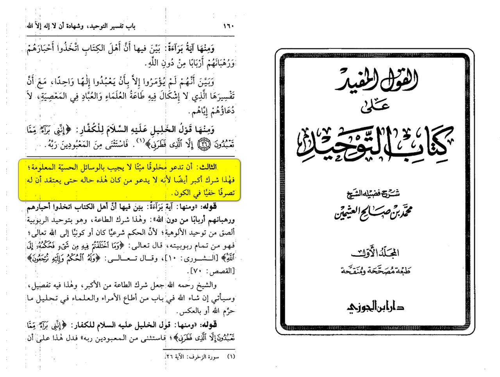

---

<!-- telegram-source: dar/messages4.html#message4218 -->
<!-- evidence-id: 000645 -->

Shaykh Ibn ʿUthaymīn was asked:

Q: Is it permissible to give zakāh to a Muslim who supplicates to other than Allāh, swears by other than Allāh, circumambulates graves, and believes that the righteous have the power to bring benefit and harm?

A: rather, the one described in the question is a mushrik, a kāfir. Allāh does not accept ṣalāh, fasting, ṣadaqah, or anything else from him.

Whoever makes du‘āʾ to other than Allāh is a mushrik, and whoever worships graves is a mushrik. Such a person is not to be given zakāh. Rather, he is to be called to Islām and taught tawḥīd. If he accepts it, then that is what is sought; otherwise, it is upon the ruler to carry out concerning him what the Sharīʿah requires.

As for the one who swears by other than Allāh, he may be given zakāh, because swearing by other than Allāh does not expel one from the religion, even though it is shirk. He may be given zakāh, and he should be advised and taught that swearing by other than Allāh is a type of shirk, so that Allāh may guide him.

<video class="source-video" controls preload="metadata" src="assets/videos/dar-messages4-4218.mp4"></video>

Video source from the Telegram export.

---

<!-- telegram-source: dar/messages5.html#message4244 -->
<!-- evidence-id: 000646 -->

Shaykh Ṣāliḥ al-Luḥaidān said:

When the Companions heard the saying of Allah Most High: “Those who believe and do not mix their belief with Zûlm (injustice) - those will have security, and they are [rightly] guided.” (al-Anʿām 6:82), that was difficult for them, and they thought that what was meant by the verse was that they wrong themselves by actions they commit.

So they said: “O Messenger of Allah, which of us does not wrong himself?” He said: “It is not that. Rather, it is shirk. Have you not heard what Luqmān said to his son while advising him: ‘O my son! Join not in worship others with Allâh. Verily joining others in worship with Allâh is a great Zûlm’ (Luqmān 31:13).”

Thus, the great ẓulm — which, if it enters a righteous act by which Allah is worshipped, corrupts it — is shirk.

For this reason, whoever dies upon Shirk al-akbar has no hope of forgiveness, and it is not valid for one who knows that he died upon Shirk al-akbar to make du‘āʾ to Allah for him, because Allah, Glorified and Exalted, has forbidden that: “It is not for the Prophet and those who have believed to ask forgiveness for the Mushrikīn, even if they were relatives, after it has become clear to them that they are companions of Hellfire.” (al-Tawbah 9:113).

So if a person knows that someone died upon Shirk al-akbar — even if he was a close relative, even if he was a brother, a close friend, an intimate companion, and so on — it is not permissible for him to seek forgiveness for him.

Source: Sharḥ Kitāb at-Tawḥīd by Shaykh Ṣāliḥ al-Luḥaydān p.65

Show attached source scan

---

<!-- telegram-source: dar/messages2.html#message1179 -->
<!-- evidence-id: 000647 -->

Q10: Some of the devout youth of today claim that all or most of those who fall into shirk in the Islamic world today are not considered polytheists; because they are either great scholars who, through their ijtihad, have concluded that seeking help from others besides Allah is permissible, as did al-Suyūṭī, al-Nabhānī, and others. This is said to have two rewards: one if correct, and one if wrong. Alternatively, they are ordinary laypeople, and this is the utmost they are capable of.

A10: The excused mistake is one in theoretical matters of ijtihad, not one in matters that have been established by explicit texts or in what is known to be a part of the religion by necessity.

And Allah grants success. May peace and blessings be upon our Prophet Muhammad, his family, and his companions.

‘Abd al-Razzaq ‘Afīfī… ‘Abd al-‘Azīz ibn ‘Abd Allāh ibn Bāz

Source: Fatāwā al-Lajnah al-Dā’imah 2/59-60

Show Arabic source text

المصدر: فتاوى اللجنة الدائمة

<h4 dir="rtl">ص. 59</h4>

يحكم عليه بالكفر حسب حاله.

وبالله التوفيق. وصلى الله على نبينا محمد، وآله وصحبه وسلم.

اللجنة الدائمة للبحوث العلمية والإفتاء

نائب رئيس اللجنة

…

الرئيس

عبد الرزاق عفيفي

…

عبد العزيز بن عبد الله بن باز

<h4 dir="rtl">ص. 59</h4>

‌

‌هل الإكراه يسوغ إظهار الكفر؟ وحكم من أوصله اجتهاده إلى مخالفة أمر معلوم من الدين بالضرورة

السؤالان الثامن والعاشر من الفتوى رقم (9272) :

س8: هل الإكراه بالقول أو الفعل يسوغ إظهار الكفر؟

ج8: إذا ثبت الإكراه رخص في إظهار الكفر مع اطمئنان قلب المكره بالإيمان؛ لعموم قوله تعالى: {مَنْ كَفَرَ بِاللَّهِ مِنْ بَعْدِ إِيمَانِهِ إِلا مَنْ أُكْرِهَ وَقَلْبُهُ مُطْمَئِنٌّ بِالْإِيمَانِ وَلَكِنْ مَنْ شَرَحَ بِالْكُفْرِ صَدْرًا فَعَلَيْهِمْ غَضَبٌ مِنَ اللَّهِ وَلَهُمْ عَذَابٌ عَظِيمٌ} (1) الآية.

اللجنة الدائمة للبحوث العلمية والإفتاء

نائب رئيس اللجنة

…

الرئيس

عبد الرزاق عفيفي

…

عبد العزيز بن عبد الله بن باز

(1) سورة النحل الآية 106

<h4 dir="rtl">ص. 59</h4>

س10: يقول بعض متديني الشباب المعاصر إن جميع أو غالب من يقع في الشرك في العالم الإسلامي اليوم ليس مشركا؛

<h4 dir="rtl">ص. 60</h4>

لأنه إما عالم جليل أوصله اجتهاده إلى جواز مثل الاستغاثة بغير الله؛ كما فعل السيوطي، والنبهاني وغيرهما، وهذا له أجران: أجر إذا أصاب، وواحد إذا أخطأ، وإما عامي مقلد، وهذا فعل أقصى ما يستطيع.

ج10: المخطئ المعذور من أخطأ في المسائل النظرية الاجتهادية لا من أخطأ فيما ثبت بنص صريح، ولا فيما هو معلوم من الدين بالضرورة.

وبالله التوفيق. وصلى الله على نبينا محمد، وآله وصحبه وسلم.

اللجنة الدائمة للبحوث العلمية والإفتاء

نائب رئيس اللجنة

…

الرئيس

عبد الرزاق عفيفي

…

عبد العزيز بن عبد الله بن باز

<h4 dir="rtl">ص. 60</h4>

حكم دراسة الفلسفة والنظريات التي فيها استهزاء بآيات الله

السؤال السادس من الفتوى رقم (9406) :

س6: هل دراسة الفلسفة والمنطق والنظريات التي فيها استهزاء بآيات الله يحل الجلوس في أماكن دراستها، وهل هذا يدخل ضمن الآية الكريمة: {وَقَدْ نَزَّلَ عَلَيْكُمْ فِي الْكِتَابِ أَنْ إِذَا سَمِعْتُمْ آيَاتِ اللَّهِ يُكْفَرُ بِهَا وَيُسْتَهْزَأُ بِهَا فَلا تَقْعُدُوا مَعَهُمْ حَتَّى يَخُوضُوا فِي حَدِيثٍ غَيْرِهِ إِنَّكُمْ إِذًا مِثْلُهُمْ} (1)

(1) سورة النساء الآية 140

---

<!-- telegram-source: dar/messages5.html#message4689 -->
<!-- evidence-id: 000648 -->

The scholars have two opinions regarding the issue of excuse of ignorance in shirk al-akbar and clear cut disbelief:

❌ There is no third opinion from the scholars stating that a person is excused due to ignorance while still being considered a Muslim. This position is disbelief and is statement of the contemporary Murjiʾah. Any one claiming this, know that he has been inflicted with the doubts of the Murjiʾah.

Regarding this third position, it falls under the third nullifier: whoever does not takfīr a kāfir is a kāfir. However, the scholars of our time have differed regarding the ruling on the one who excuses the grave-worshipper. This does not apply to those who excuse the Christians and Jews.

There are two opinions: one holds that those who excuse them and still consider them Muslim must have the proof established upon them before takfīr is made, due to the widespread doubts in this matter.

As for matters which are obscure. Then the person is excused with ignorance and remains a Muslim unless they persist in such a matter. Then they are also a disbeliever.

Show attached source scan

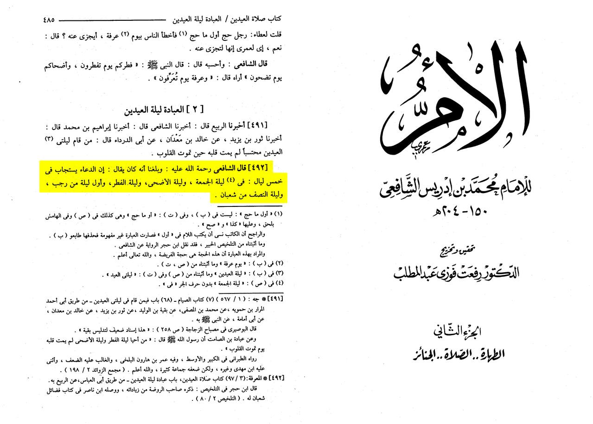

---

<!-- telegram-source: personal/messages.html#message547 -->
<!-- evidence-id: 000649 -->

<video class="source-video" controls preload="metadata" src="assets/videos/personal-547.mp4"></video>

Video source from the user’s Telegram export.

Shaykh al-Fawzān was asked:

Q: Shaykh al-Islām Ibn Taymiyyah mentioned in Majmūʿ al-Fatāwā that asking a dead person to make duʿāʾ for you, to ask Allāh on your behalf, is an act of bidʿah.

A: This is a bidʿah shirkīyyah— not merely an innovation, but an innovation involving shirk. Do not assume it is only a prohibited bidʿah; it is a bidʿah shirkīyyah, and shirk is indeed described as bidʿah.

Q: Is this the same issue you pointed out at the beginning of the lesson?

A: Yes, I clarified an understanding — not the wording of the Shaykh himself. I clarified the misunderstanding of the one quoting him. When the Shaykh says “this is bidʿah” he did not mean bidʿah in the simple sense and remain silent; he meant bidʿah shirkīyyah. That is his intent. His explicit statement here is clear, so why take his words in their general sense and ignore his explicit clarification elsewhere?

---

<!-- telegram-source: personal/messages.html#message564 -->
<!-- evidence-id: 000650 -->

Shaykh al-Fawzān said regarding the verse:

"And who is more astray than one who calls on besides Allâh, such as will not answer him till the Day of Resurrection, and who are unaware of their calls to them? And when mankind are gathered (on the Day of Resurrection), they (false deities) will become their enemies and will deny their worshipping." (al-Aḥqāf: 5-6)

Allah judged that there is no one more astray than the person who called upon other than Allah from among created beings—those who are not capable of responding to his supplication in this world, nor are they even aware of the one who calls upon them.

And when the Resurrection occurs and they are gathered along with all people, they will show enmity toward the one who used to call upon them and will disassociate themselves from him.  Thus this mushrik is in misery in both abodes: he obtains no response in this world, and in the Hereafter his act of worship will be rejected at the moment he is most in need of it.

The relevance of the two verses to the chapter:

They contain the ruling that whoever calls upon other than Allah is the most astray of the astray, and that duʿāʾ is an act of worship—so whoever directs it to other than Allah is a mushrik.

That duʿāʾ is an act of worship, and so whoever calls upon other than Allah has committed shirk al-akbar.

That idols do not hear the one who calls upon them, nor respond to him—contrary to what the mushrikūn imagine.

Source: Al-Mulakhkhaṣ fī Sharḥ Kitāb al-Tawḥīd by Shaykh al-Fawzān p.99

Show Arabic source text

المصدر: الملخص في شرح كتاب التوحيد

<h4 dir="rtl">ص. 99</h4>

وعن طارق بن شهاب: أن رسول الله صلى الله عليه وسلم قال: &quot;دخل الجنة رجل في ذباب، ودخل النار رجل في ذباب&quot; قالوا: وكيف ذلك يا رسول الله؟ قال: &quot;مر رجلان على قوم لهم صنم لا يجاوزه أحد حتى يقرِّب له شيئاً. قالوا لأحدهما: قَرِّب. قال: ليس عندي شيء أُقرِّب. قالوا: قرب ولو ذباباً. فقرَّب ذباباً فخلّوا سبيله فدخل النار، وقالوا للآخر: قرب. قال: ما كنت لأقرب لأحد شيئاً دون الله عز وجل فضربوا عنقه فدخل الجنة&quot; (1) . رواه أحمد.

ــ

طارق بن شهاب: هو طارق بن شهاب البجلي الأحمسي رأى النبي صلى الله عليه وسلم ولم يسمع منه. فحديثه مرسل، صحابيٌّ. مات طارقٌ سنة 83هـ رضي الله عنه.

في ذباب: أي بسبب ذباب.

صنمٌ: ما كان منحوتاً على صورة.

لا يجاوزه: لا يمرُّ به ولا يتعداه.

يقرِّب: يذبح.

المعنى الإجمالي للحديث: يخبر النبي صلى الله عليه وسلم عن خطورة الشرك

(1) أخرجه أحمد في كتاب الزهد &quot;ص22&quot; وأبو نعيم في الحلية &quot;1/203&quot; وابن أبي شيبة في المصنف &quot;6/477 رقم 33028&quot; موقوفاً على سلمان الفارسي رضي الله عنه.

---

<!-- telegram-source: dar/messages4.html#message3743 -->
<!-- evidence-id: 000651 -->

Shaykh al-Fawzān said:

Whoever places between himself and Allāh intermediaries — calling upon them, asking them for intercession, and relying upon them — has committed kufr by ijmā‘.

Whoever does not declare the mushrikīn to be disbelievers, or doubts their kufr, or believes that their madhhab is correct, has disbelieved.

Whoever believes that the guidance of anyone other than the Prophet ﷺ is more complete than his guidance, or that the judgment of anyone other than him is better than his judgment — such as those who prefer the rule of ṭāghūt over the rule of the Messenger ﷺ, or who prefer man-made laws over the judgment of al-Islām — has committed kufr.

Whoever hates anything that the Messenger ﷺ came with, even if he acts upon it, has committed kufr.

Whoever mocks anything from the religion of the Messenger ﷺ, or its reward or its punishment, has committed kufr. The proof for this is the saying of Allāh, the Exalted: “Say, ‘Was it Allāh, His verses, and His Messenger that you were mocking? Make no excuse; you have disbelieved after your belief.’” [at-Tawbah:65–66]

Source: ʿAqīdat at-Tawḥīd by Shaykh al-Fawzān p.51

Show attached source scan

---

<!-- telegram-source: dar/messages4.html#message3908 -->
<!-- evidence-id: 000652 -->

Shaykh Ṣāliḥ al-Fawzān said:

This is the meaning of His statement: “They do not mix their belief with injustice” [al-Anʿām: 82]. That is: with shirk. This is exactly how the Messenger of Allah ﷺ explained it. When this verse was revealed, it distressed the Companions and they said: “O Messenger of Allah, which one of us has not wronged himself?” The Messenger of Allah ﷺ replied: “It is not the wrong you are thinking of. It is shirk. Have you not heard the words of the righteous servant: ‘ "O my son, do not associate [anything] with Allāh. Indeed, Shirk [with Him] is great injustice." [Luqmān: 13].

As for His statement, “those will have security”: Does this mean complete and absolute security, that they will never be punished at all? Or does it mean general security, that even if they are punished, they will inevitably enter Paradise in the end?

The verse accommodates both meanings. And on either interpretation, it demonstrates the virtue of tawḥīd: that it grants protection from punishment, either total protection or protection from permanent punishment. The verse therefore highlights the excellence of tawḥīd, and that Allah grants its people security in proportion to their level of tawḥīd and their freedom from sins and disobedience.

The verse also implies — through its opposite meaning — that whoever commits shirk with Allah and mixes his tawḥīd with shirk has no security whatsoever. We seek refuge in Allah from that. This makes clear the danger of shirk: a person may worship Allah, yet still invoke others alongside Him, seek aid from the dead, slaughter for graves, or perform ṭawāf around shrines seeking their help. Such a person has mixed his īmān with shirk, and he will have no security at all until he sincerely repents to Allah and purifies his tawḥīd.

Thus, the point is not merely that a person worships Allah; he must also avoid shirk entirely.

Source: Iʿānat al-Mustafīd bi-Sharḥ Kitāb at-Tawḥīd by al-ʿAllāmah Shaykh Ṣāliḥ al-Fawzān p.77

Show Arabic source text

المصدر: إعانة المستفيد بشرح كتاب التوحيد

<h4 dir="rtl">ص. 77</h4>

الركوع والسجود؛ من أجل أن يوصف بأنه صاحب طاعة، وإذا صلى وحده نقر الصلاة، وخفّفها، والإخلاص: أن الإنسان يقصد بعمله وجه الله، ولا يقصد بذلك طمعاً من مطامع الدنيا، أو مدحاً، وثناءً من الخلق، ولا يستمع إلى لومهم إذا لاموه في طاعة الله. قالوا: فلان متشدّد، فلان كذا، ما دام أنه على الطريق الصحيح، وعلى السنة، فلا يضره ما يقوله الناس، ولا تأخذه في الله لومة لائم.

الصفة الثالثة: {حَنِيفاً} والحنيف من الحَنَف وهو في اللغة: الميل، والمراد به هنا: الإقبال على الله، وأنه مُعرض عن الناس مُقبل على الله سبحانه وتعالى، يطلب الخير أمن الله وحده.

الصفة الرابعة: {وَلَمْ يَكُ مِنَ الْمُشْرِكِينَ} وهذا محل الشاهد من الباب، ومعناه: أنه تبرّأ من المشركين، براءة تامة، أي: قطع ما بينه وبين المشركين من المودّة من أجل الله سبحانه وتعالى، لأنهم أعداء الله، والمؤمن لا يحب أعداء الله.

فإبراهيم عليه السلام لم يكن من المشركين لا بقليل ولا بكثير، قطع صلة المحبة بينه وبينهم، أما صلة التعامل الدنيوي في المصالح المباحة فهذا شيء آخر، إنما المراد قطع صلة المحبة والموالاة والمناصرة، هذا هو المطلوب، أما التعاون الدنيوي فيما فيه نفع للمسلمين، فهذا لا بأس به، يوضِّح هذا قوله في الآية الأخرى: {قَدْ كَانَتْ لَكُمْ أُسْوَةٌ حَسَنَةٌ فِي إِبْرَاهِيمَ وَالَّذِينَ مَعَهُ} يعني: من أتباعه {إِذْ قَالُوا لِقَوْمِهِمْ إِنَّا بُرَآءُ مِنْكُمْ وَمِمَّا تَعْبُدُونَ مِنْ دُونِ اللهِ كَفَرْنَا بِكُمْ وَبَدَا بَيْنَنَا وَبَيْنَكُمُ الْعَدَاوَةُ وَالْبَغْضَاءُ أَبَدًا حَتَّى تُؤْمِنُوا بِاللهِ وَحْدَهُ} ؛ يعني: لا تقارب بيننا وبينكم في المودة والمناصرة والمؤاخاة أبداً، إلَاّ إذا آمنتم بالله وحده، وكفرتم بما يعبد من دون الله عز وجل، وتركتم عبادة الأصنام، فحينئذٍ نكون إخواناً {حَتَّى تُؤْمِنُوا بِاللهِ وَحْدَهُ} ثم قال في الآية التي بعدها: {لَقَدْ كَانَ لَكُمْ فِيهِمْ أُسْوَةٌ حَسَنَةٌ لِمَنْ كَانَ يَرْجُو اللهَ وَالْيَوْمَ الْآخِرَ وَمَنْ يَتَوَلَّ فَإِنَّ اللهَ هُوَ الْغَنِيُّ الْحَمِيدُ (6) } ثم قال بعدها: {لا يَنْهَاكُمُ اللهُ عَنِ الَّذِينَ لَمْ يُقَاتِلُوكُمْ فِي الدِّينِ وَلَمْ يُخْرِجُوكُمْ مِنْ دِيَارِكُمْ أَنْ تَبَرُّوهُمْ وَتُقْسِطُوا إِلَيْهِمْ إِنَّ اللهَ يُحِبُّ الْمُقْسِطِينَ (8) } .

فهذه أربع صفات وصف الله بها إبراهيم: وهي:

الصفة الأولى: أنه كان أمة، يعني: قدوة في الخير.

<h4 dir="rtl">ص. 77</h4>

لا تخفى عليه خافية ولا تخفى عليه أحوالُ عباده أبداً، ولكنه يبتليهم ويمتحنهم ليكفِّر عنهم سيِّئاتهم وليختبر إيمانهم وليعظُم رجاؤهم بالله عز وجل وليتوبوا إلى الله عز وجل. وله الحكمة في ذلك سبحانه وتعالى.

قوله: &quot;رواه عبد الرزاق&quot; عبد الرزاق بن هَمَّام الصنعاني، الإمام الجليل، شيخ العلماء والمحدِّثين، روى عنه: الإمام أحمد بن حنبل، وإسحاق بن راهوَيْه، وغيرهما من كبار الأئمة- رحمهم الله.

وقوّى إسناد هذا الحديث: ابن جرير الطبري.

فهذه النصوص في هذا الباب يُستفاد منها الأحكام التالية:

أولاً: تحريم الأمن من مكر الله والقنوط من رحمة الله، وأنهما ينقِّصان كمال التّوحيد وقد ينافيان التّوحيد.

ثانياً: أنه يجب على المسلم أن يجمع بين الخوف والرجاء، فلا يخاف فقط ولا يرجو فقط، وإنما يكون خائفاً راجياً دائماً وأبداً، هذا هو التّوحيد، وهو صفة أولياء الله.

ثالثاً: في هذه النصوص أن المعلِّم والداعية يبدأ بالأهم فالأهم؛ لأن الرسول صلى الله عليه وسلم لَمّا أراد أن يعلِّم أصحابه الكبائر بدأ بأهمها وهو الشرك بالله عز وجل، لأن الشرك أكبرُ الكبائر فبدأ به، ثمّ ذكر بعده الأمن من مكر الله والقنوط من رحمة الله.

رابعاً: في الحديثين: أن الذنوب تنقسم إلى صغائر وكبائر، وقد عرّف العلماء الكبيرة بأنها: &quot;ما رُتِّبَ عليها حدٌّ في الدنيا، أو وعيدٌ في الآخرة، أو خُتم بغضب، أو لعنة، أو نار، أو تبرّأ النبي صلى الله عليه وسلم من صاحبها، بأن قال: &quot;ليس منا من فعل كذا&quot;، أو نفى عنه الإيمان كقوله صلى الله عليه وسلم: &quot;لا يزني الزاني حين يزني وهو مؤمن، ولا يشرب الخمر حين يشربها وهو مؤمن&quot;. هذه ضوابط الكبيرة.

أما الصغائر فهي ما ليس كذلك مما حرّمه الله ونهى عنه، ولم يصل إلى حدّ الكبيرة.

ولكن لا يحمل هذا الإنسان على أنه يتساهل بالصغائر، لأن الصغائر إذا تُسوهِل بها جرَّتْ إلى الكبائر؛ والصغيرة تعظُم حتى تكون كبيرة مع الإصرار؛

---

<!-- telegram-source: dar/messages4.html#message3930 -->
<!-- evidence-id: 000653 -->

Shaykh Ṣāliḥ al-Fawzān said:

As for the one who worships Allah but also worships others alongside Him, this person has not truly realized lā ilāha illā Allāh, even if he utters it with his tongue. The one who says lā ilāha illā Allāh but then goes to graves, seeks needs from them, rubs himself with them, seeks help from them, or circumambulates them, has not purified himself from shirk.

Thus, lā ilāha illā Allāh does not benefit him, even if he repeats it with every breath. Lā ilāha illā Allāh is not merely a phrase to be spoken; it has implications, meanings, and requirements that must be realized—worship of Allah alone and disavowal of shirk and mushrikīn.

Whoever does not disavow shirk has not truly realized lā ilāha illā Allāh, even if he utters it or makes for himself morning and evening litanies, carries a rosary of great length to glorify Allah, or repeats litanies containing lā ilāha illā Allāh thousands of times. This does not benefit him until he follows what Ibrāhīm عليه السلام did—purifying himself from shirk.

Source: Iʿānat al-Mustafīd bi-Sharḥ Kitāb at-Tawḥīd by al-ʿAllāmah Shaykh Ṣāliḥ al-Fawzān p.172-173

Show Arabic source text

المصدر: إعانة المستفيد بشرح كتاب التوحيد

<h4 dir="rtl">ص. 172</h4>

لهم صنم لا يجوزه أحد حتى يقرِّب له شيئاً، فقالوا لأحدهما: قرِّب. قال: ليس عندي شيء أقرِّبه، قالوا به: قرِّب ولو ذباباً. فقرّب ذباباً، فخلَّوْ سبيله، فدخل النار. وقالوا للآخر: قرِّب. فقال: ما كنت لأقرِّب لأحد شيئاً دون الله عز وجل. فضربوا عنقه، فدخل الجنة&quot; رواه أحمد.

ــ

&quot;لهم صنم&quot; الصنم هو: ما كان على صورة حيوان، أما ما عُبد وهو على غير صورة حيوان، كالشجر والحجر والقبر فهذا يسمى وثناً، فالوثن أعم من الصنم، لأن الصنم لا يُطلق إلَاّ على التِّمثال، وأما الوثن فيُطلق على التِّمثال وغيره، حتى القبر وثن إذا عُبد، قال صلى الله عليه وسلم: &quot;اللهم لا تجعل قبري وثناً يُعبد&quot;، فالوثن كل ما عُبد من دون الله على أي شكل كان.

&quot;لا يجوزه أحد&quot; أي: يتجاوزه ولا يمرّ عليه أحد، &quot;حتى يقرِّب له شيئاً&quot; يعني: يذبح له تعظيماً له.

&quot;فقال لأحدهما: قرّب، قال: ليس عندي شيء أقرِّبه&quot; اعتذر بالعدم، ولم يقل: إن الذبح لغير الله لا يجوز، أو هذا منكر- والعياذ بالله-، وهذا يدلّ على أنه لو كان عنده شيء لقربه.

&quot;قالوا له: قرِّب ولو ذباباً&quot; فقرب ذباباً، يعني: اذبحه للصنم، &quot;فقرِّب ذباباً فخلوا سبيله&quot; سمحوا له بالمرور، &quot;فدخل النار&quot; بسبب الشرك، وأنه ذبح لغير الله، والعبرة بالنيّة والقصد لا بالمذبوح.

والقصد أنه ما استنكر هذا الشيء، ولا تمنع منه، وإنما اعتذر بعدم وجود شيء فلذلك دخل النار- والعياذ بالله.

&quot;وقالوا للآخر: قرِّب. فقال: ما كنت لأقرِّب لأحد شيئاً دون الله عز وجل&quot; امتنع وأنكر الشرك، &quot;فضربوا عنقه&quot; يعني: قتلوه، &quot;فدخل الجنة&quot; بسبب التّوحيد.

فهذا الحديث حديث عظيم، فيه مسائل عظيمة:

المسألة الأولى: هذا الحديث فيه جواز الإخبار عن الأمم السابقة، والتحدّث عنها بما ثبت لأجل العظة والعبرة.

المسألة الثانية: في الحديث دليل على تحريم الذبح لغير الله، ومن ذبح

<h4 dir="rtl">ص. 172</h4>

فلما أصبحت أخبرت بها من أخبرت، ثم أتيت النبي صلى الله عليه وسلم فأخبرته، قال: &quot;هل أخبرتَ بها أحداً؟ &quot;، قلت: نعم، قال: فحمد الله وأثنى عليه، ثم قال: &quot;أما بعد: فإن طفيلاً رأى رؤيا أخبر بها من أخبر منكم، وإنكم قلتم كلمة يمنعني كذا وكذا أن أنهاكم عنها، فلا تقولوا: ما شاء الله وشاء محمد، ولكن قولوا: ما شاء الله وحده &quot;.

ــ

&quot;فقلت: إنكم لأنتم القوم لولا أنكم تقولون: المسيح ابن الله&quot; وهو عيسى ابن مريم، سُمِّي بالمسيح لأنّه يمسح بيده على ذي العاهة فيبرأ بإذن الله. فالنصارى غلوا في المسيح كما غَلَت اليهود في عُزير.

ثم رد عليه النصارى بمثل ما قاله اليهود، قال طُفيل: &quot;فلما أصبحتُ أخبرتُ بها مَن أخبرت، ثم أتيتُ النبي صلى الله عليه وسلم فأخبرتُه، قال: &quot;هل أخبرتَ بها أحداً؟ &quot;، قلت: نعم، قال: فحمد الله وأثنى عليه، ثم قال: &quot;أمّا بعد&quot; هذا فيه: دليل على مشروعية حمد الله والثّناء عليه في بداية الكلام، لقوله صلى الله عليه وسلم: &quot;كلّ أمر ذي بال لا يُبدأُ في بالحمد لله فهو أبتر&quot;، ولهذا افتتح الله كتابه العظيم القرآن بـ {الْحَمْدُ لِلَّهِ رَبِّ الْعَالَمِينَ (2) } ، وفيه استحباب الإتيان بأما بعد، وهي كلمة يُؤتَى بها للانتقال من أسلوب إلى آخر.

&quot;فإن طُفيلاً قد رأى رؤيا أخبر بها من أخبر منكم، وإنّكم قلتم كلمة يمنعني كذا وكذا أن أنهاكم عنها&quot; قيل: كان يمنع النبي صلى الله عليه وسلم الحياء، لأنّه لم ينزل عليه وحيٌ في المنع منها.

&quot;فلا تقولوا: ما شاء الله وشاء محمد، ولكن قولوا: ما شاء الله وحده&quot; لَمّا نبّههم على خطأ هذه الكلمة أرشدهم إلى البديل الصالح منها، وهو أن يقولوا: ما شاء الله وحده.

فهذه القصة فيها فوائد عظيمة ودُروس وعِبَر:

الفائدة الأولى: أن الرؤيا حقّ، ولذلك: لا يجوز الكذب في الرؤيا، وجاء في الحديث الوعيد على ذلك.

الفائدة الثّانية: فيه: فهم الإنسان إذا كان له هوى، فهؤلاء اليهود والنصارى لَمّا كان لهم هوى في حق المسلمين؛ لاحظوا هذه المسألة، لا حُبًّا في الخير أو حِرْصاً على التّوحيد، ولكنّهم يريدون بذلك تنقُّص المسلمين، والتماس عيوبهم، وإن كان في اليهود والنصارى عيوب أكثر منها.

<h4 dir="rtl">ص. 173</h4>

لغير الله فقد أشرك، لأن هذا الرجل الذي ذبح الذباب دخل النار، وحتى لو كان المذبوح شيئاً تافهاً، والرجل الثاني عظّم الشرك، وتجنبه ولو كان شيئاً حقيراً، فدخل الجنة.

المسألة الثالثة: كما قال الشيخ رحمه الله في مسائله: أن المدار على أعمال القلوب، وإن كان الشيء الظاهر تافهاً، لكن المدار على عمل القلب.

المسألة الرابعة: فيه دليل- كما قال الشيخ رحمه الله على قُرب الجنة والنار من الإنسان، كما قال صلى الله عليه وسلم: &quot;الجنة أقرب إلى أحدكم من شِراك نعله، والنار مثل ذلك&quot;، هذا ضربوا عنقه فدخل الجنة، وذاك خلو سبيله فدخل النار.

المسألة الخامسة: أن هذا الرجل الذي ذبح الذباب كان مؤمناً، فدخل النار بذبحه الذباب، لأنه لو كان كافراً لدخل النار بكفره، لا بذبح الذباب، فدلّ على أنه كان مؤمناً، وهذه مسألة خطيرة جدًّا، فأين الذين يذبحون للقبور وللجن، وللشياطين، وللعفاريت، وللسخرة؟، فدلّ على أن الشرك الأكبر يخرج من الملة ولو كان شيئاً يسيراً، فأمور التّوحيد وأمور العقيدة لا يُتسامح فيها.

<h4 dir="rtl">ص. 173</h4>

الفائدة الثالثة: قَبول الحقّ ممّن جاء به ولو كان عدوًّا، لأنّ الحق ضالّة المؤمن، والرُّجوع إلى الحقّ فضيلة.

الفائدة الرّابعة: في الحديث دليل: على أنّ من نهى عن شيء أو منع من شيء وكان له بديل صالح أن يأتيَ بالبديل، فالنّبي صلى الله عليه وسلم لَمّا منع من هذه الكلمة &quot;ما شاء الله وشاء محمد&quot; أتى بالبديل الصالح الذي ليس فيه محذور وهو أن يقال: &quot;ما شاء الله وحده&quot;.

الفائدة الخامسة- وهي التي ساق المصنّف الحديث من أجلها-: أنّ كلمة &quot;ما شاء الله وشاء فلان&quot; ولو كان نبيًّا من الأنبياء؛ شركٌ بالله عز وجل يجب تركُه، ولكنّه من الشّرك الأصغر، بدليل قوله: &quot;يمنعني كذا وكذا&quot;، فإذا كان الإنسان لم يقصد معناه؛ فإنّه شركٌ في الألفاظ، فيجب تركُه واجتنابُه والابتعاد عنه.

الفائدة السادسة: أنه لا يجوز الغلو بالنبي صلى الله عليه وسلم وإشراكه مع الله في شيء، ودعاؤه، والاستغاثة به من دون الله عز وجل لأنه نهى أن يقال &quot;ما شاء الله وشاء محمد&quot; فما بالك بما هو أشد من ذلك من أنواع الغلو.

---

<!-- telegram-source: dar/messages5.html#message4240 -->
<!-- evidence-id: 000654 -->

Shaykh ʿAbd Allāh al-Ghunaymān was asked:

Q: 'Is it said that the lack of judgment of Kufr upon the one who said to the dead person at his grave: "Make du‘āʾ to Allah for me" and the likes of it, that it is based upon the dead person hearing whoever is at his grave?'

A: they explained it like this, but it is a weak reason; because the tree hears, and the stone hears, and everything hears.  If, for example, the matter were merely that something hears—even though this hearing is a kind of hearing whose reality we do not know—yet it is certain that it hears. And for this, the stone among the stones used to greet the Messenger ﷺ; it says: 'Peace be upon you, O Messenger of Allāh.'

And likewise the trunk upon which he used to give khuṭbah, he used to lean upon it... when he separated from it, and it began to cry -meaning it cried due to the loss of the remembrance that used to be mentioned upon it—and it hears. And He has informed us that everything glorifies with His praise. So the taʿlīl is incorrect.

And this is du‘āʾ to other than Allāh. You call upon him for a thing he has no power over, and is not capable of. As it is known, this is Shirk. And this Shirk of the Mushrikīn. It is not possible that anyone finds a proof that the Mushrikīn believed that their objects of worship share with the Lord of the Worlds in Creation and Origination and Governance and Giving Life and Causing Death and other than that. This is not possible.

So they call upon them so that they be intermediaries to intercede for them. For this reason Allah greatly repeated the refutation against them regarding this very matter of intercession; because the intercession is the Shirk which he calls upon them. "or 'Have they taken intercessor besides Allāh? Say: Even if they possess nothing and do not reason?' then He says: 'Say: To Allah belongs all intercession'.

So Shirk came from this type, all the Shirk of the Mushrikīn. his saying that if one calls upon the buried person so that he may intercede for him, or that he may make du‘āʾ to Allah for him, or the like, that this is merely a bidʿah—this is contrary; this is contrary to the state that the mushrikīn were upon, and contrary to what Allah has informed us of. So it is not correct.

Show attached source scan

---

<!-- telegram-source: dar/messages4.html#message3763 -->
<!-- evidence-id: 000655 -->

Shaykh ar-Rājihī said:

ʿibādah (worship) is a comprehensive term that includes everything that Allāh loves and is pleased with—of sayings and actions, both outward and inward. It includes everything the Sharʿ commands or forbids. It is the performance of commands and the abandonment of prohibitions out of devotion to Allāh. Thus, duʿāʾ, slaughtering, vows, and ṭawāf of the House are all forms of ʿibādah, and so are other acts. ʿIbādah is of many kinds, and among the greatest of them is duʿāʾ. So if you direct any part of it to other than Allāh, you have fallen into shirk.

And read His saying, the Exalted: “So do not call upon other god along with Allāh, or you will be among those punished.” (ash-Shuʿarāʾ :213) And His saying: “And do not call upon, besides Allāh, that which neither benefits you nor harms you; for if you do so, then indeed you will be among the wrongdoers.” (Yūnus: 106)

And His saying: "And the masājid are for Allāh alone, so do not call upon anyone along with Allāh.” (al-Jinn :18) And His saying: “And those, whom you invoke or call upon instead of Him, own not even a Qitmîr (the thin membrane over the date-stone).  If you call upon them, they hear not your call; and if (in case) they were to hear, they could not grant it (your request) to you. And on the Day of Resurrection, they will disown your worshipping them. And none can inform you (Muhammad ﷺ) like Him Who is the All-Knower (of everything).” (Fāṭir :13–14)

And His saying: "And whoever calls upon another god besides Allāh for which he has no proof - then his account is only with his Lord. Indeed, the disbelievers will not succeed.” (al-Muʾminūn :117) The texts are many regarding the prohibition of calling upon other than Allāh, for duʿāʾ is among the greatest acts of ʿibādah.

And you, O mushrik, have not understood the ʿibādah for which Allāh created you, since you claim that seeking refuge in the righteous and calling upon them is not ʿibādah.

In fact, it is ʿibādah itself.  It is narrated from an-Nuʿmān ibn Bashīr that he said: I heard the Prophet ﷺ say, “Duʿāʾ is ʿibādah.” Then he recited: “And your Lord said: "Call upon Me, and I will respond to you. Verily! Those who scorn My worship they will surely enter Hell in humiliation!’” (Ghāfir :60)¹

[Shurūḥ Rasāʾil al-Imām al-Mujaddid Muḥammad ibn ʿAbd al-Wahhāb by Shaykh ar-Rājihī 2/318-319]

footnote

¹ It was narrated by Abū Dāwūd (1479); and by at-Tirmidhī (3247) — and this is his wording; and by Ibn Mājah (3828); and by Aḥmad (4/267). At-Tirmidhī said: “This ḥadīth is ḥasan ṣaḥīḥ.”

Show attached source scan

---

<!-- telegram-source: dar/messages5.html#message4917 -->
<!-- evidence-id: 000656 -->

Shaykh ar-Rājihī said:

The fifteenth: their explicit statement that they only intended intercession.

Despite that, they fell into kufr. What they are upon today is the very religion of the mushrikīn of old. The Qurʾān has affirmed this meaning, as Allāh says:

“They worship besides Allāh others who can neither harm nor benefit them, and say, “These are our intercessors with Allāh.”” (Yūnus: 18).

So if the grave worshippers today say: “We only intend intercession,” we say to them: Abū Jahl and Abū Lahab only intended intercession as well.

Source: at-Tanḍīd Sharḥ Kitāb at-Tawḥīd by Shaykh ʿAbd al-ʿAzīz ar-Rājihī p.213

Show attached source scan

---

<!-- telegram-source: dar/messages4.html#message4070 -->
<!-- evidence-id: 000657 -->

Shaykh ar-Rājihī said:

Whoever believes in some of the Book and disbelieves in some; or believes in some of the messengers and disbelieves in some of them; or believes in some of the scriptures and disbelieves in some of them; or believes in some of the Qur’ān and disbelieves in some of it; or believes in some of what the Messenger came with and disbelieves in some of it — then he is a kāfir by ijmā‘, and a kāfir in all of it, and it does not benefit him that he believed in some of it.

And with this is removed the doubt which this person mentioned, which is his statement: “We testify that lā ilāha illā Allāh, and that Muḥammad is the Messenger of Allāh, and we believe in the resurrection, and we believe the Messenger, and we perform ḥajj and we fast and we give charity.”

We say to him: this does not benefit you; because if you call upon other than Allāh, your tawḥīd and īmān are nullified. So if you call upon the righteous, and you say: “Yā Sayyidī al-Badawī, help me,” or “Yā Sayyidī yā Rasūl Allāh,” or “Yā ‘Abd al-Qādir, madad madad,” or you slaughter or vow for them — you have committed kufr, and you have committed shirk with Allāh, and you have exited from the millah of Islām, and you have become a mushrik, and your tawḥīd and your īmān have been nullified.

An example of that: a person performs wuḍū’ and perfects the wuḍū’, then urine or feces or wind comes out from him — he is no longer upon purity, rather it has been nullified; the impurity has nullified it. Likewise, a person who says: “I testify lā ilāha illā Allāh, and that Muḥammad is the Messenger of Allāh,” and he prays and fasts, then he slaughters for other than Allāh or calls upon other than Him — his tawḥīd is nullified by this shirk and is removed. For shirk nullifies tawḥīd and īmān, just as impurity nullifies purity and corrupts it. We ask Allāh for safety and well-being.

Source: Shurūḥ Rasāʾil al-Imām al-Mujaddid Muḥammad ibn ʿAbd al-Wahhāb by Shaykh ar-Rājihī 2/359-360

Show attached source scan

---

<!-- telegram-source: personal/messages.html#message561 -->
<!-- evidence-id: 000658 -->

Shaykh Ṣāliḥ Āsh-Shaykh was asked:

Question: What is your opinion about those who attribute to Shaykh al-Islām Ibn Taymiyyah that asking the the dead to pray to Allah for you is not shirk akbar but is a bid‘ah?

Answer: This is in the words of Shaykh al-Islām, and it is correct. But by “bid‘ah” he means bid‘ah muḥdatha (a newly introduced innovation), that is, one that occurred in this Ummah. He did not mean by “bid‘ah” that it is an innovation that is not shirk, because among the bid‘ah that occurred in the Ummah, some are kufr-related or shirk-related, and some are not.

So when he said: “And asking the dead to pray for the supplicant is a bid‘ah,” he means this happened in this Ummah. Even the people of Jāhiliyyah did not do this; they did not say: “Pray to Allah for us,” but rather they said: “intercede for us". The matter of asking the dead for prayer is therefore a bid‘ah that even among the polytheists did not exist. Among the people of Jāhiliyyah it did not exist; it occurred in this Ummah.

What existed among the people of Jāhiliyyah was asking in the form of intercession: “intercede for us.” They would come and draw close in order to intercede, or address the deceased by saying: “intercede for us regarding such-and-such.” But saying “Pray to Allah for us” is a bid‘ah that occurred in this Ummah. Shaykh al-Islām’s statement that it is a newly introduced bid‘ah is correct, and the fact that it is a bid‘ah does not mean it is not shirk akbar.

So building domes over graves, asking the occupants of graves, turning to them as seen in some shrines, making ḥajj to these shrines, and establishing rituals for them—all of these are bid‘ah. We say: bid‘ah muḥdatha (an innovation that occurred in this Ummah). Asking them, asking the people of these shrines, or sacrificing for them in this manner did not exist among the people of Jāhiliyyah in this way.

Rather, their worship of the dead was in the form of idols and statues on graves and similar things, but not in this manner. The people of Jāhiliyyah did not perform pilgrimages like the pilgrimage to the house of Allāh, nor did they go to a shrine or grave in this manner. We say this is a bid‘ah. But does this mean it is not shirk akbar? No, because some bid‘ah are mukaffir.

Show attached source scan

<video class="source-video" controls preload="metadata" src="assets/videos/dar-messages4-3282.mp4"></video>

Video source from the Telegram export.

---

<!-- telegram-source: dar/messages5.html#message4662 -->
<!-- evidence-id: 000659 -->

The virtue of Kashf ash-Shubuhāt

Shaykh Abī al-ʿAlā ar-Rāshid said:

O youth, the treatise Kashf al-Shubuhāt — and we said that Shaykh Muḥammad ibn ʿAbd al-Wahhāb authored this treatise intending to respond to two groups. The first group is the group of the mushrikīn who present to the muwahḥidīn a number of doubts. The second group is the group of the Murjiʾah, who also present to the callers to tawḥīd a number of doubts.

We said in the previous lesson that the dāʿi (caller), or any reformer — and this is important — the dāʿi and the reformer who renews for the people the matter of the religion, and calls them to tawḥīd, and returns them to the religion of Allah  calling them to single out Allah in worship, singling out Allah in sacrifice, singling out Allah in legislation and judgment, singling out Allah in allegiance — returning the people to the tawḥīd of Allah — this dāʿi must have enemies. This dāʿi will not be safe, he will not be safe. Why? Because he will proclaim the truth openly.

And Allah said to His Messenger ﷺ: “So proclaim openly that which you are commanded, and turn away from the mushrikīn.” And He said: “And so We have appointed for every Prophet enemies - Shayātīn among mankind and jinn, inspiring one another with adorned speech as a delusion.” So the devils of mankind and the devils of jinn are the enemies of the call to tawḥīd.

Show attached source scan

---

<!-- telegram-source: dar/messages3.html#message2550 -->
<!-- evidence-id: 000660 -->

How is tashrīʿ (legislation) understood in the above?

Shaykh Ṣāliḥ Āl-Shaykh was asked:

Question 123: What is the criterion for tashrīʿ (legislation)? Is it legislating a single matter, or up to 50%? Some people may legislate within their own homes and impose things upon their families — is this considered tashrīʿ and a replacement of Allah’s religion?

Answer: No, this is not tashrīʿ. What is the meaning of tashrīʿ (legislating)? Tashrīʿ, as mentioned, is to make ḥarām something that is ḥalāl, and to believe in its prohibition. Declaring something that is ḥalāl to be ḥarām — this is tashrīʿ. This is kufr.

But if someone says, “This isn’t your concern,” or “Don’t say it’s ḥarām,” or “It’s not ḥarām — we will do it, and you stay out of it,” then what he has done is merely impose his desire upon others. He hasn’t legislated. A legislator (musharriʿ) is someone who changes a ruling and says, “This is not such-and-such — it is instead this.” That’s tashrīʿ — changing the agreed-upon ruling of Allah while knowing what Allah’s ruling is, and then stating otherwise.

But all sinners — except those whom Allah guides — act arrogantly. They are too proud even to be reasoned with. Even, for example, a man in his home may be debating with his son, and the son may provoke his father to say something terrible. This is not birr (righteousness or dutifulness). That is why Allah said to His believing servants: “And do not insult those they invoke besides Allah, lest they insult Allah in enmity without knowledge.” (Sūrat al-Anʿām, 6:108)

Source: al-Ajwibah wa-al-Buḥūth wa-al-Mudārasāt al-Mushtamilah ʿalayhā al-Durūs al-ʿIlmiyyah 2/178

Show attached source scan

---

### Istighāthah and calling upon the dead or absent
<!-- evidence-id: 000661 -->

<!-- telegram-source: personal/messages.html#message552 -->
<!-- evidence-id: 000662 -->

Shaykh al-Islam Ibn Taymiyyah said:

They believed that the du‘ā’ to the dead, for whom a shrine was built, and doing istighāthah from them was more beneficial than du‘ā’ to Allāh and seeking help from Him in the house built for Allāh ‘Azza wa Jall. So they preferred the house built for the supplication of the created being over the house built for the du‘ā’ of the Creator. And if there is an endowment for this and an endowment for that, then the endowment of shirk is greater in their view, imitating the mushrikīn of the Arabs, whom Allāh described in His words: “And they assign to Allāh a share of what He created of the crops and the cattle, saying, ‘This is for Allāh’—by their claim—and ‘This is for our partners.’ But that which is for their partners does not reach Allāh, and that which is for Allāh reaches their partners. Evil is what they judge.” [Al-An‘ām 6:136]

And when one of them goes to the grave which he venerates, weeps at it, humbles himself, prays, and supplicates, he attains from softness, humility, servitude, and presence of heart  what he does not attain even in the five daily prayers, Jumu‘ah, Qiyām al-layl, or Qur’ān recitation. Is this anything but the state of the innovating mushrikīn and not of the sincere monotheists who follow the Book of Allāh and His Messenger ﷺ?

Source: al-Istighāthah fī ar-Radd ʿalā al-Bakrī by Ibn Taymiyyah p.381-382

Show Arabic source text

المصدر: الاستغاثة في الرد على البكري

<h4 dir="rtl">ص. 381</h4>

الذي فيه استهزاء بالله وآياته ورسوله، مع تعظيم شيخهم وغلوهم فيه (1)، وكذلك النصيرية والإسماعيلية ونحوهم وكثير من طوائف متعددة، [يرى] (2) أحدهم أن استغاثته بالشيخ الميت إما عند قبره وإما عند قبر غيره أنفع له من أن يدعو الله في المسجد عند السحر، ويستهزؤون بمن يعدل عن طريقته إلى التوحيد، ومن هؤلاء من يرى أن زيارة قبر النبي صلى الله عليه وسلم أفضل من الحج إلى الكعبة، وأن دعاء النبي والاستغاثة به أفضل من الاستغاثة بالله ودعائه.

وكثير من هؤلاء يخربون المساجد ويعمرون المشاهد، فتجد المسجد الذي بُني للصلوات الخمس معطلاً مخرباً ليس له كسوة إلا من الناس؛ وكأنه خان من الخانات، والمشهد الذي بني على الميت فعليه الستور؛ وزينة الذهب والفضة والرخام، والنذور تغدوا وتروح إليه، فهل هذا إلا من استخفافهم بالله وبآياته ورسوله [وتعظيمهم] (3) للشرك!!.

فإنهم اعتقدوا أن دعاء الميت الذي بني له المشهد والاستغاثة به أنفع لهم من دعاء الله والاستغاثة به في البيت الذي بُني لله عز وجل، ففضلوا البيت الذي بُني (4) لدعاء المخلوق على البيت الذي بُني لدعاء الخالق، وإذا كان لهذا وقف ولهذا وقف كان وقف الشرك أعظم عندهم مضاهاة لمشركي العرب الذين ذكر الله حالهم في قوله تعالى: {وَجَعَلُوا لِلَّهِ مِمَّا ذَرَأَ مِنَ الْحَرْثِ وَالْأَنْعَامِ نَصِيبًا فَقَالُوا هَذَا لِلَّهِ بِزَعْمِهِمْ وَهَذَا لِشُرَكَائِنَا فَمَا كَانَ لِشُرَكَائِهِمْ فَلَا يَصِلُ إِلَى اللَّهِ وَمَا كَانَ لِلَّهِ فَهُوَ يَصِلُ إِلَى شُرَكَائِهِمْ سَاءَ مَا يَحْكُمُونَ (136)} [الأنعام: 136]، كما يجعلون لله زرعاً وماشية ولآلهتهم زرعاً وماشية؛ فإذا أصيب نصيب آلهتهم أخذوا من نصيب الله فوضعوه فيه؛

(1) انظر: الكشف عن حقيقة الصوفية لأول مرة في التاريخ، تأليف محمود عبد الرؤوف القاسم ص 603 وما بعدها، الطبعة الثانية 1413 هـ، الناشر المكتبة الإسلامية عمان - الأردن، والمصادر العامة للتلقي عند الصوفية تأليف صادق سليم ص 232 وما بعدها الطبعة الأولى 1415 هـ، الناشر مكتبة الرشد الرياض - السعودية.

(2)

كذا في (ح) وفي الأصل و (ف) و (د) ترى.

(3)

كذا في (ف) و (د) و (ح) وفي الأصل تعظيم.

(4)

(بنى) سقطت من (ف).

<h4 dir="rtl">ص. 382</h4>

وقالوا (1): الله غني وآلهتنا فقيرة (2)، فيفضلون ما يجعل لغير الله على ما يجعل لله، وهكذا (3) الوقوف والنذور التي تبذل عندهم للمشاهد أعظم (مما تبذل) (4) عندهم للمساجد ولعمارة المساجد وللجهاد في سبيل الله.

وهؤلاء إذا قصد أحدهم القبر الذي يعظمه يبكي عنده ويخضع ويدعو ويتضرع، ويحصل له من الرقة والتواضع والعبودية وحضور القلب، ما لا يحصل له مثله في الصلوات الخمس والجمعة وقيام الليل وقراءة القرآن، فهل هذا (إلا من) (5) حال المشركين المبتدعين لا الموحدين المخلصين المتبعين لكتاب الله ورسوله!! ومثل هذا إذا سمع أحدهم سماع (6) الأبيات يحصل له من الخضوع والخشوع والبكاء ما لا يحصل له مثله عند سماع آيات الله، فيخشع عند سماع المبتدعين المشركين ولا يخشع عند سماع المخلصين المتقين، بل إذا سمعوا آيات الله استثقلوا (7) بها وكرهوها واستهزؤوا بها وبمن يقرؤها، مما يحصل لهم به أعظم نصيب من قوله: {وَلَئِنْ سَأَلْتَهُمْ لَيَقُولُنَّ إِنَّمَا كُنَّا نَخُوضُ وَنَلْعَبُ قُلْ أَبِاللَّهِ وَآيَاتِهِ وَرَسُولِهِ كُنْتُمْ تَسْتَهْزِئُونَ (65)} [التوبة: 65].

وإذا سمعوا القرآن سمعوه بقلوب لاهية وألسن لاغية كأنهم صم وعمي، واذا سمعوا الأبيات حضرت قلوبهم وسكنت ألسنتهم وسكنت حركاتهم حتى لا يشرب العطشان منهم الماء (8).

ومن هؤلاء من إذا كانوا في سماعهم فأذَّن المؤذن قالوا: نحن في شيء أفضل مما دعانا إليه، ومنهم من يقول: هذا في شغله وهذا في شغله، ومنهم من يقول: كنا في الحضرة فإذا قمنا إلى الصلاة صرنا على الباب.

وقد سألني بعضهم عمن قال ذلك من هؤلاء الشيوخ الضلال؟ فقلت: صدق كان في حضرة الشيطان فصار على باب الله، فإن البدع والضلالة فيها

(1) في (ف) إن.

(2)

في (د) فقراء.

(3)

في الأصل و (ف) (هؤلاء) وهي زيادة ولا حاجة لها في المعنى.

(4)

ما بين القوسين في (د) مبذول.

(5)

ما بين القوسين في (د) الأمر إلا.

(6)

سقطت من (د) و (ح).

(7)

في (د) اشتغلوا.

(8)

انظر: وصف ابن القيم لحالهم في كتابه: إغاثة اللهفان في مصايد الشيطان 1/ 344 - 347.

---

<!-- telegram-source: personal/messages.html#message569 -->
<!-- evidence-id: 000663 -->

Shaykh Muḥammad Ibn ʿAbdul-Wahhāb said:

And none may be sought for help except Him, nor may sacrifices be offered to anyone besides Him, nor vows made for any other—neither for a near angel nor a sent prophet. Whoever does Istighāthah from other than Him has committed disbelief, whoever offers a sacrifice to other than Him has committed disbelief, and whoever makes a vow to other than Him has committed disbelief, and the like of these acts.

Shaykh Ṣāliḥ al-Fawzān said regarding this:

Tawḥīd al-Ulūhiyyah encompasses all acts of worship, and none of them may be directed to anyone other than Allah, for He alone is deserving of them. Whoever dedicates any act of worship to other than Allah is a polytheist, even if he says, “Lā ilāha illa Allāh.” In fact, even if he worships Allah through various acts of devotion, as long as he does not devote all of them sincerely to Allah alone, he is not a Muslim.

Whoever does this has committed disbelief, even if he says, “Lā ilāha illa Allāh,” because he has not truly actualized its meaning. This is a contradiction—how can someone say “Lā ilāha illa Allāh” while offering sacrifices to others besides Him? How can he claim “Lā ilāha illa Allāh” while doing Istighāthah with the dead, the absent, the jinn, or the devils? How can he profess “Lā ilāha illa Allāh” while making vows to other than Allah? This is a clear contradiction.

Source: Sharḥ Tafsīr Kalimat at-Tawḥīd  by Shaykh Ṣāliḥ al-Fawzān p.27-28

Show attached source scan

---

<!-- evidence-id: 000664 -->
Shaykh ʿAbd Allāh Abā Buṭayn said in his refutation of Dāwūd ibn Jirjīs:

This belongs to the category of ordinary causes. When a man is known for righteousness and for having his supplications answered, and someone asks or instructs him to supplicate, after which he calls upon Allāh and his supplication is answered, the man himself is not the one who produced the answer. Nor was he asked to perform an act that belongs exclusively to Allāh. He was merely asked to do what he himself is capable of doing, namely supplicating and humbling himself before Allāh.

The verse is therefore among the proofs of tawḥīd, of turning faces toward Allāh, and of directing hearts to Him. Āṣif sought a means to Allāh through affirming His oneness and lordship. He intended Allāh alone and did not turn to Sulaymān or anyone else, even though Sulaymān was superior to him because he was a prophet.

The account also shows that prophets are not to be asked or made the object of one’s request. Indeed, their objective may sometimes be attained at the hands of believers who are below them in rank. It shows that the greatest means and the noblest objective is to single Allāh out in worship and to call upon Him alone without partner, as Āṣif did. It also shows that the allies of Allāh disavow any independent might or power, as indicated by the account: he performed ablution, prayed, and supplicated, saying, “O Possessor of majesty and honor,” as Mujāhid related. Al-Zuhrī said that he said: “Our God and the God of everything, the One God, there is no deity except You, bring me her throne.”

After this, what doubt can remain, and what proof is there in the account that anyone besides Allāh may be called upon?

The Iraqi then launched into rambling and lengthy speech whose substance was that a cause does not act independently and that Allāh is the true actor. By this he intended to argue that calling upon dead and absent righteous people is lawful so long as one believes that Allāh is the true actor.

The refutation of this and the demonstration of the ignorance of its advocate and his departure from the way of the Muslims have already preceded. It has also been established that the foundation and governing principle of Islam is to worship Allāh alone without partner and to single Him out as the sole object of intention and request.

Affirming tawḥīd ar-rubūbiyyah and believing that Allāh alone brings acts into existence is not sufficient for happiness and salvation, nor does it make a person Muslim, until he worships Allāh alone and disavows every rival and deity besides Him.

The Prophet ﷺ said to the delegation of ʿAbd al-Qays: “I command you with four matters and forbid you from four matters. I command you to believe in Allāh alone. Do you know what belief in Allāh alone is? It is the testimony that there is no deity worthy of worship except Allāh.”

This is clear, by the praise of Allāh, even if it remains hidden from those whose inner sight resembles that of bats, who have not illuminated themselves with the light of knowledge or taken refuge in a firm support.

Source: Tuḥfat al-Ṭālib wa-al-Jalīs fī Kashf Shubah Dāwūd ibn Jirjīs, pp. 49-50

Show Arabic source text

المصدر: تحفة الطالب والجليس

<h4 dir="rtl">ص. 49</h4>

وهذا من جنس الأسباب العادية، فإن الرجل إذا كان معروفاً بالصلاح، وإجابة الدعاء، فطلب منه الدعاء، أو أمر به، فدعا الله واستجيب له، لا يكون هو الفاعل للاستجابة، وليس المطلوب منه ما يختص بالله من الفعل، وإنما يطلب منه ما يختص به من الدعاء والتضرع.

فالآية من أدلة التوحيد، وصرف الوجوه إلى الله، وإقبال القلوب عليه، فإن آصف توسل إلى الله بتوحيده وربوبيته، وقَصَدَه وحده، ولم يقصد سليمان ولا غيره، مع أن سليمان أفضل منه لنبوته.

وفيها أن الأنبياء لا يسألون ولا يقصدون، بل ربما صار حصول مقصودهم، ونيل مطلوبهم على يد من هو دونهم من المؤمنين.

وأن أعظم الوسائل وأشرف المقاصد هو توحيد الله بعبادته ودعائه وحده لا شريك له، كما فعل آصف.

وفيها براءة أولياء الله من الحول والقوة، كما دلت عليه القصة، فإنه1 توضأ، وصلى، ودعا، فقال في دعائه: &quot;يا ذا الجلال والإكرام&quot; قاله مجاهد.

وقال الزهري2: يا إِلهَنا وإله كل شيء، إلهاً واحداً، لا إله إلا أنت، ائتني بعرشها&quot;.

فأي شبهة تبقى مع هذا، وأي حجة فيه على أن غير الله يدعى؟

1 في النسخ الخطية: &quot;وأنه&quot;.

2 في طبعة آل ثاني: &quot;الزيادي&quot; وهو خطأ.

<h4 dir="rtl">ص. 50</h4>

ثم أخذ العراقي في هذيان وإسهاب حاصله: أن السبب لا يفعل، وأن الله هو الفاعل.

ومراده بهذا أن دعاء الأموات والغائبين من الأولياء والصالحين يجوز ويسوغ، إذا اعتُقِد أن الله هو الفاعل.

وقد مَرَّ رد هذا، وتقرير جهل قائله، ومفارقته لما عليه أهل الإسلام، وقد تقدم أن أصل الإسلام وقاعدته: هي عبادة الله وحده لا شريك له، وإفراده بالقصد والطلب.

وأن توحيد الربوبية، واعتقاد الفاعلية له تعالى لا يكفي في السعادة والنجاة، ولا يكون به الرجل مسلماً حتى يعبد الله وحده، ويتبرآ مما سواه من الأنداد والآلهة.

وقد قال النبي صلى الله عليه وسلم لوفد عبد القيس: &quot;آمركم بأربع، وأنهاكم عن أربع: آمركم بالإيمان بالله وحده، أتدرون ما الإيمان بالله وحده؟ شهادة أن لا إله إلا الله&quot; 1.

وهذا ظاهر بحمد الله، وإن خفي على خفافيش البصائر، الذين لم يستضيئوا بنور العلم، ولم يلجؤوا2 إلى ركن وثيق، فهاموا من

1 أخرجه البخاري في &quot;صحيحه&quot;: كتاب الإيمان (1/ 129) ، وفي العلم (1/ 185) عن ابن عباس قال: إن وفد عبد قيس أتوا النبي صلى الله عليه وسلم فقال: &quot;من الوفد –أو من القوم.... الحديث&quot;.

وأخرجه مسلم في &quot;صحيحه&quot;: كتاب الإيمان 1/ 46، 47، 48، 49، 50) ، عن ابن عباس وأبي سعيد.

2 في طبعة آل ثاني: &quot;يلجأوا&quot;.

<!-- telegram-source: dar/messages4.html#message3880 -->
<!-- evidence-id: 000665 -->

Shaykh ʿAbd al-Raḥmān ash-Shaykh said:

Among the things transmitted from his companions such as the author of al-Furūʿ, and likewise those after him among the Ḥanbalīs who authored within the madhhab of Aḥmad, such as the author of al-Inṣāf and al-Tanqīḥ, and likewise those after them among later authors, such as the author of al-Iqnāʿ and al-Muntahā: these and others transmitted, in the chapter on the ruling of the murtadd, from Shaykh al-Islām Aḥmad ibn Taymiyyah that he said:

“Whoever places between himself and Allāh intermediaries that he calls upon, asks, and relies upon, has committed disbelief by ijmāʿ. And this is the madhhab of Aḥmad according to all of his companions.” His statement on intermediaries will appear later, if Allāh wills.

Thus the reliance of the Ḥanbalīs and others from Ahl al-Sunnah on the creed mentioned by Shaykh al-Islām concerning ijmāʿ is based on what will be mentioned from the clear verses, if Allāh wills. For this is what the call of the Messengers agreed upon from the first of them to the last of them. And it is the very purpose for which Allāh created creation: the negation of shirk in ʿibādah, that no type of worship be directed to anyone besides Allāh, whoever that may be.

This is what the Qur’ān indicates from beginning to end. And nothing has been transmitted from any of the salaf of the Ummah, nor from its imāms, permitting the calling upon the dead or the absent, nor permitting istighātha or istishfāʿ (seeking intercession) through them. On the contrary, the prohibition of this has come repeatedly in the clear verses, as we will mention some of that, if Allāh wills.

With what we have mentioned of ijmāʿ, and what the Book and the Sunnah indicate regarding restricting all types of ʿibādah to Allāh alone, and that whoever directs any of it to other than Allāh—for example istighātha from the dead or the absent—is a disbeliever: by all this it becomes clear that this al-ʿIrāqī (Dāwūd ibn Jirjīs) has opposed the Book, the Sunnah, and the ijmāʿ. And it is impossible that anything transmitted from the early generations of the Ummah and its imāms contradicts this ijmāʿ.

He has also opposed the scholars of Ahl al-Sunnah from every madhhab. How far removed he is from the religion upon which they unanimously agreed.

Source: Kashf mā Alqāh Iblīs min al-Bahraj wa-al-Talbīs ʿalā Qalb Dāwūd ibn Jirjīs by Shaykh ʿAbd al-Raḥmān ash-Shaykh p.49-50

Show Arabic source text

المصدر: كشف ما ألقاه إبليس

<h4 dir="rtl">ص. 49</h4>

الشيخ رحمه الله (1) نوعي التوحيد بأتم بيان: توحيد المعرفة والإثبات، وتوحيد الطلب والقصد، ورد على من عارض أدلة التوحيد بشبهة أو تحريف، فهذه كتبه موجودة، وكلها متفقة على هذا المعنى، كالاقتضاء والمنهاج (2) ، وكتاب العقل النقل. وكتاب الفرقان بين أولياء الرحمن وأولياء الشيطان، ورده على ابن الأخنائي ودره على السبكي في مسألة الزيارة، ورده على ابن البكري في مسألة الاستغاثة، وسيأتيك جمل منه إن شاء الله تعالى، وكلامه في أصول الدين مطرد في جميع كتُبه لا اختلاف فيه بحمد الله. فمما نقل عنه أصحابه –رحمه الله –كصاحب الفروع، وكذلك من بعده من الحنابلة المصنفين في مذهب أحمد، كصاحب الإنصاف والتنقيح، وكذا من بعده من المصنفين، كصاحب الإقناع والمنتهى، وقد نقل هؤلاء وغيرهم في باب حكم المرتد عن شيخ الإسلام أحمد بن تيمية –رحمه الله – أنه قال: (من جعل بينه وبين الله وسائط يدعوهم ويسألهم ويتوكل عليهم كفر إجماعاً؛ وهذا هو مذهب أحمد عند أصحابه كلهم) (3) ، وسيأتي كلامه هذا في مسألة الوسائط إن شاء الله تعالى. فصار اعتماد الحنابلة وغيرهم من أهل السنة على اعتقاد ما ذكره (4) شيخ الإسلام –رحمه الله –من الإجماع – [مستنده ما ستذكره في الآيات المحكمات إن شاء الله]- (5) ، لأنه هو الذي اتفقت عليه دعوة الرسل من أولهم إلى آخرهم

(1) زاد في &quot;م&quot;: &quot;تعالى&quot;.

(2)

يريد بالاقتضاء أي: كتاب &quot;اقتضاء الصراط المستقيم لمخالفة أصحاب الجحيم&quot; ويريد

بالمنهاج أي: كتاب&quot;منهاج السنة النبوية في نقض كلام الشيعة القدرية&quot;.

(3)

انظر &quot;مجموع الفتاوى&quot;: (1/124، و126) .

(4)

في &quot;ش&quot; و&quot;م&quot;: &quot;ما ذكر&quot;.

(5)

ما بين المعقوفتين زيادة من: &quot;م&quot;وو&quot;ش&quot;.

<h4 dir="rtl">ص. 50</h4>

وهو الذي خلق الله تعالى (1) الخلق لأجله، وهو نفي الشرك في العبادة بأن لا يُصرف شيء من أنواعها (2) لغير الله كائناً من كان، وهو الذي دل عليه القرآن من أوله إلى آخره، ولم ينقل عن أحد من سلف الأمة وأئمتها أنه أجاز دعوة الأموات والغائبين والاستغاثة (3) والاستشفاع/بهم، وقد تواتر النهي عن ذلك في الآيات المحكمات كما سنذكر بعض ذلك إن شاء الله تعالى. وبما ذكرناه من الإجماع، وما دل عليه الكتاب والسنة من قصر العبادة بجميع أنواعها على الله تعالى، وأن من صرف منها شيئاً لغير الله فاستغاث بغيره من الأموات والغائبين (4) فهو كافر، يبين أن هذا العراقي قد خالف الكتاب والسنة والإجماع-، ومن المحال أن يوجد عن سلف الأئمة وأئمتها ما يخالف هذا الإجماع (5) -، وخالف العلماء من أهل السنة من كل مذهب؛ فما أبعده عن هذا الدين الذي أجمعوا عليه كما قال الشاعر:

سارت مشرقة وسرت مغربا

…

شتان بين مشرق ومغرب

ويكفيك في تقرير (6) ما ذكروه عن شيخ الإسلام من الإجماع، وأنه هو الحق الذي يجب اعتقاده، والدين الذي يدان الله به ما استند إليه من محكم القرآن، كقوله تعالى: {فَلا تَدْعُ مَعَ اللَّهِ إِلَهاً آخَرَ فَتَكُونَ مِنَ الْمُعَذَّبِين} (7) ،

(1) سقطت &quot;الله تعالى&quot; من: &quot;ش&quot;.

(2)

في &quot;م&quot; و&quot;ش&quot;: &quot;أنواعه&quot;.

(3)

في &quot;ش&quot; و&quot;م&quot;: والاستغاثة بهم&quot;.

(4)

ما بين القوسين سقط من: (المطبوعة) .

(5)

ما بين القوسين سقط من: (المطبوعة) .

(6)

في &quot;م&quot;: &quot;يقرير&quot; وهو تصحيف.

(7)

سورة الشعراء، الآية: 113، وفي &quot;الأصل&quot; &quot;فلا..&quot;وهو خطأ.

---

<!-- telegram-source: dar/messages5.html#message4952 -->
<!-- evidence-id: 000666 -->

Shaykh ʿAbd al-Laṭīf ibn ʿAbd al-Raḥmān ibn Ḥasan ibn ʿAbd al-Wahhāb said:

So reflect—may Allah have mercy on you—on the speech of this imām, and his explicit statement that whoever calls upon the dead and turns to them, and seeks istaghāthah from them so that they may intercede for him with Allah, has committed shirk al-akbar, the shirk for whose rejection Allah sent Muḥammad ﷺ.

And for Takfiring the one who does not repent from it, and to fight and show enmity toward him—and that this occurred in his time, and that they altered the religion of the Messenger ﷺ and opposed Ahl al-tawḥīd, those who command them with sincerity in worship to Allah alone, with no partner.

And reflect also on his statement: “And how rare is the one who is freed from this!” Rather, how rare is the one who does not show enmity toward the one who condemns it! The matter will become clear to you, if Allah wills.

But reflect—may Allah guide you—on his statement: “And none is saved from the shirk of this shirk al-akbar except the one who shows enmity to the mushrikin” to the end.

It will become clear to you that Islām is not established except by showing enmity toward the people of this shirk; so if he does not show enmity toward them, then he is from them, even if he does not do it (i.e commit shirk), And Allah knows best.

Source: ad-Durar as-Saniyyah 1/432

Show Arabic source text

المصدر: الدرر السنية في الأجوبة النجدية

<h4 dir="rtl">ص. 432</h4>

{وَاجْنُبْنِي وَبَنِيَّ أَنْ نَعْبُدَ الأَصْنَامَ رَبِّ إِنَّهُنَّ أَضْلَلْنَ كَثِيراً مِنَ النَّاسِ} [سورة إبراهيم آية: 35-36] . وما نجا من شرك هذا الشرك الأكبر، إلا من جرد توحيده لله، وتقرب بمقتهم إلى الله تعالى انتهى كلامه رحمه الله تعالى.

فتأمل رحمك الله كلام هذا الإمام، وتصريحه بأن من دعا الموتى وتوجه إليهم، واستغاث بهم، ليشفعوا له عند الله، فقد فعل الشرك الأكبر، الذي بعث الله محمدا صلى الله عليه وسلم بإنكاره، وتكفير من لم يتب منه، وقتاله ومعاداته، وأن هذا قد وقع في زمانه، وأنهم غيروا دين الرسول صلى الله عليه وسلم وعادوا أهل التوحيد، الذين يأمرونهم بإخلاص العبادة لله وحده لا شريك له.

وتأمل قوله أيضا، وما أعز من تخلص من هذا! بل ما أعز من لا يعادي من أنكره! يتبين لك الأمر إن شاء الله تعالى، ولكن تأمل أرشدك الله، قوله: وما نجا من شرك هذا الشرك الأكبر، إلا من عادى المشركين

…

إلى آخره، يتبين لك أن الإسلام لا يستقيم إلا بمعاداة أهل هذا الشرك، فإن لم يعادهم، فهو منهم، وإن لم يفعله ; والله أعلم.

وقال رحمه الله، في كتاب: زاد المعاد، في هدى خير العباد، في الكلام على غزوة الطائف، وما فيها من الفقه، قال فيها:

إنه لا يجوز إبقاء مواضع الشرك والطواغيت بعد

---

<!-- telegram-source: personal/messages.html#message672 -->
<!-- evidence-id: 000667 -->

Shaykh ʿAbd al-Laṭīf Āl ash-Shaykh said:

As for making the dead into means by which one seeks Istighāthah from them, Makes du‘āʾ to them, hopes in them, and venerates them as intermediaries, then this is the religion of the idol worshippers.

The one who does that is takfired by the mere belief and action, even if he does not believe in their independence, as the Qurʾān has stated in more than one place. So al-ʿIrāqī (Dāwūd ibn Jirjīs) is opposing the Qurʾān and contradicting its texts.

Source: Minhāj at-Taʾsīs wa at-Taqdīs fī Kashf Shubuhāt Dāwūd ibn Jirjis by Shaykh ʿAbd al-Laṭīf Āl ash-Shaykh p.623

Show attached source scan

---

<!-- telegram-source: dar/messages4.html#message3821 -->
<!-- evidence-id: 000668 -->

Shaykh Ḥamad ibn ʿAtīq said:

Shaykh al-Islām (Ibn Taymiyyah) said: “Istighāthah is requesting relief, which means the removal of hardship.” Thus, istighāthah is the duʿāʾ of the distressed one, while duʿāʾ itself is broader in meaning, since it can come from both one in distress and one not in distress.

Duʿāʾ is of two kinds: duʿāʾ al-masʾalah (the supplication of asking) and duʿāʾ al-ʿibādah (the supplication of worship). Duʿāʾ al-masʾalah is asking for what benefits the supplicant, either by gaining some good or by removing some harm. The one who is truly worshipped must therefore have control over benefit and harm. That is why Allāh reproached those who worship other than Him — those who worship what possesses no power to bring benefit or avert harm. This is what the author intended.

As for duʿāʾ al-ʿibādah, it is to worship Allāh through the various acts of worship — such as ṣalāh, zakāh, sacrifice, and others — out of fear and hope: hoping for His mercy and fearing His punishment, even if there is no direct wording of request or petition. These two forms of duʿāʾ are inseparably linked: every duʿāʾ al-ʿibādah necessarily implies duʿāʾ al-masʾalah, and every duʿāʾ al-masʾalah inherently contains duʿāʾ al-ʿibādah.

In the Qurʾān, sometimes the term duʿāʾ refers to one of them, sometimes to the other, and sometimes to both together. For example, in His saying: “Call upon Me; I will respond to you.” (Sūrat Ghāfir: 60) — it has been interpreted in both senses: Some said, “Worship Me and obey My command, and I will answer you,” while others said, “Ask of Me, and I will give you.”

And there is ijmāʿ among the scholars that whoever directs any part of either type of duʿāʾ to other than Allāh has committed shirk — even if he says lā ilāha illā Allāh, Muḥammad rasūl Allāh, performs ṣalāh, fasts, and claims to be a Muslim.

Source: Ibṭāl at-Tandīd by Shaykh Ḥamad ibn ʿAtīq p.84-85

Show attached source scan

---

<!-- telegram-source: dar/messages4.html#message3693 -->
<!-- evidence-id: 000669 -->

The Reality of the contemporary Murji’ah

Shaykh Isḥāq ibn ʿAbd ar-Raḥmān Āl ash-Shaykh said:

We have heard from a group of those who claim knowledge and religion, and who, in their own estimation, follow Shaykh Muḥammad ibn ʿAbd al-Wahhāb — that whoever commits shirk and worships idols should not be labeled as a kāfir or mushrik specifically. That is because some of those who spoke to me directly regarding that heard from some of the brothers that he applied Shirk and Kufr to a man because he Made du‘āʾ to the prophet ﷺ and made Istighāthah with him. The man said to him: “Do not call him a kāfir until you make it known to him.”

Such people and their likes show no concern about mixing with the mushrikīn during travel or in their lands. In fact, they even seek knowledge from those who are among the most disbelieving of the scholars of the mushrikīn. They have pieced together for themselves certain shubuhāt to justify their claims — some of which, In Sha Allāh, will be mentioned later in this treatise. They have deceived with these doubts some of the common folk among their followers — those who have no knowledge or those do not know of their condition, and lacking discernment and understanding. They are physically separated from the brothers, yet separated from the Sheikhs with their hearts, and are flattering towards them. They have become alienated and have caused others to feel alienated from them because of the shubuhāt they display and the gloom that has come upon them through mixing with the sinners and mushrikīn.

When examined closely, they do not declare a mushrik to be a disbeliever except in general terms, and even then they hesitate among themselves. Their bidʿah and shubuhāt gradually spread until they deceived even some of the close companions. And Allāh knows best — this occurred due to their neglect of the kutub al-uṣūl (foundational books), their lack of attention to them, and their absence of fear of deviation.

Anyone with the slightest knowledge, upon seeing the condition of people today and examining the beliefs of these mashāyikh, would be utterly bewildered — and there is no power nor strength except through Allāh. One of those I referred to, when I questioned him about this issue, said: “We say to the people of these tombs — those who worship them and those buried within them — your action is shirk, but you are not mushrik.” So look at this, reflect upon it, praise your Lord, and ask Him for safety.

Source: Fatāwā al-Aʾimmah an-Najdiyyah 3/116-117

Show attached source scan

---

### ʿAbd al-ʿAzīz Ibn Bāz: invoking the dead and the worldly ruling on Ahl al-Fatrah
<!-- evidence-id: 000670 -->

Shaykh ʿAbd al-ʿAzīz Ibn Bāz was asked whether it is permissible to eat the slaughtered animals of those who make vows, offer sacrifices, and supplicate to those whom they regard as awliyāʾ when the proof has not removed their doubts.

He answered:

“Whoever is known for holding a corrupt, polytheistic belief, his slaughtered animal is not permissible to eat. If he lives among Muslims, then he has no excuse because he neither inquired nor cared. If it is known that he worships other than Allah, such as those who worship al-Badawī, al-Ḥusayn, al-Ḥasan, ʿAlī, Ibn ʿArabī, or others whom they call awliyāʾ, then such people are disbelievers, and their slaughtered animals are impermissible to eat. The same applies to anyone who worships other than Allah, makes vows for them, offers sacrifices to them, or seeks their aid.

This is major shirk. It is the practice of Jāhiliyyah, the same as what Quraysh did with Hubal, al-Lāt, and al-ʿUzzā, and what the people of Nūḥ did with Wadd, Suwāʿ, and others like them. Such individuals are considered among those upon whom the proof has been established because they live among Muslims, and the Qurʾān, Sunnah, and the words of the scholars have reached them. If someone has not received any of this knowledge, it is only due to his negligence and lack of concern.

As for one who is in a distant land away from the Muslims and belongs to Ahl al-Fatrah, to whom the call has not reached and who has not heard the words of Allah or His Messenger, he has the ruling of the disbelievers in this world, while his matter in the Hereafter is left to Allah. His slaughtered animal is not eaten so long as he practices the deeds of the disbelievers. On the Day of Resurrection he will be tested. If he obeys, he will enter Paradise, and if he disobeys, he will enter the Fire. This is the correct view regarding Ahl al-Fatrah.”

Source: [Official Ibn Bāz fatwa, “The ruling on eating the slaughtered animals of those who hold polytheistic beliefs”](https://binbaz.org.sa/fatwas/8613/حكم-اكل-ذباىح-اصحاب-العقاىد-الشركية).

---

<!-- telegram-source: dar/messages4.html#message3770 -->
<!-- evidence-id: 000671 -->

Supplicating to Other than Allah and istighāthah with them

al-Lajnah ad-Dai’ma was asked:

Q: We request your ruling regarding a group of people who sit in circles inside the mosque, remembering Allah and His Messenger, and who — during their adhkār — say things that contradict tawḥīd. For example, they all say together in one voice: “Take my hand, O Messenger of Allah!” And their leader says things like: “O key to the treasures of Allah! — O Kaʿbah of Allah’s manifestation! — O Throne of Allah’s istiwāʾ! — O Kursī of Allah’s descent! Enrich us, O Messenger of Allah! You are the one intended, O Beloved of Allah! You, you, O Messenger of Allah!” and other similar phrases filled with expressions of shirk.

A: Firstly: Remembering Allah in groups with one voice, as practiced by the Ṣūfiyyah, is an bidʿah. It has been authentically reported from the Messenger of Allah ﷺ that he said: “Whoever introduces into this matter of ours that which is not from it, it will be rejected.”

Secondly: Calling upon other than Allah and seeking help from them to remove distress or hardship is major shirk, and it is not permissible to do so. This is because duʿāʾ and istighāthah are acts of ʿibādah and devotion due solely to Allah. Directing them to anyone besides Him constitutes major shirk that expels a person from Islam — and we seek refuge in Allah from that.

Allah the Exalted said: “And do not call upon, besides Allāh, that which neither benefits you nor harms you; for if you do so, then indeed you will be among the wrongdoers. And if Allah touches you with harm, none can remove it but He; and if He intends good for you, none can repel His bounty. He causes it to reach whom He wills among His servants. And He is the Forgiving, the Merciful.” (Yūnus :106–107)

And He said: “And the masājid are for Allāh alone, so do not call upon anyone along with Allāh.” (al-Jinn :18) And He said: And whoever calls upon another god besides Allāh for which he has no proof - then his account is only with his Lord. Indeed, the disbelievers will not succeed.” (al-Muʾminūn :117) There are many other verses commanding that ʿibādah (worship) be devoted purely to Allah alone. It is also established in the ḥadīth that the Prophet ﷺ said: “When you ask, ask Allah; and when you seek help, seek help from Allah.” And he ﷺ said: “Duʿāʾ is ʿibādah.”

And Allah grants success. May blessings and peace be upon our Prophet Muḥammad, his family, and his Companions.

Source: Fatāwā ʿUlamāʾ al-Balad al-Ḥarām p.63-64

Show attached source scan

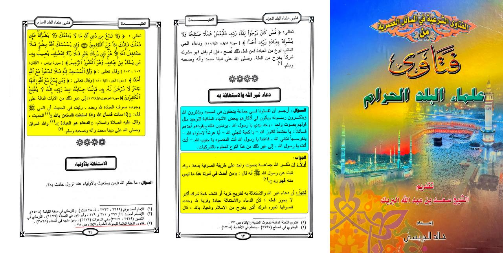

---

<!-- telegram-source: dar/messages5.html#message5059 -->
<!-- evidence-id: 000672 -->

Fatwā no. (10684):

Q: What is the dividing line between kufr and Islam? And does the one who pronounces the shahādatayn, then comes with actions that contradict them, enter among the Muslims despite his ṣalāh and his outward state?

A: The dividing line between kufr and Islam is pronouncing the shahādatayn along with truthfulness, sincerity, and acting according to what they necessitate. So whoever fulfills that is a Muslim believer.

As for the one who commits hypocrisy, then he neither affirmed truthfully nor sincerely, so he is not a believer.

Likewise, the one who pronounces them while coming with what contradicts them from shirk, such as one who seeks istighāthah through the dead in hardship or ease, or one who gives preference to judging by man-made laws over judging by what Allah revealed, or one who mocks the Qurʾān or what is authentically established from the Sunnah of the Messenger of

Allah ﷺ, then this person is a kāfir, even if he pronounces the shahādatayn and prays and fasts.

And with Allah is success. May Allah send prayers and peace upon our Prophet Muḥammad, his family, and his Companions.

The Permanent Committee for Scholarly Research and Fatwā :

Chairman: ʿAbd al-ʿAzīz ibn Bāz

Vice Chairman: ʿAbd al-Razzāq ʿAfīfī

Member: ʿAbd Allāh ibn Ghadayyān

Source: Fatāwā al-Lajnah al-Dāʾimah — First Collection 2/45–46

Show Arabic source text

المصدر: فتاوى اللجنة الدائمة

<h4 dir="rtl">ص. 45</h4>

‌

‌الردة تحبط الأعمال إذا لم يتب منها

فتوى رقم (7658) :

س: في العام قبل الماضي نويت أداء فريضة الحج مقرنا، وما إن وصلت إلى بيت الله الحرام حتى أديت فريضة العمرة، وتعتبر طواف القدوم في نفس الوقت، حيث لم أتشرف بزيارة بيت الله من قبل ثم بعدها بيوم واحد أديت فريضة العمرة نيابة عن والدتي المتوفاة ولما كان هناك متسع من الوقت قبل الذهاب إلى منى في يوم التروية أشار علي الأهل الذين أقضي الوقت عندهم بالتحلل من الإحرام ففعلت وعند الذهاب إلى منى أحرمت من جديد ثم صليت ركعتين بنية الإحرام بالحج فقط في مسجد العمرة، وفي هذه الحالة تعتبر نيتي قد تغيرت من القران إلى التمتع، فهل يشوب حجي أي شائبة رغم قيامي بنحر ذبيحة، وهل تعتبر العمرة التي أديتها نيابة عن والدتي في موسم الحج صحيحة أم أنه لا يجوز تأدية عمرتين في موسم حج واحد، هل أي ذنب يرتكبه الإنسان بعد أدائه الفريضة يؤثر عليها؛ لأننا لسنا منزهين عن الخطأ؟

ج: أولا: تعتبر في حجك المذكور متمتعا بالعمرة إلى الحج، وقد أحسنت فيما فعلت من التحلل من العمرة.

<h4 dir="rtl">ص. 46</h4>

ثانيا: العمرة التي أديتها عن أمك بعد أن اعتمرت عن نفسك صحيحة إذا كنت أديتها بعد التحلل من عمرتك بالحلق أو التقصير بعد الطواف والسعي.

ثالثا: ما كان من الذنوب دون الكفر الأكبر لا يبطل الأعمال الصالحة، ولكن تكون المقاصة بين حسنات وسيئات من خلط عملا صالحا وآخر سيئا ما لم يتب منها أو يعف الله عنه. أما الردة عن الإسلام - والعياذ بالله - فتحبط جميع الأعمال الصالحة إذا مات على ردته. ومن تاب منها توبة نصوحا لم تحبط أعماله الصالحة؛ فضلا من الله ورحمة، قال الله تعالى: {وَمَنْ يَرْتَدِدْ مِنْكُمْ عَنْ دِينِهِ فَيَمُتْ وَهُوَ كَافِرٌ فَأُولَئِكَ حَبِطَتْ أَعْمَالُهُمْ فِي الدُّنْيَا وَالْآخِرَةِ وَأُولَئِكَ أَصْحَابُ النَّارِ هُمْ فِيهَا خَالِدُونَ} (1)

وبالله التوفيق. وصلى الله على نبينا محمد، وآله وصحبه وسلم.

اللجنة الدائمة للبحوث العلمية والإفتاء

عضو

…

عضو

…

نائب رئيس اللجنة

…

الرئيس

عبد الله بن قعود

…

عبد الله بن غديان

…

عبد الرزاق عفيفي

…

عبد العزيز بن عبد الله بن باز

(1) سورة البقرة الآية 217

---

<!-- telegram-source: dar/messages4.html#message3986 -->
<!-- evidence-id: 000673 -->

Shaykh Ṣāliḥ al-Fawzān said:

This is the meaning of īmān: that you believe in your heart that Allāh alone deserves ʿibādah, and that everything worshipped besides Allāh is false — whether angels, prophets, righteous people, stones, trees, or idols. You must also have disbelief in all of these. This is the meaning of īmān in Allāh: that you believe in your heart that no one deserves worship except Him, and that whatever is worshipped besides Him is false. This is required by this ʿaqīdah.

It is not enough to say this with your tongue without believing it in your heart. Nor is it enough to perform outward actions — ṣalāh, fasting — while saying, “I worship only Allāh,” but then saying: “I don’t know about those who worship graves and shrines; I can’t say they are wrong, because they pray and fast and say lā ilāha illā Allāh.”

We say: you have not understood the meaning of lā ilāha illā Allāh, nor the meaning of īmān in Allāh and kufr biṭ-ṭāghūt. Had you understood properly, you would know that īmān in Allāh is not valid except with disbelief in ṭāghūt — outwardly with the tongue and inwardly with conviction.

This is the meaning of īmān in Allāh: that you direct all ʿibādah to Him alone and direct none of it to another. A person may perform ṣalāh, fast, and give zakāh, yet does Istighāthah from someone besides Allāh, or sacrifice to someone besides Him. Such a person has worshipped Allāh in some things and worshipped others in some things — and is therefore a mushrik.

As for the one who worships Allāh in some ʿibādah, and worships others in other types of ʿibādah, this person has not truly believed in Allāh. Like those who fasts, perform ṣalāh, perform ḥajj, and pronounce the shahādātayn, but then call upon others besides Allāh — they call upon the dead, sacrifice for the dead, make vows to the dead, and circumambulate at the graves. These people have not worshipped Allāh; rather, they are mushrikūn.

Because the worship of Allāh and worship of others can never unite. Allāh - Jalla wa ʿAlā - says: “I am free of partners in shirk, so whoever performs an action in which he associates someone with Me, I leave him and his shirk; and in another narration, "it is for the one who associates, and I am free of him.”

Allāh does not accept that anyone be associated with Him in any type of ʿibādah. Rather, all ʿibādah must be solely for Allāh. As He says: "And fight against them until there is no fitnah [i.e shirk] and [until] the religion [i.e., worship], all of it, is for Allāh." [al-Anfāl: 39]. Thus, no part of the religion can be for Allāh and another part for idols, graves, or anyone else — the religion must be entirely for Allāh.

Source: Sharḥ Maʿnā al-Ṭāghūt by Shaykh al-Fawzān p.12-13

Show attached source scan

---

<!-- telegram-source: dar/messages5.html#message4906 -->
<!-- evidence-id: 000674 -->

Shaykh ʿAbd Allāh al-Ghunaymān said:

And his statement: “lā sharīka lahu (there is no partner to Him)” is an emphasis of negation; meaning that devotion to Him negates any sharing with Him in anything of devotion .

And there is no partner to Him in turning to Him or ʿibādah (worship), so it is necessary for the servant to be knowing and acting upon its meaning and what it indicates.

From this it becomes clear that those who do not know its meaning fall into apparent contradictions: you find them, for example, saying “lā ilāha illa Allāh” while performing ṭawāf around the graves, seeking istighāthah from their occupants, and calling upon them secretly and openly.

And this is the shirk akbar which this statement nullifies. If they were of those who truly knew its meaning and knew what it signifies, they would not do such actions. Even the kuffār of old used to know its meaning.

Source: Sharḥ Kitāb at-Tawḥīd by Shaykh ʿAbd Allāh al-Ghunaymān 1/84

Show attached source scan

---

<!-- telegram-source: dar/messages5.html#message4444 -->
<!-- evidence-id: 000675 -->

Shaykh ʿAbd al-Muḥsin al-ʿAbbād was asked:

Q: We have people in our country who go to shrines and graves for duʿāʾ , tamassuḥ (seeking blessings by touching), and request of good. Does this make them kafir in a definite sense?

A: A person who performs Istighāthah with the inhabitants of the grave and asks them to fulfill needs or remove hardships — this is the right of Allah. And the right of Allah is not to be diverted except to Him. It cannot be directed to anyone else. So whoever does this should not be prayed behind if he were an imām.

And his ṣalāh is invalid in the sense that it is not correct to follow him. Whoever worships besides Allah, performs Istighāthah from other than Allah, or asks for fulfillment of needs from anyone other than Allah — this person is kāfir. That is, one does not pray behind him and he is treated like the kuffār.

<video class="source-video" controls preload="metadata" src="assets/videos/dar-messages5-4444.mp4"></video>

Video source from the Telegram export.

---

<!-- telegram-source: dar/messages5.html#message4393 -->
<!-- evidence-id: 000676 -->

Shaykh ʿAbd al-ʿAzīz al-Rājihī was asked:

Q: Is the ṣalāh valid behind an imām who performs istighāthah from the dead and asks them for aid, or not?

A: This man is a kāfir. Whoever performs istighāthah from the dead and asks them for aid, and asks them for fulfillment of needs and relief of hardships, is a mushrik. The ṣalāh behind him is not valid, and praying behind him is invalid.

Whoever prayed behind him without knowing his condition, then later comes to know it, must repeat the ṣalāh. This is by the ijmāʿ of the Muslims that prayer is not valid behind a mushrik.

The disagreement among the scholars regarding the validity of praying behind a fāsiq (open sinner):

1.    The Ḥanābilah and a group of scholars prohibit praying behind him and say it is not valid.

2.   Others say it is valid but disliked.

The correct view is that it is valid, but praying behind a upright person is better. This is if he is a muwaḥḥid (monotheist) but sinful. As for the mushrik, prayer behind him is not valid by ijmāʿ.

Source: Asʾilah wa Ajwibah fī al-Īmān wa al-Kufr by Shaykh ʿAbd al-ʿAzīz al-Rājihī p.35

Show attached source scan

---

<!-- telegram-source: dar/messages5.html#message4248 -->
<!-- evidence-id: 000677 -->

Shaykh Abī al-ʿAlā ar-Rāshid said:

Despite all these evidences clarifying the weighty conditions with which this great statement has been bound, many people pronounce this statement without fulfilling its conditions or avoiding its nullifiers, and this is of no benefit to them by ijmāʿ.

The reciter: "He said: this is what benefits the one who says Lā ilāha illā Allāh. For this reason Allah the Exalted said: “he has grasped the firmest handhold”. This is unlike the one who says it while calling upon other than Allah and making istighāthah with them—whether from a dead person or an absent one—who neither benefits nor harms, as is seen among most of creation. These people have said it, yet they have become involved in what contradicts it. Thus it does not benefit the one who says it except with knowledge of its meaning, in negation and affirmation.

The one who is ignorant of its meaning, even if he says it, it does not benefit him due to his ignorance of what it was established for, according to the Arabic usage intended by it—namely, the negation of shirk. Likewise, if he knows its meaning without certainty. So where then is certainty with doubt?"

The Shaykh then said: Yes, here is an affirmation of an important foundational principle by which the shaykh refutes the Murjiʾah and those who followed their path in the era of Shaykh Muḥammad ibn ʿAbd al-Wahhāb رحمه الله, such as Dāwūd ibn Jirjīs. They argued against the shaykh, saying: “You declare disbelievers those who say Lā ilāha illā Allāh.” So he established the principle that whoever says Lā ilāha illā Allāh while being involved in a nullifier —such as making duʿāʾ to the dead, making istighāthah with them, or believing that they bring benefit —this statement, along with involvement in a nullifier, does not benefit its speaker.

Likewise, the one who says it while ignorant of its meaning: it does not benefit him due to his ignorance, for one of its foremost conditions is knowledge of its meaning. This is one of the foundational principles that the shaykh established in refutation of those who say: “You declare people disbelievers who say Lā ilāha illā Allāh.”

However, this does not necessarily mean that it is to be used as evidence for the statements of some extremists who test people and harbor evil suspicion toward them. The one who pronounces Lā ilāha illā Allāh: if he pronounces it while not being involved in shirk, it is accepted from him; and if he pronounces it while being involved in shirk, it is not accepted from him.

Show attached source scan

---

### Ṭalab al-duʿāʾ and requesting intercession from the dead
<!-- evidence-id: 000678 -->

Shaykh al-Islām Ibn Taymiyyah said:

“Whoever takes the angels and prophets as intermediaries, calls upon them, relies upon them, and asks them to bring benefits and repel harms, such as asking them for the forgiveness of sins, the guidance of hearts, the relief of distress, and the fulfillment of needs, is a disbeliever by the consensus of the Muslims.”

[Majmūʿ al-Fatāwā, 1/124]

---

<!-- evidence-id: 000679 -->
Shaykh al-Islām Ibn Taymiyyah said:

Show Arabic source text

وَمَعْلُومٌ أَنَّ هَذَا لَيْسَ مِنْ دِينِ الْمُسْلِمِينَ، وَلَا دِينِ أَحَدٍ مِنَ الرُّسُلِ، لَمْ يَسُنَّ أَحَدٌ مِنَ الْأَنْبِيَاءِ لِلْخَلْقِ أَنْ يَطْلُبُوا مِنَ الصَّالِحِينَ الْمَوْتَى، وَالْغَائِبِينَ، وَالْمَلَائِكَةِ، دُعَاءً، وَلَا شَفَاعَةً، بَلْ هَذَا أَصْلُ الشِّرْكِ، فَإِنَّ الْمُشْرِكِينَ إِنَّمَا اتَّخَذُوهُمْ شُفَعَاءَ، قَالَ تَعَالَى: {وَيَعْبُدُونَ مِنْ دُونِ اللَّهِ مَا لَا يَضُرُّهُمْ وَلَا يَنْفَعُهُمْ وَيَقُولُونَ هَؤُلَاءِ شُفَعَاؤُنَا عِنْدَ اللَّهِ قُلْ أَتُنَبِّئُونَ اللَّهَ بِمَا لَا يَعْلَمُ فِي السَّمَاوَاتِ وَلَا فِي الْأَرْضِ} [يُونُس: 18].

[قَاعِدَةٌ عَظِيمَةٌ فِي الْفَرْقِ بَيْنَ عِبَادَاتِ أَهْلِ الْإِسْلَامِ وَالْإِيمَانِ وَعِبَادَاتِ أَهْلِ الشِّرْكِ وَالنِّفَاقِ، ص. 121]

**English**

“It is well known that this is neither from the religion of the Muslims nor from the religion of any of the messengers. No prophet ever prescribed for people that they ask the deceased righteous, those who are absent, or the angels for supplication or intercession. Rather, this is the very foundation of shirk, for the polytheists only took them as intercessors. Allāh, the Exalted, said: ‘They worship besides Allāh what can neither harm nor benefit them, and they say, “These are our intercessors with Allāh.” Say, “Do you inform Allāh of something He does not know in the heavens or on the earth?”’ [Yūnus 10:18].”

[Qāʿidah ʿAẓīmah fī al-Farq bayna ʿIbādāt Ahl al-Islām wa-al-Īmān wa-ʿIbādāt Ahl al-Shirk wa-al-Nifāq, p. 121]

---

<!-- evidence-id: 000680 -->
Shaykh al-Islām Ibn Taymiyyah said:

Show Arabic source text

وَالْمَقْصُودُ هُنَا: أَنَّهُ إِذَا كَانَ السَّلَفُ وَالْأَئِمَّةُ قَالُوا فِي سُؤَالِهِ بِالْمَخْلُوقِ مَا قَدْ ذُكِرَ، فَكَيْفَ بِسُؤَالِ الْمَخْلُوقِ الْمَيِّتِ؟ سَوَاءٌ سُئِلَ أَنْ يَسْأَلَ اللَّهَ أَوْ سُئِلَ قَضَاءَ الْحَاجَةِ، وَنَحْوَ ذَلِكَ، مِمَّا يَفْعَلُهُ بَعْضُ النَّاسِ، إِمَّا عِنْدَ قَبْرِ الْمَيِّتِ، وَإِمَّا مَعَ غَيْبَتِهِ.

[اقْتِضَاءُ الصِّرَاطِ الْمُسْتَقِيمِ لِمُخَالَفَةِ أَصْحَابِ الْجَحِيمِ، 2/330]

**English**

“What is intended here is this: if the Salaf and the imams said what has already been mentioned concerning asking Allāh by means of a created being, then what of asking the deceased created being himself? This applies whether he is asked to ask Allāh or is asked to fulfill a need, and similar practices carried out by some people, either at the deceased person’s grave or while he is absent.”

[Iqtiḍāʾ al-Ṣirāṭ al-Mustaqīm li-Mukhālafat Aṣḥāb al-Jaḥīm, 2/330]

---

<!-- evidence-id: 000681 -->
Shaykh al-Islām Ibn Taymiyyah said:

“If you establish intermediaries between Allāh and His creation like the chamberlains between a king and his subjects, such that they convey the needs of His creation to Allāh, and Allāh only guides and provides for His servants through their intercession, while the creation asks them and they ask Allāh, just as intermediaries before kings ask the kings to fulfill the people’s needs because of their proximity to them, and the people ask those intermediaries either out of respect that prevents them from asking the king directly or because asking the intermediaries is more effective than asking the king, since they are closer to the king than the petitioner, then whoever establishes them as intermediaries in this manner is a disbeliever and a polytheist. He is to be asked to repent; if he repents, that is accepted, and otherwise he is to be killed. Such people have likened Allāh to His creation, likened created beings to the Creator, and established rivals alongside Allāh.”

[Majmūʿ al-Fatāwā, 1/126]

---

<!-- evidence-id: 000682 -->
Shaykh al-Islām Ibn Taymiyyah said:

Show Arabic source text

فَإِنَّ مُشْرِكِي الْعَرَبِ وَغَيْرَهُمْ مِمَّنْ يُقِرُّ بِأَنَّ الرَّبَّ فَاعِلٌ بِمَشِيئَتِهِ وَقُدْرَتِهِ، وَأَنَّهُ خَالِقُ كُلِّ شَيْءٍ، وَأَنَّ السَّمَاوَاتِ وَالْأَرْضَ مَخْلُوقَةٌ لِلَّهِ، لَيْسَتْ مُقَارِنَةً لَهُ فِي الْوُجُودِ دَائِمَةً بِدَوَامِهِ، كَانُوا يَعْبُدُونَ غَيْرَ اللَّهِ لِيُقَرِّبُوهُمْ إِلَيْهِ زُلْفَى، وَيَتَّخِذُونَهُمْ شُفَعَاءَ يَشْفَعُونَ لَهُمْ عِنْدَ اللَّهِ، بِمَعْنَى أَنَّهُمْ يَدْعُونَ اللَّهَ لَهُمْ فَيُجِيبُ اللَّهُ دُعَاءَهُمْ لَهُمْ. وَهَؤُلَاءِ الْمُشْرِكُونَ الَّذِينَ بَيَّنَ الْقُرْآنُ كُفْرَهُمْ وَجَاهَدَهُمْ رَسُولُ اللَّهِ صَلَّى اللَّهُ عَلَيْهِ وَسَلَّمَ عَلَى شِرْكِهِمْ.

[الرَّدُّ عَلَى الْمَنْطِقِيِّينَ، ص. 101]

**English**

“The Arab polytheists and others acknowledged that the Lord acts by His will and power, that He is the Creator of everything, and that the heavens and the earth were created by Allāh and were not coexistent with Him in existence or everlasting with His everlastingness. Nevertheless, they worshipped others besides Allāh so that those beings might bring them nearer to Him, and they took them as intercessors to intercede for them before Allāh, meaning that those intercessors would supplicate to Allāh on their behalf and Allāh would answer their supplication for them. These are the polytheists whose disbelief the Qurʾān made clear and whom the Messenger of Allāh ﷺ fought because of their shirk.”

[al-Radd ʿalā al-Manṭiqiyyīn, p. 101]

---

<!-- telegram-source: personal/messages.html#message755 -->
<!-- evidence-id: 000683 -->

Shaykh al-Islam Ibn Taymiyyah (رحمه الله) said:

The way of the Companions of Muhammad (peace be upon him) was that they worshipped Allah alone by what their Prophet commanded them. The lawful for them was what he declared lawful, the forbidden was what he declared forbidden, and the religion was what he legislated. They prayed the five prayers as Allah commanded, at their appointed times, in congregation in the mosques. They fasted the month of Ramadan, performed the Hajj to the Ancient House, paid the zakat, commanded the good and forbade the evil, strove in the way of Allah, and worshipped Allah by all else that their Prophet commanded them. They worshipped none but Allah, and called upon none other than Allah, neither from what is in the heavens nor from what is in the earth: not the angels, not the celestial bodies, not the prophets, not their images. Indeed they knew that all of this falls under the polytheism that Allah and His Messenger have forbidden.

They supplicated to no created being, whether angel, jinn, or human, whether prophet or otherwise, neither at his grave nor in his absence. They sought help from none but Allah, sought victory from none but Allah, placed their trust in none but Allah. They did not supplicate to any absent or dead created being, nor did they call upon him in distress, nor complain to him, nor ask him for forgiveness, guidance, or support. Rather they sought all of this from Allah.

They did not do as the Christians do, seeking intercession through angels or through the dead among the prophets and the righteous, whether at their graves or elsewhere. None of them would say: 'O Gabriel, O Michael, intercede for me with Allah,' nor would any say: 'O Ibrahim, O Musa, O Isa, intercede for me with Allah,' as the Christians do. Rather they knew that nothing is to be asked of one who is absent, and nothing is to be asked of one who is dead, and that the angels do not act except by what their Lord commands them, and they do not intercede except for whom He approves, and likewise the prophets and the righteous. However, one may ask any of them during their lifetime for supplication and intercession, just as the Companions used to ask that of the Prophet (peace be upon him), and just as creation will ask him for intercession on the Day of Resurrection, may Allah's peace and blessings be upon him.

[A Great Principle on the Difference Between the Worship of the People of Islam and Faith and the Worship of the People of Polytheism and Hypocrisy, pg. 31-32]

Show attached source scan

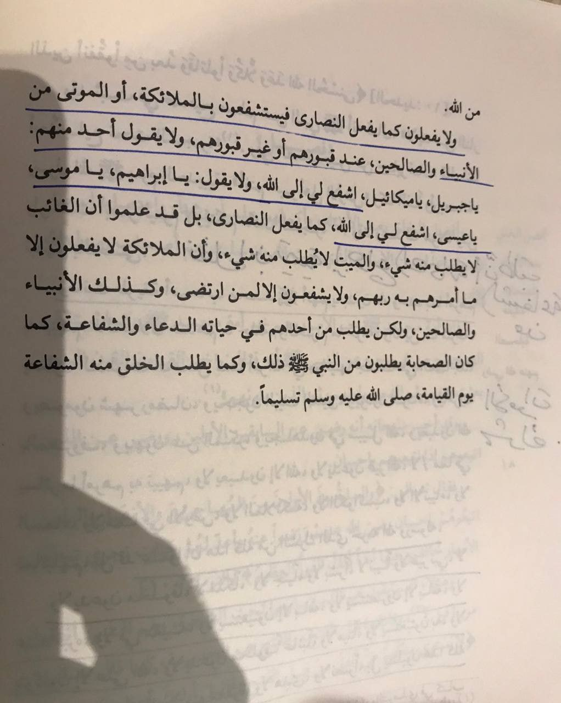

---

<!-- telegram-source: personal/messages.html#message534 -->
<!-- evidence-id: 000684 -->

Shaykh al-Islam Ibn Taymiyyah said:

The mushrikūn among these people might say: “We seek ishtishāf (intercession) through them,” meaning we ask the angels and prophets to intercede. So when we approach the grave of someone, we request them to intercede for us. When we depict their statue—whether the statues are three-dimensional or pictured statues as the Christians depict in their churches—they say: “Our intention with these statues is to remember their owners and their lives, and we address these statues with the purpose of addressing their owners to intercede for us with Allāh.”

Then one of them might say: “O my master Fulān" or "O my master Jirjis" or "Butrus" or "the kind Lady Maryam". Or "O my master al-Khalīl" or "Mūsā ibn ʿImrān" or others, intercede for me with your Lord.” They may address the deceased at their grave or address someone alive but absent, just as they would if that person were present. They recite poems in which one of them says: “O my master Fulān! I am under your protection, I am in your vicinity, intercede for me with Allāh, ask Allāh to grant us victory over our enemy, ask Allāh to remove this hardship from us, I complain to you about such and such, so ask Allāh to relieve this distress.” Or someone might say: “Ask Allāh to forgive me.”

These types of addressing angels , prophets, and the righteous after their death at their graves or in their absence, and addressing their statues, is among the greatest forms of shirk found among mushrikūn who are not Ahl al-Kitāb, among innovators of the Ahl al-Kitāb, and Muslims who introduced acts of shirk and worship that Allāh did not permit. Allāh, the Exalted, says (42:21): "Or have they partners with Allâh (false gods) who have instituted for them a religion which Allâh has not ordained?"

Thus, calling upon angels and prophets after their death, seeking them, asking for help through them, seeking intercession from them in this way—and erecting statues of them as a means of requesting intercession—is part of a religion that Allāh did not legislate, that no Messenger was sent to legislate, and that no book was revealed for. It is neither obligatory nor recommended by ijmāʿ of the Muslims.

None of the Ṣaḥābah or the Tābiʿīn performed this in a proper manner, nor did any Imām of the Muslims command it. Even if many people who practice worship and asceticism do this and narrate stories and visions about it, all of this is from Shayṭān. Some even compose poems in the context of supplicating the deceased, seeking intercession or aid, or mention this within praise of the prophets and righteous. All of this is not sanctioned—neither obligatory nor recommended—by the ijmāʿ of the Muslim scholars.

Source: al-Qā‘idah al-Jalīlah fī al-Tawassul wa al-Wasīlah by Ibn Taymiyyah p.23-25

Show Arabic source text

المصدر: قاعدة جليلة في التوسل والوسيلة

<h4 dir="rtl">ص. 23</h4>

الجاهل (1) ، فمنهم من يحب شخاً فيتزيّا في صورته ويقول: أنا فلان. ويكون ذلك في برِّية ومكان قفر فيطعم ذلك الشخص طعامًا ويسقيه شراباً أو يدله على الطريق أو يخبره ببعض الأمور الواقعة الغائبة فيظن ذلك الرجل أن نفس الشيخ الميت أو الحي فعل ذلك، وقد يقول: هذا سر الشيخ وهذه رقيقته (2) وهذه حقيقته أو هذا مَلَكٌ جاء على صورته. وإنما يكون ذلك جنيًّا، فإن الملائكة لا تعين على الشرك والإفك والإثم والعدوان. وقد قال الله تعالى (17: 56 - 57) : {قُلْ ادْعُوا الَّذِينَ زَعَمْتُمْ مِنْ دُونِهِ فَلَا يَمْلِكُونَ كَشْفَ الضُّرِّ عَنكُمْ وَلَا تَحْوِيلاً أُوْلَئِكَ الَّذِينَ يَدْعُونَ يَبْتَغُونَ إِلَى رَبِّهِمْ الْوَسِيلَةَ أَيُّهُمْ أَقْرَبُ وَيَرْجُونَ رَحْمَتَهُ وَيَخَافُونَ عَذَابَهُ إِنَّ عَذَابَ رَبِّكَ كَانَ مَحْذُورًا} .

47 -

قال طائفة من السلف: كان أقوام يدعون الملائكة والأنبياء كالعزير والمسيح، فبين الله تعالى أن الملائكة والأنبياء عباد الله (3) ، كما أن الذين يعبدونهم عباد الله، وبين أنهم يرجون رحمته ويخافون عذابه ويتقربون إليه كما يفعل سائر عباده الصالحين.

48 -

والمشركون من هؤلاء قد يقولون: إنا نستشفع بهم أي نطلب من الملائكة والأنبياء أن يشفعوا، فإذا أتينا قبر أحد طلبنا منه أن

(1) في ز: الجاهل العابد، وفي هذا الكلام إشارة إلى الآية الكريمة: {وأنا منا الصالحون ومنا دون ذلك، كنا طرائق قدداً} (سورة الجن: 11) .

(2)

أي طيفه. وكل من رق جسده ونفسه يسمى رقيقًا.

(3)

والمسيح عليه السلام يتبرأ من الذين اتخذوه وأمه إلهين، وذلك يوم يسأله الله سبحانه: {أأنت قلت للناس اتخذوني وأمي إلهين من دون الله قال سبحانك ما يكون لي أن أقول ما ليس لي بحق} . (المائدة 116) .

<h4 dir="rtl">ص. 23</h4>

وسواع

…

إلخ ولقد قالوا في حماس: {وقالوا لا تذرن آلهتكم ولا تذرن ودًّا ولا سواعًا ولا يغوث ويعوق ونسرًا} سورة نوح، آية (23) .

إن هذا الإمام المجاهد المناضل عن التوحيد والحق قد وقف حياته للدعوة إلى الحق في ميادينه مدافعًا عنه بكل ما منحه الله من طاقات ومواهب، واضعًا نصب عينيه كتاب الله وسنة رسوله صلى الله عليه وسلم، وما أُثِر عن السلف الصالح من الصحابة والتابعين لهم بإحسان في مجال العقيدة والعبادة والتشريع وسائر الميادين الإسلامية، وفي هذا الكتاب الجليل قد عالج القضايا الآتية:

1 -

التوسل وأنواعه وأشياء تتعلق وترتبط به.

2 -

الشفاعة بأنواعها وأشياء تجر إليها من لا يفهم.

3 -

الدعاء بأنواعه.

مفرقاً فيها بين الحق والباطل والهدى والضلال بالأدلة الواضحة والحجج الساطعة.

<h4 dir="rtl">ص. 24</h4>

يشفع لنا، فإذا صورنا تمثاله - والتماثيل إما مجسدة وإما تماثيل مصورة كما يصورها النصارى في كنائسهم - قالوا: فمقصودنا بهذه التماثيل تذكر أصحابها وسيرهم ونحن نخاطب هذه التماثيل ومقصودنا خطاب أصحابها ليشفعوا لنا إلى الله. فيقول أحدهم: يا سيدي فلاناً أو يا سيدي جرجس أو بطرس أو ياستي الحنونة مريم. أو يا سيدي الخليل أو موسى ابن عمران أو غير ذلك، اشفع لي إلى ربك. وقد يخاطبون الميت عند قبره أو يخاطبون الحي وهو غائب، كما يخاطبونه لو كان حاضراً حياًّ وينشدون قصائد يقول أحدهم فيها: يا سيدي فلانا! أنا في حسبك، أنا في جوارك، اشفع لي إلى الله، سل الله لنا أن ينصرنا على عدونا، سل الله أن يكشف عنا هذه الشدة، أشكو إليك كذا وكذا فسل الله أن يكشف هذه الكربة. أو يقول أحدهم: سل الله أن يغفر لي. ومنهم من يتأول قوله تعالى: (4: 64) : {وَلَوْ أَنَّهُمْ إِذْ ظَلَمُوا أَنفُسَهُمْ جَاءُوكَ فَاسْتَغْفَرُوا اللَّهَ وَاسْتَغْفَرَ لَهُمْ الرَّسُولُ لَوَجَدُوا اللَّهَ تَوَّابًا رَحِيمًا} .

49 -

ويقولون: إذا طلبنا منه الاستغفار بعد موته كنا بمنزلة الذين طلبوا الاستغفار من الصحابة، ويخالفون بذلك إجماع الصحابة والتابعين لهم بإحسان وسائر المسلمين، فإن أحداً منهم لم يطلب من النبي صلى الله عليه وسلم بعد موته أن يشفع له ولا سأله شيئاً ولا ذكر ذلك أحد من أئمة المسلمين في كتبهم، وإنما ذكر ذلك من ذكره من متأخري الفقهاء وحكوا حكاية مكذوبة على مالك رضي الله عنه سيأتي ذكرها وبسط الكلام عليها (1) إن شاء الله تعالى.

(1) انظر: (ص 121) .

<h4 dir="rtl">ص. 24</h4>

‌

‌منهج شيخ الإسلام في هذا الكتاب

إن هذا الإمام واسع الاطلاع، طويل الباع، عميق الفهم فهو الإمام الفذ في التفسير وعلومه، والحافظ الناقد في الحديث وعلومه، وهو الفقيه المبرز والأصولي المتمكن، والمجتهد المطلق، والعالم بالملل والنحل، والمنطق والفلسفة والتصوف والكلام، والعارف بأباطيلها وزيفها وغشها وخداعها.

عرف العلوم المسماة بالعقلية أكثر من أهلها المختصين فيها وعرف عيوبها وزيفها وخطرها وما تؤدي إليه من ضلال وهلاك، فوجه ما حباه الله به من طاقات، فزلزل قواعدها، ودك معاقلها.

وعرف التصوف وما ينطوي عليه من شرور وخرافات وأباطيل واصطلاحات فاسدة ومغالطات تفسد وتدمر الدين والعقل، فثلَّ عروشه ودمر قواعده، وكشف تلك المغالطات بالحجج الواضحة والبراهين الساطعة.

وخرج من معاركه العلمية والجهادية ظافرًا منتصرًا انتصاراً حاسماً فلا ترى لخصومه إلى يومنا هذا إلا معارك فاشلة وحججاً متهاوية وكلاماً فارغاً إلا من المغالطات التي لا تنطلي إلا على الأغبياء.

ومن علامات هزائمهم أن كثيراً منهم يتظاهرون بمدحه واحترامه، ثم يكيدون لدعوته إلى التوحيد بنقل ما يزعمون أنه يؤيد باطلهم من كلامه بعد بتره وتشويهه.

هذا ما يقال بصفة إجمالية بالنسبة لجهوده في مؤلفاته الجليلة.

<h4 dir="rtl">ص. 25</h4>

50 -

فهذه الأنواع من خطاب الملائكة والأنبياء والصالحين بعد موتهم عند قبورهم وفي مغيبهم، وخطاب تماثيلهم، هو من (1) أعظم أنواع الشرك الموجود في المشركين من غير أهل الكتاب، وفي مبتدعة أهل الكتاب والمسلمين الذين أحدثوا من الشرك والعبادات ما لم يأذن به الله تعالى، قال الله تعالى (2) (42: 21) : {أَمْ لَهُمْ شُرَكَاءُ شَرَعُوا لَهُمْ مِنْ الدِّينِ مَا لَمْ يَأْذَنْ بِهِ اللَّهُ} . فإن دعاء الملائكة والأنبياء بعد موتهم وفي مغيبهم وسؤالهم والاستغاثة بهم والاستشفاع بهم في هذه الحال - و [نصب] تماثيلهم بمعنى طلب الشفاعة منهم - هو من الدين الذي لم يشرعه الله ولا ابتعث به رسولاً ولا أنزل به كتاباً، وليس هو واجباً ولا مستحباً باتفاق المسلمين، ولا فعله أحد من الصحابة والتابعين/ لهم بإحسان، ولا أمر به إمام من أئمة المسلمين، وإن كان ذلك مما يفعله كثير من الناس ممن له عبادة وزهد، ويذكرون فيه حكايات ومنامات، فهذا كله من الشيطان. وفيهم من ينظم القصائد في دعاء الميت والاستشفاع به والاستغاثة، أو يذكر ذلك في ضمن مديح الأنبياء والصالحين، فهذا كله ليس بمشروع لا واجب ولا مستحب باتفاق أئمة المسلمين.

51 -

ومن تعبد بعبادة ليست واجبة ولا مستحبة وهو يعتقدها واجبة أو مستحبة فهو ضال مبتدع بدعةً سيئة لا بدعة حسنة باتفاق أئمة الدين، فإن الله لا يُعبد إلا بما هو واجب أو مستحب (3) . وكثير من

(1) كلمة &quot;من&quot; سقطت من: ز، ب.

(2)

&quot;قال الله تعالى&quot; سقطت من: ز.

(3)

في خ: &quot;واجبا أو مستحبا&quot;.

<h4 dir="rtl">ص. 25</h4>

أَمَّا منهجه في هذا الكتاب فإنه يعرض القضية من القضايا ويدرسها من كل النواحي التي تتطلبها الدراسات العلمية؛ من الناحية اللغوية والتفسيرية والحديثية والتأريخية والأصولية والفقهية، ويضرب الأمثال، ويقرب النظير من الأمور إلى نظيره بطريقة فذة تدل على غزارة علمه وقوة استحضاره وقدرته على استحضار الأمثال والأشباه من المسائل وهذا شأنه في جميع مؤلفاته رحمه الله.

وإنني لأعترف أنني لم أوف هذا الكتاب حقه من الدراسة لأسباب منها؛ خوف الإطالة وضيق وقتي، فأجتزئ بنماذج من منهجه الفذ في هذا الكتاب القيم.

قال رحمه الله فيما يتعلق بلفظ التوسل فقرة (236) : &quot;إذا عرف هذا فقد تبين أن لفظ الوسيلة والتوسل فيه إجمال واشتباه يجب أن تعرف معانيه ويعطى كل ذي حق حقه، فيعرف ما ورد به الكتاب والسنة من ذلك ومعناه، وما كان يتكلم به الصحابة، ويفعلونه ومعنى ذلك، ويعرف ما أحدثه المحدثون في هذا اللفظ ومعناه. فإن كثيراً من اضطراب الناس في هذا الباب هو بسبب ما وقع فيه من الإجمال والاشتراك في الألفاظ ومعانيها حتى تجد أكثرهم لا يعرف في هذا الباب فصل الخطاب&quot;.

ثم بين معاني التوسل والوسيلة في لغة القرآن والسنة وكلام الصحابة وأن من أعظم معاني التوسل التقرب إلى الله بالإيمان بالله ورسله وكتبه واليوم الآخر والقيام بكل واجب ومستحب أمر الله به ورسله، وطاعة الرسول في كل ما أمر به ونهى عنه، وأن من معانيه: التوسل إلى الله بدعائه وشفاعته في حياته في الدنيا وبدعائه وشفاعته في

---

<!-- telegram-source: personal/messages.html#message556 -->
<!-- evidence-id: 000685 -->

Shaykh al-Islam Ibn Taymiyyah said:

So this intercession (ash-shafāʿah) which the Qur’an negated includes the negation of what the mushrikūn of the Arabs used to say, and those similar to them from the other mushrikīn.

And it is of the same type as the shirk of the Christians and those like them among the misguided who affiliate themselves with Islam, where they believe regarding the angels or the prophets or the shuyūkh that they are intercessors for them with Allāh — just as the intercessors intercede with the kings of the world.

And they strike for Allāh an analogy and say: whoever wants to draw near to a great king should not come to him first, but rather draw near to those close to him, who then raise his needs and bring him near to him.

Allāh the Exalted said: “And those who take Awliyâ’ besides Him (say): "We worship them only that they may bring us near to Allâh."” [az-Zumar: 3] That is, they say: “We do not worship them except that they may bring us near to Allāh.”

He mentioned this after His saying: "The revelation of the Book [i.e., the Qur’ān] is from Allāh, the Exalted in Might, the Wise. Indeed, We have sent down to you the Book, [O Muḥammad], in truth. So worship Allāh, [being] sincere to Him in religion. Unquestionably, for Allāh is the pure religion.

And those who take Awliyâ’ besides Him (say): "We worship them only that they may bring us near to Allâh. Indeed, Allāh will judge between them concerning that over which they differ. Indeed, Allāh does not guide he who is a liar and disbeliever." [az-Zumar :3]

Source: al-Radd ʿalā al-Manṭiqiyyīn by Ibn Taymiyyah p.571-572

Show attached source scan

---

<!-- telegram-source: dar/messages5.html#message4985 -->
<!-- evidence-id: 000686 -->

Shaykh Muḥammad Ibn ʿAbd al-Wahhāb said:

It is said to this ignorant person: if you know that the ilāh is the one who is worshipped, and you know that duʿāʾ is from ʿibādah (worship), then how do you call upon a created being, a dead one, one who is incapable? And you leave the Ever-Living, the Self-Sustaining, the Present, the Compassionate, the Merciful, the All-Powerful?

So this mushrik may say: “The matter is in the hand of Allah, but this righteous servant will intercede for me with Allah, and his intercession and rank will benefit me,” and he thinks that this saves him from shirk.

Source: ad-Durar as-Saniyyah 2/104

Show Arabic source text

المصدر: الدرر السنية في الأجوبة النجدية

<h4 dir="rtl">ص. 104</h4>

واعلم أن من ذبح لغير الله، من جني أو قبر، فكما لو سجد له; وقد لعنه رسول الله صلى الله عليه وسلم في الحديث الصحيح، قال: &quot; لعن الله من ذبح لغير الله &quot;1.

ومن أنواع العبادة: الدعاء؛ كما كان المؤمنون، يدعون الله وحده، ليلا ونهارا، في الشدة والرخاء، لا يشك أحد، أن هذا من أنواع العبادة، فتفكر&quot; رحمك الله&quot; فيما حدث في الناس اليوم، من دعاء غير الله في الشدة والرخاء; هذا يريد سفرا، فيأتي عند قبر أو غيره، فيدخل عليه بما له، عمن ينهبه، وهذا تلحقه الشدة، في البر، أو البحر، فيستغيث بعبد القادر، أو شمسان، أو نبي من الأنبياء، أو ولي من الأولياء، أن ينجيه من هذه الشدة.

فيقال لهذا الجاهل: إن كنت تعرف أن الإله هو: المعبود، وتعرف أن الدعاء من العبادة، فكيف تدعو مخلوقا، ميتا، عاجزا؟! وتترك الحي، القيوم، الحاضر، الرؤوف، الرحيم، القدير؟! فقد يقول&quot; هذا المشرك&quot;: إن الأمر بيد الله، ولكن هذا العبد الصالح يشفع لي عند الله، وتنفعني شفاعته وجاهه; ويظن أن ذلك يسلمه من الشرك.

فيقال لهذا الجاهل: المشركون عباد الأصنام، الذين قاتلهم رسول الله صلى الله عليه وسلم وغنم أموالهم وأبناءهم ونساءهم، كلهم يعتقدون أن الله هو النافع، الضار، الذي يدبر الأمر، وإنما أرادوا ما أردت من الشفاعة عند الله، كما قال

1 مسلم: الأضاحي (1978) ، والنسائي: الضحايا (4422) ، وأحمد (1/108 ،1/118 ،1/152) .

---

<!-- evidence-id: 000687 -->
Shaykh al-Islām Ibn Taymiyyah said:

It is said that this report is itself a proof against the disputant. When that man made his request of the Prophet ﷺ, the Prophet did not say, “I will supplicate for you.” Rather, he instructed them to do what he had legislated and established for them: that they themselves call upon Allāh and seek rain from Him. The report states that he told the man, “Tell ʿUmar to be prudent,” meaning to remain upright. When this was conveyed to ʿUmar, he said, “I spare no effort.”

Thus, the report contains an instruction to obey Allāh and His Messenger and to seek rain from Allāh. This was the same law the Messenger established for them during his life. After his death he instructed them only with what he had instructed them during his life. The man who said to him, “Supplicate for your nation,” is unknown and was not among the Emigrants or the Helpers whose example is followed. It is sufficient that not one of them went to his grave to request supplication from him. The most knowledgeable people concerning his religion and those who followed him most closely, the Emigrants and the Helpers, did not go to him or request supplication from him.

Moreover, the person who requested the supplication was not granted his request, nor was he told, “I will supplicate for you.” Rather, he was told in effect: obey my command and call upon Allāh yourselves, and He will answer you.

This is the truth with which Allāh sent him. Happiness in this world and the Hereafter lies in obeying him, following him, taking him as one’s example, doing what he commanded, leaving what he prohibited, taking his allies as allies, opposing his enemies, treating as lawful what he declared lawful, treating as unlawful what he declared unlawful, and believing everything he reported concerning Allāh, His angels, His books, His messengers, the Last Day, and the other matters of the unseen. He is truthful and confirmed in everything he reports. “He does not speak from his own desire. It is only revelation revealed.” [An-Najm 53:3-4]

Had the Messenger ﷺ legislated that Muslims request from him forgiveness, victory, rain, and other forms of supplication and desire after his death, just as they requested these things from him during his life and as the creation will request him to intercede on the Day of Resurrection, his command to do so would have been well known and transmitted from him, just as the rest of what he commanded was transmitted. He said: “I have left nothing that brings you closer to Paradise except that I have informed you of it, and nothing that takes you farther from the Fire except that I have informed you of it.” He also said: “I have left you upon a clear path whose night is like its day; none deviates from it after me except one who is destroyed.”

Abū Dharr said: “The Messenger of Allāh ﷺ died, and there was not even a bird turning its wings in the sky except that he had mentioned knowledge of it to us.”

If he had established for them the practice of requesting supplications from him after his death, it would have been known to them and transmitted from him. His Companions would have known it better than anyone else, and they were the most obedient to him and the closest followers of his Sunnah. They would therefore have gone to his grave after his death and asked him to supplicate for their forgiveness, guidance, victory, provision, the payment of their debts, the removal of their afflictions, and other matters, just as some of them requested his supplication during his life.

Yet their leading figures, such as Abū Bakr and those like him, had learned from him to ask none but Allāh and to call upon none but Allāh. When the whip fell from the hand of al-Ṣiddīq, he would not say to anyone, “Hand it to me,” and he would say, “My intimate friend instructed me not to ask people for anything.” Aḥmad narrated this in the Musnad.

The Prophet ﷺ said to Ibn ʿAbbās: “When you ask, ask Allāh; and when you seek aid, seek aid from Allāh.” In Ṣaḥīḥ Muslim, ʿAwf ibn Mālik related that the Prophet took a pledge from a group of his Companions and privately instructed them “not to ask people for anything.” ʿAwf said: “I later saw one of those men drop his whip from his hand and not ask anyone to hand it to him.”

It is also established in an agreed-upon authentic ḥadīth that the Prophet ﷺ said: “Seventy thousand from my nation will enter Paradise without reckoning. They are those who do not request ruqyah, do not cauterize, do not regard omens, and rely upon their Lord.” These people do not say to anyone, “Perform ruqyah for us.” Although some people came to the Prophet ﷺ and requested ruqyah from him or from some of his Companions, and although doing so is permissible, those seventy thousand ask none but Allāh and therefore possess a higher rank.

After the Prophet’s death, the Companions did not ask him for anything they had asked him for during his life, neither supplication nor anything else whatsoever. Nor did the predecessors of the first three generations go to the grave of any prophet or righteous person to request from him a need, a supplication, or anything else. They did not travel to his grave. When they visited the graves of the believers, their purpose was to supplicate for the deceased, as they did in the funeral prayer. Their purpose was not to call upon them or to call upon Allāh through them.

It is therefore clear that the position of the majority of scholars, who do not recommend requesting forgiveness or anything else from the Prophet ﷺ after his death, is the legislated position practiced by the Companions.

Furthermore, if it were legislated to request supplication and intercession from a dead person just as they were requested from him during his life, this would be legislated with respect to every prophet and righteous person. A man would then be encouraged to go to the grave of a righteous person, whether a prophet or otherwise, and say: “Supplicate for my forgiveness, victory, guidance, and provision. Intercede for me with your Lord.” He would thereby take the righteous person as an intercessor after death, as the Christians and many Muslim innovators do.

If it were permissible to make this request of the dead, it would also be permissible to request it from the angels by saying, “O Jibrīl, O Mīkāʾīl, intercede for us with your Lord and supplicate for us.”

It is known that this is not part of the religion of the Muslims or the religion of any messenger. No prophet ever legislated for people that they request supplication or intercession from dead or absent righteous people or from angels. Rather, this is the foundation of shirk, for the polytheists took them only as intercessors. Allāh says: “They worship besides Allāh that which neither harms nor benefits them, and they say, ‘These are our intercessors with Allāh.’ Say, ‘Are you informing Allāh of something He does not know in the heavens or on the earth?’” [Yūnus 10:18]

Source: Qāʿidah ʿAẓīmah fī al-Farq bayna ʿIbādāt Ahl al-Islām wa-al-Īmān wa ʿIbādāt Ahl al-Shirk wa-al-Nifāq by Ibn Taymiyyah, pp. 117-121

Show Arabic source text

المصدر: قاعدة عظيمة في الفرق بين العبادات

<h4 dir="rtl">ص. 117</h4>

قيل: هذه الحكاية حجّة على المنازع، فإن هذا الرجل لما طلب منه، ما قال له: أنا أدعو لكم، بل أمرهم بما شرعه لهم، وسنه لهم، وهو أنهم يدعون الله، ويستسقون به. وفي الحكاية أنه قال /48أ/ له: قل لعمر: عليك بالكيس، أي بالاستقامة، فلما قال لعمر قال: ما آلو جهدي.

فهذا فيه أنه أمرهم بطاعة الله ورسوله وأمرهم بالاستسقاء، وهذا هو شرعه الذي شرعه لهم في حياته، فلم يأمرهم بعد الموت إلا بما أمرهم في حياته، وهذا الرجل الذي قال له: ادع لأمتك، مجهول، ما هو من المهاجرين، والأنصار، الذين يقتدى بهم، ويكفيك أنه لم يأت أحد منهم إلى قبره يطلب منه الدعاء إلا رجل مجهول، لا يُعرف، فأما المهاجرون والأنصار الذين هم أعلم الناس بدينه، وأتبعهم له، فلم يأت أحد إليه، ولم يطلب منه الدعاء، ثم هذا الطالب للدعاء لم يُعط طلبته (1) ، ولا قال: أنا أدعو لكم، بل قال: أطيعوا أمري، وادعوا أنتم الله يجيبكم.

وهذا هو الحق الذي بعثه الله به، فإن سعادة الدنيا والآخرة في طاعته، واتباعه، والاقتداء به، وفعل ما أمر، وترك ما حظر، وموالاة أوليائه، ومعاداة أعدائه، وتحليل ما حلّل، وتحريم ما حرّم، وتصديقه في كل ما أخبر به عن الله، وملائكته، وكتبه، ورسله، واليوم الآخر، وغير ذلك من أنباء

(1) غيرت في المطبوع إلى: (طلبه) .

<h4 dir="rtl">ص. 118</h4>

الغيب، بل هو الصادق المصدوق في كل ما يخبر به، وهو الذي لا {يَنْطِقُ عَنِ الْهَوَى • إِنْ هُوَ إِلَّا وَحْيٌ يُوحَى} ، وقد استأذنه عبد الله بن عمرو في أن يكتب ما يسمع منه، وقال له بعض قريش: إن رسول الله /48ب/ صلى الله عليه وسلم يتكلم في الغضب والرضا، فقال: «اكْتُبْ فَوَالَّذِي نَفْسِي بِيَدِهِ مَا خَرَجَ مِنْ بَيْنِهِمَا إِلَّا حَقٌّ (1) » .

ولو كان قد شرع للمسلمين أن يطلبوا منه الاستغفار، والاستنصار، والاستسقاء، وغير ذلك من أنواع الأدعية، والرغبات، كما كانوا يطلبون ذلك منه في حياته، وكما يطلب منه الخلق يوم القيامة أن يشفع لهم، لكان أمره بذلك معروفًا، منقولاً عنه، كما نقل سائر ما أمرهم به، فإنه قد قال: «مَا تَرَكْتُ شَيْئًا يُقَرِّبُكُمْ إِلَى الْجَنَّةِ إِلَّا وَقَدْ حَدَّثْتُكُمْ بِهِ، وَلَا شَيْئًا يُبْعِدُكُمْ مِنَ النَّارِ إِلَّا وَقَدْ حَدَّثْتُكُمْ بِهِ (2) » وقال: «تَرَكْتُكُمْ عَلَى الْبَيْضَاءِ لَيْلُهَا كَنَهَارِهَا لَا يَزِيغُ عَنْهَا بَعْدِي إِلَّا هَالِكٌ» .

(1) غيرت في المطبوع إلى: (الحق) .

(2)

في الأصل: (حذرتكم منه) وهو خطأ، وقد صححها المحقق في المطبوع إلى: (حدثتكم عنه) ، ثم عدلتها أنا إلى ما يوافق معظم روايات شيخ الإسلام لهذا الحديث في كتبه الأخرى، وهو: (حدثتكم به) .

<h4 dir="rtl">ص. 119</h4>

وقال أبو ذر: لقد توفي رسول الله صلى الله عليه وسلم وما طائر يقلب جناحيه في السماء إلا ذكر لنا (1) منه علمًا.

فلو كان سنّ لهم أن يطلبوا منه الأدعية بعد موته لكان هذا معروفًا عندهم منقولاً عنه، ولكان أصحابه أعلم بذلك من غيرهم، وهم أطوع له، وأتبع لسنته، فكانوا بعد موته يأتون قبره فيطلبون منه أن يدعو لهم بالمغفرة، ويدعو لهم بالهداية، ويدعو لهم بالنصر، ويدعو لهم بالرزق، ويدعو لهم بقضاء الديون، ويدعو لهم بكشف الضُّر، وغير ذلك كما كان بعضهم /49أ/ يطلب منه الدعاء في حياته، مع أن أجِلائهم كأبي بكر وأمثاله قد تعلموا منه أنهم لا يسألون إلا الله، ولا يدعون إلا الله، فكان الصديق يسقط السوط من يده فلا يقول لأحد: ناولني إياه، ويقول: إِنَّ خَلِيلِي أَمَرَنِي أَنْ لَا أَسْأَلَ النَّاسَ شَيْئًا. رواه أحمد في المسند.

وقال النبي صلى الله عليه وسلم لابن عباس: «إِذَا سَأَلْتَ فَاسْأَلِ اللَّهَ، وَإِذَا اسْتَعَنْتَ فَاسْتَعِنْ بِاللَّهِ» . وفي صحيح مسلم عن عوف بن مالك: أَنَّهُ بَايَعَ رَهْطًا مِنْ أَصْحَابِهِ، وَأَسَرَّ إِلَيْهِمْ كَلِمَةً خَفِيَّةً: «أَنْ لَا (2) تَسْأَلُوا النَّاسَ شَيْئًا» . قَالَ: فَلَقَدْ

(1) في الأصل: (ذكرنا) ، والتصويب من المحقق.

(2)

غيرت في المطبوع إلى: (ألا) .

<h4 dir="rtl">ص. 120</h4>

رَأَيْتُ بَعْضَ أُولَئِكَ النَّفَرِ يَسْقُطُ السَّوْطُ مِنْ يَدِهِ فَلَا يَقُولُ لِأَحَدٍ: نَاوِلْنِي إِيَّاهُ.

وقد ثبت في الحديث المتفق على صحته أنه قال: «يَدْخُلُ الْجَنَّةَ مِنْ أُمَّتِي سَبْعُونَ أَلْفًا بِغَيْرِ حِسَابٍ؛ هُمُ الَّذِينَ لَا يَسْتَرْقُونَ، وَلَا يَكْتَوُونَ، وَلَا يَتَطَيَّرُونَ، وَعَلَى رَبِّهِمْ يَتَوَكَّلُونَ» . فهؤلاء لا يقولون لأحد: ارقنا، وقد كان جماعة يأتون إلى النبي صلى الله عليه وسلم ويطلبون منه الرقية ويطلبون ذلك من بعض أصحابه، وهذا وإن كان جائزًا لكن أولئك لا يسألون إلا الله، فدرجتهم أعلى، وأما بعد موته، فلم يكن الصحابة يطلبون منه ما كانوا يطلبون منه في حياته، لا من دعاء، ولا من غير دعاء البتة، ولا كان السلف في القرون الثلاثة يأتون إلى قبر أحدٍ من الأنبياء، والصالحين، يطلبون منه حاجة، ولا دعاء، ولا غيره، ولا يسافرون إلى قبره، بل إذا /49ب/ زاروا قبور المؤمنين كان مقصودهم الدعاء لهم كالصلاة على جنائزهم، لا دعاؤهم، ولا الدعاء بهم.

فتبين أن قول جمهور العلماء الذين لا يستحبون أن يطلب منه بعد موته استغفار، ولا غيره، هو المشروع الذي كان عليه الصحابة.

وأيضًا فلو شرع أن يطلب من الميت الدعاء، والشفاعة، كما كان يطلب منه في حياته؛ كان ذلك مشروعًا في حق الأنبياء، والصالحين، فكان يسنّ أن يأتي الرجل قبر الرجل الصالح، نبيًّا كان، أو غيره، فيقول

<h4 dir="rtl">ص. 121</h4>

ادع لي بالمغفرة، والنصر، والهدى، والرزق، اشفع لي إلى ربك، فيتخذ الرجل الصالح شفيعًا بعد الموت، كما يفعل ذلك النصارى، وكما تفعل كثير من مبتدعة المسلمين، وإذا جاز طلب هذا منه، جاز أن يطلب ذلك من الملائكة، فيقال: يا جبريل، يا ميكائيل، اشفع لنا إلى ربك، ادع لنا.

ومعلوم أن هذا ليس من دين المسلمين، ولا دين أحد من الرسل، لم يسنّ أحد من الأنبياء للخلق أن يطلبوا من الصالحين الموتى، والغائبين، والملائكة، دعاء، ولا شفاعة، بل هذا أصل الشرك، فإن المشركين إنما اتخذوهم شفعاء، قال تعالى: {وَيَعْبُدُونَ مِنْ دُونِ اللَّهِ مَا لَا يَضُرُّهُمْ وَلَا يَنْفَعُهُمْ وَيَقُولُونَ هَؤُلَاءِ شُفَعَاؤُنَا عِنْدَ اللَّهِ قُلْ أَتُنَبِّئُونَ اللَّهَ بِمَا لَا يَعْلَمُ /50أ/ فِي السَّمَاوَاتِ وَلَا فِي الْأَرْضِ} [يونس: 18] .

وقال: {وَلَقَدْ جِئْتُمُونَا فُرَادَى كَمَا خَلَقْنَاكُمْ أَوَّلَ مَرَّةٍ وَتَرَكْتُمْ مَا خَوَّلْنَاكُمْ وَرَاءَ ظُهُورِكُمْ وَمَا نَرَى مَعَكُمْ شُفَعَاءَكُمُ الَّذِينَ زَعَمْتُمْ أَنَّهُمْ فِيكُمْ شُرَكَاءُ لَقَدْ تَقَطَّعَ بَيْنَكُمْ وَضَلَّ عَنْكُمْ مَا كُنْتُمْ تَزْعُمُونَ} [الأنعام: 94] .

وقال تعالى: {وَكَمْ مِنْ مَلَكٍ فِي السَّمَاوَاتِ لَا تُغْنِي شَفَاعَتُهُمْ شَيْئًا إِلَّا مِنْ بَعْدِ أَنْ يَأْذَنَ اللَّهُ لِمَنْ يَشَاءُ وَيَرْضَى} [النجم: 26] .

وقال تعالى: {قُلِ ادْعُوا الَّذِينَ زَعَمْتُمْ مِنْ دُونِ اللَّهِ لَا يَمْلِكُونَ مِثْقَالَ ذَرَّةٍ فِي السَّمَاوَاتِ وَلَا فِي الْأَرْضِ وَمَا لَهُمْ فِيهِمَا مِنْ شِرْكٍ وَمَا لَهُ مِنْهُمْ مِنْ ظَهِيرٍ • وَلَا تَنْفَعُ الشَّفَاعَةُ عِنْدَهُ إِلَّا لِمَنْ أَذِنَ لَهُ حَتَّى إِذَا فُزِّعَ عَنْ قُلُوبِهِمْ قَالُوا مَاذَا قَالَ رَبُّكُمْ قَالُوا الْحَقَّ وَهُوَ الْعَلِيُّ الْكَبِيرُ} [سبأ: 22-23] .

وقال: {وَأَنْذِرْ بِهِ الَّذِينَ يَخَافُونَ أَنْ يُحْشَرُوا إِلَى رَبِّهِمْ لَيْسَ لَهُمْ مِنْ دُونِهِ وَلِيٌّ وَلَا شَفِيعٌ} [الأنعام: 51] .

<!-- telegram-source: dar/messages2.html#message1535 -->
<!-- evidence-id: 000688 -->

Sheikh ’Abd ar-Raḥmān ash-Shaykh said:

The Author (Sheikh Muhammad Ibn Abdul Wahhab) رحمه الله said: On the authority of Ibn Masʿūd, may Allah be pleased with him, that the Messenger of Allah ﷺ said: “Whoever dies while calling upon a rival to Allah besides Him will enter the Fire. ” Narrated by al-Bukhārī.

Explanation:

Ibn al-Qayyim said: Al-nidd (الند) means a counterpart or equal. It is said: “So-and-so is the nidd of so-and-so” or his equivalent, meaning his equal and counterpart. End quote. Allah Almighty said:

“So do not set up rivals to Allah while you know [the truth].” (Al-Baqarah: 22)

His statement: (Whoever dies while calling upon a rival to Allah besides Him) —meaning: he assigns a rival to Allah in worship, calling upon him, asking him, and seeking his aid— “will enter the Fire.”

Al-ʿAllāmah Ibn al-Qayyim, may Allah have mercy on him, said:

Beware of shirk, for it is evident and clear, This type shall never be forgiven.

It is to set up a rival to the Most Merciful, regardless of who it may be—whether a stone or a human being.

He calls upon it, hopes for it, then fears it, and loves it, just as the love of the Sustainer.

And know that setting up a rival to Allah is of two types:

The first: To make that rival a partner with Allah in any type of worship, or in some of it, as previously mentioned. This is major shirk.

The second: It is the type of minor shirk, such as saying: “What Allah wills and you wills,” or “If it weren’t for Allah and you.” Also, slight showing off (riya). It is confirmed that when a man said to the Prophet ﷺ, “What Allah wills and you wills,” he replied, “Did you make me a partner with Allah? Rather, what Allah alone wills.” This was narrated by Ahmad, Ibn Abī Shaybah, al-Bukhārī in his Al-Adab al-Mufrad , al-Nasā’ī, and Ibn Mājah.

In this, it is evident that calling upon others besides Allah for something that only Allah can do is clear shirk, such as seeking intercession from the dead. The right of intercession belongs to Allah alone, and He has control over it, while no one else holds any part of it. It is He who permits the intercessor to intercede for those who meet Allah with sincerity and monotheism, from among the people of major sins.

Source: Fatḥ al-Majīd by Sheikh ’Abd ar-Raḥmān ibn Ḥasan ibn ash-Shaykh p.65-66

Show Arabic source text

المصدر: فتح المجيد شرح كتاب التوحيد

<h4 dir="rtl">ص. 65</h4>

قوله: &quot;إذ رفع لي سواد عظيم&quot; المراد هنا الشخص الذي يرى من بعيد.

قوله: &quot;فظننت أنهم أمتي&quot;؛ لأن الأشخاص التي ترى في الأفق لا يدرك منها إلا الصورة. وفي صحيح مسلم: &quot;ولكن انظر إلى الأفق&quot; ولم يذكره المصنف; فلعله سقط في الأصل الذي نقل الحديث منه. والله أعلم.

قوله: &quot;فقيل له: هذا موسى وقومه&quot; أي موسى بن عمران كليم الرحمن، وقومه: اتباعه على دينه من بني إسرائيل1.

فنظرت فإذا سواد عظيم، فقيل لي: هذه أمتك ومعهم سبعون ألفا يدخلون

1 في قرة العيون: فيه فضيلة اتباع موسى من بني إسرائيل ممن آمن منهم بالرسل. والكتب التي أنزلها الله: التوراة، والإنجيل، والزبور، والفرقان وغيرها. وكانت بنو إسرائيل قبل التفرق كثيرين وفيهم الأنبياء، ثم بعد ذلك حدث ما حدث من اليهود، وهذا الحديث يدل على أن التابع لموسى عليه السلام كثيرون جدا، وقد قال تعالى: 45: 16 (وفضلناهم على العالمين) ، أي في زمانهم. وذلك أن في زمانهم وقبله ممن كفر بالله خلقا لا يحصون، كحزب جالوت وبختنصر وأمثالهم. ففضل الله بني إسرائيل بالإيمان فصاروا أفضل أهل زمانهم، وحدث فيهم ما ذكر الله في سورة البقرة وغيرها من معصيتهم لأنبيائهم واختلافهم في دينهم، وقد ذكره الله تعالى محتجا به على اليهود الذين كفروا بمحمد صلى الله عليه وسلم، فتدبر ما ذكره الله تعالى من أحوالهم بعد الاختلاف.

<h4 dir="rtl">ص. 66</h4>

قوله: &quot;فنظرت فإذا سواد عظيم، فقيل لي: هذه أمتك ومعهم سبعون ألفا يدخلون الجنة بغير حساب ولا عذاب&quot;، أي لتحقيقهم التوحيد، وفي رواية ابن فضيل: &quot;ويدخل الجنة من هؤلاء من أمتك سبعون ألفا&quot;. وفي حديث أبي هريرة في الصحيحين: &quot;أنهم تضيء وجوههم إضاءة القمر ليلة البدر&quot;. وروى الإمام أحمد والبيهقي في حديث أبي هريرة: &quot;فاستزدت ربي فزادني مع كل ألف سبعين ألفا&quot;. قال الحافظ: وسنده جيد12.

قوله: &quot;ثم نهض&quot; أي قام. قوله: &quot;فخاض الناس في أولئك&quot; خاض بالخاء والضاد المعجمتين. وفي هذا إباحة المناظرة والمباحثة في نصوص الشرع على وجه

صحبوا رسول الله صلي الله عليه وسلم. وقال بعضهم: فلعلهم الذين ولدوا في الإسلام، فلم يشركوا بالله شيئا، وذكروا أشياء. فخرج عليهم رسول الله صلي الله عليه وسلم فأخبروه، فقال: هم الذين لا يسترقون،

الاستفادة وبيان الحق، وفيه عمق علم السلف لمعرفتهم أنهم لم ينالوا ذلك إلا بعمل. وفيه حرصهم على الخير. ذكره المصنف3.

قوله: &quot;فقال: هم الذين لا يسترقون&quot; هكذا ثبت في الصحيحين وهو كذلك في حديث ابن مسعود في مسند أحمد. وفي رواية لمسلم:

&quot;ولا يرقون&quot; قال شيخ الإسلام ابن تيمية:

1 صحيح: أحمد (2/359) : وقال الحافظ في الفتح (11/410) : &quot;وسنده جيد&quot; ا. هـ وصححه الألباني في الصحيحة (1486) لشواهده.

2 في قرة العيون: فيه فضيلة هذه الأمة وأنهم أكثر الأمم تابعا لنبيهم صلى الله عليه وسلم، وقد كثروا في عهد الصحابة رضي الله عنهم، وفي وقت الخلفاء الراشدين ومن بعدهم، فملأوا القرى والأمصار والقفار، وكثر فيهم العلم، واجتمعت لهم الفنون في العلوم النافعة، فما زالت هذه الأمة على السنة في القرون الثلاثة المفضلة، وقد قلوا في آخر الزمان. قال شيخنا - رحمه الله تعالى - في مسائله: ((وفيه فضيلة هذه الأمة بالكمية والكيفية، فالكمية الكثرة والعدد، والكيفية فضيلتهم في صفاتهم)) .

3 في قرة العيون: وفيه أيضا فضل الصحابة رضي الله عنهم في مذاكرتهم العلم وحرصهم على فهم ما حدثهم به نبيهم صلى الله عليه وسلم حرصا على العمل به، وفيه جواز الاجتهاد فيما لم يكن فيه دليل؛ لأنهم قالوا ما قالوا باجتهادهم، ولم ينكر صلى الله عليه وسلم ذلك عليهم، لكن المجتهد إذا لم يكن معه دليل لا يجوز له أن يجزم بصواب نفسه، بل يقول: لعل الحكم كذا وكذا كقول الصحابة رضي الله عنهم في هذا الحديث.

---

<!-- telegram-source: dar/messages4.html#message3884 -->
<!-- evidence-id: 000689 -->

Shaykh ʿAbd al-Raḥmān ash-Shaykh said:

What has already been established clarifies that asking the dead or the absent, and seeking intercession through them to Allāh, is exactly the religion of the mushrikūn among the Arabs and those before them. For Allāh sent His Messengers only to oppose this, as has been established in the verses on al-shafāʿah and those similar to them, and in what came from the Master of the Messengers:

"Say, ˹O Prophet,˺ “I call only upon my Lord, associating none with Him ˹in worship˺.” Say, “It is not in my power to harm or benefit you.” ˹My duty is˺ only to convey ˹the truth˺ from Allah and ˹deliver˺ His messages.” And whoever disobeys Allah and His Messenger will certainly be in the Fire of Hell, to stay there for ever and ever." [al-Jinn: 20-23]

So reflect on what is in these verses, and what the Exalted has arranged as a consequence for opposing the Messenger ﷺ in what he commanded towards and conveyed from Allāh regarding His tawḥīd, namely the threat of the Fire and eternal residence therein. And the Qurʾān, from beginning to end, establishes this call, directs to it, forbids everything that contradicts it—whether in speech, deed, or belief—and warns them of Himself and cautions them about His punishment.

Source: Kashf mā Alqāh Iblīs min al-Bahraj wa-al-Talbīs ʿalā Qalb Dāwūd ibn Jirjīs by Shaykh ʿAbd al-Raḥmān ash-Shaykh p.219

Show Arabic source text

المصدر: كشف ما ألقاه إبليس

<h4 dir="rtl">ص. 219</h4>

لا يسأل إلا الله – وحذر أمته ذلك، فكيف إذا وقع نفس المحذور من الشرك وأسباب الشرك؟ فتبين (1) أن أحداً من السلف لم يفعل (2) ذلك (3) .

قلت: وقد تقرر بما تقدم أن سؤال الميت والغائب والاستشفاع به إلى الله أنه هو دين المشركين من العرب ومن قبلهم، فإن (4) الله تعالى بعث رسله إلا به، وتقرر ذلك في آيات الشفاعة وما في معناها من الآيات وما فيها من سيد المرسلين: {قُلْ إِنَّمَا أَدْعُو رَبِّي وَلا أُشْرِكُ بِهِ أَحَداً. (5 قُلْ إِنِّي لا أَمْلِكُ لَكُمْ ضَرّاً وَلا رَشَداً5) (5) . قُلْ إِنِّي لَنْ يُجِيرَنِي مِنَ اللَّهِ أَحَدٌ وَلَنْ أَجِدَ مِنْ دُونِهِ مُلْتَحَداً. إِلَّا بَلاغاً مِنَ اللَّهِ وَرِسَالاتِهِ وَمَنْ يَعْصِ اللَّهَ وَرَسُولَهُ فَإِنَّ لَهُ نَارَ جَهَنَّمَ خَالِدِينَ فِيهَا أَبَدا} (6) .

فتأمل ما في هذه الآيات، وما رتب سبحانه على مخالفة الرسول صلى الله عليه وسلم فيما وعد إليه، وبلغه عن الله من توحيده، بالوعيد بالنار والخلود فيها، والقرآن كله من أوله إلى آخره يقرر هذه الدعوة، ويرشد إليها، وينهى عن كل ما ينافيها من قول أو فعل أو اعتقاد، ويحذرهم نفسه وينذرهم بأسه.

(1) في هامش (الأصل) ، وفي &quot;الاقتضاء&quot;: &quot;وقد تبين&quot;.

(2)

في &quot;الاقتضاء&quot;: &quot;لم يكن يفعل&quot;.

(3)

ما بين المعقوفتين إضافة من: &quot;م&quot;، &quot;ش&quot; و &quot;الاقتضاء&quot;.

تنبيه: وقع في (المطبوعة) زيادة من صفحة (117) تبدأ من قوله: &quot;قال العلامة ابن

القيم

…

&quot;، إلى صفحة 127 عند قوله: &quot;والذين يتخذون القبور مساجد&quot;فليتنبه.

(4)

في &quot;م&quot; و&quot;ش&quot;: &quot;وأن&quot;.

(5)

ما بين القوسين من، الآية: سقط من: &quot;ش&quot;.

(6)

سورة الجن، الآيات: 20-23.

---

<!-- telegram-source: dar/messages4.html#message3656 -->
<!-- evidence-id: 000690 -->

Shaykh ʿAbd ar-Raḥmān ibn Qāsim an-Najdī said:

Allāh declared disbelievers those who spoke a word of disbelief in jest and mockery while traveling, even though they testified that lā ilāha illā Allāh and that Muḥammad is the Messenger of Allah. They came apologizing to the Rasūl ﷺ and swearing oaths, yet Allah revealed about them: “Do not make excuses; you have disbelieved after your īmān.” And the inner states are left to Allāh.

The explicit wording of one who calls upon other than Allah, seeks refuge in him, do istaghātha with him, or requests his shafā‘a (intercession) after his death, is greater in kufr than that of one who uttered such words concerning the Rasūl ﷺ and his companions in jest or mockery. For supplication to other than Allah and asking for what only Allah can do is the very foundation of the world’s shirk — none who has even smelled the fragrance of dīn would doubt this. The proof is clear, and the sign is evident.

And whoever says that the one who does such a thing is still a Muslim is among those who have fabricated lies against Allāh. For Allah has declared disbelievers those who made with Him another god, and He has stated explicitly that a person does not enter Islām except by worshipping Allah alone with no partner and by disavowing everything that is worshipped besides Him, as mentioned previously.

However, this objector is either among the most foolish of people, the dullest of mind, and the most ignorant of Allāh, His dīn, and His shar‘ (law); or else he deliberately lies and cares nothing for it.

Source: as-Sayf al-Maslūl ʿalā ʿĀbid ar-Rasūl by Shaykh ʿAbd ar-Raḥmān ibn Qāsim an-Najdī p.126

Show attached source scan

---

<!-- telegram-source: dar/messages4.html#message3503 -->
<!-- evidence-id: 000691 -->

Shaykh Ibn Bāz was asked:

Question: May Allah reward you well, Shaykh! What about someone who goes to a grave and asks the deceased to make Duʿāʾ for them with Allah?

Answer: This is also shirk, because the dead have no power to do that. If one says to the deceased: “Intercede for me, make Duʿāʾ to Allah for me,” they are committing shirk according to the correct view, because they are asking for something beyond the person’s ability.

Question: Some people claim that this is the view of Ibn Taymiyyah [i.e it is a innovation]. Is that correct?

Answer: No, this is not correct about Ibn Taymiyyah. Ibn Taymiyyah explicitly stated that this is shirk al-akbar.

Source: Sharḥ Kashf ash-Shubuhāt by Shaykh Ibn Bāz p.59

Show attached source scan

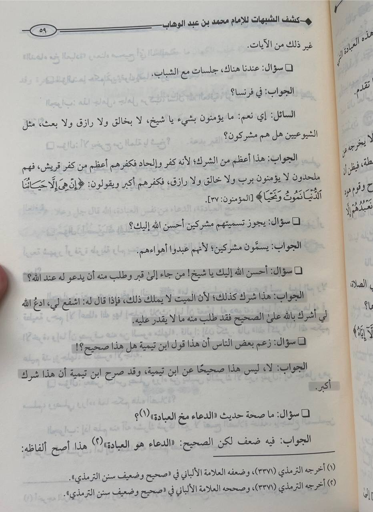

---

<!-- telegram-source: personal/messages.html#message544 -->
<!-- evidence-id: 000692 -->

<video class="source-video" controls preload="metadata" src="assets/videos/personal-544.mp4"></video>

Video source from the user’s Telegram export.

Is talab ad-du‘āʾ (requesting du‘āʾ) from the dead, shirk?

Shaykh al-Fawzān was asked:

Q: If a person goes to the occupant of a grave and asks him to make duʿāʾ to Allāh for him, is that considered shirk, since some people have reported from Shaykh al-Islām Ibn Taymiyyah that this action is a bidʿah?

A: This is shirk. Seeking needs from the dead is shirk—whether duʿāʾ or anything else. The one who makes an exception for duʿāʾ and says it is not shirk—he must bring the evidence.

Show attached source scan

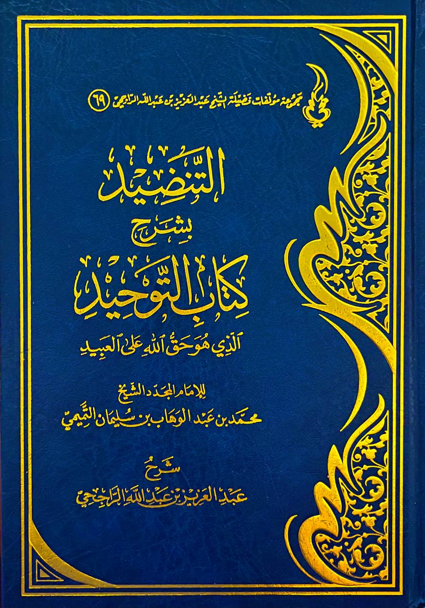

---

<!-- telegram-source: personal/messages.html#message568 -->
<!-- evidence-id: 000693 -->

<video class="source-video" controls preload="metadata" src="assets/videos/personal-568.mp4"></video>

Video source from the user’s Telegram export.

Shaykh Ṣāliḥ al-Fawzān was asked:

Q: Is there a difference between asking a dead person for duʿāʾ and asking him for shafāʿah? Because I heard some people say that asking for duʿāʾ is an innovation, while asking for shafāʿah is shirk. Is this distinction correct?

A : Duʿāʾ is shafāʿah. What is the meaning of shafāʿah? Its meaning is that he supplicates for you, and Allāh responds to his supplication. That is shafāʿah. Shafāʿah is supplication on behalf of another. So there is no difference between them.

---

<!-- telegram-source: dar/messages4.html#message4063 -->
<!-- evidence-id: 000694 -->

Shaykh Ṣāliḥ al-Fawzān was asked:

Q: Noble shaykh, may Allāh grant you success. If I see a person committing acts of shirk, such as calling upon the dead and seeking intercession from them, how should I treat him—do I treat him as a Muslim or as a kāfir?

A: You treat him as a Muslim while he is committing shirk and you can hear him committing shirk and calling upon other than Allāh?!!! Treat him as a mushrik, but call him to Islam. Explain to him that this is major shirk, and clarify the danger of shirk, from the angle of calling to Allāh and offering sincere advice. Yes.

<video class="source-video" controls preload="metadata" src="assets/videos/dar-messages4-4063.mp4"></video>

Video source from the Telegram export.

---

<!-- telegram-source: dar/messages5.html#message4271 -->
<!-- evidence-id: 000695 -->

Shaykh ʿAbd Allāh al-Ghunaymān said:

The sixth point: the major issue is that worship of Allāh is not achieved except through kufr biṭ-ṭāghūt (disbelief in false deities). In this lies the meaning of the statement of Allāh: “So whoever disbelieves in ṭāghūt and believes in Allāh has grasped the most trustworthy handhold with no break in it.” (al-Baqarah: 256)

The shaykh explains that Allāh forbids matters that were actually occurring among people in his time. Among people are those who, according to their claim, worship Allāh, while they also worship the ṭāghūt, and they believe that they are Muslims. The ṭāghūt has already been defined as everything that is worshipped besides Allāh. If it is living and rational, then it must be qualified by being pleased with that worship. As for if it is dead, or an inanimate object, or something else, then it is known that it has no command and no choice, yet it may still be worshipped.

Its worship consists of performing tabarruk (seeking blessings) from it, turning toward it with duʿāʾ, seeking the removal of calamities and the relief of distresses, or ṭawāf around the graves of those who are called awliyāʾ, sitting devotedly at their graves seeking blessing, or seeking intercession, saying: intercede for me, or the like. All of this is worship of the ṭāghūt.

Kufr biṭ-ṭāghūt is a condition for the existence of īmān, because kufr biṭ-ṭāghūt is avoidance of shirk. This is like the statement of Allāh: “Worship Allāh and associate nothing with Him.” (al-Nisāʾ: 36) Therefore, duʿāʾ, ṭawāf, and all worship must be purely for Allāh alone; no part of it belongs to any created being whatsoever.

Source: Sharḥ Kitāb at-Tawḥīd by Shaykh ʿAbd Allāh al-Ghunaymān 1/70

Show attached source scan

---

<!-- telegram-source: dar/messages4.html#message4067 -->
<!-- evidence-id: 000696 -->

Shaykh ar-Rājihī said:

Al-shafā‘ah (intercession) only occurs under two conditions:

First: permission from Allāh for the shāfi‘ (intercessor).

Second: approval for the one for whom intercession is sought. Allāh does not permit anyone to be taken out of the Fire except for the sinful muwaḥḥidīn, and Allāh only approves of those upon tawḥīd and sincerity.

As for the kāfir, Allāh does not approve of him, and no one can intercede for him. Whoever dies upon shirk without dying upon tawḥīd has no share in al-shafā‘ah. Allāh says: “So no intercession of intercessors will be of any use to them.” [al-Muddaththir: 48].

Source: Shurūḥ Rasāʾil al-Imām al-Mujaddid Muḥammad ibn ʿAbd al-Wahhāb by Shaykh ar-Rājihī 2/327

Show attached source scan

---

<!-- telegram-source: personal/messages.html#message588 -->
<!-- evidence-id: 000697 -->

<video class="source-video" controls preload="metadata" src="assets/videos/personal-588.mp4"></video>

Video source from the user’s Telegram export.

Shaykh Ayman al-ʿAnqarī said:

We hear from some who claim to be Muslims the phrase: “O Messenger of Allah, intercede for me” or “Intercession, O Muhammad.” This phrase is not permissible; asking for intercession from the Prophet ﷺ is major shirk because intercession belongs to Allah alone. Allah, the Exalted, says: “Say, ‘To Allah belongs [all] intercession’”. The Prophet ﷺ and other deceased people have no power over anything—not intercession nor supplication—because he ﷺ said: “When the son of Adam dies, his deeds are cut off except for three…” Since intercession is among matters that only Allah can grant, the dead have no power over it. Therefore, beware of this phrase.

---

<!-- telegram-source: personal/messages.html#message735 -->
<!-- evidence-id: 000698 -->

Shaykh Ayman al-ʿAnqarī said:

Ibn Taymiyyah transmitted the consensus of the Companions that requesting intercession from the dead is shirk without qualification, whether one is at the deceased person's grave or away from it. This is because legal responsibility has ceased for the deceased. He is not like a living person from whom one requests something that Allāh has commanded him to do, such as an act of worship, obedience, or benefiting another person.

This refutes those who claim that doing so at the grave is merely a bidʿah while doing so from afar is shirk. It also refutes those who attribute this distinction to Ibn Taymiyyah.

Show attached source scan

---

<!-- telegram-source: dar/messages3.html#message2663 -->
<!-- evidence-id: 000699 -->

Dr. Ayman al-ʿAnqarī said:

The Intended Meaning of the One Who Abandons Tawḥīd

He is the one who falls into a nullifier from the nullifiers of the statement of tawḥīd: Lā ilāha illa Allāh, whether that nullifier is in the domain of rubūbiyyah—such as believing in a god, creator alongside Allāh, or denying the existence of Allāh, or believing that among the awliyāʾ and imāms are those who control the universe, or that Allāh has delegated the management of the affairs of the world to the saints and imāms.

And among that: to believe that the one who brought this child into being is such-and-such saint or the occupant of such-and-such shrine—because in this is attributing creation to other than Allāh, exalted is He.

And among that: the statement of the doctrine of waḥdat al-wujūd—that Allāh and the universe are one entity, and that Allāh—exalted and far above that—is this very universe in itself, with everything in it from among the created beings. Or if it is in the domain of ulūhiyyah — such as calling upon and istighāthah from the Prophet ﷺ or from the saints in matters that no one is capable of except Allāh—such as fulfilling needs, removing hardships, and guiding hearts. Or requesting intercession from the Prophet ﷺ by saying: “O Messenger of Allāh, intercede for me with Allāh.”

Or approaching al-Badawī or al-Dusūqī or al-Ḥusayn or ʿAlī and saying: “Madad, madad” or “Rescue me” or “Cure me of my illness,” or offering a sacrifice to the occupant of the grave out of veneration for him. Or a woman who cannot conceive goes to those called awliyāʾ and requests from them to become pregnant, saying: “O Master so-and-so, grant me a child.” Or seeking blessings from the graves of the saints with the belief that they elevate needs to Allāh, exalted is He, Or performing ṭawāf around the graves of the awliyāʾ out of glorification and drawing near to them, Or making a vow to other than Allāh. This is what is meant here by abandoning tawḥīd.

Source: Taḥrīr qawl al-shaykh Muḥammad ibn ʿUthaymīn fī tārik al-tawḥīd by Dr. Ayman al-ʿAnqarī p.16-17

Show attached source scan

---

<!-- telegram-source: dar/messages4.html#message3289 -->
<!-- evidence-id: 000700 -->

Fatawa of Shaykh ʿAbd Allāh al-Jarbūʿ on ṭalab al-du‘ā’

I asked: As-salāmu ‘alaykum wa raḥmatullāhi wa barakātuh.

Our respected Shaykh, I hope you are well. I have a question: We know that whoever excuses the mushrik and calls him a Muslim is undoubtedly among the ghulāt al-murji’ah. However, some people have confusion regarding the issue of ṭalab al-du‘ā’ due to a misunderstanding of Ibn Taymiyyah’s words when he referred to it as a bid‘ah. How should we deal with them? Should they be treated the same as in the first issue, or is this dealt with differently?

We know that if something is a bid‘ah, it can lead to excusing the mushrik in his shirk, and this is one of the doubts used by the murji’ah to justify excusing the mushrik. But how do we deal with those who fell into this doubt because of some statements from the scholars on this matter, where they claim that there is khilāf (difference of opinion) about it?

Shaykh ʿAbd Allāh al-Jarbūʿ responded:

Wa ‘alaykum as-salām wa raḥmatullāhi wa barakātuh.

It is a bid‘ah and it is shirk — it is both a bid‘ah and shirk. When speaking with people who claim it is obligatory and legislated, the response is: it is not legislated, but rather a bid‘ah. When Shaykh al-Islām discussed the rulings concerning it, he said: such a person is a kāfir, and if he repents, then it is accepted, but if not, he is to be executed. At another time, he said: it is kufr by the consensus of the Muslims. So it is both a bid‘ah and kufr.

As for those people, they should be taught. Tell them to learn and to gather the strongest statements of Shaykh al-Islām on the issue.

Saying it is a bid‘ah does not mean it is not shirk. No—it is a bid‘ah that is shirk.

<video class="source-video" controls preload="metadata" src="assets/videos/dar-messages4-3289.mp4"></video>

Video source from the Telegram export.

---

<!-- telegram-source: dar/messages4.html#message3228 -->
<!-- evidence-id: 000701 -->

Shaykh Abdullah Ibn Zayd said:

These two great verses, or this great verse, indicate a profound matter, which is exactly what the author—who speaks the truth—intends to clarify and explain. It contains a response to the doubt raised by those mushrikīn , the worshippers of graves and saints, who are many in our time. We see them performing pilgrimage and ʿumrah , yet they say: “O so-and-so, heal me. O so-and-so, grant me health. O so-and-so, remove this from me. I come to you in supplication, fearful and anxious; remove the affliction and disease from me.”

This is a greater shirk because they call upon and seek help from other than Allah. Even if they perform Hajj, fast, and give zakah, it benefits them nothing, because they have associated others with Allah, the Most High. Whoever associates anyone with Allah, Allah does not forgive him; He will nullify all his deeds of prayer and worship: “But if you associate others with Me, surely your deeds will become worthless, and you will surely be among the losers.” [Quran 39:65]

This verse and the following one are perfectly suited to refute this great doubt and misguidance of these people, because the strongest doubt they hold onto is this one. You always find those who worship graves nowadays—those who visit saints, light candles by their graves, circumambulate them, seek help from them, and slaughter for them. If you ask them why they do this, they say: “They are intermediaries with Allah, interceding for us; we have sins and faults, and we cannot reach the door of Allah, so we make them intercessors to intercede on our behalf.”

This response firmly closes the door on this great doubt. The verses respond strongly to this great doubt which these people cling to. True shafāʿah (intercession) is only for those who are from the people of tawḥīd , from the people of faith, whose deeds please Allah. Allah only accepts the deeds of the muwaḥḥidīn (monotheists), the believers, the Muslims. As for the mushrik , Allah does not accept his deeds: “They do not intercede except for one whom He approves.” [Quran 2:255]

Those servants, those graves, those idols, those prophets, angels, righteous people, and others do not benefit or harm, do not intercede, and do not possess any intercession. They cannot benefit themselves nor intercede for others. All intercession belongs to Allah alone, and they only intercede by His permission. This verse, as mentioned earlier, refutes the mushrikīn who think that intercession is taken from creatures or sought from these saints, righteous people, angels, or others. It clearly indicates that intercession is for Allah alone, and if it is for Allah, then one should ask only Him.

Show attached source scan

---

### Tawassul: meanings and distinctions
<!-- evidence-id: 000702 -->

<!-- telegram-source: dar/messages2.html#message2047 -->
<!-- evidence-id: 000703 -->

what is Wasīlah?

al-‘Allāmah ‘Abdullāh Abā Butayn said:

If it is asked, “What is the meaning of wasīlah in the statement of Allah, the Exalted: ‘And seek nearness (wasīlah) to Him’ [Al-Māʾidah: 35], the answer is: The intended meaning of wasīlah is drawing near to Allah, the Exalted, through doing what He has commanded and avoiding what He has forbidden.

Al-Baghawī said: “Wasīlah means nearness.” Al-Bayḍāwī said: “It means that by which you seek closeness to His reward and nearness to Him, through acts of obedience and refraining from sins.” Ibn Kathīr said: “It means to draw near to Him through obedience and doing what pleases Him.” He also stated, “This is the consensus of the commentators.”

Similarly, in another verse: “They seek nearness to their Lord.” [Al-Isrāʾ: 57] Al-Baghawī said: “Wasīlah means nearness.” It has also been said: “Wasīlah is everything by which one draws near to Allah.” Al-Bayḍāwī commented: “They seek to their Lord wasīlah through obedience.” Ibn Kathīr said: “It means that they strive to be closer to Allah through obedience and increasing in goodness.”

Regarding Al-Baghawī’s statement: “They seek out whoever is closer to Allah and use him as a means,” this is his own wording, not from Ibn ʿAbbās. The one who misattributed it to Ibn ʿAbbās has erred. If the meaning of wasīlah is as Al-Baghawī mentioned, then it refers to what the Ṣaḥābah did with the Prophet ﷺ during his lifetime—such as asking him to supplicate for them or seeking rain through him, as reported in many aḥādīth.

This is also what ʿUmar did after the Prophet’s death, when he sought rain through Al-ʿAbbās, saying: “O Allah, we used to seek rain through our Prophet, and You would provide for us. Now, we seek rain through the uncle of our Prophet, so grant us rain!”

Similarly, Muʿāwiyah did this with Yazīd ibn Al-Aswad Al-Jurashī when he sought rain, saying: “O Allah, we seek intercession through our best ones. O Yazīd, raise your hands to Allah!” So Yazīd raised his hands, supplicated, and they were given rain.

This is the correct understanding of wasīlah.

Source: Ta'sīs al-Taqdīs fī Kashf Talbīs Dāwūd bin Jirjīs wa Yalīhi Daḥḍ Shubuhāt ʿalā al-Tawḥīd by al-ʿAllāmah ʿAbdullāh Abā Buṭayn p.119-120

Show Arabic source text

المصدر: كشف الشبهات

<h4 dir="rtl">ص. 119</h4>

فَكَيْفَ أَجْمَعَ الصَّحَابَةُ

(1)

عَلَى قَتْلِهِمْ وَكُفْرِهِمْ

(2)

؟!

أَتَظُنُّونَ أَنَّ

(3)

الصَّحَابَةَ يُكَفِّرُونَ المُسْلِمِينَ؟!

أَمْ

(4)

تَظُنُّونَ أَنَّ

(5)

الِاعْتِقَادَ فِي «تَاجٍ»

(6)

وَأَمْثَالِهِ لَا

(7)

يَضُرُّ، وَالِاعْتِقَادَ فِي

(8)

عَلِيِّ بْنِ أَبِي طَالِبٍ رضي الله عنه يُكَفِّرُ

(9)

؟!

(1)

في ي زيادة: «رضي الله عنهم».

(2)

في أ: «قتالهم وكفرهم»، وفي ب، ز: «كفرهم وقتلهم»، وفي ج: «قتلهم وكفروهم».

(3)

«أَنَّ» ساقطة من ج، و، ز، ل.

(4)

في ج، ح: «لمَ».

(5)

«أَنَّ الصَّحَابَةَ يُكَفِّرُونَ المُسْلِمِينَ؟! أَمْ تَظُنُّونَ أَنَّ» ساقطة من ب، و «أَنَّ» ليست في ج، د، هـ، و.

(6)

في د: «في يوسف وفي تاج»، وفي ط: «في شمسان»، وفي ك: «في يوسف وتاج». وقد تقدَّم التَّعريفُ بـ «تَاجٍ» قَرِيباً.

(7)

«لَا» ساقطة من ك، وهو خطأ.

(8)

في أ، ج: «وفي عليّ» بدل: «وَالِاعْتِقَادَ فِي عليّ».

(9)

في ب، ح: «كفرٌ»، وفي ك: «لا يكفِّر» وهو خطأ.

<h4 dir="rtl">ص. 120</h4>

‌

‌[الجَوَابُ الخَامِسُ]

وَيُقَالُ - أَيْضاً

(1)

-: «بَنُو عُبَيْدٍ القَدَّاحِ»

(2)

الَّذِينَ مَلَكُوا المَغْرِبَ

(3)

وَمِصْرَ فِي زَمَنِ

(4)

بَنِي العَبَّاسِ: كُلُّهُمْ يَشْهَدُونَ أَلَّا إِلَهَ إِلَّا اللَّهُ، وَأَنَّ مُحَمَّداً رَسُولُ اللَّهِ، وَيَدَّعُونَ الإِسْلَامَ

(5)

، وَيُصَلُّونَ الجُمُعَةَ وَالجَمَاعَةَ

(6)

.

فَلَمَّا أَظْهَرُوا مُخَالَفَةَ الشَّرِيعَةِ فِي أَشْيَاءَ - دُونَ مَا نَحْنُ

(7)

فِيهِ -؛ أَجْمَعَ العُلَمَاءُ عَلَى كُفْرِهِمْ وَقِتَالِهِمْ

(8)

، وَأَنَّ بِلَادَهُمْ بِلَادُ حَرْبٍ، وَغَزَاهُمُ المُسْلِمُونَ حَتَّى اسْتَنْقَذُوا مَا بِأَيْدِيهِمْ

(9)

مِنْ بُلْدَانِ

(10)

المُسْلِمِينَ

(11)

.

(1)

في ك: «إنها» وهو تصحيف، وفي ي زيادة: «إنَّ».

(2)

وَهُمْ: بَنُو عُبَيْدِ اللَّهِ بن مَيْمُون القَدَّاح، من الإسْمَاعِيليَّةِ البَاطنيَّةِ، ادَّعَى النَّسَبَ العَلَوِيَّ، وظَهَرَت دَعْوَتُهُ فِي المَغْرِب سنة (296 هـ)، وحَلَّتْ دَوْلَتُه محلَّ دَوْلَة بَنِي الأَغْلَب، وَأَظْهَرَ مَذْهَبَ البَاطِنيَّة - كَسَبِّ الصَّحَابَة، وتَعْطِيلِ أَحْكَامِ الشَّرِيعَة -، وَهُوَ الَّذِي بَنَى مَدِينةَ المَهْدِيَّة، وتُوفِّي بها سنة (322 هـ).

انظر: تاريخ الأَنْطَاكيِّ (ص 62)، والكامل في التَّاريخ لابن الأَثِير (6/ 577)، والبيانُ المُغْرِب لابن عِذَارِي المَرَّاكُشِيِّ (1/ 149)، وكَنْز الدُّرَر وجامع الغُرَر لابن أَيْبَك الدَّوَادَارِي (6/ 44)، ومِنَ الكُتُبِ المُفْرَدَة فِي أَخْبَارِهِم: أَخْبَارُ بَنِي عُبَيْدٍ لمُحمَّدِ بنِ عَليِّ بنِ حَمَّاد الصِّنْهَاجِيِّ، واتِّعَاظُ الحُنَفَاءِ بِأَخْبَارِ الأَئِمَّةِ الفَاطِمِيِّينَ الخُلَفَاءِ للمِقْرِيزِيِّ.

(3)

في ب: «الغرب».

(4)

في ب، د، هـ، ي: «زمان».

(5)

«وَيَدَّعُونَ الإِسْلَامَ» ساقطة من ط.

(6)

في ز: «والجماعات»، و «وَالجَمَاعَةَ» ليست في أ، ج.

(7)

في و زيادة: «عليك».

(8)

في ب، د، ط: «قتلهم»، وفي ك: «على قتلهم وكفرهم».

وانظر: مِنْهاج السُّنَّة النَّبويَّة لابن تيمية (3/ 452).

(9)

في د: «ما بيديهم»، وفي م: «ما بأيدهم».

(10)

في ب: «بلاد».

(11)

«حَتَّى اسْتَنْقَذُوا مَا بِأَيْدِيهِمْ مِنْ بُلْدَانِ المُسْلِمِينَ» ساقطة من أ.

---

<!-- telegram-source: dar/messages5.html#message4373 -->
<!-- evidence-id: 000704 -->

Shaykh Muḥammad ibn Ibrahim said:

“The Islām of the majority is nominal Islam, for most of those affiliated with it in this time are called ‘Muslims’ only by name, in contrast to the Jews and Christians. Whoever is found to have something that nullifies it, then his Islam is merely Islam-in-name, with no love and no honor.

Is it imagined that those who were pleased with idols, worshipped them, protected them, collected levies for them, and enforced al-qawānīn (man-made laws)—is there, after this, any Islām? What is this except the kufr that the Prophet ﷺ was sent to demolish? And even the smallest among you knows that whoever enters Islām remains upon it only as long as he maintains it; rather, if he nullifies it, he exits it. And the chapter on the ruling of the apostasy is well known and explained—there is ijmāʿ among the people of knowledge that apostasy is of two types.”

“But what the Prophet ﷺ informed of has occurred, in his saying: ‘A people will come who will regard wine as permissible, calling it by other than its name.’ It has happened: they regarded shirk as permissible and called it by other than its name, saying: ‘tawassul’ and ‘tashaffuʿ.’ But it is the very tawassul and tashaffuʿ of the mushrikīn.”

Source: Fatāwā wa Rasāʾil by Shaykh Muḥammad ibn Ibrāhīm 1/77

Show Arabic source text

المصدر: فتاوى ورسائل الشيخ محمد بن إبراهيم

<h4 dir="rtl">ص. 77</h4>

محمد صلى الله عليه وسلم فليس بمسلم بل يقال يهودي، نصراني

…

أَما قبل بعث النبي صلى الله عليه وسلم فإن من اتبع ما جاء به رسوله فهو مسلم.

(تقرير)

وقال: إسلام الأَكثر إسلام إسمي، فإن أَكثر المنتسبين إليه في هذا الوقت يقال لهم المسلمون إسمًا ضد اليهود والنصارى. من وجد منه ما ينقضه فإنه إسلام الإسم ولا حب ولا كرامة.

أَفيظن أَن من رضوا بالأَوثان وعبدوها وحاموا دونها وجبوا بها الجبايات وحكموا القوانين، أَفبعد هذا إسلام؟ هل هذا إلا الكفر الذي بعث صلى الله عليه وسلم بهدمه؟! وأَصغركم يعرف أَن كل من دخل في الإسلام يبقى عليه بكل حال، بل إذا نقضه خرج. وباب حكم المرتد معروف ومبين من هو بإجماع بين أَهل العلم أَن الردة ردتان. (تقرير على الورقات) .

لكن وقع ما أَخبر به النبي صلى الله عليه وسلم في قوله: ((يأْتي قوم يستحلون الخمر يسمونها بغير اسمها)) (1) وقد وقع استحلوا الشرك وسموه بغير اسمه، فقالوا: توسل واستشفاع. لكن هو توسل المشركين واستشفاعهم. (تقرير مسائل التوحيد) .

(16- وسئل عن جزار ينتسب إلى الاسلام يقال له فاضل الدين هل تحل ذبيحته؟)

فأَجاب:

يشترط في القصاب فاضل الدين أَن يكون مسلمًا، صحيح المعتقد

(1) عن أبي أمامة الباهلي رضي الله عنه قال قال رسول الله صلى الله عليه وسلم ((لا تذهب الليالي والايام حتى تشرب فيها طائفة من أمتي الخمر يسمونها بغير اسمها)) رواه ابن ماجه وأبو نعيم في الحلية.

<!-- telegram-source: dar/messages5.html#message4347 -->
<!-- evidence-id: 000705 -->

Shaykh ʿAbdullāh Al-Ghunaymān said:

The meaning of the verse is that Allāh informed that He does not forgive the mushrik. Therefore, since shirk is unforgivable, it becomes obligatory for the servant to research its types, causes, and means, and to avoid them so that he does not fall into it unknowingly.

Many people, including the intelligent and even scholars, have fallen into shirk al-akbar because of ignorance, carelessness, and leniency, as is still occurring in many Muslim lands. People go to graves, ask their occupants, and think this is not shirk, but rather permissible tawassul. This is among the calamities.

Shirk that Allāh does not forgive may, in some cases, be treated by some people as an act of obedience to draw near to Allāh but the verse indicates that sins other than shirk do not render a Muslim a kāfir.

The verse also shows that if a mushrik dies upon his shirk, he is not forgiven. However, if he repents, Allāh may accept his repentance if He wills. Confidence in Allāh and hope in His acceptance is encouraged; He rejoices most at the repentance of the one who turns back.

Allāh does not benefit from the obedience of the obedient nor from the repentance of the repentant, for He is self-sufficient over all else. Yet, due to His generosity and bounty, He does not wish to punish His servants, and when a servant repents, He rejoices.

This is why Allāh sent the messengers and revealed the books, so that no one has an excuse before Him. The sending of the messengers and revelation of the books is sufficient as guidance. Allāh has given humans reason and thought to discern benefit; thus, if a person  knows that the Messenger came with the truth and guidance from Allāh, it is obligatory for him to seek what the Messenger ﷺ brought.

If he does not, he is blameworthy, and the proof stands against him. There is no excuse for saying, “I was ignorant and did not know,” because that will not help him. Once he knows that Allāh sent His Messenger and revealed His Book, it is incumbent upon him to seek the truth himself.

Source: Sharḥ Kitāb at-Tawḥīd by Shaykh ʿAbdullāh al-Ghunaymān 1/157-158

Show attached source scan

---

### What may be requested from a living, present, capable person
<!-- evidence-id: 000706 -->

<!-- telegram-source: personal/messages.html#message758 -->
<!-- evidence-id: 000707 -->

Shaykh al-Islam Ibn Taymiyyah (رحمه الله) said:

"...we seek intercession, or we use as a means, or we turn to; for he will not intercede for them in that, rather one uses him as a means, seeks intercession through him, and turns to him, in that which he (peace be upon him) was an intercessor for. Nor did they ask him after his death to intercede for them and supplicate for them, as the Christians do, for they seek intercession from the dead, whether prophets or others. For the dead person has had all obligation severed from him; he is not like the living person from whom one asks what he is commanded to do of worship, obedience, and benefiting others. For when the living person is asked to assist another through supplication, intercession, benefit, or charity, he has been asked to do what Allah commands him of doing good. But the dead person is not commanded with anything by way of binding obligation, for obligation is severed by death. Rather he is in the position of the people of Paradise and the angels: he does what is willed of him, so whatever Allah willed of him comes to pass, whether the living person asked it of him or not, and what He did not will of him does not come to pass. So there is no benefit in the living asking the dead , neither for the living nor for the dead. Rather in it is shirk with the dead and harming him, for supplicating to him harms him, and there is no benefit in it for the living. Rather in it is his wronging of himself, his associating partners with his Lord, and his harming of the dead. So it contains all three types of wrongdoing.

And those who visit with the visitation of the people of polytheism and innovation are those who travel to their graves for that purpose, and it is a pilgrimage to them. Allah the Exalted forbids that pilgrimage be made to any house other than His. Nor is pilgrimage made to all of His houses; rather one does not travel except to three mosques. Travel to the Sacred Mosque for Hajj is obligatory, and to each one of the three..."

[A Great Principle on the Difference Between the Worship of the People of Islam and Faith and the Worship of the People of Polytheism and Hypocrisy, pg. 74]

---

<!-- telegram-source: dar/messages2.html#message2110 -->
<!-- evidence-id: 000708 -->

al-‘Allāmah ‘Abdullāh Abā Butayn said:

Since it is well established among scholars that seeking refuge (istiʿādhah) in Allah is an act of worship, they have ruled that seeking refuge in a created being is impermissible. Based on this principle, they used it as evidence that the Speech of Allah is uncreated, because it is authentically reported that the Prophet ﷺ sought refuge in the perfect words of Allah, both in action and in speech. This is an argument used by Ahl al-Sunnah against the Jahmiyyah, who claim that the Qurʾān is created. They argue that if the Qurʾān were created, it would not be permissible to seek refuge in it.

Since istiʿādhah (seeking refuge) is a form of supplication (duʿāʾ), as explained by Shaykh al-Islām Taqī al-Dīn (Ibn Taymiyyah), this matter is clear. The scholars who prohibited seeking refuge in created beings also maintain that it is impermissible to supplicate to them, since istiʿādhah is, in reality, a type of duʿāʾ. The one seeking refuge in his Lord is, in essence, asking Him to avert or remove harm, and this is the very definition of duʿāʾ.

Shaykh al-Islām Ibn Taymiyyah said: “Seeking refuge (istiʿādhah), seeking protection (istijārah), and seeking aid (istighāthah) are all forms of supplication (duʿāʾ), and these terms are closely related. The Prophet ﷺ himself referred to istiʿādhah as duʿāʾ, as recorded in the Sunan where a man asked him: ‘O Messenger of Allah, teach me a supplication I can make.’ The Prophet ﷺ said: ‘Say: O Allah, I seek refuge in You from the evil of my hearing, from the evil of my sight, from the evil of my tongue, from the evil of my heart, and from the evil of my desires.’” (Sunan Abī Dāwūd)

Abū Hurayrah (رضي الله عنه) reported that the Prophet ﷺ used to supplicate, saying: “O Allah, I seek refuge in You from hunger, for it is a terrible companion, and I seek refuge in You from betrayal, for it is a terrible inner trait.” (Abū Dāwūd, with a ṣaḥīḥ chain).

In the Sunan, ʿĀʾishah (رضي الله عنها) reported that the Prophet ﷺ would supplicate using these words: “O Allah, I seek refuge in You from the trial of the Fire and the punishment of the Fire, and from the evil of wealth and poverty.”

In Ṣaḥīḥ Muslim, it is reported that the Prophet ﷺ would supplicate: “O Allah, I seek refuge in You from the removal of Your blessing, the loss of Your protection, the sudden onset of Your punishment, and anything that incurs Your displeasure.”

The purpose of citing these aḥādīth is to establish that the Prophet ﷺ and his Companions referred to istiʿādhah as duʿāʾ. Thus, when the scholars ruled that istiʿādhah is not permissible with a created being and is exclusively for Allah, because it is a form of duʿāʾ, then the same applies to all other forms of duʿāʾ. If this is firmly established, it becomes clear that if a person fears an enemy and seeks protection from a living, present person to shield him from harm, this is permissible according to all Muslims. This does not fall under the scholars’ ruling that istiʿādhah with a created being is prohibited.

This is an example of a single act whose ruling changes based on its recipient: Seeking help from a living, present person is permissible, whereas seeking help from anyone else is forbidden. Likewise, supplicating to anyone other than Allah to fulfill needs is impermissible, as Allah says: “So do not call upon anyone along with Allah.” (Sūrat al-Jinn: 18). However, this does not include asking a living, present person for assistance in matters within human capability.

Source: Ta'sīs al-Taqdīs fī Kashf Talbīs Dāwūd bin Jirjīs wa Yalīhi Daḥḍ Shubuhāt ʿalā al-Tawḥīd by al-ʿAllāmah ʿAbdullāh Abā Buṭayn p.87-88

Show Arabic source text

المصدر: كشف الشبهات

<h4 dir="rtl">ص. 87</h4>

فَإِنَّهُ لَا يَعْرِفُ العِبَادَةَ وَلَا أَنْوَاعَهَا؛ فَبَيِّنْهَا بِقَوْلِكَ: قَالَ اللَّهُ تَعَالَى

(1)

: {ادْعُوا رَبَّكُمْ تَضَرُّعًا وَخُفْيَةً}

(2)

(3)

.

فَإِذَا أَعْلَمْتَهُ

(4)

بِهَذَا

(5)

؛ فَقُلْ لَهُ: هَلْ هُوَ عِبَادَةٌ لِلَّهِ

(6)

؟

فَلَا بُدَّ أَنْ يَقُولَ

(7)

: نَعَمْ، وَ «الدُّعَاءُ مُخُّ

(8)

العِبَادَةِ»

(9)

.

فَقُلْ لَهُ: إِذَا

(10)

أَقْرَرْتَ أَنَّهُ

(11)

عِبَادَةٌ، وَدَعَوْتَ اللَّهَ لَيْلاً وَنَهَاراً، خَوْفاً

(1)

في ب: «قوله تعالى»، وفي د: «قول اللَّه»، وفي هـ: «قول اللَّه تعالى»، وفي و: «بينها بقول اللَّه تعالى»، وفي ز: «فبينها له بقولك: قال اللَّه تعالى»، وفي ح: «قال اللَّه»، وفي ط: «فبينها بقول اللَّه»، وفي ي: «قال اللَّه بقوله»، وفي م: «يقول اللَّه تعالى».

(2)

{تضرعاً}؛ أَيْ: تَذَلُّلاً وَاسْتِكَانَةً لِطَاعَتِهِ، {وخفيةً}؛ أَيْ: بِخُشُوعِ قُلُوبِكُمْ، وَصِحَّةِ اليَقِينِ مِنْكُمْ بِوَحْدَانِيَّتِهِ فِيمَا بِيْنَكُمْ وَبَيْنَهُ، لَا جِهَاراً وَمُرَاءَاةً. تفسير الطَّبريّ (10/ 247).

(3)

في أ، ج، ز، ك، ل، م زيادة: {إنه لا يحب المعتدين}.

(4)

في أ، ج: «عملت»، وفي ب: «إذا أعلمته»، وفي د، ز، ط: «إذا علمت»، وفي هـ، ح، ي: «إذا عملت»، وفي ك، م: «علَّمته».

(5)

في و: «علمت هذا».

(6)

في ب: «فهل هو عبادة اللَّه»، وفي د، ي: «هل هو عبادة اللَّه»، وفي و: «قل: هل هو عبادة اللَّه»، وفي ز: «هل هذا عبادة للَّه تعالى أوْ لا» وفي ك: «ثم قلت له: هل هي عبادة اللَّه» بدل: «فَقُلْ لَهُ: هَلْ هُوَ عِبَادَةٌ لِلَّهِ»، و «لِلَّهِ» ليست في هـ.

(7)

في ي: «يقرَّ ويقول».

(8)

في و: «من» بدل: «مُخُّ».

(9)

هذا لفظُ حديثٍ أَخْرَجهُ التِّرمذيُّ (3371) منْ حَديثِ أَنَسٍ رضي الله عنه، وقال: «هَذَا حَدِيثٌ غَرِيبٌ مِنْ هَذَا الوَجْهِ، لَا نَعْرِفُهُ إِلَّا مِنْ حَدِيثِ ابْنِ لَهِيعَةَ»، وفي الباب: حَديثُ النُّعْمَان بن بَشِيرٍ رضي الله عنهما: أَنَّ رَسُولَ اللَّه صلى الله عليه وسلم قال: «إِنَّ الدُّعَاءَ هُوَ العِبَادَةُ» أَخْرَجهُ أَحْمَدُ (18352)، وأَبُو دَاوُد (1479)، والتِّرمذيُّ (3372)، وقال: «حَدِيثٌ حَسَنٌ صَحِيحٌ».

(10)

في ب: «إنما» بدل: «إِذَا».

(11)

في أ، ب، ج، د، هـ، و، ح، ط، ي، ك: «أنها».

<h4 dir="rtl">ص. 88</h4>

وَطَمَعاً، ثُمَّ دَعَوْتَ

(1)

فِي تِلْكَ الحَاجَةِ نَبِيّاً

(2)

أَوْ غَيْرَهُ؛ هَلْ أَشْرَكْتَ فِي عِبَادَةِ اللَّهِ

(3)

غَيْرَهُ

(4)

؟

فَلَا بُدَّ أَنْ يَقُولَ: نَعَمْ

(5)

.

فَقُلْ

(6)

لَهُ: قَالَ اللَّهُ تَعَالَى

(7)

: {فَصَلِّ لِرَبِّكَ وَانْحَرْ}، فَإِذَا صَلَّيْتَ لِلَّهِ

(8)

وَنَحَرْتَ لَهُ؛ هَلْ هَذَا

(9)

عِبَادَةٌ

(10)

؟

فَلَا بُدَّ أَنْ يَقُولَ

(11)

: نَعَمْ

(12)

.

فَقُلْ لَهُ: إِذَا

(13)

نَحَرْتَ لِمَخْلُوقٍ - نَبِيٍّ، أَوْ جِنِّيٍّ، أَوْ غَيْرِهِمَا -؛ هَلْ أَشْرَكْتَ فِي هَذِهِ العِبَادَةِ غَيْرَ اللَّهِ

(14)

؟

فَلَا بُدَّ أَنْ يُقِرَّ وَيَقُولَ

(15)

: نَعَمْ

(16)

.

(1)

في ب زيادة: «اللَّه» وهو وهم، وفي ز زيادة: «مع اللَّه تعالى».

(2)

في ب زيادة: «أو وليّاً».

(3)

في ل، م: «في هذه العبادة» بدل: «فِي عِبَادَةِ اللَّهِ».

(4)

في ز زيادة: «أوْ لا».

(5)

«فَلَا بُدَّ أَنْ يَقُولَ: نَعَمْ» ليست في أ، ب، ج، د، هـ، ح، ط، ي.

(6)

في ز: «وقل».

(7)

في أ: «فإذا قال اللَّه»، وفي ب، ي: «إذ قال اللَّه تعالى»، وفي ج، و، ح، ط: «إذا قال اللَّه»، وفي د، هـ: «إذ قال اللَّه»، وفي ك: «قال اللَّه تعالى» بدل: «فَقُلْ لَهُ: قَالَ اللَّهُ تَعَالَى».

(8)

في أ، ب، ج، د، هـ، و، ح، ط، ي بدل «فَإِذَا صَلَّيْتَ لِلَّهِ»: «وأطعت اللَّه»، وفي ل، م: «فإذا أطعت اللَّه».

(9)

في و: «هذه».

(10)

في ز زيادة: «أوْ لا».

(11)

في ب: «يقرَّ ويقول».

(12)

هنا في د: خرم بمقدار لوحة.

(13)

في هـ، ح، ط: «فإن»، وفي ز، ي: «فإذا».

(14)

في أ: «في عبادة اللَّه غيره»، وفي ز: «في هذه العبادة أو لا» بدل: «فِي هَذِهِ العِبَادَةِ غَيْرَ اللَّهِ».

(15)

في و، ز، ط: «يقول» بدل: «يُقِرَّ وَيَقُولَ».

(16)

من قوله: «فَقُلْ لَهُ: إذَا نَحَرْتَ لِمَخْلُوقٍ» إلى هنا ساقط من ب.

---

<!-- evidence-id: 000709 -->
Shaykh al-Islām Ibn Taymiyyah said:

Whoever denies what has been established by mass transmission and consensus is a disbeliever after the proof has been established against him, whether or not he calls the established meaning “istighāthah.”

As for one who acknowledges the Prophet’s intercession but denies what the Companions practiced of tawassul through him and seeking his intercession, such as what al-Bukhārī narrated from Anas that when the people suffered drought, ʿUmar ibn al-Khaṭṭāb sought rain through al-ʿAbbās ibn ʿAbd al-Muṭṭalib and said, “O Allāh, we used to seek a means to You through our Prophet and You would give us rain. Now we seek a means to You through our Prophet’s uncle, so give us rain,” after which they were given rain; and such as the report in the Sunan of Abū Dāwūd and elsewhere that a Bedouin said to the Prophet ﷺ, “The people are exhausted, the children are hungry, and the property has perished, so call upon Allāh for us. We seek your intercession with Allāh, and we seek Allāh’s intercession with you.” The Messenger ﷺ glorified Allāh until this became apparent in the faces of his Companions, and said, “Woe to you! Allāh is not made an intercessor with any of His creation. Allāh’s station is greater than that.” He then completed the ḥadīth. The Prophet objected to the man’s statement, “We seek Allāh’s intercession with you,” but did not object to his statement, “We seek your intercession with Allāh.” Rather, he approved it. Its permissibility is therefore known. One who denies this is astray, mistaken, and an innovator; regarding declaring him a disbeliever, there is detail and disagreement.

As for one who affirms what is established by the Book, the Sunnah, and consensus concerning the Prophet’s intercession, tawassul through him, and similar matters, but says that none is to be called upon except Allāh and that matters which none but Allāh can accomplish are to be requested from none but Him, such as forgiving sins, guiding hearts, sending down rain, causing vegetation to grow, and the like, then this person is correct. Indeed, this is also a matter concerning which there is no disagreement among the Muslims.

Allāh says: “Who forgives sins except Allāh?” [Āl ʿImrān 3:135] He says: “You do not guide whom you love, but Allāh guides whom He wills.” [Al-Qaṣaṣ 28:56] He says: “O humanity, remember Allāh’s favor upon you. Is there any creator other than Allāh who provides for you from the sky and the earth?” [Fāṭir 35:3] He says: “Allāh made it only as good news for you and so that your hearts might be reassured by it. Victory comes only from Allāh.” [Āl ʿImrān 3:126] And He says: “If you do not aid him, Allāh has already aided him when the disbelievers drove him out as one of two, when they were in the cave and he said to his companion, ‘Do not grieve; Allāh is with us.’” [At-Tawbah 9:40]

Meanings established by the Book and the Sunnah must be affirmed, and meanings negated by the Book and the Sunnah must be negated. If the expression indicating affirmation or negation occurs in the speech of Allāh or His Messenger ﷺ, it must be accepted. If it occurs in someone else’s speech and his intended meaning is clear, he is judged according to that intended meaning; otherwise, he is asked what he means. An expression occurring in the speech of Allāh or His Messenger may possess a correct meaning while some people understand from it something other than what Allāh and His Messenger intended. That person’s mistaken understanding must be rejected.

Al-Ṭabarānī narrated in al-Muʿjam al-Kabīr that during the Prophet’s lifetime there was a hypocrite who harmed the believers. Abū Bakr said, “Come with us so that we may seek the aid of the Messenger of Allāh ﷺ against this hypocrite.” The Prophet ﷺ said, “Aid is not sought from me; aid is sought only from Allāh.” By this, the Prophet intended the second meaning: requesting from him something none but Allāh can accomplish. Otherwise, the Companions used to request supplication from him and seek rain through him. Thus the scholars who wrote concerning the names of Allāh said that every legally responsible person must know that, in the absolute sense, there is no relief and no bringer of relief except Allāh. Every relief comes from Him, even if He brings it about at the hands of another. In reality it belongs to Allāh, while its attribution to another is figurative.

They said that among His names are al-Mughīth, the Bringer of Relief, and al-Ghiyāth, the source of relief. The meaning is that He reaches His servants amid hardships when they call upon Him, answers them, and delivers them. In the authentic rain-seeking report, the supplication is: “O Allāh, bring us relief. O Allāh, bring us relief.” Allāh says: “When you sought relief from your Lord and He answered you.” [Al-Anfāl 8:9] Relief is more properly associated with actions and response with words, though each may be used in the place of the other.

Seeking relief through Allāh’s mercy is, in reality, seeking relief through Him, just as seeking refuge through His attributes is seeking refuge through Him, and swearing by His attributes is swearing by Him. The transmitted supplications include: “I seek refuge in the perfect words of Allāh from the evil of what He created,” and: “I seek refuge in Your pleasure from Your anger, in Your pardon from Your punishment, and in You from You. I cannot enumerate praise of You; You are as You have praised Yourself.”

Source: Majmūʿ al-Fatāwā by Ibn Taymiyyah, 1/109-111

Show Arabic source text

المصدر: مجموع الفتاوى

<h4 dir="rtl">ص. 109</h4>

وَأَمَّا مَنْ أَنْكَرَ مَا ثَبَتَ بِالتَّوَاتُرِ وَالْإِجْمَاعِ فَهُوَ كَافِرٌ بَعْدَ قِيَامِ الْحُجَّةِ وَسَوَاءٌ سَمَّى هَذَا الْمَعْنَى اسْتِغَاثَةً أَوْ لَمْ يُسَمِّهِ. وَأَمَّا مَنْ أَقَرَّ بِشَفَاعَتِهِ وَأَنْكَرَ مَا كَانَ الصَّحَابَةُ يَفْعَلُونَهُ مِنْ التَّوَسُّلِ بِهِ وَالِاسْتِشْفَاعِ بِهِ؛ كَمَا رَوَاهُ الْبُخَارِيُّ فِي صَحِيحِهِ عَنْ أَنَسٍ أَنَّ عُمَرَ بْنَ الْخَطَّابِ كَانَ إذَا قَحَطُوا اسْتَسْقَى بِالْعَبَّاسِ بْنِ عَبْدِ الْمُطَّلِبِ وَقَالَ: اللَّهُمَّ إنَّا كُنَّا نَتَوَسَّلُ إلَيْك بِنَبِيِّنَا فَتَسْقِينَا وَإِنَّا نَتَوَسَّلُ إلَيْك بِعَمِّ نَبِيِّنَا فَاسْقِنَا فَيُسْقَوْنَ. وَفِي سُنَنِ أَبِي دَاوُد وَغَيْرِهِ {أَنَّ أَعْرَابِيًّا قَالَ لِلنَّبِيِّ صلى الله عليه وسلم جَهَدَتْ الْأَنْفُسُ وَجَاعَ الْعِيَالُ وَهَلَكَ الْمَالُ فَادْعُ اللَّهَ لَنَا فَإِنَّا نَسْتَشْفِعُ بِك عَلَى اللَّهِ وَنَسْتَشْفِعُ بِاَللَّهِ عَلَيْك. فَسَبَّحَ رَسُولُ اللَّهِ صلى الله عليه وسلم حَتَّى عُرِفَ ذَلِكَ فِي وُجُوهِ أَصْحَابِهِ وَقَالَ: وَيْحَك إنَّ اللَّهَ لَا يُسْتَشْفَعُ بِهِ عَلَى أَحَدٍ مِنْ خَلْقِهِ شَأْنُ اللَّهِ أَعْظَمُ مِنْ ذَلِكَ} وَذَكَرَ تَمَامَ الْحَدِيثِ فَأَنْكَرَ قَوْلَهُ نَسْتَشْفِعُ بِاَللَّهِ عَلَيْك وَلَمْ يُنْكِرْ قَوْلَهُ نَسْتَشْفِعُ بِك عَلَى اللَّهِ بَلْ أَقَرَّهُ عَلَيْهِ فَعُلِمَ جَوَازُهُ فَمَنْ أَنْكَرَ هَذَا فَهُوَ ضَالٌّ مُخْطِئٌ مُبْتَدِعٌ؛ وَفِي تَكْفِيرِهِ نِزَاعٌ وَتَفْصِيلٌ. وَأَمَّا مَنْ أَقَرَّ بِمَا ثَبَتَ بِالْكِتَابِ وَالسُّنَّةِ وَالْإِجْمَاعِ مِنْ شَفَاعَتِهِ وَالتَّوَسُّلِ بِهِ وَنَحْوِ ذَلِكَ وَلَكِنْ قَالَ لَا يُدْعَى إلَّا اللَّهُ وَأَنَّ الْأُمُورَ الَّتِي لَا يَقْدِرُ عَلَيْهَا إلَّا اللَّهُ لَا تُطْلَبُ إلَّا مِنْهُ مِثْلَ غُفْرَانِ الذُّنُوبِ وَهِدَايَةِ الْقُلُوبِ وَإِنْزَالِ الْمَطَرِ وَإِنْبَاتِ النَّبَاتِ وَنَحْوِ ذَلِكَ: فَهَذَا مُصِيبٌ فِي ذَلِكَ بَلْ هَذَا مِمَّا لَا نِزَاعَ فِيهِ بَيْنَ الْمُسْلِمِينَ أَيْضًا. كَمَا قَالَ اللَّهُ تَعَالَى: {وَمَنْ يَغْفِرُ الذُّنُوبَ إلَّا اللَّهُ} وَقَالَ: {إنَّكَ لَا تَهْدِي مَنْ أَحْبَبْتَ وَلَكِنَّ اللَّهَ يَهْدِي مَنْ يَشَاءُ} وَكَمَا قَالَ تَعَالَى: {يَا أَيُّهَا النَّاسُ اذْكُرُوا نِعْمَةَ اللَّهِ عَلَيْكُمْ هَلْ مِنْ خَالِقٍ غَيْرُ اللَّهِ يَرْزُقُكُمْ مِنَ السَّمَاءِ

<h4 dir="rtl">ص. 110</h4>

وَالْأَرْضِ} وَكَمَا قَالَ تَعَالَى: {وَمَا جَعَلَهُ اللَّهُ إلَّا بُشْرَى لَكُمْ وَلِتَطْمَئِنَّ قُلُوبُكُمْ بِهِ وَمَا النَّصْرُ إلَّا مِنْ عِنْدِ اللَّهِ} وَقَالَ: {إلَّا تَنْصُرُوهُ فَقَدْ نَصَرَهُ اللَّهُ إذْ أَخْرَجَهُ الَّذِينَ كَفَرُوا ثَانِيَ اثْنَيْنِ إذْ هُمَا فِي الْغَارِ إذْ يَقُولُ لِصَاحِبِهِ لَا تَحْزَنْ إنَّ اللَّهَ مَعَنَا} . فَالْمَعَانِي الثَّابِتَةُ بِالْكِتَابِ وَالسُّنَّةِ: يَجِبُ إثْبَاتُهَا وَالْمَعَانِي الْمَنْفِيَّةُ بِالْكِتَابِ وَالسُّنَّةِ؛ يَجِبُ نَفْيُهَا وَالْعِبَارَةُ الدَّالَّةُ عَلَى الْمَعَانِي نَفْيًا وَإِثْبَاتًا إنْ وُجِدَتْ فِي كَلَامِ اللَّهِ وَرَسُولِهِ صلى الله عليه وسلم وَجَبَ إقْرَارُهَا. وَإِنْ وُجِدَتْ فِي كَلَامِ أَحَدٍ وَظَهَرَ مُرَادُهُ مِنْ ذَلِكَ رُتِّبَ عَلَيْهِ حُكْمُهُ وَإِلَّا رُجِعَ فِيهِ إلَيْهِ. وَقَدْ يَكُونُ فِي كَلَامِ اللَّهِ وَرَسُولِهِ صلى الله عليه وسلم عِبَارَةٌ لَهَا مَعْنًى صَحِيحٌ لَكِنَّ بَعْضَ النَّاسِ يَفْهَمُ مِنْ تِلْكَ غَيْرَ مُرَادِ اللَّهِ وَرَسُولِهِ صلى الله عليه وسلم فَهَذَا يُرَدُّ عَلَيْهِ فَهْمُهُ. كَمَا رَوَى الطَّبَرَانِي فِي مُعْجَمِهِ الْكَبِيرِ {أَنَّهُ كَانَ فِي زَمَنِ النَّبِيِّ صلى الله عليه وسلم مُنَافِقٌ يُؤْذِي الْمُؤْمِنِينَ فَقَالَ أَبُو بَكْرٍ الصِّدِّيقُ: قُومُوا بِنَا لِنَسْتَغِيثَ بِرَسُولِ اللَّهِ صلى الله عليه وسلم مِنْ هَذَا الْمُنَافِقِ فَقَالَ النَّبِيُّ صلى الله عليه وسلم إنَّهُ لَا يُسْتَغَاثُ بِي وَإِنَّمَا يُسْتَغَاثُ بِاَللَّهِ} فَهَذَا إنَّمَا أَرَادَ بِهِ النَّبِيُّ صلى الله عليه وسلم الْمَعْنَى الثَّانِيَ وَهُوَ أَنْ يُطْلَبَ مِنْهُ مَا لَا يَقْدِرُ عَلَيْهِ إلَّا اللَّهُ وَإِلَّا فَالصَّحَابَةُ كَانُوا يَطْلُبُونَ مِنْهُ الدُّعَاءَ وَيَسْتَسْقُونَ بِهِ كَمَا فِي صَحِيحِ الْبُخَارِيِّ عَنْ ابْنِ عُمَرَ قَالَ: رُبَّمَا ذَكَرْت قَوْلَ الشَّاعِرِ وَأَنَا أَنْظُرُ إلَى وَجْهِ النَّبِيِّ صلى الله عليه وسلم يَسْتَسْقِي فَمَا يَنْزِلُ حَتَّى يَجِيشَ لَهُ مِيزَابٌ: وَأَبْيَضَ يُسْتَسْقَى الْغَمَامُ بِوَجْهِهِ ثِمَالُ الْيَتَامَى عِصْمَةٌ لِلْأَرَامِلِ وَهُوَ قَوْلُ أَبِي طَالِبٍ وَلِهَذَا قَالَ الْعُلَمَاءُ الْمُصَنِّفُونَ فِي أَسْمَاءِ اللَّهِ تَعَالَى: يَجِبُ عَلَى كُلِّ مُكَلَّفٍ أَنْ يَعْلَمَ أَنْ لَا غِيَاثَ وَلَا مُغِيثَ عَلَى الْإِطْلَاقِ إلَّا اللَّهُ وَأَنَّ كُلَّ

<h4 dir="rtl">ص. 111</h4>

غَوْثٍ فَمِنْ عِنْدِهِ وَإِنْ كَانَ جَعَلَ ذَلِكَ عَلَى يَدَيْ غَيْرِهِ فَالْحَقِيقَةُ لَهُ سبحانه وتعالى وَلِغَيْرِهِ مَجَازٌ. قَالُوا: مِنْ أَسْمَائِهِ تَعَالَى الْمُغِيثُ وَالْغِيَاثُ وَجَاءَ ذِكْرُ الْمُغِيثِ فِي حَدِيثِ أَبِي هُرَيْرَةَ قَالُوا وَاجْتَمَعَتْ الْأُمَّةُ عَلَى ذَلِكَ. وَقَالَ أَبُو عَبْدِ اللَّهِ الحليمي: الْغِيَاثُ هُوَ الْمُغِيثُ وَأَكْثَرُ مَا يُقَالُ غِيَاثُ الْمُسْتَغِيثِينَ وَمَعْنَاهُ الْمُدْرِكُ عِبَادَهُ فِي الشَّدَائِدِ إذَا دَعَوْهُ وَمُجِيبُهُمْ وَمُخَلِّصُهُمْ وَفِي خَبَرِ الِاسْتِسْقَاءِ فِي الصَّحِيحَيْنِ: {اللَّهُمَّ أَغِثْنَا اللَّهُمَّ أَغِثْنَا} يُقَالُ أَغَاثَهُ إغَاثَةً وَغِيَاثًا وَغَوْثًا وَهَذَا الِاسْمُ فِي مَعْنَى الْمُجِيبِ وَالْمُسْتَجِيبِ قَالَ تَعَالَى: {إذْ تَسْتَغِيثُونَ رَبَّكُمْ فَاسْتَجَابَ لَكُمْ} إلَّا أَنَّ الْإِغَاثَةَ أَحَقُّ بِالْأَفْعَالِ وَالِاسْتِجَابَةَ أَحَقُّ بِالْأَقْوَالِ وَقَدْ يَقَعُ كُلٌّ مِنْهُمَا مَوْقِعَ الْآخَرِ. قَالُوا الْفَرْقُ بَيْنَ الْمُسْتَغِيثِ وَالدَّاعِي أَنَّ الْمُسْتَغِيثَ يُنَادِي بِالْغَوْثِ. وَالدَّاعِيَ يُنَادِي بِالْمَدْعُوِّ وَالْمُغِيثِ. وَهَذَا فِيهِ نَظَرٌ فَإِنَّ مِنْ صِيغَةِ الِاسْتِغَاثَةِ يَا لَلَّهِ لِلْمُسْلِمِينَ وَقَدْ رُوِيَ عَنْ مَعْرُوفٍ الْكَرْخِي أَنَّهُ كَانَ يُكْثِرُ أَنْ يَقُولَ وَا غَوْثَاهُ وَيَقُولَ إنِّي سَمِعْت اللَّهَ يَقُولُ: {إذْ تَسْتَغِيثُونَ رَبَّكُمْ فَاسْتَجَابَ لَكُمْ} وَفِي الدُّعَاءِ الْمَأْثُورِ {: يَا حَيُّ يَا قَيُّومُ لَا إلَهَ إلَّا أَنْتَ بِرَحْمَتِك أَسْتَغِيثُ أَصْلِحْ لِي شَأْنِي كُلَّهُ وَلَا تَكِلْنِي إلَى نَفْسِي طَرْفَةَ عَيْنٍ وَلَا إلَى أَحَدٍ مِنْ خَلْقِك} . وَالِاسْتِغَاثَةُ بِرَحْمَتِهِ اسْتِغَاثَةٌ بِهِ فِي الْحَقِيقَةِ كَمَا أَنَّ الِاسْتِعَاذَةَ بِصِفَاتِهِ اسْتِعَاذَةٌ بِهِ فِي الْحَقِيقَةِ وَكَمَا أَنَّ الْقَسَمَ بِصِفَاتِهِ قَسَمٌ بِهِ فِي الْحَقِيقَةِ فَفِي الْحَدِيثِ: {أَعُوذُ بِكَلِمَاتِ اللَّهِ التَّامَّةِ مِنْ شَرِّ مَا خَلَقَ} وَفِيهِ {أَعُوذُ بِرِضَاك مِنْ سَخَطِك وَبِمُعَافَاتِك مِنْ عُقُوبَتِك وَبِك مِنْك لَا أُحْصِي ثَنَاءً عَلَيْك أَنْتَ كَمَا أَثْنَيْت عَلَى نَفْسِك} .

<!-- telegram-source: personal/messages.html#message913 -->
<!-- evidence-id: 000710 -->

Shaykh ar-Rājihī said:

So whoever places an intermediary between himself and Allah, whether living or dead, is a mushrik.

A living person is only to be asked for something that he is capable of doing. So you may say, “O so-and-so, help me repair my car,” “O so-and-so, lend me some money,” or “O so-and-so, help me repair my farm.”

But as for asking a living person to forgive your sin, save you from the Fire, provide for you, grant you victory over your enemy, or not deprive you of entering Paradise, these are things that he neither has the ability nor the power to do, and this is shirk.

Therefore, if a person places intermediaries between himself and Allah, making du‘āʾ to them besides Allah, asking them for intercession, or placing tawakkul upon them, meaning that he depends upon them and entrusts his affairs to them in obtaining what he seeks, then he commits kufr by the ijmāʿ of the Muslims.

For this reason, the author said: “He commits kufr by ijmāʿ.”

The evidences for this are the evidences which establish that shirk in worship is kufr that expels one from the religion, that is, the evidences prohibiting shirk, prohibiting making du‘āʾ to other than Allah, and prohibiting asking from other than Allah that which none is able to do except Allah.

Source: Shurūḥ Rasāʾil al-Imām al-Mujaddid Muḥammad ibn ʿAbd al-Wahhāb by Shaykh ar-Rājihī 1/173

Show attached source scan

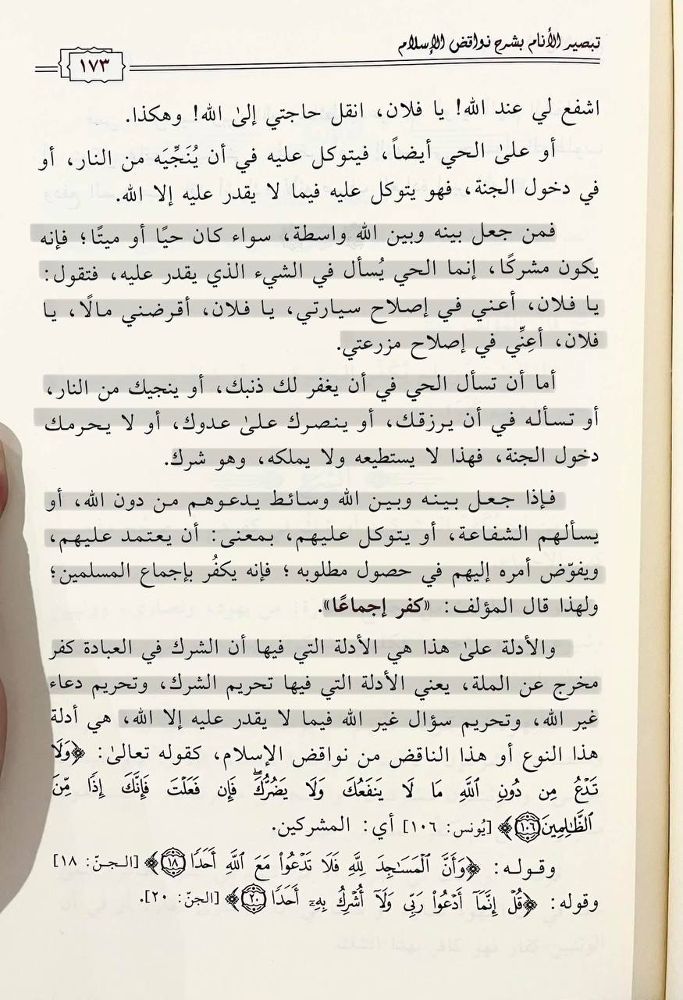

---

### Grave visitation and the pathways leading to shirk
<!-- evidence-id: 000711 -->

<!-- telegram-source: personal/messages.html#message587 -->
<!-- evidence-id: 000712 -->

Ibn Qayyim said:

Among them: that which the Messenger ﷺ legislated regarding visiting graves is only to remember the Hereafter, and to show iḥsān (goodness) to the deceased by making duʿāʾ for him, and praying for mercy upon him, and istighfār (seeking forgiveness) for him, and asking for well-being for him, so the visitor is a doer of iḥsān to himself and to the dead.

But these mushrikūn reversed the matter, and inverted the religion, and made the purpose of visiting the grave, shirk with the dead, and making duʿāʾ to him and through him, and asking him for their needs, and seeking blessings from him, and victory for them over the enemies, and the like.

Source: Ighāthat al-Lahfān fī Maṣāyid ash-Shayṭān 1/359

Show attached source scan

# Salaf Evidence Archive

<strong>Provisional research collection.</strong> This collection gathers direct statements, transmitted reports, and hadiths relevant to early Sunni creed. A report shown here is not automatically authenticated. Reports without a named published grading carry an orange warning, and no grading is supplied by this archive itself. Telegram-supplied material is identified separately because it was selected and ordinarily checked by the original poster, but that provenance is not the same as a cited ruling from a named verifier.

## 12. Methodology concerning the divine attributes

### Imām Aḥmad: transmitted reports are accepted with submission rather than speculative dispute
<!-- evidence-id: 000731 -->
<!-- record-type: transmitted-report -->
<!-- report-status: unresolved -->

Imām Aḥmad ibn Ḥanbal said:

“The foundations of the Sunnah with us are adherence to what the Companions of the Messenger of Allāh ﷺ were upon, taking them as an example, abandoning innovations, and abandoning disputation in religion. The Sunnah explains the Qurʾān and consists of the indications of the Qurʾān. There is no analogy in the Sunnah, examples are not coined for it, and it is not grasped through intellects or desires. It is only following and abandoning desire.

Belief in the reports concerning divine decree and faith in them is required. It is not said, ‘Why?’ or ‘How?’ Rather, it is affirmation and faith. Whoever does not know the explanation of a report and whose intellect does not reach it has been sufficed by it and the matter has been made decisive for him. He must believe in it and submit to it. The same applies to all the reports concerning the vision, even if they are unfamiliar to the ears and the listener feels uneasy about them. He is only required to believe in them and not reject a single letter of them, as with the other transmitted reports from trustworthy narrators.”

Source: Aḥmad ibn Ḥanbal, *Uṣūl al-Sunnah*, pp. 14-21, Dār al-Manār edition.

This copy transmits the treatise through a chain ending with ʿAbdūs ibn Mālik al-ʿAṭṭār from Imām Aḥmad. No named overall authentication judgment for the transmission was found in the consulted edition.

Transmission chain of the treatise

Yaḥyā ibn Abī al-Ḥasan ibn al-Bannāʾ → his father Abū ʿAlī al-Ḥasan ibn ʿUmar ibn al-Bannāʾ → Abū al-Ḥusayn ʿAlī ibn Muḥammad ibn ʿAbd Allāh ibn Bishrān → ʿUthmān ibn Aḥmad ibn al-Sammāk → Abū Muḥammad al-Ḥasan ibn ʿAbd al-Wahhāb Abū al-ʿAnbar → Abū Jaʿfar Muḥammad ibn Sulaymān al-Manqarī → ʿAbdūs ibn Mālik al-ʿAṭṭār → Imām Aḥmad ibn Ḥanbal.

Arabic text

قَالَ عَبْدُوسُ بْنُ مَالِكٍ الْعَطَّارُ: سَمِعْتُ أَبَا عَبْدِ اللَّهِ أَحْمَدَ بْنَ حَنْبَلٍ يَقُولُ: أُصُولُ السُّنَّةِ عِنْدَنَا التَّمَسُّكُ بِمَا كَانَ عَلَيْهِ أَصْحَابُ رَسُولِ اللَّهِ صَلَّى اللَّهُ عَلَيْهِ وَسَلَّمَ، وَالِاقْتِدَاءُ بِهِمْ، وَتَرْكُ الْبِدَعِ، وَكُلُّ بِدْعَةٍ فَهِيَ ضَلَالَةٌ، وَتَرْكُ الْخُصُومَاتِ فِي الدِّينِ. وَالسُّنَّةُ تُفَسِّرُ الْقُرْآنَ، وَهِيَ دَلَائِلُ الْقُرْآنِ، وَلَيْسَ فِي السُّنَّةِ قِيَاسٌ، وَلَا تُضْرَبُ لَهَا الْأَمْثَالُ، وَلَا تُدْرَكُ بِالْعُقُولِ وَلَا الْأَهْوَاءِ، إِنَّمَا هُوَ الِاتِّبَاعُ وَتَرْكُ الْهَوَى.

وَالْإِيمَانُ بِالْأَحَادِيثِ فِيهِ وَالْإِيمَانُ بِهَا، لَا يُقَالُ: لِمَ؟ وَلَا كَيْفَ؟ إِنَّمَا هُوَ التَّصْدِيقُ وَالْإِيمَانُ بِهَا. وَمَنْ لَمْ يَعْرِفْ تَفْسِيرَ الْحَدِيثِ وَيَبْلُغْهُ عَقْلُهُ فَقَدْ كُفِيَ ذَلِكَ وَأُحْكِمَ لَهُ، فَعَلَيْهِ الْإِيمَانُ بِهِ وَالتَّسْلِيمُ. وَمِثْلُ أَحَادِيثِ الرُّؤْيَةِ كُلِّهَا، وَإِنْ نَبَتْ عَنِ الْأَسْمَاعِ وَاسْتَوْحَشَ مِنْهَا الْمُسْتَمِعُ، وَإِنَّمَا عَلَيْهِ الْإِيمَانُ بِهَا، وَأَنْ لَا يَرُدَّ مِنْهَا حَرْفًا وَاحِدًا، وَغَيْرُهَا مِنَ الْأَحَادِيثِ الْمَأْثُورَاتِ عَنِ الثِّقَاتِ.

المصدر: أحمد بن حنبل، <em>أصول السنة</em>، ص. <bdi dir="ltr">14-21</bdi>، طبعة دار المنار.

---

### Al-Bukhārī: none of Allāh’s attributes resembles creation
<!-- evidence-id: 000715 -->
<!-- record-type: direct-authorial-statement -->

Imām al-Bukhārī said:

“In this is evidence that the voice of Allāh does not resemble the voices of creation, because the voice of Allāh, majestic is His mention, is heard from afar just as it is heard from nearby, and because the angels fall unconscious from His voice. When the angels call to one another, they do not fall unconscious. Allāh, mighty and majestic, said: ‘So do not set up rivals to Allāh.’ There is no rival or likeness to the attributes of Allāh, and nothing from His attributes is found among created beings.”

Source: al-Bukhārī, *Khalq Afʿāl al-ʿIbād*, p. 98, ed. ʿAbd al-Raḥmān ʿUmayrah.

Arabic text

قَالَ أَبُو عَبْدِ اللَّهِ: «وَفِي هَذَا دَلِيلٌ أَنَّ صَوْتَ اللَّهِ لَا يُشْبِهُ أَصْوَاتَ الْخَلْقِ، لِأَنَّ صَوْتَ اللَّهِ جَلَّ ذِكْرُهُ يُسْمَعُ مِنْ بُعْدٍ كَمَا يُسْمَعُ مِنْ قُرْبٍ، وَأَنَّ الْمَلَائِكَةَ يُصْعَقُونَ مِنْ صَوْتِهِ، فَإِذَا تَنَادَى الْمَلَائِكَةُ لَمْ يُصْعَقُوا، وَقَالَ عَزَّ وَجَلَّ: {فَلَا تَجْعَلُوا لِلَّهِ أَنْدَادًا}، فَلَيْسَ لِصِفَةِ اللَّهِ نِدٌّ، وَلَا مِثْلٌ، وَلَا يُوجَدُ شَيْءٌ مِنْ صِفَاتِهِ فِي الْمَخْلُوقِينَ».

المصدر: البخاري، <em>خلق أفعال العباد</em>، ص. <bdi dir="ltr">98</bdi>، تحقيق عبد الرحمن عميرة.

---

### Al-Ṭabarī: affirm the realities of the attributes without resemblance
<!-- evidence-id: 000713 -->
<!-- record-type: direct-authorial-statement -->

Ibn Jarīr al-Ṭabarī said:

“The correct position concerning the meanings of these attributes which we have mentioned, some of which came in the Book of Allāh and His revelation and some of which came from the Messenger of Allāh ﷺ, is that we affirm their realities according to what is known from the standpoint of affirmation, while negating resemblance, just as He, exalted is His praise, negated it from Himself when He said: ‘There is nothing like unto Him, and He is the All-Hearing, the All-Seeing.’

Thus it is said that Allāh is Hearing and Seeing, and that He has hearing and sight. We affirm all these meanings which the reports, the Book, and the revelation have brought according to the reality of affirmation that is understood, while negating resemblance from Him.

We say that He hears voices, not through an opening in an ear and not through an organ like the organs of the children of Ādam. Likewise, He sees persons with a sight that does not resemble the sight of the children of Ādam, which consists of organs. He has two Hands, a Right Hand, and Fingers. They are not bodily organs. Rather, they are two Hands outstretched with blessings to the creation and not withheld from goodness. He has a Face, unlike the bodily organs of the creation which consist of flesh and blood. We say that He laughs toward whomever He wills among His creation, but we do not say that this means baring teeth. He descends every night to the lowest heaven.”

Source: Ibn Jarīr al-Ṭabarī, *al-Tabṣīr fī Maʿālim al-Dīn*, pp. 140-143, ed. ʿAlī ibn ʿAbd al-ʿAzīz al-Shibl, Dār al-ʿĀṣimah.

Arabic text

فَإِنْ قَالَ لَنَا قَائِلٌ: فَمَا الصَّوَابُ مِنَ الْقَوْلِ فِي مَعَانِي هَذِهِ الصِّفَاتِ الَّتِي ذَكَرْتَ، وَجَاءَ بِبَعْضِهَا كِتَابُ اللَّهِ عَزَّ وَجَلَّ وَوَحْيُهُ، وَجَاءَ بِبَعْضِهَا رَسُولُ اللَّهِ صَلَّى اللَّهُ عَلَيْهِ وَسَلَّمَ؟ قِيلَ: الصَّوَابُ مِنْ هَذَا الْقَوْلِ عِنْدَنَا أَنْ نُثْبِتَ حَقَائِقَهَا عَلَى مَا نَعْرِفُ مِنْ جِهَةِ الْإِثْبَاتِ وَنَفْيِ التَّشْبِيهِ، كَمَا نَفَى ذَلِكَ عَنْ نَفْسِهِ جَلَّ ثَنَاؤُهُ فَقَالَ: {لَيْسَ كَمِثْلِهِ شَيْءٌ وَهُوَ السَّمِيعُ الْبَصِيرُ}.

فَيُقَالُ: اللَّهُ سَمِيعٌ بَصِيرٌ، لَهُ سَمْعٌ وَبَصَرٌ. فَنُثْبِتُ كُلَّ هَذِهِ الْمَعَانِي الَّتِي ذَكَرْنَا أَنَّهَا جَاءَتْ بِهَا الْأَخْبَارُ وَالْكِتَابُ وَالتَّنْزِيلُ عَلَى مَا يُعْقَلُ مِنْ حَقِيقَةِ الْإِثْبَاتِ، وَنَنْفِي عَنْهُ التَّشْبِيهَ.

فَنَقُولُ: يَسْمَعُ جَلَّ ثَنَاؤُهُ الْأَصْوَاتَ، لَا بِخَرْقٍ فِي أُذُنٍ، وَلَا جَارِحَةٍ كَجَوَارِحِ بَنِي آدَمَ. وَكَذَلِكَ يُبْصِرُ الْأَشْخَاصَ بِبَصَرٍ لَا يُشْبِهُ أَبْصَارَ بَنِي آدَمَ الَّتِي هِيَ جَوَارِحٌ لَهُمْ. وَلَهُ يَدَانِ وَيَمِينٌ وَأَصَابِعُ، وَلَيْسَتْ جَارِحَةً، وَلَكِنْ يَدَانِ مَبْسُوطَتَانِ بِالنِّعَمِ عَلَى الْخَلْقِ، لَا مَقْبُوضَتَانِ عَنِ الْخَيْرِ. وَوَجْهٌ لَا كَجَوَارِحِ الْخَلْقِ الَّتِي مِنْ لَحْمٍ وَدَمٍ. وَنَقُولُ: يَضْحَكُ إِلَى مَنْ شَاءَ مِنْ خَلْقِهِ، وَلَا نَقُولُ: إِنَّ ذَلِكَ كَشَرٌّ عَنْ أَسْنَانٍ. وَيَهْبِطُ كُلَّ لَيْلَةٍ إِلَى السَّمَاءِ الدُّنْيَا.

المصدر: ابن جرير الطبري، <em>التبصير في معالم الدين</em>، ص. <bdi dir="ltr">140-143</bdi>، تحقيق علي بن عبد العزيز الشبل، دار العاصمة.

---

### Al-Ṭabarī: submit to the apparent meaning of the transmitted report
<!-- evidence-id: 000714 -->
<!-- record-type: direct-authorial-statement -->

Ibn Jarīr al-Ṭabarī said concerning the divine coming and descent:

“Its meaning is what the apparent wording of the report indicates. With us there is nothing regarding the report except submission to it and belief in it. We therefore say: Our Lord, majestic is His majesty, comes on the Day of Resurrection while the angels are row upon row, and He descends to the lowest heaven every night. We do not say that this means His command descends, for His command descends to it and to the rest of His existing creation at every moment and hour.

The correct position concerning every report transmitted about the attributes and names of Allāh, mighty and majestic, is like what we have stated concerning these meanings.”

Source: Ibn Jarīr al-Ṭabarī, *al-Tabṣīr fī Maʿālim al-Dīn*, pp. 146-147, ed. ʿAlī ibn ʿAbd al-ʿAzīz al-Shibl, Dār al-ʿĀṣimah.

Arabic text

قِيلَ لَهُ: مَعْنَى ذَلِكَ مَا دَلَّ عَلَيْهِ ظَاهِرُ الْخَبَرِ، وَلَيْسَ عِنْدَنَا لِلْخَبَرِ إِلَّا التَّسْلِيمُ وَالْإِيمَانُ بِهِ، فَنَقُولُ: يَجِيءُ رَبُّنَا جَلَّ جَلَالُهُ يَوْمَ الْقِيَامَةِ وَالْمَلَكُ صَفًّا صَفًّا، وَيَهْبِطُ إِلَى السَّمَاءِ الدُّنْيَا وَيَنْزِلُ إِلَيْهَا فِي كُلِّ لَيْلَةٍ، وَلَا نَقُولُ: مَعْنَى ذَلِكَ يَنْزِلُ أَمْرُهُ؛ بَلْ نَقُولُ: أَمْرُهُ نَازِلٌ إِلَيْهَا كُلَّ لَحْظَةٍ وَسَاعَةٍ وَإِلَى غَيْرِهَا مِنْ جَمِيعِ خَلْقِهِ الْمَوْجُودِينَ مَا دَامَتْ مَوْجُودَةً.

وَكَالَّذِي قُلْنَا فِي هَذِهِ الْمَعَانِي مِنَ الْقَوْلِ، الصَّوَابُ مِنَ الْقِيلِ فِي كُلِّ مَا وَرَدَ بِهِ الْخَبَرُ فِي صِفَاتِ اللَّهِ عَزَّ وَجَلَّ وَأَسْمَائِهِ تَعَالَى ذِكْرُهُ بِنَحْوِ مَا ذَكَرْنَاهُ.

المصدر: ابن جرير الطبري، <em>التبصير في معالم الدين</em>، ص. <bdi dir="ltr">146-147</bdi>، تحقيق علي بن عبد العزيز الشبل، دار العاصمة.

## 13. Divine highness and istiwāʾ

### Ibn al-Mubārak: Allāh is above His heavens upon His Throne
<!-- evidence-id: 000716 -->
<!-- record-type: transmitted-report -->
<!-- report-status: unresolved -->

ʿAbd Allāh ibn al-Mubārak said:

“We do not say as the Jahmiyyah say, that He is here on the earth. Rather, He rose over the Throne.”

He was asked, “How do we know our Lord?” He replied:

“Above His heavens, upon His Throne.”

Source: al-Bukhārī, *Khalq Afʿāl al-ʿIbād*, pp. 31-32, ed. ʿAbd al-Raḥmān ʿUmayrah.

No named authentication judgment was found in the consulted edition. Al-Bukhārī cites this wording without a complete chain at this location.

Arabic text

وَقَالَ ابْنُ الْمُبَارَكِ: «لَا نَقُولُ كَمَا قَالَتِ الْجَهْمِيَّةُ إِنَّهُ فِي الْأَرْضِ هَهُنَا، بَلْ عَلَى الْعَرْشِ اسْتَوَى».

وَقِيلَ لَهُ: كَيْفَ تَعْرِفُ رَبَّنَا؟ قَالَ: «فَوْقَ سَمَاوَاتِهِ عَلَى عَرْشِهِ».

المصدر: البخاري، <em>خلق أفعال العباد</em>، ص. <bdi dir="ltr">31-32</bdi>، تحقيق عبد الرحمن عميرة.

---

### A report rejecting the claim that istawā means istawlā
<!-- evidence-id: 000718 -->
<!-- record-type: transmitted-report -->
<!-- report-status: unresolved -->
<!-- authority-name: Abū ʿAbd Allāh ibn al-Aʿrābī -->
<!-- authority-death: 231 -->
<!-- provenance: telegram-supplied -->
<!-- telegram-source: dar/messages.html#message988 -->

Al-Lālakāʾī reported from Abū Bakr Muḥammad ibn Aḥmad ibn al-Naḍr, the grandson of Muʿāwiyah ibn ʿAmr, that he said:

“Abū ʿAbd Allāh ibn al-Aʿrābī was our neighbor, and his night was the finest of nights.” He then mentioned that Ibn Abī Duʾād asked him, “Do you know in the Arabic language that istawā means istawlā?” He replied, “I do not know that.”

Source: al-Lālakāʾī, *Sharḥ Uṣūl Iʿtiqād Ahl al-Sunnah wa-al-Jamāʿah*, 2/38. Supplied through the Dār al-Salafiyyah Telegram export, message 988.

[Open the original Telegram source post](https://t.me/salafsaqeedah/988)

The Telegram post supplies the source reference and a source image, but no named authentication judgment. This archive has not graded the report.

Transmission as supplied

Al-Lālakāʾī reports through Abū Bakr Muḥammad ibn Aḥmad ibn al-Naḍr, the grandson of Muʿāwiyah ibn ʿAmr. The exported post does not reproduce the complete chain before this point.

Source scan

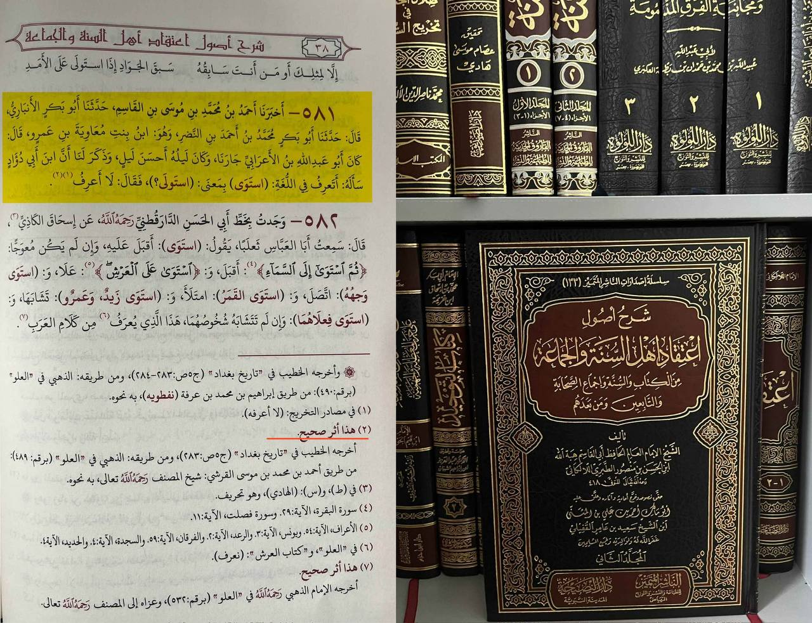

---

### Al-Ṭabarī: the Lord is the One who rose over the Throne
<!-- evidence-id: 000717 -->
<!-- record-type: direct-authorial-statement -->

Ibn Jarīr al-Ṭabarī said:

“A person should know that his Lord is the One who rose over the Throne. To Him belongs whatever is in the heavens, whatever is on the earth, whatever is between them, and whatever is beneath the soil. Whoever goes beyond that has failed, lost, strayed, and perished.”

Source: Ibn Jarīr al-Ṭabarī, *Ṣarīḥ al-Sunnah*, pp. 26-27, ed. Badr Yūsuf al-Maʿtūq.

Arabic text

وَيَعْلَمَ أَنَّ رَبَّهُ هُوَ الَّذِي عَلَى الْعَرْشِ اسْتَوَى، {لَهُ مَا فِي السَّمَاوَاتِ وَمَا فِي الْأَرْضِ وَمَا بَيْنَهُمَا وَمَا تَحْتَ الثَّرَى}، فَمَنْ تَجَاوَزَ ذَلِكَ فَقَدْ خَابَ وَخَسِرَ وَضَلَّ وَهَلَكَ.

المصدر: ابن جرير الطبري، <em>صريح السنة</em>، ص. <bdi dir="ltr">26-27</bdi>، تحقيق بدر يوسف المعتوق.

## 14. The Qurʾān is the uncreated speech of Allāh

### ʿAmr ibn Dīnār: the scholars maintained for seventy years that the Qurʾān is uncreated
<!-- evidence-id: 000721 -->
<!-- record-type: transmitted-report -->
<!-- report-status: unresolved -->

Sufyān ibn ʿUyaynah said:

“I met our shaykhs over the course of seventy years, among them ʿAmr ibn Dīnār, and they would say: ‘The Qurʾān is the speech of Allāh and is not created.’”

Source: al-Bukhārī, *Khalq Afʿāl al-ʿIbād*, p. 29, ed. ʿAbd al-Raḥmān ʿUmayrah.

No named authentication judgment was found in the consulted edition.

Full chain

Al-Bukhārī → al-Ḥakam ibn Muḥammad al-Ṭabarī → Sufyān ibn ʿUyaynah → the shaykhs he met over seventy years, including ʿAmr ibn Dīnār.

Arabic text

حَدَّثَنِي الْحَكَمُ بْنُ مُحَمَّدٍ الطَّبَرِيُّ، كَتَبْتُ عَنْهُ بِمَكَّةَ، قَالَ: حَدَّثَنَا سُفْيَانُ بْنُ عُيَيْنَةَ، قَالَ: أَدْرَكْتُ مَشَائِخَنَا مُنْذُ سَبْعِينَ سَنَةً، مِنْهُمْ عَمْرُو بْنُ دِينَارٍ، يَقُولُونَ: «الْقُرْآنُ كَلَامُ اللَّهِ وَلَيْسَ بِمَخْلُوقٍ».

المصدر: البخاري، <em>خلق أفعال العباد</em>، ص. <bdi dir="ltr">29</bdi>، تحقيق عبد الرحمن عميرة.

---

### Jaʿfar al-Ṣādiq: the Qurʾān is the speech of Allāh
<!-- evidence-id: 000720 -->
<!-- record-type: transmitted-report -->
<!-- report-status: unresolved -->

Muʿāwiyah ibn ʿAmmār al-Duhnī said that he asked Jaʿfar ibn Muḥammad al-Ṣādiq whether the Qurʾān was created or a creator. Jaʿfar replied:

“It is neither a creator nor created. Rather, it is the speech of Allāh, mighty and majestic.”

Source: Ibn Jarīr al-Ṭabarī, *Ṣarīḥ al-Sunnah*, p. 19, report 15, ed. Badr Yūsuf al-Maʿtūq.

No named authentication judgment was found in the consulted edition.

Full chain

Ibn Jarīr al-Ṭabarī → Mūsā ibn Sahl al-Ramlī → Mūsā ibn Dāwūd → Maʿbad Abū ʿAbd al-Raḥmān → Muʿāwiyah ibn ʿAmmār al-Duhnī → Jaʿfar ibn Muḥammad al-Ṣādiq.

Arabic text

حَدَّثَنَا مُوسَى بْنُ سَهْلٍ الرَّمْلِيُّ، حَدَّثَنَا مُوسَى بْنُ دَاوُدَ، حَدَّثَنَا مَعْبَدٌ أَبُو عَبْدِ الرَّحْمَنِ، عَنْ مُعَاوِيَةَ بْنِ عَمَّارٍ الدُّهْنِيِّ، قَالَ: قُلْتُ لِجَعْفَرِ بْنِ مُحَمَّدٍ رَضِيَ اللَّهُ عَنْهُ: إِنَّهُمْ يَسْأَلُونَ عَنِ الْقُرْآنِ: مَخْلُوقٌ أَوْ خَالِقٌ؟ فَقَالَ: «إِنَّهُ لَيْسَ بِخَالِقٍ وَلَا مَخْلُوقٍ، وَلَكِنَّهُ كَلَامُ اللَّهِ عَزَّ وَجَلَّ».

المصدر: ابن جرير الطبري، <em>صريح السنة</em>، ص. <bdi dir="ltr">19</bdi>، الأثر رقم <bdi dir="ltr">15</bdi>، تحقيق بدر يوسف المعتوق.

---

### Al-Ṭabarī: the Qurʾān remains the uncreated speech of Allāh wherever it is recited or written
<!-- evidence-id: 000722 -->
<!-- record-type: direct-authorial-statement -->

Ibn Jarīr al-Ṭabarī said:

“The Qurʾān is the speech of Allāh and His revelation. Since this is among the meanings of affirming His oneness, the correct position with us is that it is the speech of Allāh, uncreated, however it is written, wherever it is recited, and in whatever place it is read. It is the same Qurʾān whether found in heaven, preserved on earth, written in the Preserved Tablet, inscribed on the tablets of children in the schools, engraved in stone, written on paper, preserved in the heart, or pronounced by the tongue.”

Source: Ibn Jarīr al-Ṭabarī, *Ṣarīḥ al-Sunnah*, pp. 18-19, ed. Badr Yūsuf al-Maʿtūq.

Arabic text

الْقُرْآنُ كَلَامُ اللَّهِ وَتَنْزِيلُهُ؛ إِذْ كَانَ مِنْ مَعَانِي تَوْحِيدِهِ، فَالصَّوَابُ مِنَ الْقَوْلِ فِي ذَلِكَ عِنْدَنَا أَنَّهُ كَلَامُ اللَّهِ غَيْرُ مَخْلُوقٍ كَيْفَ كُتِبَ وَحَيْثُ تُلِيَ وَفِي أَيِّ مَوْضِعٍ قُرِئَ، فِي السَّمَاءِ وُجِدَ، وَفِي الْأَرْضِ حَيْثُ حُفِظَ، فِي اللَّوْحِ الْمَحْفُوظِ كَانَ مَكْتُوبًا، وَفِي أَلْوَاحِ صِبْيَانِ الْكُتَّابِ مَرْسُومًا، فِي حَجَرٍ نُقِشَ، أَوْ فِي وَرَقٍ خُطَّ، أَوْ فِي الْقَلْبِ حُفِظَ، وَبِلِسَانٍ لُفِظَ.

المصدر: ابن جرير الطبري، <em>صريح السنة</em>، ص. <bdi dir="ltr">18-19</bdi>، تحقيق بدر يوسف المعتوق.

---

### Al-Ājurrī: the Qurʾān is uncreated and the contrary positions are rejected
<!-- evidence-id: 000738 -->
<!-- record-type: direct-authorial-statement -->
<!-- authority-name: Abū Bakr al-Ājurrī -->
<!-- authority-death: 360 -->
<!-- provenance: external-primary-text -->

Abū Bakr al-Ājurrī said:

“Beware, may Allāh have mercy upon you, of those who say that a person’s utterance of the Qurʾān is created. This was, according to Aḥmad ibn Ḥanbal and those who followed his path, a grave objectionable doctrine. Its proponent is an innovator who is to be avoided, neither spoken to nor sat with, and the people are to be warned against him.

The scholars recognize nothing other than what we previously mentioned: the Qurʾān is the speech of Allāh and is not created. Whoever says that it is created has disbelieved. Whoever says, ‘The Qurʾān is the speech of Allāh,’ and then stops without saying that it is uncreated is a Jahmī. Whoever says, ‘My utterance of the Qurʾān is created,’ is likewise a Jahmī. This is what Aḥmad ibn Ḥanbal said, and he spoke very sternly concerning it.”

Source: Abū Bakr al-Ājurrī, *al-Sharīʿah*, 1/533-535, chapter on the Lafẓiyyah. [Read the source online](https://www.islamweb.net/ar/library/content/1006/196/%D8%A8%D8%A7%D8%A8-%D8%B0%D9%83%D8%B1-%D8%A7%D9%84%D9%84%D9%81%D8%B8%D9%8A%D8%A9).

Arabic text

قَالَ مُحَمَّدُ بْنُ الْحُسَيْنِ: احْذَرُوا رَحِمَكُمُ اللَّهُ هَؤُلَاءِ الَّذِينَ يَقُولُونَ: إِنَّ لَفْظَهُ بِالْقُرْآنِ مَخْلُوقٌ، وَهَذَا عِنْدَ أَحْمَدَ بْنِ حَنْبَلٍ وَمَنْ كَانَ عَلَى طَرِيقَتِهِ مُنْكَرٌ عَظِيمٌ، وَقَائِلُ هَذَا مُبْتَدِعٌ، يُجْتَنَبُ وَلَا يُكَلَّمُ وَلَا يُجَالَسُ، وَيُحَذَّرُ مِنْهُ النَّاسُ.

لَا يَعْرِفُ الْعُلَمَاءُ غَيْرَ مَا تَقَدَّمَ ذِكْرُنَا لَهُ، وَهُوَ أَنَّ الْقُرْآنَ كَلَامُ اللَّهِ غَيْرُ مَخْلُوقٍ، وَمَنْ قَالَ: مَخْلُوقٌ فَقَدْ كَفَرَ، وَمَنْ قَالَ: الْقُرْآنُ كَلَامُ اللَّهِ وَوَقَفَ فَهُوَ جَهْمِيٌّ، وَمَنْ قَالَ: لَفْظِي بِالْقُرْآنِ مَخْلُوقٌ فَهُوَ جَهْمِيٌّ أَيْضًا، كَذَا قَالَ أَحْمَدُ بْنُ حَنْبَلٍ، وَغَلَّظَ فِيهِ الْقَوْلَ جِدًّا.

المصدر: أبو بكر الآجري، <em>الشريعة</em>، <bdi dir="ltr">1/533-535</bdi>، باب ذكر اللفظية.

## 15. The believers’ vision of Allāh

### Hadith: the believers will see their Lord as they see the full moon
<!-- evidence-id: 000724 -->
<!-- record-type: hadith -->
<!-- report-status: authenticated-in-primary-collection -->

Jarīr ibn ʿAbd Allāh reported that the Messenger of Allāh ﷺ looked at the moon on the night when it was full and said:

“You will certainly see your Lord, mighty and majestic, just as you see this moon, without crowding one another in seeing Him. If you are able not to be overcome concerning a prayer before sunrise and a prayer before sunset, then do so.”

He then recited: “And glorify your Lord with praise before sunrise and before sunset.” [Qāf 50:39]

Source: Ibn Jarīr al-Ṭabarī, *Ṣarīḥ al-Sunnah*, p. 20, report 18. The hadith is also recorded by al-Bukhārī and Muslim.

Hadith. Al-Ṭabarī introduces this doctrine as established by authentic reports. This hadith is also transmitted in the two Ṣaḥīḥ collections.

Chains recorded by al-Ṭabarī

Al-Ṭabarī → Abū al-Sāʾib Salm ibn Junādah → Ibn Fuḍayl → Ismāʿīl ibn Abī Khālid → Qays ibn Abī Ḥāzim → Jarīr ibn ʿAbd Allāh → the Prophet ﷺ.

Al-Ṭabarī → Tamīm ibn al-Muntaṣir → Yazīd ibn Hārūn → Ismāʿīl ibn Abī Khālid → Qays ibn Abī Ḥāzim → Jarīr ibn ʿAbd Allāh → the Prophet ﷺ.

Al-Ṭabarī → Mujāhid ibn Mūsā → Yazīd ibn Hārūn → Ismāʿīl ibn Abī Khālid → Qays ibn Abī Ḥāzim → Jarīr ibn ʿAbd Allāh → the Prophet ﷺ.

Al-Ṭabarī → Ibn al-Ṣabbāḥ → Sufyān, Marwān ibn Muʿāwiyah, and Yazīd ibn Hārūn → Ismāʿīl ibn Abī Khālid → Qays ibn Abī Ḥāzim → Jarīr ibn ʿAbd Allāh → the Prophet ﷺ.

Arabic text

حَدَّثَنَا أَبُو السَّائِبِ سَلْمُ بْنُ جُنَادَةَ، حَدَّثَنَا ابْنُ فُضَيْلٍ، وَحَدَّثَنَا تَمِيمُ بْنُ الْمُنْتَصِرِ، وَمُجَاهِدُ بْنُ مُوسَى، قَالَ تَمِيمٌ: أَنْبَأَنَا يَزِيدُ، وَقَالَ مُجَاهِدٌ: حَدَّثَنَا يَزِيدُ بْنُ هَارُونَ، وَحَدَّثَنَا ابْنُ الصَّبَّاحِ، حَدَّثَنَا سُفْيَانُ، وَمَرْوَانُ بْنُ مُعَاوِيَةَ، وَيَزِيدُ بْنُ هَارُونَ، جَمِيعًا عَنْ إِسْمَاعِيلَ بْنِ أَبِي خَالِدٍ، عَنْ قَيْسِ بْنِ أَبِي حَازِمٍ، عَنْ جَرِيرِ بْنِ عَبْدِ اللَّهِ، قَالَ: كُنَّا جُلُوسًا عِنْدَ رَسُولِ اللَّهِ صَلَّى اللَّهُ عَلَيْهِ وَسَلَّمَ، فَنَظَرَ إِلَى الْقَمَرِ لَيْلَةَ الْبَدْرِ فَقَالَ: «إِنَّكُمْ رَاءُونَ رَبَّكُمْ عَزَّ وَجَلَّ كَمَا تَرَوْنَ هَذَا الْقَمَرَ، لَا تُضَامُّونَ فِي رُؤْيَتِهِ، فَإِنِ اسْتَطَعْتُمْ أَنْ لَا تُغْلَبُوا عَلَى صَلَاةٍ قَبْلَ طُلُوعِ الشَّمْسِ وَقَبْلَ غُرُوبِهَا فَافْعَلُوا» ثُمَّ تَلَا رَسُولُ اللَّهِ صَلَّى اللَّهُ عَلَيْهِ وَسَلَّمَ: {وَسَبِّحْ بِحَمْدِ رَبِّكَ قَبْلَ طُلُوعِ الشَّمْسِ وَقَبْلَ الْغُرُوبِ}.

المصدر: ابن جرير الطبري، <em>صريح السنة</em>، ص. <bdi dir="ltr">20</bdi>، الحديث رقم <bdi dir="ltr">18</bdi>.

---

### Al-Ṭabarī: the people of Paradise will see their Lord
<!-- evidence-id: 000723 -->
<!-- record-type: direct-authorial-statement -->

Ibn Jarīr al-Ṭabarī said:

“As for the correct position concerning the believers seeing their Lord, mighty and majestic, on the Day of Resurrection, which is the religion by which we worship Allāh and upon which we found Ahl al-Sunnah wa-al-Jamāʿah, it is that the people of Paradise will see Him according to what the authentic reports from the Messenger of Allāh ﷺ establish.”

Source: Ibn Jarīr al-Ṭabarī, *Ṣarīḥ al-Sunnah*, p. 20, ed. Badr Yūsuf al-Maʿtūq.

Arabic text

وَأَمَّا الصَّوَابُ مِنَ الْقَوْلِ فِي رُؤْيَةِ الْمُؤْمِنِينَ رَبَّهُمْ عَزَّ وَجَلَّ يَوْمَ الْقِيَامَةِ، وَهُوَ دِينُنَا الَّذِي نَدِينُ اللَّهَ بِهِ، وَأَدْرَكْنَا عَلَيْهِ أَهْلَ السُّنَّةِ وَالْجَمَاعَةِ، فَهُوَ أَنَّ أَهْلَ الْجَنَّةِ يَرَوْنَهُ عَلَى مَا صَحَّتْ بِهِ الْأَخْبَارُ عَنْ رَسُولِ اللَّهِ صَلَّى اللَّهُ عَلَيْهِ وَسَلَّمَ.

المصدر: ابن جرير الطبري، <em>صريح السنة</em>، ص. <bdi dir="ltr">20</bdi>، تحقيق بدر يوسف المعتوق.

## 16. Statements concerning the Jahmiyyah and sectarian disbelief

### Ḥammād ibn Abī Sulaymān disavows the religion of one who says the Qurʾān is created
<!-- evidence-id: 000725 -->
<!-- record-type: transmitted-report -->
<!-- report-status: unresolved -->

Ḥammād ibn Abī Sulaymān told Sufyān al-Thawrī:

“Convey to that mushrik that I am free of his religion.”

The person in question used to say that the Qurʾān was created.

Source: al-Bukhārī, *Khalq Afʿāl al-ʿIbād*, p. 29, ed. ʿAbd al-Raḥmān ʿUmayrah.

No named authentication judgment was found in the consulted edition.

Full chain

Al-Bukhārī transmits from Aḥmad ibn al-Ḥasan → Abū Nuʿaym → Sulaymān al-Qāriʾ → Sufyān al-Thawrī → Ḥammād ibn Abī Sulaymān.

Arabic text

وَقَالَ أَحْمَدُ بْنُ الْحَسَنِ: حَدَّثَنَا أَبُو نُعَيْمٍ، حَدَّثَنَا سُلَيْمَانُ الْقَارِئُ، قَالَ: سَمِعْتُ سُفْيَانَ الثَّوْرِيَّ يَقُولُ: قَالَ لِي حَمَّادُ بْنُ أَبِي سُلَيْمَانَ: «أَبْلِغْ أَبَا فُلَانٍ الْمُشْرِكَ أَنِّي بَرِيءٌ مِنْ دِينِهِ»، وَكَانَ يَقُولُ: «الْقُرْآنُ مَخْلُوقٌ».

المصدر: البخاري، <em>خلق أفعال العباد</em>، ص. <bdi dir="ltr">29</bdi>، تحقيق عبد الرحمن عميرة.

---

### ʿAbd Allāh ibn Idrīs: those who say the Qurʾān is created are not people of tawḥīd
<!-- evidence-id: 000726 -->
<!-- record-type: transmitted-report -->
<!-- report-status: unresolved -->

ʿAbd Allāh ibn Idrīs was asked about people who said that the Qurʾān was created. When the questioner claimed that they were among the people of tawḥīd, he replied:

“These are not among the people of tawḥīd. They are heretics. Whoever claims that the Qurʾān is created has claimed that Allāh is created. Allāh says: ‘In the name of Allāh, the Most Merciful, the Especially Merciful.’ Allāh is not created, the Most Merciful is not created, and the Especially Merciful is not created. This is the foundation of heresy. Whoever says this is under the curse of Allāh. Do not sit with them and do not marry them.”

Source: al-Bukhārī, *Khalq Afʿāl al-ʿIbād*, p. 30, ed. ʿAbd al-Raḥmān ʿUmayrah.

No named authentication judgment was found in the consulted edition.

Full chain

Al-Bukhārī → Muḥammad ibn ʿAbd Allāh Abū Jaʿfar al-Baghdādī → Abū Zakariyyā Yaḥyā ibn Yūsuf al-Zimmī → ʿAbd Allāh ibn Idrīs.

Arabic text

حَدَّثَنَا مُحَمَّدُ بْنُ عَبْدِ اللَّهِ أَبُو جَعْفَرٍ الْبَغْدَادِيُّ، قَالَ: سَمِعْتُ أَبَا زَكَرِيَّا يَحْيَى بْنَ يُوسُفَ الزِّمِّيَّ، قَالَ: كُنَّا عِنْدَ عَبْدِ اللَّهِ بْنِ إِدْرِيسَ، فَجَاءَهُ رَجُلٌ فَقَالَ: يَا أَبَا مُحَمَّدٍ، مَا تَقُولُ فِي قَوْمٍ يَقُولُونَ: الْقُرْآنُ مَخْلُوقٌ؟ فَقَالَ: «أَمِنَ الْيَهُودِ؟» قَالَ: لَا، قَالَ: «فَمِنَ النَّصَارَى؟» قَالَ: لَا، قَالَ: «فَمِنَ الْمَجُوسِ؟» قَالَ: لَا، قَالَ: «فَمِمَّنْ؟» قَالَ: مِنْ أَهْلِ التَّوْحِيدِ، قَالَ: «لَيْسَ هَؤُلَاءِ مِنْ أَهْلِ التَّوْحِيدِ، هَؤُلَاءِ الزَّنَادِقَةُ. مَنْ زَعَمَ أَنَّ الْقُرْآنَ مَخْلُوقٌ فَقَدْ زَعَمَ أَنَّ اللَّهَ مَخْلُوقٌ. يَقُولُ اللَّهُ: {بِسْمِ اللَّهِ الرَّحْمَنِ الرَّحِيمِ}، فَاللَّهُ لَا يَكُونُ مَخْلُوقًا، وَالرَّحْمَنُ لَا يَكُونُ مَخْلُوقًا، وَالرَّحِيمُ لَا يَكُونُ مَخْلُوقًا. وَهَذَا أَصْلُ الزَّنَادِقَةِ. مَنْ قَالَ هَذَا فَعَلَيْهِ لَعْنَةُ اللَّهِ، لَا تُجَالِسُوهُمْ وَلَا تُنَاكِحُوهُمْ».

المصدر: البخاري، <em>خلق أفعال العباد</em>، ص. <bdi dir="ltr">30</bdi>، تحقيق عبد الرحمن عميرة.

---

### Al-Bukhārī: the Jahmiyyah are deeply astray in disbelief
<!-- evidence-id: 000727 -->
<!-- record-type: direct-authorial-statement -->

Imām al-Bukhārī said concerning the Jahmiyyah:

“I examined the speech of the Jews, the Christians, and the Magians, and I did not see anyone more astray in their disbelief than them. I consider ignorant the one who does not declare them disbelievers, except for a person who does not know their disbelief.”

Source: al-Bukhārī, *Khalq Afʿāl al-ʿIbād*, p. 33, ed. ʿAbd al-Raḥmān ʿUmayrah.

Arabic text

قَالَ أَبُو عَبْدِ اللَّهِ: «نَظَرْتُ فِي كَلَامِ الْيَهُودِ وَالنَّصَارَى وَالْمَجُوسِ فَمَا رَأَيْتُ أَضَلَّ فِي كُفْرِهِمْ مِنْهُمْ، وَإِنِّي لَأَسْتَجْهِلُ مَنْ لَا يُكَفِّرُهُمْ إِلَّا مَنْ لَا يَعْرِفُ كُفْرَهُمْ».

المصدر: البخاري، <em>خلق أفعال العباد</em>، ص. <bdi dir="ltr">33</bdi>، تحقيق عبد الرحمن عميرة.

## 17. Early explanations of ṭāghūt and disbelief in it

### ʿUmar ibn al-Khaṭṭāb: the ṭāghūt is Satan
<!-- evidence-id: 000728 -->
<!-- record-type: transmitted-report -->
<!-- report-status: unresolved -->

ʿUmar ibn al-Khaṭṭāb said:

“The ṭāghūt is Satan.”

Source: Ibn Jarīr al-Ṭabarī, *Jāmiʿ al-Bayān*, 5/417, reports 5834-5835, commentary on al-Baqarah 2:256, Dār al-Tarbiyah wa-al-Turāth edition.

Al-Ṭabarī records two chains for this wording. The consulted edition discusses Ḥassān ibn Fāʾid and notes that Abū Ḥātim called him a shaykh and Ibn Ḥibbān included him among the trustworthy Followers, but it does not give an overall grade for either chain.

Chains recorded by al-Ṭabarī

Al-Ṭabarī → Muḥammad ibn Bashshār → ʿAbd al-Raḥmān → Sufyān → Abū Isḥāq → Ḥassān ibn Fāʾid al-ʿAbsī → ʿUmar ibn al-Khaṭṭāb.

Al-Ṭabarī → Muḥammad ibn al-Muthannā → Ibn Abī ʿAdī → Shuʿbah → Abū Isḥāq → Ḥassān ibn Fāʾid → ʿUmar ibn al-Khaṭṭāb.

Arabic text

حَدَّثَنَا مُحَمَّدُ بْنُ بَشَّارٍ، قَالَ: حَدَّثَنَا عَبْدُ الرَّحْمَنِ، قَالَ: حَدَّثَنَا سُفْيَانُ، عَنْ أَبِي إِسْحَاقَ، عَنْ حَسَّانَ بْنِ فَائِدٍ الْعَبْسِيِّ، قَالَ: قَالَ عُمَرُ بْنُ الْخَطَّابِ: الطَّاغُوتُ الشَّيْطَانُ.

وَحَدَّثَنِي مُحَمَّدُ بْنُ الْمُثَنَّى، قَالَ: حَدَّثَنِي ابْنُ أَبِي عَدِيٍّ، عَنْ شُعْبَةَ، عَنْ أَبِي إِسْحَاقَ، عَنْ حَسَّانَ بْنِ فَائِدٍ، عَنْ عُمَرَ، مِثْلَهُ.

المصدر: ابن جرير الطبري، <em>جامع البيان</em>، <bdi dir="ltr">5/417</bdi>، الأثران <bdi dir="ltr">5834-5835</bdi>، عند تفسير البقرة: <bdi dir="ltr">256</bdi>، طبعة دار التربية والتراث.

---

### Mujāhid: the ṭāghūt may be a human figure to whom people refer judgment
<!-- evidence-id: 000729 -->
<!-- record-type: transmitted-report -->
<!-- report-status: unresolved -->

Mujāhid ibn Jabr said:

“The jibt is sorcery, and the ṭāghūt is Satan in human form. They refer judgment to him, and he is the leader of their affair.”

Source: Ibn Jarīr al-Ṭabarī, *Jāmiʿ al-Bayān*, 8/462, report 9770, commentary on al-Nisāʾ 4:51, Dār al-Tarbiyah wa-al-Turāth edition.

No named authentication judgment was found in the consulted edition.

Full chain

Al-Ṭabarī → Muḥammad ibn ʿAmr → Abū ʿĀṣim → ʿĪsā → Ibn Abī Najīḥ → Mujāhid ibn Jabr.

Arabic text

حَدَّثَنِي مُحَمَّدُ بْنُ عَمْرٍو، قَالَ: حَدَّثَنَا أَبُو عَاصِمٍ، عَنْ عِيسَى، عَنِ ابْنِ أَبِي نَجِيحٍ، عَنْ مُجَاهِدٍ فِي قَوْلِهِ: {يُؤْمِنُونَ بِالْجِبْتِ وَالطَّاغُوتِ}، قَالَ: «الْجِبْتُ السِّحْرُ، وَالطَّاغُوتُ الشَّيْطَانُ فِي صُورَةِ إِنْسَانٍ يَتَحَاكَمُونَ إِلَيْهِ، وَهُوَ صَاحِبُ أَمْرِهِمْ».

المصدر: ابن جرير الطبري، <em>جامع البيان</em>، <bdi dir="ltr">8/462</bdi>، الأثر رقم <bdi dir="ltr">9770</bdi>، عند تفسير النساء: <bdi dir="ltr">51</bdi>، طبعة دار التربية والتراث.

---

### Al-Ṭabarī: ṭāghūt includes every being exalted through worship, obedience, or submission besides Allāh
<!-- evidence-id: 000730 -->
<!-- record-type: direct-authorial-statement -->

Ibn Jarīr al-Ṭabarī said:

“The correct view with me concerning the ṭāghūt is that it is every possessor of transgression against Allāh who is worshipped besides Him, whether he compels those who worship him or they obey him willingly, and whether that object of worship is a human being, a devil, an idol, an image, or anything else.

Thus the meaning is: whoever rejects the lordship of every object worshipped besides Allāh, disbelieves in it, and believes in Allāh, affirming that He is his deity, Lord, and object of worship, has grasped the firmest handhold.”

Source: Ibn Jarīr al-Ṭabarī, *Jāmiʿ al-Bayān*, 5/419, commentary on al-Baqarah 2:256, Dār al-Tarbiyah wa-al-Turāth edition.

Arabic text

قَالَ أَبُو جَعْفَرٍ: وَالصَّوَابُ مِنَ الْقَوْلِ عِنْدِي فِي «الطَّاغُوتِ» أَنَّهُ كُلُّ ذِي طُغْيَانٍ عَلَى اللَّهِ، فَعُبِدَ مِنْ دُونِهِ، إِمَّا بِقَهْرٍ مِنْهُ لِمَنْ عَبَدَهُ، وَإِمَّا بِطَاعَةٍ مِمَّنْ عَبَدَهُ لَهُ، إِنْسَانًا كَانَ ذَلِكَ الْمَعْبُودُ، أَوْ شَيْطَانًا، أَوْ وَثَنًا، أَوْ صَنَمًا، أَوْ كَائِنًا مَا كَانَ مِنْ شَيْءٍ.

فَتَأْوِيلُ الْكَلَامِ إِذًا: فَمَنْ يَجْحَدْ رُبُوبِيَّةَ كُلِّ مَعْبُودٍ مِنْ دُونِ اللَّهِ، فَيَكْفُرْ بِهِ، وَيُؤْمِنْ بِاللَّهِ، يَقُولُ: وَيُصَدِّقْ بِاللَّهِ أَنَّهُ إِلَهُهُ وَرَبُّهُ وَمَعْبُودُهُ، فَقَدِ اسْتَمْسَكَ بِالْعُرْوَةِ الْوُثْقَى.

المصدر: ابن جرير الطبري، <em>جامع البيان</em>، <bdi dir="ltr">5/419</bdi>، عند تفسير البقرة: <bdi dir="ltr">256</bdi>، طبعة دار التربية والتراث.

## 18. Takfīr of sects and of one who does not declare them disbelievers

### Yazīd ibn Hārūn: ruling on the one who says the Qurʾān is created and the one who does not declare him a disbeliever
<!-- evidence-id: 000732 -->
<!-- record-type: transmitted-report -->
<!-- report-status: unresolved -->
<!-- authority-name: Yazīd ibn Hārūn -->
<!-- authority-death: 206 -->

Ibn Baṭṭah reported that Yazīd ibn Hārūn said:

“Whoever says that the Qurʾān is created is a disbeliever. Whoever does not declare him a disbeliever is himself a disbeliever. Whoever doubts his disbelief is a disbeliever.”

Source: Ibn Baṭṭah, *al-Ibānah al-Kubrā*, 6/57, report 257.

This is a transmitted report with a complete chain in the cited source. No named authentication judgment for this exact chain was found during the present review, so the archive does not grade it.

Full chain

Ibn Baṭṭah → Abū Ḥafṣ ʿUmar ibn al-Ḥasan ibn Khalaf → Aḥmad ibn Ḥamdān al-ʿAskarī → Muḥammad ibn Mujāhid → Yazīd ibn Hārūn.

Arabic text

حَدَّثَنِي أَبُو حَفْصٍ عُمَرُ بْنُ الْحَسَنِ بْنِ خَلَفٍ، قَالَ: حَدَّثَنَا أَحْمَدُ بْنُ حَمْدَانَ الْعَسْكَرِيُّ، قَالَ: حَدَّثَنَا مُحَمَّدُ بْنُ مُجَاهِدٍ، قَالَ: سَمِعْتُ يَزِيدَ بْنَ هَارُونَ، يَقُولُ: «مَنْ قَالَ: الْقُرْآنُ مَخْلُوقٌ فَهُوَ كَافِرٌ، وَمَنْ لَمْ يُكَفِّرْهُ فَهُوَ كَافِرٌ، وَمَنْ شَكَّ فِي كُفْرِهِ فَهُوَ كَافِرٌ».

المصدر: ابن بطة، <em>الإبانة الكبرى</em>، <bdi dir="ltr">6/57</bdi>، الأثر رقم <bdi dir="ltr">257</bdi>.

---

### Aḥmad ibn Ḥanbal: ruling on the one who says the Qurʾān is created and the one who does not declare him a disbeliever
<!-- evidence-id: 000733 -->
<!-- record-type: transmitted-report -->
<!-- report-status: unresolved -->
<!-- authority-name: Aḥmad ibn Ḥanbal -->
<!-- authority-death: 241 -->

In the letter attributed to Imām Aḥmad ibn Ḥanbal and addressed to Musaddad ibn Musarhad, it states:

“The Qurʾān is the speech of Allāh, mighty and majestic. Whoever says that it is created is a disbeliever in Allāh the Magnificent, and whoever does not declare him a disbeliever is himself a disbeliever.”

Source: Ibn Abī Yaʿlā, *Ṭabaqāt al-Ḥanābilah*, 2/428, in the biography of Musaddad ibn Musarhad. [Open the passage in Shamela](https://shamela.ws/book/1520/1003#p1).

The cited passage reproduces a letter attributed to Imām Aḥmad. The linked location does not provide a complete transmission chain for the letter, and no named authentication judgment for this exact wording was found during the present review. The archive therefore leaves its transmission status unresolved.

Transmission information

Ibn Abī Yaʿlā reproduces the statement as part of the letter attributed to Imām Aḥmad and addressed to Musaddad ibn Musarhad. A complete chain for the letter is not displayed at the cited passage.

Arabic text

وَالْقُرْآنُ كَلَامُ اللَّهِ عَزَّ وَجَلَّ، فَمَنْ قَالَ: مَخْلُوقٌ فَهُوَ كَافِرٌ بِاللَّهِ الْعَظِيمِ، وَمَنْ لَمْ يُكَفِّرْهُ فَهُوَ كَافِرٌ.

المصدر: ابن أبي يعلى، <em>طبقات الحنابلة</em>، <bdi dir="ltr">2/428</bdi>، في ترجمة مسدد بن مسرهد.

### Al-Ṭabarī: disbelief of one who holds that the speech of Allāh is created or doubts that it is uncreated
<!-- evidence-id: 000737 -->
<!-- record-type: direct-authorial-statement -->
<!-- authority-name: Al-Ṭabarī -->
<!-- authority-death: 310 -->

Ibn Jarīr al-Ṭabarī said:

“We have previously demonstrated that no accountable person may remain ignorant that Allāh is knowing with knowledge, powerful with power, speaking with speech, mighty with might, and the Creator, and that every originated thing is fashioned and created. We stated that whoever is ignorant of this is a disbeliever in Allāh.

Accordingly, whoever claims that the speech of Allāh is created and that He once had no speech is more deserving of disbelief and of losing the name of faith. There is likewise no doubt that whoever claims that the speech of Allāh becomes originated and created when it is recited, memorized, or written is a disbeliever in Allāh. The same ruling applies if he doubts that it is uncreated, whether it is recited, memorized, or written.”

Source: Ibn Jarīr al-Ṭabarī, *al-Tabṣīr fī Maʿālim al-Dīn*, pp. 149-151, ed. ʿAlī ibn ʿAbd al-ʿAzīz al-Shibl.

Arabic text

قَدْ دَلَّلْنَا فِيمَا مَضَى قَبْلُ مِنْ كِتَابِنَا هَذَا أَنَّهُ لَا يَسَعُ أَحَدًا بَلَغَ حَدَّ التَّكْلِيفِ الْجَهْلُ بِأَنَّ اللَّهَ جَلَّ ذِكْرُهُ عَالِمٌ لَهُ عِلْمٌ، وَقَادِرٌ لَهُ قُدْرَةٌ، وَمُتَكَلِّمٌ لَهُ كَلَامٌ، وَعَزِيزٌ لَهُ عِزَّةٌ، وَأَنَّهُ خَالِقٌ، وَأَنَّهُ لَا مُحْدَثٌ إِلَّا مَصْنُوعٌ مَخْلُوقٌ. وَقُلْنَا: مَنْ جَهِلَ ذَلِكَ فَهُوَ بِاللَّهِ كَافِرٌ.

فَلَا شَكَّ أَنَّ مَنْ زَعَمَ أَنَّ كَلَامَهُ مَخْلُوقٌ، وَأَنَّهُ قَدْ كَانَ وَلَا كَلَامَ لَهُ، فَإِنَّهُ أَوْلَى بِالْكُفْرِ وَبِزَوَالِ اسْمِ الْإِيمَانِ عَنْهُ. فَلَا شَكَّ أَنَّ مَنْ يَزْعُمُ أَنَّ كَلَامَ اللَّهِ يَتَحَوَّلُ بِتِلَاوَتِهِ إِذَا تَلَاهُ، وَبِحِفْظِهِ إِذَا حَفِظَهُ، أَوْ بِكِتَابَتِهِ إِذْ كَتَبَهُ مُحْدَثًا مَخْلُوقًا، فَبِاللَّهِ تَعَالَى ذِكْرُهُ كَافِرٌ. وَكَذَلِكَ الْقَوْلُ فِيهِ إِنْ شَكَّ أَنَّهُ غَيْرُ مَخْلُوقٍ، مَقْرُوءًا كَانَ، أَوْ مَحْفُوظًا، أَوْ مَكْتُوبًا.

المصدر: ابن جرير الطبري، <em>التبصير في معالم الدين</em>، ص. <bdi dir="ltr">149-151</bdi>، تحقيق علي بن عبد العزيز الشبل.

